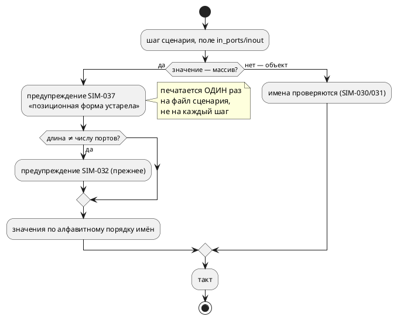

# Фича: Признание позиционной формы сценария устаревшей

- **Номер:** 0150
- **Статус:** ГОТОВО
- **Зависит от:** нет
- **Tier:** 3
- **Связанные issue (анализ):** кандидат блока 2 `FEATURES.md` (вынесено закрытием [именованные порты в сценариях симулятора](0132-sim-named-port-scenarios.md))

## Стадии жизненного цикла (правило 17)

Все стадии — **разделы этой карточки** (правило 32): «Архитектура (ADR)»,
«Анализ», «Разработка», «Тест-план», «Отчёт о тестировании», «Итог».
Отдельным артефактом остаются только исправления —
[`docs/fixes/`](../fixes/README.md) (при необходимости `0150-YY-*`).

## Краткое описание

Именованная форма сценария введена, корпус переведён, риск позиционной
задокументирован — но она по-прежнему **принимается молча**. Индекс в массиве
привязан к алфавитному месту имени порта, поэтому добавление порта тихо меняет
смысл каждого шага.

> Фича зарегистрирована из бэклога кандидатов (отобрана заказчиком 2026-07-28); далее проходит жизненный цикл по правилу 17.

## Что известно на входе

- Позиционный массив (`"in_ports": [0,0,1,…]`) принимается наравне с объектом
  `{"имя": значение}` (`json_input::PortValues`, `#[serde(untagged)]`).
- Проба при 0132: **один добавленный порт** превратил «датчик этажа 2» в
  «верхний датчик этажа 1» — шаг молча стал описывать другое событие.
- Длина массива ≠ числу портов уже даёт предупреждение `SIM-032`; сама форма —
  нет.

## Направление решения (наметка, не решение)

- Предупреждать о позиционной форме (`SIM-0xx`), либо принимать её только под
  флагом.
- **Решение о признании формы устаревшей — заказчика:** это изменение
  контракта вспомогательного файла, ломающее чужие сценарии вне репозитория.

Окончательный выбор — за стадиями **архитектуры** (ADR) и **анализа**: раздел
выше фиксирует то, что уже проверено, а не предрешает реализацию.

## Документирование (правило 24)

**Требуется.** Меняется контракт сценария симулятора и появляется диагностика —
затронут раздел документа о симуляции: описание форм задания входов и статус
позиционной.

## Архитектура (ADR)

- **Status:** Accepted
- **Date:** 2026-08-18
- **Authors:** Архитектор + аналитик (развилки — решения заказчика 2026-08-18)
- **Related issues:** [Фича](0150-sim-positional-scenario-deprecation.md);
  именованная форма и `SIM-032` — [ADR](0132-sim-named-port-scenarios.md#архитектура-adr);
  квалифицированные имена портов — [ADR](0135-sim-qualified-port-names.md#архитектура-adr);
  «пропущенный проверка зелёный, то есть неотличим от пройденного» —
  [ADR](0090-ci-precheck.md#архитектура-adr)

### Context

Сценарий симулятора задаёт значения портов двумя формами:

```json
{ "in_ports": [0, 1, 0] }                       // позиционная (историческая)
{ "in_ports": {"floor_sensor_f2_bottom": 1} }   // именованная (0132)
```

Позиционная форма привязывает значение к **месту имени в алфавитном списке**
портов модели и её под-моделей. Проба фичи: **один добавленный порт**
превратил «датчик этажа 2» в «верхний датчик этажа 1» — шаг молча стал описывать
другое событие. Именованная форма от этого защищена: несуществующее имя —
ошибка (`SIM-030`), двусмысленное — `SIM-031`.

Фича сделала три четверти работы: ввела именованную форму, перевела корпус,
записала риск в документ и в док-комментарий. Не сделано одно — **сама форма
по-прежнему принимается молча**. Предупреждение `SIM-032` существует, но говорит
о другом: о несовпадении **длины** массива с числом портов; массив верной длины
не вызывает ни звука.

#### Замер-18

Обход всех `.json` с поиском массива в полях `in_ports`/`inout`/`out`/`vars`:

| Файл | Что это |
|---|---|
| `takt-sim/tests/data/named0132/short_positional.json` | фикстура, специально проверяющая `SIM-032` |
| `book/src/18-showcase/examples/lift-sim.json` | **пример в документе** — то есть форму видел каждый читатель |

**Второй файл нашёл проверка, а не человек.** Первый — ручной — обход смотрел
`examples/`, `takt-lang/tests` и `takt-sim/tests` и дал «ровно один файл»; каталог
`book/` в него не попал. Это лучший довод в пользу решения 4 ниже: список
проверяемых мест, составленный по памяти, неполон ровно там, где не ждёшь.



### Decision Drivers

1. **Молчание — худший ответ.** Форма, способная тихо изменить смысл шага,
   обязана о себе сообщать. Это тот же принцип, по которому в языке заведены
   `SE-090`/`SE-091` и `SIM-030`.
2. **Не ломать чужое без нужды.** Сценарий — вспомогательный файл; он живёт и вне
   репозитория, в чужих проектах, куда предупреждение дойдёт, а отказ — сломает.
3. **Проверка, а не дисциплина.** Корпус переведён; удержать его переведённым должна
   машина (урок: пропущенная проверка неотличима от пройденной).
4. **Шум не должен глушить сигнал.** Предупреждение на каждый шаг длинного
   сценария (сотни строк) быстро научит его игнорировать.

### Considered Options

#### Option A. Оставить как есть

**Pros:** ноль работы.

**Cons:** обещание фичи («риск задокументирован») остаётся бумажным:
документ предупреждает, инструмент — нет. Автор узнаёт о сдвиге, когда трасса
разойдётся, а не когда напишет массив.

#### Option B. Предупреждение о форме (принято)

Новый код `SIM-037`: «позиционная форма устарела, перейдите на имена».

**Pros:**
- Контракт не ломается: чужие сценарии продолжают работать.
- Автор узнаёт сразу и видит, что делать.
- Стоимость — одна ветвь в уже существующем `resolve_values`.

**Cons:**
- Предупреждение можно игнорировать; форма остаётся в языке сценариев.

#### Option C. Предупреждение плюс флаг строгости (`--strict-scenario`)

**Pros:** CI может требовать имена, ручной прогон остаётся мягким.

**Cons:**
- Ещё один флаг и ещё один режим на сопровождении — при том что репозиторий
  уже чист, и удержать его чистым достаточно проверки, который не меняет
  поведение инструмента.
- Флаг, включённый только в CI, создаёт **два** поведения одного входа —
  ровно то, чего проект избегает.

#### Option D. Отказ сразу

**Pros:** одна форма вместо двух; никаких предупреждений.

**Cons:**
- Ломает сценарии вне репозитория без переходного периода. Форма прожила
  долго и разошлась по чужим проектам — судить о её употреблении по своему
  корпусу нельзя.

### Decision

Принимается **Option B** (решение заказчика 2026-08-18): позиционная форма
**принимается и предупреждает**.

1. **Новый код `SIM-037`** — «позиционная форма сценария устарела». Текст
   называет риск (индекс привязан к алфавитному месту имени, добавление порта
   сдвигает массив) и способ перейти (объект `{"имя": значение}`,
   квалификация `Модель::порт` при тёзках).
2. **Печатается один раз на прогон, а не на каждый шаг** (драйвер 4). Сценарий
   в сотню шагов иначе даёт сотню одинаковых строк, и следующее — настоящее —
   предупреждение потеряется.
3. **`SIM-032` сохраняется** и остаётся отдельным: он о **длине**, а не о форме.
   Слить их значило бы потерять различие «форма устарела» и «массив не той
   длины».
4. **Проверка предкоммита** (решение заказчика): в репозитории не должно быть
   позиционных сценариев, кроме **названного** исключения —
   `takt-sim/tests/data/named0132/short_positional.json`, который проверяет
   `SIM-032` и обязан остаться позиционным. Список исключений — с ратчетом, по
   образцу `scripts/module-size-baseline.txt`: запись, которой не соответствует
   ни один позиционный файл, валит проверка.
5. **Отказ не вводится** ни сейчас, ни флагом. Если понадобится — это отдельная
   фича с переходным периодом, и она будет опираться на то, что предупреждение
   к тому времени отработало.

### Consequences

#### Положительные

- Инструмент говорит то же, что документ: форма опасна и устарела.
- Репозиторий удерживается на именованной форме машиной, а не памятью.
- Контракт вспомогательного файла не сломан — чужие сценарии работают.

#### Отрицательные / Action items

- Предупреждение можно игнорировать: форма остаётся принимаемой. Это цена
  выбора B, и она названа.
- Нужен раздел документа: формы задания входов и статус позиционной
  (правило 24).
- Нужна запись в приложении «Ошибки и предупреждения» (`SIM-037`) и в реестре
  кодов — иначе проверка кодов покраснеет.
- Фикстура-исключение обязана быть **названа** в проверке с причиной, иначе первый
  же чистильщик её «починит», и контроль `SIM-032` останется без входа.

#### Acceptance criteria

1. Позиционный массив в `in_ports`/`inout` (и в `guard`) даёт `SIM-037`
   **один раз за прогон**, независимо от числа шагов.
2. Именованная форма не даёт ни одного нового предупреждения.
3. `SIM-032` работает как прежде и не поглощён новым кодом.
4. Проверка предкоммита падает, если в репозитории появился позиционный сценарий вне
   списка исключений; список — с ратчетом (устаревшая запись валит проверка).
5. Код `SIM-037` описан в приложении документа и проходит проверка кодов.
6. Раздел документа о сценариях называет статус позиционной формы.

## Анализ

### Цель и контекст

ADR принял **Option B** (решения заказчика 2026-08-18): позиционная форма
принимается, но даёт новое предупреждение `SIM-037` — один раз за прогон, — а
репозиторий удерживается на именованной форме проверкой предкоммита со списком
названных исключений.

### Зависимости фичи (правило 17/19)

- **Зависит от:** нет. Опирается на закрытые 0132 (именованная форма, `SIM-032`)
  и 0135 (квалифицированные имена).
- **Влияние на порядок:** ничего не разблокирует.

### Замер-18

| Что | Значение |
|---|---|
| Позиционных сценариев в репозитории | **2**: фикстура `SIM-032` (`takt-sim/tests/data/named0132/short_positional.json`) и **пример документа** `book/src/18-showcase/examples/lift-sim.json` |
| Кто нашёл второй | **проверка**, не человек: ручной обход не смотрел `book/` |
| Мест разбора формы | одно — `runner.rs::resolve_values` (обе формы, обе ветви) |
| Свободный код диагностики | `SIM-037` (заняты по `SIM-036`) |

### Требования и проверяемые условия

- **R1. Предупреждение печатается один раз за прогон.** Сценарий из сотни шагов
  не должен давать сотню одинаковых строк: шум глушит сигнал, а следующее —
  настоящее — предупреждение потеряется среди повторов.
- **R2. `SIM-032` не поглощён.** Он о **длине** массива, `SIM-037` — о **форме**.
  Вход «массив неверной длины» обязан давать оба.
- **R3. Именованная форма молчит.** Ни одного нового предупреждения на объекте.
- **R4. Форма по-прежнему работает.** Значения раскладываются по алфавитному
  порядку имён, как раньше: фича вводит диагностику, а не меняет поведение.
- **R5. Проверка с ратчетом.** Список исключений — файлы, которым позиционная форма
  нужна по существу. Запись, которой не соответствует ни один позиционный файл,
  **валит** проверка: иначе список превращается в свалку разрешений.
- **R6a. Пример документа переведён на имена, трасса не изменилась.** Перевод
  сверяется прогоном до и после: разница обязана быть ровно в исчезнувшем
  предупреждении.
- **R6. Код зарегистрирован.** `SIM-037` в `docs/diagnostics/README.md` и в
  приложении документа — иначе `check-diagnostic-codes.sh` покраснеет.

### Критерии приёмки и способ проверки

| # | Критерий | Способ проверки |
|---|---|---|
| A1 | Позиционный вход даёт `SIM-037` ровно один раз | тест на сценарии из нескольких шагов |
| A2 | Именованный вход не даёт `SIM-037` | тест |
| A3 | `SIM-032` жив и независим | тест на массиве неверной длины: обе диагностики |
| A4 | Поведение не изменилось | существующие тесты сценариев зелёные |
| A5 | Проверка ловит новый позиционный файл | самопроверка проверки (ловушка) |
| A6 | Проверка ловит устаревшую запись исключения | самопроверка проверки |
| A7 | Код зарегистрирован | `check-diagnostic-codes.sh`, приложение документа |
| A8 | Документ описывает статус формы | раздел о сценариях (правило 24) |

### Особенности по обратной функциональности

- **Язык не затронут** (правило 22): сценарий — вспомогательный файл симулятора,
  не программа на Takt. Версия языка прежняя; версия крейта `takt-sim` растёт
  (новая наблюдаемая диагностика).
- **Правило 29:** LSP и плагины сценарии не читают — правок нет.
- **Наблюдаемое изменение одно:** прогон позиционного сценария печатает строку
  предупреждения. Поведение самого прогона прежнее.

### Риски и границы

- **Риск: предупреждение зашумит вывод.** Снимается R1 (один раз за прогон) и
  проверяется тестом на многошаговом сценарии.
- **Риск: список исключений станет свалкой.** Снимается ратчетом (R5) и тем, что
  запись обязана нести причину.
- **Граница: чужие сценарии вне репозитория проверка не видит** — на них действует
  только предупреждение. Это и есть смысл выбора B: контракт не ломается.
- **Граница: `guard` с позиционными значениями** (`"out": [0]`) — та же форма и
  тот же риск; предупреждение обязано покрывать и её, иначе правило действует
  через раз.

## Разработка

### Задача

#### Что было

Позиционная форма (`"in_ports": [0, 1, 0]`) принималась молча. Предупреждение
`SIM-032` говорило лишь о несовпадении **длины** массива с числом портов; массив
верной длины не вызывал ни звука, хотя индекс привязан к алфавитному месту имени
и добавление порта молча меняет смысл шага.

#### Что сделано

- **`SIM-037`** (`takt-sim/src/runner.rs::warn_positional_form_once`): позиционная
  форма принимается и предупреждает. Печатается **один раз за прогон** — состояние
  держит `Cell<bool>`, потому что разбор значений идёт по `&self`.
  Текст называет риск и способ перейти на имена (включая `Модель::порт`).
- **Код — отдельным литералом `const CODE`,** а не внутри текста сообщения:
  проверка `check-diagnostic-codes.sh` ищет коды именно строковыми литералами, и
  вплавленный в текст код для него невидим. Благодаря этому `SIM-037` попал в
  `docs/diagnostics/README.md` и находится под присмотром проверки (соседи
  `SIM-030`…`SIM-032` — нет; вынесено кандидатом).
- **Проверка `scripts/check-positional-scenarios.py`** с самопроверкой и ратчетом:
  позиционных сценариев в репозитории быть не должно, кроме названной фикстуры
  контроля `SIM-032`. Устаревшая запись исключения валит проверка.
- **Пример документа переведён на имена** — `book/src/18-showcase/examples/lift-sim.json`.

#### Проверки

```sh
cargo test --test sim named_port_scenario   # 15 тестов, зелено
python3 scripts/check-positional-scenarios.py
scripts/check-diagnostic-codes.sh
./scripts/precheck.sh
```

**Второй позиционный файл нашёл проверка, а не человек.** Ручной обход при
подготовке ADR смотрел `examples/`, `takt-lang/tests`, `takt-sim/tests` — и дал
«ровно один файл». Каталог `book/` в список не попал, а именно там лежал
`lift-sim.json`: форму видел каждый читатель документа. Замер в ADR и анализе
поправлен по факту.

**Перевод примера сверен трассой:** прогон до и после правки отличается ровно
одной строкой — исчезнувшим предупреждением `SIM-037`; сама трасса совпала
байт-в-байт.

## Тест-план

### Область и цель

Проверяется поведение инструмента (новая диагностика, прежняя работа формы) и
удержание репозитория на именованной форме проверкой. Требования — R1…R6 анализа.

### Проверки (условие → ожидаемый результат)

| # | Проверка | Предусловие | Ожидаемый результат | Ссылка на R/A |
|---|---|---|---|---|
| T1 | Предупреждение один раз | сценарий из 4 позиционных шагов | ровно одно вхождение `SIM-037`, прогон успешен | R1 / A1 |
| T2 | Именованная форма молчит | `named.json` | `SIM-037` отсутствует | R3 / A2 |
| T3 | `SIM-032` независим | массив неверной длины | печатаются **оба** кода | R2 / A3 |
| T4 | Поведение не изменилось | существующие тесты сценариев | зелёные | R4 / A4 |
| T5 | Пример документа переведён | `lift-sim.json` | именованная форма; трасса совпадает с прежней | R6a |
| T6 | Проверка ловит новый позиционный файл | самопроверка проверки | 4 класса ловятся | R5 / A5 |
| T7 | Проверка ловит законные формы как законные | самопроверка проверки | 3 законные формы не ловятся | R5 / A5 |
| T8 | Ратчет: устаревшая запись валит проверка | запись без файла | отказ с причиной | R5 / A6 |
| T9 | Код зарегистрирован | `check-diagnostic-codes.sh` | зелёный, `SIM-037` учтён | R6 / A7 |
| T10 | Документ описывает статус формы | раздел «Инструментарий» | «форма устарела», код назван | A8 |
| T11 | Предкоммит | `./scripts/precheck.sh` | зелёный | правило 5 |

### Разбивка проверок по функциональности

| Функциональность | Статус | Примечание |
|---|---|---|
| Симулятор (`runner.rs`) | ✅ | новая диагностика |
| Проверка репозитория | ✅ | с самопроверкой и ратчетом |
| Документ и реестр диагностик | ✅ | `SIM-037` |
| Язык, генераторы, LSP | — | не затронуты |

<!-- Легенда: ✅ пройдено · ❌ провалено · ⬜ не проверялось · — не применимо -->

### Тестовые данные и окружение

- `takt-sim/tests/data/named0132/`: `panel.takt`, `named.json`,
  `short_positional.json` (контроль `SIM-032`), **новый**
  `positional_multi_step.json` (четыре шага — для счёта предупреждений).
- Набор — `takt-sim/tests/sim/named_port_scenario_tests.rs`.

## Отчёт о тестировании

### Резюме

Все проверки пройдены; фича готова к закрытию. Позиционная форма принимается и
предупреждает (`SIM-037`, один раз за прогон), репозиторий удерживается на
именованной форме проверкой с ратчетом.

### Фактические результаты по проверкам

| # | Проверка | Результат | Комментарий |
|---|---|---|---|
| T1 | Предупреждение один раз | ✅ | 4 шага → ровно одно `SIM-037` |
| T2 | Именованная форма молчит | ✅ | — |
| T3 | `SIM-032` независим | ✅ | на коротком массиве печатаются оба |
| T4 | Поведение не изменилось | ✅ | 15 тестов набора зелёные |
| T5 | Пример документа переведён | ✅ | трасса совпала байт-в-байт; ушло только предупреждение |
| T6 | Проверка ловит нарушения | ✅ | самопроверка: 4 класса |
| T7 | Законные формы не ловятся | ✅ | самопроверка: 3 формы |
| T8 | Ратчет | ✅ | устаревшая запись даёт отказ с причиной |
| T9 | Код зарегистрирован | ✅ | `SIM  → 037` в проверке кодов |
| T10 | Документ | ✅ | «Форма устарела», `SIM-037` назван |
| T11 | Предкоммит | ✅ | зелёный |

### Результаты по функциональности

| Функциональность | Статус |
|---|---|
| Симулятор | ✅ |
| Проверка репозитория | ✅ |
| Документ, реестр диагностик | ✅ |
| Язык, генераторы, LSP | — |

### Выводы и дальнейшие шаги

1. **Проверка оправдал себя в первый же прогон.** Ручной обход при подготовке ADR
   дал «ровно один позиционный файл»; проверка нашёл **второй** — пример в
   документе (`book/src/18-showcase/examples/lift-sim.json`), то есть форму,
   которую видел каждый читатель. Список мест, составленный по памяти, неполон
   именно там, где не ждёшь.
2. **Код диагностики пришлось эмитить литералом.** Проверка `check-diagnostic-codes.sh`
   ищет коды как `"XX-NNN"`; код, вплавленный в текст сообщения, для него
   невидим. Отсюда `const CODE: &str = "SIM-037"` — и запись в реестре.
3. **Исправлений (`docs/fixes/`) не требуется.**
4. **Кандидат, вынесенный из фичи:** `SIM-030`…`SIM-032` печатаются строкой,
   проверке невидимы и в реестре диагностик отсутствуют вовсе. Записан в
   `FEATURES.md`.

## Итог (что сделано)

Позиционная форма сценария **принимается и предупреждает**: новый код
`SIM-037`, печатается **один раз за прогон** (на каждый шаг это была бы стена
одинаковых строк, глушащая следующее — настоящее — предупреждение). Отказ не
вводился: сценарий живёт и вне репозитория, и ломать чужие файлы без
переходного периода нельзя (решение заказчика 2026-08-18). `SIM-032` сохранён и
независим — он о **длине** массива, `SIM-037` о **форме**; вход, где верно и то
и другое, даёт оба.

Репозиторий удерживает проверка `scripts/check-positional-scenarios.py` — с
самопроверкой (4 класса нарушений ловятся, 3 законные формы — нет) и
**ратчетом**: запись исключения, которой не соответствует ни один позиционный
файл, валит проверка. Единственное исключение названо с причиной — фикстура контроля
`SIM-032`, которую именованной формой не выразить.

**Проверка оправдал себя в первый же прогон.** Ручной обход при подготовке ADR
смотрел `examples/`, `takt-lang/tests` и `takt-sim/tests` и дал «ровно один
позиционный файл». Проверка нашёл **второй** — пример в документе
(`book/src/18-showcase/examples/lift-sim.json`): устаревшую форму видел каждый
читатель. Пример переведён на имена, трасса прогона совпала байт-в-байт
(единственная разница — исчезнувшее предупреждение).

**Код диагностики пришлось эмитить отдельным литералом** (`const CODE: &str =
"SIM-037"`): гейт `check-diagnostic-codes.sh` ищет коды как `"XX-NNN"`, и код,
вплавленный в текст сообщения, ему невидим. Именно поэтому соседи
`SIM-030`…`SIM-032` отсутствуют в реестре диагностик вовсе — вынесено
кандидатом.

Артефакты: [ADR](0150-sim-positional-scenario-deprecation.md#архитектура-adr) ·
[анализ](0150-sim-positional-scenario-deprecation.md#анализ) ·
[признание позиционной формы сценария устаревшей](0150-sim-positional-scenario-deprecation.md#разработка) ·
[тест-план](0150-sim-positional-scenario-deprecation.md#тест-план) ·
[отчёт](0150-sim-positional-scenario-deprecation.md#отчёт-о-тестировании).
