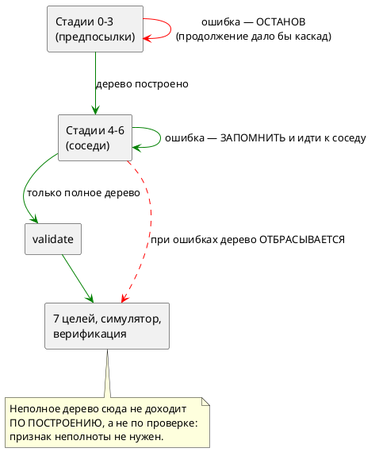

# Фича: Восстановление на границе элемента в стадиях построения

- **Номер:** 0152
- **Статус:** ГОТОВО
- **Зависит от:** нет
- **Tier:** 3
- **Связанные issue (анализ):** кандидат блока 2 `FEATURES.md` (вынесено закрытием [накопление семантических диагностик (несколько ошибок за прогон)](0130-diagnostics-batch.md), Option C ADR)

## Стадии жизненного цикла (правило 17)

Все стадии — **разделы этой карточки** (правило 32): «Архитектура (ADR)»,
«Анализ», «Разработка», «Тест-план», «Отчёт о тестировании», «Итог».
Отдельным артефактом остаются только исправления —
[`docs/fixes/`](../fixes/README.md) (при необходимости `0152-YY-*`).

## Краткое описание

Стадии построения дерева 0–6 остаются терминальными: две ошибки в телах разных
блоков показываются по очереди. Снятие требует сперва ответить, что такое
**частично построенная модель**, — сегодня инвариант простой: модель либо
построена, либо ошибка.

> Фича зарегистрирована из бэклога кандидатов (отобрана заказчиком 2026-07-28); далее проходит жизненный цикл по правилу 17.

## Что известно на входе

- `stages::construct_stages` (стадии 0–6) прекращает работу на первой ошибке —
  это **сознательное** решение ADR (Option C отложен), а не недосмотр.
- Обоснование: после ошибки дерево неполно, и продолжение даёт сообщения о
  **следствиях**, а не о причинах.
- Потребители построенного дерева — генераторы (7 целей), симулятор и
  верификация; все сегодня полагаются на полноту.

## Направление решения (наметка, не решение)

- Ввести восстановление на границе элемента модели/состояния — но **только**
  после ответа на вопрос: что вправе делать генератор, симулятор и верификация с
  частично построенной моделью.
- Вероятная форма ответа: признак «модель неполна» + запрет кодогенерации при
  нём (диагностики выдаются, артефакты — нет).

Окончательный выбор — за стадиями **архитектуры** (ADR) и **анализа**: раздел
выше фиксирует то, что уже проверено, а не предрешает реализацию.

## Документирование (правило 24)

**Требуется.** Меняется наблюдаемое поведение компилятора при ошибках —
затронут раздел документа о диагностиках: сколько ошибок автор видит за прогон и
что при этом порождается.

## Архитектура (ADR)

- **Status:** Accepted
- **Date:** 2026-08-04
- **Authors:** Архитектор + Заказчик (решения по объёму и судьбе неполного дерева — 2026-08-04)
- **Related issues:** [Фича](0152-semantic-recovery-element-boundary.md); прямое продолжение [ADR](0130-diagnostics-batch.md#архитектура-adr) (Option C, отложен); смежные — [фича](0155-semantic-nested-statement-resolution.md) (нельзя глотать ошибку разрешения оператора), [фича](0151-diagnostics-batch-within-check.md) (накопление внутри отдельной проверки `validate`)

### Context

Диагностики компилятора накапливаются **не везде**. Замер на файлах-зондах:

| Слой | Две независимые ошибки дают |
|---|---|
| Лексер и разбор | **2** диагностики |
| Стадии построения дерева 0–6 | **1** — терминально |
| Проверки `validate` | **2** диагностики |

То есть терминальный слой лежит **между** двумя накапливающими. Автор большой
модели правит ошибки в телах по одной, перезапуская компилятор на каждую, —
хотя и до, и после этого слоя инструмент показывает всё сразу.

Терминальность — **сознательное** решение ADR (Option C отложен), а не
недосмотр. Обоснование записано так: после ошибки дерево неполно, и продолжение
даёт сообщения о **следствиях**, а не о причинах.

#### Что показала проба

Довод 0130 проверен пробой, а не принят на веру. В `construct_model_stage4`
временно заведено накопление по соседним состояниям; вход — модель с двумя
независимыми ошибками в телах разных состояний:

```takt
model M {
    var ok: u8 := 0;
    start S { always { ok := nope1 + 1; } ref T: ok > 0; }
    state T { always { ok := nope2 + 2; } }
}
```

Результат:

```
[ПРОБА 0152] Ошибка компиляции [SE-003]: Идентификатор 'nope1' не найден в области видимости
[ПРОБА 0152] Ошибка компиляции [SE-003]: Идентификатор 'nope2' не найден в области видимости
```

**Обе диагностики — самостоятельные причины.** Каждая называет своё
неопределённое имя; ни одна не является следствием другой. То есть довод
«продолжение даёт следствия» для **соседних** элементов внутри стадии не
выполняется.

Он выполняется для **другого** случая: ошибка в объявлении (`var x:
nosuchtype`) делает следствием всякое обращение к `x` в телах. Здесь
продолжение действительно дало бы лавину сообщений о следствиях.

Отсюда граница, которую эта фича и проводит:

> **Накопление безопасно там, где элементы — соседи. Оно опасно там, где один
> элемент — предпосылка другого.**

| Стадия | Что строит | Соседи или предпосылки |
|---|---|---|
| 0 | имена моделей и состояний, импорты | **предпосылка** для всего |
| 1 | составные состояния | **предпосылка** |
| 2 | переменные, типы, порты | **предпосылка** для тел |
| 3 | именованные условия `cond` | **предпосылка** для рёбер |
| **4** | именованные блоки (`enter`/`exit`/`always`) | **соседи** — от блока не зависит никто |
| **5** | тела функций | соседи, но **связаны графом вызовов** |
| **6** | условия рёбер `ref` | **соседи** |

#### Побочная находка пробы

Докблок `construct_model_stage4` утверждает: «При ошибке разрешения оператор
сохраняется в виде `StatementNode::Unresolved` (ошибка не пробрасывается)». Это
**неверно уже сейчас**: `resolve_named_blocks` пробрасывает `?`, а описанное
поведение было изъято фичей — именно потому, что цель `c` печатает
`Unresolved` **пустотой**, а симулятор его пропускает: терялась не диагностика,
а **сам оператор**. Комментарий описывает мир до 0155 и подлежит правке.

#### Что такое «частично построенная модель»

Главный вопрос карточки. Ответ, принятый здесь: **её не существует за границей
построения**.

Неполное дерево живёт ровно столько, сколько нужно, чтобы обойти оставшихся
соседей и собрать их диагностики, после чего **отбрасывается**, а наружу идёт
`Err(Vec<Diagnostic>)`. Потребители — семь целей, симулятор и верификация —
неполного дерева не видят **никогда**, и менять их не требуется.

Это тот же приём, которым проект пользуется в 0143, 0187, 0192 и 0199: за
границей слоя формы не существует, и потребителям **не по чему разойтись**.
Он строже варианта «признак неполноты + проверка у каждого потребителя»: там
гарантия держится на дисциплине девяти потребителей, здесь — на построении.



### Decision Drivers

1. **Замер важнее довода.** Проба показала: у соседних элементов вторая
   диагностика — причина, а не следствие. Довод 0130 остаётся верным там, где
   элементы связаны предпосылкой.
2. **Терминальный слой между двумя накапливающими — несогласованность**,
   заметная пользователю.
3. **Неполное дерево не должно существовать за границей построения.** Цена
   нарушения известна и измерена фичей: цель `c` печатает нерешённый
   оператор **пустотой**, симулятор пропускает — теряется не диагностика, а
   поведение.
4. **Публичный API менять незачем.** `construct_model_with_files` по контракту
   отдаёт первую ошибку; менять его сигнатуру значило бы задеть `takt-sim` и
   тесты ради потребителей, которым нужна первая ошибка.
5. **Каскады не гасить, а не порождать.** Подавление повторов, отравленные
   имена и прочая машинерия не нужны, если накопление не переходит границу
   «сосед → предпосылка».

### Considered Options

#### Option A. Накопление в стадиях 4–6; неполное дерево не покидает построение

Стадии 4, 5, 6 обходят **всех** соседей, собирая диагностики; стадии 0–3
остаются терминальными. `construct_stages` возвращает `Err(Vec<Diagnostic>)` и
отбрасывает дерево.

**Pros:**
- Даёт практическую пользу там, где она измерена: тела блоков, функций и рёбер.
- Каскадов не порождает **по построению** — граница проведена по природе
  элементов, а не по эвристике подавления.
- Потребителей не трогает: неполное дерево до них не доходит.
- Публичный API неизменен; `construct_model_with_files` продолжает отдавать
  первую ошибку.
- Признак «модель неполна» **не нужен**: гарантия сильнее проверки.

**Cons:**
- Ошибки стадий 0–3 по-прежнему показываются по одной — несогласованность
  сужается, но не исчезает.
- Стадия 5 связана графом вызовов: после ошибки в теле `f` тело `g`, зовущего
  `f`, может дать следствие. Требует отдельного решения (см. «Decision»).

#### Option B. Накопление во всех стадиях 0–6

**Pros:**
- Единообразие: все слои накапливают.

**Cons:**
- Порождает **лавину следствий**: ошибка в объявлении переменной или типа даёт
  сообщение на каждое её упоминание. Зависимость тел от объявлений прямая.
- Требует машинерии подавления каскадов (отравленные имена, дедупликация по
  причине) — то есть заводит вторую сложную подсистему ради слоя, где польза
  сомнительна.
- Ошибка стадии 0 (имена, импорты) делает неполной **таблицу**, по которой
  строится всё остальное: дальнейшие сообщения не про исходник автора.

#### Option C. Статус-кво

**Pros:**
- Ничего не ломает.

**Cons:**
- Оставляет измеренную несогласованность и измеренную же пользу
  неиспользованной: две независимые ошибки в телах показываются по одной.

### Decision

Принимается **Option A** — рекомендация архитектора и решение заказчика
(2026-08-04) совпали. Заказчиком отдельно решено: неполная модель не должна
давать порождённых артефактов.

**Форма исполнения этого решения — сильнее буквы.** Заказчик выбрал «признак
неполноты + запрет кодогенерации»; здесь запрет достигается тем, что неполное
дерево **не покидает** `construct_stages`. Признак не заводится: он был бы
проверкой, которую девять потребителей обязаны помнить, тогда как отсутствие
дерева — гарантия по построению. Требование заказчика («артефактов при неполной
модели нет») выполняется строго.

**Стадия 5 накапливает по вершинам графа вызовов, но останавливает обход ветви.**
Функции — соседи лишь частично: `g`, зовущая упавшую `f`, даст следствие.
Поэтому ошибка в теле `f` **исключает из обхода** функции, транзитивно
зависящие от `f`; независимые ветви графа продолжают разрешаться. Так
накопление остаётся в границе «соседи».

Стадии 0–3 остаются **терминальными**; это решение ADR подтверждается, а
не отменяется, и его обоснование уточняется: оно верно для предпосылок.

### Consequences

#### Положительные

- Автор видит **все** ошибки тел за один прогон.
- Несогласованность «парсер накапливает, `validate` накапливает, а середина —
  нет» сужается до стадий, где терминальность обоснована.
- Обоснование 0130 становится точным: не «после ошибки продолжать нельзя», а
  «нельзя продолжать через предпосылку».
- Потребители дерева не задеты; публичный API неизменен.

#### Отрицательные / Action items

- Ошибки стадий 0–3 по-прежнему по одной. Это **осознанный** остаток; он
  фиксируется в документе, чтобы не читаться как недоделка.
- `construct_stages` меняет тип ошибки на `Vec<Diagnostic>`; два вызывающих
  (`pipeline`, `lsp/diagnostics`) правятся, третий
  (`construct_model_with_files`) берёт первую и сохраняет контракт.
- Диагностики обязаны пройти `diagnostics::normalize` — порядок по позиции и
  дедупликация; иначе порядок обхода `BTreeMap` станет наблюдаемым.
- Правило 24: раздел документа о диагностике получает описание того, сколько
  ошибок автор видит за прогон и что при этом порождается.
- Стадия 4 несёт **устаревший** докблок (описывает поведение до 0155) — правится
  здесь же.

#### Поправка замером: стадия 6 наблюдаемой пользы не даёт

Первая редакция этого ADR относила к стадии 6 «условия рёбер `ref`». Замер
показал, что это **неверно**, и обе ошибки такого рода приходят не оттуда:

| Что писал автор | Кто на самом деле отвергает | Накапливается? |
|---|---|---|
| `ref Nowhere;` — цель ребра не существует | **стадия 0** (`construct_states`, `SE-002`) | нет — стадия предпосылок |
| `ref T: qqq > 0;` — имя в условии не найдено | **`validate`** (`SE-025`) | да, но это другой слой |

Стадия 6 (`resolve_state_references`) на этих входах не отказывает вовсе.
Накопление в ней **оставлено** — оно единообразно с соседями и ничего не стоит,
— но заявлять по нему наблюдаемую пользу нельзя, и критерий приёмки исправлен.

Побочно замер вскрыл, что `validate` на двух неразрешённых условиях в разных
состояниях выдаёт **одну** диагностику, хотя слой заявлен накапливающим. Это
territory фичи [накопление диагностик внутри отдельной проверки `validate`](0151-diagnostics-batch-within-check.md);
записано кандидатом, в объём 0152 не берётся.

И там же: текст `SE-025` содержит `Debug`-дамп узла АСД
(`Variable(Identifier { loc: Source(0, 51, 54), name: "qqq" })`) — тот же класс,
что закрыла [taktc fmt печатает синтаксическую ошибку Debug-дампом](0202-fmt-diagnostic-formatting.md), но в другом
месте. Тоже кандидат.

#### Вне области

- Накопление в стадиях 0–3 (Option B) — отвергнуто по существу, не отложено.
- Накопление **внутри** отдельной проверки `validate` — это фича
  [накопление диагностик внутри отдельной проверки `validate`](0151-diagnostics-batch-within-check.md), другой слой.

#### Acceptance criteria

1. Две независимые ошибки в телах **разных** состояний дают **две**
   диагностики за прогон.
2. То же для двух тел функций.
3. Ошибка в объявлении (стадия 2) по-прежнему даёт **одну** диагностику —
   каскада нет.
4. При ошибках построения **порождённых артефактов нет**: каталог вывода не
   создаётся либо остаётся пуст.
5. Диагностики упорядочены по позиции и не дублируются.
6. `construct_model_with_files` по-прежнему отдаёт **одну** диагностику
   (контракт публичного API не изменён).
7. Ошибка в теле функции `f` не порождает диагностику в теле `g`, зовущей `f`.
8. `./scripts/precheck.sh` — код возврата 0.

## Анализ

### Цель и контекст

ADR принял **Option A**: накопление **внутри** стадий 4–6, терминальность
**между** стадиями и в стадиях 0–3. Неполное дерево не покидает
`construct_stages`.

Существо решения — граница «соседи ↔ предпосылки», проведённая замером, а не
вкусом: у соседних элементов вторая диагностика есть самостоятельная причина,
у зависимых — следствие.

### Зависимости фичи (правило 17/19)

- **Зависит от:** `нет`.
- **Влияние на порядок:** ничего не разблокирует.
  [накопление диагностик внутри отдельной проверки `validate`](0151-diagnostics-batch-within-check.md) (накопление внутри
  отдельной проверки `validate`) — соседний слой, не зависимость.

### Места правки

| Файл | Что |
|---|---|
| `takt-lang/src/semantic/tree.rs` | стадии 4, 5, 6 → `Result<_, Vec<Diagnostic>>` с накоплением; `construct_model_with_files` и `construct_model_impl` берут первую |
| `takt-lang/src/semantic/stages.rs` | `construct_stages` → `Vec<Diagnostic>`; стадии 0–3 оборачивают одну |
| `takt-lang/src/pipeline.rs` | печать всех диагностик через `normalize` |
| `takt-lang/src/lsp/diagnostics.rs` | то же для редактора |
| `book/src/16-diagnostics/index.typ` | сколько ошибок видно за прогон и что порождается |

### Ограничения, определяющие форму

**О1. Накопление — внутри стадии, не между.** Выход стадии 5 (разрешённые
функции) есть предпосылка для стадии 4 (тела блоков зовут функции), выход 4 —
для 6. Слить накопления значило бы выпустить каскад.

**О2. Упавший элемент кладётся обратно неразрешённым.** Иначе обход сожмётся и
соседи не будут просмотрены. Дерево при этом отбрасывается вызывающим.

**О3. `normalize` обязателен.** Обход идёт по `BTreeMap` (алфавит имён): без
сортировки по позиции порядок вывода стал бы наблюдаемым свойством **имён**
состояний. Контроль — тест `diagnostics_are_ordered_by_position` на состоянии
`Zeta`, объявленном раньше `Alpha`.

**О4. Публичный API не меняется.** `construct_model_with_files` отдаёт первую
диагностику; менять сигнатуру ради `takt-sim` и тестов незачем.

**О5. Стадия 5 гасит зависимых по графу вызовов.** Топологический порядок даёт
транзитивность бесплатно: к разбору `g` её `f` уже помечена упавшей.

### Требования и проверяемые условия

- **R1.** Две ошибки в телах разных состояний → две диагностики.
- **R2.** Две ошибки в телах разных функций → две диагностики.
- **R3.** Ошибка стадии 2 → одна диагностика (каскада нет).
- **R4.** При ошибках построения артефактов нет.
- **R5.** Диагностики упорядочены по позиции, не по алфавиту имён.
- **R6.** `construct_model_with_files` отдаёт одну диагностику.
- **R7.** `g`, зовущая упавшую `f`, следствия не порождает.

### Критерии приёмки и способ проверки

| # | Критерий | Способ |
|---|---|---|
| A1–A2 | R1, R2 | прогон `taktc`, счёт строк диагностики |
| A3 | R3 | то же на входе с зависимостью тела от объявления |
| A4 | R4 | счёт файлов в каталоге вывода |
| A5 | R5 | состояние `Zeta` объявлено раньше `Alpha` |
| A6 | R6 | прямой вызов публичного входа |
| A7 | R7 | `g` вызывает упавшую `f` |
| A8 | предкоммит | `./scripts/precheck.sh` — код 0 |

### Особенности по обратной функциональности (правило 11)

**Слома нет.** Меняется только **число** показанных диагностик; отказ остаётся
отказом, коды прежние, артефакты не порождались и не порождаются. Публичный API
неизменен, поэтому версия крейта не поднимается.

Версия **языка** не меняется: синтаксис и семантика те же.

### Документирование (правило 24)

**Требуется** — `book/src/16-diagnostics/`: подраздел «Сколько ошибок видно за
прогон» (независимые показываются вместе; та, от которой зависят остальные, —
одна; порождённого кода при ошибке нет).

### Редакторский слой (правило 29)

| Слой | Вердикт |
|---|---|
| LSP `lsp/diagnostics.rs` | правится: редактор подчёркивает все ошибки тел сразу |
| Плагины IntelliJ / Zed | **правок не требуют** — диагностику берут у сервера |

Лексика, синтаксис и семантика не меняются.

### Риски

- **Р1. Каскад из-за слияния накоплений между стадиями.** Снижение — О1 и тест
  `declaration_stage_stays_terminal`.
- **Р2. Порядок вывода станет зависеть от имён.** Снижение — О3 и тест на
  `Zeta`/`Alpha`.
- **Р3. Неполное дерево утечёт к потребителям.** Снижение — оно не покидает
  `construct_stages`; тест `no_artifacts_when_stages_fail`.

## Разработка

### Задача

#### Что было

Стадии построения 0–6 были терминальны целиком: каждая возвращала
`Result<_, Diagnostic>` и падала на первой ошибке. Две независимые ошибки в
телах разных состояний показывались по одной, хотя лексер с разбором и проверки
`validate` уже накапливали — терминальный слой лежал **между** двумя
накапливающими.

#### Что сделано

Стадии 4, 5 и 6 возвращают `Result<_, Vec<Diagnostic>>` и обходят **всех**
соседей, складывая диагностики. Упавший элемент кладётся в дерево
неразрешённым — иначе обход сожмётся и следующие соседи не будут просмотрены.

`construct_stages` тоже отдаёт список; стадии 0–3 оборачивают свою единственную
диагностику. Между стадиями `?` **сохранён**: выход стадии 5 — предпосылка
для 4, выход 4 — для 6.

**Неполное дерево наружу не выходит.** При непустом списке ошибок
`construct_stages` отдаёт `Err` и дерево отбрасывается. Признак «модель неполна»
не заводится: отсутствие дерева — гарантия сильнее проверки, которую девять
потребителей обязаны помнить.

**Стадия 5 гасит зависимых по графу вызовов.** Ошибка в теле `f` исключает из
обхода функции, транзитивно зависящие от `f`; топологический порядок даёт
транзитивность бесплатно. Иначе `g`, зовущая `f`, дала бы «функция не найдена» —
следствие.

**Публичный API не тронут.** `construct_model_with_files` берёт первую
диагностику после `normalize` и сохраняет контракт; `takt-sim` и тесты не
задеты.

#### Что вскрыла работа

**Докблок стадии 4 был устаревшим.** Он утверждал: «При ошибке разрешения
оператор сохраняется в виде `StatementNode::Unresolved` (ошибка не
пробрасывается)» — поведение, изъятое фичей именно потому, что цель `c`
печатает `Unresolved` пустотой, а симулятор пропускает: терялась не
диагностика, а сам оператор. Комментарий переписан.

**Порядок стадий описан в двух местах.** `stages.rs` заявляет, что описывает
его «один раз», но `tree.rs::construct_model_impl` (путь **импорта**) несёт
вторую копию последовательности 0→1→2→3→5→4→6. Здесь она приведена в
соответствие; сведение копий — отдельная работа, записана кандидатом.

**Стадия 6 наблюдаемой пользы не дала.** Замер показал, что цели рёбер
разрешает стадия 0 (`SE-002`), а неразрешённые условия — `validate` (`SE-025`);
на этих входах стадия 6 не отказывает вовсе. Накопление в ней оставлено ради
единообразия, но критерий приёмки исправлен — заявлять по нему пользу нельзя.

#### Проверки

- `takt-lang/tests/semantic/stage_recovery_tests.rs` — 7 тестов, прогон бинаря `taktc`.
- `./scripts/precheck.sh` — код возврата 0.

## Тест-план

### Область и цель

Проверяется граница «соседи ↔ предпосылки»: накопление там, где элементы
независимы, и терминальность там, где один элемент — предпосылка другого.
Требования R1…R7, критерии A1…A8 анализа.

**Проверять надо обе стороны.** Тест «две диагностики вместо одной» без
парного теста «каскада нет» принял бы и Option B, отвергнутый ADR по существу.

### Проверки (условие → ожидаемый результат)

| # | Проверка | Предусловие | Ожидаемый результат | R/A |
|---|---|---|---|---|
| T1 | Тела разных состояний | две независимые ошибки | **две** диагностики, `nope1` и `nope2` | R1/A1 |
| T2 | Тела разных функций | две независимые ошибки | **две** диагностики | R2/A2 |
| T3 | **Каскада нет** | ошибка типа в объявлении + тело, ссылающееся на переменную | **одна** диагностика `SE-034` | R3/A3 |
| T4 | Артефактов нет | ошибка в теле | каталог вывода пуст | R4/A4 |
| T5 | Порядок по позиции | `Zeta` объявлено раньше `Alpha` | сперва ошибка из `Zeta` | R5/A5 |
| T6 | Публичный вход | тот же вход, что T1 | **одна** диагностика, самая ранняя | R6/A6 |
| T7 | Зависимая функция | `g` зовёт упавшую `f` | **одна** диагностика, про `f` | R7/A7 |
| T8 | Предкоммит | — | код возврата 0 | A8 |

**T5 не косметика.** Обход идёт по `BTreeMap`, то есть по алфавиту имён; без
`normalize` порядок вывода стал бы наблюдаемым свойством того, как автор назвал
состояния.

### Разбивка проверок по функциональности

| Функциональность | T1 | T2 | T3 | T4 | T5 | T6 | T7 |
|---|---|---|---|---|---|---|---|
| Стадия 4 (блоки) | ✅ | — | ✅ | ✅ | ✅ | ✅ | — |
| Стадия 5 (функции) | — | ✅ | — | — | — | — | ✅ |
| Стадии 0–3 (предпосылки) | — | — | ✅ | — | — | — | — |
| CLI `taktc compile` | ✅ | ✅ | ✅ | ✅ | ✅ | — | ✅ |
| Публичный API | — | — | — | — | — | ✅ | — |
| LSP | — | — | — | — | — | — | — |
| Цели, симулятор, верификация | — | — | — | ✅ | — | — | — |

<!-- Легенда: ✅ пройдено · ❌ провалено · ⬜ не проверялось · — не применимо -->

LSP — «не применимо»: путь тот же (`construct_stages`), поведенческой развилки
нет; компилируемость доказывает сборка под `--all-features`.

### Тестовые данные и окружение

Все фикстуры пишутся в **уникальный по тесту** временный каталог (имя потока в
пути): тесты идут параллельно.

**Контрпримеры** — модели с двумя независимыми ошибками в телах состояний, в
телах функций, с зависимостью тела от неудавшегося объявления и с цепочкой
`g → f`.

**Пример** — корпус `examples/`: он обязан компилироваться как прежде (косвенно
проверяется предкоммитом).

**Окружение:** macOS (Darwin 25.5.0), толчейн `1.97.1`; `./scripts/precheck.sh`.

## Отчёт о тестировании

### Резюме

Проверки T1…T8 пройдены. Фича готова к закрытию (`ГОТОВО`). Исправлений
(`docs/fixes/`) не потребовалось.

Стадии 4–6 накапливают диагностики по соседям; стадии 0–3 и переходы между
стадиями остались терминальными. Неполное дерево не покидает построение,
поэтому порождённых артефактов при ошибке нет — по построению, а не по проверке.

Окружение: macOS (Darwin 25.5.0), толчейн `1.97.1`, `./scripts/precheck.sh`.

### Фактические результаты по проверкам

| # | Проверка | Результат | Комментарий |
|---|---|---|---|
| T1 | Тела разных состояний | ✅ | две диагностики: `nope1` (4:24), `nope2` (8:24) |
| T2 | Тела разных функций | ✅ | две диагностики: `aaa`, `bbb` |
| T3 | Каскада нет | ✅ | одна `SE-034`; тело, ссылающееся на переменную, молчит |
| T4 | Артефактов нет | ✅ | каталог вывода не создаётся |
| T5 | Порядок по позиции | ✅ | `Zeta` (объявлено раньше) идёт первым, несмотря на алфавит |
| T6 | Публичный вход | ✅ | одна диагностика, самая ранняя по тексту |
| T7 | Зависимая функция | ✅ | `g`, зовущая упавшую `f`, следствия не даёт |
| T8 | Предкоммит | ✅ | код возврата 0 |

### Результаты по функциональности

| Функциональность | Статус | Комментарий |
|---|---|---|
| Стадия 4 (именованные блоки) | ✅ | накапливает; основная наблюдаемая польза |
| Стадия 5 (тела функций) | ✅ | накапливает; зависимые по графу вызовов гасятся |
| Стадия 6 (ссылки состояний) | ⬜ | накопление заведено, но входа, который бы отказал именно здесь, не найдено |
| Стадии 0–3 | ✅ | остались терминальными — проверено T3 |
| CLI `taktc compile` | ✅ | все диагностики, порядок по тексту |
| Публичный API | ✅ | контракт «одна диагностика» сохранён |
| LSP | ✅ | тот же путь; собирается под `--all-features` |
| Цели, симулятор, верификация | ✅ | не задеты: неполного дерева не видят |

<!-- Легенда: ✅ пройдено · ❌ провалено · ⬜ не проверялось · — не применимо -->

### Выводы и дальнейшие шаги

1. **Довод отложенного решения проверен, а не принят на веру.** ADR
   отложил накопление доводом «продолжение даёт следствия». Проба показала, что
   довод верен **наполовину**: для соседних элементов вторая диагностика —
   самостоятельная причина. Отсюда и граница фичи: не «накапливать или нет», а
   «накапливать по соседям, не по предпосылкам».

2. **Вопрос карточки снят изменением постановки.** «Что такое частично
   построенная модель» не потребовало ответа: её **не существует** за границей
   построения. Это оказалось и проще, и строже варианта «признак неполноты +
   проверка у каждого потребителя», который выбрал заказчик по букве: там
   гарантия держится на дисциплине девяти потребителей, здесь — на построении.

3. **Заявленный критерий пришлось исправить по замеру.** Первая редакция ADR
   относила условия рёбер `ref` к стадии 6. Замер показал, что цели рёбер
   разрешает стадия **0** (`SE-002`), а неразрешённые условия — `validate`
   (`SE-025`); стадия 6 на этих входах не отказывает вовсе. Накопление в ней
   оставлено ради единообразия, критерий исправлен. Отчёт фиксирует это как
   ⬜, а не как ✅ «по аналогии».

4. **Найдено сверх объёма, записано кандидатами** (правило 28):
   - `validate` на двух неразрешённых условиях в разных состояниях выдаёт
     **одну** диагностику, хотя слой заявлен накапливающим (territory 0151);
   - текст `SE-025` содержит `Debug`-дамп узла АСД — тот же класс, что закрыла
     0202, в другом месте;
   - порядок стадий описан в **двух** местах (`stages.rs` и путь импорта
     `tree.rs::construct_model_impl`), хотя первый заявляет себя единственным;
   - докблок стадии 4 описывал поведение, изъятое фичей (исправлен здесь).

Исправления (`docs/fixes/`) не требуются.

## Итог (что сделано)

Стадии построения **4 и 5** накапливают диагностики по соседям; стадии 0–3 и
переходы **между** стадиями остались терминальными.

| Вход | Было | Стало |
|---|---|---|
| две ошибки в телах разных состояний | 1 диагностика | **2** |
| две ошибки в телах разных функций | 1 | **2** |
| ошибка в объявлении + тело, ссылающееся на него | 1 | **1** — каскада нет |
| `g` зовёт упавшую `f` | 1 | **1** — следствие погашено |

**Вопрос карточки снят изменением постановки.** «Что такое частично построенная
модель» не потребовало ответа: её **не существует** за границей построения —
неполное дерево не покидает `construct_stages`. Это строже выбранного по букве
варианта «признак неполноты + запрет кодогенерации»: там гарантия держится на
дисциплине девяти потребителей, здесь — на построении.

**Граница проведена замером.** Довод ADR («продолжение даёт следствия»)
оказался верен наполовину: для **соседей** вторая диагностика — самостоятельная
причина, для **предпосылок** — следствие.

**Критерий приёмки пришлось исправить по замеру.** Первая редакция ADR
относила условия рёбер `ref` к стадии 6; на деле цели рёбер разрешает стадия 0
(`SE-002`), а неразрешённые условия — `validate` (`SE-025`). Накопление в
стадии 6 оставлено ради единообразия, но пользы по нему не заявлено.

**Найдено сверх объёма и записано:** докблок стадии 4 описывал поведение,
изъятое фичей (исправлен здесь); порядок стадий описан в **двух** местах;
`validate` на двух неразрешённых условиях даёт одну диагностику; текст `SE-025`
содержит `Debug`-дамп узла АСД.

Детали: [ADR](0152-semantic-recovery-element-boundary.md#архитектура-adr),
[анализ](0152-semantic-recovery-element-boundary.md#анализ),
[отчёт](0152-semantic-recovery-element-boundary.md#отчёт-о-тестировании), [восстановление на границе элемента в стадиях построения](0152-semantic-recovery-element-boundary.md#разработка).
Исправлений (`docs/fixes/`) не потребовалось.
