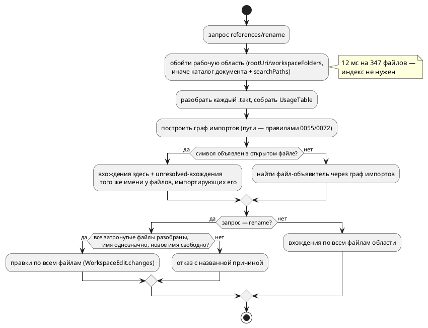

# Фича: Индексация рабочей области для LSP (`references`/`rename` между файлами)

- **Номер:** 0153
- **Статус:** ГОТОВО
- **Зависит от:** нет
- **Tier:** 2
- **Связанные issue (анализ):** кандидат блока 2 `FEATURES.md` (вынесено закрытием [lSP: `definition`, `references` и `rename`](0131-lsp-definition-references-rename.md), сознательная граница ADR)

## Стадии жизненного цикла (правило 17)

Все стадии — **разделы этой карточки** (правило 32): «Архитектура (ADR)»,
«Анализ», «Разработка», «Тест-план», «Отчёт о тестировании», «Итог».
Отдельным артефактом остаются только исправления —
[`docs/fixes/`](../fixes/README.md) (при необходимости `0153-YY-*`).

## Краткое описание

Сервер знает только открытый документ и файлы, которые тот импортирует. Поэтому
`references` ищет вхождения лишь в открытом файле, а `rename` **отказывает** для
символа из другого файла и для имён моделей. Индекс рабочей области снимает три
из семи причин отказа переименования.

> Фича зарегистрирована из бэклога кандидатов (отобрана заказчиком 2026-07-28); далее проходит жизненный цикл по правилу 17.

## Что известно на входе

- Причина ограничения — устройство слоя `semantic::usages` (0131): он обходит
  сырой АСД **одного** разбора, а не рабочую область.
- `rename` работает по принципу «полнота или отказ»: неполная правка хуже
  отказа, поэтому чужой символ отвергается на `prepareRename`.
- Имена моделей экспортируемы через `import`, а импортирующие файлы серверу не
  видны — отсюда отказ и для них.
- Уже готово основание: `SemanticIndex` адресует пару `(file_no, offset)` ([кросс-файловый переход к декларации — точный путь вместо угадывания](0056-lsp-goto-exact-file.md)), `search_paths` берутся из
  `initializationOptions` (фича [lSP не читает `initializationOptions` (пути поиска импортов)](0072-lsp-initialization-options.md)).

## Направление решения (наметка, не решение)

- Индекс рабочей области + слежение за изменениями файлов (`didChangeWatchedFiles`).
- Границы, которые останутся и после: внешние артефакты (`--address-map`,
  `--define`, сценарии симулятора) не правятся — переименование их не догонит.

Окончательный выбор — за стадиями **архитектуры** (ADR) и **анализа**: раздел
выше фиксирует то, что уже проверено, а не предрешает реализацию.

## Документирование (правило 24)

**Не требуется.** Возможности редактора; язык не меняется. Косвенно затрагивает
раздел документа об инструментах — но лишь перечислением возможностей LSP.

## Архитектура (ADR)

- **Status:** Accepted
- **Date:** 2026-08-18
- **Authors:** Архитектор + аналитик (развилки — решения заказчика 2026-08-18)
- **Related issues:** [Фича](0153-lsp-workspace-index.md);
  слой использований и «полнота или отказ» — [ADR](0131-lsp-definition-references-rename.md#архитектура-adr);
  адресация `(file_no, offset)` — [ADR](0056-lsp-goto-exact-file.md#архитектура-adr);
  пути поиска из `initializationOptions` — [ADR](0072-lsp-initialization-options.md#архитектура-adr);
  каталог импортёра как неявный путь — [ADR](0055-lsp-multifile.md#архитектура-adr);
  усыновление импортированных объявлений — [ADR](0184-imported-shared-variables.md#архитектура-adr)

### Context

Сервер знает только открытый документ. Отсюда две границы, названные ещё в
0131:

- `references` ищет вхождения **в открытом файле**; символ, объявленный в
  импортированном файле, покажет свои вхождения «здесь» — правда, но не вся;
- `rename` **отказывает** для символа из чужого файла (`ForeignDeclaration`),
  для имени модели (`ModelName`) и для имени, которое обход не смог связать
  (`Incomplete` по `has_unresolved_named`). Это три из семи причин отказа, и
  все три — не свойство языка, а следствие того, что сервер не видит соседей.

Причина ограничения — устройство: `semantic::usages` обходит сырой АСД
**одного** разбора. Основание для кросс-файловой работы при этом уже есть:
`SymbolId` несёт `file_no` (0056), пути поиска приходят из
`initializationOptions` (0072), каталог документа — неявный путь импорта (0055),
а точные пути импортированных файлов хранит реестр (0053).

#### Что «видно» через границу файла (замер устройства импорта)

| Форма | Что вносит в импортёра | Как выглядит вхождение у импортёра |
|---|---|---|
| `import "lib.takt";` | корень файла под именем `Lib` (CamelCase от имени файла) + **усыновление** объявлений: переменные, типы, функции (0184, исправления/04) | голое имя, для `usages` — **`unresolved`** |
| `import "lib.takt" as M;` | то же под именем `M` | `M` объявлен локально (вид `Model`), прочее — `unresolved` |
| `import { A as B } from "lib.takt";` | `B` объявлен локально; исходное `A` записано как `unresolved` (`note_import_originals`) | и `B`, и `A` в тексте импортёра |

То есть у импортёра вхождение импортированного символа **уже помечено** —
таблица вхождений говорит «имя есть, связать не с чем». Недостаёт ровно одного:
знания о том, **кто кого импортирует**, и оно есть только «вниз» (что импортирует
открытый файл), но не «вверх» (кто импортирует его).

#### Замер-18 — сколько стоит увидеть соседей

Зонд `probe_0153.rs` (release): обход дерева репозитория, чтение, разбор и
`collect_usages` каждого `.takt`.

| Область | Файлов | Объём | Время |
|---|---|---|---|
| весь репозиторий | 347 (325 разобрано, 22 — намеренно невалидные фикстуры) | 302 КиБ | **0.012 с** |
| `examples/` | 12 | 75 КиБ | 0.001 с |

5038 вхождений, неполных таблиц — **ноль**. Пропускная способность ≈ 25 МиБ/с,
то есть область в 10 000 файлов сканируется примерно за 0.35 с.

Целевой поток (правило 18 — схема нужна: меняется источник данных для двух
запросов):



### Decision Drivers

1. **Полнота — смысл `rename`.** Частичное переименование не «неполный
   результат», а испорченный исходник (0131). Расширяя охват, нельзя ослабить
   это правило до «сделаем сколько сможем».
2. **Устаревшее состояние хуже отсутствующего.** Индекс, разошедшийся с диском,
   даёт правки по несуществующим позициям — то есть ту же испорченность, но с
   уверенным видом.
3. **Правду говорить целиком.** `references`, показывающий часть вхождений без
   оговорки, воспитывает ложную уверенность («я проверил, больше нигде нет»).
4. **Граница обязана быть названа.** Файл вне рабочей области сервер не увидит
   **никогда** — это свойство задачи, а не реализации, и о нём должен знать
   пользователь.
5. **Цена запроса — измеренная величина, а не догадка.** Выбор «индекс против
   скана» решается замером, и он сделан.

### Considered Options

#### Option A. Оставить как есть

**Pros:**
- Ноль работы; гарантия 0131 неприкосновенна.

**Cons:**
- Три причины отказа из семи остаются, и все три пользователь читает как «сервер
  не умеет», потому что так и есть.
- `references` продолжает отвечать полуправдой.

#### Option B. Индекс рабочей области + `didChangeWatchedFiles`

Сервер строит таблицы при старте и обновляет их по уведомлениям клиента.

**Pros:**
- Быстрый ответ на больших областях (сотни тысяч файлов).
- Наметка карточки указывала именно сюда.

**Cons:**
- **Состояние, обязанное не устаревать** (драйвер 2): уведомления шлют не все
  клиенты и не обо всём (правки вне редактора, `git checkout`, генерация
  файлов). Расхождение индекса с диском проявляется как правка по неверному
  смещению.
- Регистрация наблюдателей — отдельный протокольный контракт
  (`client/registerCapability`), поддержанный клиентами неодинаково.
- Замер показывает, что выигрыш не нужен: 12 мс против 0.35 с на области, в 30
  раз большей корпуса.

#### Option C. Сканирование по требованию (принято)

Каждый `references`/`rename` обходит область заново.

**Pros:**
- **Нет состояния — нет класса дефектов** «устаревший индекс».
- Данные всегда те, что на диске: правки строятся по свежим смещениям.
- 12 мс на 347 файлов, линейно ~0.35 с на 10 000.
- Кэш «путь → (mtime, таблица)» можно добавить потом **отдельной** фичей, если
  замер потребует, — и он не меняет наблюдаемого поведения.

**Cons:**
- На очень больших областях ответ будет заметен пользователю.
- Повторная работа на каждый запрос (но запросы редки: это не автодополнение).

#### Option D. Расширить только `references`, `rename` не трогать

**Pros:**
- Гарантия «полнота или отказ» не переопределяется вовсе.

**Cons:**
- Половина пользы фичи: три причины отказа остаются.
- Асимметрия «вижу все вхождения, но переименовать не могу» раздражает сильнее,
  чем честный отказ обоих.

### Decision

Принимается **Option C** — сканирование рабочей области **по требованию**, без
индекса и без слежения за файлами (решение заказчика 2026-08-18), и вместе с ним
**кросс-файловый `rename` в пределах области** (решение заказчика там же).

#### 1. Что считается рабочей областью

`workspaceFolders`, иначе `rootUri`; при отсутствии обоих — каталог открытого
документа плюс `searchPaths` (0072). Обход рекурсивный, по расширению `.takt`,
с пропуском служебных каталогов (`.git`, `target`).

#### 2. Правило связывания через границу файла

Символ `S` с именем `N`, объявленный в файле `A`. Файл `B` содержит ссылку на
`S`, если:

1. `B` транзитивно импортирует `A` (граф импортов строится теми же правилами
   поиска путей, что у ядра, — 0055/0072: каталог импортёра в конце списка);
2. вхождение имени `N` в `B` помечено таблицей как **`unresolved`** (локально
   не связано) — либо `N` введено самим `import` (алиас, исходное имя формы
   `{ A as B }`);
3. `N` не объявлено в `B` локально: локальное объявление **затеняет**
   импортированное, и такие вхождения принадлежат другому символу.

Правило консервативно и опирается на уже существующую пометку `unresolved`, а
не на второе разрешение имён: двух разных знаний о том, что откуда пришло, в
проекте быть не должно.

#### 3. Гарантия `rename` переопределяется — и называется словами

Было: «полнота или отказ». Стало: **«полнота в пределах рабочей области или
отказ»**. Файл вне области (чужой проект, использующий этот как библиотеку)
не будет затронут никогда — это свойство задачи. Формулировка попадает в
сообщение об отказе, в живой контекст и в раздел документа об инструментах.

`rename` **отказывает**, если:

- хоть один файл области не разобрался, **и** он импортирует файл объявления
  (либо импортирует его транзитивно) — то есть мог содержать вхождения;
- имя неоднозначно: два импортированных файла объявляют `N`, и какой из них
  имеется в виду, таблица не говорит;
- **новое имя уже объявлено** в любом из затрагиваемых файлов — переименование
  создало бы затенение, то есть молча изменило бы смысл. Проверка новая: пока
  правился один файл, конфликт был виден автору, теперь — нет.

`references` в тех же случаях **не** отказывает, а показывает найденное:
показать лишнее вхождение безвредно, а `references` и не обещает правки.
Асимметрия намеренная и повторяет асимметрию 0131.

#### 4. Что остаётся отказом и после фичи

- Переименование модели, чьё имя выводится **из имени файла** (`import
  "lib.takt";` вносит `Lib`): переименование затронуло бы имя файла, а файлы
  сервер не переименовывает.
- Внешние артефакты — карта адресов (`--address-map`), `--define`, сценарии
  симулятора: переименование их не догоняет. Названо в карточке, остаётся.
- Прочие четыре причины 0131 (`Unparsable`, `NoSymbol`, `NotAnIdentifier`,
  `Keyword`) — не связаны с областью и не трогаются.

### Consequences

#### Положительные

- `references` перестаёт отвечать полуправдой: вхождения ищутся по всей области.
- Снимаются три причины отказа `rename` из семи (`ForeignDeclaration`,
  `ModelName` для моделей с собственным именем, `Incomplete` в части
  импортированных имён).
- Ни одного нового долгоживущего состояния в сервере — значит нечему устаревать.
- Появляется проверка «новое имя свободно», которой не было и в однофайловом
  режиме.

#### Отрицательные / Action items

- **Гарантия переопределяется** — это решение заказчика и его нужно записать
  трижды: в сообщении отказа, в живом контексте, в разделе документа об
  инструментах.
- Ответ на очень большой области будет заметен; порог не назначается заранее —
  кандидат «кэш по mtime» заводится по замеру, а не по опасению.
- Обход области обязан быть **одним** знанием: и `references`, и `rename` зовут
  общий слой, иначе они разойдутся в том, что считают областью.
- Правила поиска пути импорта обязаны совпадать с ядром: своя копия дала бы
  «сервер видит не тот файл, что компилятор».
- `rename` теперь возвращает `WorkspaceEdit.changes` с **несколькими** URI —
  бинарник и тесты обязаны это отражать.

#### Acceptance criteria

1. `references` на символе, объявленном в файле `A` и используемом в `B`,
   возвращает вхождения из обоих файлов; URI у вхождений разные.
2. `rename` такого символа отдаёт `WorkspaceEdit` с правками в обоих файлах;
   применение правок оставляет оба файла компилируемыми.
3. `prepareRename` на имени модели с собственным именем больше не отказывает;
   на модели, чьё имя выводится из имени файла, — отказывает с причиной.
4. Отказ наступает: (а) когда затрагиваемый файл области не разбирается,
   (б) когда имя неоднозначно, (в) когда новое имя уже объявлено в
   затрагиваемом файле. Для каждого — свой текст.
5. Область определяется одним слоем, и его же зовут оба запроса (контроль —
   тест, а не дисциплина).
6. Замер: `references` на корпусе укладывается в сотни миллисекунд; число
   разобранных файлов на запрос равно числу `.takt` области.
7. Живой контекст и раздел документа об инструментах называют новую гарантию и
   её границу.

## Анализ

### Цель и контекст

ADR принял **Option C**: `references` и `rename` работают по всей рабочей
области, которая сканируется **в момент запроса** (12 мс на 347 файлов), без
индекса и слежения за файлами; гарантия `rename` переопределяется в «полнота
**в пределах рабочей области** или отказ» (решения заказчика 2026-08-18).
Анализ уточняет правило связывания через границу файла — замер показал, что
наивное «одинаковое имя» дало бы **ложные правки**, — и называет объём работ.

#### Замер-18 — что видно по обе стороны импорта

Зонд собирал `UsageTable` для файлов корпуса и фикстур (release):

| Файл | Объявления | Неразрешённые |
|---|---|---|
| `goto56/helper.takt` | `Helper[Model]`, `Root[State]`, `speed[Variable]`, `Idle[State]` | `u8`, `Helper` |
| `goto56/uses_helper.takt` (`import "helper.takt";`) | `Main[State]` | **`Helper`** |
| `goto56/uses_alias.takt` (`import "engine.takt" as Motor;`) | `Motor[Model]`, `Main[State]` | `Motor` |
| `examples/pid_law.takt` | `PidState[Struct]`, `target/meas/ctrl[Variable]`, `pid_*[Function]`, … | имена типов |
| `examples/pid_heater.takt` (`import { PidState, pid_compute, target, meas, ctrl } from …`) | те же имена — но с видом **`Model`** | `PidState`, `target`, `meas`, `ctrl`, `pid_compute` и все их вхождения в теле |

#### Три находки замера

**1. Имя модели через границу файла — не имя объявления.** `import
"helper.takt";` вносит имя `Helper`, полученное из **имени файла**
(`normalize_camelcase_name(stem)`), а не из `model Helper` внутри. Совпадение
этих имён в фикстуре случайно: у `engine.takt` модель зовётся `Engine`, а
импортёр видит `Motor`. Значит связывание «одинаковое имя ⇒ один символ»
приписало бы вхождению `Helper` у импортёра объявление `model Helper` в
библиотеке — и переименование модели испортило бы файл, который на неё **не
ссылается**. Ложная правка страшнее отказа: ровно от этого 0131 и защищалась.

**2. Сегодня `references` на импортированном имени возвращает не полуправду, а
ничего.** Зонд на `meas` в `examples/pid_heater.takt` (имя встречается в теле
пятнадцать раз): `references_at` → `None`, `prepareRename` → отказ
`ForeignDeclaration`. Причина — `usage_at` не находит вхождения: имя лежит в
`unresolved`. То есть фича чинит и **внутрифайловый** ответ, а не только
кросс-файловый; в 0131 это описано как «покажет вхождения здесь», и описание
оптимистичнее факта.

**3. Символ формы `import { A }` объявлен видом `Model`** (`each_import_binding`
помечает так любое вводимое имя), а используется как переменная или функция —
поэтому его вхождения в том же файле не связываются с ним. Это и даёт находку 2.
Вид `Model` здесь — не утверждение о природе символа, а заглушка; правило
связывания обязано смотреть на **объявление в файле-источнике**, а не на вид,
проставленный импортом.

### Зависимости фичи (правило 17/19)

- **Зависит от:** нет. Всё нужное закрыто: слой использований (0131),
  адресация `(file_no, offset)` (0056), `initializationOptions` (0072), правила
  поиска пути (0055), усыновление объявлений (0184 и исправления/04).
- **Влияние на порядок разработки:** закрытие 0153 **разблокирует по существу**
  (не по формальной зависимости) фичу
  [перевод плагина IntelliJ на серверный `rename`](0154-intellij-server-rename.md) — перевод плагина IntelliJ
  на серверный `rename`: пока сервер отказывает на кросс-файловых символах,
  переход на него сузил бы возможности плагина. После 0153 порядок стоит
  пересмотреть в пользу 0154 (правило 19, критерий «необходимость»).

### Требования и проверяемые условия

- **R1. Область — одно знание.** Определение рабочей области (корни, обход,
  фильтр `.takt`, пропуск `.git`/`target`) живёт в **одном** слое, и `references`
  с `rename` зовут его же. Две копии разошлись бы в том, что считают областью.
- **R2. Путь импорта разрешается правилами ядра.** Поиск файла по строке
  импорта идёт так же, как в `semantic::tree` (каталог импортёра **в конце**
  списка, 0055; `searchPaths` из 0072). Своя копия правил означала бы «сервер
  видит не тот файл, что компилятор».
- **R3. Связывается только то, что действительно экспортируется.**
  - усыновлённые объявления (переменная, константа, тип, структура,
    перечисление, функция) — по голому имени, вхождение у импортёра лежит в
    `unresolved`;
  - исходное имя формы `import { A }` / `{ A as B }` — ссылка на объявление
    источника;
  - имя, введённое формой `import "файл";` (CamelCase имени файла) и формой
    `as M`, — **не** ссылка ни на какое объявление источника (находка 1);
    вхождения такого имени принадлежат импортёру.
- **R4. Затенение сильнее импорта.** Если файл объявляет имя локально, его
  вхождения принадлежат локальному символу. Правило выполняется само собой
  (такие вхождения не попадают в `unresolved`), но обязано быть проверено
  тестом: оно и есть граница между «нашим» и «чужим».
- **R5. `rename` отказывает при любом сомнении о полноте** — в пределах
  области:
  - затрагиваемый файл (импортирующий файл объявления, прямо или транзитивно)
    не разбирается;
  - имя неоднозначно: два импортированных файла объявляют его;
  - новое имя уже объявлено в затрагиваемом файле (иначе правка молча заводит
    затенение) — проверка **новая**, в однофайловом режиме её не было.
- **R6. `references` не отказывает, а показывает.** Те же сомнения оставляют
  вхождения в ответе: лишнее вхождение безвредно, `references` правок не
  обещает. Асимметрия повторяет 0131.
- **R7. Прежние ответы сохраняются.** Для символа, объявленного и используемого
  в одном файле, ответ прежний байт-в-байт; четыре причины отказа, не связанные
  с областью (`Unparsable`, `NoSymbol`, `NotAnIdentifier`, `Keyword`),
  сохраняются.
- **R8. Одна точка входа на запрос.** Публичный `references_at` заменяется
  кросс-файловым входом; однофайловая часть остаётся приватной. Оставить оба
  публичными — завести два ответа на один вопрос.

### Критерии приёмки и способ проверки

| # | Критерий | Способ проверки |
|---|---|---|
| A1 | `references` на символе из `A`, используемом в `B`, даёт вхождения обоих файлов | тест на фикстуре-каталоге (`goto56`, `lsp72/proj`) |
| A2 | `rename` того же символа даёт `WorkspaceEdit` с правками в обоих файлах; результат компилируется | тест: применить правки к копиям в temp-каталоге и построить дерево |
| A3 | Имя, введённое `import "файл";`/`as M`, правкой библиотеки **не** затрагивается | тест-контрпример на `helper.takt`/`uses_helper.takt` (находка 1) |
| A4 | Локальное объявление затеняет импортированное | тест: одноимённая `var` в импортёре |
| A5 | Отказы R5 — каждый со своим текстом | три теста, по одному на причину |
| A6 | `references` на импортированном имени больше не возвращает `None` | тест на `pid_heater.takt`/`meas` (находка 2) |
| A7 | Область определяется одним слоем | тест зовёт слой напрямую и сверяет состав файлов с ответом обоих запросов |
| A8 | Прежние однофайловые ответы не изменились | существующие тесты `lsp_references_tests`/`lsp_rename_tests` — без правок по смыслу |
| A9 | Стоимость: число разобранных файлов на запрос = числу `.takt` области; корпус укладывается в сотни миллисекунд | тест-замер (грубый предохранитель, не порог) |
| A10 | Живой контекст и раздел документа называют новую гарантию | чтение; проверки зелены |

### Особенности по обратной функциональности

- **Язык не меняется** (правило 22): версия языка прежняя. Меняется публичный
  API крейта (`references_at`), значит версия крейта поднимается минорно.
- **Правило 29 (редакторский слой).** Затронут именно LSP — это его фича.
  Плагины: **Zed** правок не требует (`language_servers = ["takt-lsp"]`),
  **VS Code** — тоже (возможности объявляет сервер). **IntelliJ** ведёт
  собственный `rename` (фича переводит его на серверный) — в рамках 0153
  не трогается; ответ зафиксирован здесь.
- **Симулятор, генераторы, форматтер** — не затронуты.
- **Наблюдаемых изменений три:** `references` отвечает по области (и перестаёт
  молчать на импортированном имени), `rename` правит несколько файлов, у
  `rename` появляется отказ «новое имя занято».

### Декомпозиция разработки

| Подзадача | Содержание |
|---|---|
| `0153-01` | Слой рабочей области: обход корней, разбор, граф импортов по правилам ядра, связывание символов через границу (R1–R4) + тесты слоя |
| `0153-02` | `references` и `rename` поверх слоя: новые входы, отказы R5, сохранение R6–R8 + тесты запросов |
| `0153-03` | Бинарник (`workspaceFolders`/`rootUri`, `WorkspaceEdit` с несколькими URI), живой контекст, документ, `CHANGES.md`, версия крейта |

### Риски и зависимости

- **Риск: ложная правка через границу файла** — главный. Снимается правилом R3
  и тестом-контрпримером A3 (`helper.takt`: имя модели совпадает с именем
  файла — при наивном связывании тест краснеет).
- **Риск: сервер и компилятор видят разные файлы.** Снимается R2 — правила
  поиска берутся у ядра, а не переписываются.
- **Риск: обход области заденет чужие каталоги** (`target` с порождёнными
  `.takt` нет, но `.git` и вложенные репозитории возможны). Фильтр служебных
  каталогов — часть слоя; список фиксируется тестом.
- **Риск: большая область замедлит ответ.** Замер: 25 МиБ/с, то есть ~0.35 с
  на 10 000 файлов. Кэш по mtime **не** делается — кандидат, заводимый по
  замеру, а не по опасению (решение заказчика: скан по требованию).
- **Риск: правки применяются к файлам, открытым в редакторе с несохранёнными
  изменениями.** Сервер обязан брать текст **открытых** документов из своего
  состояния, а с диска читать лишь остальные, — иначе правка построится по
  устаревшему тексту. Это требование к бинарнику (`0153-03`), и оно
  проверяется тестом состояния сервера.

## Разработка

### Задача

#### Что было

Сервер знал только открытый документ: `references` искал вхождения в нём одном,
`rename` отказывал на всём, что объявлено снаружи. Соседних файлов не видел
никто — граф импортов сервер не строил, а слой `semantic::usages` разбирает
**один** АСД.

#### Что сделано

Новый слой `takt-lang/src/lsp/workspace.rs` (581 строка):

- **Обход области.** `Workspace::scan(roots, search_paths, overlay)` собирает
  `.takt` из корней (служебные каталоги — `.git`, `target`, `node_modules`,
  `.idea` — пропускаются), читает, разбирает, собирает `UsageTable`. Текст
  **открытых** документов приходит через `overlay` и сильнее диска.
- **Граф импортов.** Путь разрешается **правилами ядра** —
  `semantic::import::read_import_file` (модуль открыт до `pub(crate)`), каталог
  файла добавляется в конец списка, как в `semantic::tree`. Своя
  копия правил означала бы, что сервер видит не тот файл, что компилятор.
- **Экспорт.** `top_level_exports` — имена верхнеуровневых объявлений
  (переменная, порт, константа, параметр, тип, структура, перечисление,
  функция): ровно то, что усыновление (0184) переносит импортёру.
- **Связывание.** `Workspace::resolve` отдаёт `Resolution` — вхождения по всей
  области плюс факты для политики отказа (`ambiguous`, `import_binding`,
  `unparsable_consumers`). Решение «отказать или нет» слой **не принимает**:
  оно живёт в `rename`.

Ключевое правило записано в шапке модуля: **имя, введённое самим импортом,
не есть имя объявления источника.** `import "helper.takt";` вводит `Helper` из
**имени файла**, `as M` — алиас; связывание по совпадению имён приписало бы
импортёру чужое объявление.

Неразобранный файл потребителем не числится **по устройству** — у него нет
АСД, значит нет и директив импорта. Поэтому подозрение на потерянные вхождения
строится по тексту (есть слово `import` и само имя): оба признака ошибаются в
сторону лишнего отказа, а не пропущенной правки.

#### Проверки

```sh
cargo test --features lsp --test lsp lsp_workspace_tests   # 13 тестов, зелено
cargo clippy --all-targets --all-features                   # без замечаний
scripts/check-module-size.sh                                # зелено
```

Фикстуры — `takt-lang/tests/data/ws0153/{ok,broken,ambig}`; контрпример
связывания берётся из готовой `goto56` (там имя файла совпадает с именем
модели — ровно тот случай, на котором наивное правило ломается).

### Задача

#### Что было

`references_at(source, …)` возвращал диапазоны **одного** текста, а на
импортированном имени — `None` (замер анализа: `meas` в `pid_heater.takt`
встречается пятнадцать раз, ответ был пуст). `rename_at` отказывал причинами
`ForeignDeclaration` и `ModelName`.

#### Что сделано

- **`references_in_workspace`** отдаёт `Vec<FileReference>` — путь файла плюс
  диапазон в **его** координатах (перевод смещения по чужому тексту дал бы
  верное на вид, но неверное место).
- **`prepare_rename_in_workspace` / `rename_in_workspace`** — правки по всем
  файлам области, сгруппированные по путям.
- **Три новые причины отказа**: `UnparsableConsumer` (файл области, где имя
  встречается, не разбирается), `AmbiguousImport` (имя объявлено несколькими
  подключёнными файлами), `NameTaken` (новое имя занято в затрагиваемом файле).
- **Отказ `ForeignDeclaration` сохранён** для случая, когда объявления не
  нашлось нигде в области: так выглядит имя, введённое `import "файл";` у
  импортёра, и правка одного вхождения оторвала бы его от имени файла.
- Однофайловые `references_at`/`rename_at` остались публичными — их зовут
  потребители без области; политика отказа при этом **одна** (`check_resolution`
  и `validate_new_name`), а не по копии на вход.

#### Проверки

Тринадцать тестов набора `lsp_workspace_tests` (перечислены в тест-плане).
Существующие `lsp_references_tests` и `lsp_rename_tests` не правились —
однофайловые ответы прежние.

### Задача

#### Что было

`takt_lsp.rs` знал только `searchPaths` и словарь открытых документов; ответ
`rename` клал правки под **один** URI.

#### Что сделано

- **Корни рабочей области** извлекаются из `InitializeParams`:
  `workspaceFolders`, затем `root_uri` (устаревший, но именно его шлют живые
  клиенты). Если клиент не дал ни того, ни другого — область сводится к
  каталогу открытого документа: иначе её не было бы вовсе.
- **`ServerState::overlay`** отдаёт слою тексты открытых документов, а
  `roots_for` — корни запроса.
- **`WorkspaceEdit` с несколькими URI**: `path_to_uri` строит URI по пути.
  Кодируются только пробел и `%` — полное процентное кодирование дало бы URI,
  не совпадающий с присланным клиентом, и редактор счёл бы это другим файлом.
- Документ (`book/src/17-tools`) описывает охват и границу; живой контекст и
  `CHANGES.md` — то же; версия крейта `takt-lang` `0.37.0` → `0.38.0`.

#### Проверки

```sh
cargo build --features lsp --bin takt-lsp
cargo test --all-features
./scripts/precheck.sh
```

## Тест-план

### Область и цель

Проверяется ответ сервера, а не устройство слоя: какие вхождения увидит
пользователь, какие файлы изменит правка и когда придёт отказ. Требования —
R1…R8 анализа, критерии — A1…A10.

### Проверки (условие → ожидаемый результат)

| # | Проверка | Предусловие | Ожидаемый результат | Ссылка на R/A |
|---|---|---|---|---|
| T1 | `references` от объявления | курсор на `speed` в `ws0153/ok/lib.takt` | вхождения в трёх файлах: `lib` (1), `uses_plain` (2), `uses_selected` (2) | R3 / A1 |
| T2 | `references` от потребителя | курсор на `speed` в `uses_plain.takt` | тот же список | R3 / A1 |
| T3 | Импортированное имя не молчит | курсор на `speed` в `uses_selected.takt` | ответ непуст (до фичи был `None`) | — / A6 |
| T4 | Затенение | `shadow.takt` объявляет своё `speed` | файл в ответе **не** появляется | R4 / A4 |
| T5 | `rename` правит всех потребителей | `speed` → `velocity` | правки в трёх файлах, счёт совпадает с T1 | R5 / A2 |
| T6 | Применённые правки не ломают файлы | те же правки | каждый файл разбирается; в коде старого имени нет | — / A2 |
| T7 | Контрпример связывания | `model Helper` в `goto56/helper.takt` | `uses_helper.takt` в ответе **нет** | R3 / A3 |
| T8 | Имя по имени файла не переименовать | `Helper` в `goto56/uses_helper.takt` | отказ `ForeignDeclaration` | R3 / A3 |
| T9 | Неразобранный потребитель | `ws0153/broken` | отказ `UnparsableConsumer` | R5 / A5 |
| T10 | Неоднозначное имя | `ws0153/ambig` | отказ `AmbiguousImport` | R5 / A5 |
| T11 | Занятое имя | `speed` → `doubled` | отказ `NameTaken` | R5 / A5 |
| T12 | Область — одно знание | корень `ws0153/ok` | слой видит ровно `.takt` каталога | R1 / A7 |
| T13 | Открытый документ сильнее диска | `overlay` меняет текст | область отдаёт текст редактора | — / A2 |
| T14 | Прежние однофайловые ответы | наборы `lsp_references_tests`, `lsp_rename_tests` | без изменений | R7 / A8 |
| T15 | Полный предкоммит | — | `./scripts/precheck.sh` зелёный | правило 5 |

### Разбивка проверок по функциональности

| Функциональность | Статус | Примечание |
|---|---|---|
| Слой рабочей области (`lsp/workspace.rs`) | ✅ | предмет фичи |
| `references` / `rename` | ✅ | новые входы |
| Сервер `takt-lsp` | ✅ | корни области, `WorkspaceEdit` по нескольким URI |
| Документ `book/` | ✅ | охват и граница |
| Симулятор, генераторы, форматтер | — | не затронуты |
| Плагины Zed/VS Code | — | возможности объявляет сервер |
| Плагин IntelliJ | — | свой `rename`; перевод — фича |

<!-- Легенда: ✅ пройдено · ❌ провалено · ⬜ не проверялось · — не применимо -->

### Тестовые данные и окружение

- `takt-lang/tests/data/ws0153/{ok,broken,ambig}` — фикстуры фичи;
  `takt-lang/tests/data/goto56` — готовый контрпример (имя файла совпадает с
  именем модели).
- Набор — `takt-lang/tests/lsp/lsp_workspace_tests.rs` (тема `lsp`).
- Окружение: пин толчейна 1.97.1, `--features lsp`.

## Отчёт о тестировании

### Резюме

Все проверки тест-плана пройдены; фича готова к закрытию (`ГОТОВО`).
Наблюдаемых изменений три: `references` отвечает по всей рабочей области (и
перестаёт молчать на импортированном имени), `rename` правит несколько файлов,
у `rename` появились три новые причины отказа.

### Фактические результаты по проверкам

| # | Проверка | Результат | Комментарий |
|---|---|---|---|
| T1 | `references` от объявления | ✅ | `lib:1, uses_plain:2, uses_selected:2` |
| T2 | `references` от потребителя | ✅ | список совпадает с T1 |
| T3 | Импортированное имя не молчит | ✅ | ответ непуст |
| T4 | Затенение | ✅ | `shadow.takt` в ответе отсутствует |
| T5 | `rename` правит всех потребителей | ✅ | три файла, счёт правок совпал |
| T6 | Правки не ломают файлы | ✅ | каждый разбирается; в коде старого имени нет |
| T7 | Контрпример связывания | ✅ | `uses_helper.takt` не затронут |
| T8 | Имя по имени файла не переименовать | ✅ | `ForeignDeclaration` |
| T9 | Неразобранный потребитель | ✅ | `UnparsableConsumer` |
| T10 | Неоднозначное имя | ✅ | `AmbiguousImport` |
| T11 | Занятое имя | ✅ | `NameTaken` |
| T12 | Область — одно знание | ✅ | слой видит ровно `.takt` корня |
| T13 | Открытый документ сильнее диска | ✅ | текст `overlay` побеждает |
| T14 | Прежние однофайловые ответы | ✅ | наборы не правились |
| T15 | Полный предкоммит | ✅ | зелёный |

### Результаты по функциональности

| Функциональность | Статус |
|---|---|
| Слой рабочей области | ✅ |
| `references` / `rename` | ✅ |
| Сервер `takt-lsp` | ✅ |
| Документ `book/` | ✅ |
| Симулятор, генераторы, форматтер, плагины | — |

### Выводы и дальнейшие шаги

1. **Три провала на первом прогоне были поучительны.** Два — дефекты самих
   тестов (позиция бралась по первому вхождению имени, а оно стояло в
   **комментарии**; проверка «старого имени не осталось» ловила комментарий, а
   не код). Третий — настоящий: файл, который не разбирается, **не числится
   потребителем по устройству** — у него нет АСД, значит нет и директив
   импорта, и граф о нём молчит. Лечение — подозрение по тексту (`import` плюс
   само имя), ошибающееся в сторону лишнего отказа.
2. **Исправлений (`docs/fixes/`) не требуется.**
3. **Порядок разработки стоит пересмотреть** (правило 19): закрытие 0153 по
   существу разблокировало [перевод плагина IntelliJ на серверный `rename`](0154-intellij-server-rename.md) —
   перевод плагина IntelliJ на серверный `rename` больше не сузит его
   возможности.
4. **Кандидаты, вынесенные из фичи** (записаны в `FEATURES.md`): кэш области по
   `mtime` (заводится по замеру, не по опасению) и вид символа у имён,
   введённых `import { … }`, — сейчас там стоит заглушка `Model`, из-за чего
   вхождения не связываются внутри самого импортёра.

## Итог (что сделано)

`references` и `rename` работают по **рабочей области**, которая сканируется в
момент запроса (`takt-lang/src/lsp/workspace.rs`). Индекса и слежения за
файлами сервер не держит: замер-18 — обход, чтение и разбор всех 347
файлов репозитория занимают **12 мс**, то есть около 0.35 с на область в 10 000
файлов, а индекс завёл бы состояние, обязанное не устаревать.

Снято три причины отказа из семи: `ForeignDeclaration` (для символа, чьё
объявление область видит), `ModelName` (для модели с собственным именем),
`Incomplete` в части импортированных имён. Гарантия переопределена решением
заказчика: было «полнота или отказ», стало **«полнота в пределах рабочей
области или отказ»** — файл вне области не догоняется никогда, и это сказано
в документе.

**Главная находка, определившая правило связывания:** имя, введённое самим
импортом, не есть имя объявления источника. `import "helper.takt";` вводит
`Helper`, полученное из **имени файла**, а `import "engine.takt" as Motor;` —
`Motor`, хотя модель зовётся `Engine`. Связывание «одинаковое имя ⇒ один
символ» правило бы файл, который на библиотеку не ссылается; контрпример держит
тест на фикстуре `goto56`, где имя файла совпало с именем модели. Связывается
поэтому лишь то, что импорт действительно переносит: верхнеуровневые объявления
(усыновление 0184) и исходное имя формы `import { A }`.

Вторая находка — старое поведение было хуже описанного: `references` на
импортированном имени возвращал не полуправду, а **`None`** (проверено на
`meas` в `examples/pid_heater.takt`, где имя встречается пятнадцать раз).

Три новые причины отказа: `UnparsableConsumer`, `AmbiguousImport`, `NameTaken`.
Последняя не существовала и в однофайловом режиме — пока правился один файл,
столкновение имён видел автор.

Артефакты: [ADR](0153-lsp-workspace-index.md#архитектура-adr) ·
[анализ](0153-lsp-workspace-index.md#анализ) ·
[индексация рабочей области для LSP (`references`/`rename` между файлами)](0153-lsp-workspace-index.md#разработка) ·
[индексация рабочей области для LSP (`references`/`rename` между файлами)](0153-lsp-workspace-index.md#разработка) ·
[индексация рабочей области для LSP (`references`/`rename` между файлами)](0153-lsp-workspace-index.md#разработка) ·
[тест-план](0153-lsp-workspace-index.md#тест-план) ·
[отчёт](0153-lsp-workspace-index.md#отчёт-о-тестировании).

Вынесено кандидатами: вид символа у имён формы `import { A }` (сейчас заглушка
`Model`) и кэш области по `mtime` — заводить по замеру, не по опасению.
