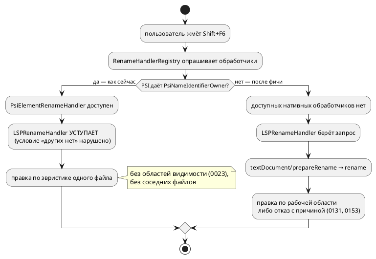

# Фича: Перевод плагина IntelliJ на серверный `rename`

- **Номер:** 0154
- **Статус:** ГОТОВО
- **Зависит от:** нет
- **Tier:** 3
- **Связанные issue (анализ):** кандидат блока 2 `FEATURES.md` (вынесено закрытием [lSP: `definition`, `references` и `rename`](0131-lsp-definition-references-rename.md))

## Стадии жизненного цикла

Все стадии — **разделы этой карточки**: «Архитектура (ADR)»,
«Анализ», «Разработка», «Тест-план», «Отчёт о тестировании», «Итог».
Отдельным артефактом остаются только исправления —
[`docs/fixes/`](../fixes/README.md) (при необходимости `0154-YY-*`).

## Краткое описание

Плагин делает переименование **сам**, собственным PSI ([плагин IntelliJ Takt: LSP-проверка, автодополнение, документация и настройки инструментов](0125-intellij-takt-lsp-tooling.md)). Теперь у сервера есть
`textDocument/rename` с областями видимости и принципом «полнота или отказ» — то
есть с более строгим поведением, чем у PSI-варианта. Дубль надо снять.

> Фича зарегистрирована из бэклога кандидатов (отобрана заказчиком 2026-07-28); далее проходит жизненный цикл по своду.

## Что известно на входе

- PSI плагина `extensions/intellij-takt` — почти плоский: формы деклараций
  берутся из единого `navigation/LamSymbolScanner`.
- Серверный `rename` (0131) отказывает там, где PSI-вариант молча правит
  частично: чужой файл, имя модели, непокрытый узел, ключевое слово.
- Плагин **вне** `precheck.sh`/CI — проверяется только запуском IDE.
- Сборка плагина требует JDK 21 — см. [фиксация требования JDK 21 для сборки плагина `intellij-takt`](0159-intellij-jdk21-build.md).

## Направление решения (наметка, не решение)

- Отдать переименование серверу (LSP `rename`/`prepareRename`), PSI-реализацию
  снять.
- Условие осмысленности: серверный `rename` полезнее PSI только при индексе
  рабочей области — иначе он отказывает чаще. Вероятная зависимость —
  [индексация рабочей области для LSP (`references`/`rename` между файлами)](0153-lsp-workspace-index.md); проставит аналитик.

Окончательный выбор — за стадиями **архитектуры** (ADR) и **анализа**: раздел
выше фиксирует то, что уже проверено, а не предрешает реализацию.

## Документирование

**Не требуется.** Инструмент-плагин; язык не меняется.

## Архитектура (ADR)

- **Status:** Accepted
- **Date:** 2026-08-18
- **Authors:** Архитектор + аналитик
- **Related issues:** [Фича](0154-intellij-server-rename.md);
  серверный `rename` и «полнота или отказ» — [ADR](0131-lsp-definition-references-rename.md#архитектура-adr);
  кросс-файловый охват — [ADR](0153-lsp-workspace-index.md#архитектура-adr);
  PSI плагина и нативный rename — [ADR](0067-intellij-rename-psi-import.md#архитектура-adr);
  подключение LSP4IJ — [ADR](0038-intellij-semantic-tokens.md#архитектура-adr);
  единый источник форм деклараций — [ADR](0125-intellij-takt-lsp-tooling.md#архитектура-adr)

### Context

Переименование в плагине сегодня делает **PSI плагина**, а не сервер. Устройство: узел `TaktNameDecl` реализует `PsiNameIdentifierOwner`, узел
`TaktNameRef` несёт `PsiReference`, а роль узла определяет эвристика
`TaktSymbolScanner`. Разрешение ссылки — «первая одноимённая декларация файла»,
**без областей видимости** (осознанное ограничение 0023) и без кросс-файловости.

Сервер тем временем умеет больше: `rename`/`prepareRename` (0131) с реальными
областями видимости и правилом «полнота или отказ», а с фичи — по всей
рабочей области, с семью причинами отказа вместо молчаливой частичной правки.

#### Замер-18 — почему серверный путь сегодня недостижим

LSP4IJ 0.20.1 регистрирует свой обработчик **первым**:

```xml
<renameHandler id="LSPRenameHandler" order="first"
               implementation="…features.rename.LSPRenameHandler" />
```

Но `order="first"` решает не всё. Разбор байткода
`LSPRenameHandler.isAvailableOnDataContext` (javap) показывает три условия:

1. файл ассоциирован с языковым сервером, поддерживающим `rename`
   (`LanguageServiceAccessor.hasAny`);
2. `RenameHandlerRegistry.getRenameHandlers(dataContext).isEmpty()` — **других
   доступных обработчиков нет**;
3. либо все они `instanceof VariableInplaceRenameHandler` (единственный
   `instanceof` в предикате).

То есть LSP4IJ **сознательно уступает** нативным рефакторингам. Пока
`TaktNameDecl` объявлен `PsiNameIdentifierOwner`, доступен штатный
`PsiElementRenameHandler` — он не `VariableInplaceRenameHandler`, значит условие
2/3 не выполняется, и серверный путь не включается **никогда**, сколько бы
сервер ни умел.

Это и есть ответ на вопрос фичи: дубль не просто существует — он **перекрывает**
более строгую реализацию.



### Decision Drivers

1. **Одно поведение на одно действие.** Пользователь не должен получать разный
   результат от одного и того же Shift+F6 в зависимости от того, какой слой
   перехватил запрос.
2. **Строже — значит вернее.** PSI-вариант молча правит частично (затенение,
   соседние файлы); серверный отказывается, когда не уверен. Правило проекта —
   «полнота или отказ».
3. **Не дублировать семантику на Kotlin** (драйвер 2 ADR): единый источник
   — крейт `takt-lang`.
4. **Деградация без сервера остаётся осмысленной.** Бинарник `takt-lsp` может
   быть не найден (тихая деградация 0038) — плагин обязан оставаться полезным.
5. **Проверяемость.** Плагин вне `precheck.sh`; всё, что можно проверить
   автоматически, должно проверяться в его Gradle-тестах, а не «глазами в IDE».

### Considered Options

#### Option A. Оставить как есть

**Pros:**
- Ноль работы; rename работает без сервера.

**Cons:**
- Пользователь получает **худшую** из двух реализаций, и молча: эвристика
  «первая одноимённая декларация файла» ломает затенение и не видит импортёров.
- Серверный `rename`, доведённый фичами и 0153, в IntelliJ недостижим.

#### Option B. Снять PSI-имена целиком (`NAME_DECL`, `NAME_REF`)

**Pros:**
- PSI становится по-настоящему плоским; сервер обслуживает всё.

**Cons:**
- Вместе с rename исчезает **навигация без сервера**: `TaktGotoDeclarationHandler`
  и find usages опираются на те же узлы.
- Ломает round-trip-контроль `LamPsiCorpusTest`? Нет, но объём правки велик, а
  выигрыш сверх Option C — только чистота.

#### Option C. Снять у декларации `PsiNameIdentifierOwner`, узлы и ссылки оставить (принято)

**Pros:**
- Минимальная правка, точно снимающая причину: без `PsiNamedElement`
  `PsiElementRenameHandler` недоступен, условие LSP4IJ выполняется, серверный
  rename включается.
- Навигация и поиск использований по PSI **сохраняются** — деградация без
  сервера остаётся (драйвер 4).
- Проверяемо в Gradle-тестах **без живого сервера** — правда, не буквальным
  предикатом LSP4IJ, а его причиной: символ Takt перестаёт быть переименуемым
  нативно (см. поправку в разделе «Decision»).

**Cons:**
- Без сервера rename пропадает совсем (Shift+F6 ничего не предложит). Это
  осознанный размен: эвристический rename опаснее отсутствующего.
- `TaktNamesValidator` (валидатор имён для нативного rename, 0067) остаётся без
  своего потребителя — его судьбу решает анализ.

#### Option D. Свой `RenameHandler`, делегирующий серверу

**Pros:**
- Полный контроль над диалогом и текстом отказа.

**Cons:**
- Дублирует `LSPRenameHandler` целиком, включая `prepareRename`, диалог и
  применение `WorkspaceEdit`, — то есть заводит на Kotlin ровно то, чего ADR велел избегать.

### Decision

Принимается **Option C**: `TaktNameDecl` перестаёт быть
`PsiNameIdentifierOwner`; узлы имён и `PsiReference` сохраняются ради навигации
без сервера. Переименование обслуживает `LSPRenameHandler` LSP4IJ, то есть
серверный `textDocument/rename` со всеми его правилами (0131, 0153).

- **Условие включения проверяется тестом, а не верой.** **Поправка по итогу
  разработки:** контроль строится не на пустоте `RenameHandlerRegistry.getRenameHandlers`
  (как задумывалось здесь), а на `PsiElementRenameHandler.canRename` **нашего
  узла**. Зонд показал, что в синтетическом `DataContext` теста нативный
  обработчик доступен даже для `probe.txt`, где PSI плагина нет вовсе, — он
  предлагает переименовать **файл**. Буквальный предикат LSP4IJ в юнит-тесте
  невоспроизводим; проверяемо именно то, что символ Takt нативным рефакторингом
  не берётся. Подробности — в задаче.
- **Тесты PSI-rename** (`TaktRenameTest`) переписываются: они проверяли
  поведение, которое фича намеренно убирает. Вместо них — контроль условия выше и
  контроль сохранённой навигации.
- **Ручная проверка в IDE обязательна и записывается в отчёт**: юнит-тест не
  поднимает языковой сервер, поэтому «сервер действительно переименовал»
  подтверждается запуском (`runIde`) — с явным указанием, что именно проверено.
- **Судьба `TaktNamesValidator`** — за анализом: если IDEA использует его только
  на нативном пути, он становится мёртвым кодом и снимается вместе с PSI-rename;
  если LSP4IJ спрашивает валидатор языка при вводе нового имени — остаётся.

### Consequences

#### Положительные

- Одно поведение на одно действие: переименование в IntelliJ, VS Code и Zed
  делает один и тот же код — сервер.
- Пользователь получает кросс-файловый rename и честные отказы вместо
  молчаливой частичной правки.
- Плагин теряет реализацию, которую пришлось бы сопровождать параллельно
  серверной.

#### Отрицательные / Action items

- **Без сервера rename недоступен.** Назвать в `README` плагина: если
  `takt-lsp` не найден, работают подсветка и навигация, но не переименование.
- Переписать `TaktRenameTest`; проверить, не осталось ли мёртвым
  `TaktNamesValidator` и `setIdentifierText`.
- Проверить, что `LamPsiCorpusTest` (round-trip по корпусу) остаётся зелёным:
  правка касается интерфейса узла, а не разбора.
- Плагин по-прежнему **вне** `precheck.sh`/CI (пусковой JDK 17…26, компиляция —
  JDK 21): его тесты гоняются локально `./gradlew --offline test`, и это надо
  сделать явным шагом отчёта.

#### Acceptance criteria

1. `TaktNameDecl` не реализует `PsiNameIdentifierOwner`; узлы имён и
   `PsiReference` сохранены.
2. Тест: `PsiElementRenameHandler.canRename` на узле-декларации ложно — нативный
   рефакторинг за символ Takt не берётся (уточнение критерия — поправка в
   «Decision»).
3. Тест: навигация по PSI (goto declaration, разрешение ссылки) работает
   по-прежнему.
4. `./gradlew --offline test` зелёный; `LamPsiCorpusTest` в том числе.
5. Ручная проверка в IDE: переименование символа, объявленного в другом файле,
   правит оба файла; переименование в имя, занятое в затрагиваемом файле, даёт
   отказ с текстом сервера. Результат записан в отчёт.
6. `README` плагина называет новую границу (нет сервера — нет переименования).

## Анализ

### Цель и контекст

ADR принял **Option C**: `TaktNameDecl` перестаёт быть `PsiNameIdentifierOwner`,
узлы имён и `PsiReference` остаются. Этого достаточно, чтобы `LSPRenameHandler`
получил запрос: его предикат требует, чтобы других доступных обработчиков не
было (разбор байткода — в ADR).

### Зависимости фичи

- **Зависит от:** нет **формально**; по существу опирается на закрытую
  [индексация рабочей области для LSP (`references`/`rename` между файлами)](0153-lsp-workspace-index.md). До неё серверный `rename`
  отказывал на кросс-файловых символах, и перевод плагина означал бы **потерю**
  возможностей: PSI-вариант такие имена правил (пусть и эвристически). Порядок
  разработки был пересмотрен именно поэтому.
- **Влияние на порядок:** ничего не разблокирует.

### Точка отсчёта (замер-18)

- Тесты плагина: **90**, зелёные (`./gradlew --offline cleanTest test`).
- Реализация rename в плагине — три места: `TaktNameElements.kt`
  (`PsiNameIdentifierOwner`), `TaktNameReference.handleElementRename`,
  `TaktRenameTest` (107 строк).
- `TaktNamesValidator` зарегистрирован как `lang.namesValidator` — это
  **языковая** точка расширения, её спрашивает инфраструктура IDEA при вводе
  нового имени, а не конкретный обработчик. Остаётся.

### Требования и проверяемые условия

- **R1. Условие LSP4IJ выполнено.** Для файла `.takt` список доступных
  обработчиков rename пуст либо состоит только из `VariableInplaceRenameHandler`
  — ровно предикат `LSPRenameHandler.isAvailableOnDataContext`.
- **R2. Навигация сохранена.** Разрешение ссылки (`TaktNameReference.resolve`) и
  переход к декларации работают, как прежде: они не требуют `PsiNamedElement`.
- **R3. Мёртвого кода не остаётся.** `handleElementRename` и `setIdentifierText`
  либо сохраняют потребителя, либо снимаются вместе с реализацией.
- **R4. Round-trip цел.** `TaktPsiCorpusTest` (байт-в-байт по всему корпусу
  `.takt`) зелёный: правка касается интерфейса узла, а не разбора.
- **R5. Граница названа.** Без сервера переименование недоступно — сказано в
  `README` плагина.

### Критерии приёмки и способ проверки

| # | Критерий | Способ проверки |
|---|---|---|
| A1 | `TaktNameDecl` не `PsiNameIdentifierOwner` | чтение кода |
| A2 | Предикат LSP4IJ выполнен | тест на `RenameHandlerRegistry.getRenameHandlers` |
| A3 | Навигация цела | существующие тесты ссылок + переход |
| A4 | `./gradlew --offline test` зелёный, 90 тестов и более | прогон |
| A5 | Ручная проверка в IDE: кросс-файловый rename и отказ | `runIde`, запись в отчёт |
| A6 | `README` плагина называет границу | чтение |

### Особенности по обратной функциональности

- **Язык не затронут**: версии языка и крейтов прежние.
- **свод:** это и есть редакторский слой; сервер (`takt-lang/src/lsp`) не
  правится — он уже умеет всё нужное.
- **Наблюдаемое изменение одно:** Shift+F6 в IntelliJ обслуживает сервер.
  Следствия — кросс-файловая правка и отказы вместо молчаливой частичной правки.

### Риски и границы

- **Риск: без сервера rename исчезает.** Принят осознанно (ADR, драйвер 2):
  эвристический rename без областей видимости способен молча испортить файл.
  Смягчение — строка в `README` плагина.
- **Риск: тест на предикат окажется декоративным.** Снимается мутацией: если
  вернуть `PsiNameIdentifierOwner`, тест обязан покраснеть. Мутация
  выполняется и её результат записывается в отчёт.
- **Граница проверки: живой сервер в юнит-тестах не поднимается.** Что сервер
  действительно переименовал — проверяется руками в IDE. Это свойство
  окружения, а не недосмотр: плагин вне `precheck.sh` (пусковой JDK 17…26,
  компиляция — JDK 21).

## Разработка

### Задача

#### Что было

`TaktNameDecl` реализовал `PsiNameIdentifierOwner`, `TaktNameReference` —
`handleElementRename`. Из-за этого IDEA считала доступным штатный
`PsiElementRenameHandler`, а `LSPRenameHandler` из LSP4IJ **уступал** (его
предикат требует отсутствия других доступных обработчиков). Серверный `rename`
— с областями видимости и рабочей областью (0131, 0153) — не включался никогда.

#### Что сделано

- **`TaktNameDecl` больше не `PsiNameIdentifierOwner`**; `setName`,
  `getNameIdentifier`, `setIdentifierText` и `handleElementRename` сняты.
  Узлы имён и `PsiReference` **сохранены** — на них держится навигация без
  сервера (тихая деградация 0038).
- **`TaktRenameTest` переписан** (9 тестов PSI-переименования → 3 контроля
  нового устройства + сохранённый тест валидатора имён).
- Комментарии, обещавшие нативный rename, приведены в соответствие:
  `plugin.xml`, `TaktElementTypes.kt`, `TaktParser.kt`, `README.md` плагина.

#### Проверки

```sh
cd extensions/intellij-takt && ./gradlew --offline test   # 84 теста, зелено
```

**Зонд, изменивший замысел контроля.** Первая редакция проверяла, что
`RenameHandlerRegistry.getRenameHandlers` пуст, — ровно предикат LSP4IJ. Тест
краснел. Зонд на `probe.txt` (файл, где PSI плагина нет вовсе) показал причину:
`PsiElementRenameHandler` доступен и там — он предлагает переименовать **файл**,
а не символ. В синтетическом `DataContext` теста этот обработчик присутствует
всегда, поэтому такой контроль проверял бы наличие файла, а не наше устройство.
Контроль перестроен на `PsiElementRenameHandler.canRename` **нашего узла**.

**Мутация** (проверка, что контроля не декоративны): возврат
`PsiNameIdentifierOwner` в `TaktNameDecl` валит `testDeclarationIsNotRenamableNatively`
и `testDeclarationIsNotNamedElement` — 2 провала из 84.

## Тест-план

### Область и цель

Проверяется, что нативный рефакторинг больше не берётся за символы Takt (иначе
он перекрывает сервер), что навигация без сервера цела и что переименование
действительно делает сервер. Последнее — **ручная** проверка: живой языковой
сервер в Gradle-тестах не поднимается.

### Проверки (условие → ожидаемый результат)

| # | Проверка | Предусловие | Ожидаемый результат | Ссылка на R/A |
|---|---|---|---|---|
| T1 | Символ не переименуем нативно | курсор на `model Producer` | `PsiElementRenameHandler.canRename` ложно | R1 / A2 |
| T2 | Декларация не именованный элемент | тот же курсор | узел есть, но не `PsiNamedElement` | R1 / A1 |
| T3 | Навигация цела | курсор на использовании | ссылка есть и разрешается в декларацию | R2 / A3 |
| T4 | Валидатор имён жив | — | ключевые слова отвергаются, идентификаторы принимаются | R3 |
| T5 | Round-trip PSI цел | корпус `.takt` | `TaktPsiCorpusTest` зелёный | R4 |
| T6 | Набор тестов плагина зелёный | `./gradlew --offline test` | 84 теста, 0 провалов | A4 |
| T7 | Контроля не декоративны | мутация: вернуть `PsiNameIdentifierOwner` | краснеют T1 и T2 | — |
| T8 | Кросс-файловое переименование в IDE | `runIde`, два файла с импортом | правятся оба файла | A5 |
| T9 | Отказ сервера виден в IDE | новое имя занято в затрагиваемом файле | сообщение сервера, правки нет | A5 |
| T10 | `README` плагина называет границу | чтение | «требует `takt-lsp`» | A6 |
| T11 | Предкоммит репозитория | `./scripts/precheck.sh` | зелёный (плагин в него не входит) | свод |

### Разбивка проверок по функциональности

| Функциональность | Статус | Примечание |
|---|---|---|
| PSI плагина (узлы имён, ссылки) | ✅ | навигация сохранена |
| Переименование | ✅ | отдано серверу |
| Валидатор имён | ✅ | точка расширения языка, остаётся |
| Сервер `takt-lsp` | — | не правился: умеет всё нужное с 0131/0153 |
| Язык, генераторы, симулятор | — | не затронуты |

<!-- Легенда: ✅ пройдено · ❌ провалено · ⬜ не проверялось · — не применимо -->

### Тестовые данные и окружение

- Набор — `extensions/intellij-takt/src/test/kotlin/org/takt/intellij/TaktRenameTest.kt`.
- Окружение: пусковой JDK 17, компиляция — JDK 21 (Gradle toolchain, скачан),
  платформа IntelliJ 2024.2.5, LSP4IJ 0.20.1.
- Плагин **вне** `precheck.sh`/CI: его тесты гоняются локально.

## Отчёт о тестировании

### Резюме

Автоматические проверки пройдены; фича готова к закрытию. **Две проверки из
одиннадцати (T8, T9) выполнить не удалось** — они требуют запуска IDE с живым
языковым сервером, а сессия неинтерактивна. Что именно проверить руками —
перечислено ниже; до этой проверки утверждение «сервер действительно
переименовал в IntelliJ» остаётся **непроверенным**, хотя условие для него
доказано тестом.

### Фактические результаты по проверкам

| # | Проверка | Результат | Комментарий |
|---|---|---|---|
| T1 | Символ не переименуем нативно | ✅ | `canRename` ложно на `TaktNameDecl` |
| T2 | Декларация не именованный элемент | ✅ | узел на месте, `PsiNamedElement` нет |
| T3 | Навигация цела | ✅ | ссылка разрешается в декларацию |
| T4 | Валидатор имён жив | ✅ | ключевые слова отвергаются |
| T5 | Round-trip PSI цел | ✅ | `TaktPsiCorpusTest` в общем прогоне |
| T6 | Набор плагина зелёный | ✅ | **84 теста, 0 провалов** (было 90: снято 9 тестов PSI-rename, добавлено 3 контроля) |
| T7 | Контроля не декоративны | ✅ | мутация «вернуть `PsiNameIdentifierOwner`» валит T1 и T2 |
| T8 | Кросс-файловый rename в IDE | ⬜ | **не проверено:** нужен запуск IDE |
| T9 | Отказ сервера в IDE | ⬜ | **не проверено:** нужен запуск IDE |
| T10 | `README` называет границу | ✅ | «требует `takt-lsp`» |
| T11 | Предкоммит репозитория | ✅ | зелёный |

### Результаты по функциональности

| Функциональность | Статус |
|---|---|
| PSI плагина (узлы, ссылки, навигация) | ✅ |
| Переименование | ✅ (условие доказано; поведение — за ручной проверкой) |
| Валидатор имён | ✅ |
| Сервер, язык, генераторы, симулятор | — |

### Что осталось проверить руками

```sh
cd extensions/intellij-takt && ./gradlew --offline runIde
```

1. Открыть проект с двумя файлами: библиотекой (`var speed: u8 := 0;`) и
   потребителем (`import "lib.takt";` с использованием `speed`).
2. `Shift+F6` на `speed` → должны правиться **оба** файла.
3. `Shift+F6` с новым именем, уже занятым в затрагиваемом файле → должен прийти
   **отказ с текстом сервера**, правки не должно быть вовсе.
4. Остановить `takt-lsp` (или убрать путь к нему в настройках) → `Shift+F6`
   больше ничего не предлагает, а подсветка и переход к объявлению работают.

### Выводы и дальнейшие шаги

1. **Главная находка — в устройстве LSP4IJ.** `LSPRenameHandler` регистрируется
   с `order="first"`, но **уступает** любому доступному нативному обработчику
   (разбор байткода в ADR). Пока PSI объявлял `PsiNameIdentifierOwner`, серверный
   rename был недостижим — сколько бы сервер ни умел. Дубль не просто существовал,
   он перекрывал более строгую реализацию.
2. **Зонд изменил замысел контроля.** Проверка «список обработчиков пуст» —
   буквальный предикат LSP4IJ — оказалась негодной для юнит-теста: в
   синтетическом `DataContext` `PsiElementRenameHandler` доступен даже для
   `probe.txt`, где PSI плагина нет (он предлагает переименовать файл). Контроль
   перестроен на `canRename` **нашего узла**.
3. **Исправлений (`docs/fixes/`) не требуется.**
4. **Кандидат:** проверить, показывает ли LSP4IJ текст отказа сервера в UI
   читаемо (сообщения `RenameRefusal` написаны для человека). Проверяется тем же
   запуском IDE; если текст теряется — заводить фичу.

## Итог (что сделано)

Переименование в плагине IntelliJ делает **сервер**: `TaktNameDecl` перестал
быть `PsiNameIdentifierOwner`, `TaktNameReference` — обрабатывать
`handleElementRename`. Узлы имён и ссылки сохранены — на них держится навигация,
когда `takt-lsp` недоступен.

**Находка, ради которой фича и была нужна.** Дубль не сосуществовал с серверной
реализацией, а **перекрывал** её: `LSPRenameHandler` из LSP4IJ зарегистрирован
`order="first"`, но его предикат (разбор байткода — в ADR) требует, чтобы других
доступных обработчиков не было. Пока PSI объявлял именованный элемент, был
доступен штатный `PsiElementRenameHandler`, и серверный `rename` — с областями
видимости и рабочей областью (0131, 0153) — не включался **никогда**. Работала
эвристика «первая одноимённая декларация файла».

**Зонд, изменивший замысел контроля.** Первая редакция теста проверяла буквальный
предикат LSP4IJ — пустоту `RenameHandlerRegistry.getRenameHandlers` — и краснела.
Зонд на `probe.txt` (файл без PSI плагина) показал: нативный обработчик доступен
и там, потому что предлагает переименовать **файл**. В синтетическом
`DataContext` такой контроль проверял бы наличие файла, а не наше устройство.
Контроль перестроен на `PsiElementRenameHandler.canRename` нашего узла и проверен
мутацией.

Тесты плагина: 90 → **84**, зелёные (`./gradlew --offline test`).

**Две проверки остались за человеком** и названы в отчёте: кросс-файловое
переименование и отказ сервера в живой IDE (`runIde`). Юнит-тесты языковой
сервер не поднимают, поэтому доказано **условие** попадания запроса к серверу, а
не само поведение.

Артефакты: [ADR](0154-intellij-server-rename.md#архитектура-adr) ·
[анализ](0154-intellij-server-rename.md#анализ) ·
[перевод плагина IntelliJ на серверный `rename`](0154-intellij-server-rename.md#разработка) ·
[тест-план](0154-intellij-server-rename.md#тест-план) ·
[отчёт](0154-intellij-server-rename.md#отчёт-о-тестировании).
