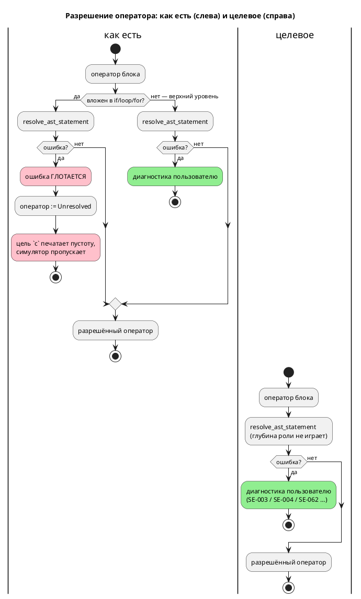

# Фича: Семантическое разрешение тел вложенных операторов

- **Номер:** 0155
- **Статус:** ГОТОВО
- **Зависит от:** нет
- **Tier:** 1
- **Связанные issue (анализ):** кандидат блока 2 `FEATURES.md` (вскрыт приёмкой [устранение переполнения стека на глубине выражений и операторов](0129-semantic-deep-nesting.md), проба `taktc compile`)

## Стадии жизненного цикла (правило 17)

Все стадии — **разделы этой карточки** (правило 32): «Архитектура (ADR)»,
«Анализ», «Разработка», «Тест-план», «Отчёт о тестировании», «Итог».
Отдельным артефактом остаются только исправления —
[`docs/fixes/`](../fixes/README.md) (при необходимости `0155-YY-*`).

## Краткое описание

Содержимое вложенных операторов **не проходит семантические проверки**:
неизвестный идентификатор внутри `if` компилируется **молча**. Ошибки в таком
коде всплывут в лучшем случае у компилятора целевого языка, в худшем — не
всплывут вовсе.

> Фича зарегистрирована из бэклога кандидатов (отобрана заказчиком 2026-07-28); далее проходит жизненный цикл по правилу 17.

## Что известно на входе

- `always { x := unknown_var_zzz; }` даёт `SE-003`.
- Та же строка **внутри одного `if`** компилируется молча — диагностики нет.
- То же в теле функции.
- Прямое следствие для 0129: контроль глубины у операторов **недостижим**
  (1000 вложенных `if` проходят семантику), он оставлен как защита на будущее.
- Класс — дыра **в покрытии проверок**, а не в коде проверок.

## Направление решения (наметка, не решение)

- Провести разрешение имён (и остальные проверки `validate`) внутрь тел
  вложенных операторов.
- Ожидаемый побочный эффект: корпус `examples/` и фикстуры могут начать
  давать новые диагностики — до сих пор такой код принимался. Это не регресс, а
  вскрытие; объём правки корпуса надо оценить в анализе **до** реализации.
- После правки станет достижим контроль глубины `SE-062` (0129) — проверить.

Окончательный выбор — за стадиями **архитектуры** (ADR) и **анализа**: раздел
выше фиксирует то, что уже проверено, а не предрешает реализацию.

## Документирование (правило 24)

**Требуется.** Программы, которые сегодня компилируются, начнут отвергаться —
затронут раздел [`book/src/16-diagnostics/`](../../book/src/16-diagnostics/index.typ)
(диагностики) и раздел об области видимости имён.

## Архитектура (ADR)

- **Status:** Accepted
- **Date:** 2026-07-29
- **Authors:** Архитектор + системный аналитик
- **Related issues:** [Фича](0155-semantic-nested-statement-resolution.md);
  смежные — [ADR](0129-semantic-deep-nesting.md#архитектура-adr) (контроль глубины `SE-062`),
  [ADR](0130-diagnostics-batch.md#архитектура-adr) (несколько диагностик за прогон)

### Context

Разрешение операторов (`semantic/statement.rs::resolve_ast_statement`) устроено
несимметрично по глубине. Оператор **верхнего уровня** блока разрешается через
`?` — ошибка всплывает и становится диагностикой. Тело **вложенного** оператора
(`if`, `else`, `while`/`loop`, `for`: инициализатор и тело) разрешается через
`.unwrap_or_else(|_| StatementNode::Unresolved(...))` — ошибка **глотается**, а
оператор остаётся `Unresolved`.

Дальше `Unresolved` **не доезжает ни до какой диагностики**: цель `c`
(`generator/c/c_expr/stmt.rs:67`) печатает его как **пустоту**, симулятор
(`takt-sim/src/unit/statement.rs:210`) возвращает `Flow::Normal`. То есть
оператор не «не проверен» — он **исчезает из программы молча**. Цели `rust` и
`sv` на `Unresolved` дают ошибку, но это лишь означает, что до пользователя
дефект доходит случайно и зависит от выбранной цели.

Замер (зонды `taktc compile -t c`, 2026-07-29):

| Место оператора | Сегодня |
|---|---|
| тело `always`/`enter`, верхний уровень | `SE-003` ✔ |
| тело функции, верхний уровень | `SE-003` ✔ |
| плечо `match` | `SE-003` ✔ |
| **внутри `if` / `else`** | **молча принято, тело выброшено** |
| **внутри `while` / `loop`** | **молча принято, тело выброшено** |
| **внутри `for`** | **молча принято, тело выброшено** |
| **`: [Guard] …` в блоке** | **ошибка разрешения условия глотается, формула выброшена** |

Порождённый C для `always { if x > 0 { x := unknown_var_zzz; } }`:

```c
    if (model->x > 0) {
    }
```

Ошибки нет, тела нет. У inline-`Guard` в блоке — тот же механизм в другом
обличье: `filter_map(|c| resolve_condition(c, …).ok())` **выбрасывает из списка**
формулу, чьё условие не разрешилось, и контроль молча перестаёт контролировать.

**Границу здесь легко провести не там.** `resolve_condition` **неизвестное
имя ошибкой не считает** — она возвращает `Ok(ConditionNode::Unresolved(…))`
(это инвариант рёбер `ref`, где условие намеренно не разрешается), а `SE-025`
поднимает позже `validate`. Поэтому глотание в inline-`Guard` прячет не
`SE-003`, а ошибки самого разрешения — например `SE-062` (замер: 60 скобок в
`: [Guard]` — «Скомпилировано» до правки, `SE-062` после). Случай «в
inline-`Guard` написано неизвестное имя» диагностируется молчанием **по другой
причине**: `validate` не обходит формулы вовсе — это видно и на уровне
состояния, вне всякой вложенности (`start A { : [Guard] неизвестное; }` — тишина,
тогда как `invariant Safe = неизвестное;` даёт `SE-025`, потому что
десахаризуется в `cond`). Отдельный дефект — **вне** объёма 0155, заводится
кандидатом.

Обоснование глотания записано в док-комментарии модуля: «позволяет обрабатывать
код с встроенными функциями (`debug`, `S`) без предварительной регистрации
встроенных символов». Обоснование **устарело**: встроенные функции
зарегистрированы в `semantic/builtin.rs` (`debug`, `S`, `min`, `max`, `abs`,
`clamp`) и разрешаются штатно. Зонд подтверждает: `debug(x)` на верхнем уровне
блока — где глотания нет — компилируется без ошибки.

Поток «как есть» и целевой:



### Decision Drivers

1. **Молчаливая потеря кода — худший класс дефекта.** Программа принимается, а
   исполняется не та, что написана. Это прямое нарушение цели проекта
   (правило 12): язык синтеза автоматов промышленных систем управления не имеет
   права терять оператор без единого слова.
2. **Диагностика не должна зависеть от глубины вложенности.** Один и тот же
   текст даёт `SE-003` вне `if` и тишину внутри `if` — это не свойство языка, а
   артефакт реализации.
3. **Обратная совместимость (правило 11).** Замер: 276 файлов `.takt`
   (`examples/`, `book/src/**`, `takt-lang/tests/data/`, `takt-sim/tests/data/`)
   дают **побайтно одинаковый** вывод до и после снятия глотания; полный прогон
   `cargo test --all-features` — зелёный. Отвергаемая программа — только та,
   которая **уже была неверна**.
4. **Контроль глубины 0129 должен работать.** `SE-062` для операторов сегодня
   недостижим: его `Err` глотается тем же механизмом. Замер: 60 вложенных `if`
   — сегодня «Скомпилировано», после снятия глотания — `SE-062`.

### Considered Options

#### Option A. Пробрасывать ошибку разрешения из вложенного тела (паритет с верхним уровнем)

Снять `.unwrap_or_else(|_| Unresolved(...))` в пяти местах `statement.rs`
(`if`-then, `if`-else, тело цикла, `for`-init, `for`-body) и `filter_map(...ok())`
в inline-`Guard`; всюду — `?`.

**Pros:**
- Диагностика перестаёт зависеть от глубины — инвариант формулируется одной
  фразой и проверяется тестом.
- Снимает молчаливую потерю кода во всех целях сразу (правится ядро, а не цель).
- Делает достижимым `SE-062` (закрывает долг 0129).
- Нулевая цена совместимости — доказано замером (драйвер 3).
- Правка мала и локальна: один модуль, шесть мест.

**Cons:**
- Стадии построения терминальны  — первая же ошибка во вложенном теле
  прекращает разбор, дальнейшие ошибки того же файла не показываются. Это
  поведение **уже** действует для верхнего уровня; фича его не ухудшает, а
  распространяет.

#### Option B. Оставить `Unresolved`, но выдать предупреждение

Тело остаётся `Unresolved`, пользователь получает предупреждение «оператор не
разрешён и не будет исполнен».

**Pros:**
- Формально аддитивно: ничего ранее компилировавшегося не отвергается.

**Cons:**
- Узаконивает потерю кода: программа продолжает исполняться **не так**, как
  написана, а предупреждение легко не заметить (`--quiet` их глушит).
- Предупреждение о неизвестном имени — подмена: `SE-003` есть **ошибка** языка,
  и делать её предупреждением по признаку «оператор оказался вложенным» — это
  два разных языка в одном компиляторе.
- Не чинит `SE-062`: предел вложенности как предупреждение бессмыслен.

#### Option C. Оставить ядро как есть, требовать ошибки от каждой цели

Ядро продолжает отдавать `Unresolved`, а цели `c`/`plantuml`/симулятор
приводятся к поведению `rust`/`sv` — отказ на `Unresolved`.

**Pros:**
- Ядро не трогается.

**Cons:**
- Диагностику по одному предмету пришлось бы завести **в шести потребителях**, и
  они разъедутся молча — ровно тот класс дрейфа, который проект уже оплатил
  (CI-проверки, копия формата позиции 0028-01).
- Сообщение получается о следствии («неразрешённый оператор»), а не о причине
  («идентификатор не найден»), причём **без позиции** — координата теряется
  вместе с разрешением.
- Ломает законных потребителей `Unresolved`: ветка `_ =>` (`Assembly`,
  `Formula`, `StraySemicolon`) отдаёт `Unresolved` **штатно**, и цель, отвергающая
  любой `Unresolved`, начнёт отвергать их.

### Decision

Принимается **Option A**. Дефект лежит в ядре — там и правится; пять
однотипных мест и одно место inline-`Guard` заменяются на `?`. Устаревшее
обоснование глотания в док-комментарии модуля переписывается: оно ссылается на
проблему, снятую заведением `semantic/builtin.rs`, и именно оно удерживало
дефект.

Option B отвергнута как узаконивание потери кода, Option C — как размножение
одной диагностики по шести потребителям с потерей причины и позиции.

**Язык не меняется** — меняется полнота его проверки: ни синтаксис, ни семантика
корректной программы не затронуты (доказано побайтным равенством вывода на 276
файлах). Подъёма версии языка правило 22 здесь не требует: множество
**корректных** программ и их смысл прежние. Сужается лишь множество программ,
которые компилятор ошибочно принимал.

### Consequences

#### Положительные

- Оператор во вложенном теле больше не исчезает из порождённого кода молча.
- `SE-003`/`SE-004`/`SE-062` и прочие ошибки разрешения работают на любой
  глубине; контроль глубины 0129 становится достижимым.
- Inline-`Guard` с неразрешимым условием перестаёт молча исчезать — проверка
  безопасности либо есть, либо программа отвергнута.
- Классы диагностик у целей `c`/`plantuml`/симулятора выравниваются с `rust`/`sv`
  без правки самих целей.

#### Отрицательные / Action items

- **A-1.** Программа с ошибкой во вложенном теле, ранее компилировавшаяся,
  теперь отвергается. В корпусе таких нет (замер), но у стороннего пользователя
  быть могут. Фиксируется в `CHANGES.md` как изменение поведения инструмента.
- **A-2.** Терминальность стадий построения  распространяется на
  вложенные тела: за прогон показывается первая ошибка разрешения. Накопление
  диагностик внутри стадий — предмет фичи
  [накопление диагностик внутри отдельной проверки `validate`](0151-diagnostics-batch-within-check.md), не этой.
- **A-3.** Правило 29 (редакторский слой): новых токенов, форм объявления и
  узлов АСД фича не вводит; новых кодов диагностик не заводит. Диагностика
  доезжает до LSP автоматически — сервер и `taktc` ходят через общий вход
  `collect_compile_diagnostics` (0130). Проверить фактом, а не рассуждением
  (тест LSP на вложенном теле), и зафиксировать в отчёте.
- **A-4.** Тест `takt-lang/tests/semantic/deep_nesting_tests.rs` содержит запись о
  недостижимости контроля операторов — после правки она **неверна** и должна
  быть заменена работающей проверкой.

#### Acceptance criteria

1. `always { if x > 0 { x := unknown_var_zzz; } }` даёт `SE-003` с позицией;
   то же для `else`, `while`/`loop`, `for` (инициализатор и тело), тела функции
   и вложенности в `match`.
2. Ошибка **разрешения** условия inline-`Guard` в блоке больше не глотается:
   `: [Guard]` с условием глубже предела даёт `SE-062`, а не тишину.
   Неизвестное **имя** в inline-`Guard` этим не закрывается (другая причина —
   `validate` не обходит формулы); заведено кандидатом.
3. 60 вложенных `if` дают `SE-062` (контроль достижим); тест недостижимости
   заменён.
4. Вывод компилятора на всех 276 файлах корпуса, документа и фикстур —
   **побайтно прежний**; `./scripts/precheck.sh` зелёный.
5. Порождённый C для валидного вложенного тела не изменился (тело на месте).

## Анализ

- **Дата:** 2026-07-29
- **Роль:** системный аналитик

### 1. Что оказалось не так, как записано в карточке

Карточка описывала дефект как **дыру в покрытии проверок**: «неизвестный
идентификатор внутри `if` компилируется молча». Зонды показали, что это описание
**мягче факта** по двум пунктам.

1. **Теряется не диагностика, а код.** Неразрешённый оператор остаётся
   `StatementNode::Unresolved`, а цель `c` печатает его **пустотой**
   (`generator/c/c_expr/stmt.rs:67`), симулятор — пропускает
   (`takt-sim/src/unit/statement.rs:210`). Программа компилируется и исполняется
   **без** написанного оператора. Порождённый C:

   ```c
   /* always { if x > 0 { x := unknown_var_zzz; } } */
       if (model->x > 0) {
       }
   ```

2. **Тело функции проверяется, а карточка утверждала обратное.** Запись «то же в
   теле функции» **опровергнута**: оператор верхнего уровня тела функции даёт
   `SE-003` (зонд `n5_fn_top`). Тишина наступает не от того, что оператор в
   функции, а от того, что он **вложен** — в `if`, `else`, `while`/`loop`, `for`.
   Внутри функции это выглядит так же, как внутри `always`.

Дополнительно вскрыт **не названный в карточке** случай того же класса:
inline-`Guard` (`: [Guard] условие;`) в теле блока разрешается через
`filter_map(|c| resolve_condition(c, …).ok())` — условие, чьё **разрешение
завершилось ошибкой**, молча выбрасывается из списка, и проверка безопасности
исчезает, не оставив следа. Замер: 60 скобок в `: [Guard]` — «Скомпилировано» до
правки, `SE-062` после.

**Что этим не чинится (и почему граница проведена именно так).**
`resolve_condition` неизвестное имя ошибкой **не считает**: она возвращает
`Ok(ConditionNode::Unresolved(…))` — это инвариант рёбер `ref`, где условие
намеренно остаётся неразрешённым, а `SE-025` поднимает позже `validate`. Поэтому
`: [Guard] неизвестное_имя > 0;` молчит **не** из-за глотания. Проба показывает
причину: то же молчание даёт форма **на уровне состояния**
(`start A { : [Guard] неизвестное; }`), где никакой вложенности нет, тогда как
`invariant Safe = неизвестное;` даёт `SE-025` — потому что десахаризуется в
`cond`, а `cond` обходится `validate`. Корень — **`validate` не обходит
формулы**; это отдельный дефект, заведён кандидатом в `FEATURES.md` (правило 7)
и в объём 0155 не входит.

Плечо `match` тишины **не** даёт (зонд `n8_match`): оно разрешается через
`resolve_statement(...)?`. Дефект — ровно у пяти позиций `if`/цикла плюс
inline-`Guard`.

### 2. Замер объёма (то, что карточка требовала оценить до реализации)

Карточка предупреждала: «корпус `examples/` и фикстуры могут начать давать новые
диагностики; объём правки корпуса надо оценить в анализе **до** реализации».

**Замер выполнен экспериментальной сборкой** (глотание снято, ошибка
проброшена `?`), прогон `taktc compile -t c` по **276** файлам `.takt`:
`examples/`, `book/src/**/examples/`, `takt-lang/tests/data/`,
`takt-sim/tests/data/`. Сравнение вывода «до» и «после»:

```
=== строк различий: 0 из 276 ===
```

Полный `cargo test --all-features -- --test-threads=1` на экспериментальной
сборке — **зелёный** (0 падений).

**Вывод: правка корпуса не требуется вовсе.** Опасение карточки не подтвердилось,
и это объяснимо: корпус пишется и проверяется прогонами, а молча выброшенный
оператор в нём тут же дал бы неверное поведение симуляции.

### 3. Точки правки (шесть мест, один модуль)

Все — в `takt-lang/src/semantic/statement.rs::resolve_ast_statement`:

| № | Место | Было |
|---|---|---|
| 1 | `if` — ветвь `then` | `.unwrap_or_else(\|_\| Unresolved(…))` |
| 2 | `if` — ветвь `else` | то же, внутри `.map(…)` |
| 3 | `loop`/`while` — тело | `.unwrap_or_else(…)` |
| 4 | `for` — инициализатор | то же, внутри `.map(…)` |
| 5 | `for` — тело | то же, внутри `.map(…)` |
| 6 | `: [Guard] …` в блоке | `filter_map(\|c\| resolve_condition(…).ok())` |

Место 6 закрывает **глотание ошибки разрешения** (напр. `SE-062`), а не
случай «неизвестное имя» — см. врезку в §1.

Места 2, 4, 5 стоят внутри `Option::map`, поэтому пробрасывание оформляется как
`.map(…)` → `.transpose()?` → `.map(Box::new)`; место 6 — как
`.collect::<Result<Vec<_>, _>>()?`.

**Условия** этих же операторов (`if cond`, `while cond`, `for` cond/step) уже
сегодня разрешаются через `?` — асимметрия «условие проверяем, тело нет» была
чисто случайной.

### 4. Почему глотание вообще появилось и почему его обоснование мертво

Док-комментарий модуля объясняет глотание так: «Если выражение в операторе не
может быть разрешено (например, ссылка на **необъявленную встроенную функцию**),
весь оператор сохраняется в виде `Unresolved` — ошибка не пробрасывается наверх.
Это позволяет обрабатывать код с встроенными функциями (`debug`, `S` и т.п.) без
предварительной регистрации встроенных символов».

Обоснование **устарело**: встроенные функции с тех пор зарегистрированы в
`semantic/builtin.rs` (`debug`, `S`, `min`, `max`, `abs`, `clamp`) и разрешаются
штатно. Доказательство — зонд: `always { debug(x); }` **на верхнем уровне**, где
глотания нет и ошибка прошла бы наверх, компилируется без единой диагностики.

Это и есть механика долголетия дефекта: комментарий объяснял, почему трогать
нельзя, — и его читали вместо кода. Урок фиксируется в отчёте.

Отдельно: цель `c` **намеренно** не транслирует `debug`/`S`
(`c_expr/call.rs:105`) — это её свойство, к разрешению отношения не имеющее.
Ветка `_ =>` в `resolve_ast_statement` (`Assembly`, `Formula`, `Args`, `Error`,
`StraySemicolon`) отдаёт `Unresolved` через **`Ok`**, а не `Err`, и правкой не
затрагивается: законные потребители `Unresolved` остаются жить.

### 5. Побочный эффект: контроль глубины 0129 становится достижимым

`resolve_ast_statement` открывается контролем `validate::depth::enter(None)`. Его `Err` глотался тем же механизмом, поэтому предел вложенности
**операторов** не работал — это записано в `CLAUDE.md` как открытый долг
(«контроль операторов сегодня недостижим»).

Замер: 60 вложенных `if` — «Скомпилировано» до правки, **`SE-062`** после.
Запись в `CLAUDE.md` и заметка в шапке `deep_nesting_tests.rs` после закрытия
фичи становятся неверными и правятся (action A-4 ADR).

### 6. Обратная совместимость (правило 11)

Совместимость **сохраняется для корректных программ** и намеренно нарушается для
некорректных:

- множество **корректных** программ и их смысл — прежние (побайтное равенство
  вывода на 276 файлах);
- программа с ошибкой во вложенном теле, ранее принимавшаяся, теперь
  отвергается. Обоснование: она компилировалась **не в тот код, что написан**, —
  сохранять такую совместимость значит сохранять дефект.

**Версия языка не поднимается** (правило 22): синтаксис и семантика не меняются,
меняется полнота проверки. Версия крейта `takt-lang` растёт по SemVer как
minor — поведенческая правка без изменения публичного API.

### 7. Зависимости и связи с другими фичами (правило 17)

- **Зависит от:** нет (правка локальна в ядре семантики).
- **Смежные, но не блокирующие:**
  - [накопление диагностик внутри отдельной проверки `validate`](0151-diagnostics-batch-within-check.md) — накопление
    диагностик **внутри** проверки; здесь диагностика остаётся одной за прогон
    (терминальность стадий) — это её предмет, не наш;
  - [ограничение глубины вложенности на уровне лексера/парсера](0156-parser-depth-limit.md) — предел глубины на уровне
    лексера/парсера; после 0155 контроль семантики работает, но потолки печати
    форматтера и `Clone` АСД остаются её предметом;
  - [исчерпывающий разбор узлов во втором вычислителе `builder.rs::eval_expr`](0163-builder-eval-exhaustive.md) — второй вычислитель
    симулятора с `_ => None`; тот же класс «тихой» ветки, но другой слой.
- **Разблокирует:** ничего формально; фактически снимает открытый долг 0129.

### 8. Редакторский слой (правило 29)

Изменение затрагивает **семантику проверки**, поэтому ответ фиксируется:

- **новых токенов / ключевых слов нет** → `lsp/semantic_tokens.rs`,
  `lsp/keywords.rs::BUT_KEYWORDS`, `TaktTokenTypes.KEYWORDS` плагина IntelliJ —
  правок не требуют;
- **новых форм объявления и узлов АСД нет** → `navigation/TaktSymbolScanner`,
  `semantic/usages/walk.rs`, `format/`, `lsp/symbols.rs` — не требуют;
- **новых кодов диагностик нет** — используются существующие `SE-003`,
  `SE-004`, `SE-062` и прочие ошибки разрешения;
- **доставка диагностики в редактор** — сервер и `taktc` ходят через общий вход
  `collect_compile_diagnostics` (0130), поэтому новая диагностика доезжает до
  LSP тем же путём. Это **проверяется тестом**, а не рассуждением: правило 29
  заведено ровно потому, что «должно доехать» и «доезжает» — разные утверждения.

### 9. Риски

- **Р-1. Ошибка теперь терминальна раньше.** Файл с ошибкой во вложенном теле
  перестаёт строить дерево, и последующие проверки (`validate`) по нему не
  идут — пользователь видит одну ошибку вместо возможных нескольких. Смягчение:
  так уже работает верхний уровень; накопление — предмет 0151.
- **Р-2. Скрытые потребители `Unresolved`-операторов.** Если какой-то слой
  рассчитывал получить `Unresolved` из вложенного тела, он перестанет их
  получать. Проверка: полный прогон тестов зелёный; ветка `_ =>` (законный
  источник `Unresolved`) не затронута.
- **Р-3. Регресс «обратно в тишину».** Механизм тривиально возвращается одной
  правкой `?` → `.unwrap_or_else(…)`. Смягчение: контроль на **каждую** из шести
  точек (тест, а не комментарий).

### 10. План разработки

| Подзадача | Содержание |
|---|---|
| [семантическое разрешение тел вложенных операторов](0155-semantic-nested-statement-resolution.md#разработка) | Снять глотание в шести точках `statement.rs`; переписать устаревший док-комментарий модуля |
| [семантическое разрешение тел вложенных операторов](0155-semantic-nested-statement-resolution.md#разработка) | Контроля: фикстуры + тесты на все шесть точек, тест достижимости `SE-062` для операторов, тест доставки диагностики в LSP |
| [семантическое разрешение тел вложенных операторов](0155-semantic-nested-statement-resolution.md#разработка) | Документ `book/` (правило 24) и актуализация `CLAUDE.md`/`CHANGES.md`/`README.md` |

## Разработка

### Задача

#### Что было

`semantic/statement.rs::resolve_ast_statement` разрешал тела вложенных операторов
через `.unwrap_or_else(|_| StatementNode::Unresolved(…))` — ошибка **глоталась**,
оператор оставался `Unresolved`. Дальше цель `c` печатала его **пустотой**
(`generator/c/c_expr/stmt.rs`), симулятор — пропускал
(`takt-sim/src/unit/statement.rs`). Итог: программа принята, оператор исчез.

```c
/* always { if x > 0 { x := unknown_var_zzz; } } */
    if (model->x > 0) {
    }
```

Условия тех же операторов (`if cond`, `while cond`, `for` cond/step) при этом
разрешались через `?` — асимметрия «условие проверяем, тело нет» была случайной.

#### Что сделано

Шесть точек, один модуль (`takt-lang/src/semantic/statement.rs`):

| № | Место | Стало |
|---|---|---|
| 1 | `if` — ветвь `then` | `resolve_ast_statement(…)?` |
| 2 | `if` — ветвь `else` | `.map(…)` → `.transpose()?` |
| 3 | `loop`/`while` — тело | `resolve_ast_statement(…)?` |
| 4 | `for` — инициализатор | `.map(…)` → `.transpose()?` |
| 5 | `for` — тело | `.map(…)` → `.transpose()?` |
| 6 | `: [Guard] …` в блоке | `filter_map(…ok())` → `collect::<Result<_,_>>()?` |

**Точка 6 закрывает не то, что кажется.** Она снимает глотание ошибки
**разрешения** (например `SE-062`), а не случай «в `Guard` написано неизвестное
имя»: `resolve_condition` неизвестное имя ошибкой не считает — возвращает
`Ok(ConditionNode::Unresolved(…))` (инвариант рёбер `ref`). Молчание на
неизвестном имени в формуле имеет другой корень — `validate` не обходит формулы
вовсе, что видно и вне вложенности (`start A { : [Guard] неизвестное; }` молчит,
а `invariant Safe = неизвестное;` даёт `SE-025`, потому что десахаризуется в
`cond`). Заведено кандидатом, в объём 0155 не входит.

**Побочная правка в `for`, без которой фича внесла бы утечку.** Переменная
цикла регистрируется в `model.variables` до разрешения `cond`/`step`/`body` и
снимается после. Пока тело глоталось, отказ мог прийти только из `cond`/`step`;
теперь его даёт и тело — и ранний `?` перепрыгнул бы через
`unregister_local_vars`, оставив `i` в модели фантомом. Разрешение трёх частей
вынесено в блок, снятие регистрации выполняется **до** `?`.

**Док-комментарий модуля переписан.** Прежний объяснял глотание так: «позволяет
обрабатывать код с встроенными функциями (`debug`, `S`) без предварительной
регистрации встроенных символов». Обоснование мертво — встроенные функции
зарегистрированы в `semantic/builtin.rs`; проба: `debug(x)` **на верхнем
уровне**, где глотания нет, компилируется без диагностики. Именно этот
комментарий и удерживал дефект: его читали вместо кода.

**Функциональность (правило 11).** Языковые конструкции не менялись — «н/п» для
грамматики, АСД, форматтера, слоя использований и редакторского слоя; затронуто
только ядро семантики. Обратная совместимость корректных программ доказана
побайтным равенством вывода (см. «Проверки»).

#### Проверки

- Вывод `taktc compile -t c` на **276** файлах (`examples/`, `book/src/**`,
  `takt-lang/tests/data/`, `takt-sim/tests/data/`) — **побайтно прежний**
  (`diff` пуст).
- `cargo clippy --all-features --all-targets` — ноль предупреждений.
- `cargo test --all-features -- --test-threads=1` — зелёный.
- Контроля — [семантическое разрешение тел вложенных операторов](0155-semantic-nested-statement-resolution.md#разработка).

### Задача

#### Что было

Покрытия не было вовсе: ни один тест не проверял, что оператор во вложенном теле
доезжает до диагностики или до порождённого кода. Возврат глотания — правка в
одну строку на каждую точку, и она прошла бы незамеченной.

#### Что сделано

**Фикстуры** — `takt-lang/tests/data/nested0155/` (правило 16: примеры и
контрпримеры): восемь контрпримеров (по одному на точку плюс вложенность в теле
функции и в плече `match`) и один пример корректных вложенных тел.

**Тесты** — `takt-lang/tests/semantic/nested_statement_resolution_tests.rs`, 12 штук:

| Тест | Что доказывает |
|---|---|
| `unknown_identifier_in_if_then_is_diagnosed` | точка 1 |
| `unknown_identifier_in_if_else_is_diagnosed` | точка 2 |
| `unknown_identifier_in_while_body_is_diagnosed` | точка 3 |
| `unknown_identifier_in_loop_body_is_diagnosed` | точка 3 через синоним `loop` |
| `unknown_identifier_in_for_init_is_diagnosed` | точка 4 |
| `unknown_identifier_in_for_body_is_diagnosed` | точка 5 |
| `resolution_error_in_inline_guard_is_diagnosed` | точка 6 (через `SE-062` — см. оговорку 0155-01) |
| `unknown_identifier_nested_in_function_body_is_diagnosed` | вложенность внутри `fn` |
| `unknown_identifier_nested_in_match_arm_is_diagnosed` | вложенность внутри плеча `match` |
| `valid_nested_bodies_are_still_accepted` | контроль направления: корректное не отвергается |
| `valid_nested_body_is_emitted_into_generated_c` | **тело доезжает до C** |
| `nested_diagnostic_reaches_lsp` | правило 29: диагностика доходит до редактора |

**`valid_nested_body_is_emitted_into_generated_c` — не декорация.**
Диагностика доказывает половину: что ошибка не молчит. Вторая половина — что
корректное тело **не выброшено**; ровно эта половина и была сломана. Тест читает
порождённый `.c` и требует в нём тела обеих ветвей.

**Достижимость контроля глубины** — `takt-lang/tests/semantic/deep_nesting_tests.rs`:
добавлены `deep_statement_nesting_is_diagnosed` (60 вложенных `if` → `SE-062`) и
контроль направления `statement_nesting_within_limit_is_accepted`. Заметка в шапке
файла про недостижимость контроля операторов исправлена — после 0155 она неверна.

#### Проверки

**Мутационная проверка взведённости ловушки** (урок: «контроль, не
проверяющий взведённость ловушки, проверяет собственную удачу»). Глотание
возвращено в точку 1 (`if`-then):

```
test unknown_identifier_in_if_then_is_diagnosed ... FAILED
test unknown_identifier_nested_in_function_body_is_diagnosed ... FAILED
test unknown_identifier_nested_in_match_arm_is_diagnosed ... FAILED
test nested_diagnostic_reaches_lsp ... FAILED
test result: FAILED. 7 passed; 4 failed
```

Мутация снята, все 12 зелёные; `deep_nesting_tests` — 8 из 8.

### Задача

#### Что было

Раздел «Управляющие конструкции» документа `book/` описывал `if`/`match`/циклы,
но **молчал об области видимости и о проверке тел**. Молчание читалось как
разрешение: программа с опечаткой внутри `if` действительно принималась, и
документ этому не противоречил.

В живом контексте `CLAUDE.md` стояла запись «контроль операторов сегодня
недостижим… (кандидат)» — после фичи она неверна.

#### Что сделано

**`book/src/06-control-flow/index.typ`** (правило 24 — меняется наблюдаемое
поведение конструкции):

- подраздел **«Вложенность не ослабляет проверок»**: тело `if`/`else`/цикла/ветви
  `match` проверяется так же, как тело блока целиком; пример с опечаткой внутри
  `if`; правила видимости (переменные и константы модели, параметры функции,
  локальные объявления объемлющих блоков; затенение; область счётчика `for`);
  упоминание предела вложенности со ссылкой на диагностику;
- блок **«Частые ошибки»** (правило 26) дополнен `SE-003` и `SE-062` — оба уже
  разобраны в приложении «Ошибки и предупреждения», дублирования нет.

Номеров фич, ссылок на ADR/отчёты и деталей реализации в текст не попало
(правило 24): раздел говорит о **языке** — что проверяется и что видно, — а не о
том, где в компиляторе стояла ошибка.

**Живой контекст и журнал:** `CLAUDE.md` (запись о недостижимом контроле заменена
фактом), `CHANGES.md` (раздел `[Не выпущено]`), `README.md`, `FEATURES.md`
(0155 удалена из таблицы, заведены два кандидата), реестры стадий.

#### Проверки

- `./scripts/precheck.sh` — код возврата `0`; проверка примеров `book/` (правило 27д)
  прошёл: 18 примеров компилируются и симулируются, 1 библиотечный.
- Ссылки Markdown правленых файлов проверены (правило 14).

## Тест-план

### Область и цель

Проверяется, что ошибка разрешения во **вложенном** теле оператора доходит до
пользователя, а корректное вложенное тело — до **порождённого кода**. Второе не
менее важно первого: дефект состоял не в отсутствии сообщения, а в молчаливой
потере оператора, и «починка», выбрасывающая тела громко, была бы не лучше.

Критерии приёмки ADR: A1 (пять точек + функция + `match`), A2 (inline-`Guard`),
A3 (достижимость `SE-062`), A4 (побайтная неизменность вывода на корпусе),
A5 (валидное тело в порождённом C).

### Проверки (условие → ожидаемый результат)

| # | Проверка | Предусловие | Ожидаемый результат | Ссылка |
|---|---|---|---|---|
| T1 | Неизвестное имя в ветви `then` | `if_then_unknown.takt` | `SE-003`, имя названо | A1 |
| T2 | То же в ветви `else` | `if_else_unknown.takt` | `SE-003` | A1 |
| T3 | То же в теле `while` | `while_body_unknown.takt` | `SE-003` | A1 |
| T4 | То же в теле `loop` (синоним) | `loop_body_unknown.takt` | `SE-003` | A1 |
| T5 | То же в инициализаторе `for` | `for_init_unknown.takt` | `SE-003` | A1 |
| T6 | То же в теле `for` | `for_body_unknown.takt` | `SE-003` | A1 |
| T7 | То же во вложенном `if` тела функции | `fn_nested_unknown.takt` | `SE-003` | A1 |
| T8 | То же во вложенном `if` плеча `match` | `match_arm_nested_unknown.takt` | `SE-003` | A1 |
| T9 | Ошибка разрешения условия inline-`Guard` | `: [Guard]` с условием глубже предела | `SE-062`, а не тишина | A2 |
| T10 | Глубокая вложенность операторов | 60 вложенных `if` | `SE-062` | A3 |
| T11 | Вложенность в пределах нормы | тройная вложенность | принимается | A3 (направление) |
| T12 | Корректные вложенные тела | `nested_valid.takt` | ноль диагностик | A5 |
| T13 | **Тело доезжает до C** | `nested_valid.takt`, цель `c` | в `.c` есть тела обеих ветвей | A5 |
| T14 | Диагностика доходит до LSP | `if_then_unknown.takt` через `collect_diagnostics_at` | `SE-003` в списке | A3 ADR, правило 29 |
| T15 | Вывод на корпусе не изменился | 276 файлов `.takt`, цель `c` | `diff` пуст | A4 |
| T16 | Мутация возвращает тишину | глотание возвращено в точку 1 | T1, T7, T8, T14 **краснеют** | взведённость ловушки |

**T16 — обязательная проверка, а не роскошь.** Урок: контроль, не
проверяющий взведённость ловушки, проверяет собственную удачу. Тесты T1–T8
формулируются как «диагностика есть», и без мутации нельзя отличить рабочий
контроль от контроля, который зеленел бы и до правки.

**Чего этот план не проверяет.** Неизвестное **имя** в inline-`Guard`
(`: [Guard] неизвестное;`) остаётся молчаливым и после фичи: причина у него
другая (`validate` не обходит формулы), и она вне объёма 0155 — заведена
кандидатом. Тест T9 намеренно берёт ошибку **разрешения**, а не имя, чтобы план
не утверждал большего, чем сделано.

### Разбивка проверок по функциональности

| Функциональность | Статус | Комментарий |
|---|---|---|
| Ядро семантики (разрешение операторов) | ✅ | T1–T11 |
| Цель `c` | ✅ | T13, T15 |
| Цели `rust`/`sv`/`st`/`plantuml` | ✅ | T15 (вывод неизменен); своих правок нет |
| Симулятор | ✅ | T15 + полный прогон тестов `takt-sim` |
| LSP | ✅ | T14 |
| Плагины редакторов | — | новых токенов/форм/узлов нет (правило 29, зафиксировано в анализе) |
| Грамматика, АСД, форматтер, слой использований | — | не затронуты |

<!-- Легенда: ✅ пройдено · ❌ провалено · ⬜ не проверялось · — не применимо -->

### Тестовые данные и окружение

- Фикстуры: `takt-lang/tests/data/nested0155/` — 8 контрпримеров + 1 пример.
- Тесты: `takt-lang/tests/semantic/nested_statement_resolution_tests.rs` (12),
  `takt-lang/tests/semantic/deep_nesting_tests.rs` (+2).
- Команды: `cargo test --all-features -- --test-threads=1`,
  `./scripts/precheck.sh`.
- Сверка корпуса: прогон `taktc compile -t c` по всем `.takt` двумя сборками
  (до и после) с `diff` выводов.

## Отчёт о тестировании

### Резюме

**Пройдено, фича готова к закрытию (`ГОТОВО`).** Все 16 проверок тест-плана
зелёные, `./scripts/precheck.sh` — код возврата `0`. Дефектов, требующих
исправлений (`docs/fixes/0155-YY-*`), не найдено.

Окружение: macOS (Darwin 25.5.0), толчейн `1.97.1` (пин `rust-toolchain.toml`),
`cargo test --all-features -- --test-threads=1`, `cc`/`cmake`/`ninja`,
`iec2c` (MatIEC), `verilator`, `yosys`.

### Фактические результаты по проверкам

| # | Проверка | Результат | Комментарий |
|---|---|---|---|
| T1 | Неизвестное имя в ветви `then` | ✅ | `SE-003`, имя `unknown_var_zzz` названо, позиция указана |
| T2 | То же в `else` | ✅ | `SE-003` |
| T3 | То же в теле `while` | ✅ | `SE-003` |
| T4 | То же в теле `loop` | ✅ | `SE-003` — синоним своей лазейки не имеет |
| T5 | То же в инициализаторе `for` | ✅ | `SE-003` |
| T6 | То же в теле `for` | ✅ | `SE-003` |
| T7 | Вложенный `if` в теле функции | ✅ | `SE-003` |
| T8 | Вложенный `if` в плече `match` | ✅ | `SE-003` |
| T9 | Ошибка разрешения условия inline-`Guard` | ✅ | `SE-062` вместо тишины |
| T10 | 60 вложенных `if` | ✅ | `SE-062`; до правки — «Скомпилировано» |
| T11 | Тройная вложенность | ✅ | принимается, предел не сполз |
| T12 | Корректные вложенные тела | ✅ | ноль диагностик |
| T13 | Тело доезжает до C | ✅ | в `.c` обе ветви (`model->x = 5` / `= 7`) |
| T14 | Диагностика доходит до LSP | ✅ | `SE-003` в выдаче `collect_diagnostics_at` |
| T15 | Вывод на корпусе не изменился | ✅ | 276 файлов, `diff` пуст |
| T16 | Мутация возвращает тишину | ✅ | 4 теста краснеют, см. ниже |

**T16 (взведённость ловушки).** Глотание возвращено в точку 1 (`if`-then):

```
test unknown_identifier_in_if_then_is_diagnosed ... FAILED
test unknown_identifier_nested_in_function_body_is_diagnosed ... FAILED
test unknown_identifier_nested_in_match_arm_is_diagnosed ... FAILED
test nested_diagnostic_reaches_lsp ... FAILED
test result: FAILED. 7 passed; 4 failed
```

То есть контроля ловят именно тот дефект, ради которого заведены, а не зеленеют
по случайности.

### Примеры и контрпримеры (правило 16)

`takt-lang/tests/data/nested0155/` — восемь **контрпримеров**
(`if_then_unknown`, `if_else_unknown`, `while_body_unknown`, `loop_body_unknown`,
`for_init_unknown`, `for_body_unknown`, `fn_nested_unknown`,
`match_arm_nested_unknown`) и один **пример** (`nested_valid`). В документ
`book/` (правило 24) перенесены не сами фикстуры, а правило, которое они
защищают: раздел «Управляющие конструкции» получил подраздел «Вложенность не
ослабляет проверок» с примером опечатки внутри `if` и описанием области
видимости, а блок «Частые ошибки» — коды `SE-003` и `SE-062`.

### Результаты по функциональности

| Функциональность | Статус | Факт |
|---|---|---|
| Ядро семантики | ✅ | шесть точек глотания сняты, тесты T1–T11 |
| Цель `c` | ✅ | T13, T15; проверка `cc -c` и `c-hal` в предкоммите зелёные |
| `rust` / `sv` / `st` / `plantuml` | ✅ | T15; проверки `clippy -D warnings`, `verilator`+`yosys`, `iec2c` зелёные |
| Симулятор | ✅ | сверки `conformance_*` и `examples_scenario_tests` зелёные |
| LSP | ✅ | T14 |
| Плагины редакторов | — | правок не требуют (правило 29, обоснование в анализе §8) |

### Что вскрыто сверх карточки

1. **Дефект оказался тяжелее заявленного.** Карточка называла его «дырой в
   покрытии проверок». Фактически терялась не диагностика, а **сам оператор**:
   `Unresolved` печатается целью `c` пустотой и пропускается симулятором, то есть
   программа исполнялась не той, что написана.
2. **Утверждение карточки о теле функции опровергнуто.** Оператор верхнего
   уровня тела функции проверялся и раньше; тишину давала **вложенность**, а не
   расположение в функции.
3. **Шестая точка того же класса** — inline-`Guard` в блоке
   (`filter_map(…ok())`), в карточке не названная.
4. **Долг 0129 закрыт попутно.** Контроль глубины для операторов был недостижим
   ровно потому, что его `Err` глотался; теперь `SE-062` работает и на
   операторах (T10).

### Урок

**Комментарий, объясняющий, почему трогать нельзя, живёт дольше причины.**
Глотание держалось на док-комментарии: «позволяет обрабатывать `debug`, `S` без
предварительной регистрации встроенных символов». К моменту работы встроенные
функции давно зарегистрированы в `semantic/builtin.rs`, и обоснование было
мертво — но его читали вместо кода, и правка выглядела опасной. Проверка заняла
один зонд: `debug(x)` на верхнем уровне, где глотания нет, компилируется без
диагностики.

Отсюда практика: **обоснование в комментарии проверяется пробой, а не
принимается на веру** — особенно когда оно объясняет отступление от общего
правила.

Второй урок, подтверждённый замером: **опасение «правка вскроет корпус» стоит
проверять до того, как оно определит объём фичи.** Карточка требовала оценить
объём правки корпуса; фактический объём — **ноль** файлов из 276.

### Выводы и дальнейшие шаги

- Фича закрывается; исправления не требуются.
- **Заведён кандидат:** `validate` не обходит формулы, поэтому
  `: [Guard] неизвестное_имя;` молчит и после 0155 (проверено: то же молчание на
  уровне состояния, вне всякой вложенности; `invariant Safe = неизвестное;` при
  этом даёт `SE-025`, потому что десахаризуется в `cond`).
- **Заведён кандидат:** `takt-lang/src/semantic/statement.rs` — 999 строк при
  пределе ~1000; следующая правка модуля обязана начинаться с разделения.
- Смежные фичи не разблокированы и не переупорядочены: зависимостей на 0155 нет.

## Итог (что сделано)

**Ошибка разрешения оператора больше не зависит от глубины вложенности.** Шесть
точек в `takt-lang/src/semantic/statement.rs`, где ошибка **глоталась**
(`if`-then, `if`-else, тело `while`/`loop`, инициализатор и тело `for`,
inline-`Guard`), пробрасывают её через `?`. Устаревший док-комментарий модуля,
объяснявший глотание нуждами встроенных функций, переписан — обоснование мертво
с появлением `semantic/builtin.rs`.

**Дефект был тяжелее, чем описывала эта карточка.** Терялась не диагностика,
а **сам оператор**: цель `c` печатала `Unresolved` пустотой, симулятор —
пропускал, то есть `always { if x > 0 { x := неизвестное; } }` компилировался в
`if (model->x > 0) { }` со словом «Скомпилировано». Заодно опровергнут пункт
«то же в теле функции»: верхний уровень тела функции проверялся и раньше —
тишину давала вложенность. Вскрыта шестая точка того же класса (inline-`Guard`),
в карточке не названная.

**Попутно закрыт долг 0129:** контроль глубины для операторов был недостижим ровно
потому, что его `Err` глотался; теперь 60 вложенных `if` дают `SE-062`.

**Совместимость — нулевая цена:** вывод `taktc` на **276** файлах (`examples/`,
`book/src/**`, фикстуры обоих крейтов) **побайтно прежний**, корпус не правился,
версия языка не поднималась (синтаксис и семантика не менялись — изменилась
полнота проверки). Крейт `takt-lang` `0.19.0 → 0.20.0`.

**Контроля:** 12 тестов `takt-lang/tests/semantic/nested_statement_resolution_tests.rs`
(включая «валидное тело доезжает до порождённого C» и доставку диагностики в
LSP) + 2 в `deep_nesting_tests.rs`; фикстуры — `tests/data/nested0155/`.
Взведённость ловушки доказана мутацией. `./scripts/precheck.sh` — зелёный.

Детали: [отчёт](0155-semantic-nested-statement-resolution.md#отчёт-о-тестировании)
(включая урок «обоснование в комментарии проверяется пробой»),
[ADR](0155-semantic-nested-statement-resolution.md#архитектура-adr),
[анализ](0155-semantic-nested-statement-resolution.md#анализ).
