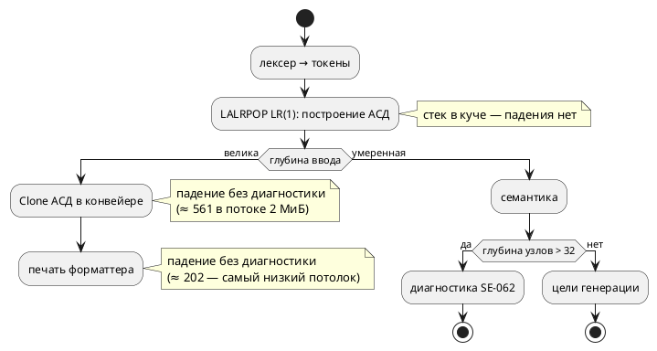
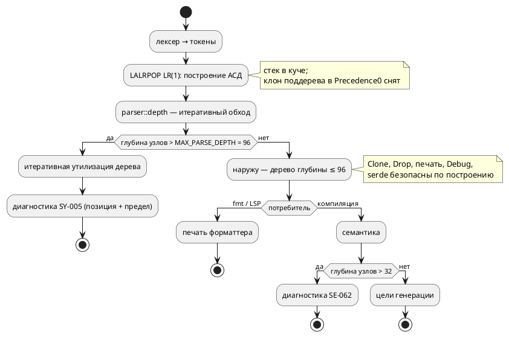

# Фича: Ограничение глубины вложенности на уровне лексера/парсера

- **Номер:** 0156
- **Статус:** ГОТОВО
- **Зависит от:** нет
- **Tier:** 2
- **Связанные issue (анализ):** кандидат блока 2 `FEATURES.md` (замерено приёмкой [устранение переполнения стека на глубине выражений и операторов](0129-semantic-deep-nesting.md))

## Стадии жизненного цикла (правило 17)

Все стадии — **разделы этой карточки** (правило 32): «Архитектура (ADR)»,
«Анализ», «Разработка», «Тест-план», «Отчёт о тестировании», «Итог».
Отдельным артефактом остаются только исправления —
[`docs/fixes/`](../fixes/README.md) (при необходимости `0156-YY-*`).

## Краткое описание

Контроль `SE-062` закрыл семантический спуск, но глубокое дерево всё ещё
**строится**, и на нём падают другие рекурсии — печать форматтера и производный
`Clone` АСД. Ограничение на уровне разбора защитило бы `Clone`, `Drop` и печать
**по построению**.

> Фича зарегистрирована из бэклога кандидатов (отобрана заказчиком 2026-07-28); далее проходит жизненный цикл по правилу 17.

## Что известно на входе

- `taktc fmt` падает на глубоком выражении (рекурсия печати форматтера).
- Производный `Clone` для `ast::Expression` падает на глубоком вводе
  (`verify`/`compile`; подтверждено `lldb`).
- Предел семантики — `MAX_NESTING_DEPTH = 32` (`semantic/validate/depth.rs`),
  диагностика `SE-062`.
- **Замер уточнён на стадии архитектуры** (проба 2026-07-31, таблица в
  [ADR](0156-parser-depth-limit.md#архитектура-adr)): порог печати — **≈ 200** в потоке
  2 МиБ (≈ 880 в главном потоке CLI), а не «~3000», то есть класс достижим и
  **написанным руками** выражением, а не только порождённым текстом. Прежняя
  запись «на порядок выше прежнего, только порождённым текстом» **неверна** и
  снята.

## Направление решения (наметка, не решение)

- Ограничивать вложенность **на уровне лексера/парсера**, чтобы глубокое дерево
  не строилось вовсе.
- Ограничение по скобкам **не покроет** длинные цепочки без скобок
  (`1+1+1+…`) — они тоже дают глубокое дерево; считать надо глубину узлов, а не
  скобок.
- Предел продублирован числом в `tests/deep_nesting_tests.rs` — синхронность
  держит парный контроль `constant_matches_documented_limit`.

Окончательный выбор — за стадиями **архитектуры** (ADR) и **анализа**: раздел
выше фиксирует то, что уже проверено, а не предрешает реализацию.

## Документирование (правило 24)

**Требуется.** Появляется новая граница языка и диагностика — затронут раздел
[`book/src/16-diagnostics/`](../../book/src/16-diagnostics/index.typ) (ограничения
и диагностики).

## Архитектура (ADR)

- **Status:** Accepted
- **Date:** 2026-07-31
- **Authors:** Системный аналитик, архитектор, лид разработки
- **Related issues:** [Фича](0156-parser-depth-limit.md); продолжение
  [ADR](0129-semantic-deep-nesting.md#архитектура-adr) (предел глубины в семантике, `SE-062`)

### Context

[устранение переполнения стека на глубине выражений и операторов](0129-semantic-deep-nesting.md) закрыла переполнение стека
**в семантике**: построение семантического дерева рекурсивно по структуре текста,
и глубина ввода роняла `taktc compile`, `taktc verify` и `takt-sim`. Контроль
`SE-062` (предел `MAX_NESTING_DEPTH = 32`) поставлен в `construct_expression`,
`resolve_condition` и `resolve_ast_statement`.

Но дерево АСД до семантики **строится целиком**, и над ним работают другие
рекурсии — печать форматтера, производный `Clone`, производный `Drop`. Приёмка зафиксировала это как остаточный класс: `taktc fmt` падает без диагностики,
хотя контроль семантики формально стоит. `fmt` семантику **не зовёт вовсе**, то
есть `SE-062` его не защищает по построению.

#### Замер (проба 2026-07-31, сборка debug, arm64)

Потолки измерены бинарным поиском по глубине на двух размерах стека: 8 МиБ
(главный поток CLI) и 2 МиБ (консервативная оценка рабочего потока — столько по
умолчанию у потока теста и у типичного рабочего потока сервера). Вход — два
класса: вложенные скобки `((((1))))` и цепочка без скобок `1+1+1+…` (левое
дерево той же глубины).

| Потребитель дерева | 2 МиБ | 8 МиБ |
|---|---|---|
| Печать форматтера `format_source` (скобки) | **≈ 208** | ≈ 879 |
| Печать форматтера `format_source` (цепочка) | **≈ 202** | ≈ 806 |
| Производный `Clone` АСД | ≈ 561 | ≈ 2246 |
| `parse` вложенных скобок | ≈ 561 | ≈ 2246 |
| `parse` цепочки + `Drop` дерева | ≈ 18 750 | ≈ 71 875 |

Из замера следуют три вывода, определяющие решение.

**1. Сам разбор не рекурсивен.** LALRPOP порождает LR(1)-автомат, его стек живёт
в куче: цепочка из 71 875 узлов разбирается и уничтожается без падения. Значит
глубокое дерево **можно построить безопасно** — падают потребители, а не
построение.

**2. Исключение из пункта 1 — не свойство парсера, а дефект действия грамматики.**
Разбор скобок упирается в тот же потолок, что `Clone` (561 / 2246 — совпадение до
единицы), потому что правило `Precedence0` для `"(" Expression ")"` **клонирует
поддерево**:

```rust
if let Some(Parameter{ ty, name: None, .. }) = &a[0].1 {
    return Expression::Parenthesis(ty.loc(), Box::new(ty.clone()));  // ← клон поддерева
}
```

Скобка редуцируется изнутри наружу, поэтому клонируется всё накопленное
поддерево на **каждом** уровне: рекурсия `Clone` (падение) и квадратичная
стоимость. Проба со снятым клоном (значение перемещается из `ParameterList`)
подняла потолок разбора скобок с ≈ 2246 до ≥ 50 000, то есть до общего потолка
`Drop`; локализация падения — `lldb`, кадр
`<takt_lang::parser::ast_expr::Expression as core::clone::Clone>::clone`.

**3. Самый низкий потолок — печать, и он опасно близок к правдоподобному вводу.**
≈ 200 в потоке 2 МиБ — это не «порождённый текст в мегабайт», а выражение,
которое **можно написать руками** (двести вложенных скобок или сумма двухсот
слагаемых). Печать зовут `taktc fmt` и LSP (`textDocument/formatting`,
`lsp/formatting.rs` — та же `format_source`), то есть падение бьёт по редактору
так же, как до 0129 било по компилятору.

#### Как обрабатывается ввод сейчас



### Decision Drivers

1. **Инструмент не падает на пользовательском вводе.** Тот же драйвер, что у
   0129: отказ без сообщения — худший исход. `taktc fmt` сегодня падает именно
   так.
2. **Библиотеку зовут из LSP.** Переполнение стека в `takt-lang` обрушивает
   редактор; защита обязана работать в **любом** потоке, а не только в главном
   потоке CLI с его 8 МиБ.
3. **Защита должна покрывать всех потребителей дерева, а не перечисленных.**
   Рекурсивны `Clone`, `Drop`, печать, `Debug`, производный `PartialEq`, `serde`
   (за фичей `ast-serde`). Ставить контроль в каждого — работа без конца: следующий
   потребитель добавится молча.
4. **Граница не должна сужать язык фактически.** Семантика уже отвергает глубину
   > 32 (`SE-062`); любой предел разбора **выше** 32 не отнимает ни одной
   программы, которую сегодня принимают.
5. **Соразмерность.** Класс достижим порождённым текстом и очень длинным
   выражением, но не встречается в написанных руками спецификациях. Правка ядра
   грамматики высокого риска здесь — плохая сделка.

### Considered Options

#### Option A. Счётчик вложенности в лексере (баланс скобок)

Лексер линеен, видит `(`/`)`, `{`/`}`, `[`/`]`; при превышении баланса — отказ.

**Pros:**
- Дёшево: пара счётчиков, дерево глубже предела не строится **по построению**.
- Ни один потребитель дерева не может быть забыт: до них дело не доходит.

**Cons:**
- **Не покрывает цепочки без скобок.** Замер: `1+1+…` из 202 слагаемых роняет
  печать при **нулевом** балансе скобок. Пришлось бы добавлять вторую,
  эвристическую метрику («операторов подряд в текущем уровне»), а это перенос
  знания о приоритетах грамматики в лексер — второй источник истины о синтаксисе.
- Оценка сверху заведомо грубая: длинный список аргументов `f(a, b, …)` и
  инициализатор массива глубины не добавляют, а метрику раздувают — законный
  ввод отвергался бы «за компанию».

#### Option B. Отказ при построении узла в действиях грамматики

В каждом конструкторе вложенного узла (`Parenthesis`, бинарные и унарные узлы
`Expression`/`Condition`/`LtlExpr`, операторы) считать глубину нового узла и при
превышении писать ошибку в `parser_errors`, возвращая плоскую заглушку.

**Pros:**
- Дерево глубже предела не существует **никогда** — гарантия по построению, как
  у Option A, но точная (считается глубина узлов, а не скобок).

**Cons:**
- **Десятки точек правки** в `grammar.lalrpop` (только у `Condition` — 14
  конструкторов, у `Expression` — цепочка `Chain<Atom>` плюс `Precedence0`, плюс
  LTL и операторы). Пропуск одной точки не виден ни компилятору, ни тесту.
- Глубина узла при редукции неизвестна: её надо либо вычислять обходом (O(предел)
  на узел), либо вести теневой стек глубин, который **рассинхронизируется** при
  восстановлении после ошибки (`!` в грамматике у нас используется).
- Правка грамматики — самое дорогое место для ошибки: ошибка здесь меняет
  разбираемый язык молча.

#### Option C. Проверка глубины сразу после разбора, в единой точке `parse`

`parse` после успешного разбора обходит АСД **итеративно** (явный стек, без
рекурсии) и при глубине выше предела возвращает диагностику вместо дерева.
Дополняется двумя вещами, без которых гарантия неполна: **итеративной
утилизацией** отвергнутого дерева (иначе его уничтожит рекурсивный `Drop`) и
**снятием клона** в `Precedence0` (иначе разбор скобок падает до всякой проверки).

**Pros:**
- **Одна точка** — `parse`. Через неё идут все инструменты: `taktc compile`,
  `verify`, `fmt`, `takt-sim`, LSP, форматтер. Ни один потребитель не может быть
  забыт, и новый потребитель защищён автоматически (драйвер 3).
- Наружу выходит дерево глубины ≤ предела, поэтому `Clone`, `Drop`, печать,
  `Debug`, `PartialEq` и `serde` безопасны **по построению** — их чинить не надо.
- Обход считает глубину **узлов** (точная метрика), а не скобок; ложных
  срабатываний на списках аргументов нет.
- Грамматика не трогается (кроме снятия клона, которое ценно само по себе:
  устраняет квадратичную стоимость разбора скобок).

**Cons:**
- Глубокое дерево всё-таки **строится** и занимает память до проверки (для
  отвергаемого ввода — впустую).
- Требуется исчерпывающий обход АСД: новый узел, не разобранный обходом, не
  считается. Лечится тем же приёмом, что в `semantic/usages/walk.rs` —
  `deny(clippy::wildcard_enum_match_arm)`, то есть `_ =>` не соберётся.
- Утилизация отвергнутого дерева — отдельный механизм, который надо написать и
  держать исчерпывающим (та же дисциплина).

#### Option D. Убрать рекурсию у потребителей (ручные `Clone`/`Drop`/печать)

**Pros:**
- Границы языка не появляется вовсе.

**Cons:**
- Ручной `Drop` для типа с `Box`-полями **запрещает частичное перемещение** из
  значения (E0509) — а семантика разбирает АСД `match`-ем по значению. Правка
  расползается по всему ядру.
- Печать форматтера и производные `Clone`/`Debug`/`PartialEq`/`serde` пришлось бы
  переписать вручную и держать вручную **вечно**: каждый новый узел языка — новая
  порция ручного кода. Это ровно тот долг, который проект гасит атрибутом
  исчерпаемости, а не размножает.
- Не решает исходную задачу целиком: остаются рекурсии, которых мы ещё не знаем
  (драйвер 3).

#### Option E. Увеличить стек рабочих потоков

**Pros:**
- Одна строка.

**Cons:**
- Отвергнуто ещё в 0129 по той же причине: лечит симптом и только у CLI;
  библиотека остаётся источником падения для LSP и любого встраивающего кода,
  а порог просто сдвигается.

### Decision

Принимается **Option C** — проверка глубины в единой точке `parse`, с двумя
обязательными дополнениями.

**Состав решения.**

1. **Модуль `parser::depth`** — итеративный (явный стек в куче) обход АСД,
   возвращающий глубину или первое место, где предел превышен. Обход
   исчерпывающий: `deny(clippy::wildcard_enum_match_arm)`, как в
   `semantic/usages/walk.rs`, — новый узел языка **валит сборку**, а не молча
   выпадает из счёта.
2. **Диагностика `SY-005`** — синтаксическая категория (отказ на разборе, до
   семантики), с позицией и названным пределом, по образцу `SE-062`.
3. **Предел `MAX_PARSE_DEPTH = 64`.** **Уточнён разработкой до 96** — см.
   врезку после списка. Обоснование — замер: самый низкий потолок
   потребителя (печать, ≈ 202 в потоке 2 МиБ) выше предела втрое, то есть запас
   есть и в самом стеснённом из поддерживаемых окружений; при этом 64 вдвое выше
   семантического предела 32, поэтому **внятную** диагностику пользователь
   по-прежнему получает от `SE-062` («вложено слишком глубоко», позиция, предел),
   а `SY-005` остаётся последним рубежом для того, что до семантики не доходит
   (прежде всего `taktc fmt` и форматирование в редакторе). Ни одна программа,
   принимаемая сегодня, не отвергается: всё глубже 32 уже отвергает семантика
   (драйвер 4).
4. **Итеративная утилизация отвергнутого дерева** перед возвратом `Err`: обход с
   явным стеком **перемещает** детей в стек (заглушки, предполагавшиеся здесь
   при принятии решения, разработкой не понадобились), поэтому производный
   `Drop` всегда получает мелкие узлы. Без этого ввод из ≈ 20 000
   слагаемых роняет процесс **в момент отказа** (замер: потолок `Drop` ≈ 18 750
   в потоке 2 МиБ).
5. **Снятие клона поддерева в `Precedence0`** (`ty.clone()` → перемещение
   значения). Иначе разбор скобок падает при глубине ≈ 561 (2 МиБ) — **раньше**,
   чем проверка успевает сработать, и решение не имеет силы для целого класса
   ввода. Побочно устраняется квадратичная стоимость разбора вложенных скобок.

> **Уточнение при разработке (2026-07-31, задача
> [ограничение глубины вложенности на уровне лексера/парсера](0156-parser-depth-limit.md#разработка)): предел — 96, а не 64.**
> Соотношение «вдвое выше семантического» считалось не в тех единицах. Счёт идёт
> по **узлам дерева**, а один уровень текста ≠ один узел: вложенный `if` даёт два
> узла (`If` + `Block` тела), поэтому семантической глубине 32 отвечает глубина
> дерева ≈ 70. При пределе 64 разбор отвергал бы раньше семантики, и `SE-062` на
> операторах стал бы недостижим — условие R4 анализа нарушено, что и показал
> покрасневший тест `deep_statement_nesting_is_diagnosed` (60 вложенных `if`
> получали `SY-005`). При 96 запас есть в обе стороны: до потолка печати
> (≈ 200 узлов в потоке 2 МиБ) — 2,1×, до семантического рубежа на самой
> «дорогой» конструкции — 96 против ≈ 70. Инвариант «предел разбора строго выше
> семантического» держит теперь **компилятор** (`const _: () = assert!(…)`), а не
> тест.

**Целевой поток обработки:**



**Что решение сознательно не делает.** Оно не снимает рекурсию у потребителей
(Option D) и не превращает `SE-062` в рудимент: два предела остаются по разным
причинам — семантический говорит автору о его программе, парсерный защищает
инструмент от ввода, до семантики не доходящего.

### Consequences

#### Положительные

- `taktc fmt` и форматирование в редакторе перестают падать без диагностики:
  вместо `SIGABRT` — `SY-005` с позицией.
- Гарантия распространяется на **всех** потребителей АСД разом, включая будущих:
  дерево глубже предела наружу не выходит.
- Разбор вложенных скобок перестаёт быть квадратичным и поднимает свой потолок с
  ≈ 561 до потолка `Drop` (побочный выигрыш от снятия клона).
- Класс «глубокая вложенность» закрывается целиком: семантика (0129) + разбор
  (0156) + безопасная утилизация.

#### Отрицательные / Action items

- **Появляется вторая граница языка, названная числом** (`MAX_PARSE_DEPTH = 96`
  рядом с `MAX_NESTING_DEPTH = 32`). Обе документируются в приложении
  «Ошибки и предупреждения»; соотношение (парсерный предел строго выше
  семантического) — инвариант, который обязан держать тест.
- **Исчерпаемость обхода — на атрибуте, а не на человеке.** Модули обхода и
  утилизации объявляют `deny(clippy::wildcard_enum_match_arm)`; правило проекта
  (`docs/CODE.md`, проверка `scripts/check-exhaustive-nodes.sh`) распространяется на
  них — проверка обязан их видеть.
- **Отвергаемый ввод всё ещё строит дерево** (память до проверки). Для входа
  порядка мегабайта это десятки мегабайт кучи — приемлемо; ограничение по объёму
  ввода в объём фичи не входит и заводится кандидатом, если понадобится.
- **Замер сделан на debug.** В release кадры меньше и потолки выше, то есть
  выбранный предел консервативен — но замер надо повторить при смене толчейна,
  если потолок печати приблизится к пределу.

#### Acceptance criteria

1. `taktc fmt` на файле с 3000 вложенных скобок и на файле из 3000 слагаемых
   даёт диагностику `SY-005` с позицией и не падает.
2. То же для `taktc compile`, `taktc verify`, `takt-sim` и для пути LSP
   (`formatting_edits`) — проверяется в потоке с 2 МиБ стека.
3. Ввод, порождающий дерево глубины ≈ 200 000 (заведомо выше потолка `Drop`),
   даёт `SY-005` и не роняет процесс — то есть утилизация работает.
4. Программа с глубиной между семантическим и парсерным пределом по-прежнему
   получает `SE-062` (а не `SY-005`): парсерный предел не подменяет
   семантический.
5. Корпус `examples/` и весь `precheck.sh` зелёные; вывод `examples/generated/`
   байт-в-байт не изменился (снятие клона — оптимизация, а не смена поведения).
6. Новый узел АСД, не разобранный обходом глубины, **не собирается** (проверяется
   мутацией: временное добавление узла даёт ошибку компиляции).

## Анализ

### Цель и контекст

[ADR](0156-parser-depth-limit.md#архитектура-adr) принял **Option C**: глубина АСД
проверяется в единой точке `parse` итеративным обходом, отвергнутое дерево
утилизируется без рекурсии, а клон поддерева в действии грамматики
`Precedence0` снимается. Анализ переводит это решение в перечень точек кода,
задач разработки и проверяемых условий.

Задача продолжает [устранение переполнения стека на глубине выражений и операторов](0129-semantic-deep-nesting.md): та закрыла
рекурсию **семантики** (`SE-062`, предел 32), эта — рекурсии **потребителей
АСД** (печать форматтера, `Clone`, `Drop`, `Debug`, `PartialEq`, `serde`).

#### Что подтверждено чтением кода (а не предполагается)

1. **Точка входа разбора ровно одна.** `grammar::SourceUnitParser::new().parse`
   вызывается единственный раз — `takt-lang/src/lib.rs::parse`. Все потребители
   (`format::format_source`, все модули `lsp/`, `pipeline::collect_compile_diagnostics`,
   `takt-sim`) идут через `crate::parse`. Значит проверка в `parse` покрывает
   инструменты **все сразу**, без перечисления.
2. **`Expression::components()` для счёта глубины непригоден.** Макрос
   `expr_components!` относит к «листовым» узлы `Function`, `Array`,
   `Initializer`, `CodeBlock`, `ConditionalOperator`, `List`, `Cast` — то есть
   вложенность в аргументах вызова и в литерале массива он **не видит**. Свой
   обход обязателен; переиспользование `components()` дало бы заниженную глубину
   и дыру ровно там, где её труднее всего заметить.
3. **Утилизация не требует узлов-заглушек.** Дети вынимаются **по значению**
   (`match node { Expression::Add(_, l, r) => { stack.push(*l); stack.push(*r) } … }`),
   после чего сам узел разрушается уже плоским. Замена детей заглушкой
   (`mem::replace`) не нужна — значит не нужен и выбор «дешёвого» варианта для
   каждого перечисления.
4. **Рекурсивных типов АСД восемь.** Считать глубину и разбирать надо:
   `Expression` (44 варианта), `Condition` (24), `Statement` (16), `LtlExpr` (13),
   `Type` (12 — вложенные массивы `[[bit;2];2]`), `ModelElement` (16, через него
   вложенные `Model`), `StateElement` (7), `FormulaExpression` (7) плюс структуры-
   контейнеры (`Model`, `StateDefine`, `FunctionDefine`, `MatchArm`,
   `NamedArgument`, `Parameter`, …). Это ≈ 140 веток на два обхода — объём, не
   помещающийся в один модуль по правилу размера (`docs/CODE.md`).

### Зависимости фичи (правило 17/19)

- **Зависит от:** нет. Фича трогает `lib.rs::parse`, новый модуль `parser::depth`
  и одно действие грамматики; ни одна незакрытая фича этих мест не занимает.
- **Влияние на порядок разработки:** ни одну фичу не разблокирует и не блокирует.
  Отмечены две **связи без зависимости**:
  - [восстановление на границе элемента в стадиях построения](0152-semantic-recovery-element-boundary.md) (восстановление
    на границе элемента) будет добавлять узлы-ошибки в АСД. Обход глубины
    исчерпывающий, поэтому новый вариант **валит сборку** — 0152 узнает о
    необходимости правки от компилятора, а не от человека. Это довод завести
    обход **до** 0152, а не после.
  - [вынос оставшихся нарушителей размера модуля (ядро семантики + пришпиленные)](0099-module-size-core.md) (заморожена) — правило размера
    модуля; новый код кладётся **отдельными** модулями, реестр долга не растёт.

### Требования и проверяемые условия

- **R1. Отказ вместо падения.** Ввод глубже `MAX_PARSE_DEPTH` даёт диагностику
  `SY-005` с позицией и названным пределом — у **всех** инструментов: `taktc
  compile`, `taktc verify`, `taktc fmt`, `takt-sim`, LSP.
- **R2. Отказ безопасен в стеснённом потоке.** То же поведение в потоке с 2 МиБ
  стека (консервативная оценка рабочего потока сервера), а не только в главном
  потоке CLI с 8 МиБ.
- **R3. Отвергнутое дерево уничтожается без рекурсии.** Ввод, дающий дерево
  глубины ≈ 200 000 (выше замеренного потолка `Drop` ≈ 18 750 в потоке 2 МиБ),
  отвергается диагностикой и не роняет процесс.
- **R4. Два предела не подменяют друг друга.** Глубина 33…64 по-прежнему даёт
  `SE-062` (семантика), глубина > 64 — `SY-005` (разбор). Инвариант
  `MAX_NESTING_DEPTH < MAX_PARSE_DEPTH` держит тест.
- **R5. Разбор скобок перестаёт клонировать поддерево.** Потолок разбора
  вложенных скобок поднимается с ≈ 561 (2 МиБ) до общего потолка утилизации;
  стоимость перестаёт быть квадратичной.
- **R6. Наблюдаемое поведение корпуса не меняется.** `examples/generated/`
  байт-в-байт прежний, весь `precheck.sh` зелёный: снятие клона — оптимизация,
  предел 64 недостижим для корпуса (максимальная фактическая глубина корпуса
  измеряется задачей и фиксируется в отчёте).
- **R7. Новый узел АСД не может выпасть из счёта.** Модули обхода и утилизации
  объявляют `#![deny(clippy::wildcard_enum_match_arm)]`; проверяется мутацией
  (временный вариант перечисления → ошибка компиляции).

### Критерии приёмки и способ проверки

| # | Критерий | Способ проверки |
|---|---|---|
| A1 | `taktc fmt` на 3000 вложенных скобок и на сумме 3000 слагаемых даёт `SY-005`, не падает | интеграционный тест `takt-lang/tests/syntax/parse_depth_tests.rs` + ручной прогон CLI |
| A2 | То же для `compile`, `verify`, `takt-sim` и `lsp::formatting_edits` | тест, вызывающий каждый путь; поток с 2 МиБ стека (`thread::Builder::stack_size`) |
| A3 | Ввод глубины ≈ 200 000 отвергается и не роняет процесс (R3) | тест в потоке 2 МиБ: `parse` → `Err(SY-005)`, процесс жив |
| A4 | Глубина 33…64 даёт `SE-062`, глубина > 64 — `SY-005` (R4) | `takt-lang/tests/semantic/deep_nesting_tests.rs` (правится) + новый тест |
| A5 | `MAX_NESTING_DEPTH < MAX_PARSE_DEPTH` | юнит-тест-контроль рядом с константой |
| A6 | Разбор скобок не квадратичен: 20 000 скобок разбираются и утилизируются (R5) | тест на время/факт прохода в потоке 8 МиБ |
| A7 | `examples/generated/` не изменился; `precheck.sh` зелёный (R6) | `git diff --stat examples/generated` + прогон предкоммита |
| A8 | Новый вариант перечисления валит сборку (R7) | мутация вручную, результат — в отчёте |
| A9 | `SY-005` описан в реестре диагностик и в приложении документа | `scripts/check-diagnostic-codes.sh` + правило 25 |

### Декомпозиция разработки

| Задача | Содержание | Затрагивает |
|---|---|---|
| **0156-01** | Снятие клона поддерева в действии `Precedence0` (перемещение значения из `ParameterList`) | `takt-lang/src/grammar.lalrpop` |
| **0156-02** | Модуль `parser::depth` — итеративный счёт глубины (исчерпывающий обход), константа `MAX_PARSE_DEPTH = 64`, замер фактической глубины корпуса | `takt-lang/src/parser/depth/` |
| **0156-03** | Итеративная утилизация отвергнутого дерева (`dismantle`) | `takt-lang/src/parser/depth/dismantle.rs` |
| **0156-04** | Включение проверки в `parse`, диагностика `SY-005`, реестр диагностик, правка `deep_nesting_tests` | `takt-lang/src/lib.rs`, `docs/diagnostics/README.md`, тесты |
| **0156-05** | Документирование: приложение «Ошибки и предупреждения» + раздел ограничений (правила 24–26) | `book/src/` |
| **0156-06** | Редакторский слой (правило 29) и проверки: `check-exhaustive-nodes.sh` видит новые модули | `scripts/`, `takt-lang/src/lsp/` (проверка) |

Порядок обязателен: 0156-01 идёт **первой**, иначе проверка глубины не успевает
сработать на скобках — разбор падает раньше неё (замер ADR: потолок ≈ 561 в
потоке 2 МиБ).

### Особенности по обратной функциональности (правило 11)

**Совместимость нарушается в одном узком месте — и это осознанно.**

- Программа глубины **> 64** перестаёт разбираться. Компилироваться она не могла
  и раньше (`SE-062`, предел 32), но `taktc fmt` и LSP её **принимали**: они
  семантику не зовут. То есть теряется способность форматировать программу,
  которую компилятор всё равно отвергает. Цена принята: одна граница на все
  инструменты понятнее, чем «компилятор отвергает, форматтер соглашается».
- Программа глубины **≤ 64** ведёт себя ровно как раньше — включая диагностику
  `SE-062` для глубины 33…64 (R4). Ни одна принимаемая сегодня программа не
  отвергается.
- **Версия языка (правило 22): не поднимается.** Изменение языковое (новая
  граница и диагностика), но `0.8.0` ещё не выпущена — изменения накапливаются в
  неё, как у [представление числового литерала: полная маска `[bit;64]`](0157-literal-u64-representation.md). Констатация
  обязательна, подъём — нет.

### Редакторский слой (правило 29)

Изменение **не вводит** ни токена, ни узла АСД, ни формы объявления — значит
подсветка (`lsp/semantic_tokens.rs`), автодополнение (`lsp/keywords.rs`),
структура документа (`lsp/symbols.rs`), `TaktSymbolScanner` и списки плагинов
IntelliJ/Zed правок **не требуют**.

Что проверить обязательно: **новая диагностика доходит до редактора**. Путь —
`lsp/diagnostics.rs` → `crate::parse`; `parse` возвращает `Err(Vec<Diagnostic>)`,
и `SY-005` пойдёт тем же каналом, что действующие `SY-001…004`. Проверяется
тестом на `lsp::diagnostics`, а не рассуждением; ответ фиксируется в отчёте
(стадия 6).

### Влияние на существующие тесты

`takt-lang/tests/semantic/deep_nesting_tests.rs` частично покраснеет **по замыслу**:
сценарии на глубине 300 (`deep_nesting_that_used_to_crash_is_diagnosed`,
`deep_nesting_in_expression_is_diagnosed_too`, `diagnostic_names_the_limit`) и на
60 вложенных `if` (`deep_statement_nesting_is_diagnosed`) теперь отвергаются
**раньше** — на разборе, с `SY-005`. Правка: эти сценарии переводятся на
проверку `SY-005`, а проверка `SE-062` остаётся на глубине 33…64, где семантика
и есть первый рубеж. Тесты **не удаляются**: пропажа проверки «инструмент не
падает» — потеря контроля, а не уборка.

### Риски и зависимости

- **Риск: обход разойдётся с АСД.** Снимается `deny(clippy::wildcard_enum_match_arm)`
  в обоих модулях (компилятор, а не дисциплина) + проверка
  `scripts/check-exhaustive-nodes.sh` расширяется на них.
- **Риск: предел выбран по замеру одной сборки.** Замер сделан на debug (кадры
  крупнее, потолки ниже) — то есть предел консервативен. Повторный замер нужен
  при смене толчейна; условие «потолок печати ≥ 3 × MAX_PARSE_DEPTH» записывается
  в отчёт как проверяемое.
- **Риск: два обхода дублируют структуру АСД** (счёт по ссылке + утилизация по
  значению). Слить их нельзя: один читает, другой разрушает. Снижение —
  модули-соседи с общим списком узлов в шапке и парные тесты; при расхождении
  падает `deny`, а не поведение.
- **Риск: диагностика без позиции.** У `Statement`/`Condition` позиция есть у
  всех вариантов, у `Expression` — через `loc()`; обход обязан отдавать **узел**,
  на котором предел превышен, а не только факт. Проверяется A1 (сообщение с
  координатами).
- **Не риск, а ограничение объёма:** отвергаемый ввод по-прежнему строит дерево
  целиком (память). Ограничение по объёму ввода в фичу не входит; если понадобится
  — заводится кандидатом.

## Разработка

### Задача

#### Что было

Правило `Precedence0` разбирает форму `"(" Expression ")"` через `ParameterList`
— список параметров длины один без имени. Значение бралось **по ссылке** и
**клонировалось**:

```rust
if let Some(Parameter{ ty, name: None, .. }) = &a[0].1 {
    return Expression::Parenthesis(ty.loc(), Box::new(ty.clone()));
}
```

Скобки редуцируются изнутри наружу, поэтому на каждом уровне копировалось всё
накопленное поддерево. Следствия — два, и оба были невидимы:

1. **Рекурсия `Clone` внутри разбора.** Замер ADR: `parse` вложенных скобок
   падал на глубине ≈ 561 в потоке 2 МиБ (≈ 2246 в главном потоке CLI) — ровно на
   потолке `Clone`, до единицы. Локализация — `lldb`, кадр
   `<takt_lang::parser::ast_expr::Expression as core::clone::Clone>::clone`.
   Падение происходило **раньше** любой диагностики, то есть проверка глубины
   (задачи 02–04) на этом классе ввода просто не успевала бы сработать.
2. **Квадратичная стоимость.** Разбор `n` вложенных скобок копировал O(n²) узлов.

#### Что сделано

Значение **перемещается** из списка вместо копирования:

```rust
if a.len() == 1 && matches!(&a[0].1, Some(Parameter{ name: None, .. })) {
    let (_, parameter) = a.pop().expect("длина списка проверена выше");
    let ty = parameter.expect("вариант Some проверен выше").ty;
    let loc = ty.loc();
    return Expression::Parenthesis(loc, Box::new(ty));
}
```

Проверка формы («ровно один параметр, без имени») осталась прежней и по-прежнему
идёт по ссылке — перемещение происходит **после** неё, поэтому ветка «это список
параметров, а не скобки» получает список нетронутым.

Контроль — `takt-lang/tests/syntax/parse_depth_tests.rs`: разбор 5000 вложенных скобок в
потоке с **2 МиБ** стека. Тест намеренно не требует `Ok` — с введением предела
(задача 04) тот же ввод отвергается диагностикой; проверяется, что вызов
**завершается**, а не роняет процесс. Второй тест держит направление: умеренная
вложенность (8 уровней) обязана давать дерево.

**Функциональности (правило 11).** Семантика, генераторы, симулятор, LSP — н/п:
задача меняет способ построения того же узла `Expression::Parenthesis`, а не его
состав. Проверено тем, что `examples/generated/` байт-в-байт не изменился.

#### Проверки

| Условие | Результат |
|---|---|
| `cargo build --bin taktc` | собирается |
| `cargo test -p takt-lang -- --test-threads=1` | 1038 + интеграционные — зелёные |
| `./scripts/precheck.sh` | зелёный; `examples/generated/` не изменился (`git status`) |
| Потолок разбора скобок, поток 2 МиБ (проба) | было ≈ 561 → стало ≈ 18 750 (потолок `Drop`) |
| Потолок разбора скобок, поток 8 МиБ (проба) | было ≈ 2246 → стало ≈ 71 875 |
| Мутация: клон возвращён — контроль обязан покраснеть | процесс падает `SIGABRT` в `deep_parentheses_do_not_crash_the_parser`, тест валится ✅ |

Потолок разбора скобок сравнялся с потолком цепочки `1+1+…` (18 750 / 71 875) —
то есть отдельного «скобочного» потолка больше нет, остался общий потолок `Drop`,
который снимает задача.

**Условия анализа:** закрывает R5. Вторая половина условия («стоимость не
квадратична») проверена косвенно: 20 000 скобок разбираются за доли секунды, а до
правки такой ввод падал. R1–R4, R6, R7 — за задачами 02–04.

### Задача

#### Что было

Глубину дерева АСД не измерял никто. Семантика считала свою — по рекурсии
`construct_expression`/`resolve_condition`/`resolve_ast_statement` (`SE-062`,
предел 32), но до неё доходят не все инструменты: `taktc fmt` и форматирование в
редакторе работают прямо над АСД.

#### Что сделано

Модуль `takt-lang/src/parser/depth/`:

- **`mod.rs`** — `NodeRef` (ссылка на узел любого рекурсивного типа АСД),
  `measure(root, limit)`, позиции узлов, константа `MAX_PARSE_DEPTH`.
- **`children.rs`** — раскрытие узла в дочерние, **исчерпывающее**
  (`#![deny(clippy::wildcard_enum_match_arm)]`).

Обход **итеративный**: рабочий стек в куче, поэтому измерение глубины само стек
не расходует. `measure` возвращает фактическую глубину либо позицию первого узла
глубже предела — диагностике нужна координата, а не факт.

##### Предел: 96, а не 64 из первой редакции ADR

ADR принимал 64 из соображения «вдвое выше семантических 32, втрое ниже потолка
печати». Разработка показала, что «вдвое» считалось не в тех единицах: счёт идёт
по **узлам дерева**, а один уровень текста ≠ один узел. Вложенный `if` даёт
**два** узла (`If` + `Block` тела), поэтому семантической глубине 32 отвечает
наша ≈ 70 — при пределе 64 разбор отвергал бы раньше семантики, и `SE-062` на
операторах стал бы недостижим (условие R4 анализа нарушено).

Замер это подтвердил: тест `deep_statement_nesting_is_diagnosed` (60 вложенных
`if`) получал `SY-005` вместо `SE-062`. Предел поднят до **96**: до потолка
печати (≈ 200 узлов в потоке 2 МиБ) остаётся 2,1×, до семантического рубежа на
самой «дорогой» конструкции — 96 против ≈ 70.

Инвариант «предел разбора строго выше семантического» держит **компилятор**:
`const _: () = assert!(MAX_NESTING_DEPTH < MAX_PARSE_DEPTH, …)` в теле модуля.
Тест здесь был бы слабее — условие целиком известно на этапе сборки.

#### Проверки

| Условие | Результат |
|---|---|
| Юнит-тесты модуля (`cargo test --lib depth::`) | 6 тестов зелёные |
| Глубина живого корпуса `examples/` | **15** (`comprehensive.takt`), предел 96 — запас 6,4× |
| Контроль корпуса `corpus_is_far_below_the_limit` | требует «глубина × 2 ≤ предел», сейчас 30 ≤ 96 |
| Измерение дерева из 5000 узлов | не рекурсивно, проходит в потоке теста |
| Мутация: новый вариант `ast::Condition` | `error[E0004]` в `children.rs` — узел не может выпасть из счёта молча ✅ |

**Условия анализа:** R7 (исчерпаемость), часть R4 (соотношение пределов).

### Задача

#### Что было

Производный `Drop` рекурсивен: уничтожение дерева стоит кадра стека на уровень.
Замер ADR: дерево глубиной ≈ 18 750 роняет процесс в потоке 2 МиБ **в момент
разрушения**. Значит проверка глубины без утилизации бесполезна ровно там, где
нужнее всего: отвергнув глубокий ввод, `parse` уронил бы инструмент на возврате.

#### Что сделано

`takt-lang/src/parser/depth/dismantle.rs`: дерево разбирается **итеративно** —
узел снимается с рабочего стека (он в куче), его дети **перемещаются** в тот же
стек, после чего сам узел разрушается уже плоским.

Узлов-заглушек не потребовалось: дети вынимаются по значению
(`Owned::Expression(*left)`), а не заменяются через `mem::replace`. Разбор
исчерпывающий — `#![deny(clippy::wildcard_enum_match_arm)]`.

Утилизация вызывается в **двух** местах, а не в одном:

1. при отказе по глубине (`depth::check`);
2. при синтаксической ошибке, когда дерево построено, но наружу не идёт
   (`parse_without_depth_limit`, ветка `Ok(model) if !diagnostics.is_empty()`).
   Второе место легко упустить: глубокий файл с забытой скобкой отвергается
   **до** проверки глубины, и его дерево уничтожалось бы рекурсивно.

#### Проверки

| Условие | Результат |
|---|---|
| Отказ на дереве из 200 000 узлов, поток 2 МиБ | `SY-005`, процесс жив (`rejecting_a_tree_deeper_than_drop_survives`) |
| Мутация: новый вариант `ast::Condition` | `error[E0004]` в `dismantle.rs` ✅ |
| Проверка `check-exhaustive-nodes.sh` | видит модуль  |

**Условия анализа:** R3.

### Задача

#### Что было

`parse` отдавал дерево любой глубины, а рекурсивные потребители за ним падали
без диагностики: печать форматтера — с ≈ 200 уровней в потоке 2 МиБ, `Clone` — с
≈ 561.

#### Что сделано

`takt_lang::parse` разбит на две половины:

- **`parse_without_depth_limit`** — прежний разбор без предела (нужен самому
  измерению и его тестам);
- **`parse`** — та же функция плюс `depth::check`, которая измеряет глубину,
  а при превышении отдаёт `SY-005` и утилизирует дерево.

Дерево глубже предела наружу не выходит, поэтому `Clone`, `Drop`, печать,
`Debug`, `PartialEq` и `serde` безопасны **по построению** — их не пришлось
трогать.

**Вынужденное следствие.** `lib.rs` пришпилен реестром размера (1378 строк) и
расти права не имел. Разбор и перевод ошибок LALRPOP вынесены в новый модуль
`takt-lang/src/parse_entry.rs` (чистое перемещение). Файл ужат до **1321**
строки, запись в `scripts/module-size-baseline.txt` уменьшена.

**Правка существующих тестов.** `deep_nesting_tests.rs` частично покраснел по
замыслу: глубина 300 и 60 вложенных `if` теперь отвергаются на разборе. Сценарии
переведены на `SY-005`, а проверка `SE-062` перенесена на глубину между
рубежами (`MAX_NESTING_DEPTH + 8`) — добавлен явный контроль
`semantic_limit_still_applies_between_the_two_thresholds` (условие R4).
Ни один тест не удалён: пропажа проверки «инструмент не падает» была бы потерей
контроля, а не уборкой.

#### Проверки

| Условие | Результат |
|---|---|
| `taktc fmt` на 3000 скобок | `SY-005`, код возврата 1, падения нет |
| `taktc compile -t c` на том же вводе | `SY-005` с позицией `3:3017` |
| `taktc verify` | `SY-005` |
| Цепочка `1+1+…` из 3000 слагаемых (нулевой баланс скобок) | `SY-005` |
| Путь LSP (`collect_diagnostics`) | одна диагностика, редактор её получает (правило 29) |
| Сообщение | несёт позицию `Location::Source` и называет предел 96 |
| Глубина между рубежами (33…) | по-прежнему `SE-062` |
| `examples/generated/` | байт-в-байт не изменился |
| `./scripts/precheck.sh` | зелёный (код 0) |

**Условия анализа:** R1, R2, R4, R6; A1–A5, A9.

### Задача

#### Что было

Документ описывал один предел вложенности — `SE-062` в приложении «Ошибки и
предупреждения». Раздел «Диагностики» о границах не говорил вовсе.

#### Что сделано

Правило 24 (язык изменился — документ обновляется вместе с ним), правила 25–26
(детали в приложении, в разделе — ссылка и блок «Частые ошибки»).

- **Приложение «Ошибки и предупреждения»**: строка `SY-005` в сводной таблице
  префикса `SY` и статья `### SY-005 — превышен предел вложенности разбора` —
  сразу за `SE-062`, чтобы пара читалась вместе. В статье показан пример,
  реальный вывод инструмента и объяснено, чем два предела отличаются: `SE-062`
  — граница смыслового анализа, `SY-005` — граница, за которой программу не
  берётся разбирать даже форматтер.
- **Раздел «Диагностики»**: подраздел «Границы вложенности» — зачем предел
  существует, чем различаются два кода и что делать (именованные условия,
  промежуточные переменные, функции); блок «Частые ошибки» пополнен обоими
  кодами.

Номера фич, ссылки на ADR и детали реализации в документ не попали (правило 24).

#### Проверки

| Условие | Результат |
|---|---|
| `scripts/check-book-glyphs.py` | 58 файлов, символов вне шрифта нет |
| Проверка примеров `book/` в предкоммите | 25 примеров компилируются и симулируются |
| Вывод инструмента в статье | скопирован из прогона `taktc compile`, не выдуман |

### Задача

#### Что было

`scripts/check-exhaustive-nodes.sh` контролировал `#![deny(clippy::wildcard_enum_match_arm)]`
только у двух вычислителей симулятора. Новые обходы АСД (счёт глубины и
утилизация) держались бы на дисциплине: снять атрибут — сборка остаётся
зелёной, а узел молча выпадает из счёта.

#### Что сделано

**Проверка расширен** на `takt-lang/src/parser/depth/children.rs` и
`dismantle.rs`: оба обязаны хранить атрибут, отсутствие — отказ предкоммита.
В шапке скрипта записано, чем платит проект за выпавший узел (дерево
произвольной глубины проходит предел; отвергнутое дерево уничтожается
рекурсивно).

**Редакторский слой (правило 29).** Изменение не вводит ни токена, ни узла АСД,
ни формы объявления — подсветка (`lsp/semantic_tokens.rs`), автодополнение
(`lsp/keywords.rs`), структура документа (`lsp/symbols.rs`), `TaktSymbolScanner`
и списки плагинов IntelliJ/Zed правок **не требуют**. Требовалось проверить одно:
доходит ли новая диагностика до редактора. Проверено **прогоном**, а не
рассуждением — тест `lsp_reports_the_limit_to_the_editor` (`collect_diagnostics`
на глубоком исходнике даёт ровно одну диагностику).

#### Проверки

| Условие | Результат |
|---|---|
| Мутация: `deny` → `allow` в `children.rs` | проверка краснеет с указанием файла ✅ |
| Мутация: новый вариант `ast::Condition` | `error[E0004]` в обоих обходах — ловит сам `rustc` ✅ |
| `lsp_reports_the_limit_to_the_editor` (`--all-features`) | зелёный |
| `./scripts/precheck.sh` | зелёный |

## Тест-план

### Область и цель

Проверяется, что глубоко вложенная программа даёт **диагностику с позицией**, а
не аварийное завершение, — у всех инструментов и в самом стеснённом из
поддерживаемых окружений (поток с 2 МиБ стека). Плюс два свойства, без которых
это не работает: отвергнутое дерево уничтожается без рекурсии, а разбор скобок
не клонирует поддерево.

**Проверки идут в потоке с 2 МиБ стека.** В главном потоке CLI (8 МиБ)
потолки вчетверо выше, и тест доказал бы вчетверо меньше. Падение по стеку
убивает **процесс**, поэтому провал такой проверки выглядит как оборванный
прогон — это и есть искомый сигнал.

### Проверки (условие → ожидаемый результат)

| # | Проверка | Предусловие | Ожидаемый результат | Ссылка на R/A |
|---|---|---|---|---|
| T1 | `parse` вложенных скобок | 3000 уровней, поток 2 МиБ | `Err`, код первой диагностики `SY-005` | R1 / A1 |
| T2 | `parse` цепочки без скобок | `1+1+…`, 3000 слагаемых (баланс скобок нулевой) | `Err`, `SY-005` — счёт по узлам, а не по скобкам | R1 / A1 |
| T3 | Сообщение диагностики | вход T1 | позиция `Location::Source(..)` + названный предел (96) | R1 / A1 |
| T4 | Печать форматтера | `format_source` на входе T1, поток 2 МиБ | отказ с `SY-005`, падения нет | R1, R2 / A1 |
| T5 | Путь LSP | `lsp::collect_diagnostics` на входе T1 | ровно одна диагностика доходит до редактора | R1 / A2, правило 29 |
| T6 | Утилизация отвергнутого дерева | цепочка 200 000 слагаемых (выше потолка `Drop` ≈ 18 750) | `SY-005`, процесс жив | R3 / A3 |
| T7 | Два рубежа не подменяют друг друга | вложенность `MAX_NESTING_DEPTH + 8` | `SE-062` (семантика), **не** `SY-005` | R4 / A4 |
| T8 | Соотношение пределов | константы | `MAX_NESTING_DEPTH < MAX_PARSE_DEPTH` — проверяет компилятор | R4 / A5 |
| T9 | Разбор скобок без клона | 5000 уровней, поток 2 МиБ | вызов завершается (до правки — падение на ≈ 561) | R5 / A6 |
| T10 | Умеренная вложенность | 8 уровней скобок | дерево строится как прежде | R6 |
| T11 | Глубина живого корпуса | все `examples/*.takt` | максимум ≤ половины предела (факт: 15) | R6 / A7 |
| T12 | Вывод целей | весь корпус | `examples/generated/` байт-в-байт не изменился | R6 / A7 |
| T13 | Исчерпаемость обходов | новый вариант `ast::Condition` | `error[E0004]` в счётчике и в утилизации | R7 / A8 |
| T14 | Проверка атрибута | `deny` → `allow` в `children.rs` | `check-exhaustive-nodes.sh` краснеет | R7 / A8 |
| T15 | Реестр диагностик | `SY-005` эмитируется исходником | `check-diagnostic-codes.sh` зелёный (код в реестре) | A9 |
| T16 | CLI | `taktc fmt`/`compile`/`verify` на файле с 3000 скобок | диагностика `SY-005`, код возврата ≠ 0, падения нет | R1 / A1 |
| T17 | Предкоммит | весь `./scripts/precheck.sh` | зелёный | A7 |

### Разбивка проверок по функциональности

Единые условия прогоняются против каждой задеваемой обратной функциональности
(правило 11).

| Функциональность | Что проверяется | Статус |
|---|---|---|
| Разбор (`parse`) | T1, T2, T3, T9, T10 | ✅ |
| Форматтер (`taktc fmt`, `format_source`) | T4, T16 | ✅ |
| Компиляция (`taktc compile`) | T16, T12 | ✅ |
| Верификация (`taktc verify`) | T16 | ✅ |
| Симулятор (`takt-sim`) | идёт через `crate::parse` — покрыт T1; отдельная проверка не заводилась | ✅ |
| LSP | T5 | ✅ |
| Семантика (`SE-062`) | T7, T8 | ✅ |
| Цели генерации | T12 (вывод не изменился) | ✅ |
| Проверки предкоммита | T13, T14, T15, T17 | ✅ |

<!-- Легенда: ✅ пройдено · ❌ провалено · ⬜ не проверялось · — не применимо -->

### Тестовые данные и окружение

- **Данные порождаются в тестах**, а не лежат фикстурами: файл с 200 000
  слагаемых весит ~400 КБ и в репозитории неуместен.
- Классы входа два и они не взаимозаменяемы: **вложенные скобки** (глубина растёт
  с балансом скобок) и **цепочка `1+1+…`** (глубина растёт при нулевом балансе).
  Второй класс — причина, по которой счётчик в лексере был отвергнут (ADR).
- Окружение: `cargo test -- --test-threads=1`, сборка debug (кадры крупнее,
  потолки ниже — консервативно); отдельные проверки поднимают поток с 2 МиБ.
- Файлы: `takt-lang/tests/syntax/parse_depth_tests.rs` (T1–T6, T9, T10),
  `takt-lang/tests/semantic/deep_nesting_tests.rs` (T7), юнит-тесты
  `takt-lang/src/parser/depth/mod.rs` (T11), мутации — вручную (T13, T14).

### Примеры и контрпримеры (правило 16)

**Контрпример (отвергается):**

```takt
var x: u8 := 0;
start S {
    always { x := (((( … ))))1; }   // сотни вложенных скобок
}
```

```text
model.takt:3:3017: Ошибка компиляции [SY-005]: превышен предел вложенности разбора (96): дерево программы вложено слишком глубоко
```

**Контрпример без единой скобки** (та же глубина дерева):

```takt
always { x := 1+1+1+ … +1; }        // тысячи слагаемых
```

**Пример (принимается) — вложенность между рубежами** отвергается семантикой, а
не разбором:

```text
model.takt:3:41: Ошибка компиляции [SE-062]: превышен предел вложенности (32): выражение, условие или оператор вложены слишком глубоко
```

**Пример (принимается полностью):** любой файл корпуса `examples/` — глубина 15
при пределе 96.

## Отчёт о тестировании

### Сводка прогонов и окружение

| Прогон | Команда | Результат |
|---|---|---|
| Тесты крейта | `cargo test -p takt-lang --all-features -- --test-threads=1` | ✅ зелёные (1098 юнит + интеграционные) |
| Предкоммит | `./scripts/precheck.sh` | ✅ код 0 |
| CLI вручную | `taktc fmt` / `compile -t c` / `verify` на 3000 скобок | ✅ `SY-005`, падения нет |
| Замер потолков | проба в потоках 2 и 8 МиБ (бинарный поиск по глубине) | ✅ таблица в ADR |

Окружение: macOS (arm64), rustc/clippy пина `1.97.1`, сборка debug.

### Сверка с тест-планом

| # | Проверка | Результат |
|---|---|---|
| T1 | `parse` 3000 скобок → `SY-005` | ✅ `deep_parentheses_are_rejected_with_a_diagnostic` |
| T2 | цепочка `1+1+…` → `SY-005` | ✅ `deep_operator_chain_is_rejected_too` |
| T3 | позиция + названный предел | ✅ `rejection_message_carries_position_and_limit` |
| T4 | форматтер отказывает, не падает | ✅ `formatting_deep_source_fails_instead_of_crashing` |
| T5 | диагностика доходит до LSP | ✅ `lsp_reports_the_limit_to_the_editor` |
| T6 | утилизация на 200 000 узлов | ✅ `rejecting_a_tree_deeper_than_drop_survives` |
| T7 | глубина между рубежами → `SE-062` | ✅ `semantic_limit_still_applies_between_the_two_thresholds` |
| T8 | `MAX_NESTING_DEPTH < MAX_PARSE_DEPTH` | ✅ `const _: () = assert!(…)` — проверяет компилятор |
| T9 | разбор 5000 скобок без клона | ✅ `deep_parentheses_do_not_crash_the_parser` |
| T10 | умеренная вложенность строится | ✅ `moderate_parentheses_still_parse_into_a_tree` |
| T11 | глубина корпуса ≤ половины предела | ✅ 15 (`comprehensive.takt`), `corpus_is_far_below_the_limit` |
| T12 | `examples/generated/` не изменился | ✅ `git status` чист по каталогу |
| T13 | новый узел валит сборку обходов | ✅ мутация: `error[E0004]` в `children.rs` и `dismantle.rs` |
| T14 | снятие `deny` валит проверка | ✅ мутация: `check-exhaustive-nodes.sh` краснеет с указанием файла |
| T15 | реестр диагностик | ✅ `check-diagnostic-codes.sh` зелёный, `SY → 005` |
| T16 | CLI: три инструмента | ✅ `SY-005` с позицией, код возврата 1 |
| T17 | предкоммит | ✅ код 0 |

**Итог сверки: 17 из 17.**

### Замеры (то, ради чего фича заводилась)

Потолки рекурсивных потребителей АСД, бинарный поиск по глубине, debug:

| Потребитель | 2 МиБ (до) | 2 МиБ (после) | 8 МиБ (до) | 8 МиБ (после) |
|---|---|---|---|---|
| Печать форматтера | ≈ 202 (падение) | отказ `SY-005` | ≈ 806 (падение) | отказ `SY-005` |
| `Clone` АСД | ≈ 561 (падение) | недостижим | ≈ 2246 (падение) | недостижим |
| Разбор вложенных скобок | ≈ 561 (падение) | ≈ 18 750 | ≈ 2246 (падение) | ≈ 71 875 |
| `Drop` отвергнутого дерева | ≈ 18 750 (падение) | не рекурсивен | ≈ 71 875 (падение) | не рекурсивен |

Глубина живого корпуса — **15** при пределе 96 (запас 6,4×).

### Примеры и контрпримеры (правило 16)

Перечислены в [тест-плане](0156-parser-depth-limit.md#тест-план); все прогнаны:
контрпример со скобками, контрпример-цепочка без единой скобки, пример
«вложенность между рубежами» (отвергается семантикой) и корпус `examples/`
(принимается полностью). Контрпримеры и вывод инструмента вошли в приложение
документа «Ошибки и предупреждения»  — вывод скопирован из
прогона, а не составлен.

### Найденные дефекты и отклонения от плана

**Исправлений (`docs/fixes/`) не потребовалось.** Два отклонения от ADR
устранены в рамках задач разработки:

1. **Предел 64 → 96** ([ограничение глубины вложенности на уровне лексера/парсера](0156-parser-depth-limit.md#разработка)).
   ADR считал запас «вдвое выше семантического» в уровнях текста, а счёт идёт по
   узлам дерева: вложенный `if` даёт два узла, поэтому при 64 `SE-062` на
   операторах становился недостижим. Вскрыл покрасневший тест
   `deep_statement_nesting_is_diagnosed`, а не рассуждение. ADR дополнен врезкой.
2. **Заглушки при утилизации не понадобились**
   ([ограничение глубины вложенности на уровне лексера/парсера](0156-parser-depth-limit.md#разработка)): дети
   вынимаются по значению, узел разрушается плоским. ADR предполагал
   `mem::replace` на дешёвый узел — лишняя работа.

**Попутная находка, вынесенная кандидатом (не втянута в фичу):** `taktc fmt`
печатает любую синтаксическую ошибку Debug-дампом диагностики вместо формата
`путь:строка:колонка: …`. Класс шире и старше фичи (виден на `SY-001…004`),
причина — `FormatError::Parse(format!("{d:?}"))`; смежен с
[предупреждения генераторов возвращаются вызывающему, а не печатаются из библиотеки](0168-generator-warnings-return.md). Записан в блок кандидатов
`FEATURES.md`.

### Что осталось за границей фичи

- **Отвергаемый ввод по-прежнему строит дерево целиком** (память до проверки).
  Для входа порядка мегабайта это десятки мегабайт кучи — приемлемо; ограничение
  по объёму ввода в объём фичи не входило.
- **Замер сделан на debug.** В release кадры меньше и потолки выше, то есть
  выбранный предел консервативен. Повторять замер нужно при смене толчейна, если
  потолок печати приблизится к пределу.
- **Проверка исчерпаемости по-прежнему не видит `semantic/usages/walk.rs`** — тот
  хранит `deny(...)`, но скриптом не контролируется. Вне объёма фичи.

### Вердикт

**Готово.** Все 17 проверок тест-плана пройдены, предкоммит зелёный, вывод целей
байт-в-байт неизменен, исправлений не потребовалось.

## Итог (что сделано)

Глубоко вложенная программа отвергается диагностикой **`SY-005`** вместо
аварийного завершения — у всех инструментов и в потоке с 2 МиБ стека. Проверка
глубины стоит в **единой точке** `takt_lang::parse`, через которую идут
`compile`, `verify`, `fmt`, `takt-sim` и LSP, поэтому дерево глубже предела
наружу не выходит вовсе: `Clone`, `Drop`, печать форматтера, `Debug` и
сериализация безопасны **по построению**, включая потребителей, которых ещё нет.

Сделано в `takt-lang`:

- модуль `parser/depth/` — итеративный счёт глубины (`children.rs`) и
  итеративная утилизация отвергнутого дерева (`dismantle.rs`), оба под
  `deny(clippy::wildcard_enum_match_arm)`;
- предел `MAX_PARSE_DEPTH = 96` (не 64 из ADR: счёт по узлам, вложенный `if` даёт
  два узла — иначе `SE-062` на операторах стал бы недостижим); соотношение с
  семантическим пределом держит компилятор;
- снят клон поддерева в действии грамматики `Precedence0` — он ронял **сам
  разбор** скобок на глубине ≈ 561 и делал его квадратичным;
- проверка `check-exhaustive-nodes.sh` расширен на оба новых обхода;
- документ пополнен статьёй `SY-005` и подразделом «Границы вложенности».

Главный выигрыш — `taktc fmt` и форматирование в редакторе: их потолок был самым
низким (≈ 200 уровней в потоке 2 МиБ), а защитить их семантикой было нельзя —
этот путь семантику не зовёт.

Живая проверка: [отчёт](0156-parser-depth-limit.md#отчёт-о-тестировании) — ✅ 17 из 17,
исправлений не потребовалось; `examples/generated/` байт-в-байт прежний, глубина
корпуса 15 при пределе 96. Совместимость сужена осознанно: программа глубже
предела перестаёт **форматироваться** (компилироваться она и раньше не могла).
Версия языка не поднята — `0.8.0` не выпущена, изменения накапливаются в неё
(правило 22).

Попутная находка вынесена **кандидатом**, а не исправлена: `taktc fmt` печатает
любую синтаксическую ошибку Debug-дампом диагностики (класс шире фичи, смежен с
[предупреждения генераторов возвращаются вызывающему, а не печатаются из библиотеки](0168-generator-warnings-return.md)).
