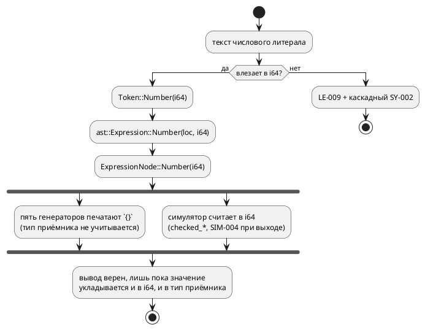

# Фича: Представление числового литерала: полная маска `[bit;64]`

- **Номер:** 0157
- **Статус:** ГОТОВО
- **Зависит от:** нет
- **Tier:** 2
- **Связанные issue (анализ):** кандидат блока 2 `FEATURES.md` (вынесено закрытием [диагностика вместо паники на числовом литерале больше `i64::MAX`](0128-lexer-literal-overflow.md), Option B/C ADR отвергнуты в объёме)

## Стадии жизненного цикла

Все стадии — **разделы этой карточки**: «Архитектура (ADR)»,
«Анализ», «Разработка», «Тест-план», «Отчёт о тестировании», «Итог».
Отдельным артефактом остаются только исправления —
[`docs/fixes/`](../fixes/README.md) (при необходимости `0157-YY-*`).

## Краткое описание

Значение литерала хранится как `i64`, поэтому «все единицы» для официально
поддержанного типа `[bit;64]` записать **нельзя**. После 0128 это честная ошибка
`LE-009` вместо паники — но записать значение по-прежнему не выходит.

> Фича зарегистрирована из бэклога кандидатов (отобрана заказчиком 2026-07-28); далее проходит жизненный цикл по своду.

## Что известно на входе

- `0xFFFFFFFFFFFFFFFF` → `LE-009` (было — паника, снята фичей).
- `[bit;64]` — официально поддержанный тип: фича
  [семантика `[bit;N]` расходится втрое](0078-bit-array-semantics.md) определила `[bit;N]` при `N ≤ 64` как
  упакованный вектор (скаляр).
- То есть язык обещает тип, значения которого невыразимы литералом.

## Направление решения (наметка, не решение)

- Решение о представлении числового литерала: расширить (`i128` либо
  беззнаковый вариант токена) **либо** ввести отдельную форму записи маски.
- Правка **сквозная**: токен → АСД → семантика → **пять генераторов**, у
  каждого своя печать чисел. В 0128 не бралась намеренно, чтобы не протаскивать
  её под видом исправления паники.
- Смежно с [экспонента целочисленного литерала: считать или отвергнуть, но не терять молча](0144-int-literal-exponent.md): экспонента у целого литерала
  упирается в тот же вопрос представления.

Окончательный выбор — за стадиями **архитектуры** (ADR) и **анализа**: раздел
выше фиксирует то, что уже проверено, а не предрешает реализацию.

## Решение архитектуры (стадия 2, 2026-07-30)

Принят **Option A** ADR — носитель `i128` на всём тракте. Объём утверждён
заказчиком **целиком** (пять пунктов): носитель, приём лексера
`[i64::MIN, u64::MAX]`, диагностика `SE-089` (литерал вне диапазона типа),
печать литерала **по типу приёмника** в целях `c`/`sv`, вычисление в `i128` у
симулятора. Номер версии языка при этом **не растёт**: `0.8.0` не выпущена, и
по своду изменения накапливаются в неё.

Пробы стадии (полностью — в ADR) показали, что дыра шире заголовка фичи:

- `u64` неполноценен и **без** литерала: `m: u64 := 9223372036854775807; m := m + 1;`
  даёт `SIM-004`, хотя ADR обещает обёртку `mod 2⁶⁴` (у `u8`/`u32` она есть).
- Диагностики диапазона по типу **нет вовсе**: `var a: u8 := 300;` — успех у
  `taktc` и отказ у `cc -Werror` (`-Wconstant-conversion`).
- Цель `sv` печатает голое десятичное и ломается на `verilator -Wall`
  **уже с 33 бит** (`WIDTHEXPAND`) — существующий дефект, которого корпус просто
  не содержит.

Вне объёма (записано кандидатами): константное выражение в инициализаторе
переменной симулятором **не вычисляется** (`var a: u8 := 1 + 2;` → симулятор `0`,
цель `c` `3` — молча, класс Tier 1), частный случай того же — `~0`.

## Документирование

**Требуется.** Меняется множество записуемых литералов — затронуты разделы
[`book/src/02-lexical/`](../../book/src/02-lexical/index.typ) (литералы) и
[`book/src/03-types/`](../../book/src/03-types/index.typ) (тип `[bit;N]`).

## Архитектура (ADR)

- **Status:** Accepted (вариант и объём утверждены заказчиком 2026-07-30)
- **Date:** 2026-07-30
- **Authors:** Архитектор
- **Related issues:** [Фича](0157-literal-u64-representation.md);
  предшественник — [ADR](0128-lexer-literal-overflow.md#архитектура-adr) (паника → `LE-009`),
  смежные — [ADR](0078-bit-array-semantics.md#архитектура-adr) (`[bit;N]`),
  [ADR](0127-int-overflow-semantics.md#архитектура-adr) (переполнение целых),
  [фича](0144-int-literal-exponent.md) (экспонента у целого),
  [ADR](0171-c-gate-werror.md#архитектура-adr) (проверка `c` под `-Werror`).

### Context

Язык объявляет типы `u64` и `[bit;64]` (при `N ≤ 64` — упакованный скаляр), но **носитель значения на всём тракте — `i64`**: `Token::Number(i64)`
→ `ast::Expression::Number(_, i64)` → `ExpressionNode::Number(i64)` →
`takt_sim::eval::Value::Number(i64)`. Верхняя половина диапазона `u64`
(и, в частности, маска «все единицы» у `[bit;64]`) **невыразима** — ни литералом,
ни вычислением.

#### Что показали пробы (2026-07-30, все команды воспроизводимы)

| № | Вход | Наблюдаемое | Вывод |
|---|---|---|---|
| П1 | `var m: [bit;64] := 0xFFFFFFFFFFFFFFFF;` | `LE-009` + каскадный `SY-002` на `;` | обещанный тип имеет невыразимые значения; вдобавок пользователь видит **две** ошибки на одну причину |
| П2 | `var m: u64 := 18446744073709551615;` | `LE-009` + `SY-002` | то же для `u64` |
| П3 | `var m: u64 := 0x7FFFFFFFFFFFFFFF;` → цели `c`/`rust`/`st`/`sv` | все печатают голое десятичное `9223372036854775807` | печать числа **не знает о типе приёмника** |
| П4 | `uint64_t a = 18446744073709551615;` под `cc -Wall -Werror` | `error: -Wimplicitly-unsigned-literal` | цель `c` **обязана** печатать суффикс (`ULL`/hex+`ULL`), иначе проверка отвергнет вывод |
| П5 | `a <= 9223372036854775807;` в `logic [63:0]` под `verilator --lint-only -Wall` | `%Warning-WIDTHEXPAND` → `%Error` | цель `sv` ломается **уже на 33 битах** (проверено также на `8589934592` и `4294967295`); дефект существует **сегодня**, корпус его просто не содержит |
| П6 | `ULINT := 18446744073709551615;` и `16#FFFFFFFFFFFFFFFF` через `iec2c` | принято, код 0 | цель `st` к расширению готова |
| П7 | `(18446744073709551615, 0xFFFFFFFFFFFFFFFF)` как `u64` под `rustc -D warnings` | принято | цель `rust` к расширению готова |
| П8 | `var m: u64 := 9223372036854775807;` + `m := m + 1;` в симуляторе | `SIM-004` «переполнение при вычислении '+'» | у **вычисления** тот же потолок: `u64` неполноценен и без литерала (при этом `u8`/`u32` оборачиваются верно — ADR соблюдён) |
| П9 | `var a: u8 := 300;` / `var b: i8 := -200;` | `taktc` рапортует успех; `cc -Werror` → `-Wconstant-conversion`, симулятор → `SIM-003` | **диагностики диапазона по типу нет вовсе**: расширить носитель, не заведя её, значит расширить и класс молча невалидного вывода |

#### Поток значения «как есть»

Существенно, что **три** независимых слоя упираются в одну границу: лексер
(приём), симулятор (вычисление), генераторы (печать). Расширение любого одного
слоя выразимости не даёт.

### Decision Drivers

1. **Язык не должен обещать типы с невыразимыми значениями.** `u64` и `[bit;64]`
   объявлены поддержанными; сегодня половина их диапазона недоступна.
2. **Один смысл литерала на все цели.** Шесть потребителей (симулятор + пять
   генераторов) не имеют права разойтись в значении одного текста — урок
   («арифметика в одном месте») и 0127 (нормированное переполнение).
3. **Расширение приёма без диагностики диапазона умножает молчаливый брак.**
   П9 доказывает: уже сегодня `u8 := 300` даёт невалидный C при рапорте об
   успехе; после расширения таких входов станет больше.
4. **Печать числа обязана знать тип приёмника.** П4 (C) и П5 (SV) показывают,
   что голое десятичное — не универсальная форма.
5. **Обратная совместимость.** Все ныне валидные программы обязаны
   давать **байт-в-байт** прежний вывод: `examples/generated/` — снапшот
   (детерминизм 0048), его дифф несёт смысл.

### Considered Options

#### Option A. Носитель `i128` на всём тракте + печать по типу приёмника

Токен, АСД, семантика и `eval::Value` несут `i128`; лексер принимает всё из
`[i64::MIN, u64::MAX]`, остальное — прежний `LE-009` с переписанным текстом
(диапазон становится свойством пары «литерал + тип»). Семантика получает
диагностику «литерал вне диапазона типа приёмника» (`SE-089`). Генераторы
печатают литерал **по целевому типу**: `c` — суффикс `ULL`, когда значение вне
`long long`; `sv` — размерная форма `64'd…`, когда естественная ширина ≠ 32 и не
равна ширине приёмника; `st`/`rust`/`plantuml` — как сейчас (П6, П7). Симулятор
считает в `i128`, а усечение и обёртку по типу делает существующий
`coerce_to_type`  — этим закрывается П8.

**Pros:**
- Закрывает все три слоя одной идеей; `u64` становится полноценным.
- `i128` шире любого выразимого типа, поэтому промежуточный результат не
  переполняется там, где итог по типу законен (П8).
- Запас на будущее (`u128`/`[bit;128]`, если появятся) без второй такой правки.

**Cons:**
- Правка сквозная: лексер, грамматика (типы действий LALRPOP), АСД, семантика,
  три константных вычислителя, симулятор (`eval`, `state_io`), пять генераторов,
  LSP, фикстуры и снапшоты.
- В АСД становятся представимы значения, не принимаемые **ни одним** типом
  (`> u64::MAX` из лексера не приходит, но конструируется в коде) — границу
  держит диагностика, а не тип Rust.

#### Option B. Носитель «модуль + знак» (`u64` + `bool`)

**Pros:**
- Точно покрывает потребность, не вводя непринимаемых значений.

**Cons:**
- Два поля в каждом узле и в каждом сравнении; `+0`/`−0` дают два представления
  одного числа — равенство узлов (у `Extend` оно уже с ручной семантикой, 0056)
  становится ещё тоньше.
- Любое вычисление всё равно уходит в более широкий тип — выигрыш мнимый.

#### Option C. Бит-каст: оставить `i64`, широкий литерал складывать битовым шаблоном

`0xFFFFFFFFFFFFFFFF` → `Number(-1)`; форму восстанавливает печать по типу
приёмника.

**Pros:**
- Минимальная правка носителя (лексер + печать).

**Cons:**
- Значение литерала перестаёт быть свойством текста и становится свойством
  контекста — прямо против драйвера 2; три константных вычислителя (0042, 0143,
  0185) обязаны договориться о бит-касте, а они и так расходятся.
- `18446744073709551615 > 9223372036854775807` в константном выражении даёт
  **ложь**: сравнение идёт над бит-шаблоном.
- П8 не закрывается вовсе: вычисление остаётся в `i64`.

#### Option D. Спецформа записи маски (`all`, `~0` как константа) вместо расширения

**Pros:**
- Дёшево; закрывает ровно заголовочный случай «все единицы».

**Cons:**
- `u64` в десятичной записи остаётся невыразим (П2), П8 не закрывается.
- Язык обрастает формой, существующей ради обхода внутреннего ограничения.
- Путь **уже сломан** независимо от 0157: `var u: u64 := ~0;` симулятор молча
  даёт `0` (константное выражение в инициализаторе им не вычисляется —
  `unit/initial.rs` отвечает «не константа»), а цель `c` печатает `~0` (все
  единицы). Опираться на эту форму нельзя, пока расхождение не устранено
  (вынесено в кандидаты, см. ниже).

### Decision

Принимается **Option A** (решение заказчика 2026-07-30). Объём подтверждён им
же **целиком**: диагностика диапазона, печать по типу приёмника в `c`/`sv` и
вычисление в `i128` у симулятора взяты в фичу, а не вынесены в преемники —
только этот состав делает `u64` полноценным разом по всем трём слоям (вычисление, печать). Итого **пять пунктов**:

1. **Носитель** `i128` в токене, АСД, семантике и `eval::Value::Number`.
2. **Лексер**: принимает `[i64::MIN, u64::MAX]`; вне — `LE-009` с переписанным
   текстом. Каскадный `SY-002` (П1) гасится: после лексической ошибки в этой
   позиции парсер не обязан вторично жаловаться на `;`.
3. **Семантика**: `SE-089` — литерал не помещается в тип приёмника (закрывает П9;
   без него расширение приёма увеличивает класс молча невалидного вывода).
4. **Цели**: печать литерала по типу приёмника — `c` (суффикс `ULL` при выходе за
   `long long`), `sv` (размерная форма при ширине ≠ 32; попутно закрывает П5).
   Условие печати — «когда иначе вывод невалиден», поэтому корпус
   `examples/generated/` обязан остаться **байт-в-байт прежним**.
5. **Симулятор**: вычисление в `i128`, усечение/обёртка — существующим
   `coerce_to_type` по типу (закрывает П8, соблюдая ADR).

**Вне объёма** (записать кандидатами, не втягивать):

- Константное выражение в инициализаторе переменной не вычисляется симулятором:
  `var a: u8 := 1 + 2;` → симулятор `0`, цель `c` `3`. **Молча**, класс Tier 1.
- `~0` в инициализаторе — частный случай того же (Option D выше).
- Экспонента у целого литерала ([экспонента целочисленного литерала: считать или отвергнуть, но не терять молча](0144-int-literal-exponent.md))
  — упирается в тот же носитель, но имеет свою карточку.

### Consequences

#### Положительные

- `u64` и `[bit;64]` становятся полноценными: значение выразимо литералом и
  достижимо вычислением.
- Цель `sv` перестаёт ломаться на литералах шире 32 бит (П5) — дефект, который
  сегодня ждёт первого же примера с такой константой.
- Диагностика диапазона (`SE-089`) переводит целый класс «валидный `.takt` →
  невалидный C» из молчания в отказ на этапе компиляции.

#### Отрицательные / Action items

- Правка задевает порядка десяти модулей и все фикстуры с `Number(...)`;
  декомпозиция на подзадачи обязательна.
- Печать по типу приёмника требует, чтобы генератор **знал** тип в точке печати
  литерала; там, где не знает (константа вне объявления), нужен либо проброс
  типа, либо консервативная форма. Это — вопрос стадии анализа.
- Документ `book/` (разделы `02-lexical`, `03-types`) и реестр диагностик
  обновляются в стадии документирования.
- Язык меняется: расширено множество допустимых литералов, добавлена
  диагностика диапазона. **Номер версии при этом не растёт**: свод —
  версия накапливается по циклам, а `0.8.0` (поднята фичей) ещё не
  выпущена, поэтому 0157 вносит изменения в неё. Первая редакция ADR писала
  `0.8.0 → 0.9.0` — ошибка, исправлена при документировании.

#### Acceptance criteria

1. `var m: [bit;64] := 0xFFFFFFFFFFFFFFFF;` и `var m: u64 := 18446744073709551615;`
   компилируются всеми пятью целями; вывод принимается проверками (`cc -Wall
   -Werror`, `rustc -D warnings`, `iec2c`, `verilator -Wall`, `yosys`).
2. Потактовая сверка симулятора и цели `c` на модели, где `u64` пересекает
   границу `i64::MAX` (обёртка по ADR, а не `SIM-004`).
3. `var a: u8 := 300;` даёт `SE-089` с позицией, а не успех (П9).
4. Цель `sv`: литерал шириной 33…64 бита проходит `verilator --lint-only -Wall`
   без `WIDTHEXPAND` (П5).
5. `examples/generated/` — **байт-в-байт** без изменений (свод + 0048).
6. `./scripts/precheck.sh` зелёный.

## Анализ

### Цель и контекст

ADR принял Option A: значение числа несёт `i128` на всём тракте, лексер
принимает `[i64::MIN, u64::MAX]`, добавляется диагностика диапазона по типу
(`SE-089`), печать литерала в целях `c`/`sv` учитывает приёмник, симулятор
считает в `i128`. Задача анализа — превратить это в **список точек правки с
проверяемыми условиями** и разложить на подзадачи разработки.

Ключевая мысль, добытая пробами ADR: **выразимость упирается в три независимых
слоя** — приём (лексер), вычисление (симулятор), печать (генераторы). Правка
одного слоя ничего не даёт: расширенный литерал упрётся в `SIM-004` при
вычислении и в `-Wimplicitly-unsigned-literal` при печати.

### Зависимости фичи

- **Зависит от:** `нет`. Проверено по контракту: носитель `i64` изолирован
  внутри проекта (внешних потребителей АСД нет), а все шесть потребителей
  значения (симулятор + пять генераторов) правятся в этой же фиче.
- **Влияние на порядок разработки:** ничего не блокирует и не разблокирует
  напрямую. Смежная [экспонента целочисленного литерала: считать или отвергнуть, но не терять молча](0144-int-literal-exponent.md) (экспонента
  у целого литерала) упирается в тот же носитель — после 0157 её объём
  сокращается, но зависимостью это не является (0144 может быть сделана и на
  `i64`). Фича меняет **язык**, но не номер версии: `0.8.0` ещё не выпущена
  (раздел `[Не выпущено]` в `CHANGES.md`), и по своду изменения
  накапливаются в неё.

### Карта точек правки (снята `rg` по дереву, 2026-07-30)

#### Слой 1 — приём (лексер, грамматика, АСД)

| Место | Сейчас | Целевое |
|---|---|---|
| `parser/lexer.rs` (hex-ветвь) | `i64::from_str_radix` → `LE-009` | приём в `i128`, отказ вне `[i64::MIN, u64::MAX]` |
| `parser/lexer.rs` (десятичная ветвь, экспонента) | `i64::from_str`, `checked_mul` | то же в `i128` |
| `parser/token.rs` | `Token::Number(i64)` | `Token::Number(i128)` |
| `grammar.lalrpop` | `number => Token::Number(<i64>)` + 6 мест конструирования узлов | тип действия `i128` |
| `parser/ast.rs` | `Expression::Number(Location, i64)`, `Condition::Number`, `Value::Number(i64)`, `FormulaExpression::Number(Location, i64, Option<Identifier>)`, `EnumVariant.value: Option<i64>` | `i128` |

`grammar.lalrpop` (1000 строк), `lexer.rs` (986), `ast.rs` (995) — **на
границе лимита размера модуля**; правка обязана быть заменой типа, а не
дописыванием (проверка `scripts/check-module-size.sh` отвергнет рост).

**`Token::Duration(i64, …)` и `Token::Ticks(i64, …)` не трогаем:** длительность
хранится в наносекундах и её диапазон — свойство времени (±292 года), а не
числа. Смешивать эти границы нельзя.

#### Слой 2 — семантика

| Место | Роль |
|---|---|
| `semantic/mod.rs` | `ExpressionNode::Number(i64)`, `ConditionNode::Number(i64)` — корень тракта |
| `semantic/const_eval/` | общий константный вычислитель (0185) |
| `address_map/eval.rs` | арифметика адреса (0042) — **свой** `apply_binary` |
| `semantic/condition/after_const.rs` | константная выдержка (0143) |
| `semantic/enum_node.rs` (`enum_facts`, варианты `(String, i64)`) | знак и ширина перечисления (0060) |
| `semantic/bit_vector.rs` | `[bit;N]` (0078) |
| `semantic/lower_float.rs` | понижение `float` в `Number(repr)` (0096) |
| `semantic/type_inference.rs` | вывод типа литерала |

**Решение аналитика: значение варианта перечисления переезжает в `i128` вместе с
литералом.** Пары `(String, i64)` живут в `enum_node.rs`, `sv_expr.rs::Scope`,
`st_expr.rs` и `rust`-печатнике; оставить их на `i64` значит завести **второй**
носитель числа и границу между ними — ровно то, от чего уходит ADR (драйвер 2).
Вариант перечисления задаётся тем же литералом (`enum E { A = 0xFF… }`), поэтому
и границу обязан иметь ту же.

#### Слой 3 — вычисление (симулятор)

| Место | Роль | Засада |
|---|---|---|
| `eval/value.rs` | `Value::Number(i64)` | — |
| `eval/ops.rs` | `Num::Int(i64)`, `as_ints`, `checked_add/sub/mul` | арифметика ведётся в носителе; после правки промежуточный результат живёт в `i128`, а усечение делает `coerce_to_type` |
| `eval/fixed.rs` | `(*i as i128) << n` | **уже** считает в `i128` — сузится приведение, не логика |
| `predicate.rs`, `expression.rs`, `unit/initial.rs` | адаптеры узлов | три места разбора узла  — правятся согласованно |
| `state_io.rs` | JSON-снимок состояния | `serde_json::Value::Number((*n).into())` для `i128` **не компилируется**; проба показала рабочий путь — `serde_json::Number::from_i128(n)` (принял `18446744073709551615`), чтение — симметрично `as_i128()` |

#### Слой 4 — печать (цели)

| Цель | Место | Что делать | Нужен ли тип приёмника |
|---|---|---|---|
| `c` | `c_expr/expr.rs`, `c_expr/condition.rs`, `c_decl.rs` | суффикс `ULL`, когда значение вне `long long` | **нет** — условие по самому значению (проба П4: `-Wimplicitly-unsigned-literal` возникает именно на `> i64::MAX`) |
| `sv` | `sv_expr.rs`, `sv_const.rs`, `sv_fsm.rs` | размерная форма `<W>'d<value>` | **да** — проба: `64'd18446744073709551615` и `64'd8589934592` verilator принимает, а безразмерная `'d8589934592` даёт `WIDTHEXPAND` |
| `st` | `st_expr.rs` | ничего (проба П6: `ULINT := 18446744073709551615` принят `iec2c`) | нет |
| `rust` | `rust_expr.rs`, `rust_cond.rs` | ничего (проба П7: принято `rustc -D warnings`) | нет |
| `plantuml` | печать числа | ничего | нет |

**У SV типа приёмника в точке печати сегодня нет.** `Scope` (`sv_expr.rs`)
несёт `registered`/`function`/`enums`/`warnings` — ширин переменных в нём нет; в
`sv_fsm.rs` (ветвь сброса) тип **есть** (`ty`), там же уже печатается
`enum_literal`. То есть работа делится надвое: инициализатор — правка на месте,
тела — расширение `Scope` картой «сигнал → ширина». Это самая дорогая позиция
фичи.

### Требования и проверяемые условия

- **R1. Выразимость.** `0xFFFFFFFFFFFFFFFF` и `18446744073709551615` — валидные
  литералы для `u64` и `[bit;64]`; вывод принимают все пять проверок целей.
- **R2. Один смысл на все цели.** Значение литерала не зависит от цели и от
  контекста: `18446744073709551615 > 9223372036854775807` истинно во всех
  константных вычислителях (это и отличает принятый Option A от Option C).
- **R3. Вычислимость.** `u64`-арифметика у границы `i64::MAX` даёт обёртку
  `mod 2⁶⁴`, а не `SIM-004`; для знаковых типов сохраняется прежняя
  ошибка программы.
- **R4. Диагностика диапазона.** Литерал, не помещающийся в тип приёмника, даёт
  `SE-089` **с позицией** (правило «в пачке сообщений координата 1:1
  бесполезна», 0130), а не молча невалидный вывод цели.
- **R5. Печать по потребности.** Суффикс `ULL` (цель `c`) и размерная форма
  (цель `sv`) появляются **только** там, где иначе вывод невалиден.
- **R6. Обратная совместимость.** `examples/generated/` — байт-в-байт
  без изменений; ни один существующий `.takt` не меняет поведения.
- **R7. Одна ошибка на одну причину.** Литерал вне `[i64::MIN, u64::MAX]` даёт
  `LE-009` без каскадного `SY-002` (проба П1 показывает две ошибки на одну
  причину).

### Критерии приёмки и способ проверки

| # | Критерий | Способ проверки |
|---|---|---|
| A1 | `var m: [bit;64] := 0xFFFFFFFFFFFFFFFF;` компилируется целями `c`/`rust`/`st`/`sv`/`plantuml` | новый тест-фикстура + проверки `precheck.sh` (`cc -Wall -Werror`, `rustc -D warnings`, `iec2c`, `verilator -Wall`, `yosys`) |
| A2 | `u64` пересекает `i64::MAX` с обёрткой | потактовая сверка симулятора и цели `c` (`takt-sim/tests/conformance/conformance_c_tests.rs`) |
| A3 | `var a: u8 := 300;` → `SE-089` с позицией | тест семантики + фикстура `tests/data/semantic/invalid/` |
| A4 | цель `sv`: литерал 33…64 бита без `WIDTHEXPAND` | `verilator --lint-only -Wall` по порождённому `.sv` в тесте |
| A5 | цель `c`: значение `> i64::MAX` печатается с `ULL` | тест печатника + `cc -Wall -Werror` |
| A6 | `examples/generated/` не изменился | `git diff --exit-code examples/generated` после прогона |
| A7 | `LE-009` без каскада `SY-002` | тест диагностики на входе `0x1_0000_0000_0000_0000` |
| A8 | круговой рейс снимка состояния точен для значений `> i64::MAX` | тест `state_io` (save → load → сравнение) |
| A9 | версия языка согласована в трёх источниках (номер не меняется — свод) | `scripts/check-language-version.sh` |
| A10 | `./scripts/precheck.sh` зелёный | прогон |

### Декомпозиция разработки

| Задача | Содержание | Проверка задачи |
|---|---|---|
| `0157-01` | Носитель `i128` **на всём тракте**: лексер, `token.rs`, `grammar.lalrpop`, `ast.rs`, семантика (три константных вычислителя, `enum_node`, `bit_vector`, `lower_float`, `type_inference`), симулятор (`Value::Number`, вычисление и обёртка, три адаптера узла, `state_io` через `Number::from_i128`); приём `[i64::MIN, u64::MAX]`; `LE-009` переписан; каскад `SY-002` снят | `cargo test`; R2, R3, R7; A2, A7, A8 |
| `0157-02` | `SE-089` — литерал вне диапазона типа приёмника (+ реестр диагностик) | A3 |
| `0157-03` | Цель `c`: суффикс `ULL` по значению | A5 |
| `0157-04` | Цель `sv`: размерная форма по ширине приёмника (расширение `Scope`) | A4 |
| `0157-05` | Цели `st`/`rust`/`plantuml`: проверка печати, фикстуры, снапшоты; сверка `examples/generated/` | A1, A6 |
| `0157-06` | Документирование: `book/src/02-lexical`, `book/src/03-types`, реестр диагностик, `CLAUDE.md` | A9, A10 |

Порядок обязателен: `01` — первой, далее `02`–`05` независимы между собой,
`06` — последней.

> **Слои 1–3 слиты в одну задачу по факту разработки** (первая редакция плана
> делила их на `01`/`02`/`04`). Причина в самом языке Rust: тип узла
> `Number(i64 → i128)` меняется **одновременно** у токена, АСД, семантики и
> `eval` — промежуточное состояние не компилируется, а значит не может быть ни
> проверено, ни закоммичено отдельно. Дробить работу, которая не собирается по
> частям, значит выдавать за задачу то, что задачей не является.

### Особенности по обратной функциональности

Изменение **аддитивно**: множество принимаемых литералов расширяется, ранее
валидные программы дают тот же АСД и тот же вывод целей. Единственные
наблюдаемые отличия для существующего кода:

1. Текст `LE-009` меняется (диапазон в сообщении) — сообщение об ошибке частью
   контракта языка не является, но тесты на текст придётся освежить.
2. Снятие каскадного `SY-002` уменьшает число сообщений на входе с ошибкой
   литерала — это улучшение, но тесты, считающие сообщения, поедут.
3. `SE-089` **отвергает** входы, которые раньше принимались (`u8 := 300`).
   Формально это сужение — но принимался лишь тот вход, чей вывод отвергал `cc`
   (проба П9), то есть ломается не работающая программа, а молчание.
   Обоснование по своду: сохранять приём значит сохранять класс «валидный
   `.takt` → невалидный C».

### Риски и зависимости

- **Р1. Объём правки.** Носитель встречается в ~40 файлах вместе с тестами.
  Снижение: порядок задач `01 → 02` заменяет тип механически, остальные задачи
  независимы; после каждой — `cargo test` целиком.
- **Р2. `Scope` цели `sv` не знает ширин.** Самая дорогая позиция; если
  расширение `Scope` окажется дороже ожидаемого, задача `0157-06` даёт
  промежуточный результат «размерная форма в инициализаторе (там тип есть) +
  диагностика на теле», а полное покрытие уходит фичей-преемником. Решение
  принимает разработчик по факту, зафиксировав его в задаче.
- **Р3. Три места разбора узла в симуляторе расходятся** (урок исправления):
  `predicate.rs`, `expression.rs`, `unit/initial.rs`. Снижение: правка всех трёх
  в одной задаче `0157-04` + тест **на значение**, а не на факт перехода.
- **Р4. Файлы у лимита размера** (`grammar.lalrpop` 1000, `ast.rs` 995,
  `lexer.rs` 986). Снижение: правка — замена типа; при неизбежном росте выносить
  новое в отдельный модуль (проверка `check-module-size.sh` отвергнет иное).
- **Р5. `serde_json` и `i128`.** Проверено пробой: `Number::from_i128` в
  `serde_json 1` доступен и принимает `18446744073709551615`. Риск снят до
  разработки.
- **Р6. Форматтер печатает hex десятичным** (`0xFF` → `255`, проба). После
  расширения маска `0xFFFFFFFFFFFFFFFF` канонизируется в `18446744073709551615`.
  Это существующее поведение, фича его не меняет; **записано наблюдением** —
  политика «синонимы не канонизируются» (`while`/`loop`) на форму записи числа
  сегодня не распространяется. Кандидат, не объём.

## Разработка

### Задача

#### Что было

Значение числа несли `i64` — от токена до `eval::Value`. Следствия (пробы ADR):

- `0xFFFFFFFFFFFFFFFF` и `18446744073709551615` → `LE-009`: маска официально
  поддержанного `[bit;64]`  и максимум объявленного `u64` **невыразимы**.
- `m: u64 := 9223372036854775807; m := m + 1;` → `SIM-004`, хотя ADR обещает
  беззнаковой арифметике обёртку `mod 2ⁿ` (у `u8`/`u32` она работала). В
  `coerce_integer` стоял ранний выход с честной пометкой: «значения хранятся в
  `i64`, поэтому `u64` со старшим битом не представим».
- Литерал вне диапазона давал **две** ошибки на одну причину: `LE-009` от лексера
  и `SY-002` от парсера — токен «исчезал», и разбор спотыкался о следующий символ.

#### Что сделано

**Носитель значения — `i128`** (Option A ADR), одним изменением по всем
четырём слоям: промежуточное состояние на Rust не компилируется, поэтому слои
1–3 плана слиты в эту задачу (см. примечание в анализе).

| Слой | Правка |
|---|---|
| Приём | `Token::Number(i128)`; hex и десятичная ветви лексера разбирают в `i128`; приём — `[i64::MIN, u64::MAX]`; `grammar.lalrpop` (`number => Token::Number(<i128>)`) |
| АСД | `Expression::Number`, `Condition::Number`, `FormulaExpression::Number`, `Member::Number`, `ArraySlice`, `Type::Fixed`, `EnumVariant::value` |
| Семантика | `ExpressionNode::Number`, `ConditionNode::Number`, `ConditionNode::EnumVariant`, `ConstValue::Int` + `int_op`, `EnumFacts`/`enum_facts`, `infer_int_type`, `construct_fixed`, `Constraint` анализа недетерминизма, `data_kripke` |
| Симулятор | `Value::Number(i128)`, `Num::Int`, `as_ints`, `checked_*` в `i128`, `read_bit`/`read_bit_words`, поля `EvalError`, `state_io` через `serde_json::Number::from_i128`, чтение снимка через `as_i128` |

**Граница приёма перенесена с носителя на типы языка.** `[i64::MIN, u64::MAX]` —
объединение диапазонов самого широкого знакового и самого широкого беззнакового
типов; шире — не помещается **ни в какой** тип, и это по-прежнему `LE-009` (текст
диагностики переписан). Тема выделена в модуль
`takt-lang/src/parser/literal_range.rs`: диапазон литерала — свойство системы
типов, а не техника сканирования.

**Обёртка `u64` заработала** (R3): ранний выход `bits >= 64` из `coerce_integer`
удалён, маска и границы считаются той же формулой, что для узких типов. `u64` у
границы `i64::MAX` теперь даёт `9223372036854775808`, а не `SIM-004`.

**Каскад `SY-002` снят** (R7): `recover_number` возвращает токен-заглушку
`Number(0)` на позициях исходного литерала. `LE-009` уже записан, компиляция всё
равно провалится, но разбор держит форму — дальше находятся **другие** ошибки, а
не эхо этой.

**Адрес порта сужается явно.** Адрес и бит остаются в `i64` (их ширину фича не
меняет), поэтому литерал шире сужается через `narrow_addr_literal` с `SE-055`, а
не молчаливым `as i64`: молчание дало бы адрес, которого автор не писал.

**Значение варианта перечисления переехало в `i128` вместе с литералом** (решение
анализа): вариант задаётся тем же литералом, и второй носитель числа завёл бы
границу между ними — ровно то, от чего уходит ADR.

**Побочно — правило размера модуля.** `lexer.rs` вышел за 1000 строк, поэтому по
границе ответственности выделен `parser/lex_error.rs` (тип `LexicalError`, его
позиции и коды `LE-NNN`): перечень «что может пойти не так» читают диагностика,
LSP и тесты — сканер им не нужен. Публичный путь `parser::lexer::LexicalError`
сохранён реэкспортом.

##### Статус по функциональностям

| Функциональность | Статус |
|---|---|
| Лексер, грамматика, АСД | сделано |
| Семантика, константные вычислители, перечисления | сделано |
| Симулятор (значение, арифметика, снимок состояния) | сделано |
| `SE-089` (литерал вне диапазона типа) | **н/п для этой задачи** — задача `0157-02` |
| Печать по типу приёмника (`c`, `sv`) | **н/п** — задачи `0157-03`, `0157-04` |
| Документирование (`book/`, версия языка) | **н/п** — задача `0157-06` |

#### Проверки

- `cargo build` — чисто; `cargo clippy --all-features --all-targets` — **0**
  предупреждений; `cargo fmt --check` — чисто.
- `cargo test --all-features -- --test-threads=1` — **все зелёные**.
- `scripts/check-module-size.sh` — зелёный (новых нарушителей нет, реестр долга
  не вырос).
- **A2 (обёртка `u64`)**: `m: u64 := 9223372036854775807; m := m + 1;` →
  симулятор печатает `m=9223372036854775808` (было `SIM-004`).
- **A1 (маска)**: `var m: [bit;64] := 0xFFFFFFFFFFFFFFFF; var u: u64 :=
  18446744073709551615;` компилируется целями `c`/`rust`/`st`/`sv`/`plantuml` и
  исполняется симулятором (`m=u=18446744073709551615`). Вывод цели `c`
  печатает значение без суффикса `ULL` — под `-Werror` это отказ; закрывает
  задача `0157-03`, до неё критерий A1 **не** считается выполненным.
- **A6 (обратная совместимость)**: `examples/generated/` — без изменений
  (`git diff --stat` пуст).
- **A7 (одна причина — одна ошибка)**: новый тест
  `out_of_range_literal_does_not_cascade_into_syntax_error` в
  `takt-lang/tests/syntax/lexer_tests.rs`.
- Тесты границ переписаны под новую границу и **усилены**: `u64::MAX` и полная
  маска лексятся; `u64::MAX + 1`, `0x1_0000_0000_0000_0000` и
  `-9223372036854775809` дают `LE-009`; порог экспоненты сдвинут (`1e19`
  валиден, `1e20` — нет).
- `./scripts/precheck.sh` — прогон целиком (см. запись в `CHANGES.md`).

### Задача

#### Что было

Диагностики диапазона по типу **не было вовсе** (проба ADR, П9): `var a: u8 :=
300;` компилировался с рапортом об успехе, а порождённый C отвергался проверкой
(`-Wconstant-conversion` под `-Werror`, [ADR](0171-c-gate-werror.md#архитектура-adr)).
Симулятор на том же входе давал `SIM-003` — то есть эталон и цель расходились в
том, законна ли программа.

Расширение приёма литерала (задача `0157-01`) этот класс только увеличило бы:
теперь лексер принимает всё до `u64::MAX`, и каждый такой литерал в узком типе
дал бы невалидный вывод при успешном `taktc`.

#### Что сделано

Заведена проверка `takt-lang/src/semantic/validate/literal_range.rs`
(`SE-089`), включённая в `validate_model_all` **накопительно** — она отдаёт все
находки, а не первую на модель.

Проверяются позиции, где тип приёмника **объявлен**:

- инициализатор `var`/`const` (модели и локальный в теле);
- присваивание переменной (`a := 999`).

Диапазон берётся у типа: `Integer{bits, signed}` при `bits ≤ 64` и бит-вектор
`[bit;N]` при `N ≤ 64`. Сообщение называет **значение, тип и границы** — без
границ автор не увидит, на сколько промахнулся.

**`bit`/`bool` намеренно пропущены**: их значения проверяет
`validate_bit_values`, чьё сообщение перечисляет допустимые формы
(`0`/`1`/`true`/`false`). Первая редакция диапазон `bit` включала — и тест
`diagnostics_batch_tests::nested_model_errors_are_collected` немедленно показал
**две** диагностики об одной причине. Правило: одна причина — одно сообщение.

**Проверяется литерал, а не значение выражения.** `a := 200 + 100` проверка
не ловит: константной свёртки в семантике нет (кандидат в `FEATURES.md` о
невычисляемом инициализаторе). Ловить видимое лучше, чем не ловить ничего.

**Позиция у присваивания — объявление переменной**, а не сам оператор:
`ExpressionNode` позиций не несёт. Диагностика при этом называет имя
переменной, поэтому место правки однозначно.

##### Смежное изменение: фикстуры усечения

Проверка отвергла существующие фикстуры сверки
(`takt-sim/tests/data/eval/{conformance_u8,overflow_u8}.takt`), где правило S9
(«усечение при записи», [ADR](0127-int-overflow-semantics.md#архитектура-adr)) было
выражено литералом `truncated := 300`. Фикстуры переписаны на **вычисление**
(`truncated := part_a + part_b` при `200 + 100`): 0127 нормирует поведение
арифметики, и оно осталось проверенным потактовой сверкой с целью `c`, а 0157
запрещает запись заведомо не влезающей **константы**. Это разные вопросы, и
теперь каждый проверяется своим входом.

##### Статус по функциональностям

| Функциональность | Статус |
|---|---|
| Семантика (`validate`) | сделано |
| Реестр диагностик `docs/diagnostics/README.md` | сделано |
| Приложение «Ошибки» документа `book/` | сделано |
| Цели генерации | н/п — диагностика останавливает конвейер до них |

#### Проверки

- `takt-lang/tests/semantic/literal_range_tests.rs` — 7 тестов через
  `collect_compile_diagnostics` (вход CLI и LSP): инициализатор беззнакового и
  знакового типа, присваивание в теле, содержание сообщения, **крайние значения
  диапазона принимаются** (контроль против «сузили лишнего», включая `u64::MAX`,
  `i64::MIN` и маску `[bit;64]`), ширина бит-вектора, накопление всех находок.
- Фикстура-контрпример
  `takt-lang/tests/data/semantic/invalid/literal_out_of_type_range.takt`.
- `./scripts/precheck.sh` — зелёный; `examples/generated/` без изменений.
- Критерий **A3** анализа выполнен.

### Задача

#### Что было

После задачи `0157-01` в вывод впервые могут попасть значения больше
`i64::MAX`, а цель `c` печатала число как `to_string()`. В C тип десятичной
константы подбирается по правилу C11 6.4.4.1, и для такого значения знакового
типа нет: clang отвечает `-Wimplicitly-unsigned-literal`, а **оба** проверки цели
идут под `-Wall -Werror` ([ADR](0171-c-gate-werror.md#архитектура-adr)). То есть
`taktc` рапортовал бы успех, а вывод не собирался — ровно тот класс, ради
которого проверка и вводился.

#### Что сделано

Заведён модуль `takt-lang/src/generator/c/c_literal.rs` с единственной функцией
`c_int_literal(value: i128) -> String`: выше `i64::MAX` печатается суффикс
`ULL`, ниже — прежняя форма.

Все три точки печати целого в цели `c` переведены на неё:

| Точка | Что печатает |
|---|---|
| `c_expr/expr.rs` | `ExpressionNode::Number` — выражения тел |
| `c_expr/condition.rs` | `ConditionNode::Number` — условия рёбер и `cond` |
| `c_decl.rs` | инициализатор `const` |

**Суффикс печатается только там, где иначе вывод невалиден.** Это не стиль, а
условие обратной совместимости: всё, что укладывается в `long long`, печатается
байт-в-байт как прежде, поэтому снапшоты `examples/generated/` не двигаются
(свод + детерминизм [детерминированная генерация кода (единый порядок эмиссии)](0048-deterministic-codegen.md#архитектура-adr)).

`i64::MIN` (`-9223372036854775808`) суффикса **не** получает: в выводе он
конструируется унарным минусом от `9223372036854775808`, что в C законно и
остаётся внутри `long long`.

##### Статус по функциональностям

| Функциональность | Статус |
|---|---|
| Цель `c` (тела, условия, `const`) | сделано |
| Цель `c-hal` | н/п — печать чисел общая с `c` |
| Прочие цели | н/п — задачи `0157-04` (`sv`) и `0157-05` (`st`/`rust`/`plantuml`) |

#### Проверки

- Юнит-тесты в самом модуле: обычные значения печатаются голыми (включая
  `i64::MIN`), выше границы — с `ULL`.
- `takt-lang/tests/targets/wide_literal_tests.rs`:
  - `c_prints_unsigned_suffix_beyond_signed_range` — эмиссия;
  - `c_keeps_narrow_literals_bare` — обратная совместимость (суффикса нет там,
    где он не нужен);
  - `generated_c_compiles_under_werror` — **тот же проверка**, что в `precheck.sh`
    (`cc -Wall -Werror -std=c11`), на входе с маской `[bit;64]`.
- Ручная проба: `var m: [bit;64] := 0xFFFFFFFFFFFFFFFF;` → в выводе
  `model->m = 18446744073709551615ULL;`, `cc -Wall -Werror` принимает (до правки
  — отказ).
- Критерий **A5** анализа выполнен.

### Задача

#### Что было

Цель `sv` печатала число голым десятичным. В SystemVerilog нетипизированная
десятичная константа **знаковая** и имеет ширину не меньше 32 бит, поэтому
значение больше `i32::MAX` verilator встречает предупреждением `WIDTHEXPAND`, а
проверка цели идёт под `-Wall` и считает предупреждение ошибкой.

**Порог здесь 33 бита, а не 64** — дефект существовал **до** фичи и
ждал первого же примера с такой константой; корпус его просто не содержал
(проба ADR, П5: `8589934592` и `4294967295` в 64-битном регистре одинаково
дают `WIDTHEXPAND`).

#### Что сделано

В `sv_type.rs` добавлены две функции:

- `scalar_width(ty) -> Option<u32>` — ширина скалярного типа (`Integer{bits}`,
  `Fixed{m,n}` → `m+n`, `Duration` → `VALUE_BITS`, `Bit`/`Bool` → 1, `[bit;N]` →
  `N`); `None` — у типа одной ширины нет (массив, структура, `real`);
- `sized_literal(value, ty) -> Option<String>` — `<W>'d<value>`, когда форма
  нужна, иначе `None` (печатать как есть).

Печать подключена в **двух** точках, где тип приёмника известен:

| Точка | Контекст |
|---|---|
| `sv_expr.rs::Scope::coerce` | присваивание — механизм «печать по целевому типу» здесь уже был (восстановление варианта перечисления), добавлена ветвь широкого числа |
| `sv_fsm.rs` (ветвь сброса) | инициализатор переменной: `enum_literal` → `sized_literal` → голое число |

**Ширину берём у приёмника, а не у значения** — это главное в задаче: проба
показала, что `32'd4294967295` в 64-битном регистре даёт **тот же**
`WIDTHEXPAND`. Собственная ширина литерала не помогает; нужна именно ширина
цели присваивания.

**Отрицательные значения остаются голыми при любой величине**: проба
показала, что их verilator принимает без предупреждений (знаковое расширение
работает верно), а размерная форма для них потребовала бы отдельной знаковой
записи. Порог применения — `value > i32::MAX`.

Проброс ширины **не потребовался**: анализ (риск Р2) отводил на это самую
дорогую часть работы — расширение `Scope` картой «сигнал → ширина». Оказалось,
что в обеих точках, где широкий литерал может появиться, тип приёмника уже под
рукой; печать выражений вообще не тронута. Риск снят фактом, а не обходом.

##### Статус по функциональностям

| Функциональность | Статус |
|---|---|
| Цель `sv` (присваивание, инициализатор) | сделано |
| Цель `sv-mmio` | н/п — печать чисел общая с `sv` |
| Прочие цели | н/п — задачи `0157-03` (`c`, сделана) и `0157-05` |

#### Проверки

- `takt-lang/tests/targets/wide_literal_tests.rs`:
  - `sv_prints_sized_literal_by_target_width` — маска `[bit;64]` даёт
    `64'd18446744073709551615`;
  - `sv_sized_literal_width_follows_receiver_not_value` — 33-битное значение в
    `u64` даёт `64'd…`, а 32-битное в `u32` — `32'd…`;
  - `sv_keeps_narrow_literals_bare` — обратная совместимость;
  - `generated_sv_passes_verilator_lint` — **тот же проверка**
    (`verilator --lint-only -Wall`) на обоих порогах.
- Ручная проба: вывод с `64'd18446744073709551615` принят verilator и
  синтезирован yosys (0 ошибок) — оба инструмента, как требует ADR.
- Критерий **A4** анализа выполнен; попутно закрыт дефект П5, существовавший до
  фичи.

### Задача

#### Что было

Анализ предполагал, что целям `st`, `rust` и `plantuml` правка не нужна: пробы
ADR (П6, П7) показали, что `iec2c` принимает `ULINT := 18446744073709551615`, а
`rustc` выводит тип литерала из контекста. Но «предположение из пробы» и
«проверенный факт на порождённом выводе» — разные вещи: пробы шли на **ручных**
файлах целевых языков, а не на выводе `taktc`.

#### Что сделано

Кода не менялось. Работа задачи — **доказательство**, что менять нечего, и оно
оформлено тестами: «ничего не делаем» здесь решение, а не пробел.

В `takt-lang/tests/targets/wide_literal_tests.rs` добавлены:

- `st_and_rust_print_wide_literal_plainly` — обе цели печатают значение как есть
  (эмиссия из настоящего конвейера, а не ручной файл);
- `generated_st_is_accepted_by_iec2c` — **тот же проверка**, что в `precheck.sh`
  (`iec2c -I …/matiec/lib -T …`); нет собранного `iec2c` → мягкий пропуск;
- `generated_rust_compiles_under_deny_warnings` — `rustc -D warnings` с обёрткой
  `#![no_std]` в корне, как в проверке.

Фикстура тестов **читает** широкое значение в условии (`ref Done: top > 0`): без
чтения `rustc -D warnings` отверг бы вывод за присваивание поля самому себе, то
есть за конструкцию фикстуры, а не за литерал.

Цель `plantuml` печатает диаграмму, а не значения переменных — проверять на ней
нечего; отдельный тест завёл бы ложное чувство покрытия.

##### Найденный смежный дефект (вне объёма, записан кандидатом)

**Цель `st` теряет инициализатор переменной типа `[bit;N]` — молча.** Проба:
`var small: [bit;8] := 255;` даёт `small : USINT;` **без значения**, тогда как
соседняя `var plain: u8 := 7;` — `plain : USINT := 7;`. Симулятор и цель `c`
дают 255, цель `st` — 0; `taktc` рапортует успех, `iec2c` вывод принимает.

Дефект **не связан с 0157**: теряются и узкие значения, и широкие. Класс —
Tier 1 (молча неверный продукт), записан кандидатом в `FEATURES.md`. В объём не
втянут: он про эмиссию инициализатора бит-вектора, а не про представление числа,
и требует своей потактовой сверки `st` (её у бит-векторов нет вовсе).

##### Статус по функциональностям

| Функциональность | Статус |
|---|---|
| Цель `st` | правка не требуется — доказано проверкой `iec2c` |
| Цель `rust` | правка не требуется — доказано проверкой `rustc -D warnings` |
| Цель `plantuml` | н/п — значения переменных не печатает |
| Снапшоты `examples/generated/` | без изменений (проверено `git diff`) |

#### Проверки

- `cargo test --test wide_literal_tests` — 10 тестов зелёные (4 цели × эмиссия +
  проверки `cc`, `verilator`, `iec2c`, `rustc`).
- `git diff --stat examples/generated` — пусто (критерий **A6**).
- Критерий **A1** закрыт полностью: маска `[bit;64]` и `u64::MAX` проходят все
  пять целей, и вывод каждой принят её проверкой.

### Задача

#### Что было

Документ описывал числовые литералы, ни словом не упоминая их диапазон: раздел
«Лексика» перечислял формы записи, раздел «Типы» — таблицу ширин. Автор не мог
узнать из документа ни того, что маска `[bit;64]` записывается, ни того, что
литерал вне диапазона типа отвергается.

#### Что сделано

**Документ (`book/`):**

- `02-lexical` — новый подраздел «Диапазон целого литерала»: границы приёма
  (`-9223372036854775808` … `18446744073709551615`) названы **через типы**
  (объединение `i64` и `u64`), показаны маска `[bit;64]` и максимум `u64`, а
  также отказ по типу приёмника (`var a: u8 := 300;`);
- `03-types` — после таблицы ширин сказано, что значения типов записываются
  литералами во всём диапазоне, со ссылкой на «Лексику»;
- `appendix-errors` — статья `SE-089` с примером, текстом диагностики и
  указанием границы применимости («проверяется литерал, не значение выражения»).

**Реестр диагностик** `docs/diagnostics/README.md` — строка `SE-089` (сделано в
задаче `0157-02`, здесь только сверено).

**Живой контекст `CLAUDE.md`** — три записи в разделе «Типы и
представление» по формату правила (инвариант → цена нарушения → контроль):
носитель `i128` и граница приёма по типам; `SE-089`; печать широкого литерала по
целям.

##### Версия языка: номер не поднимается

ADR и первая редакция анализа писали `0.8.0 → 0.9.0`. Это **ошибка**, найденная
здесь и исправленная в обоих документах: по своду версия языка
**накапливается по циклам**, подъём делает первая закрытая фича цикла, а `0.8.0`
(поднята фичей, тег `v0.8.0`) **не выпущена** — в `CHANGES.md` она всё ещё
в разделе `[Не выпущено]`. Поэтому 0157 вносит изменения в `0.8.0`, и константа
`LANGUAGE_VERSION` не трогается.

Фича при этом язык **меняет** (расширено множество допустимых литералов,
добавлена диагностика) — обязанность обосновать изменение исполнена, накопление
касается только номера.

##### Статус по функциональностям

| Функциональность | Статус |
|---|---|
| `book/src/02-lexical`, `book/src/03-types`, `appendix-errors` | сделано |
| Реестр диагностик | сделано (в `0157-02`) |
| `CLAUDE.md` | сделано |
| `README.md` | н/п — описание языка живёт в `book/` |
| `LANGUAGE_VERSION` | **не меняется** — (обоснование выше) |

#### Проверки

- `scripts/check-book-glyphs.py` — символов вне шрифта нет.
- `scripts/check-claude-md.py` — расхождений нет.
- `scripts/check-language-version.sh` (в составе `precheck.sh`) — три источника
  согласованы (**A9**).
- `./scripts/precheck.sh` — зелёный (**A10**), включая проверка примеров `book/`.

## Тест-план

### Область и цель

Фича меняет **синтаксис и семантику языка** (множество записуемых литералов,
новая диагностика), поэтому по своду план обязан содержать проверки самого
языка вместе с **примерами и контрпримерами**. Отсюда его устройство: у каждой
проверки есть парная — «принимается» и «отвергается», а границы диапазонов
проверяются с обеих сторон.

Плана касаются требования R1–R7 и критерии приёмки A1–A10 анализа.

### Проверки (условие → ожидаемый результат)

| # | Проверка | Предусловие | Ожидаемый результат | Ссылка на R/A |
|---|---|---|---|---|
| T1 | Маска `[bit;64]` записывается | `var m: [bit;64] := 0xFFFFFFFFFFFFFFFF;` | принято; значение доезжает до всех пяти целей | R1 / A1 |
| T2 | Максимум `u64` записывается | `var u: u64 := 18446744073709551615;` | принято; токен несёт точное значение | R1 / A1 |
| T3 | **Контрпример:** выше `u64::MAX` | `18446744073709551616`, `0x1_0000_0000_0000_0000` | `LE-009` | R1 |
| T4 | **Контрпример:** ниже `i64::MIN` | `-9223372036854775809` | `LE-009`; `-9223372036854775808` принят | R1 |
| T5 | Экспонента у целого | `1e19` принят, `1e20` — `LE-009` | порог сдвинут вместе с границей приёма | R1 |
| T6 | Одна причина — одна ошибка | литерал вне диапазона внутри модели | есть `LE-009`, **нет** `SY-002` | R7 / A7 |
| T7 | Обёртка `u64` при вычислении | `m: u64 := 9223372036854775807; m := m + 1;` | `9223372036854775808` (не `SIM-004`) | R3 / A2 |
| T8 | Знаковое переполнение не изменилось | `i8`-переполнение | прежняя ошибка программы | R3 |
| T9 | Литерал вне диапазона типа | `var a: u8 := 300;`, `var b: i8 := -200;`, `a := 999;` | `SE-089` с позицией, значением и границами | R4 / A3 |
| T10 | **Контрпримеры к T9:** крайние значения | `u8 := 255`/`0`, `i8 := -128`/`127`, `u64::MAX`, `i64::MIN`, маска `[bit;64]` | принято (контроль против «сузили лишнего») | R4 |
| T11 | Ширина бит-вектора ограничивает литерал | `[bit;8] := 255` / `:= 256` | принято / `SE-089` | R4 |
| T12 | Диагностика накапливается | фикстура с тремя нарушениями | три `SE-089`, а не одно | R4 |
| T13 | Цель `c`: суффикс по нужде | значение `> i64::MAX` | печатается `…ULL`; `cc -Wall -Werror` принимает | R5 / A5 |
| T14 | **Контрпример к T13:** узкое значение | `u8 := 42`, `i32 := -7` | печатается голым, суффикса нет | R5 / A6 |
| T15 | Цель `sv`: размерная форма по приёмнику | `u64 := 8589934592`, `u32 := 4294967295` | `64'd…` и `32'd…`; `verilator -Wall` принимает | R5 / A4 |
| T16 | **Контрпример к T15:** узкое значение | `u8 := 42` | печатается голым | R5 / A6 |
| T17 | Цели `st`/`rust` печатают как есть | широкое значение | `iec2c` и `rustc -D warnings` принимают | R1 / A1 |
| T18 | Снимок состояния переживает круговой рейс | значение `> i64::MAX` в `state_io` | сохранено и прочитано точно | A8 |
| T19 | Обратная совместимость корпуса | `examples/generated/` | байт-в-байт без изменений | R6 / A6 |
| T20 | Версия языка согласована | три источника | проверка зелёный; номер **не** меняется | A9 |
| T21 | Предкоммит целиком | `./scripts/precheck.sh` | код 0 | A10 |

### Разбивка проверок по функциональности

Единые условия и ожидаемые результаты прогоняются против каждой задеваемой
обратной функциональности; фиксируется статус.

| Функциональность | T1–T6 (приём) | T7–T8 (вычисление) | T9–T12 (диагностика) | T13–T17 (печать) | T18–T19 (совместимость) |
|---|---|---|---|---|---|
| Лексер / парсер | ⬜ | — | — | — | — |
| Семантика | ⬜ | — | ⬜ | — | ⬜ |
| Симулятор | — | ⬜ | — | — | ⬜ |
| Цель `c` | — | — | — | ⬜ | ⬜ |
| Цель `sv` | — | — | — | ⬜ | ⬜ |
| Цель `st` | — | — | — | ⬜ | ⬜ |
| Цель `rust` | — | — | — | ⬜ | ⬜ |
| Цель `plantuml` | — | — | — | — | ⬜ |

<!-- Легенда: ✅ пройдено · ❌ провалено · ⬜ не проверялось · — не применимо -->

### Тестовые данные и окружение

- `takt-lang/tests/syntax/lexer_tests.rs` — T1–T6 (границы приёма, каскад).
- `takt-lang/tests/semantic/literal_range_tests.rs` + фикстура
  `tests/data/semantic/invalid/literal_out_of_type_range.takt` — T9–T12.
- `takt-lang/tests/targets/wide_literal_tests.rs` — T13–T17 (эмиссия + проверки `cc`,
  `verilator`, `iec2c`, `rustc`).
- `takt-sim/tests/{conformance_c_tests,eval_tests}.rs` и фикстуры
  `tests/data/eval/{conformance_u8,overflow_u8}.takt` — T7–T8.
- `takt-sim/tests/sim/state_io_tests.rs` — T18.
- `git diff --exit-code examples/generated` — T19.
- `scripts/check-language-version.sh`, `./scripts/precheck.sh` — T20–T21.

**Окружение:** толчейн `1.97.1` (пин), внешние инструменты проверок — `cc`
(Apple clang), `verilator` 5.050, `yosys` 0.67, `iec2c` (MatIEC, собран
`scripts/ensure-iec2c.sh`). Отсутствие инструмента даёт мягкий пропуск теста с
сообщением, а не ложно-зелёный результат.

### Требования к документации

Проверенные примеры и контрпримеры обязаны попасть в документ языка: маска
`[bit;64]` и максимум `u64` — в `book/src/02-lexical`, отказ по типу — туда же и
в приложение «Ошибки» (`SE-089`).

## Отчёт о тестировании

### Резюме

**Пройдено 21 из 21.** Фича готова к закрытию (`ГОТОВО`).

Итог по существу: `u64` и `[bit;64]` стали полноценными **разом по трём слоям** —
приём (литерал записывается), вычисление (арифметика у границы `i64::MAX`
оборачивается, а не отказывает) и печать (вывод каждой цели принят её проверкой).
Диагностика `SE-089` закрыла класс «валидный `.takt` → невалидный C»,
существовавший **до** фичи.

Исправлений (`docs/fixes/0157-YY-*`) не потребовалось: дважды проверки поймали
ошибку **в ходе разработки** (дубль диагностики у `bit`; фикстуры усечения на
литерале) — оба случая исправлены в своих задачах и описаны там же.

### Фактические результаты по проверкам

| # | Проверка | Результат | Комментарий |
|---|---|---|---|
| T1 | Маска `[bit;64]` записывается | ✅ | `0xFFFFFFFFFFFFFFFF` доезжает до пяти целей (`wide_literal_tests`) |
| T2 | Максимум `u64` записывается | ✅ | токен несёт точное значение |
| T3 | Контрпример: выше `u64::MAX` | ✅ | `LE-009` на `18446744073709551616` и `0x1_0000_…` |
| T4 | Контрпример: ниже `i64::MIN` | ✅ | `-9223372036854775809` → `LE-009`; `-…808` принят |
| T5 | Экспонента у целого | ✅ | `1e19` принят, `1e20` → `LE-009` |
| T6 | Одна причина — одна ошибка | ✅ | `LE-009` без `SY-002` |
| T7 | Обёртка `u64` при вычислении | ✅ | `m := m + 1` у `i64::MAX` → `9223372036854775808` (было `SIM-004`) |
| T8 | Знаковое переполнение не изменилось | ✅ | `SignedOverflow` на прежнем месте, тесты `eval` зелёные |
| T9 | Литерал вне диапазона типа | ✅ | `SE-089` для `u8 := 300`, `i8 := -200`, `a := 999` |
| T10 | Контрпримеры: крайние значения | ✅ | семь входов, включая `u64::MAX`, `i64::MIN`, маску — приняты |
| T11 | Ширина бит-вектора ограничивает | ✅ | `[bit;8] := 255` принят, `:= 256` → `SE-089` |
| T12 | Диагностика накапливается | ✅ | фикстура даёт ровно три `SE-089` |
| T13 | Цель `c`: суффикс по нужде | ✅ | `…ULL`; `cc -Wall -Werror` принял |
| T14 | Контрпример: узкое значение в `c` | ✅ | `42`/`-7` голыми, `ULL` в выводе нет |
| T15 | Цель `sv`: форма по приёмнику | ✅ | `64'd8589934592`, `32'd4294967295`; `verilator -Wall` принял |
| T16 | Контрпример: узкое значение в `sv` | ✅ | `'d42` в выводе нет |
| T17 | Цели `st`/`rust` печатают как есть | ✅ | `iec2c` и `rustc -D warnings` приняли вывод конвейера |
| T18 | Круговой рейс снимка | ✅ | новый тест `roundtrip_keeps_value_beyond_i64` (`u64::MAX`) |
| T19 | Обратная совместимость корпуса | ✅ | `git diff --exit-code examples/generated` — пусто |
| T20 | Версия языка согласована | ✅ | проверка зелёный; номер не менялся |
| T21 | Предкоммит целиком | ✅ | `./scripts/precheck.sh` — код 0 |

### Результаты по функциональности

| Функциональность | T1–T6 (приём) | T7–T8 (вычисление) | T9–T12 (диагностика) | T13–T17 (печать) | T18–T19 (совместимость) |
|---|---|---|---|---|---|
| Лексер / парсер | ✅ | — | — | — | — |
| Семантика | ✅ | — | ✅ | — | ✅ |
| Симулятор | — | ✅ | — | — | ✅ |
| Цель `c` | — | — | — | ✅ | ✅ |
| Цель `sv` | — | — | — | ✅ | ✅ |
| Цель `st` | — | — | — | ✅ | ✅ |
| Цель `rust` | — | — | — | ✅ | ✅ |
| Цель `plantuml` | — | — | — | — | ✅ |

<!-- Легенда: ✅ пройдено · ❌ провалено · ⬜ не проверялось · — не применимо -->

### Что показала проверка сверх плана

1. **Пробы поймали дефект цели `sv`, существовавший до фичи.** Порог
   `WIDTHEXPAND` — 33 бита, а не 64: первый же пример корпуса с константой ≥ 2³²
   повалил бы проверка `sv`. Закрыто задачей `0157-04`.
2. **Тест поймал дубль диагностики.** Первая редакция `SE-089` включала `bit`, и
   `diagnostics_batch_tests` немедленно показал **две** ошибки об одной причине.
   Правило «одна причина — одно сообщение» удержано тестом, а не вниманием.
3. **`SE-089` отверг собственные фикстуры проекта.** Правило S9 («усечение при
   записи») было выражено литералом `truncated := 300` — тем самым
   входом, который фича признала ошибкой. Фикстуры переписаны на вычисление:
   0127 нормирует поведение **арифметики**, 0157 запрещает запись заведомо не
   влезающей **константы**. Разные вопросы получили разные входы.
4. **Найден смежный дефект цели `st`** (вне объёма, записан кандидатом):
   инициализатор переменной типа `[bit;N]` **теряется молча** — `var small:
   [bit;8] := 255;` даёт `small : USINT;` без значения. Симулятор и цель `c`
   дают 255, цель `st` — 0, `iec2c` вывод принимает. Класс Tier 1; к
   представлению числа отношения не имеет (теряются и узкие значения).
5. **Риск Р2 анализа не подтвердился.** Самой дорогой позицией считалось
   расширение `Scope` цели `sv` картой «сигнал → ширина»; оказалось, что в обеих
   точках появления широкого литерала тип приёмника уже под рукой. Проверено
   фактом, а не обойдено.

### Выводы и дальнейшие шаги

- Фича закрывается: критерии приёмки A1–A10 выполнены, исправлений не
  потребовалось.
- Версия языка **не поднимается**: `0.8.0` не выпущена, изменения
  накапливаются в неё. Ошибочное «`0.8.0 → 0.9.0`» из первой редакции ADR и
  анализа исправлено при документировании.
- В кандидаты записаны: потеря инициализатора `[bit;N]` целью `st`;
  невычисляемое константное выражение в инициализаторе (симулятор против цели
  `c`); слияние трёх константных вычислителей (запись существовала до фичи и
  подтверждена ею).

## Итог (что сделано)

**Закрыта 2026-07-30.** Тип `u64` и `[bit;64]` стали полноценными: значение
выразимо литералом, достижимо вычислением и печатается каждой целью так, что её
проверка вывод принимает.

### Что изменилось

1. **Носитель значения — `i128`** на всём тракте (`Token::Number` → АСД →
   `ExpressionNode`/`ConditionNode` → `eval::Value`), включая значение варианта
   перечисления: второй носитель числа завёл бы границу между ними.
2. **Граница приёма — типы языка, а не носитель.** `[i64::MIN, u64::MAX]` —
   объединение диапазонов самого широкого знакового и самого широкого
   беззнакового типа; вне — `LE-009`. Тема выделена в
   `takt-lang/src/parser/literal_range.rs`.
3. **`u64` считается.** Ранний выход `bits >= 64` из `coerce_integer` убран:
   `m := m + 1` у границы `i64::MAX` даёт обёртку `mod 2⁶⁴`, обещанную ADR,
   а не `SIM-004`.
4. **`SE-089`** — литерал вне диапазона типа приёмника (`semantic/validate/
   literal_range.rs`), накопительно. Закрыт класс «валидный `.takt` → невалидный
   C», существовавший **до** фичи.
5. **Печать по нужде:** цель `c` — суффикс `ULL` выше `LLONG_MAX`; цель `sv` —
   размерная форма `<W>'d<value>` по ширине **приёмника**. Особая форма
   появляется только там, где иначе вывод невалиден, поэтому
   `examples/generated/` не сдвинулся ни на байт.
6. **Одна причина — одна ошибка:** каскадный `SY-002` после `LE-009` снят
   токеном-заглушкой.

### Чего фича не меняла

- **Номер версии языка.** Язык изменён, но `0.8.0` не выпущена, и по своду
  изменения накапливаются в неё. Первая редакция ADR писала `0.8.0 → 0.9.0` —
  ошибка, исправлена при документировании.
- **Адрес порта** остался в `i64`: литерал шире сужается **явным** отказом
  `SE-055`, а не молчаливым `as i64`.
- **Длительность** (`Token::Duration`, наносекунды) — её границу задаёт время, а
  не число; смешивать эти диапазоны нельзя.

### Что фича попутно вскрыла

- **Дефект цели `sv`, живший до неё:** `WIDTHEXPAND` возникает уже с 33 бит, и
  первый же пример корпуса с константой ≥ 2³² повалил бы проверка. Устранено.
- **Дефект цели `st`** (кандидат, вне объёма): инициализатор переменной типа
  `[bit;N]` теряется молча — симулятор и цель `c` дают значение, цель `st` — 0.
- **Фикстуры проекта опирались на отвергнутый вход:** правило S9 «усечение при
  записи» было выражено литералом `truncated := 300`. Переписано на вычисление —
  ADR нормирует арифметику, 0157 запрещает запись не влезающей константы.

### Контроля

`takt-lang/tests/{lexer_tests,literal_range_tests,wide_literal_tests}.rs`,
`takt-sim/tests/sim/state_io_tests.rs::roundtrip_keeps_value_beyond_i64`, фикстура
`tests/data/semantic/invalid/literal_out_of_type_range.takt`. Проверки целей
(`cc -Wall -Werror`, `verilator --lint-only -Wall`, `iec2c`,
`rustc -D warnings`) прогоняются **из тестов**, а не только по корпусу: корпус
широких литералов не содержит.
