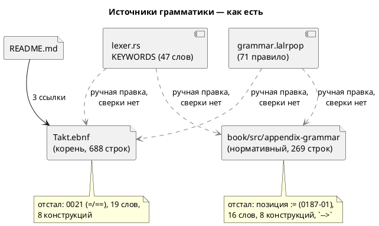

# Фича: Синхронизация эталона `Takt.ebnf` с актуальным синтаксисом

- **Номер:** 0160
- **Статус:** ГОТОВО
- **Зависит от:** нет
- **Tier:** proc
- **Связанные issue (анализ):** кандидат блока 2 `FEATURES.md` (выявлено при наполнении [приложение документа «Грамматика (EBNF)»](0116-book-grammar.md); сверено с `grammar.lalrpop` и пробой)

## Стадии жизненного цикла (правило 17)

Все стадии — **разделы этой карточки** (правило 32): «Архитектура (ADR)»,
«Анализ», «Разработка», «Тест-план», «Отчёт о тестировании», «Итог».
Отдельным артефактом остаются только исправления —
[`docs/fixes/`](../fixes/README.md) (при необходимости `0160-YY-*`).

## Краткое описание

`Takt.ebnf` в корне репозитория использует **дореформенную** схему операторов —
до фичи [смена операторов — `<=` для присваивания, `=` для сравнения](0021-swap-assign-compare.md), которая ввела `:=`
присваивание, `=` равенство и изъяла `==`. Приложение «Грамматика» книги точнее
корневого эталона.

> Фича зарегистрирована из бэклога кандидатов (отобрана заказчиком 2026-07-28); далее проходит жизненный цикл по правилу 17.

## Что известно на входе

- В `Takt.ebnf`: `=`-присваивание, `==`-равенство — схема, изъятая из языка.
- Актуально: `:=` — присваивание, `=` — равенство в выражениях и условиях, `==`
  даёт ошибку разбора (версия языка 0.1.0).
- Приложение «Грамматика (EBNF)» книги приведено к актуальному синтаксису.
  **Замером стадии архитектуры это не подтвердилось:** приложение верно в
  операторах `:=`/`=`, но отстало по девяти другим позициям (см. «Итог»).
- Класс — рассинхрон дока↔язык, **не user-facing**: пользователи читают книгу, а
  не корневой `.ebnf`.

## Направление решения (наметка, не решение)

- Синхронизировать `Takt.ebnf`: инициализаторы `var`/`const`/портов `=`→`:=`; в
  выражениях присваивание `=`→`:=`, равенство `==`→`=` (удалить `==`); поправить
  таблицы приоритетов и инициализаторы в примерах.
- **Не** трогать `=` в связках имён (`type`/`enum`/`cond`/`model`/`state`) —
  там `=` корректен.
- Открытый вопрос для анализа: нужен ли корневой `.ebnf` вообще, раз приложение
  книги точнее, — или его стоит удалить, оставив один источник.
- **Дополнение от [мёртвая лексика: слова и терминалы, которых грамматика не знает](0201-dead-lexemes.md) (2026-08-04).** Рассинхрон
  шире записанного: список ключевых слов `Takt.ebnf` (комментарий у конца файла)
  не содержит `template`, `while`, `match`, `_`, `at`, `clock`, `after`, `every`,
  `invariant`, `parameter`, `inout`, `address`, `from`. Часть из них — слова,
  введённые позже (0044, 0134, 0185, 0187), часть — упущенные изначально.
  Слово `==` из `Takt.ebnf` изымать по-прежнему надо, но по **уточнённой**
  причине: 0201 изъяла его терминал и из грамматики (`grammar.lalrpop`), оставив
  только лексему; замер показал, что объявление терминала диагностику не
  улучшало, а добавляло каскадную вторую ошибку. То же и с `-->` — он значится
  в строке «Прочие» символов `Takt.ebnf`, но правилами не используется.
  Строка `template` в `Takt.ebnf` **отсутствовала и раньше** — то есть эталон
  здесь оказался правее лексера.

Окончательный выбор — за стадиями **архитектуры** (ADR) и **анализа**: раздел
выше фиксирует то, что уже проверено, а не предрешает реализацию.

## Документирование (правило 24)

**Не требуется как отдельная стадия — документ и есть предмет фичи.** Язык не
меняется; вся работа идёт в `book/src/appendix-grammar/`.

Утверждение входной редакции «приложение книги уже актуально» замером **не
подтвердилось**: приложение отстало по девяти позициям, включая позицию
присваивания (см. «Итог»).

## Архитектура (ADR)

- **Status:** Accepted
- **Date:** 2026-08-14
- **Authors:** Архитектор + Заказчик (решение о судьбе корневого эталона — 2026-08-14)
- **Related issues:** [Фича](0160-takt-ebnf-sync.md); смежные — [ADR](0021-swap-assign-compare.md#архитектура-adr) (реформа операторов), [фича](0116-book-grammar.md) (приложение «Грамматика» книги), [ADR](0140-backlog-revision-doc-split.md#архитектура-adr) (разделение ролей README и `book/`, правило 15), [ADR](0201-dead-lexemes.md#архитектура-adr) (мёртвая лексика)

### Context

Грамматика языка Takt описана в репозитории **дважды**:

- корневой `Takt.ebnf` (688 строк) — «эталон», заведён до документа;
- приложение [`book/src/appendix-grammar/index.typ`](../../book/src/appendix-grammar/index.typ)
  (269 строк) — заведено фичей [приложение документа «Грамматика (EBNF)»](0116-book-grammar.md) и объявлено в
  собственном первом абзаце **нормативным** источником по структуре программы.

Фича регистрировалась по одному наблюдению: корневой эталон **дореформенный** —
печатает `=` присваиванием и `==` равенством, то есть схему, изъятую фичей.
Проба стадии архитектуры (обход обоих файлов против `grammar.lalrpop` и
`parser/lexer.rs`) показала, что наблюдение описывало **частный случай**, а класс
шире и хуже.

#### Что показала проба

Замер вёлся по трём источникам истины кода: таблица `KEYWORDS`
(`takt-lang/src/parser/lexer.rs`, 47 записей), extern-блок терминалов и правила
`takt-lang/src/grammar.lalrpop` (71 правило).

| № | Что сверялось | `Takt.ebnf` | Приложение книги |
|---|---|---|---|
| P1 | Присваивание / равенство | `=` / `==` — **дореформенное** (0021) | `:=` / `=` — верно |
| P2 | Позиция присваивания | внутри `expression` | **внутри `expression`** — устарело ([присваивание отвергается семантикой, а должно — грамматикой](../fixes/0187-01-assignment-is-statement-in-grammar.md)) |
| P3 | Ключевых слов в списке | 28 из 47 | **31 из 47** |
| P4 | `while` (синоним `loop` с условием) | нет | **нет** |
| P5 | `match` … `=>` … `_` | нет | **нет** |
| P6 | `invariant Имя = условие;` | нет | слово в списке, **правила нет** |
| P7 | `address Имя = выражение;` | нет | **нет** |
| P8 | `clock <частота>;`, `every <длительность> { … }` | нет | **нет** |
| P9 | `after` в условии (4 формы) | нет | **нет** |
| P10 | `at <адрес>` в объявлении порта | нет | **нет** |
| P11 | Анонимный порт `#АДРЕС` | нет | **нет** |
| P12 | Литералы `duration` / `frequency` / `ticks` | нет | **нет** |
| P13 | `-->` в сводке пунктуации | есть | **есть** — терминал изъят фичей [мёртвая лексика: слова и терминалы, которых грамматика не знает](0201-dead-lexemes.md#архитектура-adr) |
| P14 | `=>` (ветвь `match`) в сводке пунктуации | нет | **нет** |

**P2 — главный результат пробы и переоценка фичи.** Приложение книги, объявленное
нормативным, описывает присваивание как операцию **внутри выражения**. Исправление вынес `:=` из цепочки приоритетов ровно затем, чтобы `(value := 3) + 1`
отвергался **грамматикой** (`SY-006`), а не семантикой; сегодня нормативный
документ описывает язык, которого нет, — и именно в том месте, где отличие
наблюдаемо автором. То есть удаление корневого эталона «ради одного источника»
без правки книги оставило бы **одно неверное** описание вместо двух.

**Дефект не в файле, а в отсутствии контроля.** Оба описания отстали независимо и
разными способами: корневое — на реформе операторов трёхлетней давности,
книжное — на четырёх последующих фичах (0134 время, 0185 параметры, 0187 порты,
0189 анонимные порты). Ни у одного из них нет машинной сверки с кодом: проверки
`book/` проверяют **символы шрифта** (0146) и **компилируемость примеров** (0133),
но не соответствие грамматики языку. Пока сверки нет, любой выбранный вариант
разойдётся снова — вопрос лишь в сроке.

**Живых потребителей у корневого эталона нет.** Обход трекнутых файлов: на
`Takt.ebnf` ссылается **только** `README.md` (три места: обзор синтаксиса, дерево
репозитория, раздел «Грамматика»). Ни один скрипт, проверка, тест или крейт его не
читает. Прочие вхождения — историческая проза `CHANGES.md` и артефакты стадий
закрытых фич, которые правилом 21 не переписываются.

#### Поток «как есть»



### Decision Drivers

1. **Правило 15 свода — дубль снимают разделением ролей, а не сверкой прозы.**
   Оно заведено ровно по этому прецеденту: «дрейф уже случался (`Takt.ebnf`
   отстал от реформы операторов фичи)». Решение, оставляющее два описания
   одного предмета, воспроизводит снятый класс.
2. **Нормативность уже назначена.** Приложение книги само объявляет себя
   нормативным источником, а README по правилу 15 отсылает к книге за описанием
   языка. Корневой эталон — остаток раскладки до 0140.
3. **Верность важнее полноты набора артефактов.** Неверный нормативный документ
   дороже отсутствующего: автор сверяется с ним и получает отказ инструмента.
4. **Контроль обязателен, но покрывает не всё.** Машинно сверить можно **лексику**
   (список ключевых слов ↔ `KEYWORDS`) и пунктуацию; правила EBNF против LALRPOP
   машина не сверит — это проза о форме. Значит проверка закрывает P3/P13/P14
   навсегда, а P1/P2/P4…P12 — разовая правка под ревью (правило 4).
5. **Цена сопровождения.** Каждый лишний описатель грамматики — работа при каждой
   языковой фиче (правило 24 уже требует стадии «Документирование»).

### Considered Options

#### Option A. Удалить `Takt.ebnf`; единственный источник — приложение книги; завести проверка лексики

Корневой файл удаляется, три ссылки README перенаправляются на приложение;
приложение приводится к языку (P1…P14); заводится `scripts/check-book-keywords.py`,
сверяющий список ключевых слов и сводку пунктуации документа с `KEYWORDS`
и extern-блоком грамматики, с самопроверкой-ловушкой (образец).

**Pros:**
- Снимает дубль по образцу правила 15 — источник по грамматике ровно один.
- Устраняет **обе** редакции устаревания разом: после правки нормативный документ
  описывает язык, а не его прошлое.
- Проверка закрывает механически размножающийся класс (лексика), у которого сегодня
  сверки нет ни у одного из четырёх списков документа.
- Уменьшает работу каждой будущей языковой фичи на один файл.

**Cons:**
- Файл `.ebnf` машиночитаемого вида (для генераторов парсеров, внешних
  инструментов) исчезает из корня. Замер: потребителей у него нет, а
  формально эталоном парсера служит `grammar.lalrpop`.
- Правки приложения (8 конструкций) — объём, сверяемый человеком.

#### Option B. Синхронизировать оба файла и завести проверка лексики на оба

**Pros:**
- Артефакт в корне сохраняется — привычный вход для внешнего читателя.

**Cons:**
- Оставляет два описания одного предмета — прямое противоречие правилу 15 и
  прецеденту, которым оно обосновано.
- Проверка покрывает лишь лексику; **правила** двух файлов разойдутся снова, и
  проба показывает, что расходятся они по-разному (P1 против P2).
- Удваивает работу каждой языковой фичи вместо того, чтобы сократить.

#### Option C. Порождать `Takt.ebnf` из приложения книги (генератор + проверка совпадения)

**Pros:**
- Один источник истины при сохранённом артефакте в корне.
- Расхождение невозможно по построению.

**Cons:**
- Новый генератор и его сопровождение ради файла **без потребителей** — цена без
  выгоды.
- Формат книги (Markdown с блоками ` ```ebnf `, прозой между ними) в чистый
  ISO EBNF не переводится механически: пояснения о приоритетах и `loop_cond`
  живут прозой и в порождённый файл не попадут — то есть порождённое будет
  беднее нынешнего эталона.

### Decision

Принимается **Option A** (решение заказчика 2026-08-14).

Корневой `Takt.ebnf` **удаляется**; единственным источником по грамматике
остаётся приложение `book/src/appendix-grammar/` — оно уже объявлено нормативным
и по правилу 15 принадлежит документу, а не README. Приложение приводится к
актуальному языку по всем позициям пробы. Лексическая часть (список ключевых
слов, сводка операторов и пунктуации) ставится **под машинный проверка**: она
размножается механически и потому обязана сверяться машиной, а не ревью.

**Правило 18 — диаграмма.** ADR синтаксис и семантику языка **не меняет**
(меняется описание уже существующего языка), поэтому диаграмма активности/EBNF не
требуется; component-диаграмма потока источников выше добавлена как «строго
необходимая» для понимания решения — предмет ADR есть именно поток «код →
описание».

**Обратная совместимость (правило 11).** Язык не затрагивается: ни одна
программа `.takt` не меняет смысла. Внешняя совместимость — только по пути
файла: ссылка `Takt.ebnf` из корня репозитория перестанет разрешаться. Замер
показал ноль потребителей внутри репозитория; внешние ссылки (если существуют)
получают 404 GitHub — заказчик принял эту цену, выбрав вариант A.

### Consequences

#### Положительные

- Описание грамматики становится единственным и верным; расхождение между двумя
  описаниями невозможно, поскольку второго нет.
- Класс «список лексики документа отстал от языка» закрывается машиной — вместе
  с ним снимается кандидат блока 2 `FEATURES.md` о таблице ключевых слов
  документа (замер закрытия 0201).
- Каждая будущая языковая фича сопровождает на один файл меньше.

#### Отрицательные / Action items

- **A1.** Приложение книги дополняется восемью конструкциями (P4…P12) и
  исправляется в позиции присваивания (P2) — объём, проверяемый человеком.
- **A2.** Проверка `check-book-keywords.py` покрывает **лексику**, а не правила: если
  будущая фича заведёт конструкцию без нового ключевого слова (как 0189 завела
  `#АДРЕС` на уже существующем токене `#`), машина её пропустит. Остаётся
  правило 24 (стадия «Документирование» у каждой языковой фичи) и правило 4.
- **A3.** Списков лексики в проекте после фичи остаётся **три** документных
  (`book/src/02-lexical/index.typ`, `book/keywords.lua`, `book/takt.kate.xml`) плюс
  приложение. Проверка заводится на приложение; распространение на остальные три —
  кандидат в блоке 2 (та же проба, но иной формат файлов).
- **A4.** Таблица ключевых слов раздела `book/src/02-lexical/` отстала так же
  (замер: нет `at`, `clock`, `after`, `every`). Фича её **не** правит —
  это отдельный предмет с отдельным форматом; запись остаётся кандидатом.

#### Acceptance criteria

1. Файла `Takt.ebnf` в репозитории нет; три ссылки `README.md` ведут на
   приложение «Грамматика» книги; проверка ссылок правила 14 зелёный.
2. Приложение `book/src/appendix-grammar/index.typ` описывает: присваивание как
   **оператор** (`statement_expr` / `call_arg`, не уровень `expression`); `while`;
   `match`/`=>`/`_`; `invariant`; `address`; `clock`; `every`; `after` (все
   формы); `at` в объявлении порта; анонимный порт `#АДРЕС`; литералы
   `duration`/`frequency`/`ticks`. Сводка пунктуации не содержит `-->` и
   содержит `=>`.
3. Список ключевых слов приложения равен `parser::lexer::all_keywords()` с точностью
   до явного, обоснованного в самом проверке списка исключений.
4. `scripts/check-book-keywords.py` включён в `precheck.sh`, имеет самопроверку
   (`--self-test`: ловушка ловится, законный текст — нет) и валит предкоммит при
   расхождении.
5. `./scripts/precheck.sh` зелёный; `make -C book build` собирает документ (либо
   пропуск с причиной, если тулчейн недоступен).

## Анализ

### Цель и контекст

ADR принял **Option A**: корневой `Takt.ebnf` удаляется, единственным источником
по грамматике остаётся приложение `book/src/appendix-grammar/`, приложение
приводится к языку, лексическая часть ставится под машинный проверка.

Анализ разбирает **что именно** правится в приложении (по каждой позиции пробы
ADR — с формой правила, взятой из `grammar.lalrpop`), **как устроен проверка** и
**чем это проверяется**.

Предмет фичи — документ, а не язык: ни один `.takt` не меняет смысла, ни один
крейт не пересобирается по-другому. Поэтому вся проверка — сверка текста с кодом
плюс сборка документа.

### Зависимости фичи (правило 17/19)

- **Зависит от:** нет. Проверено по контракту (фича не трогает код компилятора),
  по инфраструктуре (проверка заводится рядом с существующими `check-book-glyphs.py`,
  `check-claude-md.py`, `check-feature-status.py` — их устройство копируется, а не
  правится) и по процессу (правило 24 не задето: язык не меняется).
- **Влияние на порядок разработки:** завершение не разблокирует ни одной фичи —
  зависимостей на 0160 нет ни у кого. Порядок таблицы `FEATURES.md` после
  закрытия сдвигается на одну строку; следующая по классу «синтаксис» отсутствует,
  далее идёт класс «семантика» ([насыщение (saturation) для fixed-point `q(m, n)`](0170-fixed-point-saturation.md)).
- **Смежное, но не зависимость:** кандидат блока 2 «Таблица ключевых слов
  документа отстала от языка» закрывается **частично** — проверка заводится на
  приложение грамматики; разделы `book/src/02-lexical/`, `book/keywords.lua`,
  `book/takt.kate.xml` остаются вне (см. A3/A4 в ADR).

### Требования и проверяемые условия

#### R1. Корневого описателя грамматики не существует

`Takt.ebnf` удалён из индекса git. Ни один живой документ на него не ссылается;
историческая проза (`CHANGES.md`, артефакты стадий закрытых фич) по правилу 21 не
переписывается — она описывает состояние на свой момент.

Три ссылки `README.md` (строки 46, 2421, 2434 на момент анализа) ведут на
приложение «Грамматика» книги.

Ссылка из README на файл **внутри** `book/src` законна: правило 15 требует,
чтобы описание языка **жило** в книге, а не чтобы README о нём молчал. README
остаётся указателем.

#### R2. Приложение описывает язык, а не его прошлое

Правки по позициям пробы ADR. Форма каждого правила взята из
`takt-lang/src/grammar.lalrpop` (номера строк не приводятся — правило проверки
`check-claude-md.py` о ссылках `файл.rs:NNN`; правила названы по имени).

| № | Что правится | Источник в коде | Форма |
|---|---|---|---|
| **P2** | Присваивание — **не** уровень выражения | `StatementExpr`, `CallArg`, `Chain14` | `statement_expr = chain13 ":=" expression \| expression ;` — и `expression` больше не содержит `":="`; в `simple_statement` подставляется `statement_expr`, в аргументе вызова — `call_arg` |
| **P4** | `while` | `ClosedStatement` | `\| "while" loop_cond block_statement` (синоним `loop` с условием; различает их только печать форматтера) |
| **P5** | `match` | `Statement`, `MatchArm`, `MatchPattern` | `"match" loop_cond "{" { match_arm } "}"`; `match_arm = match_pattern { "," match_pattern } "=>" block_statement`; `match_pattern = "_" \| loop_cond` |
| **P6** | `invariant` | `InvariantDefine` | `"invariant" identifier "=" condition ";"` — элемент **и** модели, и состояния |
| **P7** | `address` | `AddressDefine`, `AddressExpr` | `"address" identifier "=" address_expr ";"`; `address_expr = address_literal \| chain13` |
| **P8** | `clock`, `every` | `ClockDefine`, `EveryDefine` | `"clock" frequency ";"` (элемент модели); `"every" duration block_statement` (элемент состояния) |
| **P9** | `after` — четыре формы | `ConditionExpression` | `"after" duration \| "after" ticks \| "after" identifier \| "after" "(" condition ")"` |
| **P10** | `at` в объявлении порта | `VariableDefine` | `in`/`out`/`inout` получают `[ "at" address_expr ]` **перед** `[ ":=" expression ]` |
| **P11** | Анонимный порт `#АДРЕС` | `Precedence0`, `ConditionExpression` | `"#" address_literal \| "#" integer` — в выражении **и** в условии; ширину задаёт то, что стоит над обращением (`as` либо `.бит`) |
| **P12** | Литералы времени | `parser/time_literal.rs` | `duration` (единицы `ns us ms s m h`, составная форма по убыванию — `1m30s`), `frequency` (`Hz kHz MHz`), `ticks` (суффикс `t`) |
| **P13** | `-->` из сводки пунктуации **изъять** | extern-блок грамматики | терминала нет с [мёртвая лексика: слова и терминалы, которых грамматика не знает](0201-dead-lexemes.md) |
| **P14** | `=>` в сводку пунктуации **внести** | extern-блок грамматики | ветвь `match` |
| **P3** | Список ключевых слов | `lexer::all_keywords()` | 47 слов (см. R3 об исключениях) |

**Элемент модели и элемент состояния тоже неполны** — это следствие P6/P7/P8,
но правится отдельно: `model_element` дополняется `invariant_define`,
`address_define`, `clock_define`; `state_element` — `invariant_define`,
`every_define`. Без этого добавленные правила окажутся недостижимыми из точки
входа, то есть грамматика останется неверной при верных правилах.

**Оператор-выражение обязан иметь эффект** ([анонимные порты](0189-anonymous-ports.md),
`SY-007`) — это ограничение **действия** правила, а не продукции: LR(1) не
различает выражение с эффектом и без. В EBNF оно невыразимо и потому идёт прозой
рядом с `simple_statement`, как уже сделано для `loop_cond` и `address_literal`.
То же для `SY-008` (голый адресный литерал вне позиции размещения).

#### R3. Список ключевых слов приложения равен таблице лексера

Равенство — с точностью до списка исключений, **обоснованного в самом проверке**.

Замер: `KEYWORDS` содержит 47 записей, список приложения — 31. Недостающие 16
делятся на два класса:

- **Настоящие ключевые слова, отсутствующие в списке (9):** `address`, `after`,
  `at`, `clock`, `every`, `from`, `match`, `while`, `_`. Вносятся.
- **Контекстные слова LTL (7):** `X`, `F`, `G`, `U`, `R`, `LTL`, `Guard`. В
  `KEYWORDS` они есть, но правило `Identifier` грамматики принимает каждое как
  обычное имя, и приложение уже говорит об этом прозой («`X F G U R LTL Guard` —
  обычные идентификаторы вне аннотации `: [LTL] … ;`»). Вносить их в список
  «ключевых слов» значило бы утверждать неверное.

Отсюда устройство проверки: он сверяет **не** равенство множеств, а вложение
`KEYWORDS ⊆ список ∪ исключения` и `список ⊆ KEYWORDS`. Ровно этот приём уже
применён в LSP (`KEYWORDS ⊆ BUT_KEYWORDS ∪ COMPLETION_EXCLUDED`) — и
по той же причине: список-данные равенством не защищается.

`_` — ключевое слово (`Token::Wildcard`) и одновременно законное начало
идентификатора (`identifier = ( xid_start | "_" | "$" ) …`). Проба: `var _x: u8
:= 1;` компилируется, `var _: u8 := 1;` — нет. В список вносится с пояснением;
проверке это безразлично (он сверяет строки).

#### R4. Проверка сверяет лексику машинно и проверяет сам себя

`scripts/check-book-keywords.py` — по образцу `check-book-glyphs.py`
(тот же язык, тот же способ включения в `precheck.sh`, тот же ключ `--self-test`).

Что сверяется:

1. **Ключевые слова.** Множество из `**Ключевые слова:** …` приложения против
   `KEYWORDS` из `takt-lang/src/parser/lexer.rs` (разбор таблицы `phf_map!`
   регулярным выражением `"([^"]+)"\s*=>`), с явным списком исключений LTL.
2. **Пунктуация и операторы.** Множество из `**Операторы и пунктуация:** …`
   против терминалов-строк extern-блока `grammar.lalrpop`. Направление —
   **обе** стороны: слово в документе, которого нет в грамматике (`-->` до
   правки), и терминал грамматики, которого нет в документе (`=>` до правки).

**Извлечение из документа — по абзацу, а не по строке.** Список ключевых слов
занимает четыре строки; построчный поиск дал бы ноль совпадений и «зелёный» проверка,
ничего не проверяющий. Это ровно тот дефект, который вскрыл [версия крейта в живом контексте отстала, а проверка её не видел](../fixes/0202-01-stale-crate-version-in-context.md) у
`check_crate_versions`, и он записан кандидатом в блоке 2 `FEATURES.md`. Здесь он
не повторяется: текст перед разбором склеивается по абзацам.

**Проверка обязан падать на пустом входе.** Если разметка абзаца изменится и
множество из документа окажется пустым, проверка «документ ⊆ грамматика»
выполнится тривиально. Поэтому у проверки есть нижняя граница: пустое множество —
ошибка с называющим текстом, а не успех.

**Терминалы extern-блока — не только пунктуация:** там же лежат имена токенов
(`identifier`, `number`, `duration`) и все ключевые слова. Сверка пунктуации
берёт из extern-блока только записи, **не** состоящие из букв, — иначе в
«пунктуацию» попали бы 47 слов.

#### R5. Предкоммит и документ зелёные

`./scripts/precheck.sh` проходит (включая новая проверка и правило 14 о ссылках).
`make -C book build` собирает PDF — либо пропускается с названной причиной, если
тулчейн (`mdbook`/`mdbook-pandoc`/`xelatex`) недоступен: сборка документа в
предкоммит не входит по построению.

### Критерии приёмки и способ проверки

| # | Критерий | Способ проверки |
|---|---|---|
| A1 | `Takt.ebnf` отсутствует; ссылок на него в живых документах нет | `git ls-files Takt.ebnf` пуст; `grep -rn "Takt\.ebnf" README.md` пуст; проверка ссылок правила 14 в `precheck.sh` зелёный |
| A2 | Приложение описывает P2, P4…P12 | Ревью против `grammar.lalrpop` (правило 4) + прогон примеров из приложения настоящим `taktc` (тест-план) |
| A3 | Сводка пунктуации без `-->`, с `=>` | Новая проверка (двусторонняя сверка) |
| A4 | Список ключевых слов = `KEYWORDS` ∪ исключения | Новая проверка |
| A5 | Проверка проверяет сам себя | `check-book-keywords.py --self-test`: ловушка каждого класса ловится, законный текст — нет |
| A6 | Проверка не «зеленеет» на пустом входе | Самопроверка: разметка без списка → ошибка |
| A7 | Предкоммит зелёный | `./scripts/precheck.sh` |
| A8 | Документ собирается | `make -C book build` (вне предкоммита) |

### Особенности по обратной совместимости

Язык не затрагивается — обратная совместимость программ полная (правило 11).
Единственная потеря — путь `Takt.ebnf` в корне репозитория: внешняя ссылка на
него (если существует) получит 404. Цена принята заказчиком при выборе Option A;
внутри репозитория потребителей ноль (замер ADR).

### Декомпозиция (стадия 4)

| Задача | Содержание |
|---|---|
| [синхронизация эталона `Takt.ebnf` с актуальным синтаксисом](0160-takt-ebnf-sync.md#разработка) | Приложение книги: правки P2, P4…P14 + дополнение `model_element`/`state_element` |
| [синхронизация эталона `Takt.ebnf` с актуальным синтаксисом](0160-takt-ebnf-sync.md#разработка) | Проверка `scripts/check-book-keywords.py` + включение в `precheck.sh` + самопроверка |
| [синхронизация эталона `Takt.ebnf` с актуальным синтаксисом](0160-takt-ebnf-sync.md#разработка) | Удаление `Takt.ebnf`, перенаправление ссылок README |

Порядок значим: 01 → 02 (проверка, заведённый раньше правки, покраснеет на текущем
документе — это ожидаемо и служит доказательством, что он **видит** расхождение,
поэтому 02 фиксирует замер «до» перед тем, как 01 сделает его зелёным); 03
последняя — до неё корневой файл остаётся эталоном для сверки при правке 01.

**Замер «до» — обязательная часть 02**, а не побочная: проверка, впервые
запущенный на уже исправленном документе, не отличим от проверки, который не
проверяет ничего.

### Риски и зависимости

- **Р1. Правки приложения проверяются человеком.** Машина сверяет лексику, но не
  правила. Снижение: каждое правило переписывается из `grammar.lalrpop` в один
  проход с указанием имени правила-источника (таблица R2), а примеры из
  приложения прогоняются настоящим `taktc` (тест-план).
- **Р2. Проверка может оказаться слепым** (класс: проверка, ничего не
  проверяющая). Снижение — A5/A6: самопроверка с ловушкой на каждый класс плюс
  запрет пустого множества.
- **Р3. Удаление файла ломает внешние ссылки.** Принято решением заказчика;
  внутренних потребителей ноль.
- **Р4. Документ может не собраться** из-за символов вне шрифта.
  Снижение: новые символы приложения — только те, что уже встречаются в документе
  (`⚠️`, `≤`, стрелки не вводятся); проверка глифов в предкоммите это проверит.

## Разработка

### Задача

#### Что было

`book/src/appendix-grammar/index.typ` объявляет себя **нормативным** источником по
структуре программы, но описывал язык с отставанием на четыре фичи и одну
позицию приоритетов (таблица пробы ADR, P2…P14):

- присваивание печаталось как операция **внутри** `expression` — то есть
  описывался язык, отменённый исправлением
  [присваивание отвергается семантикой, а должно — грамматикой](../fixes/0187-01-assignment-is-statement-in-grammar.md);
- отсутствовали `while`, `match`/`=>`/`_`, `invariant`, `address`, `clock`,
  `every`, `after`, `at`, анонимный порт `#АДРЕС`, литералы времени, тип `q(m, n)`;
- в сводке пунктуации стоял `-->` (терминал изъят фичей
  [мёртвая лексика: слова и терминалы, которых грамматика не знает](0201-dead-lexemes.md)) и не было `=>` и `#`;
- список ключевых слов содержал 31 запись из 47.

#### Что сделано

Правки в одном файле — `book/src/appendix-grammar/index.typ`. Каждое правило
переписано из `takt-lang/src/grammar.lalrpop`; имя правила-источника указано в
таблице R2 анализа.

| Позиция | Правка |
|---|---|
| P2 | Из `expression` изъят `":="`; заведены `statement_expr` и `call_arg` — три позиции языка, где запись законна; прозой названа цена нарушения (`SY-006`) |
| P4 | `"while" loop_cond block_statement` + прозой: синоним `loop`, различает их только печать форматтера |
| P5 | `"match" loop_cond "{" { match_arm } "}"`, `match_arm`, `match_pattern` (с `_`) |
| P6 | `invariant_define`; добавлен в `model_element` **и** `state_element` |
| P7 | `address_define`, `address_expr` |
| P8 | `clock_define` (элемент модели), `every_define` (элемент состояния) |
| P9 | Четыре формы `after` в `condition` + прозой о скобках (`after A + 1s` = `(after A) + 1s`) |
| P10 | `[ "at" address_expr ]` у `in`/`out`/`inout` |
| P11 | `"#" address_literal \| "#" integer` — в `expression` **и** в `condition` |
| P12 | `duration`, `duration_part`, `time_unit`, `frequency`, `ticks`, `address_literal` |
| P13/P14 | Из сводки пунктуации изъят `-->`, внесены `=>` и `#` |
| P3 | Список ключевых слов доведён до 40 записей (47 минус семь контекстных LTL) |
| — | `type` дополнен формой `q(m, n)`; индекс массива — `( integer \| identifier )`; `condition_define` получил завершающую `";"`, которой в тексте не было |

Прозой (в EBNF невыразимо) добавлено: ограничение «оператор-выражение обязан
иметь эффект» (`SY-007`), законность адресного литерала только в позиции
размещения и после `#` (`SY-008`), строгий порядок единиц составной длительности
и значимость их регистра.

#### Проверки

Утверждения проверены **прогоном настоящего `taktc`**, а не чтением грамматики.

**Пример** (`p1.takt`, зонд стадии разработки) — одна модель, где встречаются все
добавленные конструкции разом: `clock 1kHz;`, `in … at 0x40021000:3`, `address`,
`q(8, 8)`, `invariant` на уровне модели и состояния, `every 10ms { … }`, `while`,
`match` с `_` и списком образцов `1, 2`, `for` со `statement_expr` в шаге,
`after (BASE + 30s)`, `after 3t`, `#0x40021100.4` в условии ребра, индекс массива
именем. Результат: `Скомпилировано … (plantuml)`, отказов разбора нет
(предупреждения `SE-036`/`SE-037` — о неиспользуемой переменной и неявной
булевости, к форме отношения не имеют).

**Контрпримеры** — каждый даёт названный отказ:

| Вход | Отказ |
|---|---|
| `a := (b := 3) + 1;` | `SY-006` |
| `a + 1;` | `SY-007` |
| `a := 0x105:0;` | `SY-008` |
| `var a: duration := 30s1m;` | `LE-011` (порядок единиц) |
| `var a: duration := 1m30s;` | принято (только `SE-036`) |

Проверка лексики задачи [синхронизация эталона `Takt.ebnf` с актуальным синтаксисом](0160-takt-ebnf-sync.md#разработка) на исправленном
документе зелёный: «40 ключевых слов и 36 знаков сверены с лексером и
грамматикой, расхождений нет».

### Задача

#### Что было

Лексику документа не сверял с кодом **никто**. Три существующих сверки идут от
`KEYWORDS` наружу — к автодополнению LSP  и к плагину IntelliJ; в
сторону документа не смотрит ни одна. Цена измерена дважды: замер ADR (16
неучтённых слов в приложении) и замер закрытия
[мёртвая лексика: слова и терминалы, которых грамматика не знает](0201-dead-lexemes.md) (та же слепота у раздела
`book/src/02-lexical/`).

Класс размножается механически: список — это данные, их правят копированием, а
не выводом, и потому отставание не громкое, а тихое.

#### Что сделано

Заведён `scripts/check-book-keywords.py` (образец устройства —
`check-book-glyphs.py`: тот же язык, тот же ключ `--self-test`, то же место в
`precheck.sh`). Четыре класса:

| Класс | Что ловит | Реальный случай |
|---|---|---|
| **K1** | ключевое слово лексера мимо списка документа | `at`, `clock`, `after`, `every`, `match`, `while`, `address`, `from`, `_` |
| **K2** | слово документа, не являющееся ключевым | — (на входе не встретилось) |
| **P1** | знак документа мимо терминалов грамматики | `-->` (изъят фичей) |
| **P2** | терминал-знак грамматики мимо сводки документа | `=>` (фича `match`), `#`  |

Источники истины — таблица `KEYWORDS` (`takt-lang/src/parser/lexer.rs`) и
extern-блок терминалов (`takt-lang/src/grammar.lalrpop`).

**Разбор документа идёт по абзацу, а не по строке.** Список ключевых слов
занимает четыре строки; построчный поиск дал бы ноль совпадений, то есть зелёный
проверка, не проверяющий ничего. Это ровно тот дефект, которым оказался слеп
`check_crate_versions` ([версия крейта в живом контексте отстала, а проверка её не видел](../fixes/0202-01-stale-crate-version-in-context.md)) — здесь он не
повторяется, и запрет на его повтор стоит в самопроверке.

**Пустое множество — ошибка.** Отсутствие абзаца-списка валит проверка названной
диагностикой: иначе проверки «документ ⊆ код» выполнились бы тривиально.

**Контекстные слова LTL исключены явно.** `X F G U R LTL Guard` лексер держит в
`KEYWORDS`, но правило `Identifier` грамматики принимает каждое как обычное имя, и
документ говорит об этом отдельной фразой. Поэтому сверка — не равенство, а
вложение с обоснованным списком исключений: тот же приём, что у
`KEYWORDS ⊆ BUT_KEYWORDS ∪ COMPLETION_EXCLUDED` в LSP.

**Фильтр пунктуации.** Из extern-блока берутся только терминалы, **не**
состоящие из букв: иначе в «пунктуацию» попали бы 47 ключевых слов и имена
токенов (`identifier`, `number`, `duration`).

Проверка включён в `scripts/precheck.sh` рядом с проверкой глифов — самопроверкой
вперёд, как принято в проекте.

#### Проверки

**Замер «до» (обязательная часть задачи, не побочная).** Проверка прогнан на
**неисправленном** документе — до правки 0160-01:

```
[K1] `_` `address` `after` `at` `clock` `every` `from` `match` `while`
[P1] `-->`
[P2] `#` `=>`
```

Двенадцать находок, код возврата 1. Без этого замера проверка, впервые запущенный на
уже исправленном документе, неотличим от проверки, который не проверяет ничего.

**Замер «после»:** «Лексика приложения «Грамматика»: 40 ключевых слов и 36 знаков
сверены с лексером и грамматикой, расхождений нет», код 0.

**Самопроверка** (`--self-test`): подложенный вход даёт ровно четыре находки —
по одной на класс, включая настоящие `-->` и `=>`; контекстное `X` пропуском
**не** считается; согласованный вход находок не даёт; документ без абзаца-списка
даёт ненулевой код (подпроба отдельным процессом, её вывод глушится — ожидаемая
ошибка в логе предкоммита читалась бы отказом).

### Задача

#### Что было

Корневой `Takt.ebnf` (688 строк) — второе описание грамматики в проекте, при том
что приложение книги объявлено нормативным, а правило 15 свода прямо снимает
дубли **разделением ролей**, а не сверкой прозы (и заведено оно именно по этому
прецеденту: «дрейф уже случался — `Takt.ebnf` отстал от реформы операторов фичи»).

Отставание к моменту фичи: дореформенные `=`/`==`, 28 ключевых слов из 47,
отсутствие восьми конструкций.

#### Что сделано

- `git rm Takt.ebnf`.
- Три ссылки `README.md` перенаправлены на приложение
  [`book/src/appendix-grammar/index.typ`](../../book/src/appendix-grammar/index.typ):
  раздел обзора синтаксиса, дерево репозитория (строка `Takt.ebnf` заменена на
  `book/`), раздел «Расширение языка» — там же названы правило 24 и новая проверка
  лексики, чтобы читатель, добавляющий конструкцию, видел обязанность документа.

**Историческая проза не переписывается** (правило 21): вхождения `Takt.ebnf` в
`CHANGES.md`, в артефактах стадий закрытых фич (0100, 0116, 0140, 0201) и в
формулировке правила 15 описывают состояние на свой момент и остаются как есть.
Проверка ссылок правила 14 их не задевает — это текст, а не ссылки на файл.

#### Проверки

- `git ls-files Takt.ebnf` — пусто.
- `grep -rn "Takt\.ebnf" README.md` — пусто.
- `scripts/check-links.py` (правило 14) в предкоммите — битых ссылок нет:
  относительный путь `book/src/appendix-grammar/index.typ` из корня разрешается.
- Полный `./scripts/precheck.sh` — зелёный.

**Внешняя ссылка на файл в корне репозитория теперь даёт 404.** Потребителей
внутри репозитория ноль (замер ADR: ни скрипта, ни проверки, ни теста, ни крейта);
цена принята заказчиком при выборе Option A.

## Тест-план

### Область и цель

Фича меняет **документ**, а не язык: ни один `.takt` не меняет смысла, ни один
крейт не собирается иначе. Поэтому проверяется не поведение компилятора, а
**истинность утверждений документа** и **работоспособность контроля**.

Два разных предмета проверки — и способы у них разные:

- **истинность правил EBNF** машине недоступна (это проза о форме) — проверяется
  прогоном настоящего `taktc` на примерах и контрпримерах (правило 16);
- **лексика** проверяется машинно новым проверкой, и сама проверка проверяется
  самопроверкой: зелёный проверка без ловушки неотличим от проверки, пропускающего всё.

### Проверки (условие → ожидаемый результат)

| # | Проверка | Предусловие | Ожидаемый результат | Ссылка на R/A |
|---|---|---|---|---|
| T1 | Пример со всеми добавленными конструкциями разом | зонд `p1.takt`: `clock`, `at`, `address`, `q(8,8)`, `invariant` (модель + состояние), `every`, `while`, `match` с `_` и списком образцов, `for` со `statement_expr`, `after (…)`, `after 3t`, `#0x…4`, индекс именем | `taktc compile -t plantuml` — успех, отказов разбора нет | R2 / A2 |
| T2 | Запись внутри значения незаконна | `a := (b := 3) + 1;` | отказ `SY-006` | R2 / A2 |
| T3 | Оператор-выражение обязан иметь эффект | `a + 1;` | отказ `SY-007` | R2 / A2 |
| T4 | Адресный литерал вне позиции размещения | `a := 0x105:0;` | отказ `SY-008` | R2 / A2 |
| T5 | Порядок единиц составной длительности строгий | `var a: duration := 30s1m;` | отказ `LE-011` | R2 / A2 |
| T6 | Убывающий порядок законен | `var a: duration := 1m30s;` | принято (только `SE-036` о неиспользовании) | R2 / A2 |
| T7 | Проверка **видит** расхождение (замер «до») | документ до правки 0160-01 | код 1, ровно 12 находок: 9×K1, 1×P1 (`-->`), 2×P2 (`#`, `=>`) | R4 / A5 |
| T8 | Проверка зелен на исправленном документе | документ после 0160-01 | код 0, «40 ключевых слов и 36 знаков … расхождений нет» | R3/R4 / A3, A4 |
| T9 | Ловушки взведены | `check-book-keywords.py --self-test` | по одной находке на каждый из четырёх классов; контекстное `X` пропуском не считается | R4 / A5 |
| T10 | Согласованный вход ложных находок не даёт | тот же `--self-test` | находок нет | R4 / A5 |
| T11 | Пустой вход — ошибка, а не успех | документ без абзаца «Ключевые слова» | ненулевой код возврата с называющей диагностикой | R4 / A6 |
| T12 | Корневого эталона нет и ссылок на него нет | после 0160-03 | `git ls-files Takt.ebnf` пуст; `grep "Takt\.ebnf" README.md` пуст | R1 / A1 |
| T13 | Ссылки документа целы | правило 14 | `check-links.py` — битых ссылок нет | R1 / A1 |
| T14 | Предкоммит зелёный | полный прогон | `./scripts/precheck.sh` — код 0 (включая новая проверка) | R5 / A7 |
| T15 | Документ собирается | тулчейн mdbook+pandoc+xelatex | `make -C book build` — PDF собран; при отсутствии тулчейна — пропуск с названной причиной | R5 / A8 |
| T16 | Символы документа покрыты шрифтом | проверка | находок нет (новый текст приложения не вводит символов вне шрифта) | R5 / A7 |

### Разбивка проверок по функциональности

Правило 11: единые условия прогоняются против каждой задеваемой обратной
функциональности. Фича документная — задеваемых поверхностей три.

| Функциональность | Условие | Статус |
|---|---|---|
| Язык `.takt` (разбор, семантика, цели) | вывод инструментов не меняется: правки идут только в `book/` и `README.md`, код не тронут | ✅ (T14: предкоммит целиком, включая сверки целей) |
| Предкоммит и CI | новая проверка не валит существующие прогоны; под `PRECHECK_STRICT=1` поведение то же (проверка не зависит от внешних инструментов — только `python3`, уже требуемый правилом 14) | ✅ (T14) |
| Документ `book/` | сборка PDF и проверки не задеты | ✅ (T15, T16) |
| Внешние ссылки на `Takt.ebnf` | путь в корне исчезает — 404 | — (принято решением заказчика, ADR: потребителей внутри репозитория ноль) |

<!-- Легенда: ✅ пройдено · ❌ провалено · ⬜ не проверялось · — не применимо -->

### Тестовые данные и окружение

- **Зонд T1** — `p1.takt` стадии разработки (одна модель со всеми конструкциями).
  В корпус `examples/` **не вносится**: примеры корпуса проходят проверки целей
  `c`/`rust`/`st`/`sv` и контракты сценариев, а зонд собран ради **разбора**, и
  превращать его в пример значило бы менять предмет фичи.
- **Контрпримеры T2…T5** — однострочные модели, подаваемые `taktc` напрямую.
- Окружение: `rustc 1.97.1` (пин `rust-toolchain.toml`), `python3`, macOS
  (darwin 25.5.0).

**Чего этот план не проверяет.** Полнота правил EBNF доказывается примером и
контрпримерами, но не исчерпанием: конструкция, отсутствующая и в языке-примере,
и в списке лексики, машиной не ловится (A2 ADR). Именно поэтому фича оставляет
правило 24 и правило 4 действующими, а не объявляет предмет закрытым машиной.

## Отчёт о тестировании

### Сводка прогонов и окружение

| Параметр | Значение |
|---|---|
| Дата | 2026-08-14 |
| Толчейн | `rustc 1.97.1` (пин `rust-toolchain.toml`) |
| Платформа | macOS (darwin 25.5.0), 12 ядер |
| Инструменты | `taktc` (сборка `target/debug`), `python3`, `./scripts/precheck.sh` |

### Сверка с тест-планом

| # | Проверка | Результат | Наблюдение |
|---|---|---|---|
| T1 | Пример со всеми конструкциями | ✅ | `taktc compile -t plantuml` — успех; из диагностик только `SE-036` (неиспользуемая `gain`) и `SE-037` (неявная булевость в `#0x…4`), обе к форме отношения не имеют |
| T2 | `a := (b := 3) + 1;` | ✅ | `SY-006` |
| T3 | `a + 1;` | ✅ | `SY-007` |
| T4 | `a := 0x105:0;` | ✅ | `SY-008` |
| T5 | `30s1m` | ✅ | `LE-011` |
| T6 | `1m30s` | ✅ | принято |
| T7 | Замер «до» | ✅ | код 1, 12 находок: `_ address after at clock every from match while` (K1), `-->` (P1), `#` `=>` (P2) |
| T8 | Замер «после» | ✅ | код 0, «40 ключевых слов и 36 знаков … расхождений нет» |
| T9 | Ловушки взведены | ✅ | четыре класса ловятся; контекстное `X` пропуском не считается |
| T10 | Согласованный вход | ✅ | находок нет |
| T11 | Пустой вход | ✅ | ненулевой код с называющей диагностикой |
| T12 | Эталона нет, ссылок нет | ✅ | `git ls-files Takt.ebnf` пуст; `grep` по README пуст |
| T13 | Ссылки целы | ✅ | `check-links.py` — битых нет |
| T14 | Предкоммит | ✅ | `./scripts/precheck.sh` — код 0 |
| T15 | Сборка документа | ✅ | `make -C book build` — PDF собран |
| T16 | Символы шрифта | ✅ | проверка — находок нет |

### Примеры и контрпримеры (правило 16)

**Пример** — зонд с полным набором добавленных конструкций (`clock 1kHz;`,
`in … at 0x40021000:3`, `address`, `q(8, 8)`, `invariant` на модели и в
состоянии, `every 10ms`, `while`, `match` с `_` и списком образцов, `for` со
`statement_expr` в шаге, `after (BASE + 30s)`, `after 3t`, `#0x40021100.4`,
индекс массива именем). Компилируется.

**Контрпримеры** — четыре формы, каждая с названным отказом: `SY-006`
(присваивание внутри значения), `SY-007` (оператор без эффекта), `SY-008`
(адресный литерал вне позиции размещения), `LE-011` (возрастающий порядок единиц
длительности).

**В документ примеры не переносятся, и это осознанно.** Правило 16 требует,
чтобы проверенные примеры попадали в документацию по языку; здесь **предмет
фичи и есть документация**, а конструкции зонда уже описаны своими разделами
книги (`06-control-flow` — `while`/`match`, `12-time` — `clock`/`every`/`after`,
`08-ports-addresses` — `at`/`#АДРЕС`). Приложение «Грамматика» описывает **форму**,
и примеров программ по построению не содержит — внесение туда зонда сменило бы
жанр приложения.

### Найденные дефекты

**Ни одного дефекта кода.** Фича документная; отказов, потребовавших исправления, не
возникло.

**Найдено на стадии архитектуры и учтено в объёме:** нормативное приложение
описывало присваивание как операцию внутри выражения (расхождение с исправлением). Это не дефект фичи, а причина, по которой её объём вырос с «поправить
корневой файл» до «сделать оставшееся описание верным и завести контроля».

### Итоговый вердикт

**Готово.** Критерии приёмки анализа A1…A8 выполнены: корневого описателя нет,
приложение описывает язык, лексика сверяется машиной в обе стороны, проверка судит сам себя и не зеленеет на пустом входе, предкоммит зелёный, документ
собирается.

**Что осталось непокрытым машиной** (записано в ADR как A2/A3/A4 и
перенесено в кандидаты): правила EBNF сверяются человеком; списки лексики
`book/src/02-lexical/index.typ`, `book/keywords.lua`, `book/takt.kate.xml`
остаются без сверки — там тот же класс, но иной формат файлов.

## Итог (что сделано)

**Описание грамматики в проекте стало одним и получило машинного контроля.**

- **Корневой `Takt.ebnf` удалён** (решение заказчика 2026-08-14, Option A ADR).
  Единственный источник — приложение
  [`book/src/appendix-grammar/`](../../book/src/appendix-grammar/index.typ), уже
  объявлявшее себя нормативным. Три ссылки `README.md` перенаправлены.
  Потребителей у файла не было ни одного: ни скрипта, ни проверки, ни теста, ни
  крейта — только проза README.
- **Проба стадии архитектуры переоценила фичу.** Регистрировалась она по одному
  наблюдению (дореформенные `=`/`==`), а замер показал: **нормативное приложение
  отстало тоже** — и ровно в наблюдаемом месте. Оно описывало присваивание как
  операцию **внутри выражения**, тогда как [присваивание отвергается семантикой, а должно — грамматикой](../fixes/0187-01-assignment-is-statement-in-grammar.md) вынес `:=` из
  цепочки приоритетов ради отказа `SY-006`. Удаление корневого файла без правки
  книги оставило бы **одно неверное** описание вместо двух.
- **Приложение приведено к языку:** позиция присваивания (`statement_expr` /
  `call_arg`), `while`, `match`/`=>`/`_`, `invariant`, `address`, `clock`,
  `every`, четыре формы `after`, `at` в объявлении порта, анонимный порт
  `#АДРЕС`, литералы `duration`/`frequency`/`ticks`, тип `q(m, n)`, индекс
  массива именем; из сводки пунктуации изъят `-->` (терминала нет с [мёртвая лексика: слова и терминалы, которых грамматика не знает](0201-dead-lexemes.md)), внесены `=>` и `#`; список ключевых слов — 40
  записей вместо 31.
- **Заведён проверка** `scripts/check-book-keywords.py` (в `precheck.sh`): список
  ключевых слов против таблицы `KEYWORDS` лексера, сводка пунктуации против
  терминалов extern-блока грамматики — **в обе стороны**, четыре класса находок.
  Замер «до» — 12 находок, после правки — ноль.
- **Проверка читает документ по абзацу, а не по строке**, и объявляет пустое
  множество **ошибкой**: список занимает четыре строки, построчный поиск дал бы
  зелёную проверку, не проверяющую ничего (класс [версия крейта в живом контексте отстала, а проверка её не видел](../fixes/0202-01-stale-crate-version-in-context.md)).
- **Машина сверяет лексику, не правила.** Конструкция без нового ключевого
  слова (как `#АДРЕС` на существующем токене `#`) проверке невидима — её держат
  правило 24 и ревью. Правила приложения проверены прогоном настоящего `taktc`:
  примером со всеми конструкциями разом и контрпримерами `SY-006`, `SY-007`,
  `SY-008`, `LE-011`.
- **Три списка лексики документа остались без сверки** —
  `book/src/02-lexical/index.typ`, `book/keywords.lua`, `book/takt.kate.xml`.
  Класс тот же, форматы разные; запись обновлена в кандидатах `FEATURES.md`.
- Язык не изменён (`0.8.0`); обратная совместимость программ полная. Внешняя
  ссылка на `Takt.ebnf` в корне репозитория теперь даёт 404 — цена принята
  заказчиком.

Артефакты: [ADR](0160-takt-ebnf-sync.md#архитектура-adr) ·
[анализ](0160-takt-ebnf-sync.md#анализ) ·
[синхронизация эталона `Takt.ebnf` с актуальным синтаксисом](0160-takt-ebnf-sync.md#разработка) ·
[синхронизация эталона `Takt.ebnf` с актуальным синтаксисом](0160-takt-ebnf-sync.md#разработка) ·
[синхронизация эталона `Takt.ebnf` с актуальным синтаксисом](0160-takt-ebnf-sync.md#разработка) ·
[тест-план](0160-takt-ebnf-sync.md#тест-план) ·
[отчёт](0160-takt-ebnf-sync.md#отчёт-о-тестировании).
