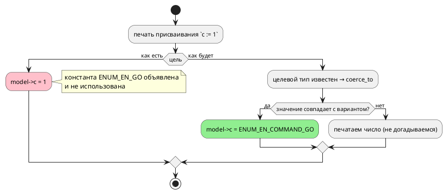

# Фича: Цель `c`: использовать объявленные константы перечисления

- **Номер:** 0167
- **Статус:** ГОТОВО
- **Зависит от:** нет
- **Tier:** 3
- **Связанные issue (анализ):** кандидат блока 2 `FEATURES.md` (переформулировано ревизией [ревизия витрины кандидатов и решение по дублю README ↔ book](0140-backlog-revision-doc-split.md) 2026-07-27; прежняя запись «не эмитит вовсе» опровергнута пробой)

## Стадии жизненного цикла

Все стадии — **разделы этой карточки**: «Архитектура (ADR)»,
«Анализ», «Разработка», «Тест-план», «Отчёт о тестировании», «Итог».
Отдельным артефактом остаются только исправления —
[`docs/fixes/`](../fixes/README.md) (при необходимости `0167-YY-*`).

## Краткое описание

Цель `c` **объявляет** константы перечисления и тут же их **не использует**:
присваивание печатается голым числом. Читатель порождённого C не узнает, что `1`
— это `Go`, не заглянув в `.takt`. Ровно то положение, из которого фича
[булевы литералы в телах цели `st` печатаются числом](0066-st-bool-literals.md) вывела цель `st`.

> Фича зарегистрирована из бэклога кандидатов (отобрана заказчиком 2026-07-28); далее проходит жизненный цикл по своду.

## Что известно на входе

- `#define ENUM_EN_M_GO 1` **эмитится** — но в `.c` (прежний греп искал в `.h`,
  отсюда неверная прежняя формулировка).
- Присваивание при этом: `model->c = 1;` вместо `model->c = ENUM_EN_M_GO;`.
- Для сравнения: `rust` даёт `Command::Stop`, `sv` — `COMMAND_STOP`; обе
  восстанавливают вариант по целевому типу.
- Смежно с [эталонный `SRC` в `lib.rs` порождает C с 11 ошибками `cc`](0075-lib-src-reference-model.md) и
  [дефекты генератора C по структурам](0080-c-struct-defects.md).

## Направление решения (наметка, не решение)

- Восстанавливать вариант по целевому типу на печати присваивания — приём тот
  же, что у `rust`/`sv`/`st` (`coerce_to`).
- Вывод цели `c` изменится → изменится `examples/generated/` и, возможно,
  потактовые сверки: правка **читаемости**, не поведения, и это надо доказать
  (значения обязаны совпасть до и после).

Окончательный выбор — за стадиями **архитектуры** (ADR) и **анализа**: раздел
выше фиксирует то, что уже проверено, а не предрешает реализацию.

## Документирование

**Не требуется.** Читаемость порождённого кода; язык и наблюдаемое поведение не
меняются.

## Архитектура (ADR)

- **Status:** Accepted (Option C)
- **Date:** 2026-08-16
- **Authors:** Архитектор
- **Related issues:** [Фича](0167-c-enum-constants-usage.md); прямой образец — [ADR](0066-st-bool-literals.md#архитектура-adr) (та же болезнь у цели `st`, приём `coerce_to`); смежно с [ADR](0195-target-name-collisions.md#архитектура-adr) (имя перечислителя строит одна функция, столкновения имён в одном пространстве), [ADR](0193-shared-const-qualified.md#архитектура-adr) (имя константы квалифицировано владельцем), [ADR](0060-enum-width-shared-layer.md#архитектура-adr) (знак и ширина перечисления — общий слой)

### Context

Цель `c` **объявляет** константы перечисления и тут же их **не использует**:

```c
#define ENUM_EN_STOP 0
#define ENUM_EN_GO   1
#define ENUM_EN_HALT 2
…
model->c = 1;              /* а это, оказывается, Go */
```

Читатель порождённого C не узнает, что `1` — это `Go`, не заглянув в `.takt`.
Ровно то положение, из которого фича [булевы литералы в телах цели `st` печатаются числом](0066-st-bool-literals.md#архитектура-adr) вывела
цель `st`.

#### Замер 1: три цели из четырёх вариант восстанавливают (проба 2026-08-16)

Вход: `enum Command { Stop = 0, Go = 1, Halt = 2 }`, тело `c := 1;`, условие
`c = 1`.

| Цель | Присваивание | Сравнение | Что говорит инструмент цели |
|---|---|---|---|
| `c` | `model->c = 1;` | `model->c == 1` | компилируется |
| `st` | `c := Command_Go;` | `IF c = 1` | `iec2c` принимает |
| `sv` | `en_c_next = COMMAND_GO;` | `== 1` | verilator принимает |
| `rust` | `self.c = Command::Go;` | `self.c == 1` | **`rustc` отвергает: E0308** |

**Попутная находка, за пределами этой фичи.** Цель `rust` на сравнении
перечислимой переменной с числом порождает **невалидный** код (`expected
Command, found integer`). Проверка цели гоняет только корпус, а в корпусе такого
сравнения нет — тот же класс, что дефекты. Выносится кандидатом;
здесь важно, что **сравнение** у всех целей осталось голым числом, и это общий
пробел, а не особенность `c`.

#### Замер 2: имя константы у цели `c` квалифицировано моделью, но не перечислением

```takt
enum Command { Stop = 0, Go = 1 }
enum Mode    { Stop = 5, Run = 6 }
```

```c
#define ENUM_TWO_ENUMS_STOP 0
#define ENUM_TWO_ENUMS_STOP 5   /* ← то же имя, другое значение */
```

Проба `cc -c -Wall -Werror` (**флаги проверки проекта**):

```
error: 'ENUM_TWO_ENUMS_STOP' macro redefined [-Werror,-Wmacro-redefined]
```

То есть вывод цели `c` на такой программе **не компилируется уже сегодня**, и
держится это лишь тем, что в корпусе одноимённых вариантов нет (в `elevator`
перечисления `Floor` и `Action` разошлись именами случайно).

Прочие цели квалифицируют **перечислением**: `Command_Stop` / `Mode_Stop` (`st`),
`COMMAND_STOP` / `MODE_STOP` (`sv`), `Command::Stop` / `Mode::Stop` (`rust`).
Модель в имя добавляет только `c` — и это правильно (одно пространство имён на
программу, класс [цели `rust` и `sv` — одноимённые константы разных моделей](0193-shared-const-qualified.md#архитектура-adr)); недостаёт **второго**
сегмента.

**Отсюда прямое следствие для объёма фичи.** Начать использовать константы, не
починив имя, — значит внести **молчаливое расхождение значений**: `c := 0` дало
бы `ENUM_TWO_ENUMS_STOP`, который к моменту использования равен `5` (последнее
определение перекрывает первое). Читаемость улучшилась бы ценой неверного
автомата.

#### Замер 3: что изменится в корпусе

`examples/generated/c/` содержит **15** констант в четырёх файлах
(`comprehensive`, `elevator`, `elevator_mini`, `extend_complex`). Смена формы
имени и подстановка констант изменят эти файлы — изменение **текста**, не
значений: макрос раскрывается в то же число.

Эти четыре файла **не отслеживаются git** (`examples/generated/c/.gitignore`):
их перегенерирует проверка предкоммита при каждом прогоне. То есть диффа в коммите не
будет, и «обновить снапшот» здесь означает «прогнать проверка», а не «закоммитить
вывод». Отслеживаются рядом лежащие харнессы (`*_main.c`) и `batch_cycle.[ch]` —
перечислений в них нет.

#### Поток «как есть» и «как будет»



### Decision Drivers

1. **Вывод не должен противоречить сам себе.** Цель объявляет имя и печатает
   число — тот же довод, которым закрывалась
   [булевы литералы в телах цели `st` печатаются числом](0066-st-bool-literals.md#архитектура-adr) для `st`.
2. **Использовать можно только то, что однозначно.** Имя, склеенное из модели и
   варианта, однозначным не является (замер 2), и его использование внесло бы
   ошибку значений.
3. **Не догадываться**. Значение, не совпадающее ни с одним
   вариантом, печатается **числом**: перечислимой переменной можно присвоить
   произвольное число, и подмена «похожим» вариантом была бы тихой ложью.
   Правило дословно унаследовано от 0066.
4. **Поведение обязано остаться прежним.** Правка — о читаемости; значения до и
   после совпадают, и это проверяемый критерий, а не ожидание.
5. **Имя строит одна функция** (урок [коллизии имён при отображении в пространство имён цели](0195-target-name-collisions.md#архитектура-adr)):
   продюсер (`#define`) и потребитель (присваивание) обязаны звать один
   конструктор, иначе разъедутся — и вывод сошлётся на несуществующий макрос.

### Considered Options

#### Option A. Оставить как есть

**Pros:**
- Ноль правок, вывод корпуса неизменен.

**Cons:**
- Вывод продолжает противоречить себе; дефект дубля `#define` (замер 2) остаётся
  и продолжает ждать первую программу с одноимёнными вариантами.

#### Option B. Только подставить константы, имя не трогать

**Pros:**
- Минимальная правка, ровно по формулировке карточки.

**Cons:**
- **Вносит дефект значений.** На входе замера 2 присваивание `c := 0` напечатало
  бы `ENUM_TWO_ENUMS_STOP`, равный `5`. Читаемость за счёт верности —
  неприемлемый размен.

#### Option C. Починить имя (сегмент перечисления) + использовать константы

Имя строит **одна** функция: `ENUM_<МОДЕЛЬ>_<ПЕРЕЧИСЛЕНИЕ>_<ВАРИАНТ>`. Её зовут
и продюсер `#define`, и печать присваивания, и печать сравнения с литералом.
Восстановление — через `coerce_to` по целевому типу.

**Pros:**
- Устраняет **обе** беды разом, причём вторая (дубль макроса) — предусловие
  первой.
- Приём и текст правила уже обкатаны на `st` (0066): «известен тип — печатай
  имя; не совпало — печатай число».
- Один конструктор имени — то, чего требует урок.

**Cons:**
- Вывод корпуса меняется в четырёх файлах (замер 3); в git они не хранятся,
  поэтому проверка — зелёный проверка, а не дифф.
- Имена становятся длиннее (`ENUM_ELEVATOR_FLOOR_BOTTOM` вместо
  `ENUM_ELEVATOR_BOTTOM`); это плата за однозначность.

#### Option D. Эмитить настоящий `enum` C вместо `#define`

**Pros:**
- Отладчик показывал бы имя; ближе к `rust`/`sv`.

**Cons:**
- Перечислители C — область видимости файла, и они столкнулись бы с
  перечислителями состояний и портов (`PORT_`) — то есть задача
  именования никуда не девается, а вывод меняется куда сильнее.
- Тип переменной берётся из `enum_facts` (`uint8_t`), а не из `enum`: два
  представления одного факта вместо одного.
- Объём несопоставим с предметом фичи.

### Decision

Принимается **Option C**.

- **Имя константы** — `ENUM_<МОДЕЛЬ>_<ПЕРЕЧИСЛЕНИЕ>_<ВАРИАНТ>` (все сегменты
  нормализуются тем же способом, что сегодня). Строит его **одна** функция в
  `generator/c/c_names.rs` — рядом с `port_enum_variant`, по тому же образцу.
- **Использование** — в присваивании (включая начальную инициализацию модели) и
  в **сравнении с литералом**: оба места — «тип перечислимого операнда
  известен», и правило у них одно. Реализуется одной функцией `coerce_to` по
  целевому типу.
- **Не догадываться:** значение, не совпадающее ни с одним вариантом, печатается
  числом.
- **Поведение неизменно:** значения до и после совпадают; доказывается
  потактовой сверкой, а не рассуждением.

**Вне объёма (границы названы, а не забыты):** невалидный код цели `rust` на
сравнении перечислимой переменной с числом (замер 1) — самостоятельный дефект
другой цели, выносится кандидатом. Форма `enum` C (Option D) не принимается.

### Consequences

#### Положительные

- Порождённый C перестаёт противоречить себе: объявленное имя используется.
- Программа с одноимёнными вариантами двух перечислений начинает компилироваться
  (сегодня — `-Wmacro-redefined` под флагами проверки).
- Имя строит один конструктор — расхождение продюсера и потребителя становится
  невыразимым.

#### Отрицательные / Action items

- **Вывод корпуса меняется** в четырёх файлах: и объявления (новая форма имени),
  и присваивания/сравнения. В git они не хранятся (замер 3), поэтому проверка
  здесь — не дифф, а **зелёный проверка**: компиляция корпуса под `-Wall -Werror` и
  детерминизм. Потактовые сверки обязаны остаться зелёными **без правок** — это и
  есть доказательство, что менялась читаемость, а не поведение.
- **Совместимость.** Имена макросов видны пользователю (он может ссылаться на
  них в своём коде вокруг порождённого). Смена формы — ломающее изменение
  **вывода**, не языка; версия языка не меняется, версия крейта — минорно.
- Документ (`book/`) правки не требует: язык и наблюдаемое поведение те же
  (карточка фичи).

#### Acceptance criteria

1. Константа объявляется как `ENUM_<МОДЕЛЬ>_<ПЕРЕЧИСЛЕНИЕ>_<ВАРИАНТ>`; два
   перечисления одной модели с одноимённым вариантом дают **разные** макросы, и
   вывод компилируется под `-Wall -Werror`.
2. Присваивание перечислимой переменной литералом печатается **именем
   константы**; то же — для начальной инициализации в `_init`.
3. Сравнение перечислимой переменной с литералом печатается именем константы.
4. Значение, не совпадающее ни с одним вариантом, печатается **числом**.
5. Имя строит одна функция; продюсер и потребитель зовут её же (контроль — тест,
   а не соглашение).
6. Потактовые сверки (`conformance_c_tests` и прочие) зелены **без изменений**:
   поведение не менялось.
7. Корпус перегенерирован проверкой и компилируется; проверка детерминизма зелён.
   (Файлы с перечислениями в git не хранятся — проверка не диффом, а проверкой.)
8. `./scripts/precheck.sh` зелёный.

## Анализ

### Цель и контекст

ADR принял **Option C**: имя константы получает сегмент перечисления, и константа
начинает использоваться там, где известен тип — в присваивании (включая
начальную инициализацию) и в сравнении с литералом.

Анализ отвечает на то, что ADR оставил реализации: **откуда брать владельца
перечисления**, **где именно стоят три точки подстановки** и **что должно
остаться неизменным**.

### Зависимости фичи

- **Зависит от:** `нет`. Приём (`coerce_to` по целевому типу) закрыт фичей
  [булевы литералы в телах цели `st` печатаются числом](0066-st-bool-literals.md) для цели `st`; конструктор имени
  рядом с `port_enum_variant` заведён фичей
  [коллизии имён при отображении в пространство имён цели](0195-target-name-collisions.md).
- **Влияние на порядок разработки:** ничего не разблокирует и ничем не
  блокируется.

### Замеры (проба и чтение кода 2026-08-16)

#### З1. Владельца перечисления взять было неоткуда

`EnumDefinitionNode` имеет поле `upper` с док-строкой «слабая ссылка на
родительскую модель (для разрешения имён при генерации кода)» — и оно **не
заполнялось**: построение дерева ставило только `loc`. Потребителей у поля не
было ни одного.

Почему это важно: `search_enum` идёт по цепочке `upper` **модели** и отдаёт
**узел**, а не владельца. Значит унаследованное перечисление неотличимо от
собственного, и потребитель, строящий имя из «модели, которую печатаем», сослался
бы на несуществующий макрос. Это ровно класс
[цели `rust` и `sv` — одноимённые константы разных моделей](0193-shared-const-qualified.md): ключ строится из `upper`
узла, а не из текущей модели.

Решение: заполнить поле при построении — заготовка, существовавшая с самого
начала, начинает работать. Само построение узла при этом **переехало** из
`tree.rs` в `enum_node.rs`: проверка размера модуля не даёт расти файлам, которые уже
сверх лимита, и правило прямо велит выносить новое.

#### З2. Три точки подстановки, и все три — «тип известен»

| Место | Файл | Что печаталось |
|---|---|---|
| присваивание в теле | `c_expr/expr.rs` (`ExpressionNode::Assign`) | `model->c = 1;` |
| начальная инициализация | `c_blocks.rs` (`generate_scalar_init`) | `model->c = 0;` |
| сравнение с литералом | `c_expr/condition.rs` (`Equal`/`NotEqual`) | `model->c == 1` |

Инициализацию пропустить нельзя: тело печатало бы имя, а `_init` — число, и
вывод противоречил бы себе **внутри одного файла**.

В сравнении сторона роли не играет: `c = Go` и `Go = c` — одно и то же, и
автор вправе написать любую. Поэтому проверяются оба операнда.

#### З3. Что остаётся неизменным

Значения. Макрос раскрывается в то же число, поэтому потактовые сверки обязаны
остаться зелёными **без правок** — это доказательство, что менялась читаемость,
а не поведение. Прогон `conformance_c_tests` после правки: **17/17**.

#### З4. Смежный дефект другой цели (вне объёма)

Цель `rust` на сравнении перечислимой переменной с числом порождает
**невалидный** код: `if self.c == 1` → `E0308`. Проверка цели гоняет только корпус, а
в корпусе такого сравнения нет. Выносится кандидатом — предмет этой фичи цель
`c`.

### Требования и проверяемые условия

- **R1. Имя однозначно.** Константа объявляется как
  `ENUM_<МОДЕЛЬ>_<ПЕРЕЧИСЛЕНИЕ>_<ВАРИАНТ>`; одноимённые варианты двух
  перечислений одной модели дают **разные** макросы, и вывод компилируется под
  `-Wall -Werror`.
- **R2. Присваивание использует константу** — в теле и в `_init`.
- **R3. Сравнение с литералом использует константу** (обе стороны).
- **R4. Не догадываемся.** Значение вне набора вариантов печатается числом.
- **R5. Одна функция имени.** Продюсер (`#define`) и потребитель зовут
  `c_names::enum_constant`; всякая использованная константа объявлена.
- **R6. Владелец берётся у узла** (`EnumDefinitionNode::upper`), а не у
  печатаемой модели.
- **R7. Поведение неизменно.** Потактовые сверки зелены без правок.
- **R8. Корпус перегенерирован** проверкой и компилируется под `-Wall -Werror`;
  проверка детерминизма зелён. Четыре файла корпуса с перечислениями
  (`comprehensive`, `elevator`, `elevator_mini`, `extend_complex`) в git **не
  хранятся** (`examples/generated/c/.gitignore`) — проверка здесь не диффом, а
  прогоном проверки.

### Критерии приёмки и способ проверки

| # | Критерий | Способ проверки |
|---|---|---|
| A1 | Имя с сегментом перечисления; вывод компилируется под `-Werror` | тест с двумя одноимёнными вариантами + прогон настоящего `cc` |
| A2 | Присваивание и `_init` печатают имя | тесты на текст вывода |
| A3 | Сравнение печатает имя | тест на текст вывода |
| A4 | Значение вне вариантов остаётся числом | тест на `c := 7` при вариантах 0/1 |
| A5 | Всякая использованная константа объявлена | тест-контроль, сверяющий множества |
| A6 | Сверки зелены без правок | `conformance_c_tests` |
| A7 | Корпус перегенерирован и компилируется, детерминизм зелён | `precheck.sh` (диффа не будет: файлы в `.gitignore`) |
| A8 | `./scripts/precheck.sh` зелёный | прогон |

### Редакторский слой

Фича **не меняет** лексику, синтаксис и семантику языка — меняется текст,
порождаемый одной целью. Ключевые слова, токены, узлы АСД, формы объявления и
диагностики не затронуты; правки LSP и плагинов **не требуются**.

Единственная правка вне цели `c` — заполнение поля `upper` у семантического узла
перечисления (замер З1). Оно не наблюдаемо снаружи: поле было объявлено и не
использовалось.

### Особенности по обратной функциональности

**Меняется вывод, а не язык.** Имена макросов видны пользователю (он вправе
ссылаться на них в коде вокруг порождённого), поэтому смена формы — ломающее
изменение **вывода**. Оно осознанно: прежняя форма неоднозначна и на входе с
одноимёнными вариантами порождала невалидный C.

Версия **языка** не меняется. Версия крейта — по общему правилу цикла.

### Риски и зависимости

- **Риск: продюсер и потребитель разъедутся.** Снят конструктором-одиночкой (R5)
  и тестом, сверяющим множество объявленных с множеством использованных.
- **Риск: подмена значения.** Самый опасный исход — напечатать имя варианта там,
  где значение ему не равно. Снят правилом R4 и мутацией «брать первый вариант
  вместо совпадающего» (падает три теста).
- **Риск: унаследованное перечисление.** Владелец берётся у узла (R6); иначе имя
  сослалось бы на модель-потребителя, где макроса нет.
- **Риск: тихое изменение поведения.** Снят требованием R7 — сверки зелены без
  единой правки.

## Разработка

### Задача

#### Что было

Цель `c` объявляла константы перечисления и тут же их **не использовала**:
`#define ENUM_EN_GO 1` рядом с `model->c = 1;`. Читатель порождённого C не
узнавал, что `1` — это `Go`.

Вторая беда, найденная пробой: имя строилось как `ENUM_<МОДЕЛЬ>_<ВАРИАНТ>` — без
сегмента перечисления. Два перечисления одной модели с одноимённым вариантом
давали два `#define` с одним именем и разными значениями, и `cc -Wall -Werror`
(флаги проверки проекта) такой файл отвергал.

#### Что сделано

**Семантика (одна строка, но существенная):** заполняется
`EnumDefinitionNode::upper`. Поле существовало с самого начала и док-строкой
обещало «разрешение имён при генерации кода», но не заполнялось — потребителю
пришлось бы строить имя из «модели, которую печатаем», а не из места объявления. `search_enum` идёт по цепочке `upper` **модели** и отдаёт узел,
поэтому унаследованное перечисление иначе неотличимо от собственного.

**Имя — один конструктор:** `c_names::enum_constant(model, enum, variant)` →
`ENUM_<МОДЕЛЬ>_<ПЕРЕЧИСЛЕНИЕ>_<ВАРИАНТ>`, рядом с `port_enum_variant` и по тому
же образцу. Зовут его оба конца — печать `#define` (`c_decl`) и печать значения.

**Восстановление значения — один модуль:** новый `c_enum::constant_of(ty, value,
scope)`. Возвращает `None` (печатать как есть), если тип не перечислимый,
перечисление не найдено, владелец недоступен либо значение не совпадает ни с
одним вариантом — правило «не догадываться» дословно унаследовано от ADR.

**Три точки подстановки** (все — «тип известен»):

| Место | Файл |
|---|---|
| присваивание в теле | `c_expr/expr.rs` (`ExpressionNode::Assign`) |
| начальная инициализация | `c_blocks.rs` (`generate_scalar_init`) |
| сравнение с литералом | `c_expr/condition.rs` (`Equal`/`NotEqual`) |

Инициализацию пропустить было нельзя: тело печатало бы имя, а `_init` —
число, и вывод противоречил бы себе внутри одного файла. В сравнении
проверяются **оба** операнда: `c = Go` и `Go = c` — одно и то же.

**Проверка размера модуля вмешался дважды, и это замысел правила.** `tree.rs`
(1575 строк при лимите 1000) от правки вырос — построение узла перечисления
вынесено целиком, и файл **уменьшился** до 1530. Первая попытка завела отдельный
модуль `semantic/enum_build.rs`, но объявление `mod` вырастило уже
`semantic/mod.rs` (1287 строк, тоже сверх лимита); построение переехало в
`enum_node.rs` — **рядом с самим узлом**, где ему и место. Записи долга обновлены
по факту (ратчет допускает только уменьшение).

Функциональности вне Rust-крейтов: `н/п`.

#### Проверки

```sh
cargo test --all-features --test c_enum_constants_tests   # 7 тестов
cargo test --all-features --test conformance_c_tests      # 17/17 без правок
./scripts/precheck.sh
```

Контроль — `takt-lang/tests/targets/c_enum_constants_tests.rs`:

| Тест | Условие анализа |
|---|---|
| `assignment_uses_the_constant` | R2 |
| `initializer_uses_the_constant` | R2 (`_init`) |
| `comparison_uses_the_constant` | R3 |
| `constant_name_carries_the_enum_segment` | R1 |
| `clashing_variants_compile_under_werror` | R1 (прогон настоящего `cc`) |
| `value_outside_the_variants_stays_a_number` | R4 |
| `every_used_constant_is_declared` | R5 (сверка множеств) |

**Мутации:**

| Мутация | Ответ тестов |
|---|---|
| Убрать сегмент перечисления из имени | 5 падений |
| Брать первый вариант вместо совпадающего по значению | 3 падения |

Вторая мутация — самая важная: она моделирует **подмену значения**, то есть
исход, при котором читаемость улучшилась бы ценой неверного автомата.

## Тест-план

### Область и цель

Фича меняет **текст** порождаемого C, а не язык: (примеры и
контрпримеры языка) неприменимо. Главное, что обязан доказать план, —
**поведение не изменилось**: макрос раскрывается в то же число.

Проверяются R1–R8 анализа и критерии A1–A8.

### Проверки (условие → ожидаемый результат)

| # | Проверка | Предусловие | Ожидаемый результат | Ссылка на R/A |
|---|---|---|---|---|
| T1 | Присваивание использует константу | `c := 1` при `Go = 1` | `model->c = ENUM_EN_COMMAND_GO;` | R2 / A2 |
| T2 | Инициализация использует константу | `var c: Command := 0` | `model->c = ENUM_EN_COMMAND_STOP;` в `_init` | R2 / A2 |
| T3 | Сравнение использует константу | `ref Run: c = 1` | `model->c == ENUM_EN_COMMAND_GO` | R3 / A3 |
| T4 | Имя несёт сегмент перечисления | два перечисления с вариантом `Stop` | `ENUM_TWO_COMMAND_STOP` и `ENUM_TWO_MODE_STOP` | R1 / A1 |
| T5 | Вывод компилируется под `-Werror` | тот же вход | `cc -c -Wall -Werror` — код 0 | R1 / A1 |
| T6 | Значение вне вариантов | `c := 7` при вариантах 0/1 | `model->c = 7;` (число) | R4 / A4 |
| T7 | Всякая использованная константа объявлена | оба входа | множество использованных ⊆ множеству объявленных, и оно **непусто** | R5 / A5 |
| T8 | Поведение неизменно | `conformance_c_tests` | 17/17 **без правок теста** | R7 / A6 |
| T9 | Корпус перегенерирован | `precheck.sh` | корпус компилируется под `-Wall -Werror`, детерминизм зелён | R8 / A7 |
| T10 | Предкоммит | `./scripts/precheck.sh` | зелёный | — / A8 |

### Что считается провалом, даже если тесты зелены

- **Подмена значения.** Имя варианта там, где значение ему не равно, — худший
  исход фичи: читаемость за счёт верности. Ловится T6 и мутацией «брать первый
  вариант».
- **Правка сверок «под зелёный».** Если для прохождения `conformance_c_tests`
  понадобилось изменить сам тест — поведение изменилось, и фича вышла за свои
  границы.
- **Ссылка на необъявленный макрос.** Продюсер и потребитель обязаны звать одну
  функцию; T7 проверяет это множествами, а не сравнением строк.

### Мутационные проверки

| # | Мутация | Ожидание | Факт |
|---|---|---|---|
| M1 | Убрать сегмент перечисления из имени | падение | ✅ 5 падений |
| M2 | Брать первый вариант вместо совпадающего по значению | падение | ✅ 3 падения |

### Разбивка проверок по функциональности

| Функциональность | T1–T7 | T8 | T9 | Статус |
|---|---|---|---|---|
| Цель `c` | ✅ | ✅ | ✅ | пройдено |
| Цели `st`/`rust`/`sv` | — | — | ✅ | не задеты (свои имена, своя печать) |
| Симулятор `takt-sim` | — | ✅ | — | не задет (значения те же) |
| Языковой сервер и плагины | — | — | — | не задеты (язык не менялся) |

<!-- Легенда: ✅ пройдено · ❌ провалено · ⬜ не проверялось · — не применимо -->

### Тестовые данные и окружение

- Контроль: `takt-lang/tests/targets/c_enum_constants_tests.rs` (7 тестов, один запускает
  настоящий `cc -Wall -Werror`).
- Сверки: `takt-sim/tests/conformance/conformance_c_tests.rs` — прогоняются **без правок**.
- Команды:

```sh
cargo test --all-features --test c_enum_constants_tests
cargo test --all-features --test conformance_c_tests
./scripts/precheck.sh
```

- Окружение: толчейн `1.97.1` (пин `rust-toolchain.toml`), macOS (Darwin 25.5.0).

## Отчёт о тестировании

### Резюме

**Пройдено, фича готова к закрытию (`ГОТОВО`).** Десять проверок тест-плана дали
ожидаемый результат; критерии A1–A8 выполнены.

Прогон: `cargo test --all-features --test c_enum_constants_tests` — **7 из 7**;
`conformance_c_tests` — **17 из 17 без единой правки теста**;
`./scripts/precheck.sh` — зелёный.

Главное, что доказал прогон: **поведение не изменилось**. Менялась читаемость.

### Фактические результаты по проверкам

| # | Проверка | Результат | Комментарий |
|---|---|---|---|
| T1 | Присваивание использует константу | ✅ | `model->c = ENUM_EN_COMMAND_GO;` |
| T2 | Инициализация использует константу | ✅ | `_init` печатает `ENUM_EN_COMMAND_STOP` |
| T3 | Сравнение использует константу | ✅ | `model->c == ENUM_EN_COMMAND_GO` |
| T4 | Имя несёт сегмент перечисления | ✅ | `ENUM_TWO_COMMAND_STOP` ≠ `ENUM_TWO_MODE_STOP` |
| T5 | Вывод компилируется под `-Werror` | ✅ | прогон настоящего `cc -c -Wall -Werror` |
| T6 | Значение вне вариантов | ✅ | `c := 7` при вариантах 0/1 → `model->c = 7;` |
| T7 | Всякая использованная константа объявлена | ✅ | сверка множеств, оба входа |
| T8 | Поведение неизменно | ✅ | `conformance_c_tests` 17/17, тест не правился |
| T9 | Корпус перегенерирован | ✅ | компилируется под `-Wall -Werror`, детерминизм зелён; диффа нет — файлы в `.gitignore` (находка 4) |
| T10 | Предкоммит | ✅ | зелёный |

### Мутационные проверки

| # | Мутация | Ожидание | Факт |
|---|---|---|---|
| M1 | Убрать сегмент перечисления из имени | падение | ✅ 5 падений |
| M2 | Брать первый вариант вместо совпадающего по значению | падение | ✅ 3 падения |

**M2 — самая важная.** Она моделирует **подмену значения**: имя варианта там,
где значение ему не равно. Это худший исход фичи (читаемость ценой неверного
автомата), и он ловится — в том числе тестом «значение вне вариантов остаётся
числом», который при мутации начинает печатать `ENUM_..._STOP` вместо `7`.

### Находки

#### Находка 1: одной подстановки было мало

Проба вскрыла, что имя строилось **без** сегмента перечисления
(`ENUM_<МОДЕЛЬ>_<ВАРИАНТ>`). Два перечисления одной модели с одноимённым
вариантом давали два `#define` с одним именем и разными значениями, и
`cc -Wall -Werror` (флаги проверки проекта) такой файл отвергал уже **до** фичи.

Следствие для объёма: подставить такие имена значило бы внести **неверные
значения** — второе определение перекрывает первое. Поэтому фича чинит и имя, и
использование; порознь они не имеют смысла. Держалось прежнее устройство лишь
тем, что в корпусе одноимённых вариантов нет (в `elevator` перечисления `Floor` и
`Action` разошлись именами случайно).

#### Находка 2: заготовка, которая не работала

Поле `EnumDefinitionNode::upper` существовало с самого начала и док-строкой
обещало «разрешение имён при генерации кода» — но **не заполнялось**, и
потребителей у него не было ни одного. Без него владельца унаследованного
перечисления не отличить от текущей модели. Поле начало
заполняться.

#### Находка 4: снапшотов корпуса для этих файлов не существует

Ожидалось, что фича обновит `examples/generated/c/`. Проверка показала: четыре
файла, содержащие перечисления (`comprehensive`, `elevator`, `elevator_mini`,
`extend_complex`), перечислены в `examples/generated/c/.gitignore` — их
перегенерирует проверка при каждом прогоне, а в git они не хранятся. Отслеживаются
рядом лежащие харнессы (`*_main.c`) и `batch_cycle.[ch]`, где перечислений нет.

Следствие: доказательством служит **зелёный проверка** (компиляция корпуса под
`-Wall -Werror` + детерминизм), а не дифф коммита. Формулировки ADR, анализа и
тест-плана исправлены по факту.

#### Находка 3: проверка размера модуля сработал по назначению

`tree.rs` (1575 строк при лимите 1000) вырос от правки на 10 строк, и проверка
отказал. Это не помеха, а замысел правила: построение узла перечисления вынесено
целиком, и `tree.rs` **уменьшился** до 1530 строк.

Проверка сработал **дважды**: первая попытка завела отдельный модуль
`semantic/enum_build.rs`, но само объявление `mod` вырастило `semantic/mod.rs`
(1287 строк, тоже сверх лимита). Построение переехало в `enum_node.rs` — рядом с
самим узлом, где ему и место, — и ни один файл не вырос. Записи долга обновлены
по факту (ратчет допускает только уменьшение).

### Результаты по функциональности

| Функциональность | Статус | Основание |
|---|---|---|
| Цель `c` | ✅ | T1–T7, T9 |
| Цели `st`/`rust`/`sv` | — | не задеты: свои имена и своя печать; корпус перегенерирован без расхождений |
| Симулятор `takt-sim` | — | не задет: значения те же (T8) |
| Языковой сервер и плагины | — | язык не менялся |

### Дефекты

**Дефектов кода не найдено.** Два отказа предкоммита в ходе работы — сработавшие
контроля процесса: битая ссылка на ещё не заведённый тест-план и рост
`tree.rs` сверх лимита (находка 3). Оба устранены; исправления (`docs/fixes/`) не
требуются.

### Выводы и дальнейшие шаги

- Порождённый C перестал противоречить себе, а неоднозначное имя константы
  устранено вместе с невалидным выводом на входе с одноимёнными вариантами.
- **Кандидат заведён**: цель `rust` порождает невалидный код на
  сравнении перечислимой переменной с числом (`E0308`); проверка цели гоняет только
  корпус, где такого сравнения нет.
- Исправления (`docs/fixes/0167-YY-*`) не требуются.

## Итог (что сделано)

**Порождённый C перестал противоречить сам себе.** Цель объявляла
`#define ENUM_EN_GO 1` и тут же печатала `model->c = 1;` — читатель не узнавал,
что `1` есть `Go`, не заглянув в `.takt`. Теперь константа используется в трёх
местах, где **известен тип**: присваивание в теле, начальная инициализация в
`_init` и сравнение с литералом.

**Проба вскрыла вторую беду, без которой первая нерешаема.** Имя строилось
как `ENUM_<МОДЕЛЬ>_<ВАРИАНТ>` — без сегмента перечисления, — и два перечисления
одной модели с одноимённым вариантом давали два `#define` с **одним именем и
разными значениями**. Такой файл `cc -Wall -Werror` (флаги проверки проекта)
отвергает уже сегодня, а подстановка таких имён дала бы **неверные значения**:
второе определение перекрывает первое. Поэтому фича чинит и имя, и
использование — порознь они не имеют смысла.

Ключевые решения ([ADR](0167-c-enum-constants-usage.md#архитектура-adr), Option C):

- имя — `ENUM_<МОДЕЛЬ>_<ПЕРЕЧИСЛЕНИЕ>_<ВАРИАНТ>`, строит его **одна** функция
  `c_names::enum_constant`, которую зовут оба конца;
- восстановление значения — один модуль `c_enum::constant_of`, приём тот же, что
  у цели `st` (`coerce_to`);
- **не догадываемся**: значение вне набора вариантов печатается числом;
- владелец перечисления берётся у **узла**: поле `EnumDefinitionNode::upper`
  существовало с самого начала, обещало док-строкой «разрешение имён при
  генерации кода» и **не заполнялось** — заготовка, которая не работала.

Контроль — [`takt-lang/tests/targets/c_enum_constants_tests.rs`](../../takt-lang/tests/targets/c_enum_constants_tests.rs)
(7 тестов, включая прогон настоящего `cc -Wall -Werror` и сверку множеств
«объявлено ↔ использовано»). Обе мутации ловятся, в том числе самая опасная —
подмена значения. Потактовые сверки `conformance_c_tests` зелены **без единой
правки**: менялась читаемость, а не поведение. Детали —
[отчёт](0167-c-enum-constants-usage.md#отчёт-о-тестировании), задача
[цель `c`: использовать объявленные константы перечисления](0167-c-enum-constants-usage.md#разработка).

**Границы (названы, а не забыты):** цель `rust` на сравнении перечислимой
переменной с числом порождает **невалидный** код (`E0308`) — самостоятельный
дефект другой цели, вынесен кандидатом. Форма настоящего `enum` C вместо
`#define` отвергнута (Option D ADR): перечислители столкнулись бы с портами и
состояниями, то есть задача именования никуда не делась бы.
