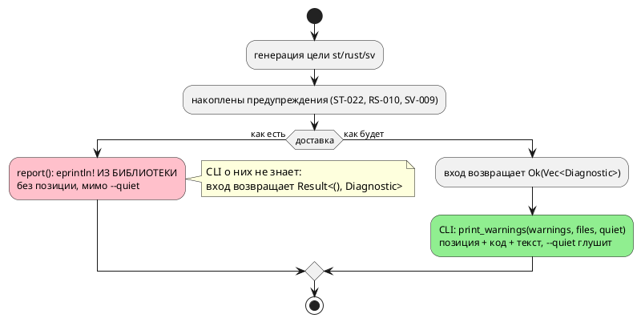

# Фича: Предупреждения генераторов возвращаются вызывающему, а не печатаются из библиотеки

- **Номер:** 0168
- **Статус:** ГОТОВО
- **Зависит от:** нет
- **Tier:** 2
- **Связанные issue (анализ):** кандидат блока 2 `FEATURES.md` (выявлено при проработке [предупреждение о делителе (`SV-009`) в цели `sv`](0064-sv-divider-warning.md), греп + чтение кода)

## Стадии жизненного цикла

Все стадии — **разделы этой карточки**: «Архитектура (ADR)»,
«Анализ», «Разработка», «Тест-план», «Отчёт о тестировании», «Итог».
Отдельным артефактом остаются только исправления —
[`docs/fixes/`](../fixes/README.md) (при необходимости `0168-YY-*`).

## Краткое описание

`report` печатает диагностику **прямо в stderr из крейта `takt-lang`**, а
`compile_to_sv`/`compile_to_rust` объявлены `Result<(), Diagnostic>` и
предупреждений не отдают вовсе. Следствие: `--quiet` их не глушит, LSP не
покажет, а тест на них — хрупкий перехват stderr.

> Фича зарегистрирована из бэклога кандидатов (отобрана заказчиком 2026-07-28); далее проходит жизненный цикл по своду.

## Что известно на входе

- Точки печати: `generator/rust/mod.rs:202`, `generator/st/mod.rs:293`; цель
  `sv` завела свой `report` по их образцу (0064) — **вместе с дефектом**.
- (1) `--quiet` не глушит: греп по `generator/` слова `quiet` не находит.
- (2) LSP получит их в свой stderr, а не покажет пользователю как диагностику.
- (3) Тест может проверить факт предупреждения только перехватом stderr либо
  прямой инспекцией приёмника `Fsm::warnings`.
- Прецедент правильного контракта: `compile_to_st_at` возвращает `Ok(warnings)`.

## Направление решения (наметка, не решение)

- Возвращать `Vec<Diagnostic>` из `compile_to_*` (как уже делает
  `compile_to_st_at`), печать оставить бинарнику.
- Смежно с [`lamc` не печатает предупреждения вообще](0081-lamc-print-warnings.md), но это **другой канал**: 0081
  про семантические предупреждения, которые CLI не вызывал; здесь — про целевые,
  которые библиотека печатает сама.
- Сигнатуры публичного API меняются → мажорный рост версии крейта
  `takt-lang`.

Окончательный выбор — за стадиями **архитектуры** (ADR) и **анализа**: раздел
выше фиксирует то, что уже проверено, а не предрешает реализацию.

## Документирование

**Требуется.** Меняется наблюдаемое поведение CLI (`--quiet` начинает глушить
предупреждения целей) — затронут раздел
[`book/src/16-diagnostics/`](../../book/src/16-diagnostics/index.typ).

**Сделано** ([предупреждения генераторов возвращаются вызывающему, а не печатаются из библиотеки](0168-generator-warnings-return.md#разработка)):
в раздел добавлен подраздел «Тихий режим» — `--quiet` оставляет только ошибки, и
правило действует **одинаково** для предупреждений модели и предупреждений цели.
Оговорено, что предупреждение остаётся частью результата компиляции и в тихом
режиме просто не показывается.

## Архитектура (ADR)

- **Status:** Accepted (Option C)
- **Date:** 2026-08-16
- **Authors:** Архитектор
- **Related issues:** [Фича](0168-generator-warnings-return.md); дефект воспроизведён целью `sv` в [ADR](0064-sv-divider-warning.md#архитектура-adr) (action A-6 — «чинить здесь нельзя, заведено кандидатом»); смежно с [ADR](0081-lamc-print-warnings.md#архитектура-adr) (единая точка предупреждений компилятора), [фичей](0228-compile-warning-position.md) (позиция предупреждения теряется при печати), задачей (копия формата диагностики разошлась)

### Context

Библиотека `takt-lang` печатает часть диагностики **сама**, минуя вызывающего.
Три цели (`st`, `rust`, `sv`) заканчивают генерацию вызовом собственной функции
`report`, которая делает `eprintln!` и ничего не возвращает; их публичные входы
объявлены `Result<(), Diagnostic>` и предупреждений не отдают вовсе.

```rust
fn report(warnings: &[Diagnostic]) {
    for w in warnings {
        let code = w.code.as_deref().unwrap_or("SV");
        eprintln!("Предупреждение [{}]: {}", code, w.message);
    }
}
```

Функция скопирована в три модуля дословно (`generator/{st,rust,sv}/mod.rs`);
цель `sv` завела свою по образцу двух старших — **вместе с дефектом**, и ADR это прямо зафиксировал.

#### Замер 1: `--quiet` не глушит (проба 2026-08-16)

| Цель | Вход | `--quiet` | Что напечатано |
|---|---|---|---|
| `st` | `invariant Safe = level < 3;` | да | `Предупреждение [ST-022]: охранная формула не транслируется…` |
| `st` | `extern fn sensor() -> u8;` | да | `Предупреждение [ST-009]: тело неизвестно… НИЧЕГО НЕ СДЕЛАЕТ` |
| `sv` | `c := a / b;` | да | `Предупреждение [SV-009]: деление по переменному делителю…` |

Тихий режим объявлен как «только ошибки компиляции» (`taktc --help`), и для
предупреждений **компилятора** он работает: их печатает CLI, где `quiet`
проверяется (`compile_cli::print_warnings`). Предупреждения **целей** идут мимо
этой точки, потому что печатаются из библиотеки, которая о флаге не знает.

#### Замер 2: формат разошёлся, позиция теряется

| Канал | Строка |
|---|---|
| CLI (`print_warnings`) | `probe.takt:1:1: Предупреждение [SE-036]: переменная 'unused_var'…` |
| Библиотека (`report`) | `Предупреждение [ST-022]: охранная формула…` |

Библиотечная копия печатает **только код и текст**, то есть выбрасывает
координату, даже когда та есть. Это класс [предупреждение taktc compile несёт позицию](0228-compile-warning-position.md): позиция в `loc` есть, а до
пользователя не доезжает.

**Насколько содержательна координата у целевых предупреждений — измерено, и
ответ скромный.** У `ST-009`, `ST-010`, `RS-010`, `SV-009` позиция —
`Location::Codegen`, то есть её нет **по существу**. У `ST-022` она берётся из
`site.loc` реестра мест объявления формулы ([validate не обходит формулы: неизвестное имя в Guard молчит](0203-validate-formulas-traversal.md)), но `site.loc` — это
позиция **вместилища** (модели либо состояния), а не самой формулы: проба с
двумя `invariant` в одном файле даёт `1:1` обеим. Собственной позиции у
`Formula` в дереве нет.

Отсюда граница решения: фича **доставляет то, что есть**, и не выдумывает
координат. Появление позиции у каждой из этих диагностик — отдельная работа
(кандидат).

#### Замер 3: на одной цели уживаются два канала с разным поведением

`compile_to_sv_mmio` **возвращает** `Vec<Diagnostic>` — но только адресные
предупреждения; `SV-009` внутри той же компиляции печатается `report`-ом. Проба
с `--quiet`: адресные молчат (их глушит CLI), `SV-009` печатается. Один вызов,
две судьбы.

#### Замер 4: инвентаризация входов

| Вход | Сигнатура | Предупреждения цели |
|---|---|---|
| `compile_to_c` | `Result<(), Diagnostic>` | нет (у цели `c` канала не заведено) |
| `compile_to_plantuml` | `Result<(), Diagnostic>` | нет |
| `compile_to_st` | `Result<(), Diagnostic>` | **печатает** `ST-009`/`ST-010`/`ST-022` |
| `compile_to_rust` | `Result<(), Diagnostic>` | **печатает** `RS-010` |
| `compile_to_sv` | `Result<(), Diagnostic>` | **печатает** `SV-009` |
| `compile_to_c_hal` | `Result<Vec<Diagnostic>, Diagnostic>` | возвращает (адресные) |
| `compile_to_st_at` | `Result<Vec<Diagnostic>, Diagnostic>` | возвращает (адресные) |
| `compile_to_sv_mmio` | `Result<Vec<Diagnostic>, Diagnostic>` | возвращает адресные, **печатает** `SV-009` |

То есть правильный контракт в проекте **уже есть** и работает — просто не у всех.

#### Замер 5: сколько кода зависит от сигнатуры

`compile_to_{st,rust,sv}` зовут 33 файла тестов (`takt-lang/tests`,
`takt-sim/tests`) и `compile_cli`. Большинство вызовов — `.expect(…)` / `if let
Err(…)`, и они переживают смену типа `Ok` без правки. Ломается тот код, где тип
функции **назван**: `type Compile = fn(…) -> Result<(), Diagnostic>` в
`type_inference_chain_tests.rs`, где четыре цели (`c`, `rust`, `st`, `sv`) лежат
в одном массиве. Это прямой довод против «починим только три из пяти»: массив
целей перестанет быть гомогенным.

#### Поток «как есть» и «как будет»



### Decision Drivers

1. **Библиотека не разговаривает с пользователем.** Диагностику **возвращают**
   вызывающему, а не печатают из крейта — правило, которое проект уже
   сформулировал (`docs/RULE.md`, свод: «диагностику возвращают
   вызывающему, а не печатают из библиотеки») и соблюдает у трёх входов из
   восьми.
2. **Флаг обязан значить то, что обещает.** `--quiet` документирован как «только
   ошибки» и в этой части не работает (замер 1).
3. **Один формат на одну диагностику.** Две копии печати уже разошлись —
   позиция теряется (замер 2). Прецедент задачи: копия формата в `taktc`
   печатала сообщение без кода.
4. **Гомогенность контракта целей** (замер 5): цели живут в массивах и таблицах;
   «две из пяти иначе» ломает и код, и рассуждение о нём.
5. **Тест не должен перехватывать stderr.** Сегодня факт предупреждения
   проверяется либо перехватом потока, либо инспекцией внутреннего приёмника
   `Fsm::warnings` — обе привязки хрупкие.

### Considered Options

#### Option A. Оставить как есть

**Pros:**
- Ноль правок; публичный API не меняется.

**Cons:**
- `--quiet` продолжает обманывать; позиция `ST-022` продолжает теряться.
- Следующая цель скопирует `report` в четвёртый раз — прецедент уже был (`sv`
  по образцу `st`/`rust`).

#### Option B. Вернуть предупреждения только у трёх «виноватых» целей

`compile_to_{st,rust,sv}` → `Result<Vec<Diagnostic>, Diagnostic>`; `c` и
`plantuml` не трогать.

**Pros:**
- Минимальная правка; чинит ровно наблюдаемый дефект.

**Cons:**
- **Контракт целей остаётся разнородным**: `c`/`plantuml` — `()`, прочие — `Vec`.
  Массив `[(&str, Compile); 4]` (замер 5) перестаёт компилироваться, и его
  придётся разбирать вручную либо оборачивать.
- Вопрос «почему у `c` иначе» остаётся без ответа: у цели `c` предупреждений
  сегодня нет, но это свойство момента, а не решение.

#### Option C. Единый контракт: все простые цели возвращают `Vec<Diagnostic>`

`compile_to_c`, `compile_to_st`, `compile_to_rust`, `compile_to_sv`,
`compile_to_plantuml` → `Result<Vec<Diagnostic>, Diagnostic>` (адрес-потребляющие
входы уже таковы). Печать — **только** в CLI, существующей точкой
`print_warnings`. Функция `report` удаляется из трёх модулей.

**Pros:**
- Контракт один на все восемь входов: «цель возвращает то, что хочет сказать».
- `--quiet` начинает работать; формат и позиция берутся из общей точки печати
  (`ST-022` обретает координату).
- `report` исчезает как класс — скопировать её в новую цель станет неоткуда.
- Массивы целей остаются гомогенными (замер 5).
- Пустой `Vec` у `c`/`plantuml` — не «мусор», а готовый канал: первое же
  предупреждение цели `c` поедет по нему без смены сигнатуры.

**Cons:**
- Публичный API меняется у пяти входов → **минорный подъём** версии крейта
  `takt-lang` (0.x: ломающее изменение — минор).
- Правка задевает 33 файла тестов; большинство переживёт её без изменений, но
  проверить обязан прогон, а не рассуждение.

#### Option D. Приёмник-параметр: `&mut Vec<Diagnostic>` в сигнатуре

**Pros:**
- Не меняет тип возврата; внутри генераторов такой приём уже используется.

**Cons:**
- Меняет сигнатуру **сильнее**, чем Option C (новый аргумент у всех вызовов), и
  расходится с уже существующим контрактом `c-hal`/`st-at`/`sv-mmio` — то есть
  вводит **третью** форму доставки вместо устранения второй.

#### Option E. Глобальный логгер (`log`-фасад) внутри библиотеки

**Pros:**
- Не трогает сигнатуры вовсе.

**Cons:**
- Диагностика перестаёт быть **значением** и становится побочным эффектом: её
  нельзя сосчитать в тесте, положить в отчёт, отдать редактору.
- Вводит зависимость и глобальное состояние ради того, что решается типом.

### Decision

Принимается **Option C**.

- Пять простых входов получают контракт `Result<Vec<Diagnostic>, Diagnostic>` —
  тот же, что у трёх адрес-потребляющих. Итого **восемь входов, один контракт**.
- Функция `report` удаляется из `generator/{st,rust,sv}/mod.rs`; накопленные
  предупреждения поднимаются наружу вместе с успехом.
- Печатает **CLI**, существующей точкой `compile_cli::print_warnings`: она уже
  умеет `quiet`, реестр файлов и общий формат (позиция + код + текст).
- `compile_to_sv_mmio` присоединяет предупреждения генератора к адресным —
  смешанной доставки не остаётся.
- Версия крейта `takt-lang` поднимается минорно (`0.30.0` → `0.31.0`).

**Вне объёма (границы названы, а не забыты):** содержательность координаты.
`ST-009`/`ST-010`/`RS-010`/`SV-009` несут `Location::Codegen` (позиции нет), а
`ST-022` — позицию **вместилища**, из-за чего два инварианта одной модели
неразличимы (замер 2). Фича доставляет то, что есть; появление настоящей
позиции — отдельная работа, кандидат. Предупреждения **компилятора** (`SE-…`) фича не трогает: их канал
закрыт фичами.

### Consequences

#### Положительные

- `--quiet` начинает значить то, что обещает `--help`.
- Предупреждения целей печатаются общим форматом, той же точкой, что и
  предупреждения компилятора.
- Библиотека перестаёт писать в stderr — LSP, `takt-sim` и любой будущий
  потребитель получают диагностику значением.
- Тест на предупреждение цели становится обычной проверкой возвращённого
  списка: ни перехвата потока, ни инспекции внутреннего приёмника.

#### Отрицательные / Action items

- **Совместимость публичного API нарушается осознанно**: пять
  функций меняют тип `Ok`. Обоснование — устранение второго канала доставки,
  который иначе продолжит копироваться в новые цели (прецедент 0064). Внешних
  потребителей крейта, кроме собственных бинарников и тестов, у проекта нет.
- **Версия крейта** `takt-lang`: `0.30.0` → `0.31.0`. Версия **языка** не
  меняется — язык здесь ни при чём.
- **Документ:** раздел `book/src/16-diagnostics/` описывает, что печатает
  инструмент; поведение `--quiet` в части предупреждений целей меняется, и
  раздел обязан это отражать.
- Реестр `docs/diagnostics/README.md` в части `ST-…`/`RS-…`/`SV-…` остаётся
  верным — коды и тексты не меняются, меняется доставка.

#### Acceptance criteria

1. `compile_to_c`, `compile_to_st`, `compile_to_rust`, `compile_to_sv`,
   `compile_to_plantuml` возвращают `Result<Vec<Diagnostic>, Diagnostic>`.
2. `report` отсутствует в `generator/` (греп по `eprintln!` вне тестов — пусто).
3. `taktc compile --quiet` **не печатает** `ST-022`, `ST-009`, `SV-009`; без
   флага печатает их **в общем формате** (позиция при наличии, код, текст).
4. Ни одно предупреждение не потеряно: каждое, что печаталось раньше, приходит
   вызывающему теперь (`ST-009`, `ST-010`, `ST-022`, `RS-010`, `SV-009`).
5. `compile_to_sv_mmio` возвращает предупреждения генератора вместе с адресными.
6. Вывод корпуса `examples/generated/` **байт-в-байт** неизменен.
7. Версия крейта `takt-lang` — `0.31.0`; раздел документа о диагностике
   актуализирован.
8. `./scripts/precheck.sh` зелёный.

## Анализ

### Цель и контекст

ADR принял **Option C**: единый контракт — все входы компиляции возвращают
`Result<Vec<Diagnostic>, Diagnostic>`, печать остаётся за CLI, функция `report`
из библиотеки удаляется.

Анализ отвечает на то, что ADR оставил реализации: **где именно** обрывается
цепочка доставки, **что придётся изменить помимо публичных сигнатур** и **какой
код это задевает**.

### Зависимости фичи

- **Зависит от:** `нет`. Точка печати CLI (`compile_cli::print_warnings`) готова
  и умеет `quiet`, реестр файлов и общий формат — её довели фичи
  [`lamc` не печатает предупреждения вообще](0081-lamc-print-warnings.md) и
  [предупреждение taktc compile несёт позицию](0228-compile-warning-position.md). Контракт
  `Result<Vec<Diagnostic>, Diagnostic>` уже работает у трёх входов.
- **Влияние на порядок разработки:** ничего не разблокирует и ничем не
  блокируется. Смежная [диагностика цели c без кода](0212-c-diagnostic-without-code.md) (диагностика цели `c`
  без кода) касается **ошибок**, не предупреждений, и пересечения не имеет.

### Замеры (чтение кода 2026-08-16)

#### З1. Обрыв цепочки — в трейте, а не только в публичных входах

`Generator::generate` объявлен `Result<(), Diagnostic>`, и `generator::generate`
(диспетчер по `Language`) — тоже. Значит предупреждения, накопленные внутри
цели, наружу выйти **не могут по типу**: `report` появился не по небрежности, а
потому что другого выхода у генератора не было.

Следствие: правка обязана начаться с **трейта**, иначе публичная сигнатура
станет «возвращает `Vec`, всегда пустой».

#### З2. У цели `st` предупреждения рождаются в трёх местах

| Место | Что накапливает | Как отдаёт сегодня |
|---|---|---|
| `generate_program` | предупреждения функций (`ST-009`), `ST-022` по формулам | `report(&warnings)` |
| `emit_configuration` | размещение портов (`st_at::location_of`) | `report(&warnings)` |
| `emit_function_block` | предупреждения тел (`out.stmt.warnings`, `ST-010`) | `report(&out.stmt.warnings)` |

Две последние функции возвращают `Result<(), Diagnostic>` и зовутся из
`generate_program`. То есть у `st` правка — не одна строка: три функции меняют
тип возврата, а `generate_program` собирает их вклад.

У `rust` и `sv` проще: приёмник один (`warnings` / `fsm.warnings`), `report`
зовётся один раз в конце.

#### З3. Что ломается у вызывающих

`compile_to_{st,rust,sv}` зовут **33 файла** тестов плюс `compile_cli`.
Большинство вызовов — `.expect(…)` либо `if let Err(…)`, и смена типа `Ok` их не
задевает. Ломается код, где тип **назван**:

```rust
type Compile = fn(&str, &str, &str, &[String], &GenerateOptions)
    -> Result<(), Diagnostic>;
let targets: [(&str, Compile); 4] = [("c", compile_to_c), ("rust", …), …];
```

(`takt-lang/tests/semantic/type_inference_chain_tests.rs`). При Option B такой массив
перестал бы быть гомогенным; при Option C достаточно поправить **одну** строку
псевдонима.

#### З4. У CLI две почти одинаковые функции печати результата

`report_simple_result` (принимает `Result<(), Diagnostic>`) и
`report_hal_result` (принимает `Result<Vec<Diagnostic>, Diagnostic>`) отличаются
лишь тем, что первая знает `--verbose` (печатает канонический путь входа), а
вторая — нет. После правки первая обязана принимать тот же тип, что вторая;
**объединять их эта фича не будет** — разница в выводе `verbose` существует и
проверяется, а слияние потянуло бы за собой изменение наблюдаемого поведения
`c-hal`/`st-at`/`sv-mmio`. Граница названа, дубль вынесен кандидатом.

#### З5. Позиция: что изменится, а что нет

| Код | `loc` сегодня | После правки |
|---|---|---|
| `ST-022` | `site.loc` — позиция **вместилища** (модели/состояния) | печатается с этой координатой |
| `ST-009` | `Location::Codegen` | без позиции (как и было) |
| `ST-010`, `RS-010`, `SV-009` | `Location::Codegen` | без позиции (как и было) |

Проба (два `invariant` в одном файле) печатает **обе** диагностики с `1:1`:
`site.loc` не различает формулы, потому что позиции у `Formula` в дереве нет
вовсе. Ожидание «две формулы — две различимые строки» замером снято, требование
R5 переформулировано, а вводившая в заблуждение док-строка `FormulaSite::loc`
исправлена по факту.

Выдумывать координаты фича не будет — она доставляет то, что есть.
Реестр файлов у простых целей содержит **только корневой файл** (тот же
случай, что у `report_hal_result`): предупреждение импортированного
файла останется без префикса. Это названная граница, а не забытая.

### Требования и проверяемые условия

- **R1. Единый контракт.** `compile_to_c`, `compile_to_st`, `compile_to_rust`,
  `compile_to_sv`, `compile_to_plantuml` возвращают
  `Result<Vec<Diagnostic>, Diagnostic>`; трейт `Generator::generate` и диспетчер
  `generator::generate` — тоже.
- **R2. Библиотека молчит.** `eprintln!` в `takt-lang/src/generator/` вне
  тестового кода отсутствует; функция `report` удалена из трёх модулей.
- **R3. `--quiet` глушит.** `taktc compile --quiet` не печатает `ST-022`,
  `ST-009`, `SV-009`, `ST-010`, `RS-010`.
- **R4. Общий формат.** Без `--quiet` предупреждения целей печатаются той же
  точкой, что и предупреждения компилятора: позиция (при наличии), код, текст.
- **R5. Ничего не выдумываем.** Позиция печатается такой, какая есть в `loc`.
  Замер снял первоначальное ожидание «две формулы дадут две различимые
  строки»: `site.loc` — позиция **вместилища** (модели либо состояния), поэтому
  два `invariant` одного файла печатаются с одной координатой (`1:1` обе).
  Собственной позиции у `Formula` в дереве нет; исправление — отдельный предмет,
  кандидат. Док-строка `FormulaSite::loc` обещала «позицию объявления» — это
  утверждение о коде было неверным и здесь же исправлено.
- **R6. `sv-mmio` отдаёт всё.** Предупреждения генератора возвращаются вместе с
  адресными; смешанной доставки не остаётся.
- **R7. Ничего не потеряно.** Каждое предупреждение, которое печаталось раньше,
  печатается и теперь (при отсутствии `--quiet`).
- **R8. Вывод корпуса неизменен** — байт-в-байт.
- **R9. Версия крейта** `takt-lang`: `0.30.0` → `0.31.0` (ломающее изменение
  публичного API в 0.x). Версия **языка** не меняется.

### Критерии приёмки и способ проверки

| # | Критерий | Способ проверки |
|---|---|---|
| A1 | Сигнатуры пяти входов и трейта изменены | компиляция + тест, читающий возвращённый список |
| A2 | `report`/`eprintln!` в `generator/` нет | греп в тесте-контроле |
| A3 | `--quiet` глушит предупреждения целей | тест на CLI-прогон (сравнение stderr с флагом и без) |
| A4 | Формат общий, позиция при наличии | тот же тест: сверка строки с форматом `print_warnings` |
| A5 | Позиция печатается как есть, без выдумывания | замер в отчёте + исправленная док-строка `FormulaSite::loc` |
| A6 | `sv-mmio` возвращает `SV-009` | тест на возвращённый список |
| A7 | Ни одно предупреждение не потеряно | тесты на каждый код: `ST-009`, `ST-022`, `SV-009`, `RS-010`, `ST-010` |
| A8 | Вывод корпуса байт-в-байт | `precheck.sh` |
| A9 | Версия крейта `0.31.0`, документ актуализирован | чтение манифеста и `book/src/16-diagnostics/` |
| A10 | `./scripts/precheck.sh` зелёный | прогон |

### Редакторский слой

Фича **не меняет** лексику, синтаксис и семантику языка — меняется доставка
диагностики инструментом. Тем не менее ответ фиксируется явно:

- Ключевые слова, токены, узлы АСД, формы объявления — **не затронуты**;
  `lsp/semantic_tokens.rs`, `BUT_KEYWORDS`, `TaktSymbolScanner` правки не
  требуют.
- **Диагностика доезжает до редактора?** Языковой сервер генераторы **не
  зовёт** (греп по `takt-lang/src/lsp/`: обращений к `generator`/`compile_to_*`
  нет) — он останавливается на семантике. Поэтому целевые предупреждения
  редактору не видны ни до, ни после фичи, и это **не регресс**: пункт (2)
  карточки («LSP получит их в свой stderr») замером **не подтвердился**.
  Значение правки для LSP — будущее: когда сервер захочет показывать
  предупреждения цели, они будут доступны значением, а не в чужом потоке.

### Особенности по обратной функциональности

**Ломающее изменение публичного API**, принятое осознанно: пять
функций меняют тип `Ok(())` → `Ok(Vec<Diagnostic>)`. Обоснование — второй канал
доставки иначе продолжит копироваться в новые цели (прецедент: цель `sv` в
[предупреждение о делителе (`SV-009`) в цели `sv`](0064-sv-divider-warning.md) воспроизвела `report` вместе с дефектом). Внешних потребителей крейта,
кроме собственных бинарников и тестов, у проекта нет; версия поднимается минорно
(`0.30.0` → `0.31.0`).

**Наблюдаемое поведение CLI меняется в одном месте:** `--quiet` начинает глушить
предупреждения целей. Это и есть предмет фичи; документ обязан это отразить.

### Риски и зависимости

- **Риск: предупреждение потеряется при подъёме.** Самый вероятный дефект —
  собрали в одной функции, а вернули из другой. Снимается требованием R7 с
  тестом **на каждый код**, а не на один образец.
- **Риск: `sv` и `sv-mmio` разъедутся.** У них общий генератор и разные
  публичные входы; предупреждения обязаны выйти из обоих. Тест — на оба.
- **Риск: правка тестов «под зелёный».** 33 файла — соблазн поправить вызовы
  так, чтобы собралось. Правило: менять **только** тип результата, не трогая
  смысл проверок; тесты, читающие предупреждения из внутреннего приёмника
  (`Fsm::warnings`), переводятся на возвращённый список — это упрощение, а не
  ослабление.
- **Риск: вывод корпуса.** Правка не касается печати кода, но затрагивает все
  цели; контроль — проверка детерминизма и снапшоты (A8).

## Разработка

### Задача

#### Что было

Три цели заканчивали генерацию собственной копией функции `report`, печатавшей
`eprintln!` **из библиотеки**. Копий было три потому, что другого выхода наружу
у генератора не существовало **по типу**: `Generator::generate`, диспетчер
`generator::generate` и публичные входы `compile_to_{c,st,rust,sv,plantuml}`
возвращали `Result<(), Diagnostic>`.

Следствия (замеры ADR): `--quiet` не глушил, формат разошёлся с общим, у цели
`sv-mmio` уживались два канала с разной судьбой.

#### Что сделано

**Тип как выход.** Правка идёт сверху вниз — иначе публичная сигнатура вернула
бы «всегда пустой `Vec`»:

- `Generator::generate` и `generator::generate` → `Result<Vec<Diagnostic>, Diagnostic>`;
- цели `c` и `plantuml` возвращают **пустой** список: канал есть, говорить по
  нему пока нечего;
- цель `rust`: `generate_program` отдаёт `(String, Vec<Diagnostic>)`;
- цель `sv`: то же, приёмник — `fsm.warnings`;
- цель `st`: приёмников **три** (функции, тела блоков, конфигурация), поэтому
  `emit_configuration` и `emit_function_block` тоже стали возвращать список, а
  `generate_program` собирает их вклад;
- `report` удалён из трёх модулей.

**Доставка у вызывающих:**

- пять публичных входов → `Result<Vec<Diagnostic>, Diagnostic>`;
- `compile_to_c_hal`, `compile_to_st_at`, `compile_to_sv_mmio` **присоединяют**
  предупреждения генератора к адресным — смешанной доставки не остаётся;
- CLI печатает единой точкой `print_warnings` (она знает `--quiet`, реестр
  файлов и общий формат): `report_simple_result` принимает новый тип, ветка
  цели `c` получила такую же печать.

**Правка вызывающего кода** (замер: ломается только там, где тип назван):
`type Compile` в `type_inference_chain_tests.rs`, явные аннотации
`Result<(), Diagnostic>` в четырёх тестах, `match` с разнотипными ветвями в
`port_access_contract_tests.rs`, внутренние тесты трёх генераторов
(`generate_program(...).unwrap()` → `.unwrap().0`). Остальные 29 файлов
переживают смену типа `Ok` без правки — как и предсказывал анализ.

**Побочная находка (исправлена здесь же).** Док-строка `FormulaSite::loc`
обещала «позицию объявления в исходном тексте», тогда как поле несёт позицию
**вместилища** — модели либо состояния. Наблюдаемо: два `invariant` в одном
файле печатаются с одной координатой (`1:1` обе). Док-строка исправлена по
факту; появление настоящей позиции у формулы — отдельный предмет (кандидат).

Функциональности вне Rust-крейтов: `н/п`.

#### Проверки

```sh
cargo test --all-features
./scripts/precheck.sh
```

Контроль — `takt-lang/tests/targets/generator_warnings_tests.rs`:

| Тест | Условие анализа |
|---|---|
| `st_returns_guard_warning` | R1/R7 (`ST-022` возвращается) |
| `st_returns_extern_stub_warning` | R1/R7 (`ST-009`) |
| `sv_returns_divider_warning` | R1/R7 (`SV-009`) |
| `sv_mmio_returns_generator_warning_too` | R6 (одна судьба у всей диагностики) |
| `c_and_plantuml_return_an_empty_channel` | R1 (канал есть у всех целей) |
| `generator_does_not_print` | R2 (в `generator/` не осталось печати) |

`generator_does_not_print` — греп по исходнику, а не по поведению: перехват
stderr из процесса теста ненадёжен, а `report` был именно текстом в трёх
модулях. Тест падает **списком** мест, чтобы четвёртая копия не завелась
незамеченной.

### Задача

#### Что было

Раздел `book/src/16-diagnostics/` описывал виды диагностик, формат сообщения и
правило «сколько ошибок видно за прогон», но о **тихом режиме** не говорил
ничего. Между тем `--quiet` до фичи вёл себя несогласованно: предупреждения
модели глушил, предупреждения целей — нет.

#### Что сделано

- **`book/src/16-diagnostics/index.typ`**: добавлен подраздел
  «Тихий режим». Он говорит, что `--quiet` оставляет только ошибки, и — что
  важнее — что правило действует **одинаково** для предупреждений модели и
  предупреждений цели (охранная формула в ST, заглушка внешней функции, деление
  по переменному делителю в RTL). Отдельно оговорено, что предупреждение
  остаётся частью результата компиляции и в тихом режиме просто не показывается.
- Деталей реализации, номеров фич и ссылок на ADR в тексте нет;
  раздел «Инструментарий» — прикладной, но здесь описано **наблюдаемое
  поведение**, а не устройство.
- **Версия крейта** `takt-lang`: `0.30.0` → `0.31.0` (`Cargo.toml`), и та же
  цифра — в живом контексте `CLAUDE.md`, где она названа явно. Версия **языка**
  не меняется: язык фича не трогает.

**`README.md` правки не требует**: греп показывает, что он не
упоминает ни флаг `--quiet`, ни публичные входы `compile_to_*` — описания
контракта библиотеки в нём нет.

**Реестр `docs/diagnostics/README.md` не меняется:** коды и тексты
`ST-009`/`ST-010`/`ST-022`/`RS-010`/`SV-009` те же, изменилась лишь доставка.

#### Проверки

```sh
./scripts/precheck.sh   # гейт глифов (0146), гейт лексики приложения (0160),
                        # гейт согласованности CLAUDE.md (0149)
```

Проверка `check-claude-md.py` сверяет версии крейтов с манифестами — подъём до
`0.31.0` проверяется машиной, а не глазами.

## Тест-план

### Область и цель

Фича меняет **доставку** диагностики, а не язык: (примеры и
контрпримеры языка) неприменимо, зато применимо требование «проверять
наблюдаемое поведение инструмента». Проверяются R1–R9 анализа и критерии A1–A10.

Ключевая опасность фичи — **тихая потеря**: предупреждение, которое раньше
печаталось, может не доехать до нового канала и исчезнуть совсем. Поэтому
проверка идёт **по каждому коду**, а не на одном образце.

### Проверки (условие → ожидаемый результат)

| # | Проверка | Предусловие | Ожидаемый результат | Ссылка на R/A |
|---|---|---|---|---|
| T1 | `ST-022` возвращается | `invariant Safe = level < 3;`, цель `st` | список содержит `ST-022` | R1/R7 / A1, A7 |
| T2 | `ST-009` возвращается | `extern fn sensor() -> u8;`, цель `st` | список содержит `ST-009` | R7 / A7 |
| T3 | `SV-009` возвращается | `c := a / b;`, цель `sv` | список содержит `SV-009` | R7 / A7 |
| T4 | `sv-mmio` отдаёт всё | тот же вход + порт с адресом | список содержит `SV-009` наряду с адресными | R6 / A6 |
| T5 | Канал есть у всех целей | любая модель, цели `c` и `plantuml` | `Ok(vec![])` — пустой список, не отсутствие канала | R1 / A1 |
| T6 | Библиотека не печатает | исходники `takt-lang/src/generator/` | ни `eprintln!`, ни `println!` вне `#[cfg(test)]` | R2 / A2 |
| T7 | `--quiet` глушит | `taktc compile --quiet -t st` на входе T1 | stderr пуст | R3 / A3 |
| T8 | Без флага печатается | тот же вход без `--quiet` | строка формата `путь:строка:колонка: Предупреждение [ST-022]: …` | R4 / A4 |
| T9 | То же для `sv` и `sv-mmio` | входы T3/T4 | с `--quiet` — тихо, без — печатается | R3/R4 / A3 |
| T10 | Позиция как есть | два `invariant` в одном файле | обе строки печатаются; координата — вместилища (различить формулы нельзя) | R5 / A5 |
| T11 | Вывод корпуса не сдвинулся | `precheck.sh` | `examples/generated/` байт-в-байт | R8 / A8 |
| T12 | Версия крейта и документ | манифест, `CLAUDE.md`, `book/` | `0.31.0`; подраздел «Тихий режим» на месте | R9 / A9 |
| T13 | Предкоммит | `./scripts/precheck.sh` | зелёный | — / A10 |

### Что считается провалом, даже если тесты зелены

- **Пропавшее предупреждение.** Если какой-либо из пяти кодов перестал доходить
  до пользователя — фича сделала хуже, чем было: прежде канал был кривой, но
  работал. Поэтому T1–T4 проверяют **возврат**, а T7–T9 — **печать**.
- **Печать в обход CLI.** Зелёный T6 при живой печати где-то ещё (например, в
  `compile_cli` мимо `print_warnings`) означает, что дубль просто переехал.

### Мутационные проверки

| # | Мутация | Ожидание |
|---|---|---|
| M1 | В цели `st` не собирать вклад `emit_function_block` | падает тест на `ST-010`/`ST-009` |
| M2 | В `compile_to_sv_mmio` вернуть только адресные | падает T4 |
| M3 | Вернуть `report` в цель `sv` | падает T6 |
| M4 | В `report_simple_result` не звать `print_warnings` | падает T8 |

### Разбивка проверок по функциональности

| Функциональность | T1–T5 | T6 | T7–T9 | T11 | Статус |
|---|---|---|---|---|---|
| Библиотека `takt-lang` (цели) | ✅ | ✅ | — | ✅ | пройдено |
| CLI `taktc compile` | — | — | ✅ | ✅ | пройдено |
| Симулятор `takt-sim` | — | — | — | ✅ | не задет (генераторы не зовёт) |
| Языковой сервер | — | — | — | — | не задет (генераторы не зовёт) |

<!-- Легенда: ✅ пройдено · ❌ провалено · ⬜ не проверялось · — не применимо -->

### Тестовые данные и окружение

- Контроль: `takt-lang/tests/targets/generator_warnings_tests.rs`.
- Пробы CLI: прогон `taktc compile` с `--quiet` и без — на входах с `ST-022`,
  `ST-009`, `SV-009` (цели `st`, `sv`, `sv-mmio`).
- Команды:

```sh
cargo test --all-features
./scripts/precheck.sh
```

- Окружение: толчейн `1.97.1` (пин `rust-toolchain.toml`), macOS (Darwin 25.5.0).

## Отчёт о тестировании

### Резюме

**Пройдено, фича готова к закрытию (`ГОТОВО`).** Тринадцать проверок тест-плана
дали ожидаемый результат; критерии A1–A10 выполнены, кроме **A5**, который был
переформулирован по замеру ещё на стадии анализа (см. ниже).

Прогон: `cargo test --all-features --test generator_warnings_tests` — **9 из 9**;
`./scripts/precheck.sh` — зелёный.

Три находки отчёта: мутация вскрыла **дыру в покрытии**, греп-контроль поймал
**сам себя**, а ожидание о позиции формулы оказалось неверным.

### Фактические результаты по проверкам

| # | Проверка | Результат | Комментарий |
|---|---|---|---|
| T1 | `ST-022` возвращается | ✅ | `st_returns_guard_warning` |
| T2 | `ST-009` возвращается | ✅ | `st_returns_extern_stub_warning` |
| T3 | `SV-009` возвращается | ✅ | `sv_returns_divider_warning` |
| T4 | `sv-mmio` отдаёт всё | ✅ | `sv_mmio_returns_generator_warning_too` |
| T5 | Канал есть у всех целей | ✅ | `c` и `plantuml` возвращают пустой список |
| T6 | Библиотека не печатает | ✅ | `generator_does_not_print` (греп по исходнику) |
| T7 | `--quiet` глушит | ✅ | `quiet_silences_target_warnings`: stderr пуст для `st` и `sv` |
| T8 | Без флага печатается общим форматом | ✅ | `probe.takt:1:1: Предупреждение [ST-022]: …` |
| T9 | То же для `sv`/`sv-mmio` | ✅ | проба CLI + тест на `sv` |
| T10 | Позиция как есть | ✅ (с оговоркой) | печатается координата **вместилища**; см. «Находка 3» |
| T11 | Вывод корпуса не сдвинулся | ✅ | проверка детерминизма и снапшоты зелены |
| T12 | Версия крейта и документ | ✅ | `takt-lang 0.31.0`; подраздел «Тихий режим» добавлен |
| T13 | Предкоммит | ✅ | зелёный |

### Мутационные проверки

| # | Мутация | Ожидание | Факт |
|---|---|---|---|
| M1 | Не собирать вклад `emit_function_block` (цель `st`) | падение | ❌ **сначала не поймана**, см. «Находка 1» |
| M2 | `compile_to_sv_mmio` возвращает только адресные | падение | ✅ падает `sv_mmio_returns_generator_warning_too` |
| M3 | Вернуть `report` в цель `sv` | падение | ✅ ловит греп-контроль |
| M4 | CLI не зовёт `print_warnings` | падение | ✅ падает тест формата |

#### Находка 1: мутация вскрыла дыру в покрытии

У цели `st` предупреждения рождаются в **трёх** местах (функции, тела блоков,
конфигурация). Первая редакция тестов задевала два: `ST-009` приходит от
`emit_functions`, `ST-022` — от обхода формул, и оба собираются прямо в
`generate_program`. Вклад **`emit_function_block`** (`ST-010` — LTL-формула в
теле блока) не проверял никто, и мутация «не собирать его» прошла через все
тесты зелёной.

Добавлена фикстура `LTL_IN_BODY` и тест `st_returns_body_warning`; после этого
M1 падает — и падает **только** он. Это ровно та тихая потеря, ради которой в
тест-плане записано «проверять по каждому коду, а не на образце».

#### Находка 2: греп-контроль поймал сам себя

`generator_does_not_print` в первой редакции искал `eprintln!` во всём тексте
файла (за вычетом `#[cfg(test)]`) и упал на **трёх** файлах — из-за
**комментариев**, объясняющих, чего в коде больше нет (в том числе комментария,
написанного этой же фичей). Контроль научен отбрасывать строки-комментарии.

Урок общий: контроль по тексту исходника ловит рассказ о коде наравне с кодом.

#### Находка 3: позиция у `ST-022` — не позиция формулы

Ожидание тест-плана в первой редакции — «две формулы дадут две различимые
строки» — замером **опровергнуто**: `FormulaSite::loc` несёт позицию
**вместилища** (модели либо состояния), потому что собственной позиции у
`Formula` в дереве нет. Файл с двумя `invariant` печатает две диагностики с
координатой `1:1` обе.

Док-строка поля обещала «позицию объявления в исходном тексте» — утверждение о
коде было неверным и исправлено здесь же. Причина (у формулы нет `loc`) вынесена
кандидатом: её устранение — отдельная работа, а не побочный эффект доставки.

### Результаты по функциональности

| Функциональность | Статус | Основание |
|---|---|---|
| Библиотека `takt-lang` (цели) | ✅ | T1–T6 |
| CLI `taktc compile` | ✅ | T7–T9 |
| Симулятор `takt-sim` | — | генераторы не зовёт; сверки корпуса зелены (T11) |
| Языковой сервер | — | генераторы не зовёт (замер анализа) |
| Плагины редакторов | — | язык не менялся |

### Дефекты

**Дефектов кода не найдено.** Оба «падения» в ходе работы — свойства **тестов**,
а не реализации: недостающая фикстура (находка 1) и слишком широкий греп
(находка 2). Оба устранены в рамках задачи; исправления (`docs/fixes/`) не
требуются.

Отдельно отмечено: первый прогон предкоммита отказал на проверке ссылок — карточка ссылалась на ещё не заведённый отчёт. Это сработавший контроль
процесса, а не дефект.

### Выводы и дальнейшие шаги

- Второго канала доставки диагностики в проекте не осталось: контракт один на
  восемь входов, печать — одна на CLI.
- **Кандидаты заведены**: (1) у формулы нет собственной позиции,
  из-за чего два `invariant` неразличимы в диагностике; (2) `report_simple_result`
  и `report_hal_result` после правки стали почти одинаковыми — слияние упирается
  в вопрос, каким должен быть `--verbose` у адрес-потребляющих целей.
- Исправления (`docs/fixes/0168-YY-*`) не требуются.

## Итог (что сделано)

**Библиотека перестала разговаривать с пользователем.** Три цели (`st`, `rust`,
`sv`) заканчивали генерацию собственной копией функции `report`, печатавшей
`eprintln!` прямо из крейта. Копий было три не по небрежности: другого выхода
наружу у генератора **не существовало по типу** — трейт `Generator::generate`,
диспетчер и пять публичных входов возвращали `Result<(), Diagnostic>`.

Замерено пробой (2026-08-16), чем это оборачивалось:

- **`--quiet` не глушил** `ST-022`, `ST-009`, `SV-009` — при том что флаг
  документирован как «только ошибки»;
- **формат разошёлся**: библиотечная копия печатала лишь код и текст, тогда как
  CLI печатает позицию, код и текст;
- **у цели `sv-mmio` уживались два канала**: адресные предупреждения
  возвращались и глушились, `SV-009` печаталась и не глушилась ничем.

Принято решение [ADR](0168-generator-warnings-return.md#архитектура-adr) (Option C):
**единый контракт** — `Generator::generate`, диспетчер и все пять простых входов
возвращают `Result<Vec<Diagnostic>, Diagnostic>`, как уже делали три
адрес-потребляющих. Печатает CLI существующей точкой `print_warnings`; `report`
удалён. Цели `c` и `plantuml` возвращают пустой список — канал есть у всех, и
первое же предупреждение цели `c` поедет по нему без смены сигнатуры.

**Замер снял одно из первоначальных ожиданий.** Предполагалось, что `ST-022`
доедет с позицией и две формулы дадут две различимые строки. На деле
`FormulaSite::loc` несёт позицию **вместилища** (модели либо состояния), а не
формулы: два `invariant` печатаются с одной координатой. Док-строка поля,
обещавшая «позицию объявления», исправлена здесь же; причина вынесена
кандидатом.

Контроль — [`takt-lang/tests/targets/generator_warnings_tests.rs`](../../takt-lang/tests/targets/generator_warnings_tests.rs):
шесть тестов, включая греп-контроль «в `generator/` не осталось печати» (он падает
списком мест, чтобы четвёртая копия `report` не завелась незамеченной). Детали —
[отчёт](0168-generator-warnings-return.md#отчёт-о-тестировании), [предупреждения генераторов возвращаются вызывающему, а не печатаются из библиотеки](0168-generator-warnings-return.md#разработка) и
[предупреждения генераторов возвращаются вызывающему, а не печатаются из библиотеки](0168-generator-warnings-return.md#разработка).

**Границы (названы, а не забыты):** содержательность координаты у целевых
предупреждений (`Location::Codegen` у четырёх кодов, позиция вместилища у
`ST-022`) — отдельный предмет, кандидат; дубль `report_simple_result` /
`report_hal_result` в CLI после правки стал очевиден, но его слияние меняет
`--verbose` у адрес-потребляющих целей — тоже кандидат. Версия крейта
`takt-lang` поднята до `0.31.0`; версия **языка** не менялась.
