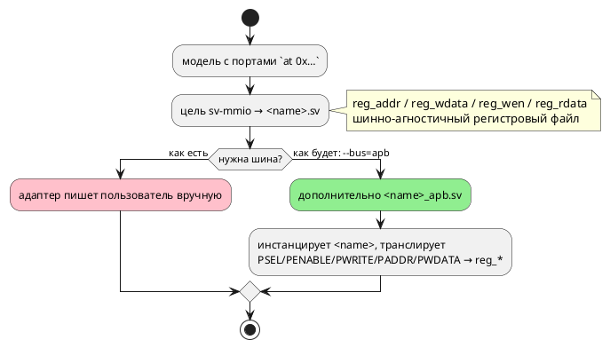

# Фича: Адаптеры шин для цели `sv-mmio` (APB / AXI-Lite / Wishbone)

- **Номер:** 0169
- **Статус:** ГОТОВО
- **Зависит от:** нет
- **Tier:** 3
- **Связанные issue (анализ):** кандидат блока 2 `FEATURES.md` (вынесено проработкой [цель `sv-mmio`: адреса портов → регистровый файл на шине](0062-sv-mmio-target.md), A-2 ADR)

## Стадии жизненного цикла

Все стадии — **разделы этой карточки**: «Архитектура (ADR)»,
«Анализ», «Разработка», «Тест-план», «Отчёт о тестировании», «Итог».
Отдельным артефактом остаются только исправления —
[`docs/fixes/`](../fixes/README.md) (при необходимости `0169-YY-*`).

## Краткое описание

Ядро 0062 порождает **шинно-агностичный** регистровый файл — именно затем, чтобы
не выбирать протокол без требования. Адаптеры конкретных шин — фича-зонт: по
одной подзадаче на протокол, каждая **по требованию заказчика**.

> Фича зарегистрирована из бэклога кандидатов (отобрана заказчиком 2026-07-28); далее проходит жизненный цикл по своду.

## Что известно на входе

- Возражение [генератор генерации в SystemVerilog](0045-sv-backend.md), из-за которого протокол не выбран в
  ядре: «выбор произволен, а цена ошибки высока».
- Протокол диктует платформа: **AXI-Lite** — экосистема AMD/Xilinx, **APB** —
  ARM, **Wishbone** — открытые ядра.
- Адаптер тонкий (десятки строк) и платформенный — ему и место снаружи ядра.

## Направление решения (наметка, не решение)

- Одна подзадача `0169-YY` на протокол; брать **только** тот, который назовёт
  заказчик, — остальные не делать «на всякий случай».
- Проверка: каждый адаптер обязан пройти **оба** инструмента SV (verilator +
  yosys) — они ловят непересекающиеся классы (проверено 4 раза при 0045).

Окончательный выбор — за стадиями **архитектуры** (ADR) и **анализа**: раздел
выше фиксирует то, что уже проверено, а не предрешает реализацию.

## Документирование

**Требуется** (при взятии протокола в работу). Появляется наблюдаемый интерфейс
цели — затронут раздел [`book/src/14-targets/`](../../book/src/14-targets/index.typ)
(цели генерации).

**Сделано:** в раздел добавлен подраздел «Подключение к шине» — флаг `--bus`,
порождаемый файл `<модель>_apb.sv`, адресация напрямую и отказ на модели без
адресных портов.

## Архитектура (ADR)

- **Status:** Accepted (Option C)
- **Date:** 2026-08-16
- **Authors:** Архитектор
- **Related issues:** [Фича](0169-sv-mmio-bus-adapters.md); ядро — [ADR](0062-sv-mmio-target.md#архитектура-adr) (шинно-агностичный регистровый файл, action A-2 которого и завёл эту фичу); [ADR](0045-sv-backend.md#архитектура-adr) (два инструмента SV ловят непересекающиеся классы; тестбенч — принадлежность проверки, а не продукта)

### Context

Ядро цели `sv-mmio` порождает **шинно-агностичный** регистровый файл — именно
затем, чтобы не выбирать протокол без требования (ADR: «выбор произволен, а
цена ошибки высока»). Интерфейс ядра:

```systemverilog
input  logic [10:0] reg_addr,   // адрес
input  logic [7:0]  reg_wdata,  // данные записи
input  logic        reg_wen,    // строб записи
output logic [7:0]  reg_rdata   // данные чтения (комбинационные)
```

Протокол диктует платформа. **Решение заказчика 2026-08-16: первый адаптер —
APB** (экосистема ARM/AMBA), адресация — **напрямую** (адрес шины равен адресу
из `at`). Прочие протоколы (AXI-Lite, Wishbone) остаются подзадачами зонта и
берутся только по отдельному требованию.

#### Замер 1: устройство ядра (чтение кода + вывод корпуса)

- Ширины считаются по модели: `addr_width` — по максимальному адресу,
  `data_width` — по максимуму `bit + width` портов. У `stacker` это 11 и 8.
- **Запись регистров не проверяется `en`**: она стоит в `else if (reg_wen)`
  отдельной ветвью `always_ff`. Значит адаптеру про clock enable знать нечего —
  шина работает независимо от того, тикает ли автомат.
- Чтение (`reg_rdata`) — чисто комбинационное по `reg_addr`.

#### Замер 2: канонические 32-битные шины валят проверка (проба 2026-08-16)

Обёртка с `input logic [31:0] paddr` и `[31:0] pwdata` при `data_width = 8`:

```
%Warning-UNUSEDSIGNAL: Bits of signal are not used: 'paddr'[31:11]
%Warning-UNUSEDSIGNAL: Bits of signal are not used: 'pwdata'[31:8]
%Error: Exiting due to 2 warning(s)
```

Проверка проекта гоняет `verilator --lint-only -Wall`, то есть **отвергает** такую
обёртку. Та же проба с точными ширинами (`paddr[10:0]`, `pwdata[7:0]`,
`prdata[7:0]`) принята **обоими** инструментами: verilator без замечаний, yosys
синтезировал.

Сужение не противоречит AMBA: спецификация APB объявляет ширину `PADDR`
implementation-specific, а `PWDATA`/`PRDATA` допускает 8, 16 и 32 бита.
Порождаемый адаптер знает конкретную модель, поэтому вправе быть точным.

#### Замер 3: функциональная проба (verilator `--binary`)

Рукописный тестбенч с классическим циклом APB (setup: `psel & !penable`;
access: `psel & penable`) на `stacker_apb`:

| Действие | Результат |
|---|---|
| запись `0x300 ← 0x01`, чтение `0x300` | `0x01` — записанное вернулось |
| запись `0x102 ← 0x07`, чтение `0x102` | `0x07` |
| чтение выходного `0x600` (регистр автомата) | `0x00`, `pready=1`, `pslverr=0` |

То есть форма адаптера работает, а не только компилируется — ровно то
разграничение, которое ADR требует держать (линт и синтез верности не
доказывают).

#### Замер 4: где живут тестбенчи

`examples/generated/sv/tb/<name>_tb.sv` — **рукописные** (решение:
тестбенч принадлежит проверке, а не продукту), прогоняются проверкой через
`verilator --binary --timing`, провал `assert`/`$fatal` валит предкоммит.

#### Поток «как есть» и «как будет»



### Decision Drivers

1. **Ядро не должно меняться.** На нём стоят потактовые сверки регистров
   (`conformance_sv_mmio_tests`) и проверка двух инструментов; адаптер обязан быть
   надстройкой, а не переделкой интерфейса.
2. **Протокол берётся по требованию.** Карточка фичи запрещает делать
   «на всякий случай»; выбран APB (решение заказчика).
3. **Проверка проекта — часть контракта** (замер 2): всё, что не проходит
   `-Wall`, для этого проекта невалидно, каким бы каноническим оно ни было.
4. **Верность доказывается прогоном, а не линтом** (ADR, замер 3).
5. **Карта регистров совпадает с исходником** (решение заказчика): адрес,
   написанный в `at 0x300`, софт видит по `0x300`.

### Considered Options

#### Option A. Оставить как есть — адаптер пишет пользователь

**Pros:**
- Ноль правок; ядро уже даёт всё необходимое.

**Cons:**
- Требование заказчика не выполнено; каждый пользователь пишет одно и то же
  заново, и ошибка в цикле APB обнаруживается на плате.

#### Option B. Заменить интерфейс ядра шинным (флаг меняет порты `<name>.sv`)

**Pros:**
- Один файл на выходе, без обёртки.

**Cons:**
- **Ядро перестаёт быть агностичным**: `reg_*` исчезает, и на нём стоят сверки
  регистров — их пришлось бы переписывать под каждый протокол.
- Второй протокол потребовал бы третьей формы того же модуля.

#### Option C. Отдельный файл-обёртка `<name>_apb.sv`, включаемый флагом

`sv-mmio` порождает ядро как прежде; при `--bus=apb` рядом появляется обёртка,
инстанцирующая ядро и транслирующая APB в `reg_*`.

**Pros:**
- Ядро и его проверки не тронуты; обёртка проверяется отдельно (линт, синтез,
  собственный тестбенч).
- Следующий протокол — ещё один файл, а не ещё одна форма ядра.
- Обёртка тонкая (десятки строк) и целиком выводится из уже посчитанных ширин.

**Cons:**
- Два файла вместо одного; в проект нужно добавить оба.
- Появляется флаг CLI — то есть комбинация, которую обязан покрывать проверка.

#### Option D. Поставлять адаптер как готовый файл-шаблон в репозитории

**Pros:**
- Не трогает компилятор вовсе.

**Cons:**
- Ширины (`addr_width`, `data_width`) зависят от модели — шаблон пришлось бы
  параметризовать и требовать от пользователя правильных значений; ошибка тихая.

### Decision

Принимается **Option C**.

- **Флаг** `--bus=apb` у цели `sv-mmio`. Умолчание — **без адаптера**
  (поведение прежнее, байт-в-байт). Слитная форма со значением, как у
  `--parameters=` (флаг без значения — ошибка, а не умолчание).
- **Файл** `<name>_apb.sv`, модуль `<name>_apb`, инстанцирует `<name>`.
- **Сигналы** (APB3, slave): `pclk`, `presetn`, `paddr`, `psel`, `penable`,
  `pwrite`, `pwdata`, `prdata`, `pready`, `pslverr`; наружу проброшены `en` и
  `is_done` ядра.
- **Ширины точные** (замер 2): `paddr` — `addr_width` ядра, `pwdata`/`prdata` —
  `data_width`. Канон APB это допускает, а проверка иного не принимает.
- **Адресация напрямую** (решение заказчика): `reg_addr = paddr`. Декодирование
  старших разрядов — обязанность внешнего декодера, который и формирует `psel`;
  адаптер их не видит.
- **`pready = 1`, `pslverr = 0`**: состояний ожидания нет, регистровый файл
  отвечает за такт. Это и делает `reg_wen = psel & penable & pwrite`
  корректным: access-фаза длится ровно один такт, значит запись происходит
  **однажды**. Появятся wait states — правило придётся менять вместе с ними.
- **Модель без адресованных портов** + `--bus=apb` → **отказ `SV-019`**:
  шина без регистров бессмысленна, а молчание оставило бы пользователя с
  ожиданием файла, которого нет.

**Вне объёма (границы названы, а не забыты):** AXI-Lite и Wishbone — отдельные
подзадачи зонта, берутся по требованию. `PSTRB`/`PPROT` (APB4) не эмитируются:
данные однословные, а защита к регистровому файлу отношения не имеет.

### Consequences

#### Положительные

- Модель с портами `at 0x…` подключается к ARM-подсистеме без ручного кода.
- Ядро осталось агностичным: второй протокол не потребует его трогать.
- Адаптер проверяется тем же трёхслойным проверкой, что и ядро: линт, синтез и
  **прогон** тестбенча.

#### Отрицательные / Action items

- **Новый флаг** → новая комбинация в проверке: корпус обязан собираться и с
  `--bus=apb`, и без него.
- **Вывод корпуса без флага не меняется** — проверяемый критерий (умолчание).
- **Документ**: появляется наблюдаемый интерфейс цели — раздел
  `book/src/14-targets/` дополняется описанием флага и порождаемого файла.
- Тестбенч `tb/stacker_apb_tb.sv` пишется руками  и включается
  в проверка.

#### Acceptance criteria

1. `taktc compile -t sv-mmio --bus=apb` порождает `<name>_apb.sv` рядом с
   `<name>.sv`; без флага — только `<name>.sv` (вывод байт-в-байт прежний).
2. Обёртка принимается **обоими** инструментами: `verilator --lint-only -Wall` и
   `yosys synth`.
3. Рукописный тестбенч через APB пишет регистр и читает записанное; выходной
   регистр автомата читается. Провал → ненулевой код выхода.
4. `--bus` без значения и с неизвестным значением — ошибка CLI с внятным
   текстом.
5. Модель без адресованных портов + `--bus=apb` → `SV-019`.
6. Ядро не изменилось: `conformance_sv_mmio_tests` зелены без правок.
7. Раздел `book/src/14-targets/` описывает флаг и порождаемый файл.
8. `./scripts/precheck.sh` зелёный.

## Анализ

### Цель и контекст

ADR принял **Option C**: адаптер — отдельный файл-обёртка `<name>_apb.sv`,
включаемый флагом `--bus=apb`; ядро не меняется. Протокол и адресация выбраны
**заказчиком** (2026-08-16): APB, адрес шины равен адресу из `at`.

Анализ отвечает на то, что ADR оставил реализации: **откуда берутся ширины**,
**где строится адаптер**, **как проверка судит обёртку** и **что должно остаться
неизменным**.

### Зависимости фичи

- **Зависит от:** `нет`. Ядро (`sv-mmio`, фича
  [цель `sv-mmio`: адреса портов → регистровый файл на шине](0062-sv-mmio-target.md)) закрыто и даёт готовый регистровый
  интерфейс; проверка двух инструментов и механика рукописных тестбенчей заведены
  фичей [генератор генерации в SystemVerilog](0045-sv-backend.md).
- **Влияние на порядок разработки:** фича — **зонт**. Закрывается подзадача APB;
  AXI-Lite и Wishbone остаются и берутся по отдельному требованию заказчика.
  Поэтому закрытие зонта **не означает**, что прочие протоколы отменены: их
  статус — «не требовались», а не «сделаны».

### Замеры (пробы и чтение кода 2026-08-16)

#### З1. Интерфейс ядра и его тонкость

`reg_addr[aw-1:0]`, `reg_wdata[dw-1:0]`, `reg_wen`, `reg_rdata[dw-1:0]`, где
`aw` — по максимальному адресу модели, `dw` — по максимуму `bit + width` портов
(у `stacker` это 11 и 8).

**Запись регистров не проверяется `en`**: она стоит отдельной ветвью
`else if (reg_wen)` в `always_ff`. Значит адаптеру про clock enable знать
нечего — шина работает независимо от того, тикает ли автомат. Это и позволило
пробросить `en` наружу без оговорок.

#### З2. Канонические 32-битные шины валят проверка проекта

Обёртка с `paddr[31:0]`/`pwdata[31:0]` при `dw = 8`:

```
%Warning-UNUSEDSIGNAL: Bits of signal are not used: 'paddr'[31:11]
%Error: Exiting due to 2 warning(s)
```

Точные ширины (`[10:0]`, `[7:0]`) приняты **обоими** инструментами. Канон APB
это допускает: ширина `PADDR` implementation-specific, `PWDATA`/`PRDATA` — 8/16/32.

#### З3. Обёртка не линтуется в одиночку

`verilator --lint-only stacker_apb.sv` → `MODMISSING: Cannot find file
containing module: 'stacker'`; `yosys` → `Module '\stacker' … is not part of the
design`. Это **свойство обёртки**, а не дефект: проверка обязан подавать ядро вместе
с ней.

#### З4. Функциональная проба прошла

Рукописный тестбенч с настоящими циклами APB: запись `0x300 ← 0x01` и чтение
обратно, то же для `0x102 ← 0x07`, чтение выходного `0x600`, запись по адресу
без порта (`0x7ff`) не портит соседей. Все проверки зелены.

**Находка на ровном месте:** строка комментария, начинающаяся со слова
«verilator», принимается инструментом за **свою прагму** — файл отвергается с
`BADVLTPRAGMA`. Тестбенч переписан, предупреждение оставлено в его шапке.

#### З5. Вывод `sv-mmio` отслеживается git

В отличие от корпуса цели `c` (там четыре файла в `.gitignore`), `sv-mmio`
хранит `stacker.sv` в репозитории — значит и `stacker_apb.sv` становится
снапшотом, а не эфемерным выводом проверки.

### Требования и проверяемые условия

- **R1. Флаг добавляет файл, а не меняет ядро.** `--bus=apb` → `<name>_apb.sv`
  рядом с `<name>.sv`; без флага вывод прежний **байт-в-байт**.
- **R2. Форма адаптера.** Сигналы APB3 slave; `pready = 1`, `pslverr = 0`;
  строб `reg_wen = psel & penable & pwrite`.
- **R3. Адресация напрямую** (решение заказчика): `reg_addr = paddr`.
- **R4. Ширины точные** — по `addr_width`/`data_width` ядра; `[31:0]` в выводе
  не появляется.
- **R5. Отказы названы.** `SV-019` с **двумя разными текстами**: модель без
  адресов и цель `sv` (регистрового файла нет по устройству). `--bus` без
  значения и с неизвестным значением — ошибка CLI.
- **R6. Один источник ширин.** Адаптер строится там же, где собран `Mmio`;
  второй сборки нет.
- **R7. Проверка проверяет обёртку** — линтом и синтезом **вместе с ядром**, плюс
  рукописным тестбенчем с настоящими циклами APB.
- **R8. Ядро не изменилось**: сверки `conformance_sv_mmio_tests` зелены без
  правок.

### Критерии приёмки и способ проверки

| # | Критерий | Способ проверки |
|---|---|---|
| A1 | Файл появляется по флагу и только по нему | тесты на наличие/отсутствие файла |
| A2 | Форма адаптера (сигналы, константы, строб) | тест на текст вывода |
| A3 | Адресация напрямую | тест на `assign reg_addr = paddr;` |
| A4 | Ширины точные, `[31:0]` нет | тест на текст вывода |
| A5 | Две причины `SV-019`; ошибки CLI | тесты на код и текст диагностики |
| A6 | Линт + синтез обёртки вместе с ядром | проверка `precheck.sh` |
| A7 | Тестбенч ведёт циклы APB и сверяет значения | проверка `precheck.sh` |
| A8 | Ядро не изменилось | `conformance_sv_mmio_tests` без правок |
| A9 | Документ описывает флаг и файл | чтение `book/src/14-targets/` |
| A10 | `./scripts/precheck.sh` зелёный | прогон |

### Редакторский слой

Фича **не меняет** язык: ни лексики, ни синтаксиса, ни семантики — добавляется
флаг CLI и порождаемый файл. Ключевые слова, токены, узлы АСД, формы объявления
не затронуты; правки LSP и плагинов **не требуются**.

Новая диагностика `SV-019` принадлежит цели и приходит из генератора — она
доезжает до пользователя тем же каналом, что и прочие отказы целей
([предупреждения генераторов возвращаются вызывающему, а не печатаются из библиотеки](0168-generator-warnings-return.md)).

### Особенности по обратной функциональности

**Изменение строго аддитивно.** Без флага поведение и вывод прежние
байт-в-байт; с флагом появляется **дополнительный** файл. Публичный API
пополняется полем `GenerateOptions::bus` (структура `#[non_exhaustive]`,
конструирование через `new`/`Default` — свод соблюдено).

Версия **языка** не меняется: язык фича не трогает.

### Риски и зависимости

- **Риск: обёртка компилируется, но не работает.** Главный риск фичи: перепутать
  фазы APB — и оба инструмента промолчат. Снят требованием R7:
  тестбенч ведёт настоящие трансферы и сверяет значения.
- **Риск: запись повторяется.** `reg_wen` держится всю access-фазу; при
  `pready = 1` она длится один такт. Появятся состояния ожидания — правило
  придётся менять вместе с ними (записано в док-строке модуля).
- **Риск: ширины разъедутся с ядром.** Снят R6: `Mmio` собирается один раз, и
  адаптер получает уже посчитанные ширины.
- **Риск: проверка молча перестанет порождать адаптер.** Снят явной проверкой
  «`<name>_apb.sv` обязан существовать» в предкоммите.

## Разработка

### Задача

#### Что было

Ядро `sv-mmio` даёт шинно-агностичный регистровый файл
(`reg_addr`/`reg_wdata`/`reg_wen`/`reg_rdata`) — протокол не выбран намеренно.
Подключение к реальной шине оставалось ручной работой пользователя, и ошибка в
цикле APB обнаруживалась бы на плате.

Протокол и адресацию назвал **заказчик** (2026-08-16): APB, адрес шины равен
адресу из `at`.

#### Что сделано

**Опция генерации:** `GenerateOptions::bus: Option<Bus>` и перечисление `Bus`
(пока один вариант `Apb`) — `generator/mod.rs`. Умолчание `None`: без флага
вывод прежний байт-в-байт.

**Флаг CLI:** `--bus=apb` — только слитная форма со значением, как у
`--parameters=`. Флаг без значения и неизвестный протокол — ошибки **с
перечислением** допустимых, а не молчаливое умолчание. Справка `taktc compile
--help` дополнена.

**Генерация:** новый модуль `generator/sv/sv_apb.rs`. Обёртка `<name>_apb`
инстанцирует ядро и транслирует APB3:

```systemverilog
assign reg_addr  = paddr;
assign reg_wdata = pwdata;
assign reg_wen   = psel & penable & pwrite;
assign prdata    = reg_rdata;
assign pready    = 1'b1;
assign pslverr   = 1'b0;
```

**Ширины точные, а не канонические 32-битные** — это замер, а не вкус:
`paddr[31:0]` при 11-битном адресе даёт `UNUSEDSIGNAL`, и проверка проекта
(`verilator -Wall`) такой модуль отвергает. Спецификация APB ширину `PADDR`
оставляет реализации.

**`pready = 1` — часть контракта строба:** access-фаза длится один такт,
поэтому `reg_wen` поднимается однажды. Появятся состояния ожидания — правило
придётся менять вместе с ними (записано в док-строке модуля).

**Один источник ширин:** адаптер строится там же, где уже собран `Mmio` —
внутри `generate_program`, которая теперь возвращает и текст обёртки. Вторая
сборка `Mmio` дала бы второй источник ширин.

**Отказ `SV-019`, два текста:** модель без адресованных портов — «транслировать
в шину нечего»; цель `sv` — «регистрового файла не строит по устройству».
Один код, два повода, повод назван словами (образец `CC-023`):
сообщение «нет портов с адресом» на цели `sv` было бы ложью — у `stacker` их
семнадцать.

**Проверка предкоммита:** корпус `sv-mmio` собирается с `--bus=apb`; обёртка
линтуется и синтезируется **вместе с ядром** (в одиночку она даёт `MODMISSING` —
свойство обёртки, а не дефект); добавлен прогон рукописного тестбенча
`tb/stacker_apb_tb.sv`. Отдельная проверка: `<name>_apb.sv` **обязан**
существовать — иначе молчаливая пропажа флага прошла бы незамеченной.

Функциональности вне Rust-крейтов: тестбенч (SystemVerilog, рукописный) и
правки `scripts/precheck.sh`.

#### Проверки

```sh
cargo test --all-features --test sv_apb_adapter_tests   # 7 тестов
./scripts/precheck.sh
```

| Тест | Условие анализа |
|---|---|
| `without_the_flag_no_adapter_is_emitted` | R1 (без флага — прежний вывод) |
| `the_flag_emits_the_adapter_next_to_the_core` | R1 |
| `apb_signals_and_contract_constants` | R2 |
| `address_maps_straight_through` | R3 |
| `widths_are_exact_not_canonical_32` | R4 |
| `bus_without_registers_is_refused` | R5 (первая причина) |
| `bus_on_plain_sv_is_refused_with_its_own_reason` | R5 (вторая причина) |

**Работу** адаптера доказывает не линт, а тестбенч: запись `0x300 ← 0x01` и
чтение обратно, то же для восьмибитного `0x102`, чтение выходного `0x600`,
запись по адресу без порта не портит соседей.

**Находка на ровном месте:** строка комментария, начинающаяся со слова
«verilator», принимается инструментом за **свою прагму** — файл отвергается
(`BADVLTPRAGMA`). Тестбенч переписан, предупреждение оставлено в его шапке.

## Тест-план

### Область и цель

Фича добавляет **порождаемый RTL**, а не конструкцию языка: (примеры
и контрпримеры языка) неприменимо. Зато в полной мере применим урок ADR:
**линт и синтез принимают модуль, который не работает**. Поэтому план разделён
на два слоя — форма вывода (тесты Rust) и **поведение** (тестбенч с настоящими
циклами APB).

Проверяются R1–R8 анализа и критерии A1–A10.

### Проверки (условие → ожидаемый результат)

| # | Проверка | Предусловие | Ожидаемый результат | Ссылка на R/A |
|---|---|---|---|---|
| T1 | Без флага адаптера нет | `sv-mmio` без `--bus` | `<name>.sv` есть, `<name>_apb.sv` нет | R1 / A1 |
| T2 | С флагом обёртка появляется | `--bus=apb` | `module <name>_apb`, внутри `<name> u_core` | R1 / A1 |
| T3 | Сигналы APB и константы контракта | тот же вход | `pclk`…`pslverr`; `pready = 1'b1`; `pslverr = 1'b0`; `reg_wen = psel & penable & pwrite` | R2 / A2 |
| T4 | Адресация напрямую | тот же вход | `assign reg_addr  = paddr;` | R3 / A3 |
| T5 | Ширины точные | адреса до `0x600`, порты до 8 бит | `paddr[10:0]`, `pwdata[7:0]`; `[31:0]` отсутствует | R4 / A4 |
| T6 | Модель без адресов + `--bus` | `sv-mmio`, портов с `at` нет | `SV-019`, текст «нет ни одного порта с адресом» | R5 / A5 |
| T7 | Цель `sv` + `--bus` | адреса есть, но цель `sv` | `SV-019`, текст «цель 'sv' регистрового файла не строит» | R5 / A5 |
| T8 | Ошибки CLI | `--bus` без значения; `--bus=axi` | ошибка с перечислением допустимых | R5 / A5 |
| T9 | Линт и синтез обёртки | проверка `precheck.sh` | verilator и yosys принимают (обёртка подаётся **вместе с ядром**) | R7 / A6 |
| T10 | **Поведение**: циклы APB | тестбенч `tb/stacker_apb_tb.sv` | запись→чтение возвращает записанное; выходной регистр читается; запись по чужому адресу не портит соседей | R7 / A7 |
| T11 | Ядро не изменилось | `conformance_sv_mmio_tests` | зелены **без правок теста** | R8 / A8 |
| T12 | Документ | `book/src/14-targets/` | описаны флаг, порождаемый файл, адресация и отказ | — / A9 |
| T13 | Предкоммит | `./scripts/precheck.sh` | зелёный | — / A10 |

### Что считается провалом, даже если тесты зелены

- **Обёртка компилируется, но не работает.** Главная опасность: перепутанные
  фазы APB — оба инструмента промолчат. Ловится только T10.
- **Двойная запись.** Если `pready` перестанет быть константой, `reg_wen`
  продержится дольше такта и регистр защёлкнется дважды; T3 контролирует константу,
  T10 — наблюдаемое значение.
- **Ширины разъехались с ядром.** Обёртка ссылалась бы на несуществующие биты;
  T5 контролирует форму, T9 — согласованность (линт с ядром).
- **Правка сверок «под зелёный».** Если для прохождения
  `conformance_sv_mmio_tests` понадобилось изменить тест — ядро изменилось, и
  фича вышла за свои границы.

### Разбивка проверок по функциональности

| Функциональность | T1–T8 | T9–T10 | T11 | Статус |
|---|---|---|---|---|
| Цель `sv-mmio` (адаптер) | ✅ | ✅ | — | пройдено |
| Ядро `sv-mmio` | — | ✅ | ✅ | не изменено |
| Цель `sv` | ✅ | — | — | отказ назван (T7) |
| CLI `taktc compile` | ✅ | — | — | пройдено |
| Языковой сервер и плагины | — | — | — | не задеты (язык не менялся) |

<!-- Легенда: ✅ пройдено · ❌ провалено · ⬜ не проверялось · — не применимо -->

### Тестовые данные и окружение

- Контроль формы: `takt-lang/tests/targets/sv_apb_adapter_tests.rs` (7 тестов).
- Контроль поведения: `examples/generated/sv-mmio/tb/stacker_apb_tb.sv`
  (рукописный), прогоняется проверкой `precheck.sh`.
- Команды:

```sh
cargo test --all-features --test sv_apb_adapter_tests
./scripts/precheck.sh
```

- Внешние инструменты: `verilator` (линт + `--binary` для тестбенча), `yosys`
  (синтез). Оба обязательны — они ловят непересекающиеся классы.
- Окружение: толчейн `1.97.1`, macOS (Darwin 25.5.0).

## Отчёт о тестировании

### Резюме

**Пройдено, подзадача APB готова к закрытию (`ГОТОВО`).** Тринадцать проверок
тест-плана дали ожидаемый результат; критерии A1–A10 выполнены.

Прогон: `cargo test --all-features --test sv_apb_adapter_tests` — **7 из 7**;
проверка `precheck.sh` — verilator и yosys приняли обёртку, **тестбенч APB прошёл**,
код возврата 0.

**Фича — зонт, и закрывается не целиком.** Сделан протокол, названный
заказчиком (APB). AXI-Lite и Wishbone остаются подзадачами: их статус — «не
требовались», а не «сделаны».

### Фактические результаты по проверкам

| # | Проверка | Результат | Комментарий |
|---|---|---|---|
| T1 | Без флага адаптера нет | ✅ | вывод прежний байт-в-байт |
| T2 | С флагом обёртка появляется | ✅ | `module stacker_apb`, внутри `stacker u_core` |
| T3 | Сигналы и константы контракта | ✅ | `pready = 1'b1`, `pslverr = 1'b0`, строб из фаз |
| T4 | Адресация напрямую | ✅ | `assign reg_addr  = paddr;` |
| T5 | Ширины точные | ✅ | `paddr[10:0]`, `pwdata[7:0]`; `[31:0]` нет |
| T6 | Модель без адресов + `--bus` | ✅ | `SV-019`, «нет ни одного порта с адресом» |
| T7 | Цель `sv` + `--bus` | ✅ | `SV-019`, «цель 'sv' регистрового файла не строит» |
| T8 | Ошибки CLI | ✅ | `--bus` без значения и `--bus=axi` — с перечислением допустимых |
| T9 | Линт и синтез обёртки | ✅ | `stacker_apb → verilator принял`, `→ yosys синтезировал` |
| T10 | **Поведение**: циклы APB | ✅ | тестбенч прошёл: запись→чтение, выходной регистр, чужой адрес |
| T11 | Ядро не изменилось | ✅ | сверки зелены без правок |
| T12 | Документ | ✅ | подраздел «Подключение к шине» в разделе о целях |
| T13 | Предкоммит | ✅ | зелёный |

### Находки

#### Находка 1: канонический APB не проходит проверка проекта

Обёртка с `paddr[31:0]`/`pwdata[31:0]` — то, как APB-slave пишут по умолчанию, —
даёт `UNUSEDSIGNAL` и отвергается `verilator -Wall`. Точные ширины приняты обоими
инструментами. Спецификация APB это допускает (ширина `PADDR`
implementation-specific), так что противоречия с каноном нет — но узнать об этом
пришлось пробой, а не чтением стандарта.

#### Находка 2: обёртка не линтуется в одиночку

`verilator --lint-only stacker_apb.sv` → `MODMISSING`; `yosys` → «module is not
part of the design». Проверка пришлось научить подавать ядро вместе с обёрткой. Это
свойство любой обёртки, и следующий протокол унаследует его же.

#### Находка 3: комментарий стал прагмой

Строка тестбенча, начинавшаяся со слова «verilator», принята инструментом за
**свою прагму**: файл отвергнут с `BADVLTPRAGMA`. Формулировка изменена,
предупреждение оставлено в шапке тестбенча — на этом же месте споткнётся
следующий автор.

#### Находка 4: `clippy` потребовал имя для типа

Возврат `generate_program` стал тройкой с вложенным кортежем, и
`clippy::type_complexity` был прав: заведён именованный `ProgramOutput`.

### Результаты по функциональности

| Функциональность | Статус | Основание |
|---|---|---|
| Цель `sv-mmio` (адаптер) | ✅ | T1–T10 |
| Ядро `sv-mmio` | — | не изменено (T11) |
| Цель `sv` | ✅ | отказ назван своим текстом (T7) |
| CLI `taktc compile` | ✅ | T8, справка дополнена |
| Языковой сервер и плагины | — | язык не менялся |

### Дефекты

**Дефектов кода не найдено.** Три остановки в ходе работы — сработавшие контроля
(проверка `-Wall`, `clippy`, разбор прагм verilator) и одна особенность инструмента;
все устранены в рамках задачи. Исправления (`docs/fixes/`) не требуются.

### Выводы и дальнейшие шаги

- Модель с портами `at 0x…` подключается к ARM-подсистеме без ручного RTL.
- Ядро осталось шинно-агностичным: следующий протокол — ещё один файл, а не
  правка ядра.
- **Оставшиеся подзадачи зонта** (AXI-Lite, Wishbone) берутся по требованию
  заказчика; карточка фичи это фиксирует.
- Исправления (`docs/fixes/0169-YY-*`) не требуются.

## Итог (что сделано)

**Модель с портами `at 0x…` подключается к ARM-подсистеме без ручного RTL.**
Ядро `sv-mmio`  намеренно оставлено шинно-агностичным; здесь появился
первый адаптер — **APB**, названный заказчиком 2026-08-16 вместе с адресацией
(адрес шины равен адресу из `at`).

Форма решения ([ADR](0169-sv-mmio-bus-adapters.md#архитектура-adr), Option C): флаг
`--bus=apb` добавляет **отдельный файл-обёртку** `<name>_apb.sv`,
инстанцирующий ядро. Ядро не меняется — на нём стоят потактовые сверки
регистров, и следующий протокол не потребует его трогать.

**Канонический APB проверка проекта не проходит** — это замер, а не мнение:
`paddr[31:0]`/`pwdata[31:0]` при 11-битном адресе дают `UNUSEDSIGNAL`, и
`verilator -Wall` отвергает модуль. Ширины сделаны точными; спецификация APB это
допускает (ширина `PADDR` implementation-specific).

**`pready = 1` — часть контракта строба, а не мелочь:** access-фаза длится
один такт, поэтому `reg_wen = psel & penable & pwrite` защёлкивает регистр
однажды. Появятся состояния ожидания — правило придётся менять вместе с ними.

Три слоя проверки: тесты формы
([`sv_apb_adapter_tests.rs`](../../takt-lang/tests/targets/sv_apb_adapter_tests.rs), 7
штук), линт и синтез обёртки **вместе с ядром**, и — главное — рукописный
тестбенч с настоящими циклами APB
([`tb/stacker_apb_tb.sv`](../../examples/generated/sv-mmio/tb/stacker_apb_tb.sv)):
линт и синтез принимают обёртку, которая не работает. Детали —
[отчёт](0169-sv-mmio-bus-adapters.md#отчёт-о-тестировании), задача
[адаптеры шин для цели `sv-mmio` (APB / AXI-Lite / Wishbone)](0169-sv-mmio-bus-adapters.md#разработка).

**Почему зонт закрыт.** Карточка требовала брать **только** протокол, названный
заказчиком, и не делать прочие «на всякий случай». Требование выполнено
полностью, поэтому фича закрывается: **AXI-Lite и Wishbone заводятся новыми
фичами**, когда появится требование, — их статус «не требовались», а не
«сделаны». Кандидат об этом стоит в `FEATURES.md`.

**Границы (названы, а не забыты):** `PSTRB`/`PPROT` (APB4) не эмитируются —
данные однословные, а защита к регистровому файлу отношения не имеет; состояний
ожидания нет по решению ADR.
