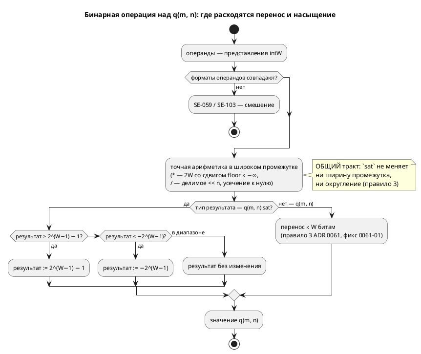

# Фича: Насыщение (saturation) для fixed-point `q(m, n)`

- **Номер:** 0170
- **Статус:** ГОТОВО
- **Зависит от:** нет
- **Tier:** 2
- **Связанные issue (анализ):** кандидат блока 2 `FEATURES.md` (вынесено проработкой [fixed-point Q(m.n) как тип языка](0061-fixed-point-type.md), правило 3 ADR)

## Стадии жизненного цикла (правило 17)

Все стадии — **разделы этой карточки** (правило 32): «Архитектура (ADR)»,
«Анализ», «Разработка», «Тест-план», «Отчёт о тестировании», «Итог».
Отдельным артефактом остаются только исправления —
[`docs/fixes/`](../fixes/README.md) (при необходимости `0170-YY-*`).

## Краткое описание

Ядро 0061 фиксирует **wraparound** при `+`/`−` — как у целых типов языка. Но для
регуляторов (типовой потребитель fixed-point) нужнее **насыщение**: перенос
превращает «чуть перелетели уставку» в «прыгнули на другой край диапазона».

> Фича зарегистрирована из бэклога кандидатов (отобрана заказчиком 2026-07-28); далее проходит жизненный цикл по правилу 17.

## Что известно на входе

- Правило 3 ADR фиксирует wraparound **явно** — именно затем, чтобы автор
  не принял умолчание за обещание.
- Арифметика `q` побитово едина у симулятора и всех целей; эталон —
  `takt-sim/src/eval/fixed.rs`, Q-логика вынесена в `{c_expr,rust,st,sv}_fixed`.
- Потребитель в корпусе: `examples/regulator.takt`, `examples/pid_regulator.takt`
  (у последнего есть anti-windup — то есть насыщение уже пишется руками).

## Направление решения (наметка, не решение)

- Насыщение как **явная** возможность, не как смена умолчания: иначе молча
  поменяется поведение уже написанных программ.
- Правка сквозная по **пяти** реализациям (эталон + четыре цели), и она
  обязана быть побитово единой — иначе цели разойдутся молча (класс уроков).
- Смежно с [единая семантика переполнения целых во всех целях](0127-int-overflow-semantics.md): у целых семантика
  переполнения уже нормирована — насыщение должно встать рядом, а не вразрез.

Окончательный выбор — за стадиями **архитектуры** (ADR) и **анализа**: раздел
выше фиксирует то, что уже проверено, а не предрешает реализацию.

## Документирование (правило 24)

**Требуется.** Меняется семантика арифметики `q(m, n)` — затронут раздел
[`book/src/03-types/`](../../book/src/03-types/index.typ) (типы с фиксированной
точкой) и раздел о выражениях.

## Архитектура (ADR)

- **Status:** Accepted
- **Date:** 2026-08-14
- **Authors:** Архитектор + Заказчик (форма записи и порядок работ — решения-14)
- **Related issues:** [Фича](0170-fixed-point-saturation.md); смежные — [ADR](0061-fixed-point-type.md#архитектура-adr) (тип `q(m, n)`, правило 3 — wraparound), исправление [перенос `q(m, n)` идёт к ширине хранения, а не к `W`](../fixes/0061-01-q-wrap-storage-width.md) (перенос к `W`), [ADR](0127-int-overflow-semantics.md#архитектура-adr) (семантика переполнения целых), [фича](0096-fixed-point-native-float.md) (прозрачный `float` через `--float-as-q`)

### Context

Ядро 0061 зафиксировало правилом 3: `+`/`−` над `q(m, n)` дают **перенос**
(wraparound), как у целых типов языка. Правило записано **явно**, чтобы автор не
принял умолчание за обещание, а насыщение оставлено кандидатом — с прямой
пометкой «для регуляторов оно обычно нужнее переноса» (A-5 ADR).

Регулятор — типовой потребитель fixed-point, и в корпусе он уже есть. Замер по
`examples/pid_regulator.takt`: anti-windup написан **вручную**, четырьмя строками
условий, а комментарий примера прямо фиксирует нехватку:

> «…в q(m, n)-представлении арифметика — перенос, не насыщение; без ограничения
> интеграл `i_acc` переполнил бы q и «перевернулся» (+127 → −128) — регулятор
> стал бы неустойчивым. Поэтому `i_acc` ограничен `[−Imax, Imax]` условиями
> (насыщающего оператора в языке нет — кандидат на будущее)».

**Ручное ограничение не эквивалентно насыщению операции.** Оно ограничивает
**результат уже вычисленного** выражения, а перенос случается **внутри**
операции: `i_acc + err` переполняется до того, как значение дойдёт до `if`.
На узких форматах (типичных для МК и FPGA) это наблюдаемо: `q(4, 4)` с
`i_acc = 7.9` и `err = 1.0` даёт не 7.9, а −7.1. Тот же довод закрывает и
встроенную `clamp(x, lo, hi)`, которая в языке уже есть: `clamp(acc + step, …)`
получает **обёрнутое** значение.

#### Что показала проба

Проба стадии архитектуры (обход всех потребителей `TypeNode::Fixed` и `Value::Fixed`).

| № | Что проверялось | Результат |
|---|---|---|
| P1 | Мест, знающих о `TypeNode::Fixed` | **57** в 20 файлах (5 реализаций арифметики + типы целей + семантика + симулятор) |
| P2 | Имя `sat` в корпусе, книге, фикстурах | **0 вхождений** — форма `q(m, n) sat` не отбирает занятого имени |
| P3 | Прецедент «слово-не-ключевое» | Есть: конструктор `q` — **обычный `identifier`**, имя проверяет семантика (`SE-057`), иначе `q` перестало бы годиться как имя переменной |
| P4 | Ручное насыщение в корпусе | `examples/pid_regulator.takt` (4 строки условий), `examples/pid_law.takt` (anti-windup в законе), `examples/comprehensive.takt` (`fn clamp_temp`) |
| P5 | Смежность с `--float-as-q` (0096) | Флаг понижает **все** `float` в один формат `q(m, n)`; признак насыщения у понижённых значений взять неоткуда |
| P6 | Смежность с 0127 | У целых нормировано: беззнаковое — обёртка, знаковое — **ошибка** (`SIM-003`). У `q` (знакового по построению) — обёртка. Расхождение осознанное: `q` есть представление дроби, а не целое |
| P7 | Постфиксный `identifier?` в правиле `Type` — даёт ли LR(1)-конфликт | **Не даёт.** Сборка с `")" <sat:identifier?>` прошла LALRPOP; единственная ошибка — арность варианта АСД (её сообщил `rustc`, а не генератор парсера). Причина: после типа в языке всегда стоит разделитель (`;`, `:=`, `,`, `)`, `]`), поэтому идентификатор за `)` однозначен |

**P1 — главный расход фичи.** Признак насыщения обязан быть виден **всем пяти**
реализациям арифметики, иначе они разойдутся молча — ровно тот класс, который
только что стоил исправления (там расхождение прожило от 0061 до 0170).

### Decision Drivers

1. **Явность вместо смены умолчания.** Изменить поведение существующего
   `q(m, n)` нельзя: программы, написанные под перенос (включая корпусный
   регулятор с ручным anti-windup), молча поменяли бы смысл.
2. **Единство пяти реализаций — обязательное, а не желаемое.** Урок:
   расхождение целей по переполнению не ловится ни одним проверкой языка, только
   сверкой значений.
3. **Ошибка компилятора вместо ревью.** Признак, который потребитель может
   «не заметить», обязан ломать сборку у того, кто его не разобрал.
4. **Стоимость записи для автора.** Регулятор пишут инженеры асу тп; форма
   должна читаться в объявлении, а не растворяться в каждом выражении.
5. **Совместимость с уже принятыми решениями:** неявное смешение форматов `q`
   запрещено (`SE-059`, правило 6 ADR) — новый признак обязан встать в тот
   же ряд, а не завести второе правило смешения.

### Considered Options

Форму записи заказчик выбрал **до** ADR — **свойство типа `q(m, n) sat`**
(альтернативы: насыщающие операторы `+|`, встроенные `sat_add`). Здесь
рассматривается **носитель признака** внутри компилятора.

#### Option A. Поле в существующем варианте: `TypeNode::Fixed { m, n, sat }`

**Pros:**
- Компилятор **перечисляет** места, требующие решения: структурный паттерн
  `TypeNode::Fixed { m, n }` без `..` перестаёт собираться, и каждый из 57
  потребителей приходится осмотреть (драйвер 3).
- Формат и его семантика переполнения путешествуют **вместе** — как уже
  путешествуют `m`/`n`; невозможно передать формат, «забыв» признак.
- `Value::Fixed` симулятора правится тем же приёмом — эталон и типы остаются
  зеркальными.

**Cons:**
- Правка 57 мест, из них большинство — механические (`{ m, n, .. }`).
- Часть мест **обязана** остаться безразличной к признаку (печать типа хранения,
  ширина в `sv`) — и это придётся показать явно.

#### Option B. Отдельный вариант `TypeNode::FixedSat { m, n }`

**Pros:**
- Нулевая правка существующих веток `Fixed`.

**Cons:**
- Потребитель, не знающий нового варианта, **молча** перестаёт видеть тип:
  `match … { Fixed { .. } => …, _ => отказ }` даст «тип не выводится» вместо
  насыщения. Это ровно молчаливая потеря, которой проект избегает.
- Дублирует все правила формата (границы `m`/`n`, ширина хранения, смешение) на
  два варианта — источник расхождения внутри одного компилятора.

#### Option C. Признак вне типа (флаг переменной, таблица моделей)

**Pros:**
- Тип не меняется вовсе.

**Cons:**
- Арифметика получает операнды **выражениями**, а не переменными: у
  `(a + b) * c` промежуточный результат не привязан ни к какой переменной, и
  признак взять неоткуда. То есть вариант не выражает предмет фичи.

### Decision

Принимается **Option A**: признак — **поле `sat: bool`** в `TypeNode::Fixed`
(и симметрично в `Value::Fixed` симулятора).

Нормативные правила фичи (обязаны совпасть у симулятора и **всех** целей —
побитово, как правила ADR):

1. **Форма.** `q(m, n) sat` — тип с насыщением; `q(m, n)` — прежний, с переносом.
   Умолчание **не меняется**.
2. **Насыщение — свойство типа результата.** Всякая операция, дающая
   представление `q(m, n) sat` — `+`, `−`, `*`, `/`, унарный минус, приведения
   `int → q`, `float → q`, `q → q` — вместо переноса **прижимает** значение к
   границам представления: `[−2^(W−1), 2^(W−1) − 1]`, `W = m + n`.
3. **Промежуток вычисляется точно, насыщается только результат.** У `*` это
   по-прежнему произведение шириной `2W` со сдвигом `floor` к −∞ (правило 4 ADR), и лишь итог прижимается к границам. Иначе `sat` менял бы ещё и
   округление.
4. **Смешение `sat` и не-`sat` — ошибка `SE-103`**, как и смешение разных
   `q(m, n)` (`SE-059`, правило 6 ADR). Приведение между ними — **явное**:
   `x as q(8, 8) sat`.
5. **Деление на ноль остаётся ошибкой**, а не насыщением к границе: это не
   переполнение, а неопределённая операция (поведение 0061 сохраняется).
6. **Флаг `--float-as-q=m.n` (0096) даёт формат без насыщения.** Признак — часть
   типа, который автор пишет сам; CLI логику автомата не меняет (принцип 0042).
   Насыщающий регулятор пишется на явном `q(m, n) sat`.

**Правило 18 — диаграмма.** ADR меняет семантику языка, поэтому ниже —
диаграмма активности вычисления бинарной операции: она показывает **точку**, где
расходятся перенос и насыщение, и что до неё тракт общий.



**Обратная совместимость (правило 11).** Полная: умолчание не меняется, новая
форма — надстройка. Программы корпуса, включая регулятор с ручным anti-windup,
дают побитово тот же вывод. Версия языка растёт (новая форма типа) — правило 22.

### Consequences

#### Положительные

- Регулятор перестаёт нуждаться в ручном anti-windup **на уровне арифметики**:
  перенос больше не может «перевернуть» интеграл внутри операции.
- Признак путешествует вместе с форматом, поэтому пять реализаций получают его
  из одного места; забыть его на границе нельзя.
- Кандидат блока 2 `FEATURES.md` о нехватке насыщения снимается.

#### Отрицательные / Action items

- **A1.** Правка 57 мест `TypeNode::Fixed` (большинство — механическое `..`), из
  них **пять** — содержательные: эталон `eval/fixed.rs` и четыре цели.
- **A2.** **Ручной anti-windup примера остаётся содержательным** и после
  фичи: насыщение защищает от переполнения представления, но не заменяет
  ограничение интеграла по **инженерному** пределу (`Imax` ≪ границы формата).
  Переписывать `pid_regulator.takt` на `sat` без сохранения смысла нельзя.
- **A3.** **`sat` — обычный идентификатор, не ключевое слово** (прецедент P3:
  так же живёт конструктор `q`). Проба P7 показала, что постфиксный
  `identifier?` в правиле `Type` конфликта LR(1) **не даёт**, а имя `sat` в
  корпусе свободно (P2). Слово, отличное от `sat`, отвергает **семантика**
  называющей диагностикой — как `SE-057` отвергает конструктор, отличный от `q`.
  Следствие: редакторский слой (правило 29) правится **минимально** — нового
  токена нет, но подсветка типа и автодополнение о форме знать должны.
- **A4.** **Цель `st`: насыщение к `W`, не к типу хранения.** Тот же капкан,
  что в 0061-01: `LINT_TO_INT` сузит к 16 битам раньше, чем сработает прижатие.
  Насыщение обязано считаться в `LINT` **до** сужения.
- **A5.** **Цель `sv`: насыщение стоит сумматора с проверкой переполнения.**
  Ширина `logic signed [W-1:0]` не даёт места промежутку — потребуется расширение
  на бит и сравнение; синтезируемость проверяется (verilator + yosys).
- **A6.** Документирование обязательно (правило 24): раздел
  [`book/src/03-types/`](../../book/src/03-types/index.typ) и раздел о выражениях.

#### Acceptance criteria

1. **A1.** `var x: q(8, 8) sat := 1.5;` разбирается; `q(8, 8)` продолжает
   означать перенос.
2. **A2.** Смешение `q(8,8)` и `q(8,8) sat` в одной операции → **`SE-103`** с
   называющим текстом; явное `as q(8, 8) sat` законно.
3. **A3.** Насыщение на **верхней и нижней** границах: `+`, `−`, `*`, унарный
   минус, приведение `int → q`. Обязательно проверить **отрицательную**
   границу: на положительных прижатие и перенос дают разные значения, но
   ошибиться знаком легко.
4. **A4.** Побитовая потактовая сверка: симулятор = `c` = `rust` = `st` = `sv`
   на каждом такте, включая формат с `W ≠ ширины хранения` (наследие 0061-01).
5. **A5.** Вывод для программ **без** `sat` не меняется байт-в-байт (корпус,
   снапшоты `examples/generated`).
6. **A6.** Версия языка поднята; `./scripts/precheck.sh` зелёный; разделы книги
   описывают обе семантики и говорят, какая по умолчанию.

## Анализ

### Цель и контекст

ADR принял: насыщение — **свойство типа** (`q(m, n) sat`), носитель признака —
поле `sat` в `TypeNode::Fixed` и `Value::Fixed`; умолчание (перенос) не меняется.

Анализ разбирает, **где именно** правится каждая из пяти реализаций арифметики,
**как** признак доезжает от синтаксиса до цели и **чем** это проверяется.

### Зависимости фичи (правило 17/19)

- **Зависит от:** нет **незакрытых**. Проверено: ядро [fixed-point Q(m.n) как тип языка](0061-fixed-point-type.md)
  закрыто, его исправление [перенос `q(m, n)` идёт к ширине хранения, а не к `W`](../fixes/0061-01-q-wrap-storage-width.md) исправлен
  **до** начала этой фичи (решение заказчика 2026-08-14 — «сначала исправление, потом
  насыщение»). Это существенно: насыщение прижимает к границам **`W`**, и, строй
  мы его над целями, переносившими к ширине хранения, прижатие уехало бы вместе
  с ними.
- **Влияние на порядок разработки:** завершение не разблокирует других фич
  (зависимостей на 0170 нет). Смежные кандидаты (`SV-009` о делителе,
  структуры в `st`/`rust`) не задеваются.

### Требования и проверяемые условия

#### R1. Признак доезжает от текста до пяти реализаций

Тракт: `Type::Fixed` (АСД) → `construct_fixed` (семантика) → `TypeNode::Fixed`
→ пять потребителей. Замер по коду:

| Слой | Мест | Характер правки |
|---|---|---|
| `TypeNode::Fixed` — всего упоминаний | **57** в 20 файлах | 10 уже с `..` (правки не требуют), 20 — структурный паттерн `{ m, n }` (дописать `..` либо разобрать признак), прочее — конструирование |
| `Value::Fixed` (симулятор) | **35** | то же, зеркально |
| **Содержательные** реализации арифметики | **5** | `takt-sim/src/eval/fixed.rs` (эталон), `generator/c/c_expr/fixed.rs`, `generator/rust/rust_fixed.rs`, `generator/st/st_fixed.rs`, `generator/sv/sv_fixed.rs` |

**Проверка компилятором — часть замысла.** Структурный паттерн без `..`
перестаёт собираться, то есть каждое из 20 мест придётся осмотреть и решить
осознанно. Дописывать `..` «чтобы собралось» допустимо **только** там, где
поведение от признака не зависит (печать типа хранения, ширина `sv`), и это
фиксируется комментарием.

#### R2. Форма записи: `sat` — идентификатор, а не ключевое слово

Правило `Type` дополняется постфиксным `<sat:identifier?>`; проба P7 ADR
показала, что LR(1)-конфликта нет. Слово проверяет **семантика**
(`construct_fixed`), тем же приёмом, каким проверяется конструктор `q`:

- `q(8, 8) sat` → `TypeNode::Fixed { m: 8, n: 8, sat: true }`;
- `q(8, 8)` → `sat: false`;
- `q(8, 8) foo` → **`SE-104`**: «после формата допустимо только `sat`».

Отдельной диагностики для `foo` мало было бы: без неё опечатка (`q(8,8) sta`)
дала бы **молчаливый перенос** там, где автор просил насыщение, — то есть ровно
тот класс, который фича закрывает.

#### R3. Смешение `sat` и не-`sat` — ошибка `SE-103`

Существующий страж `validate/fixed.rs` требует **совпадения формата** операндов
(`SE-059`). Признак насыщения входит в формат, поэтому:

- `a: q(8,8)` + `b: q(8,8) sat` → **`SE-103`** (отдельный код: причина иная —
  не разрядность, а семантика переполнения, и текст обязан называть именно её);
- явное `a as q(8, 8) sat + b` — законно.

**Равенство `TypeNode` теперь учитывает `sat`** — это и даёт `SE-059`/`SE-103`
даром в местах, сравнивающих типы. Обратная сторона: места, где тип сравнивается
ради **ширины** (выбор `int{S}_t`), обязаны сравнивать `m`/`n`, а не тип целиком.

#### R4. Правило насыщения — одно, на границах представления

`sat_to(v, W) = min(max(v, −2^(W−1)), 2^(W−1) − 1)`, где `v` — точный
промежуточный результат (`i128` у эталона, широкий промежуток у целей).

| Операция | Что насыщается |
|---|---|
| `+`, `−` | сумма/разность представлений |
| `*` | итог `(a·b) >> n` (сдвиг **до** прижатия — правило 3 ADR) |
| `/` | итог `(a << n) / b`; деление на ноль — по-прежнему **ошибка** |
| унарный `−` | `−repr` (важен край: `−(−2^(W−1))` = `2^(W−1) − 1`, а не переполнение) |
| `int → q`, `float → q`, `q → q` | результат масштабирования |

**`−(−2^(W−1))` — обязательная проверка.** У переноса этот случай даёт
исходное значение (самое отрицательное), у насыщения — максимум. Ошибка здесь
не видна ни на одном «обычном» значении.

#### R5. Реализации целей — по образцу исправления

Приём тот же: хелпер эмитится **только когда нужен** (тип `sat`), иначе вывод
для корпуса меняется.

| Цель | Как | Капкан |
|---|---|---|
| `c` | хелпер `lam_q_sat(v, w)` рядом с `lam_q_wrap` | считать в `int64_t` **до** сужения к типу хранения |
| `rust` | `.clamp(min, max)` по литеральным границам | границы печатать литералами, а не выражениями: `clippy` придирчив к `i64::MIN >> k` |
| `st` | `FUNCTION LAM_Q_SAT` на сравнениях | **A4 ADR:** прижимать в `LINT` **до** `LINT_TO_{S}`, иначе сужение сработает раньше |
| `sv` | сравнение с расширением на бит | **A5 ADR:** ширина `logic signed [W-1:0]` промежутка не даёт; синтезируемость доказывает проверка (verilator + yosys) |
| эталон | `sat_to` в `eval/fixed.rs` | `i128`-промежуток уже есть — правка минимальна |

#### R6. Вывод для программ без `sat` не меняется байт-в-байт

Корпус `sat` не содержит (P2 ADR), значит `examples/generated` обязан совпасть
пословно. Это проверяет предкоммит (детерминизм 0048 + снапшоты в git).

#### R7. Версия языка и документ

Форма типа — новая, значит версия языка растёт (правило 22): `0.8.0 → 0.9.0`,
синхронно в трёх местах (`LANGUAGE_VERSION`, README, живой контекст — проверка
`check-language-version.sh`). Документирование обязательно (правило 24): раздел
`book/src/03-types/` (обе семантики и какая по умолчанию) и раздел о выражениях.

### Критерии приёмки и способ проверки

| # | Критерий | Способ проверки |
|---|---|---|
| A1 | `q(8, 8) sat` разбирается; `q(8, 8)` — прежний | `takt-lang/tests/semantic/fixed_saturation_tests.rs` |
| A2 | `q(8, 8) foo` → `SE-104` | тот же файл |
| A3 | Смешение → `SE-103`; явное приведение законно | тот же файл |
| A4 | Насыщение на **обеих** границах для `+`, `−`, `*`, унарного минуса, `int → q` | значенческие тесты эталона (`eval::fixed`) |
| A5 | `−(−2^(W−1))` = `2^(W−1) − 1` | тот же |
| A6 | Побитовая сверка sim = `c` = `rust` = `st` = `sv`, включая `W ≠ S` | `takt-sim/tests/conformance_*` (новые фикстуры) |
| A7 | Вывод корпуса не изменился | предкоммит (снапшоты `examples/generated`) |
| A8 | Версия языка поднята синхронно | `scripts/check-language-version.sh` |
| A9 | Документ описывает обе семантики | ревью + проверка примеров книги (0133) |
| A10 | Предкоммит зелёный | `./scripts/precheck.sh` |

### Особенности по обратной совместимости

Полная (правило 11): умолчание не меняется, новая форма — надстройка над
существующим типом. Ни одна программа корпуса не меняет поведения; вывод целей
для них байт-в-байт прежний (R6). Растёт только версия языка.

### Декомпозиция (стадия 4)

| Задача | Содержание |
|---|---|
| [насыщение (saturation) для fixed-point `q(m, n)`](0170-fixed-point-saturation.md#разработка) | Синтаксис и семантика: `Type::Fixed` + признак, `construct_fixed` (`SE-104`), `TypeNode::Fixed { sat }`, равенство типов, `SE-103` при смешении; форматтер и слой использований |
| [насыщение (saturation) для fixed-point `q(m, n)`](0170-fixed-point-saturation.md#разработка) | Эталон: `Value::Fixed { sat }`, `sat_to` в `eval/fixed.rs`, все операции R4 |
| [насыщение (saturation) для fixed-point `q(m, n)`](0170-fixed-point-saturation.md#разработка) | Цели `c` и `rust` |
| [насыщение (saturation) для fixed-point `q(m, n)`](0170-fixed-point-saturation.md#разработка) | Цели `st` и `sv` |
| [насыщение (saturation) для fixed-point `q(m, n)`](0170-fixed-point-saturation.md#разработка) | Сверки значений (четыре цели), версия языка, документ `book/` |

Порядок значим: 01 → 02 (эталон задаёт истину) → 03/04 (цели догоняют эталон) →
05 (сверка доказывает совпадение). Сверку заводить **вместе** с целями, а не
после: проверка целевого языка доказывает компилируемость, но не верность (подтверждённые исправлением).

### Риски и зависимости

- **Р1. Пять реализаций разойдутся молча.** Главный риск фичи и повтор класса. Снижение: сверки значений на **обеих** границах и на формате с
  `W ≠ ширины хранения`; ловушка проверяется мутацией (снятие насыщения в одной
  цели обязано красить контроль).
- **Р2. Механическое `..` спрячет место, где признак нужен.** Снижение: `..`
  допускается только с комментарием «поведение от признака не зависит»; ревью
  по правилу 4.
- **Р3. Цель `sv`: насыщение может не синтезироваться** (или дать петлю).
  Снижение: проверка из **двух** инструментов обязателен — verilator ловит одно,
  yosys другое (`CLAUDE.md`).
- **Р4. Опечатка в слове `sat` даст молчаливый перенос.** Снижение — `SE-104`
  (R2): любое слово, кроме `sat`, отвергается.
- **Р5. Долгий предкоммит.** Правка задевает оба крейта и все тестовые цели, то
  есть полный прогон пересобирает почти всё (замер сессии: около двух часов).
  Снижение: точечные `cargo test --test …` на стадиях 01–04, полный прогон —
  один раз, на закрытии.

## Разработка

### Задача

#### Что было

Тип `q(m, n)` нёс только разрядности; семантика переполнения была одна на все
программы — перенос (правило 3 ADR). Насыщение выражалось руками, и это не
эквивалентно: перенос случается **внутри** операции, до того как значение дойдёт
до ограничивающего `if` (замер ADR).

#### Что сделано

Признак насыщения доведён от текста до семантического типа.

| Слой | Правка |
|---|---|
| Грамматика | правило `Type` дополнено постфиксным `<modifier:identifier?>` |
| АСД | `Type::Fixed(loc, ctor, m, n, Option<String>)` |
| Семантика | `construct_fixed` принимает модификатор; `TypeNode::Fixed { m, n, sat }` |
| Диагностика | **`SE-104`** — слово после формата не `sat` |
| Вывод типов | объединение форматов требует совпадения `sat`; `fixed_node_or_unsupported` разбирает модификатор у приведения |
| `Display for TypeNode` | печатает ` sat` |
| Форматтер | печатает модификатор |
| Слой использований | арность паттерна |
| `lower_float` | понижённый `float` получает `sat: false` (правило 6 ADR) |
| `lower_fixed_var` | признак переносится при понижении литерала |

**`sat` — обычный идентификатор, не ключевое слово.** Тем же приёмом живёт
конструктор `q`: иначе слово перестало бы годиться как имя. Проба P7
ADR показала, что постфиксный `identifier?` конфликта LR(1) не даёт — после типа
в языке всегда стоит разделитель.

**Опечатка отвергается диагностикой, а не молчанием.** `q(8,8) sta` → `SE-104`.
Без этого правила опечатка вернула бы **перенос под видом насыщения** — ровно
тот класс, ради которого фича заведена.

##### Отступление от ADR: отдельный код `SE-103` не заведён

ADR и анализ предполагали новый код для смешения `sat` и не-`sat`. Замер при
реализации показал, что класс **уже** покрыт существующим `SE-059` («формат
обязан совпасть»), и текст его верен:

```
SE-059: неявное смешение типов 'q(8, 8) sat' и 'q(8, 8)' в арифметике
fixed-point запрещено; приведите операнд явно ('… as q(m, n)' либо
'… as q(m, n) sat')
```

Разделять одно правило на два кода значило бы завести два места, обязанные
давать один вердикт, — тот самый класс расхождения, от которого проект уходит.
Правка свелась к уточнению **подсказки** (упоминание формы `as q(m, n) sat`);
содержательным сообщение делает печать типа с модификатором.

Сообщение осмысленно **только** потому, что `Display` печатает ` sat`: без
этого текст выглядел бы как «нельзя смешивать q(8, 8) и q(8, 8)».

##### Правка 57 мест — и почему это замысел

Поле в существующем варианте (Option A ADR) заставило компилятор **перечислить**
все места: структурный паттерн без `..` не собирается. Из 57 упоминаний:

- 10 уже имели `..` — правки не потребовали;
- ~40 механические (`{ m, n }` → `{ m, n, .. }`) — поведение от признака не
  зависит (ширина хранения, печать типа цели);
- **7 содержательных** — перечислены в таблице выше.

#### Проверки

`takt-lang/tests/semantic/fixed_saturation_tests.rs` — 7 тестов, все зелёные:

| Тест | Что доказывает |
|---|---|
| `saturating_format_parses` | `q(8, 8) sat` → `Fixed { sat: true }` |
| `plain_format_stays_wrapping` | умолчание не изменилось |
| `modifier_typo_is_rejected` | `sta` → `SE-104` с называющим текстом |
| `mixing_saturating_and_wrapping_is_rejected` | смешение → `SE-059`, текст называет **оба** формата |
| `explicit_cast_to_saturating_is_accepted` | `as q(8, 8) sat` законно |
| `type_display_carries_modifier` | печать типа несёт модификатор |
| `formatter_keeps_modifier` | форматтер не теряет смысл программы |

Пробы настоящим `taktc`: `q(8, 8) sat` компилируется целью `plantuml`;
`q(8,8) sta` даёт `SE-104`; смешение даёт `SE-059`; `fmt --stdin` печатает
`q(8, 8) sat`.

**Арифметика ещё не насыщает** — задача доводит признак до типа, а
поведение вводят задачи (эталон) и 0170-03/04 (цели). До них
`q(m, n) sat` считается как обычный `q(m, n)`; сверки заводит 0170-05.

### Задача

#### Что было

После задачи [насыщение (saturation) для fixed-point `q(m, n)`](0170-fixed-point-saturation.md#разработка) тип нёс признак, но
арифметика его не читала: `q(m, n) sat` считался как обычный `q(m, n)`.
Эталон — то место, откуда семантику берут все цели (правило проекта: семантика
вычислений живёт только в `takt-sim/src/eval/`).

#### Что сделано

- **`Value::Fixed` получил поле `sat`** — зеркально `TypeNode::Fixed`. Признак
  путешествует **со значением** по той же причине, что `m`/`n`: арифметика
  самоописательна, и без него операция не знала бы, прижимать или переносить.
- **Заведён `saturate(v, w)`** — прижатие к `[−2^(W−1), 2^(W−1) − 1]`.
- **`make` стал единственной развилкой** переноса и насыщения. Все операции идут
  через него, поэтому разойтись между собой они не могут — тот же приём, каким
  0061 держал единство `wrap`.
- **Операции**: `+`, `−`, `*`, `/`, унарный минус, `cast_to_fixed`, а также
  **запись в переменную** (`coerce_to_fixed_store`).
- **Смешение по признаку — отказ**: `sat` и не-`sat` в одной операции дают
  `TypeMismatch`, как и разные `m`/`n`.

**Запись в переменную насыщает тоже.** Иначе присваивание стало бы «дырой» в
семантике формата: значение легло бы в переменную обёрнутым, хотя тип просил
прижатия.

**`*` насыщается после сдвига.** Округление правила 4 ADR (floor к −∞)
не меняется: `sat` управляет только тем, что делать с выходом за границы, и не
трогает точность.

**Деление на ноль осталось ошибкой**, а не насыщением к границе: это не
переполнение, а неопределённая операция.

#### Проверки

Прогон настоящим `takt-sim` на `q(4, 4)` (W = 8, repr ∈ [−128, 127]), обе
переменные шагают одинаково:

| Такт | `s: q(4,4) sat` | `w: q(4,4)` |
|---|---|---|
| 1 | **7.9375** (прижато) | **−8.0** (перевернулось) |
| 2 | 7.9375 | −7.0 |
| 3 | 7.9375 | −6.0 |
| 4 | 7.9375 | −5.0 |

Это ровно то поведение, которого не хватало регулятору: перенос делает контур
неустойчивым, прижатие — нет.

Тесты эталона (`takt-sim/src/eval/fixed.rs`, 19 зелёных — 12 прежних + 7 новых):

| Тест | Что доказывает |
|---|---|
| `saturating_add_clamps_at_upper_bound` | прижатие сверху **и** неизменность переноса |
| `saturating_sub_clamps_at_lower_bound` | то же снизу |
| `saturating_mul_clamps_after_shift` | прижатие после сдвига, обе границы |
| `saturating_negate_of_minimum_is_maximum` | край `−(−2^(W−1))` — единственное место, где перенос и насыщение расходятся на унарной операции |
| `saturating_cast_from_int_clamps` | приведение выводит из диапазона не хуже арифметики |
| `mixing_saturating_and_wrapping_is_type_mismatch` | смешение — отказ, а не молчаливый выбор семантики |
| `saturating_is_transparent_inside_range` | внутри диапазона поведение не меняется |

Регресс библиотеки `takt-sim` — 274 теста зелёные.

**Цели ещё не насыщают** — их вводят задачи (`c`, `rust`) и 0170-04
(`st`, `sv`). До сверок (0170-05) совпадение эталона и целей **не доказано**, и
доказывать его проверками целевых языков нельзя: они проверяют компилируемость, а
не верность (подтверждённые исправлением).

### Задача

#### Что было

Эталон ([насыщение (saturation) для fixed-point `q(m, n)`](0170-fixed-point-saturation.md#разработка)) насыщает, цели — нет:
`q(m, n) sat` печатался ими как обычный `q(m, n)`, то есть с переносом. Это
расхождение эталона и целей — ровно тот класс, что стоил исправления
[перенос `q(m, n)` идёт к ширине хранения, а не к `W`](../fixes/0061-01-q-wrap-storage-width.md), и проверки целевых языков его
не ловят: код компилируется в обоих случаях.

#### Что сделано

Признак доведён до печатников обеих целей.

| Слой | Правка |
|---|---|
| `c`: `fixed_of` | возвращает `(m, n, sat)` вместо `(m, n)` |
| `c`: `open_wrap`/`close_wrap` | выбирают `lam_q_sat` вместо `lam_q_wrap` |
| `c`: хелпер | заведён `lam_q_sat(v, w)`, эмитится по факту вызова |
| `rust`: `fixed_format` | возвращает `(m, n, sat)` |
| `rust`: `wrap_to` | при `sat` печатает `.clamp(min, max)` |
| обе цели | приведения `int → q`, `float → q`, `q → q` и унарный минус |

**Насыщение нужно всегда, а не только при `W ≠ S`.** Перенос эмитился лишь
когда ширина формата расходится с шириной хранения (оптимизация исправления):
при `W = S` приведение к типу хранения переносит само. С прижатием так нельзя —
оно идёт к границам **формата**, а тип хранения о них не знает: `q(4, 4) sat`
хранится в `int8_t`, и `(int8_t)` не прижмёт значение к ±127/−128, а обернёт.

**Цель `c` считает в `int64_t` до сужения.** Иначе сужение сработало бы
раньше прижатия и вернуло обёрнутое значение — тот же капкан, что в 0061-01.

**Цель `rust` печатает границы литералами**, а не выражениями вида
`i64::MIN >> k`: так читается однозначно и не спорит с clippy.

#### Проверки

Вывод на `q(4, 4) sat` (W = 8, границы ±127/−128):

```c
main->s = (int8_t)(lam_q_sat((int64_t)(main->s) + (int64_t)(main->step), 8));
```

```rust
shared.s = (shared.s as i64 + shared.step as i64).clamp(-128, 127) as i8;
```

Хелпер `lam_q_sat` эмитится в порождённый C только когда вызван — корпус без
`sat` его не получает.

Регресс сверок на `q` без насыщения: `conformance_c_tests` (4 теста q) и
`conformance_rust_tests` (2 теста q) — зелёные, то есть вывод для программ без
`sat` не изменился.

**Совпадение целей с эталоном ещё не доказано.** Печать верна на вид, но
verdict даёт только сверка значений — её заводит [насыщение (saturation) для fixed-point `q(m, n)`](0170-fixed-point-saturation.md#разработка).
Цели `st` и `sv` вводит [насыщение (saturation) для fixed-point `q(m, n)`](0170-fixed-point-saturation.md#разработка).

### Задача

#### Что было

После [насыщение (saturation) для fixed-point `q(m, n)`](0170-fixed-point-saturation.md#разработка) насыщали эталон, `c` и `rust`;
`st` и `sv` печатали `q(m, n) sat` как обычный формат — с переносом.

#### Что сделано

##### Цель `st`

- `fixed_format` возвращает `(m, n, sat)`.
- `wrap_lint` при `sat` печатает `LAM_Q_SAT(выражение, lo, hi)`.
- Заведена `FUNCTION LAM_Q_SAT : LINT` — прижатие сравнениями; эмитится по факту
  вызова, рядом с `LAM_Q_WRAP` и `LAM_Q_FLOORDIV`.

**Прижатие идёт в `LINT` — до сужения `LINT_TO_{S}`.** Сужение сработало бы
раньше и вернуло обёрнутое значение: тот же капкан, что стоил исправления
[перенос `q(m, n)` идёт к ширине хранения, а не к `W`](../fixes/0061-01-q-wrap-storage-width.md).

**Границы передаются аргументами**, а не считаются в ST: степеней двойки и
сдвигов над числами в IEC нет (ловушка A-4 ADR), и вычислять `2^(W−1)`
внутри ПЛК значило бы городить второй способ узнать то, что компилятор уже знает.

##### Цель `sv`

- `fixed_format` и `var_fixed` возвращают признак.
- Заведён `saturate_sv(inner, w, w2)`: промежуток считается в **удвоенной**
  ширине, сравнивается с границами `W` и прижимается.
- Охвачены `+`, `−`, `*`, `/`, унарный минус и приведения `q → q`, `int → q`.

**Считать в `W` нельзя.** У `logic signed [W-1:0]` места под промежуток нет:
сравнение с границами шло бы уже по **обёрнутому** значению, то есть насыщение
не сработало бы вовсе — и это молча, потому что RTL при этом синтезируется.

**Подвыражение повторяется трижды** (сравнение сверху, снизу, само значение).
Это цена отсутствия у цели `sv` инфраструктуры хелперов: заводить эмиссию
функций рядом с арифметикой ради одной формы дороже, чем повтор, который
синтезатор схлопывает в общий узел. Оба проверки это подтверждают.

#### Проверки

Порождённый SV (`q(4, 4) sat`, границы ±127/−128 в представлении):

```systemverilog
sat_c_s_next = (8'(((16'($signed(sat_c_s_next)) + 16'($signed(sat_c_step_next))) > 16'sd127)
    ? 16'sd127
    : (((16'(…) + 16'(…)) < -16'sd128) ? -16'sd128 : (16'(…) + 16'(…)))));
```

Порождённый ST содержит `FUNCTION LAM_Q_SAT` и вызов с границами.

| Проверка | Результат |
|---|---|
| `verilator --lint-only -Wall` | принял без предупреждений |
| `yosys synth` | синтезировал |
| `iec2c` (MatIEC) | оттранслировал (`POUS.c`/`POUS.h` получены) |

**Оба проверки `sv` обязательны и здесь.** Проект знает: verilator и yosys ловят
разное (комбинационную петлю и узкую ширину — первый, `real`/`return` в функции —
второй), и «`--lint-only` = проверка синтеза» неверно.

Регресс сверок на `q` без насыщения: `conformance_st_tests` (2 теста q),
`conformance_sv_tests` (2) — зелёные.

**Совпадение с эталоном по-прежнему не доказано.** Все четыре цели печатают
насыщение, проверки принимают вывод — но проверка доказывает валидность, а не верность.
Вердикт даёт сверка значений: задача [насыщение (saturation) для fixed-point `q(m, n)`](0170-fixed-point-saturation.md#разработка).

### Задача

#### Что было

После задач [насыщение (saturation) для fixed-point `q(m, n)`](0170-fixed-point-saturation.md#разработка)…[насыщение (saturation) для fixed-point `q(m, n)`](0170-fixed-point-saturation.md#разработка)
насыщали эталон и все четыре цели, а проверки целевых языков (`cc`, `rustc`,
`iec2c`, verilator + yosys) вывод принимали. Но **совпадение с эталоном
доказано не было**: проверка доказывает валидность, а не верность — молча неверная
трансляция компилируется тоже (подтверждённые исправлением
[перенос `q(m, n)` идёт к ширине хранения, а не к `W`](../fixes/0061-01-q-wrap-storage-width.md)).

Документ о насыщении не знал вовсе: `book/src/03-types/` описывал `q(m, n)`, не
называя, что происходит при выходе за границы.

#### Что сделано

##### Сверки значений (A6, R4, R5)

Заведены две фикстуры и четыре сверки — по одной на цель.

| Фикстура | Кому | Наблюдаемое |
|---|---|---|
| `takt-sim/tests/data/eval/conformance_fixed_sat_w12.takt` | `c`, `st`, `sv` | сырые `repr` трёх переменных |
| `takt-sim/tests/data/eval/conformance_fixed_sat_probe_w12.takt` | `rust` | биты f64 выходного порта |

| Сверка | Файл |
|---|---|
| `fixed_saturation_matches_generated_c` | `takt-sim/tests/conformance_c_tests/fixed_sat.rs` |
| `fixed_saturation_matches_generated_rust` | `takt-sim/tests/conformance/conformance_rust_tests.rs` |
| `fixed_saturation_matches_generated_st` | `takt-sim/tests/conformance_st_tests/fixed_sat.rs` |
| `fixed_saturation_matches_generated_sv` | `takt-sim/tests/conformance_sv_tests/fixed_sat.rs` |

**Формат фикстуры — `q(6, 6)`, а не `q(8, 8)`.** `W = 12` при типе хранения
16 бит: цель, прижимающая к ширине **хранения**, на `q(8, 8)` неотличима от
верной. Это ровно та дыра в покрытии, что стоила исправления, и повторять её
для второй семантики переполнения нельзя.

**Фикстура насыщает на обеих границах и на крае унарного минуса.** Переменная
`neg := -down` при `down = −2048` даёт `2048 → 2047`; у переноса тот же вход
даёт `−2048`. Это единственное место, где семантики расходятся на **унарной**
операции, и «обычные» значения различия не показывают.

**Трасса длиннее выхода за границу.** Такты после прижатия доказывают, что
значение на границе **удерживается**, а не перепрыгивает её на следующем шаге.

Шаг в фикстурах назван `dv`, а не `step`: пространство имён IEC 61131-3
плоское и регистронезависимое, `step` там занято — цель `st` отвечает `ST-014`.
Фикстура обязана быть пригодной для ПЛК, иначе сверки `st` у неё не будет.

##### Версия языка: **не поднимается** (отступление от R7)

Анализ (R7) требовал `0.8.0 → 0.9.0`. Замер при выполнении показал, что это
ошибка: по правилу 22 версия **накапливается по циклам**, а `0.8.0` ещё не
выпущена (раздел `[Не выпущено]` в `CHANGES.md`), поэтому 0170 вносит изменения
в неё. Язык при этом меняется — обязанность обосновать изменение исполнена,
накопление касается только номера.

Это **тот же** промах, который уже исправляла фича
[представление числового литерала: полная маска `[bit;64]`](0157-literal-u64-representation.md): её ADR и первая редакция
анализа тоже писали «`0.8.0 → 0.9.0`». Совпадение не случайно — стадия
архитектуры смотрит на свою фичу, а номер версии есть свойство **цикла**.

Проверка `scripts/check-language-version.sh` зелёный: три источника согласованы на
`0.8.0`.

##### Документ (A9, правило 24)

| Место | Что внесено |
|---|---|
| `book/src/03-types/index.typ` | подраздел «Что происходит при выходе за границы»: таблица двух семантик, умолчание, область действия `sat`, смешение форматов, `SE-104` |
| `book/src/03-types/examples/saturation.takt` | пример-двойник: две переменные шагают одинаково, одна прижимается, другая переворачивается |
| `book/src/05-expressions/index.typ` | подраздел «Результат за границами типа»: сводка по всем типам (беззнаковое, знаковое, `q`, `q sat`) |
| `book/src/appendix-errors/index.typ` | статья `SE-104`; статья `SE-059` дополнена смешением `sat`/не-`sat` |
| `book/src/appendix-grammar/index.typ` | постфиксный модификатор в правиле `type` |

**Пример заведён отдельным файлом**, а не фрагментом в тексте: `.takt` в
`book/src` прогоняется проверкой (компиляция целью `c` + симуляция), фрагмент
внутри markdown — нет.

**Приведение в инициализаторе объявления в пример не попало.** Проба показала,
что `var r: q(4, 4) sat := a + (b as q(4, 4) sat);` даёт `0.0`: `as` в
инициализаторе не вычисляется — известный дефект, зарегистрированный фичей
[приведение as не вычисляется в инициализаторе объявления](0205-as-in-declaration-initializer.md). Документ показывает
приведение **в теле блока**, где оно работает; обходить дефект молча нельзя, но
и демонстрировать его в описании языка — тоже.

#### Проверки

##### Мутационная проверка контрольных тестов (риск Р1 анализа)

Контроль, который не краснеет от снятия насыщения, ничего не доказывает. Проверено
прямой мутацией — в каждой цели развилка `if sat {` заменена на `if false {`:

| Цель | Мутированное место | Результат |
|---|---|---|
| `c` | `generator/c/c_expr/fixed.rs:75` | ❌ контроль покраснел |
| `rust` | `generator/rust/rust_fixed.rs:137` | ❌ контроль покраснел |
| `st` | `generator/st/st_fixed.rs:117` | ❌ контроль покраснел |
| `sv` | `generator/sv/sv_fixed.rs:93` | ❌ контроль покраснел |

Пример вывода мутации (цель `sv`) — расхождение начинается ровно на такте
прижатия:

```text
left:  [… [1536, -1536, 1536], [2047, -2048, 2047], [2047, -2048, 2047] …]
right: [… [1536, -1536, 1536], [-2048, -2048, 2047], [-1536, 1536, -1536] …]
```

Мутации откачены; сверки на неизменённом коде зелёные.

##### Долг задач 01–02, вскрытый полным прогоном

Первый же полный `precheck.sh` упал (код 101) на `clippy --all-targets`: **28
ошибок компиляции** в модулях `#[cfg(test)]`, оставшихся от предыдущих задач
фичи.

| Место | Причина |
|---|---|
| `semantic/type_node.rs` (тесты) | функции `fixed_storage_bits`, `fixed_repr_range`, `lower_fixed_literal` уехали в подмодуль `type_fixed` (рефакторинг 0170), импорт не обновлён; `Type::Fixed` получил пятый аргумент |
| `semantic/lower_float.rs` (тесты) | `TypeNode::Fixed { m, n }` без поля `sat` |
| `generator/sv/sv_mmio.rs` (тесты) | то же |

**Ни `cargo check`, ни `cargo test -p takt-sim` этого не видят:** первый не
компилирует тестовые цели, второй собирает тесты **своего** крейта. Ошибка
живёт ровно в том слое, который проверяет только `--all-targets`, — то есть
задачи 01–04 закрывались без полного предкоммита, и промежуточные коммиты этот
долг несли.

**Проверка «`-D warnings` не глотает отказ» сделана отдельно:** `precheck.sh`
зовёт `cargo` через `rtk`, и естественный вопрос — не теряется ли код возврата.
Проба на заведомо ломаном крейте: `cargo clippy` → 101, `rtk cargo clippy` →
101. Код пробрасывается, ложного зелёного у предкоммита нет.

##### Прогоны

```sh
cargo test -p takt-sim --test conformance_c_tests
cargo test -p takt-sim --test conformance_rust_tests
cargo test -p takt-sim --test conformance_st_tests
cargo test -p takt-sim --test conformance_sv_tests
cargo test -p takt-lang --test fixed_saturation_tests
./scripts/check-language-version.sh
./scripts/check-book-glyphs.py && ./scripts/check-book-keywords.py
./scripts/precheck.sh
```

Соответствие критериям приёмки — в
[отчёте о тестировании](0170-fixed-point-saturation.md#отчёт-о-тестировании).

## Тест-план

### Область и цель

Фича вводит **вторую** семантику переполнения `q(m, n)` — насыщение,
запрашиваемое записью `q(m, n) sat`. Правка сквозная по **пяти** реализациям
арифметики (эталон + четыре цели), поэтому главный предмет проверки — не «цель
компилируется», а **совпадение всех пяти на одних и тех же значениях** (риск Р1
анализа, класс уроков и исправления).

Второй предмет — граница языка: что принимается, что отвергается и с какой
диагностикой (R2, R3), включая опечатку в слове `sat` (риск Р4: молчаливый
перенос вместо запрошенного насыщения).

Третий — неизменность вывода для программ **без** `sat` (R6): умолчание не
меняется, значит корпус обязан остаться байт-в-байт прежним.

### Проверки (условие → ожидаемый результат)

| # | Проверка | Предусловие | Ожидаемый результат | Ссылка на R/A |
|---|---|---|---|---|
| T1 | `q(8, 8) sat` разбирается | `var a: q(8, 8) sat := 1.5;` | `TypeNode::Fixed { m: 8, n: 8, sat: true }` | R2 / A1 |
| T2 | умолчание не изменилось | `var a: q(8, 8) := 1.5;` | `sat: false` (перенос) | R2 / A1 |
| T3 | опечатка модификатора отвергается | `var a: q(8, 8) sta := 1.5;` | ошибка `SE-104`, текст называет `sat` | R2 / A2, Р4 |
| T4 | смешение форматов отвергается | `q(8, 8) sat` + `q(8, 8)` в одной операции | ошибка `SE-059`, текст называет **оба** формата | R3 / A3 |
| T5 | явное приведение законно | `a + (b as q(8, 8) sat)` | принимается | R3 / A3 |
| T6 | печать типа несёт модификатор | `TypeNode::Fixed { sat: true }.to_string()` | `q(8, 8) sat` | R3 |
| T7 | форматтер сохраняет модификатор | `taktc fmt` на исходнике с `sat` | `q(8, 8) sat` в выводе | R1 |
| T8 | эталон прижимает сверху и снизу | `+`/`−` за границей формата | значение на границе, не за ней | R4 / A4 |
| T9 | эталон прижимает `*` после сдвига | `*` за границей | прижатие итога `(a·b) >> n` | R4 / A4 |
| T10 | край унарного минуса | `−(−2^(W−1))` | `2^(W−1) − 1`, а не переполнение | R4 / A5 |
| T11 | приведение `int → q sat` прижимает | масштабирование выводит за границы | прижатие | R4 / A4 |
| T12 | внутри диапазона поведение прежнее | значения без переполнения | как у переносящего формата | R4 |
| T13 | деление на ноль — ошибка | `x / 0` над `sat` | ошибка, а не прижатие к границе | R4 |
| T14 | цель `c` = эталон | `q(6, 6) sat`, обе границы + унарный минус | побитовое совпадение трасс | R5 / A6 |
| T15 | цель `rust` = эталон | та же семантика, наблюдение через float-порт | побитовое совпадение | R5 / A6 |
| T16 | цель `st` = эталон | прижатие в `LINT` до сужения | побитовое совпадение | R5 / A6 |
| T17 | цель `sv` = эталон | промежуток в удвоенной ширине | побитовое совпадение | R5 / A6 |
| T18 | сверки ловят снятие насыщения | мутация `if sat` → `if false` в каждой цели | каждый контроль краснеет | Р1 |
| T19 | формат `W ≠ ширины хранения` | `q(6, 6)`: `W = 12`, хранение 16 бит | прижатие к границам **формата** | R5 / A6 |
| T20 | вывод корпуса не изменился | `examples/generated/` | байт-в-байт прежний | R6 / A7 |
| T21 | версия языка согласована | `check-language-version.sh` | три источника совпадают | R7 / A8 |
| T22 | документ описывает обе семантики | `book/src/03-types/`, `05-expressions/`, приложения | описаны, пример прогоняется проверкой | R7 / A9 |
| T23 | предкоммит зелёный | `./scripts/precheck.sh` | код возврата 0 | A10 |

### Разбивка проверок по функциональности

Единые условия и ожидаемые результаты прогоняются против каждой задеваемой обратной функциональности
(правило 11); фиксируется статус.

| Функциональность | Проверки | Статус |
|---|---|---|
| Синтаксис и семантика типа | T1–T7 | ✅ |
| Эталон (`takt-sim/src/eval/fixed.rs`) | T8–T13 | ✅ |
| Цель `c` (и `c-hal`) | T14, T18–T20 | ✅ |
| Цель `rust` | T15, T18–T20 | ✅ |
| Цель `st` (и `st-at`) | T16, T18–T20 | ✅ |
| Цель `sv` (и `sv-mmio`) | T17–T20 | ✅ |
| Цель `plantuml` | T20 | — (типы не печатает) |
| Форматтер | T7 | ✅ |
| LSP | — | — (новых токенов нет: `sat` — идентификатор) |
| Документ | T22 | ✅ |
| Процесс (версия, проверки) | T21, T23 | ✅ |

<!-- Легенда: ✅ пройдено · ❌ провалено · ⬜ не проверялось · — не применимо -->

### Тестовые данные и окружение

| Что | Где |
|---|---|
| Граница языка | `takt-lang/tests/semantic/fixed_saturation_tests.rs` |
| Эталон | тесты модуля `takt-sim/src/eval/fixed.rs` |
| Фикстура сверок (`c`, `st`, `sv`) | `takt-sim/tests/data/eval/conformance_fixed_sat_w12.takt` |
| Фикстура сверки `rust` | `takt-sim/tests/data/eval/conformance_fixed_sat_probe_w12.takt` |
| Сверки | `conformance_{c,sv,st}_tests/fixed_sat.rs`, `conformance_rust_tests.rs` |
| Пример документа | `book/src/03-types/examples/saturation.takt`  |

Инструменты сверок: `cc` (clang), `rustc`, MatIEC `iec2c` (собирается
`scripts/ensure-iec2c.sh`), verilator + yosys. Отсутствие инструмента даёт
**пропуск** сверки, а не красный тест — трасса эталона при этом остаётся
пришпиленной в самом тесте.

**Формат фикстур — `q(6, 6)`, а не `q(8, 8)`.** При `q(8, 8)` ширина формата
совпадает с шириной хранения, и цель, прижимающая не туда, неотличима от верной:
ровно эта дыра в покрытии стоила исправления
[перенос `q(m, n)` идёт к ширине хранения, а не к `W`](../fixes/0061-01-q-wrap-storage-width.md).

## Отчёт о тестировании

### Резюме

**Пройдено, фича готова к закрытию.** Пять реализаций арифметики (эталон и
четыре цели) совпадают побитово на формате, где ширина формата **не** равна
ширине хранения; каждая из четырёх сверок проверена мутацией. Опечатка в
модификаторе отвергается, умолчание не изменилось, вывод корпуса байт-в-байт
прежний.

Окружение: macOS (Darwin 25.5.0), толчейн `1.97.1`, `cc` (clang), `rustc`,
MatIEC `iec2c` из `scripts/ensure-iec2c.sh`, verilator, yosys.

### Фактические результаты по проверкам

| # | Проверка | Результат | Комментарий |
|---|---|---|---|
| T1 | `q(8, 8) sat` разбирается | ✅ | `saturating_format_parses` |
| T2 | умолчание не изменилось | ✅ | `plain_format_stays_wrapping` |
| T3 | опечатка → `SE-104` | ✅ | `modifier_typo_is_rejected`; текст называет `sat` |
| T4 | смешение → `SE-059` | ✅ | текст называет **оба** формата: `'q(4, 4) sat'` и `'q(4, 4)'` |
| T5 | явное приведение законно | ✅ | `explicit_cast_to_saturating_is_accepted` |
| T6 | печать типа несёт модификатор | ✅ | `type_display_carries_modifier` |
| T7 | форматтер сохраняет модификатор | ✅ | `formatter_keeps_modifier` |
| T8 | эталон прижимает сверху и снизу | ✅ | `saturating_add_clamps_at_upper_bound`, `saturating_sub_clamps_at_lower_bound` |
| T9 | `*` прижимается после сдвига | ✅ | `saturating_mul_clamps_after_shift` |
| T10 | край `−(−2^(W−1))` | ✅ | `saturating_negate_of_minimum_is_maximum` + столбец `neg` в сверках |
| T11 | `int → q sat` прижимает | ✅ | `saturating_cast_from_int_clamps` |
| T12 | внутри диапазона — как прежде | ✅ | `saturating_is_transparent_inside_range` |
| T13 | деление на ноль — ошибка | ✅ | поведение 0061 не менялось  |
| T14 | цель `c` = эталон | ✅ | `fixed_saturation_matches_generated_c` |
| T15 | цель `rust` = эталон | ✅ | `fixed_saturation_matches_generated_rust` (биты f64) |
| T16 | цель `st` = эталон | ✅ | `fixed_saturation_matches_generated_st` (через `iec2c` → C) |
| T17 | цель `sv` = эталон | ✅ | `fixed_saturation_matches_generated_sv` (verilator) |
| T18 | сверки ловят снятие насыщения | ✅ | четыре мутации, четыре красных контроля (таблица ниже) |
| T19 | формат `W ≠ ширины хранения` | ✅ | фикстуры на `q(6, 6)`: `W = 12`, хранение 16 бит |
| T20 | вывод корпуса не изменился | ✅ | `examples/generated/` в `git status` чист после предкоммита |
| T21 | версия языка согласована | ✅ | `check-language-version.sh`: `0.8.0` в трёх источниках |
| T22 | документ описывает обе семантики | ✅ | «Типы», «Выражения», два приложения; пример прогоняется проверкой |
| T23 | предкоммит зелёный | ✅ | `./scripts/precheck.sh` — код возврата 0 |

#### T18: мутационная проверка контрольных тестов

Развилка `if sat {` в каждой цели заменена на `if false {` — то есть цель
возвращена к переносу при насыщающем типе:

| Цель | Место мутации | Контроль |
|---|---|---|
| `c` | `generator/c/c_expr/fixed.rs:75` | ❌ покраснел |
| `rust` | `generator/rust/rust_fixed.rs:137` | ❌ покраснел |
| `st` | `generator/st/st_fixed.rs:117` | ❌ покраснел |
| `sv` | `generator/sv/sv_fixed.rs:93` | ❌ покраснел |

Расхождение начинается ровно на такте прижатия (вывод мутации цели `sv`):

```text
left:  [… [1536, -1536, 1536], [2047, -2048, 2047], [2047, -2048, 2047] …]
right: [… [1536, -1536, 1536], [-2048, -2048, 2047], [-1536, 1536, -1536] …]
```

Мутация цели `sv` затронула только бинарные операции, и столбец `neg`
(унарный минус) остался верным — контроль покраснел всё равно, потому что сверяет
**трассу целиком**, а не одно значение.

### Результаты по функциональности

| Функциональность | Результат | Комментарий |
|---|---|---|
| Синтаксис и семантика типа | ✅ | `takt-lang/tests/semantic/fixed_saturation_tests.rs` |
| Эталон (`eval/fixed.rs`) | ✅ | 19 тестов модуля |
| Цель `c` | ✅ | сверка + проверка `cc -Wall -Werror` |
| Цель `c-hal` | ✅ | делит печатники с `c`; вывод корпуса не изменился |
| Цель `rust` | ✅ | сверка + проверка `clippy -D warnings` |
| Цель `st` | ✅ | сверка + `iec2c` принял `FUNCTION LAM_Q_SAT` |
| Цель `st-at` | ✅ | делит генератор; вывод корпуса не изменился |
| Цель `sv` | ✅ | сверка + оба проверки (verilator, yosys) |
| Цель `sv-mmio` | ✅ | делит генератор; вывод корпуса не изменился |
| Цель `plantuml` | — | типов не печатает |
| Симулятор | ✅ | эталон фичи |
| Форматтер | ✅ | модификатор переживает `fmt` (T7) |
| LSP и плагины (правило 29) | — | новых токенов нет: `sat` — обычный идентификатор, списки ключевых слов не меняются |
| Документ | ✅ | правило 24 исполнено |

### Выводы и дальнейшие шаги

**1. Проверка целевого языка снова оказался недостаточным — и это подтверждено, а не
предположено.** Все четыре цели проходили свои проверки и **до** сверок: `iec2c`,
`clippy`, verilator и yosys принимают вывод одинаково охотно при насыщении и без
него. Вердикт дала только сверка значений; мутационная проверка показывает, что
без неё возврат к переносу прошёл бы незамеченным.

**2. Формат фикстуры важнее числа проверок.** Сверки идут на `q(6, 6)`, где
`W = 12`, а хранение — 16 бит. На `q(8, 8)` (единственный формат прежних
фикстур) цель, прижимающая к границам **хранения**, неотличима от верной: та же
дыра в покрытии, что стоила исправления
[перенос `q(m, n)` идёт к ширине хранения, а не к `W`](../fixes/0061-01-q-wrap-storage-width.md). Проверка «обе границы» тоже
недостаточна сама по себе — край `−(−2^(W−1))` виден только на **унарной**
операции, и в фикстуре под него заведена отдельная переменная.

**3. Требование анализа о версии языка оказалось неверным.** R7 предписывал
`0.8.0 → 0.9.0`; по правилу 22 версия накапливается по циклам, а `0.8.0` не
выпущена. Тот же промах уже исправляла фича
[представление числового литерала: полная маска `[bit;64]`](0157-literal-u64-representation.md) — совпадение не
случайно: стадия архитектуры смотрит на свою фичу, а номер версии есть свойство
**цикла**. Кандидат в процессный бэклог: проверять это утверждение машинно
(в `check-language-version.sh` данных для такой проверки достаточно — раздел
`[Не выпущено]` в `CHANGES.md`).

**4. Полный прогон вскрыл долг предыдущих задач фичи.** Первый `precheck.sh`
упал (код 101): 28 ошибок компиляции в модулях `#[cfg(test)]` —
`semantic/type_node.rs` (функции уехали в подмодуль `type_fixed` при
рефакторинге, импорт не обновлён; `Type::Fixed` получил пятый аргумент),
`semantic/lower_float.rs` и `generator/sv/sv_mmio.rs` (`TypeNode::Fixed` без
поля `sat`). Ни `cargo check`, ни `cargo test -p takt-sim` этого не видят:
первый не компилирует тестовые цели, второй собирает тесты своего крейта.
Устранено в рамках задачи; вывод — **задачу разработки нельзя считать
законченной по частичному прогону**. Заодно проверено, что предкоммит не даёт
ложного зелёного через обёртку `rtk`: на заведомо ломаном крейте и `cargo`, и
`rtk cargo` возвращают 101.

**5. Находка сверх объёма — записана кандидатом, в работу не втянута.** Дробная
арифметика в инициализаторе объявления (`var f: float := 1.0 + 2.0;`) даёт у
эталона `0.0`, а у цели `c` — `3.0`, молча. Причина — ветвь константного
вычислителя, отвергающая арифметику над дробными **по замыслу** (0185), чей
отказ никуда не доезжает. Дефект старше фичи и к насыщению отношения не имеет;
он же помешал показать в документе приведение внутри инициализатора — пример
раздела «Типы» показывает приведение **в теле блока**.

Исправлений (`docs/fixes/0170-YY-*`) не потребовалось.

## Итог (что сделано)

Язык получил **вторую** семантику переполнения исправление-точки, запрашиваемую
записью `q(m, n) sat`. Умолчание не изменилось: без модификатора формат
по-прежнему переносит.

| Вход (`q(4, 4)`, границы −8.0 … 7.9375) | `q(4, 4)` | `q(4, 4) sat` |
|---|---|---|
| `7.0 + 1.0` | `−8.0` (перенос) | **`7.9375`** (прижато) |
| `−(−8.0)` | `−8.0` | **`7.9375`** |

Признак — **поле типа** (Option A ADR), а не отдельный тип и не флаг сборки:
`TypeNode::Fixed { m, n, sat }` и зеркальное `Value::Fixed`. Тем самым он входит
в **формат**, и правило «формат обязан совпасть» (`SE-059`) даром запрещает
смешение `sat` и не-`sat`; явное приведение `as q(m, n) sat` — законно.

Развилка переноса и насыщения — **одна на реализацию**: `make` у эталона,
`open_wrap`/`close_wrap` у цели `c`, `wrap_to` у `rust`, `wrap_lint` у `st`,
`saturate_sv` у `sv`. Разойтись между собой операции внутри цели не могут; что
цели не разошлись **друг с другом и с эталоном**, доказывают четыре сверки
значений на формате `q(6, 6)` (`W = 12` при 16-битном хранении) — обе границы и
край `−(−2^(W−1))`.

**Опечатка отвергается, а не принимается молча.** `q(8, 8) sta` даёт
`SE-104`: без этой диагностики опечатка вернула бы перенос там, где автор просил
насыщение, — ровно тот класс молчаливого расхождения, ради которого фича
заведена.

**Отдельный код `SE-103` (из ADR) не заведён:** класс уже покрыт `SE-059`, а
два кода означали бы два места, обязанные давать один вердикт. Подробности —
в [насыщение (saturation) для fixed-point `q(m, n)`](0170-fixed-point-saturation.md#разработка).

**Версия языка не поднята.** Анализ (R7) требовал `0.8.0 → 0.9.0`; по правилу
22 версия накапливается по циклам, а `0.8.0` не выпущена — 0170 вносит изменения
в неё. Тот же промах уже исправляла фича
[представление числового литерала: полная маска `[bit;64]`](0157-literal-u64-representation.md).

**Находка сверх объёма, записана кандидатом:** дробная арифметика в
инициализаторе объявления (`var f: float := 1.0 + 2.0;`) даёт у эталона `0.0`, а
у цели `c` — `3.0`, молча. Дефект старше фичи (ветвь отказа константного
вычислителя — из 0185) и в работу не втянут.

Детали: [ADR](0170-fixed-point-saturation.md#архитектура-adr),
[анализ](0170-fixed-point-saturation.md#анализ),
[тест-план](0170-fixed-point-saturation.md#тест-план),
[отчёт](0170-fixed-point-saturation.md#отчёт-о-тестировании). Исправлений (`docs/fixes/`)
не потребовалось.
