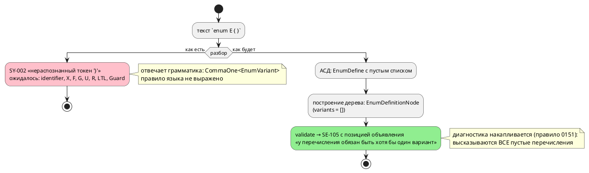

# Фича: Семантика перечисления без вариантов

- **Номер:** 0172
- **Статус:** ГОТОВО
- **Зависит от:** нет
- **Tier:** 3
- **Связанные issue (анализ):** кандидат блока 2 `FEATURES.md` (переформулировано ревизией [ревизия витрины кандидатов и решение по дублю README ↔ book](0140-backlog-revision-doc-split.md) 2026-07-27)

## Стадии жизненного цикла (правило 17)

Все стадии — **разделы этой карточки** (правило 32): «Архитектура (ADR)»,
«Анализ», «Разработка», «Тест-план», «Отчёт о тестировании», «Итог».
Отдельным артефактом остаются только исправления —
[`docs/fixes/`](../fixes/README.md) (при необходимости `0172-YY-*`).

## Краткое описание

Чем должно быть перечисление без вариантов — ошибкой языка или законным типом с
пустым доменом? Сегодня `enum E { }` отвергается **парсером**, то есть это
случайность грамматики, а не решение языка.

> Фича зарегистрирована из бэклога кандидатов (отобрана заказчиком 2026-07-28); далее проходит жизненный цикл по правилу 17.

## Что известно на входе

- Прежняя запись утверждала, что `enum E { }` «трактуется четырьмя целями
  по-разному»; проба показала, что **такую программу написать нельзя** — парсер
  требует хотя бы один вариант (`SY-002`), и до целей вход не доходит.
- То есть боли у пользователя нет; открыт вопрос **уровнем выше** — что язык
  обещает.
- Смежно с [семантика `[bit;N]` расходится втрое](0078-bit-array-semantics.md) — тот же класс: язык не определил
  случай, и ответ дала реализация.

## Направление решения (наметка, не решение)

- Решение о семантике: явная ошибка **языка** (диагностика с внятным текстом
  вместо `SY-002` «ожидалось …») либо законный тип с пустым доменом.
- Если законный — надо ответить, что делают с ним `enum_facts` (знак и
  ширина), верификация (домен = 0 вариантов) и пять генераторов; выбор «ошибка»
  заметно дешевле.

Окончательный выбор — за стадиями **архитектуры** (ADR) и **анализа**: раздел
выше фиксирует то, что уже проверено, а не предрешает реализацию.

## Документирование (правило 24)

**Требуется.** Фиксируется правило языка (пусть даже «так писать нельзя») —
затронут раздел [`book/src/03-types/`](../../book/src/03-types/index.typ)
(перечисления).

**Сделано** ([семантика перечисления без вариантов](0172-empty-enum-semantics.md#разработка)):
правило записано в подразделе «Перечисления» раздела «Типы», `SE-105` добавлен в
блок «Частые ошибки» того же раздела (правило 26) и в приложение «Ошибки и
предупреждения» — сводной строкой и отдельным подразделом с примером и
фактическим выводом инструмента (правило 25).

## Архитектура (ADR)

- **Status:** Accepted (Option B)
- **Date:** 2026-08-16
- **Authors:** Архитектор
- **Related issues:** [Фича](0172-empty-enum-semantics.md); прямое следствие [ADR](0060-enum-width-shared-layer.md#архитектура-adr) (правило 3 — «пустое перечисление: трактовку выбирает цель, вопрос семантики языка вынесен кандидатом»); смежно с [ADR](0078-bit-array-semantics.md#архитектура-adr) (тот же класс: язык не определил случай, ответ дала реализация), [ADR](0189-anonymous-ports.md#архитектура-adr) и [ADR](0236-c-unresolved-condition-refusal.md#архитектура-adr) (диагностику о программе автора даёт язык, а не чужой инструмент)

### Context

Язык допускает объявление `enum`. Чем должна быть запись **без вариантов** —
ошибкой языка или законным типом с пустым доменом, — язык не говорит **нигде**:
ни документ `book/`, ни диагностики, ни ADR. Сегодняшний ответ даёт грамматика,
и он случаен.

#### Замер 1: что отвечает инструмент сегодня (проба 2026-08-16)

```takt
enum E { }
```

```
model.takt:1:10: Ошибка компиляции [SY-002]: нераспознанный токен '}',
  ожидалось identifier, "X", "F", "G", "U", "R", "LTL", "Guard"
```

Отвечает **парсер**: правило `EnumDefine` требует `CommaOne<EnumVariant>` —
«один или более». Три следствия:

- **Текст обманчив.** Автору сообщают не правило языка («у перечисления обязан
  быть хотя бы один вариант»), а внутренность LR-разбора; перечисленные
  ожидания включают контекстные слова LTL (`X`, `F`, `G`, `U`, `R`, `LTL`,
  `Guard`), которые к перечислению отношения не имеют вовсе.
- **Правила языка нет.** Отказ — свойство квантификатора в грамматике; смени его
  на `Comma<…>`, и запись станет законной **молча**, без единого решения.
- **Позиция указывает на `}`**, а не на объявление: искать нечего, потому что
  «ошибка» — в отсутствии текста.

Прочие входы того же класса (проба): `enum E { 42 }` → `SY-002`; `enum { A }` →
`SY-002`. Ветвь восстановления `enum <имя> { ! }` в грамматике **существует** и
строит `EnumDefine` с пустым списком вариантов, но `parse` при непустом списке
ошибок парсера возвращает `Err` — до семантики такой узел не доезжает.

**Вывод замера: пустое перечисление из исходника сегодня недостижимо ни одним
путём.** Боли у пользователя нет — открыт вопрос уровнем выше: что язык обещает.

#### Замер 2: реализация к пустому перечислению уже готова — и разноголоса

`enum_facts` (общий слой знака и ширины) на пустом списке возвращает
`None` — «диапазона нет». Дальше каждая цель решает сама:

| Потребитель | Ответ на перечисление без вариантов | Где |
|---|---|---|
| цель `c` | `uint8_t` | `generator/c/mod.rs` |
| цель `st` | `USINT` (8 бит без знака) | `generator/st/st_type.rs` |
| цель `rust` | `u8` | `generator/rust/rust_type.rs` |
| цель `sv` | **`SV-004`** «ширина типа не определена» | `generator/sv/sv_type.rs` |
| форматтер | печатает `enum E {}` одной строкой | `format/mod.rs` |
| объявление в цели `c` | не печатает **ничего** (варианты идут `#define`) | `generator/c/c_decl.rs` |

То есть три цели молча считают домен непустым (8 бит без знака — 256 значений
там, где значений нет ни одного), четвёртая отказывает. ADR зафиксировал
это как «поведение сохраняется сегодняшним», прямо назвав унификацию **вопросом
семантики языка** и вынеся его кандидатом — этот кандидат и стал настоящей
фичей.

Комментарий в `format/mod.rs` ссылается на фичу **поимённо**: печать
однострочной формы выбрана так, чтобы пережить круговой рейс, «если запись
однажды станет законной». Решение настоящего ADR закрывает и этот вопрос.

#### Замер 3: смежный класс — структура без полей — ведёт себя иначе

Правило `StructDefine` использует `Comma<StructField>` («ноль или более»), и
`struct S { }` **принимается**. Проба (2026-08-16): цель `c` печатает

```c
typedef struct S {
} S;
```

Это не валидный C: пустая структура — расширение GNU (C11 6.7.2.1 требует
непустой `struct-declaration-list`). Проверка проекта (`-Wall -Werror`) её
**пропускает**, `cc -pedantic` отвергает (`-Wgnu-empty-struct`).

Класс тот же — «агрегатное объявление без элементов», — но предмет иной, и
устройство отказа тоже: у структуры сегодня отказывает **чужой инструмент** и
только под флагом, которого в проверке нет. Настоящий ADR решает **перечисление**;
структура выносится кандидатом (правило 7), чтобы не расширять объём фичи
задним числом (правило 2).

#### Поток «как есть» и «как будет»



### Decision Drivers

1. **Правило языка обязано быть решением, а не побочным эффектом.** Класс
   [семантика `[bit;N]` расходится втрое](0078-bit-array-semantics.md#архитектура-adr): язык не определил случай — ответ дала
   реализация. Сегодня ответ даёт квантификатор в `grammar.lalrpop`, и его
   правка изменила бы язык молча.
2. **Диагностика адресуется автору программы.** Правило пачки
   ([накопление семантических диагностик (несколько ошибок за прогон)](0130-diagnostics-batch.md)): сообщение обязано нести
   позицию и называть **правило**, а не устройство разбора. Текст `SY-002`
   (замер 1) не называет ни того, ни другого.
3. **Тип с пустым доменом не имеет представления ни в одной цели** (замер 2).
   Значение такого типа не существует, а переменная его получает: три цели
   выдают ей 8 бит без знака.
4. **Цена ответов несимметрична.** «Ошибка» стоит одной проверки; «законный тип»
   требует ответа от пяти целей, симулятора, верификации (домен из нуля
   значений) и слоя `enum_facts`.
5. **Недостижимость ветвей должна держаться названной причиной.** Сегодня
   `None`-ветви четырёх целей недостижимы **по случайности грамматики** — это в
   точности устройство, которое [печатник цели c печатает пустоту на неразрешённом условии](0236-c-unresolved-condition-refusal.md#архитектура-adr)
   назвала опасным: следующая конструкция языка способна открыть путь снова, и
   молча.

### Considered Options

#### Option A. Оставить как есть — отказ парсера

**Pros:**
- Ноль правок; запись отвергнута, вывод корпуса неизменен по построению.

**Cons:**
- Правило языка так и не сформулировано: фича закрывается словами «и так
  нельзя», а `book/` по-прежнему молчит.
- Текст диагностики остаётся обманчивым (замер 1) — исправить его нельзя,
  сообщение строит LALRPOP.
- Недостижимость `None`-ветвей целей остаётся свойством квантификатора.

#### Option B. Грамматика принимает, семантика отвергает диагностикой языка

`CommaOne<EnumVariant>` → `Comma<EnumVariant>`; новая проверка в
`validate/enums.rs` даёт **`SE-105`** с позицией объявления и текстом,
называющим правило.

**Pros:**
- Правило языка становится **решением**: «перечисление обязано иметь хотя бы
  один вариант» записано диагностикой, документом и тестом.
- Сообщение адресовано автору: позиция объявления, названная причина, названный
  способ исправить.
- Диагностика попадает в общий вход `collect_compile_diagnostics` — значит
  доезжает и до **LSP** (правило 29), и накапливается по правилу
  [накопление диагностик внутри отдельной проверки `validate`](0151-diagnostics-batch-within-check.md): два пустых
  перечисления дают две записи, а не одну.
- Недостижимость `None`-ветвей целей начинает держаться **названной** причиной
  (`SE-105`), а не квантификатором грамматики.
- Форматтер к форме уже готов (замер 2) — печать не изобретается заново.

**Cons:**
- Отказ переезжает из синтаксиса в семантику: файл с пустым перечислением
  проходит разбор, и `taktc fmt` (семантику не зовущий,
  [ADR](0024-lam-formatter.md#архитектура-adr)) его **отформатирует** вместо отказа.
  Граница названа: `fmt` не судья программы, он и сегодня форматирует программы
  с семантическими ошибками.
- Ветвь восстановления `enum <имя> { ! }` в грамматике перестаёт быть
  единственным способом получить пустой список вариантов — контроль обязан
  различать «пусто» и «мусор внутри».

#### Option C. Законный тип с пустым доменом

**Pros:**
- Ни одна запись не отвергается; язык беднее на одно правило.

**Cons:**
- **Ни одна цель не умеет его представить** (замер 2): нужен ответ от `c`, `st`,
  `rust`, `sv`, симулятора и верификации — цена несопоставима с пользой.
- Значения типа не существует, а переменная обязана иметь начальное значение:
  `var x: E := ?` неразрешимо, и три цели уже отвечают на это молчаливым нулём,
  не принадлежащим домену.
- Абстракция по данным ([верификация свойств над данными (атом-предикат LTL)](0068-verify-data-properties.md))
  получает переменную с пустым множеством значений — вердикт над ней
  неопределён.

#### Option D. Объявление законно, использование как типа — ошибка

**Pros:**
- «Заготовка» перечисления, которую заполнят позже, остаётся законной.

**Cons:**
- Два правила вместо одного, и второе — та же ошибка, но позже и в другом месте
  (у переменной, а не у объявления), то есть позиция указывает не туда, где
  правка нужна.
- Польза мнимая: неиспользуемое объявление никому не мешает и в отсутствие
  запрета; запрет же нужен ровно там, где тип **используется**, — а это и есть
  единственный наблюдаемый случай.

### Decision

Принимается **Option B**: **перечисление без вариантов — ошибка языка**,
выраженная диагностикой **семантики**, а не отказом разбора.

- Грамматика: `EnumDefine` принимает пустой список вариантов
  (`Comma<EnumVariant>`); ветвь восстановления `!` сохраняется — она отвечает за
  **мусор** внутри скобок (`enum E { 42 }`), а не за пустоту.
- Семантика: новая проверка в `validate/enums.rs` даёт **`SE-105`** — «у
  перечисления обязан быть хотя бы один вариант». Позиция — объявление
  перечисления. Проверка **накопительная**: каждое пустое
  перечисление высказывается само за себя, включая вложенные модели.
- Текст называет правило и способ исправить (добавить вариант либо удалить
  объявление), а не устройство разбора.
- `enum_facts` и `None`-ветви четырёх целей **сохраняются** без изменений: их
  недостижимость из исходника теперь держит `SE-105`. Менять трактовку целей
  незачем — вход до них не доходит, а правка сдвинула бы вывод корпуса.

**Вне объёма (граница названа, а не забыта):** структура без полей (замер 3) —
отдельный предмет с отдельным поведением (принимается языком, даёт невалидный по
стандарту C, проверка проекта молчит). Выносится кандидатом в `FEATURES.md`;
настоящая фича его не решает.

### Consequences

#### Положительные

- Язык получает **сформулированное** правило вместо случайности грамматики;
  правило записано в `book/` (раздел «Типы», перечисления) и в приложении
  «Ошибки и предупреждения».
- Автор получает диагностику с позицией объявления и названной причиной вместо
  перечисления LTL-слов.
- Правило доезжает до **редактора**: `SE-105` идёт общим входом
  `collect_compile_diagnostics`, которым пользуется LSP (правило 29).
- Недостижимость `None`-ветвей целей `c`/`st`/`rust`/`sv` перестаёт быть
  случайной: у неё появляется названная причина и контроль.

#### Отрицательные / Action items

- **Совместимость.** Изменение **не ломающее**: запись, которая была ошибкой,
  ею и остаётся — меняются код, текст и позиция диагностики. Программ, ставших
  невалидными, нет; программ, ставших валидными, — тоже.
- **Версия языка.** Правило языка меняется (диагностика — часть контракта), но
  подъёма не требует: текущий цикл `0.9.0` **не выпущен** (раздел
  `[Не выпущено]` в `CHANGES.md`), и по правилу 22 фича вносится в уже поднятую
  версию.
- **`taktc fmt` перестаёт отвергать такой файл** — он и не должен: форматтер
  семантику не зовёт. Фиксируется как названная граница, а не дефект.
- **Контроль обязан различать пустоту и мусор**: `enum E { }` → `SE-105`,
  `enum E { 42 }` → `SY-002`. Иначе правка грамматики молча съест восстановление.
- `SE-105` вносится в приложение «Ошибки и предупреждения» (правило 25); раздел
  «Типы» дополняется правилом и блоком «Частые ошибки» (правило 26).
- Кандидат «структура без полей» заводится в `FEATURES.md` (правило 7).

#### Acceptance criteria

1. `enum E { }` даёт **`SE-105`** с позицией **объявления** и текстом,
   называющим правило языка; `SY-002` на этом входе больше не возникает.
2. Проверка **накопительна**: файл с двумя пустыми перечислениями даёт **две**
   диагностики; пустое перечисление во вложенной модели высказывается тоже.
3. `enum E { 42 }` по-прежнему отвергается разбором (`SY-002`) — ветвь
   восстановления жива.
4. Круговой рейс форматтера на `enum E {}` устойчив (`fmt` идемпотентен), корпус
   `fmt --check` зелён.
5. `SE-105` доезжает до LSP (диагностика видна редактору).
6. Вывод корпуса `examples/generated/` **байт-в-байт** неизменен.
7. `SE-105` описан в приложении «Ошибки и предупреждения»; правило записано в
   разделе «Типы» документа `book/` вместе с блоком «Частые ошибки».
8. `./scripts/precheck.sh` зелёный.

## Анализ

### Цель и контекст

ADR принял **Option B**: перечисление без вариантов — **ошибка языка**,
выраженная диагностикой семантики (**`SE-105`**), а не отказом разбора.
Грамматика начинает принимать пустой список вариантов; судьёй становится
`validate`.

Анализ отвечает на три вопроса, которые ADR оставил реализации: **где именно**
стоит проверка, **что происходит на пути от грамматики до целей**, когда отказ
разбора снят, и **что ещё** этот путь открывает.

### Зависимости фичи (правило 17/19)

- **Зависит от:** `нет`. Слой `enum_facts` ([расчёт ширины перечисления — вынести в общий слой](0060-enum-width-shared-layer.md)) закрыт, накопление
  диагностик внутри проверки (фича
  [накопление диагностик внутри отдельной проверки `validate`](0151-diagnostics-batch-within-check.md)) закрыто, печать
  пустой формы форматтером ([канонический форматтер .lam (lamc fmt)](0024-lam-formatter.md))
  готова. Внешних незакрытых зависимостей нет — фича `СОЗДАНА` → берётся в
  работу без блокировки.
- **Влияние на порядок разработки:** ничего не разблокирует и ничем не
  блокируется. Порядок таблицы `FEATURES.md` не меняется; после закрытия строка
  удаляется (правило 10).

### Замеры (проба 2026-08-16)

#### З1. Снятие отказа грамматики: конфликта LR нет

Правка `CommaOne<EnumVariant>` → `Comma<EnumVariant>` в правиле `EnumDefine`
собирается **без конфликтов**: ветвь восстановления `enum <имя> { ! }`
сосуществует с пустым списком, потому что `!` вступает только там, где обычный
разбор невозможен.

Побочный эффект — **улучшение** текста `SY-002` на мусоре внутри скобок: к
списку ожидаемого добавилось `"}"`.

| Вход | До правки | После правки |
|---|---|---|
| `enum E { }` | `SY-002` (ожидалось identifier, X, F, G, U, R, LTL, Guard) | разбирается |
| `enum E { 42 }` | `SY-002` (то же перечисление) | `SY-002` (+ `"}"` в списке ожидаемого) |

#### З2. Что происходит без проверки — два наблюдаемых, оба плохие

После снятия отказа грамматики и **до** введения `SE-105`:

| Вход | Ответ | Оценка |
|---|---|---|
| `enum E { }` (объявление не используется) | **компилируется, код 0** | молчание: цель `c` печатает файл, о `E` не сказав ничего |
| `var e: E := 0;` при пустом `E` | `SE-043`: «…не является вариантом перечисления (**допустимые варианты: **)» | сообщение бессодержательно: список пуст, причина не названа |

Второй случай — тот же класс, что [модель без стартового состояния: цель c отказывает бессодержательно](0211-c-missing-start-state-diagnostic.md) и
[диагностика цели c без кода](0212-c-diagnostic-without-code.md) («диагностика ничего не
сообщает»): автору говорят, что `0` не вариант, но не говорят, что вариантов
**нет вовсе**. Это прямой довод за отказ **на объявлении**, а не на
использовании (Option D ADR).

#### З3. Проверка обязана стоять в `validate_model_all`

`validate_model_all` (`semantic/validate/mod.rs`) — единственный вход, которым
пользуются **и** CLI (через `collect_compile_diagnostics`), **и** LSP
(`lsp/diagnostics.rs:86` зовёт его напрямую). Он же рекурсивно обходит вложенные
модели в конце — значит **сама проверка рекурсию не ведёт** (иначе диагностика
удвоится: тот же довод в комментарии `validate_bit_values`).

#### З4. Импортированное перечисление проверяется у импортёра — и это верно

`import` «усыновляет» типы вместе с устройством ([импорт переносит имя типа, но не его устройство](../fixes/0182-03-imported-type-definition.md), [общие переменные библиотечного файла в импортёре](0184-imported-shared-variables.md)), поэтому пустое
перечисление из библиотеки попадёт в `enums` импортёра и будет высказано.
Позиция при этом остаётся **своей** — смещения принадлежат файлу библиотеки, а
путь ставит реестр файлов ([предупреждение taktc compile несёт позицию](0228-compile-warning-position.md)). Дублирования нет: каждое
дерево проверяется один раз.

### Требования и проверяемые условия

- **R1. Правило языка.** Перечисление обязано иметь **хотя бы один** вариант.
  Нарушение → **`SE-105`**, ошибка (не предупреждение), позиция — **объявление
  перечисления** (`EnumDefinitionNode::loc`).
- **R2. Текст называет правило и выход.** В сообщении есть имя перечисления,
  само правило и способ исправить (добавить вариант либо удалить объявление).
  Внутреннего представления в тексте нет ([текст диагностики без внутреннего представления](0231-diagnostic-text-no-debug.md)).
- **R3. Накопление.** Одна диагностика на **объявление**; все пустые
  перечисления файла высказываются, включая объявленные во вложенных моделях.
- **R4. Восстановление разбора живо.** `enum E { 42 }` по-прежнему отвергается
  разбором (`SY-002`): снятие квантификатора не должно съесть ветвь `!`.
- **R5. Круговой рейс форматтера.** `enum E {}` печатается и разбирается обратно;
  повторная печать даёт тот же текст (идемпотентность).
- **R6. Диагностика доезжает до редактора** (правило 29): LSP отдаёт `SE-105`
  на том же входе, что CLI.
- **R7. Вывод корпуса неизменен** — байт-в-байт: правка не касается ни одной
  программы без пустых перечислений.
- **R8. Ветви целей не трогаются.** `enum_facts` → `None` и трактовки
  `c`/`st`/`rust`/`sv` остаются как есть; меняется **причина** их
  недостижимости — с квантификатора грамматики на названную диагностику.

### Критерии приёмки и способ проверки

| # | Критерий | Способ проверки |
|---|---|---|
| A1 | `enum E { }` → `SE-105` с позицией объявления | тест на диагностику по фикстуре `invalid/empty_enum.takt` |
| A2 | Текст называет имя, правило и способ исправить | сверка текста в тесте (подстроки), плюс контроль `diagnostic_text_tests` (нет `Debug`-дампа) |
| A3 | Два пустых перечисления → **две** диагностики; вложенная модель высказывается | тест на счёт диагностик по фикстуре с двумя объявлениями и вложенной моделью |
| A4 | `enum E { 42 }` → `SY-002` | тест на код диагностики |
| A5 | `fmt` печатает `enum E {}` и идемпотентен | тест кругового рейса форматтера |
| A6 | `SE-105` виден LSP | тест LSP-диагностик (`--all-features`) |
| A7 | Вывод корпуса байт-в-байт | `precheck.sh` (детерминизм + снапшоты `examples/generated/`) |
| A8 | `SE-105` в приложении «Ошибки и предупреждения»; правило в разделе «Типы» | чтение документа; проверка примеров `book/` |
| A9 | `./scripts/precheck.sh` зелёный | прогон |

### Редакторский слой (правило 29)

Изменение затрагивает **семантику** (новое правило языка), поэтому ответ
фиксируется явно:

- **Новых ключевых слов и токенов нет** — `enum` существует; таблицы
  `KEYWORDS`, `lsp/semantic_tokens.rs`, `BUT_KEYWORDS`, `TaktTokenTypes.KEYWORDS`
  правки **не требуют**.
- **Новых узлов АСД нет** — `EnumDefine` существует; печать `format/` и обход
  `semantic/usages/walk.rs` правки **не требуют** (пустая форма в форматтере уже
  реализована и прямо ссылается на эту фичу).
- **Новой формы объявления нет** — `navigation/TaktSymbolScanner` плагина
  IntelliJ правки **не требует**: форма `enum <имя> { … }` не изменилась,
  изменился лишь допустимый состав тела.
- **Новая диагностика есть** — `SE-105`; она обязана доехать до редактора.
  Проверено чтением: `lsp/diagnostics.rs` зовёт `validate_model_all`, куда
  проверка и ставится (замер З3). Это же и требование R6 с тестом A6.

### Особенности по обратной функциональности

Изменение **не ломающее**. Запись `enum E { }` была ошибкой компиляции и ею
остаётся — меняются код (`SY-002` → `SE-105`), текст и позиция. Программ,
переставших компилироваться, нет; программ, ставших валидными, — тоже.

**Версия языка не поднимается** (правило 22): правило языка уточняется, но
текущий цикл `0.9.0` ещё не выпущен (раздел `[Не выпущено]` в `CHANGES.md`,
подъём сделала [отрицание ~0 для беззнакового типа: два правила языка столкнулись](0207-bitwise-not-unsigned-literal.md)) —
фича вносит изменение в уже поднятую версию.

### Риски и зависимости

- **Риск: правка грамматики съедает восстановление.** Снят замером З1 и
  требованием R4 со своим тестом: пустота и мусор дают разные коды.
- **Риск: `SE-043` перехватывает случай раньше `SE-105`.** Обе проверки живут в
  одном `validate_model_all` и **накапливаются**, поэтому на входе
  `enum E { } var e: E := 0;` автор увидит **обе** записи: `SE-105` называет
  причину, `SE-043` — следствие. Первенство причины даёт **не** порядок
  проверок, а `diagnostics::normalize` — выдача сортируется по позиции в тексте,
  и объявление стоит выше использования. Замер: перестановка проверок местами
  ничего не меняет (мутация 2026-08-16), поэтому опираться в коде на их порядок
  нельзя — соответствующее утверждение из комментария снято.
- **Риск: фикстуры корпуса.** Новая фикстура `invalid/` попадает под обход
  форматтера (тест корпуса `.takt`) — она обязана **разбираться** (иначе тест
  форматтера упадёт). Пустое перечисление разбирается по построению (З1), но
  файл не должен содержать иных синтаксических ошибок.
- **Риск: `taktc fmt` больше не отвергает такой файл.** Названная граница ADR, не
  дефект: форматтер семантику не зовёт.

## Разработка

### Задача

#### Что было

Запись `enum E { }` отвергал **парсер**: правило `EnumDefine` требовало
`CommaOne<EnumVariant>`. Правило языка было свойством квантификатора в
грамматике, а текст сообщения — внутренностью LR-разбора:

```
model.takt:1:10: Ошибка компиляции [SY-002]: нераспознанный токен '}',
  ожидалось identifier, "X", "F", "G", "U", "R", "LTL", "Guard"
```

Ни правила, ни способа исправить, ни позиции объявления автору не сообщалось, а
`None`-ветви четырёх целей (`c`/`st`/`rust` → 8 бит без знака, `sv` → `SV-004`)
оставались недостижимыми **по случайности грамматики**.

#### Что сделано

- **Грамматика** (`takt-lang/src/grammar.lalrpop`): `EnumDefine` принимает
  пустой список вариантов (`CommaOne<EnumVariant>` → `Comma<EnumVariant>`).
  Конфликтов LR нет; ветвь восстановления `enum <имя> { ! }` сохранена и
  по-прежнему отвечает за **мусор** внутри скобок. Побочный эффект — в списке
  ожидаемого у `SY-002` появилось `"}"`.
- **Семантика** (`semantic/validate/enums.rs`): новая проверка
  `validate_empty_enums` — **`SE-105`** на каждое перечисление без вариантов;
  позиция — объявление (имя перечисления), текст называет правило и способ
  исправить. Проверка накопительная, рекурсию не ведёт —
  `validate_model_all` обходит вложенные модели сам.
- **Подключение** (`semantic/validate/mod.rs`): проверка добавлена в массив
  `validate_model_all` (11 → 12 элементов) рядом с прочими проверками
  перечислений. Порядок в массиве на порядок сообщений **не влияет** —
  выдачу упорядочивает `diagnostics::normalize` по позиции в тексте; это
  измерено мутацией, а первоначальный комментарий «стоит раньше намеренно» был
  снят как неверный.
- **Ветви целей не тронуты**: `enum_facts` → `None` и трактовки
  `c`/`st`/`rust`/`sv` остались как есть (ADR, правило 3). Изменилась
  **причина** их недостижимости.

Функциональности вне Rust-крейтов: `н/п` — правка целиком в `takt-lang`.

#### Проверки

```sh
cargo test --all-features --test empty_enum_tests   # 9 тестов
./scripts/precheck.sh
```

Контроль — `takt-lang/tests/semantic/empty_enum_tests.rs` (фикстуры
`tests/data/semantic/invalid/empty_enum.takt` и `empty_enum_many.takt`):

| Тест | Условие анализа |
|---|---|
| `empty_enum_is_se105` | R1 (код `SE-105`, не `SY-002`) |
| `se105_points_at_the_declaration` | R1 (позиция — имя перечисления, 1:6) |
| `se105_text_names_the_rule_and_the_way_out` | R2 (имя, правило, выход) |
| `every_empty_enum_speaks_for_itself` | R3 (три диагностики, включая вложенную модель) |
| `cause_precedes_consequence` | R3 (причина раньше следствия — через `normalize`) |
| `garbage_inside_braces_is_still_a_parse_error` | R4 (`enum E { 42 }` → `SY-002`) |
| `formatter_round_trip_is_stable` | R5 (`enum Mode {}`, идемпотентность) |
| `editor_shows_se105` | R6 (правило 29: LSP отдаёт `SE-105`) |
| `single_variant_enum_is_valid` | контр-пример: один вариант законен |

**Мутации (проверка контроля, а не кода):**

| Мутация | Ответ тестов |
|---|---|
| `if en.variants.is_empty()` → `if false` | 5 падений |
| Грамматика возвращена к `CommaOne` | 5 падений |
| Перестановка `validate_empty_enums` и `validate_enum_values` | **0 падений** → утверждение о порядке проверок снято из комментария и анализа |

### Задача

#### Что было

Документ `book/` о пустом перечислении не говорил **ничего**: раздел «Типы»
описывал перечисление как «именованный тип с фиксированным набором вариантов»,
не оговаривая, обязан ли набор быть непустым. Кода `SE-105` не существовало,
поэтому в приложении «Ошибки и предупреждения» его тоже не было.

#### Что сделано

- **`book/src/03-types/index.typ`** (правило 24): подраздел «Перечисления»
  дополнен правилом — у перечисления обязан быть хотя бы один вариант, — с
  объяснением, **почему** отказ стоит на объявлении (тип без значений не принял
  бы ни одного, а переменная всё равно потребовала бы начального значения).
- **Блок «Частые ошибки»** того же раздела (правило 26) пополнен строкой
  `` `SE-105` — перечисление объявлено без вариантов ``, в принятом формате
  «сначала код, затем описание».
- **`book/src/appendix-errors/index.typ`** (правило 25): строка в сводной таблице
  `SE` и отдельный подраздел `### SE-105` — пример входа и **фактический** вывод
  инструмента (снят прогоном, а не написан по памяти), плюс объяснение, почему
  отказ не отложен до использования (`SE-043` перечислил бы допустимые варианты,
  а список пуст).

- **Реестр диагностик** `docs/diagnostics/README.md`  пополнен
  строкой `SE-105`: проверка предкоммита проверяет, что каждый эмитируемый код там
  описан, и первый прогон отказал именно на этом.

Номеров фич, ссылок на ADR и деталей реализации в документе нет (правило 24).

**`README.md` правки не требует** (правило 8 при разделении ролей правила 15):
он описывает проект и инструментарий, а «у перечисления обязан быть вариант» —
правило **языка**, место которому в `book/`. Отображение перечисления в типы
целей, о котором README говорит, не изменилось.

#### Проверки

```sh
./scripts/precheck.sh   # гейт примеров book/ (0133) и гейт глифов (0146)
```

Пример приложения — заведомо **ошибочная** программа, и проверка примеров `book/`
её не берёт по построению: он обходит **файлы** `book/src/**/*.takt`, а
приложение показывает диагностику блоком кода внутри Markdown. Текст вывода
сверен с прогоном `taktc` на файле (позиция `1:6` — имя перечисления), а не
написан по памяти.

## Тест-план

### Область и цель

Фича меняет **правило языка**: перечисление без вариантов становится ошибкой
семантики (`SE-105`) вместо отказа разбора (`SY-002`). По правилу 16 тест-план
для фичи синтаксиса/семантики обязан содержать проверки корректности языка и
компилятора, а также **примеры и контрпримеры**.

Проверяются требования анализа R1–R8 и критерии приёмки A1–A9.

### Проверки (условие → ожидаемый результат)

| # | Проверка | Предусловие | Ожидаемый результат | Ссылка на R/A |
|---|---|---|---|---|
| T1 | Пустое перечисление отвергается языком | `enum Mode { }` + автомат | одна диагностика **`SE-105`**; `SY-002` отсутствует | R1 / A1 |
| T2 | Позиция указывает на объявление | тот же вход | позиция — **имя** перечисления (`1:6`), не `}` и не `1:1` | R1 / A1 |
| T3 | Текст называет правило и выход | тот же вход | в тексте есть имя (`Mode`), «хотя бы один вариант», «удалите объявление»; `Debug`-дампа нет | R2 / A2 |
| T4 | Накопление по объявлениям | фикстура `empty_enum_many.takt` (два перечисления модели + одно вложенной) | ровно **три** `SE-105` | R3 / A3 |
| T5 | Причина раньше следствия | `enum Mode { }` + `var m: Mode := 0;` | обе диагностики; `SE-105` в выдаче **раньше** `SE-043` | R3 / A3 |
| T6 | Восстановление разбора живо | `enum Mode { 42 }` | **`SY-002`**; `SE-105` не возникает (до семантики вход не доходит) | R4 / A4 |
| T7 | Круговой рейс форматтера | `enum Mode {   }` | печатается `enum Mode {}`; повторная печать даёт тот же текст | R5 / A5 |
| T8 | Доставка в редактор | тот же вход, `--all-features` | LSP отдаёт ровно одну `SE-105` | R6 / A6 |
| T9 | Контрпример: один вариант | `enum Mode { Idle }` + автомат | диагностик **нет** | R1 / A1 |
| T10 | Вывод корпуса не сдвинулся | `precheck.sh` | `examples/generated/` байт-в-байт; детерминизм зелён | R7 / A7 |
| T11 | Ветви целей не тронуты | чтение кода + корпус | `enum_facts` → `None` и трактовки `c`/`st`/`rust`/`sv` прежние | R8 / A7 |
| T12 | Документ | чтение `book/` | правило в разделе «Типы», `SE-105` в блоке «Частые ошибки» и в приложении | — / A8 |
| T13 | Предкоммит | `./scripts/precheck.sh` | зелёный | — / A9 |

### Примеры и контрпримеры (правило 16)

**Контрпримеры (должны отвергаться):**

```takt
enum Mode { }              // SE-105 — вариантов нет
enum Mode { }
enum Command { }           // две диагностики: каждое объявление высказывается
model Inner { enum Level { } … }   // вложенная модель высказывается тоже
```

**Примеры (должны приниматься):**

```takt
enum Mode { Idle }                 // одного варианта достаточно
enum Mode { Idle = 0, Run = 1 }    // обычная форма
```

**Отдельно — граница с разбором** (не контрпример правила, а контрпример
«поглощения» ветви восстановления):

```takt
enum Mode { 42 }           // SY-002 от парсера, а НЕ SE-105
```

### Мутационные проверки (контроль проверяется, а не только код)

| Мутация | Ожидание |
|---|---|
| `en.variants.is_empty()` → `false` (проверка обезврежена) | падают T1–T5, T8 |
| Грамматика возвращена к `CommaOne<EnumVariant>` | падают T1–T5, T8 |
| `validate_empty_enums` и `validate_enum_values` переставлены местами | **ничего не падает** — порядок выдачи задаёт `normalize` по позиции; утверждать обратное в коде нельзя |

### Разбивка проверок по функциональности

| Функциональность | T1–T6 | T7 | T8 | T10–T11 | Статус |
|---|---|---|---|---|---|
| Компилятор `taktc` (семантика) | ✅ | — | — | ✅ | пройдено |
| Форматтер `taktc fmt` | — | ✅ | — | ✅ | пройдено |
| Языковой сервер `takt-lsp` | — | — | ✅ | — | пройдено |
| Цели `c`/`st`/`rust`/`sv` | — | — | — | ✅ | не задеты (вход до них не доходит) |
| Симулятор `takt-sim` | — | — | — | ✅ | не задет (та же причина) |
| Плагины редакторов | — | — | — | — | — (новых токенов и форм объявления нет, правило 29) |

<!-- Легенда: ✅ пройдено · ❌ провалено · ⬜ не проверялось · — не применимо -->

### Тестовые данные и окружение

- Контроль: `takt-lang/tests/semantic/empty_enum_tests.rs` (9 тестов, один под
  `#[cfg(feature = "lsp")]`).
- Фикстуры: `takt-lang/tests/data/semantic/invalid/empty_enum.takt`,
  `takt-lang/tests/data/semantic/invalid/empty_enum_many.takt`.
- Команды:

```sh
cargo test --all-features --test empty_enum_tests
./scripts/precheck.sh
```

- Окружение: толчейн `1.97.1` (пин `rust-toolchain.toml`), macOS (Darwin 25.5.0).

## Отчёт о тестировании

### Резюме

**Пройдено, фича готова к закрытию (`ГОТОВО`).** Все тринадцать проверок
тест-плана дали ожидаемый результат; критерии приёмки A1–A9 выполнены.

Прогон: `cargo test --all-features --test empty_enum_tests` — **9 из 9**;
`./scripts/precheck.sh` — зелёный.

Существенная находка отчёта — **опровергнутое утверждение о коде** (мутация M3
ниже): комментарий, объяснявший порядок проверок, оказался неправдой и был снят.

### Фактические результаты по проверкам

| # | Проверка | Результат | Комментарий |
|---|---|---|---|
| T1 | Пустое перечисление отвергается языком | ✅ | `SE-105`; `SY-002` отсутствует (`empty_enum_is_se105`) |
| T2 | Позиция — объявление | ✅ | `1:6` — имя перечисления (`se105_points_at_the_declaration`) |
| T3 | Текст называет правило и выход | ✅ | «перечисление 'Mode' объявлено без вариантов: у перечисления обязан быть хотя бы один вариант (добавьте вариант либо удалите объявление)» |
| T4 | Накопление по объявлениям | ✅ | три `SE-105` на фикстуре `empty_enum_many.takt`, включая вложенную модель |
| T5 | Причина раньше следствия | ✅ | `SE-105` перед `SE-043` — но **через `normalize`**, см. M3 |
| T6 | Восстановление разбора живо | ✅ | `enum Mode { 42 }` → `SY-002`; в списке ожидаемого появилось `"}"` |
| T7 | Круговой рейс форматтера | ✅ | `enum Mode {}`, повторная печать идентична |
| T8 | Доставка в редактор | ✅ | LSP отдаёт ровно одну `SE-105` (`--all-features`) |
| T9 | Контрпример: один вариант | ✅ | `enum Mode { Idle }` — диагностик нет |
| T10 | Вывод корпуса не сдвинулся | ✅ | проверка детерминизма и снапшоты `examples/generated/` зелены |
| T11 | Ветви целей не тронуты | ✅ | `enum_facts` → `None` и трактовки `c`/`st`/`rust`/`sv` прежние (правка их не касалась) |
| T12 | Документ | ✅ | правило в разделе «Типы», `SE-105` в «Частых ошибках», в приложении и в реестре `docs/diagnostics/README.md` |
| T13 | Предкоммит | ✅ | зелёный со второго прогона, см. «Дефекты» |

### Мутационные проверки

| # | Мутация | Ожидание | Факт |
|---|---|---|---|
| M1 | `en.variants.is_empty()` → `false` | падают тесты правила | ✅ 5 падений |
| M2 | Грамматика возвращена к `CommaOne<EnumVariant>` | падают тесты правила | ✅ 5 падений |
| M3 | `validate_empty_enums` ↔ `validate_enum_values` переставлены | ожидалось падение `cause_precedes_consequence` | ❌ **ничего не упало** |

**M3 — находка.** Порядок сообщений задают не проверки, а
`diagnostics::normalize`: выдача сортируется по `(файл, смещение)`, и причина
идёт первой потому, что объявление стоит выше использования. Написанный
первоначально комментарий «стоит перед `validate_enum_values` намеренно» был
**ложным утверждением о коде** — снят из `validate/mod.rs`, из анализа и заменён
верным объяснением в док-строке теста. Тест сохранён: он проверяет наблюдаемое
свойство выдачи, а не порядок проверок.

### Результаты по функциональности

| Функциональность | Статус | Основание |
|---|---|---|
| Компилятор `taktc` (семантика) | ✅ | T1–T6, T9 |
| Форматтер `taktc fmt` | ✅ | T7; корпус `fmt --check` зелён в предкоммите |
| Языковой сервер `takt-lsp` | ✅ | T8 (правило 29) |
| Цели `c`/`st`/`rust`/`sv` | — | не задеты: вход отсекается семантикой; вывод корпуса байт-в-байт (T10) |
| Симулятор `takt-sim` | — | та же причина |
| Плагины редакторов (`extensions/`) | — | правило 29: новых ключевых слов, токенов, узлов АСД и форм объявления нет; правка не требуется |

### Дефекты

**Найден один — процессный, устранён в рамках фичи.** Первый прогон
`precheck.sh` отказал: проверка реестра диагностик  сообщил, что `SE-105`
эмитируется исходником, но отсутствует в `docs/diagnostics/README.md`. Запись
добавлена, второй прогон зелёный. Отдельного исправления (`docs/fixes/`) случай не
требует: дефекта в коде нет, сработал контроль процесса — ровно так, как задуман.

### Выводы и дальнейшие шаги

- Правило языка сформулировано, доезжает до автора и до редактора; ветви целей
  сохранены, их недостижимость держит названная диагностика.
- **Кандидат заведён** (правило 7): структура без полей принимается языком и даёт
  невалидный по стандарту C, который проверка проекта пропускает. Класс тот же,
  устройство отказа иное — решается отдельной фичей.
- Исправления (`docs/fixes/0172-YY-*`) не требуются.

## Итог (что сделано)

**Перечисление без вариантов стало решением языка, а не случайностью
грамматики.** Прежде `enum E { }` отвергал парсер (`CommaOne<EnumVariant>`), и
автор получал внутренность LR-разбора: «нераспознанный токен `}`, ожидалось
identifier, "X", "F", "G", "U", "R", "LTL", "Guard"». Правила языка не
существовало нигде — ни в документе, ни в диагностиках; смена квантификатора
изменила бы язык **молча**.

Теперь грамматика пустой список принимает, а судит семантика — **`SE-105`** с
позицией объявления, названным правилом и способом исправить
(`semantic/validate/enums.rs`, подключена в `validate_model_all`). Проверка
накопительная: каждое пустое перечисление высказывается само за себя, включая
объявленные во вложенных моделях.

Ключевые решения ([ADR](0172-empty-enum-semantics.md#архитектура-adr), Option B):

- **Отказ стоит на объявлении**, а не на использовании: замер показал, что при
  использовании сообщение вырождалось в `SE-043` «…не является вариантом
  перечисления (**допустимые варианты: **)» — про пустой список автору не
  сообщалось ничего.
- **Тип с пустым доменом отвергнут** (Option C): представления у него нет ни в
  одной цели — `enum_facts` отдаёт `None`, после чего `c`/`st`/`rust` молча
  берут 8 бит без знака, а `sv` отвечает `SV-004`.
- **Ветви целей не тронуты**: их недостижимость из исходника теперь держит
  названная диагностика, а не квантификатор грамматики.
- **Мутация опровергла собственный комментарий:** утверждение «проверка стоит
  раньше `validate_enum_values` намеренно» оказалось неправдой — порядок выдачи
  задаёт `diagnostics::normalize` по позиции в тексте; утверждение снято из кода
  и анализа.

Контроль — [`takt-lang/tests/semantic/empty_enum_tests.rs`](../../takt-lang/tests/semantic/empty_enum_tests.rs)
(9 тестов, включая доставку в LSP и круговой рейс форматтера); обе содержательные
мутации ловятся. Детали — [отчёт](0172-empty-enum-semantics.md#отчёт-о-тестировании),
[семантика перечисления без вариантов](0172-empty-enum-semantics.md#разработка) и
[семантика перечисления без вариантов](0172-empty-enum-semantics.md#разработка).

**Границы (названы, а не забыты):** структура без полей — принимается языком и
даёт невалидный по стандарту C (`-Wgnu-empty-struct`), который проверка проекта
пропускает; вынесена кандидатом в `FEATURES.md`. Версия языка не поднимается
(правило 22): цикл `0.9.0` не выпущен.
