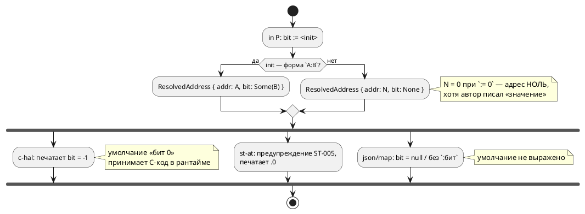
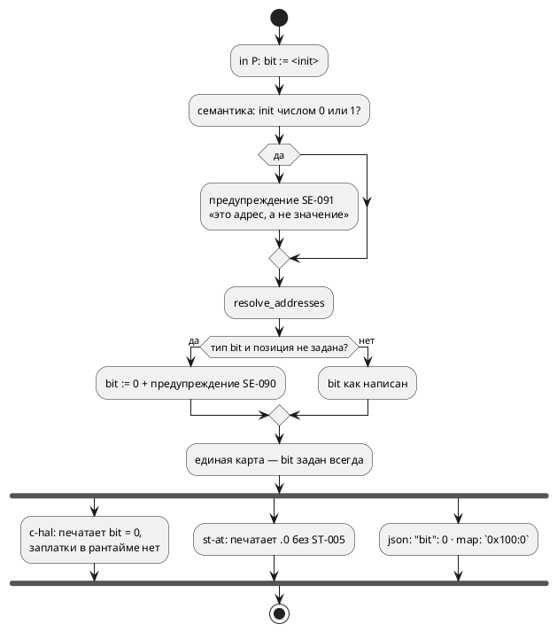

# Фича: Позиция бита у `bit`-порта с голым адресом

- **Номер:** 0176
- **Статус:** ГОТОВО
- **Зависит от:** нет
- **Tier:** 2
- **Связанные issue (анализ):** кандидат блока 2 `FEATURES.md` (вынесено закрытием [инициализатор порта — это адрес, но проверяется как значение](0070-port-initializer-address-role.md), смежно [проверка диапазона бита адреса порта и безопасный принятый по умолчанию HAL](0098-port-bit-range-safe-hal.md))

## Стадии жизненного цикла

Все стадии — **разделы этой карточки**: «Архитектура (ADR)»,
«Анализ», «Разработка», «Тест-план», «Отчёт о тестировании», «Итог».
Отдельным артефактом остаются только исправления —
[`docs/fixes/`](../fixes/README.md) (при необходимости `0176-YY-*`).

## Краткое описание

`in P: bit := 0x100;` валиден, но `c-hal` кладёт **бит −1** — для однобитного
порта это неполно: HAL читает бит по позиции. Та же тема — ловушка «`bit := 0/1`
на bit-порту молча означает адрес 0/1, а не значение».

> Фича зарегистрирована из бэклога кандидатов (отобрана заказчиком 2026-07-28); далее проходит жизненный цикл по своду.

## Что известно на входе

- После 0070 голый адрес у `bit`-порта принимается; позиции бита в слове при
  этом нет, и в карту уходит `-1`.
- Принятый по умолчанию HAL (`generator/c/c_hal.rs`) читает бит-порт словом, минимально
  содержащим бит (`word_bytes_for_bit`) — то есть позиция ему **нужна**.
- Диапазон бита нормирован фичей: вне [0, 63] → `SE-060`.
- В объём 0070 не взято: Option A — минимум; отвергнутый Option B её включал, но
  **ломал 3 регулятора корпуса** (`out ready: bit := 0`).

## Направление решения (наметка, не решение)

- Решение о семантике: умолчание «бит 0» **либо** явная диагностика «у
  bit-порта адрес обязан иметь позицию `0xADDR:бит`».
- Второй вариант ломает корпус (`out ready: bit := 0` трактуется как адрес) —
  цену надо посчитать в анализе до выбора.

Окончательный выбор — за стадиями **архитектуры** (ADR) и **анализа**: раздел
выше фиксирует то, что уже проверено, а не предрешает реализацию.

## Документирование

**Требуется.** Уточняется семантика адреса `bit`-порта (возможна новая
диагностика) — затронут раздел
[`book/src/08-ports-addresses/`](../../book/src/08-ports-addresses/index.typ).

## Архитектура (ADR)

- **Status:** Accepted
- **Date:** 2026-07-31
- **Authors:** Системный аналитик, архитектор, дизайнер языка
- **Related issues:** [Фича](0176-bit-port-address-position.md); продолжение
  [ADR](0070-port-initializer-address-role.md#архитектура-adr) (инициализатор порта — адрес), смежно
  [проверка диапазона бита адреса порта и безопасный принятый по умолчанию HAL](0098-port-bit-range-safe-hal.md#архитектура-adr) (диапазон бита, ширина доступа HAL) и
  [адрес порта — размещение и потребление (карта адресов)](0020-port-address-decl.md#архитектура-adr) (три источника адреса)

### Context

[ADR](0070-port-initializer-address-role.md#архитектура-adr) снял с портов проверку значения
бита: `in BTN: bit := 0x00100000;` — адрес, а не значение. Две вещи она
сознательно **не** решала и вынесла кандидатом: у голого адреса нет позиции бита,
а `bit := 0/1` молча означает адрес 0/1. Это и есть предмет 0176.

#### Что показала проба (2026-07-31)

**1. Умолчание «бит 0» уже существует — но живёт в трёх местах и выражено
по-разному.** Вход `in P: bit := 0x100;`:

| Потребитель | Что делает | Видит ли автор |
|---|---|---|
| `c-hal` | кладёт в таблицу `{ 0x100u, -1, 1 }`, а в времени выполнения `int s = b.bit < 0 ? 0 : b.bit;` | **нет**, молчит |
| `st-at` | печатает `%IX256.0` + предупреждение `ST-005` «принят бит 0» | да |
| `address-map --emit json` | `"bit": null` | не сказано, что подразумевается 0 |
| `address-map --emit map` | `P = 0x00000100;` | то же |

То есть решение «бит 0» принято трижды, независимо, и один из трёх принявших —
**сгенерированный C-код**, а не компилятор. Внешний генератор HAL, читающий
`json`, о нём не знает вовсе.

**2. `out ready: bit := 0;` даёт адрес `0x0` — и это в корпусе.** Пять примеров
(`regulator`, `float_regulator`, `pid_regulator`, `pid_law`, `batch_cycle`)
объявляют `out ready: bit := 0;`, и `c-hal` печатает:

```c
static const Regulator_PortBinding Regulator_Out_BitPort__ADDR[] = {
    [REGULATOR_REGULATOR_READY] = { (uintptr_t)0x0u, -1, 1 },
};
```

Принятый по умолчанию HAL пишет по этому адресу — то есть **разыменовывает нулевой
указатель**. Проверка `cc -c` такой код компилирует (он синтаксически безупречен),
а исполнения порождённого HAL в проекте нет, поэтому дефект молчит.

**3. Документ учит ловушке.** В `book/` пять таких мест, включая
`in light: bit := 0; // датчик: включён ли свет` — комментарий прямо утверждает
смысл «значение», а язык понимает «адрес 0». Читатель не может об этом
догадаться.

**4. Убрать инициализатор — не бесплатно.** `out ready: bit;` даёт `SE-052`
(«порт используется, но не имеет адреса») у `c-hal`/`st-at`; целью `c` собирается
как прежде.

#### Как обрабатывается адрес bit-порта сейчас



### Decision Drivers

1. **Одно решение — одно место.** Умолчание «бит 0» — свойство **языка**, а не
   цели. Пока его принимают три потребителя порознь, они вправе разойтись, и
   разойдутся молча (прецеденты: `c-hal` против `st-at` здесь же).
2. **Молчаливо неверный продукт хуже отказа.** Запись по адресу `0x0` в
   порождённой прошивке — не стилистическая придирка: на МК это либо вектор
   сброса, либо ловушка. Компилятор обязан хотя бы **сказать**.
3. **Документ не имеет права учить ловушке.** Пример с комментарием «датчик»
   рядом с инициализатором, означающим адрес, — источник будущих ошибок
   пользователей.
4. **Корпус — не аргумент против правильной семантики, но цена считается.**
   Правка пяти примеров и пяти мест документа допустима; молчаливая порча
   продукта — нет.
5. **Соразмерность.** Ошибка (а не предупреждение) на `bit := 0` сделала бы
   незаконной форму, валидную сегодня, и потребовала бы выдумать адреса там, где
   автор их не имел в виду.

### Considered Options

#### Option A. Умолчание «бит 0» нормируется в слое адресов + предупреждение

`resolve_addresses` для `bit`-порта с адресом без позиции подставляет `bit = 0` и
выдаёт предупреждение. Потребители получают уже нормированную карту.

**Pros:**
- Решение принимается **один раз**; `c-hal`, `st-at`, `sv-mmio` и обе выгрузки
  получают одинаковый ответ по построению.
- Время выполнения-заплатка `b.bit < 0 ? 0 : b.bit` в порождённом HAL становится мёртвой
  и снимается: инвариант держит компилятор, а не C-код.
- `json` начинает печатать `"bit": 0` — внешний генератор HAL узнаёт умолчание.

**Cons:**
- Меняется вывод `c-hal` (`-1` → `0`) и выгрузок для голого адреса. Корпус это не
  задевает (в нём голых адресов у bit-портов нет, кроме `:= 0`, см. Option C).
- `ST-005` становится недостижимым — код надо вывести из обращения.

#### Option B. Требовать явную позицию: `0xADDR:бит` иначе ошибка

**Pros:**
- Никаких умолчаний: у однобитного порта позиция всегда написана автором.

**Cons:**
- Ломает форму, валидную сегодня, ради случая, где умолчание очевидно (бит 0 —
  единственный разумный ответ для отдельно стоящего флага).
- Не решает главного: `out ready: bit := 0:0;` — по-прежнему **адрес 0**.
  Ошибка о бите заставила бы дописать `:0` и молча узаконила бы нулевой адрес.

#### Option C. Диагностика на подозрительный адрес 0/1 у порта

Отдельно от позиции бита: инициализатор порта, равный `0` или `1`, — почти
наверняка «начальное значение», написанное по привычке.

- **C-1. Предупреждение** (принято): форма остаётся законной, автор извещён.
- **C-2. Ошибка `SE-0NN`**: гарантирует, что нулевой адрес не уедет в прошивку,
  но делает незаконной сегодняшнюю форму и требует выдумать адреса в примерах,
  где их нет по смыслу.
- **C-3. Не трогать**: ловушка остаётся, запись по адресу 0 продолжает уезжать в
  порождённый HAL.

#### Option D. Оставить всё как есть, выровняв только тексты диагностик

**Pros:** нулевая цена.
**Cons:** три источника истины сохраняются (драйвер 1), нулевой адрес — тоже
(драйвер 2). Отвергнуто.

### Decision

Принимается **Option A + Option C-1** — решение заказчика 2026-07-31 по двум
поставленным вопросам.

1. **Умолчание «бит 0» нормируется в `resolve_addresses`.** Для порта типа `bit`
   с адресом без позиции карта получает `bit = Some(0)`, а разрешение выдаёт
   **предупреждение `SE-090`**: «у bit-порта позиция бита не задана: принят бит 0;
   укажите `0xADDR:бит`, если подразумевался другой». Предупреждение живёт там же,
   где решение, — в слое адресов, и достаётся всем адрес-потребляющим целям
   разом.
2. **`ST-005` выводится из обращения**: его ветка становится недостижимой (бит
   приходит заданным). Запись в реестре диагностик помечается `RETIRED` — код не
   переиспользуется, чтобы старые сообщения оставались опознаваемыми.
3. **Порт с адресом `0` или `1` даёт предупреждение `SE-091`** — «инициализатор
   порта задаёт **адрес**, а не начальное значение; адрес 0/1 почти наверняка
   ошибка». Проверка ставится в **семантике** (`collect_model_warnings`), а не в
   слое адресов: это свойство исходника, а не цели, и увидеть его должен и тот,
   кто собирает целью `c` (в том числе примеры документа — драйвер 3).
4. **Корпус и документ правятся.** Пять примеров `examples/` получают
   **настоящие** адреса (`out ready: bit := 0x600:0;` в духе `stacker`) — так
   покрытие проверкой `c-hal` сохраняется, а пример перестаёт вводить в
   заблуждение. В `book/` инициализатор убирается там, где адрес не является
   темой раздела (`out motor: bit;`): проверка документа собирает целью `c`, где
   адрес не нужен.

**Целевой поток:**



### Consequences

#### Положительные

- Умолчание перестаёт быть решением сгенерированного C-кода и становится
  свойством языка: одно место, один ответ, видимый в выгрузке.
- Автор узнаёт про нулевой адрес до того, как прошивка запишет по нему.
- Документ перестаёт учить ловушке; примеры показывают адрес там, где он есть.
- Из порождённого HAL уходит ветка `b.bit < 0 ? 0 : b.bit` — мёртвый код,
  скрывавший инвариант.

#### Отрицательные / Action items

- **Вывод `c-hal` и выгрузок меняется** для голого адреса (`-1` → `0`,
  `null` → `0`, `P = 0x100;` → `P = 0x100:0;`). Круговой рейс `map` →
  `--address-map` обязан остаться байт-в-байт замкнутым (R4 фичи) —
  проверяется тестом.
- **`ST-005` выходит из обращения**; в реестре — `RETIRED`, в приложении
  документа статья помечается как снятая.
- **Пять примеров корпуса меняют текст** — их вывод в `examples/generated/`
  изменится (адрес 0x0 → настоящий). Это первое за долгое время осмысленное
  изменение снапшотов; дифф обязан состоять **только** из адресных строк.
- **Предупреждение `SE-091` увидят все цели**, включая `c` — в том числе на
  примерах документа, пока они не поправлены (порядок задач это учитывает).
- **Версия языка не поднимается**: `0.8.0` не выпущена, изменения накапливаются
  в неё. Семантика формы не меняется — добавляются диагностики и
  нормируется умолчание, уже существовавшее де-факто.

#### Acceptance criteria

1. `in P: bit := 0x100;` → карта несёт `bit = 0`; `c-hal` печатает `0`, `json` —
   `"bit": 0`, `map` — `0x100:0`; выдано `SE-090`.
2. `in P: bit := 0x100:3;` — вывод байт-в-байт прежний, предупреждения нет.
3. `out ready: bit := 0;` → `SE-091` при сборке **любой** целью, включая `c`.
4. `out ready: bit := 0x600:0;` (правленый корпус) — ни `SE-090`, ни `SE-091`.
5. Порождённый HAL не содержит `b.bit < 0`.
6. Круговой рейс `--emit map` → `--address-map` замкнут байт-в-байт.
7. `precheck.sh` зелёный; дифф `examples/generated/` состоит только из адресных
   строк правленых примеров.
8. `ST-005` в исходниках отсутствует, реестр диагностик и проверка согласованы.

## Анализ

### Цель и контекст

[ADR](0176-bit-port-address-position.md#архитектура-adr) принял (решение заказчика
2026-07-31): умолчание «бит 0» нормируется **в слое адресов** с предупреждением
`SE-090`, а инициализатор порта, равный 0 или 1, даёт предупреждение `SE-091`
(«это адрес, а не начальное значение») из **семантики**. Корпус и документ
правятся. Анализ переводит решение в точки кода и задачи.

#### Что подтверждено чтением кода

1. **Место нормировки единственно и уже существует.** `resolve_model`
   (`address_map/resolve.rs`) сводит три источника (карта > оператор > inline) в
   `ResolvedAddress` и в ветке `Some(r)` проверяет `SE-060` (диапазон бита). Туда
   же ложится нормировка: она обязана идти **после** выбора победителя (адрес мог
   прийти оператором или картой) и **до** `SE-060`, иначе подставленный ноль
   проверять незачем — он заведомо в диапазоне.
2. **Ширина доступа HAL не изменится.** `word_bytes_for_bit(-1)` даёт 1 (ветвь
   `b < 8`), `word_bytes_for_bit(0)` — тоже 1. То есть в таблице `c-hal`
   изменится **только** второе поле: `-1` → `0`.
3. **`ST-005` станет недостижимым.** `st_at.rs:75` разбирает `resolved.bit`
   тремя ветвями (`Some(b >= 0)`, `Some(b < 0)` — ошибка, `None` — предупреждение
   + бит 0). После нормировки `None` для `Bit`/`Bool` не приходит.
   Условие `is_bool` в `st_at` — это `TypeNode::Bit | TypeNode::Bool`, поэтому
   нормировать надо **оба** типа, иначе ветка останется живой для `bool`-порта, и
   решение опять окажется в двух местах.
4. **Потребители бита пересчитаны, их четыре:** `c_hal.rs:140`
   (`unwrap_or(-1)`), `st_at.rs:75` и `st_at.rs:124` (печать `:бит` в
   комментарии), `sv_mmio.rs:194` (`unwrap_or(0)` — уже сегодня подставляет ноль
   молча, третий независимый источник того же решения), `export.rs` (обе
   выгрузки).
5. **Проверка `SE-091` в семантике возможна и дёшева:** инициализатор порта
   лежит в `VariableNode::Port.expr` (`ExpressionNode`), число — `Number(i128)`.
   Единая точка предупреждений — `semantic::warnings::collect_model_warnings`;
   новое предупреждение доезжает до пользователя **только** будучи добавленным
   туда (зафиксированное фичей).

### Зависимости фичи

- **Зависит от:** нет. Фича трогает слой адресов, семантические предупреждения,
  печатники `c-hal`/`st-at`, корпус и документ; ни одна незакрытая фича этих мест
  не занимает.
- **Влияние на порядок:** ничего не разблокирует и не блокирует. Отмечены связи
  без зависимости:
  - [предупреждения генераторов возвращаются вызывающему, а не печатаются из библиотеки](0168-generator-warnings-return.md) (предупреждения
    генераторов возвращаются вызывающему) — после 0176 у `st-at` станет одним
    предупреждением меньше, но механизм не меняется;
  - [проверка диапазона бита адреса порта и безопасный принятый по умолчанию HAL](0098-port-bit-range-safe-hal.md) — `SE-060` и ширина
    доступа; нормировка встраивается рядом и её инвариант не трогает.

### Требования и проверяемые условия

- **R1. Умолчание — в одном месте.** `bit`/`bool`-порт с адресом без позиции
  получает `bit = Some(0)` в `resolve_addresses`; все потребители (`c-hal`,
  `st-at`, `sv-mmio`, `--emit map`, `--emit json`) видят готовое значение.
- **R2. Умолчание видно автору.** Выдаётся предупреждение `SE-090` с именем
  порта и подсказкой формы `0xADDR:бит`.
- **R3. Ловушка «0/1 — молча адрес» названа.** Порт с inline-инициализатором `0`
  или `1` даёт `SE-091` — при сборке **любой** целью, включая `c` (свойство
  исходника, а не цели).
- **R4. Мёртвый код уходит.** В порождённом HAL нет `b.bit < 0`; `ST-005` не
  эмитируется и помечен `RETIRED` в реестре.
- **R5. Корпус перестаёт лгать.** Пять примеров с `out ready: bit := 0;`
  получают настоящие адреса; `SE-091` на корпусе не срабатывает.
- **R6. Документ перестаёт учить ловушке.** Пять мест `book/` правятся; в
  приложении описаны `SE-090`/`SE-091`, а `ST-005` помечен снятым.
- **R7. Обратная совместимость выгрузок.** Круговой рейс `--emit map` →
  `--address-map` остаётся замкнутым байт-в-байт (R4 фичи), формат `json`
  меняется только значением поля (`null` → `0`) для голого адреса.

### Критерии приёмки и способ проверки

| # | Критерий | Способ проверки |
|---|---|---|
| A1 | `in P: bit := 0x100;` → `bit = 0` во всех потребителях | тест на `c-hal`, `--emit map`, `--emit json` |
| A2 | Выдано `SE-090` с именем порта | тест на диагностики разрешения |
| A3 | `in P: bit := 0x100:3;` — вывод байт-в-байт прежний | сравнение с эталоном + корпус |
| A4 | `out ready: bit := 0;` → `SE-091` целью `c` | тест на `collect_model_warnings` |
| A5 | Правленый корпус не даёт ни `SE-090`, ни `SE-091` | прогон предкоммита |
| A6 | В HAL нет `b.bit < 0` | греп по порождённому корпусу (как контроль `>>` у fixed-point) |
| A7 | `ST-005` не эмитируется, реестр согласован | `scripts/check-diagnostic-codes.sh` |
| A8 | Круговой рейс `map` замкнут | существующий тест + новый на голый адрес |
| A9 | Дифф `examples/generated/` — только адресные строки | `git diff --stat` и просмотр |
| A10 | `precheck.sh` зелёный | прогон |

### Декомпозиция разработки

| Задача | Содержание | Затрагивает |
|---|---|---|
| **0176-01** | Нормировка бита в `resolve_addresses` + `SE-090`; снятие `b.bit < 0` из HAL; вывод `ST-005` из обращения | `address_map/resolve.rs`, `generator/c/c_hal.rs`, `generator/st/st_at.rs` |
| **0176-02** | `SE-091` — предупреждение о подозрительном адресе 0/1, единая точка предупреждений | `semantic/`, `semantic/warnings.rs` |
| **0176-03** | Правка корпуса (5 примеров) и перегенерация снапшотов | `examples/`, `examples/generated/` |
| **0176-04** | Документ: `book/` (5 мест) + приложение «Ошибки и предупреждения», реестр диагностик | `book/src/`, `docs/diagnostics/README.md` |

Порядок: 01 и 02 независимы, 03 идёт после 02 (иначе корпус зашумит вывод
`SE-091`), 04 — последней (её тексты опираются на фактический вывод инструментов).

### Особенности по обратной функциональности

- **Формы языка не меняются**: `bit := 0` остаётся законным, `0xADDR:бит` не
  тронут, приоритет источников (0020) не тронут.
- **Меняется вывод** `c-hal` (`-1` → `0`), `--emit json` (`null` → `0`) и
  `--emit map` (`P = 0x100;` → `P = 0x100:0;`) — только для голого адреса у
  `bit`/`bool`-порта. В корпусе таких портов нет (все либо с `:бит`, либо с
  адресом 0/1, который правится задачей 03), поэтому `examples/generated/`
  меняется **только** от правки примеров.
- **Появляются два предупреждения**; ошибок не добавляется — программа, которая
  собиралась, соберётся.
- **Версия языка не поднимается**: `0.8.0` не выпущена, изменения накапливаются в
  неё. Семантика формы не менялась — нормировано умолчание,
  существовавшее де-факто, и добавлены диагностики.

### Редакторский слой

Ни токенов, ни узлов АСД, ни форм объявления фича не добавляет — подсветка,
автодополнение, структура документа и плагины правок **не требуют**. Проверить
надо одно: доходят ли новые предупреждения до редактора. `SE-091` идёт через
`collect_model_warnings`, который LSP зовёт в `lsp/diagnostics.rs`; `SE-090`
рождается в слое адресов, а его LSP **не зовёт** (адреса разрешают только
адрес-потребляющие цели) — то есть в редакторе `SE-090` не появится. Это
осознанное ограничение, а не упущение: фиксируется в отчёте.

### Риски и зависимости

- **Риск: нормировка заденет не-битовые порты.** `u8`-порт с адресом без бита —
  законная и частая форма; подставлять ему ноль нельзя (у слова нет позиции).
  Условие нормировки — строго `TypeNode::Bit | TypeNode::Bool`; контроль — тест на
  `u8`-порт (бит остаётся `None`, `map` печатает без `:бит`).
- **Риск: `SE-091` зашумит на законных адресах.** Адрес 0 или 1 теоретически
  возможен (регистр по нулевому смещению). Предупреждение, а не ошибка, именно
  поэтому; в сообщении сказано, как заглушить (написать `0x0:бит` — форма
  `Address`, а не `Number`, то есть намерение выражено явно).
- **Риск: снапшоты `examples/generated/` изменятся шире ожидаемого.** Контроль —
  просмотр диффа (A9): в нём обязаны быть только адресные строки правленых
  примеров.
- **Риск: круговой рейс `map` сломается** от печати `:0`. Формат `.ld` бит
  принимает (`0x100:3` разбирается), поэтому рейс обязан остаться замкнутым —
  проверяется отдельным тестом на голый адрес (A8).

## Разработка

### Задача

#### Что было

Умолчание «бит 0» существовало, но принималось **тремя потребителями порознь**:

| Потребитель | Как |
|---|---|
| `c-hal` | таблица `{ 0x100u, -1, 1 }` + `int s = b.bit < 0 ? 0 : b.bit;` в порождённом C |
| `st-at` | предупреждение `ST-005` и печать `.0` |
| `sv-mmio` | молчаливый `resolved.bit.unwrap_or(0)` |
| `--emit json` / `--emit map` | `"bit": null` / адрес без позиции — умолчание не выражено |

То есть решение языка принимал в том числе **сгенерированный C-код**, а внешний
генератор HAL, читающий `json`, о нём не знал вовсе.

#### Что сделано

**Нормировка — в `resolve_model`** (`address_map/resolve.rs`), в ветке
`Some(r)` **до** проверки `SE-060`: однобитный порт (`TypeNode::Bit | Bool`) с
адресом без позиции получает `bit = Some(0)` и предупреждение **`SE-090`**.
Место выбрано после разрешения приоритета источников — адрес мог прийти
оператором `address` или внешней картой, а не только inline.

Тип проверяется `Bit | Bool` — тем же предикатом, что `is_bool` у `st-at`:
разойдись они, умолчание снова оказалось бы в двух местах.

Следствия, снятые тем же изменением:

- **из порождённого HAL ушла ветка `b.bit < 0 ? 0 : b.bit`** — она стала мёртвой:
  в битовых таблицах позиция теперь всегда задана. `-1` осталось только у
  числовых и вещественных портов, где разряда не выбирают;
- **`ST-005` выведен из обращения**: ветка «бита нет» в `st_at` больше не
  достижима для `Bit`/`Bool`, а говорить об одном решении дважды незачем. Ветка
  оставлена тихой заглушкой (защита от карты мимо нормировки), её тишину
  контролирует переписанный тест.

#### Проверки

| Условие | Результат |
|---|---|
| `in P: bit := 0x100;` → таблица `c-hal` | `{ (uintptr_t)0x100u, 0, 1 }` (было `-1`) |
| `--emit json` | `"bit": 0` (было `null`) |
| `--emit map` | `P = 0x00000100:0;` (было без позиции) |
| Предупреждение | `SE-090` с именем порта и подсказкой формы |
| `in P: bit := 0x100:3;` | вывод прежний, предупреждения нет |
| Числовой порт без бита | `-1` в таблице, `null` в `json` — нормировка его не касается |
| Круговой рейс `--emit map` → `--address-map` | замкнут байт-в-байт |
| `cargo test -p takt-lang --all-features` | зелёные (правлены ожидания трёх тестов — изменение вывода ожидаемо) |

**Условия анализа:** R1, R2, R4 (первая половина), R7.

### Задача

#### Что было

`out ready: bit := 0;` — законная форма, означающая **адрес 0**. Автор при этом
почти наверняка писал «начальное значение»: у обычной переменной та же запись
значит именно его. Цена — не косметическая: `c-hal` печатает такому порту
`{ (uintptr_t)0x0u, … }`, и принятый по умолчанию HAL пишет **по нулевому указателю**; проверка
`cc -c` этот код принимает, потому что синтаксически он безупречен.

#### Что сделано

Модуль `semantic/port_address_hint.rs`: обход портов модели и её под-моделей;
инициализатор вида `ExpressionNode::Number(0 | 1)` даёт предупреждение
**`SE-091`** с именем порта и двумя способами исправления (настоящий адрес либо
отсутствие инициализатора).

**Почему в семантике, а не в слое адресов.** Слой адресов зовут только
адрес-потребляющие цели (`c-hal`, `st-at`, `sv-mmio`), а ловушка — свойство
**исходника**: увидеть её должен и тот, кто собирает целью `c`. Примеры
документа собираются именно так, а один из них учил ловушке дословно
(`in light: bit := 0; // датчик`).

Подключено в единую точку `semantic::warnings::collect_model_warnings` — иначе
предупреждение до пользователя не доезжает (зафиксированное фичей).

**Форма `0x0:0` молчит** — это `ExpressionNode::Address`, где намерение «это
адрес» написано автором явно; так предупреждение и заглушается, о чём сказано в
его тексте.

**Вынужденное следствие.** `lib.rs` и `semantic/mod.rs` пришпилены реестром
размера, поэтому публичной обёртки в `lib.rs` заводить не стали (проверка
зовётся из `warnings.rs` напрямую), а в `semantic/mod.rs` строка объявления
модуля освобождена снятием док-строки над `pub mod duration;`, дублировавшей
шапку самого модуля.

#### Проверки

| Условие | Результат |
|---|---|
| `out ready: bit := 0;` | `SE-091` целью `c` **и** целью `c-hal` |
| `in btn: bit := 1;` | `SE-091` (адрес 1 столь же подозрителен) |
| `in btn: bit := 0x100:3;` | молчит |
| `in btn: bit := 0x0:0;` | молчит — намерение выражено адресной формой |
| `var flag: bit := 0;` (не порт) | молчит |
| Порт под-модели | проверяется (обход рекурсивен) |
| Юнит-тесты модуля | 6 зелёных |

**Условия анализа:** R3.

### Задача

#### Что было

Пять примеров (`regulator`, `float_regulator`, `pid_regulator`, `pid_law`,
`batch_cycle`) объявляли `out ready: bit := 0;` — то есть выходной порт по
**адресу 0**. Порождённый `c-hal` писал по нулевому указателю; в `st-at` порт
получал локацию `%QX0.0`.

#### Что сделано

Во всех пяти примерах порт получил **настоящий** адрес — бит 0 регистра статуса
`0x600` (в духе адресов `stacker.takt`), с комментарием, поясняющим, что
инициализатор порта задаёт адрес:

```takt
// Бит 0 регистра статуса 0x600: «уставка достигнута» (адрес — из карты
// регистров устройства; инициализатор порта задаёт АДРЕС, а не значение).
out ready: bit := 0x600:0;
```

Вариант «убрать инициализатор» отвергнут: `out ready: bit;` даёт `SE-052` у
адрес-потребляющих целей, и пять примеров выпали бы из проверки `c-hal` (`cc -c`).
Покрытие сохранено, а пример перестал вводить в заблуждение.

#### Проверки

| Условие | Результат |
|---|---|
| `SE-090`/`SE-091` на корпусе | ноль срабатываний (проверено по всем шести затронутым примерам) |
| `examples/generated/` | **не изменился**: адрес потребляют только `c-hal`/`st-at`/`sv-mmio`, а снапшоты корпуса их не содержат |
| `./scripts/precheck.sh` | зелёный (код 0), включая проверка `c-hal` (`cc -c`) и сценарные тесты примеров |

Отсутствие диффа снапшотов здесь — **факт, а не отсутствие проверки**: адрес
виден в целях, которые в снапшоты не пишутся, поэтому изменение корпуса
проверяется `c-hal` и прогоном сценариев, а не сравнением файлов.

**Условия анализа:** R5.

### Задача

#### Что было

Документ не только молчал о том, что инициализатор порта — это адрес, но и
**учил ловушке**: `in light: bit := 0; // датчик: включён ли свет в помещении` —
комментарий утверждает смысл «значение», язык понимает «адрес 0». Таких мест
было пять.

#### Что сделано

**Правка примеров документа (5 мест).** Инициализатор убран там, где адрес не
является темой раздела: `in light: bit;`, `out motor: bit;`, `out heater: bit;`,
`out done: bit;`, `out ready: bit;`. Проверка документа собирает примеры целью `c`,
где адрес не требуется, поэтому правка безопасна.

**Раздел «Порты и адреса»**:

- врезка «Осторожно» после способа задания адреса inline — инициализатор задаёт
  **адрес**, начального значения у порта не бывает, `out ready: bit := 0;`
  означает «порт по адресу 0» (`SE-091`);
- абзац в «Бит адреса»: у однобитного порта без позиции принимается бит 0, и об
  этом сообщается (`SE-090`);
- блок «Частые ошибки» пополнен обоими кодами.

**Приложение «Ошибки и предупреждения»**: сводная таблица `SE` пополнена
`SE-090`/`SE-091`, добавлены две статьи с примерами и реальным выводом
инструмента; строка `ST-005` помечена *(снят)* со ссылкой на `SE-090`.

**Реестр диагностик** `docs/diagnostics/README.md`: заведены `SE-090`/`SE-091`,
`ST-005` переведён в `RETIRED` с указанием причины и запретом переиспользования
номера.

Знак `⚠️` в документе использовать нельзя (шрифт его не рисует) —
предупреждение оформлено врезкой `> **Осторожно.** …`; проверка глифов это и
поймал.

#### Проверки

| Условие | Результат |
|---|---|
| `scripts/check-diagnostic-codes.sh` | зелёный; `SE → 091`, `ST-005` принят как `RETIRED` |
| `scripts/check-book-glyphs.py` | 58 файлов, символов вне шрифта нет |
| Проверка примеров `book/` | 25 примеров компилируются и симулируются |
| Вывод инструмента в статьях | скопирован из прогона, не выдуман |

**Условия анализа:** R4 (вторая половина), R6.

## Тест-план

### Область и цель

Проверяется, что умолчание «бит 0» принимается **один раз** — слоем адресов, с
предупреждением, и что подозрительный адрес 0/1 у порта назван. Плюс отсутствие
регресса у форм, где позиция написана явно, и у не-битовых портов.

### Проверки (условие → ожидаемый результат)

| # | Проверка | Предусловие | Ожидаемый результат | R/A |
|---|---|---|---|---|
| T1 | Таблица `c-hal` | `in P: bit := 0x100;` | `{ (uintptr_t)0x100u, 0, 1 }` | R1 / A1 |
| T2 | Выгрузка `json` | то же | `"bit": 0` | R1 / A1 |
| T3 | Выгрузка `map` | то же | `P = 0x00000100:0;` | R1 / A1 |
| T4 | Предупреждение | то же | `SE-090`, имя порта, подсказка `0xADDR:бит` | R2 / A2 |
| T5 | Явная позиция | `in P: bit := 0x100:3;` | вывод прежний, предупреждений нет | R7 / A3 |
| T6 | Не-битовый порт | `in T: float := 0x1000;` | бит `-1` в таблице, `null` в `json` | R1 |
| T7 | Ловушка адреса | `out ready: bit := 0;` | `SE-091` целью `c` и целью `c-hal` | R3 / A4 |
| T8 | Адрес 1 | `in btn: bit := 1;` | `SE-091` | R3 |
| T9 | Явная адресная форма | `in btn: bit := 0x0:0;` | молчит | R3 |
| T10 | Переменная — не порт | `var flag: bit := 0;` | молчит | R3 |
| T11 | Под-модель | порт с `:= 0` внутри `model Child` | `SE-091` | R3 |
| T12 | Мёртвый код HAL | порождённый корпус | в HAL нет `b.bit < 0` | R4 / A6 |
| T13 | `ST-005` | исходники и реестр | код не эмитируется, помечен `RETIRED` | R4 / A7 |
| T14 | Тишина печатника локации | `st_at`, бит `None` | локация `%IX256.0`, предупреждений нет | R4 |
| T15 | Корпус | `examples/*.takt` | ни `SE-090`, ни `SE-091` | R5 / A5 |
| T16 | Круговой рейс | `--emit map` → `--address-map` → `--emit map` | байт-в-байт | R7 / A8 |
| T17 | Предкоммит | `./scripts/precheck.sh` | зелёный | A10 |
| T18 | Документ | `book/` | нет портов с адресом 0/1; глифы в шрифте | R6 |

### Разбивка проверок по функциональности

| Функциональность | Проверки | Статус |
|---|---|---|
| Слой адресов (`resolve_addresses`) | T1–T6, T16 | ✅ |
| Цель `c-hal` | T1, T12 | ✅ |
| Цель `st-at` | T13, T14 | ✅ |
| Цель `sv-mmio` | получает нормированную карту (T1) — своих правок не потребовала | ✅ |
| Выгрузки `map`/`json` | T2, T3, T16 | ✅ |
| Семантика (предупреждения) | T7–T11, T15 | ✅ |
| Цель `c` (адрес не потребляет) | T7 — предупреждение видно и ей | ✅ |
| Корпус и документ | T15, T17, T18 | ✅ |

<!-- Легенда: ✅ пройдено · ❌ провалено · ⬜ не проверялось · — не применимо -->

### Тестовые данные и окружение

- Юнит-тесты: `semantic/port_address_hint.rs` (T7–T11), `generator/st/st_at.rs`
  (T14), `generator/c/c_hal.rs` (T1, T6).
- Интеграционные: `takt-lang/tests/targets/address_export_tests.rs` (T2, T3, T16),
  `takt-lang/tests/codegen_tests/part2.rs` (T4).
- Прогоны CLI на пробе `bitport.takt` (`in P: bit := 0x100; out Q: bit := 0x104:3;`).
- Проверки предкоммита: `check-diagnostic-codes.sh` (T13), `check-book-glyphs.py`
  (T18), проверка `c-hal` `cc -c` и сценарные тесты примеров (T15, T17).

### Примеры и контрпримеры

**Контрпример 1 — позиция не указана:**

```takt
in P: bit := 0x100;
start S { ref S: P = 1; }
```

```text
Предупреждение [SE-090]: порт 'P' однобитный, но в адресе не задана позиция бита: принят бит 0. Если подразумевался другой бит, укажите его явно — `0xADDR:бит`
```

**Контрпример 2 — адрес выглядит как значение:**

```takt
out ready: bit := 0;
```

```text
Предупреждение [SE-091]: инициализатор порта 'ready' задаёт АДРЕС, а не начальное значение: адрес 0 почти наверняка не то, что имелось в виду…
```

**Примеры (принимаются молча):** `in P: bit := 0x100:0;`, `out ready: bit := 0x600:0;`,
`in btn: bit := 0x0:0;` (намерение выражено адресной формой), `var flag: bit := 0;`
(переменная, а не порт).

## Отчёт о тестировании

### Сводка прогонов и окружение

| Прогон | Команда | Результат |
|---|---|---|
| Тесты крейта | `cargo test -p takt-lang --all-features -- --test-threads=1` | ✅ зелёные |
| Предкоммит | `./scripts/precheck.sh` | ✅ код 0 |
| CLI вручную | `compile -t c/c-hal/st-at`, `address-map --emit map/json` | ✅ ожидаемый вывод |

Окружение: macOS (arm64), толчейн пина `1.97.1`, сборка debug.

### Сверка с тест-планом

| # | Проверка | Результат |
|---|---|---|
| T1 | таблица `c-hal` → бит 0 | ✅ `{ (uintptr_t)0x100u, 0, 1 }` |
| T2 | `json` → `"bit": 0` | ✅ |
| T3 | `map` → `:0` | ✅ `P = 0x00000100:0;` |
| T4 | `SE-090` с именем и подсказкой | ✅ (в т. ч. контроль в `codegen_tests/part2.rs`) |
| T5 | явная позиция без изменений | ✅ |
| T6 | не-битовый порт сохраняет `-1`/`null` | ✅ (контроль — тесты ширины HAL) |
| T7 | `out ready: bit := 0;` → `SE-091` | ✅ целями `c` и `c-hal` |
| T8 | адрес 1 | ✅ |
| T9 | `0x0:0` молчит | ✅ |
| T10 | переменная молчит | ✅ |
| T11 | порт под-модели | ✅ |
| T12 | в HAL нет `b.bit < 0` | ✅ |
| T13 | `ST-005` снят, реестр согласован | ✅ проверка кодов зелёный |
| T14 | печатник локации молчит | ✅ переписанный тест |
| T15 | корпус без `SE-090`/`SE-091` | ✅ ноль срабатываний |
| T16 | круговой рейс замкнут | ✅ байт-в-байт |
| T17 | предкоммит | ✅ код 0 |
| T18 | документ | ✅ портов с адресом 0/1 не осталось, глифы в шрифте |

**Итог сверки: 18 из 18.**

### Что изменилось в наблюдаемом выводе

| Что | Было | Стало |
|---|---|---|
| Таблица `c-hal`, бит-порт без позиции | `-1` | `0` |
| Принятый по умолчанию HAL | `int s = b.bit < 0 ? 0 : b.bit;` | `int s = b.bit;` |
| `--emit json`, бит-порт без позиции | `"bit": null` | `"bit": 0` |
| `--emit map`, бит-порт без позиции | `P = 0x00000100;` | `P = 0x00000100:0;` |
| `st-at` | предупреждение `ST-005` | молча (умолчание объявил `SE-090`) |

**`examples/generated/` не изменился** — и это факт, а не пропущенная
проверка: адрес потребляют только `c-hal`/`st-at`/`sv-mmio`, а снапшоты корпуса
их не содержат. Правка корпуса проверена `c-hal` (`cc -c` по всем
примерам) и сценарными тестами, а не сравнением файлов.

### Найденные дефекты и отклонения от плана

**Исправлений (`docs/fixes/`) не потребовалось.** Отклонения:

1. **`unwrap_or(-1)` в `c-hal` пришлось сохранить**. Первая
   редакция заменила его на `0`, и тесты ширины HAL показали, что это меняет
   вывод **не-битовых** портов: у числового порта позиции бита нет, и печатать
   ноль значит утверждать несуществующее. `-1` остался как «позиции нет»; в
   битовых таблицах он теперь не появляется по построению.
2. **Публичной обёртки в `lib.rs` не заведено**: файл пришпилен
   реестром размера, проверка зовётся из `warnings.rs` напрямую. В
   `semantic/mod.rs` строка под объявление модуля освобождена снятием
   док-строки, дублировавшей шапку модуля `duration`.
3. **Знак `⚠️` в документе недопустим**  — врезка переписана на
   `> **Осторожно.** …`; поймал проверка глифов.

### (редакторский слой)

Токенов, узлов АСД и форм объявления фича не добавляет — подсветка,
автодополнение, структура документа и плагины правок не требуют. Проверено, куда
доходят новые предупреждения: `SE-091` идёт через `collect_model_warnings`,
который зовёт и LSP (`lsp/diagnostics.rs`), то есть в редакторе он виден;
`SE-090` рождается в слое адресов, а его LSP не зовёт — в редакторе он **не
появится**. Это осознанное ограничение (адреса разрешают только
адрес-потребляющие цели), зафиксировано здесь, а не умолчано.

### Что осталось за границей фичи

- **`SE-090` не виден в редакторе** (см. выше) — при желании закрывается только
  вместе с решением «LSP разрешает адреса», которого сейчас нет.
- **Ловушка `bit := 0` осталась законной формой**: предупреждение, а не ошибка —
  решение заказчика. Полный пересмотр способа задания адресов и доступа к портам
  вынесен отдельной проработкой.

### Вердикт

**Готово.** 18 из 18 проверок пройдены, предкоммит зелёный, исправлений не
потребовалось.

## Итог (что сделано)

Умолчание «бит 0» перестало быть решением сгенерированного кода. Прежде его
принимали **три потребителя порознь**: `c-hal` — заплаткой `b.bit < 0 ? 0 : b.bit`
в самом C, `st-at` — предупреждением `ST-005`, `sv-mmio` — молчаливым
`unwrap_or(0)`; выгрузка `json` о нём не говорила вовсе. Теперь позиция
нормируется **в слое адресов** (`resolve_addresses`) с предупреждением
**`SE-090`**, а все потребители получают готовое значение: `c-hal` печатает `0`
вместо `-1`, `json` — `"bit": 0`, `map` — `0x100:0`. Мёртвая заплатка из HAL
снята, `ST-005` выведен из обращения (`RETIRED`).

Вторая половина темы — ловушка «`bit := 0` молча означает адрес 0». Она названа
предупреждением **`SE-091`** из семантики, то есть видна **всем** целям, включая
`c`. Цена ловушки была не косметической: в пяти примерах корпуса порождённый HAL
писал по нулевому указателю, а документ учил ей дословно
(`in light: bit := 0; // датчик`). Корпус получил настоящие адреса, документ
правлен, раздел «Порты и адреса» и приложение пополнены.

Живая проверка: [отчёт](0176-bit-port-address-position.md#отчёт-о-тестировании) — ✅ 18 из
18, исправлений не потребовалось; `examples/generated/` не изменился (адрес
потребляют цели, которых нет в снапшотах — правка проверена `c-hal` и
сценариями). Версия языка не поднята: `0.8.0` не выпущена.

Форма `bit := 0` осталась **законной** — предупреждение, а не ошибка (решение
заказчика). Полный пересмотр способа задания адресов, начального значения порта,
строгости направления и порождения доступа заведён отдельной фичей
[пересмотр задания адресов и доступа к портам](0187-port-io-redesign.md) — по запросу заказчика 2026-07-31.
