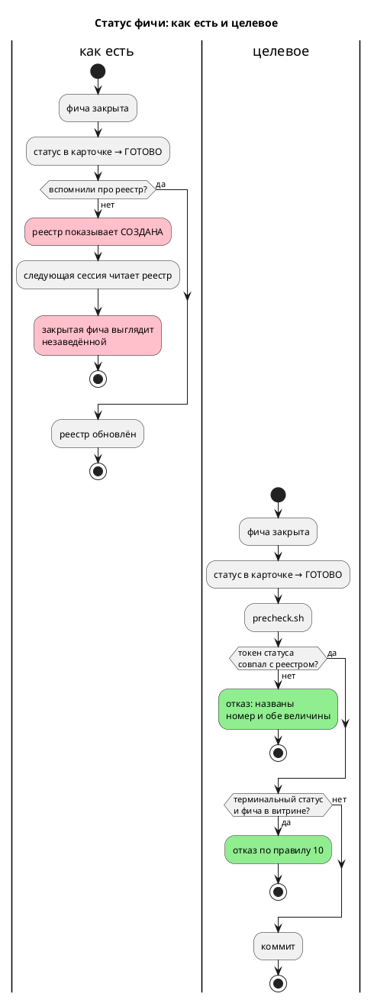

# Фича: Проверка согласованности статуса в реестре и в карточке фичи

- **Номер:** 0177
- **Статус:** ГОТОВО
- **Зависит от:** нет
- **Tier:** proc
- **Связанные issue (анализ):** процессный бэклог `FEATURES.md` (выявлено при закрытии [переименование языка Lam → Takt (крейты, тулы, расширение, документация)](0100-language-rename-takt.md), сверка статусов)

## Стадии жизненного цикла (правило 17)

Все стадии — **разделы этой карточки** (правило 32): «Архитектура (ADR)»,
«Анализ», «Разработка», «Тест-план», «Отчёт о тестировании», «Итог».
Отдельным артефактом остаются только исправления —
[`docs/fixes/`](../fixes/README.md) (при необходимости `0177-YY-*`).

## Краткое описание

Реестр `docs/features/README.md` обновляется вручную при закрытии фичи, и шаг
пропускался: колонка «Статус» показывала ~20 закрытых фич как
`СОЗДАНА`/`РАЗРАБОТКА`. Разовая синхронизация уже сделана — **проверки нет**,
поэтому дрейф вернётся тем же путём.

> Фича зарегистрирована из процессного бэклога (отобрана заказчиком 2026-07-28); далее проходит жизненный цикл по правилу 17.

## Что известно на входе

- **Часть (1) исполнена** (аудит 2026-07-27): статусы реестра и карточек
  совпадают по всем 140 строкам на момент сверки.
- Открытой остаётся **часть (2)** — машинной проверки «статус в реестре ↔ статус
  в карточке» не существует.
- Прецедент машинной проверки документов — `scripts/check-links.py` (python3,
  вызывается из `precheck.sh`).
- Смежно с [согласованность реестров `docs/*/README.md` с файлами на диске](0164-registry-rebuild-gate.md) (тот же класс: реестр
  расходится с истиной) — возможно объединение, решает аналитик.

## Направление решения (наметка, не решение)

- Проверка согласованности по образцу `check-links.py`: разобрать `Статус:` из
  карточек и колонку «Статус» реестра, сверить, отказать при расхождении.
- Без автопочинки: чинить руками безопаснее, чем машинно переписывать реестр.

Окончательный выбор — за стадиями **архитектуры** (ADR) и **анализа**: раздел
выше фиксирует то, что уже проверено, а не предрешает реализацию.

## Документирование (правило 24)

**Не требуется.** Инфраструктура процесса; язык не меняется.

## Архитектура (ADR)

- **Status:** Accepted
- **Date:** 2026-07-29
- **Authors:** Архитектор + системный аналитик
- **Related issues:** [Фича](0177-features-registry-status-gate.md);
  смежные — [согласованность реестров `docs/*/README.md` с файлами на диске](0164-registry-rebuild-gate.md) (реестры против
  диска), [ADR](0149-claude-md-consistency-gate.md#архитектура-adr) и
  [ADR](0146-book-glyph-gate.md#архитектура-adr) (тот же приём: правило + машинная проверка)

### Context

Статус фичи живёт в **двух** местах: поле `- **Статус:**` карточки
`docs/features/XXXX-*.md` и колонка «Статус» реестра
`docs/features/README.md`. Оба обновляются руками при закрытии, и шаг реестра
пропускался: аудит 2026-07-27 нашёл ~20 закрытых фич, показанных как
`СОЗДАНА`/`РАЗРАБОТКА`, и синхронизировал их **разово**.

**Дрейф вернулся за два дня.** Замер-29 по всем **180** строкам:

```
РАСХОЖДЕНИЙ СТАТУСА: 1
  0138: реестр='СОЗДАНА' карточка='ГОТОВО'
```

Фича [измерение покрытия тестами (или удаление чужого `codecov.yml`)](0138-coverage-measurement.md) закрыта полным циклом —
ADR, анализ, две задачи разработки, тест-план, отчёт, раздел «Итог», запись в
`CHANGES.md`, — и отсутствует в витрине `FEATURES.md`. Не обновлена **только**
строка реестра, где она по-прежнему «`СОЗДАНА`, ADR/анализ не заведены (стадия 1)».

Это ровно то, о чём предупреждала карточка: разовая синхронизация без проверки
воспроизводит дрейф тем же путём.

**Наивная сверка непригодна — 98 % ложных.** Прямое сравнение строк даёт
**48** находок из 180, и **47** — шум формы записи:

| Форма | Пример |
|---|---|
| выделение | `**ГОТОВО**` в карточке против `ГОТОВО` в реестре |
| значок | `✅ ГОТОВО` |
| приписка в реестре | `ГОТОВО (тег `v0.5.0`)`, `ГОТОВО (с оговоркой: A5 в CI не проверен)` |
| уточнение в карточке | `**ГОТОВО с оговоркой**` |

Срезание скобок тоже не работает: ячейка 0028 содержит вложенные скобки внутри
кода (`` `S(Модель) = Состояние` ``), и нежадный `\(.*?\)` рвёт её посередине.



### Decision Drivers

1. **Реестр — вход в проект.** По нему выбирают, что сделано и что брать. Строка
   «`СОЗДАНА`, стадия 1» у полностью закрытой фичи заставляет заводить работу
   заново.
2. **Ложное срабатывание убивает проверка** (урок: 73 ложных отказа из 105
   упоминаний). Здесь наивная сверка даёт 47 ложных из 48 — проверка выключили бы
   немедленно.
3. **Правило уже есть, проверки нет.** Правила 10, 17 и 21 задают и набор
   статусов, и связь «терминальный статус ⇒ удалить из витрины». Соблюдение
   держалось на памяти.

### Considered Options

#### Option A. Сравнение ячеек как строк

**Pros:** тривиально.

**Cons:** 47 ложных из 48 (замер). Потребовало бы вычистить форму записи во всех
180 строках и запретить приписки — а приписки полезны (`тег v0.5.0`,
`с оговоркой: A5 в CI не проверен`).

#### Option B. Автопочинка реестра из карточек

Проверка не отказывает, а переписывает колонку.

**Pros:** дрейф исчезает без ручной работы.

**Cons:** машина затирает **приписки**, которые человек вносил осмысленно;
расхождение может означать и ошибку в **карточке** — тогда автопочинка
размножит её в реестр. Карточка предупреждает прямо: «чинить руками безопаснее».

#### Option C. Сверка по **токену статуса** + проверка правила 10

Из обеих ячеек извлекается известный статус (`ГОТОВО`, `СОЗДАНА`, …);
сравниваются токены, а не текст. Дополнительно проверяется связь с витриной.

**Pros:**
- **0 ложных** на 180 строках, 1 истинная находка.
- Форма записи остаётся свободной: выделение, значок и приписка допустимы.
- Неизвестный статус (опечатка, выдуманное слово) ловится тем же механизмом.
- Правило 10 («терминальный статус ⇒ фичи нет в витрине») становится проверяемым.

**Cons:**
- Требует держать список статусов в коде проверки — он же становится
  исполняемым определением набора.

### Decision

Принимается **Option C**. Проверка `scripts/check-feature-status.py` проверяет:

1. **Существование в обе стороны** — у строки реестра есть карточка, у карточки
   есть строка. Это предусловие сравнения, а не самоцель: полноценная сверка
   реестров с диском — предмет [согласованность реестров `docs/*/README.md` с файлами на диске](0164-registry-rebuild-gate.md),
   чья область шире (все `docs/*/README.md`).
2. **Статус из известного набора** в обоих местах.
3. **Совпадение токенов** статуса.
4. **Правило 10**: терминальный статус (`ГОТОВО`/`ОТМЕНА`) ⇒ фичи **нет** в
   таблице `FEATURES.md`; нетерминальный ⇒ фича **есть** в таблице.

Автопочинки нет (Option B отвергнута). Самопроверка `--self-test` подкладывает
текст каждого класса.

**Набор статусов:** `СОЗДАНА`, `АРХИТЕКТУРА`, `АНАЛИЗ`, `РАЗРАБОТКА`,
`ТЕСТИРОВАНИЕ`, `ИСПРАВЛЕНИЕ`, `ЗАБЛОКИРОВАНА`, `ГОТОВО`, `ОТМЕНА` (правило 17)
плюс **`ЗАМОРОЖЕНА`**.

**`ЗАМОРОЖЕНА` в правиле 17 отсутствует.** Она введена решением заказчика для
[вынос оставшихся нарушителей размера модуля (ядро семантики + пришпиленные)](0099-module-size-core.md) и описана в `FEATURES.md`, но в свод
не попала. Проверка её принимает (иначе отказал бы на законной строке), а
несоответствие свода практике заведено кандидатом — правка `docs/RULE.md` есть
изменение процесса и решается заказчиком, а не проверкой.

### Consequences

#### Положительные

- Реестр перестаёт молча отставать от карточек; найденная строка 0138 исправлена.
- Правило 10 впервые проверяется машиной, а не памятью.
- Опечатка в статусе («готво») ловится сразу.

#### Отрицательные / Action items

- **A-1. Проверка не судит, какая из двух величин верна.** При расхождении он
  называет обе и требует решения человека — это осознанно (Option B).
- **A-2. Список статусов дублирует правило 17.** Смягчение: в коде проверки стоит
  ссылка на правило, а расхождение с ним (`ЗАМОРОЖЕНА`) названо явно.
- **A-3. Область не расширена до прочих реестров** (`docs/features/README.md` и др.) —
  это [согласованность реестров `docs/*/README.md` с файлами на диске](0164-registry-rebuild-gate.md). Проверка уже считает
  существование в обе стороны, поэтому 0164 после него дешевеет.

#### Acceptance criteria

1. Расхождение статуса (карточка `ГОТОВО`, реестр `СОЗДАНА`) валит `precheck.sh`
   с указанием номера и обеих величин.
2. Формы `**ГОТОВО**`, `✅ ГОТОВО`, `ГОТОВО (тег …)` ложного отказа **не** дают.
3. Неизвестный статус валит проверка.
4. Нарушение правила 10 (закрытая фича осталась в витрине) валит проверка.
5. Строка 0138 исправлена; текущее дерево проверка проходит, ложных — **ноль**.
6. Каждый класс проверен мутацией.

## Анализ

- **Дата:** 2026-07-29
- **Роль:** системный аналитик

### 1. Дрейф вернулся за два дня — тезис карточки подтверждён

Карточка сообщала: разовая синхронизация выполнена (аудит 2026-07-27, «статусы
совпадают по всем 140 строкам»), проверки нет, дрейф вернётся. Замер-29 по
**180** строкам:

```
РАСХОЖДЕНИЙ СТАТУСА: 1
  0138: реестр='СОЗДАНА' карточка='ГОТОВО'
```

[измерение покрытия тестами (или удаление чужого `codecov.yml`)](0138-coverage-measurement.md) закрыта **полным циклом**: ADR,
анализ, две задачи разработки, тест-план, отчёт, раздел «Итог», запись в
`CHANGES.md`; в витрине `FEATURES.md` её нет. Не обновлена **только** строка
реестра — там до сих пор «`СОЗДАНА`, ADR/анализ не заведены (стадия 1)».

Между аудитом и замером прошло **два дня**. Это и есть аргумент за проверка: ручная
синхронизация лечит состояние, а не причину.

### 2. Почему наивная сверка непригодна: 47 ложных из 48

Прямое сравнение текста ячеек даёт **48** находок из 180 строк, из которых
**47** — шум формы записи:

| Форма | Пример | Сколько |
|---|---|---|
| выделение | `**ГОТОВО**` против `ГОТОВО` | ~35 |
| значок | `✅ ГОТОВО` | 5 |
| приписка в реестре | `` ГОТОВО (тег `v0.5.0`) ``, `ГОТОВО (с оговоркой: A5 в CI не проверен)` | 5 |
| уточнение в карточке | `**ГОТОВО с оговоркой**` (0037) | 1 |

**Срезание скобок тоже не работает.** Ячейка 0028 —
`` ГОТОВО (CC-018; вскрыт дефект трансляции `S(Модель) = Состояние`) `` — содержит
скобки **внутри кода**, и нежадный `\(.*?\)` рвёт её посередине: при первой
попытке замера это дало фантомный статус `'ГОТОВО = Состояние`)'`.

**Решение — сравнивать токен статуса**, а не текст: из ячейки извлекается
известное слово (`ГОТОВО`, `СОЗДАНА`, …). Замер токенной сверки: **1 находка,
0 ложных** на 180 строках. Приписки при этом остаются законными — а они полезны
(`тег v0.5.0` фиксирует границу версии, «с оговоркой» — незакрытый критерий).

### 3. Третье отношение: правило 10

Статус связан не только с карточкой, но и с витриной: правила 10 и 21 требуют
удалять из `FEATURES.md` фичу с терминальным статусом (`ГОТОВО`/`ОТМЕНА`) и,
наоборот, держать там все незакрытые. Отношение машинно проверяемо и до сих пор
держалось на памяти — включаем в проверка.

Замер на текущем дереве: нарушений нет (32 строки витрины против 180 реестра),
но проверка добавляется тем же обходом почти бесплатно.

### 4. Почему без автопочинки

Карточка предлагала «без автопочинки: чинить руками безопаснее». Анализ
подтверждает двумя доводами:

1. машина затёрла бы **приписки** реестра, внесённые осмысленно;
2. расхождение не говорит, **какая** сторона неверна: ошибка может быть и в
   карточке (например, статус проставлен раньше закрытия). Автопочинка «из
   карточки в реестр» размножила бы такую ошибку.

### 5. Находка сверх карточки: `ЗАМОРОЖЕНА` вне свода

Проверка обязан знать набор статусов. Правило 17 перечисляет: `СОЗДАНА`,
`АНАЛИЗ`, `АРХИТЕКТУРА`, `РАЗРАБОТКА`, `ТЕСТИРОВАНИЕ`, `ИСПРАВЛЕНИЕ`, `ГОТОВО`,
`ОТМЕНА`, `ЗАБЛОКИРОВАНА`. Фактически в реестре и витрине используется ещё один —
**`ЗАМОРОЖЕНА`** ([вынос оставшихся нарушителей размера модуля (ядро семантики + пришпиленные)](0099-module-size-core.md), решение
заказчика 2026-07-28), описанный только в `FEATURES.md`.

Проверка его принимает — иначе отказал бы на законной строке. Несоответствие свода
практике **заведено кандидатом**: правка `docs/RULE.md` есть изменение процесса и
решается заказчиком, а не проверкой.

### 6. Соотношение с фичей

Карточка допускала объединение с [согласованность реестров `docs/*/README.md` с файлами на диске](0164-registry-rebuild-gate.md)
(«реестр расходится с истиной»). Анализ: **не объединять**.

- 0177 — предикат **статуса** и только для реестра фич.
- 0164 — предикат **существования** и для **всех** реестров стадий
  (`docs/features/README.md`, `analyze`, `development`, `tests`, `reports`, `fixes`).

Замер на текущем дереве: 180 строк реестра фич ↔ 180 карточек, сирот нет ни в
одну сторону. Проверка попутно считает существование в обе стороны (это
предусловие сравнения статусов), поэтому 0164 после него **дешевеет**, но не
исчезает: её область шире на шесть реестров.

### 7. Обратная совместимость (правило 11)

Кода и языка не касается. Требований к окружению не добавилось (`python3` уже
нужен предкоммиту). Формы записи статусов в реестре и карточках **не меняются** —
токенная сверка принимает все существующие.

### 8. Документирование (правило 24) и редакторский слой (правило 29)

- **`book/`: не требуется** — язык не меняется.
- **Правило 29: не применимо.**

### 9. Риски

- **Р-1. Список статусов в коде проверки дублирует правило 17.** Смягчение: ссылка
  на правило в коде и явно названное расхождение (`ЗАМОРОЖЕНА`).
- **Р-2. Токенная сверка примет ячейку, где статус упомянут вскользь**
  (например, «пришла на смену ОТМЕНА-фиче»). Смягчение: несколько статусов
  в одной ячейке — тоже отказ («несколько статусов сразу»), а одиночное
  упоминание в колонке статуса маловероятно и будет замечено ревью.
- **Р-3. Проверка не судит, какая сторона верна** (A-1 ADR) — осознанно.

### 10. План разработки

| Подзадача | Содержание |
|---|---|
| [проверка согласованности статуса в реестре и в карточке фичи](0177-features-registry-status-gate.md#разработка) | Проверка `check-feature-status.py`, подключение к предкоммиту, правка строки 0138 |

## Разработка

### Задача

#### Что было

Статус фичи живёт в двух местах — поле карточки и колонка реестра, — оба
обновляются руками, и шаг реестра пропускался. Разовая синхронизация 2026-07-27
продержалась **два дня**: замер-29 нашёл фичу, закрытую полным
циклом, но показанную в реестре как «`СОЗДАНА`, стадия 1».

#### Что сделано

**`scripts/check-feature-status.py`** — четыре проверки:

| Проверка | Что ловит |
|---|---|
| существование в обе стороны | строка без карточки, карточка без строки |
| статус из известного набора | опечатка (`ГОТВО`), выдуманное слово |
| совпадение **токенов** статуса | реестр отстал от карточки |
| правило 10 | закрытая фича осталась в витрине; открытой в витрине нет |

**Сравниваются токены, а не текст.** Наивная сверка даёт **47 ложных из 48**:
`**ГОТОВО**`, `✅ ГОТОВО`, `` ГОТОВО (тег `v0.5.0`) ``, `**ГОТОВО с оговоркой**` —
всё это законные формы. Срезание скобок тоже не годится: ячейка 0028 содержит
скобки **внутри кода** (`` `S(Модель) = Состояние` ``), и нежадный `\(.*?\)` рвёт
её посередине. Токенная сверка: **1 находка, 0 ложных** на 180 строках.

**Автопочинки нет намеренно** (Option B ADR отвергнута): машина затёрла бы
осмысленные приписки реестра, а расхождение может означать ошибку и в **карточке**
— тогда автопочинка «из карточки в реестр» её размножила бы.

**`ЗАМОРОЖЕНА` принимается, хотя правила 17 её не знает** — она введена
решением заказчика для 0099 и описана в `FEATURES.md`. Отказ на ней был бы
отказом на законной строке; несоответствие свода практике заведено кандидатом.

**Самопроверка `--self-test`** подкладывает текст каждого из четырёх классов и
проверяет **пять законных форм** записи. Образцы законных форм взяты **из
реального реестра** (включая ячейку 0028 со скобками в коде), а не придуманы —
урок фичи, где упрощённый образец зеленел, пока настоящая мутация проходила
мимо проверки.

**`scripts/precheck.sh`** — обе команды в блоке `require_tool python3`,
самопроверка первой.

**Правка реестра:** строка 0138 приведена к `ГОТОВО` со ссылками на фактически
существующие артефакты (ADR, анализ, тест-план, отчёт, dev 01–02), а не просто
переписанным словом.

#### Проверки

Все критерии приёмки ADR — мутациями (таблица в
[отчёте](0177-features-registry-status-gate.md#отчёт-о-тестировании));
`./scripts/precheck.sh` — код возврата `0`.

## Тест-план

### Область и цель

Проверяется, что проверка ловит расхождение статуса и нарушение правила 10, **не**
даёт ложных отказов на принятых формах записи и что найденная строка исправлена.

Критерии приёмки ADR: A1 (расхождение), A2 (законные формы), A3 (неизвестный
статус), A4 (правило 10), A5 (чистое дерево, ноль ложных), A6 (взведённость).

### Проверки (условие → ожидаемый результат)

| # | Проверка | Предусловие | Ожидаемый результат | Ссылка |
|---|---|---|---|---|
| T1 | Реестр отстал от карточки | статус в реестре заменён на `СОЗДАНА` | код `1`, названы номер и обе величины | A1 |
| T2 | **Законные формы** | `✅ **ГОТОВО** (гейт зелён)` в реестре против `**ГОТОВО**` в карточке | код `0` — ложного отказа нет | A2 |
| T3 | Неизвестный статус | `ГОТВО` | код `1` | A3 |
| T4 | Правило 10 | закрытая фича дописана в таблицу `FEATURES.md` | код `1` с указанием правила | A4 |
| T5 | Чистое дерево | после правки строки 0138 | код `0`, «расхождений нет» | A5 |
| T6 | Самопроверка | — | код `0`, «4 класса ловятся, 5 законных форм — нет» | A6 |
| T7 | Предкоммит | дерево чистое | `./scripts/precheck.sh` → код `0` | A5 |

**T2 — определяющая проверка.** Наивная сверка даёт 47 ложных из 48; проверка,
требующий вычистить форму записи во всех 180 строках и запретить приписки, был бы
отвергнут. T2 фиксирует, что все существующие формы законны.

**Образцы законных форм берутся из реального реестра**, включая ячейку 0028 со
скобками внутри кода: упрощённый образец проверял бы упрощение.

### Разбивка проверок по функциональности

| Функциональность | Статус | Комментарий |
|---|---|---|
| `check-feature-status.py` | ✅ | T1–T6 |
| Реестр `docs/features/README.md` | ✅ | строка 0138 исправлена |
| Предкоммит | ✅ | T7 |
| CI | ✅ | правок не требует |
| Язык, компилятор, симулятор, LSP | — | не затронуты |

<!-- Легенда: ✅ пройдено · ❌ провалено · ⬜ не проверялось · — не применимо -->

### Тестовые данные и окружение

- Мутации вносятся в копию реестра/витрины с последующим откатом.
- Команды: `python3 scripts/check-feature-status.py [--self-test]`,
  `./scripts/precheck.sh`.

## Отчёт о тестировании

### Резюме

**Пройдено, фича готова к закрытию (`ГОТОВО`).** Все 7 проверок тест-плана
зелёные, `./scripts/precheck.sh` — код возврата `0`. Найденное расхождение
(строка 0138) исправлено; отдельных исправлений не потребовалось.

Окружение: macOS (Darwin 25.5.0), `python3`.

### Фактические результаты по проверкам

| # | Проверка | Результат | Факт |
|---|---|---|---|
| T1 | Реестр отстал от карточки | ✅ | `фича 0146: статус разошёлся: реестр=СОЗДАНА, карточка=ГОТОВО` |
| T2 | **Законные формы** | ✅ | `✅ **ГОТОВО** (гейт зелён)` — код `0`, ложного отказа нет |
| T3 | Неизвестный статус | ✅ | `в реестре неизвестный статус: 'ГОТВО'` |
| T4 | Правило 10 | ✅ | `статус ГОТОВО, но фича осталась в таблице FEATURES.md` |
| T5 | Чистое дерево | ✅ | «проверено карточек, расхождений нет» |
| T6 | Самопроверка | ✅ | «4 класса ловятся, 5 законных форм — нет» |
| T7 | Предкоммит | ✅ | код `0` |

### Что нашёл первый прогон

**Одну строку** — и это ровно то, что предсказывала карточка.

[измерение покрытия тестами (или удаление чужого `codecov.yml`)](0138-coverage-measurement.md) закрыта **полным циклом**: ADR,
анализ, две задачи разработки, тест-план, отчёт, раздел «Итог», запись в
`CHANGES.md`; в витрине `FEATURES.md` её нет. Не обновлена **только** строка
реестра — «`СОЗДАНА`, ADR/анализ не заведены (стадия 1)».

**Аудит карточки от 2026-07-27 утверждал полное совпадение по 140 строкам.**
Замер сделан 2026-07-29. То есть дрейф вернулся за **два дня** — ручная
синхронизация лечит состояние, а не причину.

Строка исправлена не переписыванием слова, а сверкой: проставлены ссылки на
**фактически существующие** артефакты (проверено `ls`).

### Урок: цена ложного срабатывания измеряется до выбора конструкции

Наивное сравнение ячеек даёт **48** находок из 180 строк, из которых **47** —
шум формы записи: `**ГОТОВО**`, `✅ ГОТОВО`, `` ГОТОВО (тег `v0.5.0`) ``,
`**ГОТОВО с оговоркой**`. Проверка с 98 % ложных отказов не был бы принят, а его
«починка» означала бы вычистить форму записи во всех 180 строках и запретить
приписки — при том что приписки полезны (граница версии, незакрытый критерий).

**Попытка обойтись срезанием скобок провалилась на реальных данных.** Ячейка
0028 — `` ГОТОВО (CC-018; вскрыт дефект трансляции `S(Модель) = Состояние`) `` —
содержит скобки **внутри кода**, и нежадный `\(.*?\)` дал фантомный статус
`'ГОТОВО = Состояние`)'`. Сработала только сверка по **токену** статуса:
**1 находка, 0 ложных**.

Это третий случай подряд (0146 — `⌘` в шрифте, 0149 — 73 ложных пути, 0177 — 47
ложных статусов), где конструкция проверки определялась **замером ложных
срабатываний**, а не замыслом. Правило, которое из этого следует: прежде чем
выбирать критерий проверки, прогони наивный вариант по реальным данным и посчитай
шум.

### Находка сверх карточки: `ЗАМОРОЖЕНА` вне свода

Проверке нужен набор статусов. Правило 17 перечисляет девять; в реестре и витрине
используется десятый — **`ЗАМОРОЖЕНА`** (решение заказчика
2026-07-28), описанный только в `FEATURES.md`. Проверка его принимает — иначе отказал
бы на законной строке. Несоответствие свода практике **заведено кандидатом**:
правка `docs/RULE.md` есть изменение процесса и решается заказчиком.

### Решение по объединению с 0164

Карточка допускала слияние с [согласованность реестров `docs/*/README.md` с файлами на диске](0164-registry-rebuild-gate.md).
**Не объединять:** у 0177 предикат **статуса** и один реестр, у 0164 — предикат
**существования** и **все** реестры стадий (`adr`, `analyze`, `development`,
`tests`, `reports`, `fixes`). Замер: 180 строк ↔ 180 карточек, сирот нет.
0177 попутно считает существование в обе стороны, поэтому 0164 **дешевеет**, но
её область шире на шесть реестров.

### Выводы и дальнейшие шаги

- Фича закрывается; исправления не требуются.
- **Правило 28:** запись процессного бэклога о синхронизации реестра исчерпана —
  часть (1) была исполнена аудитом, часть (2) закрыта этой фичей.
- **Заведён кандидат:** `ЗАМОРОЖЕНА` не описана в правиле 17 свода.

## Итог (что сделано)

**Реестр фич больше не отстаёт от карточек молча.**
`scripts/check-feature-status.py` (+ `--self-test`) в `precheck.sh` сверяет
существование в обе стороны, принадлежность статуса известному набору,
**совпадение токенов** статуса в карточке и реестре и **правило 10**
(терминальный статус ⇒ фичи нет в витрине, и наоборот).

**Тезис карточки подтверждён замером:** разовая синхронизация 2026-07-27
(«совпадают все 140 строк») продержалась **два дня** — 2026-07-29 нашлась фича
[измерение покрытия тестами (или удаление чужого `codecov.yml`)](0138-coverage-measurement.md), закрытая полным циклом, но показанная как
«`СОЗДАНА`, стадия 1». Строка исправлена сверкой с фактическими артефактами.

**Конструкцию определил замер ложных срабатываний:** наивная сверка текста
даёт **47 ложных из 48** (`**ГОТОВО**`, `✅ ГОТОВО`, приписки в скобках), а
срезание скобок ломается на ячейке 0028 со скобками внутри кода. Сверка по
**токену** статуса даёт **1 находку, 0 ложных** на 180 строках — и оставляет
формы записи свободными.

**Автопочинки нет намеренно:** машина затёрла бы осмысленные приписки, а
расхождение может означать ошибку и в **карточке**.

**Находка сверх карточки:** статус `ЗАМОРОЖЕНА` используется в реестре и витрине,
но в правиле 17 свода отсутствует — проверка его принимает, несоответствие заведено
кандидатом. **Решение по 0164:** не объединять — там предикат существования и
шесть других реестров.

Детали: [отчёт](0177-features-registry-status-gate.md#отчёт-о-тестировании),
[ADR](0177-features-registry-status-gate.md#архитектура-adr),
[анализ](0177-features-registry-status-gate.md#анализ).
