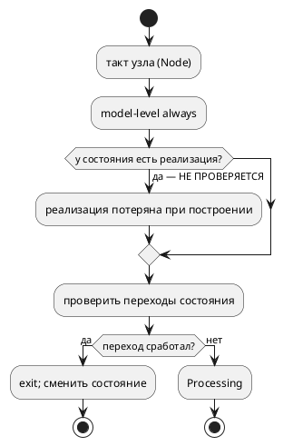
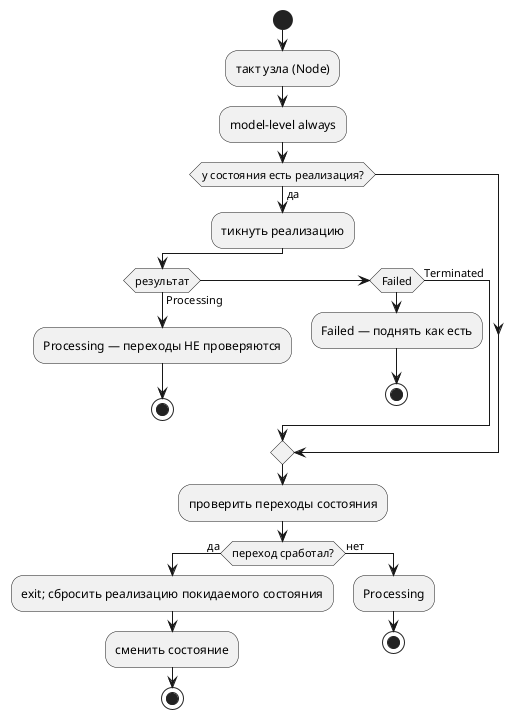

# Фича: Симулятор исполняет реализацию состояния с переходом next

- **Номер:** 0181
- **Статус:** ГОТОВО
- **Зависит от:** нет
- **Tier:** 2
- **Связанные issue (анализ):** закрытие исправления [симулятор не исполняет композицию с переходом `next`](../fixes/0057-01-sim-composition-next.md); разблокирует фичу [корпусной SV-транслируемый пример на последовательную композицию `+`](0166-sv-example-sequential-composition.md)

## Стадии жизненного цикла (правило 17)

Все стадии — **разделы этой карточки** (правило 32): «Архитектура (ADR)»,
«Анализ», «Разработка», «Тест-план», «Отчёт о тестировании», «Итог».
Отдельным артефактом остаются только исправления —
[`docs/fixes/`](../fixes/README.md) (при необходимости `0181-YY-*`).

## Краткое описание

Симулятор — эталон поведения проекта, но **композицию, объявленную реализацией
состояния с переходом, он не исполняет вовсе**: `start P = A + B { next Done; }`
уходит по `next` на такте 1, не тикнув ни одного шага. Фича приводит симулятор
к эталону цели `c` (переход берётся в ветви `is_done`) и закрывает исправление
[симулятор не исполняет композицию с переходом `next`](../fixes/0057-01-sim-composition-next.md).

> Фича зарегистрирована по решению заказчика (2026-07-29) как способ закрыть
> крупный исправление отдельной работой — принятая в проекте практика (0020-01 закрыт
> фичей — в объёме 0060, 0041-01 — в объёме 0065). Далее проходит
> жизненный цикл по правилу 17.

## Что известно на входе (проба 2026-07-29, `takt-sim -n 6`)

Модель `var stage: u8 := 0; model A { … stage := 1 … } model B { … stage := 2 … }`:

| Форма | Трасса симулятора | Эталон цели `c` |
|---|---|---|
| `start P = A + B { next Done; } state Done;` | `[P] stage=0`, `Terminated` на такте 1 | `stage` = 1, 1, 2, 2, затем `Done` |
| `start P = A + B;` | `stage` = 1, **0**, 2, затем `[—]` без значений | то же |

То есть дефектов **три**, а не один:

1. **композиция теряется при построении**, если состояние-реализация несёт
   переход (`next` или `ref`);
2. **шаги `+` не делят контекст** — значение, записанное шагом A, шагу B не
   видно (провал `stage` в 0 на такте переключения);
3. **завершившаяся композиция перестаёт наблюдаться** — `get_value` адресует
   `units[index]`, а по завершении `index == units.len()`.

## Направление решения (наметка, не решение)

Реализация состояния строится **дочерним юнитом** с контекстом узла в качестве
общего родителя; такт узла тикает её и берёт переход только по её завершении.
Окончательный выбор — за ADR.

`takt-sim/src/unit/mod.rs` — **988 строк при лимите 1000**
(`scripts/check-module-size.sh`), поэтому работа обязана начинаться с деления
модуля (правило `docs/CODE.md`, приёмы фичи).

## Документирование (правило 24)

**Не требуется.** Язык не меняется: приводится в соответствие уже
зафиксированному эталону поведение **инструмента**. Нормативная семантика `+`
задана целью `c` (`generate_concat_tick`/`generate_extend_transition`) и
подтверждена сверкой с `sv`; симулятор ей не соответствовал.

## Архитектура (ADR)

- **Status:** Accepted
- **Date:** 2026-07-29
- **Authors:** Архитектор + Аналитик
- **Related issues:** [Фича](0181-sim-state-implementation-tick.md); закрывает [исправление](../fixes/0057-01-sim-composition-next.md); разблокирует [фичу](0166-sv-example-sequential-composition.md); наследует [ADR](0057-sv-sequential-composition.md#архитектура-adr)

### Context

ADR объявил эталоном последовательной композиции `+` **две** реализации —
цель `c` (`generate_concat_tick`) и симулятор (`Unit::Sequential`), — предполагая
их совпадение. Они не совпадают: симулятор композицию, объявленную **реализацией
состояния**, при построении **теряет**.

Проба 2026-07-29 (`takt-sim -n 6`, модель `A` пишет `stage := 1`, `B` — `stage := 2`):

| Форма | Симулятор | Цель `c` (эталон) |
|---|---|---|
| `start P = A + B { next Done; } state Done;` | `[P] stage=0`, `Terminated` на такте 1 | 1, 1, 2, 2, `Done` |
| `start P = A + B;` | 1, **0**, 2, затем `[—]` | 1, 1, 2, 2 |

Корень — в `takt-sim/src/unit/builder.rs`, функция `build_impl`: реализация
состояния строится **только** по ветви `single_compound` — когда модель содержит
ровно одно состояние-реализацию **без переходов и без `next`**. Во всех прочих
случаях управление уходит в `build_node`, а `build_node` поле `implements`
состояния **не читает вовсе**. Узел остаётся с одним безусловным переходом и
закономерно уходит по нему на такте 1.

Двум другим расхождениям та же цена одного решения:

- ветвь `Extend::Concatenation` передаёт `shared_parent` **как есть**, тогда как
  `Extend::Parallel` при `None` общий контекст **создаёт**, — поэтому шаги `+` не
  делят переменные (провал `stage` в 0);
- `Context::get_value` у `Sequential` адресует `units[index]`, а по завершении
  `index == units.len()` — наблюдение обрывается (`[—]`).

#### Поток «как есть»

#### Целевой поток

### Decision Drivers

1. **Эталон один, а не два.** Пока симулятор и цель `c` расходятся, «эталонное
   поведение `+`» — пустой звук: любая новая цель вправе сослаться на любую из
   двух реализаций. Нормативной остаётся цель `c` (её вывод сверен с `sv`
   потактово), симулятор обязан ей соответствовать.
2. **Дефект молчалив.** Ни одна проверка не отказывает: модель компилируется,
   симулируется, завершается. Именно поэтому он дожил — трасса просто короче,
   чем должна быть.
3. **Правка ограничена симулятором.** Порождённый код (`c`/`rust`/`st`/`sv`)
   верен и меняться не должен — иначе фича вышла бы за свои границы.
4. **Лимит размера модуля.** `takt-sim/src/unit/mod.rs` — 988 строк при лимите
   1000: любая содержательная правка обязана начинаться с деления модуля.

### Considered Options

#### Option A. Поле `state_impls` в `UnitKind::Node`

Реализация каждого состояния-реализации строится дочерним `Unit` и кладётся в
`HashMap<String, Rc<RefCell<Unit>>>` внутри существующего варианта `Node`.
Контекст узла передаётся ей общим родителем.

**Pros:**
- изменение **аддитивно**: все 63 места разбора `UnitKind::Node { .. }` по
  `takt-sim/src` продолжают компилироваться без правок;
- один механизм закрывает **все три** расхождения: общий контекст решает провал
  значения, а наблюдение через узел — обрыв после завершения;
- ветвь `single_compound` (горячий путь корпуса: `stacker`, `elevator_mini`)
  остаётся нетронутой — регресс невозможен по построению.

**Cons:**
- спуск в реализацию нужно добавить в каждый обход узла (`get_value`/`set_value`/
  `dump`/`execution`/`collect_active_states`/`clock`/`every`/`state_io`/
  `viewport`) — забытый обход даёт молчаливую потерю наблюдения.

#### Option B. Новый вариант `UnitKind::Implemented { node, inner }`

Обёртка: узел с переходами плюс вложенная композиция отдельным вариантом.

**Pros:**
- разделение обязанностей явнее, чем поле внутри `Node`.

**Cons:**
- новый вариант перечисления **обязан** быть разобран во всех исчерпывающих
  `match` по `UnitKind` — правка расходится по всему крейту, включая пути, к
  дефекту отношения не имеющие;
- обёртка удваивает вопрос «чей это контекст»: узел и композиция оказываются
  соседями, а не родителем и ребёнком, — и общий контекст пришлось бы
  синтезировать третьей сущностью.

#### Option C. Развернуть состояние-реализацию в `Sequential` из [реализация, узел-приёмник]

Понизить `start P = A + B { next Done; }` к последовательности «композиция, затем
узел с переходами».

**Pros:**
- ни новых полей, ни новых вариантов.

**Cons:**
- **семантически неверно**: переходы состояния `P` (`ref`-рёбра помимо `next`)
  обязаны проверяться, только когда композиция завершена, а не после неё в новом
  такте — понижение добавило бы такт, которого нет в цели `c`;
- `enter`/`exit`/`always` состояния `P` и его инварианты потеряли бы владельца.

### Decision

Принимается **Option A**.

Решающий довод — аддитивность: дефект в симуляторе, и цена его починки не должна
раскатываться по крейту (Option B) или менять потактовую семантику (Option C).
Общий родительский контекст — не побочная деталь, а суть: именно он делает
`stage` одной переменной для всех шагов и для наблюдателя, снимая сразу два
расхождения из трёх.

Нормативным остаётся поведение цели `c`: **переход берётся в ветви `is_done`** —
то есть на том же такте, на котором завершилась реализация, а не на следующем.

Порядок наблюдения: **собственный контекст узла — первым**, реализация — после.
Shared-переменные лежат в контексте узла, и обратный порядок дал бы наблюдателю
копию из ветви вместо общего значения.

### Consequences

#### Положительные

- исправление закрыт; эталонов у `+` снова один, а не два;
- становится возможной **тройная** сверка sim↔C↔SV (сегодня — только SV↔C);
- фича [корпусной SV-транслируемый пример на последовательную композицию `+`](0166-sv-example-sequential-composition.md)
  разблокирована: корпусной пример на `+` сможет получить полноценный **контракт
  сценария**, а не исключение;
- `takt-sim/src/unit/mod.rs` выходит из-под лимита размера с запасом.

#### Отрицательные / Action items

- меняется наблюдаемая трасса моделей, чьё состояние-реализация несёт переход. В
  корпусе таких два — `elevator.takt` и `extend_complex.takt`, **оба исключены**
  из `examples_scenario_tests` с причиной, то есть контрактов не ломают. Порядок
  вывода `takt-sim` по ним станет длиннее — это и есть исправление;
- порождённый код не затрагивается: `examples/generated/**` обязан остаться
  байт-в-байт прежним. Проверяется проверкой воспроизводимости и `git diff`;
- **риск забытого обхода**: спуск в реализацию нужен в девяти местах. Ловится
  значенческими тестами (наблюдение переменной внутри реализации), а не чтением.

#### Acceptance criteria

1. `start P = A + B { next Done; } state Done;` в симуляторе даёт `stage` =
   1, 1, 2, 2 и завершение — байт-в-байт трасса цели `c`.
2. `start P = A + B;` не даёт провала значения в 0 на такте переключения шага и
   наблюдается после завершения композиции.
3. Сверки `conformance_sv_tests::sequential_composition_matches_generated_c` и
   `parallel_step_inside_concatenation_matches_generated_c` расширены до
   **тройных** (sim ≡ C ≡ SV) и зелены.
4. Реализация, не завершающаяся никогда, перехода не даёт (контрпример).
5. `examples/generated/**` не изменился; `./scripts/precheck.sh` зелёный,
   включая `scripts/check-module-size.sh` без новых записей в
   `scripts/module-size-baseline.txt`.

## Анализ

### Цель и контекст

Привести симулятор к нормативному поведению последовательной композиции `+`,
заданному целью `c`, и закрыть исправление
[симулятор не исполняет композицию с переходом `next`](../fixes/0057-01-sim-composition-next.md). ADR выбрал
**Option A** — реализация состояния как дочерний юнит узла с общим контекстом.

Работа целиком в крейте `takt-sim`. Крейт `takt-lang` (семантика, генераторы) не
затрагивается: порождённый код верен и обязан остаться байт-в-байт прежним.

### Зависимости фичи (правило 17/19)

- **Зависит от:** нет. Правка локальна для `takt-sim`; ни одна незакрытая фича
  её не блокирует.
- **Влияние на порядок разработки:** завершение **разблокирует**
  [корпусной SV-транслируемый пример на последовательную композицию `+`](0166-sv-example-sequential-composition.md) — корпусной
  SV-транслируемый пример на `+` сможет получить контракт сценария в
  `examples_scenario_tests`, а не исключение. В таблице `FEATURES.md` 0181
  ставится **выше** 0166, а 0166 получает «Зависит от: 0181» и статус
  `ЗАБЛОКИРОВАНА` до её закрытия.

### Разбор кода (что именно сломано)

| # | Место | Что делает | Почему неверно |
|---|---|---|---|
| Д1 | `takt-sim/src/unit/builder.rs`, `build_impl` | ветвь `single_compound` строит реализацию **только** при одном состоянии-реализации без `references` и без `next` | во всех прочих случаях уходит в `build_node`, который поле `implements` состояния не читает — композиция теряется |
| Д2 | там же, `build_extend`, ветвь `Extend::Concatenation` | передаёт `shared_parent` как есть | `Extend::Parallel` при `None` общий контекст **создаёт**; шаги `+` его не получают и не делят переменные |
| Д3 | `takt-sim/src/unit/mod.rs`, `Context::get_value` для `Sequential` | читает `units[index]` | по завершении `index == units.len()` → `None`, наблюдение обрывается |

Д1 — причина симптома из исправления; Д2 и Д3 — «дополнительно наблюдаемые»
расхождения из того же исправления, вскрытые повторной пробой 2026-07-29.

### Требования и проверяемые условия

- **R1. Переход берётся по завершении реализации.** Пока реализация текущего
  состояния возвращает `Processing`, переходы состояния **не проверяются**.
  Эталон — цель `c`: переход эмитится в ветви `is_done`.
- **R2. Такт не добавляется.** Переход берётся на **том же** такте, на котором
  реализация завершилась, а не на следующем. Иначе трасса симулятора станет
  длиннее трассы `c` на один такт при каждом переходе.
- **R3. Ошибка реализации — ошибка узла.** `Failed(_)` дочернего юнита
  поднимается как есть (правило R5 ADR: ошибка ребёнка делает такт
  недостоверным).
- **R4. Шаги `+` делят контекст.** Переменная, записанная одним шагом, видна
  следующему и наблюдателю — как shared-переменная в цели `c`.
- **R5. Наблюдение переживает завершение.** Значение читается и после того, как
  композиция отработала все шаги.
- **R6. Повторный вход не перезапускает композицию.** При выходе из
  состояния-реализации и повторном входе цепочка застаёт себя отработавшей и
  отпускает `next` немедленно. Контракт снят **с эталона**, а не придуман:
  в цели `c` вход в состояние композицию не переинициализирует —
  `generate_concat_item_init` зовётся только при продвижении шага, а первый шаг
  инициализируется однажды в `_init`. Перезапуск в симуляторе был бы
  «улучшением», молча расходящимся с порождённым кодом.
- **R7. Горячий путь не тронут.** Модели вида `start X = A | B;` (ветвь
  `single_compound`: `stacker`, `elevator_mini`) строятся и тикают как прежде.
- **R8. Порождённый код неизменен.** `examples/generated/**` после прогона
  `precheck.sh` не даёт диффа.

### Критерии приёмки и способ проверки

| # | Критерий | Способ проверки |
|---|---|---|
| A1 | `start P = A + B { next Done; }` даёт `stage` = 1, 1, 2, 2 и завершение | значенческий тест `takt-sim/tests/sim/sequential_composition_tests.rs` + сверка с пришпиленным эталоном C |
| A2 | то же во вложенной модели (`model P { start Q = A + B { next Done; } … } start R = P;`) | тот же файл тестов |
| A3 | `start P = A + B;` не проваливает значение в 0 и наблюдается после завершения | тот же файл тестов (R4, R5) |
| A4 | `(B \| C)` внутри `+` совпадает с C | расширение `conformance_sv_tests::parallel_step_inside_concatenation_matches_generated_c` до тройной сверки |
| A5 | тройная сверка sim ≡ C ≡ SV на `A + B` | расширение `conformance_sv_tests::sequential_composition_matches_generated_c` |
| A6 | незавершающаяся реализация перехода не даёт (контрпример) | значенческий тест: бюджет тактов исчерпан, состояние не сменилось |
| A7 | повторный вход начинает композицию сначала | значенческий тест с возвратом в состояние-реализацию |
| A8 | `stacker`/`elevator_mini` без регресса | `examples_scenario_tests`, `scripts/run_simulations.sh`, проверка тестбенчей SV |
| A9 | `examples/generated/**` не изменился | `git diff --stat examples/generated` после `precheck.sh` |
| A10 | лимит размера модулей соблюдён | `scripts/check-module-size.sh`; `scripts/module-size-baseline.txt` без новых записей |

### Декомпозиция разработки (правило 2)

| Задача | Содержание |
|---|---|
| [симулятор исполняет реализацию состояния с переходом next](0181-sim-state-implementation-tick.md#разработка) | деление `takt-sim/src/unit/mod.rs` (988/1000) — вынос такта в `unit/tick.rs`, поведение не меняется |
| [симулятор исполняет реализацию состояния с переходом next](0181-sim-state-implementation-tick.md#разработка) | `state_impls` в `UnitKind::Node`; построение реализации с контекстом узла; общий контекст для `Concatenation` (Д1, Д2) |
| [симулятор исполняет реализацию состояния с переходом next](0181-sim-state-implementation-tick.md#разработка) | такт узла тикает реализацию; спуск в неё во всех обходах; наблюдение после завершения (R1–R3, R5, R6, Д3) |
| [симулятор исполняет реализацию состояния с переходом next](0181-sim-state-implementation-tick.md#разработка) | тройная сверка sim↔C↔SV и значенческие тесты (A1–A7) |

### Особенности по обратной совместимости (правило 11)

Обратная совместимость **языка** не затрагивается: синтаксис и семантика `+`
прежние, версия языка не растёт (правило 22).

Меняется **наблюдаемое поведение инструмента** — и это цель фичи, а не её цена:
трасса `takt-sim` по модели с состоянием-реализацией станет длиннее и будет
совпадать с целью `c`. В корпусе такие модели две — `elevator.takt` и
`extend_complex.takt`; обе **исключены** из `examples_scenario_tests` с
причиной, то есть ни один контракт не ломается. Сохранённые снимки состояния
(`state_io`) прежнего формата читаются: поле реализации аддитивно и при
отсутствии в снимке восстанавливается пустым — композиция стартует с начала.

### Риски и зависимости

- **Забытый обход (главный риск).** Спуск в реализацию нужен в девяти местах
  (`get_value`, `set_value`, `dump`, `execution`, `collect_active_states`,
  `clock`, `every`, `state_io`, `viewport/graph`). Пропуск даёт **молчаливую**
  потерю наблюдения, а не отказ. Снижение: тесты **на значения** внутри
  реализации, а не на факт перехода (урок фичи — восемь дефектов при
  зелёных тестах на переходах).
- **Рост модулей.** `unit/mod.rs` — 988/1000, `unit/builder.rs` — 883/1000.
  Снижение: задача идёт **первой**, чистым выносом; в реестр долга
  `scripts/module-size-baseline.txt` не вносить ничего (реестр замораживает
  нарушителей, а эти файлы обязаны уложиться в лимит).
- **Дубль наблюдения.** Узел и его реализация делят контекст, поэтому одна
  переменная видна дважды. Снижение: порядок обхода зафиксирован ADR —
  собственный контекст узла первым, реализация после.

## Разработка

### Задача

#### Что было

`takt-sim/src/unit/mod.rs` — **988 строк при лимите 1000**
(`scripts/check-module-size.sh`, правило `docs/CODE.md`). Задачи и
0181-03 правят именно такт и добавляют строки, то есть упёрлись бы в проверка
размера прежде, чем что-либо заработало. Подготовка обязана идти первой.

В реестр долга `scripts/module-size-baseline.txt` файл **не вносился и не
вносится**: реестр замораживает нарушителей, а `mod.rs` в лимит укладывался —
запись там провернула бы храповик назад.

#### Что сделано

Чистый вынос по теме «что происходит за один такт» в новый
`takt-sim/src/unit/tick.rs` (`use super::*;` + собственный блок `impl Unit`) —
образец `takt-lang/src/semantic/validate/` (приёмы фичи):

| Перенесено | Назначение |
|---|---|
| `tick`, `tick_soft`, `tick_mode`, `tick_body` | публичный контракт такта и его тело |
| `check_guards` | инварианты  и мягкий режим  |
| `tick_node`, `tick_parallel`, `tick_sequential` | диспетчеризация по форме узла |
| `enter_initial_state` | вход в стартовое состояние  |

В `mod.rs` остались определения (`Predicate`, `Flow`, `Guards`, `TickResult`,
`UnitKind`), `impl Context for Unit`, композиция юнитов (`add`/`union`),
наблюдение значений (`get_qualified`/`set_qualified`) и сбор трасс
(`take_last_transitions`, `take_invariant_violations`, `reachable_from_active`).

**Поведение не менялось**: перенесены целые функции, ни одна строка тела не
правлена. Приватные элементы родителя (`describe`, поля вариантов `UnitKind`)
видны потомку модуля — дополнительной публичности не потребовалось.

Обратная функциональность (правило 11): затронут только внутренний состав
модулей крейта `takt-sim`; публичный API (`Unit::tick`, `Unit::variable`, …)
байт-в-байт прежний, для прочих стеков — **н/п**.

#### Проверки

| Что | Результат |
|---|---|
| `cargo build` | без ошибок и предупреждений |
| `cargo fmt` | применён, диффа нет |
| `cargo clippy --all-targets --all-features -- -D warnings` | чисто |
| `cargo test --all-features -- --test-threads=1` | зелёный, провалов нет |
| `scripts/check-module-size.sh` | 272 файла, записей долга 4 (без изменений) |

Размеры: `mod.rs` **988 → 676**, новый `tick.rs` — **328**. Запас под 0181-02 и
0181-03 есть у обоих.

### Задача

#### Что было

Два дефекта построения (Д1 и Д2 анализа):

- `build_impl` строил реализацию состояния **только** по ветви `single_compound`
  (модель из одного состояния-реализации **без** переходов и `next`). Иначе
  управление уходило в `build_node`, который поле `implements` состояния не
  читал вовсе, — композиция молча исчезала;
- `build_extend`, ветвь `Extend::Concatenation`, передавала `shared_parent`
  **как есть**. На корне он `None`, поэтому каждый шаг `+` строил свой
  экземпляр контекста корневой модели: `stage`, записанный шагом A, шагу B был
  не виден. Ветвь `Extend::Parallel` при `None` общий контекст **создавала** —
  два пути одной композиции разошлись.

#### Что сделано

`takt-sim/src/unit/mod.rs`:

- в `UnitKind::Node` добавлено поле
  `state_impls: HashMap<String, Rc<RefCell<Unit>>>` — реализация по имени
  состояния. Изменение **аддитивно**: разбор `UnitKind::Node { .. }` с `..` по
  всему крейту продолжает компилироваться, правки потребовали лишь
  конструкторы-литералы в тестах, `state_io` и `viewport`.

`takt-sim/src/unit/builder.rs`:

- `build_node` для каждого `StateNode::Implement` строит
  `build_extend(implements, Some(ctx_rc.clone()))` — контекст **этого узла** как
  общий родитель. Пустая реализация (`UnitKind::None`) не кладётся: узел без
  композиции обязан остаться прежним;
- общий контекст ветвей вынесен в функцию `shared_context` и зовётся из **обеих**
  ветвей — `Concatenation` и `Parallel`. Одна функция намеренно: разъехавшись,
  они дали бы разную видимость переменных для двух форм композиции одного
  языка — ровно тот дефект, что фича и закрывает;
- ветвь `single_compound` в `build_impl` **сохранена** — горячий путь корпуса
  (`start Stacker = CR | MC | LC;`, `start Main = Cabin | Motor;`) не тронут, то
  есть регресс там невозможен по построению.

Обратная функциональность (правило 11): затронут только крейт `takt-sim`; цели
генерации не изменялись — **н/п**.

#### Проверки

`cargo build --all-targets` — чисто (на этом шаге ожидаемо предупреждение
`field state_impls is never read`: потребитель появляется в 0181-03).
`cargo fmt`, `cargo clippy --all-targets --all-features -- -D warnings` — чисто.
Поведенческая проверка — в задаче (без такта поле само по себе ничего не
меняет).

### Задача

#### Что было

После 0181-02 реализация состояния **строилась**, но такт её не замечал:
`tick_node` шёл сразу к переходам, и безусловный `next` срабатывал на первом же
такте. Наблюдение композиции обрывалось по её завершении (`units[index]` при
`index == units.len()` → `None`) — дефект Д3 анализа.

#### Что сделано

##### Такт (`takt-sim/src/unit/tick.rs`)

- `tick_node` принял параметр `soft` и получил **шаг 1a**: реализация текущего
  состояния тикается **до** проверки переходов. `Processing` → возврат
  `Processing` (переходы не проверяются вовсе), `Failed(_)` → подъём как есть
  (R3), `Terminated` → прежний путь **на том же такте** (R2 — лишнего такта не
  появляется; эталон `generate_extend_transition` эмитит переход в ветви
  `is_done`).
- `tick_sequential`: завершение **последнего** шага завершает цепочку в тот же
  такт. Прежде возвращался `Processing`, и цепочка сообщала о завершении тактом
  позже, чем цель `c`. Эталон — `X_tick(&step); if (X_is_done(&step)) { … }`:
  завершение проверяется на том же такте, что и тик.

##### Наблюдение и обходы (`takt-sim/src/unit/mod.rs`)

| Обход | Что добавлено |
|---|---|
| `Context::get_value` (Node) | реализация опрашивается **после** собственного контекста — shared-переменные лежат в контексте узла, обратный порядок отдал бы копию из ветви |
| `Context::get_value` (Sequential) | завершившаяся цепочка наблюдается по **последнему** шагу (`or_else(units.last())`) — прежде чтение обрывалось на `None` |
| `Context::set_value` (Node) | запись рассылается и в реализацию — иначе порт под-модели композиции задать нечем (симметрия с `Parallel`) |
| `get_qualified` / `set_qualified` | спуск в реализацию текущего состояния: квалифицированное имя `Модель::порт`  обязано доставать под-модели композиции |
| `take_last_transitions` | переходы **внутри** реализации собираются — иначе трасса и SVG-граф показывали бы состояние-реализацию неподвижным |
| `take_invariant_violations` | нарушение внутри реализации доходит до `runner` (мягкий режим) |
| `is_terminal` | состояние-реализация не терминально, пока композиция не отработала. **Снят FIXME**, стоявший ровно про этот случай |

`Unit::execution` в реализацию **намеренно не рекурсирует**: её `always`
исполняет собственный `tick_mode` дочернего юнита, и рекурсия дала бы двойное
исполнение.

##### Обновлённые тесты

`takt-sim/src/unit/tests.rs`: `test_tick_sequential_advances_through_children`
и `test_tick_sequential_waits_for_child` пришпиливали **лишний** такт цепочки —
то есть закрепляли расхождение симулятора с эталоном, а не проверяли его.
Приведены к поведению цели `c` с обоснованием у места.

Конструкторы-литералы `UnitKind::Node` в тестах, `state_io` и `viewport`
дополнены новым полем (`HashMap::new()`).

Обратная функциональность (правило 11): затронут только `takt-sim`. Цели
генерации не изменялись — **н/п**.

#### Проверки

Пробы `takt-sim -n 8` (модель `A` пишет `stage := 1`, `B` — `stage := 2`);
эталон цели `c` пришпилен в `conformance_sv_tests` как `1, 1, 2, 2, 2`:

| Форма | До | После |
|---|---|---|
| `start P = A + B { next Done; }` | `stage = 0`, `Terminated` на такте 1 | `stage` = 1, 1, 2, 2 → `Done` |
| `start P = A + B;` | `stage` = 1, **0**, 2, затем `[—]` | `stage` = 1, 1, 2, 2 |

`cargo test --all-features -- --test-threads=1` — зелёный, провалов нет.
Потактовая сверка с целями `c` и `sv`.

### Задача

#### Что было

Сверка `+` велась **только** между целью `c` и целью `sv`: симулятор из неё был
исключён с объяснением «он не исполняет композицию с `next`». Потактового
покрытия у самого исполнения `+` в симуляторе не было **нигде** — классическая
дыра, из-за которой дефект и дожил.

#### Что сделано

##### Тройная сверка (`takt-sim/tests/conformance/conformance_sv_tests.rs`)

Комментарий-объяснение «сверка идёт с C, потому что симулятор сломан» заменён
описанием закрытого дефекта. Оба теста расширены до **тройных**:

- `sequential_composition_matches_generated_c` — `A + B`;
- `parallel_step_inside_concatenation_matches_generated_c` — `A + (B | C)`.

Симулятор проверяется **первым**, до мягких пропусков `cc`/`verilator`:
инструментов он не требует, и на машине без них сверка сужается, но не исчезает.
Эталон C остаётся пришпиленным литералом, поэтому одинаковая поломка двух сторон
падает на нём.

##### Дефект, вскрытый сверкой

Первый прогон показал: значения совпали, но трасса симулятора **короче** на
такт — состояние не уходило по `next`. Причина: `next` живёт **отдельным полем**
`StateNode::Implement::next`, а `build_transitions` собирал только
`state.references()`. То есть `next` не был переходом вовсе, и `start P = A + B
{ next Done; }` застревал в `P` навсегда.

Исправлено в `takt-sim/src/unit/builder.rs`: `build_transitions` добавляет `next`
**последним** переходом (он безусловен и впереди `ref`-рёбер затенил бы их все).
Проверяется он лишь после завершения реализации — эталон
`generate_extend_transition`, эмитящий переход в ветви `is_done`.

##### Значенческие тесты (`takt-sim/tests/sim/sequential_composition_tests.rs`, новый)

Шесть тестов **на значения**, а не на факт перехода:

| Тест | Что доказывает |
|---|---|
| `concatenation_with_next_runs_every_step` | каждый шаг исполняется; трасса равна эталону C |
| `nested_concatenation_with_next_runs_every_step` | глубина роли не играет (форма из пробы 0057-01) |
| `concatenation_without_next_keeps_shared_value` | значение не проваливается в 0 и наблюдается после завершения цепочки |
| `re_entering_implemented_state_does_not_restart_chain` | повторный вход **не** перезапускает композицию — контракт цели `c` |
| `unfinished_implementation_never_fires_next` | **контрпример**: незавершённая реализация перехода не даёт |
| `failure_inside_implementation_propagates` | **контрпример**: ошибка внутри реализации поднимается как `Failed` (R5 ADR) |

Контрпримеры существенны: без них «починка», берущая `next` всегда, тоже была бы
зелёной.

Обратная функциональность (правило 11): затронуты только тесты крейта
`takt-sim`. Продукт не менялся — **н/п**.

#### Проверки

| Что | Результат |
|---|---|
| `cargo test --all-features --test conformance_sv_tests` (обе сверки `+`) | зелёный; sim ≡ C ≡ SV |
| `cargo test --all-features --test sequential_composition_tests` | 6 из 6 |
| `cargo test --all-features -- --test-threads=1` | зелёный, провалов нет |
| `cargo clippy --all-targets --all-features -- -D warnings` | чисто |
| `git diff examples/generated` | пусто — порождённый код не изменился (A9) |
| `./scripts/precheck.sh` | зелёный |

Побочная находка, **в объём не вошедшая**: `always` под-модели композиции
исполняется дважды за такт (симулятор `n = 2`, цель `c` `n = 1`). Заведена
исправлением [симулятор исполняет `always` композиции дважды за такт](../fixes/0181-01-sim-parallel-always-twice.md).

## Тест-план

### Область и цель

Доказать, что симулятор исполняет последовательную композицию, объявленную
**реализацией состояния**, и совпадает потактово с целью `c` — нормативным
эталоном `+`. Проверяются требования R1–R8 анализа и критерии
приёмки A1–A10.

**Тесты пишутся на значения, а не на факт перехода** (урок фичи: восемь
дефектов прожили при зелёных тестах на переходах). Наблюдаемая — shared-переменная
`stage`, которую пишет активный шаг; читается через `Unit::variable`.

### Проверки (условие → ожидаемый результат)

| # | Проверка | Предусловие | Ожидаемый результат | Ссылка на R/A |
|---|---|---|---|---|
| T1 | Композиция с `next` исполняется | `start P = A + B { next Done; } state Done;`, `A` пишет `stage := 1`, `B` — `stage := 2` | трасса `stage` = 1, 1, 2, 2; затем состояние `Done`; такт завершения = такт `is_done` цели `c` | R1, R2 / A1 |
| T2 | То же во вложенной модели | `model P { start Q = A + B { next Done; } state Done; } start R = P;` | трасса та же, что в T1 — глубина роли не играет | R1 / A2 |
| T3 | Композиция без `next` не проваливает значение | `start P = A + B;` | `stage` = 1, 1, 2, 2 — **без** провала в 0 на такте переключения шага | R4 / A3 |
| T4 | Наблюдение переживает завершение | та же модель, такт после последнего шага | `stage` читается (последнее значение), а не `None` | R5 / A3 |
| T5 | Параллельный шаг внутри цепочки | `start P = A + (B \| C) { next Done; }` | `s1`/`s2` совпадают с эталоном C: переход к следующему шагу по конъюнкции `done` обеих ветвей | R1 / A4 |
| T6 | Тройная сверка на `A + B` | цель `c` собрана `cc`, RTL прогнан `verilator` | sim ≡ C ≡ SV потактово | R1, R2 / A5 |
| T7 | Тройная сверка на `A + (B \| C)` | то же | sim ≡ C ≡ SV потактово | R1 / A4, A5 |
| T8 | **Контрпример:** незавершающаяся реализация | шаг без терминального состояния, состояние несёт `next Done` | переход **не** берётся ни на одном такте бюджета; состояние остаётся прежним | R1 / A6 |
| T9 | **Контрпример:** ошибка внутри реализации | шаг, чьё условие даёт ошибку вычисления | `TickResult::Failed(_)` поднят наружу, а не проглочен | R3 |
| T10 | Повторный вход **не** перезапускает цепочку | состояние-реализация покидается и достигается снова | композиция застаёт себя отработавшей и уходит по `next` немедленно — контракт цели `c` (`generate_concat_item_init` зовётся только при продвижении шага; вход в состояние композицию не переинициализирует) | R6 / A7 |
| T11 | Горячий путь не тронут | `start Main = Cabin \| Motor;` (`elevator_mini`), `start Stacker = CR \| MC \| LC;` | контракты/сценарии корпуса без изменений | R7 / A8 |
| T12 | Порождённый код неизменен | прогон `precheck.sh` | `git diff --stat examples/generated` пуст | R8 / A9 |
| T13 | Лимит размера модулей | после задачи | `scripts/check-module-size.sh` зелёный; `module-size-baseline.txt` без новых записей | — / A10 |

### Примеры и контрпримеры (правило 16)

Фича язык **не меняет** (см. раздел «Документирование» карточки), поэтому
языковых примеров в `book/` не заводится. Примеры и контрпримеры живут в тестах:

- **примеры** — T1, T2, T3, T5, T10 (законные формы, обязаны исполняться);
- **контрпримеры** — T8 (реализация не завершается → перехода нет) и T9 (ошибка
  внутри реализации → недостоверный такт). Оба важны именно потому, что дефект
  был **молчалив**: без них «исправление», которое берёт переход всегда, тоже
  выглядело бы зелёным.

### Разбивка проверок по функциональности

Единые условия и ожидаемые результаты прогоняются против каждой задеваемой
обратной функциональности (правило 11); фиксируется статус.

| Функциональность | T1 | T3 | T5 | T8 | T11 | T12 |
|---|---|---|---|---|---|---|
| Симулятор (`takt-sim`) | ⬜ | ⬜ | ⬜ | ⬜ | ⬜ | — |
| Цель `c` (эталон) | ⬜ | — | ⬜ | — | — | ⬜ |
| Цель `sv` (сверка) | ⬜ | — | ⬜ | — | — | ⬜ |
| Цели `rust`/`st`/`plantuml` | — | — | — | — | — | ⬜ |
| Снимок состояния (`state_io`) | ⬜ | — | — | — | ⬜ | — |

<!-- Легенда: ✅ пройдено · ❌ провалено · ⬜ не проверялось · — не применимо -->

### Тестовые данные и окружение

- `takt-sim/tests/sim/sequential_composition_tests.rs` — новый файл значенческих
  тестов (T1–T4, T8–T10).
- `takt-sim/tests/conformance/conformance_sv_tests.rs` — расширение существующих
  `sequential_composition_matches_generated_c` и
  `parallel_step_inside_concatenation_matches_generated_c` до тройных (T6, T7).
- `takt-sim/tests/sim/examples_scenario_tests.rs`, `scripts/run_simulations.sh` —
  регресс корпуса (T11).
- Инструменты: `cc` (эталон C), `verilator` (RTL). При их отсутствии сверки
  **мягко пропускаются** локально и обязательны в CI (`PRECHECK_STRICT=1`) —
  как у соседних проверок.
- Прогон: `cargo test --all-features -- --test-threads=1`, затем
  `./scripts/precheck.sh`.

## Отчёт о тестировании

### Резюме

**Пройдено; фича готова к закрытию (`ГОТОВО`).** Симулятор исполняет
композицию, объявленную реализацией состояния, и совпадает потактово с целью
`c` — нормативным эталоном `+`. Исправление
[симулятор не исполняет композицию с переходом `next`](../fixes/0057-01-sim-composition-next.md) закрыт.

Найдено и устранено **на один дефект больше**, чем предполагал анализ: `next`
состояния-реализации не был переходом вовсе (см. T1 ниже). Найден и **заведён,
но не исправлен** смежный дефект — исправление
[симулятор исполняет `always` композиции дважды за такт](../fixes/0181-01-sim-parallel-always-twice.md).

### Окружение

- Толчейн — пин `rust-toolchain.toml` (стабильный 1.97.1).
- `cc` (Apple clang), `verilator`, `yosys`, `iec2c` — доступны; мягких пропусков
  сверок не было.
- Прогоны: `cargo test --all-features -- --test-threads=1`, `./scripts/precheck.sh`.

### Фактические результаты по проверкам

| # | Проверка | Результат | Комментарий |
|---|---|---|---|
| T1 | Композиция с `next` исполняется | ✅ | трасса `stage` = 1, 1, 2, 2, 2 — байт-в-байт эталон C. Первый прогон дал **4** значения вместо 5: `next` живёт отдельным полем `StateNode::Implement::next` и в `build_transitions` не попадал — состояние застревало навсегда. Исправлено там же |
| T2 | То же во вложенной модели | ✅ | `nested_concatenation_with_next_runs_every_step` |
| T3 | Без `next` значение не проваливается в 0 | ✅ | было 1, **0**, 2 → стало 1, 1, 2, 2 |
| T4 | Наблюдение переживает завершение | ✅ | `Sequential::get_value` читает последний шаг при `index == len` |
| T5 | Параллельный шаг внутри цепочки | ✅ | `s1`/`s2` совпали с эталоном C |
| T6 | Тройная сверка на `A + B` | ✅ | sim ≡ C ≡ SV |
| T7 | Тройная сверка на `A + (B \| C)` | ✅ | sim ≡ C ≡ SV |
| T8 | **Контрпример:** незавершающаяся реализация | ✅ | 8 тактов `Processing`, состояние остаётся `P` |
| T9 | **Контрпример:** ошибка внутри реализации | ✅ | `Failed(_)` поднят наружу |
| T10 | Повторный вход | ✅ | композиция **не** перезапускается — как в цели `c`. Ожидание тест-плана уточнено по эталону: `generate_concat_item_init` зовётся только при продвижении шага, вход в состояние композицию не переинициализирует |
| T11 | Горячий путь корпуса без регресса | ✅ | `examples_scenario_tests`, проверка тестбенчей SV, прогон `stacker` — зелены |
| T12 | Порождённый код неизменен | ✅ | `git diff examples/generated` пуст |
| T13 | Лимит размера модулей | ✅ | `mod.rs` 988 → 676, новый `tick.rs` 328; реестр долга не пополнялся |

### Примеры и контрпримеры (правило 16)

- **Примеры** — T1, T2, T3, T5, T10: законные формы `+`, обязанные исполняться.
- **Контрпримеры** — T8 (реализация не завершается → перехода нет) и T9 (ошибка
  внутри реализации → недостоверный такт). Они и делают набор осмысленным:
  дефект был **молчалив**, и «исправление», берущее переход всегда, без них
  выглядело бы зелёным.

Языковых примеров в `book/` не заводилось — фича язык не меняет (раздел
«Документирование» карточки).

### Результаты по функциональности

| Функциональность | T1 | T3 | T5 | T8 | T11 | T12 |
|---|---|---|---|---|---|---|
| Симулятор (`takt-sim`) | ✅ | ✅ | ✅ | ✅ | ✅ | — |
| Цель `c` (эталон) | ✅ | — | ✅ | — | — | ✅ |
| Цель `sv` (сверка) | ✅ | — | ✅ | — | — | ✅ |
| Цели `rust`/`st`/`plantuml` | — | — | — | — | — | ✅ |
| Снимок состояния (`state_io`) | ✅ | — | — | — | ✅ | — |

### Выводы и дальнейшие шаги

1. **Дефектов оказалось четыре, а не три.** К трём, зафиксированным анализом
   (композиция теряется при построении; шаги не делят контекст; наблюдение
   обрывается по завершении), добавился четвёртый — `next` не был переходом.
   Вскрыла его именно **сверка**: значения совпадали, разошлась **длина**
   трассы. Юнит-тест на значения этого бы не поймал.
2. **Два теста пришпиливали дефект.** `test_tick_sequential_advances_through_children`
   и `test_tick_sequential_waits_for_child` требовали лишнего такта у цепочки —
   то есть закрепляли расхождение с эталоном. Обновлены с обоснованием у места.
3. **Заведён смежный исправление** [симулятор исполняет `always` композиции дважды за такт](../fixes/0181-01-sim-parallel-always-twice.md):
   `always` под-модели композиции исполняется **дважды** за такт (симулятор
   `n = 2`, цель `c` `n = 1`). В объём 0181 не включён сознательно — правка
   касается публичного `Unit::execution` и требует собственного разбора.
   Дефект **невидим для всего существующего покрытия**: корпус пишет
   идемпотентные присваивания, а накапливающих тел в композициях нет.
4. **Фича [корпусной SV-транслируемый пример на последовательную композицию `+`](0166-sv-example-sequential-composition.md)
   разблокирована** — корпусной пример на `+` теперь может получить контракт
   сценария, а не исключение.

Исправлений по самой 0181 не требуется.

## Итог (что сделано)

Симулятор приведён к нормативному поведению `+`, заданному целью `c`; исправление
[симулятор не исполняет композицию с переходом `next`](../fixes/0057-01-sim-composition-next.md) закрыт.

В крейте **`takt-sim`**:

- реализация состояния (`state P = A + B { … }`) строится **дочерним юнитом**
  узла (`UnitKind::Node::state_impls`) с контекстом узла как общим родителем.
  Прежде `build_node` поле `implements` не читал — композиция молча исчезала;
- **такт узла тикает реализацию до проверки переходов** и берёт переход только
  по её завершении, на том же такте (эталон — `generate_extend_transition` в
  ветви `is_done`);
- шаги `+` делят родительский контекст (общий `shared_context` для
  `Concatenation` и `Parallel`) — вторичный провал наблюдаемой в 0 устранён;
- завершившаяся цепочка наблюдается по последнему шагу;
- **`next` стал переходом**: он жил отдельным полем
  `StateNode::Implement::next`, и `build_transitions` его не собирал — вскрыто
  сверкой (значения совпадали, разошлась длина трассы);
- подготовкой к правке `takt-sim/src/unit/mod.rs` разделён (988 → 676 строк,
  новый `unit/tick.rs` — 328); реестр долга размеров не пополнялся;
- снят `FIXME` в `is_terminal` — состояние-реализация больше не объявляется
  терминальным, пока композиция не отработала.

Сверка `+` стала **тройной** (sim ≡ C ≡ SV) на обеих формах; заведён новый файл
значенческих тестов с двумя контрпримерами. Порождённый код (`examples/generated/**`)
не изменился.

Крейт `takt-lang` **не затронут**. Версия языка не менялась.

Детали — [отчёт](0181-sim-state-implementation-tick.md#отчёт-о-тестировании) и
[ADR](0181-sim-state-implementation-tick.md#архитектура-adr). Попутно заведён (не
исправлен) исправление [симулятор исполняет `always` композиции дважды за такт](../fixes/0181-01-sim-parallel-always-twice.md):
`always` под-модели композиции исполняется дважды за такт.
