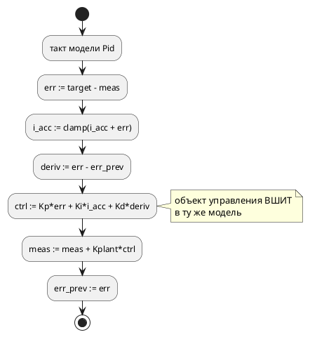
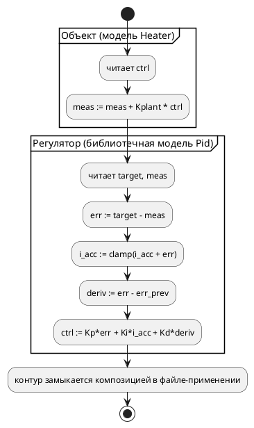

# Фича: Библиотечный ПИД-регулятор и пример его применения

- **Номер:** 0182
- **Статус:** ГОТОВО
- **Зависит от:** нет (0184 закрыта 2026-07-29)
- **Tier:** 2
- **Связанные issue (анализ):** запрос заказчика 2026-07-29; смежно с [пример ПИД-регулятора на языке Lam (fixed-point)](0097-pid-regulator-example.md) (существующий `pid_regulator.takt`), [насыщение (saturation) для fixed-point `q(m, n)`](0170-fixed-point-saturation.md) (насыщение вместо ручного anti-windup)

## Стадии жизненного цикла (правило 17)

Все стадии — **разделы этой карточки** (правило 32): «Архитектура (ADR)»,
«Анализ», «Разработка», «Тест-план», «Отчёт о тестировании», «Итог».
Отдельным артефактом остаются только исправления —
[`docs/fixes/`](../fixes/README.md) (при необходимости `0182-YY-*`).

## Краткое описание

Завести **переиспользуемую** модель ПИД-регулятора и **пример её применения**:
регулятор отдельным файлом-библиотекой, объект управления — своей моделью,
замыкание контура — через `import`. Плюс раздел документа `book/`, описывающий
и сам регулятор на языке, и то, как его прикладывают к объекту.

> Фича зарегистрирована **по запросу заказчика 2026-07-29**; объём («и раздел
> `book/`, и корпусные файлы») выбран им же. Далее проходит жизненный цикл по
> правилу 17. Проработка (стадии 2–3) выполнена сразу, разработка — по отдельному
> запросу заказчика 2026-07-29 («делай 0182 целиком»).

> **Была заблокирована 2026-07-29 на входе в разработку; блокировка снята в
> тот же день закрытием [общие переменные библиотечного файла в импортёре](0184-imported-shared-variables.md).** Пробы показали, что
> замкнуть контур между **импортированной** библиотечной моделью и моделями
> файла-применения нечем: импортированная модель не видит переменных импортёра
> (`SE-003`), а обходной путь — объявить переменные контура в библиотеке и
> импортировать их вместе с моделью — принимается компилятором, но даёт
> **некомпилируемый C** (`no member named 'meas' in 'struct …'` при рапорте об
> успехе) и `SIM-009` в симуляторе. Дефект вынесен в фичу-предшественник
> [общие переменные библиотечного файла в импортёре](0184-imported-shared-variables.md); подробности проб — в её карточке и в
> разделе «Уточнение стадии разработки» [анализа](0182-pid-library-and-application.md#анализ).

## Что известно на входе

- В корпусе уже есть [`examples/pid_regulator.takt`](../../examples/pid_regulator.takt): ПИД на прозрачном `float` с anti-windup. Он **самозамкнут** —
  объект управления вшит в ту же модель (`meas := meas + kplant * ctrl`), чтобы
  пройти проверка достижимости 0030 без внешних входов. Переиспользовать его как
  библиотеку нельзя: у него нет портов контура, а есть только `out ready`.
- Механизм `import` в языке есть и документирован разделом
  [`book/src/09-imports/`](../../book/src/09-imports/index.typ); поиск файла идёт
  рядом с импортирующим.
- Проверка примеров `book/`  **библиотечные** примеры standalone не
  компилирует — признак выводится грепом по `from "<имя>"`, а не списком.
- Насыщающего оператора в языке **нет** (anti-windup пишется условиями) —
  заведено отдельной фичей [насыщение (saturation) для fixed-point `q(m, n)`](0170-fixed-point-saturation.md); зависимостью
  **не является**, ручное ограничение работает.

## Направление решения (наметка, не решение)

Библиотечная модель ПИД с портами контура (`in`/`out`), отдельная модель
объекта, корневой пример-применение через `import`, и раздел документа в части
«Применение». Окончательный выбор формы — за ADR и анализом.

## Документирование (правило 24)

**Требуется.** Фича сама по себе — в том числе документная: заводится **новый
раздел** документа `book/` (правило 24: «каждый новый раздел — отдельная фича»),
описывающий ПИД на языке и его применение к объекту управления. Раздел
относится к части «Применение» — в нём допустимы команды инструментов и их
вывод (исключение правила 24). Номера фич, ссылки на ADR и сведения о процессе в
документ **не попадают**. Конкретное место в `book/src/main.typ` и состав
разделов — в ADR.

## Архитектура (ADR)

- **Status:** Accepted
- **Date:** 2026-07-29
- **Authors:** Архитектор + Аналитик
- **Related issues:** [Фича](0182-pid-library-and-application.md); смежно с [ADR](0097-pid-regulator-example.md#архитектура-adr) и [ADR](0096-fixed-point-native-float.md#архитектура-adr)

### Context

Заказчик просит **пример ПИД-регулятора на языке и пример его применения**
(2026-07-29). В корпусе ПИД уже есть — `examples/pid_regulator.takt`, — но он **самозамкнут**: объект управления вшит в ту же модель строкой
`meas := meas + kplant * ctrl`. Так сделано намеренно, чтобы модель проходила
корпусной проверка достижимости  без внешних входов.

Цена этого решения — регулятор **непереиспользуем**. Наружу он показывает
единственный порт `ready`; уставка, измерение и управляющее воздействие —
внутренние переменные. Приложить его к другому объекту нельзя, не переписав.
То есть «пример применения» в корпусе отсутствует не по недосмотру, а потому
что применять нечего: регулятор и объект — одно целое.

#### Поток «как есть»



#### Целевой поток



### Decision Drivers

1. **Переиспользуемость — суть запроса.** «Пример применения» имеет смысл
   только если регулятор можно применить, то есть если контур разомкнут и
   выведен в порты.
2. **Не сломать существующее.** `pid_regulator.takt` участвует в контракте
   сценария (`examples_scenario_tests`), проверках `sv`, сверках
   `conformance_float_modes_tests` и в списке `FLOAT_AS_Q_EXAMPLES`. Его
   переделка — рябь по десятку мест ради задачи, которой он не решает.
3. **Пример — это документация языка** (правила 15, 16). Регулятор без
   объяснения, как он прикладывается, документацией не является.
4. **Проверки корпуса — не декорация.** Каждый новый `.takt` обязан пройти канон
   `fmt`, проверка воспроизводимости, компиляцию во все цели и получить **контракт
   сценария либо исключение с причиной**. Форма примера определяется этим не
   меньше, чем предметом.

### Considered Options

#### Option A. Библиотечная модель + отдельный объект + файл-применение через `import`

Три файла: регулятор (библиотека, контур в портах), объект управления и корень,
импортирующий оба и замыкающий контур композицией.

**Pros:**
- прямо отвечает на запрос: «регулятор» и «его применение» — разные артефакты,
  и второй показывает **как** прикладывать;
- демонстрирует `import` и многофайловость на осмысленной задаче, а не на
  учебной (раздел `book/src/09-imports/` показывает механизм, но не пользу);
- библиотечный файл проверкой примеров `book/` standalone **не** компилируется —
  признак выводится грепом по `from "<имя>"`, то есть инфраструктура
  такой формы уже готова;
- существующий `pid_regulator.takt` не трогается вовсе.

**Cons:**
- корпус растёт на три файла; каждому нужен контракт или исключение, канон
  `fmt` и порождение во все цели;
- разомкнутый регулятор сам по себе сценария не имеет — контракт получает
  файл-применение, библиотека и объект идут с исключением «библиотечный,
  проверяется импортёром».

#### Option B. Один файл с двумя моделями и композицией

Один `.takt`: модель регулятора, модель объекта и композиция в корне.

**Pros:**
- один файл, один контракт, минимум ряби.

**Cons:**
- **не показывает применение**: регулятор и объект снова связаны файлом, взять
  регулятор в другой проект нельзя — то есть повторяет дефект в новой
  обёртке;
- `import` не демонстрируется вовсе.

#### Option C. Переделать `examples/pid_regulator.takt`

Разомкнуть существующий пример, вынеся объект.

**Pros:**
- корпус не растёт.

**Cons:**
- ломает контракт сценария (`Control → Settled → Done`), сверки
  `conformance_float_modes_tests`, проверка `sv` и запись в `FLOAT_AS_Q_EXAMPLES`;
- уничтожает **работающий** пример прозрачного `float` ради другой задачи —
  два предмета под одним номером;
- «до» и «после» становятся неразличимы: пример 0097 демонстрирует
  представление чисел, 0182 — переиспользование. Это разные уроки.

### Decision

Принимается **Option A**.

Единственный вариант, который **показывает применение**, а не имитирует его.
Цена — три новых файла и их обвязка — известна и ограничена: это ровно та
работа, которую корпусной пример стоит в этом проекте всегда.

Существующий `pid_regulator.takt` **сохраняется без изменений**: он про
представление чисел (`float` → q флагами сборки), новый пример — про
переиспользование. Разные уроки живут в разных файлах.

#### Форма контура

Регулятор объявляет порты контура — уставку и измерение на вход, управляющее
воздействие на выход — и **не** содержит модели объекта. Коэффициенты —
объявления библиотечной модели; настройка под задачу выполняется в файле-
применении через общие переменные, поскольку параметризации моделей (generics)
в языке нет.

Это **ограничение языка**, а не выбор ADR: подставить свои коэффициенты
«снаружи» иначе нечем. Ограничение фиксируется анализом и разделом документа
честно — оно и есть один из уроков примера.

#### Раздел документа

Новый раздел в части **«Применение»** `book/src/main.typ`, после
«Практический пример»: сперва регулятор (модель, закон управления, anti-windup,
типичные ошибки по правилу 26), затем применение (объект, замыкание контура,
прогон симулятором, наблюдение сходимости). Номера фич, ссылки на ADR и
сведения о процессе в документ не попадают (правило 24).

### Consequences

#### Положительные

- в корпусе появляется **переиспользуемая** модель и наглядный образец того,
  как из библиотеки и объекта собирается контур;
- `import` получает содержательную демонстрацию — сегодня он показан только
  учебным примером комнаты;
- раздел документа связывает язык с прикладной задачей, ради которой проект и
  существует (цель 12 свода — промышленные системы управления).

#### Отрицательные / Action items

- корпус растёт на три `.takt` и их порождённые артефакты во всех целях;
- **anti-windup пишется условиями**: насыщающего оператора в языке нет. Если
  [насыщение (saturation) для fixed-point `q(m, n)`](0170-fixed-point-saturation.md) будет закрыта, пример и
  раздел документа придётся освежить — записать в её карточку как потребителя;
- **параметризация моделей отсутствует**: коэффициенты нельзя задать
  «снаружи» иначе как общими переменными. Если это признают неудобством —
  заводить отдельной фичей, а не расширять 0182.

#### Acceptance criteria

1. Библиотечный файл регулятора — **без** модели объекта, контур в портах;
   импортируется и компилируется в составе применения.
2. Файл-применение импортирует регулятор и объект, замыкает контур, сходится и
   завершается.
3. У каждого нового файла — **контракт сценария** либо исключение **с причиной**
   в `examples_scenario_tests`; библиотечные идут с исключением.
4. Новый раздел `book/` описывает регулятор и его применение; примеры раздела
   проходят проверка `book/` (компиляция целью `c` + симуляция), символы — проверка
   шрифта (`scripts/check-book-glyphs.py`).
5. `examples/pid_regulator.takt`  **не изменён** — `git diff` пуст.
6. `./scripts/precheck.sh` зелёный.

## Анализ

### Цель и контекст

Реализовать **Option A** ADR: переиспользуемый ПИД-регулятор, отдельная
модель объекта управления и файл-применение, замыкающий контур через `import`,
плюс раздел документа `book/` в части «Применение».

Язык **не меняется**: используются уже существующие конструкции (`import`,
порты, `float`, композиция). Версия языка не растёт (правило 22).

### Зависимости фичи (правило 17/19)

- **Зависит от:** нет. Все нужные механизмы закрыты: `import` (0055),
  прозрачный `float` (0096/0097), проверка примеров `book/` (0133), проверка достижимости
  корпуса (0030).
- **Влияние на порядок разработки:** ничего не разблокирует и ничем не
  блокируется. Место в таблице `FEATURES.md` — по Tier 2 среди содержательных
  правок; конкретная позиция — за пересмотром правила 19 при взятии в работу.
- **Смежные, но не зависимости:**
  - [насыщение (saturation) для fixed-point `q(m, n)`](0170-fixed-point-saturation.md) (насыщение для `q`) —
    закрытие позволит заменить ручной anti-windup; пример придётся освежить,
    но он работает и без неё;
  - [цель `rust`: корневая модель без портов (`clippy::new_without_default`)](0174-rust-new-without-default.md) — пока не закрыта,
    корневая модель **обязана** иметь порт (см. О3 ниже).

### Предлагаемая раскладка файлов

| Файл | Роль | Сценарий в `examples_scenario_tests` |
|---|---|---|
| `examples/pid.takt` | библиотека: модель регулятора, контур в портах | **исключение** «библиотечный: без верхнеуровневого входа, проверяется импортёром» |
| `examples/heater.takt` | библиотека: модель объекта управления (нагреватель 1-го порядка) | **исключение** той же природы |
| `examples/pid_heater.takt` | применение: импортирует обе модели, замыкает контур, сходится и завершается | **контракт**: цепочка + бюджет + `must_terminate: true` |

Имена — **предложение**, а не решение: их обязана проверить стадия разработки
против ограничения О1 (пространство имён IEC). Кандидат-ловушка уже виден:
`Heater` безопасен, а, например, `Limit`/`Step`/`Concat` — нет.

Раздел документа: `book/src/19-pid/index.typ` + `book/src/19-pid/examples/*.takt`,
строка в `book/src/main.typ` после «Практический пример». Нумерация разделов
автоматическая (правило 24), поэтому номер каталога — единственное, что задаёт
порядок.

### Требования и проверяемые условия

- **R1. Регулятор разомкнут.** Библиотечная модель ПИД **не содержит** модели
  объекта: уставка и измерение приходят портами, управляющее воздействие уходит
  портом. Проверка — чтением файла: присваивания измерению в нём нет.
- **R2. Применение замыкает контур.** Файл-применение импортирует регулятор и
  объект и связывает их так, что измерение сходится к уставке.
- **R3. Прогон завершается.** Применение достигает терминального состояния в
  пределах бюджета — иначе контракт сценария невозможен, а проверка достижимости  отвергнет пример.
- **R4. Существующий пример не тронут.** `examples/pid_regulator.takt` и его
  порождённые артефакты не изменяются.
- **R5. Раздел документа самодостаточен.** Описывает регулятор и его
  применение, содержит блок типичных ошибок (правило 26) и не содержит номеров
  фич, ссылок на ADR и сведений о процессе (правило 24).
- **R6. Корпус остаётся зелёным.** Все проверки `precheck.sh` проходят без новых
  исключений и без записей в `scripts/module-size-baseline.txt`.

### Ограничения, которые определяют форму примера

Собраны из живого контекста и подтверждены артефактами предыдущих фич. Каждое —
причина красного предкоммита, если его нарушить.

- **О1. Пространство имён IEC.** Идентификаторы IEC 61131-3 регистронезависимы
  и делят пространство со стандартной библиотекой: `integral`, `pv`, `left`,
  `right`, `mid`, `limit`, `step`, `concat` отвергаются `iec2c`, причём
  диагностика обманчива. Имя **корневой** модели берётся из имени файла —
  ловушка срабатывает и на имени файла. Именно поэтому в 0097 стоят `i_acc` и
  `meas`, а не `integral` и `pv`.
- **О2. Литерал `float` — только в инициализаторе объявления.** Литерал в теле
  даёт `SV-003`. Тела пишутся **на переменных**.
- **О3. Корневая модель обязана иметь порт.** Модель без портов даёт
  `clippy::new_without_default` в проверке цели `rust` (открытая фича).
- **О4. Адресов портов не задавать.** Иначе появится вывод `sv-mmio` и
  сработает проверка «ни одного лишнего `.sv`».
- **О5. Библиотечный файл проверкой `book/` не компилируется standalone** —
  признак выводится грепом по `from "<имя>"`. Для корпусных
  `examples/*.takt` такого механизма **нет**: там библиотечные файлы обязаны
  получить исключение с причиной в `examples_scenario_tests`.
- **О6. Символы документа сверяются со шрифтом.** `scripts/check-book-glyphs.py`
  по снимку `cmap` Fira Code. Сборка PDF этот класс **не ловит** — символ вне
  шрифта молча выпадает. Эмодзи в `book/src` недопустимы.
- **О7. Цель `sv` требует понижения `float`.** Если новый пример вносится в
  `SV_TRANSLATABLE`, ему нужен `--float-as-q` (иначе `SV-003`) и запись в
  `FLOAT_AS_Q_EXAMPLES`. **Решение о включении в проверка `sv` принимает стадия
  разработки** — задача фичи в переиспользовании, а не в покрытии цели.
- **О8. Параметризации моделей нет.** Коэффициенты регулятора нельзя задать
  «снаружи» иначе как общими переменными. Это ограничение языка; в разделе
  документа оно проговаривается честно, а не обходится молчанием.

### Критерии приёмки и способ проверки

| # | Критерий | Способ проверки |
|---|---|---|
| A1 | Регулятор разомкнут (R1) | чтение файла + отсутствие модели объекта; компиляция в составе применения |
| A2 | Контур сходится и завершается (R2, R3) | контракт в `examples_scenario_tests` (цепочка + бюджет + `must_terminate`) |
| A3 | Библиотечные файлы учтены | исключение **с причиной** в `examples_scenario_tests`; тест `every_example_is_accounted_for` зелёный |
| A4 | Существующий ПИД не тронут (R4) | `git diff` по `examples/pid_regulator.takt` и его порождённым артефактам пуст |
| A5 | Раздел документа проходит проверки (R5) | проверка примеров `book/` (компиляция целью `c` + `takt-sim -n 10`), `scripts/check-book-glyphs.py`, `scripts/check-links.py` |
| A6 | Канон и детерминизм | `taktc fmt --check examples/`, проверка воспроизводимости (два прогона × цели) |
| A7 | Цели генерации принимают новые примеры | `cc`+`cmake` под `-Wall -Werror`, `iec2c`, `rustc`+`clippy -D warnings` |
| A8 | Корпус зелёный (R6) | `./scripts/precheck.sh` |

### Предлагаемая декомпозиция разработки (задачи не заведены)

| Задача | Содержание |
|---|---|
| 0182-01 | библиотечные `.takt`: регулятор и объект; проверка имён против О1 |
| 0182-02 | файл-применение, контракт сценария и исключения; порождённые артефакты |
| 0182-03 | раздел `book/` (регулятор + применение + блок типичных ошибок), строка в `SUMMARY.md` |

Тест-план и отчёт заводятся вместе с разработкой (стадии 5–6 правила 17).

### Особенности по обратной совместимости (правило 11)

Обратная совместимость не затрагивается: язык не меняется, существующие файлы не
правятся, изменения **аддитивны** (новые примеры и новый раздел документа).
Единственная общая точка — реестр примеров в `examples_scenario_tests`, куда
добавляются записи; существующие записи не трогаются.

### Уточнение стадии разработки (2026-07-29): форма примера нереализуема

При взятии фичи в разработку раскладка файлов была проверена **пробами**, а не
принята на веру. Результат: связать импортированную библиотечную модель с
моделями файла-применения **нечем**.

| Проба | Форма | Итог |
|---|---|---|
| П1 | переменная объявлена в применении, импортированная модель на неё ссылается | `SE-003` — не видна (честный отказ) |
| П2 | переменные контура объявлены в библиотеке, импортированы вместе с моделью | `taktc -t c` **успех**, но `cc`: `no member named 'meas' in 'struct App4Plant'` |
| П3 | то же под симулятором | `SIM-009` «переменная 'meas' не найдена», прогон остановлен |
| П4 | `import "lib.takt";` целиком + `start App = Lib \| Local;` | симулятор работает, цель `c` — `CC-004: Model with name ' ()' not found` |
| П5 | доступ к переменной под-модели через точку (`Pid.ctrl`) | цель `c` **молча теряет** оператор; симулятор — `SIM-014` |

Работает единственный случай — **самодостаточная** библиотечная модель, которая
со средой общается только собственными портами (образец —
`book/src/09-imports/examples/thermostat.takt`). Именно такой формой ограничен
сегодняшний `import`, и именно она **не** даёт «применения»: контур не
замыкается, сходимость наблюдать не на чем, контракт сценария (A2) невозможен.

**Решение:** обходить дефект формой примера **не** стали — пример, обходящий
дыру, закрепил бы её и выдал бы ограничение инструмента за свойство языка.
Дефект вынесен в фичу-предшественник
[общие переменные библиотечного файла в импортёре](0184-imported-shared-variables.md) (Tier 1), 0182 переведена в
`ЗАБЛОКИРОВАНА` с зависимостью от неё (правило 19, критерий 1). Раскладка файлов
и критерии приёмки выше остаются в силе — они станут исполнимы после 0184;
проба П5 записана **кандидатом** в `FEATURES.md` (иной предмет).

### Уточнение стадии разработки (2026-07-29, после снятия блокировки): файлов два

Раскладка «три файла» проверена пробой и **не работает**: объект отдельной
библиотекой объявил бы свои `ctrl`/`meas`, а подключение двух файлов строит два
независимых дерева — общей переменной между ними не возникает (`SE-074` на
модель объекта; подключение одноимённых объявлений — `SE-005`).

| Файл | Роль | Сценарий |
|---|---|---|
| `examples/pid_law.takt` | библиотека: закон + протокол контура (`target`/`meas`/`ctrl`) | **исключение** с причиной |
| `examples/pid_heater.takt` | применение: объект (бак с подогревом) + замыкание контура | **контракт**: цепочка + бюджет 100 + завершение |

Имя `pid.takt` из первой редакции заменено на `pid_law.takt`: имя корневой
модели берётся из имени файла, и `pid.takt` дал бы корень `Pid` при под-модели
`Pid` — цель `rust` такой вход отвергает (`RS-012`). Подробности и ещё две
ловушки именования — в [библиотечный ПИД-регулятор и пример его применения](0182-pid-library-and-application.md#разработка).

Раздел документа — `book/src/19-library/` (а не `19-pid/`): предмет шире одного
регулятора — это приём «библиотека + применение». Примеры раздела **свои**, а не
копии корпусных (риск расхождения ниже).

### Риски

- **Риск «пример компилируется, но бессмысленен».** Прецедент есть: конвейер
  раздела документа компилировался, но сортировки не выполнял.
  Снижение: контракт сценария проверяет **сходимость** прогоном, а не факт
  компиляции; в отчёте фиксируется наблюдённая трасса измерения.
- **Риск расхождения раздела и примера.** Раздел документа и корпусный пример —
  два источника одного текста. Снижение: раздел `book/` держит свои файлы
  примеров в собственном каталоге и не копирует корпусные; те и другие
  проверяются каждый своим проверкой.
- **Риск неустойчивости контура.** Коэффициенты, подобранные «на глаз», дают
  расходящийся или колеблющийся контур. Снижение: коэффициенты берутся от уже
  проверенного `pid_regulator.takt` (0097), где сходимость доказана контрактом;
  порог завершения — заведомо больше шага квантования, иначе предельный цикл.

## Разработка

### Задача

#### Что было

Единственный ПИД корпуса (`examples/pid_regulator.takt`) **самозамкнут**:
объект управления вшит в ту же модель, наружу выведен один флаг готовности.
Приложить его к другой установке нельзя, не переписав.

#### Что сделано

`examples/pid_law.takt` — библиотека закона управления:

- **протокол контура** на верхнем уровне: `target` (уставка), `meas`
  (измерение), `ctrl` (воздействие). Это ровно то, что подключает применение;
- **настройка и рабочие величины — внутри модели** `Pid` (коэффициенты, пределы
  anti-windup, накопитель, предыдущая ошибка). Первая редакция объявляла их на
  верхнем уровне — и `SE-074`  немедленно потребовал импортировать в
  применение **тринадцать** имён вместо трёх. Диагностика сработала как
  проектная обратная связь: внутренности библиотеки не должны течь наружу;
- модели объекта в файле **нет** — это и есть условие переиспользуемости.

**Имена подобраны против трёх ловушек**, каждая проверена пробой:

| Ловушка | Проба | Как обойдено |
|---|---|---|
| `integral`/`pv` заняты стандартной библиотекой IEC | опыт 0097 | `i_acc`, `meas` |
| имя корневой модели (из имени файла) = имя под-модели → цель `rust` даёт `RS-012` | вход из 3 строк | файл `pid_law.takt`, а не `pid.takt` |
| выходной порт и состояние с одним именем → цель `c` даёт `redefinition of enumerator` | вход из 6 строк | порт `ready`, а не `settled` |
| состояние с именем корневой модели из **составного** имени файла → `no member named 'pidlaw'` | вход из 3 строк | `start Main = Pid;` |

Три последние — **дефекты**, а не свойства языка: `taktc` во всех случаях
рапортует успех, а `cc`/`rustc` отвергают вывод. Записаны кандидатами в
`FEATURES.md` (в объём фичи не втянуты — иной предмет).

#### Проверки

```sh
./target/debug/taktc compile examples/pid_law.takt -t c   -o /tmp/o
./target/debug/taktc compile examples/pid_law.takt -t st  -o /tmp/o
./target/debug/taktc compile examples/pid_law.takt -t rust -o /tmp/o
./target/debug/takt-sim examples/pid_law.takt -n 6
```

Цели `c`/`st`/`rust`/`plantuml` принимают; `sv` отказывает `SV-003` (нативного
`float` в синтезируемом RTL нет) — как и у соседнего `pid_regulator.takt`, в
`SV_TRANSLATABLE` файл не вносится.

### Задача

#### Что было

«Примера применения» в корпусе не было, потому что применять было нечего:
регулятор и объект составляли одно целое.

#### Что сделано

`examples/pid_heater.takt` — применение библиотечного регулятора к баку с
подогревом:

```takt
import { Pid, target, meas, ctrl } from "pid_law.takt";
```

Объект — тепловой первого порядка: за шаг температура растёт от подведённой
мощности и падает от потерь, пропорциональных перегреву над средой. Цикл партии:
`Heating` (греем) → `Holding` (выдержка до температуры выдачи) → `Done`.
Контур замыкается композицией `Pid | Heater`.

**Раскладка отличается от предложенной анализом.** Анализ намечал **три**
файла (регулятор, объект, применение); объект отдельной библиотекой
**невозможен**: он объявил бы свои `ctrl`/`meas`, а подключение двух файлов
строит два независимых дерева — общей переменной между ними не возникает
(проба: `SE-074` на `Heater`, а импорт одноимённых — `SE-005`). Поэтому протокол
объявляет **одна** сторона, а объект живёт в файле применения. Это ограничение
механизма, а не выбор оформления; оно проговорено и в примере, и в разделе
документа.

**Учёт в корпусном проверке достижимости** (`takt-sim/tests/sim/examples_scenario_tests.rs`):
применение получило **контракт** (цепочка `Control, Heating` → `Settled, Holding`
→ `Done, Done`, бюджет 100, обязательное завершение), библиотека — **исключение
с причиной** (без объекта измерение никто не меняет, осмысленного сценария нет).

**Две правки инфраструктуры тестов** — обе об одном: пример корпуса теперь
вправе подключать соседний файл, а тесты строили модель из строки и каталога не
знали. Каталог самой модели добавлен в пути поиска в
`examples_scenario_tests.rs` и `takt-lang/tests/targets/c_stub_tests.rs`.

#### Проверки

```sh
cargo test -p takt-sim --test examples_scenario_tests -- --test-threads=1   # 10 из 10
cargo test -p takt-lang --test c_stub_tests -- --test-threads=1             # 8 из 8
./target/debug/takt-sim examples/pid_heater.takt -n 30
```

Прогон: 21 шаг, завершение терминальным состоянием; температура 16.9 → 39.5 →
37.4 (выдача). Порождённые артефакты во всех целях — в `examples/generated/`.

### Задача

#### Что было

Раздел [`09-imports`](../../book/src/09-imports/index.typ) описывает **механизм**
подключения файлов. Зачем его применяют и как из библиотеки и объекта собирается
рабочий контур — не описано нигде.

#### Что сделано

Новый раздел `book/src/19-library/` — «Переиспользуемая модель: библиотека и её
применение», в части «Применение» после «Практического примера»; строка в
`book/src/main.typ` (нумерация автоматическая).

Содержание: что выносят в библиотеку (модель + протокол связи, всё прочее —
внутреннее устройство), полный текст регулятора с разбором по выноскам
(правило 27), применение с объектом и замыканием контура, снятый с настоящего
прогона след сходимости, границы механизма (протокол объявляет одна сторона;
параметризации моделей нет) и блок «Частые ошибки» (правило 26).

**Примеры раздела — свои, а не копии корпусных** (риск из анализа: два
источника одного текста разъедутся). Корпусные несут длинные пояснения о
ловушках имён и представлении чисел, раздельные — компактны и размечены
выносками `(1)…(6)`, на которые опирается разбор.

**Правило 27(е) — такт не единица физической величины.** Модель объекта
пересчитывает температуру по шагам, и в тексте это названо прямо: **стенд**, а
не часть системы управления. Рядом показан боевой вариант — измерение приходит
входным портом, воздействие уходит выходным, — и оговорено, что период шага
задаётся объявлением `clock` или ключом сборки.

#### Проверки

```sh
python3 scripts/check-book-glyphs.py     # символов вне шрифта нет
python3 scripts/check-links.py           # битых ссылок нет
./scripts/precheck.sh                    # гейт примеров book/: 20 проверено, 3 библиотечных
```

Проверка примеров распознал `pid_law.takt` библиотечным (грепом по `from "…"`) и
проверил его импортёром; `heater_loop.takt` компилируется целью `c` и
симулируется.

## Тест-план

### Область и цель

Проверяется, что регулятор действительно **переиспользуем** (разомкнут, контур в
объявлениях протокола, модели объекта не содержит), что применение действительно
**замыкает** контур и сходится, и что оба файла живут в корпусе на общих
основаниях: канон формата, генерация во все цели, учёт в проверке достижимости.

Язык фича не меняет (правило 22): используются готовые конструкции. Правило 16
применяется в части примеров; правило 29 — ответ в отчёте.

### Проверки (условие → ожидаемый результат)

| # | Проверка | Предусловие | Ожидаемый результат | Ссылка на R/A |
|---|---|---|---|---|
| T1 | Регулятор разомкнут | `examples/pid_law.takt` | модели объекта нет; измерению файл не присваивает; наружу выведены `target`/`meas`/`ctrl` | R1 / A1 |
| T2 | Применение замыкает контур | `examples/pid_heater.takt` | измерение сходится к уставке: 16.9 → 39.5 за 18 шагов | R2 / A2 |
| T3 | Прогон завершается | то же, бюджет 100 | терминальное состояние за 21 шаг (`Done, Done`) | R3 / A2 |
| T4 | Учёт в проверке достижимости | корпус | у применения — контракт, у библиотеки — исключение с причиной; `every_example_is_accounted_for` зелёный | R3 / A3 |
| T5 | Существующий ПИД не тронут | `examples/pid_regulator.takt` | `git diff` по файлу и его порождённым артефактам пуст | R4 / A4 |
| T6 | Раздел документа | `book/src/19-library/` | примеры компилируются и симулируются; глифы и ссылки зелёные; блок «Частые ошибки» есть | R5 / A5 |
| T7 | Канон и детерминизм | корпус | `taktc fmt --check examples/` без правок; проверка воспроизводимости зелёный | R6 / A6 |
| T8 | Цели принимают новые примеры | корпус | `cc`+`cmake` под `-Wall -Werror`, `iec2c`, `rustc`+`clippy -D warnings` | R6 / A7 |
| T9 | Корпус зелёный | репозиторий | `./scripts/precheck.sh` — код 0 | R6 / A8 |

### Разбивка проверок по функциональности

| Функциональность | Как затронута | Статус |
|---|---|---|
| цель `c` / `c-hal` | новые примеры компилируются проверками корпуса | ✅ |
| цель `st` | принята `iec2c` | ✅ |
| цель `rust` | принята `rustc` + `clippy -D warnings` | ✅ |
| цель `sv` | `SV-003` (нативного float в RTL нет) — как у `pid_regulator` | — |
| цель `plantuml` | диаграммы порождены | ✅ |
| симулятор | контракт сценария + прогон | ✅ |
| документ `book/` | новый раздел + примеры | ✅ |
| LSP и плагины (правило 29) | язык не меняется | ✅ |

<!-- Легенда: ✅ пройдено · ❌ провалено · ⬜ не проверялось · — не применимо -->

### Тестовые данные и окружение

- `examples/pid_law.takt` — библиотека, `examples/pid_heater.takt` — применение;
- `book/src/19-library/examples/pid_law.takt` и `heater_loop.takt` — **свои**
  примеры раздела (не копии корпусных);
- инструменты корпуса: `cc`/`cmake`/`ninja`, `iec2c`, `rustc`+`clippy`,
  `verilator`/`yosys` — через `./scripts/precheck.sh`.

## Отчёт о тестировании

### Резюме

**✅ ПРОЙДЕН (9 из 9).** В корпусе появился переиспользуемый регулятор и рабочий
пример его применения; документ получил раздел, объясняющий приём. Фича готова к
закрытию.

Окружение: macOS (Darwin 25.5.0), rustc/clippy 1.97.1, Apple clang, `cmake`+`ninja`,
MatIEC `iec2c`, verilator 5.050, yosys 0.67+post. Прогон: `./scripts/precheck.sh`
— код 0.

### Фактические результаты по проверкам

| # | Проверка | Результат | Комментарий |
|---|---|---|---|
| T1 | Регулятор разомкнут | ✅ | `pid_law.takt` содержит закон и протокол (`target`/`meas`/`ctrl`); модели объекта нет |
| T2 | Применение замыкает контур | ✅ | температура 16.9 → 39.51 за 18 шагов, затем выдержка |
| T3 | Прогон завершается | ✅ | терминальное состояние `Done, Done` на 21 шаге (бюджет 100) |
| T4 | Учёт в проверке достижимости | ✅ | контракт у применения, исключение с причиной у библиотеки; 10 тестов набора зелёные |
| T5 | Существующий ПИД не тронут | ✅ | `git diff` по `pid_regulator.takt` и его артефактам пуст |
| T6 | Раздел документа | ✅ | проверка примеров `book/`: 20 проверено, 3 библиотечных; глифы и ссылки зелёные |
| T7 | Канон и детерминизм | ✅ | `taktc fmt --check examples/` без правок; проверка воспроизводимости зелёный |
| T8 | Цели принимают новые примеры | ✅ | `cc`/`cmake` под `-Wall -Werror`, `iec2c`, `rustc`+`clippy -D warnings` |
| T9 | Корпус зелёный | ✅ | `./scripts/precheck.sh` — код 0 |

### Результаты по функциональности

| Функциональность | Итог |
|---|---|
| цель `c` / `c-hal` | ✅ компилируется, проверка `c-hal` зелёный |
| цель `st` | ✅ принята `iec2c` |
| цель `rust` | ✅ принята `rustc` + `clippy -D warnings` |
| цель `sv` | — `SV-003`: нативного `float` в синтезируемом RTL нет; в `SV_TRANSLATABLE` не вносится, как и `pid_regulator` |
| цель `plantuml` | ✅ диаграммы порождены |
| симулятор | ✅ контракт сценария выполняется |
| документ `book/` | ✅ новый раздел, примеры проходят проверка |
| LSP и плагины (правило 29) | ✅ правок не требуется: фича не меняет ни лексику, ни синтаксис, ни семантику — только состав корпуса и документа; новых диагностик не вводит |

### Отступление от анализа (зафиксировано, а не умолчано)

Анализ намечал **три** корпусных файла: регулятор, объект, применение. Раскладка
проверена пробой и оказалась нереализуемой: объект отдельной библиотекой объявил
бы **свои** `ctrl`/`meas`, а подключение двух файлов строит два независимых
дерева — общей переменной между ними не возникает (`SE-074` на модель объекта;
подключение одноимённых объявлений — `SE-005`). Итог: файлов **два**, протокол
объявляет одна сторона, объект живёт в применении. Ограничение проговорено в
примере и в разделе документа.

### Найденные дефекты

Все — **чужие**, вскрыты подбором имён для примера, каждый подтверждён
минимальным входом и записан **кандидатом** в `FEATURES.md` (в объём не втянуты —
иной предмет):

1. **Выходной порт и состояние с одним именем** (`out settled` + `state Settled`)
   дают в целях `c`/`c-hal` один перечислитель → `redefinition of enumerator`,
   `duplicate case value`. `taktc` рапортует успех. Вскрыл проверка `c-hal`; проверка
   цели `c` через `cmake` — нет.
2. **Состояние с именем корневой модели из составного имени файла**
   (`two_words.takt` + `start TwoWords = M;`) → поле объявлено `two_words`,
   обращение печатается `twowords` → `no member named`.
3. **Имя корневой модели = имя под-модели** (`pid.takt` + `model Pid`) → цель
   `rust` отказывает `RS-012`, цели `c` и `st` принимают.

Исправлений в рамках фичи (`docs/fixes/0182-YY-*`) не потребовалось: все три
обойдены выбором имён, и обход задокументирован в самом примере — чтобы
следующий автор не наступил на те же грабли вслепую.

### Выводы и дальнейшие шаги

1. **`SE-074`  сработал как проектная обратная связь.** Первая
   редакция библиотеки объявляла коэффициенты на верхнем уровне — диагностика
   потребовала подключить в применение тринадцать имён вместо трёх, и это прямо
   показало, где проходит граница библиотеки.
2. **Три дефекта именования** — один класс: имена портов, состояний и моделей
   сводятся в общее пространство `UPPER_SNAKE`/поля структур без проверки на
   столкновение. Кандидат на общую фичу «коллизии имён в кодогене».
3. **Насыщение** ([насыщение (saturation) для fixed-point `q(m, n)`](0170-fixed-point-saturation.md)) при закрытии
   позволит заменить два `if` anti-windup — тогда пример и раздел освежить.

## Итог (что сделано)

В корпусе появился **переиспользуемый** регулятор и рабочий пример его
применения. `examples/pid_law.takt` — библиотека: закон ПИД и протокол контура
(`target`/`meas`/`ctrl`) наружу, настройка и накопители — внутри модели.
`examples/pid_heater.takt` — применение: бак с подогревом, цикл партии
`Heating → Holding → Done`, контур замкнут композицией. Прогон сходится
(16.9 → 39.5 за 18 шагов) и завершается за 21 шаг; у применения — контракт
сценария, у библиотеки — исключение с причиной.

Документ получил раздел [«Переиспользуемая модель: библиотека и её
применение»](../../book/src/19-library/index.typ) со своими (не скопированными)
примерами, разбором по выноскам, границами механизма и блоком частых ошибок.

**Раскладка отличается от намеченной анализом:** файлов **два**, а не три.
Объект отдельной библиотекой невозможен — подключение двух файлов строит два
независимых дерева, общей переменной между ними не возникает. Ограничение
проговорено в примере и в разделе документа, а не обойдено молчанием.

Три дефекта именования, вскрытые подбором имён (порт = состояние; состояние =
корневая модель из составного имени файла; корневая модель = под-модель),
подтверждены минимальными входами и записаны кандидатами: `taktc` в каждом
рапортует успех, а `cc`/`rustc` отвергают вывод.

Детали — [отчёт](0182-pid-library-and-application.md#отчёт-о-тестировании) (✅ 9 из 9);
исправлений (`docs/fixes/0182-YY-*`) не потребовалось. `examples/pid_regulator.takt`  не изменён.
