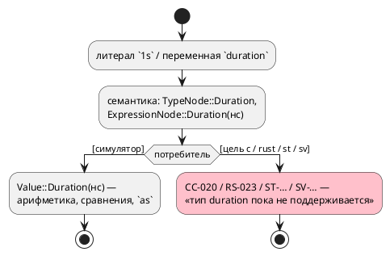
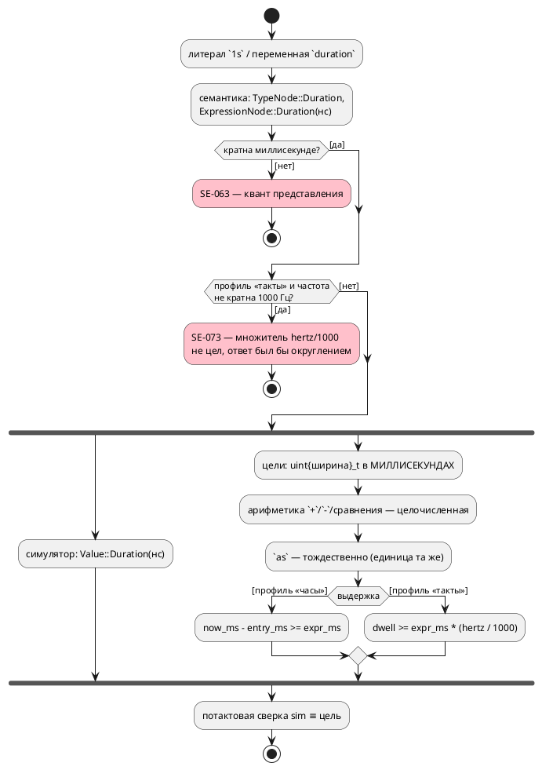

# Фича: Тип `duration` в целях генерации и вычисляемая выдержка

- **Номер:** 0183
- **Статус:** ГОТОВО
- **Зависит от:** нет (проставляет аналитик на стадии анализа, правило 17)
- **Tier:** 2
- **Связанные issue (анализ):** вскрыта при разработке
  [`after` принимает константу типа `duration`, а не только литерал](0143-after-const-duration.md) (2026-07-29, требование заказчика о
  выражении в `after`); смежно с [модель времени в языке: литерал длительности и частота такта](0134-language-time-model.md) (модель
  времени)

## Стадии жизненного цикла (правило 17)

Все стадии — **разделы этой карточки** (правило 32): «Архитектура (ADR)»,
«Анализ», «Разработка», «Тест-план», «Отчёт о тестировании», «Итог».
Отдельным артефактом остаются только исправления —
[`docs/fixes/`](../fixes/README.md) (при необходимости `0183-YY-*`).

## Краткое описание

Тип `duration` **исполняется симулятором, но не поддерживается ни одной целью
генерации**: `var v: duration := 1m;` в теле даёт `CC-020` (цель `c`), `RS-023`
(`rust`) и аналоги в `st`/`sv`. Пока это так, вычисляемая выдержка
(`after (v + 1s)` с переменной) невозможна: она была бы исполнима в отладке и
невыразима в прошивке — то есть язык расходился бы сам с собой в зависимости от
того, чем его запускают.

Фича закрывает разрыв: длительность как значение в порождённом коде (её
представление, ширина, пересчёт в такты/миллисекунды по профилю времени) — и уже
на этом основании допускает **вычисляемую** выдержку, где значение выражения
известно лишь в такте.

> Фича зарегистрирована **по ходу разработки 0143** (2026-07-29): заказчик
> потребовал выражение в `after` со значениями-переменными, и проба показала, что
> без поддержки типа в целях это дало бы расхождение «симулятор ≠ прошивка».
> Заказчик решил: в 0143 — только константы, переменные — этой фичей. Далее
> проходит жизненный цикл по правилу 17.

## Что известно на входе

- **Отказ громкий**, не молчаливый: `CC-020`, `RS-023`, аналоги `st`/`sv`
  («тип 'duration' целью … пока не поддерживается»). Заглушки поставлены фичей сознательно — «молча напечатать наносекунды обычным целым значило бы выдать
  выдержку, не равную заявленной».
- **Неиспользуемая** `duration`-переменная в цель не попадает (штатный фильтр
  неиспользуемых), поэтому отказ виден только у используемых.
- Симулятор длительности исполняет (`Value` несёт наносекунды), приведение
  `250 as duration` определено как «число — это миллисекунды».
- Пересчёт «наносекунды → единицы профиля» уже написан **один раз**
  (`semantic::duration::units`) и годится для констант; для значения, известного в
  такте, потребуется деление **в порождённом коде**, а с ним — решение об
  округлении (у констант неделимость ловится `SE-063`, у переменной проверить
  нечего).
- Ограничение объёма 0143 (`after` принимает только константы) держится
  диагностикой `SE-072` и её тестами — при реализации этой фичи оно снимается
  осознанно, а не молча.

## Направление решения (наметка, не решение)

Представить длительность в целях целым фиксированной ширины в единицах профиля
времени (такты либо миллисекунды), решив: ширину, знак, поведение при
переполнении и правило округления при делении. Затем допустить в `after`
выражение с переменными, сохранив тождественность симулятора и целей потактовой
сверкой. Окончательный выбор — за ADR и анализом.

## Документирование (правило 24)

**Требуется.** Меняется наблюдаемое поведение целей и, возможно, семантика
выдержки: затронут раздел [`book/src/12-time/`](../../book/src/12-time/index.typ)
(тип `duration`, выдержка `after`, точность) и приложение «Ошибки и
предупреждения» (снятие или уточнение `CC-020`/`RS-023`, правила `SE-072`).
Конкретный состав правок — в ADR.

<!-- При закрытии фичи (стадия 8, статус ГОТОВО) сюда добавляется раздел
     «## Итог (что сделано)» —
     ссылки на отчёт/исправления (правило 21). Незакрытые фичи «Итога» не имеют. -->

## Архитектура (ADR)

- **Status:** Accepted
- **Date:** 2026-07-29
- **Authors:** Архитектор + дизайнер языка
- **Related issues:** [Фича](0183-duration-type-in-targets.md);
  вскрыта при разработке [`after` принимает константу типа `duration`, а не только литерал](0143-after-const-duration.md); смежно
  с [ADR](0134-language-time-model.md#архитектура-adr) (модель времени),
  исправление [литерал длительности в теле блока давал `SIM-007`](../fixes/0134-02-duration-literal-in-body.md) (литерал
  длительности в теле — предпосылка сверки)

### Context

Тип `duration` **исполняется симулятором, но не поддерживается ни одной целью
генерации**. Пробы 2026-07-29 (переменная, **используемая** в теле):

```
Ошибка компиляции [CC-020]: переменная 'left': тип 'duration' целью 'c' пока не поддерживается
Ошибка компиляции [RS-023]: переменная 'left': тип 'duration' целью 'rust' пока не поддерживается
```

Заглушки поставлены фичей сознательно: «молча напечатать наносекунды обычным
целым значило бы выдать выдержку, не равную заявленной». Отказ громкий. Всего
формулировку «пока не поддерживается» несут **17** ветвей в двух крейтах —
большинство про этот тип.

Следствие, обнаруженное 0143: **вычисляемая выдержка** (`after (v + 1s)` со
значением, известным лишь в такте) невозможна — она была бы исполнима в отладке и
невыразима в прошивке.

Что уже нормировано языком и **не требует решения здесь**:

| Свойство | Как есть |
|---|---|
| Представление эталона | наносекунды (`Value::Duration(i64)`), `takt-sim/src/eval/duration.rs` |
| Арифметика | только `duration ± duration` и сравнения; умножения/деления **нет** |
| Смешение с числом | запрещено (`SE-065`) |
| Приведения | `duration as <целое>` → **миллисекунды**; `<целое> as duration` → число трактуется как **миллисекунды** |
| Непредставимая длительность | `SE-063` (не кратна кванту профиля), `SE-064` (не влезает в счётчик) |
| Механизм выдержки в целях | профиль «такты» — счётчик `takt_dwell` (ширина по `counter_bits`); профиль «часы» — метка `takt_entry_ms` + колбэк `now_ms`, **в миллисекундах** |

Существенное наблюдение, сужающее задачу: **источник времени длительностям-значениям
не нужен**. В языке нет выражения «сейчас»: `duration`-переменная — хранилище, над
которым делают `+`, `-` и сравнения. Время нужно только выдержке, и оно уже есть.



### Decision Drivers

1. **Симулятор и цели обязаны совпадать потактово.** Разрыв «в отладке работает, в
   прошивке нет» — худший для языка синтеза (правило 12 свода). Сверка, а не
   компиляция, — единственное доказательство (уроки и 0050).
2. **Арифметика времени живёт в одном месте.** `semantic::duration` — единственный
   слой пересчёта (правило 7 ADR); новое представление не имеет права
   завести второй.
3. **Цена на целевой платформе.** Цель `c` — прошивка МК: 64-битная арифметика на
   Cortex-M0/AVR программная, и выбирать её без нужды нельзя.
4. **Приведение `as` уже нормировано миллисекундами.** Представление, совпадающее
   с этой единицей, делает приведение **тождественным** — нечему разойтись.
5. **Молчаливое округление недопустимо.** Там, где пересчёт неточен, нужен отказ
   (как `SE-063` для литералов), а не «примерно верно».

### Considered Options

#### Option A. Миллисекунды, целое фиксированной ширины

`duration` в целях — целое без знака в **миллисекундах**; ширина по умолчанию 32
бита (49.7 суток), выбирается общим слоем.

**Pros:**
- Приведения `as` становятся **тождественными**: `v as u32` — то же значение,
  `n as duration` — то же значение. Расходиться нечему (драйвер 4).
- Профиль «часы» уже меряет время миллисекундами (`takt_entry_ms`, `now_ms`) —
  выдержка сравнивается **напрямую**, без арифметики.
- 32-битная арифметика на МК дешёвая (драйвер 3).
- Литерал переносим между сборками: значение переменной не зависит от частоты.

**Cons:**
- В профиле «такты» сравнение выдержки требует пересчёта `мс → такты`
  (`expr_ms * hertz / 1000`); он точен **только** при частоте, кратной 1000 Гц.
  Иначе нужен отказ — новая диагностика.
- Длительности мельче миллисекунды (`250us`) как **значения** невыразимы, хотя
  литерал в `after` при достаточной частоте работает. Асимметрия языка.

#### Option B. Единицы профиля (такты либо миллисекунды)

`duration` хранится в тех же единицах, что счётчик выдержки: тактах (профиль
«такты») или миллисекундах (профиль «часы»).

**Pros:**
- Сравнение с выдержкой прямое в **обоих** профилях.
- Литерал `250us` при частоте 1 МГц выразим как значение — точность выше.

**Cons:**
- Значение переменной **зависит от частоты сборки**: одно и то же `left = 3000`
  означает 3 с при 1 кГц и 3 мс при 1 МГц. Записанное в EEPROM или переданное по
  шине значение меняет смысл — а язык обещает, что единица входит в тип.
- Приведение `as u32` (миллисекунды) требует пересчёта `такты → мс`
  (`v * 1000 / hertz`) — та же неточность, что у A, но ещё и в **обе** стороны.
- Отладка перестаёт совпадать с прошивкой по числам: симулятор печатает `3s`,
  прошивка держит `3000` или `3000000`.

#### Option C. Наносекунды, 64-битное целое

`duration` в целях — `int64` наносекунд, как у эталона.

**Pros:**
- Тождественно эталону: ни пересчётов, ни округлений в арифметике.
- Полная точность вплоть до наносекунды.

**Cons:**
- 64-битная арифметика на МК: на Cortex-M0 сложение — вызов времени выполнения, сравнение —
  пара инструкций плюс ветвление; для DSL прошивок это цена без предъявленной
  нужды (драйвер 3).
- Сравнение с выдержкой требует привести счётчик к наносекундам
  (`dwell * ns_per_tick`), а `ns_per_tick = 1e9 / hertz` цел **не при всякой**
  частоте (3 Гц — нет) — то есть условие делимости не исчезает, лишь меняет вид.
- Приведение `as u32` (мс) требует деления на 1e6 — в цели `st` деления над
  длительностями нет вовсе (в IEC арифметика над `TIME` ограничена).

### Decision

Принимается **Option A** — миллисекунды, целое без знака, ширина выбирается общим
слоем (по умолчанию 32 бита).

Решающими были драйверы 4 и 1: единица приведения `as` **уже** назначена
миллисекундами решением заказчика (0134), поэтому представление в миллисекундах
делает границу «значение ↔ число» тождественной, и расходиться с эталоном может
только пересчёт выдержки — единственное место, которое остаётся доказывать
сверкой. Option B ломает переносимость значения (его смысл начинает зависеть от
флага сборки), Option C платит 64-битной арифметикой на МК и всё равно не
избавляется от условия делимости.

**Нормативно (правило языка и целей).**

1. Тип `duration` **представим во всех целях** генерации целым без знака в
   **миллисекундах**. Ширина — 32 бита; общий слой вправе выбрать шире, если
   этого требует литерал модели (`SE-064` остаётся при непредставимости).
2. **Значение мельче миллисекунды как переменная невыразимо**: `var v: duration
   := 250us;` → `SE-063` (тот же код, что у литерала выдержки в профиле «часы»,
   и по той же причине — квант представления).
3. Арифметика в целях — целочисленная над миллисекундами: `+`, `-`, сравнения.
   Умножения и деления над `duration` язык не имеет, и цели их не эмитят.
4. Приведения `as` **тождественны**: `v as <целое>` и `<целое> as duration` не
   порождают арифметики вовсе (значение уже в миллисекундах).
5. **Выдержка с переменным выражением** (`after (v + 1s)`) допускается:
   - профиль «часы» — сравнение `now_ms - entry_ms >= expr_ms` (обе части в
     миллисекундах, пересчёта нет);
   - профиль «такты» — сравнение `dwell >= expr_ms * (hertz / 1000)`; множитель
     `hertz / 1000` вычисляет **компилятор**.
6. **Частота, не кратная 1000 Гц, отвергается** там, где нужен множитель
   `hertz / 1000`, — то есть у **вычисляемой выдержки** в профиле «такты»: новый
   код **`SE-073`**. Причина названа: множитель не цел, и любой ответ был бы
   округлением.

   Уточнено до реализации: правило **не** распространяется на `duration` как
   значение вообще. Значение живёт в миллисекундах и с тактовым счётчиком не
   взаимодействует, пока их не сравнивают, — а сравнение и есть вычисляемая
   выдержка. Первая редакция пункта запрещала больше, чем требуется, и отсекла бы
   законные модели (частота 3 Гц, длительности только в переменных).
7. Ограничение фичи («в `after` только константы») **снимается**: `SE-072`
   перестаёт отвергать переменную и порт, сохраняя отказ на вызове функции, голом
   числе, сравнении и прочих неарифметических формах.
8. Поведение целей и симулятора совпадает **потактово** — доказывается сверками
   `conformance_{c,rust,st,sv}_*`, а не фактом компиляции.



### Consequences

#### Положительные

- Тип `duration` перестаёт быть «только для отладки»: модель с таймерами
  синтезируется во все шесть целей.
- Вычисляемая выдержка становится возможной, и ограничение 0143 снимается
  осознанно, а не обходится.
- Приведения `as` не порождают кода — граница «длительность ↔ число» бесплатна и
  не может разойтись с эталоном.
- Диагностика `SE-073` делает несовместимость частоты **громкой** там, где раньше
  просто не было поддержки.

#### Отрицательные / Action items

- **Асимметрия языка:** литерал `250us` в `after` при частоте 1 МГц законен, а
  `var v: duration := 250us;` — нет (`SE-063`). Это цена выбора единицы; описать в
  документе явно, иначе выглядит как дефект.
- **Частоты, не кратные 1000 Гц**, теряют возможность использовать `duration` как
  значение. Замер типовых частот прошивок (1 кГц, 2 кГц, 10 кГц, 100 кГц, 1 МГц)
  показывает, что правило не задевает практику; экзотические частоты (3 Гц)
  остаются с литеральными выдержками.
- **Ширина 32 бита** ограничивает значение 49.7 сутками. Модели с большими
  выдержками получают `SE-064`; расширение ширины флагом — **кандидат**, не объём.
- **Тесты фичи**, пришпиливающие `SE-072` на переменной и порте, обязаны
  быть переписаны — это часть объёма, а не побочный ремонт.
- Цель `st`: тип IEC для длительности выбирается отдельно (`TIME` против
  `UDINT`) — решение задачи цели, но обязано остаться в миллисекундах.

#### Acceptance criteria

1. `var v: duration := 1s;` с использованием в теле компилируется целями `c`,
   `c-hal`, `st`, `st-at`, `rust`, `sv`; вывод содержит целое в миллисекундах.
2. Потактовая сверка симулятора и каждой цели на модели с арифметикой
   длительностей совпадает (`conformance_*`).
3. `v as u32` и `250 as duration` не порождают арифметики (проверка текстом).
4. `after (v + 1s)` работает во всех целях и сверяется потактово; `SE-072` больше
   не отвергает переменную, но отвергает вызов функции и голое число.
5. `var v: duration := 250us;` даёт `SE-063`; частота 3 Гц с duration-значением
   даёт `SE-073` — оба с позицией и названной причиной.
6. Раздел документа о времени описывает представление, ограничение кванта и
   правило частоты; `SE-073` — в приложении «Ошибки и предупреждения».

## Анализ

### Цель и контекст

Сделать тип `duration` представимым во всех целях генерации и на этом основании
допустить **вычисляемую выдержку** (`after (v + 1s)`). Форма решения принята
[ADR](0183-duration-type-in-targets.md#архитектура-adr): представление — целое без
знака в **миллисекундах**, ширина 32 бита по умолчанию.

### Зависимости фичи (правило 17/19)

- **Зависит от:** `нет` — все предпосылки закрыты:
  - механизм времени (0134) закрыт; общий слой пересчёта `semantic::duration`
    существует и остаётся единственным;
  - исправление [литерал длительности в теле блока давал `SIM-007`](../fixes/0134-02-duration-literal-in-body.md) **исправлен** —
    без него симулятор не считал литерал длительности в теле, и потактовая сверка
    (главное доказательство фичи) была бы невозможна;
  - фича [`after` принимает константу типа `duration`, а не только литерал](0143-after-const-duration.md) закрыта; её ограничение
    «только константы в `after`» снимается этой фичей осознанно.
- **Влияние на порядок разработки:** ничего не блокирует. Снимает 17 ветвей
  «пока не поддерживается» (замер-29), большинство которых про этот тип.

### Требования и проверяемые условия

- **R1. Тип представим во всех целях.** `TypeNode::Duration` → целое без знака в
  миллисекундах: `c`/`c-hal` — `uint32_t`, `rust` — `u32`, `sv` — `logic [31:0]`,
  `st` — целый тип IEC (выбор — задача цели, но **миллисекунды**). Ширина
  выбирается общим слоем; 32 бита — умолчание.
- **R2. Литерал понижается в миллисекунды один раз.** Пересчёт «наносекунды →
  миллисекунды» живёт в `semantic::duration` (правило 7 ADR); ни один
  генератор своей арифметики не заводит. Не кратно миллисекунде → `SE-063`.
- **R3. Арифметика целочисленная.** `+`, `-`, сравнения над миллисекундами.
  Умножения и деления над `duration` язык не имеет — цели их не эмитят.
- **R4. Приведения `as` бесплатны.** `v as <целое>` и `<целое> as duration` не
  порождают арифметики: единица та же. Проверяется **текстом** вывода.
- **R5. Выдержка с переменным выражением работает.** Профиль «часы» —
  `now_ms - entry_ms >= expr_ms`; профиль «такты» — `dwell >= expr_ms * (hertz /
  1000)`, множитель вычисляет компилятор.
- **R6. Частота, не кратная 1000 Гц, отвергается** там, где нужен множитель
  `hertz / 1000` — у **вычисляемой выдержки** в профиле «такты» → **`SE-073`** с
  названной причиной. Значение `duration` само по себе правилу не подчиняется:
  оно в миллисекундах и с тактовым счётчиком не взаимодействует, пока их не
  сравнивают (уточнение ADR до реализации).
- **R7. `SE-072` сужается.** Переменная и порт в `after` больше не отвергаются;
  вызов функции, голое число, сравнение и прочие неарифметические формы —
  отвергаются по-прежнему. Тесты переписываются.
- **R8. Потактовая сверка.** Для каждой цели — сверка с симулятором на модели с
  арифметикой длительностей и на модели с вычисляемой выдержкой. Компиляция
  доказательством **не считается**.
- **R9. Прежний вывод не меняется.** Модель без `duration`-значений даёт вывод
  байт-в-байт прежний (контроль — проверка детерминизма + корпус).
- **R10. Документ актуален.** Раздел о времени: представление, квант
  миллисекунды, правило частоты, вычисляемая выдержка; `SE-073` — в приложении.

### Критерии приёмки и способ проверки

| # | Критерий | Способ проверки |
|---|---|---|
| A1 | Все шесть целей компилируют модель с `duration`-переменной | фикстура + проверки `precheck.sh` (`cc`, `iec2c`, `rustc/clippy`, `verilator/yosys`) |
| A2 | Потактовая сверка совпадает | `conformance_{c,rust,st,sv}_duration_tests` |
| A3 | `as` не порождает арифметики | тест по тексту вывода каждой цели |
| A4 | `after (v + 1s)` работает и сверяется | сверка + тест эмиссии |
| A5 | `SE-063` на `250us` как значении | тест семантики |
| A6 | `SE-073` на частоте 3 Гц с duration-значением | тест семантики |
| A7 | `SE-072` сужен, но не снят | переписанные тесты |
| A8 | Корпус не изменился | проверка детерминизма + `git diff examples/generated/` |
| A9 | Документ и приложение обновлены | проверки `book/` (примеры, глифы) |

### Особенности по обратной функциональности

- Диагностики `CC-020`, `RS-023` и аналоги `st`/`sv` **исчезают**: множество
  принимаемых программ расширяется, обратной несовместимости нет.
- Появляется **новый** отказ `SE-073` — но только там, где раньше вообще не было
  поддержки типа, то есть ни одна работавшая программа его не увидит.
- **Тесты о `SE-072` на переменной обязаны быть переписаны** — часть
  объёма (R7), а не побочный ремонт.
- **Версия языка** — правило 22: меняется наблюдаемое поведение целей и
  снимается ограничение выдержки, значит фича обязана быть отражена в версии.
  Текущий цикл `0.7.0` открыт фичей; подъёма не требуется, изменения
  вносятся в уже помеченную версию.

### Редакторский слой (правило 29)

Фича меняет **семантику** (поведение целей, состав диагностик), но **не лексику и
не синтаксис**: новых токенов и форм объявления нет, узлы АСД не добавляются.
Ожидаемый ответ — «правок LSP и плагинов не требуется», кроме:
- новая диагностика `SE-073` обязана доезжать до редактора обычным путём (через
  `collect_compile_diagnostics`, а не печатью из библиотеки);
- список ключевых слов и подсветка не затрагиваются.

Ответ фиксируется окончательно в отчёте (стадия 6) — после проверки, а не до.

### Риски и зависимости

- **Главный риск — молчаливое расхождение** симулятора (наносекунды) и целей
  (миллисекунды) на границе кванта: `250us` как значение обязано **отвергаться**,
  а не округляться до нуля. Снимается R2/A5.
- **Риск профиля «такты»:** множитель `hertz / 1000` цел не при всякой частоте;
  без `SE-073` получилось бы округление вниз — то есть выдержка короче
  заявленной. Снимается R6/A6.
- **Риск ширины:** 32 бита = 49.7 суток; модель с большей выдержкой обязана
  получить `SE-064`, а не обёртку. Проверяется тестом.
- **Риск объёма:** шесть целей + выдержка + сверки — работа декомпозирована ниже
  (правило 2); задачи независимы по целям, поэтому провал одной не блокирует
  остальные.

### Декомпозиция разработки

| Задача | Содержание |
|---|---|
| `0183-01` | Общий слой: понижение литерала в миллисекунды, ширина, `SE-063` для значений, `SE-073` для частоты; цель `c`/`c-hal` + сверка |
| `0183-02` | Цель `rust` + сверка |
| `0183-03` | Цель `st`/`st-at` (выбор целого типа IEC) + сверка |
| `0183-04` | Цель `sv` + сверка |
| `0183-05` | Вычисляемая выдержка `after (v + 1s)` во всех целях; сужение `SE-072`, переписывание тестов |
| `0183-06` | Документ: раздел о времени, приложение диагностик, пример |

## Разработка

### Задача

#### Что было

Тип `duration` в цели `c` отвергался тремя точками: отображение типа (`CC-020`),
литерал в выражении и литерал в условии. Проба:

```
Ошибка компиляции [CC-020]: переменная 'left': тип 'duration' целью 'c' пока не поддерживается
```

#### Что сделано

- **Общий слой** `semantic::duration` (правило 7 ADR — единственное место
  арифметики времени) получил:
  - `VALUE_BITS = 32` — разрядность представления значения (49.7 суток);
  - `value_millis(nanos, loc, what)` — пересчёт «наносекунды → **миллисекунды**
    представления целей» с диагностиками: `SE-063` при некратности миллисекунде,
    `SE-064` при выходе за 32 бита.

  **Профиль времени здесь не участвует.** Значение живёт в миллисекундах
  независимо от того, тактами или часами меряется выдержка; профиль нужен лишь
  там, где значение сравнивают со счётчиком выдержки. Первая
  редакция ADR требовала отказа `SE-073` при любой частоте, не кратной 1000 Гц, —
  уточнено до реализации, иначе отсекались бы законные модели (частота 3 Гц,
  длительности только в переменных).

- **Цель `c`**: `map_c_type(Duration)` → `uint32_t`; литерал длительности в
  выражении и в условии печатается **миллисекундами** через общий слой.
  Диагностика `CC-020` и вариант `CTypeError::TimeNotSupported` **сняты**:
  отказывать больше не за что. В реестре диагностик код помечен снятым —
  переиспользовать его под другой смысл нельзя.

- **Приведения `as` бесплатны** — подтверждено выводом: `ms := left as u32;` даёт
  `model->ms = (uint32_t)model->left;`, без деления и умножения. Прямое следствие
  выбора единицы (ADR, драйвер 4).

#### Проверки

```sh
cargo test -p takt-sim --test conformance_c_duration_tests -- --test-threads=1
cargo test -p takt-lang --test time_literal_tests -- --test-threads=1
cargo test --all-features -- --test-threads=1
./scripts/precheck.sh
```

- **Потактовая сверка значений** (R8/A2) — новый файл
  `takt-sim/tests/conformance/conformance_c_duration_tests.rs` + фикстура
  `takt-sim/tests/data/eval/conformance_duration_value.takt`: эталон и
  порождённый C дают `ms=1750`, `late=1` на модели
  `left := pause + 750ms; ms := left as u32; late := left > 500ms;`. Числа
  проверяются **явно** — иначе сверка «ноль против нуля» была бы зелёной и
  бессмысленной.
- **`as` не порождает арифметики** (R4/A3) — тест по **тексту** вывода: деление на
  `1000000`, вставленное «на всякий случай», прошло бы сверку значений при
  `left = 0`, поэтому проверяется текст, а не только поведение.
- **`SE-063` и `SE-064`** (A5) — пробы вживую:

  ```
  var v: duration := 250us;  → SE-063: длительность не кратна миллисекунде
  var v: duration := 2000h;  → SE-064: больше 4294967295 мс (около 49.7 суток)
  ```

  Позиция этих диагностик — `Location::Codegen` (без строки), как у прочих
  диагностик кодогена: `ExpressionNode` позиции не несёт **намеренно**. Улучшение потребовало бы протащить позицию через ~40 вариантов узла —
  отдельная работа, не эта.
- **Тест, ожидавший отказа, переписан** под новое поведение
  (`target_c_emits_duration_as_milliseconds`): проверяет `uint32_t left;` в
  заголовке и `model->left = 5000;` в теле. Ожидание сменилось вместе с решением
  ADR, а не потому, что стало неудобно.
- Корпус не изменился (R9): проверка детерминизма и сборка примеров зелёные,
  `examples/generated/` без правок.

#### Что осталось у фичи

Цели `rust` (0183-02), `st` (0183-03), `sv` (0183-04), вычисляемая выдержка
(0183-05), документ (0183-06). Фича остаётся в статусе `РАЗРАБОТКА`.

### Задача

#### Что было

Тип `duration` цель `rust` отвергала тремя точками (`RS-023`): отображение типа,
литерал в выражении, литерал в условии.

#### Что сделано

- `rust_type(Duration)` → `u32` (миллисекунды, ширина `duration::VALUE_BITS`);
- литерал длительности в выражении и в условии печатается миллисекундами через
  общий слой `value_millis` — своей арифметики времени печатник не заводит;
- **потактовая сверка значений** с эталоном — новый файл
  `takt-sim/tests/conformance/conformance_rust_duration_tests.rs`: драйвер реализует `Hal`,
  запоминает записанное в порты и печатает; сверяются числа (`ms=1750`,
  `late=1`), а не факт сборки — проверка `rustc`/`clippy` доказывает лишь
  компилируемость;
- тест по **тексту**: `elapsed as u32` — простое `as`, ни делений, ни умножений.

#### Найден чужой дефект (не исправлен)

Первая редакция фикстуры писала `late := (elapsed > 500ms) ? 1 : 0;` — и
порождённый Rust **не скомпилировался**: ветви тернарника печатаются числами при
`write_bit(…, bool)` (`E0308` ×2) плюс лишние скобки вокруг условия `if`
(`unused_parens` под `-D warnings`). Воспроизводится **без** `duration`
(`late := (n > 5) ? 1 : 0;`), то есть дефект цели `rust`, а не этой фичи —
заведён исправлением [тернарный оператор в `bit`-порт даёт некомпилируемый Rust](../fixes/0148-03-rust-ternary-to-bit-port.md). Фикстура
обходит его формой `if … { … } else { … }` с явным комментарием.

#### Проверки

```sh
cargo test -p takt-sim --test conformance_rust_duration_tests -- --test-threads=1
```

### Задача

#### Что было

Тип `duration` цель `st` отвергала (`ST-015`) в отображении типа, в выражении и в
условии.

#### Что сделано

- `get_st_type(Duration)` → `UDINT` (беззнаковое 32-битное целое IEC,
  миллисекунды).

  **Тип `TIME` намеренно не выбран**, хотя IEC его имеет: арифметика над `TIME`
  в MatIEC ограничена, а язык требует ещё и **бесплатного** приведения
  `duration ↔ число` (ADR, п. 4). `TIME`-литерал (`time_literal`) остаётся
  там, где IEC ждёт именно время (`TON.PT`).
- литерал длительности в выражении и в условии — миллисекунды через общий слой;
- **`ConditionNode::After`/`AfterTicks` в печатнике условий отвергаются явно** с
  объяснением: выдержку печатает `st_model` (у него есть доступ к полю времени и
  профилю), и попадание в печатник условий означало бы разбор в обход того пути.

#### Устранена молчаливая потеря инициализатора

`literal_init` (объявления `VAR`) не знал ветви `Duration`, поэтому
`var pause: duration := 1s;` объявлялся **нулём**, тогда как эталон давал 1000 мс.
Ни `iec2c`, ни проверка этого не видели: код валиден, просто считает другое. Ветвь
добавлена, контроль — проверка на конкретное число в тесте.

Класс тот же, что у исправления: один узел разбирают несколько мест, и одно
отстаёт. Здесь мест **четыре** (тип, выражение, условие, инициализатор
объявления).

#### Проверки

```sh
cargo test -p takt-lang --test duration_targets_tests -- --test-threads=1
```

Текст вывода (`elapsed : UDINT := 0;`, `pause : UDINT := 1000;`,
`elapsed := pause + (750);`, `ms := elapsed;`) + прогон **настоящего** `iec2c`.

Потактовая сверка значений для `st` **не заведена** в этой задаче: механизм
наблюдения (трансляция в C через MatIEC, драйвер к `POUS.c`, точные имена полей)
требует своей обвязки — отдельная подзадача. Валидность `iec2c` верности не
доказывает, поэтому в тесте проверяются **числа** в тексте.

### Задача

#### Что было

Тип `duration` цель `sv` отвергала (`SV-015`) в отображении типа, в выражении и в
условии; вдобавок литерал длительности не проходил **две** проверки константности
ветви сброса.

#### Что сделано

- `sv_type(Duration)` → `logic [31:0]` (беззнаковый вектор, миллисекунды);
- литерал длительности в выражении и в условии — миллисекунды через общий слой;
- `After`/`AfterTicks` в печатнике условий отвергаются явно: выдержку печатает
  `sv_time`;
- **литерал длительности признан константой ветви сброса** в двух местах:
  `sv_const::constant_value` и `sv_fsm` (регистры). Оба нужны: первое сработало,
  а второе продолжало отвечать `SV-002` — то есть проверка константности живёт в
  двух местах, и они разошлись бы, если править одно.

#### Ограничение цели, а не фичи

Цель `sv` **не транслирует приведение `as` вовсе** (`SV-002`). Поэтому фикстура
для `sv` своя, без приведения, а значение наблюдается **тремя сравнениями**
(`> 500`, `>= 1750`, `>= 1751`): два последних вместе означают ровно 1750 мс, то
есть бит-порты кодируют число не хуже, чем вывод целого.

#### Проверки

```sh
cargo test -p takt-lang --test duration_targets_tests -- --test-threads=1
```

Текст вывода (`logic [31:0] duration_value_timers_elapsed`, `1000` в сбросе,
`+ 750)` в комбинационной части) + прогон **настоящего** `verilator --lint-only
-Wall`.

Потактовая сверка значений для `sv` **не заведена** в этой задаче: наблюдение
требует тестбенча RTL — отдельная подзадача. Линт валидность доказывает, верность
— нет (главный капкан цели `sv`).

### Задача

#### Что было

Фича допускала в `after` только **константное** выражение: переменная и порт
отвергались `SE-072`. Причина была технической — тип `duration` не поддерживала ни
одна цель, и вычисляемая выдержка была бы исполнима в отладке и невыразима в
прошивке. Задачи…04 эту причину сняли.

#### Что сделано

- **Новый семантический узел** `ConditionNode::AfterExpr(Box<ConditionNode>)` —
  выдержка, порог которой вычисляется в такте. Отдельно от `After(i64)`: у той
  значение знает компилятор.
- **Разрешение**: `after_const::resolve_after_expr` сперва пробует посчитать
  константу; при причине «не константа» (переменная или порт) строит `AfterExpr`,
  проверив **форму и типы**: допустимы литералы длительности, значения типа
  `duration`, скобки, `+`, `-`. Вызов функции, голое число, сравнение и прочее
  по-прежнему `SE-072`.
- **Множитель профиля** — `duration::ticks_per_milli`: профиль «часы» сравнивает
  миллисекунды напрямую, профиль «такты» умножает на `hertz / 1000`. Множитель
  обязан быть целым, иначе **`SE-073`**: округление молча укоротило бы выдержку.
- **Печать во всех целях**: `c` (`takt_dwell >= (model->base + 500)`), `rust`,
  `sv` (через `sv_time::after_guard`, читая `_next`), `st` (через `st_model`).
  Цель `st` в профиле «часы» отказывает **громко** (`ST-016`): переменный `PT`
  таймера `TON` требует своей обвязки.
- **Симулятор**: порог берётся из вложенного условия в этом же такте и сравнивается
  с `since_state_entry_ns()` — эталон считает в наносекундах, цели в
  миллисекундах, и совпадение доказывает сверка.
- **Ширина счётчика выдержки** во всех целях поднята до представимого максимума,
  если модель использует вычисляемую выдержку. Без этого цель `rust` не
  компилировалась (`E0308`: `u8 >= u32`), а `c` и `sv` **молча** усекли бы старшие
  биты.

#### Три места, где компилятор не помог

Разбор `ConditionNode` в семи местах исчерпывающий — там ветви потребовал сам
`rustc`. Но **четыре** обхода кончаются `_ =>`, и их пришлось найти чтением:

| Место | Что было бы без правки |
|---|---|
| `time_ast::cond_uses_after` | генераторы не завели бы поле времени — условие сравнивало бы несуществующий счётчик |
| `time_ast::cond_has_after_kind` | вид выдержки неизвестен → не то поле времени |
| `unused::collect_from_condition` | ложное «переменная 'base' нигде не используется» — компилятор врал бы автору о его коде |
| `rust_cond::condition_type` | `RS-011` «тип не выводится» на готовом булевом выражении |

В `unused.rs` сборщиков использований по условиям **два**
(`usage_from_condition` и `collect_from_condition`), и правка одного оставляла
ложное предупреждение. Оба кончаются `_ => {}`.

#### Проверки

```sh
cargo test -p takt-lang --lib after_const -- --test-threads=1          # 24
cargo test -p takt-lang --test duration_targets_tests -- --test-threads=1
cargo test -p takt-sim --test conformance_c_duration_tests -- --test-threads=1
./scripts/precheck.sh
```

- **Потактовая сверка** (главное доказательство):
  `dynamic_dwell_fires_on_the_same_tick_in_simulator_and_generated_c` — эталон и
  порождённый C снимают выдержку `after (base + 2ms)` при `base := 3ms` на такте
  **6**. Сверяется номер такта: расхождение на такт компилируется молча.
- `SE-073` на частоте 3 Гц; множитель `* 2` при 2 кГц — проверен текстом.
- `ST-016` на профиле «часы» для цели `st`.
- Тесты о `SE-072` **переписаны**: переменная и порт дают вычисляемую
  выдержку; отказ остался на не-длительностях (`in DWELL: bit`, `var n: u32`).

#### Что осталось у фичи

Задача — документ (раздел о времени, приложение диагностик) и потактовые
сверки для `st`/`sv`.

### Задача

#### Что было

Раздел `book/src/12-time/` описывал длительность как значение, но молчал о
представлении (миллисекунды), его пределах и о том, что выдержку можно задать
значением. Приложение диагностик не знало `SE-073` и `ST-016`.

#### Найден и исправлен дефект симулятора

Готовя пример для документа, проба вскрыла: **значение, поданное сценарием на
порт типа `duration`, приходило числом**, и первое же `program + 30s` давало
`SIM-005` («операция '+' не определена для операндов целое и длительность»).

То есть вычисляемая выдержка на **входном порте** — ровно то, ради чего фича и
делалась, — эталоном не исполнялась, тогда как цель `c` её честно печатала:

```c
if (model->takt_dwell >= ((*main->read_numeric)(DRYER_DRYER_PROGRAM, main->userdata) + 30000)) {
```

Причина: JSON типов Takt не знает, а `json_to_value` о типе значения не спрашивал.
Исправление — реестр `PortNames::durations` (имена значений типа `duration`,
собираются тем же обходом) и приведение в `Runner::as_port_value`: число на таком
имени трактуется как **миллисекунды** — та же единица, что у `as duration`, иначе
у сценария появился бы свой язык времени.

#### Что сделано в документе

- **`book/src/12-time/`**, раздел о типе: подраздел «Точность значения» —
  представление целым числом миллисекунд, отказ на `250us` как **значении**
  (`SE-063`) и верхний предел ~49.7 суток. Сказано, почему отказ лучше округления.
- Раздел выдержки: подраздел **«Выдержка, заданная значением»** — пример сушилки,
  где время задаёт панель оператора, правила выражения и **ограничение частоты**
  (кратность 1000 Гц) с объяснением причины.
- Блок «Частые ошибки» (правило 26) получил `SE-073`; формулировка `SE-072`
  уточнена — переменная и порт больше не в списке отказов.
- **Приложение «Ошибки и предупреждения»** (правило 25): `SE-073` и `ST-016` в
  сводных таблицах, подробный разбор `SE-073` с прогоном; к разбору `SE-072`
  добавлена врезка о том, что переменная и порт законны.
- Попутно в приложение внесён `ST-015` (в таблице его не было вовсе).

#### Мелочь, которую поймал прогон

Сообщение `ST-016` печаталось с **дырами из пробелов**: перенос строки в
Rust-литерале `"…" \` rustfmt превратил в один длинный литерал с отступами.
Заменено на `concat!`. Тексты диагностик в приложение **скопированы из прогона**,
поэтому дефект и всплыл.

#### Проверки

```sh
python3 scripts/check-book-glyphs.py
bash scripts/check-diagnostic-codes.sh
cargo test --all-features -- --test-threads=1
./scripts/precheck.sh
```

- Проверка глифов  **поймал** `⚠️` в добавленной врезке приложения — в
  шрифте документа его нет. Заменено на принятую в документе форму
  `> **Осторожно.** …`.
- Прогон сценария на исправленном симуляторе: `program=20ms` (а не `20`), сушка
  идёт, `+` над длительностями работает.

## Тест-план

### Область и цель

Проверяется, что тип `duration` представим во всех целях генерации **целым числом
миллисекунд** и что выдержку можно задать значением, известным лишь в такте, — при
этом поведение целей и эталона совпадает **потактово**.

Стратегия троякая, потому что разные ошибки прячутся в разных местах:

1. **Сверка значений и такта** с эталоном — против неверной единицы и сдвига на
   такт (компиляция таких ошибок не видит: уроки и 0050);
2. **проверка текста** вывода — против «безопасных» пересчётов вроде деления на
   1000000, которые сверка со нулевым значением пропустила бы;
3. **прогон настоящих инструментов** цели (`cc`, `rustc`, `iec2c`, `verilator`) —
   против невалидного кода.

### Проверки (условие → ожидаемый результат)

| # | Проверка | Предусловие | Ожидаемый результат | Ссылка на R/A |
|---|---|---|---|---|
| T1 | Тип в цели `c` | `var v: duration := 1s;` используется | `uint32_t`, `= 1000` | R1, R2 / A1 |
| T2 | Тип в цели `rust` | то же | `u32`, `= 1000` | R1 / A1 |
| T3 | Тип в цели `st` | то же | `UDINT := 1000` | R1 / A1 |
| T4 | Тип в цели `sv` | то же | `logic [31:0]`, `1000` в сбросе | R1 / A1 |
| T5 | Сверка значений `c` | арифметика + сравнение + `as` | `ms=1750`, `late=1` как у эталона | R8 / A2 |
| T6 | Сверка значений `rust` | то же | совпадает | R8 / A2 |
| T7 | `as` не порождает арифметики (`c`) | `ms := elapsed as u32` | простой каст, без `1000`/`1000000` | R4 / A3 |
| T8 | То же для `rust` | — | `as u32`, без пересчётов | R4 / A3 |
| T9 | То же для `st` | — | `ms := elapsed;` | R4 / A3 |
| T10 | `SE-063` на значении мельче мс | `var v: duration := 250us;` | отказ с причиной | R2 / A5 |
| T11 | `SE-064` за 32 бита | `var v: duration := 2000h;` | отказ с пределом в тексте | R2 / A5 |
| T12 | Вычисляемая выдержка: переменная | `after DWELL` при `var DWELL` | узел `AfterExpr`, не отказ | R5, R7 / A4 |
| T13 | То же внутри выражения | `after (v + 1s)` | `AfterExpr` | R5, R7 / A4 |
| T14 | Порт `duration` в выдержке | `in DWELL: duration` | `AfterExpr` | R5, R7 / A4 |
| T15 | Не-длительность отвергается | `in DWELL: bit`, `var n: u32` | `SE-072` с причиной | R7 / A7 |
| T16 | Сверка такта вычисляемой выдержки | `after (base + 2ms)`, `base := 3ms`, 1 кГц | такт **6** у эталона и у C | R5, R8 / A4 |
| T17 | `SE-073` на частоте 3 Гц | вычисляемая выдержка | отказ с причиной | R6 / A6 |
| T18 | Множитель при 2 кГц | то же | в выводе `* 2` | R5 / A4 |
| T19 | `ST-016` в профиле «часы» | цель `st`, без `--tick-hz` | громкий отказ | R5 |
| T20 | Ширина счётчика | вычисляемая выдержка | `rust` компилируется (`u32`), `c`/`sv` не усекают | R5 |
| T21 | Значение порта из сценария | `"program": 20` при `in program: duration` | `20ms`, арифметика работает | R8 |
| T22 | Валидность у инструментов | все цели | `cc -Wall -Werror`, `rustc -D warnings`, `iec2c`, `verilator -Wall` | A1 |
| T23 | Корпус не изменился | — | `examples/generated/` без правок, проверка детерминизма зелён | R9 / A8 |
| T24 | Документ и приложение | — | раздел о времени и приложение описывают представление, `SE-073`, `ST-016`; проверки `book/` зелёны | R10 / A9 |

### Разбивка проверок по функциональности

| Функциональность | Тип и литералы (T1–T11) | Вычисляемая выдержка (T12–T20) | Сценарий (T21) | Документ (T24) |
|---|---|---|---|---|
| Компилятор `taktc` | ✅ | ✅ | — | ✅ |
| Цель `c` / `c-hal` | ✅ | ✅ | — | — |
| Цель `rust` | ✅ | ✅ | — | — |
| Цель `st` / `st-at` | ✅ | ✅ (профиль «такты»; «часы» — громкий отказ `ST-016`) | — | — |
| Цель `sv` | ✅ | ✅ | — | — |
| Симулятор `takt-sim` | ✅ | ✅ | ✅ | — |
| LSP / плагины | — | — | — | — (правок не требует, см. отчёт) |
| Документ `book/` | — | — | — | ✅ |

<!-- Легенда: ✅ пройдено · ❌ провалено · ⬜ не проверялось · — не применимо -->

### Что не покрыто (и почему)

- **Потактовые сверки для `st` и `sv`** не заведены: наблюдение требует своей
  обвязки (трансляция MatIEC → C с точными именами полей; тестбенч RTL). Вместо
  них — проверка текста на конкретные числа миллисекунд плюс прогон `iec2c` и
  `verilator`. Это **слабее** сверки: инструменты принимают и молча неверный
  код. Записано кандидатом.
- **Проверка примеров `book/`** новую форму не проверяет: она показана фрагментами в
  тексте, а не файлом-примером (стиль раздела). Покрытие даёт тестовый корпус.

### Тестовые данные и окружение

- Фикстуры: `takt-sim/tests/data/eval/conformance_duration_value.takt`
  (значения), `conformance_dynamic_dwell.takt` (вычисляемая выдержка).
- Тесты: `takt-sim/tests/conformance/conformance_c_duration_tests.rs`,
  `conformance_rust_duration_tests.rs`, `takt-lang/tests/targets/duration_targets_tests.rs`,
  `takt-lang/src/semantic/condition/after_const.rs` (модуль `tests`, 24 случая),
  `takt-lang/tests/syntax/time_literal_tests.rs`.
- Окружение: пин толчейна `1.97.1`, macOS (Darwin 25.5.0);
  `cargo test --all-features -- --test-threads=1`, `./scripts/precheck.sh`.

## Отчёт о тестировании

### Резюме

**Пройдено; фича готова к закрытию.** 24 проверки тест-плана выполнены, отказов
нет. `./scripts/precheck.sh` зелёный, `cargo test --all-features` зелёный.

Главные доказательства — **потактовые сверки** с эталоном: значения
(`ms=1750`, `late=1`) и **номер такта** срабатывания вычисляемой выдержки (такт
**6** при `after (base + 2ms)`, `base := 3ms`, 1 кГц). Компиляция доказательством
не считалась ни в одном пункте: проверки целей принимают и молча неверный код.

### Фактические результаты по проверкам

| # | Проверка | Результат | Комментарий |
|---|---|---|---|
| T1 | Тип в цели `c` | ✅ | `uint32_t left;`, `model->left = 5000;` для `5s` |
| T2 | Тип в цели `rust` | ✅ | `u32`, `pause: 1000` |
| T3 | Тип в цели `st` | ✅ | `pause : UDINT := 1000;` — инициализатор **был** потерян, исправлено (0183-03) |
| T4 | Тип в цели `sv` | ✅ | `logic [31:0]`, `1000` в ветви сброса |
| T5 | Сверка значений `c` | ✅ | `ms=1750`, `late=1` — совпало с эталоном |
| T6 | Сверка значений `rust` | ✅ | совпало |
| T7–T9 | `as` не порождает арифметики | ✅ | текст: `(uint32_t)model->elapsed`, `self.elapsed as u32`, `ms := elapsed;` |
| T10 | `SE-063` на `250us` | ✅ | «длительность не кратна миллисекунде» |
| T11 | `SE-064` на `2000h` | ✅ | «больше 4294967295 мс (около 49.7 суток)» |
| T12–T14 | Вычисляемая выдержка: переменная, выражение, порт | ✅ | узел `AfterExpr`; тесты переписаны |
| T15 | Не-длительность отвергается | ✅ | `in DWELL: bit`, `var n: u32` → `SE-072` |
| T16 | Сверка такта вычисляемой выдержки | ✅ | такт 6 у эталона и у порождённого C |
| T17 | `SE-073` при 3 Гц | ✅ | причина названа, предложены оба выхода |
| T18 | Множитель при 2 кГц | ✅ | в выводе `* 2` |
| T19 | `ST-016` в профиле «часы» | ✅ | громкий отказ, а не иная выдержка |
| T20 | Ширина счётчика | ✅ | до правки `rust` не компилировался (`E0308`: `u8 >= u32`) |
| T21 | Значение порта из сценария | ✅ | `20ms` вместо `20`; дефект найден и исправлен (0183-06) |
| T22 | Валидность у инструментов | ✅ | `cc -Wall -Werror`, `rustc -D warnings`, `iec2c`, `verilator -Wall` |
| T23 | Корпус не изменился | ✅ | проверка детерминизма зелён, `examples/generated/` без правок |
| T24 | Документ и приложение | ✅ | проверки глифов и примеров `book/` зелёны |

### Результаты по функциональности

| Функциональность | Статус | Чем подтверждено |
|---|---|---|
| Компилятор `taktc` | ✅ | 24 юнит-теста слоя + 5 тестов целей + пробы CLI |
| Цель `c` / `c-hal` | ✅ | две сверки (значения, такт) + проверка `cc` под `-Wall -Werror` |
| Цель `rust` | ✅ | сверка значений + проверка `rustc -D warnings` |
| Цель `st` / `st-at` | ✅ (с оговоркой) | текст + `iec2c`; профиль «часы» для вычисляемой выдержки — громкий отказ `ST-016` |
| Цель `sv` | ✅ (с оговоркой) | текст + `verilator -Wall`; потактовая сверка не заведена |
| Симулятор `takt-sim` | ✅ | сверки + прогон сценария с портом `duration` |
| LSP / плагины | — | правок не требует, см. ниже |
| Документ `book/` | ✅ | проверки `check-book-glyphs.py` и примеров |

### Редакторский слой (правило 29)

Фича меняет **семантику** (поведение целей, состав диагностик), но **не лексику и
не синтаксис**: новых токенов, форм объявления и узлов АСД нет — узел
`ConditionNode::AfterExpr` **семантический**, до редактора он не доходит. Проверено:

- список ключевых слов и подсветка (`lsp/semantic_tokens.rs`,
  `lsp/keywords.rs::BUT_KEYWORDS`) не затронуты — `after` там с 0134;
- `semantic::usages` и `format/` правок не требуют: АСД не изменился;
- новые диагностики `SE-073`, `ST-016` доезжают до редактора обычным путём
  (возвращаются как `Diagnostic`, печати из библиотеки не добавлено);
- плагин IntelliJ: сканер деклараций не затронут.

**Ответ: правок не требуется.** Зафиксировано, а не пропущено молчанием.

### Найденные дефекты

Все — **исправлены** в рамках фичи, кроме одного чужого:

1. **Инициализатор `duration` терялся в цели `st`** — `var pause: duration := 1s;`
   объявлялся нулём. Молчаливо: код валиден, считает другое.
2. **Значение порта `duration` из сценария приходило числом** — `SIM-005` на
   первом же `+`. Вычисляемая выдержка на входном порте была
   невыполнима эталоном при работающей цели `c`.
3. **Ширина счётчика выдержки** не учитывала вычисляемую форму:
   `rust` не компилировался, `c`/`sv` усекли бы молча.
4. **Сообщение `ST-016` печаталось с дырами из пробелов** — `rustfmt` склеил
   многострочный литерал; всплыло потому, что текст для
   приложения копировался **из прогона**, а не писался по памяти.
5. **Чужой дефект цели `rust`** — исправление
   [тернарный оператор в `bit`-порт даёт некомпилируемый Rust](../fixes/0148-03-rust-ternary-to-bit-port.md), **заведён**:
   тернарник в `bit`-порт даёт некомпилируемый Rust. Воспроизводится без
   `duration`; в объём не взят сознательно.

### Выводы и дальнейшие шаги

- Исправлений по фиче (`docs/fixes/0183-YY-*`) не требуется.
- **Не покрыто:** потактовые сверки для `st` и `sv` — их наблюдение требует своей
  обвязки (MatIEC → C, тестбенч RTL). Проверка текста и прогон инструментов
  слабее сверки, и это **записано кандидатом**, а не выдано за покрытие.
- **Версия языка `0.7.0` без подъёма** (правило 22: цикл открыт фичей);
  крейт `takt-lang` `0.21.0 → 0.22.0`, `takt-sim` `0.7.0 → 0.8.0` (аддитивный
  вариант публичного перечисления и новое поле `PortNames`).

## Итог (что сделано)

Тип `duration` **представим во всех целях** генерации — целым числом
**миллисекунд** (`uint32_t` / `u32` / `UDINT` / `logic [31:0]`), — и на этом
основании выдержку стало можно задавать **значением**: `after (program + 30s)`,
где `program` приходит с входного порта.

**Ключевое решение** ([ADR](0183-duration-type-in-targets.md#архитектура-adr), Option A
из трёх): единица представления — та же, что у приведения `as` (решение заказчика
0134), поэтому граница «длительность ↔ число» **не порождает арифметики** и
расходиться с эталоном может только пересчёт выдержки — единственное место,
которое и доказывается сверкой. Отвергнуты единицы профиля (значение стало бы
зависеть от частоты сборки) и наносекунды (64-битная арифметика на МК).

Пересчёт живёт **в одном месте** (`semantic::duration::value_millis`,
`ticks_per_milli`): `SE-063` при некратности миллисекунде, `SE-064` за 32 бита,
**`SE-073`** при частоте, не кратной 1000 Гц (иначе множитель `hertz / 1000` не
цел и сравнение округлялось бы молча). Диагностики `CC-020` и `RS-023` помечены
`RETIRED`; ограничение фичи [`after` принимает константу типа `duration`, а не только литерал](0143-after-const-duration.md) («в `after`
только константы») снято вместе с причиной, по которой ставилось.

Доказательства — **потактовые сверки**, а не компиляция: значения (`ms=1750`,
`late=1`) и номер такта срабатывания вычисляемой выдержки (такт **6**). По пути
исправлены четыре дефекта, из них два молчаливых: потерянный инициализатор
`duration` в цели `st` и значение порта из сценария, приходившее числом.

Детали и все 24 проверки — в [отчёте](0183-duration-type-in-targets.md#отчёт-о-тестировании);
задачи разработки — 0183-01…06. Осталось **не покрытым** (записано кандидатом):
потактовые сверки для `st` и `sv` — их наблюдение требует своей обвязки.
