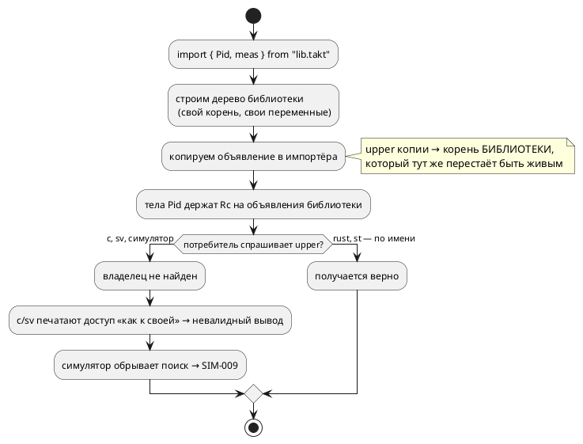
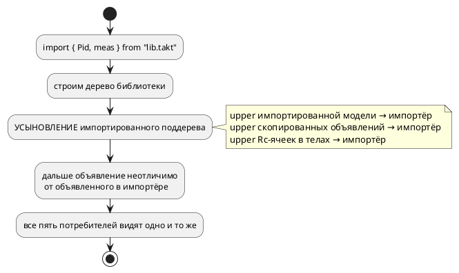

# Фича: Общие переменные библиотечного файла в импортёре

- **Номер:** 0184
- **Статус:** ГОТОВО
- **Зависит от:** нет
- **Tier:** 1
- **Связанные issue (анализ):** вскрыто пробами при взятии в разработку
  [библиотечный ПИД-регулятор и пример его применения](0182-pid-library-and-application.md) (2026-07-29); механизм импорта —
  [многофайловость LSP — импорты и позиции диагностик](0055-lsp-multifile.md), цель `c` — [генератор C: typedef корневой структуры для одиночной модели](0026-c-root-typedef.md)

## Стадии жизненного цикла (правило 17)

Все стадии — **разделы этой карточки** (правило 32): «Архитектура (ADR)»,
«Анализ», «Разработка», «Тест-план», «Отчёт о тестировании», «Итог».
Отдельным артефактом остаются только исправления —
[`docs/fixes/`](../fixes/README.md) (при необходимости `0184-YY-*`).

## Краткое описание

Модель, **импортированная** из другого файла, не может общаться с моделями
импортёра: единственный механизм связи под-моделей — переменные корня, а
импортированная модель их не видит. Обходной путь (объявить переменные контура в
библиотеке и импортировать их вместе с моделью) язык принимает, но **цель `c`
порождает некомпилируемый код**, а симулятор падает `SIM-009`. Фича делает связь
через общие переменные работающей во всех целях — либо, если решением ADR она
будет признана недопустимой, заменяет молчание явной диагностикой.

> Фича зарегистрирована **по итогам проб стадии разработки 0182** (2026-07-29):
> заявленная там форма примера («библиотечный регулятор + объект + применение,
> замыкающее контур») в текущем состоянии инструментов **нереализуема**. Далее
> проходит жизненный цикл по правилу 17.

## Что известно на входе (пробы 2026-07-29, `taktc`/`takt-sim`/`cc`)

Все три пробы воспроизводимы на файлах из двух строк; ни одна не опирается на
чтение кода.

- **П1. Импортированная модель не видит переменные импортёра.** Переменная
  объявлена в файле-применении, импортированная модель на неё ссылается →
  `SE-003` «Идентификатор 'meas' не найден в области видимости». Диагностика
  честная; это и есть причина, по которой библиотека вынуждена объявлять
  переменные контура **у себя**.
- **П2. Выборочный импорт переменных: цель `c` даёт некомпилируемый вывод.**
  `import { Pid, ctrl, meas } from "pidlib.takt";` — `taktc compile -t c`
  рапортует **успех**, переменные попадают в структуру корня, но обращения к ним
  из тел под-моделей печатаются как `model->meas` вместо `main->meas`:

  ```text
  app4.c:28:20: error: no member named 'ctrl' in 'struct Pid'
  app4.c:64:20: error: no member named 'meas' in 'struct App4Plant'
  ```

  Это **Tier 1**: компилятор сообщает об успехе, а продукт не собирается.
  Контроль: те же переменные, объявленные **в самом** файле-применении, дают
  верное `main->meas` и `cc` их принимает — то есть дефект вносит именно импорт.
- **П3. Выборочный импорт переменных: симулятор даёт `SIM-009`.** Та же модель
  под `takt-sim` — «переменная 'meas' не найдена» на шаге 1, прогон остановлен.
  Контроль: если переменные объявлены в импортёре, а модель — локальная,
  прогон идёт.
- **П4. Импорт файла целиком: обратная картина.** `import "pidlib.takt";` +
  `start App = Pidlib | Watch;` — **симулятор работает** (переменная библиотеки
  видна, `vars:z=1`), а цель `c` отказывает `CC-004: Model with name ' ()' not
  found`. Сообщение к тому же на английском и бессодержательное (правило 1).

Итог: рабочей формы «библиотека + применение со связью» сегодня **нет ни одной**.
Работает лишь случай, когда библиотечная модель самодостаточна и со средой
общается только своими портами (`book/src/09-imports/examples/thermostat.takt`) —
то есть без связи с моделями импортёра.

## Направление решения (наметка, не решение)

- Привязать импортируемое объявление переменной к модели-импортёру (при
  выборочном импорте переменная копируется вместе со своим `upper`, который
  указывает на корень **библиотеки**) — тогда правило выбора `main->`/`model->`
  цели `c` (`c_expr/resolve.rs::resolve_simple_var_in_context`) и поиск в
  контексте симулятора получат ту же переменную, что и локально объявленная.
- Либо, если ADR признает межфайловые общие переменные нежелательными, —
  запретить их **явной диагностикой** в момент импорта, а для связи предложить
  другой механизм. Молчание с некомпилируемым выводом недопустимо в любом случае.
- Разобрать `CC-004` из П4: отказ цели `c` на корне, полученном plain-импортом.

Окончательный выбор — за стадиями **архитектуры** (ADR) и **анализа**.

## Документирование (правило 24)

**Требуется** (объём определит ADR). Фича меняет наблюдаемое поведение
конструкции `import`: сегодня раздел
[`book/src/09-imports/`](../../book/src/09-imports/index.typ) обещает, что «модели
в композиции общаются через переменные корня», и отдельно — что модель можно
вынести в файл и подключить импортом; из двух обещаний вместе **не следует**
рабочей формы, и раздел об этом умалчивает. По итогам фичи раздел обязан описать
границу честно: что именно видно импортированной модели, и как замыкается связь.

## Архитектура (ADR)

- **Status:** Accepted
- **Date:** 2026-07-29
- **Authors:** Архитектор + Аналитик
- **Related issues:** [Фича](0184-imported-shared-variables.md); вскрыто пробами стадии разработки [библиотечный ПИД-регулятор и пример его применения](0182-pid-library-and-application.md); механизм импорта — [ADR](0055-lsp-multifile.md#архитектура-adr), правило доступа цели `c` — [ADR](0026-c-root-typedef.md#архитектура-adr)

### Context

Язык предлагает два механизма для сборки большого из малого: **импорт** файла и
**композицию** моделей. Раздел документа
[`book/src/09-imports/`](../../book/src/09-imports/index.typ) описывает оба и
прямо говорит, что модели в композиции общаются через **переменные корня**.

Из двух обещаний вместе рабочей формы **не следует**: модель, пришедшая
импортом, переменных корня-импортёра не видит, а если переменные объявить в
самой библиотеке и импортировать вместе с моделью — часть целей порождает
неверный код, причём **молча**.

#### Что показали пробы (2026-07-29, файлы из двух строк)

Вход — `pidlib.takt` (`var ctrl`, `var meas`, `model Pid`, пишущая `ctrl` по
`meas`) и `app4.takt` (`import { Pid, ctrl, meas } from "pidlib.takt";`, своя
`model Plant`, композиция `Pid | Plant`). Контроль — тот же текст, но с
переменными, объявленными **в самом** `app4.takt`.

| Потребитель | Переменные объявлены локально (контроль) | Переменные импортированы |
|---|---|---|
| симулятор | работает | **`SIM-009`** «переменная 'meas' не найдена» |
| цель `c` | `main->meas` — `cc` принимает | **`model->meas`** → `cc`: `no member named 'meas' in 'struct App4Plant'` |
| цель `rust` | `shared.meas` | `shared.meas` — верно |
| цель `st` | `VAR_IN_OUT` + передача в вызове | `VAR_IN_OUT` + передача — верно |
| цель `sv` | `app4_meas_next` | **голое `meas`** → verilator: `Can't find definition of variable` |

То есть **пять потребителей разошлись на одном входе**: два верны, два порождают
невалидный вывод, один отказывает. Общий для всех источник данных — семантическое
дерево, значит расхождение есть свойство дерева, а не пять независимых ошибок.

#### Причина (чтение кода + проба-мутация)

Импорт **копирует** объявление, не меняя его привязку к родителю:

```rust
// semantic/tree.rs, ветка ImportDefine::Rename
} else if let Some(v) = src.variables.get(orig) {
    variables.insert(alias, v.clone());   // upper по-прежнему → корень БИБЛИОТЕКИ
```

Корень библиотеки после импорта не жив: `Rc` на него уходит вместе с локальной
переменной, а в скопированном объявлении остаётся `Weak`, который больше не
апгрейдится. Дальше каждый потребитель обходится с этим по-своему:

- `c` и `sv` спрашивают у переменной **владельца** (`upper`), получают `None` и
  сваливаются в ветку «переменная своей модели», печатая `model->meas` / голое
  `meas`;
- `rust` и `st` строят доступ **по имени** из списков корня — и потому случайно
  правы;
- симулятор строит цепочку контекстов по `upper` **модели** — цепочка обрывается
  на мёртвом `Weak`, имя не находится.

Проба-мутация (перепривязка `upper` у импортируемой переменной **и** у
импортируемой модели) **чинит симулятор** (прогон идёт, `ctrl=1`, `meas=1`), но
**не** чинит `c`/`sv`: тела импортированной модели держат переменные за
`Rc<RefCell<VariableNode>>` — это второе представление того же объявления
(засада, зафиксированная ещё [ADR](0096-fixed-point-native-float.md#архитектура-adr)), и
правка карты `variables` до него не доходит.

Смежно: `import "lib.takt";` (файл целиком) кладёт корень библиотеки в `models`
под именем файла, но **имя самого узла** остаётся пустым — цель `c` отказывает
`CC-004: Model with name ' ()' not found` (сообщение к тому же на английском,
правило 1). Симулятор ту же модель исполняет.

#### Поток «как есть»



#### Целевой поток



### Decision Drivers

1. **Молчание недопустимо.** `taktc` рапортует успех, а `cc`/`verilator`
   отвергают вывод — Tier 1 по мерке проекта. Любое решение
   обязано убрать именно молчание.
2. **Один источник истины.** Пять потребителей разошлись потому, что каждый
   додумывал недостающую привязку по-своему. Чинить надо там, где привязка
   теряется, а не в пяти местах.
3. **Переиспользование — заявленная возможность языка.** Раздел документа обещает
   вынос модели в файл; без связи с импортёром обещание пусто, а
   [библиотечный ПИД-регулятор и пример его применения](0182-pid-library-and-application.md) нереализуема.
4. **Не расширять язык.** Синтаксис `import` менять не требуется — речь о том,
   чтобы уже описанное работало (правило 22: версия языка не растёт).
5. **Проверяемость сверкой, а не компиляцией.** Урок: проверка целевого
   языка доказывает валидность, но не верность. Нужна потактовая сверка на
   импортирующем входе.

### Considered Options

#### Option A. Усыновление импортированного поддерева (перепривязка `upper`)

В момент импорта импортированные сущности становятся сущностями импортёра:
`upper` импортированной модели, скопированных объявлений и **Rc-ячеек в телах**
поддерева перепривязывается на модель-импортёра. Обход поддерева — по образцу
`semantic/lower_float.rs` (тот же класс задачи: мутация обоих представлений
`VariableNode`).

**Pros:**
- чинит **все пять** потребителей одной правкой в одном слое: после усыновления
  импортированное объявление неотличимо от объявленного в импортёре, и никакой
  потребитель ничего не додумывает;
- доказано частично: проба-мутация уже чинит симулятор;
- аддитивно, язык не меняется, существующие однофайловые входы не задеты
  (у них `upper` и так верен);
- образец обхода в проекте есть — писать «с нуля» нечего.

**Cons:**
- обход поддерева — новый код (порядка `lower_float.rs` по размеру), и он обязан
  быть исчерпывающим: пропущенный узел вернёт молчаливый дефект в другом месте;
- усыновление делает импортированную переменную **общей** — форма «один файл
  импортирован дважды» обязана быть покрыта тестом.

#### Option B. Единое представление `VariableNode` (только за `Rc`)

Устранить дублирование «owned в `model.variables` + `Rc<RefCell>` в телах»,
оставив одно представление; тогда правка привязки в одном месте видна всем.

**Pros:** снимает **класс** засады, а не случай (ADR уже платил ту же цену
на типах: проход обязан был мутировать оба `ty`).
**Cons:** переделка ядра семантики, затрагивающая все проходы и все цели; риск
несоразмерен поводу. Отвергается **сейчас**, но записывается кандидатом — это
правильная цель для отдельной фичи.

#### Option C. Починить резолверы целей `c` и `sv`

Научить `c_expr/resolve.rs` и `sv_fsm` искать переменную по имени среди
переменных корня, когда владелец недоступен.

**Cons:** лечит симптом в двух местах из пяти (симулятор всё равно падает),
закрепляет «додумывание» как приём и обязывает каждую будущую цель повторить
трюк. Прямо противоречит драйверу 2.

#### Option D. Запретить импорт переменных диагностикой

Считать межфайловые общие переменные ошибкой и отвергать `import { meas }` явным
`SE-0xx`.

**Pros:** дёшево; молчание уходит.
**Cons:** уничтожает переиспользование — единственным механизмом связи
под-моделей остаётся внутрифайловый, то есть «библиотека» в языке возможна лишь
как самодостаточная модель без связи с импортёром. 0182 при этом закрывается
только отказом, а форма примера подстроилась бы под дыру вместо её устранения.

### Decision

Принимается **Option A**.

Чинится место, где привязка теряется, а не пять мест, где её отсутствие
по-разному додумывают. Объём ограничен слоем импорта и обходом импортированного
поддерева; язык не меняется.

Дополнительно в объём фичи включается **вторая ветка того же корня** — `import`
файла целиком: импортированному корню назначается имя, под которым он внесён в
`models`, чтобы цель `c` не отказывала `CC-004` на пустом имени.

**Вне объёма** (записано кандидатом в `FEATURES.md`): квалифицированный доступ к
переменной под-модели (`Pid.ctrl`), который цель `c` молча теряет, а симулятор
отвергает `SIM-014`. Это другой предмет — доступ, а не привязка (урок: два
предмета под одним номером не ведут).

#### Граница поведения (что именно обещаем)

- Импортированное объявление (`var`/`const`/порт) ведёт себя **точно так же**,
  как объявленное в импортёре: видно моделям импортёра и импортированным
  моделям, живёт в одном экземпляре, попадает в порождённый код один раз.
- Импортированная модель видит переменные **импортёра** ровно в той же мере, в
  какой их видит локально объявленная под-модель.
- Переменная импортёра, **не** импортированная в библиотеку, остаётся невидимой
  библиотечной модели — `SE-003` сохраняется (это не дефект, а область видимости).

### Consequences

#### Положительные

- «библиотека + применение» становится рабочей формой: 0182 разблокируется;
- пять потребителей перестают расходиться на одном входе;
- цели `c` и `sv` перестают выдавать невалидный вывод при рапорте об успехе.

#### Отрицательные / Action items

- обход импортированного поддерева обязан быть **исчерпывающим**; пропуск узла
  даст молчаливый дефект — покрывается сверкой на импортирующем входе, а не
  только фактом компиляции;
- Option B (единое представление `VariableNode`) остаётся незакрытым долгом —
  записать кандидатом;
- раздел документа `book/src/09-imports/` обязан описать границу видимости
  честно (правило 24) — сегодня он о ней умалчивает.

#### Acceptance criteria

1. На входе «библиотека с переменными контура + применение с моделью-объектом»
   **все** потребители согласованы: симулятор исполняет, `cc` компилирует под
   `-Wall -Werror`, `verilator` и `yosys` принимают, `iec2c` принимает,
   `rustc` с `clippy -D warnings` принимают.
2. Потактовая **сверка значений** (не факт компиляции) на импортирующем входе:
   трасса симулятора совпадает с трассой порождённого `c` — новый тест в
   `takt-sim/tests/`.
3. `import "lib.takt";` целиком: цель `c` порождает код, а не `CC-004`.
4. `SE-003` на переменную импортёра, не импортированную в библиотеку,
   **сохраняется** (контр-пример в тестах).
5. Вывод для всего существующего корпуса `examples/` — **байт-в-байт прежний**
   (импорта верхнеуровневых переменных в корпусе нет; доказывают проверка
   воспроизводимости и `git diff` по `examples/generated/`).
6. Раздел `book/src/09-imports/` дополнен описанием границы видимости.
7. `./scripts/precheck.sh` зелёный.

## Анализ

### Цель и контекст

Реализовать **Option A** ADR: импортированные сущности **усыновляются**
импортёром — их привязка к родителю (`upper`) перепривязывается на
модель-импортёра, после чего импортированное объявление неотличимо от
объявленного в импортёре для **всех** потребителей семантического дерева
(симулятор и пять целей генерации).

Язык **не меняется**: синтаксис `import` прежний, новых конструкций нет. Версия
языка не растёт (правило 22). Наблюдаемое поведение меняется — там, где сегодня
порождается невалидный вывод или теряется прогон.

### Зависимости фичи (правило 17/19)

- **Зависит от:** нет. Все затрагиваемые механизмы закрыты: импорт (0003, 0055),
  цель `c` (0026), цель `sv` (0045), общая структура цели `rust` (0059),
  симулятор (0025, 0032).
- **Влияние на порядок разработки:** **разблокирует**
  [библиотечный ПИД-регулятор и пример его применения](0182-pid-library-and-application.md) (библиотечный ПИД и
  пример применения), которая без неё нереализуема. Место в таблице — начало
  блока: Tier 1 и разблокировка другой фичи (правило 19, критерии 3 и 4).
- **Смежные, но не зависимости:**
  - кандидат «единое представление `VariableNode` за `Rc`» (Option B ADR) —
    снял бы **класс** засады; отвергнут по соразмерности, записывается кандидатом;
  - кандидат «`Pid.ctrl` молча теряется целью `c`» — иной предмет (доступ, а не
    привязка), вынесен из объёма решением ADR.

### Требования и проверяемые условия

- **R1. Усыновление объявлений.** После выборочного импорта (`import { M, v }
  from "lib.takt";`) объявление `v` принадлежит импортёру: `upper` указывает на
  модель-импортёра **и в карте** `model.variables`, **и в `Rc`-ячейках**, через
  которые на него ссылаются тела импортированного поддерева.
- **R2. Усыновление модели.** `upper` импортированной модели указывает на
  импортёра; цепочка контекстов симулятора и цепочка владельцев генераторов
  проходят через неё до корня применения.
- **R3. Согласие потребителей.** На одном и том же импортирующем входе:
  симулятор исполняет; `cc` компилирует под `-Wall -Werror`; `verilator
  --lint-only -Wall` и `yosys synth` принимают; `iec2c` принимает; `rustc` и
  `clippy -D warnings` принимают.
- **R4. Верность, а не только валидность.** Потактовая трасса симулятора и
  порождённого `c` на импортирующем входе **совпадает** (сверка значений).
- **R5. Частичный импорт не молчит.** Если тело импортированной модели
  ссылается на верхнеуровневое объявление библиотеки, **не** импортированное
  вместе с ней, — диагностика **`SE-074`** с указанием имени и файла, а не
  повисшая ссылка. Сегодня этот случай даёт ровно тот же невалидный вывод, что и
  П2 карточки.
- **R6. Импорт файла целиком не отказывает.** `import "lib.takt";` и
  `import "lib.takt" as Io;` — цель `c` порождает код; `CC-004` на пустом имени
  исчезает (импортированному корню назначается имя, под которым он внесён в
  `models`).
- **R7. Область видимости сохранена.** Переменная импортёра, не импортированная
  в библиотеку, библиотечной модели **не видна** — `SE-003` остаётся (это
  граница, а не дефект).
- **R8. Корпус неизменен.** Вывод всех целей для `examples/` — байт-в-байт
  прежний: верхнеуровневых импортов переменных корпус не содержит.

### Раскладка правки

| Место | Что делает |
|---|---|
| `takt-lang/src/semantic/import_adopt.rs` (новый) | обход импортированного поддерева: перепривязка `upper` у моделей, объявлений и `Rc`-ячеек; сбор неимпортированных зависимостей для `SE-074` |
| `takt-lang/src/semantic/tree.rs`, ветки `ImportDefine::{Plain, GlobalSymbol, Rename}` | вызов усыновления, пока корень библиотеки **жив**; назначение имени импортированному корню (R6) |
| `takt-lang/src/semantic/mod.rs` | реэкспорт нового модуля |
| `docs/diagnostics/README.md`, `book/src/appendix-errors/` | регистрация `SE-074` |
| `book/src/09-imports/index.typ` | описание границы видимости (правило 24) |

Образец обхода — `semantic/lower_float.rs` (`lower_model`/`lower_state`/
`lower_stmt`/`lower_expr`/`lower_cond`): тот же класс задачи — мутация **обоих**
представлений `VariableNode` (owned в карте и за `Rc<RefCell<…>>` в телах), та же
защита от повторного обхода разделяемой под-модели через `HashSet<*const …>`.

### Ограничения, которые определяют решение

- **О1. Момент усыновления — пока корень библиотеки жив.** Признак «эта ячейка
  принадлежит библиотеке» — сравнение `upper` с `Rc` импортированного корня
  (`Rc::ptr_eq` после `upgrade`). После выхода из ветки импорта `Rc` умирает, и
  отличить «библиотечную» ячейку от любой другой с мёртвым `Weak` уже нельзя.
  Значит вызов усыновления обязан стоять **внутри** ветки импорта.
- **О2. Два представления `VariableNode`.** Правка карты `variables` **не**
  доходит до тел: они держат `Rc<RefCell<VariableNode>>`. Проба это подтвердила —
  перепривязка карты починила симулятор (он ищет по цепочке моделей), но не
  цели `c`/`sv` (они спрашивают владельца у ячейки). Обход обязателен.
- **О3. Рёбра `ref` не разрешаются** (инвариант проекта): условия хранятся как
  `Condition::Unresolved(ast::Condition)` и разрешаются кодогеном против карты
  `variables`. Обход усыновления их **не трогает** — как и `lower_float`.
- **О4. Разделяемая под-модель обходится один раз.** Один и тот же `Rc` модели
  может встретиться дважды (композиция); повторный обход без защиты даст
  бесконечную рекурсию на циклических ссылках `upper`.
- **О5. Импорт одного файла дважды.** Две ветки импорта одного файла строят
  **разные** деревья (`construct_model_impl` вызывается заново), поэтому
  усыновление не порождает разделяемого состояния между ними. Требует теста —
  это единственное место, где «общая переменная» могла бы неожиданно склеить
  два независимых импорта.
- **О6. Имя модели при plain-импорте.** Имя, под которым корень библиотеки
  внесён в `models` (`Pidlib` для `pidlib.takt`), сегодня **не** записывается в
  сам узел — отсюда `CC-004: Model with name ' ()' not found`. Назначение имени
  меняет вывод только для входов с plain-импортом; в корпусе таких нет (R8).
- **О7. Правило 29 (редакторский слой).** Фича не вводит ни токена, ни узла АСД,
  ни формы объявления — списки LSP и плагинов не меняются. **Новая диагностика
  `SE-074`** обязана доезжать до редактора: она поднимается на этапе построения
  дерева, то есть попадает в общий вход `collect_compile_diagnostics` (0130) и
  доходит до LSP без отдельной правки. Ответ фиксируется здесь и в отчёте.

### Критерии приёмки и способ проверки

| # | Критерий | Способ проверки |
|---|---|---|
| A1 | Усыновление объявлений и моделей (R1, R2) | модульные тесты `import_adopt`: после импорта `upper` объявления и модели указывают на импортёра |
| A2 | Согласие потребителей (R3) | новый интеграционный тест: один вход → пять целей + симулятор, каждая проверяется своим инструментом |
| A3 | Верность трассы (R4) | `takt-sim/tests/conformance/conformance_c_import_tests.rs` — потактовая сверка значений sim ↔ порождённый C |
| A4 | Частичный импорт даёт `SE-074` (R5) | контр-пример: `import { Pid }` без переменной, на которую ссылается тело |
| A5 | Plain-импорт компилируется (R6) | тест: `import "lib.takt";` → цель `c` порождает файл, `cc` его принимает |
| A6 | `SE-003` сохранён (R7) | контр-пример: переменная импортёра, не импортированная в библиотеку |
| A7 | Корпус неизменен (R8) | `git diff` по `examples/generated/` пуст; проверка воспроизводимости зелёный |
| A8 | Раздел документа описывает границу | проверка примеров `book/`, `scripts/check-book-glyphs.py`, `scripts/check-links.py` |
| A9 | Корпус зелёный | `./scripts/precheck.sh` |

### Предлагаемая декомпозиция разработки

| Задача | Содержание |
|---|---|
| 0184-01 | слой усыновления `semantic/import_adopt.rs` + вызовы в трёх ветках импорта; модульные тесты привязки |
| 0184-02 | диагностика `SE-074` (частичный импорт) + имя импортированного корня (устранение `CC-004`); регистрация кода в реестре и приложении документа |
| 0184-03 | тесты согласия потребителей и потактовая сверка sim ↔ `c` на импортирующем входе; контр-примеры |
| 0184-04 | раздел `book/src/09-imports/` — граница видимости импортированной модели |

### Особенности по обратной совместимости (правило 11)

- **Однофайловые входы не задеты**: у них `upper` и так указывает на нужную
  модель, обход усыновления по ним не идёт вовсе (он вызывается только из веток
  импорта). Доказательство — R8/A7: вывод корпуса байт-в-байт прежний.
- **Входы с импортом моделей без переменных** (единственная работающая сегодня
  форма — `book/src/09-imports/examples/room.takt`) сохраняют поведение:
  усыновление меняет владельца, но ни одна ссылка в теле такой модели на
  верхнеуровневые объявления библиотеки не указывает.
- **Ломающее изменение** возможно ровно одно: вход, который сегодня
  **компилируется молча неверно** (П2/П4 карточки), после фичи либо начнёт
  работать верно, либо получит `SE-074`. Второе — сознательный отказ вместо
  повисшей ссылки; обоснование — драйвер 1 ADR (молчание недопустимо).

### Риски

- **Риск неполного обхода.** Пропущенный вид узла оставит часть ячеек
  непривязанными — и дефект вернётся в другом месте, снова молча. Снижение:
  обход пишется по образцу `lower_float.rs` (он уже покрывает весь набор узлов),
  а доказательство — **сверка значений** (A3), а не факт компиляции.
- **Риск ложного усыновления.** Признак «принадлежит библиотеке» по `Rc::ptr_eq`
  обязан сравниваться именно с корнем импортируемого файла; ошибка сравнения
  перепривяжет чужие ячейки. Снижение: тест «импорт одного файла дважды» (О5) и
  тест «переменные вложенных моделей библиотеки не тронуты».
- **Риск ряби в корпусе.** Назначение имени импортированному корню (О6) меняет
  вывод для plain-импорта. Снижение: в корпусе plain-импорта нет; A7 это
  подтверждает измерением, а не рассуждением.

## Разработка

### Задача

#### Что было

`import` строил дерево подключаемого файла отдельным вызовом
`construct_model_impl`, и всё, что оттуда приходило, сохраняло привязку (`upper`)
к корню **библиотеки**. Корень после импорта не жил, привязка повисала, и пять
потребителей семантического дерева расходились на одном входе (замер — в ADR):
цели `c` и `sv` порождали невалидный вывод при рапорте `taktc` об успехе,
`rust`/`st` были случайно правы, симулятор падал `SIM-009`.

#### Что сделано

**Слой усыновления** — `takt-lang/src/semantic/import/adopt.rs`. Импортированное
объявление становится объявлением импортёра: перепривязывается `upper` **и** в
карте `variables`, **и** в `Rc`-ячейках, через которые на объявление ссылаются
тела импортированного поддерева (два представления `VariableNode` — засада,
известная с 0096). Обход построен по образцу `semantic/lower_float.rs`: тот же
состав узлов, та же защита от повторного обхода разделяемой под-модели.

Три входа, по одному на форму импорта:

- `adopt_selected_model` — `import { M } from "lib";`: модель становится
  под-моделью импортёра и получает **имя, под которым внесена** в его список
  (иначе уникальное имя разъезжается с местом в дереве → `CC-004`; дефект был и
  до фичи). Объявления, на которые опирается тело модели, но которые не
  импортированы, дают **`SE-074`** — вместо повисшей привязки;
- `adopt_whole_file` — `import "lib.takt";` и `as`-форма: корень подключённого
  файла становится под-моделью и получает имя, а его верхнеуровневые объявления
  **переносятся к импортёру**. Оставить их у промежуточной модели нельзя:
  обращение к переменной промежуточной модели цели не выражают (проба:
  `model->app.pidlib0.z` изнутри вложенной модели не компилируется). Конфликт
  имени с объявлением импортёра — `SE-005`;
- `adopt_declaration` — перепривязка копии, которую ветка импорта кладёт в карту
  импортёра (включая переименование по `as`).

**Момент вызова принципиален**: усыновление идёт **внутри** ветки импорта,
пока `Rc` корня библиотеки жив — по нему и опознаются его объявления
(`Rc::ptr_eq`). После выхода из ветки отличить такую ячейку от любой другой с
мёртвым `Weak` уже нельзя.

**Владельца самих моделей поддерева обход не меняет**: под-модель библиотеки
остаётся под-моделью своей модели. Первая редакция перепривязывала всё поддерево
и получила `CC-004` — цель `c` искала `App:Inner`, а зарегистрирована была
`App:Pidlib:Inner`.

**Вынос ветки выборочного импорта** — `takt-lang/src/semantic/import/select.rs`.
Ветка `ImportDefine::Rename` переехала из `tree.rs` целиком: файл сверх лимита
размера, расти ему нельзя (проверка `check-module-size.sh` отказал сразу же). Запись
долга уменьшена по факту: `1831 → 1814`.

Диагностика `SE-074` зарегистрирована в `docs/diagnostics/README.md` и в
приложении документа.

#### Проверки

```sh
cargo build --bin taktc --bin takt-sim
cargo test --all-features -- --test-threads=1     # 76 наборов, падений нет
./scripts/check-module-size.sh                     # запись долга уменьшена
./scripts/check-diagnostic-codes.sh                # SE → 074
```

Соответствие условиям анализа: R1, R2 (усыновление объявлений и модели),
R5 (`SE-074`), R6 (импорт файла целиком компилируется), R7 (`SE-003` сохранён).
Проверки R3/R4 — в задаче [общие переменные библиотечного файла в импортёре](0184-imported-shared-variables.md#разработка).

### Задача

#### Что было

Импортирующий вход не покрывался **ничем**: в корпусе `examples/` импорта
верхнеуровневых объявлений нет, в тестах — тоже. Именно поэтому расхождение пяти
потребителей дожило до сегодняшнего дня при полностью зелёных проверках.

#### Что сделано

**Тесты семантики и текста вывода** — `takt-lang/tests/semantic/import_adopt_tests.rs`
(7 тестов): доступ через `main->` в обеих под-моделях (и отсутствие ошибочных
форм), `SE-074` на частичный импорт с перечислением **всех** пропущенных имён,
сохранение `SE-003`, алиас модели, псевдоним объявления, два импорта одного файла
как два независимых состояния, импорт файла целиком. Каждый тест, порождающий C,
дополнительно вызывает настоящий `cc` под `-Wall -Werror` — теми же флагами, что
и проверка корпуса (0171): дефект был именно в том, что текст **не собирается**.

**Потактовая сверка значений** — `takt-sim/tests/conformance/conformance_c_import_tests.rs`
на фикстурах `takt-sim/tests/data/eval/import_pid_{lib,app}.takt`. Трасса порта
`lvl` у эталона и у порождённого C сверяется потактово и пиннится значением
`1, 3, 7, 15, 31`: такая последовательность возможна **только** при одной
переменной на обе модели — при копиях `meas` не рос бы. Это и есть проверка
верности, которой не даёт ни одна проверка компиляции.

**Фикстура сперва разошлась не по предмету фичи.** Первая редакция не имела
самопетли у состояния регулятора, и сверка упала: эталон держит состояние без
исходящих рёбер активным (`1, 3, 7, 15, 31`), а цель `c` после первого такта
уводит модель в `END` (`1, 2, 3, 4, 5`). Проверено на **однофайловом** входе —
импорт ни при чём. В фикстуре самопетля проставлена явно, а само расхождение
записано **кандидатом** в `FEATURES.md`: это отдельный предмет (ср. урок).

**Раздел документа** — `book/src/09-imports/index.typ`, новый подраздел «Что видит
подключённая модель»: граница видимости, форма связи через объявления библиотеки,
`SE-074` на частичный импорт, поведение импорта файла целиком, независимость
двух импортов одного файла. Примеры вынесены в
`book/src/09-imports/examples/pid_lib.takt` и `pid_loop.takt` — так их проверяет
проверка примеров `book/` (0133): библиотечный распознаётся по грепу `from "…"` и
проверяется импортёром, применение компилируется целью `c` и симулируется.
Прогон, приведённый в разделе, снят с настоящего запуска: уровень догоняет
уставку за 10 шагов, на 11-м воздействие снимается.

Блок «Частые ошибки» раздела дополнен `SE-074` и `SE-005` (правило 26).

#### Проверки

```sh
cargo test --test import_adopt_tests -- --test-threads=1                 # 7 из 7
cargo test -p takt-sim --test conformance_c_import_tests -- --test-threads=1
./scripts/precheck.sh                                                     # зелёный
```

Соответствие условиям анализа: R3 (все потребители согласны — покрыто проверками
предкоммита на корпусе плюс `cc` в тестах), R4 (потактовая сверка), R8 (вывод
корпуса байт-в-байт прежний: `git diff examples/generated/` пуст),
A8 (проверки документа зелёные).

## Тест-план

### Область и цель

Проверяется, что объявление, пришедшее `import`ом, ведёт себя **точно так же**,
как объявленное в импортёре, — у всех потребителей семантического дерева
(симулятор и цели генерации), и что случаи, которые механизм не покрывает,
дают **явную диагностику**, а не повисшую привязку.

Ключевая мера: **значения**, а не факт компиляции. Ошибка привязки не обязана
давать отказ — она может дать две копии одной переменной; такой код собирается
всеми инструментами, а контур молча разомкнут (класс уроков и 0050).

Фича меняет **лексику/синтаксис/семантику языка?** Нет: `import` прежний, новых
конструкций нет. Правило 16 (примеры и контрпримеры) применяется в части
диагностик; правило 29 (редакторский слой) — ответ в отчёте.

### Проверки (условие → ожидаемый результат)

| # | Проверка | Предусловие | Ожидаемый результат | Ссылка на R/A |
|---|---|---|---|---|
| T1 | Доступ к импортированному объявлению в цели `c` | библиотека с `var ctrl/meas` + модель; применение импортирует модель и объявления | обе под-модели печатают `main->…`; форм `model->meas = model->meas + …` нет; `cc -Wall -Werror` принимает | R1, R3 / A1, A2 |
| T2 | Потактовая сверка значений | та же пара файлов, 5 тактов | трасса эталона = трасса порождённого C = `1, 3, 7, 15, 31` (возможна только при **одной** переменной) | R4 / A3 |
| T3 | Частичный импорт | `import { Pid }` без объявлений, на которые опирается тело | `SE-074` с перечислением **всех** пропущенных имён | R5 / A4 |
| T4 | Импорт файла целиком | `import "lib.takt";` + композиция | цель `c` порождает код (не `CC-004`), объявление файла становится переменной корня, `cc` принимает | R6 / A5 |
| T5 | Область видимости | переменная объявлена в импортёре, библиотечная модель на неё ссылается | `SE-003` — не видна (граница сохранена) | R7 / A6 |
| T6 | Алиас модели | `import { Pid as Loop, … }` | компилируется; тело модели не изменилось | R2 / A1 |
| T7 | Псевдоним объявления | `import { meas as pv }` | тело ссылается на `pv`; имён библиотеки в выводе нет | R1 / A1 |
| T8 | Два импорта одного файла | две ветки импорта одного файла с разными псевдонимами | четыре независимых переменных корня; состояния не склеены | О5 / A1 |
| T9 | Корпус не изменился | `examples/` | `git diff examples/generated/` пуст; проверка воспроизводимости зелёный | R8 / A7 |
| T10 | Раздел документа | `book/src/09-imports/` | примеры компилируются и симулируются; глифы и ссылки зелёные | R5 / A8 |
| T11 | Корпус зелёный | весь репозиторий | `./scripts/precheck.sh` — код 0 | R6 / A9 |

### Разбивка проверок по функциональности

Единые условия и ожидаемые результаты прогоняются против каждой задеваемой
обратной функциональности (правило 11); фиксируется статус.

| Функциональность | Как затронута | Статус |
|---|---|---|
| симулятор (`takt-sim`) | цепочка контекстов проходит через усыновлённую модель | ✅ |
| цель `c` | доступ к импортированной переменной через корень | ✅ |
| цель `sv` | то же в сигналах модуля | ✅ |
| цель `rust` | была права и до фичи — проверяем отсутствие регресса | ✅ |
| цель `st` | то же | ✅ |
| цель `plantuml` | структура диаграммы | ✅ |
| LSP и плагины (правило 29) | новых токенов/узлов нет; новая диагностика идёт общим входом | ✅ |

<!-- Легенда: ✅ пройдено · ❌ провалено · ⬜ не проверялось · — не применимо -->

### Тестовые данные и окружение

- `takt-lang/tests/semantic/import_adopt_tests.rs` — фикстуры создаются во временном
  каталоге парой файлов (библиотека + применение): импорт ищет файл рядом с
  импортирующим, поэтому пара обязана лежать в одном каталоге.
- `takt-sim/tests/data/eval/import_pid_lib.takt` и `import_pid_app.takt` —
  фикстуры потактовой сверки.
- `book/src/09-imports/examples/pid_lib.takt` и `pid_loop.takt` — примеры
  раздела документа (проверяются примеров `book/`).
- Инструменты: `cc` (обязателен для T1/T2/T4 — при отсутствии проверки мягко
  пропускаются), `verilator`/`yosys`, `iec2c`, `rustc`+`clippy` — через
  `precheck.sh`.

## Отчёт о тестировании

### Резюме

**✅ ПРОЙДЕН (11 из 11).** Импортированное объявление ведёт себя как объявленное
в импортёре у всех потребителей; расхождение пяти потребителей на одном входе
устранено; случаи, механизмом не покрываемые, дают явную диагностику
(`SE-074`, `SE-005`, `SE-003`). Фича готова к закрытию.

Окружение: macOS (Darwin 25.5.0), rustc/clippy 1.97.1 (пин `rust-toolchain.toml`),
Apple clang, verilator 5.050, yosys 0.67+post, MatIEC `iec2c`
(`~/.local/bin/iec2c`). Прогон: `./scripts/precheck.sh` — код 0;
`cargo test --all-features -- --test-threads=1` — 76 наборов, падений нет.

### Фактические результаты по проверкам

| # | Проверка | Результат | Комментарий |
|---|---|---|---|
| T1 | Доступ к импортированному объявлению в цели `c` | ✅ | обе под-модели печатают `main->ctrl`/`main->meas`; ошибочных форм нет; `cc -std=c11 -Wall -Werror` принимает (`import_adopt_tests::imported_variable_is_accessed_through_root_in_c`) |
| T2 | Потактовая сверка значений | ✅ | эталон = C = `1, 3, 7, 15, 31` (`conformance_c_import_tests`) |
| T3 | Частичный импорт | ✅ | `SE-074`, перечислены **оба** пропущенных имени (`'ctrl'`, `'meas'`) |
| T4 | Импорт файла целиком | ✅ | `CC-004` исчез; объявление файла стало переменной корня (`main->z`), `cc` принимает |
| T5 | Область видимости | ✅ | `SE-003` сохранён: переменная импортёра библиотечной модели не видна |
| T6 | Алиас модели | ✅ | `import { Pid as Loop }` компилируется; до фичи давал `CC-004` (замер на baseline) |
| T7 | Псевдоним объявления | ✅ | тело ссылается на `pv`/`u`; имён библиотеки в выводе нет |
| T8 | Два импорта одного файла | ✅ | четыре независимых переменных корня; симулятор различает `W1::own`/`W2::own` |
| T9 | Корпус не изменился | ✅ | `git diff examples/generated/` пуст; проверка воспроизводимости зелёный |
| T10 | Раздел документа | ✅ | проверка примеров `book/`: 19 проверено, 2 библиотечных (`pid_lib.takt` в их числе); глифы и ссылки зелёные |
| T11 | Корпус зелёный | ✅ | `./scripts/precheck.sh` — код 0 |

### Результаты по функциональности

Замер «до/после» снят на **одном и том же** входе (библиотека с переменными
связи + применение с моделью-объектом): столбец «до» получен на baseline
(`git stash`), столбец «после» — на реализации.

| Функциональность | До фичи | После | Статус |
|---|---|---|---|
| симулятор (`takt-sim`) | `SIM-009`, прогон остановлен | исполняет, трасса `1, 3, 7, 15, 31` | ✅ |
| цель `c` | `model->meas` → `cc`: `no member named 'meas' in 'struct App4Plant'` | `main->meas`, `cc -Wall -Werror` принимает | ✅ |
| цель `sv` | голое `meas` → verilator: `Can't find definition of variable` | `app4_meas_next`; verilator **и** yosys принимают | ✅ |
| цель `rust` | верно (`shared.meas`) | верно, регресса нет; `rustc --deny warnings` собирает | ✅ |
| цель `st` | верно (`VAR_IN_OUT` + передача) | верно, регресса нет; `iec2c` принимает | ✅ |
| цель `plantuml` | порождалась | порождается | ✅ |
| LSP и плагины (правило 29) | — | правок не требуется, обоснование ниже | ✅ |

**Правило 29 (редакторский слой) — ответ:** правок не требуется, и вот почему.
Фича не вводит ни ключевого слова, ни токена, ни узла АСД, ни новой формы
объявления или импорта — синтаксис `import` прежний, изменилось только то, как
разрешается уже описанное. Единственное новое наблюдаемое — диагностика
`SE-074`; она поднимается на стадии построения дерева (`construct_model_stage0`),
то есть идёт общим входом `collect_compile_diagnostics` (0130) и доходит до
редактора без отдельной правки. Списки `lsp/keywords.rs::BUT_KEYWORDS`,
`lsp/semantic_tokens.rs` и `TaktTokenTypes.KEYWORDS` плагина IntelliJ не
затрагиваются.

### Выводы и дальнейшие шаги

1. **Причина была одна, проявлений — пять.** Расхождение потребителей объяснялось
   не пятью ошибками, а одной потерянной привязкой; починка в слое импорта
   закрыла все пять. Это подтверждает драйвер 2 ADR («один источник истины»).
2. **Дефект пережил все проверки, потому что импортирующего входа не было ни в
   корпусе, ни в тестах.** Теперь он есть в обоих видах: тесты цели и потактовая
   сверка значений.
3. **Найдено попутно и записано кандидатами** (правило 7; в объём 0184 не
   включено — иной предмет):
   - состояние без исходящих рёбер: эталон держит его активным, цель `c` уводит
     в `END` после одного такта — **молчаливое расхождение поведения**, вскрыто
     при написании фикстуры сверки, воспроизводится на однофайловом входе;
   - модель без стартового состояния: цель `c` отказывает `CC-005: State with
     name ' ()' not found` — по-английски и без смысла;
   - `Pid.ctrl` (доступ к переменной под-модели через точку): цель `c` молча
     теряет оператор, симулятор даёт `SIM-014`.
4. **Исправлений (`docs/fixes/0184-YY-*`) не потребовалось.**
5. **Разблокирована [библиотечный ПИД-регулятор и пример его применения](0182-pid-library-and-application.md)** —
   форма примера, ради которой фича заведена, теперь исполнима: раздел
   `book/src/09-imports/` уже содержит её рабочий прообраз (регулятор в
   библиотеке + объект в применении).

## Итог (что сделано)

Импортированное объявление стало объявлением импортёра. Слой усыновления
`takt-lang/src/semantic/import/adopt.rs` перепривязывает владельца (`upper`) **и**
в карте переменных, **и** в `Rc`-ячейках тел импортированного поддерева — оба
представления `VariableNode`, порознь чинить которые бесполезно. Ветка
выборочного импорта вынесена в `semantic/import/select.rs` (проверка размера не дал
`tree.rs` расти; запись долга уменьшена `1831 → 1814`).

Одна причина закрыла **пять** проявлений: симулятор перестал падать `SIM-009`,
цели `c` и `sv` — порождать невалидный вывод при рапорте об успехе, `rust` и `st`
подтвердили отсутствие регресса. Импорт файла целиком больше не отказывает
`CC-004`; частичный импорт даёт новую диагностику **`SE-074`**, перечисляя все
недостающие имена; область видимости не расширена — `SE-003` сохранён.

Доказательство — не компиляция, а **значения**: потактовая сверка эталона и
порождённого C на импортирующем входе (`takt-sim/tests/conformance/conformance_c_import_tests.rs`,
трасса `1, 3, 7, 15, 31`, возможная лишь при одной переменной на обе модели).
Плюс 7 тестов цели и диагностик (`takt-lang/tests/semantic/import_adopt_tests.rs`), каждый
с настоящим `cc -Wall -Werror`. Вывод корпуса `examples/` — байт-в-байт прежний.

Раздел [`book/src/09-imports/`](../../book/src/09-imports/index.typ) описал границу
видимости честно (подраздел «Что видит подключённая модель») с рабочим примером
«библиотека + применение», проверяемым проверкой примеров.

Детали — [отчёт](0184-imported-shared-variables.md#отчёт-о-тестировании) (✅ 11 из 11);
исправлений (`docs/fixes/0184-YY-*`) не потребовалось. Попутные находки записаны
кандидатами в `FEATURES.md`, в объём не втянуты. Разблокирована
[библиотечный ПИД-регулятор и пример его применения](0182-pid-library-and-application.md).
