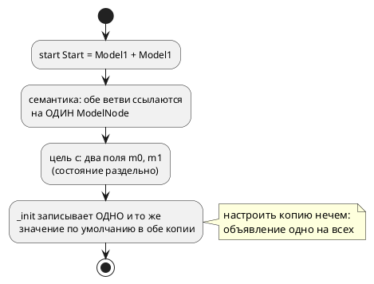
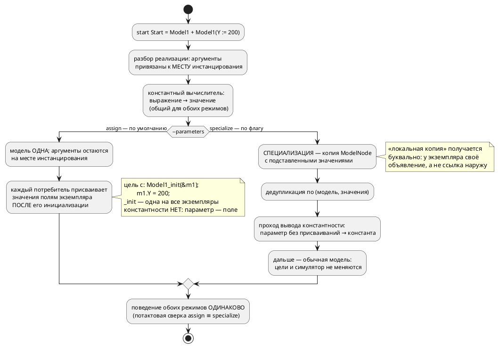

# Фича: Параметризация моделей (ключевое слово `parameter`)

- **Номер:** 0185
- **Статус:** ГОТОВО
- **Зависит от:** нет
- **Tier:** 1 (приоритет повышен решением заказчика 2026-07-29)
- **Связанные issue (анализ):** запрос заказчика 2026-07-29 (уточнён трижды: форма объявления и аргументы-выражения — 2026-07-29; два режима генерации — 2026-07-30); снимает ограничение О8 анализа [библиотечный ПИД-регулятор и пример его применения](0182-pid-library-and-application.md) («параметризации моделей нет»)

## Стадии жизненного цикла

Все стадии — **разделы этой карточки**: «Архитектура (ADR)»,
«Анализ», «Разработка», «Тест-план», «Отчёт о тестировании», «Итог».
Отдельным артефактом остаются только исправления —
[`docs/fixes/`](../fixes/README.md) (при необходимости `0185-YY-*`).

## Краткое описание

Ввести в язык **параметры модели** — третью форму объявления наряду с `var` и
`const`:

```takt
model Model1 {
    var X: u8 := 100;         // обычная переменная: задаётся только внутри
    parameter Y: u8 := 100;   // параметр: значение по умолчанию 100,
}                             // но его можно задать в месте инстанцирования

start Start = Model1 + Model1(Y := 200);
```

Первая копия работает со `100`, вторая — с `200`.

**Пять уточнений заказчика, определяющих форму** (2026-07-29 и 2026-07-30):

1. `parameter` — **самостоятельное ключевое слово**, а не спецификатор при `var`.
   Формы `var parameter` не существует.
2. **Отдельной константной формы нет.** Константность выводится **семантически**:
   параметр, который нигде в модели не изменяется, есть константа (и может
   эмитироваться как константа); параметр, которому присваивают, — переменная с
   заданным начальным значением.
3. `parameter` — **локальная копия**. Значение вычисляется в месте
   инстанцирования и копируется в экземпляр; связи с внешним объявлением у него
   нет, и изменение внутри модели наружу не видно.
4. **Аргумент инстанцирования — константное выражение, а не только число.**
   Допустимы арифметика над именами, литералы длительности и вызовы
   **константных функций** — функций, вычислимых на этапе компиляции
   (генерации):

   ```takt
   start Start = Model1(X := Y + 1, C := 5s, D := calculate_parameter(U + 67));
   ```

   Здесь `X`/`C`/`D` — параметры `Model1`, а `Y`/`U` — константные имена,
   видимые в месте инстанцирования; `calculate_parameter(U + 67)` вычисляется
   компилятором, и параметр `D` получает готовое значение. Ссылка на величину
   времени исполнения (переменную, порт) остаётся ошибкой.
5. **Два режима генерации, выбираемые флагом** (уточнение 2026-07-30):

   ```sh
   taktc compile --parameters=assign     …   # по умолчанию
   taktc compile --parameters=specialize …   # копия модели на каждую настройку
   ```

   - **`assign` — умолчание и основной способ.** Модель одна, значения
     присваиваются полям **конкретного экземпляра сразу после его
     инициализации**; в цели `c` функция `_init` — **одна на все экземпляры**.
     Это заметно проще. **Цена принята осознанно: константностью в этом режиме
     приходится пренебречь** — параметр всегда поле, и уточнение 2 в выводе
     эффекта не даёт. Как следствие, параметр нельзя употребить там, где нужна
     compile-time величина (`after PARAM`, размер массива, бит адреса): это
     диагностика, **называющая режим**, а не молчаливая деградация.
   - **`specialize` — по флагу.** Модель **копируется** на каждый различный
     набор значений: свои `_init` в цели `c`, свои `FUNCTION_BLOCK` в `st`,
     дедупликация одинаковых наборов — и тогда параметр без присваиваний
     эмитируется **константой**.

   Режим меняет **форму** вывода, но не поведение: одна программа под обоими
   режимами обязана давать одинаковую потактовую трассу. Это главный контроль
   решения.

> Фича зарегистрирована **по запросу заказчика 2026-07-29**; синтаксис и
> семантика заданы им же. Жизненный цикл по своду пройден полностью:
> заказчик просил проработку до стадии разработки, затем разработка была
> выполнена девятью задачами и фича закрыта.

## Что известно на входе (пробы 2026-07-29)

- **Синтаксис аргументов уже разбирается.** `Model1(Y := 200)` в выражении
  реализации грамматика принимает как `Function(M, [Assign(y, 200)])` — отвергает
  его **семантика** (`extend.rs`: «Выражение AST расширения не поддерживается»,
  причём диагностика **без кода**). То есть правки грамматики выражений, скорее
  всего, не требуется вовсе — работа в разборе реализации.
- **`parameter` — не ключевое слово:** объявление даёт `SY-002`. Новый токен
  обязывает пройти (LSP + плагины редакторов).
- **Раздельность экземпляров уже есть.** `M | M` даёт в цели `c` два поля
  (`TwiceM m0; TwiceM m1;`), в симуляторе — два узла в `--save-state`. Не хватает
  ровно одного: **разных начальных значений**.
- **Константа модели в цели `c` — макрос на модель**, а не поле экземпляра
  (`#define CONST_CST_M_K 7`), тогда как в цели `st` — поле FB
  (`K : USINT := 7`). Значит параметр, выведенный как константа, с разными
  значениями у двух копий требует **разных моделей** в кодогене.
- **Анализа изменяемости в семантике НЕТ.** `semantic::unused` считает только
  использования (`UsageSet`), «присваивают ли переменной» не отслеживает нигде.
  Вывод константности (уточнение 2) — **новый проход**, а не переиспользование.
- **Вычисления функций при компиляции НЕТ нигде.** В компиляторе есть два
  **узких** константных вычислителя: адресные выражения
  ([инъекция define'ов для адресов (--define)](0042-address-defines.md) — имена + целочисленная арифметика) и
  константные выдержки `after` ([`after` принимает константу типа `duration`, а не только литерал](0143-after-const-duration.md) —
  длительности, предел глубины 32, отказ `SE-072` с названной причиной). Вызов
  функции не вычисляет ни один. Уточнение 4 (константные функции) требует
  **третьего, более широкого вычислителя** — при том что семантика вычислений
  по инварианту живёт в `takt-sim/src/eval/`: вычислитель в компиляторе —
  второй интерпретатор, его расхождение с симулятором надо контролировать сверкой
  значений.
- **Версия языка 0.7.0 выпущена** (тег `v0.7.0`), поэтому фича поднимает её до
  **0.8.0**.

## Принятое решение

**Гибрид по флагу генерации** (Option E [ADR](0185-model-parameters.md#архитектура-adr),
редакция 2026-07-30): умолчание — присваивание полю экземпляра (`assign`),
специализация модели (`specialize`) — по флагу. Прежняя редакция ADR принимала
безусловную специализацию; заказчик заменил её гибридом ради простоты
умолчания, приняв отказ от константности в принятом по умолчанию режиме.

Порядок разработки следует из этого выбора: **сначала умолчание** (0185-04 —
флаг и потребление аргументов пятью потребителями), затем специализация
(0185-05) и вывод константности (0185-06), затем сверка режимов (0185-07).

## Документирование

**Требуется.** Фича меняет **лексику** (новое ключевое слово `parameter`),
**синтаксис** (аргументы при инстанцировании) и **семантику** (значение
объявления зависит от места использования; константность выводится).
Затрагиваются разделы:

- [`02-lexical`](../../book/src/02-lexical/index.typ) — новое ключевое слово;
- [`04-models-states`](../../book/src/04-models-states/index.typ) — **отдельная
  секция «Параметризация моделей»** (требование заказчика 2026-07-29):
  объявление, инстанцирование, **оба режима генерации и граница между ними**,
  вывод константности, «локальная копия» и граница «настройка сборки vs величина
  такта»;
- [`09-imports`](../../book/src/09-imports/index.typ) — параметры при композиции;
- [`19-library`](../../book/src/19-library/index.typ) — **снимается оговорка**
  «настройку нельзя задать снаружи»;
- приложения «Ошибки и предупреждения», «Грамматика» и перечень флагов CLI
  (`--parameters=`).

## Архитектура (ADR)

- **Status:** Accepted (решение пересмотрено 2026-07-30: вместо безусловной
  специализации принят гибрид по флагу генерации — см. Decision)
- **Date:** 2026-07-29, ред. 2026-07-30
- **Authors:** Архитектор + Аналитик
- **Related issues:** [Фича](0185-model-parameters.md); снимает ограничение О8 [анализа 0182](0182-pid-library-and-application.md#анализ); опирается на [ADR](0026-c-root-typedef.md#архитектура-adr) (структуры цели `c`), [ADR](0045-sv-backend.md#архитектура-adr) (уплощение композиции), [ADR](0184-imported-shared-variables.md#архитектура-adr) (усыновление импортированного поддерева)

### Context

Модель в Takt переиспользуема лишь наполовину: её можно подключить импортом и
поставить в композицию несколько раз, но **настроить каждую копию по-своему
нечем**. Всё, что объявлено внутри модели, одинаково у всех копий; всё, что
вынесено наружу, перестаёт быть её частью.

Цена видна на свежем примере. Библиотечный ПИД
([`examples/pid_law.takt`](../../examples/pid_law.takt)) держит
коэффициенты внутри модели — и раздел документа честно пишет, что другая
настройка означает **правку библиотеки либо её копию**. Два контура с разной
настройкой в одной системе сегодня требуют двух файлов с одинаковым текстом.

#### Форма, заданная заказчиком (2026-07-29, с уточнениями; последнее — 2026-07-30)

```takt
model Model1 {
    var X: u8 := 100;          // переменная: живёт только внутри
    parameter Y: u8 := 100;    // параметр: 100 по умолчанию, задаётся извне
}

start Start = Model1 + Model1(Y := 200);
```

Пять положений уточнений обязательны для решения:

1. **`parameter` — самостоятельное ключевое слово**, третья форма объявления
   наряду с `var` и `const`. Формы `var parameter` не существует.
2. **Константной формы нет.** Константность выводится семантически: параметр, не
   изменяемый в теле модели, есть константа; изменяемый — переменная с заданным
   начальным значением. Автор не обязан выбирать, компилятор видит это сам.
3. **`parameter` — локальная копия.** Значение вычисляется в месте
   инстанцирования и копируется в экземпляр; связи с внешним объявлением нет, и
   изменение внутри модели наружу не видно.
4. **Аргумент — константное выражение, а не только число** (уточнение
   2026-07-29, второе):

   ```takt
   start Start = Model1(X := Y + 1, C := 5s, D := calculate_parameter(U + 67));
   ```

   Допустимы арифметика над константными именами, литералы длительности и вызов
   **константной функции** — функции, вычислимой на этапе компиляции
   (генерации). Константность функции, как и константность параметра
   (положение 2), **выводится**, а не объявляется: функция константна, если её
   результат вычислим из одних аргументов и констант — она не читает переменные
   и порты и не зовёт `extern fn`. Невычислимый аргумент — диагностика с
   **названной** причиной (образец — `SE-072` фичи), не молчаливый ноль.
5. **Два режима генерации, выбираемые флагом** (уточнение 2026-07-30, третье):

   ```sh
   taktc compile --parameters=assign     …   # по умолчанию
   taktc compile --parameters=specialize …   # копия модели на каждую настройку
   ```

   **`assign` — режим по умолчанию.** Модель одна; аргументы вычисляются при
   компиляции и **присваиваются полям конкретного экземпляра сразу после его
   инициализации**. В цели `c` это буквально `Model1_init(&self->m1);
   self->m1.Y = 200;` — функция `_init` **одна на все экземпляры**. Это заметно
   проще, и заказчик выбрал простоту умолчанием. **Цена принята им осознанно:
   константность в этом режиме не выражается** — параметр всегда поле
   экземпляра, и положение 2 эффекта в выводе не даёт.

   **`specialize` — режим по флагу.** `M(Y := 200)` порождает **копию** модели с
   подставленными значениями: свои `_init` в цели `c`, свой `FUNCTION_BLOCK` в
   `st`, и параметр без присваиваний эмитируется **константой**.

   **Режим меняет форму вывода, но не поведение.** Одна и та же программа под
   обоими режимами обязана давать одинаковую потактовую трассу; это контроль
   решения, а не пожелание.

#### Что уже есть, а чего нет (пробы 2026-07-29)

| Факт | Проба | Следствие для решения |
|---|---|---|
| `Model1(Y := 200)` **разбирается** грамматикой как `Function(M, [Assign(y, 200)])` | компиляция входа из двух строк | правки грамматики выражений не нужны; работа — в `semantic/extend.rs` |
| объявление `parameter Y …` не разбирается (`SY-002`) | то же | новый токен → лексер, грамматика объявления, свод |
| `M \| M` уже даёт **раздельные** экземпляры: `TwiceM m0; TwiceM m1;`, два узла в `--save-state` | цель `c` + симулятор | инфраструктура копий есть; не хватает **разных начальных значений** |
| константа модели в цели `c` — `#define CONST_CST_M_K 7` (**на модель**), в цели `st` — поле FB | сравнение выводов | параметр, выведенный константой, с разными значениями требует **разных моделей** |
| анализа изменяемости в семантике **нет** (`UsageSet` считает только использования) | чтение `semantic/unused.rs` | вывод константности — **новый проход**, а не даровая проверка |
| вычисления **функций** при компиляции нет; есть два узких вычислителя — адреса (0042) и выдержки `after` (0143) | чтение `address_map/eval.rs`, `semantic/condition/after_const.rs` | аргумент-вызов функции → **третий вычислитель**, побитово согласный с `takt-sim/eval` |

#### Поток «как есть»



#### Целевой поток



### Decision Drivers

1. **Простота умолчания.** Обычному автору нужен настраиваемый **экземпляр**, а
   не размноженные модели. Умолчание обязано быть простым в реализации и
   предсказуемым в выводе; всё, что сложнее, включается явно.
2. **Пять потребителей дерева.** Симулятор и пять целей читают одно
   семантическое дерево. Урок: механизм, требующий правки в каждом из них,
   расходится молча. Механизм, который такой правки требует, обязан нести
   **сверку** — иначе он расходится молча и здесь.
3. **«Локальная копия» — требование заказчика,** а не деталь реализации.
   Изменение параметра в одном экземпляре не видно ни другому экземпляру, ни
   внешнему объявлению. Каким средством это достигнуто — копией объявления или
   полем экземпляра — заказчику безразлично; **свойство** обязательно.
4. **Выведенная константа требует копии модели.** В цели `c` константа
   печатается макросом **на модель**; значит две настройки константой выразимы
   только двумя моделями. Отсюда не следует «всегда копировать» — следует
   «константность доступна там, где копия есть».
5. **Детерминизм вывода** (0048). Имена специализаций зависят только от входа, а
   не от порядка обхода: иначе два прогона дадут разный код.
6. **Обратная совместимость.** Модели без параметров обязаны
   компилироваться байт-в-байт как раньше — **в обоих режимах**.
7. **Честная граница «настройка vs величина такта».** Параметр задаётся при
   сборке автомата; переменная меняется в такте. Язык обязан их различать, а не
   полагаться на дисциплину автора.
8. **Режим — свойство вывода, а не программы.** Флаг генерации вправе менять
   **форму** порождённого кода, но не его поведение (граница из 0042; прецедент
   осознанного исключения — `--float-as-q` фичи). Значит гибрид законен
   ровно до тех пор, пока режимы сверяются потактово.

### Considered Options

#### Option A. Специализация на месте инстанцирования (мономорфизация)

`M(Y := 200)` порождает **копию** `ModelNode` с подставленными значениями и
детерминированным именем; копии с одинаковым набором значений дедуплицируются.
Дальше в дереве стоит обычная модель, и ни цели, ни симулятор о параметрах не
знают.

**Pros:**
- «локальная копия» получается **буквально**: у экземпляра своё объявление
  (драйвер 3);
- выведенная константа остаётся compile-time — макрос печатается на
  специализацию (драйвер 4);
- цели и симулятор правок почти не требуют: задача решена в семантике, до них
  (драйвер 2);
- открывает дорогу к параметризации **размеров** (ширина вектора, длина
  массива) — не в этой фиче, но без потери такой возможности;
- потактовая сверка возможна сразу: специализация — обычная модель.

**Cons:**
- растёт число моделей в выводе: две настройки — две структуры в C;
- имена специализаций видны в порождённом коде — обязаны быть стабильными,
  читаемыми и детерминированными;
- дедупликация обязана быть по **значениям**, иначе `M(Y := 200)` в двух местах
  даст две одинаковые копии;
- **дороже в реализации**, чем присваивание полю: копирование дерева, схема
  имён, дедупликация — код, которого нет вовсе.

#### Option B. Аргументы экземпляра (значения инициализации без копии модели)

`Extend::Model` несёт список аргументов; модель одна, значения присваиваются
полям **конкретного экземпляра сразу после его инициализации** (в цели `c` —
`Model1_init(&self->m1); self->m1.Y = 200;` при **одной** `_init` на все копии,
в `st` — присваивание полям экземпляра FB, в симуляторе — при построении `Unit`).

**Pros:**
- **заметно проще**: ни копий дерева, ни схемы имён, ни дедупликации — значение
  ложится в уже существующее поле (драйвер 1);
- вывод компактнее: одна структура и одна `_init` на модель независимо от числа
  настроек;
- привычная «инстанциация с аргументами», предсказуемая по форме вывода;
- «локальная копия» (драйвер 3) выполняется **свойством поля**: поле принадлежит
  экземпляру, изменение другому экземпляру не видно.

**Cons:**
- параметр, выведенный **константой**, невыразим: в цели `c` константа — макрос
  на модель, а модель одна. Положение 2 уточнения в этом режиме **эффекта в
  выводе не даёт**;
- следствие того же: `parameter` **нельзя употребить там, где язык требует
  compile-time величины** — `after PARAM` (0143), размер массива, бит адреса
  порта;
- править нужно **все** пять потребителей — тот класс работы, где 0184 показал
  молчаливое расхождение (драйвер 2).

#### Option C. Гибрид по признаку изменяемости: изменяемые параметры — по B, выведенные константы — по A

**Pros:** компактный вывод там, где параметр всё равно поле.
**Cons:** форма порождённого кода начинает зависеть от того, присваивают ли
параметру **где-то в теле**, — то есть невинная правка тела меняет структуру
вывода. Для пользователя это непредсказуемо, для тест-плана — удвоение.
Отвергается. Не путать с Option E: там режим выбирает **человек флагом**, и
правка тела форму вывода не меняет.

#### Option D. Не вводить параметры; настройка — копией файла

**Pros:** нулевая стоимость.
**Cons:** оставляет в силе ограничение, ради снятия которого фича заведена;
копия библиотеки — известный источник расхождений.

#### Option E. Гибрид по флагу генерации: B по умолчанию, A по `--parameters=specialize`

Оба механизма реализуются; какой применить — решает **флаг генерации**, единый
на прогон. Умолчание — B (просто, компактно, без константности); A включается
явно там, где нужны compile-time значения.

**Pros:**
- умолчание простое (драйвер 1), а сложная машинерия не навязана тем, кому она
  не нужна;
- константность (драйвер 4) не отменена, а **отложена до флага** — уточнение 2
  остаётся в языке целиком;
- «локальная копия» (драйвер 3) обеспечивается в обоих режимах, разными
  средствами;
- флаг меняет форму, а не поведение (драйвер 8) — и это **проверяемо**.

**Cons:**
- **два пути кодогена вместо одного** — главная цена: они обязаны совпадать по
  поведению, а совпадение двух реализаций одного смысла в этом проекте уже
  расходилось молча (0042: «арифметика — в одном месте»; 0090: два источника
  истины у проверок);
- тест-план удваивается по всем критериям, где форма вывода различна;
- пользователь обязан **знать про флаг**: не включил — не получил константы;
  включил без нужды — распух вывод. Смягчается диагностикой (см. решение, п. 8).

### Decision

Принимается **Option E** — гибрид по флагу генерации: **`--parameters=assign` по
умолчанию, `--parameters=specialize` по требованию** (решение заказчика
2026-07-30). Прежняя редакция ADR принимала Option A безусловно; она заменена.

Механизм фиксируется так:

1. **Объявление.** `parameter ИМЯ: ТИП := ЗНАЧЕНИЕ;` — третья форма наряду с
   `var` и `const`. Инициализатор **обязателен**: это значение по умолчанию.
   (Обязательные параметры без умолчания — отдельная фича, если понадобятся.)
2. **Место объявления — только модель.** Параметр верхнего уровня файла
   инстанцировать нечем — явная диагностика.
3. **Инстанцирование.** `M(ИМЯ := ВЫРАЖЕНИЕ, …)` в выражении реализации: в
   композиции (`+`, `|`), в реализации состояния (`state S = M(…)`) и в корне
   (`start S = M(…)`). Значение — **константное выражение**, вычислимое при
   компиляции; ссылка на величину времени исполнения — ошибка. Константное
   выражение — это (положение 4 уточнения): литералы (число, бит, длительность —
   `5s` пересчитывается по правилам), имена констант, видимых в месте
   инстанцирования, арифметика над ними и вызовы **константных функций**
   (`D := calculate_parameter(U + 67)`), вычисляемые компилятором до значения.
   Константность функции выводится по её телу (только аргументы и константы, ни
   переменных, ни портов, ни `extern fn`); вычислитель ограничен пределом
   шагов/глубины (образец — `MAX_NESTING_DEPTH`/`SE-062`), выход за предел и
   любая невычислимость — диагностика с названной причиной.
4. **Пункты 1–3 общие для обоих режимов.** Объявление, места инстанцирования и
   константный вычислитель от флага **не зависят**: флаг решает, во что
   превращается уже вычисленное значение, а не как оно получено.
5. **Режим `assign` (умолчание).** Модель в дереве **одна**; аргументы остаются
   привязанными к месту инстанцирования и потребляются каждым потребителем при
   инициализации экземпляра — значение присваивается полю **после** вызова
   инициализатора (цель `c`: `Model1_init(&self->m1); self->m1.Y = 200;` при
   **одной** `_init` на все экземпляры; `st` — присваивание полям экземпляра FB;
   `rust`/`sv`/симулятор — то же при построении экземпляра). Параметр в этом
   режиме — **всегда поле**; вывод константности (п. 7) не применяется.
   «Локальная копия» обеспечивается принадлежностью поля экземпляру.
6. **Режим `specialize` (по флагу).** Каждый набор значений задаёт свою
   специализацию — копию `ModelNode` с подставленными значениями; специализации
   с одинаковым набором — одна и та же модель (дедупликация по ключу «исходная
   модель + значения в объявленном порядке»). **Имя специализации**
   детерминировано и производно от исходного имени и значений; полагаться на его
   конкретный вид не вправе никто, кроме проверки воспроизводимости (0048). Внутри
   модели параметр ведёт себя как обычное объявление: изменение видно только
   этому экземпляру.
7. **Константность выводится**, а не объявляется — **и только в режиме
   `specialize`**: отдельный проход отмечает параметры, которым в теле модели
   **ни разу не присваивают**. Такой параметр эмитируется как константа (в цели
   `c` — макрос на специализацию), прочие — как переменные с начальным значением.
   Проход обязан считать присваивания во **всех** телах (блоки состояний,
   `always`/`enter`/`exit`, функции модели, тела вложенных операторов) — пропуск
   сделает изменяемый параметр константой, и вывод станет молча неверным.
8. **Параметр как compile-time величина доступен только в `specialize`.** Там,
   где язык требует значения, известного при генерации (аргумент `after` —
   0143, размер массива, бит адреса порта), употребление параметра в режиме
   `assign` — **диагностика, прямо называющая режим**: «здесь требуется
   константа; параметр является константой только при
   `--parameters=specialize`». Молчаливой деградации — превращения выдержки в
   вычисляемую (0183), усечения ширины, потери адреса — быть не должно: урок, где потерянный адрес диагностировался следствием (`SE-052`), а не
   причиной.
9. **Поведение от режима не зависит.** Одна и та же программа под обоими
   режимами даёт **одинаковую потактовую трассу**. Это главный контроль гибрида:
   два пути кодогена, реализующие один смысл, расходятся молча (урок —
   два источника истины у проверок).
10. **Флаг — `--parameters=assign|specialize`** у `taktc compile`: единый на
    прогон генерации, общий для всех целей. Точечного выбора режима для
    отдельной модели **нет** — это была бы пометка в исходнике, другой механизм,
    противоречащий «флагу при генерации». Умолчание — `assign`; неизвестное
    значение флага — ошибка CLI, а не молчаливое умолчание.
11. **Модель без параметров и вызов без аргументов** ведут себя ровно как
    сегодня; вывод для существующего корпуса обязан остаться байт-в-байт прежним
    **в обоих режимах** — то есть на непараметризованном входе флаг не
    наблюдаем вовсе.

#### Что остаётся за границей фичи

- **Обязательные параметры** без значения по умолчанию;
- **параметры-типы** (`model M<T>`) и параметризация размеров;
- **изменение параметра в времени выполнения** — противоречит понятию: для этого есть
  переменные и порты;
- **параметризация функций**.

### Consequences

#### Положительные

- библиотечная модель становится настраиваемой: два контура с разной настройкой
  описываются одним файлом и двумя инстанцированиями;
- снимается ограничение О8 анализа 0182 — раздел
  [`19-library`](../../book/src/19-library/index.typ) заменит оговорку «настройку
  задать нельзя» рабочим приёмом;
- различение «настройка сборки» и «величина такта» получает языковое выражение;
- автор не выбирает между «константой» и «переменной» — компилятор выводит это
  сам, и одна форма объявления покрывает оба случая;
- **умолчание не требует от автора ничего знать про специализацию**: настройка
  экземпляра работает сразу, а сложный режим включается тем, кому он нужен.

#### Отрицательные / Action items

Общие для обоих режимов:

- **константный вычислитель выражений и функций** — код, которого нет: два
  существующих вычислителя (адреса 0042, выдержки 0143) функций не зовут. Это
  **второй интерпретатор** рядом с эталонным `takt-sim/src/eval/`, и его арифметика обязана быть **побитово той же**: переполнение — по
  0127 (беззнаковое — обёртка, знаковое — ошибка), fixed-point — по 0061,
  длительности — через `semantic::duration::value_millis` (0183). Контроль —
  сверка значений: параметр, вычисленный при компиляции, равен значению той же
  функции, исполненной симулятором;
- **два пути кодогена** — главная цена гибрида: они обязаны совпадать по
  поведению. Контроль — потактовая сверка `assign` ≡ `specialize` на одном входе
  (пункт 9 решения); без неё расхождение будет молчаливым;
- **тест-план удваивается** по всем критериям, где форма вывода различна;
- **корпус и документ придётся освежить** (см. ниже), причём документ обязан
  объяснить **оба** режима и границу между ними — иначе пользователь не поймёт,
  почему его параметр «вдруг не константа»;
- версия языка растёт: **0.7.0 → 0.8.0** (тег `v0.7.0` уже выставлен — цикл
  закрыт; свод).

Цена режима `assign` (умолчание):

- **правка всех пяти потребителей** — тот класс работы, где 0184 показал
  молчаливое расхождение: пропустивший потребитель просто не применит настройку,
  и экземпляр молча заработает со значением по умолчанию. Контроль — сверка
  значений, а не факт компиляции;
- **константность недоступна**: параметр — всегда поле. Положение 2 уточнения
  в этом режиме в выводе не проявляется;
- **параметр непригоден там, где нужна compile-time величина** (`after PARAM`,
  размер массива, бит адреса). Требуется **новая диагностика**, называющая
  режим (пункт 8 решения), — иначе пользователь получит отказ, из которого не
  видно, что лечится флагом.

Цена режима `specialize` (по флагу):

- **рост вывода**: каждая различная настройка — своя структура в цели `c` и свой
  `FUNCTION_BLOCK` в `st`;
- **имена специализаций** попадают в порождённый код и диагностики — вид
  придётся стабилизировать и задокументировать;
- **новый проход изменяемости** — код, которого сегодня нет вовсе; его неполнота
  даёт молчаливо неверный вывод (см. пункт 7 решения), поэтому он обязан быть
  исчерпывающим по узлам (образец — `semantic/import/adopt.rs`).

#### Влияние на пример библиотечного ПИД (запрос заказчика)

Фича прямо улучшает пример 0182, и это **измеримо**: сегодня раздел документа
вынужден признавать ограничение, после фичи оно исчезает.

**Было** (настройка внутри модели; менять — только правкой файла):

```takt
model Pid {
    var kp: float := 0.5;
    var ki: float := 0.0625;
    var kd: float := 0.25;
    var imax: float := 32.0;
    …
}
start Main = Pid;
```

**Станет** (настройка — часть инстанцирования):

```takt
model Pid {
    parameter kp: float := 0.5;
    parameter ki: float := 0.0625;
    parameter kd: float := 0.25;
    parameter eps: float := 0.5;
    parameter imax: float := 32.0;     // не изменяется в теле → константа (под specialize)
    var i_acc: float := 0.0;           // накопитель — величина такта, не настройка
    …
}

// Быстрый контур и медленный — одна библиотека, две настройки.
start Plant = Pid(kp := 0.8, kd := 0.4) | Pid(kp := 0.2, ki := 0.02);
```

Что это даёт:

1. **Настройка под задачу без копии файла** — прямое снятие О8; сегодня два
   контура с разной настройкой требуют двух файлов с одинаковым текстом.
2. **Границы величин становятся видимыми в тексте.** `kp`/`ki`/`kd`/`imax` —
   настройка (параметры), `i_acc`/`err`/`deriv` — величины такта (переменные).
   Сегодня и то и другое пишется `var`, и различие держится только на
   комментарии.
3. **Пределы anti-windup выведутся константами** без единого слова от автора:
   им в теле не присваивают. Это ровно тот случай, ради которого заказчик и
   отказался от отдельной константной формы. Но проявится это **только под
   `--parameters=specialize`**; в умолчании `assign` `imax`/`eps` останутся
   полями экземпляра. Пример обязан показать оба вывода — иначе документ обещает
   константы, а сборка по умолчанию их не даёт.
4. **Раздел [`19-library`](../../book/src/19-library/index.typ) меняет
   содержание**: абзац «Настройку регулятора нельзя задать снаружи…» заменяется
   приёмом настройки. Это **обязательная** часть работы фичи, а не побочная.
5. **Уставку `target` параметром делать не следует.** Она меняется в работе
   (оператор задаёт режим), а параметр фиксируется при сборке. Пример обязан
   показать границу явно: `target` остаётся переменной протокола, коэффициенты
   становятся параметрами. Без этого фича соблазняет превратить в параметры всё.
6. **`examples/pid_regulator.takt` (0097) не трогается** — он про представление
   чисел; смешивать предметы нельзя.

#### Acceptance criteria

1. `parameter` объявляется в модели; инициализатор обязателен; параметр вне
   модели — явная диагностика.
2. `M(Y := …)` работает в композиции `+`/`|`, в реализации состояния и в корне;
   неизвестное имя параметра, повтор имени, неконстантное выражение и попытка
   задать не-параметр — **каждое** со своей диагностикой.
3. Аргумент-выражение вычисляется при компиляции во всех заявленных формах:
   арифметика над константами (`X := Y + 1`), литерал длительности (`C := 5s`),
   вызов константной функции (`D := calculate_parameter(U + 67)`).
   Контр-примеры: функция, читающая переменную/порт или зовущая `extern fn`, и
   вычисление, упирающееся в предел шагов, — каждый со своей диагностикой;
   значение, вычисленное компилятором, **сверено со значением симулятора**.
4. Два экземпляра с разными значениями дают **разное** поведение: потактовая
   сверка симулятора и цели `c` на входе `M(Y := 100) | M(Y := 200)` — **в обоих
   режимах**.
5. **Режим `assign` (умолчание) в тексте вывода:** одна структура и **одна**
   `_init` на модель, значения — присваиваниями полям экземпляра **после**
   вызова инициализатора; ни одного `#define` на параметр. Проверяется текстом
   порождённого C, а не только фактом сборки.
6. **Режим `specialize` в тексте вывода:** разные значения → разные структуры и
   разные `_init`; одинаковые значения → **одна** структура (дедупликация
   проверяет **число** структур).
7. **Сверка режимов:** одна и та же программа, собранная с `--parameters=assign`
   и `--parameters=specialize`, даёт **одинаковую потактовую трассу** (и обе
   совпадают с симулятором). Главный контроль гибрида.
8. Вывод константности работает **в режиме `specialize`** и **проверяется в обе
   стороны**: параметр без присваиваний эмитируется как константа, параметр с
   присваиванием — как переменная (контр-пример обязателен, включая присваивание
   из вложенного оператора и из функции модели).
9. **Параметр там, где нужна compile-time величина** (`after PARAM`, размер
   массива, бит адреса): под `specialize` — работает, под `assign` —
   диагностика, **называющая режим**; молчаливой деградации нет.
10. «Локальная копия» доказана прогоном **в обоих режимах**: изменение параметра
    в одном экземпляре не влияет на другой и не видно снаружи.
11. Вывод для существующего корпуса **байт-в-байт прежний в обоих режимах** (на
    непараметризованном входе флаг не наблюдаем); проверка воспроизводимости (0048)
    зелёный для обоих значений флага.
12. Неизвестное значение `--parameters=` — ошибка CLI с перечислением
    допустимых, а не молчаливое умолчание.
13. Все цели принимают вывод на параметризованном входе **в обоих режимах**:
    `cc` под `-Wall -Werror`, `iec2c`, `rustc` + `clippy -D warnings`,
    `verilator` + `yosys`.
14. свод отработано: токен `parameter` заведён в подсветке LSP, в списке
    автодополнения и в плагине IntelliJ; ответ зафиксирован в отчёте.
15. Разделы документа обновлены, включая снятие оговорки в `19-library`;
    **описаны оба режима и граница между ними**; версия языка поднята до 0.8.0 в
    трёх источниках (константа, README, живой контекст).

## Анализ

### Цель и контекст

Реализовать **Option E** ADR: параметр модели — третья форма объявления
(`parameter`), значение которой задаётся в месте инстанцирования, а **форму
вывода выбирает флаг генерации** `--parameters=assign|specialize` (решение
заказчика 2026-07-30):

- **`assign` (умолчание)** — модель одна, значение присваивается полю экземпляра
  **после** его инициализации (цель `c`: одна `_init` на все экземпляры).
  Просто; **константность в этом режиме не выражается**;
- **`specialize` (по флагу)** — модель **копируется** на каждый различный набор
  значений: свои `_init`/`FUNCTION_BLOCK`, дедупликация, и параметр без
  присваиваний эмитируется **константой**.

Режим меняет форму вывода, но **не поведение**: сверка `assign` ≡ `specialize` —
главный контроль работы.

Язык **меняется** (лексика, синтаксис, семантика), поэтому версия языка растёт
**0.7.0 → 0.8.0** (свод; тег `v0.7.0` выставлен — цикл закрыт, накопления
не происходит).

### Зависимости фичи

- **Зависит от:** нет. Все опорные механизмы закрыты: композиция и разбор
  реализации (0003, 0057), структуры цели `c` (0026), усыновление импорта
  (0184), детерминизм вывода (0048).
- **Влияние на порядок разработки:** ничего не блокирует; **улучшает**
  результат закрытой [библиотечный ПИД-регулятор и пример его применения](0182-pid-library-and-application.md) —
  снимает её ограничение О8 и требует правки её примера и раздела документа
  (см. ниже). Приоритет **повышен решением заказчика 2026-07-29**: фича идёт
  первой в таблице `FEATURES.md`.
- **Смежные, но не зависимости:**
  - [насыщение (saturation) для fixed-point `q(m, n)`](0170-fixed-point-saturation.md) — насыщение для `q`:
    после него пределы anti-windup в примере ПИД могут исчезнуть вовсе;
  - кандидаты о коллизиях имён в кодогене (найдены при 0182): специализация
    добавляет **новые** имена в вывод, и столкновений станет больше — правило
    именования специализаций обязано это учесть.

### Требования и проверяемые условия

- **R1. Объявление.** `parameter ИМЯ: ТИП := ЗНАЧЕНИЕ;` разбирается внутри
  модели; инициализатор обязателен; объявление вне модели — явная диагностика.
- **R2. Инстанцирование.** `M(ИМЯ := ВЫРАЖЕНИЕ, …)` принимается в композиции
  (`+`, `|`), в реализации состояния (`state S = M(…)`) и в корне
  (`start S = M(…)`).
- **R3. Значение — константное выражение**, вычислимое при компиляции
  (уточнение заказчика 2026-07-29, второе): литералы (включая длительности —
  `C := 5s`), имена констант, видимых в месте инстанцирования, арифметика над
  ними (`X := Y + 1`) и вызовы **константных функций**
  (`D := calculate_parameter(U + 67)`). Константность функции **выводится** по
  телу: только аргументы и константы — ни чтения переменных/портов, ни
  `extern fn`. Ссылка на величину времени исполнения, невычислимая функция или
  выход за предел шагов вычислителя — ошибка с названной причиной, а не
  молчаливый ноль.
- **R4a. Режим `assign` (умолчание) — значение поля экземпляра.** Модель в
  дереве одна; аргумент присваивается полю **после** инициализации экземпляра
  (цель `c` — одна `_init` на все экземпляры). «Локальная копия» обеспечивается
  принадлежностью поля экземпляру: изменение параметра в одном экземпляре не
  видно другому и не видно снаружи.
- **R4b. Режим `specialize` (по флагу) — копия модели.** Разные наборы значений
  дают разные модели; одинаковые — одну (дедупликация по «модель + значения в
  объявленном порядке»). Имена специализаций детерминированы.
- **R5. Константность выводится — только в `specialize`.** Параметр, которому
  **ни разу** не присваивают в теле модели, эмитируется как константа; параметр
  с присваиванием — как переменная с начальным значением. Проход считает
  присваивания во всех телах: блоки состояний, `always`/`enter`/`exit`, функции
  модели, вложенные операторы. В режиме `assign` параметр — **всегда поле**, и
  проход не применяется.
- **R6. Диагностики на каждую ошибку употребления**: неизвестное имя параметра,
  повтор имени в одном вызове, аргумент для не-параметра, аргумент для модели без
  параметров, неконстантное выражение, параметр вне модели. Плюс **отдельная
  диагностика режима** (R12).
- **R7. Корпус неизменен.** Вывод всех целей для существующих примеров —
  байт-в-байт прежний **при любом значении флага**: ни один пример параметров не
  содержит, значит на непараметризованном входе флаг не наблюдаем.
- **R8. Все цели принимают параметризованный вход** (`c`, `c-hal`, `st`, `st-at`,
  `rust`, `sv`, `sv-mmio`, `plantuml`) **в обоих режимах** и **ведут себя
  одинаково** — потактовая сверка симулятора с целью `c`.
- **R9. Редакторский слой**: токен `parameter` заведён в подсветке
  LSP, в списке автодополнения `lsp/keywords.rs::BUT_KEYWORDS` и в
  `TaktTokenTypes.KEYWORDS` плагина IntelliJ.
- **R10. Документ.** Разделы обновлены; в
  [`04-models-states`](../../book/src/04-models-states/index.typ) заводится
  **отдельная секция «Параметризация моделей»** (требование заказчика
  2026-07-29), и она описывает **оба режима и границу между ними**; в
  [`19-library`](../../book/src/19-library/index.typ) снимается оговорка
  «настройку задать нельзя».
- **R11. Режимы совпадают по поведению.** Одна программа, собранная с
  `--parameters=assign` и с `--parameters=specialize`, даёт **одинаковую
  потактовую трассу**; обе совпадают с симулятором. Флаг меняет форму вывода, не
  смысл программы.
- **R12. Параметр как compile-time величина — только `specialize`.** Там, где
  язык требует значения, известного при генерации (аргумент `after` — 0143,
  размер массива, бит адреса порта), употребление параметра под `assign` даёт
  диагностику, **прямо называющую режим**. Молчаливая деградация (выдержка
  становится вычисляемой, ширина усекается, адрес теряется) запрещена.
- **R13. Флаг CLI.** `--parameters=assign|specialize` у `taktc compile`, единый
  на прогон, общий для всех целей; умолчание — `assign`; неизвестное значение —
  ошибка с перечислением допустимых. Точечного (по-модельного) выбора режима
  нет.

### Ограничения, которые определяют форму решения

- **О1. Грамматика выражений править не нужна.** `M(Y := 200)` уже разбирается
  как `Function(M, [Assign(y, 200)])` (проба). Работа — в `semantic/extend.rs`,
  где сейчас это выражение отвергается сообщением **без кода диагностики**;
  заодно его придётся кодифицировать.
- **О2. Новый токен — обязанность по своду.** `parameter` добавляется в
  `KEYWORDS` лексера, что **валит сборку** `lsp/semantic_tokens.rs`
  (исчерпывающий разбор, `deny(wildcard_enum_match_arm)`) — это замысел. А вот
  список автодополнения и плагин IntelliJ машина не контролирует: их правит человек.
- **О3. Анализа изменяемости в проекте нет.** `UsageSet` считает только
  использования. Проход R5 пишется с нуля по образцу
  `semantic/import/adopt.rs` — с тем же требованием исчерпывающего разбора узлов:
  пропущенная форма присваивания сделает изменяемый параметр константой, и
  вывод станет **молча неверным**. Проход нужен **только режиму `specialize`**.
- **О4. Константа цели `c` — макрос на модель.** Отсюда и разделение режимов:
  константа выразима лишь там, где на настройку приходится своя модель. В
  `specialize` специализация обязана порождать **разные** имена макросов (при
  дедупликации — одно); в `assign` макросов на параметры нет вовсе.
- **О5. Детерминизм (0048).** Имя специализации и порядок их создания зависят
  только от входа. Проверка двух прогонов ловит нарушение сразу.
- **О6. Имена в кодогене уже сталкиваются.** Кандидаты, найденные при 0182
  (порт = состояние; состояние = корневая модель; корень = под-модель), показали:
  общее пространство имён проверок не имеет. Схема имён специализаций обязана
  быть заведомо неконфликтной и покрыта тестом.
- **О7. Уплощение композиции в цели `sv`.** Специализация умножает число
  под-моделей; для `sv` это рост комбинационной логики — не блокер, но замер в
  отчёте нужен.
- **О8. Симулятор — эталон.** Специализация обязана быть видна в `--save-state`
  и в квалифицированных именах, иначе два экземпляра станут неразличимы в
  отладке.
- **О9. Константный вычислитель — второй интерпретатор.** Семантика вычислений
  живёт в `takt-sim/src/eval/`, но переиспользовать её
  компилятор не может: зависимость направлена `takt-sim → takt-lang`. Два
  существующих вычислителя компилятора узкие и функций не зовут: адреса
  ([инъекция define'ов для адресов (--define)](0042-address-defines.md), `address_map/eval.rs` — имена +
  целочисленная арифметика) и выдержки `after`
  ([`after` принимает константу типа `duration`, а не только литерал](0143-after-const-duration.md),
  `semantic/condition/after_const.rs` — длительности, предел глубины 32,
  `SE-072`). Вычислитель R3 обязан быть побитово согласен с эталоном:
  переполнение — по 0127 (беззнаковое — обёртка, знаковое — ошибка),
  fixed-point — по 0061 (`*` floor к −∞, `/` к нулю), длительность — через
  `semantic::duration::value_millis` (0183). Незавершаемость (рекурсия, долгий
  цикл в теле функции) отсекается пределом шагов/глубины по образцу
  `MAX_NESTING_DEPTH`/`SE-062` — зависание компилятора недопустимо. Вычислитель
  **общий для обоих режимов**: флаг решает судьбу вычисленного значения, а не
  способ его получения.
- **О10. Флаг режима — исключение из «CLI не меняет логику автомата» (0042),
  оформленное по образцу.** Принцип запрещает флагам менять поведение;
  здесь флаг меняет **форму** вывода, и это законно ровно при условии R11
  (сверка режимов). Прецедент — `--float-as-q`/`--float-embedded` фичи: оба
  режима документированы и сверяются. Значит и здесь: оба режима в документе,
  сверка в тестах, умолчание названо явно.
- **О11. Параметр в позиции compile-time величины расщепляет язык по режимам.**
  `after PARAM`, размер массива, бит адреса порта под `specialize` законны, под
  `assign` — нет (R12). Это **единственное место**, где режим виден не в форме
  вывода, а в множестве принимаемых программ, — и потому требует явной
  диагностики, а не отказа общего вида. Пропустить проверку опасно: без неё
  `after PARAM` под `assign` тихо станет **вычисляемой** выдержкой (0183) — то
  есть программа соберётся, но с другим кодом и другими ограничениями целей (в
  `st` — отказ `ST-016`, в `c`/`sv` — расширение счётчика до 32 бит).
- **О12. Два пути кодогена — по одному на режим.** Каждый из пяти потребителей
  получает **обе** ветви: `assign` (присваивание полю после инициализации) и
  `specialize` (дальше — обычная модель, ветвь тривиальна). Проект уже дважды
  платил за две реализации одного смысла (0042 — арифметика адреса в двух
  матчерах; 0090 — проверки в CI и в `precheck.sh`). Снижение — не «аккуратность»,
  а R11: расхождение обязано ловиться сверкой, а не чтением.

### Критерии приёмки и способ проверки

| # | Критерий | Способ проверки |
|---|---|---|
| A1 | Объявление и его границы (R1) | тесты семантики: параметр в модели — ок; вне модели и без инициализатора — диагностика |
| A2 | Инстанцирование во всех позициях (R2) | тесты: `+`, `\|`, `state S = M(…)`, `start S = M(…)` |
| A3 | Константность аргумента (R3) | все заявленные формы вычисляются: арифметика (`Y + 1`), длительность (`5s`), константная функция (`calculate_parameter(U + 67)`) — значение сверено со значением той же функции в симуляторе; контр-примеры: ссылка на переменную/порт, функция с чтением переменной или `extern fn`, выход за предел шагов — каждый со своей диагностикой |
| A4 | Форма вывода режима `assign` (R4a) | текст порождённого C: **одна** структура и **одна** `_init` на модель, значения — присваиваниями полям экземпляра после вызова инициализатора; ни одного `#define` на параметр |
| A5 | Специализация и дедупликация (R4b) | текст C под `--parameters=specialize`: две структуры при разных значениях, **одна** — при одинаковых (проверяется число, а не наличие) |
| A6 | «Локальная копия» (R4a, R4b) | прогон в **обоих** режимах: изменение параметра в одном экземпляре не влияет на другой |
| A7 | Вывод константности в обе стороны (R5) | под `specialize`: без присваивания — `#define`, с присваиванием — поле; контр-пример с присваиванием **из вложенного оператора** и **из функции модели**. Под `assign` — поле в обоих случаях |
| A8 | Совпадение режимов (R11) | одна программа × два значения флага → **одинаковая потактовая трасса**, обе равны трассе симулятора |
| A9 | Compile-time позиция параметра (R12) | `after PARAM`: под `specialize` компилируется, под `assign` — диагностика, **называющая режим**; проверяется текст сообщения, а не только код возврата |
| A10 | Диагностики (R6) | по одному контр-примеру на каждый код |
| A11 | Флаг CLI (R13) | `--parameters=` без значения и с неизвестным значением — ошибка с перечислением допустимых; умолчание совпадает с `assign` байт-в-байт |
| A12 | Корпус не изменился (R7) | `git diff examples/generated/` пуст; проверка воспроизводимости зелёный **для обоих значений флага** |
| A13 | Согласие целей и верность (R8) | сборка всеми инструментами в **обоих** режимах + потактовая сверка симулятор ↔ `c` на `M(Y := 100) \| M(Y := 200)` |
| A14 | Редакторский слой (R9) | сборка LSP (падает сама при пропуске токена), `TaktKeywordSyncTest` плагина, ответ в отчёте |
| A15 | Документ (R10) | проверка примеров `book/`, глифы, ссылки; секция «Параметризация моделей» описывает **оба режима**; оговорка в `19-library` снята |
| A16 | Версия языка | `scripts/check-language-version.sh`: константа + README + живой контекст = `0.8.0`; тег `v0.8.0` на коммит подъёма |
| A17 | Корпус зелёный | `./scripts/precheck.sh` |

### Предлагаемая декомпозиция разработки (задачи не заведены)

| Задача | Содержание |
|---|---|
| 0185-01 | лексика и грамматика объявления: токен `parameter`, форма `parameter ИМЯ: ТИП := ЗНАЧЕНИЕ;`, АСД-узел; (LSP, плагин) |
| 0185-02 | разбор аргументов в `semantic/extend.rs`: привязка к месту инстанцирования, диагностики R6 |
| 0185-03 | константный вычислитель (R3, О9): выражения + константные функции, вывод константности функции, предел шагов, диагностики невычислимости; сверка значений с `takt-sim/eval`. Общий для обоих режимов |
| 0185-04 | **режим `assign` — умолчание (R4a)**: флаг CLI `--parameters=` (R13) и потребление аргументов **пятью потребителями** — присваивание полю экземпляра после инициализации в `c`/`c-hal`, `st`/`st-at`, `rust`, `sv`, симуляторе. Плюс диагностика R12 (параметр в позиции compile-time величины) |
| 0185-05 | **режим `specialize` (R4b)**: копия `ModelNode` с подстановкой, детерминированные имена, дедупликация по значениям |
| 0185-06 | проход вывода константности параметра (R5) с исчерпывающим разбором узлов — работает только под `specialize` |
| 0185-07 | сверка и проверки: **сверка режимов `assign` ≡ `specialize` (R11, A8)**, потактовая сверка симулятор ↔ `c`, прогон всех целей в обоих режимах, тесты формы вывода (A4, A5) и «локальной копии» |
| 0185-08 | документ: **новая секция «Параметризация моделей»** в разделе моделей (с описанием **обоих режимов** и границы между ними), правка `09-imports`, снятие оговорки в `19-library`, приложения (диагностики, грамматика, флаги CLI), подъём версии языка до 0.8.0 |
| 0185-09 | освежение примера 0182: коэффициенты ПИД → параметры, два контура с разной настройкой; `target` остаётся переменной |

Порядок значим: 0185-04 (умолчание) идёт **раньше** 0185-05/06
(специализация). Принятый по умолчанию режим — то, чем будут пользоваться; он обязан быть
рабочим и сверенным до того, как заведён второй путь кодогена.

Тест-план и отчёт заводятся вместе с разработкой (стадии 5–6 своду).

### Влияние на существующие артефакты

- **[`examples/pid_law.takt`](../../examples/pid_law.takt)** — коэффициенты
  `kp`/`ki`/`kd`/`eps`/`imax` становятся параметрами; `imax` и `eps` выведутся
  константами (им не присваивают) — **но только под `--parameters=specialize`;
  в умолчании `assign` они остаются полями экземпляра**. Накопитель `i_acc`,
  `err`, `deriv` остаются переменными: это величины такта.
- **[`examples/pid_heater.takt`](../../examples/pid_heater.takt)** — получает
  возможность задать настройку в месте инстанцирования; кандидат на второй
  контур с другой настройкой в том же файле (покажет смысл фичи нагляднее).
- **[`book/src/04-models-states/`](../../book/src/04-models-states/index.typ)** —
  **новая секция «Параметризация моделей»** (требование заказчика): объявление,
  инстанцирование, вывод константности, «локальная копия», граница «настройка vs
  величина такта».
- **[`book/src/19-library/`](../../book/src/19-library/index.typ)** — абзац
  «Настройку регулятора нельзя задать снаружи…» заменяется рабочим приёмом.
- **`examples/pid_regulator.takt` (0097) не трогается** — иной предмет.

### Особенности по обратной совместимости

- **Существующие файлы не меняются**: `parameter` — новое слово, ни один пример
  корпуса его не содержит; вызов модели без аргументов ведёт себя как раньше.
  Доказательство — A12 (`git diff` порождённых артефактов), причём **при обоих
  значениях флага**: на непараметризованном входе режим не наблюдаем.
- **Единственное ломающее изменение** — лексическое: идентификатор `parameter`
  перестанет быть допустимым именем. В корпусе, фикстурах и документе такого
  имени **нет** (проверка грепом — на стадии разработки, до правки лексера).
- Версия языка растёт минорно (`0.7.0 → 0.8.0`): изменение аддитивно.

### Риски

- **Риск расхождения режимов — главный риск гибрида.** Два пути кодогена
  реализуют один смысл; разойдясь, они дадут одной программе два поведения, и
  узнает об этом тот, кто сменил флаг. Проект уже платил за две реализации
  одного смысла (0042, 0090). Снижение: A8 — сверка трасс `assign` ≡
  `specialize`, а не чтение кода; ветвь `specialize` устроена так, что после
  подстановки идёт **обычная** модель (общий путь), и различаться может только
  место подстановки.
- **Риск незамеченного потребителя в режиме `assign`.** Настройку применяют пять
  потребителей; пропустивший просто не применит её — экземпляр молча заработает
  со значением по умолчанию. Снижение: сверка **значений** во всех
  целях, а не факт компиляции; в `assign` это основной способ проверки.
- **Риск неполного прохода изменяемости.** Пропущенная форма присваивания
  сделает изменяемый параметр константой — вывод станет молча неверным (ровно
  класс). Снижение: исчерпывающий разбор узлов + контр-примеры A7 с
  присваиванием из вложенного оператора и из функции модели.
- **Риск молчаливой деградации в compile-time позиции.** `after PARAM` под
  `assign` без проверки R12 тихо станет **вычисляемой** выдержкой (0183): другой
  код, 32-битный счётчик, отказ `ST-016` в цели `st` — и всё это как «работает».
  Снижение: A9 проверяет **текст** диагностики, а не только код возврата.
- **Риск неверного выбора режима пользователем.** Не включил `specialize` — не
  получил константы и упёрся в R12; включил без нужды — распух вывод. Снижение:
  диагностика R12 называет режим прямым текстом, документ описывает границу, а
  умолчание выбрано простым.
- **Риск размножения специализаций.** Без дедупликации по значениям каждое
  употребление даст копию, и вывод распухнет. Снижение: A5 проверяет **число**
  структур, а не только их наличие. В умолчании `assign` этого риска нет
  вовсе — ещё довод за такое умолчание.
- **Риск столкновения имён.** Специализации добавляют имена в пространство, где
  проверок нет (кандидаты 0182). Снижение: заведомо неконфликтная схема имён и
  тест на неё; при сомнении — диагностика вместо молчания. Риск относится
  только к `specialize`: умолчание новых имён не заводит.
- **Риск «параметризовать всё».** Соблазн сделать параметрами и величины такта
  (уставку, задание) — приведёт к моделям, которые нельзя перенастроить в
  работе. Снижение: граница проговаривается в документе и показывается на
  примере ПИД (уставка остаётся переменной).
- **Риск расхождения вычислителей.** Константный вычислитель — второй
  интерпретатор рядом с эталонным `takt-sim/eval` (О9): разойдясь на
  переполнении, fixed-point или длительностях, он даст параметру значение,
  которого симулятор никогда не вычислит, — молча. Снижение: A3 сверяет
  значение, вычисленное компилятором, со значением той же функции в симуляторе;
  арифметика — по нормам 0127/0061/0183, не своя.
- **Риск незавершаемости константной функции.** Рекурсия или долгий цикл в теле
  повесили бы компилятор (и LSP — он зовёт ту же семантику при каждом
  нажатии). Снижение: предел шагов/глубины с диагностикой (образец
  `MAX_NESTING_DEPTH`/`SE-062`), контр-пример в A3.
- **Риск третьей копии арифметики.** Вычислители 0042 и 0143 уже живут порознь;
  третий, самый широкий, соблазняет растащить правила по трём местам (урок: «арифметика — в одном месте»). Снижение: на стадии разработки решить,
  поглощает ли новый вычислитель существующие (кандидат), и как минимум не
  дублировать `apply_binary`/`value_millis`.

## Разработка

### Задача

#### Что было

`parameter` ключевым словом не был: объявление `parameter Y: u8 := 100;`
отвергалось разбором (`SY-002`). Настроить копию модели было нечем — всё
объявленное внутри одинаково у всех копий (ограничение О8 анализа 0182).

#### Что сделано

Заведено **объявление** параметра. Аргументы инстанцирования (`M(Y := 200)`), режимы генерации — 0185-04/05; здесь их нет.

**Язык.** Токен `Token::Parameter` (`parser/token.rs`), слово в `KEYWORDS`
лексера, правило в `VariableDefine` грамматики и АСД-узел
`ast::VariableDefine::Parameter`. Инициализатор **обязателен** (как у `const`):
это значение по умолчанию, а форма без него означала бы обязательный параметр —
он за границей фичи. Правило заведено только в `VariableDefine`, но
не в `LocalVariableDefine`: параметр внутри блока инстанцировать нечем.

**Семантика — параметр есть переменная.** В дереве `parameter` строится как
обычный `VariableNode::Simple` с начальным значением, а всё, что его отличает
(имя, позиция, **порядок объявления**), живёт отдельно — `ModelNode::parameters:
Vec<ParameterNode>`. Это не экономия, а следствие решения ADR: в режиме
генерации по умолчанию (`--parameters=assign`) параметр **и есть** поле
экземпляра, поэтому потребитель дерева, ничего не знающий о параметрах,
обращается с ним верно. Отдельный вариант `VariableNode` заставил бы все ~330
мест разбора узла учить, что «параметр ведёт себя как переменная», и часть бы
это забыла — ровно класс дефекта.

Порядок — `Vec`, а не множество: по нему строится ключ дедупликации
специализаций (`--parameters=specialize`), а детерминизм вывода (0048) требует
зависимости только от входа.

**Диагностика `SE-075`** — параметр вне модели, в двух формах: на верхнем уровне
файла (анонимный корень в выражении реализации по имени не появляется) и внутри
блока (вторая недостижима грамматикой, но ветвь заведена: расширив
`LocalVariableDefine`, разработчик получит явный отказ, а не молчаливое
превращение параметра в локальную переменную). Зарегистрирована в
`docs/diagnostics/README.md`.

**Форматтер** — печать `parameter ИМЯ: ТИП := ЗНАЧЕНИЕ;` (`format/expr.rs`,
`format/mod.rs`). Без неё `format_source` начал бы **отказывать** на файлах с
узлом (по замыслу).

**Слой использований** (`semantic/usages/`) — новый вид символа
`SymbolKind::ModelParameter`, отдельный и от `Parameter` (параметр функции), и
от `Variable`: имя параметра появится ещё и в аргументе инстанцирования, где
принадлежит **чужой** модели (0185-02). Модуль под
`deny(clippy::wildcard_enum_match_arm)` — пропустить узел он бы не дал.

**Редакторский слой.**

- **LSP** — `Token::Parameter` в `semantic_tokens.rs` (сборка упала **сама**:
  разбор исчерпывающий), `("parameter", …)` в `keywords.rs::BUT_KEYWORDS`
  (машиной не защищено, контроль — тест вложения), `SymbolKind::TYPE_PARAMETER`
  в `documentSymbol` — параметр настраивает модель, а не хранит величину такта.
- **IntelliJ** — `TaktTokenTypes.KEYWORDS` (контроль `TaktKeywordSyncTest` в
  Gradle-сборке, вне предкоммита) и `TaktSymbolScanner.SIMPLE_DECL_KEYWORDS`:
  форма «слово, затем имя» — иначе переход к декларации параметра не работал бы.
- **Zed** — правок **не требует**: своих списков не ведёт
  (`language_servers = ["takt-lsp"]`), всё берёт у сервера.

**Вынужденный рефакторинг (проверка размера модулей).** Правка задела три файла
сверх лимита, и `check-module-size.sh` отказал — как задумано. Выделены два
модуля по границе ответственности:

- `semantic/variable.rs` — `VariableNode` и `ParameterNode` (из `mod.rs`);
- `semantic/declaration.rs` — построение объявления значения: уровня модели
  (`construct_declaration`, из `tree.rs`) и внутри блока (`local_declaration`,
  из `statement.rs`). Перечень форм объявления теперь в **одном** месте.

Долг уменьшен по факту: `tree.rs` 1814 → 1752, `mod.rs` 1553 → 1417;
`statement.rs` (1016) уложился в лимит и в реестр не попал.

**Версия крейта `takt-lang` не поднята**: подъём — одним разом при закрытии
фичи (0185-08), вместе с версией языка `0.7.0 → 0.8.0`.

**Обратная совместимость.** Единственное ломающее изменение — лексическое:
`parameter` перестал быть допустимым именем. Проверено грепом: в корпусе,
фикстурах и `book/` такого идентификатора нет (совпадения в
`appendix-grammar` — метапеременная EBNF, не код Takt). Вывод целей для
существующего корпуса не изменился (`examples/generated/` в диффе отсутствует).

#### Проверки

```sh
cargo test --test model_parameter_tests -- --test-threads=1   # 11 тестов
./scripts/precheck.sh                                          # зелёный, код 0
```

`takt-lang/tests/semantic/model_parameter_tests.rs` — 11 проверок:

| Что | Проверка |
|---|---|
| лексика | `parameter` даёт `Token::Parameter`; как имя переменной — отказ разбора |
| грамматика | узел `Parameter` строится; без инициализатора — отказ; внутри блока — отказ |
| семантика (R1) | параметр — `VariableNode::Simple`; `parameters` хранит **порядок**; позиция объявления не `Implicit`; `var` параметром не становится |
| `SE-075` | фикстура `invalid/parameter_at_top_level.takt` даёт именно этот код |
| форматтер | печатает объявление; печать идемпотентна |
| цель `c` | параметр — поле `uint8_t limit;`, значение по умолчанию в `_init` (`model->limit = 100;`) — форма режима `assign` без аргументов |

Фикстуры: `tests/data/semantic/{valid/parameter_declaration.takt,
invalid/parameter_at_top_level.takt}`.

Соответствие анализу: **R1** закрыт полностью; **R9** (редакторский слой)
закрыт; **R7** (корпус неизменен) подтверждён пустым диффом порождённых
артефактов. R2–R6, R8, R10–R13 — следующие задачи.

### Задача

#### Что было

Форма `M(Y := 200)` разбиралась **грамматикой** (проба 0185: `Function(M,
[Assign(y, 200)])`), но отвергалась семантикой — и отвергалась плохо:
`unroll_ast_extend` печатал `Debug` узла АСД **без кода диагностики и без
позиции**. Пользователь получал сообщение о внутреннем устройстве компилятора
вместо ошибки в своей программе.

#### Что сделано

**Аргументы живут при месте инстанцирования.** `Extend::Model` получил третье
поле — `Vec<ParameterArgument>` (имя параметра, позиция имени, сырое выражение
значения). Привязка именно к месту использования, а не к модели: одна модель в
двух местах настраивается по-разному.

**`PartialEq for Extend` сравнивает аргументы.** Позицию использования это
равенство намеренно игнорирует, и соблазн поступить так же с
аргументами прямой: но `M(Y := 100)` и `M(Y := 200)` — **разные** реализации при
одной и той же модели. Приравняв их, мы получили бы один экземпляр там, где
автор написал два разных.

**Разбор и проверки** — новый модуль `semantic/extend_args.rs`. Единственная
форма аргумента — `имя := значение`; позиционных нет намеренно: у параметров есть
значения по умолчанию, поэтому позиция ничего не означает, а порядок объявления
автор вправе менять. Значение остаётся **сырым выражением**: вычисляет его
константный вычислитель (0185-03), применяет — потребитель дерева (0185-04/05).

**Шесть диагностик, по одной на ошибку автора** (R6). Общий текст «плохой
аргумент» заставлял бы гадать, поэтому:

| Код | Случай |
|---|---|
| `SE-076` | не форма `имя := значение` (в т.ч. позиционный аргумент) |
| `SE-077` | модель не объявляет параметров вовсе — скорее перепутана модель, чем имя |
| `SE-078` | у модели нет такого параметра; сообщение **перечисляет объявленные** |
| `SE-079` | имя объявлено, но не как `parameter` — граница «настройка сборки vs величина такта» |
| `SE-080` | параметр задан в вызове дважды; примечание указывает на первое задание |
| `SE-081` | форма выражения не может быть реализацией (кодификация прежнего сообщения без кода и позиции) |

Неизвестная модель по-прежнему `SE-001`.

**Временный контроль `SE-082` — против молчаливой потери настройки.** Аргументы
разобраны, но **ни один потребитель их пока не применяет** (это 0185-04/05).
Проба показала, чем это грозит: `Tuner(limit := 200)` компилировался в
`model->limit = 100` — программа принята, настройка потеряна, рапорт об успехе.
Ровно класс дефекта, который фича закрыла дорогой ценой. Поэтому
`validate/instantiation.rs` отвергает такой вход с объяснением причины.

**Задача обязана снять и отказ, и контролирующий его тест**
(`arguments_are_rejected_until_targets_apply_them`), заменив проверкой
**применённого** значения. Это записано в модуле, в тесте и здесь — три места,
чтобы заглушка не пережила задачу (урок исправления: ветвь-заглушка отвечает
отказом, и отказ переживает саму задачу).

#### Проверки

```sh
cargo test --test model_parameter_args_tests -- --test-threads=1   # 11 тестов
./scripts/precheck.sh                                              # зелёный
```

`takt-lang/tests/semantic/model_parameter_args_tests.rs`:

- по одному контр-примеру на каждый код (`SE-076`…`SE-081`, `SE-001`);
- **все позиции инстанцирования** (R2): корень, `+`, `|`, реализация состояния,
  скобки — аргументы доезжают до дерева в каждой;
- вызов **без** аргументов строится как прежде (обратная совместимость);
- контроль временного отказа.

Корпус не затронут: `examples/generated/` в диффе отсутствует — ни один пример
аргументов не содержит.

Соответствие анализу: **R2** и **R6** закрыты; **R3** (вычисление значения) —
[параметризация моделей (ключевое слово `parameter`)](0185-model-parameters.md)-03; **R4a/R4b**, **R11**, **R12** — последующие задачи.

### Задача

#### Что было

Вычисления **функций** при компиляции в проекте не было нигде. Существовали два
узких вычислителя: адресные выражения ([инъекция define'ов для адресов (--define)](0042-address-defines.md)
— имена и целочисленная арифметика) и константные выдержки `after`
([`after` принимает константу типа `duration`, а не только литерал](0143-after-const-duration.md) — длительности). Вызов функции
не вычислял ни один, а уточнение 4 заказчика требует
`D := calculate_parameter(U + 67)`.

#### Что сделано

**Модуль `semantic/const_eval/`** — вычислитель выражения на этапе компиляции:
целые (арифметика, сдвиги, побитовые, сравнения), булевы, длительности
(наносекунды, `+`/`-` между собой), имена констант цепочкой, вызовы
**константных функций** (`call.rs`). Подключён к аргументам инстанцирования:
`extend_args` кладёт в дерево уже вычисленное значение.

**Свёртка в литерал, а не в свой тип значения.** Вход — `ast::Expression`,
выход — снова `ast::Expression`, но литеральный. Так значение отдаётся
**существующему** конвейеру: вывод типов, понижение `float` → `q` (0096), печать
шестью целями. Свой тип значения пришлось бы учить всему этому заново, и он
разошёлся бы с эталоном.

**Константность функции выводится, а не объявляется** (положение 2 заказчика):
функция константна ровно тогда, когда её тело удалось исполнить, опираясь только
на аргументы и константы. Отдельного анализа нет — отказ приходит из самой
интерпретации, и **причина называется**: читает переменную, читает порт, зовёт
`extern fn`, нет `return`, неподдержанный оператор.

Поддержано в теле: блоки, `return`, `if`/`else`, `while`/`loop`, локальные
объявления, присваивание **локальным** именам. Присваивание переменной модели —
побочное действие, которого у константного вычисления быть не может.

**Пределы вместо зависания.** Глубина 32 (то же число, что у `validate::depth` и
у 0143 — пределы языка не должны расходиться) и 100 000 шагов. Незавершаемое тело
и цикл определений (`const A := B; const B := A;`) дают `SE-085`, а не повисший
компилятор — и LSP, который зовёт ту же семантику при каждом нажатии, тоже.

**Арифметика над дробными отвергается — это решение, а не пробел.** Литерал
`0.8` проходит насквозь, `0.8 * 2` — отказ с объяснением: представление дробного
выбирают **флаги сборки** (`--float-as-q` / `--float-embedded`, 0096), а
округление q задано эталоном (`takt-sim/src/eval/fixed.rs`, 0061). Посчитав здесь
«как в `f64`», компилятор дал бы значение, которого симулятор никогда не
вычислит, — молча.

**Сырое тело функции хранится при функции.** Вычислитель интерпретирует АСД, а
стадия 5 заменяет `FunctionDefinitionNode::Unresolved` разрешённым `Local`, из
которого исходного тела не достать. Поэтому `Local` получил поле
`raw: Box<ast::FunctionDefine>`.

**Первая редакция хранила сырые определения отдельной картой в `ModelNode`** —
и это было неверно: у вычислителя завелась **своя** цепочка поиска рядом с
`search_func`, то есть он мог позвать другую функцию, чем разрешает семантика.
Переделано: поиск идёт единственным `search_func`, а сырой вид берётся из узла.

**Диагностики:** `SE-083` (выражение не вычисляется; причина названа), `SE-084`
(функция не вычисляется; причина названа), `SE-085` (исчерпан предел).

**Третья арифметика в компиляторе — названа честно.** Их теперь три: адрес,
выдержка, эта. Правила не размножены: длительности хранятся в **наносекундах**,
как в `after_const`, и пересчёт в миллисекунды делает единственный
`semantic::duration::value_millis` (0183). Объединение трёх вычислителей —
**кандидат в фичи** (записан в `FEATURES.md`), а не работа этой задачи.

#### Проверки

```sh
cargo test --test const_eval_tests -- --test-threads=1              # 14 (takt-lang)
cargo test --test conformance_const_param_tests -- --test-threads=1 # 6 (takt-sim)
./scripts/precheck.sh                                               # зелёный
```

**Сверка с эталоном — главный контроль задачи.**
`takt-sim/tests/conformance/conformance_const_param_tests.rs`: та же функция вычисляется
компилятором и исполняется симулятором, значения сравниваются. Проверено
**мутацией**: `wrapping_div(b) + 1` в вычислителе → «компилятор и симулятор
разошлись на 'compute(10)': 5 против 4». Покрыты арифметика, деление с остатком,
ветвление, цикл, побитовые, вложенный вызов.

Это не роскошь: `const_eval` — **вторая** реализация смысла, живущего в
`takt-sim/src/eval/`, а переиспользовать эталон компилятор не
может — зависимость направлена `takt-sim → takt-lang`. Такие пары в проекте
расходятся молча (уроки и 0090).

`takt-lang/tests/semantic/const_eval_tests.rs` — значения (не «нет ошибки») и **причины
отказов**: переменная, порт, `extern fn`, незавершаемость, цикл определений,
дробная арифметика, смешение длительности с числом.

Соответствие анализу: **R3** закрыт; ограничение **О9** снято заявленным
способом (сверка значений, нормы 0127/0061/0183). **R4a/R4b**, **R11**, **R12** —
последующие задачи; временный отказ `SE-082`  остаётся в силе.

#### Границы (сознательно вне задачи)

- **проверка переполнения по целевому типу** — забота применения (0185-04): там
  известен тип параметра, а нормы 0127 сформулированы про тип;
- **арифметика над дробными** — см. выше, отказ по замыслу;
- **поглощение вычислителей 0042 и 0143** — кандидат в фичи.

### Задача

#### Что было

Аргументы инстанцирования разбирались (0185-02) и вычислялись (0185-03), но ни
один потребитель дерева их не применял; вход с аргументами отвергал временный
контроль `SE-082` — против молчаливой потери настройки.

#### Что сделано

**Режим по умолчанию `--parameters=assign`** (ADR, Option E): модель одна,
значение аргумента становится значением поля **конкретного экземпляра**.
Значение в `ParameterArgument` теперь понижённый `ExpressionNode` (литерал после
`const_eval` + `construct_expression`): печать в целях идёт их обычным
печатником выражений, а не отдельной веткой «а вот аргумент печатается так».

Пять потребителей, каждый — своим родным механизмом:

| Потребитель | Куда легло значение |
|---|---|
| симулятор (эталон) | `Context::set_value` сразу после создания контекста экземпляра — до первого чтения и такта |
| `c`/`c-hal` | присваивание **после** вызова `_init` экземпляра (`Tuner_init(&m.tuner0); m.tuner0.gain = 100;`) — одна `_init` на все экземпляры; все три точки инициализации (старт, параллель, шаг конкатенации) |
| `rust` | присваивания **и в `new()`, и в `init()`**: это разные входы, и разойдясь, они дали бы одному экземпляру разные значения в зависимости от того, как его создали |
| `st` | **инициализатор экземпляра FB** `tuner0 : Tuner := (gain := 100);` (проба: MatIEC принимает) — присваивание в теле перетирало бы значение каждый скан; печать по типу параметра (`literal_init`) |
| `sv` | значение **ветви сброса** регистра параметра |

**PlantUML** аргументов не потребляет: диаграмма состояний от значений
параметров не зависит — «н/п» по своду.

**Цель `sv`: разные наборы аргументов у одной модели — громкий отказ
`SV-016`.** Уплощение даёт **один** набор регистров на модель (проба: `Tuner |
Tuner` даёт один `tuner_acc`), экземпляры делят их — разные настройки
невыразимы. Молчаливая победа последнего значения была бы классом дефекта.
Одинаковые наборы законны.

**Симулятор: аргументы композиции без собственных состояний — отказ
`SIM-034`** (значения хранить негде — контекст у такой модели не возникает);
невычисленное значение — `SIM-035` (контроль против регресса конвейера).

**Флаг CLI `--parameters=assign|specialize`** (R13): умолчание `assign` (без
флага — байт-в-байт то же), `specialize` разбирается, но до задачи
отвечает честным отказом; неизвестное значение и флаг без значения — ошибка CLI
с перечислением допустимых, а не молчаливое умолчание.

**Временный контроль снят целиком**: `validate/instantiation.rs` удалён, `SE-082`
помечен RETIRED в реестре, контролирующий тест заменён проверкой применённого
значения (как и предписывал документ 0185-02).

**Сопутствующее**: `clippy` потребовал сгруппировать имена состояния в
`generate_concat_item_init` парой (8 аргументов); коды `SIM-032/033`,
использованные черновиком, перенумерованы в `SIM-034/035` — `SIM-030…032` заняты
сценарным слоем (`runner.rs`, вне `with_code`-реестра).

#### Проверки

```sh
cargo test --test model_parameter_apply_tests -- --test-threads=1        # 5: текст целей
cargo test -p takt-sim --test conformance_param_apply_tests -- --test-threads=1  # 3: поведение
./scripts/precheck.sh                                                    # зелёный, код 0
```

- **A4 (форма `assign`) — текстом вывода**: `c` — одна структура, одна `_init`,
  присваивания после неё, ни одного `#define` на параметр; `st` — один
  `FUNCTION_BLOCK`, инициализаторы экземпляров; `rust` — значения в `new()` и
  `init()`; `sv` — значение в ветви сброса + отказ `SV-016` на конфликте.
- **A6 («локальная копия») — прогоном**: экземпляр поднимает свой `gain` в
  такте — сосед не видит (`variables_named` через снимок `state_io`:
  квалифицированная адресация 0135 не различает два экземпляра одной модели).
- **A13 (потактовая сверка симулятор ↔ `c`)**: `Tuner(gain := 100) |
  Tuner(gain := 200)`, 4 такта, **с обёрткой `u8`** (300 mod 256 — норма 0127
  в сверке). Фикстура держит самопереход `ref Count;`: состояние без
  исходящих `ref` цель `c` завершает после первого такта (Ф8), и сверка без
  самоперехода мерила бы застывшую трассу — это вскрыла сама сверка.
- **A11 (флаг)**: 5 тестов разбора в `compile_cli/tests.rs`.
- **R7 (корпус)**: `examples/generated/` в диффе отсутствует; проверка
  воспроизводимости зелёный.

Соответствие анализу: **R4a**, **R13** закрыты; **A4/A6/A11/A13** — покрыты;
**R12** (compile-time позиция параметра — диагностика, называющая режим) —
отдельная работа при 0185-05, где появится сам режим-альтернатива.

### Задача

#### Что было

Режим `--parameters=specialize` разбирался CLI, но отвечал честным отказом
«не реализован» (0185-04). Работал только режим по умолчанию `assign`.

#### Что сделано

**Проход специализации** — `semantic/specialize.rs`: `M(Y := 200)` порождает
копию `ModelNode` с подставленным значением; ссылка на месте инстанцирования
заменяется копией, и дальше по конвейеру идёт **обычная** модель — стадии 2–6,
проверки, цели и симулятор о специализации не знают (решение ADR: задача
решается в семантике, до целей).

**Проход стоит между стадиями 1 и 2 — это несущее решение.** Стадия 1
разрешает выражения реализации (аргументы уже вычислены), тела же разрешаются
стадиями 2–6, и в них появляются `Rc`-ячейки переменных. Копировать модель
**после** разрешения тел нельзя: `clone` разделяет `Rc`, тела копии ссылались
бы на переменные исходной модели — ровно засада 0184, только исходная модель
жива, и перепривязать ячейку «на себя» значит сломать соседа. До стадии 2 ячеек
не существует: копия разрешает тела **на свои** переменные штатным конвейером.
Перепривязки требует только карта `variables` копии (`upper` — Weak на
исходную); приём — `adopt_declaration` (0184).

**Имя специализации** — `{Имя}P{n}`, порядковый номер различного набора в
детерминированном порядке обхода (BTreeMap + слева направо по композиции; проверка держит два прогона байт-в-байт). Полагаться на конкретный вид имени не
вправе никто (ADR, п. 6). **Дедупликация** — по ключу «уникальное имя исходной
модели + значения всех параметров в объявленном порядке» (незаданный — его
умолчание): три вызова с двумя различными наборами дают ровно две копии.

**Прокладка режима**: поле `GenerateOptions::specialize`; параметр `specialize`
продет через `parse_and_construct` → `construct_model_with_files` →
`construct_stages` (единые сигнатуры, без параллельных `_mode`-форм — два входа
разошлись бы). CLI: отказ снят, `--parameters=specialize` работает. LSP и
`plantuml` работают режимом по умолчанию (флага генерации у редактора нет).

**Специализация снимает ограничение уплощения `sv`**: разные наборы у одной
модели в `assign` — отказ `SV-016` (экземпляры делят регистры), в `specialize` —
законно: копии дают каждому набору свои регистры (`tuner_p1_gain <= 2;` /
`tuner_p2_gain <= 3;`). Совет в тексте SV-016 «дайте копиям разные имена» теперь
дополняется рабочим `--parameters=specialize`.

**Границы механизма** (по одной диагностике на границу):

- `SE-087` — специализация модели с собственными вложенными моделями: `copy`
  разделил бы под-модели по `Rc`, и их уникальные имена разъехались бы с местом
  в дереве (`CC-004`, урок adopt 0184 «владельца под-моделей менять нельзя»).
  Совет в тексте — режим `assign`;
- `SE-086` — имя специализации занято существующей моделью: молчаливое
  переименование скрыло бы коллизию в выводе (О6 анализа — пространство имён
  кодогена проверок не имеет).

Вызов **без** аргументов сосуществует со специализацией: исходная модель
остаётся для него; если же все вызовы с аргументами — исходная мертва и в вывод
не попадает (карта строится по достижимости).

#### Проверки

```sh
cargo test --test model_parameter_specialize_tests -- --test-threads=1   # 7
./scripts/precheck.sh                                                    # зелёный
```

- **A5 (дедупликация)** — **числом** структур: 3 вызова × 2 набора → ровно 2
  специализации; разные значения → разные структуры со своими `_init` и
  значениями в инициализаторах; исходная модель в выводе отсутствует.
- **`sv` принимает разные наборы** через специализацию (в `assign` — SV-016).
- **SE-086/SE-087** — по контр-примеру.
- **Режим по умолчанию не задет**: тот же вход без флага — форма `assign`
  (одна структура, присваивания после `_init`).
- Детерминизм: два прогона `--parameters=specialize` дают байт-в-байт равный
  вывод (проба + проверка).
- Все цели принимают специализированный вывод: `c` (в тестах), `st` — `iec2c`
  код 0, `rust`, `sv` (пробы).

Соответствие анализу: **R4b** закрыт; **R5** (вывод константности в
специализациях); **R11** (потактовая сверка `assign` ≡
`specialize`) — 0185-07; **R12** (compile-time позиция параметра) — вместе с
[параметризация моделей (ключевое слово `parameter`)](0185-model-parameters.md)-06, когда специализированный параметр станет константой.

### Задача

#### Что было

Режимы `assign` (0185-04) и `specialize` (0185-05) работали, но параметр в обоих
оставался **полем экземпляра**: уточнение заказчика 2 («константность
выводится») в выводе эффекта не давало. Параметр в позиции compile-time величины
при этом деградировал **молча**: `after PARAM` уходил в вычисляемую выдержку
(0183), а адрес по параметру отвергался сообщением о следствии («не константа»),
не называя режим.

#### Что сделано

**Проход вывода константности** — `semantic/parameter_const.rs`, две половины:

1. **Анализ изменяемости** (`mark_mutated`) — по **сырому АСД**, на стадии 0, где
   АСД модели ещё под рукой. Обходится поддерево модели: её тела и тела вложенных
   моделей (видимость имён направлена вверх по `upper`, поэтому вложенная модель
   до параметра родителя дотянуться может, посторонняя — нет). Результат — флаг
   `ParameterNode::mutated`.
2. **Применение** (`constify_parameters`) — `VariableNode::Simple` →
   `VariableNode::Const` у параметров без присваиваний. Зовётся из
   `construct_stages` **только** в режиме `specialize`, сразу за специализацией.

**Порядок «после специализации, до стадии 2» несущий.** Специализация
подставляет значения в объявления (`Simple`), поэтому она первая. Стадия 2
разрешает тела, а ссылка на переменную в теле — **своя** `Rc`-ячейка,
склонированная из карты `model.variables` в момент разрешения: до стадии 2 ячеек
нет, и правки карты достаточно. Флип после разрешения тел потребовал бы
мутировать оба представления (засада 0096) и опоздал бы к `after` (0143) и адресу
порта (0042) — они спрашивают у объявления «константа ли» на стадиях 2–6.

**Направление ошибки выбрано осознанно: анализ сопоставляет имена, а не
объявления.** Локальная `var gain`, затеняющая параметр `gain`, пометит параметр
изменяемым — параметр останется полем, поведение прежнее. Обратная ошибка
(изменяемый параметр объявлен константой) сделала бы вывод **молча неверным**. По той же причине не взят слой `usages`: он различает затенение, но
не обходит импорты, а цена его неполноты здесь — неверный вывод. Разбор АСД —
исчерпывающий (`deny(clippy::wildcard_enum_match_arm)`): новая форма присваивания
обязана валить сборку. Непрозрачные места (`assembly`, узел ошибки разбора, цель
присваивания без корневого имени) снимают константность у **всех** параметров
модели.

**Граница по режиму — `SE-088` (R12).** Параметр там, где нужна величина,
известная при генерации, под `assign` отвергается диагностикой, **называющей оба
режима**; под `specialize` работает. Позиции — две: аргумент `after`
(`after_const.rs`, отдельная причина `Cause::Parameter` — иначе разбор уводил
параметр в вычисляемую выдержку) и адрес порта (`address_map/eval.rs`). Третья
позиция из ADR — **размер массива** — именем не выражается вовсе: грамматика
держит `element_count: u16`, то есть литерал; для параметра там места нет.

**Режим доехал до сбора диагностик.** `collect_compile_diagnostics` получил
параметр `specialize` (единая сигнатура, как у `parse_and_construct` в 0185-05):
без него `taktc compile --parameters=specialize` печатал `SE-088` о программе,
которую сам же в этом режиме собирает, — отказ на верном входе. Это и есть О11
анализа: режим виден не только в форме вывода, но и в множестве принимаемых
программ.

##### Два дефекта, вскрытых константностью

- **Специализация разрешала условия рёбер в области видимости исходной модели.**
  `copy` клонирует состояния как есть, а стадия 6 берёт область видимости из узла
  состояния (`reference.rs` → `state.upper()`), поэтому `ref Done: after dwell;`
  копии читал параметр **источника**: при `Timer(dwell := 200ms)` выдержка
  выходила 100 мс (значение по умолчанию). До этой задачи дефект был невидим —
  параметр в обеих моделях был полем с одним именем, и доступ «случайно» попадал
  в верное поле своего экземпляра. Лечит `specialize.rs::adopt_own_nodes`
  (перепривязка `upper` состояний и условий копии; именованные блоки стадия 4
  создаёт заново сама, вложенные модели трогать нельзя — `SE-087`).
- **Цели `rust` и `sv` печатают константы голым именем в общем пространстве
  имён.** Две специализации с одним параметром давали **одно** объявление, и
  вторая молча получала значение первой. Здесь квалифицированы владельцем
  **только** константы-параметры (правило взято у регистров: рядом с
  `spec_tuner_p1_acc` встаёт `spec_tuner_p1_gain`, в Rust —
  `SPEC_TUNER_P1_GAIN`). Общий случай — одноимённые `const` разных моделей —
  **пре-существующий дефект**, записан находкой в `FEATURES.md`: его правка
  изменила бы вывод корпуса, а R7 держит его байт-в-байт.

#### Проверки

```sh
cargo test --test model_parameter_const_tests -- --test-threads=1
cargo test --all-features -- --test-threads=1
./scripts/precheck.sh
```

- **A7 (обе стороны)** — текстом вывода цели `c`: параметр без присваиваний →
  `#define CONST_<СПЕЦИАЛИЗАЦИЯ>_GAIN`, поля в структуре нет; с присваиванием →
  поле в каждой специализации, макроса нет. Контр-примеры: присваивание из
  **вложенного** оператора, из **функции модели**, запись **в бит** параметра.
  Под `assign` — поле в обоих случаях, ни одного `#define`.
- **A9 (R12)** — `after dwell`: под `specialize` в C стоит `>= 200` (значение
  аргумента, а не чтение поля), под `assign` — `SE-088`, и проверяется **текст**
  сообщения (называет `--parameters=specialize` и `--parameters=assign`), а не
  только код. То же для адреса порта: под `specialize` в таблице `c-hal` стоит
  `0x50000000u` из аргумента, под `assign` — `SE-088`.
- **Квалификация имён** — своя константа у каждой специализации в `rust` и `sv`;
  отдельный тест контролирует, что имя **обычной** `const` не изменилось.
- **Цели принимают вывод** (пробы на специализированном входе): `cc -Wall -Werror`
  (цели `c` и `c-hal`) — 0; `rustc` + `cargo clippy -D warnings` — 0;
  `verilator --lint-only -Wall` и `yosys -p synth` — 0; `iec2c` — 0.
- **R7 (корпус)** — `examples/generated/` в диффе отсутствует: ни один пример
  параметров не содержит, а имена обычных констант не тронуты.

**Известные ограничения задачи** (записаны, а не обойдены молчанием):

- **LSP работает режимом по умолчанию** (флага генерации у редактора нет —
  ограничение 0185-05), поэтому `after PARAM` подсвечивается `SE-088` и тому, кто
  собирает с `--parameters=specialize`.
- **`SE-088` в позиции адреса печатается без позиции в тексте** — как и его
  соседи `SE-054`/`SE-055`: путь адреса разрешается в генераторе, где реестра
  файлов уже нет. Свойство пре-существующее, проверено пробой на `SE-055`.

Соответствие анализу: **R5** и **R12** закрыты; **A7**, **A9** — покрыты.
Потактовая сверка `assign` ≡ `specialize` (**R11**, A8) — задача:
константность меняет **форму** вывода, и именно сверка обязана подтвердить
неизменность поведения.

### Задача

#### Что было

Оба режима генерации существовали и проверялись **формой** вывода: `assign` —
поля экземпляров (0185-04), `specialize` — копии моделей (0185-05) с константами
(0185-06). Главное утверждение решения — «режим меняет форму, но не поведение»
(R11, п. 9) — оставалось **непроверенным**, а именно оно делает гибрид
законным исключением из принципа «CLI не меняет логику автомата».

#### Что сделано

**Потактовая сверка режимов** — `takt-sim/tests/conformance/conformance_param_modes_tests.rs`.
Сверяются **четыре** трассы, а не две: симулятор строит дерево в том же режиме,
что и цель (`construct_model_with_files(..., specialize)` — вход публичный),
поэтому режим проверен и в эталоне, и в цели.

| Трасса | Дерево | Исполнитель |
|---|---|---|
| 1 | `assign` | симулятор |
| 2 | `specialize` | симулятор |
| 3 | `assign` | порождённый C (`cc -Wall -Werror` + прогон) |
| 4 | `specialize` | порождённый C |

Ожидание считается **независимо** от обоих исполнителей (арифметика с обёрткой
`u8` по норме 0127): совпадение двух реализаций между собой ещё не значит, что
они правы. Форма вывода при этом разная — `main.tuner0`/`main.tuner1` против
`main.tuner_p10`/`main.tuner_p21`, поле против макроса, — и совпадение трасс при
разной форме есть ровно то утверждение, которое требовалось доказать.

**«Локальная копия» проверена в обоих режимах**: в `assign` независимость даёт
принадлежность поля экземпляру, в `specialize` — разные модели у экземпляров.
Утверждение одно, пути разные — потому и проверок две.

**Поведение специализаций в целях `rust` и `sv`** (там, где 0185-06
квалифицировала имена констант): фикстура, в которой **обе** настройки влияют на
одно наблюдаемое значение — оба экземпляра прибавляют свой `gain` к общей
переменной. Подмена одной константы другой сразу видна: 100 + 200 = 300 (44 с
обёрткой), а не 200. Наблюдение — через выходной порт: в `rust` драйвером с
`Hal`-пробой (поля прошивки приватны — как и должно быть), в `sv` тестбенчем с
чтением после фронта. Прежде квалификация имён была проверена только **текстом**;
теперь — исполнением настоящими `rustc` и `verilator`.

**Все цели × два режима × два набора значений** —
`takt-lang/tests/semantic/model_parameter_modes_tests.rs`: восемь целей (`c`, `c-hal`,
`st`, `st-at`, `rust`, `sv`, `sv-mmio`, `plantuml`). Исключение **одно** и
содержательное: цель `sv`/`sv-mmio` уплощает композицию, поэтому **разные**
настройки в режиме `assign` невыразимы — громкий `SV-016`; в `specialize` они
законны.

**Проверка корпуса: флаг режима не наблюдаем** (R7). Проверка воспроизводимости
`precheck.sh` получил **третий** прогон — `--parameters=specialize` — и сравнение
с прогоном умолчания: 11 примеров × 8 целей = 88 пар, все «не наблюдаем». Третий
прогон встроен в существующий обход, а не заведён отдельным циклом, чтобы не
появилось второй копии вычисления флагов цели (`sv_float_flags`) — урок о
двух источниках истины; предметы при этом различимы: у каждого сравнения своё
сообщение и своя причина отказа.

##### Исправлен дефект задачи: `SV-016` срабатывал на одинаковых наборах

`Tuner(gain := 100) | Tuner(gain := 100)` цель `sv` отвергала, хотя 0185-04
заявляла «одинаковые наборы законны». Причина: `ParameterArgument` выводил
`PartialEq` автоматически, **вместе с полем `loc`**, а цель сравнивает наборы,
чтобы отличить разные настройки от одинаковых, — два текстуально одинаковых
вызова из разных мест текста оказывались «разными». Лечение — ручное равенство:
равенство аргумента есть равенство **настройки** (имя и значение). Тот же приём и
по тому же доводу уже применён рядом к `Extend` («узел определяется тем, на что
ссылается, а не тем, где написан») — правило было, но на аргумент его не
распространили.

#### Проверки

```sh
cargo test -p takt-sim --test conformance_param_modes_tests -- --test-threads=1
cargo test --test model_parameter_modes_tests -- --test-threads=1
./scripts/precheck.sh
```

- **A8/R11 (главный контроль)** — четыре трассы совпадают между собой и с
  независимо посчитанным ожиданием.
- **A6 («локальная копия»)** — в обоих режимах: экземпляр поднимает свой
  параметр, сосед не видит.
- **Поведение целей `rust`/`sv` под `specialize`** — трассы совпадают с
  ожиданием (настоящие `rustc` и `verilator`); пропуск мягкий, если инструмента
  нет.
- **A13 (все цели × оба режима)** — 8 целей × 2 режима × 2 набора; единственный
  отказ — `SV-016` на разных настройках под `assign`, и его код проверяется.
- **A12/R7 (корпус)** — проверка: 88 пар «режим specialize не наблюдаем»;
  `examples/generated/` в диффе отсутствует. Полный `precheck.sh` — код 0
  (2 мин 49 с на этой машине; третий прогон добавил ≈ 20 с).

**Находка, записанная кандидатом, а не исправленная здесь**: симулятор
**теряет** model-level `always` у модели, состояние которой — композиция, тогда
как цель `c` его исполняет (проба 2026-07-30). Расхождение эталона и цели,
молчаливое; класс. Занесено в `FEATURES.md` с воспроизведением;
фикстуры этой задачи на потерянный блок не опираются (порт пишется внутри
под-модели).

Соответствие анализу: **R11** закрыт, **A6/A8/A12/A13** покрыты; остаются
**0185-08** (документ, версия языка 0.8.0) и **0185-09** (освежение примера ПИД).

### Задача

#### Что было

Механизм работал целиком (0185-01…07), но в документе его не было: `parameter`
отсутствовал среди ключевых слов и в грамматике, раздел моделей о параметризации
молчал, а раздел о библиотеке прямо утверждал обратное — «настройку регулятора
нельзя задать снаружи: параметризации моделей в языке нет». Версия языка стояла
на `0.7.0`, хотя лексика, синтаксис и семантика изменились.

#### Что сделано

**Новая секция «Параметризация моделей»** — [`book/src/04-models-states`](../../book/src/04-models-states/index.typ)
(требование заказчика). Порядок изложения: зачем (несколько экземпляров с разной
настройкой) → объявление и обязательный инициализатор-умолчание → задание
значения в месте инстанцирования (композиция, реализация состояния, вызов без
аргументов) → «локальная копия» → **аргумент известен при сборке** (литерал,
константа, арифметика, вызов вычислимой функции) и граница «настройка сборки vs
величина такта» → **два способа сборки и граница между ними** → предупреждение о
цели `sv` → исполняемый пример с трассой.

**Пример раздела — `examples/feeder.takt`**: дозирующая линия, две подачи с
разной дозой сыплют в один бункер. Выбран так, чтобы **обе** настройки были видны
в одном наблюдаемом числе (`total` растёт на 3 + 7 = 10 за такт): трасса
симулятора печатает переменные только первого экземпляра одноимённой модели, и
пример на две настройки «по отдельности» был бы нечитаем.

**Раздел об импорте** — настройка подключённой модели: библиотечный
`thermostat.takt` объявляет `parameter setpoint: u8 := 22;` (был `const
SETPOINT`), а `room.takt` подключает его с порогом 20°. То есть форма показана
**исполняемым** примером, а не только в тексте.

**Раздел о библиотеке** — оговорка снята и заменена рабочим приёмом: настройка
ПИД (`kp`/`ki`/`kd`/`imax`/`neg_imax`/`eps`) объявлена параметрами, добавлена
секция «Настройка под свою установку» с формой
`Pid(kp := 0.25, eps := 0.2) | Heater`. Значения по умолчанию оставлены
прежними, поэтому **напечатанная в разделе трасса сходимости не изменилась**
(проверено прогоном: 16.90 / 21.62 / 39.51 / 38.44 / 37.41 — как в тексте). Два
контура с разной настройкой в корпусе.

**Приложения и инструментарий:**

- лексика — `parameter` в таблице ключевых слов;
- грамматика — `variable_define` получил форму `"parameter"`, добавлена оговорка
  «только на уровне модели» и пояснение к форме вызова `Model(имя := выражение)`;
  нетерминал `parameter` (параметр функции) переименован в `fn_parameter`, иначе
  он читался бы как новое ключевое слово;
- «Ошибки и предупреждения» — записи `SE-075`, `SE-078` (+ соседи 077/079/080),
  `SE-083` (+ 084/085), `SE-088`, `SE-087` (+ 086). Тексты и позиции сообщений
  **сняты пробой**, а не сочинены;
- инструментарий — флаг `--parameters=assign|specialize` с описанием обоих
  способов;
- README — флаг в разделе «Запуск компилятора» и упоминание `parameter` в
  указателе разделов (роли документов по 0140: README — инструментарий, `book/` —
  язык).

**Версия языка `0.7.0 → 0.8.0`** в трёх источниках (константа
`LANGUAGE_VERSION`, README, живой контекст) — изменение аддитивно, поэтому
минорный подъём. Тег `v0.8.0` — на этом коммите (по образцу `v0.7.0`).

#### Проверки

```sh
./scripts/precheck.sh            # зелёный, код 0
make -C book build               # PDF собирается
```

- **Проверка примеров книги**: `feeder.takt` и `room.takt` — «компилируется и
  симулируется»; библиотечные `thermostat.takt`/`pid_law.takt` проверяются
  импортёрами.
- **Проверка версии языка**: константа ↔ README ↔ CLAUDE.md = `0.8.0`.
- **Проверки глифов и ссылок** — зелёные (52 файла документа).
- **PDF** — `book/book/pdf/takt-language.pdf`, 127 страниц.
- **Формы, приведённые в тексте, проверены пробами**: аргумент-константа
  (`BASE + 2`), аргумент-вызов (`doubled(BASE)`), настройка в реализации
  состояния (`state Dose = Feeder(portion := 5)`), несколько аргументов с
  `float` (`Pid(kp := 0.25, eps := 0.2)`), `after PARAM` под обоими способами.
- **Трасса примера** скопирована из прогона (`takt-sim -n 5`), не сочинена.

**Что осталось за границей задачи (названо, а не пропущено)**: таблица кодов SE
в README — исторический сокращённый список, местами расходящийся с реестром
`docs/diagnostics/README.md`; параметрические коды туда **не** добавлены, чтобы не
наращивать второй источник истины (роль реестра — у `docs/diagnostics/` и
приложения документа). Приведение README-таблицы в порядок — отдельная работа.

Соответствие анализу: **R10** закрыт, **A15/A16** покрыты; остаётся **0185-09**
(коэффициенты ПИД корпуса → параметры, два контура с разной настройкой).

### Задача

#### Что было

Пример [библиотечный ПИД-регулятор и пример его применения](0182-pid-library-and-application.md) —
библиотечный ПИД и его применение — объявлял настройку регулятора обычными `var`
и содержал в шапке прямую оговорку: «коэффициенты нельзя задать снаружи:
параметризации моделей в языке нет». После 0185-01…08 это утверждение стало
ложным, а сам механизм в корпусе не был показан ни разу.

#### Что сделано

**`examples/pid_law.takt`** — настройка регулятора объявлена параметрами
(`kp`, `ki`, `kd`, `imax`, `eps`), оговорка снята и заменена описанием границы:
параметром выражают **настройку сборки**, а уставка `target` остаётся переменной
протокола, потому что её меняют в работе.

**`neg_imax` вторым параметром не сделан**, а вычисляется при входе в такт
управления (`enter { neg_imax := 0.0 - imax; }`). Иначе задавший `imax := 8.0`
получил бы ограничение `[-32, 8]` — несимметричное, молча и без диагностики:
параметры независимы, и связь между ними язык не выражает.

**`examples/pid_heater.takt`** — **две ступени с разной настройкой**:

```takt
start PidHeater = (Pid | Heater)
    + (Pid(kp := 0.25, ki := 0.125) | Heater(setpoint := 55.0, release := 52.0)) {
    next Finished;
}
```

Первая ступень — штатный нагрев до 40°, вторая — дожиг до 55° мягче
(пропорциональный канал вдвое слабее, интегральный вдвое сильнее). Обе ступени —
экземпляры **одних и тех же** моделей; отличаются только значениями параметров.
Уставку контура задаёт объект (`enter { target := setpoint; }`) — то есть
параметр объекта переходит в переменную протокола, а не подменяет её.

**Ступени последовательны, а не параллельны, и это не стилистика.** Протокол
связи (`target`/`meas`/`ctrl`) объявлен библиотекой в единственном числе
(ограничение, названное ещё 0182): два одновременных контура делили бы одни и те
же величины, и «два независимых бака» в одном файле невыразимы. Последовательная
композиция разделяет ступени во времени — каждая работает со своим набором
значений и передаёт следующей достигнутое состояние объекта.

**Проверка воспроизводимости обновлён.** Задача ввела сравнение «вывод под
`--parameters=specialize` равен выводу умолчания», опираясь на то, что корпус
параметров не содержит. Теперь содержит — и для таких примеров сравнение
**заменено** проверкой детерминизма самой специализации (два прогона под флагом
байт-в-байт): имена копий порождает компилятор, и именно они — риск 0048. Признак
считается по самому примеру **и по файлам, которые он подключает**: параметры
объявляет библиотека, а форма вывода меняется у импортёра. Прочие девять примеров
по-прежнему проверяются на «флаг не наблюдаем» (72 пары из 88).

#### Проверки

```sh
cargo test -p takt-sim --test examples_scenario_tests -- --test-threads=1
./scripts/precheck.sh
```

- **Контракт сценария обновлён и пройден**: цепочка содержит **обе** ступени
  (`Control, Heating` → `Settled, Holding` → `Done, Done` дважды) и завершение
  `Finished`; прогон терминален — 42 такта при бюджете 100.
- **Форма вывода** (цель `c`): умолчания — в `_init` модели, настройка второй
  ступени — присваиваниями полям **её** экземпляров после инициализации
  (`pid_heater_parallel1.pid0.kp = 0.25;`, `…heater1.setpoint = 55.0;`).
- **Цели**: `c`, `st`, `rust`, `plantuml` — принимают; `c-hal`/`st-at` не
  транслировались и раньше (порт `float` без адреса), `sv` — тоже (нативного
  `float` в RTL нет). Оба режима параметров: `c`/`st`/`rust` собираются.
- **Проверка**: 72 пары «режим не наблюдаем» + 16 «специализация детерминирована»;
  `precheck.sh` — код 0. Порождённые артефакты корпуса пересобраны и закоммичены.

Соответствие анализу: закрыт последний пункт декомпозиции; **R7** уточнён (флаг
не наблюдаем на **непараметризованном** входе — теперь это выражено проверкой
буквально).

## Тест-план

### Область и цель

Проверяется механизм параметров целиком: объявление, аргументы инстанцирования,
константный вычислитель, **оба способа генерации** и граница между ними, вывод
константности, поведение всех целей и документ. Ключевое утверждение решения —
«способ меняет форму вывода, но не поведение» (R11): его проверяют не чтением
кода, а **трассами** (A8).

Форма проверок подчинена уроку: механизм, который каждый потребитель
применяет сам, расходится молча, поэтому там, где можно, проверяются **значения**
(прогон), а не факт компиляции.

### Проверки (условие → ожидаемый результат)

| # | Проверка | Предусловие | Ожидаемый результат | Ссылка на R/A |
|---|---|---|---|---|
| T1 | Объявление и его границы | `parameter X: u8 := 1;` в модели / вне модели / без инициализатора | в модели — принято; вне модели — `SE-075`; без инициализатора — отказ разбора | R1 / A1 |
| T2 | Инстанцирование во всех позициях | `M(X := 2)` в `+`, `\|`, `state S = M(…)`, `start S = M(…)` | значение применено в каждой позиции | R2 / A2 |
| T3 | Аргумент — константное выражение | литерал, длительность, имя константы, арифметика, вызов константной функции | вычислено компилятором; значение равно посчитанному вручную | R3 / A3 |
| T4 | Контр-примеры вычислителя | переменная, порт, `extern fn`, функция без `return`, цикл определений | `SE-083` / `SE-084` / `SE-085` с **названной** причиной | R3 / A3 |
| T5 | Диагностики аргументов | нет такого параметра, модель без параметров, имя не параметр, повтор в вызове | `SE-078` / `SE-077` / `SE-079` / `SE-080` | R6 / A10 |
| T6 | Форма вывода режима `assign` | `M(g := 100) \| M(g := 200)`, цель `c` | одна структура, одна `_init`, присваивания полям после неё, ни одного `#define` на параметр | R4a / A4 |
| T7 | Специализация и дедупликация | три вызова, два различных набора, `--parameters=specialize` | ровно **две** копии модели (проверяется число, а не наличие) | R4b / A5 |
| T8 | Вывод константности — обе стороны | параметр без присваиваний / с присваиванием (вложенный оператор, функция модели, запись в бит) | без присваиваний — константа; с присваиванием — поле; под `assign` — поле в обоих случаях | R5 / A7 |
| T9 | Параметр в позиции compile-time величины | `after PARAM`, адрес порта | под `specialize` — работает; под `assign` — `SE-088`, и **текст** называет режим | R12 / A9 |
| T10 | «Локальная копия» | экземпляр меняет свой параметр в такте | сосед и объявление не видят; проверено в **обоих** режимах | R4a, R4b / A6 |
| T11 | Совпадение режимов | одна программа × два режима × (симулятор, цель `c`) | четыре трассы совпадают между собой и с независимо посчитанным ожиданием | R11 / A8 |
| T12 | Все цели × оба режима | 8 целей, одинаковые и разные наборы значений | принимают все; единственный отказ — `SV-016` на **разных** наборах под `assign` | R8 / A13 |
| T13 | Поведение специализаций в `rust` и `sv` | обе настройки влияют на одно наблюдаемое значение | прогон настоящими `rustc` и `verilator` даёт ожидаемую трассу (константы не слились) | R8 / A13 |
| T14 | Флаг CLI | `--parameters=` без значения, с неизвестным значением, без флага | ошибка с перечислением допустимых; умолчание = `assign` | R13 / A11 |
| T15 | Корпус | все примеры × все цели | на непараметризованном входе флаг **не наблюдаем**; у параметризованных примеров специализация **детерминирована** | R7 / A12 |
| T16 | Документ | раздел, приложения, версия языка | секция «Параметризация моделей» описывает оба режима; оговорка в разделе о библиотеке снята; версия `0.8.0` в трёх источниках | R10 / A15, A16 |
| T17 | Редакторский слой | новый токен `parameter` | подсветка LSP, автодополнение, плагин IntelliJ | R9 / A14 |
| T18 | Корпус зелёный | — | `./scripts/precheck.sh` — код 0 | — / A17 |

### Разбивка проверок по функциональности

Единые условия прогоняются против каждого потребителя дерева:
пропустивший применение потребитель молча заработает со значением по умолчанию —
это и есть класс дефекта.

| Функциональность | Что проверяется | Статус |
|---|---|---|
| симулятор (эталон) | значение применено при создании экземпляра; «локальная копия»; оба режима дерева | ✅ |
| цель `c` / `c-hal` | присваивание после `_init`; константа-макрос под `specialize`; адрес по параметру | ✅ |
| цель `st` / `st-at` | инициализатор экземпляра FB; `VAR CONSTANT` под `specialize` | ✅ |
| цель `rust` | значения в `new()` **и** `init()`; квалифицированные `const` специализаций | ✅ |
| цель `sv` / `sv-mmio` | значение в ветви сброса; `localparam` специализаций; `SV-016` на разных наборах под `assign` | ✅ |
| цель `plantuml` | параметров не потребляет (диаграмма от значений не зависит) | — |
| LSP и плагины | токен `parameter` в подсветке, автодополнении и плагине IntelliJ | ✅ |
| документ `book/` | секция, приложения, примеры под проверкой | ✅ |

<!-- Легенда: ✅ пройдено · ❌ провалено · ⬜ не проверялось · — не применимо -->

### Тестовые данные и окружение

- Фикстуры-однодневки в тестах (`Tuner`/`Feeder`/`Timer`/`Board`) — по одной на
  утверждение; корпус `examples/` служит регрессией формы вывода.
- Прогоны целевых инструментов: `cc -std=c11 -Wall -Werror`, `rustc` +
  `cargo clippy -D warnings`, `verilator --lint-only -Wall` и `yosys -p synth`,
  MatIEC `iec2c`.
- Окружение — как у предкоммита: macOS, толчейн `1.97.1` (пин
  `rust-toolchain.toml`).

### Что этот план сознательно не проверяет

- **Параметризацию размеров** (ширина вектора, длина массива): аргумент — только
  значение, размер остаётся константой. Граница названа в документе.
- **Точечный (по-модельный) выбор режима**: его нет по решению ADR — флаг единый
  на прогон.
- **Специализацию модели с вложенными моделями**: отвергается `SE-087`
  (проверяется контр-пример, а не работа механизма).

## Отчёт о тестировании

### Резюме

**✅ ПРОЙДЕН (18 из 18).** Параметр объявляется, задаётся в месте
инстанцирования константным выражением и применяется всеми потребителями;
**оба** способа генерации дают одинаковую потактовую трассу; граница между ними
названа диагностикой, а не оставлена молчанием. Фича готова к закрытию.

Окружение: macOS (Darwin 25.5.0), rustc/clippy 1.97.1 (пин
`rust-toolchain.toml`), Apple clang, verilator 5.050, yosys 0.67+post, MatIEC
`iec2c`. Прогон: `./scripts/precheck.sh` — код 0;
`cargo test --all-features -- --test-threads=1` — 86 наборов, падений нет.

Тесты фичи: `model_parameter_tests` (11), `model_parameter_args_tests` (11),
`model_parameter_apply_tests` (5), `model_parameter_specialize_tests` (7),
`model_parameter_const_tests` (10), `model_parameter_modes_tests` (2),
`conformance_const_param_tests` (6), `conformance_param_apply_tests` (3),
`conformance_param_modes_tests` (4) — **59** проверок, из них 13 прогоняют
настоящие целевые инструменты.

### Фактические результаты по проверкам

| # | Проверка | Результат | Комментарий |
|---|---|---|---|
| T1 | Объявление и границы | ✅ | параметр модели принят; вне модели — `SE-075`; инициализатор обязателен (грамматика) |
| T2 | Инстанцирование во всех позициях | ✅ | `+`, `\|`, `state S = M(…)`, `start S = M(…)` — значение применено в каждой |
| T3 | Аргумент — константное выражение | ✅ | литерал, длительность (`5s`), имя константы, `BASE + 2`, `doubled(BASE)`; значение сверено со значением той же функции в симуляторе (`conformance_const_param_tests`) |
| T4 | Контр-примеры вычислителя | ✅ | `SE-083` (переменная/порт/форма), `SE-084` (`extern`, без `return`, не то число аргументов), `SE-085` (предел шагов/глубины) — каждая с названной причиной |
| T5 | Диагностики аргументов | ✅ | `SE-077`…`SE-080` по контр-примеру на код; `SE-080` несёт примечание с первым заданием |
| T6 | Форма вывода `assign` | ✅ | одна структура, одна `_init`, `tuner0.gain = 100;` после неё, ни одного `#define` на параметр |
| T7 | Специализация и дедупликация | ✅ | 3 вызова × 2 набора → ровно 2 копии (проверяется **число**); мёртвая исходная модель в вывод не попадает |
| T8 | Вывод константности — обе стороны | ✅ | без присваиваний → `#define CONST_…_GAIN`, поля нет; с присваиванием (вложенный `if`, функция модели, запись в бит) → поле, макроса нет; под `assign` — поле в обоих случаях |
| T9 | Compile-time позиция параметра | ✅ | `after PARAM` под `specialize` даёт `>= 200` (значение аргумента), под `assign` — `SE-088`; проверен **текст** (называет оба режима). Адрес порта — так же (`0x50000000u` / `SE-088`) |
| T10 | «Локальная копия» | ✅ | в обоих режимах: экземпляр поднял свой `gain` — сосед не увидел (`10, 20` → `21, 41`) |
| T11 | Совпадение режимов | ✅ | четыре трассы (симулятор × 2 режима, цель `c` × 2 режима) равны **независимо посчитанному** ожиданию с обёрткой `u8` |
| T12 | Все цели × оба режима | ✅ | 8 целей × 2 режима × 2 набора значений; единственный отказ — `SV-016` на разных наборах под `assign` |
| T13 | Поведение специализаций в `rust`/`sv` | ✅ | обе настройки влияют на одно значение: `rustc` и `verilator` дают трассу «+300 за такт», то есть константы специализаций не слились |
| T14 | Флаг CLI | ✅ | 5 тестов разбора; неизвестное значение и флаг без значения — ошибка с перечислением допустимых; без флага = `assign` байт-в-байт |
| T15 | Корпус | ✅ | проверка: 72 пары «режим не наблюдаем» (примеры без параметров) + 16 «специализация детерминирована» (`pid_law`/`pid_heater`) |
| T16 | Документ | ✅ | секция «Параметризация моделей» с обоими режимами; оговорка в разделе о библиотеке снята; версия языка `0.8.0` в трёх источниках; PDF 127 страниц |
| T17 | Редакторский слой | ✅ | `parameter` в подсветке (`lsp/semantic_tokens.rs` — разбор исчерпывающий, пропуск не собрался бы), в автодополнении (`lsp/keywords.rs`) и в плагине IntelliJ (`TaktTokenTypes`, `TaktSymbolScanner`) |
| T18 | Корпус зелёный | ✅ | `./scripts/precheck.sh` — код 0 |

### Результаты по функциональности

| Функциональность | Что сделано | Статус |
|---|---|---|
| симулятор (эталон) | значение применяется сразу после создания контекста экземпляра; `SIM-034/035` на границах | ✅ |
| цель `c` / `c-hal` | присваивание после `_init` во всех трёх точках инициализации; макрос-константа под `specialize`; адрес по параметру | ✅ |
| цель `st` / `st-at` | инициализатор экземпляра FB (`tuner0 : Tuner := (gain := 100);`); `iec2c` принимает | ✅ |
| цель `rust` | значения в `new()` **и** `init()`; константы специализаций квалифицированы владельцем; `clippy -D warnings` чист | ✅ |
| цель `sv` / `sv-mmio` | значение в ветви сброса; `localparam` на специализацию; `SV-016` на разных наборах под `assign` | ✅ |
| цель `plantuml` | параметров не потребляет — диаграмма состояний от значений не зависит («н/п» с обоснованием) | — |
| LSP и плагины | новый токен заведён во всех трёх местах | ✅ |
| документ `book/` | новая секция, правки разделов импорта и библиотеки, приложения, оба примера под проверкой | ✅ |

### Дефекты, найденные и устранённые в ходе работы

Четыре дефекта вскрыты **самой фичей**, а не пришли извне; все устранены внутри
её задач и описаны в документах соответствующих задач:

1. **Специализация разрешала условия рёбер в области видимости исходной модели**
   (0185-06): `Timer(dwell := 200ms)` давал выдержку 100 мс — значение по
   умолчанию. Дефект был невидим, пока параметр оставался полем.
2. **Цели `rust` и `sv` печатали константы голым именем** (0185-06): две
   специализации сливались в одно объявление, вторая молча получала значение
   первой. Квалифицированы константы-параметры; общий случай одноимённых `const`
   разных моделей — **пре-существующий** дефект, записан находкой.
3. **`SV-016` срабатывал на одинаковых наборах аргументов** (0185-07): равенство
   аргумента включало позицию в тексте, поэтому два текстуально одинаковых вызова
   считались разными. Заявленное 0185-04 поведение не выполнялось.
4. **Сбор диагностик не знал режима** (0185-06): `--parameters=specialize`
   печатал `SE-088` о программе, которую сам же в этом режиме собирает.

### Выводы и дальнейшие шаги

Исправлений (`docs/fixes/0185-YY-*`) не требуется: всё найденное устранено внутри
задач фичи. Записаны **находки вне её объёма** (в `FEATURES.md`, с
воспроизведением):

- одноимённые константы разных моделей молча сливаются в целях `rust` и `sv`;
- симулятор теряет model-level `always` у модели, состояние которой —
  композиция, тогда как цель `c` его исполняет.

Ограничения, названные в документе честно и работой не закрытые: параметризация
**размеров** (аргумент — только значение); специализация модели с собственными
вложенными моделями (`SE-087`); LSP работает режимом по умолчанию, поэтому
`after PARAM` подсвечивается `SE-088` и тому, кто собирает с `specialize`.

## Итог (что сделано)

Язык получил **третью форму объявления** — `parameter ИМЯ: ТИП := ЗНАЧЕНИЕ;`
(версия языка `0.7.0 → 0.8.0`, тег `v0.8.0`). Значение задаётся в месте
инстанцирования — `M(Y := 200)` — **константным выражением**: литералы, включая
длительности, имена констант, арифметика и вызовы функций, вычислимых при сборке
(новый вычислитель `semantic/const_eval/`, сверенный по значениям с эталонным
интерпретатором симулятора).

**Гибрид по флагу** (Option E ADR): умолчание `--parameters=assign` — модель одна,
значение становится полем экземпляра; `--parameters=specialize` — копия модели на
каждую различную настройку с дедупликацией, и тогда параметр без присваиваний
эмитируется **константой** (проход `semantic/parameter_const.rs`: анализ
изменяемости по сырому АСД + применение до стадии 2). Форма вывода у режимов
разная, поведение — одно: **четыре трассы** (симулятор и цель `c` в обоих
режимах) совпадают с независимо посчитанным ожиданием — это главный контроль
решения, и он выполнен.

Граница режимов **названа, а не оставлена молчанием**: параметр там, где нужна
величина, известная при сборке (`after PARAM`, адрес порта), под `assign` даёт
`SE-088` с текстом, называющим нужный ключ. Прежде `after PARAM` тихо становился
вычисляемой выдержкой — другой код, 32-битный счётчик, отказ `ST-016` в цели `st`.

Настройку применяют **пять потребителей**, каждый своим родным механизмом
(симулятор — `set_value`; `c` — присваивание после `_init`; `rust` — `new()` и
`init()`; `st` — инициализатор экземпляра FB; `sv` — ветвь сброса), и это
проверено **значениями**, а не фактом компиляции: молча неверная трансляция
компилируется тоже.

Фича вскрыла и устранила **четыре собственных дефекта** (область видимости
условий у специализаций; слияние одноимённых констант в `rust`/`sv`; `SV-016` на
одинаковых наборах; сбор диагностик без режима) — разбор в
[отчёте](0185-model-parameters.md#отчёт-о-тестировании) (✅ 18 из 18). Две находки **вне**
объёма записаны кандидатами в `FEATURES.md`, а не выданы за сделанное.

Документ получил секцию «Параметризация моделей» с обоими режимами и границей
между ними; в разделе о библиотеке **снята оговорка** «настройку задать нельзя», а
в корпусе появился пример двух ступеней с разной настройкой одного и того же
регулятора. Снято ограничение О8 анализа
[библиотечный ПИД-регулятор и пример его применения](0182-pid-library-and-application.md).
