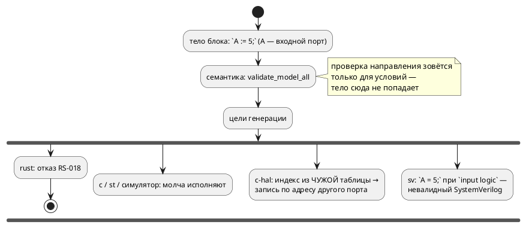

# Фича: Направление порта проверяется во всех позициях

- **Номер:** 0188
- **Статус:** ГОТОВО
- **Зависит от:** нет
- **Tier:** 1
- **Связанные issue (анализ):** ось 3 проработки [пересмотр задания адресов и доступа к портам](0187-port-io-redesign.md), выделена в отдельную работу **решением заказчика 2026-07-31** («начни с оси 3»)

## Стадии жизненного цикла (правило 17)

Все стадии — **разделы этой карточки** (правило 32): «Архитектура (ADR)»,
«Анализ», «Разработка», «Тест-план», «Отчёт о тестировании», «Итог».
Отдельным артефактом остаются только исправления —
[`docs/fixes/`](../fixes/README.md) (при необходимости `0188-YY-*`).

## Краткое описание

Правило «во входной порт нельзя писать, из выходного — читать» объявлено
(`SE-026`/`SE-027`), но применяется **только на пути условий**: тела блоков,
функции и инициализаторы не обходятся. Из-за этого нарушение проходит молча, а
цели генерации расходятся — вплоть до записи по адресу **другого** порта.

## Что известно на входе (проба 2026-07-31)

Вход `always { A := 5; t := B; }` при `in A`, `out B` компилируется без единой
диагностики, и дальше:

| Цель | Поведение |
|---|---|
| `rust` | отказ `RS-018` — единственная цель, ловящая нарушение (направление у неё в типе трейта) |
| `c` | печатает `write_numeric(A, 5)` и `read_numeric(B)` |
| `c-hal` | то же, но индексы enum берутся из **чужих** таблиц (`A = 0` в `In_…__ADDR`, `B = 0` в `Out_…__ADDR`) — запись уходит **по адресу другого порта** |
| `st` | печатает присваивание |
| `sv` | печатает `A = 5;` при `input logic [7:0] A` — невалидный SystemVerilog |
| симулятор | исполняет, в трассе виден `in:A=5` |

- Механизм проверки существует: `validate/common.rs::validate_expression`
  разбирает и `SE-026`, и `SE-027`; зовётся только из `validate_cond` и
  `validate_conditions`.
- **В текущем виде она непригодна для тел**: ветка `Assign` рекурсирует в
  левую часть, поэтому законное `led := 1;` для `out led` дало бы `SE-027`
  «чтение выходного порта». Исключение написано только для `BitAccess`.
- Нарушений в корпусе и документе **нет** (проверено грепом по объявлениям и
  использованиям): цена правки корпуса нулевая.

## Направление решения (наметка, не решение)

Распространить существующую проверку на все позиции (тела именованных блоков
модели и состояний, тела функций, инициализаторы), предварительно исключив
левую часть присваивания из «чтения». Смягчение для чтения выхода (аналог
`buffer` в VHDL) в объём **не** входит — обсуждается в [пересмотр задания адресов и доступа к портам](0187-port-io-redesign.md).

## Документирование (правило 24)

**Требуется.** Уточняется наблюдаемое поведение диагностик — затронуты раздел
[`book/src/08-ports-addresses/`](../../book/src/08-ports-addresses/index.typ) и
приложение «Ошибки и предупреждения» (статьи `SE-026`/`SE-027`).

## Архитектура (ADR)

- **Status:** Accepted (решение заказчика 2026-07-31 — ось 3 проработки 0187)
- **Date:** 2026-07-31
- **Authors:** Системный аналитик, архитектор
- **Related issues:** [Фича](0188-port-direction-everywhere.md); ось 3 [ADR](0187-port-io-redesign.md#архитектура-adr); опирается на [адрес порта — размещение и потребление (карта адресов)](0020-port-address-decl.md#архитектура-adr)

### Context

Язык объявляет: во входной порт писать нельзя (`SE-026`), из выходного читать
нельзя (`SE-027`). Правило реализовано в `validate/common.rs::validate_expression`,
но зовётся **только** из `validate_cond`/`validate_conditions` — то есть работает
на условиях переходов и именованных условиях. Тела блоков, тела функций и
инициализаторы не обходятся.

Проба 2026-07-31 (`always { A := 5; t := B; }` при `in A`, `out B`) показала, во
что это обходится: диагностики нет, а шесть потребителей расходятся —
подробности в [карточке фичи](0188-port-direction-everywhere.md).
Худший исход у `c-hal`: индексы перечислений портов нумеруются **внутри своего
направления**, поэтому `write_numeric(A, …)` попадает в таблицу выходов по
индексу `A` и пишет **по адресу другого порта**. Проверка `cc -c` такой код
принимает: он безупречен синтаксически.



### Decision Drivers

1. **Молча неверный продукт — худший класс дефекта.** Запись по адресу чужого
   порта не отличима от правильной работы до появления железа.
2. **Правило уже объявлено.** Речь не о новой строгости, а о том, чтобы
   объявленное правило работало везде: сегодня язык обещает одно, а принимает
   другое.
3. **Цели не должны расходиться.** Сейчас единственная цель, ловящая нарушение
   (`rust`), ловит его случайно — потому что у неё направление выражено типом
   трейта, а не потому, что компилятор проверил.
4. **Цена миграции нулевая.** Нарушений нет ни в корпусе, ни в документе
   (проверено).

### Considered Options

#### Option A. Распространить существующую проверку на все позиции

Обойти тела именованных блоков модели и состояний, тела функций и инициализаторы,
вызывая ту же `validate_expression`.

**Pros:**
- Правило остаётся **в одном месте** — новая проверка не решает заново, что
  законно, а лишь доставляет выражения существующему судье.
- Ошибка вместо тишины у всех целей сразу; расхождение целей исчезает как класс.

**Cons:**
- Требует правки самого судьи: ветка `Assign` рекурсирует в левую часть, поэтому
  законное `led := 1;` для `out led` дало бы `SE-027`. Исключение сегодня
  написано только для `BitAccess` — его надо обобщить на `Variable`.

#### Option B. Ловить нарушение в каждой цели

**Pros:** цель знает свои возможности (`rust` так и делает).
**Cons:** шесть реализаций одного правила — ровно тот источник расхождения,
который фича закрывает. Отвергнуто.

#### Option C. Разрешить чтение выхода, введя смягчение (аналог `buffer` в VHDL)

**Pros:** удобно там, где выход используют как «вспомнить, что выдали».
**Cons:** новая форма языка; заказчик отложил обсуждение форм до решения по осям
1–2. Вне объёма.

### Decision

Принимается **Option A**.

1. **Ветка `Assign` перестаёт считать левую часть чтением** — исключение
   обобщается с `BitAccess(Variable)` на `Variable` и `BitAccess(Variable)`.
   Иначе законная запись в выход стала бы ошибкой.
2. **Заводится проход `check_port_directions`** (`semantic/validate/`), который
   обходит тела именованных блоков модели и состояний, тела функций,
   инициализаторы переменных и вложенные модели, вызывая для каждого выражения
   существующую `validate_expression`. Накопление — по выражениям (одна ошибка
   на выражение), по образцу `literal_range` (0157).
3. **`inout` не затрагивается**: и чтение, и запись остаются законными.
4. **Смягчения не вводится** (Option C) — вопрос остаётся за ADR.

### Consequences

#### Положительные

- Нарушение направления перестаёт быть молчаливым в пяти потребителях из шести.
- Устраняется класс «запись по адресу другого порта» в `c-hal` и «невалидный
  модуль» в `sv` — конструктивно, а не проверкой каждой цели.
- `RS-018` цели `rust` становится недостижимым из компилятора (семантика
  отвергает раньше) — контроль остаётся как защита от прямого вызова генератора.

#### Отрицательные / Action items

- **Программа, сегодня собираемая, может перестать собираться.** В корпусе и
  документе таких нет, но у пользователей могут быть — это ломающее изменение
  поведения (не синтаксиса). Версия языка не поднимается: `0.8.0` не выпущена,
  изменения накапливаются в неё (правило 22).
- **Чтение выхода становится невозможным вовсе** — до решения по ADR
  обходной приём один: завести переменную, писать в неё и в порт.
- **`RS-018` рискует стать «мёртвым» кодом**: он должен остаться, но его тест —
  единственное, что его достигает. Помечается в реестре диагностик как
  достижимый только через прямой вызов генератора.

#### Acceptance criteria

1. `always { A := 5; }` при `in A` → `SE-026` (цель значения не имеет).
2. `always { t := B; }` при `out B` → `SE-027`.
3. `always { B := 1; }` при `out B` — **законно** (регресс не допускается).
4. `always { B.0 := 1; }` при `out B: bit` — законно.
5. Нарушение внутри тела функции и внутри `if`/`loop`/`for` — тоже диагностика.
6. `inout` читается и пишется без диагностик.
7. Корпус и документ: `precheck.sh` зелёный, вывод генераторов байт-в-байт
   прежний.

## Анализ

### Цель и контекст

[ADR](0188-port-direction-everywhere.md#архитектура-adr) принял Option A:
существующая проверка (`SE-026`/`SE-027`) распространяется на все позиции, а
левая часть присваивания перестаёт считаться чтением. Анализ переводит это в
точки кода и фиксирует цену.

#### Что подтверждено чтением кода

1. **Судья уже есть и один** — `validate/common.rs::validate_expression`
   разбирает обе диагностики. Новый проход обязан **звать** его, а не повторять
   правило: два места, решающих «что законно», — ровно тот дефект, который фича
   закрывает.
2. **Судья непригоден для тел без правки.** Ветка `Assign` рекурсирует в левую
   часть, поэтому законное `led := 1;` дало бы `SE-027`. Исключение написано
   только для `BitAccess(Variable)` — потому что на условиях присваиваний не
   бывает и ветка никогда не проверялась на этом входе.
3. **Позиции, которые надо обойти:** тела именованных блоков модели и состояний,
   тела локальных функций, инициализаторы `var`/`const`, а также вложенные
   модели. Образец обхода — `validate/literal_range.rs`.
4. **`inout` свободен по построению:** `SE-026` смотрит на `PortDirection::In`,
   `SE-027` — на `Out`; двунаправленный порт не задевается ни одной.

### Зависимости фичи (правило 17/19)

- **Зависит от:** нет.
- **Влияние на порядок:** это ось 3 проработки
  [пересмотр задания адресов и доступа к портам](0187-port-io-redesign.md#анализ), выделенная в отдельную работу решением
  заказчика. Оси 1, 2 и 4 остаются в 0187 и от 0188 не зависят: 0188 не меняет
  ни синтаксиса, ни формы доступа — только область действия объявленного
  правила.

### Требования и проверяемые условия

- **R1. Нарушение ловится в любой позиции.** Запись в `in` и чтение из `out` в
  теле блока, теле функции, внутри `if`/`loop`/`for`/`match` и в инициализаторе
  дают диагностику.
- **R2. Законные формы не задеты.** `out := значение`, `out.бит := значение`,
  чтение `in`, чтение и запись `inout` компилируются как прежде.
- **R3. Правило живёт в одном месте.** Новый проход не содержит собственного
  решения о законности — только обход и вызов судьи.
- **R4. Диагностики накапливаются**, а не обрываются на первой (редактор
  подчёркивает все нарушения).
- **R5. Корпус и документ не задеты**: вывод генераторов байт-в-байт прежний.

### Критерии приёмки и способ проверки

| # | Критерий | Способ проверки |
|---|---|---|
| A1 | `always { A := 5; }` при `in A` → `SE-026` | интеграционный тест |
| A2 | `always { t := B; }` при `out B` → `SE-027` | интеграционный тест |
| A3 | `always { B := 1; }` и `B.0 := 1` — законны | тест-контроль направления (регресс) |
| A4 | нарушение в теле функции и во вложенном операторе ловится | тест |
| A5 | `inout` читается и пишется молча | тест |
| A6 | несколько нарушений — несколько диагностик | тест на количество |
| A7 | `precheck.sh` зелёный, вывод корпуса не изменился | прогон |

### Цена (замер до правки)

Нарушений в корпусе и документе **нет** — проверено грепом по объявлениям
портов и их использованиям; все совпадения оказались комментариями и оператором
`address`.

Зато нарушение нашлось **внутри проекта**: юнит-контроль цели `sv`
`read_inside_tick_sees_write_made_in_same_tick` стоял на двух **выходных** портах
и читал один из них. Это подтверждает, что приём «выход как память» реально
употребим — довод к обсуждению смягчения (ось 3B ADR), но не повод
ослаблять правило сейчас.

### Особенности по обратной функциональности (правило 11)

- **Ломающее изменение поведения, но не синтаксиса**: программа, использовавшая
  чтение выхода или запись во вход, перестанет компилироваться. В корпусе и
  документе таких нет; у пользователей могут быть.
- **Обходной приём на сегодня один**: завести переменную, писать в неё и в порт.
  Явное смягчение (аналог `buffer` в VHDL) — предмет ADR.
- **Версия языка не поднимается**: `0.8.0` не выпущена (правило 22).

### Редакторский слой (правило 29)

Токенов, узлов АСД и форм объявления фича не вводит — подсветка, автодополнение,
структура документа и плагины правок не требуют. Диагностики `SE-026`/`SE-027`
существуют и доходят до редактора прежним путём (`collect_compile_diagnostics`);
новых кодов нет. Ответ фиксируется в отчёте.

### Риски

- **Риск: сломать законную запись в выход.** Самый вероятный способ ошибиться —
  неверное исключение для левой части присваивания. Снимается тестом A3 (обе
  формы цели записи) и прогоном корпуса, где запись в выход есть в каждом
  примере с портами.
- **Риск: пропустить позицию.** Обход написан по образцу `literal_range`;
  ветка `_ => {}` перечисляет, что пропущено и почему. Полноту проверяет A4.
- **Риск: сделать `RS-018` мёртвым.** Цель `rust` ловила запись во вход сама;
  теперь семантика отвергает раньше. Диагностика остаётся как защита при прямом
  вызове генератора — фиксируется в реестре.

## Разработка

### Задача

#### Что было

`SE-026`/`SE-027` вырабатывались `validate/common.rs::validate_expression`, но
она звалась только из проверок условий. Тела блоков, тела функций и
инициализаторы не обходились — нарушение проходило молча и расходилось по целям
(таблица в [карточке](0188-port-direction-everywhere.md)).

#### Что сделано

**1. Судья перестал считать левую часть присваивания чтением.** Исключение,
написанное для `BitAccess(Variable)`, обобщено на обе формы цели записи —
`Variable` и `BitAccess(Variable)` — через выделенный предикат `is_out_port`.
Без этого законное `led := 1;` дало бы `SE-027`: на условиях присваиваний не
бывает, поэтому ветка никогда не проверялась на таком входе.

**2. Заведён проход `validate/port_direction.rs`.** Обходит инициализаторы
переменных, тела локальных функций, тела именованных блоков модели и состояний,
операторы `if`/`loop`/`for`/`match` и вложенные модели; каждое выражение
отдаётся **тому же** судье. Своего решения о законности модуль не содержит —
иначе правило оказалось бы в двух местах.

Накопление — по выражениям (одна ошибка на выражение), по образцу
`literal_range` (0157): пользователь видит все нарушения за прогон.

**3. Контроль цели `sv` переехал в интеграционные тесты.** Юнит-проба
`read_inside_tick_sees_write_made_in_same_tick` стояла на двух **выходных**
портах и читала один из них — после ужесточения это ошибка. Источник переписан
на переменную модели, но юнит-хелпер `make_map` присваивает имя модели **после**
построения дерева, из-за чего переменная печатается без префикса и проба
перестаёт быть самосогласованной. Реальный путь (`compile_to_sv`) такого
расхождения не даёт, поэтому контроль живёт теперь в
`takt-lang/tests/targets/sv_tick_read_tests.rs` — вдобавок он стал проверять и вторую
половину контракта (рабочая копия начинается со значения регистра).

#### Проверки

| Условие | Результат |
|---|---|
| `always { A := 5; }` при `in A` | `SE-026` |
| `always { t := B; }` при `out B` | `SE-027` |
| `B := 1;`, `L := 1;`, `L.0 := 1;` для выходов | законно (регресса нет) |
| чтение `in`, чтение и запись `inout` | законно |
| нарушение во вложенном `if`/`loop` | ловится |
| нарушение в теле функции | ловится |
| два нарушения в одном блоке | две диагностики |
| `takt-lang/tests/semantic/port_direction_tests.rs` | 8 тестов зелёные |
| `./scripts/precheck.sh` | зелёный, вывод корпуса не изменился |

**Условия анализа:** R1–R5; критерии A1–A7.

## Тест-план

### Область и цель

Проверяется, что объявленное правило направления действует **во всех** позициях
программы и что законные формы не задеты. Вход — `collect_compile_diagnostics`,
тот же, что у CLI и LSP: важно, что диагностика доезжает до пользователя.

### Проверки (условие → ожидаемый результат)

| # | Проверка | Вход | Ожидаемо | R/A |
|---|---|---|---|---|
| T1 | запись во входной порт в теле блока | `always { A := 5; }` | `SE-026` | R1 / A1 |
| T2 | чтение выходного порта в теле блока | `always { t := B; }` | `SE-027` | R1 / A2 |
| T3 | запись в выходной порт | `B := 1;`, `L := 1;`, `L.0 := 1;` | законно | R2 / A3 |
| T4 | чтение входного порта | `t := A;` | законно | R2 |
| T5 | `inout` в обе стороны | `C := C + 1; t := C;` | законно | R2 / A5 |
| T6 | нарушение во вложенном операторе | `if … { loop … { A := 7; } }` | `SE-026` | R1 / A4 |
| T7 | нарушение в теле функции | `fn peek() -> u8 { return B; }` | `SE-027` | R1 / A4 |
| T8 | накопление | `A := 5; t := B;` | обе диагностики за прогон | R4 / A6 |
| T9 | корпус и документ | `./scripts/precheck.sh` | зелёный, вывод генераторов прежний | R5 / A7 |
| T10 | контроль семантики такта `sv` | `var v; out w; always { v := 1; w := v; }` | `w_next = …_v_next;` | — (регресс переезда) |

### Разбивка проверок по функциональности

| Функциональность | Проверки | Статус |
|---|---|---|
| Семантика (условия) | прежние тесты `SE-026`/`SE-027` | ✅ |
| Семантика (тела блоков, функций, инициализаторы) | T1, T2, T6, T7, T8 | ✅ |
| Законные формы (регресс) | T3, T4, T5 | ✅ |
| Цель `sv` (семантика такта) | T10 | ✅ |
| Цели `c`/`c-hal`/`st`/`rust`/симулятор | T9 — вывод не изменился | ✅ |

<!-- Легенда: ✅ пройдено · ❌ провалено · ⬜ не проверялось · — не применимо -->

### Тестовые данные и окружение

- `takt-lang/tests/semantic/port_direction_tests.rs` (T1–T8) — через
  `collect_compile_diagnostics`.
- `takt-lang/tests/targets/sv_tick_read_tests.rs` (T10) — через `compile_to_sv` во
  временный каталог.
- `./scripts/precheck.sh` (T9).

### Примеры и контрпримеры (правило 16)

**Контрпримеры:**

```takt
in  A: u8 := 0x100;
out B: u8 := 0x104;
start S { always { A := 5; t := B; } … }
```

```text
model.takt:1:1: Ошибка компиляции [SE-026]: Запись в входной порт 'A' запрещена
model.takt:2:1: Ошибка компиляции [SE-027]: Чтение из выходного порта 'B' запрещено
```

**Примеры (принимаются):** запись в выход `B := 1;` и `B.0 := 1;`, чтение входа
`t := A;`, двунаправленный `C := C + 1; t := C;`, а также приём «переменная
хранит выданное»:

```takt
out B: u8 := 0x104;
var last: u8 := 0;
start S { always { last := last + 1; B := last; } … }
```

## Отчёт о тестировании

### Сводка прогонов и окружение

| Прогон | Команда | Результат |
|---|---|---|
| Тесты крейта | `cargo test -p takt-lang --all-features -- --test-threads=1` | ✅ зелёные |
| Предкоммит | `./scripts/precheck.sh` | ✅ код 0 |
| CLI вручную | `taktc compile -t c` на пробе-нарушителе | ✅ `SE-026` и `SE-027` |

Окружение: macOS (arm64), толчейн пина `1.97.1`, сборка debug.

### Сверка с тест-планом

| # | Проверка | Результат |
|---|---|---|
| T1 | запись во вход в теле блока | ✅ `SE-026` |
| T2 | чтение выхода в теле блока | ✅ `SE-027` |
| T3 | запись в выход (три формы) | ✅ законно |
| T4 | чтение входа | ✅ законно |
| T5 | `inout` в обе стороны | ✅ законно |
| T6 | вложенный оператор | ✅ ловится |
| T7 | тело функции | ✅ ловится |
| T8 | накопление двух диагностик | ✅ |
| T9 | корпус и документ | ✅ предкоммит зелёный, вывод генераторов прежний |
| T10 | контроль такта `sv` после переезда | ✅ 2 теста |

**Итог сверки: 10 из 10.**

### Что изменилось в наблюдаемом поведении

| Вход | Было | Стало |
|---|---|---|
| `always { A := 5; }` при `in A` | молча компилировалось; `c-hal` писал **по адресу другого порта**, `sv` печатал присваивание входу модуля | `SE-026` |
| `always { t := B; }` при `out B` | молча компилировалось | `SE-027` |
| `B := 1;` / `B.0 := 1;` | законно | законно (регресса нет) |

Вывод генераторов на корпусе байт-в-байт прежний: нарушений в нём не было.

### Найденные дефекты и отклонения от плана

**Исправлений (`docs/fixes/`) не потребовалось.** Отклонения:

1. **Нарушение нашлось внутри проекта**, а не в корпусе: юнит-контроль цели `sv`
   `read_inside_tick_sees_write_made_in_same_tick` стоял на двух выходных портах
   и читал один из них. Это подтверждает, что приём «выход как память» реально
   употребим — довод к обсуждению смягчения (ось 3B ADR), но правило не
   ослаблено.
2. **Контроль пришлось перенести в интеграционные тесты.** При переписывании
   источника на переменную выяснилось, что юнит-хелпер `make_map` присваивает
   имя модели **после** построения дерева, поэтому переменная печатается без
   префикса модели и проба перестаёт быть самосогласованной. Реальный путь
   (`compile_to_sv`) такого не даёт — контроль переехал туда и заодно получил
   вторую половину контракта (рабочая копия начинается со значения регистра).
   Расхождение самого хелпера с реальным путём **не исправлялось** (вне
   объёма) — записано наблюдением здесь.
3. **`inout` не годится как замена двум выходам в пробах цели `sv`**: она
   отвергает двунаправленный порт (`SV-006`, трёхстабильная шина невыразима).

### Правило 29 (редакторский слой)

Токенов, узлов АСД и форм объявления фича не вводит; новых кодов диагностик нет.
`SE-026`/`SE-027` доходят до редактора прежним путём (`collect_compile_diagnostics`
зовёт и LSP) — проверено тем, что тесты идут именно через этот вход. Правок
подсветки, автодополнения, структуры документа и плагинов не требуется.

### Что осталось за границей фичи

- **Смягчение для чтения выхода** (аналог `buffer` в VHDL) — ось 3B ADR,
  ожидает решения вместе с осями 1–2.
- **`RS-018` цели `rust`** стал недостижим из компилятора (семантика отвергает
  раньше) и остаётся защитой при прямом вызове генератора.
- **Хелпер `make_map` цели `sv`** расходится с реальным путём по именованию
  модели — наблюдение, не исправление.

### Вердикт

**Готово.** 10 из 10 проверок пройдены, предкоммит зелёный, исправлений не
потребовалось.

## Итог (что сделано)

Объявленное правило направления заработало **везде**. Проверка `SE-026`/`SE-027`
жила в одном судье (`validate/common.rs::validate_expression`), но звалась только
для условий; теперь новый проход `validate/port_direction.rs` доставляет ему
выражения из тел блоков и функций, инициализаторов, вложенных операторов и
под-моделей. Своего решения о законности проход не содержит — иначе правило
разошлось бы по двум местам, что и было причиной дефекта.

Попутно пришлось поправить самого судью: ветка присваивания рекурсировала в
левую часть, поэтому законное `led := 1;` дало бы «чтение выходного порта».
Исключение обобщено на обе формы цели записи.

Закрытый класс — не косметический: до правки `always { A := 5; }` для входного
порта компилировалось молча, и шесть потребителей расходились — `rust` отказывал,
`c`/`st`/симулятор исполняли, `sv` печатал присваивание входу модуля (невалидный
SystemVerilog), а `c-hal` брал индекс перечисления из **чужой** таблицы и писал
**по адресу другого порта**.

Живая проверка: [отчёт](0188-port-direction-everywhere.md#отчёт-о-тестировании) — ✅ 10 из
10, исправлений не потребовалось; вывод генераторов на корпусе байт-в-байт
прежний. Версия языка не поднята: `0.8.0` не выпущена (правило 22).

Смягчение для чтения выхода (аналог `buffer` в VHDL) **не вводилось** — ось 3B
проработки [пересмотр задания адресов и доступа к портам](0187-port-io-redesign.md). Что приём употребим, подтвердилось
на практике: под правило попал внутренний контроль цели `sv`, переписанный на
переменную и переехавший в интеграционные тесты.
