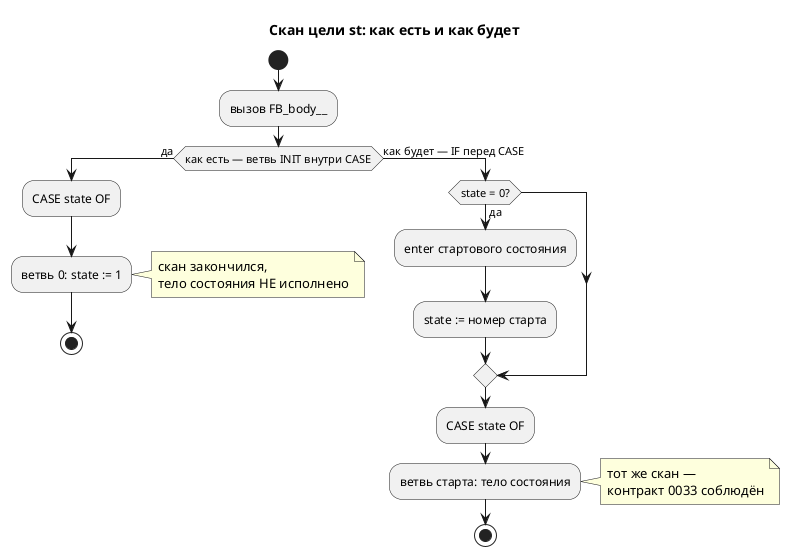

# Фича: Цель `st` — потактовая сверка с эталоном и устранение расхождений

- **Номер:** 0191
- **Статус:** ГОТОВО
- **Зависит от:** нет
- **Tier:** 1
- **Связанные issue (анализ):** кандидаты блока 2 `FEATURES.md` (вскрыты пробами
  [пересмотр задания адресов и доступа к портам](0187-port-io-redesign.md#разработка) и
  [представление числового литерала: полная маска `[bit;64]`](0157-literal-u64-representation.md#разработка)); смежно с
  [согласование тактов симулятора и порождённого C (INIT-такты)](0033-init-tick-alignment.md) (контракт «вход в стартовое состояние не
  расходует такт»), [генератор генерации в Structured Text (IEC 61131-3)](0041-st-backend.md) (генератор ST),
  [семантика `[bit;N]` расходится втрое](0078-bit-array-semantics.md) (`[bit;N]` — упакованный скаляр)

## Стадии жизненного цикла (правило 17)

Все стадии — **разделы этой карточки** (правило 32): «Архитектура (ADR)»,
«Анализ», «Разработка», «Тест-план», «Отчёт о тестировании», «Итог».
Отдельным артефактом остаются только исправления —
[`docs/fixes/`](../fixes/README.md) (при необходимости `0191-YY-*`).

## Краткое описание

Цель `st` расходится с эталоном **молча** — в двух местах сразу, — и наблюдать
это нечем: существующая сверка крутит обе стороны до завершения и сравнивает
лишь установившиеся значения. Фича заводит **потактовую** сверку цели `st` и
устраняет оба расхождения, которые она делает видимыми.

> Фича зарегистрирована из бэклога кандидатов (решение заказчика 2026-08-02:
> Tier-1 находки переводятся в фичи вперёд Tier 2); далее проходит жизненный
> цикл по правилу 17.

## Что известно на входе

Оба расхождения **перепроверены пробой 2026-08-02** (репозиторий с их записи ушёл
далеко вперёд — правило 28), оба живы.

**Р1. Синтетическое `INIT` расходует скан на каждом уровне вложенности.**
Вход `model Blinker { … start Run { always { … } } } start Main = Blinker;`:

| Цель | Как диспетчеризуется вход в стартовое состояние |
|---|---|
| `c` | `if (model->state == …_INIT) { state = …_RUN; }` **до** `switch` — такт не тратится |
| `st` | `0: (* INIT *) state := 1;` — ветвь **внутри** `CASE`, и так на каждом уровне |

Замер задачи (драйвер `iec2c` + `cc`): трасса выходного порта в ST —
`[7, 7, 7, 11, 12, 13, 13]`, у эталона и целей `c`/`sv` — `[7, 11, 12, 13, 13,
13, 13]`. Сдвиг равен **глубине вложенности**. Это ровно то, что [согласование тактов симулятора и порождённого C (INIT-такты)](0033-init-tick-alignment.md) устранила в цели `c` и объявила **контрактом
для будущих генераторов**; цель `st` (0041) его воспроизвела. Цена: ПЛК отрабатывает
первые N сканов вхолостую, а `iec2c` вывод принимает.

**Р2. Инициализатор переменной типа `[bit;N]` теряется.** Вход
`var small: [bit;8] := 255;` рядом с `var plain: u8 := 7;`:

| Сторона | Результат |
|---|---|
| эталон | `small = 255` |
| цель `c` | `model->small = 255;` |
| цель `st` | `small : USINT;` — **без значения** (`plain : USINT := 7;` рядом) |

`taktc` рапортует успех, `iec2c` вывод принимает. По
[семантика `[bit;N]` расходится втрое](0078-bit-array-semantics.md) `[bit;N≤64]` — упакованный **скаляр**, то
есть инициализатор скалярный и ST его принимает; значение литерала ни при чём —
теряются и узкие (`42`), и широкие.

**Чем наблюдать — уже есть.** `takt-sim/tests/conformance/conformance_st_tests.rs` делает
`taktc -t st` → `iec2c` → `POUS.c` → драйвер и сверяет с эталоном; новой
инфраструктуры не требуется — требуется наблюдаемая точка **на каждом такте**
вместо установившегося значения. Смежный долг: потактовых сверок длительностей
для `st` и `sv` нет (остаток [тип `duration` в целях генерации и вычисляемая выдержка](0183-duration-type-in-targets.md)).

## Направление решения (наметка, не решение)

- Сверка **без** починки даёт красный предкоммит, починка без сверки
  недоказуема — значит и то и другое в одной фиче, а порядок задач внутри
  разработки таков, что каждый коммит зелёный.
- Р1 лечится как в 0033: диспетчеризовать `INIT` **до** `CASE`, не расходуя
  скан. Меняется **форма вывода** цели `st` — требуется ADR (правило 18:
  меняется наблюдаемое поведение → диаграмма).
- Вывод корпуса `examples/generated/st` изменится; генерация детерминирована
  ([детерминированная генерация кода (единый порядок эмиссии)](0048-deterministic-codegen.md)), поэтому дифф осмысленный и
  просматривается поштучно.
- Проверка `iec2c` доказывает, что ST **компилируется**, но не что он **верен** —
  на этом стояли дефекты и 0045. Приёмка — равенство трасс такт в такт, а
  не «собралось».

Окончательный выбор — за стадиями **архитектуры** (ADR) и **анализа**.

## Документирование (правило 24)

**Не требуется.** Язык не меняется: контракт 0033 («вход в стартовое состояние
не расходует такт») уже описан и остаётся прежним — фича приводит цель `st` в
соответствие с ним. Документ описывает язык, а не то, каким тактом его исполняет
конкретный генератор.

## Архитектура (ADR)

- **Status:** **Accepted** — Option A, 2026-08-02 (реализовано и закрыто той же датой)
- **Date:** 2026-08-02
- **Authors:** Архитектор + Аналитик
- **Related issues:** [Фича](0191-st-per-tick-conformance.md);
  связь с [ADR](0033-init-tick-alignment.md#архитектура-adr) (вход в стартовое состояние не
  расходует такт), [ADR](0041-st-backend.md#архитектура-adr) (генератор ST),
  [ADR](0078-bit-array-semantics.md#архитектура-adr) (`[bit;N]` — упакованный скаляр)

### Context

Цель `st` расходится с эталоном **молча**, в двух независимых местах. Оба
воспроизведены пробами 2026-08-02.

#### Р1. Синтетическое `INIT` расходует скан на каждом уровне вложенности

Вход: `model Blinker { out lamp: u8 at 0x600; var n: u8 := 7; start Run { always
{ n := n + 1; lamp := n; } } } start Main = Blinker;`

Замер трассы выходного порта (драйвер: `taktc -t st` → `iec2c` → `POUS.c` +
`cc`, печать **каждый** скан):

| Сторона | Трасса `lamp` |
|---|---|
| эталон (симулятор) | `8` уже на такте 1 |
| цель `c` | `8` уже на такте 1 (диспетчеризует `INIT` **до** `switch`) |
| цель `st` | **`0 0 8 8 8 8 8`** — два холостых скана |

Сдвиг равен **глубине вложенности**: каждый уровень эмитит собственную ветвь
`0: (* INIT *) state := 1;` **внутри** `CASE`, а `CASE` в IEC не проваливается в
следующую ветвь. Это ровно тот дефект, который [согласование тактов симулятора и порождённого C (INIT-такты)](0033-init-tick-alignment.md) устранила в цели `c` и объявила
**контрактом для будущих генераторов** («не воспроизводить чужие `INIT`-такты»);
цель `st` (0041) его воспроизвела.

Цена: ПЛК отрабатывает первые N сканов вхолостую — при вложенности 3 это три
скана, на которых выходы держат нули. `iec2c` вывод принимает: он проверяет
валидность, а не верность.

#### Р2. Инициализатор переменной типа `[bit;N]` теряется

Вход: `var small: [bit;8] := 255;` рядом с `var plain: u8 := 7;`

| Сторона | Результат |
|---|---|
| эталон | `small = 255` |
| цель `c` | `model->small = 255;` |
| цель `st` | `small : USINT;` — **без значения** (`plain : USINT := 7;` рядом) |

Причина найдена чтением: `st_decl.rs::literal_init` глушит инициализатор у
**любого** `TypeNode::Array` — и это верно для настоящих массивов (`iec2c`
отвергает `ARRAY [0..3] OF USINT := 0`), но `[bit;N≤64]` по
[семантика `[bit;N]` расходится втрое](0078-bit-array-semantics.md#архитектура-adr) массивом **не является**: это упакованный
скаляр, и `get_st_type` печатает его как `USINT`/`UINT`/… через
`semantic::bit_vector`. То есть тип уже знает про упаковку, а инициализатор —
ещё нет.

#### Почему оба дефекта дожили

`takt-sim/tests/conformance/conformance_st_tests.rs` крутит обе стороны **до завершения** и
сверяет только установившиеся значения. Сдвиг на N сканов в такой сверке
невидим **по построению**. Потактовой сверки `st` нет — смежный долг записан
кандидатом ещё при закрытии
[тип `duration` в целях генерации и вычисляемая выдержка](0183-duration-type-in-targets.md).



### Decision Drivers

1. **Контракт 0033 — обязательство, а не пожелание.** Он записан как контракт
   **для будущих генераторов**; цель, которая его нарушает, делает несравнимыми
   эталон и продукт.
2. **Доказывать поведением, а не компиляцией.** `iec2c` принял неверный вывод —
   как принял его verilator у 0045 и rustc у 0050. Сверка обязана смотреть на
   трассу.
3. **Сверка и починка неразделимы.** Ввести сверку без починки — красный
   предкоммит; починить без сверки — недоказуемо. Значит одна фича.
4. **Не ломать то, что уже принято `iec2c`.** Корпус проходит проверка ST 8/8;
   новая форма обязана сохранить это.
5. **Правило 11.** Форма вывода цели `st` меняется — дифф корпуса
   просматривается, а не принимается на веру.

### Considered Options

#### Option A. `IF state = 0 THEN … END_IF;` перед `CASE`

Прямой аналог цели `c` (`if (model->state == …_INIT) { … }` до `switch`): ветвь
`INIT` выносится из `CASE` в предшествующий `IF`, после чего тот же скан
попадает в ветвь стартового состояния.

**Pros:**
- **измерено**: `iec2c` форму принимает (код 0), трасса становится
  `8 8 8 8 8 8 8` — как у эталона и цели `c`;
- изменение локально: одна функция `st_model.rs`, состав ветвей `CASE` прежний
  минус ветвь `0`;
- узнаваемо для читателя порождённого ST: явный «первый скан» вместо
  синтетического состояния, о котором надо догадаться.

**Cons:**
- форма вывода меняется — дифф по всем восьми файлам корпуса;
- номер `0` перестаёт встречаться в `CASE`, хотя `state` по-прежнему
  инициализируется нулём: связь «0 = ещё не входили» остаётся, но выражена в
  другом месте.

#### Option B. Убрать синтетическое состояние: `state : USINT := <номер старта>`

Инициализировать `state` сразу номером стартового состояния, а блок `enter`
перенести в инициализацию.

**Pros:**
- `CASE` становится ровно перечнем состояний, без служебных ветвей.

**Cons:**
- **`enter` исполнить негде.** `iec2c` порождает `_init__`, выставляющий
  объявленные начальные значения; пользовательского кода там нет. Значит `enter`
  пришлось бы исполнять под флагом «первый скан» — то есть под тем же `INIT`,
  только переименованным;
- у моделей **без** `enter` вариант работал бы, у моделей с `enter` — нет:
  поведение цели зависело бы от наличия блока, что хуже единообразия.

#### Option C. Оставить как есть, задокументировать сдвиг

**Pros:**
- нулевая стоимость, дифф корпуса не меняется.

**Cons:**
- контракт 0033 остаётся нарушенным, и это **молчаливое** расхождение эталона с
  продуктом — ровно тот класс, ради которого фича заведена Tier 1;
- документированное расхождение не спасает ПЛК от холостых сканов.

### Decision

Принимается **Option A** для Р1.

Единственный вариант, который восстанавливает контракт 0033 и **измерен**: форма
принята `iec2c`, трасса совпала с эталоном и целью `c`. Option B разбивается о
то, что исполнять `enter` в ST негде, кроме тела скана; Option C оставляет
молчаливое расхождение, ради устранения которого фича и заведена.

Для **Р2** отдельного варианта не требуется: `literal_init` обязан глушить
инициализатор у настоящих составных типов и **не** глушить у упакованного
бит-вектора. Признак берётся из **того же** слоя, которым уже пользуется
`get_st_type` — `semantic::bit_vector::is_bit_vector`; заводить второе правило
упаковки нельзя (оно разъедется с печатью типа, и объявление получит значение
не той ширины).

**Сверка вводится вместе с починкой**, а не после: наблюдаемой точкой становится
значение **на каждом скане**, а не установившееся.

### Consequences

#### Положительные

- контракт 0033 соблюдают все шесть целей, а не пять;
- `[bit;N]` в цели `st` получает объявленное значение;
- у цели `st` появляется потактовая сверка — закрывается смежный долг 0183 в
  части `st`;
- порождённый ST становится честнее: «первый скан» виден явно.

#### Отрицательные / Action items

- **Дифф корпуса `examples/generated/st`** — просмотреть поштучно; генерация
  детерминирована ([детерминированная генерация кода (единый порядок эмиссии)](0048-deterministic-codegen.md#архитектура-adr)), поэтому дифф несёт
  смысл.
- Тест `st_model.rs`, стоящий на форме `0: (* INIT *)`, обязан быть **переписан**
  на новую форму, а не удалён.
- Сверка `st` дороже прочих: `iec2c` + `cc` + запуск. Смежный кандидат
  «сверки через `mmap` стоят ~90 с» предупреждает, что время предкоммита —
  ресурс; новая сверка должна остаться одиночной, а не разрастись на корпус.
- Потактовая сверка цели **`sv`** этой фичей не вводится — остаток долга 0183
  сохраняется и остаётся кандидатом.

#### Acceptance criteria

1. Трасса выходного порта порождённого ST на фикстуре Р1 равна трассе эталона
   **такт в такт**, а не только в установившемся значении.
2. Сдвиг отсутствует при вложенности ≥ 2 (фикстура `Main = Blinker`).
3. `var small: [bit;8] := 255;` даёт в ST `small : USINT := 255;`, и значение
   наблюдается прогоном.
4. Настоящий массив (`var data: [u8;4] := 0;`) инициализатора по-прежнему **не**
   получает — иначе `iec2c` отвергнет объявление.
5. Проверка `iec2c` по корпусу зелёный (8/8), дифф `examples/generated/st`
   просмотрен и объяснён.
6. `./scripts/precheck.sh` зелёный; цели, кроме `st`, вывод не изменили.

## Анализ

### Цель и контекст

ADR принял **Option A** для Р1 (`IF state = 0 THEN … END_IF;` перед `CASE` —
прямой аналог цели `c`) и указал лечение Р2 (не глушить инициализатор у
упакованного бит-вектора). Анализ уточняет места правки, порядок задач и способ
проверки.

Главное ограничение задано ADR: **сверка вводится вместе с починкой**. Сверка
без починки красит предкоммит; починка без сверки недоказуема.

### Зависимости фичи (правило 17/19)

**Нет.** Ни одна незакрытая фича не трогает ни `generator/st/`, ни
`conformance_st_tests`. Смежная работа — остаток долга
[тип `duration` в целях генерации и вычисляемая выдержка](0183-duration-type-in-targets.md) (потактовые сверки `st` и
`sv`): эта фича закрывает его **в части `st`**, часть `sv` остаётся кандидатом.

### Места правки

| # | Что | Файл | Замечание |
|---|---|---|---|
| М1 | ветвь `INIT` выносится из `CASE` в предшествующий `IF` | `generator/st/st_model.rs` (около `INIT_STATE`, эмиссия `0: (* INIT *)`) | `enter` стартового состояния остаётся внутри `IF` — порядок `enter` → `state := N` не меняется |
| М2 | тест, стоящий на строке `"0: (* INIT *)"` | `st_model.rs`, модульный тест | **переписать** на новую форму, не удалять: он контролирует порядок `INIT → enter → переход` |
| М3 | инициализатор упакованного бит-вектора | `generator/st/st_decl.rs::literal_init` | проверка `matches!(ty, TypeNode::Array(_, _) \| TypeNode::Struct(_))` глушит и `[bit;N]`; признак брать из `semantic::bit_vector::is_bit_vector` — тем же слоем пользуется `get_st_type` |
| М4 | потактовая сверка | `takt-sim/tests/` (новый файл) | обвязка существует в `conformance_st_tests.rs`: `taktc -t st` → `iec2c` → `POUS.c` + драйвер; требуется печать **на каждом скане** вместо установившегося значения |

**М3 — тонкое место.** Глушить инициализатор у настоящих массивов
**обязательно**: `iec2c` отвергает `ARRAY [0..3] OF USINT := 0`. Правка обязана
различать «массив» и «упакованный скаляр», а не снимать проверка целиком; критерий
A4 контролирует именно это.

### Требования и проверяемые условия

| # | Требование | Проверяемое условие |
|---|---|---|
| R1 | Вход в стартовое состояние не расходует скан | трасса выхода в ST совпадает с эталоном такт в такт при вложенности ≥ 2 |
| R2 | `enter` стартового состояния исполняется до тела | порядок в порождённом ST: `IF state = 0` → `enter` → `state := N` |
| R3 | `[bit;N]` получает объявленное значение | `var small: [bit;8] := 255;` → `small : USINT := 255;`, значение наблюдается прогоном |
| R4 | Настоящий массив инициализатора не получает | `var data: [u8;4] := 0;` → объявление без `:=` |
| R5 | Корпус остаётся валидным для `iec2c` | проверка ST 8/8 зелёный |
| R6 | Прочие цели не задеты | `git diff examples/generated` пуст вне каталога `st` |
| R7 | Сверка наблюдает **каждый** такт | тест падает, если вернуть старую форму `INIT` (проверяется мутацией) |

### Ограничения, которые определяют форму решения

- **О1. `CASE` в IEC не проваливается.** Поэтому «исполнить `INIT` и тут же
  тело состояния» одной конструкцией `CASE` невыразимо — отсюда `IF` перед ней.
- **О2. Пустая ветвь `CASE` недопустима** («invalid statement in case
  element») — это уже учтено в терминальной ветви само-присваиванием; вынос
  `INIT` ветвей не убавляет настолько, чтобы `CASE` опустел.
- **О3. `iec2c` и `cc` — внешние инструменты.** Их отсутствие даёт **пропуск**
  теста, а не красный: так устроена существующая сверка, и новая обязана вести
  себя так же — иначе машина без MatIEC перестанет собирать проект.
- **О4. Время предкоммита — ресурс.** Сверка `st` стоит трансляции, сборки и
  запуска. Держать её **одиночной** (одна фикстура, одна сборка), а не гнать по
  корпусу; смежный кандидат про сверки на `mmap` (~90 с каждая) — предупреждение
  о том, чем это кончается.

### Критерии приёмки и способ проверки

| # | Критерий (из ADR) | Способ проверки |
|---|---|---|
| A1 | трасса ST = трасса эталона такт в такт | новый тест сверки (М4) |
| A2 | сдвиг отсутствует при вложенности ≥ 2 | фикстура `Main = Blinker` |
| A3 | `[bit;8] := 255` доезжает до ST | текст объявления + значение прогоном |
| A4 | настоящий массив без инициализатора | существующий тест `st_decl.rs` остаётся зелёным |
| A5 | проверка `iec2c` 8/8, дифф корпуса объяснён | `precheck.sh` + просмотр диффа |
| A6 | предкоммит зелёный, прочие цели не изменились | `precheck.sh`, `git diff` |

### Предлагаемая декомпозиция разработки

| Задача | Содержание | Порядок |
|---|---|---|
| 0191-01 | `INIT` без расхода скана (М1) + переписанный тест формы (М2) | первой: без неё сверка красная |
| 0191-02 | потактовая сверка `st` (М4) | сразу за 01 — она доказывает 01 |
| 0191-03 | инициализатор `[bit;N]` (М3) + значенческая проверка | независима от 01/02 |

Порядок 01 → 02 выбран так, чтобы **каждый коммит был зелёным**: обратный
порядок даёт коммит с заведомо падающей сверкой.

### Особенности по обратной совместимости (правило 11)

Меняется **форма порождённого ST** — обратно несовместимо для того, кто правил
порождённый файл руками (шапка файла это прямо запрещает). Язык, АСД, прочие
цели и симулятор не задеты. Поведение цели `st` меняется в сторону
**соответствия** эталону: программа, полагавшаяся на холостые сканы, повела бы
себя иначе — но такая зависимость была бы зависимостью от дефекта.

### Риски

- **Риск «поправили сдвиг, сломали `enter`».** `enter` стартового состояния
  исполняется в той же ветви, и при переносе легко потерять порядок. Снижение —
  R2 контролируется переписанным тестом (М2), а не только глазами.
- **Риск «сверка смотрит не туда».** Тест, зелёный и до, и после правки,
  бесполезен. Снижение — R7: мутация (вернуть старую форму) обязана его валить.
- **Риск роста времени предкоммита.** Снижение — О4: одна фикстура, одна
  сборка; замер времени фиксируется в отчёте.

## Разработка

### Задача

#### Что было

Синтетическое `INIT` эмитилось **ветвью `CASE`**:

```
CASE state OF
    0: (* INIT *)
        state := 1; (* Run *)
    1: (* Run *)
        …
```

`CASE` в IEC не проваливается в следующую ветвь, поэтому скан заканчивался,
ничего не исполнив, — и так **на каждом уровне вложенности**. Замер (драйвер
`iec2c` + `cc`, печать каждый скан) на модели `Main = Blinker`: трасса выхода
`0 0 8 8 8 8 8` против `8` у эталона и цели `c` уже на первом такте. Контракт
[согласование тактов симулятора и порождённого C (INIT-такты)](0033-init-tick-alignment.md) — «вход в стартовое
состояние не расходует такт» — был нарушен.

#### Что сделано

Вход печатается **до** `CASE`, как в цели `c` (`if (state == …_INIT) { … }`
перед `switch`):

```
IF state = 0 THEN (* первый скан *)
    <enter стартового>
    state := 1; (* Run *)
END_IF;
CASE state OF
    1: (* Run *)
```

Тот же скан попадает в ветвь стартового состояния. Форма **измерена**, а не
предположена: `iec2c` её принимает (код 0), трасса стала `8 8 8 8 8 8 8`.

Правка — `takt-lang/src/generator/st/st_model.rs`, одна функция. Порядок
`enter` → переход сохранён.

**Тест формы переписан, а не удалён:**
`test_init_runs_enter_then_transitions_before_case` проверяет порядок
`IF` → `enter` → переход **и** что переход стоит до `CASE`; добавлен
`test_no_init_branch_inside_case` — ветвь `0:` внутри `CASE` больше не
допускается.

**Модуль пришлось разделить.** С правкой `st_model.rs` вырос до 1022 строк
при лимите 1000, и проверка размера его отверг — по замыслу правила. Разделён по
границе, которую модуль объявляет в собственной шапке («часть 1: простые
модели» / «часть 2: композиция»): композиция вынесена в новый
`generator/st/st_compose.rs` (экземпляры под-FB, `M1 | M2`, `M1 + M2`). Это
разделение **по ответственности**, а не «отрезали сколько мешало»; вносить файл
в реестр долга `scripts/module-size-baseline.txt` было бы неверно — реестр
замораживает нарушителей, а этот в лимит укладывается.

#### Проверки

```sh
cargo test -p takt-lang --lib st_ -- --test-threads=1
./scripts/precheck.sh
```

- Модульные тесты цели `st` — зелёные, включая два переписанных.
- Проверка размера модуля — зелёный после разделения.
- Поведение доказывает задача [цель `st` — потактовая сверка с эталоном и устранение расхождений](0191-st-per-tick-conformance.md#разработка):
  потактовая сверка **краснеет**, если вернуть ветвь `INIT` в `CASE` (мутация
  проведена).

### Задача

#### Что было

Единственная сверка цели `st` (`conformance_st_tests.rs`) крутит обе стороны
**до завершения** и сравнивает лишь установившиеся значения. Сдвиг на N сканов
в такой сверке невидим **по построению** — именно поэтому дефект `INIT`-такта
дожил до фичи, а `iec2c` вывод принимал: он проверяет валидность, а не
верность (тот же класс, что дефекты и 0045).

#### Что сделано

Заведена `takt-sim/tests/conformance/conformance_st_per_tick_tests.rs`: наблюдаемое —
значение **на каждом скане**, сравниваются трассы целиком.

Обвязка та же, что у существующей сверки (`taktc -t st` → `iec2c` → `POUS.c` →
драйвер), с одним отличием: печать идёт **внутри** цикла тактов. Нет
`iec2c`/`cc` → тест-пропуск, а не красный: инструмент пакетом не поставляется.

**Фикстура доказывает оба расхождения фичи трассой**
(`takt-sim/tests/data/eval/st_per_tick.takt`):

- вложенность ≥ 2 (`Main = Blinker`) — пока `INIT` был ветвью `CASE`, трасса ST
  начиналась с двух нулей;
- переход по условию `mask = 255` над переменной типа `[bit;8]` — потеряй цель
  инициализатор, условие не выполнится никогда и автомат застрянет.

Тела **накапливающие** (`n := n + 1`), а не идемпотентные: на идемпотентном
теле лишний либо пропущенный такт неразличим (урок исправления).

Хвост трассы после завершения тоже сверяется: расхождение любит прятаться
там, где «уже всё равно».

#### Проверки

```sh
cargo test -p takt-sim --test conformance_st_per_tick_tests -- --test-threads=1
```

**Сверка проверена мутациями** — зелёный тест ничего не стоит, пока не доказано,
что он краснеет:

| Мутация | Результат |
|---|---|
| вернуть ветвь `0: (* INIT *)` внутрь `CASE` | тест падает: «такт 1 разошёлся» |
| вернуть глушение инициализатора `[bit;N]` | тест падает: «такт 1 разошёлся» |

Обе мутации сняты, тест зелёный.

### Задача

#### Что было

`var small: [bit;8] := 255;` объявлялось в ST как `small : USINT;` — **без
значения**, тогда как рядом стоящая `var plain: u8 := 7;` получала
`plain : USINT := 7;`. Эталон и цель `c` давали 255, цель `st` — 0. `taktc`
рапортовал успех, `iec2c` вывод принимал: расхождение молчаливое.

#### Что сделано

`st_decl.rs::literal_init` глушил инициализатор у **любого**
`TypeNode::Array`. Для настоящих массивов это верно и обязательно — `iec2c`
отвергает `ARRAY [0..3] OF USINT := 0`, — но `[bit;N≤64]` по фиче
[семантика `[bit;N]` расходится втрое](0078-bit-array-semantics.md) массивом **не является**: это
упакованный скаляр, и `get_st_type` печатает его как `USINT`/`UINT`/…

Проверка уточнён: инициализатор глушится, только если тип не является **упакованным
скаляром**. Признак берётся из того же слоя, которым уже пользуется печать типа
(`semantic::bit_vector::is_bit_vector` + `layout`), — второе правило упаковки
разъехалось бы с первым и дало значение не той ширины.

#### Проверки

```sh
cargo test -p takt-lang --lib st_decl -- --test-threads=1
```

| Вход | Результат |
|---|---|
| `var small: [bit;8] := 255;` | `small : USINT := 255;` ✅ |
| `var wide: [bit;128] := 1;` | `wide : ARRAY [0..1] OF ULINT;` — без инициализатора ✅ (широкий вектор в ST действительно массив) |
| `var data: [u8;4] := 0;` | без инициализатора ✅ — существующий тест `test_emit_declarations_array_gets_no_scalar_initializer` зелёный |

Значение доказано **прогоном**, а не текстом: фикстура задачи
[цель `st` — потактовая сверка с эталоном и устранение расхождений](0191-st-per-tick-conformance.md#разработка) переходит по условию
`mask = 255`, и без инициализатора автомат застревает — потактовая сверка
краснеет (мутация проведена).

## Тест-план

### Область и цель

Проверяется **поведение** порождённого ST, а не факт его компиляции: `iec2c`
принимает и молча неверный код — ровно на этом стояли дефекты и 0045.
Наблюдаемое — трасса значений **по тактам**.

Покрываются требования R1–R7 анализа и критерии приёмки A1–A6 ADR.

### Проверки (условие → ожидаемый результат)

| # | Проверка | Предусловие | Ожидаемый результат | R/A |
|---|---|---|---|---|
| T1 | трасса ST = трасса эталона | фикстура `st_per_tick.takt`, вложенность 2 | равенство **такт в такт**, включая хвост после завершения | R1 / A1, A2 |
| T2 | вход печатается до `CASE` | любая модель | `IF state = 0 THEN` встречается **раньше** `CASE state OF` | R1 / A2 |
| T3 | ветви `INIT` внутри `CASE` нет | любая модель | строка `0: (* INIT *)` отсутствует | R1 |
| T4 | порядок входа | `start A { enter { … } }` | `IF state = 0` → `enter` → `state := N` | R2 |
| T5 | инициализатор `[bit;8]` | `var small: [bit;8] := 255;` | `small : USINT := 255;` | R3 / A3 |
| T6 | широкий бит-вектор | `var wide: [bit;128] := 1;` | `ARRAY [0..1] OF ULINT` **без** инициализатора | R4 / A4 |
| T7 | настоящий массив | `var data: [u8;4] := 0;` | без инициализатора | R4 / A4 |
| T8 | сверка ловит возврат дефекта Р1 | мутация: ветвь `INIT` обратно в `CASE` | тест T1 **падает** | R7 |
| T9 | сверка ловит возврат дефекта Р2 | мутация: инициализатор снова глушится | тест T1 **падает** | R7 |
| T10 | корпус валиден для `iec2c` | — | проверка ST 8/8 зелёный | R5 / A5 |
| T11 | прочие цели не задеты | — | `git diff examples/generated` пуст вне `st` | R6 / A6 |
| T12 | предкоммит | — | `./scripts/precheck.sh` зелёный | A6 |
| T13 | пропуск без инструментов | нет `iec2c`/`cc` | сверка **пропускается**, а не краснеет | О3 |

### Разбивка проверок по функциональности

| Функциональность | T1–T9 | T10–T12 | Примечание |
|---|---|---|---|
| Цель `st` (автомат) | ✅ | ✅ | предмет фичи, Р1 |
| Цель `st` (объявления) | ✅ | ✅ | предмет фичи, Р2 |
| Цель `st-at` | — | ✅ | делит генератор с `st`: покрыта проверкой корпуса |
| Цели `c`, `c-hal`, `rust`, `sv`, `sv-mmio` | — | ✅ | не задеты (T11) |
| Симулятор | — | ✅ | эталон не менялся |
| Композиция (`M1 \| M2`, `M1 + M2`) | — | ✅ | код вынесен в `st_compose.rs` **без изменения поведения**; контроль — корпус (`extend_complex`, `batch_cycle`) |

<!-- Легенда: ✅ пройдено · ❌ провалено · ⬜ не проверялось · — не применимо -->

### Тестовые данные и окружение

- Потактовая сверка — `takt-sim/tests/conformance/conformance_st_per_tick_tests.rs`,
  фикстура `takt-sim/tests/data/eval/st_per_tick.takt`.
- Форма вывода — модульные тесты `generator/st/st_model.rs` и интеграционные
  `takt-lang/tests/targets/st_tests.rs`.
- Объявления — модульные тесты `generator/st/st_decl.rs`.
- `iec2c` пакетом не поставляется: собирается `scripts/ensure-iec2c.sh`. Его
  отсутствие — **пропуск** сверки, а не красный (иначе машина без MatIEC
  перестала бы собирать проект).
- T8/T9 выполняются **вручную** (мутация исходника): автоматизировать
  «тест обязан покраснеть» нечем, но без них зелёный тест ничего не доказывает.

## Отчёт о тестировании

### Резюме

**Пройдено, фича готова к закрытию.** Оба расхождения устранены, потактовая
сверка заведена и **проверена мутациями**. Прогон вскрыл главное: дефект не
просто не ловился — он был **закреплён тестами как ожидаемое поведение**.

Окружение: macOS (Darwin 25.5.0), толчейн `1.97.1`, MatIEC `iec2c` из
`scripts/ensure-iec2c.sh`, `cc` (clang), `./scripts/precheck.sh` — код 0.

### Фактические результаты по проверкам

| # | Проверка | Результат | Комментарий |
|---|---|---|---|
| T1 | трасса ST = трасса эталона такт в такт | ✅ | `conformance_st_per_tick_tests` зелёный |
| T2 | вход печатается до `CASE` | ✅ | модульный и интеграционный тесты |
| T3 | ветви `INIT` внутри `CASE` нет | ✅ | явный запрет в двух тестах |
| T4 | порядок `IF` → `enter` → переход | ✅ | `test_init_runs_enter_then_transitions_before_case` |
| T5 | `[bit;8] := 255` доезжает | ✅ | `small : USINT := 255;` |
| T6 | `[bit;128]` — без инициализатора | ✅ | `ARRAY [0..1] OF ULINT;` (в ST это действительно массив) |
| T7 | настоящий массив — без инициализатора | ✅ | существующий тест `st_decl` зелёный |
| T8 | сверка ловит возврат Р1 | ✅ | мутация «ветвь `INIT` обратно в `CASE`» → падение на такте 1 |
| T9 | сверка ловит возврат Р2 | ✅ | мутация «инициализатор снова глушится» → падение на такте 1 |
| T10 | корпус валиден для `iec2c` | ✅ | проверка ST зелёный |
| T11 | прочие цели не задеты | ✅ | `git diff` по `examples/generated/` — **только** `st` (11 файлов) |
| T12 | предкоммит | ✅ | код возврата 0 |
| T13 | пропуск без инструментов | ✅ | ветвь пропуска написана по образцу существующей сверки |

**Дифф корпуса** (A5): 11 файлов, **35** блоков `FUNCTION_BLOCK` — по одному
сэкономленному скану на блок. Изменение однотипное: `0: (* INIT *)` внутри
`CASE` → `IF state = 0 THEN … END_IF;` перед ним, плюс уменьшение отступа
перехода. Ничего, кроме этого, в корпусе не поменялось.

### Результаты по функциональности

| Функциональность | Результат | Комментарий |
|---|---|---|
| Цель `st` (автомат) | ✅ | предмет фичи |
| Цель `st` (объявления) | ✅ | предмет фичи |
| Цель `st-at` | ✅ | делит генератор; вывод в корпусе не изменился |
| Цели `c`, `c-hal`, `rust`, `sv`, `sv-mmio` | ✅ | не задеты |
| Симулятор | ✅ | эталон не менялся |
| Композиция (`M1 \| M2`, `M1 + M2`) | ✅ | код вынесен в `st_compose.rs`; поведение прежнее — корпус (`extend_complex`, `batch_cycle`) и тестбенчи зелёные |

### Выводы и дальнейшие шаги

**1. Дефект был закреплён тестами — вот почему он дожил.** Полный прогон нашёл
**три** места, стоявших на старой форме, и третье принципиально:
`conformance_st_tests` сверял трассы **с «поправкой на INIT-сдвиг»** —
`st.ends_with(&sim)` с нулевым префиксом в Q-сверке и
`let shift = st.iter().take_while(|&&v| v == 253).count()` в сверке
переполнения. [единая семантика переполнения целых во всех целях](0127-int-overflow-semantics.md) наткнулась
на сдвиг, честно назвала его «отдельным долгом» — и обошла в тесте. Тест был
зелёным именно потому, что описывал неверное поведение как ожидаемое.

Обе поправки сняты, сверки идут прямым `assert_eq!(st, sim)`. Это **два
независимых свидетеля** правки: и Q-арифметика, и переполнение совпали такт в
такт без всяких поправок.

Формулировки о сдвиге остались в документах **закрытых** фич и 0061
(ADR, тест-планы, отчёты). Они **не правились**: это исторические записи о том,
что было верно на момент написания (правило 21). Читателю тех документов следует
знать, что описанная в них поправка снята этой фичей.

**2. Анализ был неполон, и это выявил проверка.** В местах правки (М2) значился
«тест, стоящий на строке `0: (* INIT *)`» — в единственном числе, потому что
греп шёл только по `st_model.rs`. Точек оказалось четыре (два теста формы и две
сверки). Все переписаны на новую форму, ни одна не удалена.

**3. Модуль пришлось разделить.** `st_model.rs` вырос до 1022 строк при лимите
1000 — проверка отверг правку, как и задумано правилом. Разделён по границе,
которую модуль объявляет в собственной шапке: композиция вынесена в
`st_compose.rs`. Внесение в реестр долга было бы неверно — реестр замораживает
нарушителей, а этот файл в лимит укладывался.

**Исправления (`docs/fixes/`) не требуются:** все три находки устранены внутри
разработки, до закрытия стадии.

**Остаток долга.** Потактовая сверка цели **`sv`** этой фичей не вводится —
остаток [тип `duration` в целях генерации и вычисляемая выдержка](0183-duration-type-in-targets.md) сохраняется и
остаётся кандидатом в `FEATURES.md`.

## Итог (что сделано)

Цель `st` приведена в соответствие с эталоном, и это **доказано трассой**, а не
фактом компиляции.

- **Вход в стартовое состояние не расходует скан** (контракт
  [согласование тактов симулятора и порождённого C (INIT-такты)](0033-init-tick-alignment.md)): `IF state = 0 THEN … END_IF;` печатается
  **до** `CASE` — как `if (state == …_INIT)` перед `switch` в цели `c`. Прежде
  это была ветвь `CASE`, а `CASE` в IEC не проваливается, поэтому скан
  заканчивался, ничего не исполнив, — по холостому скану на каждый уровень
  вложенности. Замер: трасса `0 0 8 8 8 …` стала `8 8 8 8 8 …`.
- **Инициализатор `[bit;N≤64]` доезжает до ST:** `var small: [bit;8] := 255;`
  даёт `small : USINT := 255;`. Проверка составных типов теперь различает настоящий
  массив (инициализатор глушится — `iec2c` иначе отвергнет) и упакованный
  скаляр; признак берётся из того же слоя, что и печать типа.
- **Заведена потактовая сверка цели `st`** — наблюдаемое на каждом скане, а не
  установившееся значение. Закрывает долг 0183 в части `st`.

Цена в корпусе: 11 файлов, 35 блоков — по сэкономленному скану на блок. Прочие
цели байт-в-байт неизменны.

Попутно выяснилось, что **дефект был закреплён тестами как ожидаемое
поведение**: две сверки шли «с поправкой на INIT-сдвиг». Поправки сняты,
сверки идут прямым сравнением — подробности и остальные находки в
[отчёте](0191-st-per-tick-conformance.md#отчёт-о-тестировании).

Детали: [ADR](0191-st-per-tick-conformance.md#архитектура-adr),
[анализ](0191-st-per-tick-conformance.md#анализ),
[тест-план](0191-st-per-tick-conformance.md#тест-план). Исправлений
(`docs/fixes/`) не потребовалось.
