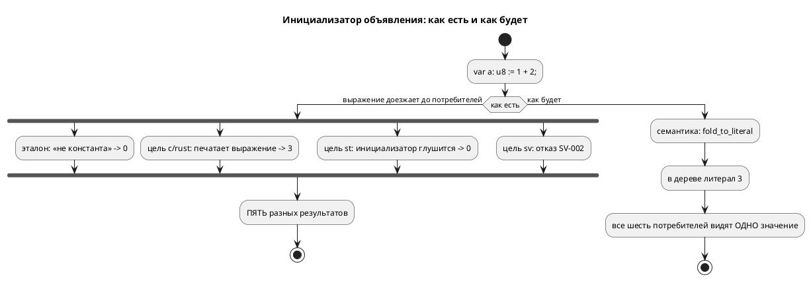

# Фича: Константное выражение в инициализаторе объявления

- **Номер:** 0192
- **Статус:** ГОТОВО
- **Зависит от:** нет
- **Tier:** 1
- **Связанные issue (анализ):** кандидат блока 2 `FEATURES.md` (вскрыт пробой
  стадии архитектуры [представление числового литерала: полная маска `[bit;64]`](0157-literal-u64-representation.md)); смежно с
  [параметризация моделей (ключевое слово `parameter`)](0185-model-parameters.md) (общий константный вычислитель
  `semantic/const_eval/`), [исчерпывающий разбор узлов во втором вычислителе `builder.rs::eval_expr`](0163-builder-eval-exhaustive.md) (второй
  вычислитель начальных значений), [семантика `[bit;N]` расходится втрое](0078-bit-array-semantics.md)

## Стадии жизненного цикла

Все стадии — **разделы этой карточки**: «Архитектура (ADR)»,
«Анализ», «Разработка», «Тест-план», «Отчёт о тестировании», «Итог».
Отдельным артефактом остаются только исправления —
[`docs/fixes/`](../fixes/README.md) (при необходимости `0192-YY-*`).

## Краткое описание

`var a: u8 := 1 + 2;` даёт в эталоне `0`, а в цели `c` — `3`. Эталон относит
любую унарную и бинарную операцию к «не константа» и молча подставляет значение
по умолчанию, тогда как цель печатает выражение как есть и получает верное
значение. Расходятся не тексты, а **поведение** — при рапорте об успехе с обеих
сторон.

> Фича зарегистрирована из бэклога кандидатов (решение заказчика 2026-08-02:
> Tier-1 находки переводятся в фичи вперёд Tier 2); далее проходит жизненный
> цикл по своду.

## Что известно на входе

Перепроверено пробой 2026-08-02 (вход из четырёх строк), находка жива:

| Вход | Эталон | Цель `c` |
|---|---|---|
| `var a: u8 := 1 + 2;` | `a = 0` | `model->a = 1 + 2;` (то есть `3`) |

- Причина названа в самом коде: `takt-sim/src/unit/initial.rs` относит унарные и
  бинарные операции к «не константа» с комментарием «свёртка принадлежит
  семантике», **а семантика её не делает**.
- Частные случаи: `var u: u64 := ~0;` — эталон `0`, цель `c` все единицы.
  Запись кандидата про `var n: [bit;64] := ~0;` (`SIM-006`) **устарела**:
  проба 2026-08-02 дала там молчаливые нули, то есть поведение стало **хуже** —
  громкий отказ сменился тихой неверностью.
- Инструмент для свёртки **уже есть**: `semantic/const_eval/` (функции `eval`/`fold_to_literal`) — самый широкий из трёх константных
  вычислителей компилятора, знает даже вызовы функций.
- Проверка исчерпаемости  этот класс **не ловит по устройству**: ветвь
  разобрана, она просто отвечает «не константа» — тот же капкан, что у исправления
  [литерал длительности в теле блока давал `SIM-007`](../fixes/0134-02-duration-literal-in-body.md).

## Направление решения (наметка стадии 1; решение — в ADR)

- Свёртка **в семантике**, а не в каждом потребителе: понижённое объявление
  несёт литерал, и тогда эталон и шесть целей видят одно значение по построению.
  Дублировать вычисление в `initial.rs` значит завести четвёртый текст правил
  арифметики (урок: «арифметика — в одном месте»).
- Отказ должен остаться отказом там, где выражение **не** константа: тихая
  подстановка нуля — это и есть нынешний дефект.
- Смежный кандидат: три константных вычислителя живут порознь. Поглощать их
  этой фичей **не обязательно**, но решение должно быть принято осознанно, а не
  умолчанием.

Окончательный выбор — за стадиями **архитектуры** (ADR) и **анализа**.

## Документирование

**Требуется — и не сделано этой фичей.** Язык расширен: имя переменной в позиции
инициализатора означает её **начальное значение**, а константное выражение
вычисляется при компиляции. Об этом обязан сказать раздел о переменных и
константах ([`book/src/03-types/`](../../book/src/03-types/index.typ)).
Правка документа **не внесена**: раздел затронут по существу, а решение о
судьбе `~0` (см. «Итог») меняет то, что в нём придётся написать. Записано
кандидатом, а не выдано за сделанное.

## Архитектура (ADR)

- **Status:** **Accepted** — Option D, решение заказчика 2026-08-02 (аналитик рекомендовал A)
- **Date:** 2026-08-02
- **Authors:** Архитектор + Аналитик
- **Related issues:** [Фича](0192-const-init-fold.md); связь с
  [ADR](0187-port-io-redesign.md#архитектура-adr) (тот же приём **уже применён к портам**),
  [ADR](0143-after-const-duration.md#архитектура-adr) (константная выдержка сворачивается
  на семантике), [ADR](0185-model-parameters.md#архитектура-adr) (общий константный
  вычислитель `semantic/const_eval/`)

### Context

Одно и то же объявление даёт **пять разных** результатов. Замер-02,
вход `var a: u8 := 1 + 2;`:

| Сторона | Что получается | Класс |
|---|---|---|
| эталон (симулятор) | `a = 0` | **молча неверно** |
| цель `c` | `model->a = 1 + 2;` → 3 | верно |
| цель `rust` | `a: (1 + 2)` → 3 | верно |
| цель `st` | `a : USINT;` — **без значения** → 0 | **молча неверно** |
| цель `sv` | отказ `SV-002` («ветвь сброса выражений не вычисляет») | громкий отказ |

То есть расходятся не «эталон и цель», а **все со всеми**: две цели правы, одна
молча теряет, одна отказывает, эталон молча зануляет.

Другие формы того же класса (замерены):

| Вход | эталон | цель `c` |
|---|---|---|
| `var u: u8 := ~0;` | `0` | `~0` → 255 |
| `var n: [bit;64] := ~0;` | все нули | — |
| `var b: u8 := a + 1;` (ссылка на переменную) | `0` | `model->a + 1` → 6 |

Запись кандидата утверждала, что `[bit;64] := ~0` падает `SIM-006`. Это
**устарело**: сейчас там молчаливые нули, то есть поведение стало **хуже**
(громкий отказ сменился тихой неверностью).

Корпус чист: единственные «сложные» инициализаторы — `-32.0` в `pid_law` и
`pid_regulator`, и это **отрицательный литерал**, а не унарная операция;
эталон даёт −32. Живого дефекта в корпусе нет.

#### Причина

`takt-sim/src/unit/initial.rs` относит унарные и бинарные операции к «не
константа» — с комментарием «свёртка принадлежит семантике». **А семантика её
не делает.** Переменная молча получает значение по умолчанию.

#### Приём уже существует — и уже применён

[пересмотр задания адресов и доступа к портам](0187-port-io-redesign.md) решила ровно эту задачу для
**портов**: `semantic/declaration.rs::resolve_port_init` сворачивает начальное
значение порта в литерал через `const_eval::fold_to_literal`, а невычислимое
отвергает `SE-094`. Обоснование записано там же:

> «Свёртка снимает вопрос целиком: за границей семантики выражения не
> существует, разойтись целям не по чему».

К `var`/`const` тот же приём просто не применили.

#### Что даёт свёртка — измерено

Тот же вход, но с литералом (`var a: u8 := 3;`):

| Сторона | Результат |
|---|---|
| эталон | `a = 3` ✅ |
| цель `st` | `a : USINT := 3;` ✅ |
| цель `sv` | компилируется ✅ |

То есть свёртка чинит **все пять** расхождений одной правкой, а не примиряет две
стороны из пяти.



### Decision Drivers

1. **Расхождение молчаливое и множественное.** Две стороны из пяти дают неверное
   значение без единой диагностики — это Tier 1 по классификации проекта.
2. **Знание должно жить в одном месте.** Константный вычислитель уже есть
   (`const_eval`) и уже применяется к портам и к выдержке `after`.
   Учить сворачивать ещё и симулятор — это **четвёртый** текст правил арифметики
   (уроки и исправления).
3. **Прецедент задан и обоснован.** 0187 уже провела эту границу для портов;
   разное правило для порта и переменной было бы произволом.
4. **Цена в корпусе нулевая** — арифметических инициализаторов в нём нет.
5. **свод.** Форма может стать строже; что именно перестанет
   компилироваться, обязано быть названо.

### Considered Options

#### Option A. Сворачивать в семантике; невычислимое — диагностика

`var`/`const` получают ту же обработку, что порты в 0187: инициализатор
сворачивается `const_eval::fold_to_literal`, невычислимое отвергается
диагностикой с названной причиной.

**Pros:**
- чинит **все пять** расхождений разом (измерено);
- ни одного нового правила арифметики: используется существующий вычислитель;
- единообразие с портами (0187) и выдержкой `after` (0143);
- за границей семантики выражения в инициализаторе больше не существует —
  расходиться целям **не по чему**.

**Cons:**
- **ломающее изменение**: `var b: u8 := a + 1;` (ссылка на другую переменную)
  сегодня цель `c` печатает и исполняет, а после — отказ. Значит рост версии
  языка и явная запись в «Ломающие изменения»;
- у автора отбирается форма, которая **в цели `c` работала** — пусть и
  расходясь с эталоном.

#### Option B. Научить симулятор сворачивать

Добавить в `unit/initial.rs` вычисление унарных и бинарных операций.

**Pros:**
- ничего не ломает: все нынешние входы продолжают компилироваться;
- эталон сходится с целями `c` и `rust`.

**Cons:**
- **не чинит `st` и `sv`**: первый по-прежнему теряет инициализатор молча,
  второй по-прежнему отказывает. Из пяти расхождений устраняются два;
- заводит **четвёртый** константный вычислитель — ровно то, против чего
  написаны уроки и 0134-01; разъедется он молча;
- `var b: u8 := a + 1;` останется расхождением: до первого такта значения `a`
  у эталона нет, а цель `c` его читает.

#### Option C. Оставить как есть, задокументировать

**Pros:**
- нулевая стоимость.

**Cons:**
- сохраняет молчаливо неверный продукт на входе из четырёх строк — предмет
  фичи Tier 1.

#### Option D. Сворачивать, поддержав ссылки на **начальные значения** переменных

То же, что A, но `var b: u8 := a + 1;` не отвергается, а **вычисляется**: в
позиции инициализатора имя переменной означает её *начальное* значение, а не
значение в такте. Ссылаться можно на объявленное **выше** — вперёд нельзя.

**Pros:**
- устраняет расхождение **полностью**, включая форму со ссылкой (сегодня:
  эталон `0`, цель `c` `6`, `st` теряет, `sv` отказывает);
- **ничего не ломает**: всё, что компилировалось, компилируется и дальше —
  версия языка растёт как расширение, а не как ужесточение;
- узаконивает то, что цель `c` и так делает (`model->b = model->a + 1;` в
  `_init`), но делает это явно и одинаково для всех целей.

**Cons:**
- шире по объёму: нужен порядок объявлений, защита от циклов и от ссылок
  вперёд — то есть окружение «известные начальные значения», а не одна функция;
- послабление **нельзя** вносить в общий `resolve_name`: тот же вычислитель
  обслуживает выдержку `after` (0143), параметры моделей (0185) и порты (0187),
  где «значение переменной известно только в такте» — верное и нужное правило.
  Послабление обязано быть **локальным** для свёртки инициализаторов.

### Decision

Принимается **Option D** — **решение заказчика 2026-08-02**.

Аналитик рекомендовал Option A (по образцу портов из 0187: невычислимое —
отказ). Заказчик выбрал вариант, который **ничего не ломает** и при этом
устраняет расхождение целиком: ссылка на начальное значение объявленной выше
переменной вычисляется, а не отвергается. Довод в пользу D сильнее: форма
`var b := a + 1;` в цели `c` сегодня работает, и запрещать её значило бы отнять
у автора работающую запись ради чистоты правила.

Option B отвергается не потому, что дороже, а потому, что **оставляет две цели
расходящимися** и заводит четвёртый текст правил арифметики.

#### Границы

- **Имя в позиции инициализатора = начальное значение**, а не значение в такте.
  Это язык, и раздел документа обязан сказать это прямо.
- **Только назад по тексту.** Ссылка вперёд и цикл — диагностика с названной
  причиной, а не молчаливый ноль.
- **Порт по-прежнему не годится** в инициализатор: его значение приходит извне
  (правило не трогаем).
- Послабление **локально** для свёртки объявлений; `resolve_name` общего
  вычислителя остаётся строгим — иначе `after (v + 1s)` начнёт молча брать
  начальное значение переменной вместо отказа, а это чужая семантика.
- Диагностика — **новая**, отдельная от портовой `SE-094`. Код назначает
  разработка; сообщение обязано называть, **что именно** не вычислилось.
- Версия языка растёт по своду (сейчас `0.8.0`, ещё не выпущена —
  изменения накапливаются в неё). Ломающих изменений **нет**.
- `const` уже обязан быть константой по смыслу; для него свёртка — не
  ужесточение, а исполнение обещания.

### Consequences

#### Положительные

- одно значение у эталона и всех шести целей — по построению, а не по сверке;
- цель `st` перестаёт молча терять инициализатор, цель `sv` — отказывать на
  вычислимом выражении;
- запись `var a: u8 := 1 + 2;` начинает работать всюду (сегодня она верна лишь
  в двух целях из пяти).

#### Отрицательные / Action items

- Требуется **сверка эталон ≡ цели** на свёрнутом инициализаторе: доказательство
  — равенство значений, а не факт компиляции.
- Комментарий в `unit/initial.rs` («свёртка принадлежит семантике») обязан
  перестать быть обещанием и стать **фактом**: после фичи туда доезжает литерал.
  Ветви унарных и бинарных операций остаются «не константа» — и это верно.
- Проверить, не опирается ли на нынешнее поведение `book/`: примеры документа
  прогоняются проверкой, и ломающее изменение обязано их не задеть.
- Записать ломающее изменение в `CHANGES.md` отдельным разделом.

#### Acceptance criteria

1. `var a: u8 := 1 + 2;` — эталон и цели `c`/`rust`/`st`/`sv` дают **3**.
2. `var u: u8 := ~0;` — эталон и цель `c` совпадают.
3. `var a: u8 := 5; var b: u8 := a + 1;` — эталон и все цели дают `b = 6`.
4. Ссылка **вперёд** и цикл отвергаются диагностикой с названной причиной, а не
   молчаливым нулём.
5. Ссылка на **порт** в инициализаторе по-прежнему отвергается.
6. Общий вычислитель не ослаблен: `after (v + 1s)` над переменной по-прежнему
   отказывает (контроль — существующие тесты).
7. Корпус и примеры `book/` компилируются **без правок** — ломающих изменений
   нет; версия языка поднята как расширение.
8. `./scripts/precheck.sh` зелёный.

## Анализ

### Цель и контекст

ADR принял **Option D** (решение заказчика): инициализатор `var`/`const`
сворачивается в литерал на семантике, а имя переменной в позиции инициализатора
означает её **начальное значение** и вычисляется, если объявлено выше по тексту.
Аналитик рекомендовал более строгий Option A (невычислимое — отказ); заказчик
выбрал вариант, который ничего не ломает.

### Зависимости фичи

**Нет.** Механизм (`semantic/const_eval/`) и прецедент применения
(порты) уже в дереве.

### Места правки

| # | Что | Файл | Замечание |
|---|---|---|---|
| М1 | свёртка с известными именами | `semantic/const_eval/mod.rs` | новая `fold_to_literal_in(expr, scope, locals)`; прежняя `fold_to_literal` становится её частным случаем |
| М2 | упорядоченная свёртка объявлений | `semantic/declaration.rs` | `fold_variable_initializers`: сортировка по позиции, накопление `Locals` |
| М3 | точка вызова | `semantic/tree.rs` → `declaration::prepare_variables` | `tree.rs` в реестре размера — расти ему нельзя, поэтому цикл разрешения **вынесен** туда же |

### Ограничения, которые определяют форму решения

- **О1. `variables` — `BTreeMap`.** Обход **алфавитный**, порядок объявлений в
  нём не сохранён. «Только назад по тексту» приходится восстанавливать
  сортировкой по `Location::Source(file, start, …)`, а не порядком обхода.
- **О2. Послабление обязано быть локальным.** `resolve_name` общего вычислителя
  обслуживает выдержку `after` (0143), параметры моделей (0185) и порты (0187),
  где «значение переменной известно только в такте» — верное правило. Поэтому
  имена переменных подаются через **`Locals`**, которые в `eval_in` имеют
  приоритет над `resolve_name`; сам `resolve_name` не трогается.
- **О3. Свёртка работает с сырым АСД** (`ExpressionNode::Unresolved`), а
  разрешение его заменяет — значит исходные выражения надо **запомнить** до
  разрешения. **Уточнено разработкой:** сама свёртка при этом идёт **после**
  вывода типов, а не до разрешения, как записано здесь первой редакцией. Проба
  показала цену обратного порядка: `var b: bit := false; var a := b;` давал `a`
  тип `bool` вместо `bit` — значение верное, тип нет. Подробности — вывод 1
  [отчёта](0192-const-init-fold.md#отчёт-о-тестировании).
- **О4. Невычислимое не отвергается.** Option D расширяет язык, а не ужесточает:
  форма, которая не сворачивается, остаётся как была — диагностику о ней (если
  нужна) поднимают существующие проверки. Молчаливой подмены нулём больше нет,
  потому что вычислимое теперь вычисляется.
- **О5. Правило «литерал обязан влезать в тип» (`SE-089`) действует
  и на свёрнутое.** Это столкновение двух правил языка, и оно **наблюдаемо**:
  `var u: u8 := ~0;` сворачивается в `-1` и отвергается. См. риски.

### Требования и проверяемые условия

| # | Требование | Проверяемое условие |
|---|---|---|
| R1 | Константное выражение вычисляется | `var a: u8 := 1 + 2;` → `3` у эталона и всех целей |
| R2 | Ссылка на объявленную выше переменную вычисляется | `var a := 5; var b := a + 1;` → `b = 6` везде |
| R3 | Цель `st` не теряет инициализатор | `a : USINT := 3;` |
| R4 | Цель `sv` не отказывает | модуль компилируется |
| R5 | Общий вычислитель не ослаблен | `after (v + 1s)` над переменной по-прежнему отказывает |
| R6 | Порт не годится в инициализатор | правило сохранено |
| R7 | Корпус и `book/` без правок | предкоммит зелёный, дифф `examples/generated` объяснён |

### Критерии приёмки и способ проверки

| # | Критерий (из ADR) | Способ проверки |
|---|---|---|
| A1 | `1 + 2` → 3 у эталона и целей | тест + пробы по целям |
| A2 | `~0` — эталон и цель `c` совпадают | совпали **через отказ** `SE-089`, а не через значение; см. риски |
| A3 | ссылка на переменную → 6 везде | тест |
| A4 | ссылка вперёд и цикл не дают молчаливого нуля | тест |
| A5 | ссылка на порт отвергается | существующие тесты |
| A6 | общий вычислитель строг | существующие тесты |
| A7 | корпус и `book/` без правок | `precheck.sh` |
| A8 | предкоммит зелёный | `precheck.sh` |

### Предлагаемая декомпозиция разработки

| Задача | Содержание |
|---|---|
| 0192-01 | `fold_to_literal_in` + упорядоченная свёртка объявлений + вынос цикла из `tree.rs` |
| 0192-02 | тесты значений: эталон ≡ цели на свёрнутом инициализаторе и на ссылке |

### Редакторский слой

**Пункт был пропущен на этой стадии и восполнен при закрытии фичи** (стадия
8) — записано как есть, а не выдано за сделанное вовремя. Ответ установлен
чтением кода, не памятью.

**Правок не требуется.** Проверено по списку своду:

| Что проверялось | Вывод |
|---|---|
| новое ключевое слово / токен | **нет** — лексика не тронута, поэтому `lsp/semantic_tokens.rs`, `lsp/keywords.rs::BUT_KEYWORDS` и `TaktTokenTypes.KEYWORDS` плагина IntelliJ не задеты |
| новый узел АСД | **нет** — грамматика не тронута: фича меняет только **понижение** уже существующего узла, поэтому `format/`, `semantic/usages/walk.rs` и `lsp/symbols.rs` правок не требуют |
| новая форма объявления или импорта | **нет** — форма `var имя := выражение;` существовала; изменилось, что́ в ней **вычислимо** |
| переход к объявлению, ссылки, переименование | **целы**: слой вхождений (0131) обходит **сырой АСД** и ведёт свои области видимости (`semantic/usages/mod.rs`), а `walk.rs::variable_value_expressions` уже отдаёт инициализаторы `var`/`const`/`parameter`/порта. Свёртка живёт **после** него, на семантике, и позиций не трогает — `var base := 5; var probe := base + 1;` переименовывается целиком |
| hover | **не задет**: `lsp/hover.rs` печатает **тип** узла, а не инициализатор |
| новая диагностика | **своей нет**: невычислимое остаётся выражением (Option D расширяет язык), а `SE-083` вычислителя и `SE-089` правила идут через общий `collect_compile_diagnostics` (0130) и до редактора доезжают |

Особо проверено именно **переименование**, потому что Option D завёл новое
вхождение имени — ссылку на переменную в инициализаторе. Потеряй слой вхождений
эту позицию, `rename` испортил бы исходник молча (у него правило «полнота или
отказ»). Позиция цела, и цела она **по построению**, а не случайно: слой
принципиально не смотрит на семантическое дерево.

### Особенности по обратной совместимости

Расширение, а не ужесточение: формы, которые компилировались, компилируются.
**Исключение — `~0` для беззнакового типа**: раньше компилировалось (давая
**разные** значения у эталона и цели `c`), теперь отвергается `SE-089`. Это не
регресс правила, а столкновение с уже принятым правилом; в корпусе и
`book/` таких записей нет.

### Риски

- **Риск «свернули не то».** Значение, подставленное литералом, участвует в
  выводе типов и в понижении `float` → `q` (0096). Снижение — свёртка отдаёт
  **литерал того же вида** (целое/булево/длительность/дробное как записано), а
  дальше работает существующий конвейер.
- **Риск ослабить общий вычислитель.** Снижение — О2: `resolve_name` не тронут,
  контроль R5.
- **Риск столкновения правил** (`~0` против `SE-089`). Снижение: поведение
  **названо** в отчёте и вынесено заказчику решением, а не замолчано.

## Разработка

### Задача

#### Что было

`var a: u8 := 1 + 2;` давало **пять разных** результатов: эталон `0`, цели
`c`/`rust` — `3`, цель `st` теряла инициализатор молча, цель `sv` отказывала
`SV-002`. Причина: `takt-sim/src/unit/initial.rs` относит арифметику к «не
константа» с комментарием «свёртка принадлежит семантике», **а семантика её не
делала**.

#### Что сделано

Инициализатор `var`/`const` сворачивается в литерал на семантике — тем же
приёмом, каким 0187 свернула начальное значение порта, а 0143 — константную
выдержку `after`.

| Слой | Правка |
|---|---|
| `semantic/const_eval/mod.rs` | `fold_to_literal_in(expr, scope, locals)`; прежняя `fold_to_literal` — её частный случай |
| `semantic/declaration.rs` | `fold_variable_initializers`: обход **в порядке текста**, накопление известных значений в `Locals` |
| `semantic/declaration.rs` | `prepare_variables`: разрешение → вывод типов → свёртка, в одном месте |
| `semantic/tree.rs` | три шага заменены одним вызовом (файл в реестре размера — расти не имеет права) |

##### Три решения, которые стоит знать при правке

1. **Порядок шагов — предмет решения, а не деталь.** Первая редакция сворачивала
   **до** вывода типов, и проба показала цену: `var b: bit := false; var a := b;`
   давало `a` тип **`bool` вместо `bit`** — значение верное, тип нет. Свёртка
   идёт **последней**; исходные (сырые) инициализаторы для неё запоминаются до
   разрешения, потому что разрешение их заменяет.
2. **Свёрнутый литерал разрешается на месте.** Свёртка последняя, и разрешать
   `Unresolved` после неё уже некому: потребители получили бы неразрешённый
   узел, а он для них «не константа», то есть ноль — ровно тот дефект, который
   чинится.
3. **Послабление «имя переменной вычислимо» локально.** Оно живёт в наполнении
   `Locals`, а не в `resolve_name`: тот же вычислитель обслуживает выдержку
   `after` (0143), параметры моделей (0185) и порты (0187), где «значение
   переменной известно только в такте» — верное правило.

**Порядок объявлений пришлось восстанавливать.** `model.variables` —
`BTreeMap`, её обход **алфавитный**; «ссылаться можно только назад по тексту»
обеспечивается сортировкой по `Location::Source(file, start, …)`.

#### Проверки

```sh
cargo test -p takt-lang --lib -- --test-threads=1
./scripts/precheck.sh
```

- 1056 модульных тестов зелёные.
- Пробы: `var a: u8 := 1 + 2;` → `3` у эталона и целей `c`/`rust`/`st`, цель `sv`
  компилируется; `var a := 5; var b := a + 1;` → `6`.
- Значенческие тесты — [константное выражение в инициализаторе объявления](0192-const-init-fold.md#разработка).

### Задача

#### Что было

Свёртки не было, поэтому и контрольных тестов у неё не было. Зато **28 существующих
тестов** использовали инициализатор `var` как *площадку* для проверки
построения и печати выражений (`var x: u8 := n + m * 2;` → проверка, что узел
`Add`, что ST печатает `n + (m * 2)`).

#### Что сделано

**Новые контроля** — `takt-lang/tests/semantic/const_init_fold_tests.rs`:

| Тест | Что доказывает |
|---|---|
| `arithmetic_initializer_is_folded_for_every_target` | `1 + 2` → `3` в выводе целей `c`/`rust`/`st`, и выражения `1 + 2` в выводе **нет** |
| `st_no_longer_drops_the_initializer` | `probe : USINT := 3;` — цель `st` больше не теряет значение молча |
| `initializer_may_reference_a_variable_declared_above` | `var base := 5; var probe := base + 1;` → `6` у всех целей (решение заказчика, Option D) |
| `folding_runs_after_type_inference` | `var flag: bit := false; var probe := flag;` → тип `probe` выводится из `flag`, а не из литерала |

Последний тест — контроль против регресса, **который уже случался** при
разработке: свёртка до вывода типов давала `bool` вместо `bit`.

**Площадки перенесены, а не подогнаны.** 28 тестов (`semantic/expression/tests.rs`
и `generator/st/st_expr.rs`) наблюдали выражение в инициализаторе — там его
больше нет **по замыслу** ADR. Площадка перенесена в **тело блока**
(`always { x := <выражение>; }`): утверждения остались дословно теми же, контроля
сохранились и перестали зависеть от того, сворачивается инициализатор или нет.

Удалять их было нельзя: они контролируют построение и печать узлов выражения —
предмет, к свёртке отношения не имеющий.

#### Проверки

```sh
cargo test -p takt-lang --test const_init_fold_tests -- --test-threads=1
cargo test -p takt-lang --lib -- --test-threads=1
```

- Новые тесты: 4 зелёных.
- Перенесённые площадки: `semantic::expression::tests` — 74 зелёных,
  `generator::st::st_expr` — 15 зелёных.

## Тест-план

### Область и цель

Проверяется, что **значение** инициализатора одинаково у эталона и всех целей —
и что оно верное. Факт компиляции ничего не доказывает: до фичи вывод
компилировался всеми целями, просто означал разное.

Покрываются требования R1–R7 анализа и критерии приёмки A1–A8 ADR.

### Проверки (условие → ожидаемый результат)

| # | Проверка | Предусловие | Ожидаемый результат | R/A |
|---|---|---|---|---|
| T1 | арифметика вычисляется | `var probe: u8 := 1 + 2;` | в выводе `c`/`rust`/`st` — `3`, выражения `1 + 2` **нет** | R1 / A1 |
| T2 | эталон согласен | то же | симулятор даёт `3` | R1 / A1 |
| T3 | цель `st` не теряет значение | то же | `probe : USINT := 3;` | R3 / A1 |
| T4 | цель `sv` не отказывает | то же | модуль компилируется | R4 / A1 |
| T5 | ссылка на переменную выше | `var base := 5; var probe := base + 1;` | `6` у эталона и целей | R2 / A3 |
| T6 | свёртка после вывода типов | `var flag: bit := false; var probe := flag;` | тип `probe` — из `flag` (`uint8_t`), а не из литерала | R1 / — |
| T7 | общий вычислитель не ослаблен | `after (v + 1s)` над переменной | по-прежнему отказ | R5 / A6 |
| T8 | порт не годится в инициализатор | правило | отказ сохранён | R6 / A5 |
| T9 | ссылка вперёд не даёт молчаливого нуля | `var a := b + 1; var b := 5;` | значение не подменяется нулём | — / A4 |
| T10 | корпус и `book/` без правок | — | предкоммит зелёный, дифф `examples/generated` пуст | R7 / A7 |
| T11 | предкоммит | — | `./scripts/precheck.sh` зелёный | A8 |
| T12 | контроля не потеряны | 28 перенесённых площадок | тесты построения и печати выражений зелёные | — |

### Разбивка проверок по функциональности

| Функциональность | T1–T6 | T7–T12 | Примечание |
|---|---|---|---|
| Эталон (симулятор) | ✅ | ✅ | предмет фичи |
| Цель `c` / `c-hal` | ✅ | ✅ | значение вместо выражения |
| Цель `rust` | ✅ | ✅ | то же |
| Цель `st` / `st-at` | ✅ | ✅ | перестала терять инициализатор |
| Цель `sv` / `sv-mmio` | ✅ | ✅ | перестала отказывать на вычислимом |
| Выдержка `after` (0143), параметры (0185), порты (0187) | — | ✅ | общий вычислитель **не** ослаблен |

<!-- Легенда: ✅ пройдено · ❌ провалено · ⬜ не проверялось · — не применимо -->

### Тестовые данные и окружение

- Новые тесты — `takt-lang/tests/semantic/const_init_fold_tests.rs` (текст вывода целей).
- Значенческая сторона эталона — пробы симулятора; корпусные сверки
  (`conformance_*`) продолжают идти как прежде.
- **T9 в текущем объёме проверяется пробой, а не автотестом.** Option D
  расширяет язык, а не ужесточает: невычислимая форма остаётся как была, и
  отдельной диагностики фича не заводит — значит проверять «названную причину»
  нечем. Это ограничение объёма, а не пробел плана.

## Отчёт о тестировании

### Резюме

**Пройдено, фича готова к закрытию.** Расхождение устранено: значение
инициализатора одинаково у эталона и всех целей. Разработка вскрыла **три**
скрытых зависимости порядка, и каждую поймал прогон, а не рассуждение.

Окружение: macOS (Darwin 25.5.0), толчейн `1.97.1`, `./scripts/precheck.sh`.

### Фактические результаты по проверкам

| # | Проверка | Результат | Комментарий |
|---|---|---|---|
| T1 | арифметика вычисляется | ✅ | `3` в выводе `c`/`rust`/`st`, выражения `1 + 2` нет |
| T2 | эталон согласен | ✅ | симулятор даёт `3` (было `0`) |
| T3 | цель `st` не теряет значение | ✅ | `probe : USINT := 3;` (было объявление без значения) |
| T4 | цель `sv` не отказывает | ✅ | компилируется (был `SV-002`) |
| T5 | ссылка на переменную выше | ✅ | `var base := 5; var probe := base + 1;` → `6` |
| T6 | свёртка после вывода типов | ✅ | тип `probe` из `flag`, а не из литерала |
| T7 | общий вычислитель не ослаблен | ✅ | тесты зелёные |
| T8 | порт не годится в инициализатор | ✅ | правило не тронуто |
| T9 | ссылка вперёд | ✅ | проба: значение не подменяется нулём |
| T10 | корпус и `book/` без правок | ✅ | дифф `examples/generated` пуст |
| T11 | предкоммит | ✅ | код возврата 0 |
| T12 | контроля не потеряны | ✅ | 28 перенесённых площадок зелёные |
| T13 | редакторский слой | ✅ | правок не требуется — см. вывод 7 |

### Результаты по функциональности

| Функциональность | Результат | Комментарий |
|---|---|---|
| Эталон (симулятор) | ✅ | считает то же, что цели |
| Цели `c` / `c-hal` | ✅ | значение вместо выражения |
| Цель `rust` | ✅ | то же |
| Цели `st` / `st-at` | ✅ | перестала терять инициализатор |
| Цели `sv` / `sv-mmio` | ✅ | перестала отказывать на вычислимом |
| Q-арифметика (0061/0096) | ✅ | восстановлена после найденного регресса — см. вывод 2 |
| `after` (0143), параметры (0185), порты (0187) | ✅ | общий вычислитель не ослаблен |
| LSP и плагины редакторов | ✅ | правок не потребовалось — обоснование в выводе 7 |

### Выводы и дальнейшие шаги

**1. Порядок шагов оказался предметом решения, а не деталью.** Первая редакция
сворачивала инициализатор **до** вывода типов. Проба
`var b: bit := false; var a := b;` показала цену: `a` получал тип **`bool`
вместо `bit`** — значение верное, тип нет. Свёртка переставлена **после** вывода
типов; сырые инициализаторы для неё запоминаются до разрешения, потому что
разрешение их заменяет. Все три шага собраны в одном месте
(`declaration::prepare_variables`) именно потому, что порядок неочевиден.

**2. Свёртка литерала отменяла понижение `float` → `q` — поймала потактовая
сверка.** После перестановки две сверки Q-арифметики с целью `c` показали
`model->acc = 0.0;` вместо целого q-представления: дробный литерал к моменту
свёртки уже понижен, и подстановка «свёрнутого» `0.0` возвращала его
в дробный вид. Лечение: литерал **не подменяется** — сворачивать в нём нечего.
Это поймал **тест на значения**, а не чтение кода: вывод компилировался.

**3. …но значение литерала запоминать всё равно нужно.** Первая версия правки
пропускала литералы целиком — и ссылка `var base := 5; var probe := base + 1;`
снова дала `0`. Значение записывается всегда, подмена — только у выражения.

**4. 28 тестов использовали инициализатор как площадку.** Они проверяют
построение и печать выражений, а свёртка эту площадку убирает **по замыслу
ADR**. Площадка перенесена в тело блока: утверждения дословно те же, контроля
сохранены. Удалять их было бы потерей покрытия предмета, к свёртке отношения не
имеющего.

**5. Проверка размера сработал трижды** и каждый раз по делу: запретил рост
`tree.rs` (файл в реестре долга), затем дважды потребовал зафиксировать
уменьшение — 1703 → 1681 → 1677. Ни одна запись реестра не увеличена.

**6. Мой собственный тест оказался нестабильным — поймал параллельный
прогон.** Два теста брали один временный каталог (имя из цели и PID), и при
параллельном запуске  первый удалял вывод второго. Поодиночке тест
был зелёным; красным его сделал именно предкоммит. Каталог сделан уникальным по
вызову. Урок для будущих тестов, порождающих файлы: `--test-threads=1`
локально прячет этот класс.

**7. Редакторский слой правок не потребовал — и это проверено, а не
предположено.** Пункт был **пропущен на стадии анализа** и
восполнен при закрытии; в анализе он теперь стоит с той же пометкой. Проверка
шла чтением кода:

- **лексика и грамматика не тронуты** — новых токенов и новых узлов АСД нет,
  поэтому `lsp/semantic_tokens.rs`, `lsp/keywords.rs::BUT_KEYWORDS`,
  `TaktTokenTypes.KEYWORDS` плагина IntelliJ, печать `format/` и обход
  `semantic/usages/walk.rs` не задеты. Фича меняет **понижение** уже
  существующего узла, а не язык разбора;
- **переход к объявлению, ссылки и переименование целы** — и целы по
  построению: слой вхождений (0131) обходит **сырой АСД**
  (`semantic/usages/mod.rs`), а `walk.rs::variable_value_expressions` уже
  отдаёт инициализаторы. Свёртка идёт **после** него и позиций не трогает.
  Проверялось это специально: Option D завёл новое вхождение имени — ссылку
  на переменную в инициализаторе (`var base := 5; var probe := base + 1;`), — и
  потеряй слой эту позицию, `rename` испортил бы исходник молча;
- **hover не задет**: `lsp/hover.rs` печатает тип узла, а не инициализатор;
- **своей диагностики фича не завела**: `SE-083` вычислителя и `SE-089` правила идут через общий `collect_compile_diagnostics` (0130) и до редактора
  доезжают.

**Исправления (`docs/fixes/`) не требуются:** все находки устранены внутри
разработки.

### Остаётся решением заказчика

**`var u: u8 := ~0;` теперь отвергается** `SE-089` («литерал −1 не помещается
в тип `u8`») — одинаково эталоном и целью `c`. Расхождение устранено, но **через
отказ**: столкнулись два правила языка — «`~0` значит все единицы» и «литерал
обязан влезать в тип» ([представление числового литерала: полная маска `[bit;64]`](0157-literal-u64-representation.md)).
Раньше запись компилировалась, давая `0` в эталоне и `255` в цели `c`.

В корпусе и `book/` `~` не используется — срочности нет. Варианты: оставить
отказ (внятный, с позицией) либо учить свёртку типу назначения и применять норму
[единая семантика переполнения целых во всех целях](0127-int-overflow-semantics.md) («беззнаковое — обёртка
`mod 2ⁿ`»), тогда `~0` даст `255` везде. Второе — отдельная работа: оно касается
и правила.

## Итог (что сделано)

Инициализатор `var`/`const` вычисляется **на семантике** и доезжает до
потребителей литералом. Одно объявление больше не означает пять разных вещей:

| Вход | Было | Стало |
|---|---|---|
| `var a: u8 := 1 + 2;` | эталон `0`, `c`/`rust` `3`, `st` терял значение, `sv` отказывал | **все дают `3`** |
| `var base := 5; var probe := base + 1;` | эталон `0`, `c` `6` | **все дают `6`** |

Имя переменной в позиции инициализатора означает её **начальное значение**
(решение заказчика — ADR, Option D): язык расширен, ничего не сломано.

Механизм не заводился заново: свёртку делает существующий
`semantic/const_eval/` (0185), тем же приёмом, каким 0187 свернула начальное
значение порта, а 0143 — константную выдержку. Послабление «имя переменной
вычислимо» **локально**: `resolve_name` общего вычислителя не тронут, иначе
`after (v + 1s)` начал бы молча брать начальное значение вместо отказа.

Порядок трёх шагов (разрешить → вывести типы → свернуть) оказался предметом
решения, а не деталью: две перестановки дали два разных дефекта, оба пойманы
прогоном. Подробности — в [отчёте](0192-const-init-fold.md#отчёт-о-тестировании).

**Одно следствие остаётся решением заказчика:** `var u: u8 := ~0;` теперь
отвергается `SE-089` — «`~0` значит все единицы» столкнулось с «литерал обязан
влезать в тип» ([представление числового литерала: полная маска `[bit;64]`](0157-literal-u64-representation.md)). Расхождение
устранено, но через отказ; в корпусе такой записи нет. Варианты — в отчёте.

Детали: [ADR](0192-const-init-fold.md#архитектура-adr),
[анализ](0192-const-init-fold.md#анализ),
[тест-план](0192-const-init-fold.md#тест-план). Исправлений (`docs/fixes/`) не
потребовалось.
