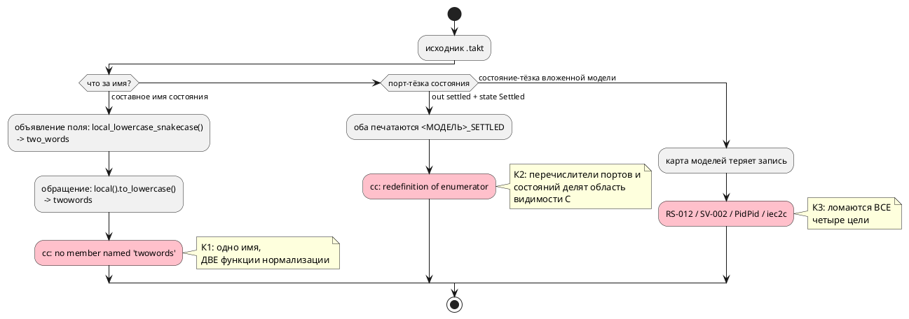
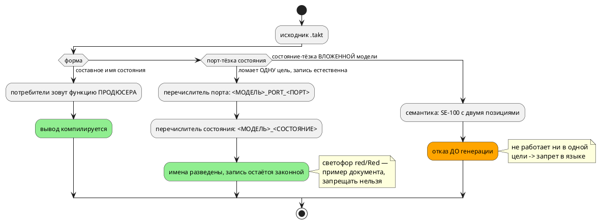

# Фича: Коллизии имён при отображении в пространство имён цели

- **Номер:** 0195
- **Статус:** ГОТОВО
- **Зависит от:** нет
- **Tier:** 1
- **Связанные issue (анализ):** три кандидата блока 2 `FEATURES.md` (вскрыты
  пробами при разработке [библиотечный ПИД-регулятор и пример его применения](0182-pid-library-and-application.md) и
  [корпусной SV-транслируемый пример на последовательную композицию `+`](0166-sv-example-sequential-composition.md)); тот же класс, что
  [ключ карты адресов — голое имя порта](0084-address-map-qualified-key.md) (ключ карты адресов),
  [цели `rust` и `sv` — одноимённые константы разных моделей](0193-shared-const-qualified.md) (константы `rust`/`sv`) и ловушка
  `Concat` цели `st` (имена моделей делят пространство со стандартной
  библиотекой IEC)

## Стадии жизненного цикла (правило 17)

Все стадии — **разделы этой карточки** (правило 32): «Архитектура (ADR)»,
«Анализ», «Разработка», «Тест-план», «Отчёт о тестировании», «Итог».
Отдельным артефактом остаются только исправления —
[`docs/fixes/`](../fixes/README.md) (при необходимости `0195-YY-*`).

## Краткое описание

Имена разных сущностей языка (порт, состояние, модель) нормализуются в **одно**
пространство имён цели без проверки на столкновение. Три подтверждённые формы
дают некомпилируемый вывод при рапорте `taktc` об успехе — то есть автор узнаёт о
проблеме от чужого инструмента (`cc`) и в терминах порождённого кода, а не от
компилятора и в терминах своей записи.

> Фича зарегистрирована из бэклога кандидатов (решение заказчика 2026-08-02:
> Tier-1 находки переводятся в фичи вперёд Tier 2); далее проходит жизненный
> цикл по правилу 17.

## Что известно на входе

Все три формы перепроверены пробами 2026-08-02, все живы.

| # | Вход | Цель | Что отвечает инструмент |
|---|---|---|---|
| К1 | файл `two_words.takt` + `start TwoWords = M;` | `c` | `cc`: `no member named 'twowords' in 'struct TwoWords'` — поле объявлено как `two_words`, обращение печатается `twowords` |
| К2 | `out settled: bit;` рядом с `state Settled` | `c` | `cc`: `redefinition of enumerator 'PORTSTATE_M_SETTLED'`, `duplicate case value` |
| К3 | файл `pid.takt` + `model Pid { … } start Pid = Pid;` | `rust` | `taktc`: `RS-012: Под-модель 'pid:Pid' не найдена в карте` |

- К1 срабатывает именно на **совпадении** имени состояния с именем корневой
  модели, выведенным из **составного** имени файла: односложное имя (`root.takt`
  + `start Root = M;`) и любое несовпадающее (`start Main = M;`) проходят.
- К3 бьёт по самому естественному имени библиотеки: имя корневой модели берётся
  из имени файла, поэтому `pid.takt` с моделью `Pid` — не экзотика. Цели `c` и
  `st` тот же вход принимают.
- Дефекты **громкие** (сборка не проходит), а не молчаливые: цена ошибки —
  отказ, а не неверное поведение. Поэтому фича замыкает блок Tier 1.
- К2 вскрыл проверка `c-hal` (`cc -c` по всем примерам); корпусный проверка цели `c`
  через `cmake` его не поймал.
- В корпусе все три обойдены **переименованием** (`Ready` → `Done` в 0166,
  `pid.takt` → `pid_law.takt` в 0182) — то есть дефекты обойдены, а не устранены.

## Архитектура (ADR)

- **Status:** Accepted (гибрид B+C — два решения заказчика 2026-08-03, см. «Decision»)
- **Date:** 2026-08-03
- **Authors:** Архитектор + аналитик
- **Related issues:** [Фича](0195-target-name-collisions.md);
  тот же класс, что [ADR](0084-address-map-qualified-key.md#архитектура-adr) (ключ карты
  адресов квалифицирован) и [ADR](0193-shared-const-qualified.md#архитектура-adr)
  (константы `rust`/`sv`)

### Context

Карточка называет «три формы одной коллизии». Пробы 2026-08-03 **настоящими
инструментами** (не по коду возврата `taktc`) показали, что это **три разных
дефекта с разными причинами и разным охватом**, и что охват в карточке занижен.

| Форма | Вход | `c` / `c-hal` | `rust` | `sv` | `st` |
|---|---|---|---|---|---|
| **К1** | имя состояния из двух слов: `start TwoWords = M;` | `cc`: `no member named 'twowords'` | | | |
| **К2** | `out settled: bit;` рядом с `state Settled` | `cc`: `redefinition of enumerator`, `duplicate case value` | | | |
| **К3** | `pid.takt` + `model Pid { … }` + `start Pid = Pid;` | `cc`: `unknown type name 'PidPid'` | `RS-012` | `SV-002` | `iec2c` |

#### Поток «как есть»: где имя теряется или сталкивается



#### Поправки к тому, что было записано на входе

- **К3 ломает все четыре цели, а не только `rust`.** Карточка утверждала, что
  «цели `c` и `st` тот же вход принимают»: их принимает **`taktc`**, а `cc` и
  `iec2c` — нет. Проверка велась по коду возврата компилятора, а не по сборке
  порождённого кода.
- **К1 не про имя файла.** Карточка связывала дефект с **составным именем
  файла**; замер показал другое: ломается **составное имя состояния**, файл ни
  при чём (`tw_same.takt` + `start TwoWords = M;` даёт тот же отказ, а
  `start Alpha = M;` в том же файле компилируется).

#### Причины — разные

- **К1 — рассинхрон нормализации, а не коллизия.** Продюсер печатает поле
  `unique_lowercase_snakecase()` (`c_header.rs`) → `two_words`; потребители —
  `local().to_lowercase()` (`c_model.rs`, `c_model_init.rs`) → `twowords`. На
  односложном имени обе нормализации совпадают, поэтому дефект невидим. Это
  буквально урок: **продюсер и потребитель имени обязаны строить одну
  строку**, и никакого вопроса к языку здесь нет.
- **К2 — два пространства имён языка сведены в одно пространство C.**
  Перечислители портов и перечислители состояний делят область видимости, и
  `out settled` + `state Settled` дают один `<ROOT>_M_SETTLED` дважды.
- **К3 — столкновение имени под-модели с именем корня**, который выводится из
  имени файла. Ломается не печать, а **карта моделей**: `rust` не находит
  `pid:Pid`, `sv` — «модель отсутствует в снимке карты», `c` печатает тип
  `PidPid`, которого нет.

Замер объёма: в корпусе 92 перечислителя (порты и состояния) и **ни одной**
коллизии — иначе он бы не собирался. То есть корпус все три формы обходит, и
приёмка обязана идти на фикстурах, а не на нём.

### Decision Drivers

1. **Отказ должен приходить от своего компилятора и в терминах своей записи.**
   Сегодня автор узнаёт о проблеме от `cc`/`iec2c` и в терминах порождённого
   кода — худший из возможных каналов.
2. **Не сужать язык там, где сужать не требуется.** К1 — чистый баг; запрещать
   составные имена состояний было бы абсурдом.
3. **Имена портов видны пользователю.** Перечислитель порта стоит в сигнатуре
   HAL-колбэка (`write_bit(STACKER_CMD_ACK, …)`) — его переименование ломает
   пользовательский код, а не только снапшоты.
4. **Одно правило имени на цель** (уроки и 0193): печать и потребление —
   одна функция, иначе они разъезжаются молча.

### Considered Options

#### Option A. Всё чинится в кодогене

К1 — единая нормализация; К2 — префикс у перечислителя порта
(`<ROOT>_PORT_<NAME>`); К3 — квалификация имени под-модели.

**Pros:**
- язык не меняется, документирование не требуется;
- ни одна законная запись не запрещается;
- закрывает класс целиком, включая формы, которых мы ещё не пробовали.

**Cons:**
- **ломает видимый пользователю API** порождённого C: 92 перечислителя корпуса,
  и имена портов стоят в сигнатурах колбэков (драйвер 3);
- К3 в цели `c` требует различать тип корня и тип под-модели с одинаковым
  именем — правка глубже, чем переименование;
- цена не окупается: К2/К3 — редкие столкновения, а платят **все** пользователи.

#### Option B. К1 — в кодогене, К2 и К3 — семантическая диагностика

К1 чинится (это баг). Столкновение имени порта с именем состояния и имени
под-модели с именем корня отвергается компилятором **с позицией и внятным
текстом**.

**Pros:**
- отказ приходит **от своего компилятора**, до генерации, в терминах записи
  автора (драйвер 1);
- вывод корпуса не меняется ни на байт — API порождённого кода цел (драйвер 3);
- дёшево и проверяемо: диагностика тестируется фикстурой, а не сборкой чужим
  инструментом;
- честно отражает суть: сегодня такая запись **не работает нигде**, то есть
  запрещается не «законное», а то, что и так не собирается.

**Cons:**
- язык получает **новое ограничение** → требуется документирование (правило 24)
  и заметка о типичных ошибках (правило 26);
- ограничение продиктовано целью, а не языком: модель, которую никогда не
  переводят в `c`, тоже его получит. Смягчение: у К3 отказывают **все четыре**
  цели, так что для него это не «цена цели», а факт.

#### Option C. К1 — в кодогене, К2 — префикс, К3 — диагностика

Разделить по природе: К2 — столкновение **пространств** (порт и состояние —
разные сущности, их можно развести префиксом, не спрашивая автора), К3 —
столкновение **имён** (две сущности назвались одинаково, развести их за автора
нельзя).

**Pros:**
- каждая форма лечится средством своей природы;
- К2 перестаёт быть ограничением языка: автор вправе назвать порт и состояние
  одинаково.

**Cons:**
- платит драйвер 3: префикс меняет **все** имена портов в корпусе и в
  пользовательских сигнатурах ради редкого столкновения;
- два разных ответа на похожие с виду записи — объяснимо, но требует объяснения.

#### Option D. Разделить на три фичи

**Pros:**
- К1 закрывается немедленно и без вопросов к языку.

**Cons:**
- три жизненных цикла на один класс; общий принцип именования размажется по
  трём ADR — ровно то, от чего уводит правило «одно правило имени на цель».

### Decision

**Рекомендация архитектора — Option B.**

Решающий довод: сегодня формы К2 и К3 **не работают ни в одной цели** — то есть
диагностика не запрещает работающую запись, а лишь переносит уже существующий
отказ туда, где он полезен: в свой компилятор, до генерации, с позицией. Option A
и C платят за это ломкой видимых пользователю имён (драйвер 3) — цену несут все
пользователи ради редкого столкновения.

К1 при этом чинится **кодогеном**, а не диагностикой: это рассинхрон двух
нормализаций одного имени, законность записи под вопросом не стоит.

#### Как решение уточнялось (два шага, оба — заказчика, оба по данным прогона)

**Шаг 1 (принят Option B).** К1 — кодоген, К2 и К3 — семантическая диагностика.
Довод: обе формы «не работают ни в одной цели», значит запрет ничего не отнимает.

**Шаг 2 (К2 переведён на префикс — по существу Option C).** Прогон опроверг
довод **для К2**: он ломает **только** цель `c`, а `rust`, `sv`, `st` и
симулятор такой вход исполняют верно. Семантическая диагностика уронила два
теста симулятора на законных входах. Заказчик перенёс отказ в цель `c`
(`CC-022`).

**Шаг 3 (отказ снят вовсе).** Предкоммит показал цену: под запрет попал
**пример документа** — светофор с портами `red/yellow/green` и состояниями
`Red/Yellow/Green`. Это не редкое столкновение, а самое естественное именование
автомата. Заказчик выбрал **развести имена префиксом** (`<МОДЕЛЬ>_PORT_<ПОРТ>`),
приняв цену: 16 файлов снапшотов и смену видимых пользователю имён.

Итоговое решение — **гибрид**: К1 и К2 лечатся в кодогене, К3 — диагностикой
`SE-100`. Разделение не по вкусу, а по охвату: К2 ломает одну цель при
естественной записи, К3 не работает нигде.

Первоначально решение заказчика (2026-08-03) — **Option B**, совпало с
рекомендацией.
Развилка была такой: Option B **сужает язык** двумя диагностиками, Option A/C
**сохраняют язык** ценой смены имён в порождённом коде и пользовательских
сигнатурах. Выбрано первое: платить сменой видимых имён ради записи, которая
сегодня не работает ни в одной цели, — цена не по адресу.

#### Целевой поток: три разных ответа по охвату дефекта



### Consequences

#### Положительные

- три громких отказа от чужих инструментов превращаются в один класс внятных
  диагностик и одну починку;
- корпус и API порождённого кода не меняются (Option B);
- К1 снимает рассинхрон, который мог бы дать и **молчаливые** дефекты в других
  местах: две нормализации живут в разных модулях.

#### Отрицательные / Action items

- **A1.** Приёмка — **сборка порождённого кода настоящими инструментами** на
  фикстурах с коллизией, а не на корпусе: корпус все три формы обходит.
- **A2.** Для К1 продюсер и потребитель обязаны звать **одну** функцию; тест
  обязан проверять составное имя (односложное дефект скрывает).
- **A3.** Диагностики К2/К3 обязаны называть **обе** позиции (что с чем
  столкнулось) — иначе автор снова пойдёт разбираться в порождённый код.
- **A4.** Документирование (правило 24) — обязательно при Option B: новое
  ограничение языка, разделы о моделях и портах + заметка о типичных ошибках.
- **A5.** Проверить, не задевает ли диагностика К3 **законные** записи: имя
  под-модели, совпадающее с именем корня, встречается в библиотечных примерах
  (`pid_law.takt` обошли переименованием файла).

#### Acceptance criteria

1. К1: `start TwoWords = M;` даёт компилируемый `c` (`cc` зелёный), и то же для
   любого составного имени состояния.
2. К2: `out settled` + `state Settled` отвергается **компилятором** с позицией
   обеих сущностей.
3. К3: `pid.takt` + `model Pid` + `start Pid = Pid;` отвергается компилятором,
   а не четырьмя разными инструментами.
4. Вывод корпуса не изменился ни на байт; предкоммит зелёный.
5. Есть фикстуры, на которых порождённый код **собирается** настоящими
   инструментами (для К1) и на которых компилятор **отказывает** (К2, К3).

## Анализ

### Цель и контекст

ADR принял **Option B** (рекомендация архитектора и решение заказчика совпали):
**К1** чинится в кодогене (это рассинхрон нормализации, а не коллизия),
**К2** и **К3** отвергаются семантической диагностикой — они сегодня не работают
**ни в одной** цели, поэтому диагностика не запрещает работающую запись, а
переносит уже существующий отказ в свой компилятор, до генерации, с позицией.

### Зависимости фичи (правило 17/19)

**Нет.**

### Места правки

| # | Что | Файл | Замечание |
|---|---|---|---|
| М1 | К1: потребители имени поля | `generator/c/c_model.rs` (2 места), `generator/c/c_model_init.rs` | заменить `local().to_lowercase()` на `local_lowercase_snakecase()` — ту же функцию, что зовёт продюсер |
| М2 | К2: отказ **цели `c`** «порт = состояние» | `generator/c/c_names.rs` (новый модуль) | **`CC-022`**, обе позиции. Уточнение 2026-08-03 (решение заказчика): К2 ломает **только** `c`, поэтому запрет живёт в цели, а не в языке |
| М3 | К3: диагностика «состояние = дочерняя модель» | `semantic/validate/name_collisions.rs` | **`SE-100`**, обе позиции |
| М4 | реестр диагностик | `docs/diagnostics/README.md` | две записи |
| М5 | документ языка (правило 24) | `book/src/` | новое ограничение — разделы о моделях и портах |

**М1 — это ровно урок:** продюсер печатает поле
`state_name.local_lowercase_snakecase()` (`c_header.rs:32`), потребители —
`state_name.local().to_lowercase()` (`c_model.rs:541,550`,
`c_model_init.rs:203`). Одно имя, две функции. Правка сводит их к одной.

### Ограничения, которые определяют форму решения

- **О1. Односложное имя дефект скрывает.** `Alpha` даёт одинаковый результат
  обеими нормализациями; ломается только составное (`TwoWords` →
  `two_words` против `twowords`). Тест обязан брать составное имя.
- **О2. Имя файла к К1 отношения не имеет.** Замер-03 опроверг запись
  карточки: ломается **имя состояния**, а файл может быть любым.
- **О3. К3 ломает все четыре цели**, а не только `rust` — значит диагностика не
  «цена цели `c`», а констатация: запись не работает нигде.
- **О4. Диагностика обязана называть обе позиции.** Иначе автор снова пойдёт
  разбираться в порождённый код — то, ради устранения чего фича и заведена.
- **О5. Корпус все три формы обходит** (переименованиями 0166 и 0182), поэтому
  приёмка идёт на фикстурах: для К1 — **сборка** порождённого кода настоящим
  `cc`, для К2/К3 — отказ компилятора.

### Требования и проверяемые условия

| # | Требование | Проверяемое условие |
|---|---|---|
| R1 | К1 устранён | `start TwoWords = M;` → `cc` собирает вывод без ошибок |
| R2 | К1 покрыт на составном имени | тест на имени из двух слов, не односложном |
| R3 | К2 отвергается целью `c` | `out settled` + `state Settled` → `CC-022`; прочие цели вход **принимают** |
| R4 | К3 отвергается семантикой | `model Pid` + `start Pid = Pid;` → `SE-100` во всех целях; тёзка **соседней** модели законна |
| R5 | Законные записи не задеты | корпус и `book/` компилируются; предкоммит зелёный |
| R6 | Вывод корпуса не изменился | дифф `examples/generated/` пуст |
| R7 | Диагностики доезжают до редактора | идут общим путём `collect_compile_diagnostics` |

### Критерии приёмки и способ проверки

| # | Критерий (из ADR) | Способ проверки |
|---|---|---|
| A1 | К1: `cc` зелёный на составном имени | тест с прогоном настоящего `cc` |
| A2 | К2: отказ компилятора с позицией | тест на код и текст диагностики |
| A3 | К3: отказ компилятора, а не четырёх инструментов | то же |
| A4 | вывод корпуса не изменился | `precheck.sh` + дифф |
| A5 | законные записи не задеты | корпус и `book/` (A5 ADR) |

### Предлагаемая декомпозиция разработки

| Задача | Содержание |
|---|---|
| 0195-01 | К1: единая нормализация имени поля + тест со сборкой `cc` |
| 0195-02 | К2/К3: диагностики `SE-100`/`SE-100` + фикстуры + реестр кодов |
| 0195-03 | документирование (правило 24): раздел о моделях/портах, заметка о типичных ошибках |

### Особенности по обратной совместимости (правило 11)

- **К1** — вывод цели `c` меняется **только** на входах, которые сегодня не
  компилируются; корпус не задет (в нём таких имён нет).
- **К2/К3** — язык **сужается**: две ранее принимавшиеся (но нигде не
  работавшие) записи становятся ошибкой. Ломающих изменений для рабочих программ
  нет по построению: то, что отвергнется, и так не собиралось.
- Проверить (A5 ADR), не задевает ли `SE-100` библиотечные примеры: `pid_law.takt`
  обошли переименованием **файла**, и имя модели там могло остаться близким.

### Документирование (правило 24)

**Требуется** — Option B добавляет в язык ограничение. Место: разделы о моделях и
портах документа `book/`, плюс заметка о типичных ошибках (правило 26). Объём.

### Редакторский слой (правило 29)

**Новые диагностики — да, прочего нет.** `SE-100`/`SE-100` обязаны идти общим
путём `collect_compile_diagnostics` (0130), которым пользуются и CLI, и LSP, —
тогда они доезжают до редактора без правок LSP. Лексика, синтаксис, узлы АСД,
списки ключевых слов и `semantic/usages` не задеты: новых форм записи фича не
вводит.

### Риски

- **Риск «починили не ту нормализацию»** (К1). Снижение: правка сводит
  потребителей к функции **продюсера**, а не наоборот; контроль — сборка `cc`.
- **Риск задеть законное** (К2/К3). Снижение: R5/A5 — корпус и `book/`; проверка
  прогоном, а не рассуждением.
- **Риск «диагностика без позиции»** (О4). Снижение: тест проверяет **текст**, а
  не только код.

## Разработка

### Задача

#### Что было

**К1 — рассинхрон нормализации.** Поле под-модели объявлялось
`state_name.local_lowercase_snakecase()` (`c_header.rs`) → `two_words`, а
обращение печаталось `state_name.local().to_lowercase()` (`c_model.rs` ×2,
`c_model_init.rs`) → `twowords`. Одно имя, две функции. На односложном имени обе
дают одно и то же, поэтому дефект был **невидим** — ровно урок.

**К2 — порт и состояние делят перечислители C.** `out settled` рядом с
`state Settled` давали `<МОДЕЛЬ>_SETTLED` дважды: `redefinition of enumerator`
плюс `duplicate case value` от `cc` при рапорте `taktc` об успехе.

#### Что сделано

**К1.** Потребители сведены к функции **продюсера**
(`local_lowercase_snakecase()`), а не наоборот: объявление — источник истины.

**К2.** Перечислители разведены сегментом `PORT_`:
`<МОДЕЛЬ>_PORT_<ПОРТ>` против `<МОДЕЛЬ>_<СОСТОЯНИЕ>`. Имя строится **одной**
функцией `c_names::port_enum_variant` — прежде его собирали **восемь** мест
порознь (`c_header`, `c_hal`, `c_model_init` и пять точек печатника выражений).

**Решение по К2 менялось дважды, и оба раза по данным прогона** (см. ADR,
раздел «Как решение уточнялось»): сперва семантическая диагностика, затем отказ
цели `CC-022`, затем — снятие отказа и префикс. Последний шаг вызван тем, что
под запрет попал **пример документа**: светофор с портами `red/yellow/green` и
состояниями `Red/Yellow/Green`.

#### Цена, заплаченная осознанно

Имена портов **видны пользователю** — они в сигнатуре HAL-колбэка. Обновлены:

- снапшоты `examples/generated/` — 16 файлов;
- рукописные харнессы `examples/generated/c/{elevator_mini,stacker}_main.c` —
  61 вхождение (замена шла **по фактическим именам из заголовков**, а не по
  шаблону);
- ожидания 7 тестовых файлов, включая контракт формы доступа
  `port_access_contract_tests`  — там смена формы отмечена
  комментарием, потому что контракт видим пользователю.

#### Проверки

```sh
cargo test --all-features
./scripts/precheck.sh
```

- дифф корпуса — **только** имена портов (проверено фильтрацией диффа);
- `cc` собирает и К1, и К2; предкоммит зелёный, включая проверка примеров `book/`.

### Задача

#### Что было

Состояние, названное именем **вложенной** модели, которую оно реализует
(`model Pid { … } start Pid = Pid;`), ломало **все четыре** цели: `RS-012` у
`rust`, `SV-002` у `sv`, `unknown type name 'PidPid'` у `c`, отказ `iec2c` у
`st`. Автор узнавал об этом от четырёх разных инструментов и в терминах
порождённого кода.

#### Что сделано

`semantic/validate/name_collisions.rs` → **`SE-100`** с **двумя** позициями
(само состояние и место использования модели). Отказ живёт в языке, а не в
цели, потому что форма не работает нигде.

**Граница дефекта уточнена прогоном, а не чтением.** Первая редакция
проверки условия не имела и отвергала **законную** запись: тёзку модели,
объявленной **уровнем выше** (`model Toggle { state Ping = Ping; }` при
`model Ping` вне `Toggle`). Это поймал контроль критического инварианта проекта
`S(Ping) = End` — фикстура которого компилируется и принимается `cc`. Условие
сужено до «модель — вложенная в ту же модель».

**Заодно всплыла ошибка процесса:** правка `validate/mod.rs` потерялась в
`git stash` во время замеров, и две пробы «показали», что проверка не
срабатывает. Поймано сверкой с ожиданием, а не принято на веру.

#### Контроля

`takt-lang/tests/semantic/name_collision_tests.rs` (5 тестов):

| Тест | Что доказывает |
|---|---|
| `compound_state_name_produces_compilable_c` | К1: составное имя → `cc` собирает (односложное дефект скрывает) |
| `port_named_like_state_compiles_in_c` | К2: порт-тёзка состояния переводится, `cc` собирает |
| `port_enum_variant_carries_port_segment` | К2: разведение сделано **сегментом `PORT_`** — форма имени контрактна |
| `state_named_like_child_model_is_rejected_everywhere` | К3: `SE-100` во всех четырёх целях, с примечанием |
| `state_named_like_sibling_model_stays_legal` | К3: **контрпример** — тёзка соседней модели законна |

Последний тест — контроль против регресса, **который уже случался** при
разработке.

#### Документирование (правило 24)

`SE-100` — новое ограничение языка, поэтому дополнены `book/src/04-models-states/`
(раздел «Частые ошибки» + подраздел с примером и контрпримером) и приложение
«Ошибки и предупреждения». Значок предупреждения заменён врезкой: проверка
`check-book-glyphs.py` показал, что шрифт документа его не рисует.

#### Проверки

```sh
cargo test -p takt-lang --test name_collision_tests
./scripts/precheck.sh
```

## Тест-план

### Область и цель

Три формы, три разных дефекта, три разных лечения. План проверяет **и** то, что
сломанное чинится, **и** то, что законное не задето, — второе не менее важно:
первая редакция проверки К3 отвергала законную запись.

Корпус все три формы обходит (переименованиями фич и 0182), поэтому
приёмка идёт на фикстурах, а порождённый код **собирается настоящими
инструментами**, а не сверяется со строкой.

### Проверки (условие → ожидаемый результат)

| # | Проверка | Предусловие | Ожидаемый результат | Ссылка на R/A |
|---|---|---|---|---|
| T1 | К1: составное имя состояния | `start TwoWords = M;` | `cc -Wall -Werror` собирает вывод | R1, R2 / A1 |
| T2 | К1: односложное не регрессировало | `start Alpha = M;` | собирается | R1 |
| T3 | К2: порт-тёзка состояния переводится | `out settled` + `state Settled` | цель `c` принимает, `cc` собирает | R3 / A2 |
| T4 | К2: разведение сегментом `PORT_` | то же | в заголовке есть `…_PORT_SETTLED` и `…_SETTLED` | R3 / A2 |
| T5 | К3: тёзка вложенной модели отвергается | `model Pid` + `start Pid = Pid;` | `SE-100` во **всех** целях, с примечанием | R4 / A3 |
| T6 | К3: тёзка соседней модели законна | `model Ping` вне `Toggle` | все четыре цели переводят | R5 / A5 |
| T7 | корпус и `book/` не задеты по смыслу | всё дерево | предкоммит зелёный, включая проверка примеров документа | R5 / A5 |
| T8 | дифф корпуса — только имена портов | `examples/generated/` | иных изменений нет | R6 / A4 |
| T9 | харнессы примеров собираются | `*_main.c` | `cmake`/`ninja` зелёные | R6 |

### Разбивка проверок по функциональности

| Функциональность | Проверки | Статус |
|---|---|---|
| Цель `c` / `c-hal` | T1–T4, T8, T9 | заполняется отчётом |
| Цели `rust` / `sv` / `st` | T5, T6 | заполняется отчётом |
| Семантика (язык) | T5, T6 | заполняется отчётом |
| Документ `book/` | T7 | заполняется отчётом |
| Редакторский слой | новая диагностика идёт общим путём — см. анализ (правило 29) | — |

<!-- Легенда: ✅ пройдено · ❌ провалено · ⬜ не проверялось · — не применимо -->

### Тестовые данные и окружение

Фикстуры заданы строками в `takt-lang/tests/semantic/name_collision_tests.rs`: составное
имя состояния (К1), порт-тёзка состояния (К2), тёзка **вложенной** модели (К3) и
контрпример — тёзка **соседней** модели.

Окружение: macOS (Darwin 25.5.0), толчейн `1.97.1`, `cc`, `iec2c`, `verilator`;
`./scripts/precheck.sh`. Нет `cc` — проверки сборки **пропускаются с
сообщением**, проверки диагностик работают всегда.

## Отчёт о тестировании

### Резюме

**Пройдено, фича готова к закрытию.** Все три формы больше не дают
некомпилируемый вывод при рапорте об успехе. Ход работы трижды опроверг
исходные посылки — каждый раз прогоном, а не чтением.

Окружение: macOS (Darwin 25.5.0), толчейн `1.97.1`, `cc`, `iec2c`, `verilator`,
`./scripts/precheck.sh`.

### Фактические результаты по проверкам

| # | Проверка | Результат | Комментарий |
|---|---|---|---|
| T1 | К1: составное имя | ✅ | `cc -Wall -Werror` собирает |
| T2 | К1: односложное | ✅ | не регрессировало |
| T3 | К2: порт-тёзка переводится | ✅ | отказа больше нет |
| T4 | К2: сегмент `PORT_` | ✅ | форма имени пришпилена текстом |
| T5 | К3: тёзка вложенной модели | ✅ | `SE-100` во всех целях, с примечанием |
| T6 | К3: тёзка соседней модели | ✅ | законна — контрпример зелёный |
| T7 | корпус и `book/` | ✅ | предкоммит зелёный, светофор переводится |
| T8 | дифф корпуса | ✅ | только имена портов, 16 файлов |
| T9 | харнессы примеров | ✅ | собираются после обновления имён |

### Результаты по функциональности

| Функциональность | Результат | Комментарий |
|---|---|---|
| Цель `c` / `c-hal` | ✅ | К1 и К2 устранены в кодогене |
| Цели `rust` / `sv` / `st` | ✅ | К3 отвергается до генерации; форма имён не менялась |
| Семантика (язык) | ✅ | одно новое ограничение — `SE-100` |
| Симулятор | ✅ | не задет: К2 остался законным (см. вывод 2) |
| Документ `book/` | ✅ | раздел о моделях + приложение об ошибках |
| Редакторский слой | — | правок не требуется, обосновано в анализе |

### Выводы и дальнейшие шаги

**1. «Три формы одной коллизии» оказались тремя разными дефектами.** Причины
разные (рассинхрон нормализации; два пространства имён C; потеря записи в карте
моделей), охват разный, лечение разное. Заодно опровергнуты **две** записи
карточки: К3 ломает **все четыре** цели (а не только `rust` — «принимают» их
только `taktc`, но не `cc`/`iec2c`), и К1 связан не с именем **файла**, а с
**составным именем состояния**.

**2. Решение по К2 менялось дважды, и оба раза его меняли данные прогона.**
Сперва семантическая диагностика (по посылке «не работает нигде») — прогон
показал, что К2 ломает только цель `c`, а симулятор и три цели такой вход
исполняют, и уронил два теста симулятора на законных входах. Затем отказ цели
`CC-022` — предкоммит показал, что под запрет попадает **пример документа**:
светофор с портами `red/yellow/green` и состояниями `Red/Yellow/Green`. Это не
экзотика, а самое естественное именование автомата. Итог — развести имена
префиксом, не запрещая запись.

**3. Первая редакция проверки К3 отвергала законное — поймал контроль
инварианта.** Условие «модель вложена в ту же модель» — не перестраховка, а
граница дефекта: тёзка **соседней** модели работает и компилируется `cc`. Без
условия падал `reference_model_tests` — контроль критического инварианта проекта
`S(Ping) = End`. Это же показывает цену тестов, проверяющих **только
построение дерева**: `test_unroll_model` держал сломанный вход зелёным, потому
что не транслировал его.

**4. Имя перечислителя порта строили восемь мест порознь.** Сведено в одну
функцию. Пока формула совпадала, россыпь работала случайно; правка формы
разъехалась бы гарантированно — тот же класс, что 0084 и 0193.

**5. Ошибка процесса, пойманная сверкой с ожиданием.** Правка `validate/mod.rs`
потерялась в `git stash` во время замеров, и две пробы «показали», что проверка
не срабатывает там, где должна. Вывод: расхождение наблюдаемого с ожидаемым —
повод проверить **оснастку**, а не только гипотезу.

**Исправления (`docs/fixes/`) не требуются:** все находки устранены внутри
разработки.

## Итог (что сделано)

Три формы оказались **тремя разными дефектами** — с разными причинами, разным
охватом и разным лечением:

| Форма | Причина | Ломалось | Стало |
|---|---|---|---|
| К1 | одно имя строили две функции нормализации | цель `c` | потребители сведены к функции продюсера |
| К2 | порт и состояние — перечислители одной области видимости C | цель `c` | разведены сегментом `PORT_` |
| К3 | состояние-тёзка **вложенной** модели теряет запись в карте | **все четыре** цели | `SE-100` до генерации, с двумя позициями |

**Две записи карточки опровергнуты замером:** К3 ломает все цели (а не только
`rust` — их «принимал» лишь `taktc`, но не `cc`/`iec2c`), и К1 связан не с
именем **файла**, а с **составным именем состояния**.

Решение по К2 менялось дважды, и оба раза его меняли данные прогона: от
семантического запрета к отказу цели и затем к разведению префиксом — потому
что под запрет попал **пример документа** (светофор с портами
`red/yellow/green` и состояниями `Red/Yellow/Green`). Запрещать естественное
именование нельзя; цена разведения — 16 файлов снапшотов и смена видимых
пользователю имён — принята осознанно.

**Граница К3 — часть решения, а не перестраховка:** тёзка **соседней** модели
законна и переводится. Первая редакция проверки этого условия не имела и
отвергала законную запись — поймал контроль инварианта `S(Ping) = End`.

Имя перечислителя порта строили **восемь** мест порознь; сведено в одну функцию
(`c_names::port_enum_variant`).

Документирование (правило 24) выполнено: раздел о моделях и приложение об
ошибках получили `SE-100` с примером и контрпримером.

Детали: [ADR](0195-target-name-collisions.md#архитектура-adr),
[анализ](0195-target-name-collisions.md#анализ),
[отчёт](0195-target-name-collisions.md#отчёт-о-тестировании). Исправлений (`docs/fixes/`)
не потребовалось.

## Направление решения (наметка, не решение)

- Два пути, и выбор — предмет ADR: (а) префиксовать/квалифицировать имена в цели
  (`<ROOT>_PORT_READY` вместо `<ROOT>_READY`) — меняет **форму порождённого
  кода**, а имена портов видны пользователю в сигнатуре колбэка; (б) поднимать
  семантическую диагностику на столкновение — дешевле, но запрещает запись,
  которая в языке законна.
- К1 — не про пространство имён, а про **рассинхрон нормализации**
  (`two_words` против `twowords`): продюсер и потребитель имени обязаны строить
  одну строку (тот же урок, что в 0084). Возможно, лечится отдельно от К2/К3.
- Приёмка — компиляция порождённого кода настоящими инструментами на
  фикстурах с коллизией, а не только на корпусе: корпус эти формы обходит.

Окончательный выбор — за стадиями **архитектуры** (ADR) и **анализа**.

## Документирование (правило 24)

**Требуется — по итогам ADR.** Если выбран путь (б), в языке появляется новое
ограничение (диагностика на столкновение имён) — его место в разделах о моделях
и портах, плюс заметка о типичных ошибках (правило 26). Если выбран путь (а),
язык не меняется и документирование не требуется.
