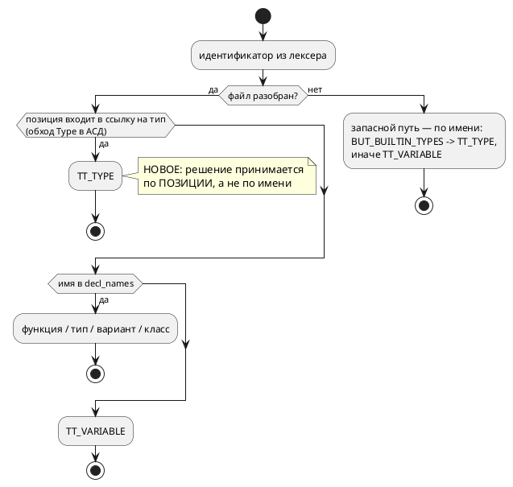

# Фича: Подсветка имён типов отдельным цветом в LSP и плагинах

- **Номер:** 0196
- **Статус:** ГОТОВО
- **Зависит от:** нет
- **Tier:** 3
- **Связанные issue (анализ):** запрос заказчика 2026-08-02; смежно с
  [семантическая подсветка Lam в IntelliJ через lam-lsp](0038-intellij-semantic-tokens.md) (семантическая подсветка через
  LSP4IJ), [плагин IntelliJ IDEA — подсветка синтаксиса Lam](0022-intellij-syntax-highlight.md) (палитра и лексический слой плагина),
  свод свода (редакторский слой)

## Стадии жизненного цикла

Все стадии — **разделы этой карточки**: «Архитектура (ADR)»,
«Анализ», «Разработка», «Тест-план», «Отчёт о тестировании», «Итог».
Отдельным артефактом остаются только исправления —
[`docs/fixes/`](../fixes/README.md) (при необходимости `0196-YY-*`).

## Краткое описание

Имена типов — встроенных (`bit`, `u8`, `bool`, `float`, …) и объявленных через
`type` — должны краситься **своим** цветом, отличным от цвета зарезервированных
слов и от цвета обычных идентификаторов. Часть механизма уже есть — фича
исправляет то, чем определяется «это имя типа»: именем или позицией.

> Фича зарегистрирована **по запросу заказчика 2026-08-02** и им же взята в
> работу вперёд блока Tier 1 (критерий 4 — необходимость). Tier
> остаётся **3**: язык не меняется, молча неверного продукта нет, речь об
> удобстве редактора — оценка записана как есть, а не подогнана под место в
> таблице.

## Что известно на входе

Замер-02 (чтение кода, не догадка): **основа уже построена**.

- Сервер помечает встроенный тип семантическим токеном `type`
  (`takt-lang/src/lsp/semantic_tokens.rs`, ветвь `Token::Identifier`: проверка
  членства в `BUT_BUILTIN_TYPES` идёт **первой**, до пользовательских имён), а
  объявленный `type`-алиас — через `decl_names.types` (тот же `TT_TYPE`).
- Плагин IntelliJ уже отображает этот токен в **отдельный** ключ палитры:
  `TaktSemanticTokensColorsProvider.keyFor("type") → TaktHighlighterColors.TYPE`,
  а сам ключ — `DefaultLanguageHighlighterColors.CLASS_REFERENCE`, то есть цвет
  настраиваемый и по умолчанию не равен `KEYWORD`.
- Полнота **легенды** уже под контролем (`TaktSemanticTokensColorsTest`:
  тип без маппинга молча потерял бы цвет).

Пробелы, ради которых фича и заводится:

1. **`q(m, n)` — тип, но не помечен типом.** Fixed-point отсутствует и в
   `BUT_BUILTIN_TYPES`, и в ключевых словах лексера, поэтому `q(8, 8)` в
   `examples/regulator.takt` красится как **переменная**.
2. **`string` — не тип вовсе, а мёртвое ключевое слово.** Проба стадии
   архитектуры: `var s: string := "x";` даёт `SY-002` — лексер выделяет
   `Token::String`, но грамматика его **не использует нигде**. То есть
   «строковый тип», значащийся в подсказках LSP, в языке отсутствует. Дефект
   **языка**, а не подсветки; в объём 0196 не берётся, записан кандидатом.
3. **Список встроенных типов ничем не связан с языком.** `BUT_BUILTIN_TYPES` —
   13 записей (`bit`, `bool`, `float`, `unit`, `u8`, `u16`, `u32`, `u64`, `i8`,
   `i16`, `i32`, `i64`, `duration`), составленных вручную. Контроля «список
   редактора = типы языка» нет — именно поэтому `q` из него и выпал. Образцы
   контрольных тестов есть: `TaktKeywordSyncTest` (плагин) и тест вложения
   `KEYWORDS ⊆ BUT_KEYWORDS ∪ COMPLETION_EXCLUDED`.
4. **Без сервера подсветки типов нет вовсе.** Лексер плагина
   (`TaktLexer.scanIdentifier`) знает только «ключевое слово или идентификатор» —
   цвет типа приходит **исключительно** от `takt-lsp` через LSP4IJ. Значит при
   недоступном или устаревшем сервере типы выглядят как переменные. Отдельно
   проверить поведение на **неразобранном** файле: `decl_names` там `None`, и
   пользовательские `type`-алиасы цвет потеряют, а встроенные — нет.
5. **Плагин Zed** своих списков не ведёт (`language_servers = ["takt-lsp"]`) —
   наследует и улучшение, и любой дефект сервера.

## Решение

**Принято ADR (Option B, 2026-08-02):** классифицировать имя типа **по позиции** —
собирать позиции ссылок на тип обходом узлов `Type` разобранного дерева и
помечать их `TT_TYPE` до проверки по имени; таблица имён остаётся запасным путём
для неразобранного файла и питает hover с автодополнением. Это лечит и `q`, и
переменную, названную именем типа, и снимает нужду синхронизировать список.
Язык не меняется. Отвергнуты: дополнение списка имён (не лечит главного и
усугубляет) и лексическая подсветка в плагине (четвёртый список имён).
Подробности и критерии приёмки — в [ADR](0196-editor-type-highlighting.md#архитектура-adr).

## Документирование

**Не требуется.** Объём ограничен редакторским слоем: подсветка — свойство
инструмента, а не языка, и в документ такие детали не попадают. Язык не
изменился (ADR это подтвердил: `q` остаётся идентификатором, ключевые слова не
добавлялись, версия языка не растёт). Судьба `string` — отдельная работа, и
документирование потребуется **ей**, а не этой фиче.

## Архитектура (ADR)

- **Status:** **Accepted** — Option B, 2026-08-02 (реализовано и закрыто той же датой)
- **Date:** 2026-08-02
- **Authors:** Архитектор + Аналитик
- **Related issues:** [Фича](0196-editor-type-highlighting.md);
  связь с [ADR](0038-intellij-semantic-tokens.md#архитектура-adr) (семантические токены),
  [ADR](0022-intellij-syntax-highlight.md#архитектура-adr) (палитра плагина)

### Context

Заказчик просит красить имена типов — встроенных (`bit`, `u8`, `bool`, `float`,
…) и объявленных через `type` — **своим** цветом, отличным от цвета
зарезервированных слов.

Замер-02 (чтение кода + пробы) показал, что **инфраструктура уже есть**,
и предмет решения — не «добавить цвет», а **как определять, что перед нами имя
типа**:

- сервер отдаёт семантический токен `type`
  (`takt-lang/src/lsp/semantic_tokens.rs`), плагин отображает его в **отдельный**
  ключ палитры `TaktHighlighterColors.TYPE`
  (`DefaultLanguageHighlighterColors.CLASS_REFERENCE`) — то есть цвет уже не
  равен `KEYWORD` и настраивается пользователем;
- полнота **легенды** уже под контролем (`TaktSemanticTokensColorsTest`).

Как классифицируется идентификатор сегодня — **по членству имени в множествах**:
`BUT_BUILTIN_TYPES` (13 имён, `lsp/keywords.rs`), затем `decl_names` (функции,
типы, варианты, классы), иначе — переменная. Позиция ссылки при этом не
учитывается.

Отсюда три наблюдаемых дефекта:

| # | Вход | Наблюдение |
|---|---|---|
| Д1 | `var f: q(8, 8) := 1.5;` | `q` красится **переменной**: его нет ни в `BUT_BUILTIN_TYPES`, ни в ключевых словах |
| Д2 | `var bit: u8 := 1;` | **компилируется** (проба), но `bit` в объявлении красится **типом** — имя переменной выдано за тип |
| Д3 | файл не разбирается | `decl_names` = `None`, и пользовательские `type`-псевдонимы теряют цвет, а встроенные — сохраняют |

Причина у всех трёх одна: **имя — не свойство ссылки**. Тот же урок проект уже
получал дважды: [кросс-файловый переход к декларации — точный путь вместо угадывания](0056-lsp-goto-exact-file.md#архитектура-adr) («позиция использования —
свойство ссылки») и фича [lSP: `definition`, `references` и `rename`](0131-lsp-definition-references-rename.md)
(«индекс видит вхождение, только если узел остался неразрешённым»).

Отдельная находка проб: **`string` — мёртвое ключевое слово.** Лексер выделяет
`Token::String` (`lexer.rs`), но грамматика его **не использует нигде**, поэтому
`var s: string := "x";` — синтаксическая ошибка `SY-002`. То есть «встроенный
строковый тип», который значится в подсказках LSP, в языке **не существует**;
он лишь красится как ключевое слово. Это вопрос **языка**, а не подсветки, и в
объём данного ADR не берётся (см. Action items).

Поток классификации — как есть и как будет:



### Decision Drivers

1. **Не врать пользователю цветом.** Цвет — утверждение о смысле имени.
   Покрасить переменную `bit` типом хуже, чем не покрасить ничего: неверная
   подсказка дороже отсутствующей.
2. **Не заводить очередной список имён.** Знание о типах уже размазано между
   грамматикой, `builtin_type_by_name` и `lsp/keywords.rs`; четвёртая копия
   разъедется молча (уроки и исправления — «знание в одном месте»).
3. **Не менять язык ради подсветки.** `q` намеренно **не** ключевое слово —
   грамматика прямо объясняет: иначе `q` перестал бы работать как имя
   переменной. Подсветка не повод это ломать.
4. **Деградировать предсказуемо.** Пока автор набирает текст, файл почти всегда
   не разобран; поведение в этот момент должно быть определено, а не случайно.
5. **свод.** Изменение обязано пройти по LSP и **обоим** плагинам; ответ
   «правок не требует» тоже фиксируется.

### Considered Options

#### Option A. Дополнить список имён (`q` в `BUT_BUILTIN_TYPES`) + контроль синхронизации

Добавить `q` в таблицу имён и завести тест «список редактора = множество имён
`builtin_type_by_name`» по образцу `TaktKeywordSyncTest`.

**Pros:**
- дёшево: правка в одном файле плюс тест;
- контроль действительно закрывает класс «новый тип забыли внести».

**Cons:**
- **Д2 не лечится вовсе** и даже усугубляется: `q` — законное имя переменной,
  и тогда всякая переменная `q` станет «типом»;
- Д3 не лечится;
- контроль невозможно сделать точным: `q` в `builtin_type_by_name` **отсутствует**
  (fixed-point проверяет `construct_fixed`), значит равенство множеств не
  выполняется и контролю придётся знать исключение — список исключений станет
  третьим местом знания.

#### Option B. Классифицировать по позиции: собрать ссылки на типы из АСД

Обойти разобранное дерево и собрать **позиции** всех ссылок на тип
(`Type::Alias` → `Identifier.loc`, `Type::Fixed` → `Location`, вложенные
`[T; N]` — рекурсивно). Токен, чья позиция попала в множество, получает
`TT_TYPE` **до** проверки по имени. Таблица имён остаётся **запасным путём** для
неразобранного файла и по-прежнему питает hover и автодополнение.

**Pros:**
- лечит Д1 и Д2 **по построению**: `q(8, 8)` в позиции типа — тип, переменная
  `q` — переменная; список имён для этого не нужен;
- покрывает будущие типы бесплатно: новый синтаксис типа попадает в обход, а не
  в четвёртый список;
- Д3 получает **явно описанное** поведение (запасной путь), а не случайное;
- данные уже есть: узлы `Type` несут `Location` (проверено чтением `ast.rs`).

**Cons:**
- нужен обход АСД по типам — новый код, который обязан быть исчерпывающим
  (иначе форма типа молча выпадет);
- на неразобранном файле остаются нынешние Д2/Д3 — запасной путь не точнее
  нынешнего, просто честно назван;
- обход АСД на каждый запрос токенов — работа пропорциональна размеру файла
  (сегодня платится тот же порядок: дерево и так строится).

#### Option C. Лексическая подсветка типов в плагине

Научить `TaktLexer` плагина знать имена встроенных типов и красить их без
сервера.

**Pros:**
- цвет появляется мгновенно и не зависит от сервера;
- снимает наблюдение «типы не подсвечены, пока LSP не поднялся».

**Cons:**
- **четвёртый** список имён — прямо против драйвера 2, и он неизбежно разъедется
  (именно так уже выпал `q`);
- лексер не знает контекста, то есть воспроизводит Д2 в чистом виде;
- плагин Zed своих списков не ведёт — решение не переносится, редакторы
  разойдутся в поведении.

### Decision

Принимается **Option B**.

Единственный вариант, который отвечает на вопрос «это имя типа?» тем же
способом, каким на него отвечает компилятор — по **месту** в разобранном тексте,
а не по совпадению строк. Он же снимает необходимость синхронизировать список,
из-за отсутствия которой `q` и выпал: обход дерева видит любую форму типа,
включая те, которых ещё нет.

Цена — обход АСД по узлам `Type` — известна и ограничена; данные для него уже
лежат в дереве.

Таблица `BUT_BUILTIN_TYPES` **сохраняется** в роли, для которой заведена:
подсказки hover и автодополнение (там классификация по имени уместна — имени
ещё нет в тексте). Запасным путём для неразобранного файла она тоже остаётся,
но это **явно названное** ограничение, а не умолчание.

Язык **не меняется**: `q` остаётся идентификатором, ключевые слова не
добавляются, версия языка не растёт.

### Consequences

#### Положительные

- `q(8, 8)`, псевдонимы `type` и вложенные `[T; N]` красятся цветом типов;
- переменная, названная именем типа, больше не выдаётся за тип;
- новый синтаксис типа получает подсветку **без** правки списков;
- плагин Zed получает улучшение даром (наследует сервер), плагин IntelliJ —
  без единой правки: маппинг `type` → палитра уже на месте.

#### Отрицательные / Action items

- Обход по `Type` обязан быть **исчерпывающим**; при добавлении формы типа он
  должен ломать сборку, а не молчать — применить приём фичи
  (`deny(clippy::wildcard_enum_match_arm)`), как это уже сделано в
  `lsp/semantic_tokens.rs` для токенов.
- Поведение на **неразобранном** файле зафиксировать тестом: сегодня оно
  «как получится», после фичи — описанный запасной путь.
- **`string` — мёртвое ключевое слово** (лексер знает, грамматика не
  использует, `var s: string` → `SY-002`). Это дефект языка, а не подсветки:
  в объём 0196 **не берётся**, записывается кандидатом в `FEATURES.md`.
  Пока он жив, `string` красится как ключевое слово — и это верно, потому что
  типом он не является.
- свод: плагин IntelliJ правок не требует (проверить тестом, что маппинг
  на месте), плагин Zed — не требует по построению; ответ зафиксировать в
  отчёте.

#### Acceptance criteria

1. `var f: q(8, 8) := 1.5;` — токен `q` имеет тип `type` (тест на `semantic_tokens`).
2. `type Celsius = u8; var t: Celsius := 20;` — оба вхождения `Celsius`
   (объявление и ссылка) имеют тип `type`.
3. `var bit: u8 := 1;` — токен `bit` в позиции **имени переменной** имеет тип
   `variable`, а `u8` — `type`.
4. Вложенная форма `var m: [q(4, 4); 8];` — и `q`, и элементы внутри `[…]`
   классифицированы верно.
5. На неразобранном файле поведение соответствует описанному запасному пути
   (тест с намеренно битым входом).
6. Обход `Type` исчерпывающий: добавление варианта в `ast::Type` ломает сборку
   (проверяется мутацией при тестировании).
7. `./scripts/precheck.sh` зелёный; вывод компилятора не изменился (подсветка —
   слой редактора).

## Анализ

### Цель и контекст

ADR принял **Option B**: имя типа определяется **по позиции** — обходом узлов
`Type` разобранного дерева, — а не по членству имени в списке. Анализ уточняет
объём обхода, границы, декомпозицию и способ проверки.

Цвет и его доставка до редактора **уже работают**: сервер отдаёт токен `type`,
плагин IntelliJ отображает его в `TaktHighlighterColors.TYPE`
(`CLASS_REFERENCE`), плагин Zed наследует сервер. Работа целиком в **сервере**.

### Зависимости фичи

**Нет.** Ни одна незакрытая фича не затрагивает ни `lsp/semantic_tokens.rs`, ни
узел `ast::Type`. Смежная [индексация рабочей области для LSP (`references`/`rename` между файлами)](0153-lsp-workspace-index.md)
(индексация рабочей области) работает с межфайловыми ссылками и этой фиче не
предшествует: подсветка считается по **одному** документу.

### Где живёт ссылка на тип (объём обхода)

Перечень получен чтением `takt-lang/src/parser/ast.rs` и `grammar.lalrpop`.

| # | Место | Поле | Форма |
|---|---|---|---|
| М1 | `var` / `const` / порт / параметр модели | `VariableDefine::{Variable,Constant,Port,Parameter}.typ` | `Option<Type>` |
| М2 | псевдоним `type X = T;` | `TypeDefine.ty` | `Type` |
| М3 | поле структуры | `StructField.ty` | `Type` |
| М4 | возвращаемый тип функции | `FunctionDefine.return_type` | `Option<Type>` |
| М5 | тип параметра функции | `Parameter.ty` | **`Expression`**, не `Type` |
| М6 | вложенность | `Type::Array.element_type`, `Type::Function{params, returns}` | рекурсия |

**М5 — главная неожиданность анализа.** Грамматика разбирает тип параметра
правилом `ParameterTypeExpr`, то есть как **выражение**: `fn f(x: u8)` кладёт
`u8` в `Parameter.ty: Expression`. Обход по `Type` его **не увидит**. Значит
либо параметр разбирается отдельной веткой (идентификатор в позиции типа —
это тип), либо остаётся запасному пути по имени. Берём **первое**: принцип «по
позиции» иначе соблюдается наполовину, а стоимость — одна ветвь.

Узел `Type` объявлен `#[non_exhaustive]`, но обход живёт **в том же крейте**,
поэтому исчерпывающий `match` возможен и новый вариант сломает сборку — ровно
то, что требует ADR (action item).

### Требования и проверяемые условия

| # | Требование | Проверяемое условие |
|---|---|---|
| R1 | Ссылка на тип в позиции типа получает токен `type` | `q(8, 8)`, `u8`, `Celsius`, `[q(4,4); 8]` — все `type` |
| R2 | Имя, совпадающее с именем типа, но стоящее **не** в позиции типа, типом не считается | в `var bit: u8 := 1;` токен `bit` — `variable`, `u8` — `type` |
| R3 | Объявление псевдонима подсвечено с обеих сторон | в `type Celsius = u8;` и `Celsius`, и `u8` — `type` |
| R4 | Неразобранный файл ведёт себя по **описанному** запасному пути | битый вход даёт `type` встроенным именам и не падает |
| R5 | Обход исчерпывающ | добавление варианта в `ast::Type` ломает сборку (мутация) |
| R6 | Вывод компилятора не меняется | `examples/generated/**` байт-в-байт; подсветка — слой редактора |
| R7 | свод пройдено по обоим плагинам | IntelliJ: маппинг `type` под тестом; Zed: своих списков нет — ответ зафиксирован |

### Ограничения, которые определяют форму решения

- **О1. Позиции — байтовые смещения.** `Location::Source(file, start, end)` несёт
  те же смещения, что и тройка лексера `(start, token, end)`, поэтому сопоставление
  прямое, без пересчёта в строки/колонки. Это и делает Option B дешёвым.
- **О2. Дерево уже строится.** `semantic_tokens` вызывает `crate::parse` и
  **выбрасывает** АСД, оставляя только модель. Обходу нужен именно АСД — значит
  правка в том, чтобы его не выбрасывать, а не в лишнем разборе.
- **О3. Запасной путь обязан остаться.** Пока автор набирает текст, файл почти
  всегда не разобран; без запасного пути подсветка мигала бы на каждом нажатии.
- **О4. Список имён не удаляется.** `BUT_BUILTIN_TYPES` продолжает питать hover
  и автодополнение — там классификация по имени уместна (имени ещё нет в тексте).

### Критерии приёмки и способ проверки

| # | Критерий (из ADR) | Способ проверки |
|---|---|---|
| A1 | `q(8, 8)` — тип | тест на `semantic_tokens` |
| A2 | псевдоним `type` подсвечен в объявлении и в ссылке | тест |
| A3 | `var bit: u8 := 1;` — `bit` переменная, `u8` тип | тест |
| A4 | вложенная форма `[q(4, 4); 8]` | тест |
| A5 | неразобранный файл — описанный запасной путь | тест с битым входом |
| A6 | обход исчерпывающ | мутация: добавить вариант `Type` → сборка падает |
| A7 | предкоммит зелёный, вывод корпуса не изменился | `./scripts/precheck.sh` + `git diff examples/generated` |

### Предлагаемая декомпозиция разработки

| Задача | Содержание |
|---|---|
| 0196-01 | слой сбора позиций ссылок на тип из АСД (`lsp/type_refs.rs`): исчерпывающий обход `Type` (М1–М4, М6) + ветвь параметра функции (М5), `deny(clippy::wildcard_enum_match_arm)` |
| 0196-02 | включение в `semantic_tokens`: позиция проверяется **до** имени; запасной путь на неразобранном файле описан и зафиксирован |
| 0196-03 | тесты A1–A6 и ответ по своду для обоих плагинов |

Размер: `semantic_tokens.rs` — 311 строк при пределе ~1000, запас есть; новый
слой всё равно выносится **отдельным модулем** — он самостоятелен и будет расти
вместе с языком.

### Особенности по обратной совместимости

Не затрагивается: меняется только классификация токенов, отдаваемых редактору.
Язык, вывод компилятора и протокол LSP (легенда токенов) неизменны — редакторы,
знающие тип `type`, получают его в новых местах и не получают там, где он был
ошибочным.

### Риски

- **Риск «покрыли не всё».** Если обход пропустит место из М1–М6, часть типов
  молча останется без цвета. Снижение — исчерпывающий `match` (R5) и тест на
  вложенную форму; М5 исчерпаемостью **не** защищён (там `Expression`), и
  его пропуск будет молчаливым — поэтому он покрыт отдельным тестом.
- **Риск регресса на неразобранном файле.** Правка меняет порядок проверок;
  если запасной путь окажется недостижим, подсветка исчезнет при каждой опечатке.
  Снижение — тест A5 с намеренно битым входом.
- **Риск «поправили сервер, забыли редактор».** Снижение — свод: ответ по
  обоим плагинам фиксируется в отчёте, даже когда он «правок не требует».

## Разработка

### Задача

#### Что было

`lsp/semantic_tokens.rs` определял тип идентификатора **по имени**: членство в
`BUT_BUILTIN_TYPES` (13 имён), затем в `decl_names`. Отсюда три дефекта,
воспроизведённые пробами:

- `q(8, 8)` красился **переменной** — `q` не ключевое слово и в таблице имён не
  значится;
- `var bit: u8 := 1;` (законный вход) выдавал имя переменной **за тип**;
- на неразобранном файле поведение было не описано.

#### Что сделано

**Классификация переведена с имени на позицию.** Отклонение от буквы анализа
(там предполагался новый модуль `lsp/type_refs.rs`) — и оно **осознанное**:
при разработке обнаружилось, что полный обход АСД в проекте **уже есть** —
`semantic/usages/walk.rs`, включая `walk_type`. Второй обход
дублировал бы ~880 строк структуры и разъехался бы с первым при первом же
новом узле языка — ровно тот класс, против которого написаны уроки и
исправления. Поэтому позиции собирает **существующий** обход.

| Слой | Правка |
|---|---|
| `semantic/usages/mod.rs` | `UsageTable` получил `type_refs: Vec<(u32, u32)>`, аксессор `type_refs()` и предикат `is_type_position(start, end)` |
| `semantic/usages/walk.rs` | `walk_type` отмечает позицию `Type::Alias` **до** разрешения (у `u8`/`bit` символа нет, но типами они быть не перестают) и позицию конструктора `Type::Fixed`; `walk_element` отмечает объявляемые имена `type`/`struct`/`enum`; `walk_function` отмечает тип параметра |
| `lsp/semantic_tokens.rs` | два **взаимоисключающих** пути: дерево есть → тип по позиции (к таблице имён не обращаемся вовсе); дерева нет → запасной путь по имени |

Три решения, которые стоит знать при правке:

1. **`type_refs` — отдельный список, а не разновидность `Usage`.** Имя типа в
   позиции типа сплошь и рядом не разрешается в символ файла (`u8`, `bit`, `q`),
   а положить его в `unresolved` значило бы менять поведение `rename`, который
   по неразрешённым именам принимает решение «полнота или отказ» (0131).
2. **К таблице имён при наличии дерева не обращаемся.** Первая редакция
   оставляла обе проверки подряд — и `bit` продолжал краситься типом, потому
   что имя срабатывало там, где позиция промолчала. Проверка `n.types` из
   именного пути **убрана**: место типа теперь знает позиция.
3. **Тип параметра функции размечается отдельной веткой.** Грамматика разбирает
   его правилом `ParameterTypeExpr`, то есть **выражением**, а не `Type` —
   обход типов туда не доходит. Исчерпаемостью эта ветка не защищена и
   держится тестом.

Плагины: **правок не потребовалось**. IntelliJ уже отображает токен
`type` в отдельный ключ палитры (`TaktSemanticTokensColorsProvider.keyFor` →
`TaktHighlighterColors.TYPE` = `CLASS_REFERENCE`); Zed своих списков не ведёт
(`language_servers = ["takt-lsp"]`) и наследует сервер. Ответ зафиксирован, как
того требует правило.

#### Проверки

```sh
cargo test --features lsp --test type_highlighting_tests -- --test-threads=1
cargo test --all-features -- --test-threads=1
./scripts/precheck.sh
```

`takt-lang/tests/lsp/type_highlighting_tests.rs` — 7 тестов, по критериям приёмки
ADR: `q(8, 8)` тип (A1), псевдоним тип в объявлении и в ссылке (A2), переменная
с именем типа **не** тип (A3), тип внутри массива (A4), тип параметра функции
(A5), запасной путь на битом входе (A6). Первым идёт **зонд**
(`probe_type_positions`), печатающий реальную классификацию — проверки написаны
против захваченного вывода, а не против догадки.

Регресс существующих потребителей слоя: `semantic_tokens_tests` (5),
`lsp_tests` (69), `lsp_port_io_tests` (7) — зелёные.

## Тест-план

### Область и цель

Проверяется **классификация** токенов, отдаваемых сервером редактору, а не факт
«не паникует». Подсветка врёт молча — сборка при этом зелёная (урок фичи),
поэтому каждая проверка формулируется как «токен X имеет тип Y».

Покрываются требования R1–R7 анализа и критерии приёмки A1–A7 ADR.

### Проверки (условие → ожидаемый результат)

| # | Проверка | Предусловие | Ожидаемый результат | Ссылка на R/A |
|---|---|---|---|---|
| T1 | fixed-point как тип | `var f: q(8, 8) := 1.5;` | токен `q` → `type` | R1 / A1 |
| T2 | псевдоним в объявлении | `type Celsius = u8;` | токен `Celsius` (первый) → `type` | R3 / A2 |
| T3 | псевдоним в ссылке | `var t: Celsius := 20;` | токен `Celsius` (второй) → `type` | R3 / A2 |
| T4 | встроенный тип справа от `=` | `type Celsius = u8;` | токен `u8` → `type` | R1 / A2 |
| T5 | имя переменной совпадает с именем типа | `var bit: u8 := 1;` | токен `bit` → **`variable`**, `u8` → `type` | R2 / A3 |
| T6 | тип внутри массива | `var m: [q(4, 4); 8];` | токен `q` → `type` | R1 / A4 |
| T7 | тип параметра функции | `fn twice(x: u8) -> u8` | оба `u8` → `type` | R1 / A5 |
| T8 | неразобранный файл | вход с синтаксической ошибкой | токены выдаются; `u8` → `type` (запасной путь) | R4 / A6 |
| T9 | регресс потребителей слоя вхождений | — | `lsp_tests`, `semantic_tokens_tests`, `lsp_port_io_tests` зелёные | R6 |
| T10 | вывод компилятора не изменился | — | `git diff examples/generated` пуст | R6 / A7 |
| T11 | свод: IntelliJ | — | маппинг `type` → палитра на месте (тест плагина) | R7 |
| T12 | свод: Zed | — | своих списков нет, правок не требует; ответ зафиксирован | R7 |
| T13 | полный предкоммит | — | `./scripts/precheck.sh` зелёный | A7 |

### Разбивка проверок по функциональности

свод: единые условия прогоняются против каждой задеваемой функциональности.

| Функциональность | T1–T8 | T9 | Примечание |
|---|---|---|---|
| Сервер `takt-lsp` (семантические токены) | ✅ | ✅ | предмет фичи |
| Слой вхождений (`semantic/usages`, 0131) | — | ✅ | правка аддитивна: новый список, `usages`/`unresolved` не тронуты |
| `rename` / `references` | — | ✅ | поведение обязано **не** измениться — тип-позиции в `unresolved` не кладутся |
| Плагин IntelliJ | — | ✅ | правок не требует (T11) |
| Плагин Zed | — | — | своих списков не ведёт (T12) |
| Цели генерации, симулятор | — | — | не задеты: подсветка — слой редактора (T10) |

<!-- Легенда: ✅ пройдено · ❌ провалено · ⬜ не проверялось · — не применимо -->

### Тестовые данные и окружение

- Автотесты: `takt-lang/tests/lsp/type_highlighting_tests.rs` (фикстуры — строковые
  константы в самом тесте; отдельных файлов не заводится: входы по 3–5 строк и
  читаются рядом с проверкой).
- Зонд `probe_type_positions` печатает реальную классификацию — проверки
  написаны против **захваченного** вывода (правило проекта), а не против
  предположения.
- Окружение: тесты LSP живут под `#[cfg(feature = "lsp")]`, гоняются
  `cargo test --all-features -- --test-threads=1` (так их запускает предкоммит).
- T11 проверяется тестом плагина в Gradle-сборке, которая **вне**
  `precheck.sh`/CI (нужен JDK 21; фича). Это известное ограничение проекта,
  а не пробел плана.

## Отчёт о тестировании

### Резюме

**Пройдено, фича готова к закрытию.** Все 13 проверок тест-плана выполнены,
провалов нет. Классификация имени типа переведена с имени на позицию; три
дефекта, вскрытые пробами стадии архитектуры, устранены и пришпилены тестами.

Окружение: macOS (Darwin 25.5.0), толчейн `1.97.1` (пин `rust-toolchain.toml`),
`cargo test --all-features -- --test-threads=1`, `./scripts/precheck.sh`.

### Фактические результаты по проверкам

| # | Проверка | Результат | Комментарий |
|---|---|---|---|
| T1 | `q(8, 8)` → `type` | ✅ | до фичи — `variable`; наблюдалось зондом |
| T2 | псевдоним в объявлении | ✅ | `type Celsius = u8;` — `Celsius` тип |
| T3 | псевдоним в ссылке | ✅ | `var t: Celsius` — тип |
| T4 | `u8` справа от `=` | ✅ | тип |
| T5 | `var bit: u8 := 1;` | ✅ | `bit` → **`variable`**, `u8` → `type`; **в первой редакции эта проверка провалилась** — см. «Выводы» |
| T6 | тип внутри массива | ✅ | `[q(4, 4); 8]` — `q` тип (обход рекурсивен) |
| T7 | тип параметра функции | ✅ | оба `u8` тип; путь отдельный — грамматика даёт выражение, а не `Type` |
| T8 | неразобранный файл | ✅ | токены выдаются, `u8` остаётся типом (запасной путь) |
| T9 | регресс потребителей слоя | ✅ | `semantic_tokens_tests` 5, `lsp_tests` 69, `lsp_port_io_tests` 7 — зелёные |
| T10 | вывод компилятора не изменился | ✅ | `git diff examples/` пуст |
| T11 | свод: IntelliJ | ✅ | правок не требуется; контроль `TaktSemanticTokensColorsTest.testEveryLegendTypeHasKey` уже покрывает ключ `type` |
| T12 | свод: Zed | ✅ | своих списков не ведёт (`language_servers = ["takt-lsp"]`), наследует сервер |
| T13 | полный предкоммит | ✅ | `./scripts/precheck.sh` — код возврата 0 |
| A6 | обход типов исчерпывающий | ✅ | **проверено мутацией**: временный вариант `Type::MutationProbe` валит сборку в 5 местах, включая новый обход (`semantic/usages/walk.rs:696`, `E0004`). Мутация снята, сборка зелёная |

### Результаты по функциональности

| Функциональность | Результат | Комментарий |
|---|---|---|
| Сервер `takt-lsp` | ✅ | предмет фичи |
| Слой вхождений (`semantic/usages`) | ✅ | правка аддитивна: новый список `type_refs`, `usages`/`unresolved` не тронуты |
| `rename` / `references` | ✅ | поведение не изменилось — тип-позиции сознательно **не** кладутся в `unresolved` |
| Плагин IntelliJ | ✅ | правок не потребовалось |
| Плагин Zed | — | не применимо |
| Цели генерации, симулятор | — | не задеты |

### Выводы и дальнейшие шаги

**Что показал эксперимент.**

1. **Проверка T5 провалилась в первой редакции** — и это главный результат
   прогона. Позиционный путь был добавлен **рядом** с именным, а не вместо него:
   `bit` промолчал по позиции и тут же был опознан «типом» по имени. То есть
   ошибка сидела ровно в том месте, ради которого фича заводилась, и поймал её
   тест, а не рассуждение. Исправлено разведением путей на взаимоисключающие.
2. **Второй обход АСД не понадобился.** Анализ предполагал новый модуль
   `lsp/type_refs.rs`; при разработке выяснилось, что полный обход уже есть
   (`semantic/usages/walk.rs`). Отклонение зафиксировано в задаче
   [подсветка имён типов отдельным цветом в LSP и плагинах](0196-editor-type-highlighting.md#разработка) с обоснованием:
   дубль разъехался бы с оригиналом при первом же новом узле языка.
3. **`string` — мёртвое ключевое слово** (лексер знает, грамматика не
   использует). Найдено пробой стадии архитектуры, **в объём не взято**,
   записано кандидатом в `FEATURES.md`: это дефект языка, а не подсветки.

**Исправления (`docs/fixes/`) не требуются:** провал T5 устранён внутри
разработки, до закрытия стадии.

**Ограничение, которое стоит знать.** Проверка T11 живёт в Gradle-сборке
плагина, а она вне `precheck.sh` и CI (нужен JDK 21). То есть маппинг
цвета в IntelliJ машиной проекта **не** контролируется — известное ограничение
инфраструктуры, а не пробел этой фичи.

## Итог (что сделано)

Имя типа классифицируется **по позиции** в разобранном дереве, а не по членству
в списке имён. Следствия, наблюдаемые пользователем:

- `q(8, 8)` красится цветом типов — раньше был цветом переменной;
- псевдоним `type` — тип и в объявлении, и в ссылке;
- переменная, названная именем типа (`var bit: u8 := 1;` — законный вход),
  больше **не** выдаётся за тип;
- тип параметра функции подсвечен (грамматика даёт его выражением, а не `Type`);
- на неразобранном файле работает **описанный** запасной путь по имени.

Второго обхода АСД заводить не пришлось: позиции собирает существующий обход
слоя вхождений (`semantic/usages/walk.rs`) — дубль разъехался бы с
оригиналом при первом же новом узле языка. Плагины правок не потребовали:
IntelliJ уже отображает токен `type` в отдельный ключ палитры, Zed наследует
сервер (ответ зафиксирован).

Детали: [отчёт](0196-editor-type-highlighting.md#отчёт-о-тестировании) (в том числе провал
проверки T5 в первой редакции и его причина),
[задача](0196-editor-type-highlighting.md#разработка),
[ADR](0196-editor-type-highlighting.md#архитектура-adr),
[анализ](0196-editor-type-highlighting.md#анализ). Исправлений
(`docs/fixes/`) потребовалось одно — [цвет имени типа не задан ни по умолчанию, ни в настройках](../fixes/0196-01-type-color-defaults.md):
классификация была верна, но у ключа цвета не было ни значения по умолчанию, ни
строки в панели настройки, поэтому типы выглядели как обычный текст. Урок: тест
на «токен помечен типом» не доказывает, что пользователь это увидит.

Найденное **вне** объёма записано кандидатом, а не выдано за сделанное:
`string` — мёртвое ключевое слово (лексер знает, грамматика не использует), и
проверка маппинга цвета в IntelliJ живёт вне `precheck.sh`/CI.
