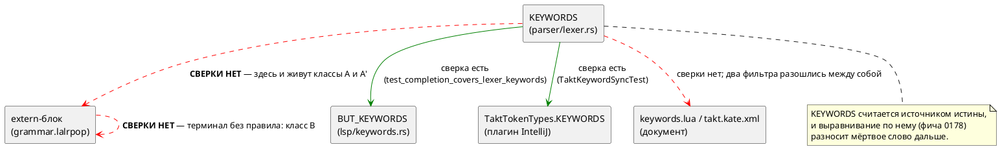

# Фича: Мёртвая лексика: слова и терминалы, которых грамматика не знает

- **Номер:** 0201
- **Статус:** ГОТОВО
- **Зависит от:** нет (проставлено аналитиком)
- **Связанные issue (анализ):** кандидат блока 2 `FEATURES.md`, переведён в фичу-03 (запрос заказчика)

## Стадии жизненного цикла

Все стадии — **разделы этой карточки**: «Архитектура (ADR)»,
«Анализ», «Разработка», «Тест-план», «Отчёт о тестировании», «Итог».
Отдельным артефактом остаются только исправления —
[`docs/fixes/`](../fixes/README.md) (при необходимости `0201-YY-*`).

## Краткое описание

Лексер знает лексемы, которых грамматика не использует. Кандидат называл одну —
`string`; проба стадии архитектуры нашла **пять** в трёх классах. Подробности
находки, замеры и оговорки — в разделах «Что известно на входе» и «Что показала
проба»; форма решения — в [ADR](0201-dead-lexemes.md#архитектура-adr).

> Фича зарегистрирована **из бэклога кандидатов** (запрос заказчика 2026-08-03:
> перевести кандидатов в фичи без проработки); далее проходит жизненный цикл по
> своду. Заголовок и объём расширены на стадии архитектуры по решению
> заказчика (2026-08-04): прежнее имя `dead-keyword-string` описывало частный
> случай.

## Что известно на входе

> Фича заведена **из кандидата** блока 2 `FEATURES.md` (запрос заказчика
> 2026-08-03: перевести кандидатов в фичи без проработки). Проработка —
> стадии 2–3 жизненного цикла; ниже — запись кандидата **как есть**, вместе с
> замерами и оговорками, сделанными при его заведении.
>
> Замеры кандидата **не перепроверялись** при переводе в фичу: их
> актуальность подтверждает пробой стадия архитектуры (урок — записи
> кандидатов устаревают, и две из них оказались неверны).

**Класс:** синтаксис языка (Tier 1 — приоритет по решению заказчика
2026-08-03: синтаксис → семантика → генерация → остальное).

**`string` — мёртвое ключевое слово: лексер знает, грамматика не использует.**
Проба стадии архитектуры [подсветка имён типов отдельным цветом в LSP и плагинах](0196-editor-type-highlighting.md)
(2026-08-02): `var s: string := "x";` даёт `SY-002` («нераспознанный токен
'string'»), а грепом по `grammar.lalrpop` `Token::String` не находится ни в
одном правиле. При этом слово занимает место в таблице `KEYWORDS` лексера, в
списке автодополнения LSP (`BUT_KEYWORDS`), в подсказках как «строковый тип»
и в `KEYWORDS` плагина IntelliJ — то есть четыре места обещают возможность,
которой в языке **нет**. Дефект **громкий** (отказ разбора), молчаливой
потери нет. Решение — за заказчиком: либо ввести строковый тип, либо изъять
слово из лексера и всех списков. В объём 0196 сознательно не взято:
подсветка — слой редактора, а это изменение **языка** (рост
версии).

## Что показала проба (стадия архитектуры, 2026-08-04)

Запись кандидата описывала **частный случай**. Сверка таблицы `KEYWORDS`
лексера с extern-блоком грамматики и обход всех 93 терминалов дали **пять**
мёртвых лексем трёх классов:

| Класс | Лексема | Состояние |
|---|---|---|
| A — слово в `KEYWORDS`, в extern-блоке грамматики **отсутствует** | `string` | `SY-002` при употреблении |
| A | **`template`** | `SY-002`; механизма шаблонов в языке нет вовсе |
| A′ — вариант `Token` есть, лексер его **никогда не производит** | **`pragma`** | недостижим вместе со всем механизмом: `pragma_value()`, поле `last_tokens`, обёртка `Iterator::next` |
| B — терминал объявлен в extern, но не используется ни одним правилом | `==` | изъят из языка фичей |
| B | `-->` (`Token::PeirceArrow`) | LTL-импликация пишется `->` |

Три поправки к записи кандидата:

1. **Мест, обещающих `string`, не четыре, а шесть**, и hover среди них **нет**:
   он работает по `BUT_BUILTIN_TYPES` и ключевые слова не обслуживает. Зато
   есть два фильтра подсветки документа, и они **расходятся** — `book/keywords.lua`
   считает `string` ключевым словом, `book/takt.kate.xml` — **типом**.
2. **`SY-002` несёт позицию** (`2:12`) — запись кандидата этого не отрицала, но
   выигрыш изъятия не в появлении позиции, а в существе сообщения: вместо
   «нераспознанный токен» со списком ожидаемых терминалов приходит `SE-034`
   «Локальный тип 'string' не найден».
3. **Дефект распространяется сам.** `CHANGES.md` фиксирует, что `template` и
   `string` попали в редакторские списки фичей — **автоматическим
   выравниванием по `KEYWORDS`**. Сверки `KEYWORDS` ↔ грамматика нет ни одной;
   обе существующие принимают `KEYWORDS` за истину.

## Документирование

Фича меняет **язык**: пять лексем перестают быть зарезервированными, имена
`string` и `template` освобождаются под идентификаторы, диагностика на них
меняется с `SY-002` на `SE-034`. Затронут раздел
[`book/src/02-lexical/`](../../book/src/02-lexical/index.typ) — таблица
зарезервированных слов: убрать `template` из строки «Объявления» и `string` из
строки «Прочие». Заодно приводятся в согласие фильтры подсветки документа
(`book/keywords.lua`, `book/takt.kate.xml`), сегодня расходящиеся между собой.

Новых конструкций язык не получает, поэтому новых примеров на Takt раздел не
требует. Эталон `Takt.ebnf` **в объём не входит**: его список ключевых слов
устарел широко и независимо — это фича
[синхронизация эталона `Takt.ebnf` с актуальным синтаксисом](0160-takt-ebnf-sync.md).

## Архитектура (ADR)

- **Status:** Accepted
- **Date:** 2026-08-04
- **Authors:** Архитектор + Заказчик (решения по объёму и направлению — 2026-08-04)
- **Related issues:** [Фича](0201-dead-lexemes.md); смежные — [ADR](0021-swap-assign-compare.md#архитектура-adr) (изъятие `==` из языка), [ADR](0178-editor-layer-language-sync.md#архитектура-adr) (согласование редакторского слоя с языком)

### Context

Лексер языка Takt держит таблицу `KEYWORDS` (48 записей) — она считается
источником истины о ключевых словах: по ней выравниваются список
автодополнения LSP, список плагина IntelliJ и фильтры подсветки документа.
Грамматика (`takt-lang/src/grammar.lalrpop`) объявляет свой набор терминалов в
extern-блоке (93 записи). **Сверки между этими двумя множествами нет ни
одной** — обе существующие сверки (`test_completion_covers_lexer_keywords`,
`TaktKeywordSyncTest`) идут от `KEYWORDS` наружу, к редакторскому слою.

Кандидат блока 2 `FEATURES.md` называл одно расхождение: `string`. Проба
стадии архитектуры (обход всех 48 слов и всех 93 терминалов) нашла **пять**
мёртвых лексем в трёх классах:

| Класс | Лексема | Чем мертва |
|---|---|---|
| **A** — слово в `KEYWORDS`, в extern-блоке грамматики отсутствует | `string` | употребление → `SY-002` |
| **A** | `template` | употребление → `SY-002`; механизма шаблонов в языке нет вовсе |
| **A′** — вариант `Token` есть, лексер его не производит **никогда** | `pragma` | слова нет в `KEYWORDS`, поэтому недостижим и он, и весь его механизм |
| **B** — терминал объявлен в extern, ни одним правилом не используется | `==` | изъят из языка фичей |
| **B** | `-->` (`Token::PeirceArrow`) | LTL-импликация пишется `->` |

#### Чем это плохо

Отказ разбора **громкий**, молчаливой потери нет — и этим дефект отличается от
большинства разбираемых проектом. Цена в другом.

**Лексема обещает возможность, которой в языке нет.** `string` занимает место в
шести местах, и в одном из них — с описанием «строковый тип» в автодополнении
LSP; `template` — с описанием «объявление шаблона». Автор видит слово в списке
дополнения, пишет его и получает отказ разбора.

**Обещание расходится само с собой.** Два фильтра подсветки документа
классифицируют `string` по-разному: `book/keywords.lua` — ключевое слово,
`book/takt.kate.xml` — **тип** (в одном списке с `q` и `rational`).

**Дефект размножается механически.** `CHANGES.md` фиксирует, что `template` и
`string` попали в редакторские списки фичей — **автоматическим
выравниванием по `KEYWORDS`**. Пока `KEYWORDS` считается истиной, а сверки с
грамматикой нет, каждая следующая правка редакторского слоя будет разносить
мёртвое слово дальше. Это и есть главный мотив фичи: удалить пять строк
дёшево, но без контроля шестая придёт тем же путём.

**Класс A′ вдобавок несёт цену на такте разбора.** Страж `Iterator::next`
проверяет `last_tokens` на **каждом** токене ради ветви, которая не может
сработать; поле обновляется тоже на каждом токене.

#### Что показала проба

Пробы прогонялись настоящим `taktc` на файлах-зондах; для класса B собраны
**две редакции грамматики** (с терминалом в extern и без).

| № | Вход | Результат |
|---|---|---|
| P1 | `var s: string := "x";` | `SY-002` в `2:12`: «нераспознанный токен 'string', ожидалось identifier, "[", "X", …» |
| P2 | `template T;` | `SY-002` в `2:5`, список ожидаемых — 31 терминал |
| P3 | `a == b`, **две редакции** | первая диагностика **байт-в-байт одинакова**; с терминалом в extern добавляется **вторая, каскадная** — `SY-002` на `}` |
| P4 | `a --> b`, **две редакции** | то же, что P3 |
| P5 | `var string: u8 := 1;` | `SY-002` — имя занято словом |
| P6 | `var bit: u8 := 1;` | **компилируется** — эталон: имя встроенного типа как идентификатор законно |
| P7 | `var pragma: u8 := 1;` | **компилируется** — `pragma` уже обычный идентификатор |
| P8 | `pragma solidity 0.8;` | `SY-002` — директива грамматикой не принимается |

**P3/P4 опровергли рабочую гипотезу.** Ожидалось, что объявление `==` в
extern-блоке — намеренное «надгробие» фичи: терминал объявлен, чтобы
отказ на изъятом операторе был внятным. Замер это не подтвердил: сообщение о
самой ошибке **не меняется**, а объявление добавляет **каскадную** вторую
диагностику — следствие первой, а не второй дефект. Фича накапливает
диагностики ради **разных** ошибок за прогон; каскад по одной причине — шум.

**P6/P7 задают эталон решения.** Имя встроенного типа (`bit`) и имя `pragma`
уже сегодня законны как идентификаторы, потому что ключевыми словами не
являются. Это ключ к дешевизне изъятия: типы в грамматике — **обычные
идентификаторы** (`Type: Alias(Identifier)`), а `bit`, `bool`, `u8`, `q`
намеренно не в `KEYWORDS`. Именно статус ключевого слова и блокирует `string`.

#### Где место проверке

Расхождение существует между **двумя таблицами внутри компилятора**, поэтому
проверке место там же, а не в редакторском слое и не в CI-скрипте: оба
удалены от источника и оба уже показали, что дефект переживают.



### Decision Drivers

1. **Обещание языка обязано быть исполнимым.** Слово в списке автодополнения —
   это обещание; отказ разбора на нём — дефект доверия к инструменту, даже
   когда он громкий.
2. **Один источник истины.** Проект последовательно сводит расходящиеся
   представления одного знания в одну точку (0084, 0143, 0187, 0192, 0193,
   0195). Здесь их два — `KEYWORDS` и extern-блок, — и они разошлись.
3. **Класс закрывается контролем, а не правкой.** Пять строк удаляются за
   минуту; без машинной сверки шестая придёт тем же автоматическим
   выравниванием, каким пришли эти.
4. **Решение не должно закрывать дорогу строковому типу.** Если язык однажды
   получит строки, изъятие слова не должно этому мешать.
5. **Замер вместо чтения.** Судьбу класса B решает проба на двух редакциях
   грамматики, а не рассуждение о намерениях фичи.

### Considered Options

#### Option A. Изъять мёртвые лексемы; завести сверку `KEYWORDS` ↔ грамматика

Удалить `string`, `template`, `pragma` из лексера **полностью** (вариант
`Token`, запись `KEYWORDS`, ветвь `Display`, ветвь `semantic_tokens`) и из всех
списков, обещающих их пользователю. Удалить недостижимый механизм `pragma`.
Удалить терминалы `==` и `-->` из extern-блока. Завести тест, сверяющий
`all_keywords()` с терминалами грамматики в обе стороны.

**Pros:**
- Обещание и возможность сходятся: ни одно слово списка не даёт отказа разбора.
- `var s: string;` начинает давать `SE-034` «Локальный тип 'string' не найден» —
  сообщение по существу вместо «нераспознанный токен» со списком из 8 терминалов.
- Имена `string` и `template` освобождаются под идентификаторы — как `bit`
  сегодня (P6).
- Каскадная вторая диагностика на `==`/`-->` исчезает (P3/P4).
- Уходит недостижимый код и проверка `last_tokens` на каждом токене.
- Строковый тип позже вводится **одной строкой** в `builtin_type_by_name` —
  ровно как `duration` в 0134.
- Контроль закрывает класс, а не случай.

**Cons:**
- Слома нет, но формально язык меняется — требуется запись в анализе
  и правка документа.
- Контроль читает грамматику текстом (`include_str!`) — привязка к форме файла,
  а не к разобранному дереву.
- Осознанные исключения придётся оформлять списком, а список — место, куда
  легко спрятать пропуск (та же оговорка, что у `COMPLETION_EXCLUDED`).

#### Option B. Ввести настоящий строковый тип

Сделать `string` рабочим типом языка: представление (длина, память без
аллокации для МК), отображение в шесть целей, исполнение в эталоне,
потактовые сверки.

**Pros:**
- Обещание исполняется буквально: слово начинает означать то, что написано в
  автодополнении.
- Внутренний `TypeNode::BuiltinString` уже существует (тип параметра `debug`),
  то есть точка входа есть.

**Cons:**
- Не решает задачу: `template`, `pragma`, `==`, `-->` остаются мёртвыми, а
  сверки как не было, так и нет.
- Цена несопоставима с находкой: в SystemVerilog строки не синтезируются, в
  `rust` под `no_std` и в ST это отдельные подсистемы.
- Для DSL конечных автоматов ценность сомнительна: сегодня строка нужна только
  `debug` и путям `import` — и там она уже работает **литералом**, без типа.

#### Option C. Статус-кво + запись в документ

Оставить лексемы, но описать в документе, что они зарезервированы «на будущее».

**Pros:**
- Нулевая цена правки; резерв имени под будущую конструкцию сохраняется.

**Cons:**
- Обещание остаётся неисполнимым, а расхождение фильтров подсветки — неснятым.
- Резерв ничего не резервирует: типы в языке — обычные идентификаторы, поэтому
  ввести `string` типом можно и **не** держа его ключевым словом (P6 — эталон
  `bit`).
- Сверки по-прежнему нет: следующее мёртвое слово придёт тем же путём.

### Decision

Принимается **Option A** — рекомендация архитектора и решение заказчика
(2026-08-04) совпали. Заказчиком отдельно решено: `template` берётся **в объём
0201**, терминалы `==`/`-->` **разбираются в 0201**.

Класс A′ (`pragma`) найден **после** этих решений и включается по тому же
основанию: это та же болезнь на уровень глубже — лексема, которой не знает уже
не грамматика, а сам лексер.

Судьба класса B решена **замером, а не намерением**: гипотеза «объявление
`==` — намеренное надгробие 0021» опровергнута пробами P3/P4. Сообщение об
ошибке от объявления не зависит, а сама ошибка получает лишнюю каскадную
спутницу. Оба терминала удаляются.

Специальной диагностики на изъятые лексемы **не заводится** — по прецеденту
[смена операторов — `<=` для присваивания, `=` для сравнения](0021-swap-assign-compare.md) отказ возникает естественно и проверяется контрпримером.

### Consequences

#### Положительные

- Ни одно слово из `KEYWORDS` не обещает несуществующей конструкции.
- `var s: string;` и `var t: template;` дают `SE-034` — диагностику по существу.
- `var string: u8;` и `var template: u8;` становятся законными; имена свободны.
- Каскадная вторая диагностика на `a == b` и `a --> b` исчезает.
- Из лексера уходит недостижимый механизм и проверка на каждом токене.
- Класс закрыт машиной: новая мёртвая лексема валит сборку.

#### Отрицательные / Action items

- **Язык меняется, но версия не поднимается.** Цикл `0.8.0` открыт и не
  выпущен, а по своду версия накапливается по циклам. На этих граблях
  проект наступал дважды (ADR и 0187 писали «`0.8.0 → 0.9.0`» ошибочно).
  Факт изменения языка обязан быть зафиксирован в анализе.
- **свод: редакторский слой.** Правки нужны в `lsp/keywords.rs`,
  `lsp/semantic_tokens.rs` и в плагине IntelliJ. `TaktKeywordSyncTest`
  сверяет на **равенство** и в `precheck.sh`/CI **не входит** — гонять вручную.
  Плагин Zed своих списков не ведёт; ответ «правок не требует» фиксируется.
- **свод: документ.** Таблица зарезервированных слов
  `book/src/02-lexical/`, плюс приведение в согласие `book/keywords.lua` и
  `book/takt.kate.xml`.
- **Тесты с жёсткими списками покраснеют** (`lexer_tests.rs`,
  `lexer_tests/part2.rs`) — их правка есть часть работы.
- **`Takt.ebnf` в объём не входит.** Его список ключевых слов устарел широко
  и независимо (нет `template`, `while`, `match`, `at`, `after`, `every`,
  `parameter`, `address`, …) — это объём фичи; находка передаётся туда.
- Контроль читает грамматику текстом, поэтому обязан вырезать комментарии перед
  счётом употреблений — иначе терминал, упомянутый только в комментарии,
  сойдёт за живой.

#### Acceptance criteria

1. `all_keywords()` не содержит `string` и `template`; вариантов
   `Token::{String, Template, Pragma}` в `parser/token.rs` нет.
2. Терминалов `"=="` и `"-->"` нет в extern-блоке грамматики; `a == b` даёт
   **одну** диагностику вместо двух.
3. `var string: u8 := 1;` и `var template: u8 := 1;` компилируются целью `c`.
4. `var s: string;` даёт `SE-034`, а не `SY-002`.
5. Контроль существует и **краснеет от восстановленного дефекта**: возврат
   `"string" => Token::String` в `KEYWORDS` валит тест (мутационная проверка).
6. Строковые литералы не задеты: `import "…"` и `debug("…")` работают,
   `semantic_tokens_string_literal` зелёный.
7. `./scripts/precheck.sh` — код возврата 0; `./gradlew --offline test` плагина
   IntelliJ зелёный.

## Анализ

### Цель и контекст

ADR принял **Option A**: изъять пять мёртвых лексем и завести машинную сверку
`KEYWORDS` ↔ грамматика. Анализ описывает места правки, границы объёма и
ответы по своду.

Существо решения — в наблюдении пробы P6: **типы в грамматике суть обычные
идентификаторы** (`Type: Alias(Identifier)`), и `bit`, `bool`, `u8`, `q`
ключевыми словами намеренно не являются. Поэтому изъятие не «убирает
возможность», а снимает искусственное препятствие: имя перестаёт быть
зарезервированным и начинает вести себя как всякое другое.

### Зависимости фичи

- **Зависит от:** `нет`. Правка локальна для лексера, грамматики,
  редакторского слоя и документа; ни одна незакрытая фича её не блокирует.
- **Влияние на порядок разработки:** ничего не разблокирует и не блокирует.
  Смежная фича [синхронизация эталона `Takt.ebnf` с актуальным синтаксисом](0160-takt-ebnf-sync.md) (синхронизация
  `Takt.ebnf`) получает **находку**, но не зависимость: её список ключевых слов
  устарел независимо и шире (нет `template`, `while`, `match`, `at`, `after`,
  `every`, `parameter`, `address`, `inout`, `invariant`, `from`, `_`).

### Места правки

**Лексер и токены.**

| Файл | Что |
|---|---|
| `takt-lang/src/parser/lexer.rs` | записи `KEYWORDS`: `"string"`, `"template"`; поле `last_tokens`, его инициализация; `pragma_value()`; обёртка `Iterator::next` |
| `takt-lang/src/parser/token.rs` | варианты `String`, `Template`, `Pragma` и их ветви `Display` |

**Грамматика.** `takt-lang/src/grammar.lalrpop`, extern-блок: терминалы `"=="`
и `"-->"`.

**Редакторский слой.**

| Файл | Что |
|---|---|
| `takt-lang/src/lsp/keywords.rs` | записи `BUT_KEYWORDS`: `("template", …)`, `("string", …)` |
| `takt-lang/src/lsp/semantic_tokens.rs` | ветви `Token::{Template, Pragma, String}` (`TT_KEYWORD`), `Token::{Equal, PeirceArrow}` (`TT_OPERATOR`) |
| `extensions/intellij-takt/.../psi/TaktTokenTypes.kt` | `"string"`, `"template"` в `KEYWORDS` |

**Тесты с жёсткими списками** (покраснеют — правка есть часть работы):
`takt-lang/tests/syntax/lexer_tests.rs` (`is_keyword_returns_true_for_keywords`
содержит `string`, `template`; `is_keyword_returns_false_for_identifiers`
содержит `pragma` — эта запись **теряет смысл**, потому что вариант токена
исчезает),
`takt-lang/tests/lexer_tests/part2.rs` (`token_display_keywords` — записи
`string`, `template`, `pragma`).

**Фикстура `takt-lang/tests/data/lexer/valid/pragmas.takt`.** Обход каталога
(`valid_files_lex_without_errors`) проверяет только **отсутствие лексических
ошибок**, поэтому изъятие слов из `KEYWORDS` фикстуры не ломает: слово просто
станет идентификатором. Но сама фикстура озаглавлена «Директивы pragma
(позитивный тест лексера)» и содержит `pragma version 1.0;` — форму, которую
**парсер не принимает** (проба P8). Она проходит лишь потому, что тест лексера
до разбора не доходит. После изъятия `Token::Pragma` файл перестаёт значить
хоть что-нибудь: он тестирует «идентификаторы и числа лексируются», что уже
покрыто `identifiers.takt` и `numbers.takt`, — и при этом продолжает
утверждать, что директивы существуют. **Удаляется** вместе с механизмом.

Фикстура `operators.takt` содержит `==` и **остаётся**: она про лексер, а
`==` из лексера не изымается (изымается только терминал грамматики). Лексема
`==` по-прежнему распознаётся — меняется лишь то, что грамматика её не
объявляет.

**Документ.** `book/src/02-lexical/index.typ` (таблица
зарезервированных слов), `book/keywords.lua`, `book/takt.kate.xml`.

### Ограничения, которые определяют форму решения

**О1. Удалять вариант `Token`, а не только запись `KEYWORDS`.** Осиротевший
вариант — тот же дефект классом ниже: ровно так живёт сегодня `pragma`, чьё
слово из `KEYWORDS` когда-то изъяли, а вариант и механизм оставили. Полумера
воспроизвела бы разбираемую болезнь.

**О2. `TypeNode::BuiltinString` не трогать.** Это узел **семантики** — тип
параметра встроенной `debug`; он не имя в тексте программы и в `KEYWORDS` не
значится. Его `Display` печатает `string`, и это остаётся верным.

**О3. Строковые литералы не задеты.** `Token::StringLiteral` — другой токен,
живой и нужный: `import "путь"`, `debug("…")`, диалекты `assembly`/`formula`,
метка формулы, конкатенация. Соседство имён `Token::String` (изымается) и
`Token::StringLiteral` (остаётся) — главный источник ошибки при правке.

**О4. Контроль обязан вырезать комментарии.** Он читает грамматику текстом, и
терминал, упомянутый **только** в комментарии, иначе сойдёт за используемый.
В `semantic_tokens.rs` такой комментарий уже существует — там `-->`
упомянут как эталон подсветки.

**О5. Список исключений контроля — контрольный, а не рабочий.** Если осознанное
исключение когда-нибудь понадобится, оно оформляется парой «лексема +
обоснование» и вторым тестом «исключение существует» — по образцу
`COMPLETION_EXCLUDED`. На момент фичи список **пуст**: после изъятия
исключений не остаётся, и заводить его «на будущее» нельзя — пустой список с
тестом честнее, чем непустой без обоснований.

### Требования и проверяемые условия

- **R1. Слова изъяты полностью.** `all_keywords()` не содержит `string` и
  `template`; вариантов `Token::{String, Template, Pragma}` нет; ветвей
  `Display` и `semantic_tokens` для них нет.
- **R2. Механизм `pragma` удалён целиком.** Нет `pragma_value()`, нет поля
  `last_tokens`, обёртка `Iterator::next` не делает проверки на каждом токене.
- **R3. Терминалы класса B изъяты.** `"=="` и `"-->"` отсутствуют в
  extern-блоке; `a == b` даёт **одну** диагностику вместо двух.
- **R4. Имена освобождены.** `var string: u8 := 1;` и `var template: u8 := 1;`
  компилируются целью `c` — как `var bit: u8 := 1;` сегодня (эталон P6).
- **R5. Диагностика по существу.** `var s: string;` даёт `SE-034` «Локальный
  тип 'string' не найден», а не `SY-002` со списком ожидаемых терминалов.
- **R6. Литералы не задеты.** `import "…"` и `debug("…")` работают; ровно один
  токен `TT_STRING` на строковый литерал.
- **R7. Контроль существует и краснеет.** Сверка `KEYWORDS` ↔ грамматика идёт в
  обе стороны и валится при возврате любой изъятой лексемы.
- **R8. Редакторский слой согласован.** `BUT_KEYWORDS` и `TaktTokenTypes.KEYWORDS`
  не содержат изъятых слов; сверки редакторского слоя зелёные.

### Критерии приёмки и способ проверки

| # | Критерий | Способ проверки |
|---|---|---|
| A1 | R1 — слова изъяты | тест на `all_keywords()`; сборка (варианта нет → ветвь не компилируется) |
| A2 | R2 — механизм `pragma` удалён | греп по `pragma_value`/`last_tokens`; `clippy -D warnings` |
| A3 | R3 — терминалы изъяты; каскад исчез | прогон `taktc` на зонде `a == b`, счёт диагностик |
| A4 | R4 — имена свободны | компиляция зонда целью `c` |
| A5 | R5 — `SE-034` вместо `SY-002` | прогон `taktc` на зонде, сверка кода диагностики |
| A6 | R6 — литералы живы | `semantic_tokens_string_literal`; компиляция примера с `import` |
| A7 | R7 — контроль краснеет | **мутация**: вернуть `"string" => Token::String` и убедиться, что тест валится |
| A8 | R8 — редакторский слой | `cargo test --all-features`; `./gradlew --offline test` плагина |
| A9 | предкоммит | `./scripts/precheck.sh` — код возврата 0 |

**A7 — не формальность.** Проект уже получал контроля, который не краснел от
восстановленного дефекта (`build_buchi`, исправление: тесты проверяли
структуру автомата, а не язык). Контроль, не проверенный мутацией, не доказан.

### Особенности по обратной функциональности

**Слома нет.** Все пять лексем сегодня дают отказ разбора, то есть ни одна
работающая программа их содержать не может. Направление изменения —
«было ошибкой, стало законным» (`var string: u8;`) и «была ошибка одного вида,
стала ошибка другого, более точного вида» (`var s: string;` — `SY-002` →
`SE-034`).

Корпус `examples/` и примеры `book/` изъятых лексем не содержат (проверено
грепом); единственные вхождения — фикстуры лексера, разобранные выше. Поэтому
мигратор — в отличие от прецедента 0021, где `==` был **живым** оператором и
потребовал перевода 83 файлов и 168 сниппетов, — **не нужен**.

**Версия языка.** Язык **меняется**: слова перестают быть
зарезервированными, диагностика уточняется. Но версия **не поднимается**:
цикл `0.8.0` открыт и не выпущен (`CHANGES.md`, раздел `[Не выпущено]`), а по
своду версия накапливается по циклам — изменение входит в уже поднятую
`0.8.0`. На этих граблях проект наступал дважды: ADR и 0187 писали
«`0.8.0 → 0.9.0`» ошибочно.

### Документирование

**Требуется.** Затронут `book/src/02-lexical/index.typ` — таблица
зарезервированных слов: `template` уходит из строки «Объявления», `string` — из
строки «Прочие». Строка «Прочие» после этого остаётся с `assembly` и `_`.

Дополнительно приводятся в согласие фильтры подсветки документа: сегодня
`book/keywords.lua` считает `string` ключевым словом, а `book/takt.kate.xml` —
**типом** (в одном списке с `q` и `rational`). Обе записи удаляются, и
расхождение снимается тем же действием.

Новых конструкций язык не получает — новых примеров на Takt раздел не требует.
`Takt.ebnf` в объём **не входит**.

### Редакторский слой

**Правки требуются**, и они перечислены в «Местах правки».

| Слой | Вердикт |
|---|---|
| LSP `lsp/keywords.rs` | правится: удаляются две записи `BUT_KEYWORDS` |
| LSP `lsp/semantic_tokens.rs` | правится: удаляются ветви исчезнувших вариантов |
| LSP `hover.rs` | **правок не требует** — работает по `BUT_BUILTIN_TYPES`, ключевые слова не обслуживает |
| Плагин IntelliJ | правится: `TaktTokenTypes.KEYWORDS` |
| Плагин Zed | **правок не требует** — своих списков не ведёт (`language_servers = ["takt-lsp"]`), подсветка идёт через сервер |

Часть держит машина: `semantic_tokens.rs` разбирает токены исчерпывающе под
`deny(clippy::wildcard_enum_match_arm)`, поэтому удаление варианта снимет ветвь
принудительно — забыть нельзя.

Часть машина **не** держит: `TaktKeywordSyncTest` живёт в Gradle-сборке, вне
`precheck.sh` и CI. Его прогон — ручной шаг тест-плана, а не следствие
предкоммита.

### Предлагаемая декомпозиция разработки

| Задача | Содержание |
|---|---|
| `0201-01` | Изъятие `string` и `template` из лексера, токенов и редакторского слоя; правка тестов с жёсткими списками |
| `0201-02` | Удаление недостижимого механизма `pragma` и терминалов `==`/`-->` из extern-блока |
| `0201-03` | Контроль согласованности `KEYWORDS` ↔ грамматика (обе стороны, мутационная проверка); документ |

### Риски и зависимости

- **Р1. Перепутать `Token::String` и `Token::StringLiteral`.** Имена соседние,
  а последствия разные: изъятие литерала сломало бы `import`. Снижение — R6 в
  критериях приёмки и существующий тест `semantic_tokens_string_literal`.
- **Р2. Контроль ложно посчитает терминал живым** из-за упоминания в
  комментарии (такое упоминание уже есть — `-->` в `semantic_tokens.rs`).
  Снижение — вырезать комментарии перед счётом (О4) и мутационная проверка A7.
- **Р3. Плагин IntelliJ разъедется молча**: его сверка вне предкоммита.
  Снижение — ручной шаг `./gradlew --offline test` в тест-плане и явная запись
  результата в отчёте.
- **Р4. Соблазн поднять версию языка.** Снижение — прямая запись в этом
  анализе и в ADR, с указанием на два прецедента ошибки.

## Разработка

### Задача

#### Что было

`string` и `template` стояли в таблице `KEYWORDS` лексера, но в extern-блоке
грамматики отсутствовали. Употребление давало `SY-002` «нераспознанный токен» —
при том, что оба слова занимали место в шести местах, включая список
автодополнения LSP с описаниями «строковый тип» и «объявление шаблона».

#### Что сделано

**Варианты токенов удалены целиком**, а не только записи `KEYWORDS`. Из
`parser/token.rs` изъяты `Token::String` и `Token::Template` вместе с ветвями
`Display`; из `parser/lexer.rs` — записи `"string"` и `"template"`.

Полумера «убрать из `KEYWORDS`, вариант оставить» воспроизвела бы ровно ту
болезнь, которую фича разбирает: именно так дожил `Token::Pragma` (задача
`0201-02`) — слово из таблицы когда-то изъяли, а вариант и механизм оставили.

**Редакторский слой.** Удалены две записи `BUT_KEYWORDS`
(`lsp/keywords.rs`) и ветви исчезнувших вариантов в `lsp/semantic_tokens.rs`.
Слова изъяты из `TaktTokenTypes.KEYWORDS` плагина IntelliJ. Плагин Zed правок
не потребовал (своих списков не ведёт), hover — тоже (работает по
`BUT_BUILTIN_TYPES`, ключевые слова не обслуживает).

Ветви `semantic_tokens.rs` забыть **нельзя**: модуль разбирает токены
исчерпывающе под `deny(clippy::wildcard_enum_match_arm)`, поэтому удаление
варианта снимает ветвь принудительно — это делает компилятор, а не дисциплина.

**Тесты с жёсткими списками.** Записи убраны из
`is_keyword_returns_true_for_keywords` и `token_display_keywords`. В
`is_keyword_returns_false_for_identifiers` слова **добавлены** — рядом с
`pragma`, который стоял там и раньше: список стал прямой проверкой изъятия.

#### Что это дало сверх удаления строк

Слово перестало быть зарезервированным, и диагностика **сменила существо**:

| Вход | Было | Стало |
|---|---|---|
| `var s: string := "x";` | `SY-002` «нераспознанный токен 'string', ожидалось identifier, "[", "X", …» | **`SE-034`** «Локальный тип 'string' не найден» |
| `var string: u8 := 1;` | `SY-002` — имя занято | **компилируется** |

Второе — не побочный эффект, а восстановление общего правила: типы в грамматике
суть обычные идентификаторы (`Type: Alias(Identifier)`), и `bit`, `bool`, `u8`,
`q` ключевыми словами намеренно не являются. `var bit: u8 := 1;` был законен и
до фичи (проба P6); теперь так же ведут себя `string` и `template`.

Ввести строковый тип позже это **не мешает**: он добавляется одной строкой в
`builtin_type_by_name` — как `duration` в 0134.

#### Проверки

- `var s: string;` → `SE-034` с позицией (`2:12`), а не `SY-002` — прогон
  `taktc` на зонде (R5).
- `var string: u8 := 1;` и `var template: u8 := 1;` компилируются целью `c` (R4).
- `cargo test --all-features` — зелёный.
- `./gradlew --offline test` плагина IntelliJ (`TaktKeywordSyncTest` сверяет
  список плагина с `KEYWORDS` на равенство; в `precheck.sh` и CI не входит).

### Задача

#### Что было

**Класс A′ — `pragma`.** Вариант `Token::Pragma` существовал, но лексер его не
производил **никогда**: слова `pragma` в `KEYWORDS` нет (тест
`is_keyword_returns_false_for_identifiers` держал это намеренно). Страж
`Iterator::next` требовал `[Some(Token::Pragma), Some(Token::Identifier(_))]` —
условия, которое не могло стать истинным. За ним стоял целый недостижимый
механизм: `pragma_value()` (≈40 строк), поле `last_tokens` и сама обёртка
`Iterator::next`, существовавшая только ради его подкормки.

Цена — не только мёртвый код: поле `last_tokens` **обновлялось на каждом
токене**, то есть работа шла на каждом шаге разбора ради ветви, которая не
срабатывает.

**Класс B — `==` и `-->`.** Терминалы объявлены в extern-блоке, но не
используются ни одним правилом. Комментарий у `Token::Equal` объяснял это
намерением: «токен сохранён для понятной диагностики „использовать `=`“».

#### Что сделано

**Механизм `pragma` удалён целиком:** вариант `Token::Pragma` и его ветвь
`Display`, функция `pragma_value()`, поле `last_tokens` и его инициализация.
`Iterator::next` сведён к вызову собственного метода лексера.

**Собственный метод переименован `next` → `next_token`.** После упрощения
тело обёртки стало `self.next()` — запись, которая читается как бесконечная
рекурсия, а ею не является только благодаря приоритету собственного метода над
методом трейта. Ровно так этот код и выглядел раньше (в ветви `else`);
полагаться на это дальше значило оставить ловушку следующему читателю.

**Терминалы `==` и `-->` изъяты из extern-блока.** **Лексемы оставлены:**
`==` по-прежнему распознаётся лексером. Изъятие лексемы дало бы разбор на `=` и
`=`, то есть сообщение о следствии вместо причины; сейчас диагностика называет
токен целиком.

**Фикстура `tests/data/lexer/valid/pragmas.takt` удалена.** Она озаглавлена
«Директивы pragma (позитивный тест лексера)» и содержит `pragma version 1.0;` —
форму, которую **парсер не принимает** (проба P8). Проходила лишь потому, что
обход каталога проверяет только отсутствие **лексических** ошибок и до разбора
не доходит. После изъятия `Token::Pragma` файл тестировал бы «идентификаторы и
числа лексируются» — уже покрытое `identifiers.takt` и `numbers.takt`, —
продолжая при этом утверждать, что директивы существуют.

Фикстура `operators.takt` с `==` **оставлена**: она про лексер, а лексема
`==` не изымается.

#### Замер, который изменил решение

Гипотеза «объявление `==` — намеренное надгробие 0021» проверялась пробой на
**двух редакциях грамматики**. Она не подтвердилась:

| | С терминалом в extern | Без терминала |
|---|---|---|
| диагностика на `a == b` | `SY-002` «нераспознанный токен '=='…» | **та же, байт-в-байт** |
| вторая диагностика | `SY-002` на `}` — **каскад** | нет |

Объявление не делало отказ внятнее — оно добавляло вторую ошибку, следствие
первой. Фича накапливает диагностики ради **разных** дефектов за прогон;
каскад по одной причине — шум.

Комментарий у `Token::Equal` переписан: прежний обещал диагностику «использовать
`=`», которой инструмент **не выдаёт**. Теперь там записаны замер и причина, по
которой сохранена именно лексема, а не терминал.

#### Проверки

- `a == b` и `a --> b` дают **одну** диагностику вместо двух (R3).
- Грепом: `pragma_value` и `last_tokens` в исходниках отсутствуют.
- `clippy -D warnings` — мёртвого кода не осталось.
- `cargo test --all-features` — зелёный.

### Задача

#### Что было

Язык описан **двумя** таблицами — `KEYWORDS` в лексере и extern-блок в
грамматике, — и сверки между ними не было ни одной. Обе существующие
(`test_completion_covers_lexer_keywords` в LSP и `TaktKeywordSyncTest` плагина)
идут **от** `KEYWORDS` наружу, к редакторскому слою, то есть принимают её за
истину и разносят ошибку дальше.

Именно так дефект и размножился: `CHANGES.md` фиксирует, что `template` и
`string` попали в редакторские списки фичей — **автоматическим
выравниванием по `KEYWORDS`**. Удалить пять строк дёшево; без контроля шестая
пришла бы тем же путём.

#### Что сделано

Заведён `takt-lang/tests/syntax/dead_lexeme_tests.rs` — четыре теста, читающие
грамматику через `include_str!("../src/grammar.lalrpop")` (привязка на этапе
компиляции: переехавший файл валит сборку, а не отключает контроля молча).

| Тест | Что держит |
|---|---|
| `every_keyword_is_a_grammar_terminal` | **класс A**: каждое слово `all_keywords()` — терминал грамматики |
| `every_grammar_terminal_is_used_by_a_rule` | **класс B**: каждый терминал extern-блока используется правилом |
| `lexemes_withdrawn_by_0201_stay_withdrawn` | конкретный разбор фичи не откатан молча |
| `string_literals_survive` | строковый **литерал** изъятием слова `string` не задет |

**Документ.** Из таблицы зарезервированных слов
`book/src/02-lexical/index.typ` убраны `template` (строка «Объявления») и
`string` (строка «Прочие»). Приведены в согласие фильтры подсветки: до правки
`book/keywords.lua` считал `string` **ключевым словом**, а `book/takt.kate.xml`
— **типом** (в одном списке с `q` и `rational`); обе записи удалены, вместе с
`template` в обоих файлах.

#### Две ошибки, которые нашёл прогон, а не чтение

**1. Контроль неверно разбирал собственный вход.** Левая часть строки
extern-блока бралась через `split_once("=>")` — а `"=>"` сам является терминалом
языка (ветка `match`), и разрез пришёлся **внутрь его кавычек**. Тест упал на
первом же запуске, сообщив о несуществующем терминале `"\""`. Теперь
квотированная часть читается по кавычкам, именованная — до первого пробела.

**2. Мутационная проверка вскрыла ложное «зелено» в классе A.** При
восстановленном `"string" => Token::String` тест **прошёл**: в extern-блоке
есть *именованный* терминал `string` (это `Token::StringLiteral` — строковый
литерал), и ключевое слово совпало с ним по имени. Класс A теперь сверяется
только с **квотированными** терминалами: именованные суть категории токенов, а
не слова.

Обе ошибки жили в **контрольном** коде, то есть контроль молча не контролировал бы
ровно то, ради чего заведён. Прогон против восстановленного дефекта (критерий
A7 анализа) — не формальность: проект уже получал контроля, который не краснел
от возвращённого дефекта (`build_buchi`).

#### Чего контроль не держит

- **Направление «грамматика знает — документ молчит».** Таблица
  `book/src/02-lexical` не содержит `at`, `clock`, `after`, `every` — реальных
  ключевых слов. Это третий список без всякой сверки; записан кандидатом.
- **Именованные терминалы в классе B** проверяются по вхождению слова в текст
  правил, включая код действий. Послабление намеренное: строгий разбор
  действий потребовал бы разбирать Rust внутри `.lalrpop`.

#### Проверки

- `cargo test --test dead_lexeme_tests` — 4/4 зелёных.
- **Мутация** (A7): возврат `"string"` в `KEYWORDS` и `"=="` в extern-блок →
  краснеют `every_keyword_is_a_grammar_terminal`,
  `every_grammar_terminal_is_used_by_a_rule` и
  `lexemes_withdrawn_by_0201_stay_withdrawn`; после отката — снова зелёные.
- `./scripts/precheck.sh` — код возврата 0 (включая проверка символов документа).

## Тест-план

### Область и цель

Проверяется изъятие пяти мёртвых лексем (`string`, `template`, `pragma`, `==`,
`-->`) и работоспособность заведённого контроля. Требования — R1…R8 анализа,
критерии приёмки — A1…A9.

Главная проверка плана — **не** T1…T6 («изъятие состоялось»), а **T7**: контроль
обязан краснеть от восстановленного дефекта. Контроль, не проверенный мутацией,
не доказан — проект уже получал такой (`build_buchi`, исправление: тесты
проверяли структуру автомата, а не язык).

свод требует для фичи синтаксиса примеров **и контрпримеров** — они
перечислены в разделе «Тестовые данные».

### Проверки (условие → ожидаемый результат)

| # | Проверка | Предусловие | Ожидаемый результат | Ссылка на R/A |
|---|---|---|---|---|
| T1 | Слова изъяты из лексера | — | `all_keywords()` не содержит `string`, `template`; `is_keyword` для них ложен | R1 / A1 |
| T2 | Варианты токенов удалены | — | `Token::{String, Template, Pragma}` не существуют (сборка) | R1 / A1 |
| T3 | Механизм `pragma` удалён | — | нет `pragma_value`, нет `last_tokens`; `clippy -D warnings` чист | R2 / A2 |
| T4 | Терминалы класса B изъяты; каскад исчез | `a == b`, `a --> b` | по **одной** диагностике вместо двух | R3 / A3 |
| T5 | Имена освобождены | `var string: u8 := 1;`, `var template: u8 := 1;` | компилируется целью `c` | R4 / A4 |
| T6 | Диагностика по существу | `var s: string := "x";` | `SE-034` «Локальный тип 'string' не найден» с позицией, **не** `SY-002` | R5 / A5 |
| T7 | **Контроль краснеет** (мутация) | вернуть `"string"` в `KEYWORDS` и `"=="` в extern-блок | краснеют три теста контроля; после отката — зелёные | R7 / A7 |
| T8 | Строковый литерал не задет | `import "…"`, `debug("…")` | работают; ровно один токен `TT_STRING` на литерал | R6 / A6 |
| T9 | Редакторский слой согласован | — | `cargo test --all-features` зелёный; `TaktKeywordSyncTest` зелёный | R8 / A8 |
| T10 | Предкоммит | — | `./scripts/precheck.sh` — код возврата 0 | — / A9 |
| T11 | Документ | — | таблица зарезервированных слов и оба фильтра подсветки не содержат изъятых слов | свод |

**T4 проверяет число диагностик, а не факт отказа.** Отказ был и раньше;
изменение в том, что исчезла **вторая, каскадная** ошибка. Проверка «отказ
есть» этого не поймала бы.

**T7 обязана включать откат.** Тест, который краснеет всегда, тоже
«краснеет от мутации» — и ничего не значит.

### Разбивка проверок по функциональности

Единые условия и ожидаемые результаты прогоняются против каждой задеваемой
обратной функциональности; фиксируется статус.

| Функциональность | T1–T3 | T4 | T5–T6 | T7 | T8 | T9 | T10–T11 |
|---|---|---|---|---|---|---|---|
| Лексер | ✅ | — | ✅ | ✅ | ✅ | — | — |
| Грамматика / разбор | — | ✅ | ✅ | ✅ | ✅ | — | — |
| Семантика (`SE-034`) | — | — | ✅ | — | — | — | — |
| Цель `c` | — | — | ✅ | — | ✅ | — | ✅ |
| LSP | ✅ | — | — | — | ✅ | ✅ | — |
| Плагин IntelliJ | — | — | — | — | — | ✅ | — |
| Плагин Zed | — | — | — | — | — | — | — |
| Документ `book/` | — | — | — | — | — | — | ✅ |

<!-- Легенда: ✅ пройдено · ❌ провалено · ⬜ не проверялось · — не применимо -->

Плагин **Zed** — «не применимо»: своих списков лексики не ведёт
(`language_servers = ["takt-lsp"]`), подсветка целиком идёт через сервер.

### Тестовые данные и окружение

**Примеры (обязаны компилироваться):**

```takt
model P {
    var string: u8 := 1;      // имя свободно — как `bit`, `bool`, `u8`
    var template: u8 := 2;
    var pragma: u8 := 3;
    start S { always { string := string + template + pragma; } }
}
start Main = P;
```

**Контрпримеры (обязаны отвергаться):**

| Вход | Ожидаемая диагностика |
|---|---|
| `var s: string := "x";` | `SE-034` «Локальный тип 'string' не найден» |
| `var t: template;` | `SE-034` |
| `ref S: a == 1;` | `SY-002` «нераспознанный токен '=='» — **ровно одна** |
| `ref S: a --> b;` | `SY-002` «нераспознанный токен '-->'» — **ровно одна** |
| `pragma version 1.0;` | `SY-002` — директивы в языке нет |

**Эталон сравнения:** `var bit: u8 := 1;` — компилировался и до фичи. Имя
встроенного типа ключевым словом не является, и изъятие приводит `string` и
`template` к тому же поведению.

**Окружение:** macOS (Darwin 25.5.0), толчейн `1.97.1`, `cc`, `cmake`/`ninja`,
`verilator`/`yosys`, `iec2c`; `./scripts/precheck.sh`. Плагин IntelliJ — JDK 17,
`./gradlew --offline test` (вне `precheck.sh` и CI).

## Отчёт о тестировании

### Резюме

Все проверки тест-плана (T1…T11) пройдены. Фича готова к закрытию
(статус `ГОТОВО`). Исправлений (`docs/fixes/`) не потребовалось.

Изъяты пять лексем в трёх классах; заведён контроль, сверяющий таблицу ключевых
слов лексера с extern-блоком грамматики **в обе стороны**. Язык изменился
(слова перестали быть зарезервированными, диагностика уточнилась), версия
языка **не поднята**: цикл `0.8.0` открыт и не выпущен (свод —
накопление по циклам).

Окружение: macOS (Darwin 25.5.0), толчейн `1.97.1`, `cc`, `cmake`/`ninja`,
`verilator`/`yosys`, `iec2c`, `./scripts/precheck.sh`; плагин IntelliJ — JDK 17,
`./gradlew --offline test`.

### Фактические результаты по проверкам

| # | Проверка | Результат | Комментарий |
|---|---|---|---|
| T1 | Слова изъяты из лексера | ✅ | `all_keywords()` без `string`/`template`; `is_keyword` для них ложен |
| T2 | Варианты токенов удалены | ✅ | `Token::{String, Template, Pragma}` не существуют — держит сборка |
| T3 | Механизм `pragma` удалён | ✅ | нет `pragma_value`, нет `last_tokens`; `clippy -D warnings` чист |
| T4 | Терминалы класса B изъяты; каскад исчез | ✅ | `a == b` и `a --> b` — по **одной** диагностике вместо двух |
| T5 | Имена освобождены | ✅ | `var string: u8 := 1;` и `var template: u8 := 1;` компилируются целью `c` |
| T6 | Диагностика по существу | ✅ | `var s: string := "x";` → `SE-034` «Локальный тип 'string' не найден» в `2:12` |
| T7 | **Контроль краснеет** (мутация) | ✅ | см. раздел ниже — проверка нашла **дыру в самом контроле** |
| T8 | Строковый литерал не задет | ✅ | `import "…"` работает; `semantic_tokens_string_literal` зелёный |
| T9 | Редакторский слой согласован | ✅ | `cargo test --all-features` зелёный; `TaktKeywordSyncTest` — 1 тест, 0 пропущено |
| T10 | Предкоммит | ✅ | `./scripts/precheck.sh` — код возврата 0 |
| T11 | Документ | ✅ | таблица зарезервированных слов и оба фильтра подсветки без изъятых слов |

#### T7 подробно: мутация нашла дыру в контроле

Мутация (возврат `"string" => Token::String` в `KEYWORDS` и `"=="` в
extern-блок) прогонялась **дважды**.

**Первый прогон — ложное «зелено».** Класс B и точечный тест покраснели, а
`every_keyword_is_a_grammar_terminal` **прошёл**. Причина: в extern-блоке есть
*именованный* терминал `string` — это `Token::StringLiteral`, строковый
литерал, — и ключевое слово `string` совпало с ним по имени. Контроль сравнивал
слова с полным множеством терминалов, не различая квотированные (`"import"`) и
именованные (`identifier`, `number`, `string`).

**После правки** (класс A сверяется только с квотированными) мутация валит все
три теста; после отката — все четыре зелёные.

Без этой проверки фича закрылась бы со контролем, который **не ловит
собственный случай**: слово `string`, ради которого он заведён, проходило бы
сквозь него.

#### Ошибка, найденная первым же запуском контроля

Левая часть строки extern-блока бралась через `split_once("=>")` — а `"=>"` сам
является терминалом языка (ветка `match`), и разрез пришёлся **внутрь его
кавычек**. Тест упал, сообщив о несуществующем терминале `"\""`. Обе ошибки
контроля — этa и T7 — найдены **прогоном, а не чтением кода**.

### Результаты по функциональности

| Функциональность | Статус | Комментарий |
|---|---|---|
| Лексер | ✅ | три варианта токенов и недостижимый механизм удалены |
| Грамматика / разбор | ✅ | два терминала изъяты; каскадная диагностика исчезла |
| Семантика | ✅ | `SE-034` вместо `SY-002`; собственного кода не потребовалось |
| Цель `c` | ✅ | освобождённые имена компилируются; корпус не сдвинулся |
| Цели `rust`/`st`/`sv`/`plantuml` | — | не задеты: изменение оканчивается на разборе |
| Симулятор | — | не задет |
| LSP | ✅ | `BUT_KEYWORDS` и `semantic_tokens` согласованы |
| Плагин IntelliJ | ✅ | `TaktKeywordSyncTest` сверил список с лексером |
| Плагин Zed | — | своих списков лексики не ведёт |
| Документ `book/` | ✅ | таблица слов + два фильтра подсветки |

<!-- Легенда: ✅ пройдено · ❌ провалено · ⬜ не проверялось · — не применимо -->

### Выводы и дальнейшие шаги

1. **Кандидат описывал частный случай.** Названо было одно слово, найдено
   пять в трёх классах. Урок повторяет 0195: запись кандидата — гипотеза, и
   стадия архитектуры обязана перепроверять её **пробой**, а не принимать на
   веру. Здесь проба дала множитель ×5.

2. **Записанное намерение может быть ложным.** Комментарий у `Token::Equal`
   утверждал, что терминал сохранён «для понятной диагностики „использовать
   `=`“». Инструмент такой диагностики **не выдаёт**, и объявление на текст
   сообщения не влияло вовсе. Комментарий — не доказательство поведения;
   доказательство — замер. Обратная сторона: не удаляй «мусор» по виду —
   `==` осталась **лексемой** именно потому, что замер показал её пользу
   (отказ называет токен целиком, а не распадается на `=` и `=`).

3. **Контрольный код надо контролировать отдельно.** Обе ошибки фичи жили в самом
   контроле, и обе означали бы молчаливую нерабочесть. Мутационная проверка —
   не формальность жизненного цикла, а единственное, что отличает контроля от
   зелёного теста (тот же урок, что дал `build_buchi`).

4. **Дефект был самораспространяющимся, и это главное в его классе.** Слова
   попали в редакторские списки **автоматическим выравниванием** по таблице
   лексера. Пока сверки с грамматикой не было, любая последующая
   правка редакторского слоя разносила бы мёртвое слово дальше. Поэтому
   ценность фичи — в контроле, а не в пяти удалённых строках.

5. **Списков лексики в проекте четыре, а сверок — три.** Лексер, грамматика,
   редакторский слой, документ. Фича закрыла пару «лексер ↔ грамматика»;
   документ (`book/src/02-lexical`, `keywords.lua`, `takt.kate.xml`) не
   сверяется ни с чем и уже отстал в **обратную** сторону — не содержит `at`,
   `clock`, `after`, `every`. Записано кандидатом в `FEATURES.md`; находка по
   `Takt.ebnf` передана в карточку фичи.

Исправления (`docs/fixes/`) не требуются.

## Итог (что сделано)

Пять лексем изъяты; заведён контроль, сверяющий таблицу ключевых слов лексера с
extern-блоком грамматики **в обе стороны**.

| Лексема | Что сделано |
|---|---|
| `string` | вариант `Token`, запись `KEYWORDS`, `Display`, `semantic_tokens`, `BUT_KEYWORDS`, плагин IntelliJ, документ |
| `template` | то же |
| `pragma` | вариант `Token` + недостижимый механизм: `pragma_value()`, поле `last_tokens`, обёртка `Iterator::next`, фикстура `pragmas.takt` |
| `==` | **терминал** изъят из extern-блока; **лексема оставлена** |
| `-->` | то же |

Наблюдаемые изменения языка:

| Вход | Было | Стало |
|---|---|---|
| `var s: string := "x";` | `SY-002` «нераспознанный токен» + список из 8 терминалов | **`SE-034`** «Локальный тип 'string' не найден» |
| `var string: u8 := 1;` | `SY-002` — имя занято | **компилируется** (как `var bit: u8 := 1;` всегда) |
| `a == b` | **две** диагностики (вторая — каскад на `}`) | **одна** |

Версия языка **не поднята**: цикл `0.8.0` открыт и не выпущен (свод —
накопление по циклам).

**Гипотеза «надгробия» опровергнута замером.** Комментарий у `Token::Equal`
обещал, что терминал сохранён «для понятной диагностики „использовать `=`“».
Проба на двух редакциях грамматики показала: текст сообщения от объявления не
зависит **вовсе** (байт-в-байт), а объявление добавляет вторую, каскадную
ошибку. Комментарий переписан на замер. Обратная сторона того же замера —
**лексема** `==` сохранена намеренно: без неё отказ распался бы на `=` и `=`.

**Мутационная проверка нашла дыру в самом контроле.** При восстановленном
`"string"` в `KEYWORDS` сверка класса A **проходила**: слово совпало по имени с
*именованным* терминалом `string`, который означает `Token::StringLiteral`.
Без этой проверки фича закрылась бы со контролем, не ловящим собственный случай.
Вторая ошибка контроля — разрез `split_once("=>")` внутри кавычек терминала
`"=>"` — найдена первым же запуском.

**Найдено сверх объёма и записано, а не сделано:** таблица зарезервированных
слов документа отстала в **обратную** сторону (нет `at`, `clock`, `after`,
`every`) — кандидат в `FEATURES.md`; список `Takt.ebnf` устарел ещё шире —
дополнение внесено в карточку [синхронизация эталона `Takt.ebnf` с актуальным синтаксисом](0160-takt-ebnf-sync.md).

Детали: [ADR](0201-dead-lexemes.md#архитектура-adr),
[анализ](0201-dead-lexemes.md#анализ),
[отчёт](0201-dead-lexemes.md#отчёт-о-тестировании), [мёртвая лексика: слова и терминалы, которых грамматика не знает](0201-dead-lexemes.md#разработка),
[мёртвая лексика: слова и терминалы, которых грамматика не знает](0201-dead-lexemes.md#разработка),
[мёртвая лексика: слова и терминалы, которых грамматика не знает](0201-dead-lexemes.md#разработка). Исправлений
(`docs/fixes/`) не потребовалось.
