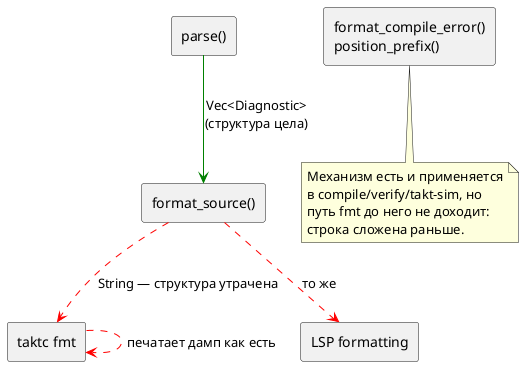

# Фича: taktc fmt печатает синтаксическую ошибку Debug-дампом

- **Номер:** 0202
- **Статус:** ГОТОВО
- **Зависит от:** нет (проставлено аналитиком, правило 17)
- **Связанные issue (анализ):** кандидат блока 2 `FEATURES.md`, переведён в фичу-03 (запрос заказчика)

## Стадии жизненного цикла (правило 17)

Все стадии — **разделы этой карточки** (правило 32): «Архитектура (ADR)»,
«Анализ», «Разработка», «Тест-план», «Отчёт о тестировании», «Итог».
Отдельным артефактом остаются только исправления —
[`docs/fixes/`](../fixes/README.md) (при необходимости `0202-YY-*`).

## Краткое описание

`taktc fmt` печатает синтаксическую ошибку Debug-дампом диагностики. Подробности находки, замеры и оговорки — в разделе «Что известно на
входе»; форма решения определяется стадиями архитектуры и анализа.

> Фича зарегистрирована **из бэклога кандидатов** (запрос заказчика 2026-08-03:
> перевести кандидатов в фичи без проработки); далее проходит жизненный цикл по
> правилу 17.

## Что известно на входе

> Фича заведена **из кандидата** блока 2 `FEATURES.md` (запрос заказчика
> 2026-08-03: перевести кандидатов в фичи без проработки). Проработка —
> стадии 2–3 жизненного цикла; ниже — запись кандидата **как есть**, вместе с
> замерами и оговорками, сделанными при его заведении.
>
> Замеры кандидата **не перепроверялись** при переводе в фичу: их
> актуальность подтверждает пробой стадия архитектуры (урок — записи
> кандидатов устаревают, и две из них оказались неверны).

**Класс:** синтаксис языка (Tier 1 — приоритет по решению заказчика
2026-08-03: синтаксис → семантика → генерация → остальное).

**`taktc fmt` печатает синтаксическую ошибку Debug-дампом диагностики.** При
любом отказе разбора (`SY-001…005`) форматтер выводит `не удалось разобрать
исходник: [Diagnostic { file: None, loc: Source(0, 6, 7), level: Error, … }]`
— вместо привычного `путь:строка:колонка: Ошибка компиляции [КОД]: текст`,
который печатают `compile`, `verify` и `takt-sim`. Причина —
`FormatError::Parse(format!("{d:?}"))` в `takt-lang/src/format/mod.rs`:
диагностика превращается в строку **внутри** библиотеки, теряя структуру, и
восстановить формат вызывающему уже нечем. Вскрыто пробой [ограничение глубины вложенности на уровне лексера/парсера](0156-parser-depth-limit.md) (2026-07-31) на её же новой
диагностике `SY-005`, но класс шире и старше: так печатается **любая**
ошибка разбора в `fmt`. Смежно с
[предупреждения генераторов возвращаются вызывающему, а не печатаются из библиотеки](0168-generator-warnings-return.md) (диагностику
возвращают вызывающему, а не печатают/склеивают в библиотеке) — вероятно,
чинится там же.

## Что показала проба (стадия архитектуры, 2026-08-04)

Запись кандидата подтвердилась и уточнена в трёх местах:

1. **Дефект нарушает обещание документа, а не только вкус.** Раздел о
   диагностике заявляет формат единообразным и прямо называет форматирование
   среди его источников («такое сообщение выдаёт **и форматирование**»).
   Инструмент этого не делает — то есть расхождение с нормативным описанием.
2. **Коды возврата верны** (`1` у всех трёх путей `fmt`): CI не обманут,
   дефект чисто в тексте.
3. **Несколько ошибок сливаются в одну строку.** `parse` накапливает
   диагностики (0130), а `fmt` печатает вектор одним `Debug`-блобом; `compile`
   на том же входе даёт две строки с позициями.

Вторая ветвь `FormatError` (`Unsupported`) **не задета** — печатается
по-человечески. Но она не несёт позиции; это отдельный пробел, вынесен из
объёма и записан кандидатом.

## Документирование (правило 24)

**Требуется.** Меняется наблюдаемое поведение инструмента: отказ `fmt` начинает
печататься в общем формате `путь:строка:колонка: Ошибка компиляции [КОД]: текст`.
Затронут раздел [`book/src/17-tools/`](../../book/src/17-tools/index.typ) —
подраздел «Форматирование»: сегодня там показан только случай «требуется
форматирование», нужен пример отказа на синтаксической ошибке.

Раздел [`book/src/16-diagnostics/`](../../book/src/16-diagnostics/index.typ)
правки **не требует**: он уже описывает нужное поведение — это код к нему не
подтянут, а не наоборот.

Язык не меняется (синтаксис, семантика и коды диагностик прежние), поэтому
версия языка остаётся `0.8.0`; растёт версия крейта `takt-lang`.

## Архитектура (ADR)

- **Status:** Accepted
- **Date:** 2026-08-04
- **Authors:** Архитектор
- **Related issues:** [Фича](0202-fmt-diagnostic-formatting.md); смежные — [ADR](0053-diagnostics-file-id.md#архитектура-adr) (формат позиции — свойство диагностики, а не бинарника), [ADR](0028-c-generator-stubs.md#архитектура-adr) (копия формата в `taktc` уже расходилась), [фича](0168-generator-warnings-return.md) (библиотека печатает диагностику сама — тот же принцип, другой канал)

### Context

`taktc fmt` при любом отказе разбора печатает **`Debug`-дамп** структуры
диагностики вместо принятого в проекте сообщения. Причина — одна строка в
`takt-lang/src/format/mod.rs`:

```rust
crate::parse(source, 0).map_err(|d| FormatError::Parse(format!("{d:?}")))?;
```

`parse` возвращает `Vec<Diagnostic>` — со структурой, кодом и позицией. Здесь
вектор **склеивается в строку внутри библиотеки**, и восстановить формат
вызывающему уже нечем: у него на руках `String`.

#### Чем это плохо

**1. Нарушено обещание документа.** Раздел о диагностике
(`book/src/16-diagnostics/`) заявляет формат как **единообразный** — «Сообщение
строится единообразно: `путь:строка:колонка: <вид> [<код>]: <текст>`», — и там
же, разбирая `SY-005`, прямо говорит: «такое сообщение выдаёт **и
форматирование**». Инструмент этого не делает. То есть дефект не «некрасивый
вывод», а **расхождение с нормативным описанием языка**.

**2. Позиция теряется дважды.** В дампе координата присутствует как
`loc: Source(0, 20, 22)` — байтовые смещения внутреннего представления. Человеку
нужны строка и колонка, а перевод делает `position_prefix`, которому нужен
**путь**; путь же в этот момент `file: None` — библиотека его не знает, а
вызывающий, знающий путь, уже получил строку.

**3. Несколько ошибок сливаются в одну строку.** `parse` накапливает
диагностики, и `fmt` печатает их **одним** `Debug`-блобом вектора:
две ошибки — одна нечитаемая строка. `compile` на том же входе печатает две
строки, каждую с позицией.

**4. Кавычки экранированы.** Внутри дампа сообщение — Rust-литерал, поэтому
ожидаемые токены выглядят как `\";\", \":\", \":=\"`.

#### Что показала проба

Прогон `taktc` на файле с ошибкой `var x u8 := 1;`:

| Инструмент | Вывод |
|---|---|
| `taktc compile` | `…/bad.takt:2:11: Ошибка компиляции [SY-002]: нераспознанный токен 'u8', ожидалось ";", ":", ":="` |
| `taktc fmt --check` | `Ошибка форматирования '…/bad.takt': не удалось разобрать исходник: [Diagnostic { file: None, loc: Source(0, 20, 22), level: Error, ty: ParserError, message: "нераспознанный токен 'u8', ожидалось \";\", \":\", \":=\"", code: Some("SY-002"), notes: [] }]` |

Проба уточнила запись кандидата **в трёх местах**:

1. **Коды возврата верны** — `1` у всех трёх путей (`fmt`, `fmt --check`,
   `fmt --stdin`). Дефект чисто в тексте; CI не обманут.
2. **Вторая ветвь `FormatError` не задета.** `Unsupported` печатается
   по-человечески: «печать узла 'Formula' пока не поддерживается форматтером».
   Но она **не несёт позиции** — в большом файле неизвестно, какой именно
   элемент не поддержан. Это отдельный, меньший пробел (см. «Вне области»).
3. **Класс шире одного места.** Дамп получают все три пути `fmt` (файлы,
   `--check`, `--stdin`) и, через `formatting_edits`, слой LSP.

#### Готовое решение уже есть в библиотеке

`diagnostics::batch::format_compile_error` строит ровно нужную строку, и его
докблок формулирует принцип, который здесь и нарушен:

> Формат живёт в **библиотеке**… вид диагностики — её собственное свойство.
> Функция **не печатает** — возвращает текст. Печать остаётся за вызывающим:
> библиотека, пишущая в `stderr`, лишает его выбора.

То есть недостаёт не механизма, а **применения** механизма: `format_source`
обязан отдать диагностику наружу, а не строку.



### Decision Drivers

1. **Формат диагностики — свойство диагностики, а не инструмента**.
   Копия формата в `taktc` уже расходилась однажды.
2. **Документ нормативен.** Раздел о диагностике обещает единый формат и прямо
   называет форматирование среди его источников; расхождение чинится в коде, а
   не переписыванием обещания.
3. **Библиотека не решает за вызывающего.** Она не печатает и не склеивает —
   отдаёт структуру (тот же принцип ведёт фичу).
4. **Позицию можно проставить только там, где известен путь** — в вызывающем.
5. **Накопление диагностик (0130) не должно пропадать** на пути `fmt`.

### Considered Options

#### Option A. `FormatError::Parse` несёт `Vec<Diagnostic>`; печатает вызывающий

`format_source` отдаёт диагностику как есть. `taktc fmt` проставляет путь
(`with_file_if_unset`) и печатает **построчно** через `format_compile_error`.

**Pros:**
- Вывод `fmt` становится тождествен выводу `compile` — обещание документа
  исполняется буквально.
- Позиция появляется, потому что путь проставляет тот, кто его знает.
- Несколько ошибок печатаются несколькими строками (0130 доезжает).
- Механизм не заводится: используются существующие `format_compile_error`,
  `position_prefix`, `with_file_if_unset`.
- LSP получает структуру и волен превратить её в настоящие LSP-диагностики.

**Cons:**
- Меняется публичный тип `FormatError` → рост версии крейта `takt-lang`.
- `Display for FormatError` теряет возможность дать позицию (пути он не знает) —
  придётся честно определить, что он печатает.

#### Option B. Оставить `Parse(String)`, но строить строку внутри библиотеки

`format_source` сам зовёт `format_compile_error`.

**Pros:**
- Публичный тип не меняется; правка в одну функцию.

**Cons:**
- **Позиции не будет всё равно:** `position_prefix` без `file` возвращает пустой
  префикс, а `file` внутри библиотеки `None`. Главный симптом не лечится.
- Структура по-прежнему теряется — LSP не сможет показать диагностику.
- Закрепляет ровно тот приём (склейка внутри библиотеки), который проект
  последовательно изживает.

#### Option C. Статус-кво + правка документа

Убрать из документа обещание про форматирование.

**Pros:**
- Нулевая цена.

**Cons:**
- Лечит симптом со стороны, где дефекта нет: единый формат — **верное**
  свойство, и от него отказываются ради одной непочиненной строки.
- Дамп остаётся нечитаемым, а несколько ошибок — слитыми.

### Decision

Принимается **Option A**.

`FormatError::Parse(Vec<Diagnostic>)`; печать — за вызывающим, через
существующий `format_compile_error`. `Display for FormatError` сохраняется (тип
обязан оставаться `std::error::Error`) и печатает диагностики **без** префикса
позиции — честно отражая, что путь на этом уровне неизвестен; вызывающие,
знающие путь, идут по структурному пути и получают полный формат.

Версия крейта `takt-lang`: **0.27.0 → 0.28.0** (ломающее изменение публичного
типа). Версия **языка** не меняется: синтаксис и семантика не затронуты, речь о
форме сообщения инструмента.

### Consequences

#### Положительные

- `fmt` печатает то же, что `compile`: `путь:строка:колонка: Ошибка компиляции
  [код]: текст` — обещание документа исполняется.
- Несколько ошибок разбора печатаются несколькими строками.
- Экранированные кавычки и байтовые смещения исчезают из вывода.
- Слой LSP получает структуру вместо строки.

#### Отрицательные / Action items

- Ломающее изменение публичного API → версия крейта `0.28.0`.
- Правило 24: раздел «Инструментарий» документа получает пример отказа `fmt`
  (сегодня показан только случай «требуется форматирование»).
- Правило 29: путь LSP (`formatting_edits`) правится вместе с CLI.
- Контроль обязан сравнивать вывод `fmt` с выводом `compile` **на одном
  входе**. Проверка «в выводе нет слова `Diagnostic`» поймала бы дамп, но не
  расхождение формата — а именно расхождение и есть предмет фичи.

#### Вне области

- **Позиция у `FormatError::Unsupported`.** Ветвь печатается по-человечески, но
  не говорит, **где** непокрытый узел. Реальный, но отдельный пробел: он про
  полноту печати форматтера, а не про потерю структуры диагностики. Записывается
  кандидатом.
- **Фича** (цели печатают предупреждения прямо в `stderr`) — тот же
  принцип, другой канал и другие функции; объединять не следует.

#### Acceptance criteria

1. `taktc fmt --check` на файле с ошибкой разбора печатает строку, **совпадающую**
   с выводом `taktc compile` на том же файле.
2. Две ошибки разбора дают **две** строки, а не одну.
3. В выводе `fmt` нет подстрок `Diagnostic {`, `Source(`, `code: Some`.
4. Коды возврата не изменились: `1` у `fmt`, `fmt --check`, `fmt --stdin`.
5. `FormatError::Unsupported` печатается как прежде (регресс не задет).
6. Версия крейта `takt-lang` — `0.28.0`.
7. `./scripts/precheck.sh` — код возврата 0.

## Анализ

### Цель и контекст

ADR принял **Option A**: `FormatError::Parse` несёт `Vec<Diagnostic>`, печать
остаётся за вызывающим и идёт через существующий `format_compile_error`.

Существо правки — **не заводить механизм, а довести до него путь**. Всё нужное
в библиотеке уже есть и работает у `compile`, `verify`, `takt-sim`:
`format_compile_error` (формат строки), `position_prefix` (перевод смещения в
`строка:колонка` по пути), `with_file_if_unset` (проставление пути тем, кто его
знает). Путь `fmt` до них не доходит, потому что строка склеивается раньше —
внутри `format_source`.

### Зависимости фичи (правило 17/19)

- **Зависит от:** `нет`. Правка локальна: один тип, одна функция библиотеки,
  два вызывающих (CLI и LSP).
- **Влияние на порядок разработки:** ничего не блокирует.
  [предупреждения генераторов возвращаются вызывающему, а не печатаются из библиотеки](0168-generator-warnings-return.md) исповедует тот же
  принцип («библиотека не печатает и не склеивает — отдаёт структуру»), но
  касается **другого** канала (предупреждения целей `rust`/`st`/`sv`, печатаемые
  прямо в `stderr`) и других функций. Зависимости между ними нет; 0202 создаёт
  для 0168 прецедент, а не предпосылку.

### Места правки

| Файл | Что |
|---|---|
| `takt-lang/src/format/mod.rs` | `FormatError::Parse(String)` → `Parse(Vec<Diagnostic>)`; снять `format!("{d:?}")`; переписать ветвь `Display` |
| `takt-lang/src/bin/taktc.rs` | `run_fmt`: три места обработки `Err` — файлы, `--check`, `--stdin`; проставить путь и печатать построчно |
| `takt-lang/src/lsp/formatting.rs` | докблок: `Err` теперь несёт структуру, а не строку |
| `takt-lang/Cargo.toml` | версия крейта `0.27.0` → `0.28.0` |
| `book/src/17-tools/index.typ` | пример отказа `fmt` на синтаксической ошибке |

### Ограничения, которые определяют форму решения

**О1. Путь известен только вызывающему.** `format_source` принимает `&str`, а не
файл, — и это верно (тот же вход у `--stdin` и у LSP, где файла может не быть).
Поэтому `file` проставляется в `run_fmt`, где путь есть, через существующий
`with_file_if_unset`. Отсюда же следует, что **Option B был бы бесполезен**:
склейка внутри библиотеки не даёт позиции ни при каком качестве формата.

**О2. У `--stdin` пути нет — и выдумывать его нельзя.** `position_prefix` при
`file: None` возвращает **пустой** префикс, и это правильное поведение (докблок
`position_prefix`: «выдумывать координаты нельзя — пользователь пошёл бы искать
ошибку в первой строке файла»). Значит вывод `--stdin` останется без
`путь:строка:колонка`, но получит код и текст в общем виде. Это не пробел, а
следствие отсутствия файла.

**О3. `Display for FormatError` обязан остаться.** Тип реализует
`std::error::Error`, и `Display` — часть контракта. Он печатает диагностики без
префикса позиции (пути на этом уровне нет). Вызывающие, знающие путь, обязаны
идти **структурным** путём, а не через `Display`, — иначе позиция снова
потеряется, но уже незаметно.

**О4. Печатать построчно, а не одной строкой.** Диагностик может быть несколько
(0130). Соединять их `\n` внутри одной `eprintln!` нельзя — вывод должен
совпасть с `compile` построчно, а тот печатает каждую отдельно.

**О5. Формат берётся из `format_compile_error`, а не пишется заново.** Копия
формата в `taktc` уже расходилась однажды (задача: цели `c`/`st`
печатали сообщение без кода, `c-hal`/`st-at` — с кодом, заметки не печатал
никто). Вторая копия воспроизвела бы этот класс.

### Требования и проверяемые условия

- **R1. Структура доезжает до вызывающего.** `FormatError::Parse` несёт
  `Vec<Diagnostic>`; `format!("{d:?}")` в `format/mod.rs` отсутствует.
- **R2. Вывод `fmt` тождествен выводу `compile`** на одном и том же файле с
  ошибкой разбора — строка в строку.
- **R3. Несколько ошибок — несколько строк.**
- **R4. В выводе нет внутреннего представления** — подстрок `Diagnostic {`,
  `Source(`, `code: Some`, `level:`.
- **R5. Коды возврата не изменились:** `1` у `fmt`, `fmt --check`, `fmt --stdin`.
- **R6. `FormatError::Unsupported` не задет** — печатается как прежде.
- **R7. `--stdin` даёт код и текст** в общем формате; префикс позиции пуст
  (файла нет) — и это зафиксировано тестом, а не оставлено на догадку.
- **R8. Версия крейта поднята** до `0.28.0`.

### Критерии приёмки и способ проверки

| # | Критерий | Способ проверки |
|---|---|---|
| A1 | R1 | греп по `format/mod.rs`; сборка (тип сменился) |
| A2 | R2 — **главный** | тест: прогнать `format_source` и путь `compile` на одном входе и сравнить **строки** |
| A3 | R3 | тест на входе с двумя ошибками: ровно две строки |
| A4 | R4 | тест на отсутствие подстрок внутреннего представления |
| A5 | R5 | прогон `taktc` на зонде, проверка кода возврата |
| A6 | R6 | тест на модели с `formula` (ветвь `Unsupported`) |
| A7 | R7 | тест `--stdin`: код и текст есть, префикса нет |
| A8 | R8 | `grep version takt-lang/Cargo.toml` |
| A9 | предкоммит | `./scripts/precheck.sh` — код 0 |

**A2 — не «в выводе нет слова `Diagnostic`».** Такая проверка поймала бы
дамп, но пропустила бы любое **расхождение формата** (скажем, «Ошибка
форматирования» вместо «Ошибка компиляции», или потерянный код). Предмет фичи —
именно единство формата, поэтому контроль обязан сравнивать два вывода, а не
искать запрещённую подстроку.

### Особенности по обратной функциональности (правило 11)

**Ломающее изменение публичного API.** `FormatError` экспортируется
(`takt_lang::format::FormatError`), и вариант `Parse` меняет тип поля. Внешний
потребитель, разбирающий `FormatError::Parse(s)`, перестанет компилироваться.
Внутри репозитория потребителей два (CLI и LSP), оба правятся здесь.

Версия крейта `takt-lang`: **`0.27.0` → `0.28.0`**. Версия **языка** не
меняется: синтаксис, семантика и коды диагностик прежние — меняется форма
сообщения инструмента. Цикл `0.8.0` при этом всё равно открыт и не выпущен.

**Наблюдаемое поведение меняется в сторону контракта, а не от него:** формат
приводится к тому, который документ уже объявил единым.

### Документирование (правило 24)

**Требуется** — `book/src/17-tools/`, подраздел «Форматирование»: добавить
пример отказа на синтаксической ошибке рядом с существующим примером «требуется
форматирование».

Раздел `book/src/16-diagnostics/` правки **не требует**: он уже описывает
целевое поведение («такое сообщение выдаёт и форматирование»). Это код не
дотянут до документа, а не документ до кода.

### Редакторский слой (правило 29)

| Слой | Вердикт |
|---|---|
| LSP `format/` ↔ `lsp/formatting.rs` | правится: `Err` меняет тип; докблок обновляется |
| LSP `lsp/diagnostics.rs` | **правок не требует** — путь диагностик отдельный и уже верный |
| Плагин IntelliJ | **правок не требует** — форматирование идёт через LSP-сервер |
| Плагин Zed | **правок не требует** — своих списков и своего форматирования не ведёт |

Лексика, синтаксис и семантика **не меняются**, поэтому проверка правила 29
здесь короткая; но провести её обязательно — изменение публичного типа,
задевающего LSP, ровно тот случай, ради которого правило заведено.

### Предлагаемая декомпозиция разработки

Задача **одна** (`0202-01`): тип, библиотека, два вызывающих, версия крейта,
тесты и документ. Дробить нечего — правка связная и мала, а разрыв «сменили тип,
но не поправили вызывающих» не компилируется по построению.

### Риски и зависимости

- **Р1. Потерять позицию незаметно**, если вызывающий начнёт печатать через
  `Display` вместо структурного пути. Снижение — A2 сравнивает вывод с
  `compile`; расхождение станет отказом теста.
- **Р2. Завести вторую копию формата** в `taktc`. Снижение — О5 и тот же A2.
- **Р3. Сломать внешнего потребителя** сменой публичного типа. Снижение —
  осознанный рост версии крейта и запись в `CHANGES.md`.

## Разработка

### Задача

#### Что было

`format_source` склеивал результат разбора в строку **внутри** библиотеки:

```rust
crate::parse(source, 0).map_err(|d| FormatError::Parse(format!("{d:?}")))?;
```

`parse` отдаёт `Vec<Diagnostic>` со структурой, кодом и позицией; `format!`
превращал вектор в `Debug`-дамп, и восстановить формат вызывающему было нечем.
Пользователь видел байтовые смещения (`Source(0, 20, 22)`), экранированные
кавычки и — при нескольких ошибках — всё это одной строкой.

#### Что сделано

**Тип несёт структуру.** `FormatError::Parse(Vec<Diagnostic>)`; `map_err`
сведён к `map_err(FormatError::Parse)` — склейки больше нет нигде.

**Печатает вызывающий.** В `taktc.rs` заведён `report_format_error`: он
проставляет путь (`with_file_if_unset` — файл знает только он) и печатает
**каждую** диагностику через существующий
`diagnostics::format_compile_error`. Три места обработки `Err` (файлы,
`--check`, `--stdin`) идут через него.

Формат **не написан заново**: копия формата в `taktc` уже расходилась
однажды (задача — цели `c`/`st` печатали сообщение без кода,
`c-hal`/`st-at` с кодом, заметки не печатал никто).

**`Display` сохранён, но честен.** Тип реализует `std::error::Error`, поэтому
`Display` обязателен; ветвь `Parse` печатает диагностики **без** префикса
позиции — пути на этом уровне нет. Докблок прямо предупреждает: вызывающий,
который путь знает, обязан идти структурным путём, иначе позиция теряется
молча.

**Версия крейта** `takt-lang`: `0.27.0` → `0.28.0` (ломающее изменение
публичного типа).

#### Результат

| Вход | Было | Стало |
|---|---|---|
| одна ошибка | `Ошибка форматирования '…': не удалось разобрать исходник: [Diagnostic { file: None, loc: Source(0, 20, 22), … }]` | `…/probe.takt:2:11: Ошибка компиляции [SY-002]: нераспознанный токен 'u8', ожидалось ";", ":", ":="` |
| две ошибки | одна строка-блоб | две строки с позициями |
| `--stdin` | тот же дамп | `Ошибка компиляции [SY-002]: …` (без позиции — файла нет) |

Вывод `fmt` теперь **тождествен** выводу `compile` на том же входе.

#### Проверки

- `takt-lang/tests/syntax/fmt_diagnostic_tests.rs` — 6 тестов, прогон бинаря `taktc`
  с перехватом stderr (так это видит пользователь).
- **Мутационная проверка** (две мутации, обе пойманы):
  1. «печатать только первую диагностику» → краснеет `two_parse_errors_print_two_lines`;
  2. «печатать через `Display` вместо структурного пути» (риск Р1 анализа) →
     краснеют `fmt_error_matches_compile_error` и `two_parse_errors_print_two_lines`.
- `./scripts/precheck.sh` — код возврата 0.

## Тест-план

### Область и цель

Проверяется, что отказ `taktc fmt` печатается **общим** форматом диагностики.
Требования — R1…R8 анализа, критерии приёмки — A1…A9.

Наблюдение — прогоном бинаря `taktc` с перехватом `stderr`: именно так вывод
видит пользователь. Проверка на уровне библиотеки доказала бы вызов нужной
функции, но не проводку CLI, а дефект был именно в проводке.

**Главная проверка — T1**, сравнение вывода `fmt` с выводом `compile` на
одном входе. Соблазнительная альтернатива «в выводе нет слова `Diagnostic`»
поймала бы дамп, но пропустила бы любое расхождение формата — а предмет фичи
именно единство формата. Мутация 2 (см. отчёт) это подтвердила: она проходит
проверку на подстроку и валится на T1.

Правило 16 (примеры и контрпримеры) применимо в вырожденном виде: фича не
меняет язык, поэтому «пример» — файл, который разбирается (форматируется как
прежде), «контрпример» — файл, который не разбирается.

### Проверки (условие → ожидаемый результат)

| # | Проверка | Предусловие | Ожидаемый результат | Ссылка на R/A |
|---|---|---|---|---|
| T1 | **Вывод `fmt` = вывод `compile`** | файл с одной ошибкой разбора | строки совпадают целиком; вид `путь:строка:колонка: Ошибка компиляции [КОД]: текст` | R2 / A2 |
| T2 | Несколько ошибок — несколько строк | файл с двумя ошибками | ровно две строки, позиции `2:11` и `3:11` | R3 / A3 |
| T3 | Внутреннее представление не печатается | файл с ошибкой | нет `Diagnostic {`, `Source(`, `code: Some`, `level:`, `\"` | R4 / A4 |
| T4 | Коды возврата не изменились | файл с ошибкой | `1` у `fmt` и `fmt --check` | R5 / A5 |
| T5 | `Unsupported` не задет | модель с `formula` | «печать узла 'Formula' пока не поддерживается форматтером»; код `1` | R6 / A6 |
| T6 | `--stdin`: код и текст есть, позиции нет | тот же файл через stdin | `Ошибка компиляции [SY-002]: …`; префикса `путь:` нет; код `1` | R7 / A7 |
| T7 | **Мутация: контроль краснеет** | внести дефект обратно | краснеют T1/T2 | R2, R3 / A2 |
| T8 | Версия крейта поднята | — | `takt-lang` = `0.28.0` | R8 / A8 |
| T9 | Регресс форматирования | корпус `examples/` | `taktc fmt --check` зелён (вывод не сдвинулся) | — |
| T10 | Предкоммит | — | `./scripts/precheck.sh` — код 0 | — / A9 |

**T6 фиксирует отсутствие позиции как решение, а не как случайность.** У
`--stdin` файла нет, и выдумывать координаты нельзя (докблок
`position_prefix`: пользователь пошёл бы искать ошибку в первой строке). Без
теста это выглядело бы недоделкой и однажды было бы «починено» неверно.

### Разбивка проверок по функциональности

| Функциональность | T1 | T2–T4 | T5 | T6 | T7 | T9 |
|---|---|---|---|---|---|---|
| `taktc fmt` (файлы) | ✅ | ✅ | ✅ | — | ✅ | ✅ |
| `taktc fmt --check` | ✅ | ✅ | ✅ | — | ✅ | ✅ |
| `taktc fmt --stdin` | — | — | — | ✅ | — | — |
| `taktc compile` (эталон) | ✅ | — | — | — | ✅ | — |
| LSP `formatting_edits` | — | — | — | — | — | — |
| Язык, цели, симулятор | — | — | — | — | — | — |

<!-- Легенда: ✅ пройдено · ❌ провалено · ⬜ не проверялось · — не применимо -->

LSP помечен «не применимо» осознанно: тип ошибки там меняется, но поведение
сервера прежнее (логирует и отвечает `null`). Компилируемость правки доказывает
сборка под `--all-features`, а поведенческого изменения нет — тест был бы
тестом заглушки.

### Тестовые данные и окружение

**Контрпример 1 — одна ошибка** (пропущено `:` перед типом):

```takt
model M {
    var x u8 := 1;
    start S { always { } }
}
start Main = M;
```

**Контрпример 2 — две ошибки:** то же плюс `var y u8 := 2;`.

**Контрпример 3 — непокрытый узел** (разбирается, но не печатается):

```takt
model M {
    formula "ltl" { }
    start S { always { } }
}
start Main = M;
```

**Пример:** весь корпус `examples/` — он обязан форматироваться как прежде (T9).

Фикстуры пишутся в **уникальный по тесту** временный каталог (имя потока в
пути): тесты идут параллельно, и общий каталог был источником гонок.

**Окружение:** macOS (Darwin 25.5.0), толчейн `1.97.1`; `./scripts/precheck.sh`.

## Отчёт о тестировании

### Резюме

Все проверки тест-плана (T1…T10) пройдены. Фича готова к закрытию (статус
`ГОТОВО`). Исправлений (`docs/fixes/`) не потребовалось.

Отказ `taktc fmt` печатается общим форматом диагностики и **тождествен** выводу
`taktc compile` на том же входе. Версия крейта `takt-lang` поднята до `0.28.0`
(ломающее изменение публичного типа `FormatError`); версия языка не менялась.

Окружение: macOS (Darwin 25.5.0), толчейн `1.97.1`, `./scripts/precheck.sh`.

### Фактические результаты по проверкам

| # | Проверка | Результат | Комментарий |
|---|---|---|---|
| T1 | **Вывод `fmt` = вывод `compile`** | ✅ | `diff` пуст; строка вида `probe.takt:2:11: Ошибка компиляции [SY-002]: …` |
| T2 | Несколько ошибок — несколько строк | ✅ | две строки, позиции `2:11` и `3:11` |
| T3 | Внутреннее представление не печатается | ✅ | нет `Diagnostic {`, `Source(`, `code: Some`, `level:`, `\"` |
| T4 | Коды возврата не изменились | ✅ | `1` у `fmt`, `fmt --check`, `fmt --stdin` |
| T5 | `Unsupported` не задет | ✅ | «печать узла 'Formula' пока не поддерживается форматтером» |
| T6 | `--stdin`: код и текст есть, позиции нет | ✅ | `Ошибка компиляции [SY-002]: …`; префикса нет — файла нет |
| T7 | **Мутация: контроль краснеет** | ✅ | две мутации, обе пойманы — см. ниже |
| T8 | Версия крейта поднята | ✅ | `takt-lang` = `0.28.0` |
| T9 | Регресс форматирования | ✅ | `taktc fmt --check` по `examples/` зелён |
| T10 | Предкоммит | ✅ | `./scripts/precheck.sh` — код возврата 0 |

#### T7 подробно: две мутации

| # | Мутация | Что покраснело |
|---|---|---|
| 1 | печатать только **первую** диагностику | `two_parse_errors_print_two_lines` |
| 2 | печатать через `Display` вместо структурного пути (**риск Р1** анализа) | `fmt_error_matches_compile_error` **и** `two_parse_errors_print_two_lines` |

Мутация 2 — главная. Она **проходит** проверку «в выводе нет слова
`Diagnostic`» (текст остаётся человеческим) и валится ровно на сравнении с
`compile`: без файла `position_prefix` возвращает пустой префикс, и позиция
исчезает **молча**. Это подтвердило выбор T1 главной проверкой: контроль на
запрещённую подстроку закрыл бы фичу с наполовину работающим лечением.

### Результаты по функциональности

| Функциональность | Статус | Комментарий |
|---|---|---|
| `taktc fmt` (файлы, `--check`) | ✅ | путь проставляется, формат общий |
| `taktc fmt --stdin` | ✅ | код и текст; позиции нет — файла нет |
| `taktc compile` | ✅ | эталон формата; не изменён |
| LSP `formatting_edits` | ✅ | компилируется под `--all-features`; поведение прежнее |
| Библиотека `format_source` | ✅ | отдаёт структуру, не строку |
| Язык, цели, симулятор | — | не задеты |
| Плагины IntelliJ / Zed | — | форматирование идёт через LSP-сервер |

<!-- Легенда: ✅ пройдено · ❌ провалено · ⬜ не проверялось · — не применимо -->

### Выводы и дальнейшие шаги

1. **Дефект нарушал документ, а не только вкус.** Раздел о диагностике
   объявляет формат единым и прямо называет форматирование среди его
   источников. Это переводит находку из разряда «некрасиво» в разряд
   «инструмент не делает того, что о нём написано» — и заодно задаёт критерий
   приёмки: не «стало приятнее», а «совпало с обещанным».

2. **Лечения не потребовалось изобретать.** `format_compile_error`,
   `position_prefix` и `with_file_if_unset` существовали и работали у
   `compile`, `verify`, `takt-sim`; докблок первого прямо формулирует принцип,
   который был нарушен. Недоставало не механизма, а **пути** к нему: строка
   склеивалась раньше, чем вызывающий мог что-то решить.

3. **Option B был бы правдоподобной ошибкой.** «Собрать строку внутри
   библиотеки, но красиво» выглядит меньшей правкой и не требует менять
   публичный тип — но позиции не даёт **ни при каком качестве формата**: пути
   внутри библиотеки нет. Проба это показала до реализации.

4. **Проверка формата обязана быть сравнением, а не поиском подстроки.**
   Мутация 2 проходит любой разумный тест «нет дампа» и валит только сравнение
   с эталонным инструментом.

5. **Найдено сверх объёма, записано кандидатами** (правило 28):
   - `FormatError::Unsupported` не несёт **позиции** — в большом файле
     неизвестно, какой элемент не поддержан;
   - `format_tests.rs::corpus()` обходит три каталога, из которых **два не
     существуют** (`grammar/tests/data`, `simulation/tests/data` — переименованы
     фичей), а `collect` молча возвращается при ошибке чтения. Контроль
     форматтера, описанный как «прогон по всему корпусу», покрывает только
     `examples/`. Это тот же класс, что закрывала 0201: молчаливая усадка
     покрытия.

Исправления (`docs/fixes/`) не требуются.

## Итог (что сделано)

Диагностика разбора доезжает до вызывающего **структурой**, а не строкой:
`FormatError::Parse(Vec<Diagnostic>)` вместо `Parse(String)`. Печатает
вызывающий — `taktc fmt` проставляет путь (`with_file_if_unset`) и печатает
каждую диагностику существующим `format_compile_error`.

| Вход | Было | Стало |
|---|---|---|
| одна ошибка | `не удалось разобрать исходник: [Diagnostic { file: None, loc: Source(0, 20, 22), … }]` | `probe.takt:2:11: Ошибка компиляции [SY-002]: нераспознанный токен 'u8', ожидалось ";", ":", ":="` |
| две ошибки | один `Debug`-блоб | две строки с позициями |
| `--stdin` | тот же дамп | код и текст; позиции нет — файла нет |

Вывод `fmt` **тождествен** выводу `compile` на том же входе — это и есть то,
что обещал раздел документа о диагностике («такое сообщение выдаёт и
форматирование»).

Версия крейта `takt-lang`: `0.27.0` → `0.28.0` (ломающее изменение публичного
типа). Версия языка не менялась.

**Механизм не заводился.** `format_compile_error`, `position_prefix` и
`with_file_if_unset` уже работали у `compile`, `verify`, `takt-sim`; докблок
первого прямо формулирует нарушенный принцип. Недоставало **пути** к ним:
строка склеивалась внутри библиотеки раньше, чем вызывающий мог что-то решить.

**Option B был бы правдоподобной ошибкой.** «Собрать строку внутри
библиотеки, но красиво» — меньшая правка, не трогает публичный тип, — но
позиции не даёт **ни при каком качестве формата**: пути внутри библиотеки нет.

**Мутация 2 показала, почему контроль обязан сравнивать, а не искать
подстроку.** Печать через `Display` вместо структурного пути проходит проверку
«в выводе нет дампа» и теряет позицию **молча**; краснеет только сравнение с
выводом `compile`.

**Найдено сверх объёма и записано, а не сделано:** `FormatError::Unsupported`
не несёт позиции; `format_tests.rs::corpus()` обходит два несуществующих
каталога (переименованы фичей) и потому покрывает лишь `examples/` —
оба кандидата в `FEATURES.md`.

Детали: [ADR](0202-fmt-diagnostic-formatting.md#архитектура-adr),
[анализ](0202-fmt-diagnostic-formatting.md#анализ),
[отчёт](0202-fmt-diagnostic-formatting.md#отчёт-о-тестировании), [taktc fmt печатает синтаксическую ошибку Debug-дампом](0202-fmt-diagnostic-formatting.md#разработка). Исправлений
(`docs/fixes/`) не потребовалось.
