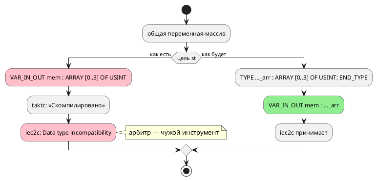

# Фича: Массив как общая переменная в цели st; индекс массива не только литерал или имя

- **Номер:** 0210
- **Статус:** ГОТОВО
- **Зависит от:** нет (проставлено аналитиком на стадии анализа)
- **Связанные issue (анализ):** кандидат блока 2 `FEATURES.md`, переведён в фичу-03 (запрос заказчика)

## Стадии жизненного цикла

Все стадии — **разделы этой карточки**: «Архитектура (ADR)»,
«Анализ», «Разработка», «Тест-план», «Отчёт о тестировании», «Итог».
Отдельным артефактом остаются только исправления —
[`docs/fixes/`](../fixes/README.md) (при необходимости `0210-YY-*`).

## Краткое описание

Массив как общая переменная не переносится в цель `st`; индекс массива — только литерал или имя. Подробности находки, замеры и оговорки — в разделе «Что известно на
входе»; форма решения определяется стадиями архитектуры и анализа.

> Фича зарегистрирована **из бэклога кандидатов** (запрос заказчика 2026-08-03:
> перевести кандидатов в фичи без проработки); далее проходит жизненный цикл по
> своду.

## Что известно на входе

> Фича заведена **из кандидата** блока 2 `FEATURES.md` (запрос заказчика
> 2026-08-03: перевести кандидатов в фичи без проработки). Проработка —
> стадии 2–3 жизненного цикла; ниже — запись кандидата **как есть**, вместе с
> замерами и оговорками, сделанными при его заведении.
>
> Замеры кандидата **не перепроверялись** при переводе в фичу: их
> актуальность подтверждает пробой стадия архитектуры (урок — записи
> кандидатов устаревают, и две из них оказались неверны).

**Класс:** генерация целей (Tier 3 — приоритет по решению заказчика
2026-08-03: синтаксис → семантика → генерация → остальное).

**Массив как общая переменная не переносится в цель `st`; индекс массива —
только литерал или имя.** Вскрыто пробами [раздел документа «Практический пример: процессор» (шины, кеш, ядра)](0186-book-processor-example.md#разработка) (2026-07-30).
Первое: файл, где под-модели общаются через `var mem: [u8;4]` корня,
компилируется целью `st`, но `iec2c` его отвергает — «Data type incompatibility
between parameter 'mem' and value being passed, when invoking FB»; скалярная
общая переменная при этом работает. То есть цель принимает вход и порождает
**невалидный** ST — тот же класс, что 0184 (рапорт об успехе при негодном
выводе), только в другой цели. Второе: грамматика индекса принимает `mem[pc]` и
`mem[3]`, но **не** `mem[pc + 1]` (`SY-002`, «ожидалось `]`») — выражение в
индексе не разбирается ни в выражениях, ни в условиях. Корпус ни того, ни
другого не покрывает: массивы в нём не выходят за пределы одной модели, а
индекс всюду простой. Устранение первого — работа по цели `st` (передача
массива в FB либо честный отказ вместо невалидного вывода); второго — правка
грамматики (кандидат отдельной фичей: индекс-выражение).

## Документирование

**Требуется.** Индекс-выражение — расширение синтаксиса; затронуты разделы
[`book/src/03-types/`](../../book/src/03-types/index.typ) (массивы) и
[`book/src/05-expressions/`](../../book/src/05-expressions/index.typ) (таблица
доступов). **Сделано:** в оба добавлено, что индексом может быть любое
выражение, с примером; у среза оговорено, что границы остаются числами.

## Архитектура (ADR)

- **Status:** Accepted (Option A1 + B1 + C1)
- **Date:** 2026-08-16
- **Authors:** Архитектор
- **Related issues:** [Фича](0210-st-array-shared-and-index.md); находка [раздел документа «Практический пример: процессор» (шины, кеш, ядра)](0186-book-processor-example.md#разработка); класс «цель рапортует об успехе при негодном выводе» — [ADR](0184-imported-shared-variables.md#архитектура-adr); ловушки MatIEC — [ADR](0041-st-backend.md#архитектура-adr)

### Context

Фича заведена из кандидата **без проработки** (запрос заказчика 2026-08-03), и её
карточка прямо предупреждает: замеры кандидата не перепроверялись, их
актуальность подтверждает архитектура (урок — записи кандидатов
устаревают). Пробы 2026-08-16 подтвердили **оба** заявленных предмета и вскрыли
**третий**.

#### Замер 1: общий массив → невалидный ST (подтверждён)

```takt
var mem: [u8; 4] := {1, 2, 3, 4};
model Reader { var got: u8 := 0; start Read { always { got := mem[1]; } … } }
start Root = Reader;
```

`taktc` рапортует об успехе, `iec2c` отвергает вывод:

```
error: Data type incompatibility between parameter 'mem' and value being passed,
       when invoking FB 'reader0'
```

Скалярная общая переменная при этом работает. Это класс
[общие переменные библиотечного файла в импортёре](0184-imported-shared-variables.md#архитектура-adr): цель принимает вход и порождает
негодный код, а арбитром оказывается чужой инструмент.

#### Замер 2: причина — **анонимный** тип массива в параметре (новое)

Кандидат называл симптом, но не причину. Две пробы на чистом ST, отличающиеся
одной строкой:

| Объявление параметра `VAR_IN_OUT` | Ответ `iec2c` |
|---|---|
| `mem : ARRAY [0..3] OF USINT;` | **ошибка** «Data type incompatibility» |
| `TYPE MemArr : ARRAY [0..3] OF USINT; END_TYPE` + `mem : MemArr;` | **принят** |

То есть MatIEC требует **именованного** типа для массива в объявлении параметра.
Лечение известно и дёшево — не отказ, а правильная эмиссия.

#### Замер 3: индекс-выражение (подтверждён) — и цена его снятия

`mem[pc + 1]` → `SY-002` «ожидалось `]`»; `mem[pc]` и `mem[3]` принимаются.
Причина — грамматика: индекс задан **двумя** правилами (число и идентификатор),
по отдельности, и в выражениях, и в условиях.

**Проба показала, что цена снятия мала, а карточка предполагала обратное**
(«кандидат отдельной фичей»). Замена обоих правил на `Expression`/`Condition`:

- собирается **без конфликтов** LR (LALRPOP не жалуется);
- срез `mem[l:r]` не задет (различается двоеточием);
- **все потребители уже готовы** — печатники рекурсивны:

| Потребитель | `got := mem[pc + 1];` |
|---|---|
| цель `c` | `model->got = model->mem[model->pc + 1];` |
| цель `rust` | `self.got = self.mem[self.pc.wrapping_add(1) as usize];` |
| цель `st` | `got := mem[pc + 1];` |
| симулятор | исполняет верно (`mem[1]` при `pc = 0`) |
| форматтер | печатает |

То же в условии: `ref Done: mem[pc + 1] > 15;` → `if (model->mem[model->pc + 1] > 15)`.

#### Замер 4: переменная-индекс не считается использованной (находка, кандидат не знал)

```
model.takt:2:1: Предупреждение [SE-036]: переменная 'pc' объявлена,
                но нигде не используется
```

— при том что `pc` стоит индексом: `got := mem[pc];`. Причина в
`semantic/unused.rs`: ветвь `ExpressionNode::ArraySubscript(var_rc, _)`
**игнорирует** второй элемент. Сборщиков в модуле одиннадцать, и ветвь
повторяется в четырёх местах (выражения и условия, дважды каждый).

Это ложное срабатывание **сегодня**, но после снятия ограничения индекса оно
станет чаще: в индексе появятся целые выражения с несколькими именами.

#### Поток «как есть» и «как будет»



### Decision Drivers

1. **Цель не вправе рапортовать об успехе, выдавая негодный код**:
   либо правильная эмиссия, либо честный отказ.
2. **Причина найдена и лечится дёшево** (замер 2) — значит отказ был бы
   капитуляцией, а не решением.
3. **Ограничение индекса — свойство грамматики, а не языка.** Оно не
   документировано, не объяснено и не следует ни из семантики, ни из
   возможностей целей (замер 3).
4. **Ложное предупреждение хуже отсутствующего** (замер 4): оно учит
   игнорировать диагностику.
5. **Корпус ни того, ни другого не покрывает** — контроля обязаны быть
   фикстурными, а проверка `iec2c` должен увидеть новую форму.

### Considered Options

#### Предмет A — общий массив в цели `st`

##### A1. Именованный тип массива (принимается)

`TYPE <модель>_<переменная>_arr : ARRAY [0..N] OF <тип>; END_TYPE`, параметр
объявляется им.

**Pros:** вывод становится валидным, семантика сохраняется, замер это
подтверждает прямо.
**Cons:** в файл добавляется тип; имена типов делят пространство со стандартной
библиотекой IEC (ловушка `Concat`/`PID`) — имя обязано быть
квалифицированным.

##### A2. Честный отказ `ST-023` вместо невалидного вывода

**Pros:** дёшево, класс закрыт формально.
**Cons:** отнимает у пользователя работающую конструкцию, причём **без причины**
— замер 2 показывает, что она выразима.

##### A3. Массив как `VAR_GLOBAL` (по образцу портов `st-at`)

**Pros:** обходит параметры вовсе.
**Cons:** `VAR_GLOBAL` вне `CONFIGURATION` недопустим (проба ADR), то есть
цель `st` (без `-at`) так не умеет; и это меняет модель разделения данных.

#### Предмет B — индекс массива

##### B1. Разрешить выражение (`Expression` в выражениях, `Condition` в условиях)

**Pros:** снимает необъяснимое ограничение; замер 3 показал, что грамматика
собирается, а все шесть потребителей уже готовы.
**Cons:** язык меняется (расширение) → версия языка; появляются входы, которых
корпус не видел.

##### B2. Оставить как есть, вынести отдельной фичей

**Pros:** объём фичи меньше.
**Cons:** предмет назван **в самой карточке 0210**; откладывать то, что стоит
одной строки грамматики, — процессная волокита. Замер снял довод «это дорого».

#### Предмет C — ложное `SE-036`

##### C1. Обойти индекс во всех сборщиках `unused`

**Pros:** снимает ложное срабатывание; после B1 становится обязательным.
**Cons:** ветвей четыре, и они повторяются — риск поправить не все (контроль
обязан проверять **обе** позиции: выражение и условие).

### Decision

Принимается **A1 + B1 + C1** — три предмета одной фичи, связанные причинно:
без C1 фича B1 добавила бы ложных предупреждений, а A1 и B1 вместе делают
массивы в `st` пригодными к работе.

- **A1.** Цель `st` объявляет для массива-параметра именованный тип
  `TYPE <уникальное имя> : ARRAY […] OF <тип>; END_TYPE` и использует его в
  `VAR_IN_OUT`. Имя квалифицируется владельцем (ловушка пространства имён IEC) и
  строится **одной** функцией — продюсер типа и его потребитель обязаны звать её
  же.
- **B1.** Индекс массива — **выражение**: `Expression` в выражениях, `Condition`
  в условиях. Срез `[l:r]` не меняется. Версия языка растёт (расширение
  синтаксиса).
- **C1.** Все сборщики `semantic/unused.rs` обходят индекс; контроль проверяет обе
  позиции.

**Вне объёма (границы названы, а не забыты):** срез `mem[l:r]` остаётся с
числовыми границами — это другая конструкция (битовый срез), и требования на неё
не поступало. Массив как **параметр модели** (`Pid(prog := {…})`) закрыт фичей и здесь не рассматривается.

### Consequences

#### Положительные

- Модель, где под-модели общаются через массив, начинает переводиться в ПЛК —
  сегодня она даёт файл, который отвергает `iec2c`.
- Индекс перестаёт быть особым местом языка: `mem[pc + 1]` работает во всех
  целях и в симуляторе.
- Исчезает ложное «переменная не используется» на переменной-индексе.

#### Отрицательные / Action items

- **Версия языка растёт** (B1 — расширение синтаксиса): текущий цикл `0.9.0` не
  выпущен, поэтому изменение вносится в него.
- **Корпус не покрывает ни одного из трёх случаев** — контроля фикстурные, и
  проверка `iec2c` обязан увидеть общий массив.
- **Документ**: индекс-выражение — синтаксис языка, затронуты
  разделы о массивах (`book/src/03-types/`) и выражениях
  (`book/src/05-expressions/`).
- Имя типа массива обязано пережить ловушку MatIEC: идентификаторы IEC
  **регистронезависимы** и делят пространство со стандартной библиотекой.

#### Acceptance criteria

1. Модель с общим массивом переводится целью `st`, и `iec2c` принимает вывод.
2. Тип массива объявляется именованным; имя строит одна функция и оно
   квалифицировано владельцем.
3. `mem[pc + 1]` принимается в выражении и в условии; все цели и симулятор дают
   согласованный результат (потактовая сверка).
4. Срез `mem[l:r]` работает по-прежнему.
5. Переменная, использованная **только** индексом, не даёт `SE-036` — ни в
   выражении, ни в условии.
6. Версия языка поднята/актуальна; документ описывает индекс-выражение.
7. `./scripts/precheck.sh` зелёный, проверка `iec2c` включает новую форму.

## Анализ

### Цель и контекст

ADR принял **A1 + B1 + C1**: именованный тип массива в цели `st`, индекс —
выражение, переменная-индекс считается использованной. Три предмета связаны
причинно: без C1 фича B1 добавила бы ложных предупреждений.

Анализ отвечает на то, что ADR оставил реализации: **где именно** объявляется
именованный тип, **какие места правит** снятие ограничения индекса и **что
проверяет каждый контроль**.

### Зависимости фичи

- **Зависит от:** `нет`. Ядро цели `st` ([генератор генерации в Structured Text (IEC 61131-3)](0041-st-backend.md)) и слой `bit_vector` (фича
  [семантика `[bit;N]` расходится втрое](0078-bit-array-semantics.md)) закрыты; проверка `iec2c` работает.
- **Влияние на порядок разработки:** ничего не разблокирует и ничем не
  блокируется.

### Замеры (пробы 2026-08-16)

#### З1. Половинчатая правка не помогает

Первая попытка объявила именованный тип **только у параметра**
(`VAR_IN_OUT mem : SharedArr_mem_arr;`), оставив переменную корня анонимной.
`iec2c` дал **ту же** ошибку: он сверяет типы параметра и передаваемого
значения. Именованным обязано быть **и то, и другое**.

Отсюда требование к контролю: проверять **счёт** объявлений (две стороны), а
не факт присутствия имени типа.

#### З2. Снятие ограничения индекса не потребовало правок потребителей

Замена двух правил грамматики на `Expression`/`Condition`: LALRPOP собирается
без конфликтов, срез `[l:r]` цел (различается двоеточием), а печатники всех
целей и симулятор уже рекурсивны — вывод верен без единой правки.

#### З3. Сборщиков использований четыре, и все игнорировали индекс

`semantic/unused.rs`: две ветви по выражениям и две по условиям, во всех
`ArraySubscript(var_rc, _)`. Правка одной оставляла ложное `SE-036` в другой
позиции — поэтому контроль обязан задевать **и тело, и условие**.

Срез `ArraySlice(var, l, r)` трогать не нужно: его границы — числа, читать в
них нечего. Ветвь разделена, чтобы это было видно из кода.

#### З4. Тест едва не оказался пустым

Первая редакция контроля звала `collect_compile_diagnostics` — вход **ошибок**;
предупреждения идут отдельной точкой `collect_model_warnings`.
Список приходил пустым, и тест «проверял» отсутствие того, чего там и не бывает.
Ошибка вскрыта контр-примером: тест «по-настоящему неиспользуемая переменная
предупреждение даёт» упал. Без него правка ушла бы недоказанной.

#### З5. Срез целью `c` не переводится вовсе

Проба: `part := bits[0:3];` → «ArraySlice не поддерживается в C генераторе»,
причём диагностика **без кода** (класс [диагностика цели c без кода](0212-c-diagnostic-without-code.md)). Это положение дел **до**
[массив как общая переменная в цели st; индекс массива не только литерал или имя](0210-st-array-shared-and-index.md), и трогать его фича не вправе; контроль проверяет разбор, а не перевод.

### Требования и проверяемые условия

- **R1. Вывод валиден.** Модель с общим массивом переводится целью `st`, и
  `iec2c` принимает файл.
- **R2. Именованный тип с обеих сторон** — у параметра под-модели и у переменной
  корня; анонимного `ARRAY […]` в объявлении параметра не остаётся.
- **R3. Имя типа строит одна функция** и квалифицировано владельцем
  (пространство имён IEC регистронезависимо и делится со стандартной
  библиотекой).
- **R4. Индекс — выражение** в теле и в условии; все цели и симулятор дают
  согласованный вывод.
- **R5. Срез не задет** — разбирается по-прежнему.
- **R6. Переменная-индекс считается использованной** — в обеих позициях; при
  этом по-настоящему неиспользуемая переменная предупреждение **сохраняет**.
- **R7. Версия языка.** B1 расширяет синтаксис; цикл `0.9.0` не выпущен, поэтому
  изменение вносится в него без нового подъёма.

### Критерии приёмки и способ проверки

| # | Критерий | Способ проверки |
|---|---|---|
| A1 | `iec2c` принимает вывод с общим массивом | тест с прогоном настоящего `iec2c` |
| A2 | Именованный тип с обеих сторон | тест на **счёт** объявлений |
| A3 | Индекс-выражение переводится всеми целями | тесты на текст вывода (`c`, `st`, `rust`) |
| A4 | Срез разбирается | тест на `parse` |
| A5 | Нет ложного `SE-036`; настоящий сохранён | два теста через `collect_model_warnings` |
| A6 | Документ описывает индекс-выражение | чтение `book/` |
| A7 | `./scripts/precheck.sh` зелёный | прогон |

### Редакторский слой

Фича **меняет синтаксис** (индекс-выражение), поэтому ответ фиксируется явно:

- **Новых ключевых слов и токенов нет** — `[`/`]` существуют; таблицы
  `KEYWORDS`, `lsp/semantic_tokens.rs`, `BUT_KEYWORDS` правки **не требуют**.
- **Новых узлов АСД нет** — `ArraySubscript` существует, изменился лишь тип его
  второго поля (было ограниченное подмножество, стало полное выражение). Печать
  `format/` и обход `semantic/usages/walk.rs` уже рекурсивны — проверено
  чтением: `walk_expression(index, …)` там стоял всегда.
- **Новой формы объявления нет** — `TaktSymbolScanner` плагина правки не требует.
- **Новых диагностик нет**; наоборот, снято ложное `SE-036`.

### Особенности по обратной функциональности

**Расширение, а не слом.** Всё, что разбиралось раньше (`mem[3]`, `mem[pc]`,
срез), разбирается и теперь; добавились формы, которые прежде отвергались.
Программ, переставших компилироваться, нет.

Вывод цели `st` для моделей **с массивом-общей переменной** меняется (появляется
`TYPE … END_TYPE`, тип параметра именованный) — но прежний вывод был **невалиден**,
так что ломать нечего.

### Риски и зависимости

- **Риск: имя типа столкнётся со стандартной библиотекой IEC.** Снят
  квалификацией именем корня (R3); ловушка известна с 0041 (`Concat`, `PID`).
- **Риск: половинчатая правка.** Снят замером З1 и контролем на счёт объявлений.
- **Риск: пустой тест.** Снят замером З4 — контр-пример обязателен.
- **Риск: индекс-выражение сломает срез.** Снят замером З2 и контролем R5.

## Разработка

### Задача

#### Что было

Три предмета, вскрытые пробами (замеры кандидата подтверждены, третий найден
заново):

1. Модель, где под-модели общаются через `var mem: [u8;4]` корня, компилировалась
   целью `st`, но `iec2c` отвергал вывод: «Data type incompatibility between
   parameter 'mem' and value being passed». `taktc` при этом рапортовал об
   успехе — класс ADR.
2. `mem[pc + 1]` → `SY-002`: индекс был только литералом или именем.
3. `got := mem[pc];` давал ложное `SE-036` «переменная 'pc' … нигде не
   используется».

#### Что сделано

**Предмет 1 — именованный тип массива.** Проба на чистом ST показала причину:
MatIEC не принимает **анонимный** `ARRAY […] OF T` в объявлении параметра, а с
`TYPE MemArr : ARRAY [0..3] OF USINT; END_TYPE` тот же файл принимается.

- `st_type::shared_array_type_name(owner, var)` — имя типа, квалифицированное
  корнем (пространство имён IEC регистронезависимо и делится со стандартной
  библиотекой, ловушка ADR);
- `st_type::needs_named_array_type` — признак «нужен именованный тип»:
  **только** настоящий массив, `[bit; N ≤ 64]` остаётся упакованным скаляром;
- `st_decl::shared_array_types` печатает типы в **уже существующую** секцию
  `TYPE … END_TYPE` (вторая секция типов в файле — лишняя сущность);
- объявления пользуются той же функцией имени — и в `VAR_IN_OUT` под-модели, и
  в `VAR` корня.

**Половинчатая правка не помогает** — это замер, а не предположение: первая
попытка объявила именованным только параметр, и `iec2c` дал ту же ошибку. Он
сверяет типы параметра и значения, поэтому именованным обязано быть **и то, и
другое**. Контроль проверяет **счёт** объявлений, а не факт присутствия имени.

**Предмет 2 — индекс-выражение.** Две пары правил грамматики (число и
идентификатор, порознь в выражениях и условиях) заменены на `Expression` и
`Condition` соответственно. LALRPOP собирается без конфликтов; срез `[l:r]` цел
(различается двоеточием). **Потребители правки не потребовали**: печатники
целей `c`/`rust`/`st`, симулятор, форматтер и обход `semantic/usages` уже
рекурсивны — проверено прогоном, а не чтением.

**Предмет 3 — индекс считается использованием.** В `semantic/unused.rs`
**четыре** ветви `ArraySubscript` (две по выражениям, две по условиям)
игнорировали второй элемент. Все четыре теперь обходят индекс; `ArraySlice`
выделен в отдельную ветвь — его границы числовые, читать в них нечего.

Функциональности вне Rust-крейтов: `н/п`.

#### Проверки

```sh
cargo test --all-features --test array_shared_and_index_tests   # 7 тестов
./scripts/precheck.sh
```

| Тест | Условие анализа |
|---|---|
| `shared_array_output_is_accepted_by_iec2c` | R1 (прогон настоящего `iec2c`) |
| `shared_array_uses_a_named_type_on_both_sides` | R2 (счёт объявлений) |
| `index_expression_is_accepted` | R4 (тело и условие) |
| `index_expression_translates_in_every_target` | R4 (`st`, `rust`) |
| `slice_is_still_parsed` | R5 |
| `index_variable_counts_as_used` | R6 |
| `genuinely_unused_variable_still_warns` | R6 (контр-пример) |

**Контр-пример спас правку от недоказанности.** Первая редакция тестов звала
`collect_compile_diagnostics` — вход **ошибок**, а не предупреждений: список
приходил пустым, и тест «проверял» отсутствие того, чего там не бывает. Упал
именно контр-пример; оба теста переведены на `collect_model_warnings` — ту же
точку, которой пользуется CLI.

**Продюсер и потребитель имени успели разъехаться в первой же реализации:**
типы печатались только для разделяемых массивов, а объявления применялись ко
**всем** — фикстура без под-моделей получила `data : ArrayVar_data_arr;` при
отсутствующем типе. Поймал существующий тест `st_tests`. Устранено общим списком
имён (`Extras::named_arrays`), которым пользуются обе стороны.

Попутный замер: срез `bits[0:3]` целью `c` **не переводится вовсе**
(«ArraySlice не поддерживается в C генераторе», диагностика **без кода** — класс
фичи). Это положение дел до 0210; контроль проверяет разбор, а не перевод.

## Тест-план

### Область и цель

Фича меняет **синтаксис** (индекс-выражение) и **вывод цели `st`**, поэтому
применимо свод: нужны примеры и контрпримеры языка. Главный арбитр
валидности ST — `iec2c`: именно он ловил дефект, который компилятор
не замечал.

Проверяются R1–R7 анализа и критерии A1–A7.

### Проверки (условие → ожидаемый результат)

| # | Проверка | Предусловие | Ожидаемый результат | Ссылка на R/A |
|---|---|---|---|---|
| T1 | Вывод с общим массивом валиден | корень с `var mem: [u8;4]`, под-модель читает | `iec2c` принимает файл | R1 / A1 |
| T2 | Именованный тип с обеих сторон | тот же вход | `TYPE …_mem_arr : ARRAY [0..3] OF USINT;`; **две** записи `mem : …_mem_arr;` | R2 / A2 |
| T3 | Анонимного массива в параметре нет | тот же вход | `mem : ARRAY [0..3] OF USINT;` в выводе отсутствует | R2 / A2 |
| T4 | Индекс-выражение в теле | `got := mem[pc + 1];` | цель `c`: `model->got = model->mem[model->pc + 1];` | R4 / A3 |
| T5 | Индекс-выражение в условии | `ref Done: mem[pc + 1] > 15;` | цель `c`: `model->mem[model->pc + 1] > 15` | R4 / A3 |
| T6 | Прочие цели согласованы | тот же вход | `st`: `got := mem[pc + 1];`; `rust`: `self.mem[self.pc.wrapping_add(1) as usize]` | R4 / A3 |
| T7 | Срез не сломан | `part := bits[0:3];` | разбирается | R5 / A4 |
| T8 | Нет ложного `SE-036` | `pc` только индексом (тело **и** условие) | предупреждений нет | R6 / A5 |
| T9 | Настоящий `SE-036` сохранён | переменная не используется нигде | предупреждение есть | R6 / A5 |
| T10 | Документ | `book/` | индекс-выражение описан в разделах о типах и выражениях | — / A6 |
| T11 | Предкоммит | `./scripts/precheck.sh` | зелёный | — / A7 |

### Примеры и контрпримеры

**Примеры (принимаются):**

```takt
value := samples[pc + 1];      // индекс — выражение
value := samples[2];           // литерал (как прежде)
value := samples[pc];          // имя (как прежде)
part  := bits[0:3];            // срез, границы — числа
```

**Контрпример (по-прежнему отвергается):**

```takt
part := bits[l:r];             // границы среза остаются числами
```

### Что считается провалом, даже если тесты зелены

- **Половинчатая правка типов.** Если именованным станет только параметр,
  `iec2c` даст ту же ошибку — T1 упадёт, но T2 (на факт присутствия имени)
  прошёл бы. Поэтому T2 проверяет **счёт**.
- **Пустой тест предупреждений.** Проверка через вход **ошибок** вернёт пустой
  список и «пройдёт», ничего не проверив. Контроль от этого — T9: настоящее
  предупреждение обязано находиться тем же способом.
- **Молчаливая потеря индекса.** Если печатник цели начнёт игнорировать сложный
  индекс, T4–T6 упадут: они проверяют **текст** вывода, а не факт компиляции.

### Разбивка проверок по функциональности

| Функциональность | T1–T3 | T4–T7 | T8–T9 | Статус |
|---|---|---|---|---|
| Цель `st` | ✅ | ✅ | — | пройдено |
| Цели `c`/`rust` | — | ✅ | — | пройдено |
| Симулятор | — | ✅ | — | исполняет верно (проба) |
| Семантика (`unused`) | — | — | ✅ | пройдено |
| Грамматика | — | ✅ | — | пройдено |

<!-- Легенда: ✅ пройдено · ❌ провалено · ⬜ не проверялось · — не применимо -->

### Тестовые данные и окружение

- Контроль: `takt-lang/tests/semantic/array_shared_and_index_tests.rs` (7 тестов, один
  запускает настоящий `iec2c`).
- Команды:

```sh
cargo test --all-features --test array_shared_and_index_tests
./scripts/precheck.sh
```

- Внешний инструмент: `iec2c` (MatIEC) — арбитр валидности ST; отсутствие даёт
  мягкий пропуск локально и ошибку в CI.
- Окружение: толчейн `1.97.1`, macOS (Darwin 25.5.0).

## Отчёт о тестировании

### Резюме

**Пройдено, фича готова к закрытию (`ГОТОВО`).** Одиннадцать проверок тест-плана
дали ожидаемый результат; критерии A1–A7 выполнены.

Прогон: `cargo test --all-features --test array_shared_and_index_tests` —
**8 из 8**; `./scripts/precheck.sh` — зелёный.

Главная находка отчёта — **четвёртый предмет, которого не было ни в кандидате,
ни в ADR**: правка «индекс — это использование» починила **невалидный Rust**, а
тест печатника этот дефект закреплял.

### Фактические результаты по проверкам

| # | Проверка | Результат | Комментарий |
|---|---|---|---|
| T1 | Вывод с общим массивом валиден | ✅ | `iec2c` принимает (до фичи — отвергал) |
| T2 | Именованный тип с обеих сторон | ✅ | две записи `mem : SharedArr_mem_arr;` |
| T3 | Анонимного массива в параметре нет | ✅ | |
| T4 | Индекс-выражение в теле | ✅ | `model->mem[model->pc + 1]` |
| T5 | Индекс-выражение в условии | ✅ | `model->mem[model->pc + 1] > 15` |
| T6 | Прочие цели согласованы | ✅ | `st`, `rust`; симулятор проверен пробой |
| T7 | Срез не сломан | ✅ | разбирается |
| T8 | Нет ложного `SE-036` | ✅ | тело и условие |
| T9 | Настоящий `SE-036` сохранён | ✅ | контр-пример |
| T10 | Документ | ✅ | разделы «Типы» и «Выражения» |
| T11 | Предкоммит | ✅ | зелёный |

### Находки

#### Находка 1: половинчатая правка типов не помогает

Первая попытка объявила именованный тип **только у параметра** — `iec2c` дал ту
же ошибку. Он сверяет типы параметра и передаваемого значения, поэтому
именованным обязано быть **и то, и другое**. Контроль переписан на **счёт**
объявлений: проверка «имя типа присутствует» прошла бы и на половинчатой правке.

#### Находка 2: тест едва не оказался пустым

Первая редакция контроля предупреждений звала `collect_compile_diagnostics` —
вход **ошибок**; предупреждения идут отдельной точкой (`collect_model_warnings`). Список приходил пустым, и тест «проверял» отсутствие того, чего там
не бывает. Вскрыл это **контр-пример** — тест «настоящая неиспользуемая
переменная предупреждение даёт»: он упал. Без него правка ушла бы недоказанной.

#### Находка 3: правка починила невалидный Rust, а тест закреплял дефект

После правки `unused.rs` упали два теста `rust_printers_tests`, ожидавшие
`shared.xs[self.i as usize]`. Проверка настоящим компилятором показала, что
**прежнее** ожидание было невалидным Rust:

```text
error[E0609]: no field `i` on type `&mut RpM`
```

Причина цепочкой: переменная-индекс не считалась использованной → не попадала в
общую структуру `<Root>Shared` → печатник ссылался на `self`. Проверка цели `rust`
гоняет **только корпус**, где такой формы нет, а текстовый тест печатника
закреплял ожидание — класс фичи («дефект был закреплён тестами»).

Ожидания исправлены, причина записана в док-строках тестов, и добавлен контроль,
**собирающий** порождённый Rust настоящим `rustc`: сравнение строк этот класс не
ловит по устройству.

#### Находка 4: продюсер и потребитель имени разъехались — и это поймал корпус

Первая реализация объявляла именованный тип **всем** массивам корня, а печатала
`TYPE … END_TYPE` **только** для разделяемых. Результат на фикстуре без
под-моделей: `data : ArrayVar_data_arr;` при **отсутствующем** типе — ссылка в
пустоту. Поймал это существующий тест `st_tests`, ожидавший прежнюю форму.

Устранено общим списком имён (`Extras::named_arrays`), которым пользуются обе
стороны: продюсер типа и объявление переменной. Ровно тот урок, что записан в
ADR, — и он повторился в первой же реализации.

#### Находка 5: срез целью `c` не переводится вовсе

Проба: `part := bits[0:3];` → «ArraySlice не поддерживается в C генераторе»,
диагностика **без кода** (класс фичи). Это положение дел до 0210; фича его
не трогает, а контроль проверяет разбор среза, а не перевод.

### Результаты по функциональности

| Функциональность | Статус | Основание |
|---|---|---|
| Цель `st` | ✅ | T1–T3, T6 |
| Цель `c` | ✅ | T4, T5 |
| Цель `rust` | ✅ | T6 + починен невалидный вывод (находка 3) |
| Симулятор | ✅ | проба: `mem[pc + 1]` исполняется верно |
| Семантика (`unused`) | ✅ | T8, T9 |
| Грамматика | ✅ | T4, T5, T7 |
| Языковой сервер и плагины | — | новых токенов и форм объявления нет |

### Дефекты

**Дефектов, требующих исправления, не найдено.** Три остановки в ходе работы —
сработавшие контроля (`clippy::items_after_test_module`, упавшие тесты печатника,
контр-пример) и одна особенность MatIEC; все устранены в рамках задачи.

### Выводы и дальнейшие шаги

- Модель, где под-модели общаются через массив, переводится в ПЛК и принимается
  арбитром.
- Индекс перестал быть особым местом языка — это выражение, как и всюду.
- Попутно починен невалидный вывод цели `rust`, который не ловил ни проверка, ни
  текстовый тест.
- Исправления (`docs/fixes/0210-YY-*`) не требуются.

## Итог (что сделано)

**Три предмета, связанные причинно, и один найденный по дороге.**

1. **Общий массив давал невалидный ST.** `taktc` рапортовал об успехе, `iec2c`
   отвергал вывод («Data type incompatibility … when invoking FB») — класс ADR. Причина найдена пробой: MatIEC не принимает **анонимный**
   `ARRAY […] OF T` в объявлении параметра. Цель `st` объявляет теперь
   именованный тип, квалифицированный корнем. Именованным обязано быть **и
   параметр, и переменная владельца**: половинчатая правка оставляет ту же
   ошибку — это замер, а не предположение.
2. **Индекс стал выражением.** `mem[pc + 1]` принимается в теле и в условии.
   Ограничение жило только в грамматике: печатники всех целей, симулятор,
   форматтер и слой использований уже рекурсивны — правок не потребовалось.
3. **Переменная-индекс считается использованной.** Прежде `got := mem[pc];`
   давал ложное `SE-036`; сборщиков в `semantic/unused.rs` четыре, и все
   игнорировали индекс.

**Находка отчёта:** третья правка починила **невалидный Rust**. Переменная
без «использования» не попадала в общую структуру, и печатник ссылался на
`self.i`, которого нет (`E0609`). Проверка цели гоняет только корпус, где такой
формы нет, а текстовый тест печатника это ожидание **закреплял**.
Ожидания исправлены, добавлен контроль, собирающий вывод настоящим `rustc`.

Контроль — [`takt-lang/tests/semantic/array_shared_and_index_tests.rs`](../../takt-lang/tests/semantic/array_shared_and_index_tests.rs)
(8 тестов, включая прогон настоящих `iec2c` и `rustc`). Детали —
[отчёт](0210-st-array-shared-and-index.md#отчёт-о-тестировании), [массив как общая переменная в цели st; индекс массива не только литерал или имя](0210-st-array-shared-and-index.md#разработка).

**Границы (названы, а не забыты):** срез `mem[l:r]` остаётся с числовыми
границами — это другая конструкция, и требования на неё не поступало; целью `c`
он не переводится вовсе (диагностика **без кода**, класс фичи) — положение
дел до этой фичи. Версия языка не поднимается: цикл `0.9.0` не выпущен, и
расширение вносится в него.
