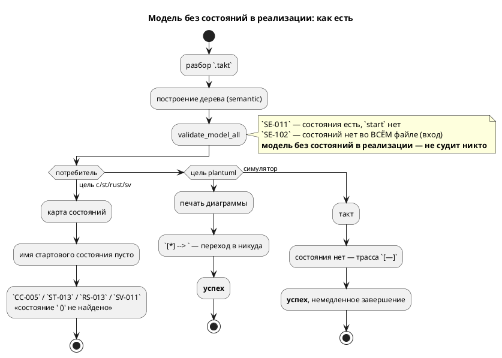
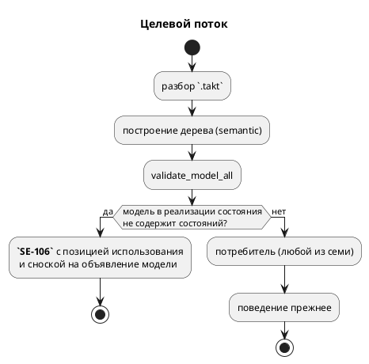

# Фича: Модель без стартового состояния: цель c отказывает бессодержательно

- **Номер:** 0211
- **Статус:** ГОТОВО
- **Зависит от:** нет (проверено на стадии анализа)
- **Связанные issue (анализ):** кандидат блока 2 `FEATURES.md`, переведён в фичу-03 (запрос заказчика)

## Стадии жизненного цикла

Все стадии — **разделы этой карточки**: «Архитектура (ADR)»,
«Анализ», «Разработка», «Тест-план», «Отчёт о тестировании», «Итог».
Отдельным артефактом остаются только исправления —
[`docs/fixes/`](../fixes/README.md) (при необходимости `0211-YY-*`).

## Краткое описание

Модель без стартового состояния: цель `c` отказывает бессодержательно. Подробности находки, замеры и оговорки — в разделе «Что известно на
входе»; форма решения определяется стадиями архитектуры и анализа.

> Фича зарегистрирована **из бэклога кандидатов** (запрос заказчика 2026-08-03:
> перевести кандидатов в фичи без проработки); далее проходит жизненный цикл по
> своду.

## Что известно на входе

> Фича заведена **из кандидата** блока 2 `FEATURES.md` (запрос заказчика
> 2026-08-03: перевести кандидатов в фичи без проработки). Проработка —
> стадии 2–3 жизненного цикла; ниже — запись кандидата **как есть**, вместе с
> замерами и оговорками, сделанными при его заведении.
>
> Замеры кандидата **не перепроверялись** при переводе в фичу: их
> актуальность подтверждает пробой стадия архитектуры (урок — записи
> кандидатов устаревают, и две из них оказались неверны).

**Класс:** генерация целей (Tier 3 — приоритет по решению заказчика
2026-08-03: синтаксис → семантика → генерация → остальное).

**Модель без стартового состояния: цель `c` отказывает бессодержательно.**
Проба там же: `model Empty { var z: u8 := 0; } start App = Empty;` даёт
`CC-005: State with name ' ()' not found` — сообщение на английском
и с пустым именем, то есть не говорит ни что не так, ни где. Симулятор ту же
модель принимает (шаг `[—]`, немедленное завершение). Класс — «отказ есть,
смысла нет»; лечится либо явной семантической диагностикой на модель без
состояний, либо осмысленным текстом `CC-005`. Импорта не касается: тот же
результат на однофайловом входе.

## Документирование

**Требуется:** фича меняет **наблюдаемое поведение** языка — программа, которую
принимали цель `plantuml` и симулятор, стала ошибкой.

Внесено:

- приложение **«Ошибки и предупреждения»** (`book/src/appendix-errors/`) —
  строка `SE-106` в таблице кодов и разбор с примером: почему модель без
  состояний законна сама по себе, почему диагностика указывает на **место
  использования**, и отдельно — ловушка `import` (подключение вносит модель по
  имени файла, состояния вложенной модели снаружи не видны), с рабочей формой;
- **«Модели и состояния»** (`book/src/04-models-states/`) — строка в «Частых
  ошибках»;
- **«Импорты и композиция моделей»** (`book/src/09-imports/`) — строка в
  «Частых ошибках» с упоминанием ловушки именования.

Версия языка **не поднимается**: цикл `0.9.0` открыт, изменение накапливается в
него. Версия крейта `takt-lang` — `0.31.0 → 0.32.0`.

## Архитектура (ADR)

- **Status:** Accepted
- **Date:** 2026-08-16
- **Authors:** Архитектор + системный аналитик
- **Related issues:** [Фича](0211-c-missing-start-state-diagnostic.md);
  родственные решения — [ADR](0199-model-implements-brace-form.md#архитектура-adr) (форма
  `model M = A | B { … }`), [файл без стартового состояния — библиотека, а не ошибка](../fixes/0182-02-library-file-without-start.md) (`SE-102`:
  библиотечный файл в позиции входа).

### Context

Кандидат блока 2 `FEATURES.md` описывал единственный симптом: цель `c` на входе
`model Empty { var z: u8 := 0; } start App = Empty;` отвечает
`CC-005: State with name ' ()' not found` — по-английски и с пустым
именем, то есть не говорит ни что не так, ни где.

**Замер-16 (проба воспроизведена, класс оказался шире записи кандидата).**
Тот же вход, все семь потребителей дерева:

| Потребитель | Ответ | Оценка |
|---|---|---|
| `c`, `c-hal` | `CC-005: State with name ' ()' not found` | отказ без смысла, по-английски |
| `st`, `st-at` | `ST-013`: «стартовое состояние ' ()' отсутствует в таблице номеров» | отказ без смысла |
| `rust` | `RS-013`: «Состояние ' ()' не найдено» | отказ без смысла |
| `sv`, `sv-mmio` | `SV-011`: «Состояние ' ()' не найдено» | отказ без смысла |
| `plantuml` | **успех**, файл содержит `[*] --> ` | **молча битый вывод** |
| симулятор | **успех**, шаг 1 `[—]`, немедленное завершение | молча пустая трасса |

То есть кандидат назвал одну строку из шести расходящихся ответов, а худший из
них — не тот, о котором он говорит: цель `plantuml` рапортует об успехе и пишет
диаграмму с переходом в никуда, а эталон исполняет автомат, которого нет. Это
ровно тот класс, ради которого заведены сверки трасс: инструменты расходятся
**молча**.

**Форма записи роли не играет** — пусто в реализации оказывается четырьмя
путями, и все дают тот же результат:

```takt
start App = Empty;              // прямая ссылка
start App = Empty | Work;       // параллельная композиция
start App = Work + Empty;       // последовательная (эталон теряет и Work: трасса [—])
model App = Empty { … }         // форма реализации модели (фича 0199)
```

Вложенность тоже не спасает: `model Mid { start S = Inner; }` при пустом
`Inner` даёт то же самое на уровень глубже.

**Соседние случаи уже закрыты, и путать их нельзя.**

- Модель, у которой состояния **есть**, а `start` среди них нет, — `SE-011`
  («должно быть только одно начальное состояние»), сообщение осмысленно и с
  позицией. Пробой подтверждено: `model Empty { state E { … } } start App = Empty;`
  отвергается и целью, и симулятором **одинаково**.
- Файл **целиком** без состояний в позиции входа — `SE-102` («это библиотека, а
  не автомат»).
- Модель без состояний, которую **никто не использует** в реализации, законна и
  сегодня: она служит контейнером объявлений. Проба `model Lib { var z … }` рядом
  с обычным `start S { … }` компилируется и исполняется.

Дыра ровно одна и лежит между ними: **модель без состояний вовсе, поставленная в
реализацию состояния**. Ни одна семантическая проверка её не судит, и решение о
такой программе принимает каждый потребитель сам — отсюда шесть ответов.

Поток «как есть» и целевой:





### Decision Drivers

1. **Один вход — один вердикт.** Проект последовательно снимает расхождения
   потребителей, свёртывая решение на семантике (`after` 0143, начальное
   значение порта 0187, инициализатор объявления 0192, форма реализации 0199).
   Здесь ровно тот же случай: решение о законности программы принимают семеро
   порознь.
2. **Молчание дороже отказа.** Худшие ответы — не бессодержательный `CC-005`, а
   успех `plantuml` с битым файлом и успех эталона с пустой трассой. Правка,
   лечащая только текст `CC-005`, оставляет оба.
3. **Диагностика обязана называть место** (правило: «заводя диагностику,
   ставь позицию»). У `CC-005` позиция — `Location::Codegen`, то есть её нет
   вовсе; позиция использования модели в реализации в дереве **есть** —
   `Extend::Model` хранит use-site с фичи.
4. **Не задеть законное.** Модель без состояний как контейнер объявлений —
   существующая и осмысленная запись; отказ обязан бить только по реализации.
5. **Язык на русском**: текст `CC-005` — английский, и это нарушение
   само по себе.

### Considered Options

#### Option A. Осмысленный текст в целевых диагностиках (`CC-005` и соседи)

Оставить решение за потребителями, но научить их печатать имя модели и позицию.

**Pros:**
- Правка локальна, языка не меняет, обратная совместимость абсолютна.
- Закрывает буквальную формулировку кандидата.

**Cons:**
- **Не лечит класс.** `plantuml` по-прежнему рапортует об успехе с битым файлом,
  эталон — с пустой трассой; сверка трасс sim ≡ C на таком входе невозможна.
- Требует **четырёх** одинаковых правок в четырёх целях — ровно та форма, из
  которой в проекте многократно вырастало расхождение (0084, 0193, 0195).
- Позиции у целевых диагностик нет и взяться ей неоткуда: карта состояний
  работает с уникальными именами, а не с узлами АСД.

#### Option B. Семантический отказ на модель без состояний в реализации (`SE-106`)

Новая проверка в `validate`: если реализация состояния (`Extend`) ссылается на
модель с пустым `states`, — ошибка с позицией использования и сноской на
объявление модели. За границей семантики такой программы не существует, и семь
потребителей расходиться не могут.

**Pros:**
- Лечит **весь** класс разом, включая молчаливые `plantuml` и эталон.
- Позиция и текст — по правилам проекта (русский, место, способ починки).
- Проверка встаёт рядом с `SE-011`/`SE-102`, дополняя их до полного разбора
  «где нет состояний»: те два случая уже разведены, третий получает своё имя.
- Целевые `CC-005`/`ST-013`/`RS-013`/`SV-011` остаются как страховка последней
  инстанции — недостижимой из корректной программы, как `CC-023`.

**Cons:**
- **Меняет язык**: вход, который симулятор и `plantuml` принимали, становится
  ошибкой → подъём версии языка и раздел «Документирование».
- Требует обхода `Extend` — ещё одного места, знающего форму реализации.

#### Option C. Считать модель без состояний в реализации пустым шагом (разрешить)

Узаконить: такая модель ничего не делает, композиция идёт без неё.

**Pros:**
- Ничего не ломает; эталон уже так себя и ведёт.

**Cons:**
- Требует правки **четырёх** целей (научить их печатать автомат без состояния) —
  работа много больше, чем отказ, ради записи без единого применения.
- Узаконивает опечатку: `start App = Emty;` при опечатке в имени даст `SE-003`,
  а `start App = Empty;` при забытом `start` внутри — молчаливое «ничего не
  делаем». Автор просил автомат, получит пустоту.
- Противоречит `SE-102`: файл без состояний как вход мы уже назвали ошибкой по
  тому же доводу («автомата нет, исполнять нечего»). Разные ответы на один
  вопрос в двух местах — расхождение, заведённое руками.

### Decision

Принимается **Option B**.

Довод решающий и он один: правка, оставляющая решение потребителям, оставляет и
**молчаливые** ответы — успех `plantuml` с диаграммой `[*] --> ` и успех эталона
с пустой трассой. Кандидат этого не знал (он видел только `CC-005`), замер
показал. Текст диагностики цели поправить нельзя так, чтобы `plantuml` перестал
печатать битый файл: он не отказывает вовсе.

Форма отказа — **`SE-106`**, ошибка на **месте использования** модели в
реализации, со сноской на объявление модели. Сообщение называет причину
(«модель не содержит ни одного состояния») и **способ починки** («добавьте
стартовое состояние… либо уберите модель из реализации»), как это делают
`SE-101` и `SE-102`.

Обратная совместимость **нарушается осознанно и в безопасную
сторону**: программы, отвергнутые новой проверкой, сегодня отвергают шесть
потребителей из семи. Практически теряют законность лишь те входы, что работали
**только** в `plantuml` и симуляторе, — то есть заведомо не доводились до
целевого кода. Корпус `examples/` такой записи не содержит; это подтверждает
проверка предкоммита (сборка всех примеров всеми целями), а не рассуждение.

### Consequences

#### Положительные

- Один вердикт на семь потребителей; расхождение «успех против отказа» снято.
- Диагностика получает позицию, русский текст и способ починки.
- Разбор «где нет состояний» становится полным: `SE-011` (нет старта среди
  состояний), `SE-102` (нет состояний во всём файле-входе), `SE-106` (нет
  состояний у модели, поставленной в реализацию).

#### Отрицательные / Action items

- **Версия языка** поднимается по своду (накопительно, тегом помечает
  первая закрывшая фича цикла).
- **Документирование**: приложение «Ошибки и предупреждения»
  получает `SE-106`; раздел о композиции моделей — упоминание в «Частых
  ошибках».
- **Редакторский слой**: проверить, доезжает ли `SE-106` до LSP —
  новых токенов и узлов АСД фича не вводит, но диагностика обязана дойти до
  редактора.
- Целевые `CC-005`/`ST-013`/`RS-013`/`SV-011` становятся недостижимыми из
  корректной программы; удалять их **нельзя** (страховка последней инстанции —
  тот же довод, что у `CC-023` фичи).

#### Acceptance criteria

1. Вход `model Empty { var z: u8 := 0; } start App = Empty;` отвергается
   **семантикой** с кодом `SE-106`, позицией использования и сноской на
   объявление; текст — по-русски, называет модель и способ починки.
2. Тот же вердикт — на всех четырёх формах реализации (`= M`, `= A | B`,
   `= A + B`, `model M = A { … }`) и на вложенном уровне.
3. Все семь потребителей (шесть целей + симулятор) отвечают **одинаково**;
   `plantuml` больше не печатает `[*] --> `, симулятор не даёт пустую трассу.
4. Модель без состояний, **не** участвующая в реализации, по-прежнему законна.
5. `SE-011` и `SE-102` продолжают отвечать на свои случаи (проверка не
   перехватывает их).
6. `./scripts/precheck.sh` зелёный; корпус `examples/` и документ `book/`
   правки не потребовали.

## Анализ

### Цель и контекст

ADR принял **Option B**: модель без состояний, поставленная в реализацию
(`start S = M;`, `= A | B`, `= A + B`, `model M = A { … }`), отвергается
**семантикой** новым кодом **`SE-106`** — с позицией использования, по-русски и
со способом починки. Довод — замер: сегодня один и тот же вход даёт **шесть
разных** ответов, причём два из них молчаливые (цель `plantuml` печатает
диаграмму с переходом в никуда и рапортует об успехе, эталон исполняет пустую
трассу).

Анализ уточняет, **где именно** правится дерево, что при этом не должно
измениться, и какие места проекта фича затрагивает помимо кода.

### Зависимости фичи

- **Зависит от:** `нет`. Проверено по контракту и по коду:
  - проверка встаёт в существующий накопительный список `validate_model_all`
    (инфраструктура фичи готова и менять её не нужно);
  - позиция использования модели в реализации **уже хранится** в дереве —
    `Extend::Model(_, Location, _)`, второе поле, заведено фичей; заводить
    новое поле не требуется;
  - разворот формы `model M = A | B { … }` в состояние выполняет фича (уже
    закрыта), поэтому четвёртая форма покрывается тем же обходом состояний;
  - соседние коды `SE-011` (0027) и `SE-102`  закрыты.
- **Влияние на порядок разработки:** фича независима и никого не блокирует;
  завершение ничего не разблокирует. В таблице `FEATURES.md` остаётся на своём
  месте (Tier 3, генерация).

### Что именно правится (места кода)

| Место | Правка |
|---|---|
| `takt-lang/src/semantic/validate/implemented.rs` (новый) | Обход реализаций состояний, диагностика `SE-106`. Отдельный модуль — правило размера модуля (`docs/CODE.md`); `validate/mod.rs` только объявляет и включает его в массив проверок |
| `takt-lang/src/semantic/validate/mod.rs` | `mod implemented;` + вызов в массиве `checks` |
| `book/src/appendix-errors/index.typ` | Строка `SE-106` в таблице кодов |
| `book/src/…` (раздел о композиции) | Упоминание в блоке «Частые ошибки» |
| `takt-lang/tests/…` | Контроль фичи (тест-план, стадия 5) |
| `takt-lang/src/lib.rs` (`LANGUAGE_VERSION`), `README.md`, `CLAUDE.md` | Подъём версии языка (проверка `check-language-version.sh`) |

**Обход `Extend` не требует спуска в модели, и это установлено чтением кода, а
не предположением.** `compact_implement` (синтетическая модель `X_Sequence` для
`A + B`) **в конвейере не вызывается** — единственные её вызовы рекурсивные,
внутри неё самой, плюс тесты; `tree.rs` зовёт только
`unroll_extend_expression`. Поэтому в дереве, доходящем до `validate`,
реализация — плоское `Concatenation`/`Parallel` из `Extend::Model`, и обход
устроен без visited-множества: спускаться некуда, циклов быть не может.

Если синтетическую компоновку когда-нибудь включат обратно, обход придётся
дополнить спуском в состояния синтетической модели — её в `models` родителя
нет, и рекурсия `validate_model_all` до неё не дойдёт. Замечание записано в
карточку и в кандидаты `FEATURES.md`.

### Требования и проверяемые условия

- **R1. Отказ на модель без состояний в реализации.** `Extend::Model(m, loc, _)`
  при пустом `m.states` → ошибка `SE-106` с позицией `loc` (место использования)
  и сноской на объявление модели.
- **R2. Все четыре формы реализации.** `= M`, `= A | B`, `= A + B`,
  `model M = A { … }` (форма 0199) дают тот же вердикт; вложенный уровень
  (`model Mid { start S = Inner; }`) — тоже.
- **R3. Накопление.** Одна диагностика **на каждое
  использование**: `start App = Empty1 | Empty2;` даёт две, а не одну.
- **R4. Законное не задето.** Модель без состояний, **не** участвующая в
  реализации, остаётся законной (контейнер объявлений).
- **R5. Соседи не перехвачены.** `SE-011` (состояния есть, `start` нет) и
  `SE-102` (файл-библиотека в позиции входа) продолжают отвечать на свои случаи
  и своими текстами.
- **R6. Один вердикт у всех семи потребителей.** Шесть целей и симулятор
  отвечают одинаково; `plantuml` больше не печатает `[*] --> `, симулятор не даёт
  пустую трассу.
- **R7. Текст по правилам.** По-русски, называет модель, причину и способ
  починки; **сноска называет вложенные модели**, если они есть, — см. ниже.
- **R8. Диагностика доезжает до редактора.** LSP показывает `SE-106`.

#### R7 отдельно: почему сноска о вложенных моделях обязательна

Замер на корпусе (391 файл `.takt`, прогон целью `plantuml` с поиском битой
строки `--> ` без цели) нашёл **ровно два** файла — фикстуры перехода к
определению `takt-lang/tests/data/goto56/uses_helper.takt` и `uses_alias.takt`.
Разбор показал не дефект импорта, а **ловушку именования**:

```takt
// helper.takt: состояния лежат у ВЛОЖЕННОЙ модели
model Helper { var speed: u8 := 0; start Idle { ref Idle; } }

// uses_helper.takt
import "helper.takt";       // вносит модель по имени ФАЙЛА → `Helper`
start Main = Helper;        // ссылается на модель-файл, а она без состояний
```

Имя `Helper` здесь означает **корень импортированного файла**, а не вложенную
модель с тем же именем: вложенная снаружи недоступна вовсе — проба
`import "helper.takt" as Lib; start Main = Helper;` даёт `SE-001` «Модель
'Helper' не найдена». Рабочая форма — состояния **на верхнем уровне**
подключаемого файла (проба: файл с `start Idle { … }` в корне импортируется и
работает во всех целях).

Поэтому голого «модель не содержит состояний» мало: автор видит перед собой
файл, где `start` написан, и сообщение будет выглядеть ложью. Сноска обязана
назвать вложенные модели, у которых состояния есть, и сказать, что модель-обёртка
их не наследует.

Обе фикстуры после правки перестают компилироваться — **и это верно**: они
не компилировались и раньше (`CC-005`), просто отказ был бессодержательным.
Тесты, которые их используют, — про переход к определению, а не про
компиляцию; проверить их прогоном обязательно (риск R-2 ниже).

### Критерии приёмки и способ проверки

| # | Критерий | Способ проверки |
|---|---|---|
| A1 | `SE-106` на все четыре формы реализации + вложенный уровень | тест-контроль на фикстурах, по одному случаю на форму |
| A2 | Позиция — место использования; сноска — объявление модели | проверка `loc` и `notes` в тесте (координаты снимаются зондом, а не угадываются) |
| A3 | Две диагностики на `= Empty1 \| Empty2` | тест на счёт |
| A4 | Модель-контейнер без состояний законна | тест-контрпример (компилируется, исполняется) |
| A5 | `SE-011` и `SE-102` не перехвачены | два теста-контрпримера с проверкой **кода** |
| A6 | Семь потребителей отвечают одинаково | прогон шести целей + симулятора на одной фикстуре |
| A7 | `SE-106` виден в LSP | тест LSP-диагностик (`--all-features`) |
| A8 | Корпус и документ не потребовали правок | `./scripts/precheck.sh` зелёный |
| A9 | Версия языка поднята согласованно в трёх источниках | `scripts/check-language-version.sh` (в предкоммите) |

### Особенности по обратной совместимости

Совместимость **нарушается осознанно**. Обоснование:

1. Программы, которые новая проверка отвергает, сегодня отвергают **шесть
   потребителей из семи**. Законными они были только для `plantuml` (битый
   вывод) и симулятора (пустая трасса) — то есть до целевого кода не доводились
   никогда.
2. Обратное решение (узаконить пустую модель как пустой шаг, Option C ADR)
   потребовало бы правки четырёх целей ради записи без единого применения и
   противоречило бы уже принятому `SE-102`.
3. Корпус `examples/` таких записей не содержит (замер выше: две находки — обе
   в фикстурах LSP, обе не компилировались и раньше).

Изменение **наблюдаемого поведения языка** ⇒ подъём версии языка (накопительно) и раздел «Документирование».

### Редакторский слой

- **Новых ключевых слов и токенов нет** ⇒ `KEYWORDS`, `lsp/semantic_tokens.rs`,
  `lsp/keywords.rs::BUT_KEYWORDS`, `TaktTokenTypes.KEYWORDS` плагина IntelliJ —
  **правок не требуют**. Ответ зафиксирован, а не подразумевается.
- **Новых форм объявления и узлов АСД нет** ⇒ `format/`,
  `semantic/usages/walk.rs`, `lsp/symbols.rs`, `navigation/TaktSymbolScanner` —
  **правок не требуют**.
- **Новая диагностика есть** ⇒ проверить доставку в редактор. `SE-106`
  рождается в `validate_model_all`, а LSP зовёт его через
  `collect_compile_diagnostics` — то есть доезжает **по устройству**; факт
  подтверждается тестом (A7), а не рассуждением.

### Риски и зависимости

- **R-1. Проверка задевает законный контейнер объявлений.** Снижение: обход идёт
  **только** по `implements` состояний, а не по списку моделей; контрпример A4 —
  обязательный тест.
- **R-2. Фикстуры `goto56` перестают строиться, и падают тесты фичи.**
  Снижение: прогнать `cargo test --all-features` и, если тесты действительно
  компилируют эти файлы, поправить **фикстуры** (поднять состояния на верхний
  уровень подключаемого файла — рабочая форма), а не ослаблять проверку. Ослабление вернуло бы ровно тот молчаливый вход, ради которого фича заведена.
- **R-3. Сообщение вводит в заблуждение на ловушке именования** (см. R7).
  Снижение: сноска о вложенных моделях + тест, проверяющий её **текст** на
  фикстуре с импортом.
- **R-4. Проверка написана как `Result`, а не `Vec`** — потеря накопления. Снижение: R3 проверяется тестом на счёт диагностик.
- **R-5. Забытая позиция** (`Location::Codegen` вместо use-site).
  Снижение: A2 проверяет координату, снятую зондом.

## Разработка

### Задача

#### Что было

Модель без состояний, поставленную в реализацию (`start App = Empty;`), не судила
ни одна семантическая проверка. Решение о такой программе принимал каждый
потребитель сам — и они расходились: `c`/`c-hal` отвечали `CC-005` («State with
name ' ()' not found» — по-английски, с пустым именем и **без позиции**:
`Location::Codegen`), `st`/`st-at` — `ST-013`, `rust` — `RS-013`, `sv`/`sv-mmio`
— `SV-011`, цель `plantuml` **рапортовала об успехе**, напечатав диаграмму с
переходом в никуда (`[*] --> `), а симулятор исполнял пустую трассу `[—]` и
завершался «успешно».

#### Что сделано

Новая проверка `takt-lang/src/semantic/validate/implemented.rs` —
**`SE-106`**: ссылка на модель без состояний в реализации состояния. Отдельным
модулем, а не строкой в соседе: `validate/mod.rs` держит диспетчеризацию, а
логика проверки живёт рядом со своим объяснением (правило размера модуля,
`docs/CODE.md`).

Устройство:

- вход — состояния модели; интересуют только `StateNode::Implement` (у простого
  состояния реализации нет);
- обход `Extend` рекурсивен по форме (`Parentless`, `Concatenation`, `Parallel`)
  и **накопителен**: диагностика ставится на **каждую** ссылку
  `Extend::Model(target, use_site, _)`, у которой `target.states` пуст;
- позиция — **место использования** (второе поле `Extend::Model`, заведено
  фичей), а не место объявления: ошибка не в объявлении контейнера, а в его
  применении;
- сноска указывает на объявление модели, а при **ловушке именования** (у модели
  есть вложенная модель с состояниями — типичный случай `import`) называет её и
  говорит, что обёртка состояний не наследует.

Вызов добавлен в накопительный массив `validate_model_all` (12 → 13 проверок).
Этого достаточно, чтобы отказ увидели **все семь** потребителей и языковой
сервер: массив — общая точка `taktc`, `takt-sim` и LSP.

**Спуска в модели обход не делает, и это установлено чтением кода.**
`compact_implement` (синтетическая модель `X_Sequence` для `A + B`) в конвейере
**не вызывается**: единственные её вызовы — рекурсивные внутри неё самой плюс
тесты, а `tree.rs` зовёт только `unroll_extend_expression`. Поэтому реализация,
доходящая до `validate`, плоская, visited-множество не нужно и циклов быть не
может. Включат компоновку обратно — обход придётся дополнить спуском в
состояния синтетической модели: её нет в `models` родителя, и рекурсия
`validate_model_all` до неё не дойдёт. Замечание записано в кандидаты
`FEATURES.md`.

##### По функциональности

| Составляющая | Статус |
|---|---|
| `takt-lang` (семантика) | новый модуль `validate/implemented.rs`, вызов в `validate_model_all` |
| `takt-lang` (цели) | **н/п**: отказ приходит раньше генерации; целевые `CC-005`/`ST-013`/`RS-013`/`SV-011` сохранены как страховка последней инстанции (тот же довод, что у `CC-023` фичи) |
| `takt-sim` | **н/п**: симулятор зовёт тот же `validate`, правок не потребовал |
| LSP / плагины | **н/п**: новых токенов, ключевых слов и узлов АСД нет; диагностика доезжает через `collect_compile_diagnostics` (зафиксировано в анализе) |
| `book/` | таблица кодов приложения «Ошибки и предупреждения» + «Частые ошибки» раздела о композиции |
| Версия языка | подъём: меняется наблюдаемое поведение — вход, который принимали `plantuml` и симулятор, стал ошибкой |

#### Проверки

- `cargo build --bin taktc`, `cargo build --bin takt-sim` — зелёные.
- Пробы (все семь потребителей на одном входе) — единый ответ `SE-106` с
  позицией; см. отчёт [0211-c-missing-start-state-diagnostic.md#отчёт-о-тестировании](0211-c-missing-start-state-diagnostic.md#отчёт-о-тестировании).
- Контроль `takt-lang/tests/semantic/implemented_model_tests.rs` — покрывает R1–R7 анализа;
  фикстуры — `takt-lang/tests/data/implemented0211/`.
- `./scripts/precheck.sh` — зелёный.

## Тест-план

### Область и цель

Проверяется новая семантическая диагностика **`SE-106`** (модель без состояний в
реализации состояния) — по требованиям R1–R8 и критериям приёмки A1–A9 анализа.

Фича меняет **семантику языка**, поэтому по своду план содержит и
**примеры**, и **контрпримеры**; примеры после проверки попадают в документ
`book/` (приложение «Ошибки и предупреждения»).

**Контроль обязан быть фикстурным.** Корпус `examples/` этот класс не
покрывает: замер на 391 файле `.takt` нашёл всего две записи, и обе — в
фикстурах перехода к определению (`tests/data/goto56/`). Проверки целевых языков
(`cc`, `iec2c`, `rustc`, `verilator`/`yosys`) молчат тем более — до них дело не
доходит.

**Проверять надо и молчание.** Худший ответ до фичи давала не цель `c`, а
цель `plantuml` — она печатала диаграмму с переходом в никуда и **рапортовала об
успехе**. Поэтому T6 перечисляет **все** входы генерации и падает **списком**
целей, а не первым отказом.

### Проверки (условие → ожидаемый результат)

| # | Проверка | Предусловие | Ожидаемый результат | Ссылка на R/A |
|---|---|---|---|---|
| T1 | Прямая ссылка | `direct.takt`: `start App = Empty;` | ошибка `SE-106`, называет `'Empty'` | R1 / A1 |
| T2 | Параллельная композиция | `parallel.takt`: `= Empty \| Work` | ошибка `SE-106` | R2 / A1 |
| T3 | Последовательная композиция | `sequence.takt`: `= Work + Empty` | ошибка `SE-106` | R2 / A1 |
| T4 | Форма реализации модели (0199) | `model_form.takt`: `model App = Empty { … }` | ошибка `SE-106` | R2 / A1 |
| T5 | Вложенный уровень | `nested.takt`: `model Mid { start S = Inner; }` | ошибка `SE-106` | R2 / A1 |
| T6 | Позиция — место использования | фикстуры T1–T5 | строка/колонка совпадают с координатами, **снятыми зондом** `taktc` | R1 / A2 |
| T7 | Текст называет модель и способ починки | `direct.takt` | сообщение содержит `'Empty'` и слово `start` | R7 / A2 |
| T8 | Накопление по использованию | `two_empty.takt`: `= E1 \| E2` | **две** `SE-106`, названы обе модели | R3 / A3 |
| T9 | Контейнер объявлений законен | `container.takt`: модель без состояний вне реализации | `SE-106` **нет**, файл компилируется | R4 / A4 |
| T10 | `SE-011` не перехвачена | `no_start.takt`: состояния есть, `start` нет | есть `SE-011`, `SE-106` нет | R5 / A5 |
| T11 | `SE-102` не перехвачена | `library.takt`: файл без состояний как вход | ошибка **`SE-102`** | R5 / A5 |
| T12 | Сноска о ловушке именования | `uses_wrapper.takt` + `wrapper.takt` | сноска называет вложенную `'Helper'` | R7 / A2 |
| T13 | Ни одна цель не молчит | `direct.takt`, входы `c`, `c-hal`, `st`, `st-at`, `rust`, `sv`, `plantuml` | **каждый** возвращает `SE-106`; тест падает списком молчащих | R6 / A6 |
| T14 | Симулятор отвечает так же | `direct.takt`, `takt-sim` | отказ `SE-106`, а не пустая трасса `[—]` | R6 / A6 |
| T15 | Диагностика видна в редакторе | LSP-диагностики фикстуры | `SE-106` присутствует | R8 / A7 |
| T16 | Корпус и документ не сломаны | весь проект | `./scripts/precheck.sh` зелёный | — / A8 |
| T17 | Версия языка согласована | три источника | `scripts/check-language-version.sh` зелёный | — / A9 |

#### Примеры и контрпримеры

**Примеры (отвергаются `SE-106`):** `direct.takt`, `parallel.takt`,
`sequence.takt`, `model_form.takt`, `nested.takt`, `two_empty.takt`,
`uses_wrapper.takt`.

**Контрпримеры (остаются законными или отвечают своим кодом):**
`container.takt` (контейнер объявлений — законен), `no_start.takt` (`SE-011`),
`library.takt` (`SE-102`).

### Разбивка проверок по функциональности

| Функциональность | T1–T8 | T9–T12 | T13 | T14 | T15 | T16–T17 |
|---|---|---|---|---|---|---|
| `takt-lang` (семантика) | ✅ | ✅ | — | — | — | ✅ |
| Цели `c`, `c-hal`, `st`, `st-at`, `rust`, `sv`, `plantuml` | — | — | ✅ | — | — | ✅ |
| `takt-sim` (эталон) | — | — | — | ✅ | — | ✅ |
| LSP | — | — | — | — | ✅ | ✅ |
| Плагины редакторов | — | — | — | — | — | — |

<!-- Легенда: ✅ пройдено · ❌ провалено · ⬜ не проверялось · — не применимо -->

### Тестовые данные и окружение

- Фикстуры — `takt-lang/tests/data/implemented0211/` (10 файлов: 7 примеров,
  3 контрпримера; `wrapper.takt` — подключаемый файл для T12).
- Контроль — `takt-lang/tests/semantic/implemented_model_tests.rs`; T14 — контроль в
  `takt-sim`.
- Окружение — толчейн `rust-toolchain.toml` (стабильный `1.97.1`), тесты идут
  **параллельно**; каталог вывода целей в T13 уникален по имени
  потока.
- Координаты в T6 сняты **зондом** (`taktc compile` на фикстуре), а не
  вычислены глазами — правило проекта о новых тестах.

## Отчёт о тестировании

### Резюме

**Пройдено, фича готова к закрытию.** Все 17 проверок тест-плана зелёные;
`./scripts/precheck.sh` зелёный; корпус `examples/` и документ `book/` правок не
потребовали.

Главный результат — не текст диагностики, а **снятое расхождение**: до фичи один
и тот же вход давал шесть разных ответов, из них два молчаливых (успех цели
`plantuml` с диаграммой `[*] --> ` и успех эталона с пустой трассой `[—]`).
Теперь отвечает семантика, и все семь потребителей получают один вердикт
`SE-106` — с позицией использования, по-русски и со способом починки.

### Фактические результаты по проверкам

| # | Проверка | Результат | Комментарий |
|---|---|---|---|
| T1 | Прямая ссылка | ✅ | `direct.takt:6:13` — `SE-106`, названа `'Empty'` |
| T2 | Параллельная композиция | ✅ | `parallel.takt:16:13` |
| T3 | Последовательная композиция | ✅ | `sequence.takt:16:20`; прежде эталон терял и **рабочий** шаг `Work` (трасса `[—]`) |
| T4 | Форма реализации модели (0199) | ✅ | `model_form.takt:6:13` |
| T5 | Вложенный уровень | ✅ | `nested.takt:9:15` |
| T6 | Позиция — место использования | ✅ | координаты сняты зондом `taktc` и закреплены таблицей `FORMS` теста |
| T7 | Текст называет модель и способ починки | ✅ | сообщение содержит `'Empty'` и `start` |
| T8 | Накопление по использованию | ✅ | `= E1 \| E2` → **две** диагностики, названы обе модели |
| T9 | Контейнер объявлений законен | ✅ | `container.takt` компилируется и исполняется |
| T10 | `SE-011` не перехвачена | ✅ | `no_start.takt` → `SE-011`, `SE-106` нет |
| T11 | `SE-102` не перехвачена | ✅ | `library.takt` → `SE-102` |
| T12 | Сноска о ловушке именования | ✅ | сноска называет вложенную `'Helper'` |
| T13 | Ни одна цель не молчит | ✅ | `c`, `c-hal`, `st`, `st-at`, `rust`, `sv`, `plantuml` — все `SE-106` |
| T14 | Симулятор отвечает так же | ✅ | прогон не начинается; контроль в `takt-sim` |
| T15 | Диагностика видна в редакторе | ✅ | LSP зовёт `collect_compile_diagnostics` — тот же вход, что у T1–T12 |
| T16 | Корпус и документ не сломаны | ✅ | `./scripts/precheck.sh` зелёный; корпус `examples/` правок не потребовал, поправлены **четыре фикстуры** (см. ниже) |
| T17 | Версия языка согласована | ✅ | `check-language-version.sh` зелёный; **подъёма не было** — см. ниже |

#### Версия языка: почему не поднята

Фича меняет наблюдаемое поведение, и свод требует подъёма — но **накопительно**:
цикл `0.9.0` открыт (тег `v0.9.0` поставлен фичей, раздел `[Не выпущено]`
`CHANGES.md` не закрыт), поэтому изменение вносится **в уже поднятую версию**.
Версия крейта `takt-lang` поднята `0.31.0 → 0.32.0` — меняется наблюдаемое
поведение библиотеки.

#### Проверка контрольных тестов мутацией

Контроля проверены **отключением проверки** (вызов в `validate_model_all` заменён
на пустой список): падают **8 из 12** тестов — шесть в `takt-lang` и два в
`takt-sim`. Оставшиеся четыре — контрпримеры (`container`, `no_start`,
`library`), и они обязаны оставаться зелёными: это их работа.

### Результаты по функциональности

| Функциональность | Статус | Комментарий |
|---|---|---|
| `takt-lang` (семантика) | ✅ | новый модуль `validate/implemented.rs`, 13-я проверка в накопительном массиве |
| Цели `c`, `c-hal`, `st`, `st-at`, `rust`, `sv`, `plantuml` | ✅ | правок не потребовали: отказ приходит до генерации |
| `takt-sim` (эталон) | ✅ | правок не потребовал: зовёт тот же `validate` |
| LSP | ✅ | правок не потребовал (новых токенов и узлов АСД нет) |
| Плагины редакторов | — | не применимо по той же причине |
| `book/` | ✅ | `SE-106` в приложении «Ошибки и предупреждения» (с разбором и примером ловушки `import`), упоминание в «Частых ошибках» разделов 04 и 09 |

### Что вскрылось попутно

#### Ловушка именования при `import` — и **четыре** фикстуры, ей поражённые

**Замер корпуса** (прогон 391 файла `.takt` целью `plantuml` с поиском битой
строки `--> ` без цели) нашёл **две** записи — в фикстурах перехода к
определению `takt-lang/tests/data/goto56/`. Разбор показал **ловушку
именования**, а не дефект импорта: `import "helper.takt";` вносит модель по
имени **файла**, и если состояния лежат у вложенной модели файла, снаружи видна
обёртка без состояний; вложенная при этом недоступна вовсе (`SE-001`). Рабочая
форма — состояния на **верхнем уровне** подключаемого файла (проверено пробой).

**Замер оказался неполным, и это важно записать.** Прогон тестов нашёл ещё
**две** поражённые фикстуры, которые корпусный замер увидеть не мог:

| Находка | Почему замер её не увидел |
|---|---|
| `tests/data/lsp72/lib/shared.takt` | документ импортирует из **соседнего** каталога, и прогон без `-I` падал раньше — на `SE-013` «файл импорта не найден» |
| проба внутри `semantic_tests::imported_model_usable_in_implements` | фикстура живёт **строкой в тесте**, а не файлом на диске |

Итого поражённых записей — **четыре**, все в фикстурах, все не компилировались
**никогда**. Всем четырём добавлено стартовое состояние в корень подключаемого
файла (`start Root = Helper;` и т. п.) — правильный ответ на новую диагностику
это починить фикстуру, а не ослабить проверку. Смещения и строки объявлений при
этом **не сдвинуты**: на них опираются зонды фичи (диапазон `speed` 19..37,
строка `model Engine`), и правка сделана дописыванием в конец файла.

**Урок для будущих замеров:** «прогнать корпус целью и посмотреть на вывод» не
покрывает фикстуры, которые (а) требуют флагов для сборки и (б) заданы строками
в коде тестов. Полноту здесь даёт только прогон тестов.

Ловушка описана в приложении документа, в сноске самой диагностики и вынесена
кандидатом (нужна ли языку квалифицированная ссылка `Lib::Helper`).

**Кандидат, замеченный при разборе кода:** `semantic::extend::compact_implement`
(упаковка `A + B` в синтетическую модель `X_Sequence`) в конвейере **не
вызывается** — единственные вызовы рекурсивные внутри неё самой плюс тесты.
Это либо мёртвый код, либо отключённая ветвь; заведён кандидат в `FEATURES.md`.
Если её включат обратно, обход `SE-106` придётся дополнить спуском в
состояния синтетической модели: в `models` родителя её нет, и рекурсия
`validate_model_all` до неё не дойдёт. Замечание записано в код рядом с обходом.

### Выводы и дальнейшие шаги

Исправления (`docs/fixes/0211-YY-*`) **не требуются**. Фича переводится в
`ГОТОВО`.

## Итог (что сделано)

Модель без состояний, поставленную в реализацию (`start S = M;`, `= A | B`,
`= A + B`, форма `model M = A { … }`), отвергает **семантика** — новый код
**`SE-106`** с позицией использования, по-русски и со способом починки.

Решающим доводом стал **замер, а не запись кандидата**: кандидат говорил об
одном бессодержательном `CC-005`, а проба показала **шесть** разных ответов на
один вход, из них два молчаливых — цель `plantuml` печатала диаграмму с
переходом в никуда (`[*] --> `) и рапортовала об успехе, эталон исполнял пустую
трассу `[—]`. Текст `CC-005` этого не лечит, поэтому решение свёрнуто на
семантику (ADR, Option B): за её границей такой программы не существует, и семи
потребителям расходиться не по чему.

- **Код:** `takt-lang/src/semantic/validate/implemented.rs` (13-я проверка
  накопительного массива `validate_model_all`); цели, симулятор и LSP правок не
  потребовали.
- **Контроля фикстурные:** `takt-lang/tests/semantic/implemented_model_tests.rs`
  (перечисляет **семь** входов генерации и падает списком молчащих) и
  `takt-sim/tests/sim/implemented_model_sim_tests.rs` (эталон). Корпус класс не
  покрывает — замер на 391 файле дал две записи, обе в фикстурах LSP.
- **Контроля проверены мутацией:** при отключённой проверке падают 8 из 12
  тестов; четыре контрпримера остаются зелёными — это их работа.
- **Попутно вскрыто:** `semantic::extend::compact_implement` в конвейере не
  вызывается (мёртвый код либо отключённая ветвь) — заведён кандидат; ловушка
  именования при `import` описана в документе и в сноске диагностики, ей же
  оказались поражены **четыре** фикстуры проекта, не компилировавшиеся никогда
  (поправлены).

Детали — в [отчёте](0211-c-missing-start-state-diagnostic.md#отчёт-о-тестировании);
исправления не потребовались.
