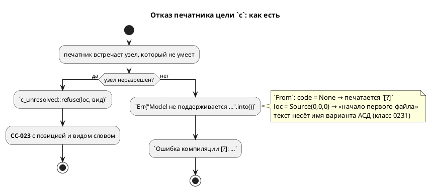
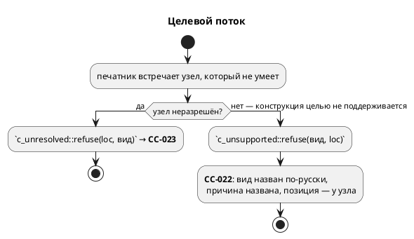

# Фича: Диагностика цели c без кода

- **Номер:** 0212
- **Статус:** ГОТОВО
- **Зависит от:** нет (проверено на стадии анализа)
- **Связанные issue (анализ):** кандидат блока 2 `FEATURES.md`, переведён в фичу-03 (запрос заказчика)

## Стадии жизненного цикла

Все стадии — **разделы этой карточки**: «Архитектура (ADR)»,
«Анализ», «Разработка», «Тест-план», «Отчёт о тестировании», «Итог».
Отдельным артефактом остаются только исправления —
[`docs/fixes/`](../fixes/README.md) (при необходимости `0212-YY-*`).

## Краткое описание

Диагностика цели `c` без кода: `Ошибка компиляции [?]`. Подробности находки, замеры и оговорки — в разделе «Что известно на
входе»; форма решения определяется стадиями архитектуры и анализа.

> Фича зарегистрирована **из бэклога кандидатов** (запрос заказчика 2026-08-03:
> перевести кандидатов в фичи без проработки); далее проходит жизненный цикл по
> своду.

## Что известно на входе

> Фича заведена **из кандидата** блока 2 `FEATURES.md` (запрос заказчика
> 2026-08-03: перевести кандидатов в фичи без проработки). Проработка —
> стадии 2–3 жизненного цикла; ниже — запись кандидата **как есть**, вместе с
> замерами и оговорками, сделанными при его заведении.
>
> Замеры кандидата **не перепроверялись** при переводе в фичу: их
> актуальность подтверждает пробой стадия архитектуры (урок — записи
> кандидатов устаревают, и две из них оказались неверны).

**Класс:** генерация целей (Tier 3 — приоритет по решению заказчика
2026-08-03: синтаксис → семантика → генерация → остальное).

**Диагностика цели `c` без кода: `Ошибка компиляции [?]`.** Замер при
перепроверке кандидатов 2026-08-02. Вход `lvl := Ctl.ctrl;`
(квалифицированный доступ к переменной под-модели) даёт
`Ошибка компиляции [?]: Model не поддерживается как выражение в C генераторе`
— текст на месте, **кода нет**, и сообщение к тому же наполовину английское. Записано взамен снятой находки «цель `c` Молча теряет
оператор» (вскрыта при 0182): молчания больше нет — цель отказывает, и это,
по-видимому, следствие [анонимные порты](0189-anonymous-ports.md), где
устранено глотание `Err(_) => {}` при печати оператора. Остался вопрос
**объёма**: поддержать доступ к переменной под-модели (эталон отвечает
`SIM-014` «модель как выражение не поддерживается») или узаконить отказ
нормальной диагностикой с кодом. Смежно с проверкой `check-diagnostic-codes.sh`
— стоит проверить, почему он такую форму пропускает.

## Документирование

**Требуется частично:** язык фича **не меняет** (набор принимаемых программ
прежний), но меняет **диагностики**, а они по своду в объём документа
входят.

Внесено в приложение «Ошибки и предупреждения»
(`book/src/appendix-errors/`): строка `CC-022` в сводной таблице, уточнённая
строка `CC-023` и разбор `CC-022` с двумя примерами (модель в выражении, срез
массива) и указанием, чем `CC-022` отличается от `CC-023` — по первому автор
правит модель, по второму сообщает об ошибке компилятора.

Языковые разделы правок не потребовали: конструкций не прибавилось.

## Архитектура (ADR)

- **Status:** Accepted
- **Date:** 2026-08-17
- **Authors:** Архитектор + системный аналитик
- **Related issues:** [Фича](0212-c-diagnostic-without-code.md);
  образцы решения — [ADR](0236-c-unresolved-condition-refusal.md#архитектура-adr)
  (воронка `CC-023`), [ADR](0229-format-unsupported-position.md#архитектура-adr)
  (`FM-001`: один код, вид узла назван словом, позиция у узла),
  [ADR](0231-diagnostic-text-no-debug.md#архитектура-adr) (в тексте диагностики нет
  внутреннего представления).

### Context

Кандидат описывал одну строку: вход `lvl := Ctl.ctrl;` даёт
`Ошибка компиляции [?]: Model не поддерживается как выражение в C генераторе` —
кода нет, текст наполовину английский.

**Замер-17 (проба воспроизведена, картина шире записи).**

Два входа, достижимых из корректного текста, и все потребители:

| Вход | `c`, `c-hal` | `st` | `rust` | `sv` | эталон |
|---|---|---|---|---|---|
| `lvl := Ctl.ctrl;` | **`[?]`** «Model не поддерживается как выражение в C генераторе» | `ST-011` «модель как выражение» | `RS-011` «модель в позиции выражения» | `SV-002` | `SIM-014` в такте |
| `res := mem[1:2];` | **`[?]`** «ArraySlice не поддерживается в C генераторе» | `ST-011` «…в IEC 61131-3 нет операции среза» | `RS-011` «…в no_std нет alloc» | `SV-002` | `SIM-010` |

Отказывают **все**, и это правильно. Расходится **качество ответа**: у трёх
целей и у эталона есть код, а формулировка объясняет **причину** («в IEC
61131-3 нет операции среза»); цель `c` отвечает без кода и печатает **имя
варианта перечисления Rust** — `Model`, `ArraySlice`. То есть нарушены сразу
три правила проекта: код диагностики (реестр 0077), русский язык и
запрет внутреннего представления в тексте (0231).

**Мест такого рода в цели `c` — девятнадцать** (замер грепом по
`takt-lang/src/generator/`): `Err("…".into())` и `format!(…).as_str().into()`.
За пределами цели `c` в генераторах их **нет**: `st`, `rust`, `sv`, `plantuml`
чисты — у каждой своя воронка с кодом.

**Механизм известен поимённо.** Безликость даёт не забывчивость, а удобство,
встроенное в тип:

```rust
impl From<&str> for Diagnostic {
    fn from(s: &str) -> Diagnostic {
        Diagnostic { file: None, loc: Default::default(), /* … */ code: None, notes: vec![] }
    }
}
```

`code: None` печатается как `[?]`, а `loc: Default::default()` — это
`Location::Source(0, 0, 0)`, то есть **не «позиции нет», а «файл 0, смещение
0»**: координата, выглядящая настоящей и указывающая в начало первого файла.

**Проверка кодов этот класс не видит по устройству.** `check-diagnostic-codes.sh`
сверяет коды исходника с реестром `docs/diagnostics/README.md`; диагностика
**без кода** в его выборку не попадает — искать нечего. Это не пробел скрипта, а
граница его предмета.

**Достижимость мест измерена, а не предположена.** Из девятнадцати:

| Класс | Мест | Достижимость |
|---|---|---|
| Конструкция целью не поддерживается (`Model`, `ArraySlice`) | 2 | **достижима** (пробы выше) |
| Конструкция не поддерживается, но отсекается раньше (`Address` → `SY-008`, неизвестная встроенная функция → `SE-004`) | 2 | недостижима сегодня |
| Мёртвые узлы АСД (`CodeBlock`, `NamedFunctionBox`, `List`, `Type`) — класс | 4 | недостижима по построению |
| Дефект понижения (неразрешённый владелец порта ×3, переменная, определение функции, пустое выражение, `Unresolved function` в `c_decl`) | 7 | недостижима из корректной программы — предмет `CC-023`  |
| Прочее (`debug`/`S` — намеренный пропуск, константа без вычисленного значения) | 4 | частью намеренный пропуск (0189), частью внутренний инвариант |

Недостижимость **держат другие фичи** (грамматика, семантика, отсутствие
правила у мёртвого узла). Именно поэтому оставлять эти места безликими нельзя:
каждая новая конструкция языка способна открыть путь заново — тот же довод, что
записан в `CC-023`.





### Decision Drivers

1. **Паритет с соседями.** Три цели из четырёх и эталон отвечают кодом и
   причиной. Отставание одной цели — расхождение, которое видит пользователь.
2. **Код диагностики — контракт проекта**: по коду ищут в реестре и в
   приложении документа. `[?]` не ищется никак.
3. **Текст без внутреннего представления** (0231). Класс правился трижды и
   каждый раз находился глазами; здесь он живёт в семи текстах сразу.
4. **Недостижимость — не повод молчать.** Её держат чужие фичи; `CC-023`
   заведена ровно по этому доводу (защита в глубину).
5. **Правило, которое нельзя проверить командой, — не правило**.
   Без контроля двадцатое место заведётся по образцу девятнадцати.

### Considered Options

#### Option A. Проставить коды точечно в девятнадцати местах

**Pros:**
- Минимальная правка, предмет фичи закрыт буквально.

**Cons:**
- Девятнадцать конструкторов диагностики — девятнадцать формулировок, которые
  разойдутся (ровно та беда, из-за которой заведены
  воронки `CC-023`, `FM-001`, `SIM-014`).
- Не мешает завести двадцатое безликое место.

#### Option B. Воронка `CC-022` + расширение `CC-023` + машинный контроль

Один конструктор на класс «конструкция целью `c` не поддерживается»
(`c_unsupported::refuse(вид, loc)` → **`CC-022`**), вид узла — перечисление с
**русским** названием и причиной; места «дефект понижения» уходят в уже
существующую воронку `CC-023`. Контроль — тест, который грепом по
`takt-lang/src/generator/` требует отсутствия диагностик без кода и **падает
списком** мест.

**Pros:**
- Формулировка одна на класс — расходиться нечему.
- Оба класса получают разные коды, и это **осмысленное** различие: `CC-022` —
  «язык умеет, цель `c` не умеет» (ответ автору), `CC-023` — «узел не прошёл
  понижение» (дефект инструмента).
- Контроль закрывает **все** цели, а не только `c`: новая цель получает правило, а
  не образец.
- Ложится на существующие образцы (0229, 0231, 0236) — новых понятий не вводит.

**Cons:**
- Требует позиции у выражения, а метода `ExpressionNode::loc()` в проекте нет —
  он живёт приватной копией в симуляторе (`loc_of`).

#### Option C. Удалить `impl From<&str> for Diagnostic`

Тогда компилятор запретит безликую диагностику **везде**, включая семантику.

**Pros:**
- Контроль не нужен: правило держит тип.

**Cons:**
- Тащит за собой **восемь** мест семантики (`function.rs` ×3, `tree.rs` ×2,
  `named_block.rs`, `condition/mod.rs`, `extend.rs`), каждому нужен свой код
  `SE-…` **с описанием в приложении**. Это удвоение объёма и
  размывание предмета: фича заведена про цель `c`.
- Часть этих мест — внутренние инварианты семантики, и правильный ответ для них
  ещё надо продумать (общий код «внутренняя несогласованность» или свои).

#### Option D. Поддержать `Ctl.ctrl` — доступ к переменной под-модели

Кандидат ставил вопрос объёма: не узаконить отказ, а **научить** цель `c`.

**Pros:**
- Снимает саму нужду в диагностике для главного примера кандидата.

**Cons:**
- Формы нет **ни у кого**: эталон отвечает `SIM-014`, `st`/`rust`/`sv` —
  своими кодами. То есть это **не дефект цели `c`, а отсутствующая
  конструкция языка** — её введение есть отдельная фича со своим ADR (и, по
  классу, с отказом на уровне семантики, а не шести целей порознь).
- Не закрывает предмет: восемнадцать остальных мест остаются безликими.

### Decision

Принимается **Option B**.

Довод решающий: расходится **не наличие отказа, а его качество**, и лечится это
не девятнадцатью правками, а одним конструктором на класс — так же, как уже
сделано в `CC-023`, `FM-001` и `SIM-014`. Контроль грепом по `generator/`
превращает договорённость в правило, проверяемое командой.

Форма:

- **`CC-022`** — «конструкция не транслируется целью `c`»: вид узла назван
  **по-русски** (перечисление `UnsupportedNode`, как `UnresolvedNode` у 0236), и
  где причина известна — она названа, по образцу `ST-011`/`RS-011`.
- **`CC-023`** (существующая воронка) принимает места класса «дефект понижения»:
  неразрешённый владелец порта, переменная, определение функции, пустое
  выражение. Перечисление `UnresolvedNode` расширяется, его контроль перечисляет
  виды и падает списком — механизм готов.
- **Позиция.** `ExpressionNode` получает метод `loc()` в `semantic/` —
  переносом приватного `loc_of` симулятора, который переключается на общий
  метод. Второе знание о позиции узла снимается, а не заводится.

**Option D отклоняется по существу, а не по объёму:** доступ к переменной
под-модели не поддержан **ни одним** потребителем, то есть это отсутствующая
конструкция языка. Заводится кандидатом.

**Option C отклоняется как объём другой фичи**, но его предмет не теряется:
восемь мест семантики заводятся кандидатом с прямой ссылкой на этот ADR.

### Consequences

#### Положительные

- Цель `c` отвечает наравне с `st`, `rust`, `sv` и эталоном: код, русский текст,
  причина, позиция.
- Имена вариантов АСД (`Model`, `ArraySlice`, `CodeBlock`, …) исчезают из
  сообщений — класс закрывается в цели `c` целиком.
- Правило «диагностика несёт код» становится машинным для **всех** целей.

#### Отрицательные / Action items

- Новый код `CC-022` — строка в реестре `docs/diagnostics/README.md` и разбор в
  приложении `book/src/appendix-errors/`.
- Правка задевает `takt-sim` (перевод `loc_of` на общий метод) — сверки трасс
  обязаны остаться зелёными.
- Кандидаты: (1) восемь безликих мест семантики; (2) доступ к переменной
  под-модели как конструкция языка; (3) позиция у отказов `st`/`rust`/`sv`
  (сегодня `Location::Codegen`).

#### Acceptance criteria

1. `lvl := Ctl.ctrl;` и `res := mem[1:2];` дают целью `c` диагностику **с кодом
   `CC-022`**, по-русски, с причиной и с позицией узла.
2. В текстах диагностик цели `c` нет имён вариантов АСД.
3. Места класса «дефект понижения» отвечают `CC-023`.
4. Тест-контроль падает **списком**, если в `takt-lang/src/generator/` заведётся
   диагностика без кода.
5. `ExpressionNode::loc()` — единственное знание о позиции выражения; симулятор
   зовёт его же, сверки трасс зелёные.
6. `./scripts/precheck.sh` зелёный; вывод корпуса не изменился (диагностики на
   корпусе не возникают — он компилируется).

## Анализ

### Цель и контекст

ADR принял **Option B**: один конструктор на класс отказа вместо девятнадцати
безликих `Err("…".into())`, плюс машинный контроль по всем генераторам.

- **`CC-022`** (новый) — «конструкция не транслируется целью `c`»: ответ
  **автору** о том, что язык умеет, а цель нет.
- **`CC-023`** (существующая воронка фичи) — «узел не прошёл семантическое
  понижение»: сообщение о **дефекте инструмента**, недостижимое из корректной
  программы.

Различие кодов содержательно: по первому автор правит свою модель, по второму
заводят дефект компилятора.

### Зависимости фичи

- **Зависит от:** `нет`. Проверено по коду:
  - воронка `CC-023` и её контроль уже существуют (закрыта) — фича их
    **расширяет**, а не создаёт;
  - реестр кодов и его проверка (`check-diagnostic-codes.sh`) готовы;
    новый код в них просто вписывается;
  - приложение «Ошибки и предупреждения» существует.
- **Влияние на порядок разработки:** фича независима и никого не блокирует.

### Что именно правится (места кода)

| Место | Правка |
|---|---|
| `takt-lang/src/generator/c/c_unsupported.rs` (новый) | Перечисление `UnsupportedNode` (вид узла + причина по-русски) и конструктор `refuse` → `CC-022` |
| `takt-lang/src/generator/c/c_unresolved.rs` | Расширение `UnresolvedNode` видами «дефекта понижения»; контроль перечисления уже есть |
| `takt-lang/src/generator/c/c_expr/{expr,resolve,call}.rs`, `c_decl.rs` | Девятнадцать `Err("…".into())` → вызовы двух воронок |
| `takt-lang/src/semantic/mod.rs` | Метод `ExpressionNode::loc()` — переносом приватного `loc_of` симулятора |
| `takt-sim/src/expression.rs` | `loc_of` удаляется, вызовы переводятся на общий метод |
| `docs/diagnostics/README.md` | Строка `CC-022` (проверка кодов требует её) |
| `book/src/appendix-errors/index.typ` | Разбор `CC-022` + строка в таблице |
| `takt-lang/tests/targets/c_diagnostic_code_tests.rs` (новый) | Контроля: коды на пробах + греп-контроль по `generator/` |

### Требования и проверяемые условия

- **R1. Код есть у каждого отказа цели `c`.** Ни одна диагностика цели не
  печатается как `[?]`.
- **R2. `CC-022` на достижимых входах.** `lvl := Ctl.ctrl;` и `res := mem[1:2];`
  дают `CC-022` с русским текстом, названной причиной и позицией узла.
- **R3. Текст без внутреннего представления**. В сообщениях нет
  `Model`, `ArraySlice`, `CodeBlock`, `Type`, `Address`, `NamedFunctionBox`,
  `List` — вид узла назван по-русски.
- **R4. Дефект понижения — `CC-023`.** Неразрешённый владелец порта, переменная,
  определение функции и пустое выражение отвечают существующей воронкой.
- **R5. Разделение кодов осмысленно.** `CC-022` не подменяет `CC-023` и
  наоборот: проверяется на пробах обоих классов.
- **R6. Позиция — одно знание.** `ExpressionNode::loc()` живёт в `semantic/`;
  симулятор зовёт его же, своей копии не держит.
- **R7. Машинный контроль.** Тест падает **списком**, если в
  `takt-lang/src/generator/` появится диагностика без кода.
- **R8. Поведение не изменилось.** Вывод корпуса байт-в-байт прежний: отказы на
  нём не возникают, а `debug`/`S` по-прежнему пропускаются молча.

### Критерии приёмки и способ проверки

| # | Критерий | Способ проверки |
|---|---|---|
| A1 | `CC-022` на обеих достижимых пробах, с позицией | тест на фикстурах (координаты сняты зондом) |
| A2 | Ни одного `[?]` в ответах цели `c` | греп-контроль по `generator/` + пробы |
| A3 | В текстах нет имён вариантов АСД | тест перечисляет виды `UnsupportedNode` и проверяет тексты |
| A4 | `CC-023` на классе «дефект понижения» | юнит-тесты воронки (расширяется существующий контроль) |
| A5 | `loc()` — одно знание | `loc_of` в `takt-sim` отсутствует (греп), сверки трасс зелёные |
| A6 | Реестр и приложение содержат `CC-022` | `check-diagnostic-codes.sh` (в предкоммите) |
| A7 | Вывод корпуса не изменился | проверка детерминизма и снапшоты `examples/generated/` в предкоммите |
| A8 | Всё зелено | `./scripts/precheck.sh` |

### Особенности по обратной совместимости

**Совместимость сохраняется.** Меняется только **текст и код** диагностик:
программы, которые компилировались, компилируются по-прежнему (вывод корпуса
байт-в-байт), а программы, которые отвергались, отвергаются — с лучшим
сообщением. Версия языка **не меняется**: набор принимаемых программ тот же.

Формально текст диагностики — наблюдаемое поведение инструмента, и его
изменение видно тем, кто грепает вывод по строке. Это принимается: сообщение без
кода и с именем варианта Rust контрактом быть не может.

### Редакторский слой

- **Лексика, синтаксис, семантика не меняются** ⇒ `KEYWORDS`,
  `lsp/semantic_tokens.rs`, `lsp/keywords.rs`, `format/`, `semantic/usages`,
  плагины — правок **не требуют**. Ответ зафиксирован, а не подразумевается.
- **Новая диагностика есть**, но рождается она **в генераторе**, а генератор
  языковой сервер не зовёт (LSP показывает диагностики разбора и семантики).
  Это существующая граница, фича её не меняет.

### Риски и зависимости

- **R-1. Перенос `loc_of` меняет поведение симулятора.** Метод отдаёт позицию, а
  на ней строятся сообщения `SIM-…`. Снижение: перенос **без изменения тела**,
  плюс прогон сверок трасс (`conformance_*`) и тестов симулятора.
- **R-2. Расширение `UnresolvedNode` размывает смысл `CC-023`.** Код заведён про
  «узел не прошёл понижение»; неразрешённый **владелец порта** — то же самое, а
  вот «константа без вычисленного значения» — уже другое. Снижение: каждое место
  разбирается поимённо в задаче разработки; спорные уходят в `CC-022` с
  названной причиной.
- **R-3. Греп-контроль ловит форму, а не смысл.** `Err(Diagnostic::error(…))` без
  `.with_code(…)` он не увидит. Снижение: контроль проверяет **обе** формы —
  отсутствие `.into()`-конверсий и наличие `with_code` у конструкторов в
  `generator/`; мера полноты — мутация (добавить безликое место и убедиться, что
  тест краснеет).
- **R-4. Недостижимые ветви нельзя проверить прогоном.** Их мера — **ветвь**, а
  не программа: контроль перечисляет виды узла (образец `CC-023`).

## Разработка

### Задача

#### Что было

Цель `c` отвечала на неподдерживаемую конструкцию так:

```text
Ошибка компиляции [?]: Model не поддерживается как выражение в C генераторе
```

Кода нет (`[?]`), позиции нет, а текст несёт **имя варианта перечисления Rust**
(`Model`, `ArraySlice`), которого автор модели не видел никогда. Мест такого
рода в цели было **девятнадцать**; у соседей — ни одного: `st`, `rust`, `sv` и
эталон отвечали кодом **и причиной** (`ST-011`, `RS-011`, `SV-002`, `SIM-014`).

Механизм — `impl From<&str> for Diagnostic`: он ставит `code: None` и
`loc: Default::default()`, то есть `Location::Source(0, 0, 0)` — координату,
выглядящую настоящей и указывающую в начало первого файла.

#### Что сделано

**Две воронки вместо девятнадцати конструкторов.**

- `takt-lang/src/generator/c/c_unsupported.rs` (новый) — **`CC-022`**:
  конструкция в языке есть, а цель её не переводит. Вид назван по-русски
  (перечисление `UnsupportedNode`), причина — тоже, по образцу `ST-011`.
- `c_unresolved.rs`  — **`CC-023`**: узел не прошёл понижение.
  Перечисление `UnresolvedNode` расширено видами: пустое выражение,
  неразрешённая переменная, невыведенный владелец порта (с указанием места:
  чтение, запись, доступ к биту), неразрешённое определение функции,
  невычисленное значение константы.

Различие кодов содержательно: по `CC-022` автор правит модель, по `CC-023`
заводят дефект компилятора.

**Позиция узла.** `ExpressionNode::loc()` заведён в `semantic/` **переносом**
приватного `loc_of` симулятора; `takt-sim` переключён на общий метод, своей
копии больше не держит.

**Путь файла у диагностик генерации.** Отдельная находка стадии разработки:
диагностика цели, даже неся `Location::Source`, печаталась **без координаты** —
`position_prefix` без пути отдаёт пустую строку, а путь ставит `stamp_file`,
который работал только на диагностиках разбора и семантики (класс исправления,
где то же случилось с предупреждениями). Лечение: `parse_and_construct`
возвращает **и реестр файлов**, и все восемь входов `compile_to_*` штампуют им
результат генерации.

Штамповать имя входного файла вместо реестра **нельзя**: смещения
принадлежат файлу диагностики, а он может быть импортированным.

**Штамповку несёт тип, а не дисциплина вызова.** Первая редакция возвращала
пару `(модель, реестр)` и просила восемь входов `compile_to_*` дописать
`.map_err(|d| stamp_file(d, &files))` — девятый вход завёлся бы без неё молча.
Вместо пары заведён тип `pipeline::Compilation` с методом `emit`: путь ставит
он сам. Попутно это **сократило** `lib.rs` с 1317 строк до 1286 (запись реестра
размеров уменьшена), тогда как редакция с парой его нарастила и завалила бы
проверка размера модуля.

##### По функциональности

| Составляющая | Статус |
|---|---|
| `takt-lang` (цель `c`) | 19 безликих мест → две воронки; новый код `CC-022` |
| `takt-lang` (конвейер) | `parse_and_construct` отдаёт `FileTable`; восемь входов штампуют путь |
| `takt-lang` (семантика) | `ExpressionNode::loc()` — общее знание о позиции выражения |
| `takt-sim` | `loc_of` удалён, вызовы переведены на общий метод; поведение то же |
| Цели `st`, `rust`, `sv`, `plantuml` | **н/п**: у них воронки с кодом уже есть |
| LSP / плагины | **н/п**: лексика и синтаксис не менялись; генератор языковой сервер не зовёт |
| `book/` | разбор `CC-022` в приложении + строки в сводной таблице |
| Версия языка | **не меняется**: набор принимаемых программ тот же |

#### Проверки

- `cargo build`, юнит-тесты крейта (1039) — зелёные.
- Пробы: `lvl := Ctl.ctrl;` → `CC-022` с причиной; `res := mem[1:2];` →
  `CC-022` с позицией и путём файла.
- Контроль `takt-lang/tests/targets/c_diagnostic_code_tests.rs` (5 тестов), в том числе
  греп-контроль по `takt-lang/src/generator/`, **проверенный мутацией**: временное
  безликое место в цели `st` тест назвал поимённо
  (`src/generator/st/st_expr.rs:883`).
- `./scripts/precheck.sh` — зелёный.

## Тест-план

### Область и цель

Проверяются требования R1–R8 анализа: код у каждого отказа цели `c`, русский
текст без имён вариантов АСД, позиция и путь файла, разделение `CC-022` /
`CC-023`, единственность знания о позиции выражения и неизменность поведения.

Фича **не меняет язык** (набор принимаемых программ прежний), поэтому примеры и
контрпримеры свод здесь — это входы, на которых сравнивается **текст**
диагностики, а не принятие программы.

**Прогоном покрываются две ветви из девятнадцати.** Остальные недостижимы из
корректного текста: их держат грамматика (`SY-008` на адресном литерале),
семантика (`SE-004` на неизвестной функции), отсутствие правил у мёртвых узлов  и корректность самого понижения. Мера полноты для них — **исходный
текст генераторов** (греп-контроль) и **перечисление видов** в юнит-тестах воронок
(образец `CC-023`).

### Проверки (условие → ожидаемый результат)

| # | Проверка | Предусловие | Ожидаемый результат | Ссылка на R/A |
|---|---|---|---|---|
| T1 | Модель в позиции выражения | `model_expr.takt`: `lvl := Ctl.ctrl;` | `CC-022`, вид назван по-русски, причина названа | R2 / A1 |
| T2 | Срез массива | `array_slice.takt`: `res := mem[1:2];` | `CC-022`, причина «в C нет операции среза» | R2 / A1 |
| T3 | Позиция доезжает | `array_slice.takt` | `loc` — `Location::Source`, `file` проставлен (иначе координата не печатается) | R2 / A1 |
| T4 | Нет имён вариантов АСД | T1 и T2 | в текстах нет `Model`, `ArraySlice`, `CodeBlock`, `Type`, `Address`, `List`, `NamedFunctionBox` | R3 / A3 |
| T5 | Все виды `CC-022` названы и закодированы | перечисление `UnsupportedNode` | каждый вид: код `CC-022`, русское название, уникальное, без имён АСД; падает **списком** | R3 / A3 |
| T6 | Все виды `CC-023` названы и закодированы | расширенное `UnresolvedNode` | каждый вид: код `CC-023`, позиция узла, своё название | R4 / A4 |
| T7 | Греп-контроль по генераторам | `takt-lang/src/generator/**` | ни одной диагностики без кода; падает **списком** мест | R7 / A2 |
| T8 | Мутация контроля | временное безликое место в цели `st` | T7 краснеет и называет файл со строкой | R7 / A2 |
| T9 | `debug` по-прежнему пропускается | `debug_call.takt` | компиляция успешна (решение не изменилось) | R8 / A7 |
| T10 | Симулятор не изменился | сверки трасс `conformance_*` | зелёные (перенос `loc_of` поведения не меняет) | R6 / A5 |
| T11 | Одно знание о позиции | греп по `takt-sim/src` | `loc_of` для выражений отсутствует | R6 / A5 |
| T12 | Реестр и приложение | `CC-022` | `check-diagnostic-codes.sh` зелёный | — / A6 |
| T13 | Вывод корпуса не изменился | `examples/generated/**` | проверка детерминизма и сборка примеров зелёные | R8 / A7 |
| T14 | Всё вместе | проект | `./scripts/precheck.sh` зелёный | — / A8 |

#### Примеры и контрпримеры

**Примеры (отвергаются `CC-022`):** `model_expr.takt` (модель в выражении),
`array_slice.takt` (срез массива).

**Контрпример (поведение сохранено):** `debug_call.takt` — вызов `debug` в
позиции оператора компилируется молча, как и до фичи.

### Разбивка проверок по функциональности

| Функциональность | T1–T5 | T6 | T7–T8 | T9 | T10–T11 | T12–T14 |
|---|---|---|---|---|---|---|
| `takt-lang` (цель `c`) | ✅ | ✅ | ✅ | ✅ | — | ✅ |
| `takt-lang` (конвейер, путь файла) | ✅ | — | — | — | — | ✅ |
| Цели `st`, `rust`, `sv`, `plantuml` | — | — | ✅ | — | — | ✅ |
| `takt-sim` | — | — | — | — | ✅ | ✅ |
| LSP / плагины | — | — | — | — | — | — |

<!-- Легенда: ✅ пройдено · ❌ провалено · ⬜ не проверялось · — не применимо -->

### Тестовые данные и окружение

- Фикстуры — `takt-lang/tests/data/cdiag0212/` (3 файла).
- Контроля — `takt-lang/tests/targets/c_diagnostic_code_tests.rs` (T1–T4, T7, T9) и
  юнит-тесты воронок в `c_unsupported.rs` / `c_unresolved.rs` (T5, T6).
- Каталог вывода целей уникален по имени потока: тесты идут параллельно.
- Толчейн — `rust-toolchain.toml` (стабильный `1.97.1`).

## Отчёт о тестировании

### Резюме

**Пройдено, фича готова к закрытию.** Все 14 проверок тест-плана зелёные,
`./scripts/precheck.sh` зелёный, вывод корпуса не изменился.

Было:

```text
Ошибка компиляции [?]: Model не поддерживается как выражение в C генераторе
```

Стало:

```text
Ошибка компиляции [CC-022]: ссылка на модель в выражении не транслируется в C целью 'c': обращение к переменной под-модели через имя модели языком не поддержано ни одним потребителем: значение под-модели читают через её порт
```

```text
…/array_slice.takt:2:1: Ошибка компиляции [CC-022]: срез массива не транслируется в C целью 'c': в C нет операции среза, а тип-владелец у среза в Takt отсутствует
```

### Фактические результаты по проверкам

| # | Проверка | Результат | Комментарий |
|---|---|---|---|
| T1 | Модель в позиции выражения | ✅ | `CC-022`, вид и причина названы по-русски |
| T2 | Срез массива | ✅ | `CC-022` с причиной «в C нет операции среза» |
| T3 | Позиция доезжает | ✅ | `Location::Source` + путь файла; печатается `файл:строка:колонка` |
| T4 | Нет имён вариантов АСД | ✅ | ни `Model`, ни `ArraySlice` в текстах |
| T5 | Все виды `CC-022` названы | ✅ | юнит-контроль перечисляет 9 видов, падает списком |
| T6 | Все виды `CC-023` названы | ✅ | перечисление расширено с 3 до 8 видов, контроль зелёный |
| T7 | Греп-контроль по генераторам | ✅ | безликих мест не осталось |
| T8 | Мутация контроля | ✅ | временное место в `st_expr.rs` названо поимённо (`:883`) |
| T9 | `debug` пропускается молча | ✅ | решение не изменилось |
| T10 | Симулятор не изменился | ✅ | сверки трасс зелёные |
| T11 | Одно знание о позиции | ✅ | `loc_of` в `takt-sim` удалён |
| T12 | Реестр и приложение | ✅ | `check-diagnostic-codes.sh` зелёный |
| T13 | Вывод корпуса не изменился | ✅ | проверка детерминизма и сборка примеров зелёные |
| T14 | Всё вместе | ✅ | `./scripts/precheck.sh` зелёный |

### Результаты по функциональности

| Функциональность | Статус | Комментарий |
|---|---|---|
| `takt-lang` (цель `c`) | ✅ | 19 безликих мест → две воронки (`CC-022`, `CC-023`) |
| `takt-lang` (конвейер) | ✅ | путь файла у диагностик генерации — находка стадии разработки |
| `takt-lang` (семантика) | ✅ | `ExpressionNode::loc()` — общее знание |
| `takt-sim` | ✅ | `loc_of` удалён; поведение прежнее |
| Цели `st`, `rust`, `sv`, `plantuml` | — | воронки с кодом у них уже были |
| LSP / плагины | — | лексика и синтаксис не менялись |
| `book/` | ✅ | разбор `CC-022` + строки сводной таблицы |

### Что вскрылось попутно

#### Координата была, а на печати терялась

Первая редакция правки дала `CC-022` **с позицией узла** — и она всё равно не
печаталась. Причина: `position_prefix` без пути файла отдаёт **пустую строку**, а
путь ставит `stamp_file`, который в конвейере применялся только к диагностикам
разбора и семантики. Диагностика генератора шла мимо — ровно класс исправления,
где то же случилось с предупреждениями.

Лечение вошло в объём фичи: `parse_and_construct` отдаёт единицу компиляции
`Compilation` (модель плюс реестр файлов), и путь ставит её метод `emit`.
Первая редакция возвращала **пару** и просила восемь входов дописать
`.map_err(stamp_file)` — девятый вход завёлся бы без неё молча; вдобавок пара
нарастила `lib.rs` и завалила бы проверка размера модуля, а тип его **сократил**
(1317 → 1286 строк, запись реестра уменьшена). Подставлять имя **входного**
файла нельзя: смещения принадлежат файлу диагностики, а он бывает
импортированным (тот же урок).

#### Позиция среза указывает на объявление, а не на использование

`ExpressionNode::ArraySlice(var, …)` берёт позицию **переменной**, а
`VariableNode::loc()` — это место **объявления**. Поэтому `res := mem[1:2];` в
строке 7 даёт координату `2:1` — там объявлена `mem`.

Это **названная граница**, а не дефект правки: позиции использования у
`ExpressionNode` нет вовсе — она не хранится ни у одного варианта (решение фичи: тащить её через ~40 вариантов ради одного потребителя не стали). Строка
всё же указывает на нужную переменную, что несравнимо лучше прежнего
отсутствия координаты. Кандидат заведён.

#### Три места отказа остались без координаты по устройству

`ExpressionNode::Model`, `Type`, `List` позиции не несут (`Location::Builtin`) —
у этих вариантов её нет в дереве. Сообщение остаётся без префикса; это
зафиксировано в доке воронки как граница.

### Выводы и дальнейшие шаги

Исправления (`docs/fixes/0212-YY-*`) **не требуются**. Фича переводится в
`ГОТОВО`.

Кандидаты, заведённые по результатам:

1. **Восемь безликих мест в семантике** (`function.rs` ×3, `tree.rs` ×2,
   `named_block.rs`, `condition/mod.rs`, `extend.rs`) — тот же класс, но им
   нужны коды `SE-…` с описанием в приложении; после их закрытия можно удалить
   `impl From<&str> for Diagnostic` и запретить класс типом, а не грепом.
2. **Позиция использования у выражения** — сегодня отказы указывают на
   объявление переменной либо не имеют координаты вовсе.
3. **Позиция у отказов `st`, `rust`, `sv`** — они строят диагностику с
   `Location::Codegen`, хотя `ExpressionNode::loc()` теперь общедоступен.
4. **Доступ к переменной под-модели** (`Ctl.ctrl`) как конструкция языка — её не
   поддерживает ни один потребитель; вводить её следует фичей с ADR и, по классу, отказом на уровне семантики.

## Итог (что сделано)

Отказ цели `c` теперь несёт **код, русский текст, причину и позицию**. Вместо
девятнадцати конструкторов `Err("…".into())` — две воронки:

- **`CC-022`** (новый, `c_unsupported.rs`) — конструкция в языке есть, цель её
  не переводит: ответ **автору модели**;
- **`CC-023`** (существующая воронка 0236, расширена с 3 до 8 видов) — узел не
  прошёл семантическое понижение: сообщение о **дефекте инструмента**.

Кандидат называл одну строку; замер показал **девятнадцать** мест и три
нарушенных правила разом: код диагностики (реестр 0077), русский язык и запрет внутреннего представления в тексте (класс — печатались
имена вариантов Rust `Model`, `ArraySlice`). Соседи на том же входе отвечали
кодом и причиной (`ST-011`, `RS-011`, `SV-002`, `SIM-014`).

- **Позиция выражения стала общим знанием:** `ExpressionNode::loc()` в
  `semantic/`, перенесён из приватного `loc_of` симулятора; `takt-sim` зовёт
  его же.
- **Путь файла у диагностик генерации** — находка стадии разработки: координата
  была, а на печати терялась. `parse_and_construct` отдаёт единицу
  компиляции `Compilation` (модель плюс реестр файлов), и путь ставит её метод
  `emit` — штамповку несёт **тип**, а не дисциплина восьми вызовов.
- **Контроль машинный:** греп по `takt-lang/src/generator/` в
  `takt-lang/tests/targets/c_diagnostic_code_tests.rs` — проверка кодов этот класс не видит
  по устройству (диагностику *без* кода искать нечем). Проверен мутацией.
- **Отклонено по существу:** поддержать `Ctl.ctrl` (Option D ADR) — форма не
  поддержана **ни одним** потребителем, то есть это отсутствующая конструкция
  языка, а не дефект цели; заведено кандидатом.

Детали — в [отчёте](0212-c-diagnostic-without-code.md#отчёт-о-тестировании); исправления
не потребовались.
