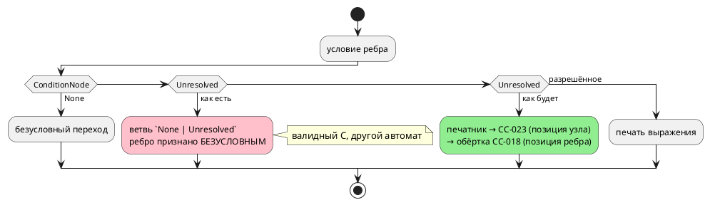

# Фича: Печатник цели c печатает пустоту на неразрешённом условии

- **Номер:** 0236
- **Статус:** ГОТОВО
- **Зависит от:** нет (проставлено аналитиком 2026-08-16, стадия 3); [validate не обходит формулы: неизвестное имя в Guard молчит](0203-validate-formulas-traversal.md) закрыта
- **Связанные issue (анализ):** находка при закрытии [validate не обходит формулы: неизвестное имя в Guard молчит](0203-validate-formulas-traversal.md), 2026-08-15

## Стадии жизненного цикла

Все стадии — **разделы этой карточки**: «Архитектура (ADR)»,
«Анализ», «Разработка», «Тест-план», «Отчёт о тестировании», «Итог».
Отдельным артефактом остаются только исправления —
[`docs/fixes/`](../fixes/README.md) (при необходимости `0236-YY-*`).

## Краткое описание

Печатник цели `c` на `ConditionNode::Unresolved` печатает **пустоту**:
`assert( < 3);` — синтаксическая ошибка, о которой сообщает **чужой** инструмент
(`cc`), а не язык. После [validate не обходит формулы: неизвестное имя в Guard молчит](0203-validate-formulas-traversal.md) такой вход
до генератора не доходит, но защиты «в глубину» у цели нет — в отличие от цели
`rust`, которая на том же узле отвечает `RS-011`.

> Фича зарегистрирована **из находки фичи** (запрос заказчика 2026-08-15);
> далее проходит жизненный цикл по своду.

## Что известно на входе

**Класс:** генерация (Tier 2 — сегодня недостижимо через семантику, но
недостижимость держится **другой** фичей, а не самой целью).

Замер (2026-08-15): на входе `: [Guard] levl < 3;` цель `c` порождала
`assert( < 3);` и рапортовала об успехе; отказ приходил от `cc -Wall -Werror`
(«expected expression»). Это класс: язык принимает запись, а диагностику
даёт чужой инструмент на порождённом файле.

**Предмет фичи — не «починить формулы»** (это сделала 0203), а **закрыть
класс**: любой неразрешённый узел, дошедший до печатника цели `c`, обязан давать
`CC-…` с позицией, а не пустую строку. Сегодня таких путей не видно, но каждая
новая конструкция языка способна открыть их снова — и молча.

## Документирование

**Языковой раздел не требуется** — при верном входе вывод не меняется, а новый
отказ сообщает о состоянии, недостижимом из корректной программы. Заведённый
стадией архитектуры код **`CC-023`** внесён в приложение
[«Ошибки»](../../book/src/appendix-errors/index.typ) и в таблицу
диагностик `README.md`.

## Архитектура (ADR)

- **Status:** Accepted (Option B)
- **Date:** 2026-08-16
- **Authors:** Архитектор
- **Related issues:** [Фича](0236-c-unresolved-condition-refusal.md); находка [фичи](0203-validate-formulas-traversal.md) (validate не обходил формулы); смежно с [ADR](0028-c-generator-stubs.md#архитектура-adr) (отказ вместо комментария-заглушки), [ADR](0189-anonymous-ports.md#архитектура-adr) (оператор терялся молча), [ADR](0229-format-unsupported-position.md#архитектура-adr) (`FM-001` — один код, вид узла в тексте, позиция из АСД)

### Context

[validate не обходит формулы: неизвестное имя в Guard молчит](0203-validate-formulas-traversal.md) закрыла молчание в
**семантике**: опечатка в имени внутри охранной формулы стала ошибкой
компиляции. Она же назвала оставшуюся границу: на входе `: [Guard] levl < 3;`
цель `c` печатала

```c
assert( < 3);
```

и рапортовала об успехе — отказ приходил от **`cc`** («expected expression»).
Предмет этой фичи — не формулы (их закрыла 0203), а **класс**: неразрешённый
узел, дошедший до печатника цели `c`, обязан давать диагностику языка с
позицией, а не пустоту.

#### Замер 1: путь из исходника сегодня закрыт — но не целью

Проба (2026-08-16, три входа: неразрешённое имя в формуле, в условии ребра, в
теле `always`). Все три отвергает **построение дерева** — до генератора вход не
доходит:

| Вход | Ответ | Кто отвечает |
|---|---|---|
| `: [Guard] levl < 3;` | `SE-025` | `semantic` (после 0203) |
| `ref Done: levl < 3;` | `SE-025` | `semantic` |
| `always { levl := 1; }` | `SE-003` | `semantic` |

То есть **недостижимость ветвей цели держится другой фичей**, а не самой целью.
Ровно так же она держалась и до 0203 — пока не выяснилось, что формулы не
обходит никто. Следующая конструкция языка способна открыть тот же путь снова, и
**молча**.

#### Замер 2: инвентаризация ветвей цели `c` (чтение кода + проба)

| Узел | Место | Что происходит сегодня |
|---|---|---|
| `ConditionNode::Unresolved` | `c_expr/condition.rs` (`generate_condition_expr`) | `Ok("")` — **пустая строка** |
| он же, решение «условный ли переход» | `c_model.rs` (`generate_state_transitions`) | ребро считается **Безусловным** |
| `StatementNode::Unresolved` | `c_expr/stmt.rs` (`generate_code_block`) | пропуск — **оператор исчезает** |
| `ExpressionNode::Unresolved` | `c_expr/expr.rs` (`generate_expr`) | `Err` **без кода и без позиции** |
| `VariableNode::Unresolved` | `c_expr/resolve.rs`, `c_header.rs`, `c_decl.rs` | `Err` без кода / пропуск объявления |
| `FunctionDefinitionNode::Unresolved` | `c_expr/names.rs` (`get_function_name`) | `unreachable!` — **паника инструмента** |

**Худшее здесь — не пустая строка, а вторая строка таблицы.** Пустое условие
даёт невалидный C, и его ловит `cc`. А ребро, признанное безусловным, даёт
**валидный** C с **другим автоматом**: переход срабатывает всегда. Это в
точности класс, ради которого заведён [ADR](0028-c-generator-stubs.md#архитектура-adr)
(«мёртвый автомат, обнаруживаемый на объекте, а не в CI»), — только с обратным
знаком.

#### Замер 3: из пяти целей молчит одна

| Цель | Ответ на `ConditionNode::Unresolved` |
|---|---|
| `c` | `Ok("")` — пустота |
| `rust` | `RS-011` «неразрешённое условие» |
| `st` | отказ «условие не прошло семантическое понижение» |
| `sv` | `SV-002` «неразрешённое условие» |
| симулятор | отказ в такте |

#### Замер 4: не всякий `Unresolved` — дефект

Правая часть паттерна `S(Модель) = Состояние` приходит в цель
**неразрешённой по инварианту проекта**: `End` — состояние модели-аргумента, и
семантика разрешить его не может и не должна (проход
`resolve_state_references` запрещён; контроль —
`reference_model_tests::reference_model_compiles_and_translates_state_ref`).
Разбирает эту форму `generate_state_comparison`, **до** общего печатника.

Отсюда прямое следствие для выбора решения: **запрет «в дереве не бывает
`Unresolved`» неверен**, и любое решение обязано оставить эту форму работать.

### Decision Drivers

1. **Молчаливая потеря недопустима.** Класс [заглушки генератора C: диагностика вместо тихого пропуска](0028-c-generator-stubs.md#архитектура-adr) /
   [семантическое разрешение тел вложенных операторов](0155-semantic-nested-statement-resolution.md) /
   [анонимные порты](0189-anonymous-ports.md#архитектура-adr): язык принимает запись, а диагностику даёт
   чужой инструмент — или не даёт никто.
2. **Подмена смысла хуже невалидного вывода.** Условное ребро, ставшее
   безусловным, компилируется без замечаний.
3. **Легитимный `Unresolved` существует** (замер 4) — решение обязано его
   пропустить, не заводя второго знания о форме паттерна (класс: разборов
   формы было три, и судья отставал).
4. **Диагностика обязана нести позицию** (правило пачки, [накопление семантических диагностик (несколько ошибок за прогон)](0130-diagnostics-batch.md)): в сообщении без координаты
   искать нечего. Все три узла её несут — `ast::Condition::loc()`,
   `ast::Expression::loc()`, `ast::Statement::loc()`.
5. **И код** — «диагностика цели `c` без кода» уже заведена фичей
   [диагностика цели c без кода](0212-c-diagnostic-without-code.md) как отдельный класс;
   новая диагностика не имеет права его пополнять.

#### Поток «как есть» и «как будет»



### Considered Options

#### Option A. Точечная правка: отказ только на условии

Разделить ветвь `None | Unresolved` в `generate_condition_expr`.

**Pros:**
- Минимальная правка; закрывает ровно тот вход, который назвала 0203.

**Cons:**
- **Не закрывает класс.** Оператор (`StatementNode::Unresolved`) остаётся
  исчезающим молча, выражение — отказом без кода и позиции. Карточка фичи
  требует обратного прямым текстом.
- Ветвь «условие `Unresolved` = безусловный переход» в `c_model.rs` живёт
  отдельно от печатника и правкой печатника не лечится.

#### Option B. Единая воронка отказа цели `c` для узлов, несущих позицию

Один конструктор диагностики (`c_unresolved::refuse(loc, вид)`) → **`CC-023`**,
вид узла назван в тексте; зовут его три печатника — условия, выражения,
оператора. Плюс правка решения «условный ли переход» в `c_model.rs`. Контроль —
перечисление видов узлов в тесте.

**Pros:**
- Закрывает класс целиком: три места, где неразрешённый узел сегодня теряется
  или отказывает безлико, отвечают одинаково.
- Образец уже есть в проекте и оправдал себя: `format::unsupported(loc, вид)` →
  `FM-001` ([отказ форматтера — диагностика с позицией](0229-format-unsupported-position.md#архитектура-adr)) — **один** код,
  вид узла в тексте, позиция из АСД.
- Легитимный `Unresolved` не задет: `generate_state_comparison` разбирает
  паттерн **раньше** и второго знания о форме не заводит.
- Ребро с неразрешённым условием перестаёт быть безусловным.

**Cons:**
- Контроль обязан строить узлы **руками**: из исходника такое дерево не
  получить (замер 1), значит тест живёт внутри крейта, а не в `tests/`.
- Отказ на входе, недостижимом сегодня, — «мёртвый код» до тех пор, пока
  недостижимость держится. Ровно это и есть предмет фичи.

#### Option C. Проход семантики «в дереве не осталось `Unresolved`»

Проверка перед вызовом любой цели — закрывает все цели разом.

**Pros:**
- Одно место на все шесть целей.

**Cons:**
- **Отвергается замером 4:** легитимный `Unresolved` существует (правая часть
  `S(Модель) = Состояние`), и проход обязан был бы его исключить — то есть
  завести **второе** знание о форме паттерна. Первое живёт в
  `semantic/condition/state_of.rs`, и фича закрывалась ровно потому, что
  таких разборов было три и они разошлись.
- Проверка дублирует `validate`, стоит обхода на каждой сборке и отвечает о
  **дефекте компилятора** там, где остальные проверки отвечают о программе
  автора.

#### Option D. Типизировать: разные типы дерева до и после понижения

Убрать варианты `Unresolved` из узлов, которые видит генератор.

**Pros:**
- Класс закрывается **компилятором Rust**, а не тестом: невыразимое состояние
  становится непредставимым.

**Cons:**
- Масштаб несопоставим с предметом: `Unresolved` — рабочее состояние построения
  дерева, узлы делят представление между стадиями, затронуты все шесть целей,
  форматтер, LSP и симулятор.
- Легитимный `Unresolved` (замер 4) потребовал бы отдельного узла в
  «разрешённом» дереве — то есть та же развилка, но в типах.

### Decision

Принимается **Option B**.

- Новый код **`CC-023`** — «неразрешённый узел дошёл до печатника цели `c`».
  **Один** код на три вида узла; вид назван словом в тексте («условие»,
  «выражение», «оператор»), позиция берётся из АСД-узла, который несёт
  `Unresolved`. Образец — `FM-001` фичи.
- Конструктор диагностики — **один** (`c_unresolved::refuse`): текст и код
  собираются в одном месте, а печатники его лишь зовут.
- Решение «условный ли переход» (`c_model.rs`) перестаёт считать `Unresolved`
  отсутствием условия: такое ребро идёт в печатник, получает `CC-023` и
  доезжает до автора обёрткой `CC-018` — с позицией **ребра** и исходной
  причиной заметкой (устройство ADR сохраняется).
- Легитимная форма `S(Модель) = Состояние` не задета: её разбирает
  `generate_state_comparison` до общего печатника.

**Вне объёма (границы названы, а не забыты):** `VariableNode::Unresolved`,
`FunctionDefinitionNode::Unresolved` и `StateNode::Unresolved` позиции **не
несут** — у них нет АСД-узла в полезной нагрузке, поэтому «отказ с позицией» для
них невыразим; безликие отказы этих ветвей — предмет [диагностика цели c без кода](0212-c-diagnostic-without-code.md), а `unreachable!` в
`get_function_name` — кандидат (см. `FEATURES.md`).

### Consequences

#### Положительные

- Пустое условие и исчезнувший оператор заменяются диагностикой языка **с
  позицией**; `cc` перестаёт быть арбитром корректности вывода.
- Ребро с неразрешённым условием больше не превращается в безусловный переход.
- Цель `c` отвечает на неразрешённый узел так же, как остальные четыре цели.

#### Отрицательные / Action items

- **Совместимость.** Меняется поведение на входе, который сегодня из исходника
  недостижим (замер 1). Вывод корпуса обязан остаться **байт-в-байт** — это
  проверяемый критерий, а не ожидание.
- **Контроль живёт внутри крейта.** Печатники объявлены `pub(in crate::generator::c)`,
  и построить неразрешённый узел из исходника нельзя — тест строит узлы руками.
  Плата за это названа: тест видит внутреннее устройство цели.
- **Недостижимость остаётся** до появления конструкции, которая её откроет.
  Значит, тест обязан проверять **ветвь**, а не «программу, которая падает».
- `CC-023` вносится в приложение «Ошибки и предупреждения».
  Замер попутно: в таблице приложения нет `CC-020`…`CC-022`, а описание
  `CC-019` оборвано на полуслове — актуализируется кандидат «Таблица кодов
  приложения отстаёт от компилятора».

#### Acceptance criteria

1. `ConditionNode::Unresolved`, `ExpressionNode::Unresolved` и
   `StatementNode::Unresolved`, дойдя до печатника цели `c`, дают **`CC-023`** с
   позицией из АСД-узла.
2. Ребро с неразрешённым условием **не** печатается безусловным переходом:
   ответ — `CC-018` с позицией ребра и заметкой-причиной `CC-023`.
3. Легитимная форма `S(Модель) = Состояние` переводится по-прежнему (контроль
   `reference_model_tests` зелён).
4. Вывод корпуса `examples/generated/` **байт-в-байт** неизменен.
5. `CC-023` описан в приложении «Ошибки и предупреждения».
6. `./scripts/precheck.sh` зелёный.

## Анализ

### Цель и контекст

Закрыть **класс**, а не вход: любой неразрешённый узел, дошедший до печатника
цели `c`, обязан давать диагностику языка **с позицией**, а не пустую строку,
пропуск или безликий отказ. Решение — Option B ADR: единая воронка отказа
`c_unresolved::refuse(loc, вид)` → **`CC-023`**.

### Зависимости фичи

- **Зависит от:** нет. [validate не обходит формулы: неизвестное имя в Guard молчит](0203-validate-formulas-traversal.md)
  (источник находки) закрыта; общих контрактов с незакрытыми фичами нет.
  Смежная [диагностика цели c без кода](0212-c-diagnostic-without-code.md) («диагностика
  цели `c` без кода») **не** зависимость: она шире по объёму и захватит те
  ветви, которые эта фича называет границей (`VariableNode`,
  `FunctionDefinitionNode`).
- **Влияние на порядок разработки:** ничего не разблокирует и не блокирует.
  Фича уменьшает объём 0212 на три места (условие/выражение/оператор получают
  код и позицию).

### Замеры (проба, 2026-08-16)

**З1. Путь из исходника закрыт семантикой.** Три входа с неразрешённым именем
(в формуле, в условии ребра, в теле `always`) отвергает `construct_model`:
`SE-025`, `SE-025`, `SE-003`. До генератора вход не доходит — значит, тест
обязан строить узлы **руками**, а не подавать исходник.

**З2. Инвентаризация ветвей** — таблица в ADR (замер 2). В объёме три узла,
несущие позицию; три узла без позиции названы границей.

**З3. Ребро, а не только формула.** `c_model.rs::generate_state_transitions`
считает `ConditionNode::Unresolved` **отсутствием** условия (`None |
Unresolved`) и печатает **безусловный** переход. Это опаснее пустой строки:
вывод валиден, автомат другой.

**З4. Легитимный `Unresolved`.** Правая часть `S(Модель) = Состояние` приходит
неразрешённой по инварианту проекта; её разбирает `generate_state_comparison`
**до** общего печатника. Любое решение обязано её пропустить.

### Требования и проверяемые условия

- **R1. Отказ вместо пустоты.** `ConditionNode::Unresolved` в
  `generate_condition_expr` даёт `CC-023` с позицией `ast::Condition::loc()`.
  Ветвь `ConditionNode::None` (безусловный переход) сохраняет прежний ответ —
  пустую строку.
- **R2. Отказ вместо пропуска.** `StatementNode::Unresolved` в
  `generate_code_block` даёт `CC-023` с позицией `ast::Statement::loc()`.
  Пропуск здесь — потеря **оператора** (класс исправления и фичи).
- **R3. Код и позиция у выражения.** `ExpressionNode::Unresolved` в
  `generate_expr` даёт `CC-023` с позицией `ast::Expression::loc()` вместо
  безликого `Err("Неразрешённое выражение")`. `ExpressionNode::None` от
  `Unresolved` **отделяется**: у `None` полезной нагрузки нет, позиции взять
  негде — эта ветвь остаётся прежней и уходит в объём 0212.
- **R4. Ребро не становится безусловным.** Решение «условный ли переход»
  считает условием **всё, кроме `None`**; неразрешённое условие идёт в печатник
  и доезжает до автора обёрткой `CC-018` (позиция ребра) с заметкой-причиной
  `CC-023` (позиция узла).
- **R5. Один конструктор.** Текст и код диагностики собираются в **одном**
  месте (`c_unresolved::refuse`), печатники его лишь зовут. Второй конструктор
  разъедется с первым.
- **R6. Легитимная форма цела.** `S(Модель) = Состояние` (полная и краткая)
  переводится по-прежнему.
- **R7. Вывод корпуса неизменен.** `examples/generated/` — байт-в-байт.
- **R8. Контроль перечисляет виды узлов.** Тест обязан падать **списком**,
  называя вид, который перестал отвечать `CC-023`; проверять «программа
  падает» здесь нечего — из исходника такой вход не построить (З1).

### Критерии приёмки и способ проверки

| # | Критерий | Способ проверки |
|---|---|---|
| A1 | Условие: `CC-023` + позиция | юнит-тест `c_unresolved` (узел строится руками) |
| A2 | Оператор: `CC-023` + позиция | там же |
| A3 | Выражение: `CC-023` + позиция | там же |
| A4 | Ребро с `Unresolved` → `CC-018` + заметка `CC-023`, **не** безусловный переход | юнит-тест: модель с подменённым условием ребра, сверка текста `.c` и кода отказа |
| A5 | `S(Модель) = Состояние` цела | `reference_model_tests` (существующий контроль) |
| A6 | Вывод корпуса байт-в-байт | `git diff --stat examples/generated/` после `precheck.sh` |
| A7 | `CC-023` в приложении «Ошибки» | свод; строка таблицы |
| A8 | Предкоммит зелёный | `./scripts/precheck.sh` |

### Особенности по обратной совместимости

Меняется ответ на вход, **недостижимый из исходника** (З1): дерево с
неразрешённым узлом сегодня строится только внутри крейта. Поэтому:

- ни одна программа автора не перестаёт компилироваться;
- вывод корпуса обязан остаться байт-в-байт (A6);
- изменение — **ужесточение** ответа на состояние, которое и без него было
  сломано, просто молча (образец рассуждения).

Язык **не меняется**: ни лексика, ни синтаксис, ни семантика, ни наблюдаемое
поведение корректной программы. Версия языка не поднимается.
Версия крейта `takt-lang` растёт по patch/minor — добавляется внутренняя
диагностика, публичный API не меняется.

### Редакторский слой

**Правки не нужны, обоснование:** фича не трогает лексику, синтаксис и
семантику; новых токенов и форм объявления нет, новых узлов АСД нет. Новая
диагностика `CC-023` рождается в **генераторе**, а LSP генераторы не зовёт
(проба: `grep -rn "generator" takt-lang/src/lsp/` — ни одного вхождения; вход
редактора — `collect_compile_diagnostics`, то есть разбор и семантика). То же
верно для всех прочих кодов `CC-*`: до редактора они не доходят **по
устройству**, и это граница не этой фичи, а [предупреждения генераторов возвращаются вызывающему, а не печатаются из библиотеки](0168-generator-warnings-return.md) (доставка диагностик
генераторов вызывающему).

### Документирование

Раздел `book/` не меняется — язык прежний. по своду в приложение «Ошибки и
предупреждения» добавляется строка `CC-023`.

### Риски и зависимости

- **Р1. Контроль видит внутреннее устройство цели.** Печатники —
  `pub(in crate::generator::c)`, тест живёт в `src/`. Снижение: тест держится за
  **контракт** (код + позиция + вид узла), а не за текст вывода C.
- **Р2. Правка `has_cond` задевает корпус.** Снижение: A6 — сверка вывода
  байт-в-байт; ветвь срабатывает только на `Unresolved`, которого в корпусе
  быть не может (иначе он уже сегодня печатался бы безусловным переходом).
- **Р3. Класс шире цели `c`.** Те же две ветви `None | Unresolved` живут в
  `rust_tick.rs` и `sv_fsm.rs` — там неразрешённое условие тоже считается
  отсутствием условия. Вне объёма (фича о цели `c`); заводится **кандидатом**
  в `FEATURES.md` с указанием мест.
- **Р4. Мёртвая ветвь и её судьба.** Отказ недостижим, пока недостижимость
  держит семантика. Это предмет [ветвь-заглушка до будущей задачи переживает саму задачу](0217-stub-branch-gate.md) («ветвь-заглушка переживает
  задачу») — здесь ветвь **не заглушка**, а защита в глубину, и контроль на неё
  заводится сразу (R8).

### Декомпозиция разработки

| Задача | Содержание |
|---|---|
| `0236-01` | Модуль `c_unresolved` (`CC-023`), правка трёх печатников и решения «условный ли переход», контроль-перечисление, строка в приложении «Ошибки» |

Объём — одна задача: правки точечные, а разнести их по подзадачам значило бы
разорвать единственный смысл фичи (одинаковый ответ трёх мест).

## Разработка

### Задача

#### Что было

Неразрешённый узел, дойдя до печатника цели `c`, **терялся** — по-разному в
трёх местах:

| Место | Прежнее поведение |
|---|---|
| `c_expr/condition.rs` | `ConditionNode::None \| Unresolved => Ok("")` — пустая строка (`assert( < 3);`) |
| `c_model.rs` | `Unresolved` считался **отсутствием** условия: ребро печаталось безусловным переходом |
| `c_expr/stmt.rs` | `StatementNode::Unresolved(_) => {}` — оператор исчезал |
| `c_expr/expr.rs` | `Err("Неразрешённое выражение")` — без кода и без позиции |

#### Что сделано

**1. Единая воронка отказа — новый модуль `takt-lang/src/generator/c/c_unresolved.rs`.**
`refuse(loc, UnresolvedNode) -> Diagnostic` с кодом **`CC-023`**; вид узла —
перечисление `UnresolvedNode { Condition, Expression, Statement }`, его
`phrase()` называет вид словом в тексте. Позиция берётся у **самого узла**
(`ast::Condition::loc()` / `ast::Expression::loc()` / `ast::Statement::loc()`).
Образец — `format::unsupported` → `FM-001`.

**2. Три печатника зовут воронку.** Ветвь `None | Unresolved` в условии
**разделена**: `None` (безусловный переход) по-прежнему отдаёт пустую строку,
`Unresolved` отказывает. То же для выражения: `ExpressionNode::None` остаётся
безликим отказом — полезной нагрузки у ветви нет, позицию взять негде (граница
названа в коде и уходит в объём фичи).

**3. Решение «условный ли переход» (`c_model.rs`).** `has_cond` считает условием
всё, кроме `None`. Неразрешённое условие идёт в печатник, получает `CC-023` и
доезжает до автора обёрткой **`CC-018`** — позиция ребра, причина заметкой
(устройство ADR не тронуто).

**4. Приложение «Ошибки»**: добавлена строка `CC-023`; заодно
дописано оборванное на полуслове описание `CC-019`.

**Обратная функциональность:** язык не меняется — ни лексика, ни
синтаксис, ни семантика, ни наблюдаемое поведение корректной программы. Прочие
цели (`rust`, `st`, `sv`, `plantuml`), симулятор, LSP и форматтер — **н/п**:
правки локальны для печатников цели `c`; LSP генераторы не зовёт (замер в
анализе).

#### Проверки

- `cargo test` — **1031 + интеграционные**, все зелёные; новых падений нет.
- Юнит-тесты воронки (`takt-lang/src/generator/c/c_unresolved.rs`, 6 шт.):
  T1 условие, T2 отсутствие условия (контр-пример), T3 оператор, T4 выражение,
  T5 ребро (`CC-018` + заметка `CC-023`), T6 контроль-перечисление видов.
- **Мутация** (проверка, что тесты не декоративны): правки печатников временно
  сняты (`git stash`) — четыре из шести тестов упали, включая T5, и проба
  зафиксировала прежний вывод ребра:
  `case PROBE_RUN: { model->state = PROBE_DONE; break; break; }` — безусловный
  переход, который `cc` принимает без замечаний.
- `./scripts/precheck.sh` — зелёный; вывод `examples/generated/` байт-в-байт
  неизменен (`git status` по каталогу чист).

## Тест-план

### Область и цель

Проверяется **ветвь**, а не программа: дерево с неразрешённым узлом из
исходника не построить — `construct_model` отвергает такой вход (`SE-025` /
`SE-003`, замер анализа З1). Поэтому узлы подкладываются тестом, а мера
проверки — **контракт диагностики**: код `CC-023`, позиция узла, название вида
в тексте.

**Проверять «порождённый C не компилируется» здесь нельзя** — предмет фичи
ровно в том, что дефектный вывод компилировался: пустое условие ловил `cc`, а
безусловный переход не ловил никто.

Связь: R1–R8 анализа, A1–A8 критериев приёмки.

### Проверки (условие → ожидаемый результат)

| # | Проверка | Предусловие | Ожидаемый результат | Ссылка на R/A |
|---|---|---|---|---|
| T1 | Печать неразрешённого **условия** | `ConditionNode::Unresolved(ast::Condition::Number(loc, 1))` | `Err` `CC-023`, `loc` узла, текст содержит «неразрешённое условие» | R1 / A1 |
| T2 | **Контр-пример:** отсутствие условия | `ConditionNode::None` | `Ok("")` — прежнее поведение сохранено | R1 / A1 |
| T3 | Печать неразрешённого **оператора** | `StatementNode::Unresolved(ast::Statement::Continue(loc))` | `Err` `CC-023`, `loc` узла, в вывод не попало ни байта | R2 / A2 |
| T4 | Печать неразрешённого **выражения** | `ExpressionNode::Unresolved(ast::Expression::Number(loc, 1))` | `Err` `CC-023`, `loc` узла | R3 / A3 |
| T5 | Ребро с неразрешённым условием | модель `start Run { ref Done: … }`, условие ребра подменено на `Unresolved` | `Err` `CC-018`, причина `CC-023` **заметкой**; безусловный переход в `.c` **не** порождён | R4 / A4 |
| T6 | Контроль-перечисление видов узла | `UnresolvedNode::ALL` | каждый вид: код `CC-023`, позиция цела, название своё и не повторяется; падение — **списком** | R5, R8 / A1–A3 |
| T7 | Легитимный `Unresolved` цел | `S(Ping) = End` (`reference_model_tests`) | перевод в C прежний | R6 / A5 |
| T8 | Вывод корпуса | `precheck.sh` | `examples/generated/` байт-в-байт неизменен | R7 / A6 |
| T9 | Мутация (тесты не декоративны) | правки печатников сняты | T1, T3, T4, T5 **падают** | — |

### Разбивка проверок по функциональности

Единые условия и ожидаемые результаты прогоняются против каждой задеваемой
обратной функциональности; фиксируется статус.

| Функциональность | Статус | Обоснование |
|---|---|---|
| Цель `c` (корпус, проверка `cmake`/`cc -Wall -Werror`) | ✅ | T8 + предкоммит |
| Цель `c-hal` | ✅ | тот же печатник; проверка `cc -c` предкоммита |
| Цели `rust` / `st` / `sv` / `plantuml` | — | не задеты: правки внутри `generator/c` |
| Симулятор (сверки трасс) | — | не задет |
| LSP, форматтер | — | генераторы не зовутся (замер анализа) |

<!-- Легенда: ✅ пройдено · ❌ провалено · ⬜ не проверялось · — не применимо -->

### Тестовые данные и окружение

- Тесты — юнит-тесты крейта: `takt-lang/src/generator/c/c_unresolved.rs`
  (`mod tests`). Печатники объявлены `pub(in crate::generator::c)`, из
  `takt-lang/tests/` недостижимы — плата названа в ADR (Consequences).
- Позиция-зонд — `Location::Source(7, 11, 13)`: заведомо не совпадает ни с чем,
  что мог бы подставить сам генератор (`Location::Codegen`).
- Прогон: `cargo test -p takt-lang --lib c_unresolved`, затем `cargo test` и
  `./scripts/precheck.sh` (толчейн `1.97.1`, macOS 25.5.0).

## Отчёт о тестировании

### Резюме

**Пройдено. Фича готова к закрытию (`ГОТОВО`).** Все девять проверок тест-плана
зелёные, критерии приёмки A1–A8 выполнены. Дефектов, требующих исправлений, не
найдено.

Окружение: macOS 25.5.0, толчейн `1.97.1` (пин `rust-toolchain.toml`),
`cargo test` — 1031 юнит-тест крейта `takt-lang` плюс интеграционные наборы,
`./scripts/precheck.sh` — полный прогон проверок.

### Фактические результаты по проверкам

| # | Проверка | Результат | Комментарий |
|---|---|---|---|
| T1 | Неразрешённое **условие** | ✅ | `CC-023`, позиция узла (`Source(7, 11, 13)`), текст называет «неразрешённое условие» |
| T2 | Контр-пример: `ConditionNode::None` | ✅ | по-прежнему `Ok("")` — штатный безусловный переход не задет |
| T3 | Неразрешённый **оператор** | ✅ | `CC-023` + позиция; в буфер вывода не попало ни байта |
| T4 | Неразрешённое **выражение** | ✅ | `CC-023` + позиция вместо безликого `Err("Неразрешённое выражение")` |
| T5 | Ребро с неразрешённым условием | ✅ | `CC-018`, причина `CC-023` приложена **заметкой**; безусловный переход не порождён |
| T6 | Контроль-перечисление видов узла | ✅ | три вида, у каждого свой текст, код и позиция; падение — списком |
| T7 | Легитимный `S(Ping) = End` | ✅ | `reference_model_tests` зелёные — форма переводится по-прежнему |
| T8 | Вывод корпуса | ✅ | `examples/generated/` байт-в-байт неизменен (`git status` по каталогу чист) |
| T9 | Мутация | ✅ | при снятых правках печатников **четыре** теста из шести краснеют (T1, T3, T4, T5) |

#### Что показала мутация (T9) — прежнее поведение, снятое пробой

Правки печатников временно сняты (`git stash`), тесты прогнаны против прежнего
кода:

| Тест | Прежний ответ |
|---|---|
| T1 | `Ok("")` — печатник отдавал пустую строку |
| T3 | `Ok(())` — оператор пропускался молча |
| T4 | `Err` **без кода** (`code: None`) |
| T5 | `Ok(<текст .c>)` — трансляция **удавалась**, и в выводе стоял безусловный переход: `case PROBE_RUN: { model->state = PROBE_DONE; break; break; }` |

T5 — главное свидетельство фичи: порождённый C **валиден**, `cc -Wall -Werror`
принял бы его без замечаний, а автомат другой — переход срабатывает всегда. Без
этой проверки правка выглядела бы косметикой («пустая строка вместо ошибки»).

Тесты T2 и T6 при мутации остаются зелёными закономерно: первый проверяет
**сохранённое** поведение, второй — сам конструктор диагностики, который правки
печатников не задевают.

### Результаты по функциональности

| Функциональность | Статус | Чем проверено |
|---|---|---|
| Цель `c` (корпус) | ✅ | проверка `cmake` + `-Wall -Werror` предкоммита; вывод неизменен |
| Цель `c-hal` | ✅ | проверка `cc -c` предкоммита (тот же печатник) |
| Цели `rust` / `st` / `sv` / `plantuml` | — | не задеты: правки внутри `generator/c` |
| Симулятор (потактовые сверки) | — | не задет; сверки зелёные в общем прогоне |
| LSP и плагины | — | правок не требуют: LSP генераторы не зовёт (замер анализа), новых токенов и узлов АСД нет |
| Форматтер | — | новых узлов АСД нет |

### Выводы и дальнейшие шаги

1. **Класс закрыт для трёх узлов, несущих позицию.** Границы названы, а не
   забыты: `VariableNode::Unresolved`, `FunctionDefinitionNode::Unresolved` и
   `StateNode::Unresolved` полезной нагрузки с позицией не имеют — их безликие
   отказы остаются предметом [диагностика цели c без кода](0212-c-diagnostic-without-code.md).
2. **Тот же класс живёт в целях `rust` и `sv`** (`rust_tick.rs`, `sv_fsm.rs`):
   там ветвь `None | Unresolved` тоже решает «условия нет». Вне объёма фичи —
   заведено **кандидатом** в `FEATURES.md`.
3. **Побочный замер, вынесенный в кандидаты:** приложение «Ошибки» документа
   отстаёт от реестра `docs/diagnostics/README.md` не на пять кодов, а на
   **19** (`CC` — 4, `SE` — 4, `ST` — 4, `SV` — 3, `LE` — 2, `RS` — 2);
   существующая запись кандидата актуализирована по этому замеру. Описание
   `CC-019` было **оборвано на полуслове** в обоих документах — исправлено здесь
   же, поскольку править одну строку дешевле, чем заводить фичу.
4. **Найдено попутно:** код `CC-022` **не эмитируется никем** — он живёт
   единственным упоминанием в док-комментарии `semantic/validate/name_collisions.rs`
   как обещанный отказ цели `c` на порт-тёзку состояния; фича решила ту
   задачу переименованием, и обещание осталось без исполнителя. Заведено
   кандидатом.
5. Исправлений не требуется.

## Итог (что сделано)

Цель `c` перестала терять неразрешённый узел. Три печатника — условия,
выражения и оператора — зовут **одну** воронку
`generator/c/c_unresolved::refuse(loc, вид)` → **`CC-023`** с позицией из
АСД-узла и названием вида в тексте (образец `FM-001` фичи). Крейт
`takt-lang`.

Что было и чем стало:

- условие — пустая строка (`assert( < 3);`, об ошибке сообщал `cc`) → `CC-023`;
- оператор — молчаливый пропуск → `CC-023`;
- выражение — отказ без кода и позиции → `CC-023`;
- **ребро с неразрешённым условием — безусловный переход** (валидный C, другой
  автомат) → `CC-018` с позицией ребра и причиной `CC-023` заметкой.

Ключевые решения (детали — [ADR](0236-c-unresolved-condition-refusal.md#архитектура-adr)):
отвергнут проход семантики «неразрешённых узлов не бывает» — он завёл бы второе
знание о форме `S(Модель) = Состояние`, которая приходит в цель неразрешённой
**по инварианту**. Отказ недостижим из корректной программы: вход
отсекает семантика, поэтому контроль проверяет **ветвь**, а не программу, и падает
списком видов узла.

Живая проверка: `./scripts/precheck.sh` зелёный, вывод корпуса
`examples/generated/` байт-в-байт неизменен; мутация (снятые правки печатников)
роняет четыре теста из шести. Подробности — в
[отчёте](0236-c-unresolved-condition-refusal.md#отчёт-о-тестировании); исправлений не
потребовалось.

Границы, названные, а не забытые: `VariableNode`, `FunctionDefinitionNode` и
`StateNode` позиции не несут — их безликие отказы остаются за фичей
[диагностика цели c без кода](0212-c-diagnostic-without-code.md); тот же класс в целях `rust` и `sv` и
фантомный код `CC-022` заведены кандидатами в `FEATURES.md`.
