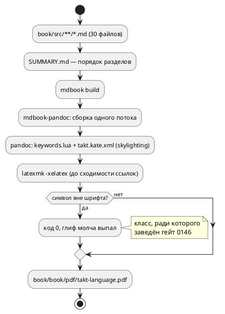
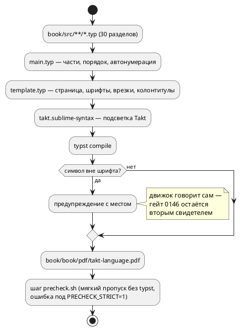

# Фича: Перевод документа book/ в формат Typst

- **Номер:** 0240
- **Статус:** ГОТОВО
- **Зависит от:** нет (проставлено аналитиком 2026-08-17, см. [анализ](0240-book-typst.md#анализ))
- **Связанные issue (анализ):** новая фича по запросу заказчика 2026-08-17
- **Приоритет:** **Tier 1** — поднят **решением заказчика** (2026-08-17), а не
  порядком своду. Фича обгоняет очередь класса «прочее».

## Стадии жизненного цикла

Все стадии — **разделы этой карточки**: «Архитектура (ADR)»,
«Анализ», «Разработка», «Тест-план», «Отчёт о тестировании», «Итог».
Отдельным артефактом остаются только исправления —
[`docs/fixes/`](../fixes/README.md) (при необходимости `0240-YY-*`).

## Краткое описание

Перевести справочный документ [`book/`](../../book/) с нынешней связки
**mdBook + mdbook-pandoc + XeLaTeX** на **Typst**.

> Фича зарегистрирована **по запросу заказчика** (2026-08-17) с явным указанием
> «пока без проработки»: стадии архитектуры и анализа (2–3) **не выполнялись**,
> заготовки в `docs/adr/` и `docs/analyze/` пусты. Форма решения — предмет этих
> стадий; ниже только то, что известно **на входе**, без выводов.

## Что известно на входе

Раздел собран из **текущего состояния репозитория и живого контекста**, а не
из проработки. Замеры при взятии фичи в работу подлежат **перепроверке** (урок: записи устаревают).

**Как документ собирается сегодня.** `make -C book build` → mdBook →
`mdbook-pandoc` → XeLaTeX → `book/book/pdf/takt-language.pdf`. Инструменты вне
`precheck.sh`; требуются `mdbook`, `mdbook-pandoc`, `xelatex` (у автора — в
`/Library/TeX/texbin`). Объём — 60 файлов исходника, ≈101 страница PDF.

**Что вокруг документа уже держится машиной** — это и есть настоящая цена
перевода, потому что каждая проверка завязан на нынешний конвейер:

- **Проверка символов** (`scripts/check-book-glyphs.py`) — сверяет каждый
  символ документа со снимком `cmap` шрифта Fira Code 6.002
  (`scripts/book-font-charset.txt`). Заведён потому, что **сборка mdBook
  этот класс не ловит**: символ вне шрифта даёт код 0 и лишь предупреждение, а
  глиф молча выпадает. Как выбор шрифта устроен в Typst — вопрос стадии 2.
- **Проверка примеров**  — каждый пример `.takt` из документа
  компилируется целью `c` и прогоняется симулятором (`takt-sim -n 10`);
  библиотечные примеры пропускаются с причиной.
- **Проверка лексики приложения «Грамматика»** (`scripts/check-book-keywords.py`) — сверяет список ключевых слов и знаков
  пунктуации приложения с таблицей `KEYWORDS` лексера **в обе стороны**.
  Разбор идёт **по абзацу**, а не построчно: список занимает четыре строки,
  и построчный поиск дал бы зелёную проверку, не проверяющую ничего.
- **Титульные поля** берутся из `book.toml` (их проверяет проверка символов).

**Что задано правилами, а не инструментом.** своду–27 описывают, **что** в
документе должно быть (только язык; «Частые ошибки» с кодами диагностик; пример
из практики с разбором и выносками; проверка примера компиляцией **и**
симуляцией). Смена формата их не отменяет и не меняет.

**Известные силы, которые предстоит взвесить на стадии 2** (перечислены как
вопросы, а не как выводы):

1. Что происходит с четырьмя проверками: переносятся, переписываются или теряются.
2. Судьба SVG-кадров и графов (`taktc verify --emit-graph`), которые
   сейчас вставляются через `rsvg`/`dot`.
3. Перенос ≈60 файлов Markdown: конвертация в разметку Typst либо сохранение
   Markdown с Typst как движком вывода.
4. Требование к окружению: Typst — один бинарник против связки
   `mdbook`+`pandoc`+TeX; чем это оборачивается для CI (сегодня документ в
   `precheck.sh` не собирается).
5. Обратная совместимость: остаётся ли `make -C book build` и путь
   выходного PDF прежними.

## Документирование

**Не требуется** для языковых разделов: фича меняет **формат сборки** документа,
а не язык — ни синтаксиса, ни семантики, ни поведения целей она не касается.
Содержание разделов при переводе обязано сохраниться: своду–27 остаются
в силе, и их соблюдение проверяется на стадии тестирования.

## Архитектура (ADR)

- **Status:** Accepted
- **Date:** 2026-08-17
- **Authors:** Архитектор + Системный аналитик
- **Related issues:** [Фича](0240-book-typst.md); формат исходников
  и включение сборки в проверки — **решение заказчика 2026-08-17** (см. «Decision»).

### Context

Документ `book/` («Язык Takt — описание») собирается связкой из **шести**
внешних инструментов: `mdbook` → `mdbook-pandoc` → `pandoc` → `latexmk` →
`xelatex`, плюс `rsvg`/`dot` для диаграмм верификации. Сборка вне
`precheck.sh`, то есть **машина её не запускает вовсе** — отказ вёрстки виден
только тому, кто собрал документ руками.

**Замеры сняты заново** (2026-08-17, урок — записи устаревают):

| Величина | Записано в карточке | Измерено |
|---|---|---|
| Объём исходника | 60 файлов | **30 файлов `.md`** (6540 строк) + 33 файла примеров/вывода/диаграмм |
| Объём PDF | ≈101 страница | **151 страница** (544 КБ) |
| Время `make -C book build` | не записано | **26.6 с** (wall clock, тёплый кеш) |

Вокруг документа держатся **четыре проверки**, и каждый завязан на нынешний
конвейер:

- **символы** (0146, `scripts/check-book-glyphs.py`) — сверяет каждый символ
  `book/src/**/*.{md,takt}` и титульных полей `book.toml` со снимком `cmap`
  Fira Code. Заведён потому, что **xelatex молчит**: символа нет в шрифте —
  код 0, предупреждение, глиф выпал;
- **примеры** (0133, шаг `precheck.sh`) — каждый `.takt` документа
  компилируется целью `c` и прогоняется симулятором;
- **лексика приложения «Грамматика»** (0160, `scripts/check-book-keywords.py`)
  — список ключевых слов приложения против таблицы `KEYWORDS` лексера **в обе
  стороны**, разбор **по абзацу**;
- **примеры внутри PDF** держит вручную поддерживаемая подсветка
  `book/takt.kate.xml` (skylighting) и lua-фильтр `book/keywords.lua`
  (ключевые слова в инлайн-коде).

**Факт, найденный при проработке:** оба списка подсветки **отстали от
лексера и контроля не имеют** — в `takt.kate.xml` отсутствуют `parameter`,
`clock`, `at`, `after`, `every` (в лексере 48 записей). Это класс:
два списка одного набора расходятся молча. Проверка их не проверяет — он
сверяет **приложение грамматики**, а не подсветку.

#### Поток «как есть»



### Decision Drivers

1. **Число внешних инструментов.** Шесть против одного. Сборка документа сегодня
   невозможна там, где нет TeX Live (≈4 ГБ) — то есть в CI её нет и не будет
   без отдельной установки.
2. **Молчание нынешнего движка.** `xelatex` не считает пропавший глиф ошибкой;
   ради этого класса заведён отдельный проверка со снимком `cmap`. Движок, который
   об отсутствующем глифе **говорит**, снимает причину, а не следствие.
3. **Оформление задаётся кодом, а не набором опций.** Сегодня вёрстка живёт в
   `book.toml` семнадцатью строками `header-includes` на LaTeX (fancyhdr,
   `\@mkboth`, `\pretocmd`) — правка требует знания TeX. Typst — язык, и
   оформление в нём пишется функциями.
4. **Скорость.** 26.6 с на документ означает, что сборка не может быть шагом
   предкоммита. Проба Typst на разделе — 0.19 с.
5. **Обратная совместимость.** `make -C book build` и путь
   `book/book/pdf/takt-language.pdf` — публичный контракт (README, CLAUDE.md). Он обязан сохраниться при любом варианте.

### Considered Options

#### Option A. Полный перенос: исходники становятся `.typ`, сборка — `typst compile`

30 файлов `.md` однократно конвертируются в разметку Typst и дальше документ
ведётся на Typst. `mdbook`, `mdbook-pandoc`, `pandoc`, `xelatex`, `latexmk`,
`rsvg` уходят целиком; остаётся **один** бинарник `typst`.

Технические пробы (2026-08-17, Typst 0.15.1) — все положительные:

- `pandoc -t typst` даёт **машинную заготовку**, а не бумагу для ручного
  перевода: заголовки, таблицы, `#strong`, `#quote`, а блоки кода выводятся
  готовым Typst-синтаксисом ```` ```takt ```` — конверсия 29 файлов заняла
  секунды;
- **Fira Code + кириллица** — работает; **`⚠️` рендерится цветным emoji**
  (fallback-шрифт), тогда как xelatex его терял;
- **подсветка Takt** — через `book/takt.sublime-syntax` и
  `#set raw(syntaxes: …)`: ключевые слова, типы, числа, комментарии, строки
  (проба приложена к отчёту стадии 6);
- **`{{#include}}`** заменяется на `#raw(read("examples/x.takt"), lang: "takt")`
  — то же поведение, но **без внешнего препроцессора**;
- **SVG-диаграммы** вставляются нативно (`#image("…svg")`) — `rsvg-convert`
  из конвейера уходит;
- **курсив** у Fira Code отсутствует; в Typst он получается show-правилом
  `#show emph: it => box(skew(ax: -12deg, it.body))` — замена костылю
  `AutoFakeSlant` в `book.toml`.

**Pros:**
- один внешний инструмент вместо шести; TeX Live не нужен;
- сборка становится **дешёвой** — её можно поставить шагом предкоммита;
- оформление и вспомогательные функции (врезка, пример, ссылка на раздел) —
  код на Typst, а не опции трёх инструментов;
- у обоих списков подсветки появляется **одно место** и возможность сторожа
  против лексера (закрывает молчаливое расхождение, найденное выше);
- отвечает заголовку фичи: документ становится **в формате Typst**.

**Cons:**
- единовременная работа: вычитка 30 конвертированных файлов (машинная
  заготовка не свободна от артефактов — `---` вместо `—`, `\;`, кириллические
  метки, `#figure(kind: table)` вокруг каждой таблицы);
- три гейта читают `.md` — их область правится (`.md` → `.typ`), а титульные
  поля берутся из шаблона, а не из `book.toml`;
- Markdown как формат исходников теряется: правка требует знания Typst.

#### Option B. Markdown остаётся, Typst — только движок вывода

Цепочка `mdbook` → `pandoc -t typst` → `typst compile`. Уходит только TeX.

**Pros:**
- исходники и все четыре гейта не трогаются вовсе;
- работа на порядок меньше.

**Cons:**
- инструментов остаётся **три** (`mdbook`, `mdbook-pandoc`, `pandoc`) — то
  есть главный драйвер не закрыт, и сборка по-прежнему тяжела для гейта;
- вёрстка задаётся шаблоном pandoc: контроль слабее нынешнего LaTeX-варианта,
  а `mdbook-pandoc` — сторонний бэкенд, чья поддержка вывода `typst` не
  является его заявленной целью;
- заголовок фичи не исполняется: формат документа остаётся Markdown.

#### Option C. Markdown внутри Typst (пакет `cmarker`)

`.md` не меняются, Typst — единственный внешний инструмент, Markdown
рендерится пакетом `cmarker` из Typst Universe.

**Pros:**
- исходники и гейты не трогаются;
- один внешний бинарник.

**Cons:**
- зависимость от **пакета** (загрузка из Universe при первой сборке; для
  офлайн-сборки его пришлось бы вендорить в репозиторий);
- `{{#include}}` пакетом не поддерживается — препроцессор нужен всё равно;
- подсветка кода, таблицы и врезки внутри `cmarker` подчиняются его
  ограничениям, а не нашим — часть нынешнего оформления пришлось бы
  проверять пробами и, возможно, потерять;
- документ остаётся Markdown-ом, живущим внутри чужого рендерера: **две**
  системы разметки вместо одной.

### Decision

Принимается **Option A** — **решением заказчика 2026-08-17** (вопрос был
поставлен как открытый пункт 3 карточки; варианты A/B/C предъявлены с
замерами). Тем же решением заказчика **сборка документа включается в
`precheck.sh` и CI**: после перевода она стоит один бинарник и доли секунды,
поэтому отказ вёрстки обязан быть виден до коммита, а не при ручной сборке.

Целевой поток:



Устройство:

| Что | Где | Заменяет |
|---|---|---|
| Шаблон (страница, шрифты, врезки, колонтитулы, титул, оглавление) | `book/src/template.typ` | `book.toml` + `header-includes` (LaTeX) |
| Порядок частей и разделов | `book/src/main.typ` | `book/src/main.typ` |
| Подсветка Takt | `book/takt.sublime-syntax` | `book/takt.kate.xml` |
| Ключевые слова в инлайн-коде | show-правило в `template.typ` над общим списком | `book/keywords.lua` |
| Вставка примера | `#example("examples/x.takt")` над `raw(read(…))` | `{{#include}}` |
| Ссылка на раздел | метка раздела + `@label` | ссылка на `../*/index.md` |

Расположение разделов (`book/src/<NN-имя>/index.*`, примеры в
`examples/`, порождённый код в `generated/`, диаграммы в `images/`)
**сохраняется**: от него зависят гейт примеров, скрипт `render_verify_graphs.sh`
и относительные пути включений.

### Consequences

#### Положительные

- Требование к окружению: **`typst`** вместо `mdbook` + `mdbook-pandoc` +
  `pandoc` + `latexmk` + `xelatex` + `rsvg-convert`. Сборка документа
  становится доступна в CI без TeX Live.
- Сборка становится шагом `precheck.sh` — класс «вёрстка сломана» перестаёт
  быть невидимым для машины.
- Оформление документа программируется; врезка `⚠️`, пример и ссылка на раздел
  получают **по одной** функции вместо повторяемой разметки.
- Списки подсветки получают одно место и сторожа против `KEYWORDS` лексера —
  закрывается молчаливое расхождение, найденное на стадии архитектуры.

#### Отрицательные / Action items

1. **Правка трёх гейтов** (`check-book-glyphs.py`, `check-book-keywords.py`,
   шаг примеров `precheck.sh`): область `.md` → `.typ`, титульные поля — из
   шаблона вместо `book.toml`. ⚠️ Разбор «по абзацу» в гейте лексики (0160)
   сохранить: построчный поиск даёт зелёную проверку, не проверяющую ничего.
2. **Артефакты машинной конверсии вычитать**: `---` → `—` (иначе em dash не
   виден гейту символов, а в PDF появляется), `\;` → `;`, кириллические метки
   → латинские, `#figure(kind: table)` → таблица без подписи.
3. **Отказ от Markdown** зафиксировать в `README.md`, `book/README.md`,
   `CLAUDE.md` и правиле 24 (`docs/RULE.md` упоминает mdBook дважды).
4. **`⚠️` перестаёт быть проблемой шрифта, но гейт 0146 остаётся**: он
   сторожит и `.takt`-примеры, и снимок `cmap`; отменять сторожа на основании
   «новый движок предупреждает» нельзя — предупреждение не роняет сборку.
5. **Диаграммы верификации**: `render_verify_graphs.sh` (taktc → dot → SVG)
   сохраняется как есть; из сборки уходит только `rsvg-convert`, потому что
   SVG вставляет сам Typst.

#### Acceptance criteria

1. `make -C book build` собирает `book/book/pdf/takt-language.pdf` **без
   `mdbook`, `pandoc`, `xelatex`, `latexmk`, `rsvg-convert`** в `PATH`
   (проверяется прогоном с урезанным `PATH`).
2. Объём документа сохранён: 21 языковой/прикладной раздел + 5 приложений +
   титул/введение/назначение; число примеров `.takt` (33 включения) и таблиц
   не уменьшилось; постраничный объём — не менее 90 % прежних 151 страницы.
3. Все 4 гейта документа зелёные на новом формате; шаг сборки Typst добавлен
   в `precheck.sh` (мягкий пропуск без `typst`, ошибка под `PRECHECK_STRICT=1`).
4. Подсветка Takt в PDF работает и её список **сверяется с `KEYWORDS`
   лексера** машиной (в обе стороны, как гейт 0160).
5. `./scripts/precheck.sh` зелёный; в `book/` не осталось файлов прежнего
   конвейера (`book.toml`, `SUMMARY.md`, `keywords.lua`, `takt.kate.xml`).

## Анализ

### Цель и контекст

Документ `book/` переводится с связки **mdBook + mdbook-pandoc + pandoc +
latexmk + xelatex + rsvg-convert** на **Typst**: исходники разделов становятся
`.typ`, сборка — `typst compile` (ADR, **Option A**, решение заказчика
2026-08-17). Тем же решением сборка документа **включается в `precheck.sh` и
CI**.

Фича меняет **формат сборки**, а не язык Takt: ни синтаксис, ни семантика, ни
поведение целей не затрагиваются. Правила 24–27 (что документ обязан содержать)
остаются в силе и проверяются на стадии тестирования.

#### Замеры (сняты заново 2026-08-17, урок 0195)

| Величина | Записано в карточке | Измерено |
|---|---|---|
| Исходник | 60 файлов | **30 `.md`** (6540 строк) + 33 файла примеров/вывода/диаграмм |
| PDF | ≈101 страница | **151 страница**, 544 КБ |
| Сборка `make -C book build` | — | **26.6 с** |
| Проба Typst 0.15.1 (раздел + таблица + SVG + подсветка) | — | **0.19 с** |
| Инструментов в конвейере | — | **6** → цель **1** |

Состав документа, который обязан сохраниться: **29 файлов разделов** (титул,
введение, назначение, 21 раздел, 5 приложений), **35 включений** `{{#include}}`,
**35 таблиц**, **3 диаграммы SVG**, **223 блока** `takt` + 132 блока прочих
языков, **41 внутренняя ссылка** на другие разделы.

### Зависимости фичи (правило 17/19)

- **Зависит от:** `нет`. Фича самодостаточна: правит `book/`, скрипты гейтов
  документа и `precheck.sh`; ядра (`takt-lang`/`takt-sim`) не касается —
  единственное чтение из ядра — таблица `KEYWORDS` лексера, и её читает уже
  существующий гейт 0160.
- **Влияние на порядок разработки:** фича **никого не блокирует формально**, но
  две незакрытые фичи правят **содержание** документа — [раздел документа о переменных не отражает свёртку инициализатора](0222-book-variables-const-fold.md)
  (раздел о переменных не отражает свёртку инициализатора) и
  [раздел «Импорты» не описывает S(Модель)](0237-book-state-of-model-section.md) (раздел «Импорты» не
  описывает `S(Модель)`). Обе после 0240 будут писаться в разметке Typst.
  Порядок правила 19 уже верен — 0240 стоит **первой** в таблице по решению
  заказчика, и её выполнение первой **снимает** переделку: правки 0222/0237,
  сделанные в Markdown раньше, пришлось бы конвертировать повторно.
  Зависимость **обратная и мягкая**, статуса `ЗАБЛОКИРОВАНА` она не даёт: обе
  фичи выполнимы в любом порядке, вопрос лишь в двойной работе.

### Требования и проверяемые условия

- **R1. Один внешний инструмент.** `make -C book build` собирает PDF при
  отсутствии в `PATH` `mdbook`, `mdbook-pandoc`, `pandoc`, `xelatex`,
  `latexmk`, `rsvg-convert`. Нужен только `typst` (и, для необязательной
  регенерации графов, прежние `cargo`+`dot`+`python3`).
- **R2. Интерфейс сборки не меняется (правило 11).** Цели `build`, `check`,
  `graphs`, `fonts`, `clean` сохраняются; путь вывода —
  `book/book/pdf/takt-language.pdf` **байт-в-байт тот же путь**. Ломается
  только **формат исходников** (`.md` → `.typ`) — внутренний интерфейс
  проекта, не публичный контракт; обоснование ниже.
- **R3. Содержание сохранено.** Число разделов, включений примеров, таблиц,
  диаграмм и блоков кода не уменьшилось (счётчики выше); текст разделов
  переносится **без смысловых правок** — фича переводит формат, а не пишет
  документ.
- **R4. Оформление сохранено.** A4, поля 1.5 см, Fira Code 10 pt (текст и код),
  оглавление с нумерацией разделов, три части («Описание языка Takt»,
  «Применение», «Приложения»), автонумерация разделов по порядку в `main.typ`,
  верхний колонтитул с именем текущей главы **кроме** первой страницы главы и
  переднего блока (титул, оглавление, страницы-разделители частей), номер
  страницы в нижнем колонтитуле, перенос длинных строк в блоках кода.
- **R5. Подсветка.** Блоки ```` ```takt ```` подсвечиваются (ключевые слова,
  типы, константы, числа, строки, комментарии); инлайн-код, равный ключевому
  слову языка, выделяется как прежде делал `keywords.lua`.
- **R6. Четыре гейта документа зелёные на новом формате.** Область гейта
  символов (0146) — `book/src/**/*.{typ,takt}` + титульные поля **шаблона**
  (вместо `book.toml`); гейт лексики (0160) читает приложение «Грамматика» в
  `.typ`, **разбор по абзацу сохранён**; гейт примеров (0133) ищет `.takt`
  как прежде (расположение каталогов не меняется); ратчет `KNOWN_GAPS`
  форматтера к документу отношения не имеет.
- **R7. Сборка — шаг `precheck.sh`.** Мягкий пропуск при отсутствии `typst`
  (образец `ensure-iec2c.sh`), под `PRECHECK_STRICT=1` — **ошибка** (правило
  гейта 0090).
- **R8. Список подсветки сверяется с лексером машиной.** Ключевые слова
  подсветки Takt и списка инлайн-выделения сверяются с `KEYWORDS`
  (`parser::lexer::all_keywords()`) **в обе стороны**, с явными исключениями
  для контекстных слов LTL — по образцу гейта 0160 и теста вложения LSP.
  Повод — замер: нынешний `takt.kate.xml` отстал от лексера на **пять** слов
  (`parameter`, `clock`, `at`, `after`, `every`) и сторожа не имел.
- **R9. Ссылки внутри документа работают.** 41 ссылка на другие разделы и
  приложения переходит на метки Typst; битых ссылок нет (проверяется
  предупреждениями `typst compile` — неизвестная метка у Typst **ошибка**, в
  отличие от `??` у LaTeX).

### Критерии приёмки и способ проверки

| # | Критерий | Способ проверки |
|---|---|---|
| A1 | Сборка без прежних шести инструментов (R1) | прогон `make -C book build` с `PATH`, из которого исключены `mdbook`/`pandoc`/`xelatex`/`latexmk`/`rsvg-convert` |
| A2 | Путь и цели Makefile сохранены (R2) | `make -C book build check clean`; наличие `book/book/pdf/takt-language.pdf` |
| A3 | Содержание сохранено (R3) | счётчики: 29 разделов, 35 включений, 35 таблиц, 3 SVG, ≥ 223 блока `takt`; объём PDF ≥ 90 % от 151 стр. |
| A4 | Оформление сохранено (R4) | визуальная сверка страниц PDF: титул, оглавление, разделитель части, первая страница главы (без колонтитула), страница внутри главы (с колонтитулом), страница с таблицей и с блоком кода |
| A5 | Подсветка работает (R5) | визуальная сверка страницы с примером; проба ключевого слова в инлайн-коде |
| A6 | Четыре гейта зелёные (R6) | `scripts/check-book-glyphs.py [--self-test]`, `scripts/check-book-keywords.py [--self-test]`, шаг примеров `precheck.sh` |
| A7 | Гейт сборки в предкоммите (R7) | шаг виден в выводе `precheck.sh`; прогон с `PATH` без `typst` даёт мягкий пропуск, тот же прогон под `PRECHECK_STRICT=1` — ненулевой код |
| A8 | Сторож подсветки (R8) | самопроверка гейта: изъятие слова из списка подсветки и добавление лишнего — оба случая валят гейт (мутация) |
| A9 | Ссылки целы (R9) | `typst compile` без предупреждений о метках; выборочный переход по ссылкам в PDF |
| A10 | Предкоммит зелёный | `./scripts/precheck.sh` |

### Особенности по обратной функциональности

**Публичный контракт сохраняется полностью:** команда сборки (`make -C book
build`), путь вывода (`book/book/pdf/takt-language.pdf`), расположение
разделов и примеров (`book/src/<NN-имя>/{index.*,examples/,generated/,images/}`),
правила 24–27 о содержании документа.

**Ломается формат исходников:** `book/src/**/*.md` → `book/src/**/*.typ`,
`SUMMARY.md` → `main.typ`, `book.toml` → `template.typ`, `takt.kate.xml` →
`takt.sublime-syntax`, `keywords.lua` → show-правило шаблона. Обоснование
(правило 11): формат исходников документа — **внутренний** интерфейс проекта;
внешних потребителей `.md` нет (HTML-бэкенд mdBook не подключён, документ
поставляется PDF-ом), а сохранение Markdown требовало бы держать в конвейере
`mdbook`+`pandoc` (Option B) либо чужой рендерер внутри Typst (Option C) —
то есть не исполнять само требование фичи. Цена перехода единовременная,
выигрыш постоянный (см. драйверы ADR).

**Что заметит автор документа:** правка раздела делается в Typst-разметке
(`= Заголовок`, `#strong[…]`, `#table(…)`, ```` ```takt ````), включение
примера — функцией `#example("examples/x.takt")`, ссылка на раздел — `@label`.
Правило «каждый новый раздел — отдельная фича» (24) не меняется.

### Риски и зависимости

- **Потеря содержания при машинной конверсии.** `pandoc -t typst` даёт
  заготовку, но с артефактами: `---` вместо `—` (1007 вхождений), `\;`
  (41), кириллические метки, `#figure(kind: table)` вокруг каждой таблицы (35),
  `{{#include}}` не понят вовсе (35). Снижение: детерминированная
  постобработка скриптом + **счётчики** A3 + вычитка каждого файла.
  ⚠️ Замена `---` → `—` обязательна не для красоты: гейт символов сверяет
  **текст исходника**, и em dash, рождённый лигатурой Typst, ему невидим — в
  PDF символ есть, в проверке его нет.
- **Расхождение списков подсветки с лексером** (класс 0084/0193) — уже
  случилось в `takt.kate.xml`. Снижение: R8, гейт с мутацией.
- **Несовместимость версий Typst.** Typst до 1.0 меняет язык между минорными
  выпусками (например `skew`, на котором держится синтетический курсив,
  появился недавно). Снижение: минимальная версия проверяется целью `deps`
  Makefile и записана в `book/README.md`; проверенная версия — **0.15.1**.
- **Символы вне шрифта ведут себя иначе, но не безопаснее.** Typst подставляет
  fallback-шрифт (на macOS `⚠️` вышел цветным emoji), тогда как xelatex глиф
  терял. Это **не** повод снимать гейт 0146: на машине без emoji-шрифта
  (Linux CI) тот же символ снова пропадёт, а предупреждение сборку не роняет.
  Гейт сохраняется, меняется только область файлов.
- **Правило 29 (редакторский слой) — не требуется.** Фича не меняет лексику,
  синтаксис и семантику языка: таблица `KEYWORDS` только **читается**
  гейтом. LSP (`takt-lang/src/lsp/`) и плагины (`extensions/`) не правятся;
  ответ зафиксирован здесь и повторяется в отчёте стадии 6.
- **Версия языка не растёт** (правило 22): язык не изменён. Версия крейтов —
  тоже (правка вне `takt-lang`/`takt-sim`).

## Разработка

### Задача 0240-01

#### Что было

Вёрстка документа была рассеяна по трём инструментам: метаданные и опции вывода —
в `book/book.toml`, оформление страницы — семнадцатью строками `header-includes`
на LaTeX (fancyhdr, `\@mkboth`, `\pretocmd`, `\chaptermark`), состав и порядок
разделов — в `book/src/SUMMARY.md`, подсветка — в `book/takt.kate.xml`
(skylighting) и lua-фильтре `book/keywords.lua`.

#### Что сделано

Каркас Typst — четыре файла плюс списки подсветки:

| Файл | Роль | Что заменил |
|---|---|---|
| `book/src/main.typ` | состав, порядок частей и разделов, автонумерация глав | `src/SUMMARY.md` |
| `book/src/template.typ` | метаданные, страница и поля, шрифты, колонтитулы, титул, оглавление, оформление таблиц/врезок/кода, `example()`/`code()` | `book.toml` + `header-includes` |
| `book/takt.sublime-syntax` | подсветка Takt (формат Sublime Text — его понимает syntect Typst) | `takt.kate.xml` |
| `book/takt.tmTheme` | палитра подсветки (повторяет `tango` skylighting) | опция `highlight-style` |
| `book/takt-keywords.txt` | слова, выделяемые в инлайн-коде прозы | `keywords.lua` |

Воспроизведено оформление прежнего PDF: A4 с полями 1.5 см, Fira Code 10 pt,
титульный лист без номера, сплошная арабская нумерация с оглавления, три части с
римскими номерами и страницей-разделителем, сплошная нумерация глав 1…26
(приложения продолжают счёт), верхний колонтитул с именем главы и линейкой,
номер страницы снизу по центру, таблицы «booktabs», врезка отступом.

Отдельные решения:

- **Синтетический курсив.** У Fira Code нет курсивного начертания; в прежней
  сборке его подделывал `AutoFakeSlant=0.2` шрифтовых опций xelatex, здесь —
  show-правило `#show emph: it => box(skew(ax: -12deg, it.body))`.
- **Перенос длинных строк в блоках кода** делает сам Typst — `fvextra` с
  `breaklines/breakanywhere` больше не нужен (проверено на дефолтном HAL цели
  `c-hal`, который печатается одной строкой).
- **SVG-диаграммы** вставляются нативно; `rsvg-convert` из конвейера ушёл.

#### Проверки

```sh
make -C book pdf        # 0.6 с, 139 страниц
```

- Визуальная сверка страниц с прежним PDF: титул, оглавление (обе страницы),
  страница-разделитель части, первая страница главы (без колонтитула), страница
  внутри главы (колонтитул «Типы данных» с линейкой), страница с таблицей и
  подсветкой, страница с SVG-диаграммами, приложение с длинными строками кода.
- **Найден и устранён дефект вёрстки:** правила `set page` накапливаются,
  поэтому титульный лист, гасивший колонтитул (`header: none`), гасил его во
  **всём** документе — последующий `set page(numbering: "1")` его не возвращает.
  Колонтитулы вынесены в отдельные значения и подставляются в каждый `set page`;
  предупреждение записано рядом с объявлением и в живой контекст.

### Задача 0240-02

#### Что было

29 файлов разделов (`book/src/**/*.md`, 6540 строк) плюс `SUMMARY.md`: 35
включений `{{#include}}`, 35 таблиц, 3 диаграммы SVG, 223 блока `takt` и 132
блока прочих языков, 41 внутренняя ссылка на другие разделы.

#### Что сделано

Конверсия машинная с последующей вычиткой: `pandoc -t typst` даёт заготовку (в
ней блок кода уже записан синтаксисом Typst), скрипт снимает её артефакты.
Разбор идёт **по кускам вне блоков кода и вне инлайн-кода** — иначе правки
портили бы сам код.

Что делает постобработка:

| Артефакт заготовки | Во что превращается | Почему |
|---|---|---|
| `{{#include P}}` внутри блока | `#example(read("P"))` / `#code(read("P"), "lang")` | директивы mdBook у Typst нет; чтение файла — штатное |
| `---` (1007) и `--` (6) | `—` и `–` | Typst делает умные тире сам, но гейт символов сверяет **текст**: лигатура ему невидима |
| `\;` (41) | `;` | лишнее экранирование pandoc |
| `#figure(align(center)[#table(…)], kind: table)` (35) | `#table(…)` | таблицы документа подписей не имеют; рамку рисует шаблон |
| `table.hline()` | снято | линию под заголовком рисует `set table(stroke: …)` |
| метка главы `<кириллица>` | `<sec-имя-каталога>` | по ней строятся кросс-ссылки разделов |
| `#link("../X/index.md")` (41) | `#link(<sec-X>)` | ссылка на файл превращается в ссылку на метку |
| анкор `#se-011--…` (4) | `#se-011-…` | анкоры писались под схему mdBook (двойной дефис), pandoc строит с одинарным |
| второй `= Заголовок` в файле | `== Заголовок` (+ сдвиг подзаголовков) | глава = файл; прежний конвейер делал так же |

Функции шаблона в разделах импортируются явно (`#import "../template.typ":
example`): включаемый файл Typst имеет собственную область видимости.

#### Проверки

- **Сборка без ошибок и предупреждений:** `make -C book pdf`. У Typst
  неизвестная метка — **ошибка**, поэтому целостность 41 ссылки и 4 анкоров
  доказана самим фактом сборки (у LaTeX они дали бы «??» в готовом PDF).
- **Счётчики содержания:** 29 разделов, 38 включений внешних файлов, 35 таблиц,
  3 диаграммы, 198 блоков `takt` (223 минус 25, ставших включениями).
- **Сохранность текста:** сверка словарей исходников и `pdftotext` — все слова
  документа присутствуют. Расхождения разобраны поимённо: имена файлов из
  директив включения и анкоров (в PDF их не было и прежде) и слова, перенесённые
  по слогам внутри узких ячеек таблиц (визуально подтверждены на страницах).
  ⚠️ Сверка **по фразам** для этого не годится: `pdftotext` переставляет
  фрагменты строки, где сменился цвет или начертание (инлайн-код), — строка
  «`bit` и `bool` близки…» извлекается перемешанной, хотя в PDF стоит верно.
- **Вычитка глазами** — страницы каждого рода: проза, таблица, блок кода,
  врезка, диаграмма, приложение с порождённым кодом, приложение «Грамматика».

### Задача 0240-03

#### Что было

Четыре гейта документа были завязаны на прежний конвейер: два скрипта читали
`.md` и `book.toml`, гейт примеров искал `.takt`, а **сборка** документа в
предкоммит не входила вовсе — она требовала шести инструментов (TeX Live ≈ 4 ГБ)
и 26.6 с. Списки подсветки (`takt.kate.xml`, `keywords.lua`) не проверялись
ничем и отстали от лексера на пять слов.

#### Что сделано

**1. Гейт символов** (`scripts/check-book-glyphs.py`, фича 0146). Область —
`book/src/**/*.{typ,takt}`; титульные поля и имя шрифта берутся из
`book/src/template.typ` (`doc-title`/`doc-authors`/`doc-description`,
`set text(font: …)`) вместо `book.toml`. Сам шаблон и `main.typ` из сканирования
исключены: это код и комментарии, а не текст PDF, — по той же причине, по какой
не проверяется `book/Makefile`. Гейт сохранён намеренно: Typst на непокрытом
глифе подставляет запасной шрифт (на macOS `⚠️` вышел цветным emoji), а на
машине без emoji-шрифта символ снова выпадет — и предупреждение сборку не
роняет.

**2. Гейт лексики** (`scripts/check-book-keywords.py`, фича 0160). Читает
приложение «Грамматика» в `.typ`; метки абзацев — `#strong[Ключевые слова:]` и
`#strong[Операторы и пунктуация:]` (разбор **по абзацу** сохранён). Добавлены
четыре класса проверок подсветки:

- **H1** — ключевое слово лексера не выделяется в тексте документа;
- **H2** — документ выделяет слово, которого в лексере нет;
- **H3** — слово выделяется в тексте, но не в блоках кода;
- **H4** — блоки кода выделяют слово, которого нет в списке текста.

Источники: `book/takt-keywords.txt` (секции `[keywords]`, `[constants]`,
`[types]`, `[extra]`) и правила подсветки `book/takt.sublime-syntax`. Исключения
названы явно: контекстные слова LTL и `_` не выделяются (ложные срабатывания в
прозе), а `enter`/`exit`/`always`/`sat` выделяются намеренно и объявлены в
секции `[extra]` — образец `COMPLETION_EXCLUDED` в LSP.

**3. Гейт примеров** (шаг `precheck.sh`, фича 0133) правок не потребовал:
расположение каталогов сохранено, он ищет `.takt`.

**4. Новый гейт сборки** (`precheck.sh`, решение заказчика). Мягкий пропуск без
`typst`, под `PRECHECK_STRICT=1` — ошибка (`require_tool`). Зовётся цель
`make -C book pdf`, а не `build`: `build` регенерирует SVG-графы и переписывает
файлы дерева — гейт, оставляющий за собой изменённый `git status`, недопустим
(проверено: строка версии graphviz).

#### Проверки

```sh
./scripts/check-book-glyphs.py --self-test &&./scripts/check-book-glyphs.py
./scripts/check-book-keywords.py --self-test &&./scripts/check-book-keywords.py
```

- Самопроверка гейта лексики расширена с 4 до **8 классов**: к K1/K2/P1/P2
  добавлены H1…H4, каждый ловится на подложенном расхождении, а согласованный
  вход находок не даёт. Проверка нашла реальный дефект при первом же прогоне:
  `sat` объявлялся в подсветке правилом без скобок и в список не попадал.
- Гейт символов: 59 файлов (29 `.typ` + 30 `.takt`) + титульные поля шаблона.
- Гейт лексики: 40 ключевых слов и 36 знаков приложения, 37 слов и 13 типов
  подсветки — сверены с лексером, расхождений нет.

### Задача 0240-04

#### Что было

`book/Makefile` требовал `mdbook`, `mdbook-pandoc`, `pandoc`, `xelatex`,
`latexmk` и вызывал их цепочкой; в каталоге лежали `book.toml`, `keywords.lua`,
`takt.kate.xml`, `src/SUMMARY.md` и 29 файлов `.md`. README проекта, живой
контекст и правила 24–25 описывали сборку как mdBook.

#### Что сделано

**Удалено:** `book/book.toml`, `book/keywords.lua`, `book/takt.kate.xml`,
`book/src/SUMMARY.md`, 29 исходников `book/src/**/*.md`.

**`book/Makefile` переписан.** Цели: `deps` (проверка `typst` и его версии),
`pdf` (только сборка), `build` (`graphs` + `pdf`), `check`, `graphs`, `fonts`,
`clean`. Путь вывода прежний — `book/book/pdf/takt-language.pdf`. Проверка
версии намеренная: Typst до 1.0 меняет язык между минорными выпусками, а
документ опирается на `skew` (с 0.13); проверенная версия — 0.15.1.
Регенерация графов (`taktc verify --emit-graph` → `dot` → флаттеринг текста в
контуры) сохранена без изменений, из неё ушёл только `rsvg-convert` — SVG
вставляет сам Typst.

**Документы приведены в соответствие:**

- `book/README.md` — переписан: сборка, структура каталога, разметка разделов
  (метка главы, `#example(read(…))`, импорт функций шаблона), оговорка про
  `read()` и про сверку списков подсветки;
- `README.md` — абзац о классе «символ вне шрифта»: движок теперь Typst,
  сборка входит в предкоммит;
- `CLAUDE.md` — запись о новом устройстве документа с четырьмя предупреждениями
  (область видимости `read()`, накопление `set page`, умные тире, второй
  заголовок первого уровня), правки записей 0146 и 0160;
- `docs/RULE.md` — правила 24 и 25: mdBook → Typst, `SUMMARY.md` → `main.typ`;
- `docs/DIFF.md` — состав поставки;
- `.gitignore` — комментарий у `/book/book/`;
- ссылки на разделы документа во **всех** артефактах стадий (111 файлов)
  переведены с `index.md` на `index.typ`, две ссылки на снятый `book.toml`
  заменены упоминанием с указанием фичи (правило 14).

#### Проверки

```sh
make -C book clean && make -C book build     # 2.2 с вместе с регенерацией графов
./scripts/check-links.py                     # битых ссылок нет
```

- **Сборка без прежних инструментов:** прогон с `PATH`, в начало которого
  подставлены заглушки `mdbook`, `mdbook-pandoc`, `pandoc`, `xelatex`,
  `latexmk`, `rsvg-convert` (каждая печатает «запрещённый вызов» и выходит с
  кодом 42), — PDF собран, код 0.
- `git status` после `make -C book pdf` чист: проверка не меняет файлы дерева.

## Тест-план

### Область и цель

Фича меняет **формат сборки** документа, а не язык Takt, поэтому проверки
языка/компилятора не требуются: ни одна фикстура, ни один тест
крейтов не затрагивается. Проверяется другое — что документ **не потерял
содержания и вида**, что четыре проверки вокруг него работают на новом формате, что
сборка обходится одним инструментом и что она стала шагом предкоммита.

Соответствие требованиям анализа: R1…R9 и критериям приёмки A1…A10.

### Проверки (условие → ожидаемый результат)

| # | Проверка | Предусловие | Ожидаемый результат | Ссылка на R/A |
|---|---|---|---|---|
| T1 | Сборка без прежних инструментов | `PATH` с заглушками `mdbook`, `mdbook-pandoc`, `pandoc`, `xelatex`, `latexmk`, `rsvg-convert` (каждая выходит с кодом 42) | `make -C book build` даёт код 0 и PDF; ни одна заглушка не вызвана | R1 / A1 |
| T2 | Интерфейс сборки сохранён | чистое дерево | цели `build`/`pdf`/`check`/`graphs`/`fonts`/`clean` работают; вывод — `book/book/pdf/takt-language.pdf` | R2 / A2 |
| T3 | Содержание сохранено (счётчики) | собранный PDF | 29 разделов, ≥ 35 включений примеров, 35 таблиц, 3 диаграммы, ≥ 198 блоков `takt`; объём PDF ≥ 90 % прежних 151 стр. | R3 / A3 |
| T4 | Содержание сохранено (словарь) | прежние `.md` (из git) и текст PDF | каждое слово исходников присутствует в PDF; исключения разобраны поимённо | R3 / A3 |
| T5 | Оформление сохранено | собранный PDF | титул, оглавление с частями (I…III) и главами 1…26, разделитель части, первая страница главы без колонтитула, страница внутри главы с колонтитулом и линейкой, таблица «booktabs», перенос длинных строк кода | R4 / A4 |
| T6 | Подсветка работает | собранный PDF | в блоках `takt` выделены ключевые слова, типы, числа, строки, комментарии; инлайн-код-ключевое слово — цветом и жирным, имя типа — цветом без жирного | R5 / A5 |
| T7 | Проверка символов на новом формате | — | `--self-test` ловит `⚠️`; прогон проверяет 59 файлов (`.typ` + `.takt`) и титульные поля шаблона, находок нет | R6 / A6 |
| T8 | Проверка лексики на новом формате | — | приложение «Грамматика» читается из `.typ`, разбор по абзацу; 40 слов и 36 знаков сверены | R6 / A6 |
| T9 | Проверка примеров | — | 26 примеров компилируются и симулируются, 4 библиотечных пропущены с причиной | R6 / A6 |
| T10 | Проверка сборки в предкоммите | `typst` есть / нет | с инструментом — шаг проходит; без него — мягкий пропуск (код 0); без него и с `PRECHECK_STRICT=1` — ошибка | R7 / A7 |
| T11 | Контроль подсветки (мутация) | подложенные расхождения | классы H1…H4 ловятся каждый; согласованный вход находок не даёт | R8 / A8 |
| T12 | Ссылки целы | сборка и `check-links.py` | сборка без ошибок меток (у Typst неизвестная метка — ошибка); битых ссылок в репозитории нет | R9 / A9 |
| T13 | Проверка не меняет дерево | `make -C book pdf` | `git status` после прогона чист | R7 |
| T14 | Предкоммит целиком | чистое дерево | `./scripts/precheck.sh` — код 0 | — / A10 |

### Разбивка проверок по функциональности

Единые условия прогоняются против каждой задеваемой обратной функциональности.

| Функциональность | T1 | T2 | T3–T5 | T6 | T7–T9 | T10 | T11 | T12–T14 |
|---|---|---|---|---|---|---|---|---|
| Сборка документа (`make -C book …`) | ✅ | ✅ | ✅ | ✅ | — | ✅ | — | ✅ |
| Проверки документа (0133, 0146, 0160) | — | — | — | — | ✅ | — | ✅ | ✅ |
| Крейты `takt-lang`/`takt-sim` | — | — | — | — | — | — | — | ✅ |
| Редакторский слой (LSP, плагины) | — | — | — | — | — | — | — | — |

<!-- Легенда: ✅ пройдено · ❌ провалено · ⬜ не проверялось · — не применимо -->

Редакторский слой — «не применимо» с обоснованием: фича не меняет
лексику, синтаксис и семантику языка; таблица `KEYWORDS` только читается проверкой.

### Тестовые данные и окружение

- Typst 0.15.1, macOS (Darwin 25.5.0), шрифт Fira Code 6.002.
- Прежние исходники `.md` берутся из git — для сверки словарей (T4).
- Заглушки прежних инструментов — каталог с шестью скриптами, выходящими с
  кодом 42, первым в `PATH` (T1).
- Проба проверки (T10) прогоняется вырезкой шага из `precheck.sh` с `PATH` без
  `typst`, в двух режимах `PRECHECK_STRICT`.

## Отчёт о тестировании

### Сводка прогонов и окружение

| Прогон | Результат |
|---|---|
| `./scripts/precheck.sh` | **код 0** (включая новый шаг «Проверка сборки документа book/») |
| `make -C book build` | 2.2 с (с регенерацией графов), код 0 |
| `make -C book pdf` | **0.67 с** на холодном каталоге сборки |
| `./scripts/check-book-glyphs.py [--self-test]` | 59 файлов + титульные поля шаблона, находок нет |
| `./scripts/check-book-keywords.py [--self-test]` | 40 слов и 36 знаков приложения, 37 слов и 13 типов подсветки; 8 классов самопроверки |
| Проверка примеров документа | 26 примеров компилируются и симулируются, 4 библиотечных |

Окружение: macOS (Darwin 25.5.0), Typst **0.15.1**, Fira Code 6.002,
Rust 1.97.1 (толчейн проекта), `pdftoppm`/`pdftotext` из poppler — для сверки
вёрстки и текста.

### Замеры «до и после»

| Величина | До (mdBook + pandoc + XeLaTeX) | После (Typst) |
|---|---|---|
| Внешних инструментов сборки | **6** (`mdbook`, `mdbook-pandoc`, `pandoc`, `latexmk`, `xelatex`, `rsvg-convert`) | **1** (`typst`) |
| Время сборки | **26.6 с** | **0.67 с** (в 40 раз меньше) |
| Объём PDF | 151 страница, 544 КБ | **139 страниц**, 2.7 МБ |
| Сборка в предкоммите | нет | **да** (мягкий пропуск без `typst`) |
| Контроль списков подсветки | нет | **есть** (классы H1…H4) |

**Размер файла вырос в 5 раз** (544 КБ → 2.7 МБ): Typst встраивает
подмножества шрифтов иначе, чем XeLaTeX, и вставляет SVG-диаграммы как
векторную графику без пересжатия. На пригодность документа это не влияет;
запись оставлена как факт замера, а не как дефект.

**Страниц стало меньше на 12** (139 против 151) — плотность набора Typst при
тех же кегле, полях и шрифте. Критерий A3 (не менее 90 % прежнего объёма, то
есть 136 страниц) выполнен; потери содержания проверялись отдельно (T3, T4).

### Сверка с тест-планом

| # | Проверка | Результат |
|---|---|---|
| T1 | Сборка без прежних инструментов | ✅ PDF собран при шести заглушках в `PATH` (каждая выходит с кодом 42), код 0 |
| T2 | Интерфейс сборки сохранён | ✅ `build`/`pdf`/`check`/`graphs`/`fonts`/`clean`; путь вывода прежний |
| T3 | Содержание (счётчики) | ✅ 29 разделов, 38 включений внешних файлов, 35 таблиц, 3 диаграммы, 198 блоков `takt` (223 − 25, ставших включениями), 139 стр. ≥ 136 |
| T4 | Содержание (словарь) | ✅ расхождений по существу нет — разбор ниже |
| T5 | Оформление | ✅ титул, оглавление с частями I…III и главами 1…26, разделитель части, колонтитул с линейкой (кроме первой страницы главы), таблицы «booktabs», перенос длинных строк |
| T6 | Подсветка | ✅ блоки `takt`, `c`, `rust`, `systemverilog`; инлайн-слово — цветом и жирным, имя типа — цветом |
| T7 | Проверка символов | ✅ самопроверка ловит `⚠️`; прогон зелёный |
| T8 | Проверка лексики | ✅ читает `.typ`, разбор по абзацу сохранён |
| T9 | Проверка примеров | ✅ 26 + 4 библиотечных |
| T10 | Проверка сборки в предкоммите | ✅ с `typst` — проходит; без него — «[пропуск]», код 0; без него и с `PRECHECK_STRICT=1` — ошибка, ненулевой код |
| T11 | Контроль подсветки (мутация) | ✅ H1…H4 ловятся по отдельности, согласованный вход чист |
| T12 | Ссылки целы | ✅ сборка без ошибок меток; `check-links.py` — битых ссылок нет |
| T13 | Проверка не меняет дерево | ✅ `git status` после `make -C book pdf` чист |
| T14 | Предкоммит целиком | ✅ код 0 |

#### Разбор T4 (сверка словарей)

Из 4214 слов прежних исходников в тексте PDF не нашлись 35. Разобраны поимённо,
потерь содержания среди них нет:

- **22 записи** — имена файлов и анкоров из директив `{{#include …}}` и ссылок
  `[…](../X/index.md)`: в PDF их не было и прежде (это разметка, а не текст);
- **11 записей** — слова, перенесённые по слогам **внутри узких ячеек таблиц**
  (`перевора-чивается`, `прижима-ется`): `pdftotext` разрывает их фрагментом
  соседней ячейки; визуально проверены на страницах — стоят целиком;
- **2 записи** — слова из HTML-комментариев `<!-- … -->` прежних исходников:
  они не рендерились и раньше.

**Сверка по фразам для этой задачи непригодна** и была заменена сверкой
словарей: `pdftotext` переставляет фрагменты строки там, где сменился цвет или
начертание (инлайн-код). Строка «`bit` и `bool` близки, но различны по смыслу…»
извлекается перемешанной, хотя на странице стоит верно — первая редакция
проверки объявила её потерей.

### Примеры и контрпримеры

(примеры/контрпримеры для фич синтаксиса и семантики) — **не
применимо**: язык не меняется. Роль примеров играют проверки вёрстки на
страницах каждого рода (проза, таблица, блок кода, врезка, диаграмма,
приложение с порождённым кодом) и мутационные пробы проверок.

Контрпримеры, на которых контроля проверены (каждый обязан валить проверка):

- символ `⚠️` в тексте документа → проверка символов (2 находки: U+26A0, U+FE0F);
- ключевое слово лексера вне списка подсветки → **H1**;
- слово в списке, которого нет в лексере → **H2**;
- слово выделяется в прозе, но не в блоках кода → **H3** (реальный случай: `sat`
  был объявлен правилом без скобок и в список не попадал);
- слово выделяется в блоках, но не в прозе → **H4**;
- документ без абзаца «Ключевые слова» → ошибка, а не пустое множество.

### Найденные дефекты

| Дефект | Где нашёлся | Исправление |
|---|---|---|
| Колонтитул пропал **во всём документе** | визуальная сверка страницы внутри главы | правила `set page` накапливаются: титульный лист гасил `header`, и `set page(numbering: …)` его не возвращал. Колонтитулы вынесены отдельными значениями и подставляются в каждый `set page` |
| Оглавление получило две лишние главы | сверка оглавления с прежним PDF | второй и последующий `= Заголовок` внутри файла опускаются в подзаголовок вместе со своими подразделами (так делал и прежний конвейер) |
| `sat` не выделялся в блоках кода | новый класс H3 при первом прогоне | правило подсветки записано перечислением в скобках — иначе проверка его не видит |
| Проверка сборки менял файлы дерева | `git status` после прогона | шаг зовёт `make -C book pdf`, а не `build`: регенерация графов переписывала SVG (строка версии graphviz) |
| Ссылки-анкоры не разрешались | сборка (у Typst это ошибка) | анкоры писались под схему mdBook (двойной дефис); нормализованы при конверсии |

Отдельных исправлений (`docs/fixes/`) не заводилось: все дефекты найдены и устранены
внутри стадии разработки, до закрытия фичи.

### (редакторский слой)

**Не требуется, ответ зафиксирован.** Фича не меняет лексику, синтаксис и
семантику языка: таблица `KEYWORDS` лексера только **читается** проверкой
документа. LSP (`takt-lang/src/lsp/`) и плагины (`extensions/`) не правятся.

### Вердикт

**Готово.** Требования R1…R9 выполнены, критерии приёмки A1…A10 закрыты,
предкоммит зелёный. Документ собирается одним внешним инструментом за 0.67 с, и
его сборка стала шагом предкоммита — класс «вёрстка сломана» перестал быть
невидимым для машины.

## Итог (что сделано)

Документ `book/` переведён на **Typst** (ADR — Option A, решение заказчика
2026-08-17). Внешних инструментов сборки стало **один** вместо шести: `mdbook`,
`mdbook-pandoc`, `pandoc`, `latexmk`, `xelatex` и `rsvg-convert` сняты, TeX Live
для документа больше не нужен.

**Устройство.** `src/main.typ` — состав и порядок (заменил `SUMMARY.md`);
`src/template.typ` — метаданные, страница, шрифты, колонтитулы, оглавление,
оформление таблиц/врезок/кода и функции `example()`/`code()` (заменил `book.toml`
и семнадцать строк LaTeX в `header-includes`); `takt.sublime-syntax` +
`takt.tmTheme` — подсветка (заменили `takt.kate.xml` и `highlight-style`);
`takt-keywords.txt` — слова, выделяемые в инлайн-коде (заменил `keywords.lua`).
29 разделов конвертированы машинно (`pandoc -t typst` + постобработка) и
вычитаны; расположение каталогов, команда `make -C book build` и путь
`book/book/pdf/takt-language.pdf` сохранены.

**Проверки.** Область проверки символов (0146) переведена на `.typ`, титульные поля —
из шаблона; проверка лексики (0160) читает приложение в `.typ` и **дополнен
классами H1…H4**, сверяющими списки подсветки с таблицей `KEYWORDS` лексера в
обе стороны, — прежний `takt.kate.xml` отстал от лексера на пять слов и контроля
не имел. Сборка документа стала **шагом `precheck.sh`** (решение заказчика):
мягкий пропуск без `typst`, ошибка под `PRECHECK_STRICT=1`.

**Замеры:** сборка 26.6 с → **0.67 с**; PDF 151 → 139 страниц (содержание
сверено по счётчикам и словарю); предкоммит зелёный.

Пять дефектов найдены и устранены внутри разработки (пропавший колонтитул,
лишние главы в оглавлении, невыделяемый `sat`, проверка, менявший файлы дерева,
неразрешимые анкоры) — разбор в [отчёте](0240-book-typst.md#отчёт-о-тестировании).
