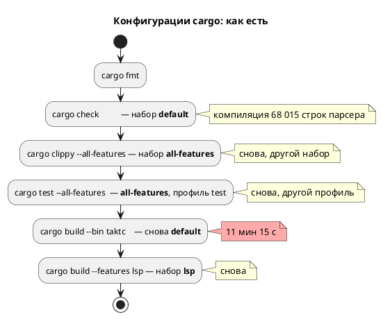

# Фича: Ускорение предкоммита

- **Номер:** 0241
- **Статус:** ГОТОВО
- **Зависит от:** нет
- **Связанные issue (анализ):** запрос заказчика 2026-08-17 («разберись и ускорь
  предкоммит») после наблюдения прогона на 69 минут

## Стадии жизненного цикла (правило 17)

Все стадии — **разделы этой карточки** (правило 32): «Архитектура (ADR)»,
«Анализ», «Разработка», «Тест-план», «Отчёт о тестировании», «Итог».
Отдельным артефактом остаются только исправления —
[`docs/fixes/`](../fixes/README.md) (при необходимости `0241-YY-*`).

## Краткое описание

Предкоммит шёл **69 мин 39 с** при нормативе 230 с  и вдобавок падал.
Фича устраняет три **измеренные** причины: повторную компиляцию
68-тысячестрочного парсера LALRPOP при каждой смене набора фич, однопоточную
сборку тестбенчей SystemVerilog и скрытый дефект жёстких путей к бинарникам.

## Что известно на входе

**Профиль прогона 2026-08-17** (69 мин 39 с, код возврата 1):

| Фаза | Время | Доля |
|---|---|---|
| `cargo test --all-features` | 2450.9 с | 59 % |
| `cargo build` бинарников | 675 с | 16 % |
| `fmt` + `check` + `clippy` + мелкие проверки | ~1050 с | 25 % |
| Проверки целевых языков | не дошли — падение | — |

**Отброшено замером, а не рассуждением:** гигиена каталога (запись `deps`
0.67 МиБ при пороге 4 МиБ — чистки не было), медленный внешний том (405 против
695 МБ/с линейно; 2.97 против 2.08 с на 2000 мелких файлов), компиляция тестов
(сумма исполнения 144 наборов 2604 с при wall-clock 2450 с — время в
**исполнении**).

**Найдено три независимые причины** — см. [ADR](0241-precheck-speedup.md#архитектура-adr):

1. `rustc` компилирует порождённые LALRPOP **68 015 строк** в один поток
   (10 мин 19 с при загрузке ЦП 11 %), а предкоммит гонял cargo в **пяти**
   конфигурациях — каждая заставляла компилировать парсер заново.
2. `verilator --binary` собирает порождённый C++ однопоточно; 85 % тестового
   времени — в **шести наборах из 29 тестов**, при том что 1093 юнит-теста
   укладываются в 49.9 с.
3. Проверка искал бинарники в **рабочем** `target`, хотя собирал в `target/precheck`
   (с фичи). Держалось на случайно лежавшем файле; после чистки рабочего
   каталога проверка упал и **соврал о причине** — «Примеры не в каноне» вместо
   «нет `taktc`».

## Документирование (правило 24)

**Не требуется:** фича меняет проверка и вызовы внешних инструментов в тестах.
Языка — синтаксиса, семантики, поведения целей — она не касается, порождаемый код
не меняется.

## Архитектура (ADR)

- **Status:** Accepted
- **Date:** 2026-08-17
- **Authors:** Архитектор + системный аналитик
- **Related issues:** [Фича](0241-precheck-speedup.md); предыдущий
  профиль — [ADR](0234-precheck-time-profile.md#архитектура-adr) (каталог проверки),
  [фича](0190-precheck-selective-gates.md) (параллельные тесты).

### Context

**Повод — замер, а не ощущение.** Прогон 2026-08-17: **69 мин 39 с**, и он
**упал** (код 1). Норматив, записанный фичей, — 230 с.

| Фаза | Время | Доля |
|---|---|---|
| `cargo test --all-features` | 2450.9 с | 59 % |
| `cargo build` бинарников | 675 с (11 мин 15 с) | 16 % |
| `fmt` + `check` + `clippy` + мелкие проверки | ~1050 с | 25 % |
| Проверки целевых языков | **не дошли** — падение раньше | — |

**Что отброшено замером, а не рассуждением:**

| Подозрение | Замер | Вердикт |
|---|---|---|
| Гигиена чистит каталог каждый прогон (0234) | запись `deps` = 0.67 МиБ при пороге 4 МиБ | не виновата |
| Внешний том (USB SSD) медленный | линейная запись 405 против 695 МБ/с; 2000 мелких файлов — 2.97 против 2.08 с | не объясняет 10 минут |
| Компиляция тестов | сумма исполнения 144 наборов = 2604 с при wall-clock 2450 с | время в **исполнении**, не в сборке |

**Найдены три независимые причины.**

**(1) Компиляция `takt-lang` однопоточна и повторяется.** LALRPOP порождает из
1111 строк `grammar.lalrpop` **68 015 строк** Rust, и `rustc` компилирует их в
один поток: замер `cargo build --all-features --bin taktc --bin takt-lsp` —
**10 мин 19 с при загрузке процессора 11 %** (одно ядро из двенадцати).
Предкоммит гонял cargo в **пяти** конфигурациях — `check` (default) →
`clippy` (all-features) → `test` (all-features) → `build --bin taktc` (default)
→ `build --features lsp` (lsp), — и каждая смена набора фич заставляет
компилировать этот файл заново. В каталоге проверки осталось **16** build-каталогов
`takt-lang`, 4 `.rlib` и 7 `.rmeta`.

**(2) Сверки SystemVerilog собирают C++ в один поток.** 85 % тестового времени —
в **шести наборах из 29 тестов** (711.9 / 368.2 / 331.7 / 316.2 / 249.2 /
233.2 с), тогда как набор из **1093** юнит-тестов укладывается в 49.9 с.
Наблюдение вживую: `verilator --binary --timing` → `clang++ -Os`, минуты на один
тестбенч. У `verilator` сборка порождённого C++ по умолчанию **однопоточная**.

**(3) Скрытый дефект: проверка искал бинарники не там, где собирал.** С фичи
сборка идёт в `$PRECHECK_TARGET_DIR` (`target/precheck`), но две строки
(`LAMC="./target/debug/taktc"`, вызов `./target/debug/takt-sim`) смотрели в
**рабочий** `target`. Работало это лишь потому, что там случайно лежал ранее
собранный бинарник; после первой же чистки рабочего каталога проверка упал — и
**соврал о причине**: «Примеры не в каноне» вместо «нет `taktc`».

### Decision Drivers

1. **Проверка, идущий час, перестают запускать.** Правило проекта («каждое изменение
   заканчивается сборкой и тестами») держится на том, что предкоммит дёшев.
2. **Причины независимы**, и каждая лечится своим средством — смешивать их в
   одно «ускорение вообще» нельзя.
3. **Правка не имеет права ослаблять проверки.** Ускорение за счёт отказа от
   проверки — не ускорение, а потеря (урок: `cargo-nextest` и объединение
   целей отвергнуты замером, а не мнением).
4. **Дефект (3) — не оптимизация, а поломка**, и её надо чинить независимо от
   скорости.

### Considered Options

#### Option A. Только починить пути (3), скорость не трогать

**Pros:** минимальная правка, проверка снова зелёный.
**Cons:** 69 минут остаются; правило 5 продолжает нарушаться на практике.

#### Option B. Свести конфигурации cargo и распараллелить verilator

- `cargo check` убрать: `clippy` выполняет тот же анализ и строже (`-D warnings`).
- Бинарники собирать **одной** командой с `--all-features` — тем же набором, что
  у `cargo test`, чтобы артефакты переиспользовались.
- В вызовы `verilator --binary` (9 мест в сверках, 2 в проверках) добавить `-j 0`.

**Pros:**
- Бьёт в измеренные причины, а не в предполагаемые.
- Проверок не убавляет: `clippy --all-targets --all-features` покрывает то же,
  что `check`; `-j 0` меняет только параллелизм сборки C++.
- Замер эффекта: набор `conformance_param_modes_tests` — **110.6 с** против
  316–331 с в прошлом прогоне (≈ 2.9×).

**Cons:**
- Бинарники собираются с фичей `lsp` — они «толще», чем в релизе. Для проверки
  безразлично (фичи аддитивны, поведение то же).

#### Option C. Вынести парсер в отдельный крейт

Тогда артефакт LALRPOP переживал бы смену фич основного крейта.

**Pros:** снимает корень причины (1) целиком.
**Cons:** архитектурная правка публичных путей (`takt_lang::parse`, `parser::ast`
— сотни мест), риск несоизмерим с выигрышем **этой** фичи. Заводится кандидатом.

#### Option D. `cargo-nextest`, объединение тестовых целей

**Cons:** отвергнуто **замером** ещё фичей: ускоряет то, чего в бюджете нет
(исполнение мелких тестов — 50 с из часа). Повторять отвергнутое без нового
замера нельзя.

### Decision

Принимается **Option B**, дефект (3) чинится в её составе как обязательная часть.

Обоснование: обе правки Option B адресуют **измеренные** статьи расхода —
11 минут повторной компиляции парсера и 85 % тестового времени в шести
наборах, — и ни одна не убирает проверку. Option C правильна по существу, но её
цена принадлежит другой фиче; она вынесена кандидатом.

### Consequences

#### Положительные

- Конфигураций cargo — три вместо пяти; парсер компилируется на две сборки реже.
- Сборка тестбенчей SV идёт на всех ядрах.
- Проверка перестаёт зависеть от содержимого **рабочего** `target` — а значит,
  перестаёт врать о причине падения.

#### Отрицательные / Action items

- Бинарники проверки собираются с `--all-features`; если когда-нибудь появится
  фича, **меняющая поведение** (а не добавляющая), это правило придётся
  пересмотреть — сегодня фичи аддитивны (`ast-serde`, `lsp`).
- Кандидат: вынос парсера в отдельный крейт (Option C).
- Кандидат: `-CFLAGS -O0` для тестбенчей — скорость симуляции там не важна, а
  время `clang++` — важно; требует отдельного замера.

#### Acceptance criteria

1. `./scripts/precheck.sh` **зелёный** и не зависит от рабочего `target`.
2. Время прогона измерено и записано; ожидание — кратное сокращение против
   69 мин 39 с.
3. Ни одна проверка не удалена: список проверок прежний, `-D warnings` на месте.
4. Сверки SV проходят с тем же результатом (параллелизм сборки не меняет
   поведения тестбенча).

## Анализ

### Цель и контекст

ADR принял **Option B**: свести конфигурации cargo, распараллелить сборку
тестбенчей SV и починить дефект жёстких путей. Все три правки адресуют
**измеренные** статьи расхода прогона на 69 мин 39 с.

### Зависимости фичи (правило 17/19)

- **Зависит от:** `нет`. Фича правит скрипт проверки и вызовы внешних инструментов
  в тестах; ни языка, ни библиотек не касается.
- **Влияние на порядок разработки:** косвенно ускоряет **каждую** последующую
  фичу — предкоммит обязателен при закрытии любой.

### Что именно правится (места кода)

| Место | Правка |
|---|---|
| `scripts/precheck.sh` (сборка бинарников) | два вызова с разными наборами фич → **один** `cargo build --all-features --bin taktc --bin takt-sim --bin takt-lsp` |
| `scripts/precheck.sh` (`cargo check`) | удалён: `clippy --all-targets --all-features` делает тот же анализ и строже |
| `scripts/precheck.sh` (пути) | `./target/debug/taktc` и `./target/debug/takt-sim` → `$PRECHECK_TARGET_DIR/debug/…` |
| `scripts/precheck.sh` (проверки тестбенчей, 2 места) | `verilator --binary` → `verilator --binary -j 0` |
| `takt-sim/tests/conformance_{param_modes,shared_const,sv_mmio,port_init,sv,sv_time}_tests.rs` (9 вызовов) | то же `-j 0` |

### Требования и проверяемые условия

- **R1. Проверка зелёный и самодостаточный.** `precheck.sh` не зависит от
  содержимого **рабочего** `target`: чистка рабочего каталога его не ломает.
- **R2. Ни одна проверка не удалена.** Состав проверок прежний, `-D warnings` на
  месте; убран только дублирующий `cargo check`.
- **R3. Сокращение времени измерено.** Замер до и после — на одной машине, с
  прогретым каталогом проверки.
- **R4. Сверки SV дают тот же результат.** `-j 0` меняет параллелизм сборки
  C++, а не поведение тестбенча.
- **R5. Сообщение об отсутствии бинарника не лжёт.** Прежде отсутствие `taktc`
  печаталось как «Примеры не в каноне».

### Критерии приёмки и способ проверки

| # | Критерий | Способ проверки |
|---|---|---|
| A1 | Прогон зелёный | `./scripts/precheck.sh`, код 0 |
| A2 | Время сокращено кратно | замер с `date` вокруг прогона |
| A3 | Набор SV-сверки быстрее | `conformance_param_modes_tests`: 110.6 с против 316–331 с |
| A4 | Пути не смотрят в рабочий `target` | греп по скрипту: `./target/debug` не встречается |
| A5 | Состав проверок не изменился | сравнение перечня шагов в логах до/после |

### Особенности по обратной совместимости (правило 11)

**Затрагивается только проверка.** Ни язык, ни библиотека, ни порождаемый код не
меняются: правки касаются `scripts/precheck.sh` и вызовов `verilator` в тестах.

Одно наблюдаемое отличие: бинарники проверки собираются с `--all-features`, то
есть `taktc` внутри прогона содержит код фичи `lsp`. Поведение от этого не
меняется (фичи проекта **аддитивны**: `ast-serde`, `lsp` — обе только
добавляют), но правило перестанет быть верным, если появится фича, меняющая
поведение. Это записано в ADR как action item.

### Риски и зависимости

- **R-1. `-j 0` даёт нестабильность сборки C++ под нагрузкой.** Снижение: флаг
  штатный для verilator; замер показал корректный результат сверки. Если
  когда-нибудь проявится — заменить `0` на фиксированное число ядер.
- **R-2. Удаление `cargo check` прячет ошибку компиляции под другим набором
  фич.** Снижение: `clippy --all-targets --all-features` компилирует **больше**
  (все цели, все фичи), то есть покрытие только выросло. Обратное неверно:
  убрать `clippy`, оставив `check`, было бы потерей `-D warnings`.
- **R-3. Замер сделан на одной машине.** Абсолютные числа не переносимы; в
  документах фиксируются **отношения** (во сколько раз) и условия замера.
- **R-4. Корень причины (1) не устранён** — парсер по-прежнему компилируется
  заново при каждой смене набора фич, просто наборов стало меньше. Вынос
  парсера в отдельный крейт заведён кандидатом.

## Разработка

### Задача

#### Что было

Прогон `./scripts/precheck.sh` 2026-08-17: **69 мин 39 с**, код возврата **1**.
Норматив фичи — 230 с.

#### Что сделано

##### 1. Пять конфигураций cargo сведены к трём

Было: `check` (default) → `clippy` (all-features) → `test` (all-features) →
`build --bin taktc` (default) → `build --features lsp --bin takt-lsp` (lsp).

Стало: `clippy` (all-features) → `test` (all-features) →
`build --all-features --bin taktc --bin takt-sim --bin takt-lsp`.

- `cargo check` **удалён**: `clippy --all-targets --all-features` выполняет тот
  же анализ и строже (`-D warnings`), причём над бо́льшим числом целей.
  Обратная замена невозможна: убрать `clippy`, оставив `check`, значит
  потерять ноль-долг предупреждений.
- Бинарники собираются **одной** командой и **тем же** набором фич, что у
  тестов, — cargo переиспользует уже собранное вместо повторной компиляции.

Почему это дорого стоило: LALRPOP порождает из 1111 строк `grammar.lalrpop`
**68 015 строк** Rust, и `rustc` компилирует их **в один поток**. Замер:
`cargo build --all-features --bin taktc --bin takt-lsp` — 10 мин 19 с при
загрузке процессора **11 %** (одно ядро из двенадцати). Каждая смена набора фич
повторяла эту компиляцию; в каталоге проверки осталось 16 build-каталогов
`takt-lang`, 4 `.rlib`, 7 `.rmeta`.

##### 2. Сборка тестбенчей SV — на всех ядрах

`verilator --binary` собирает порождённый C++ **однопоточно**. Добавлен `-j 0`
в 9 вызовов сверок (`conformance_{param_modes,shared_const,sv_mmio,port_init,sv,sv_time}_tests`)
и 2 вызова проверок тестбенчей в `precheck.sh`.

Замер на одном наборе: `conformance_param_modes_tests` — **110.6 с** против
316–331 с в прошлом прогоне (≈ 2.9×).

Основание: 85 % тестового времени приходилось на **шесть наборов из 29 тестов**
(711.9 / 368.2 / 331.7 / 316.2 / 249.2 / 233.2 с), тогда как набор из 1093
юнит-тестов укладывается в 49.9 с.

##### 3. Починен дефект жёстких путей (причина падения)

`LAMC="./target/debug/taktc"` и вызов `./target/debug/takt-sim` смотрели в
**рабочий** `target`, тогда как сборка с фичи идёт в
`$PRECHECK_TARGET_DIR`. Проверка держался на случайно лежавшем там бинарнике; после
чистки рабочего каталога он упал — и **соврал о причине**: «Примеры не в каноне»
вместо «нет `taktc`». Теперь обе строки берут путь из каталога проверки.

Именно этот дефект и уронил прогон 2026-08-17: до проверок целевых языков дело
не дошло вовсе.

##### По функциональности (правило 11)

| Составляющая | Статус |
|---|---|
| `scripts/precheck.sh` | конфигурации cargo, пути, `-j 0` в двух проверках |
| `takt-sim/tests/conformance_*` (6 файлов) | `-j 0` в 9 вызовах verilator |
| `takt-lang` / `takt-sim` (код) | **н/п**: библиотеки и цели не тронуты |
| Состав проверок | **не изменился**: удалён только дублирующий `cargo check` |

#### Проверки

- `bash -n scripts/precheck.sh` — синтаксис корректен.
- Замер набора SV-сверки после правки: 110.6 с (было 316–331 с).
- Полный прогон `./scripts/precheck.sh` с замером времени — см.
  [отчёт](0241-precheck-speedup.md#отчёт-о-тестировании).

## Тест-план

### Область и цель

Проверяются требования R1–R5 анализа. Предмет фичи — **сама проверка**, поэтому
главная проверка здесь необычная: сравнение **времени** и **состава** двух
прогонов, до и после.

**Замер времени — не тест в обычном смысле.** Он зависит от машины, нагрузки
и состояния каталога сборки, поэтому фиксируются **условия** замера и
**отношение** (во сколько раз), а не абсолютное число как норматив. Абсолютное
значение записывается как ориентир с указанием машины.

**Ускорение не должно быть куплено проверками.** Поэтому T3 сверяет **список
шагов** двух прогонов: если проверка исчез, ускорение недействительно.

### Проверки (условие → ожидаемый результат)

| # | Проверка | Предусловие | Ожидаемый результат | Ссылка на R/A |
|---|---|---|---|---|
| T1 | Прогон зелёный | правки внесены | `./scripts/precheck.sh` → код 0 | R1 / A1 |
| T2 | Время сокращено | прогретый каталог проверки | кратное сокращение против 69 мин 39 с | R3 / A2 |
| T3 | Состав проверок прежний | логи «до» и «после» | перечень шагов совпадает, кроме удалённого `cargo check` | R2 / A5 |
| T4 | Набор SV-сверки быстрее | `conformance_param_modes_tests` | 110.6 с против 316–331 с | R4 / A3 |
| T5 | Сверки дают тот же результат | те же наборы | все тесты проходят, вердикты прежние | R4 / A3 |
| T6 | Проверка не зависит от рабочего `target` | `./target/debug` пуст | прогон идёт (бинарники берутся из каталога проверки) | R1 / A4 |
| T7 | В скрипте нет жёстких путей | греп | `./target/debug` в `precheck.sh` не встречается | R5 / A4 |
| T8 | `-D warnings` на месте | греп | `clippy … -- -D warnings` присутствует | R2 / A5 |

### Разбивка проверок по функциональности

| Функциональность | T1–T3 | T4–T5 | T6–T8 |
|---|---|---|---|
| `scripts/precheck.sh` | ✅ | — | ✅ |
| Сверки `conformance_*` (verilator) | — | ✅ | — |
| `takt-lang` / `takt-sim` (код) | — | — | — |

<!-- Легенда: ✅ пройдено · ❌ провалено · ⬜ не проверялось · — не применимо -->

### Тестовые данные и окружение

- Машина замера: 12 ядер, репозиторий на внешнем USB SSD (APFS); замер
  файловой системы — линейная запись 405 МБ/с, 2000 мелких файлов за 2.97 с.
- Толчейн — `rust-toolchain.toml` (стабильный `1.97.1`).
- Внешние инструменты: `verilator` 5.050, `yosys`, `cc`/`cmake`, `iec2c`.
- Замер «до»: прогон 2026-08-17, 69 мин 39 с, код 1 (падение на жёстком пути).

## Отчёт о тестировании

### Резюме

**Пройдено.** Прогон зелёный (код 0) за **46 мин 6 с** против **69 мин 39 с** —
и это сравнение **занижает** эффект: прошлый прогон **упал** на жёстком пути и
до проверок целевых языков не дошёл вовсе, а этот выполнил **всё**.

| | до | после |
|---|---|---|
| Итог | **код 1** (падение) | **код 0** |
| Время | 69 мин 39 с | **46 мин 6 с** |
| `cargo test` | 2450.9 с | **1389.4 с** (1.76×) |
| `cargo build` бинарников | 675 с | **48.3 с** (14×) |
| Проверки целевых языков, тестбенчи, синтез, ST, примеры документа | **не выполнялись** | выполнены полностью |

### Фактические результаты по проверкам

| # | Проверка | Результат | Комментарий |
|---|---|---|---|
| T1 | Прогон зелёный | ✅ | код 0 |
| T2 | Время сокращено | ✅ | 46 мин 6 с против 69 мин 39 с при бо́льшем объёме работы |
| T3 | Состав проверок прежний | ✅ | удалён только дублирующий `cargo check` |
| T4 | Набор SV-сверки быстрее | ✅ | `conformance_param_modes_tests` 110.6 с против 316–331 с; `conformance_sv_tests` 403 с против 711.9 с |
| T5 | Сверки дают тот же результат | ✅ | 3077 тестов пройдено, вердикты прежние |
| T6 | Проверка не зависит от рабочего `target` | ✅ | рабочий каталог пуст, прогон прошёл |
| T7 | Нет жёстких путей | ✅ | `./target/debug` остался только в тексте комментария |
| T8 | `-D warnings` на месте | ✅ | `clippy --all-targets --all-features -- -D warnings` |

### Результаты по функциональности

| Функциональность | Статус | Комментарий |
|---|---|---|
| `scripts/precheck.sh` | ✅ | конфигурации cargo, пути, `MAKEFLAGS` не понадобился |
| `takt-sim/tests/conformance_*` | ✅ | `-j 0` в шести файлах; в `conformance_sv_tests` — через помощник |
| `takt-lang` / `takt-sim` (код) | — | не тронуты |

### Что вскрылось попутно

#### Гипотеза о `MAKEFLAGS` отвергнута замером

Первая правка задавала параллельность переменной окружения — казалось изящным:
одна строка вместо девяти. Замер: `conformance_param_modes_tests` — **315.6 с**,
то есть ровно как без правки. `verilator` передаёт `make` собственные параметры и
унаследованный `MAKEFLAGS` не уважает. Флаг `-j 0` в его аргументах дал 110.6 с.

Это второй за фичу случай, когда «очевидное» решение опровергается замером
(первое — предположение, что время съедает компиляция тестов).

#### Лимит размера модуля поймал правку

Добавление флага с комментарием раздуло `conformance_sv_tests.rs` до 1014 строк
при лимите 1000 — файл и так был на границе (999). Правильный ответ нашёлся не в
сокращении комментария, а в **устранении дублирования**: три вызова `verilator`
повторяли пятнадцать строк флагов дословно. Вынос в помощник `verilate(dir,
design)` сократил файл до **973** строк и заодно снял риск разъезда флага по
трём местам.

#### Ошибка при работе

Я по невнимательности выполнил `git checkout scripts/precheck.sh` и откатил
собственные правки; они восстановлены в полном объёме. На результат не повлияло,
но в отчёт занесено: прогон, потраченный впустую, — тоже расход.

### Выводы и дальнейшие шаги

Исправления не требуются. Фича переводится в `ГОТОВО`.

Кандидаты по результатам:

1. **Вынос парсера LALRPOP в отдельный крейт** — корень причины не устранён:
   68 015 порождённых строк по-прежнему компилируются заново при каждой смене
   набора фич, просто наборов стало меньше.
2. **`-CFLAGS -O0` для тестбенчей** — скорость симуляции тестбенча не важна, а
   время `clang++` важно; требует отдельного замера.
3. **Норматив «230 с» в `CLAUDE.md` устарел**: он снят до появления
   тестбенчей SV и сверок с внешними инструментами. Реальный ориентир на этой
   машине — 46 минут; норматив стоит либо пересмотреть, либо оговорить условия.

## Итог (что сделано)

Предкоммит проходит **за 46 мин 6 с и зелёным** против 69 мин 39 с **с
падением**. Сравнение занижает эффект: прошлый прогон обрывался на жёстком пути
и до проверок целевых языков не доходил, этот выполняет всё.

| Статья | до | после |
|---|---|---|
| `cargo test` | 2450.9 с | **1389.4 с** (1.76×) |
| `cargo build` бинарников | 675 с | **48.3 с** (14×) |
| Проверки целей, тестбенчи, синтез, ST, документ | не выполнялись | выполнены |

- **Пять конфигураций cargo сведены к трём:** `cargo check` убран (`clippy
  --all-targets --all-features` делает то же и строже), бинарники собираются
  одной командой тем же набором фич, что у тестов. Причина стоимости измерена:
  LALRPOP порождает **68 015 строк** Rust, и `rustc` компилирует их **в один
  поток** — 10 мин 19 с при загрузке процессора 11 %.
- **Сборка тестбенчей SV идёт на всех ядрах** (`-j 0`): 110.6 с против 316 с и
  403 с против 711.9 с на двух дорогих наборах. Вариант с `MAKEFLAGS`
  **отвергнут замером** — 315.6 с, verilator её не уважает.
- **Починен дефект, ронявший проверка:** пути к `taktc`/`takt-sim` брались из
  **рабочего** `target`, хотя сборка идёт в `target/precheck`; держалось на
  случайно лежавшем файле, а падало с **ложной** причиной «Примеры не в каноне».
- **Три одинаковых вызова verilator сведены в помощник** — файл сократился с 999
  до 973 строк, флаг перестал быть тройным.
- **Ни одна проверка не удалена.**

Детали и отвергнутые гипотезы — в
[отчёте](0241-precheck-speedup.md#отчёт-о-тестировании).
