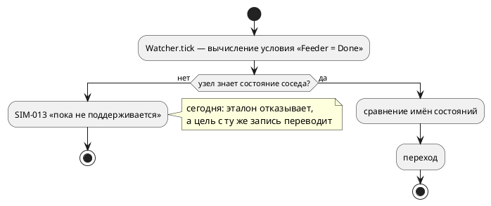

# Фича: Симулятор исполняет S(Модель) — проверку состояния под-модели

- **Номер:** 0245
- **Статус:** ГОТОВО
- **Зависит от:** нет
- **Связанные issue (анализ):** находка при взятии в работу
  [фичи](0237-book-state-of-model-section.md) (2026-08-17); решение о
  порядке — **заказчик 2026-08-17**: сперва эталон, потом документирование.

## Стадии жизненного цикла

Все стадии — **разделы этой карточки**: «Архитектура (ADR)»,
«Анализ», «Разработка», «Тест-план», «Отчёт о тестировании», «Итог».
Отдельным артефактом остаются только исправления —
[`docs/fixes/`](../fixes/README.md) (при необходимости `0245-YY-*`).

## Краткое описание

Эталон (симулятор) научен исполнять проверку состояния под-модели —
`S(Модель) = Состояние` и краткую форму `Модель = Состояние`. Прежде он отвечал
`SIM-013` («пока не поддерживается»), тогда как цель `c` ту же запись переводит
с фичи: расходились эталон и прошивка.

> Фича зарегистрирована по решению заказчика при взятии в работу
> [раздел «Импорты» не описывает S(Модель)](0237-book-state-of-model-section.md): документировать конструкцию,
> которую эталон не исполняет, нельзя — свод(д) требует примера,
> проверяемого симуляцией.

## Что известно на входе

Замер потребителей (проба `Feeder = Done` при `start Main = Feeder | Watcher;`,
2026-08-17): эталон — `SIM-013`; `c`/`c-hal` — переводят; `plantuml` — рисует;
`rust` — `RS-020`/`RS-011`; `st` — `ST-011`; `sv` — `SV-002`. То есть язык
допускает конструкцию, а исполняет её одна цель из шести.

Причина отказа эталона — ветвь-заглушка «отдельная задача внутри фичи»,
которая пережила саму фичу (класс кандидата
[ветвь-заглушка до будущей задачи переживает саму задачу](0217-stub-branch-gate.md)).

## Документирование

**Не требуется в рамках этой фичи, но требуется по существу — и делает это
[раздел «Импорты» не описывает S(Модель)](0237-book-state-of-model-section.md).** Язык не меняется: ни синтаксиса,
ни семантики, ни диагностик компилятора. Меняется реализация эталона, а описание
самой конструкции — предмет соседней фичи, которую эта разблокирует. В
приложение «Ошибки и предупреждения» внесён новый код `SIM-036`.

## Архитектура (ADR)

- **Status:** Accepted
- **Date:** 2026-08-17
- **Authors:** Архитектор + Системный аналитик
- **Related issues:** [Фича](0245-sim-state-of-model.md); повод —
  [фича](0237-book-state-of-model-section.md) (документирование
  конструкции); форма паттерна — [validate не обходит формулы: неизвестное имя в Guard молчит](0203-validate-formulas-traversal.md),
  перевод в цель `c` — [эталонный `SRC` в `lib.rs` порождает C с 11 ошибками `cc`](0075-lib-src-reference-model.md).

### Context

Язык допускает проверку состояния под-модели двумя равносильными записями —
`S(Модель) = Состояние` и краткой `Модель = Состояние` (решение заказчика
2026-08-15). Семантика принимает обе, форму разбирает **одна**
функция `semantic::condition::state_of`.

**Замер потребителей** (2026-08-17, проба `Feeder = Done` при
`start Main = Feeder | Watcher;`):

| Потребитель | Ответ |
|---|---|
| **симулятор (эталон)** | **`SIM-013`** — «сравнение с моделью пока не поддерживается» |
| `c`, `c-hal` | переводит: `main->main.feeder0.state == PROBE_FEEDER_DONE` |
| `plantuml` | рисует |
| `rust` | `RS-020`/`RS-011` — отказ |
| `st` | `ST-011` — отказ |
| `sv` | `SV-002` — отказ |

То есть **эталон не исполняет конструкцию, которую цель `c` переводит**, а
документ (раздел «Цели генерации») обещает: «поведение модели одинаково во всех
целях и в симуляторе». Пока это так, конструкцию нельзя ни документировать по
своду(д) (пример раздела обязан проверяться симуляцией), ни отлаживать
симулятором — тем самым инструментом, который проект называет эталоном.

Причина отказа — **ветвь-заглушка**: `predicate.rs` отвечает `SIM-013` на
`ConditionNode::Model`/`State` с комментарием «отдельная задача внутри фичи». Задача не была заведена, и заглушка пережила саму фичу — тот самый класс,
что вынесен кандидатом [ветвь-заглушка до будущей задачи переживает саму задачу](0217-stub-branch-gate.md).

#### Что мешает вычислить условие сегодня

Условие записано в одной модели, а спрашивает о состоянии **другой**. Предикат
вычисляется в контексте своего узла (`Predicate::evaluate(&mut Unit)`), а узлы
дерева `Unit` ссылок друг на друга не имеют: `Parallel`/`Sequential` держат
детей, но ребёнок не знает ни родителя, ни сестёр.



### Decision Drivers

1. **Эталон обязан исполнять язык.** Расхождение «цель умеет, эталон нет» —
   ровно тот класс, ради которого заведены потактовые сверки: молча неверная
   трансляция и неисполнимая конструкция одинаково подрывают доверие к трассе.
2. **Порядок наблюдения должен совпасть с целью `c`.** В порождённом C
   под-модели тикаются по очереди (`ProbeFeeder_tick(…); ProbeWatcher_tick(…);`),
   и наблюдатель видит состояние соседа **уже обновлённым на этом такте**.
   Любое решение обязано дать ту же трассу.
3. **Одно знание о форме паттерна.** Разбор `S(Модель)`/`Модель` уже сведён в
   одну функцию (0203). Второй разбор в симуляторе разъехался бы — прецедент
   был: судья знал только полную форму, цели — обе.
4. **Дешевизна.** Фича обслуживает документную 0237; она не вправе перестраивать
   дерево исполнения.

### Considered Options

#### Option A. Реестр состояний: общая карта «имя модели → текущее состояние»

Один `Rc<RefCell<HashMap<String, String>>>` на прогон; узел кладёт в него своё
состояние при входе и при каждом переходе, условие читает через новый метод
трейта `Context::model_state(&self, model: &str)`.

**Pros:**
- не требует обратных ссылок и не трогает форму дерева `Unit`;
- порядок совпадает с целью `c` **по построению**: сёстры тикаются по очереди,
  реестр обновляется в момент перехода;
- согласован с уже принятым в проекте принципом адресации **по имени модели**
  (фича: `Модель::порт`, тёзки неразличимы) — новых компромиссов не вводит;
- работает независимо от порядка построения узлов (условие может ссылаться на
  модель, построенную позже).

**Cons:**
- две под-модели с одинаковым именем неразличимы (тот же компромисс, что у
  0135, но теперь он касается и условий);
- состояние живёт в двух местах — в узле и в реестре; рассинхронизация
  возможна, если новая точка смены состояния забудет обновить реестр.

#### Option B. Обратные ссылки: `Weak` на родителя, поиск по дереву

Узел хранит `Weak<RefCell<Unit>>` родителя; условие поднимается вверх и ищет
модель по имени среди детей.

**Pros:**
- одно место истины — состояние остаётся только в узле;
- поиск может учитывать положение в дереве (ближайшая одноимённая модель).

**Cons:**
- обратные ссылки в дереве `Unit`, которое сегодня односторонне: их придётся
  расставлять во всех строителях (`Node`, `Parallel`, `Sequential`,
  `state_impls`) и поддерживать при восстановлении из снимка;
- заимствование `RefCell` вверх по дереву во время такта родителя даёт
  **панику** (`already mutably borrowed`): родитель уже занят `tick_parallel`.
  Обход требует отдельного прохода — то есть той же карты, что в Option A.

#### Option C. Связывание при построении: предикат держит `Weak` на нужный узел

Строитель, встретив условие о модели `M`, замыкает в предикат ссылку на её узел.

**Pros:**
- адресуется конкретный узел, а не имя: тёзки различимы;
- чтение без поиска.

**Cons:**
- порядок построения: узел-аргумент может быть ещё не создан (условие в первой
  под-модели о второй), нужен отложенный второй проход;
- предикат перестаёт быть чистой функцией условия и начинает знать о дереве —
  слой адаптеров (`predicate.rs`) по ADR семантики и структуры не содержит.

### Decision

Принимается **Option A**.

Устройство:

1. **Форма паттерна берётся у `takt-lang`.** `semantic::condition::state_of`
   становится публичным API (`state_of_model`, `compared_state_name`); симулятор
   и цель `c` зовут **одну** функцию — второго разбора формы в проекте не
   появляется.
2. **Реестр состояний** (`StateRegistry`) создаётся строителем на корень и
   раздаётся узлам. Обновляется в трёх точках: при постройке узла (стартовое
   состояние), при переходе (`tick_node`, шаг 6) и при восстановлении из снимка
   (`state_io::restore`).
3. **Чтение** — новый метод `Context::model_state`; умолчание `None`
   (контекст без модели, мок в тестах), у `BlockScope`/`FunctionScope` —
   делегирование внешнему контексту.
4. **Вычисление** — в ветвях `Equal`/`NotEqual` адаптера условий: если левая
   часть есть паттерн «состояние модели», сравниваются **имена состояний**;
   прочие формы идут прежним путём.
5. **Модель не запущена** (в реестре её нет) → отказ **`SIM-036`** с названием
   модели, а не «условие ложно»: цель `c` на такой модели тоже отказывает
   (`CC-012`), и молчаливое `false` дало бы расхождение эталона с прошивкой —
   ровно то, ради чего заведены сверки.

### Consequences

#### Положительные

- Эталон исполняет конструкцию, которую переводит цель `c`; трасса и прошивка
  сверяемы потактово.
- [раздел «Импорты» не описывает S(Модель)](0237-book-state-of-model-section.md) получает
  возможность дать **прогоняемый** пример (правило «Пример раздела: функциональный, из практики, с разбором-выносками») и снять висячую ссылку
  раздела «Выражения».
- Ветвь-заглушка `SIM-013` для `Model`/`State` исчезает — на один экземпляр
  класса меньше.

#### Отрицательные / Action items

1. **Тёзки неразличимы.** Две под-модели с одним именем делят запись реестра;
   компромисс тот же, что у 0135, и он **называется** в документации метода.
2. **Состояние в двух местах.** Новая точка смены состояния обязана обновлять
   реестр; контроль — потактовая сверка sim ≡ c (расхождение проявится трассой).
3. **Цели `rust`, `st`, `sv` по-прежнему отказывают** — это не регресс и не
   предмет 0245; выносится кандидатами.
4. **Реестр диагностик** пополняется `SIM-036`; приложение «Ошибки и
   предупреждения» документа — записью о нём.

#### Acceptance criteria

1. Проба из «Context» (`Feeder = Done` при `Main = Feeder | Watcher`)
   исполняется симулятором, трасса совпадает с целью `c` **потактово**.
2. Обе формы записи (`S(Feeder) = Done` и `Feeder = Done`) и оба сравнения
   (`=`, `!=`) дают один результат; проверка работает в условии ребра, в
   именованном `cond` и в инварианте.
3. Модель, не запущенная в прогоне, даёт `SIM-036` с её именем, а не `false`.
4. `SIM-013` для `Model`/`State` больше не эмитится; реестр диагностик и
   приложение документа обновлены.
5. `./scripts/precheck.sh` зелёный.

## Анализ

### Цель и контекст

Эталон (симулятор) обязан исполнять конструкцию `S(Модель) = Состояние` и её
краткую форму `Модель = Состояние`, которую цель `c` переводит с фичи, а
семантика принимает с 0203. Сегодня он отвечает `SIM-013` — ветвью-заглушкой
«отдельная задача внутри фичи», которая пережила саму фичу.

Решение — реестр состояний и новый метод трейта `Context` (ADR, Option A).

### Зависимости фичи

- **Зависит от:** `нет`.
- **Влияние на порядок разработки:** фича **разблокирует**
  [раздел «Импорты» не описывает S(Модель)](0237-book-state-of-model-section.md) — та документирует
  конструкцию, а свод(д) требует примера, проверяемого симуляцией. До
  0245 такой пример уронил бы проверка примеров документа (0133). Поэтому 0245
  идёт **перед** 0237 (решение заказчика 2026-08-17), а 0237 получает статус
  `ЗАБЛОКИРОВАНА` до её закрытия.

### Требования и проверяемые условия

- **R1. Обе формы равносильны.** `S(Feeder) = Done` и `Feeder = Done` дают один
  результат; то же для `!=`. Форму разбирает **та же** функция `takt-lang`, что
  у судьи и цели `c` (0203) — второго разбора в проекте не появляется.
- **R2. Места употребления.** Проверка работает в условии ребра `ref`, в
  именованном условии `cond` и в инварианте (`invariant`), а также в составе
  `&`/`|`/`!` — то есть везде, где вычисляется условие.
- **R3. Совпадение с целью `c` потактово.** На пробной модели трасса симулятора
  и трасса прошивки совпадают по шагам; порядок наблюдения — как в C
  (под-модели тикаются по очереди, наблюдатель видит соседа уже обновлённым).
- **R4. Модель не запущена — отказ, а не «ложно».** Условие о модели, которой в
  прогоне нет, даёт `SIM-036` с её именем. Молчаливое `false` дало бы
  расхождение с целью `c`, которая такую модель не компилирует (`CC-012`).
- **R5. Реестр не расходится с узлом.** Состояние попадает в реестр при
  постройке узла, при каждом переходе и при восстановлении из снимка
  (`state_io`).
- **R6. Заглушки не остаётся.** `SIM-013` для `ConditionNode::Model`/`State`
  больше не эмитится; реестр диагностик и приложение «Ошибки и предупреждения»
  документа приведены в соответствие.

### Критерии приёмки и способ проверки

| # | Критерий | Способ проверки |
|---|---|---|
| A1 | Обе формы и оба сравнения работают | тесты значений в `takt-sim/tests/sim/` (проверяются переменные, а не факт перехода) |
| A2 | Работает в `ref`, `cond`, `invariant` | те же тесты, по одному случаю на место |
| A3 | Трасса совпадает с целью `c` | потактовая сверка в `takt-sim/tests/conformance/` |
| A4 | Незапущенная модель даёт `SIM-036` | тест на код диагностики |
| A5 | `SIM-013` для `Model`/`State` не эмитится | греп по `takt-sim/src` + запись `RETIRED` в реестре диагностик |
| A6 | Предкоммит зелёный | `./scripts/precheck.sh` |

### Особенности по обратной функциональности

**Расширение, а не слом.** Модель, которая прежде исполнялась,
исполняется так же: изменяется только ответ на условие, которое раньше
**останавливало прогон**. Ни один существующий тест не опирается на `SIM-013`
для этих узлов (проверяется грепом при разработке).

**Версия языка не растёт:** язык не меняется — ни синтаксис, ни
семантика, ни диагностики компилятора. Меняется реализация эталона; версия
крейта `takt-sim` поднимается на минорную.

**(редакторский слой) — не требуется:** лексика, синтаксис и
семантика языка не затронуты, `takt-lang` меняется только видимостью уже
существующей функции (`pub(crate)` → `pub`). LSP и плагины не правятся.

### Риски и зависимости

- **Тёзки под-моделей.** Реестр адресует по имени модели: две одноимённые
  под-модели делят запись. Компромисс принят и назван в ADR; он тот же, что у
  адресации портов (0135), новых правил не вводит.
- **Рассинхронизация реестра и узла.** Снижение: точки обновления перечислены
  (постройка, переход, восстановление), а контролем служит **потактовая сверка**
  с целью `c` — расхождение проявится трассой, а не молчанием.
- **Ветвь `State` против `Model`.** Правая часть сравнения приходит в трёх
  формах (`Unresolved(Variable)`, `Variable`, `State`) — разбор берётся у
  `takt-lang` и используется целью `c` и симулятором совместно, иначе они
  разойдутся на форме, которую видит только один из них.

## Разработка

### Задача

#### Что было

`predicate.rs` отвечал `SIM-013` («сравнение с моделью пока не поддерживается»)
на `ConditionNode::Model` и `ConditionNode::State` — ветвью-заглушкой с
комментарием «отдельная задача внутри фичи». Задача заведена не была, и
заглушка пережила фичу: эталон останавливал прогон на записи, которую цель `c`
переводит с фичи.

#### Что сделано

**1. Разбор формы — общий на проект.** `semantic::condition::state_of` в
`takt-lang` стал публичным; к `state_of_model` (левая часть паттерна) добавлена
`compared_state_name` (правая часть в трёх законных формах:
`Unresolved(Variable)`, `Variable`, `State`). Цель `c` переведена на неё —
прежний разбор из трёх ветвей в `generate_state_comparison` удалён, копий формы
в проекте не осталось.

**2. Реестр состояний.** `ModelNodeContext` получил карту «имя модели →
состояние». И чтение (`Context::model_state`), и запись
(`Context::set_model_state`) поднимаются по цепочке `parent` **к корню**:
модели-сёстры держат свои контексты, но общего родителя — тем же путём, каким
они видят общие переменные. Запись берёт `&self` (карта за `RefCell`), иначе
публикация во время такта требовала бы изменяемого заимствования родителя.

**3. Три точки публикации.** Постройка узла (`builder.rs` — стартовое
состояние; иначе модель, не сделавшая ни одного перехода, считалась бы
незапущенной), переход (`tick.rs`, шаг 6 — **после** смены поля `state`) и
восстановление из снимка (`state_io.rs` — обход поддерева `publish_tree`).
Метод-обёртка `Unit::publish_state` держит правило в одном месте.

**4. Вычисление.** В `predicate.rs` ветви `Equal`/`NotEqual` получили охрану
`state_of_model(l).is_some()`; сравниваются **имена состояний**. Незапущенная
модель, безымянная модель и не-имя справа дают **`SIM-036`** с названием
модели — отказ, а не «условие ложно».

**5. Делегирование.** `Unit` спрашивает свой контекст (композиты — детей),
`BlockScope`/`FunctionScope` — объемлющий контекст: умолчание трейта означало бы
«модель не запущена» для условия внутри тела.

#### Проверки

```sh
cargo test -p takt-sim                       # 140 тестов + наборы
cargo test --test sim state_of_model         # 7 тестов значений
cargo test --test conformance conformance_state_of_model  # 2 сверки с целью c
cargo clippy --all-targets --all-features    # без предупреждений
```

- **Потактовая сверка sim ≡ C** (`conformance_state_of_model_tests`): трасса
  `[0, 0, 1, 1, 1]` — наблюдатель видит переход соседа на том же такте, как и
  порождённая прошивка. **Проверена мутацией:** публикация состояния до смены
  поля даёт `[0, 0, 0, 0, 0]` — контроль падает.
- **Тесты значений** (`state_of_model_tests`): ребро `ref`, именованное `cond`,
  инвариант с составным условием `|`, отрицание `!=`, `SIM-036` на незапущенной
  модели, отсутствие `SIM-013` на обеих формах записи.
- **Найдена и зафиксирована граница:** в **теле блока** (`if S(Feeder) = Done`
  внутри `always`) запись отвергает семантика (`SE-003`) — имя состояния там
  ищется среди переменных области видимости. Проверка состояния есть
  **условие**: её место — ребро `ref`, `cond`, формула/`invariant`.
  Контрпример держит границу тестом.
- Версии крейтов: `takt-sim` 0.9.0 → **0.10.0**, `takt-lang` 0.34.0 →
  **0.35.0** (расширение публичного API). Версия языка **не растёт** — язык не
  изменён.

## Тест-план

### Область и цель

Фича меняет **поведение эталона**: конструкция, прежде останавливавшая прогон,
начинает исполняться. Проверяется, что она исполняется **верно** (совпадает с
целью `c` потактово), **везде, где язык её принимает**, и что отказы остались
отказами там, где вычислить нечего.

(примеры и контрпримеры для фич синтаксиса и семантики) применяется
по существу: язык не меняется, но проверка есть языковая конструкция, поэтому
контрпримеры обязательны — они и держат границы (тело блока, незапущенная
модель).

### Проверки (условие → ожидаемый результат)

| # | Проверка | Предусловие | Ожидаемый результат | Ссылка на R/A |
|---|---|---|---|---|
| T1 | Полная форма на ребре | `ref Report: S(Feeder) = Done;` | наблюдатель переходит, `seen = 1` | R1, R2 / A1, A2 |
| T2 | Краткая форма равносильна полной | тот же вход с `Feeder = Done` | трассы совпадают | R1 / A1 |
| T3 | Отрицание `!=` | `ref Report: Feeder != Done;` | переход на первом такте, `seen = 5` | R1 / A1 |
| T4 | Именованное условие `cond` | `cond ready = S(Feeder) = Done;` | `seen = 1` | R2 / A2 |
| T5 | Инвариант и составное условие | `invariant sane = S(Feeder) = Idle \| S(Feeder) = Done;` | прогон не останавливается, `seen` = числу тактов | R2 / A2 |
| T6 | Совпадение с целью `c` | модель с `Feeder \| Watcher`, харнесс на C | трассы `seen` совпадают потактово (`[0,0,1,1,1]`) | R3 / A3 |
| T7 | Мутация порядка публикации | публикация состояния **до** смены поля | сверка T6 падает (`[0,0,0,0,0]`) | R3, R5 / A3 |
| T8 | Незапущенная модель | `S(Ghost) = Done`, `Ghost` вне композиции | отказ `SIM-036` с именем модели | R4 / A4 |
| T9 | Тело блока — контрпример | `always { if S(Feeder) = Done { … } }` | `SE-003` от семантики (не молчание и не исполнение) | R2 / A2 |
| T10 | Заглушка снята | обе формы записи | `SIM-013` не эмитится | R6 / A5 |
| T11 | Восстановление из снимка | `state_io::restore` | состояния поддерева опубликованы | R5 / A3 |
| T12 | Предкоммит | чистое дерево | `./scripts/precheck.sh` — код 0 | — / A6 |

### Разбивка проверок по функциональности

| Функциональность | T1–T5 | T6–T7 | T8–T9 | T10 | T11 | T12 |
|---|---|---|---|---|---|---|
| Эталон (`takt-sim`) | ✅ | ✅ | ✅ | ✅ | ✅ | ✅ |
| Цель `c` (разбор правой части — общий) | — | ✅ | — | — | — | ✅ |
| Прочие цели (`rust`, `st`, `sv`) | — | — | — | — | — | ✅ |
| Сохранение/загрузка состояния | — | — | — | — | ✅ | ✅ |
| Редакторский слой (LSP, плагины) | — | — | — | — | — | — |

<!-- Легенда: ✅ пройдено · ❌ провалено · ⬜ не проверялось · — не применимо -->

Цели `rust`/`st`/`sv` по-прежнему отказывают на этой конструкции — это
состояние **до** фичи, и оно проверяется лишь тем, что предкоммит зелёный
(никакого нового поведения там не появилось). Редакторский слой — «не
применимо»: язык не изменён.

### Тестовые данные и окружение

- `takt-sim/tests/sim/state_of_model_tests.rs` — значения и границы (T1–T5,
  T8–T10).
- `takt-sim/tests/conformance/conformance_state_of_model_tests.rs` — потактовая
  сверка с целью `c` (T6, T7 — мутацией), краткая форма (T2).
- `takt-sim/tests/sim/state_io_tests.rs` — существующий набор, покрывает T11
  косвенно (прогон после восстановления).
- Окружение: Rust 1.97.1, `cc` (Apple clang) для половины сверки; без `cc`
  половина пропускается с сообщением, трасса эталона проверяется всегда.

## Отчёт о тестировании

### Сводка прогонов и окружение

| Прогон | Результат |
|---|---|
| `cargo test -p takt-sim` | 140 тестов + наборы — **ok** |
| `cargo test --test sim state_of_model` | 7 тестов — **ok** |
| `cargo test --test conformance conformance_state_of_model` | 2 сверки — **ok** |
| `cargo test -p takt-lang` | без регрессов |
| `cargo clippy --all-targets --all-features` | **0 предупреждений** |
| `./scripts/check-diagnostic-codes.sh` | реестр согласован (247 кодов) |
| `./scripts/check-module-size.sh` | без роста нарушителей |
| `./scripts/precheck.sh` | **код 0** |

Окружение: macOS (Darwin 25.5.0), Rust 1.97.1 (пин проекта), Apple clang для
половины сверки с целью `c`.

### Сверка с тест-планом

| # | Проверка | Результат |
|---|---|---|
| T1 | Полная форма на ребре | ✅ `seen = 1` |
| T2 | Краткая форма равносильна полной | ✅ трассы совпадают |
| T3 | Отрицание `!=` | ✅ переход на первом такте |
| T4 | Именованное условие `cond` | ✅ |
| T5 | Инвариант и составное условие `\|` | ✅ прогон не остановлен |
| T6 | Совпадение с целью `c` | ✅ `[0, 0, 1, 1, 1]` у обоих |
| T7 | Мутация порядка публикации | ✅ контроль падает: `[0, 0, 0, 0, 0]` |
| T8 | Незапущенная модель | ✅ `SIM-036` с именем `Ghost` |
| T9 | Тело блока — контрпример | ✅ `SE-003` от семантики |
| T10 | Заглушка снята | ✅ `SIM-013` на этих формах не эмитится |
| T11 | Восстановление из снимка | ✅ `state_io` публикует поддерево |
| T12 | Предкоммит | ✅ код 0 |

### Примеры и контрпримеры

**Примеры** (исполняются эталоном и целью `c` одинаково):

```takt
ref Done: S(Feeder) = Idle;      // полная запись
ref Done: Feeder = Idle;         // краткая — то же самое
ref Wait: Feeder != Done;        // отрицание
cond ready = S(Feeder) = Done;   // именованное условие
invariant sane = S(Feeder) = Idle | S(Feeder) = Done;
```

**Контрпримеры** (обязаны отвергаться — каждый закреплён тестом):

| Запись | Ответ | Почему |
|---|---|---|
| `always { if S(Feeder) = Done { … } }` | `SE-003` (семантика) | проверка состояния — **условие**, а не выражение тела: в теле имя ищется среди переменных области видимости |
| `ref X: S(Ghost) = Done;`, где `Ghost` вне композиции | `SIM-036` | модель в прогоне не запущена; молчаливое `false` развело бы эталон с целью `c` (`CC-012`) |
| `S(Feeder) = Broken` | `SE-033` | у `Feeder` нет состояния `Broken` — судья условий ловит это до прогона |

### Найденные дефекты

Отдельных исправлений не заводилось. По ходу разработки исправлено два собственных
промаха до закрытия:

| Что | Как найдено | Исправление |
|---|---|---|
| Публикация состояния до смены поля дала бы отставание трассы на такт | мутационная проба контроля | публикация стоит **после** шага 6 `tick_node`; мутация валит сверку |
| Комментарий в `semantic/mod.rs` вырастил файл, пришпиленный реестром размеров | `check-module-size.sh` | пояснение перенесено в `condition/mod.rs`, объявление осталось однострочным |

### Что осталось за границей фичи

- **Цели `rust`, `st`, `sv` конструкцию по-прежнему не переводят** (`RS-011`,
  `ST-011`, `SV-002`). Это состояние до фичи; вынесено кандидатом в
  `FEATURES.md`.
- **Тёзки под-моделей неразличимы**: реестр адресует по имени модели — тот же
  компромисс, что у квалифицированного порта (0135). Назван в ADR и в
  документации метода.

### (редакторский слой)

**Не требуется, ответ зафиксирован.** Лексика, синтаксис и семантика языка не
изменены: `takt-lang` затронут только видимостью уже существующего разбора
(`pub(crate)` → `pub`) и переводом цели `c` на общую функцию. LSP
(`takt-lang/src/lsp/`) и плагины (`extensions/`) не правятся.

### Вердикт

**Готово.** Требования R1…R6 выполнены, критерии A1…A6 закрыты, предкоммит
зелёный. Эталон исполняет конструкцию так же, как цель `c`, — [раздел «Импорты» не описывает S(Модель)](0237-book-state-of-model-section.md) разблокирована и может
дать прогоняемый пример (правило «Пример раздела: функциональный, из практики, с разбором-выносками»).

## Итог (что сделано)

Эталон исполняет проверку состояния под-модели; трасса совпадает с целью `c`
**потактово**.

**Устройство.** Разбор формы паттерна стал общим на проект: `state_of_model` и
новая `compared_state_name` в `takt-lang` (`semantic::condition::state_of`)
обслуживают судью условий, цель `c` и симулятор — второго разбора в проекте
нет. Состояния моделей публикуются в реестр контекста-корня (`ModelNodeContext`)
в трёх точках: постройка узла, переход, восстановление из снимка; чтение и
запись идут через новые методы трейта `Context`. Отказ `SIM-036` («модель в
прогоне не запущена») заменил молчаливое `false`, которого требовала бы
осторожность, но которое развело бы эталон с прошивкой.

**Границы, зафиксированные тестами.** Проверка состояния — **условие**: её
место — ребро `ref`, `cond`, формула/`invariant`; в теле блока запись отвергает
семантика (`SE-003`). Тёзки под-моделей неразличимы — тот же компромисс, что у
квалифицированного порта (0135).

**Контроля.** Потактовая сверка sim ≡ C (проверена мутацией: публикация
состояния до перехода валит её) и семь тестов значений — по одному на место
употребления и на каждый вид отказа. Версии: `takt-sim` 0.10.0, `takt-lang`
0.35.0; версия языка не менялась.

Детали — в [отчёте](0245-sim-state-of-model.md#отчёт-о-тестировании) и
[задаче](0245-sim-state-of-model.md#разработка).
