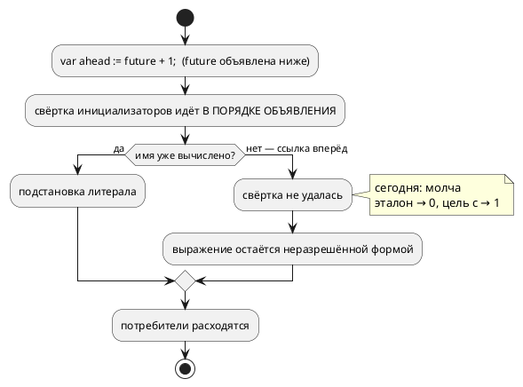

# Фича: Ссылка вперёд в инициализаторе переменной — ошибка компиляции

- **Номер:** 0246
- **Статус:** ГОТОВО
- **Зависит от:** нет
- **Связанные issue (анализ):** находка при взятии
  [фичи](0222-book-variables-const-fold.md) (2026-08-17); решение о
  порядке — **заказчик 2026-08-17**: сперва диагностика, потом документ.

## Стадии жизненного цикла

Все стадии — **разделы этой карточки**: «Архитектура (ADR)»,
«Анализ», «Разработка», «Тест-план», «Отчёт о тестировании», «Итог».
Отдельным артефактом остаются только исправления —
[`docs/fixes/`](../fixes/README.md) (при необходимости `0246-YY-*`).

## Краткое описание

Правило [константное выражение в инициализаторе объявления](0192-const-init-fold.md) — «имя в инициализаторе значит
начальное значение и ссылается только назад по тексту» — не проверялось ничем.
Теперь ссылка на переменную, объявленную ниже, отвергается диагностикой
**`SE-109`**.

## Что известно на входе

Замер (проба `var ahead: u8 := future + 1; var future: u8 := 3;`, 2026-08-17):
эталон давал `ahead = 0`, цель `c` — `1` (собрано и запущено), `st` теряла
инициализатор, `rust` отвечал `RS-017`, `sv` — `SV-002`. **Один вход — пять
ответов**, два из них молчаливые и различающиеся между собой.

Ссылка вперёд на **константу** работает согласованно (эталон и цель `c` дают
одно значение) — у констант разрешение идёт проходами до неподвижной точки
([вывод типов не протягивает тип через ссылку константа-константа](0204-const-ref-type-inference.md)); правило её не касается.

## Документирование

**Требуется — и выполняется фичей [раздел документа о переменных не отражает свёртку инициализатора](0222-book-variables-const-fold.md)**:
раздел «Типы данных» получил подраздел «Инициализатор вычисляется при сборке»,
где правило описано вместе с `SE-109`. Приложение «Ошибки и предупреждения»
дополнено кодом в рамках этой фичи.

## Архитектура (ADR)

- **Status:** Accepted
- **Date:** 2026-08-17
- **Authors:** Архитектор + Системный аналитик
- **Related issues:** [Фича](0246-init-forward-reference.md); повод —
  проба при взятии [раздел документа о переменных не отражает свёртку инициализатора](0222-book-variables-const-fold.md);
  свёртка инициализатора — [константное выражение в инициализаторе объявления](0192-const-init-fold.md).

### Context

[константное выражение в инициализаторе объявления](0192-const-init-fold.md) ввела правило: имя переменной
в позиции инициализатора значит её **начальное значение** и ссылается только
**назад по тексту** (решение заказчика). Правило записано в карточке фичи, но
**никем не проверяется**: ссылка вперёд принимается молча, и пять потребителей
отвечают на неё по-разному.

**Замер** (2026-08-17, вход `var ahead: u8 := future + 1; var future: u8 := 3;`):

| Потребитель | Ответ |
|---|---|
| **эталон (симулятор)** | `ahead = 0` — свёртка не удалась, значение потеряно молча |
| **цель `c`** | `model->ahead = model->future + 1;` печатается **до** `model->future = 3;` → `ahead = 1` (проверено сборкой и запуском) |
| **цель `st`** | компилируется, инициализатор до вывода не доезжает |
| **цель `rust`** | отказ `RS-017` (текст про тело функции — к делу не относится) |
| **цель `sv`** | отказ `SV-002` |

То есть **один вход даёт пять разных ответов**, и два из них — молчаливые
(эталон и `c`), причём различающиеся между собой: 0 против 1. Это ровно тот
класс, ради которого в проекте заведены потактовые сверки.

**Ссылка вперёд на константу работает согласованно** (проверено: эталон и
цель `c` дают одно значение) — проходы разрешения констант идут до неподвижной
точки ([вывод типов не протягивает тип через ссылку константа-константа](0204-const-ref-type-inference.md)). Дефект
касается только переменных.



### Decision Drivers

1. **Молчаливое расхождение хуже отказа.** Автор, написавший ссылку вперёд,
   получает работающую сборку и другое поведение в прошивке.
2. **Правило языка уже принято** (0192: «только назад»), и оно не проверяется —
   правило без контроля не правило (прецедент ADR).
3. **Документируемость.** [раздел документа о переменных не отражает свёртку инициализатора](0222-book-variables-const-fold.md)
   обязана описать свёртку инициализатора; описывать правило, которое инструмент
   не соблюдает, нельзя.
4. **Соразмерность.** Правка обязана быть точечной: она не должна ни расширять
   язык, ни трогать константы, у которых поведение согласовано.

### Considered Options

#### Option A. Диагностика: ссылка вперёд на переменную — ошибка

Свёртка, не сумевшая вычислить инициализатор, проверяет причину: если в
выражении встретилось имя **переменной** (`var`) той же области видимости,
объявленной **ниже по тексту**, — отказ с новым кодом.

**Pros:**
- исполняет уже принятое решение и делает его проверяемым;
- все пять потребителей начинают отвечать одинаково — отказом компилятора,
  до генерации;
- правка точечная: одно место (`fold_variable_initializers`), константы и порты
  не затронуты.

**Cons:**
- вход, который прежде «работал» (в цели `c` со значением 1), становится
  ошибкой — формально ломающее изменение (в корпусе таких записей нет,
  проверено грепом).

#### Option B. Сделать ссылку вперёд законной (как у констант)

Свёртка идёт до неподвижной точки, порядок объявления перестаёт значить.

**Pros:**
- запись `var a := b + 1;` перестаёт быть ловушкой;
- единообразие с константами.

**Cons:**
- **меняет язык**: решение «только назад» принято заказчиком осознанно, и
  его отмена — не задача фичи, обслуживающей документ;
- у переменных возможна взаимная ссылка (`var a := b; var b := a;`) — понадобится
  обнаружение цикла и своя диагностика, то есть работа много больше;
- порядок инициализации в целях (`c`, `st`) задан порядком объявления: чтобы
  ссылка вперёд работала **в прошивке**, генераторам пришлось бы сортировать
  присваивания топологически.

#### Option C. Оставить как есть, описать в документе

**Pros:**
- нулевая работа в коде.

**Cons:**
- документ обязан был бы описать, что запись даёт **разные** значения в
  симуляторе и в прошивке, — то есть узаконить расхождение;
- свод: деталей реализации в языковом разделе быть не должно, а иначе
  описать это нечем.

### Decision

Принимается **Option A** (решение заказчика 2026-08-17: «сначала диагностика,
потом документ»).

Устройство:

1. Диагностика **`SE-109`** эмитится в `fold_variable_initializers`
   (`semantic/declaration.rs`) — там, где свёртка уже знает и порядок
   объявлений, и множество вычисленных имён.
2. Причина отказа проверяется **точно**: имя из инициализатора принадлежит
   переменной (`VariableNode::Simple`) той же карты объявлений, а её позиция
   объявления **больше** позиции текущей. Прочие невычислимые формы (порт,
   вызов функции, обращение к полю) остаются законными — язык не ужесточается.
3. **Константы не затрагиваются**: у них ссылка вперёд разрешается проходами до
   неподвижной точки и даёт согласованный результат.
4. Позиция диагностики — **у имени** в инициализаторе, а не у объявления:
   сообщение в пачке без координаты бесполезно.

### Consequences

#### Положительные

- Один вход перестаёт давать пять ответов: компилятор отвергает его до
  генерации, одинаково для всех целей и эталона.
- Правило «имя ссылается только назад» становится проверяемым.
- [раздел документа о переменных не отражает свёртку инициализатора](0222-book-variables-const-fold.md) получает право
  описать правило как правило, а не как обещание.

#### Отрицательные / Action items

1. **Формально ломающее изменение**: запись, которую цель `c`
   прежде переводила, становится ошибкой. Обоснование: она давала **разные**
   значения в эталоне и в прошивке, то есть работала неверно у всех, кроме
   одного потребителя. В корпусе `examples/` и в фикстурах таких записей нет
   (проверено грепом при разработке).
2. Реестр диагностик и приложение «Ошибки и предупреждения» пополняются
   `SE-109`.
3. **Ссылка на порт в инициализаторе** остаётся законной и молчаливой: эталон
   даёт 0, цель `c` читает порт при инициализации. Это соседний класс, фичей не
   затрагивается — выносится кандидатом.

#### Acceptance criteria

1. `var ahead: u8 := future + 1;` при `future`, объявленной ниже, даёт `SE-109`
   с позицией имени.
2. Ссылка **назад** (`var later := 7; var early := later + 1;`) работает как
   прежде — значение 8 у эталона и у цели `c`.
3. Ссылка вперёд **на константу** остаётся законной.
4. Прочие невычислимые инициализаторы (порт, вызов функции) по-прежнему
   принимаются.
5. Реестр диагностик согласован; приложение документа дополнено.
6. `./scripts/precheck.sh` зелёный.

## Анализ

### Цель и контекст

Исполнить уже принятое правило [константное выражение в инициализаторе объявления](0192-const-init-fold.md):
имя в инициализаторе значит **начальное значение** и ссылается только **назад
по тексту**. Правило не проверялось ничем, и один вход давал пять ответов
(замер ADR): эталон `0`, цель `c` `1`, `st` теряла инициализатор, `rust` и `sv`
отказывали своими кодами.

### Зависимости фичи

- **Зависит от:** `нет`.
- **Влияние на порядок разработки:** разблокирует
  [раздел документа о переменных не отражает свёртку инициализатора](0222-book-variables-const-fold.md) — та описывает свёртку
  инициализатора, и описывать правило, которое инструмент не соблюдает, нельзя
  (решение заказчика 2026-08-17: «сначала диагностика, потом документ»).

### Требования и проверяемые условия

- **R1. Ссылка вперёд на переменную — отказ `SE-109`** с позицией **имени** в
  инициализаторе и названием переменной.
- **R2. Ссылка назад работает как прежде** — значение вычисляется свёрткой
  (0192), поведение эталона и цели `c` совпадает.
- **R3. Константы не затронуты**: ссылка вперёд на `const` остаётся законной —
  у неё разрешение идёт проходами до неподвижной точки (0204) и даёт
  согласованный результат.
- **R4. Язык не ужесточается**: прочие невычислимые инициализаторы (чтение
  порта, вызов функции, обращение к полю) принимаются как прежде.
- **R5. Обход выражения покрывает вложенные формы** — скобки, унарные операции,
  приведение `as`, бинарные операции.
- **R6. Реестр диагностик и приложение документа** пополнены `SE-109`.

### Критерии приёмки и способ проверки

| # | Критерий | Способ проверки |
|---|---|---|
| A1 | `SE-109` с позицией имени | тест `init_forward_reference_tests` |
| A2 | Ссылка назад законна | тот же набор + прогон эталона |
| A3 | Ссылка вперёд на константу законна | тот же набор |
| A4 | Порт в инициализаторе законен | тот же набор |
| A5 | Вложенные формы ловятся | таблица форм в тесте (скобки, `~`, `-`, `as`, вложенное умножение) |
| A6 | Реестр согласован | `scripts/check-diagnostic-codes.sh` |
| A7 | Предкоммит зелёный | `./scripts/precheck.sh` |

### Особенности по обратной функциональности

**Формально ломающее изменение**: запись, которую цель `c` прежде
переводила, становится ошибкой. Обоснование: она давала **разные** значения в
эталоне и в прошивке — то есть работала неверно у всех потребителей, кроме
одного, и молча. В корпусе `examples/`, фикстурах и примерах документа таких
записей нет (проверено прогоном всех тестов и проверок).

**Версия языка**: фича меняет множество принимаемых программ
(добавлена диагностика), но версия **не поднимается** — цикл `0.10.0` открыт
(подъём сделала [переопределение типа не проверяется: встроенный тип можно затенить молча](0243-type-redefinition-diagnostic.md), тега
`v0.10.0` в репозитории нет, то есть версия не выпущена), и правило велит
вносить изменения в уже поднятую версию. Версия крейта `takt-lang` растёт на
минорную.

Отсутствие тега `v0.10.0` на коммите подъёма — отступление от своду,
замеченное при этой фиче; ретроспективная простановка тега — решение заказчика
(прецедент — [пропущенные метки версий языка и контроль](0162-git-tag-v040.md)), поэтому здесь
только фиксируется.

### Риски и зависимости

- **Ложный отказ на законной форме.** Снижение: проверка ищет **только**
  переменные (`VariableNode::Simple`) той же карты объявлений с большей
  позицией; тесты держат три законные формы (назад, константа вперёд, порт).
- **Пропуск формы при обходе выражения.** Обход не исчерпывающий по `Expression`
  намеренно: пропущенная форма даёт **прежнее** поведение (молчание), а не
  ложный отказ. Покрытие проверяется таблицей форм в тесте.
- **свод: не требуется:** новых лексем и синтаксиса нет; диагностика
  доезжает до LSP общей точкой `collect_compile_diagnostics` (0130).

## Разработка

### Задача

#### Что было

Свёртка инициализаторов (`fold_variable_initializers`) идёт в порядке
объявления и накапливает вычисленные значения. Инициализатор, сославшийся на
имя, которого в накопленном ещё нет, просто **не сворачивался** — ветвь
«невычислимое оставляем как есть». Для ссылки вперёд это означало молчание, а
дальше каждый потребитель решал сам: эталон давал `0`, цель `c` печатала
присваивания в порядке объявления и давала `1`, `st` теряла инициализатор,
`rust` и `sv` отказывали своими кодами.

#### Что сделано

**Проверка `forward_reference`** в `semantic/declaration.rs`, до общей ветви
«невычислимое»: если инициализатор упоминает **переменную** (`VariableNode::Simple`)
той же карты объявлений с позицией **больше** текущей — отказ `SE-109` с
позицией имени и его названием.

Границы проверки выбраны по замеру ADR:

- **константы не затронуты** — у них ссылка вперёд разрешается проходами до
  неподвижной точки (0204) и даёт согласованный результат у эталона и целей;
- **прочие невычислимые формы законны** — чтение порта, вызов функции: фича
  исполняет принятое правило, а не ужесточает язык;
- **обход выражения** (`collect_identifiers`) спускается в скобки, унарные
  формы (`!`, `~`, `+`, `-`), приведение `as` и все бинарные операции;
  разбор намеренно не исчерпывающий — пропущенная форма даёт прежнее молчание,
  а не ложный отказ.

Реестр диагностик и приложение «Ошибки и предупреждения» дополнены `SE-109`.

#### Проверки

```sh
cargo test --test semantic init_forward        # 6 тестов
cargo test -p takt-lang                        # без регрессов (2374 теста)
./scripts/check-diagnostic-codes.sh            # реестр согласован (248 кодов)
```

Проба, ради которой заведена фича, теперь отвечает одинаково для всех целей:

```text
fwd2.takt:1:18: Ошибка компиляции [SE-109]: переменная 'future' объявлена ниже:
в инициализаторе имя значит НАЧАЛЬНОЕ значение и ссылается только назад по
тексту. Переставьте объявления либо возьмите константу
```

Законные соседние формы проверены отдельными тестами: ссылка назад (8), ссылка
вперёд на константу (4), чтение порта в инициализаторе.

## Тест-план

### Область и цель

Фича добавляет диагностику, то есть **сужает** множество принимаемых программ.
Проверяется и то, что запрещённая форма отвергается, и — не менее важно — что
законные соседние формы приняты (примеры и контрпримеры).

### Проверки (условие → ожидаемый результат)

| # | Проверка | Предусловие | Ожидаемый результат | Ссылка на R/A |
|---|---|---|---|---|
| T1 | Ссылка вперёд с арифметикой | `var a := b + 1; var b := 3;` | `SE-109`, позиция имени `b`, текст называет `b` | R1 / A1 |
| T2 | Голая ссылка вперёд | `var a := b; var b := 3;` | `SE-109` | R1 / A1 |
| T3 | Ссылка назад | `var later := 7; var early := later + 1;` | принято, значение 8 | R2 / A2 |
| T4 | Ссылка вперёд на константу | `var v := LATER + 1; const LATER := 3;` | принято, значение 4 | R3 / A3 |
| T5 | Чтение порта в инициализаторе | `in s: bit; var m := s;` | принято | R4 / A4 |
| T6 | Вложенные формы | `(b)+1`, `~b`, `-b`, `b as u16`, `1 + (2 * b)` | `SE-109` в каждом случае | R5 / A5 |
| T7 | Корпус и фикстуры | все тесты | без регрессов | R2, R4 / A7 |
| T8 | Реестр диагностик | — | `SE-109` описан, проверка согласован | R6 / A6 |
| T9 | Предкоммит | чистое дерево | код 0 | — / A7 |

### Разбивка проверок по функциональности

| Функциональность | T1–T2 | T3–T5 | T6 | T7–T9 |
|---|---|---|---|---|
| Семантика (`takt-lang`) | ✅ | ✅ | ✅ | ✅ |
| Эталон (`takt-sim`) | — | ✅ | — | ✅ |
| Цели генерации | — | ✅ | — | ✅ |
| Документ `book/` | — | — | — | ✅ |
| Редакторский слой | — | — | — | — |

<!-- Легенда: ✅ пройдено · ❌ провалено · ⬜ не проверялось · — не применимо -->

### Тестовые данные и окружение

- `takt-lang/tests/semantic/init_forward_reference_tests.rs` — все проверки
  T1–T6.
- Окружение: Rust 1.97.1; прогон эталона и цели `c` — для подтверждения
  значений законных форм.

## Отчёт о тестировании

### Сводка прогонов и окружение

| Прогон | Результат |
|---|---|
| `cargo test --test semantic init_forward` | 6 тестов — **ok** |
| `cargo test -p takt-lang` | без регрессов |
| `cargo test -p takt-sim` | без регрессов |
| `./scripts/check-diagnostic-codes.sh` | реестр согласован (248 кодов) |
| `./scripts/check-language-version.sh` | версия языка 0.10.0 — согласована |
| `./scripts/precheck.sh` | **код 0** |

Окружение: macOS (Darwin 25.5.0), Rust 1.97.1, Apple clang (проба цели `c`).

### Сверка с тест-планом

| # | Проверка | Результат |
|---|---|---|
| T1 | Ссылка вперёд с арифметикой | ✅ `SE-109`, позиция имени (1:18), текст называет `future` |
| T2 | Голая ссылка вперёд | ✅ `SE-109` |
| T3 | Ссылка назад | ✅ принято, значение 8 у эталона и цели `c` |
| T4 | Ссылка вперёд на константу | ✅ принято, значение 4 |
| T5 | Чтение порта в инициализаторе | ✅ принято |
| T6 | Вложенные формы (5 записей) | ✅ `SE-109` в каждой |
| T7 | Корпус и фикстуры | ✅ без регрессов |
| T8 | Реестр диагностик | ✅ |
| T9 | Предкоммит | ✅ |

### Примеры и контрпримеры

**Контрпримеры** — отвергаются:

```takt
var ahead: u8 := future + 1;   // SE-109
var ahead: u8 := future;       // SE-109
var ahead: u16 := future as u16;  // SE-109 — обход спускается в приведение
var future: u8 := 3;
```

**Примеры** — принимаются и дают проверенные значения:

```takt
var later: u8 := 7;
var early: u8 := later + 1;    // 8  — ссылка назад
var v: u8 := LATER + 1;        // 4  — константа объявлена ниже, это законно
const LATER: u8 := 3;
in sensor: bit;
var mirror: u8 := sensor;      // значение берётся при инициализации
```

### Замер «до и после»

Вход `var ahead: u8 := future + 1; var future: u8 := 3;`:

| Потребитель | До | После |
|---|---|---|
| эталон | `ahead = 0` (молча) | `SE-109` |
| цель `c` | `ahead = 1` (собрано и запущено) | `SE-109` |
| цель `st` | компилируется, инициализатор теряется | `SE-109` |
| цель `rust` | `RS-017` | `SE-109` |
| цель `sv` | `SV-002` | `SE-109` |

Пять ответов свелись к одному, и он приходит от компилятора — до генерации.

### Найденные дефекты

Отдельных исправлений не заводилось. По ходу разработки:

| Что | Как найдено | Исправление |
|---|---|---|
| Обход выражения был написан по воображаемым именам вариантов АСД (`Negative`, `Cast(inner, _)`) | сборка | приведён к реальному `ast_expr::Expression` |

### Замеченное, но не входящее в фичу

- **Тега `v0.10.0` в репозитории нет**, хотя версия языка поднята фичей:
  свод требует помечать коммит подъёма тегом. Ретроспективная простановка
  — решение заказчика (прецедент), поэтому здесь только фиксируется.
- **Ссылка на порт в инициализаторе** остаётся молчаливо расходящейся: эталон
  даёт 0, цель `c` читает порт при инициализации. Соседний класс; вынесен
  кандидатом в `FEATURES.md`.

### (редакторский слой)

**Не требуется, ответ зафиксирован.** Новых лексем и синтаксических форм нет;
диагностика доезжает до LSP общей точкой `collect_compile_diagnostics` (0130).

### Вердикт

**Готово.** Требования R1…R6 выполнены, критерии A1…A7 закрыты, предкоммит
зелёный. [раздел документа о переменных не отражает свёртку инициализатора](0222-book-variables-const-fold.md)
разблокирована: правило «имя ссылается только назад» стало проверяемым и может
быть описано в документе как правило.

## Итог (что сделано)

Проверка `forward_reference` в `semantic/declaration.rs` стоит **до** общей
ветви «невычислимое оставляем как есть»: иначе она растворялась бы в ней. Отказ
несёт позицию **имени** и название переменной.

Границы выбраны по замеру: константы не затронуты, прочие невычислимые формы
(порт, вызов функции) остаются законными — фича исполняет принятое правило, а
не ужесточает язык. Обход выражения покрывает скобки, унарные формы,
приведение `as` и бинарные операции; он намеренно не исчерпывающий — пропуск
даёт прежнее молчание, а не ложный отказ.

Шесть тестов (`takt-lang/tests/semantic/init_forward_reference_tests.rs`)
держат и запрет, и три законные соседние формы. Версия языка не поднималась:
цикл `0.10.0` открыт; крейт `takt-lang` — 0.36.0.

Детали — в [отчёте](0246-init-forward-reference.md#отчёт-о-тестировании).
