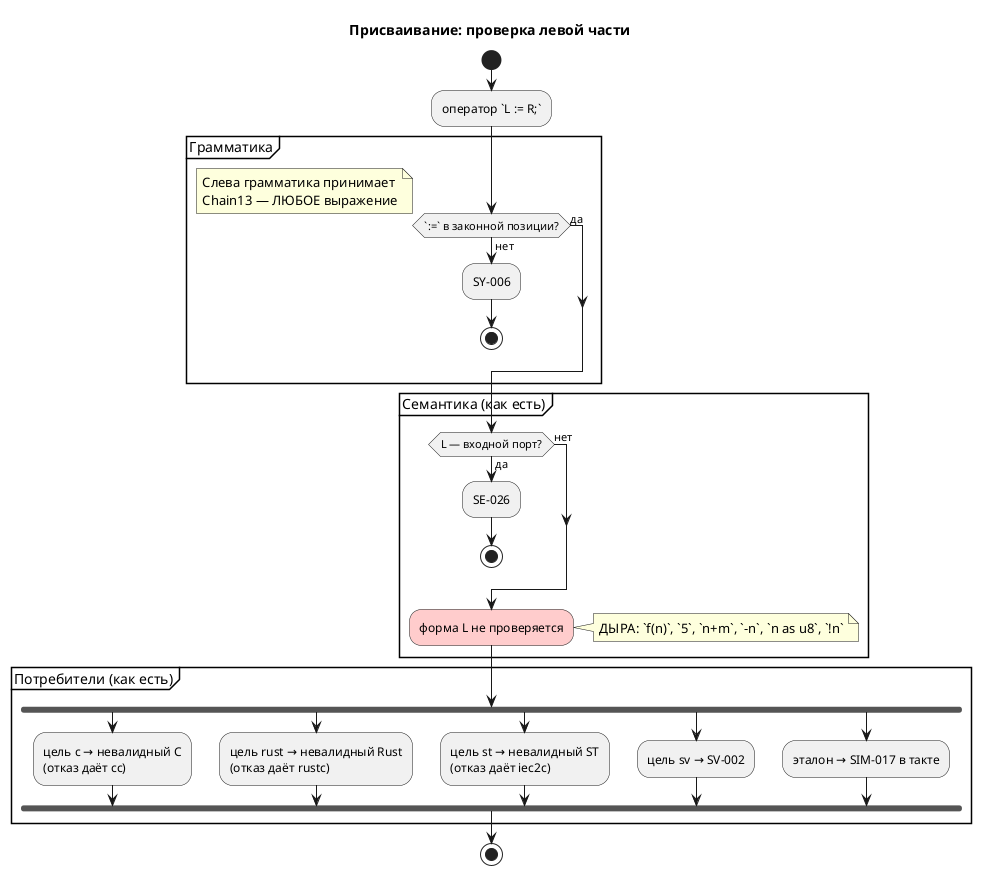
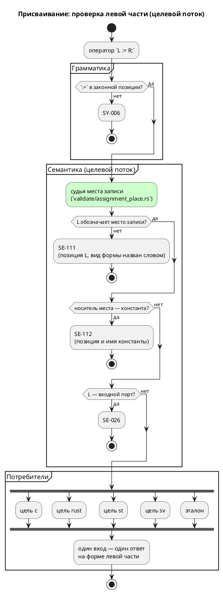

# Фича: Левая часть присваивания — вызов функции: семантика принимает, цель c печатает невалидный C

- **Номер:** 0249
- **Статус:** ГОТОВО
- **Зависит от:** нет (проверено на стадии анализа: обходы `validate/bodies.rs`
  фичи и позиции присваивания фичи закрыты)
- **Связанные issue (анализ):** новая фича (находка проверки заглушек 0217 при
  работе над 0248)

## Стадии жизненного цикла (правило 17)

Все стадии — **разделы этой карточки** (правило 32): «Архитектура (ADR)»,
«Анализ», «Разработка», «Тест-план», «Отчёт о тестировании», «Итог».
Отдельным артефактом остаются только исправления —
[`docs/fixes/`](../fixes/README.md) (при необходимости `0249-YY-*`).

## Краткое описание

Запись `f(n) := 1;` (левая часть присваивания — вызов функции) принимается
семантикой, эталон отвечает `SIM-017`, а цель `c` печатает **невалидный C**:
`Badplace_f(model, model->n) = 1;` — присваивание в rvalue, которое `cc`
отвергает. Найдено при работе над фичей [встроенные функции min/max/abs/clamp/debug не исполняются эталоном](0248-sim-builtin-functions.md)
через проверка ветвей-заглушек [ветвь-заглушка до будущей задачи переживает саму задачу](0217-stub-branch-gate.md).

> Фича зарегистрирована по находке 2026-08-17; далее проходит жизненный цикл по
> правилу 17.

## Что известно на входе

**Класс:** семантика (Tier 2 — цель порождает невалидный код при рапорте об
успехе).

**Проба 2026-08-17** на входе
`fn f(x: u8) -> u8 { return x; } … always { f(n) := 1; }`:

| Потребитель | Ответ |
|---|---|
| семантика (`taktc compile`) | **принимает**, рапортует об успехе |
| цель `c` | печатает `Badplace_f(model, model->n) = 1;` — невалидный C |
| эталон | `SIM-017`: «присваивание не в переменную, поле или элемент массива пока не поддерживается симулятором», прогон остановлен |

[пересмотр задания адресов и доступа к портам](0187-port-io-redesign.md) нормировала **позиции** присваивания
(оператор тела, шаг `for`, именованный аргумент) и запретила присваивание
внутри выражения (`SY-006`, `SE-095`), но **левую часть** как место записи не
судила: список законных мест (переменная, поле, элемент массива, порт, ячейка
`#АДРЕС`) нигде не проверяется до генерации.

Проработка — стадии 2–3: отвергать неместо диагностикой семантики (по образцу
`SE-095`), после чего отказ `SIM-017` станет недостижимым — и запись реестра
заглушек снимется вместе с ним.

## Документирование (правило 24)

**Требуется.** Фича меняет семантику языка: запись, которую компилятор
принимал, становится ошибкой. Затронуто:

1. [`book/src/appendix-errors/`](../../book/src/appendix-errors/) — коды
   **`SE-111`** (левая часть не обозначает места записи) и **`SE-112`** (целью
   записи назначена константа): строки таблицы и разбор в тексте, с примером и
   контрпримером на Takt.
2. Раздел о выражениях и операторах — оговорка о том, **что стоит слева** от
   `:=`: переменная, поле структуры, элемент массива, бит, срез, порт, ячейка
   `#АДРЕС`.

Версия языка **`0.10.0`** уже поднята циклом  — по правилу 22
изменения вносятся в неё, подъёма и тега не требуется.

## Архитектура (ADR)

- **Status:** Accepted
- **Date:** 2026-08-18
- **Authors:** Архитектор + аналитик
- **Related issues:** [Фича](0249-assign-to-call-place.md);
  находка проверки заглушек — [ADR](0217-stub-branch-gate.md#архитектура-adr);
  позиции присваивания — [ADR](0187-port-io-redesign.md#архитектура-adr) и [присваивание отвергается семантикой, а должно — грамматикой](../fixes/0187-01-assignment-is-statement-in-grammar.md);
  образец «обход доставляет, судья решает» — [ADR](0188-port-direction-everywhere.md#архитектура-adr),
  [ADR](0203-validate-formulas-traversal.md#архитектура-adr);
  образец «молчаливый успех — худший ответ» — [ADR](0211-c-missing-start-state-diagnostic.md#архитектура-adr)

### Context

[пересмотр задания адресов и доступа к портам](0187-port-io-redesign.md#архитектура-adr) нормировала **позиции** присваивания:
`:=` разбирается ровно в трёх местах (оператор тела, шаг `for`, именованный
аргумент вызова), всё прочее отсекает грамматика (`SY-006`) или судья
`SE-095`. Но **левую часть** как место записи не судил никто: грамматика
принимает слева `Chain13<Precedence1Full>` — то есть **произвольное
выражение**, а семантика на его форму не смотрит.

#### Что показала проба (2026-08-17 — 2026-08-18)

**1. Класс шире, чем вызов функции.** Вход `<левая часть> := 1;` при
`var n: u8`, `var m: u8`, `fn f(x: u8) -> u8`:

| Левая часть | Что печатает цель `c` |
|---|---|
| `f(n)` | `Badplace_f(model, model->n) = 1;` |
| `5` | `5 = 1;` |
| `n + m` | `model->n + model->m = 1;` |
| `-n` | `-model->n = 1;` |
| `n as u8` | `(uint8_t)model->n = 1;` |
| `!n` | `!model->n = 1;` |
| `(f(n))` | `(Badplace_f(model, model->n)) = 1;` |

Семантика **все семь** принимает и рапортует об успехе.

**2. Отказ приходит от чужого инструмента — на порождённом файле.** Вход
`f(n) := 1;`:

| Потребитель | Ответ |
|---|---|
| семантика (`taktc compile`) | **принимает**, код возврата 0 |
| цель `c` | `cc`: `error: expression is not assignable` |
| цель `rust` | `rustc`: `E0070: invalid left-hand side of assignment` |
| цель `st` | `iec2c`: три ошибки, «invalid variable before ':=' in ST assignment statement» |
| цель `sv` | честный отказ `SV-002` при генерации |
| цель `plantuml` | код 0 (тела не печатает) |
| эталон | `SIM-017` **в такте**, прогон остановлен |

Это ровно то положение, из которого 0187 вывела **позицию** присваивания:
язык позволяет написать то, чего не умеет ни один потребитель, а диагностику
дают чужие инструменты — с координатами порождённого файла, а не исходника.

**3. Побочная находка: `SIM-017` покрывает три разных случая.** Его текст
(«присваивание не в переменную, поле или элемент массива») перечисляет три
законных места и умалчивает об остальных, а ветвь `resolve_place` в
`takt-sim/src/unit/statement.rs` разбирает `Variable`, `Parenthesis`,
`BitAccess(_, Member::Identifier)` и `ArraySubscript`, отвечая `_ => Ok(None)`
на всё прочее. Под это `_` попадают:

| Форма | Законна ли | Ответ четырёх целей | Ответ эталона |
|---|---|---|---|
| `f(n) := 1` | **нет** (не место) | невалидный код у трёх, `SV-002` у одной | `SIM-017` |
| `b.2 := 1` (запись бита) | **да** | переводят **двое**: `c` — `model->b = (model->b & ~(1u << 2)) \| ((1 & 1u) << 2);`, `sv` — `b_next[2] = 1;`. `rust` и `st` печатают **чтение бита слева от присваивания** | `SIM-017` |
| `arr[0:2] := 1` (запись среза) | да, но не транслируется | `CC-022`, `RS-011`, `ST-011`, `SV-002` — все отказывают | `SIM-017` |

Средняя строка — **самостоятельный дефект другого класса**, и он шире, чем
казалось при регистрации фичи. Замер-18 на `var b: u8; b.2 := 1;`:

| Потребитель | Что печатает | Приговор инструмента |
|---|---|---|
| `c` | `model->b = (model->b & ~(1u << 2)) \| ((1 & 1u) << 2);` | `cc` принимает — **верно** |
| `sv` | `bit1_b_next[2] = 1;` | **верно** |
| `rust` | `(((self.b >> 2) & 1) != 0) = true;` | `rustc`: **E0070** |
| `st` | `(USINT_TO_BYTE(b) AND 16#04) <> 16#00 := 1;` | `iec2c`: **invalid statement** |
| эталон | — | `SIM-017` |

То есть `rust` и `st` печатают **выражение чтения** там, где нужна запись: у
обоих печатник левой части не отличает место от значения. Починка нетривиальна
— в IEC сдвигов над числами нет вовсе, маску придётся строить
константой, — и это **отдельная работа**, а не следствие правила о месте
записи. Выносится фичей **0250** (правило 2: крупное декомпозировать).

Нижняя строка расхождения **не даёт**: срез не переводит никто, и `CC-022`
прямо называет его в своём тексте («модель в выражении, **срез массива**,
встроенная функция отладки»). Отказ эталона здесь — заодно со всеми.

**4. Третий случай: запись в константу, и он худший из трёх.** Вход
`const K: u8 := 5; … always { K := 1; n := K; }`:

| Потребитель | Ответ |
|---|---|
| семантика | **принимает**, код возврата 0 |
| цель `c` | `CONST_CONSTW_K = 1;` при `#define CONST_CONSTW_K 5`, то есть `5 = 1;` — `cc`: `error: expression is not assignable` |
| эталон | **молча исполняет**: трасса `vars:n=1`, то есть константа стала единицей |

Здесь расходятся не сообщения, а **значения**: эталон говорит `1`, прошивка не
собирается вовсе. Форма левой части при этом законна (`Variable`) — незаконен
её **носитель**: константа обозначает величину, а не хранилище. Это отдельный
вопрос к тому же судье и отдельная диагностика (см. «Решение»).

#### Поток «как есть» и целевой





### Decision Drivers

1. **Молчаливый успех — худший ответ**. Сегодня `taktc compile -t c`
   на `f(n) := 1;` возвращает **0** и кладёт на диск файл, который не
   компилируется. Автор узнаёт о дефекте от `cc`, на чужих координатах.
2. **Правило записывается один раз**. Пять
   потребителей на одном входе дают четыре разных ответа; правило о форме
   левой части принадлежит **языку**, а не каждой цели порознь.
3. **Отказ обязан приходить от своего компилятора, а не от чужого.** Уроки и 0211: запрещается не работающая запись, а уже существующий отказ
   получает позицию и причину.
4. **Диагностика несёт позицию и называет причину словом**. Отказ без координаты в пачке сообщений бесполезен; `Debug`-дамп узла
   в тексте — класс, правленный трижды.
5. **Обратная совместимость.** Ни одна работающая программа сломаться не
   должна: под запрет попадает только то, что сегодня **не исполняет ни один**
   потребитель.

### Considered Options

#### Option A. Сузить грамматику: слева от `:=` — нетерминал `Place`

Ввести `Place: Expression = { Identifier | Place "." Member | Place "[" … "]" |
"(" Place ")" | AnonPort }` и разбирать `StatementExpr = Place ":=" Expression`.

**Pros:**
- Правило держится машиной: незаконная форма не строится вовсе.
- Тот же приём, каким исправление вернул в грамматику **позицию** присваивания.

**Cons:**
- **Конфликт LR(1).** `Place ⊂ Expression`, а `StatementExpr` принимает и то и
  другое: разбирая `f(n)`, парсер обязан решить, свёртывать ли в `Place` или в
  `Expression`, ещё не видя `:=`. Это reduce/reduce, и LALRPOP его отвергнет.
- **Диагностика хуже.** Отказ выродится в `SY-002` «нераспознанный токен `:=`,
  ожидалось …» — сообщение о токене, а не о том, что автор сделал. Ровно этот
  довод грамматика уже фиксирует у `CallArg`: сужение левой части до
  `Identifier` отобрало бы у `Tuner(1 := 5)` внятную `SE-076`.
- Ячейка `#АДРЕС` и битовый доступ пришлось бы описать в грамматике **дважды**
  — в `Place` и в выражении.

#### Option B. Судья в семантике на общем обходе тел (`bodies.rs`)

Завести `semantic/validate/assignment_place.rs` — **третьего** судью на том же
обходе, что уже доставляет выражения `common::validate_expression` (`SE-026`/
`SE-027`) и `assignment_position` (`SE-095`). Судья смотрит на форму левой
части и отвечает `SE-111`, если она не обозначает места записи.

**Pros:**
- Правило написано **один раз** и действует во всех позициях, где обход уже
  бывает: тела блоков, тела функций, вложенные операторы, шаг `for`,
  под-модели. Заводя новую позицию, её добавляют в обход, а не пишут второе
  правило (образец 0188).
- Диагностика своя: код, позиция левой части, вид формы **словом**
  («вызов функции», «литерал», «арифметическое выражение»).
- Список законных мест оказывается **в одном месте** и виден целиком.
- Ничего не ломает у грамматики: `Tuner(1 := 5)` по-прежнему `SE-076`.

**Cons:**
- Разбор форм придётся держать исчерпывающим вручную (`deny(clippy::wildcard_enum_match_arm)`),
  иначе новый узел АСД молча выйдет из-под правила.
- Правило живёт в семантике, а не в грамматике: `taktc fmt` его не зовёт —
  форматтер по-прежнему напечатает `f(n) := 1;` без замечания. Приемлемо:
  форматтер семантику не запускает по решению ADR.

#### Option C. Оставить как есть, дописать отказы в цели `c`, `rust`, `st`

**Pros:**
- Правки локальны, языка не касаются.

**Cons:**
- **Три копии одного правила** — ровно тот класс, который проект правил
  четырежды (0084, 0193, 0195, 0203). Четвёртая цель заведётся без правила.
- Отказ приходит поздно: `taktc compile -t plantuml` по-прежнему рапортует об
  успехе, эталон по-прежнему падает **в такте**.
- Не снимает расхождения по `x.N` и не убирает заглушку `SIM-017`.

### Decision

Принимается **Option B**.

Довод против A решающий и технический: `Place ⊂ Expression` даёт
reduce/reduce, а даже если бы не давал — сообщение о нераспознанном токене
хуже сообщения о сделанном. Довод против C — арифметика: три копии правила
против одной.

#### Что считается местом записи

Список **конечен** и живёт в одном модуле:

| Форма | Пример | Кто исполняет |
|---|---|---|
| переменная (в т.ч. порт) | `n := 1;`, `led := 1;` | все |
| поле структуры | `p.x := 1;`, `p.y.v := 1;` | все |
| элемент массива | `arr[1] := 1;` | все |
| бит | `b.2 := 1;` | `c` и `sv`; `rust`, `st` и эталон — **фичей** |
| срез массива | `arr[0:2] := 1;` | **никто**: `CC-022`, `RS-011`, `ST-011`, `SV-002`, `SIM-017` |
| ячейка `#АДРЕС` | `#0x200.5 := 1;` | `c-hal`, `st-at`, `sv-mmio`, эталон |
| скобки над любым из них | `(n) := 1;` | прозрачны |

Всё прочее — **`SE-111`**.

**Носитель места тоже судится: константа целью записи быть не может —
`SE-112`.** Код отдельный, а не «вид» внутри `SE-111`, по образцу пары
`SE-026`/`SE-027` (запись во вход и чтение из выхода — один предмет, два кода):
диагноз и способ исправить разные. `f(n) := 1;` — «слева не хранилище, а
вычисление»; `K := 1;` — «хранилище есть, но оно только для чтения: объявите
`var`». Один код с двумя текстами оставил бы автору сообщение не о том, что он
сделал.

Проверка носителя смотрит на `VariableNode::Const`, поэтому **параметр
модели под `--parameters=specialize`** (фича понижает неизменяемый
параметр в `Const`) под запрет не попадает: параметр, которому в теле
присваивают, помечен `mutated` и в `Const` не понижается вовсе — проход
константности идёт **до** стадии 2 и как раз по факту присваивания.

**Срез в списке остаётся**, хотя его не переводит никто. Причина: он не
перестаёт быть обозначением хранилища оттого, что цель его не умеет, и
отказывают на нём **все пятеро** — расхождения нет. Проект уже так его и
классифицирует: текст `CC-022` («конструкция в языке есть, цель её не умеет»)
называет срез массива поимённо, а чтение среза отвергается тем же `CC-022`.
Запретив запись в срез семантикой, мы завели бы правило, по которому
`arr[0:2] := 1` — ошибка языка, а `r := arr[0:2]` — неумение цели: два ответа
об одной конструкции.

#### Судьба `SIM-017`

Фича **не снимает** заглушку, и это изменение относительно замысла регистрации
— замер выше показал почему. После `SE-111` ветвь остаётся достижимой двумя
законными формами:

| Форма | Кто ещё её не умеет | Судьба |
|---|---|---|
| запись бита `b.2 := 1` | `rust` (E0070), `st` (`iec2c`) | **фича** — она и снимет заглушку |
| запись среза `arr[0:2] := 1` | никто не умеет: `CC-022`, `RS-011`, `ST-011`, `SV-002` | остаётся: отказ эталона идёт **заодно с целями**, расхождения нет |

Поэтому запись в `scripts/stub-branches.txt` **сохраняется**, а держатель
меняется с `0249` на `0250`. Текст `SIM-017` при этом правится: сегодня он
перечисляет три законных места («не в переменную, поле или элемент массива») и
умалчивает о бите, срезе, порте и ячейке — то есть врёт автору о причине.
Новый текст называет **обе** оставшиеся формы.

Проверка `scripts/check-stub-branches.py` требует держателя в **незакрытом**
статусе, поэтому фича регистрируется этой же работой — иначе запись
осиротеет и прогон покраснеет.

#### Форма диагностики

`SE-111` строит **одна** воронка (образец `FM-001` фичи и `CC-023` фичи): код один, вид формы назван **словом**, позиция берётся у АСД-узла левой
части. Текст называет способ исправить — как `SE-095`.

### Consequences

#### Положительные

- Один вход — один ответ: `f(n) := 1;` отвергается семантикой, до целей не
  доезжает, и четыре разных ответа исчезают.
- Отказ приходит **на координатах исходника**, а не порождённого файла.
- Текст `SIM-017` перестаёт врать: он перечислял три законных места и молчал о
  бите, срезе, порте и ячейке — теперь называет обе формы, которые остались за
  ним.
- Замер попутно назвал следующую работу поимённо: запись бита `x.N := v`
  печатают верно только `c` и `sv`, а `rust` и `st` печатают чтение слева от
  присваивания.

#### Отрицательные / Action items

- **Язык меняется** (правило 22): запись, которую семантика принимала,
  становится ошибкой. Версия языка `0.10.0` уже поднята циклом  —
  подъёма не требуется, изменение вносится в неё.
- **Обратная совместимость** (правило 11): формально ломающее изменение,
  фактически — нет. Под `SE-111` попадают только формы, которые сегодня **не
  исполняет ни один** потребитель: три цели порождают невалидный код, `sv` и
  эталон отказывают. Программы, работавшей на такой записи, существовать не
  может.
- **Правило 24**: приложение об ошибках (`book/src/appendix-errors/`) получает
  `SE-111` и `SE-112`; раздел о присваивании — оговорку о том, что стоит слева.
- **Правило 29**: изменение семантики без новых токенов и узлов АСД —
  редакторский слой проверить и ответ зафиксировать в анализе и отчёте.
- Разбор форм в новом модуле обязан быть **исчерпывающим**
  (`deny(clippy::wildcard_enum_match_arm)`), иначе новый узел языка молча
  выйдет из-под правила.

#### Acceptance criteria

1. `f(n) := 1;`, `5 := 1;`, `n + m := 1;`, `-n := 1;`, `n as u8 := 1;`,
   `!n := 1;`, `(f(n)) := 1;` дают `SE-111` с позицией левой части и названным
   видом формы; ни одна цель до генерации не доходит.
1a. `K := 1;` при `const K` даёт `SE-112` с позицией и именем константы;
   молчаливое расхождение «эталон `1` — прошивка не собирается» снято.
2. Законные места (`n`, `p.x`, `p.y.v`, `arr[1]`, `b.2`, `led`, `#0x200.5`,
   `(n)`) проходят без диагностики — контроль перечисляет их **списком** и падает,
   называя осиротевшее.
3. Накопление: несколько незаконных левых частей в одном теле дают
   **несколько** диагностик, а не первую (образец `literal_range`, 0157).
4. Реестр заглушек: держатель `SIM-017` — фича **0250** (зарегистрирована),
   текст ветви называет запись бита и запись среза, проверка
   `scripts/check-stub-branches.py` зелёный.
6. `./scripts/precheck.sh` зелёный; корпус `examples/` и фикстуры не затронуты.

## Анализ

### Цель и контекст

ADR постановил: **левая часть присваивания обязана обозначать место
записи**, правило записывается один раз — судьёй семантики на общем обходе тел
(`validate/bodies.rs`), а не отказами в каждой цели порознь (Option B).

Анализ уточняет: что именно проверяется, где стоит проверка, какие формы
затронуты, что происходит с эталоном и с реестром заглушек, и чего фича **не**
делает.

### Зависимости фичи (правило 17/19)

- **Зависит от:** **нет**. Проверено по трём осям:
  - **контракт судьи** — обход `validate/bodies.rs` существует и закрыт
    ([направление порта проверяется во всех позициях](0188-port-direction-everywhere.md), `ГОТОВО`);
    точка подключения `check_expr` уже отдаёт выражение двум судьям, третий
    добавляется рядом;
  - **позиция присваивания** — [пересмотр задания адресов и доступа к портам](0187-port-io-redesign.md) (`ГОТОВО`) и исправление
    закрыты; грамматика уже отсекает `:=` вне трёх позиций, поэтому судья
    получает только достижимые формы;
  - **эталон** — правка `takt-sim/src/unit/statement.rs` сводится к тексту
    отказа `SIM-017`; поведения не меняет.
- **Влияние на порядок разработки:** фича **регистрирует преемника 0250**
  (запись бита `x.N := v` в целях `rust`, `st` и эталоне) и передаёт ему
  держателя заглушки `SIM-017`. Других фич не разблокирует и не блокирует; в
  таблице `FEATURES.md` стоит первой по классу (семантика), 0250 — следом.

### Что проверяется: место записи

**Место записи** — форма, обозначающая хранилище. Список конечен и
перечисляется одним модулем:

| # | Форма АСД | Пример | Решение |
|---|---|---|---|
| 1 | `Variable(v)` | `n := 1;`, `led := 1;` | место (носитель судится отдельно, см. ниже) |
| 2 | `BitAccess(inner, Identifier)` | `p.x := 1;`, `p.y.v := 1;` | место, если место `inner` |
| 3 | `BitAccess(inner, Number)` | `b.2 := 1;` | место, если место `inner` |
| 4 | `ArraySubscript(v, _)` | `arr[1] := 1;` | место |
| 5 | `ArraySlice(v, _, _)` | `arr[0:2] := 1;` | место (не транслируется никем — см. «Чего фича не делает») |
| 6 | `AnonPort(_)` | `#0x200.5 := 1;` | место |
| 7 | `Parenthesis(inner)` | `(n) := 1;` | прозрачны: решение по `inner` |
| 8 | `Unresolved(_)` | — | **молчим**: неразрешённый узел уже отвергнут `SE-025`/`SE-003` |
| — | всё прочее | `f(n)`, `5`, `n + m`, `-n`, `n as u8`, `!n`, … | **`SE-111`** |

**Носитель места** судится отдельно: если корнем места оказалась
`VariableNode::Const`, запись невозможна — **`SE-112`**.

**Пункт 8 — не послабление, а порядок.** Судья работает после построения
дерева, где неразрешённое имя уже дало `SE-025`; вторая диагностика об одной
причине — то, чего избегает `validate_bit_values` рядом с `SE-089`.

### Требования и проверяемые условия

- **R1. Форма левой части судится.** Любая форма вне списка выше даёт `SE-111`
  с **позицией левой части** и **видом формы, названным словом**
  («вызов функции», «литерал», «арифметическое выражение», «приведение типа»,
  …). Текст называет способ исправить.
- **R2. Носитель судится.** Запись в константу даёт `SE-112` с позицией и
  именем константы.
- **R3. Правило действует во всех позициях обхода.** Тела именованных блоков,
  тела функций, вложенные операторы (`if`/`while`/`loop`/`for`/`match`), шаг
  цикла `for`, под-модели. Судья ничего не знает о позициях — их знает обход.
- **R4. Накопление.** Несколько незаконных левых частей в одном теле дают
  **несколько** диагностик (образец `literal_range`): редактор
  подчёркивает каждую.
- **R5. Законные места не задеты.** Семь форм списка проходят молча; корпус
  `examples/` и фикстуры не меняются.
- **R6. Текст `SIM-017` перестаёт врать.** Сегодня он перечисляет три законных
  места («не в переменную, поле или элемент массива») и умалчивает о бите,
  срезе, порте и ячейке. После `SE-111` за ним остаются **две** формы — запись
  бита и запись среза, — и текст называет обе.
- **R7. Реестр заглушек согласован.** Держатель `SIM-017` в
  `scripts/stub-branches.txt` меняется с `0249` на **`0250`** — фичу-преемника,
  которую эта работа регистрирует. Проверка `scripts/check-stub-branches.py`
  зелёный (держатель обязан быть в незакрытом статусе).
- **R8. Разбор форм исчерпывающий.** Модуль судьи объявляет
  `deny(clippy::wildcard_enum_match_arm)`: новый узел АСД обязан **завалить
  сборку**, а не молча выйти из-под правила (образец
  `semantic/usages/walk.rs`, `assignment_position.rs`).

### Критерии приёмки и способ проверки

| # | Критерий | Способ проверки |
|---|---|---|
| A1 | Семь незаконных форм дают `SE-111`; код возврата `taktc compile` ≠ 0 | фикстурный тест, перечисляющий формы **списком** и падающий именем пропущенной |
| A2 | Диагностика несёт позицию левой части и вид формы словом | тест сверяет **текст** и координаты (образец 0231: `Debug`-дампа в тексте нет) |
| A3 | `K := 1;` при `const K` даёт `SE-112` | фикстурный тест + проба: прежде эталон печатал `n=1`, а `cc` отвергал вывод |
| A4 | Семь законных мест проходят молча | тест перечисляет их списком и падает, называя осиротевшее |
| A5 | Накопление: три незаконных левых части → три диагностики | тест на счёт |
| A6 | Текст `SIM-017` называет запись бита и запись среза | тест на **текст** отказа (образец 0231) |
| A7 | Реестр заглушек зелёный, держатель — 0250 | `scripts/check-stub-branches.py`; фича зарегистрирована и незакрыта |
| A8 | Коды `SE-111`/`SE-112` в реестре диагностик и в приложении документа | `scripts/check-diagnostic-codes.sh` (проверка предкоммита) |
| A9 | Корпус и фикстуры не изменились | `./scripts/precheck.sh` целиком |

### Обратная совместимость (правило 11)

Изменение **формально ломающее**: запись, которую семантика принимала,
становится ошибкой. Фактически **не ломающее** — и это замер, а не мнение.

Под `SE-111` попадают только формы, которые сегодня **не исполняет ни один
потребитель**: три цели порождают код, отвергаемый чужим инструментом
(`cc`: `expression is not assignable`; `rustc`: `E0070`; `iec2c`: «invalid
variable before ':='»), `sv` отказывает `SV-002`, эталон — `SIM-017` в такте.
Программы, работавшей на такой записи, существовать не может.

Под `SE-112` попадает случай, где потребители расходятся **значениями**: эталон
молча исполняет запись в константу (трасса `n=1`), цель `c` порождает `5 = 1;`.
Здесь «работавшая программа» существовала бы только у того, кто гоняет модель
одним эталоном и никогда не собирает прошивку; для такой программы отказ —
находка, а не потеря.

Обоснование необходимости: язык, принимающий то, чего не умеет ни один
потребитель, обещает автору работу, которой не будет (урок: молчаливый
успех — худший ответ).

### Версия языка (правило 22)

Фича **меняет язык** (семантика: новые отказы на записях, которые прежде
принимались). Версия языка **`0.10.0` уже поднята** циклом — [переопределение типа не проверяется: встроенный тип можно затенить молча](0243-type-redefinition-diagnostic.md); по правилу 22 подъём
накапливается, и 0249 вносит изменения в уже поднятую версию, **не поднимая её
снова** и **не ставя тега**.

### Редакторский слой (правило 29)

**Ответ: правок не требуется.** Обоснование по каждому пункту списка правила:

| Что проверялось | Ответ |
|---|---|
| новое ключевое слово / токен | **нет**: лексика не меняется; `KEYWORDS`, `lsp/semantic_tokens.rs`, `lsp/keywords.rs::BUT_KEYWORDS`, `TaktTokenTypes.KEYWORDS` плагина IntelliJ не задеты |
| новая форма объявления или импорта | **нет**: `navigation/TaktSymbolScanner` и `semantic::usages` не задеты |
| новый узел АСД | **нет**: узлов не добавляется; `format/`, `semantic/usages/walk.rs`, `lsp/symbols.rs` не задеты |
| доходит ли диагностика до редактора | **да, по устройству**: судья подключается к `validate_model_all`, а его зовут **оба** входа — `pipeline::collect_compile_diagnostics` (CLI) и `lsp/diagnostics.rs` (сервер). Второго списка проверок у LSP нет с фичи |

Проверка «доходит ли» — не формальность: класс (проверка считалась и
выбрасывалась) и класс (предупреждение мимо единой точки) стоили проекта
двух фич. Здесь путь один, и он общий.

### Документирование (правило 24)

Меняется **семантика языка** — документ затронут:

1. `book/src/appendix-errors/index.typ` — строки `SE-111` и `SE-112` в таблице
   кодов и разбор в тексте приложения (по образцу соседних записей).
2. Раздел о выражениях/операторах — оговорка о том, **что стоит слева** от
   `:=`: список мест записи. Место оговорки уточняется на стадии разработки по
   факту содержимого раздела.
3. `docs/diagnostics/README.md` — реестр кодов (проверка
   `scripts/check-diagnostic-codes.sh`).

### Чего фича не делает

- **Не чинит запись бита.** Замер-18: `b.2 := 1;` верно печатают
  только `c` (`model->b = (model->b & ~(1u << 2)) | ((1 & 1u) << 2);`) и `sv`
  (`b_next[2] = 1;`); `rust` печатает `(((self.b >> 2) & 1) != 0) = true;`
  (`rustc`: E0070), `st` — `(USINT_TO_BYTE(b) AND 16#04) <> 16#00 := 1;`
  (`iec2c`: invalid statement), эталон отвечает `SIM-017`. Форма законна и в
  списке мест остаётся; починка — **фича** (правило 2). Её объём измерен и
  нетривиален: в IEC сдвигов над числами нет вовсе, маску придётся
  строить константой.
- **Не вводит поддержку среза в записи.** `arr[0:2] := 1;` остаётся местом
  записи, которое не переводит ни один потребитель (`CC-022`, `RS-011`,
  `ST-011`, `SV-002`, `SIM-017`). Запрет семантикой был бы вторым ответом об
  одной конструкции: чтение среза (`r := arr[0:2];`) отвергается тем же
  `CC-022`. Полная поддержка среза выносится **кандидатом**.
- **Не трогает форматтер.** `taktc fmt` семантику не запускает (решение ADR), поэтому `f(n) := 1;` он по-прежнему напечатает без замечания. Это
  свойство форматтера, а не пропуск.
- **Не судит цель записи по типу.** Совместимость типов левой и правой части —
  чужая проверка (`SE-059`, `SE-089`).

### Риски и зависимости

- **Риск: ложное срабатывание на корпусе.** Снижается тем, что список законных
  мест перечислен явно и покрыт положительным контролем (A4), а полный
  `precheck.sh` гоняет корпус через все цели.
- **Риск: `SE-112` заденет параметр модели.** Не заденет: фича понижает в
  `Const` только параметр **без присваиваний** (`mutated == false`), и проход
  константности идёт **до** стадии 2 — то есть ровно по факту записи. Параметр,
  которому присваивают, остаётся `Simple`. Проверяется тестом на входе с
  `parameter` и `--parameters=specialize`.
- **Риск: `SE-111` заденет запись бита или среза.** Не заденет: обе формы стоят
  в списке мест (пункты 3 и 5). Проверяется положительным контролем A4 и тем,
  что отказ на них по-прежнему приходит от потребителя, а не от семантики.
- **Риск: разбор форм окаменеет.** Снижается требованием R8
  (`deny(clippy::wildcard_enum_match_arm)`): новый узел валит сборку.

## Разработка

### Задача

#### Что было

Грамматика принимает слева от `:=` нетерминал `Chain13<Precedence1Full>` —
произвольное выражение, — а семантика на его форму не смотрела. Замер-18: семь форм (`f(n)`, `5`, `n + m`, `-n`, `n as u8`, `!n`, `(f(n))`)
компилятор принимал с кодом возврата **0**, после чего три цели порождали код,
отвергаемый чужими инструментами, а эталон падал `SIM-017` в такте. Запись в
константу эталон исполнял **молча**.

#### Что сделано

**1. Новый судья `takt-lang/src/semantic/validate/assignment_place.rs`.**

- `check_expression(expr, position)` — вход, симметричный соседнему
  `assignment_position`. Судит **только** `Position::Statement`: присваивание в
  позиции значения грамматика не разбирает, а остаток (именованный аргумент
  вызова) — предмет `SE-095`, где слева стоит имя параметра, а не место.
- `classify` — исчерпывающий разбор `ExpressionNode` под
  `#![deny(clippy::wildcard_enum_match_arm)]`: место записи либо **слово**,
  которым отказ назовёт форму. Новый узел языка обязан завалить сборку этого
  модуля.
- `judge` — два кода: **`SE-111`** (форма не есть место) и **`SE-112`**
  (носитель — константа). Разделение по образцу пары `SE-026`/`SE-027`: диагноз
  и способ исправить разные.
- `where_to_point` — позиция диагностики: у левой части, а при её отсутствии у
  присваивания целиком.

`collect` помечен `#[allow(clippy::wildcard_enum_match_arm)]` **явно**: он
отвечает на вопрос «есть ли в операторе присваивание», а не разбирает язык.
Исчерпаемость стережёт `classify` — место, где новый узел обязан получить
решение.

**2. Подключение — одна строка в `validate/bodies.rs::check_expr`.** Обход уже
доставлял выражения двум судьям; третий встал рядом. Своего обхода судья не
заводит — иначе правило о позициях оказалось бы в двух местах.

**3. Текст `SIM-017` (`takt-sim/src/unit/statement.rs`).** Прежний перечислял
три законных места («не в переменную, поле или элемент массива») и умалчивал о
бите, срезе, порте и ячейке — называл автору не ту причину. Новый называет
**обе** формы, что остались за отказом после `SE-111`: запись бита и запись
среза. Поведение не изменилось.

**4. Реестр заглушек.** Держатель `SIM-017` — фича **0250** вместо 0249: замер
показал, что запись бита ломает не только эталон (`rust` печатает
`(((self.b >> 2) & 1) != 0) = true;`, `st` — `(USINT_TO_BYTE(b) AND 16#04)
<> 16#00 := 1;`), и починка целей — отдельная работа (правило 2).

**5. Документ и реестры.** `docs/diagnostics/README.md` — две строки;
`book/src/appendix-errors/` — строки таблицы и разбор с примером и
контрпримером; `book/src/05-expressions/` — оговорка «слева от `:=` стоит место
записи» со списком мест.

| Функциональность | Статус |
|---|---|
| `takt-lang` (семантика) | сделано: новый судья + подключение |
| `takt-sim` (эталон) | текст отказа; поведение не менялось — оно предмет 0250 |
| грамматика | **н/п**: сужение отвергнуто ADR (reduce/reduce + худшая диагностика) |
| цели генерации | **н/п**: отказ переехал в семантику, до целей вход не доезжает |
| LSP и плагины | **н/п** (правило 29): токенов и узлов АСД не прибавилось, диагностика идёт общим `validate_model_all` |
| форматтер | **н/п**: `taktc fmt` семантику не запускает  |

#### Проверки

```sh
cargo test --test semantic assignment_place   # 9 тестов набора
./scripts/precheck.sh                          # полный гейт
```

**Ложных срабатываний нет:** прогон `taktc compile -t c` по **347** файлам
(`examples/`, `takt-lang/tests/data/`, `takt-sim/tests/data/`, `book/`) не дал
ни одной `SE-111`/`SE-112`.

**Контроля проверены мутациями** (каждая валит набор поимённо):

| Мутация | Что упало |
|---|---|
| `Cast` объявлен местом | A1 «остались без SE-111: `n as u8`», A2 |
| `BitAccess` объявлен не местом | A4 «отвергнуты зря: `p.x`, `p.y.v`, `b.2`» |
| проверка константы снята | A3, A3б, A5 |
| судья не подключён к обходу | 7 тестов из 9 |

Соответствие условиям анализа: **R1** — A1/A2, **R2** — A3/A3б, **R3** —
A6/A7, **R4** — A5, **R5** — A4 + прогон по корпусу, **R6** — текст `SIM-017`,
**R7** — `scripts/check-stub-branches.py`, **R8** — атрибут `deny` в модуле.

## Тест-план

### Область и цель

Проверяется правило «слева от `:=` стоит место записи» — требования **R1…R8**
анализа и критерии приёмки **A1…A9**.

Фича меняет **семантику языка**, поэтому по правилу 16 план обязан нести
**примеры и контрпримеры**; они же уезжают в документ (`book/`, правило 24).

**Ключевое требование к контролю — падать списком.** Отрицательный контроль
называет форму, оставшуюся без отказа; положительный — место, отвергнутое зря.
Второй обязателен не меньше первого: правило легко ужесточить до неработающего
языка, а корпус этого не покажет — записи бита в переменную в `examples/` нет
ни одной (замер фичи).

### Проверки (условие → ожидаемый результат)

| # | Проверка | Предусловие | Ожидаемый результат | Ссылка на R/A |
|---|---|---|---|---|
| T1 | Незаконная форма левой части отвергается | 12 форм: `f(n)`, `(f(n))`, `5`, `n + m`, `n * 2`, `n & m`, `n = m`, `-n`, `+n`, `!n`, `~n`, `n as u8` | `SE-111` на каждой; тест падает **списком** молчащих | R1 / A1 |
| T2 | Отказ называет вид формы **словом** | те же 12 форм | текст содержит «вызов функции», «литерал», «арифметическое выражение», «побитовое выражение», «сравнение», «смена знака», «унарный плюс», «логическое отрицание», «побитовое отрицание», «приведение типа»; имени варианта Rust в тексте нет | R1 / A2 |
| T3 | Запись в константу отвергается по имени | `const K: u8 := 5; K := 1;` | `SE-112`, текст называет `K` | R2 / A3 |
| T4 | Носитель ищется по основанию места | `const ARR: [u8; 4]; ARR[1] := 1;` | `SE-112` | R2 / A3 |
| T5 | Законные места проходят молча | 10 форм: `n`, `(n)`, `p.x`, `p.y.v`, `arr[1]`, `arr[n]`, `arr[0:2]`, `b.2`, `led`, `#0x200.5` | ни `SE-111`, ни `SE-112`; тест падает **списком** отвергнутых зря | R5 / A4 |
| T6 | Нарушения накапливаются | четыре незаконных присваивания в одном `always` | три `SE-111` + одна `SE-112`, а не одна диагностика | R4 / A5 |
| T7 | Правило действует во всех позициях обхода | тело функции, вложенный `if`, тело `while`, шаг `for`, блок `enter` | `SE-111` в каждой; тест падает **списком** молчащих позиций | R3 / A6 |
| T8 | Под-модель судится наравне с корнем | `model Child { … h(c) := 1; … }` | `SE-111` | R3 / A6 |
| T9 | Параметр модели остаётся записываемым | `parameter GAIN: u8 := 2; GAIN := 3;` | `SE-112` **не** выдаётся | R2 / риск анализа |
| T10 | Текст `SIM-017` называет обе оставшиеся формы | ветвь `resolve_place` эталона | текст говорит о записи бита и записи среза, а не о «не переменной, поле или элементе» | R6 / A6 |
| T11 | Реестр заглушек согласован | `scripts/stub-branches.txt` | держатель `SIM-017` — фича в незакрытом статусе; `scripts/check-stub-branches.py` зелёный | R7 / A7 |
| T12 | Коды в реестре и документе | `SE-111`, `SE-112` | `scripts/check-diagnostic-codes.sh` зелёный; коды есть в `book/src/appendix-errors/` | — / A8 |
| T13 | Ложных срабатываний на корпусе нет | все `.takt` репозитория | ни одной `SE-111`/`SE-112` | R5 / A9 |
| T14 | Контроля не декоративны | четыре мутации кода | каждая валит набор **поимённо** | R8 |
| T15 | Полный проверка | `./scripts/precheck.sh` | зелёный | — / A9 |

### Примеры и контрпримеры (правило 16)

**Контрпримеры — отвергаются:**

```takt
level(3) := 1;   // SE-111: слева вызов функции
5 := 1;          // SE-111: слева литерал
a + b := 1;      // SE-111: слева арифметика
-a := 1;         // SE-111: слева смена знака
a as u8 := 1;    // SE-111: слева приведение типа
!a := 1;         // SE-111: слева логическое отрицание
LIMIT := 7;      // SE-112: слева константа
```

**Примеры — принимаются:**

```takt
level := 1;      // переменная
point.x := 1;    // поле структуры
data[2] := 1;    // элемент массива
flags.3 := 1;    // отдельный бит
ready := 1;      // порт
#0x200.5 := 1;   // ячейка по адресу
```

Оба списка перенесены в документ: `book/src/05-expressions/` (оговорка о том,
что стоит слева) и `book/src/appendix-errors/` (разборы `SE-111` и `SE-112`).

### Разбивка проверок по функциональности

| Функциональность | T1–T9 | T10–T11 | T12 | T13 | T14–T15 |
|---|---|---|---|---|---|
| `takt-lang`, семантика | ✅ | — | ✅ | ✅ | ✅ |
| `takt-sim`, эталон | — | ✅ | — | — | ✅ |
| цели генерации (`c`, `rust`, `st`, `sv`, `plantuml`) | — | — | — | ✅ | ✅ |
| LSP и плагины редакторов | — | — | — | — | ✅ (правило 29: правок не требуется, диагностика идёт общим `validate_model_all`) |
| форматтер `taktc fmt` | — | — | — | — | — (семантику не запускает) |
| грамматика | — | — | — | — | — (сужение отвергнуто ADR) |

<!-- Легенда: ✅ пройдено · ❌ провалено · ⬜ не проверялось · — не применимо -->

### Тестовые данные и окружение

- Набор: `takt-lang/tests/semantic/assignment_place_tests.rs` (тема `semantic`,
  фича — отдельной цели не заводим).
- Фикстур на диске нет: пробы собираются из общей преамбулы в самом наборе —
  формы различаются одной строкой, и файл на каждую был бы шумом.
- Корпус для T13: `examples/`, `takt-lang/tests/data/`, `takt-sim/tests/data/`,
  `book/` — 347 файлов.
- Внешние инструменты: `cc`, `rustc`, `iec2c`, `verilator`, `yosys` — через
  `./scripts/precheck.sh`.

## Отчёт о тестировании

### Резюме

**Пройдено. Фича готова к закрытию (`ГОТОВО`).** Все 15 проверок тест-плана
зелёные, дефектов не найдено, исправлений (`docs/fixes/0249-YY-*`) не
потребовалось.

### Окружение и прогоны

| Что | Значение |
|---|---|
| Дата | 2026-08-18 |
| Толчейн | стабильный `1.97.1` (`rust-toolchain.toml`) |
| Прогон | `./scripts/precheck.sh` — **код 0** |
| Тесты | `cargo test`: **3131 passed**, 6 ignored (14 наборов, 25.72 с) |
| Внешние проверки | `cc` (`-Wall -Wextra -Werror`), `rustc -D warnings`, `iec2c` 8/8, `verilator`, `yosys` — все зелёные |
| Новые наборы | `takt-lang/tests/semantic/assignment_place_tests.rs` (9), `takt-sim/tests/sim/assignment_place_refusal_tests.rs` (3) |

### Фактические результаты по проверкам

| # | Проверка | Результат | Комментарий |
|---|---|---|---|
| T1 | Незаконная форма левой части отвергается | ✅ | 12 форм, все дают `SE-111`; контроль падает списком |
| T2 | Отказ называет вид формы словом | ✅ | 10 разных слов; `Debug`-дампа в тексте нет |
| T3 | Запись в константу отвергается по имени | ✅ | `SE-112`, имя `K` в тексте |
| T4 | Носитель ищется по основанию места | ✅ | `ARR[1] := 1;` при `const ARR` → `SE-112` |
| T5 | Законные места проходят молча | ✅ | все 10 форм, включая `arr[0:2]`, `b.2`, `#0x200.5` |
| T6 | Нарушения накапливаются | ✅ | четыре нарушения → три `SE-111` + одна `SE-112` |
| T7 | Правило действует во всех позициях обхода | ✅ | тело функции, `if`, `while`, шаг `for`, блок `enter` |
| T8 | Под-модель судится наравне с корнем | ✅ | `SE-111` в теле `model Child` |
| T9 | Параметр модели остаётся записываемым | ✅ | `SE-112` не выдаётся: `mutated` не даёт понизиться в `Const` |
| T10 | Текст `SIM-017` называет обе оставшиеся формы | ✅ | проверено **прогоном** эталона на записи бита и на записи среза |
| T11 | Реестр заглушек согласован | ✅ | «Ветви-заглушки: 3 объявлено, расхождений с кодом нет» |
| T12 | Коды в реестре и документе | ✅ | `scripts/check-diagnostic-codes.sh`: `SE → 112` |
| T13 | Ложных срабатываний на корпусе нет | ✅ | **347** файлов, ни одной `SE-111`/`SE-112` |
| T14 | Контроля не декоративны | ✅ | четыре мутации, каждая валит набор поимённо (таблица ниже) |
| T15 | Полный проверка | ✅ | `precheck.sh` код 0 |

#### Мутационная проверка контрольных тестов (T14)

| Мутация кода | Что упало и с каким сообщением |
|---|---|
| `Cast` объявлен местом записи | T1: «эти формы левой части остались без SE-111: `["n as u8"]`»; заодно T2 |
| `BitAccess` объявлен не местом | T5: «законные места отвергнуты зря: `p.x`, `p.y.v`, `b.2`» |
| проверка константы снята | T3, T4, T6 |
| судья не подключён к обходу | 7 тестов из 9 |

Мутации проверяют разные свойства: первая — что отрицательный контроль видит
каждую форму, вторая — что положительный не даёт ужесточить правило, третья —
что `SE-112` отделена от `SE-111`, четвёртая — что судья действительно
подключён к общему обходу, а не только существует.

### Примеры и контрпримеры (правило 16)

Оба списка тест-плана перенесены в документ:

- `book/src/05-expressions/` — оговорка «слева от `:=` стоит место записи» со
  списком мест и двумя контрпримерами;
- `book/src/appendix-errors/` — разборы `SE-111` и `SE-112` с примером,
  контрпримером и дословным текстом отказа.

Проверка документа  прогоняет примеры `book/`: 27 проверено, 4
библиотечных; проверка символов (0146) — 60 файлов, символов вне шрифта нет; проверка
лексики (0160) — расхождений нет; сборка PDF (0240) — успешна.

### Результаты по функциональности

| Функциональность | Статус | Чем подтверждено |
|---|---|---|
| `takt-lang`, семантика | ✅ | T1–T9, T13; новый судья + подключение к обходу |
| `takt-sim`, эталон | ✅ | T10; поведение не менялось, изменён только текст отказа |
| цель `c` | ✅ | вход `f(n) := 1;` до целей не доезжает; корпус компилируется `cc -Wall -Wextra -Werror` |
| цель `rust` | ✅ | проверка `clippy -D warnings` зелёный |
| цель `st` | ✅ | `iec2c` 8/8 корпуса |
| цель `sv` / `sv-mmio` | ✅ | `verilator` + `yosys`, тестбенчи прошли |
| цель `plantuml` | ✅ | корпус в каноне |
| LSP и плагины (правило 29) | ✅ | правок не требуется: токенов и узлов АСД не прибавилось, диагностика идёт общим `validate_model_all`, который зовут **оба** входа — `pipeline::collect_compile_diagnostics` и `lsp/diagnostics.rs` |
| форматтер `taktc fmt` | — | семантику не запускает; `f(n) := 1;` печатается без замечания — свойство форматтера, не пропуск |
| грамматика | — | сужение отвергнуто ADR (reduce/reduce + худшая диагностика) |

### Дефекты

Не найдено. Исправлений (`docs/fixes/0249-YY-*`) не заводилось.

### Что показал эксперимент сверх плана

**1. Класс оказался шире, чем при регистрации фичи.** Карточка называла один
вход (`f(n) := 1;`); замер дал **двенадцать** форм и **два разных** дефекта —
форму левой части и её носителя. Второй был хуже первого: запись в константу
эталон исполнял **молча** (трасса `n=1`), а цель `c` печатала `5 = 1;`, то
есть расходились не сообщения, а значения.

**2. Замысел регистрации «заглушка `SIM-017` снимется вместе с фичей» не
исполнен, и это доказано замером, а не отложено.** Запись бита `x.N := v` —
законное место, но верно печатают её лишь `c` и `sv`; `rust` даёт
`(((self.b >> 2) & 1) != 0) = true;` (`rustc`: E0070), `st` —
`(USINT_TO_BYTE(b) AND 16#04) <> 16#00 := 1;` (`iec2c`: invalid statement).
Починка целей — отдельная работа (в IEC сдвигов над числами нет вовсе), она
зарегистрирована фичей [запись бита x.N := v: цели rust и st печатают чтение, эталон отказывает](0250-bit-write-in-targets.md), и
держатель заглушки передан ей.

**3. Координата диагностики скудна, и это ограничение слоя, а не фичи.** У
переменной и функции `ExpressionNode::loc()` отдаёт позицию **объявления**, а
не использования: позиции вхождений живут отдельным слоем `semantic::usages`  и в понижённом дереве тела отсутствуют. У чистого литерала
(`5 := 2;`) позиции нет вовсе. Запасной ход через присваивание целиком
подхватывает координату правой части, если она есть. Соседний судья `SE-095`
живёт с тем же ограничением (`Location::Codegen` в `target_of`) — то есть это
общий недостаток судей тела, а не свойство новой проверки. Вынесено
**кандидатом** в `FEATURES.md`.

### Вывод

**Готово.** Фича переводится в статус `ГОТОВО`; преемник —
[запись бита x.N := v: цели rust и st печатают чтение, эталон отказывает](0250-bit-write-in-targets.md).

## Итог (что сделано)

**Правило языка:** слева от `:=` стоит **место записи**. Список конечен —
переменная, поле структуры, элемент и срез массива, отдельный бит, порт,
ячейка `#АДРЕС`, скобки над любым из них; всё прочее отвергается. Носитель
места судится отдельно: константа обозначает величину, а не хранилище.

**`takt-lang`** (версия крейта не менялась): новый судья
`semantic/validate/assignment_place.rs` — **`SE-111`** (форма не есть место,
вид назван словом) и **`SE-112`** (целью записи назначена константа).
Подключён третьим к общему обходу тел `validate/bodies.rs` — своего обхода не
заводит (образец 0188/0203). Разбор форм исчерпывающий под
`deny(clippy::wildcard_enum_match_arm)`.

**`takt-sim`**: поведение не менялось; переписан **текст** `SIM-017` — прежний
перечислял три законных места и умалчивал о бите, срезе, порте и ячейке, то
есть называл автору не ту причину.

**Ключевые решения:**

- сужение грамматики до нетерминала `Place` отвергнуто: `Place ⊂ Expression`
  даёт reduce/reduce, а отказ выродился бы в `SY-002` о нераспознанном токене
  — сообщение не о том, что автор сделал (ADR, Option A);
- срез `arr[0:2]` **оставлен местом**: его не переводит ни один потребитель, и
  отказывают на нём все пятеро — запрет семантикой дал бы два ответа об одной
  конструкции, тогда как чтение среза отвергается тем же `CC-022`;
- заглушка `SIM-017` **не снята**, а передана фиче
  [запись бита x.N := v: цели rust и st печатают чтение, эталон отказывает](0250-bit-write-in-targets.md): замер показал, что запись бита ломает
  не только эталон — `rust` печатает `(((self.b >> 2) & 1) != 0) = true;`
  (`rustc`: E0070), `st` — `(USINT_TO_BYTE(b) AND 16#04) <> 16#00 := 1;`
  (`iec2c`: invalid statement). Починка целей — отдельная работа (правило 2).

**Живая проверка:** `./scripts/precheck.sh` — код 0, `cargo test` 3131 passed.
Контроля — 9 тестов семантики и 3 теста эталона, все падают **списком**;
четыре мутации проверены поимённо. Прогон `taktc compile` по **347** файлам
корпуса и фикстур ложных срабатываний не дал.

**Документ (правило 24):** `book/src/05-expressions/` — оговорка о том, что
стоит слева, со списком мест и контрпримерами; `book/src/appendix-errors/` —
разборы `SE-111` и `SE-112`. Версия языка `0.10.0` уже поднята циклом  — по правилу 22 подъёма и тега не требуется.

Детали — в [отчёте](0249-assign-to-call-place.md#отчёт-о-тестировании), решение — в
[ADR](0249-assign-to-call-place.md#архитектура-adr), реализация — в
[задаче](0249-assign-to-call-place.md#разработка).
