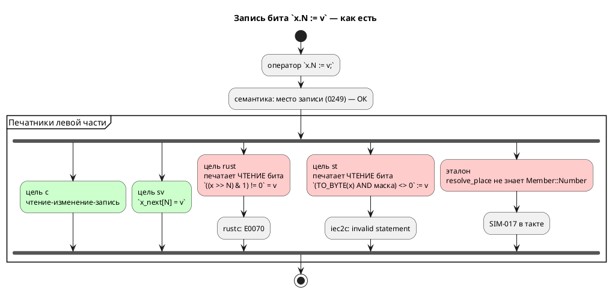
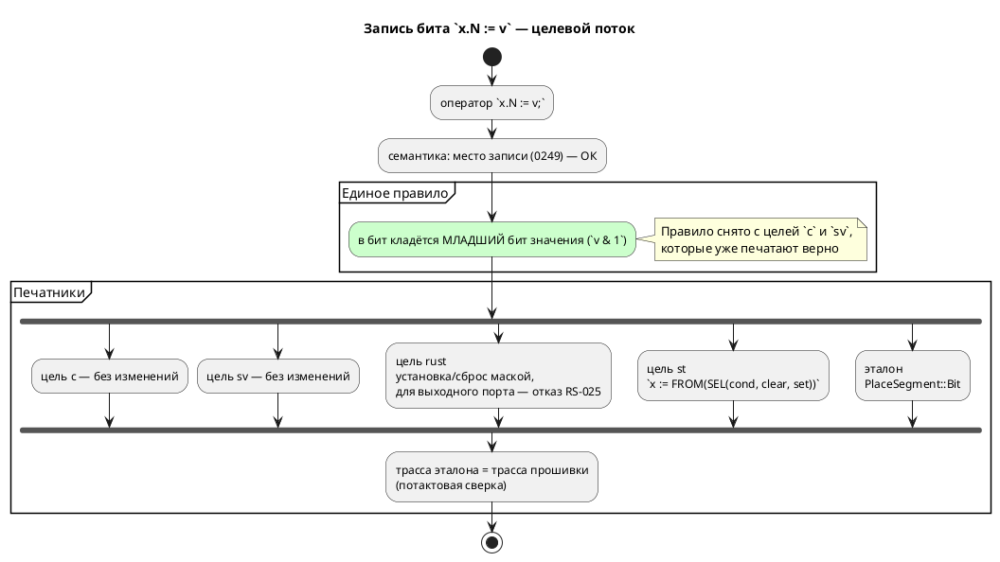

# Фича: Запись бита x.N := v: цели rust и st печатают чтение, эталон отказывает

- **Номер:** 0250
- **Статус:** ГОТОВО
- **Зависит от:** нет (проверено на стадии анализа: 0249 и 0078 закрыты)
- **Связанные issue (анализ):** новая фича (замер при работе над
  [левая часть присваивания — вызов функции: семантика принимает, цель c печатает невалидный C](0249-assign-to-call-place.md))

## Стадии жизненного цикла (правило 17)

Все стадии — **разделы этой карточки** (правило 32): «Архитектура (ADR)»,
«Анализ», «Разработка», «Тест-план», «Отчёт о тестировании», «Итог».
Отдельным артефактом остаются только исправления —
[`docs/fixes/`](../fixes/README.md) (при необходимости `0250-YY-*`).

## Краткое описание

Запись одного бита `x.N := v` — законное **место записи** ([левая часть присваивания — вызов функции: семантика принимает, цель c печатает невалидный C](0249-assign-to-call-place.md) внесла её в список мест). Верно печатают
её **двое** потребителей из шести: цель `c` эмитит чтение-изменение-запись,
цель `sv` — присваивание разряду. Цели `rust` и `st` печатают **выражение
чтения бита слева от присваивания** — то есть код, который отвергают
`rustc` и `iec2c`; эталон отвечает `SIM-017` и останавливает прогон.

> Фича зарегистрирована по замеру при работе над 0249 (2026-08-18); далее
> проходит жизненный цикл по правилу 17.

## Что известно на входе

**Класс:** генерация (Tier 2 — две цели порождают невалидный код при рапорте
об успехе, эталон расходится с целями).

**Проба 2026-08-18** на входе `var b: u8 := 0; … always { b.2 := 1; r := b; }`:

| Потребитель | Что печатает | Приговор инструмента |
|---|---|---|
| `c` | `model->b = (model->b & ~(1u << 2)) \| ((1 & 1u) << 2);` | `cc` принимает — **верно** |
| `sv` | `bit1_b_next[2] = 1;` | **верно** |
| `rust` | `(((self.b >> 2) & 1) != 0) = true;` | `rustc`: **E0070 invalid left-hand side of assignment** |
| `st` | `(USINT_TO_BYTE(b) AND 16#04) <> 16#00 := 1;` | `iec2c`: **invalid statement in case element** |
| эталон | — | `SIM-017`, прогон остановлен |

**Соседний вход — запись бита порта** (`out led: bit at 0x100:3; led.0 := 1;`)
даёт ещё один набор ответов: `rust` — `RS-018`, `st` — `led := 1;`, эталон —
`SIM-017`. Разбор того, одна это задача или две, — предмет стадий 2–3.

**Проверки класс не видят:** оба гоняют только корпус `examples/`, где записи
бита в переменную нет ни одной. Контроля придётся заводить
фикстурными и **потактовыми** — факт компиляции верности не доказывает
(уроки [генератор генерации в SystemVerilog](0045-sv-backend.md), [генератор генерации в Rust](0050-rust-backend.md)).

**Починка цели `st` нетривиальна:** сдвигов над числами в IEC нет вовсе
(урок [fixed-point Q(m.n) как тип языка](0061-fixed-point-type.md)), маску придётся строить константой и
ходить через `USINT_TO_BYTE`/`BYTE_TO_USINT`.

**Фича держит заглушку `SIM-017`** (`scripts/stub-branches.txt`): её
закрытие обязано снять запись или передать держателя дальше. За `SIM-017`
остаются две формы — запись бита (эта фича) и запись среза (не переводит ни
один потребитель, вынесено кандидатом фичей).

## Документирование (правило 24)

**Требуется.** Затронуто:

1. [`book/src/03-types/`](../../book/src/03-types/) — раздел о `[bit; N]` уже
   показывает `flags.3 := 1;`; добавляется правило **«в бит попадает младший
   бит значения»** (`flags.3 := 2;` бит очищает). Сегодня правила нет нигде —
   оно лишь выведено из того, что печатает цель `c`.
2. [`book/src/appendix-errors/`](../../book/src/appendix-errors/) — строка и
   разбор **`RS-025`** (запись бита числового выходного порта в цели `rust`).

Версия языка **`0.10.0`** уже поднята циклом  — по правилу 22
подъёма и тега не требуется.

## Архитектура (ADR)

- **Status:** Accepted
- **Date:** 2026-08-18
- **Authors:** Архитектор + аналитик
- **Related issues:** [Фича](0250-bit-write-in-targets.md);
  место записи — [ADR](0249-assign-to-call-place.md#архитектура-adr);
  находка проверки заглушек — [ADR](0217-stub-branch-gate.md#архитектура-adr);
  эталон не вправе отставать — [ADR](0248-sim-builtin-functions.md#архитектура-adr);
  `[bit;N]` как упакованный вектор — [ADR](0078-bit-array-semantics.md#архитектура-adr);
  «в IEC сдвигов над числами нет» — [ADR](0061-fixed-point-type.md#архитектура-adr);
  «проверка доказывает компилируемость, не верность» — [ADR](0045-sv-backend.md#архитектура-adr),
  [ADR](0050-rust-backend.md#архитектура-adr)

### Context

[левая часть присваивания — вызов функции: семантика принимает, цель c печатает невалидный C](0249-assign-to-call-place.md#архитектура-adr) внесла запись одного бита в список
**мест записи** языка. Документ обещает её прямым текстом: раздел о типах
показывает `flags.3 := 1;` под заголовком «установить бит».

Обещание исполняют не все.

#### Замер-18 — носитель «переменная»

Вход `var b: u8 := 0; … always { b.2 := 1; r := b; }`:

| Потребитель | Что печатает | Приговор инструмента |
|---|---|---|
| `c` | `model->b = (model->b & ~(1u << 2)) \| ((1 & 1u) << 2);` | `cc -Wall -Wextra -Werror` принимает — **верно** |
| `sv` | `f_var_b_next[2] = 1;` | **верно** |
| `rust` | `(((self.b >> 2) & 1) != 0) = true;` | `rustc`: **E0070 invalid left-hand side of assignment** |
| `st` | `(USINT_TO_BYTE(b) AND 16#04) <> 16#00 := 1;` | `iec2c`: **invalid statement in case element** |
| эталон | — | `SIM-017`, прогон остановлен |

`rust` и `st` печатают **выражение чтения бита** там, где нужна запись: у обоих
печатник левой части не отличает место от значения. Отказ приходит от чужого
инструмента, на координатах порождённого файла.

#### Замер по всем носителям

| Носитель | Пример | `c` | `rust` | `st` | `sv` | эталон |
|---|---|---|---|---|---|---|
| переменная (скаляр ≤ 64) | `b.2 := 1` | ✔ | **невалидно** | **невалидно** | ✔ | `SIM-017` |
| `[bit;N ≤ 64]` | `v.3 := 1` | ✔ | **невалидно** | `ST-011` | ✔ | `SIM-017` |
| элемент массива | `arr[1].2 := 1` | ✔ | **невалидно** | `ST-011` | `SV-002`¹ | `SIM-017` |
| поле структуры | `p.x.2 := 1` | ✔ | `RS-011`¹ | ✔² | `SV-002`¹ | `SIM-017` |
| порт `bit` | `led.0 := 1` | ✔ `write_bit` | `RS-018` | ✔ `led := 1` | ✔ | `SIM-017` |
| порт числовой | `bank.3 := 1` | ✔ HAL RMW | `RS-018` | **невалидно** | ✔ | `SIM-017` |
| `[bit;N > 64]` | `w.70 := 1` | **невалидно**³ | **невалидно**³ | `ST-011` | ✔ | `SIM-017` |

¹ Общее ограничение цели, не про биты: `rust` отвергает структуры и без бита
(`p.x := 1` → `RS-011`), `sv` отвергает и структуру, и массив (`SV-002`).
² Цель `st` печатает `p.x := 1` верно, а `p.x.2 := 1` — нет: тип поля она не
выводит (`inner_expr_type` знает переменную, скобки и `as`).
³ **Отдельный дефект, шире этой фичи.** У `[bit;96]` сломано и чтение, и сама
инициализация: `c` печатает `model->w = 0;` при `uint64_t w[2]` (`cc`: «array
type is not assignable»), `rust` — `w: [u64; 2]` с инициализатором `w: 0` и
доступом `self.w >> 70`. Проверено прогоном **без единой записи бита**. Цель
`sv` тот же вход переводит верно (`logic [95:0]`, `w_next[70] = 1`) — то есть
ломается не форма, а её представление в двух целях.

#### Три вывода замера

1. **Ядро класса — носитель-скаляр.** Форма, которую `c` и `sv` печатают верно,
   а `rust`, `st` и эталон не умеют, — это переменная (в том числе
   `[bit;N ≤ 64]`) и элемент массива.
2. **Часть клеток таблицы — не про биты.** Структуры в `rust`/`sv` и массивы в
   `sv` не поддержаны вовсе; ровнять их этой фичей значило бы взять чужую
   работу.
3. **`[bit;N > 64]` сломан независимо от записи** и должен уйти кандидатом:
   починка касается объявления, инициализации, чтения и записи сразу в двух
   целях.

#### Поток «как есть» и целевой





### Decision Drivers

1. **Язык обещает то, чего нет.** Документ показывает `flags.3 := 1;` как
   способ установить бит; на деле это работает у двоих потребителей из шести.
2. **Эталон не вправе отставать от целей**. Модель с записью
   бита нельзя сверить с прошивкой ни на одном такте.
3. **Невалидный код при рапорте об успехе — худший ответ**. `rust`
   и `st` возвращают ноль и кладут на диск файл, который не собирается.
4. **Правило записывается один раз.** «Что попадает в бит» — свойство языка, а
   не каждой цели: сегодня оно нигде не записано, а выведено из того, что
   печатает `c`.
5. **Заглушка не должна пережить свою задачу**. `SIM-017` держится
   этой фичей.

### Considered Options

#### Option A. Изъять запись бита из языка

Объявить `x.N := v` незаконной (`SE-1xx`), оставив только чтение.

**Pros:**
- Ноль работы в целях; `SIM-017` снимается сразу.

**Cons:**
- **Ломает работающие программы**: `c` и `sv` печатают запись верно и делают
  это давно; фикстура `takt-lang/tests/data/parser/valid/bit_access.takt`
  документирует форму с примерами порождённого кода.
- Документ обещает запись прямым текстом (раздел о типах) — пришлось бы
  переписывать язык вместо починки трансляции.
- Установка бита — базовая операция промышленного управления (цель проекта,
  правило 12). Отнимать её из-за отставания двух печатников — решение наоборот.

#### Option B. Реализовать запись во всех целях, включая структуры и массивы в `sv`

**Pros:**
- Полная таблица без единой пустой клетки.

**Cons:**
- Берёт **чужую** работу: структуры в `rust`/`sv` и массивы в `sv` не
  поддержаны и без битов. Это отдельные фичи, каждая со своим ADR (правило 2).
- Скрывает границу: «запись бита не работает» и «структур в цели нет» —
  разные диагнозы, и смешивать их в одной фиче значит потерять оба.

#### Option C. Починить носитель-скаляр везде, где он выразим; где нет — отказ с названной причиной

Ось 1 — эталон, ось 2 — `rust`, ось 3 — `st`, ось 4 — сверки.

**Pros:**
- Закрывает ровно измеренный класс: формы, где `c` и `sv` правы, а трое
  отстают.
- Границы остаются **названными**: структура в `rust` — по-прежнему `RS-011`,
  выходной порт в `rust` — новый отказ с причиной, а не невалидный код.
- Заглушка `SIM-017` снимается по существу: за ней остаётся только срез.

**Cons:**
- Таблица остаётся неполной — но неполной **честно**: каждая пустая клетка
  названа кодом и причиной.

### Decision

Принимается **Option C**.

#### Правило языка: в бит кладётся младший бит значения

Нормируется то, что уже делают две правые цели:

- `c` печатает `(rhs & 1u) << N` — берёт младший бит;
- `sv` присваивает разряду, что в SystemVerilog есть усечение до младшего бита.

Значит `b.2 := 2;` очищает бит, а не устанавливает. Правило записывается в
документ: сегодня его нет нигде, и оно лишь выведено из вывода цели `c`.

#### Ось 1 — эталон

`resolve_place` получает разбор `BitAccess(_, Member::Number(n))`, путь —
новый сегмент `PlaceSegment::Bit(n)`, замена — в ядре `eval/place.rs` под
`deny(wildcard_enum_match_arm)`, **зеркально чтению** (`eval/access.rs::read_member`):

| Значение носителя | Что делает запись |
|---|---|
| `Number` | `(v & ~(1 << n)) \| ((rhs & 1) << n)` |
| `Boolean` | бит 0 — само значение; иной бит — ошибка |
| `Array` (упакованный `[bit;N > 64]`) | слово `n / 64`, смещение `n % 64` |
| прочее | ошибка «бита у этого значения нет», кодами `read_member` |

Ветвь `Array` заводится **не для того, чтобы обогнать цели**, а ради
симметрии: чтение (`read_bit_words`) её уже поддерживает, и запись без неё
дала бы эталону два разных ответа на одном носителе.

#### Ось 2 — цель `rust`

Печатник `assign` получает ветвь для `BitAccess(inner, Number(n))`:

| Носитель | Что печатается |
|---|---|
| переменная / элемент массива, литерал `1` | `<carrier> \|= 1 << N;` |
| переменная / элемент массива, литерал `0` | `<carrier> &= !(1 << N);` |
| переменная / элемент массива, прочее | `<carrier> = if <v как bool> { <carrier> \| (1 << N) } else { <carrier> & !(1 << N) };` |
| порт `bit`/`bool`, `N = 0` | существующий путь `write_port` — чтение не нужно |
| порт `bit`/`bool`, `N ≠ 0` | отказ: у однобитного значения иных битов нет |
| порт числовой | отказ **`RS-025`** с причиной |
| поле структуры | прежний `RS-011` (структур цель не знает вовсе) |

**Сдвиг на нуль не эмитится**: маска нулевого разряда есть просто `1`.
Нулевой разряд в корпусе обычен (`SENSORS_CAB.0`). Довод здесь **не** «этого
требует линт» — замер-18: `clippy -D warnings` сдвиг **литерала**
(`1 << 0`) пропускает; `identity_op` валит только сдвиг **операнда**
(`x >> 0`), из-за которого его не печатает чтение (`bit_mask`). Перенести
чужой довод, не проверив, было бы ровно тем, чего проект избегает.

**Отказ `RS-025` для числового выходного порта нужен именно новый.** Сегодня
там `RS-018` «Чтение выходного порта не транслируется» — код верный по
существу (запись бита требует чтения), но автор писал **запись** и о чтении не
просил. Текст обязан объяснить связь и назвать обход: держать теневую
переменную и писать порт целиком.

#### Ось 3 — цель `st`

Форма — `SEL`, а не `IF`: печатник выражений отдаёт **строку**, а разворот в
несколько операторов потребовал бы менять его контракт. `SEL` стандартен,
и MatIEC его принимает (проба 2026-08-18).

```
b := BYTE_TO_USINT(SEL(<v как BOOL>, USINT_TO_BYTE(b) AND 16#FB,
                                     USINT_TO_BYTE(b) OR 16#04));
```

Литеральные `1` и `0` печатаются прямой формой без `SEL`.

**`bit_string_of_type` обязан признать `[bit;N ≤ 64]`.** Сегодня он смотрит
только на `TypeNode::Integer`, поэтому `v.3` при `v: [bit;8]` даёт `ST-011` —
**и на чтении тоже** (проверено пробой без записи). Признак берётся у
`semantic::bit_vector`, тем же слоем, каким цель печатает сам тип:
`[bit;N ≤ 64]` — упакованный **скаляр**, а не массив.

Носитель `bit`/`bool`: `led.0 := v` → `led := <v как BOOL>;`, бит ≠ 0 —
прежний отказ.

#### Ось 4 — сверки

Потактовая сверка эталон ≡ цель `c` на **накапливающем** теле (урок:
на идемпотентном пропуск и двойное исполнение неразличимы), плюс прогон
`rustc -D warnings` и `iec2c` на порождённом коде фикстур.

**Корпус класс не покрывает:** записи бита в `examples/` нет ни одной, поэтому контроля — фикстурные. Факт компиляции верности не
доказывает, поэтому сверка **значенческая**.

#### Что выносится кандидатом, а не делается

- **`[bit;N > 64]` в целях `c` и `rust`**: сломаны объявление, инициализация,
  чтение и запись. Отдельный дефект, шире этой фичи.
- **Структуры в `rust`/`sv`, массивы в `sv`**: общие ограничения целей.
- **Срез `x[a:b] := v`**: вынесен фичей, не переводит никто.

#### Судьба `SIM-017`

За отказом остаётся **одна** форма — запись среза, и запись из
`scripts/stub-branches.txt` **удаляется вовсе**: `SIM-017` перестаёт быть
заглушкой.

Довод. Заглушка — это отказ **до какой-то будущей работы**. Отказ эталона на
срезе таков не есть: срез не переводит ни один потребитель (`CC-022`,
`RS-011`, `ST-011`, `SV-002`), а правило проекта прямо запрещает эталону
обгонять цели. То есть это **принятое решение**, ровно того же
рода, что `CC-022` у цели `c`, — а `CC-022` в реестре заглушек не значится и
никогда не значился.

Отсюда и текст: формулировка «пока не поддерживается» уходит вместе с записью.
Она есть обещание будущей работы, а обещать нечего — поддержка среза у **всех**
потребителей вынесена кандидатом фичей и отдельной фичей не заведена.
Новый текст называет причину («срез не переводит ни одна цель») и способ
обойти («присвойте элементы по отдельности»).

Проверка `check-stub-branches.py` находит заглушки **по формулировке**. Убрав
её, мы убираем и видимость записи для проверки — поэтому запись реестра обязана
уйти в том же коммите, иначе прогон покраснеет условием 3 («реестр окаменел»).
Это не обход проверки, а его штатный сценарий: перестало быть заглушкой —
перестало быть в реестре.

### Consequences

#### Положительные

- Обещание документа исполняется: `flags.3 := 1;` работает у эталона, `c`,
  `rust`, `st` и `sv`.
- Модель с записью бита впервые становится сверяемой с прошивкой потактово.
- Правило «в бит кладётся младший бит значения» перестаёт быть свойством вывода
  цели `c` и становится записанным правилом языка.
- Цель `st` попутно начинает читать биты `[bit;N ≤ 64]` — дефект, живший
  независимо от записи.

#### Отрицательные / Action items

- **Язык меняется** (правило 22): нормируется наблюдаемое поведение (что попадает
  в бит) и добавляется диагностика `RS-025`. Версия `0.10.0` уже поднята циклом  — подъёма и тега не требуется.
- **Обратная совместимость** (правило 11): вывод целей `c` и `sv` не меняется
  байт-в-байт; `rust` и `st` начинают порождать то, чего прежде не порождали
  (прежде — невалидный код), эталон начинает исполнять то, на чём прежде падал.
  Сломать нечего: работающих программ на этих формах не существовало.
- **Правило 24**: раздел о типах получает правило о младшем бите; приложение об
  ошибках — `RS-025`.
- **Правило 29**: токенов и узлов АСД не прибавляется; ответ фиксируется в
  анализе и отчёте.
- Реестр диагностик и `book/src/appendix-errors/` — новый код.

#### Acceptance criteria

1. `b.2 := 1;` при `var b: u8` исполняется эталоном и даёт то же значение, что
   печатает цель `c`; проверено **потактовой сверкой** на накапливающем теле.
2. Цели `rust` и `st` печатают запись бита, и порождённый код принимают
   `rustc -D warnings` и `iec2c`.
3. `v.3 := 1;` при `var v: [bit;8]` работает в `st`; **чтение** `r := v.2;`
   там же перестаёт давать `ST-011`.
4. Запись бита числового **выходного** порта в `rust` даёт `RS-025` с
   названной причиной и обходом, а не `RS-018` про чтение и не невалидный код.
5. `arr[1].2 := 1;` в `rust` печатается верно (сегодня — невалидный код).
6. Формы, оставшиеся за границей, отвечают **прежними** кодами: `p.x.2` в
   `rust` — `RS-011`, в `sv` — `SV-002`; `arr[1].2` в `sv` — `SV-002`.
7. Правило младшего бита записано в документе и проверено контролем:
   `b.2 := 2;` очищает бит у эталона и у цели `c` одинаково.
8. `SIM-017` достижим только записью среза, его текст называет причину и
   обход, слова «пока не поддерживается» в нём нет; запись реестра заглушек
   удалена, проверка `scripts/check-stub-branches.py` зелёный (объявлено две).
9. Вывод корпуса `examples/` не изменился (записи бита там нет — дифф пуст).
10. `./scripts/precheck.sh` зелёный.

## Анализ

### Цель и контекст

ADR принял **Option C**: починить носитель-скаляр там, где он выразим, а
где нет — отказать с названной причиной. Анализ уточняет объём каждой оси,
границы, зависимости и способ проверки.

### Зависимости фичи (правило 17/19)

- **Зависит от:** **нет** (все опоры закрыты).
  - **место записи** — [левая часть присваивания — вызов функции: семантика принимает, цель c печатает невалидный C](0249-assign-to-call-place.md)
    (`ГОТОВО`): она внесла `x.N` в список мест, и без неё правило судило бы
    форму, которой в языке нет;
  - **`[bit;N]` как упакованный скаляр** — фича
    [семантика `[bit;N]` расходится втрое](0078-bit-array-semantics.md) (`ГОТОВО`): слой
    `semantic::bit_vector` существует, ось 3 им пользуется;
  - **сверки эталона с целью `c`** — набор
    `takt-sim/tests/conformance/` живёт с фичи, новый файл встаёт рядом.
- **Влияние на порядок разработки:** закрытие **снимает** последнего живого
  держателя реестра заглушек: запись `SIM-017` удаляется, в реестре остаются
  два постоянных отказа. Других фич не блокирует.

### Объём по осям

#### Ось 1 — эталон (`takt-sim`)

| Что | Где |
|---|---|
| сегмент пути `PlaceSegment::Bit(u32)` | `takt-sim/src/eval/place.rs` |
| замена бита в значении | там же, `update_bit`, зеркально `eval/access.rs::read_member` |
| разбор `BitAccess(_, Member::Number)` | `takt-sim/src/unit/statement.rs::resolve_place` |

Правило замены — **младший бит значения** (`v & 1`), как у целей `c` и `sv`.
Носители: `Number`, `Boolean` (только бит 0), `Array` (упакованный
`[bit;N > 64]`, слово `n / 64`). Прочее — ошибки теми же кодами, что у чтения.

#### Ось 2 — цель `rust`

Правится **одна** функция — `rust_expr::assign`, ветвью для
`BitAccess(inner, Member::Number(n))`. Формы печати — таблица ADR.

Новая диагностика **`RS-025`**: запись бита числового **выходного** порта.
Причина — архитектурная: HAL-трейт даёт выходу только запись, а установка
одного бита требует чтения; цель `c` читает через `read_numeric`, у `rust`
такого метода нет. Текст обязан назвать обход (теневая переменная + запись
порта целиком), иначе автор получит отказ без выхода.

Сегодня там `RS-018` «Чтение выходного порта не транслируется». Код
формально верен, но отвечает **не на тот вопрос**: автор писал запись.

#### Ось 3 — цель `st`

| Что | Где |
|---|---|
| ветвь записи бита | `takt-lang/src/generator/st/st_stmt.rs` (печатник оператора) |
| `[bit;N ≤ 64]` признаётся битовой строкой | `st_expr::bit_string_of_type` через `semantic::bit_vector` |

Форма — `SEL` (проба 2026-08-18: MatIEC принимает). Литеральные `1`/`0` —
прямой формой без `SEL`.

Правка `bit_string_of_type` **чинит заодно чтение**: сегодня `r := v.2;`
при `v: [bit;8]` даёт `ST-011`, хотя `[bit;8]` — упакованный скаляр,
эквивалентный `u8` (документ раздела о типах).

#### Ось 4 — сверки и контроля

| Контроль | Что доказывает |
|---|---|
| потактовая сверка эталон ≡ `c` | значения совпадают, а не «оба компилируются» |
| `rustc -D warnings` на фикстуре | вывод `rust` валиден |
| `iec2c` на фикстуре | вывод `st` валиден |
| текстовые тесты печатников | форма вывода, включая отсутствие `1 << 0` |
| тест границ | формы вне объёма отвечают **прежними** кодами |

### Требования и проверяемые условия

- **R1. Эталон исполняет запись бита.** Все носители, которые он уже знает как
  места: переменная, поле структуры, элемент массива, порт.
- **R2. Правило младшего бита едино.** `b.2 := 2;` очищает бит у эталона и у
  цели `c` одинаково; правило записано в документе.
- **R3. Цель `rust` печатает валидную запись** для переменной и элемента
  массива; вывод принимает `rustc -D warnings`.
- **R4. Сдвиг на нуль не эмитится.** Маска нулевого разряда есть просто `1`;
  нулевой разряд в корпусе обычен. Линт тут ни при чём — замер: `clippy -D
  warnings` пропускает `1 << 0` и валит `x >> 0`; второе и есть причина, по
  которой сдвига не печатает чтение.
- **R5. Цель `rust` отказывает по существу** на числовом выходном порте —
  `RS-025` с причиной и обходом.
- **R6. Цель `st` печатает валидную запись**; вывод принимает `iec2c`.
- **R7. `[bit;N ≤ 64]` — битовая строка для цели `st`** и на записи, и на
  **чтении**.
- **R8. Границы остаются названными.** `p.x.2` в `rust` — `RS-011`, в `sv` —
  `SV-002`; `arr[1].2` в `sv` — `SV-002`. Ни одна не превращается в невалидный
  код и ни одна не меняет кода.
- **R9. Вывод корпуса не меняется.** Записи бита в `examples/` нет ни одной —
  дифф `examples/generated/` обязан быть пуст.
- **R10. Заглушка снимается по существу.** За `SIM-017` остаётся одна форма
  (срез), и запись реестра **удаляется**: отказ эталона на срезе — принятое
  решение (правило «эталон не обгоняет цели»), а не работа на будущее. Слова
  «пока не поддерживается» в тексте не остаётся.

### Критерии приёмки и способ проверки

| # | Критерий | Способ проверки |
|---|---|---|
| A1 | Эталон исполняет `b.2 := 1` и даёт значение цели `c` | **потактовая сверка** на накапливающем теле  |
| A2 | Правило младшего бита: `b.2 := 2` очищает бит | сверка значений эталон ≡ `c` |
| A3 | `rust` печатает запись; вывод собирается | текстовый тест печатника + прогон настоящего `rustc -D warnings` |
| A4 | `1 << 0` в выводе `rust` не появляется | греп по порождённому коду фикстуры |
| A5 | `RS-025` на числовом выходном порте, с обходом в тексте | тест на код **и текст** (образец 0231) |
| A6 | `st` печатает запись; вывод принимает `iec2c` | текстовый тест + прогон `iec2c` |
| A7 | `st` читает бит `[bit;8]` | тест на отсутствие `ST-011` (вход **без** записи) |
| A8 | Границы отвечают прежними кодами | тест перечисляет формы **списком** и падает, называя изменившуюся |
| A9 | Корпус не изменился | `./scripts/precheck.sh` (проверка канона `examples/generated/`) |
| A10 | Запись `SIM-017` из реестра заглушек удалена, проверка зелёный (объявлено две) | `scripts/check-stub-branches.py` |
| A11 | Код `RS-025` в реестре и приложении документа | `scripts/check-diagnostic-codes.sh` |
| A12 | Полный проверка | `./scripts/precheck.sh` код 0 |

### Обратная совместимость (правило 11)

**Ломающих изменений нет.**

- Цели `c` и `sv` не правятся — их вывод байт-в-байт прежний (контроль A9).
- Цели `rust` и `st` начинают порождать код там, где прежде порождали
  **невалидный**: работающих программ на этих формах не существовало (замер —
  `rustc` E0070, `iec2c` invalid statement).
- Эталон начинает исполнять то, на чём прежде останавливал прогон.
- `RS-018` → `RS-025` на числовом выходном порте: меняется код **отказа на
  отказе**; программа как не транслировалась, так и не транслируется, но
  причина названа верно.
- Чтение бита `[bit;N ≤ 64]` в `st`: `ST-011` → работающий вывод. Расширение,
  не сужение.

### Версия языка (правило 22)

Фича **меняет язык**: нормируется наблюдаемое поведение (что попадает в бит) и
добавляется диагностика. Версия **`0.10.0` уже поднята** циклом  —
по правилу 22 изменения вносятся в неё, **без подъёма и без тега**.

### Редакторский слой (правило 29)

**Ответ: правок не требуется.**

| Что проверялось | Ответ |
|---|---|
| новое ключевое слово / токен | **нет**: лексика не меняется |
| новая форма объявления или импорта | **нет** |
| новый узел АСД | **нет**: `BitAccess` существует с начала |
| доходит ли диагностика до редактора | `RS-025` — диагностика **цели**, а не семантики; редактор целей не запускает, как и все прочие `RS-*`. Возвращается вызывающему по контракту 0168, печатает CLI |

### Документирование (правило 24)

1. `book/src/03-types/` — раздел о `[bit; N]` уже показывает `flags.3 := 1;`;
   добавляется правило: **в бит попадает младший бит значения**, поэтому
   `flags.3 := 2;` бит очищает.
2. `book/src/appendix-errors/` — строка и разбор **`RS-025`**.
3. `docs/diagnostics/README.md` — реестр кодов.

### Чего фича не делает

- **Не чинит `[bit;N > 64]` в целях `c` и `rust`.** Там сломаны объявление,
  инициализация, чтение и запись разом — проверено прогоном **без единой
  записи бита**. Отдельный дефект, выносится кандидатом.
- **Не вводит структуры в `rust`/`sv` и массивы в `sv`.** Это общие
  ограничения целей: `p.x := 1` без всякого бита даёт `RS-011` и `SV-002`.
- **Не трогает срез `x[a:b] := v`** — вынесен кандидатом фичей.

### Риски и зависимости

- **Риск: правка `rust` разойдётся с целью `c` по значению.** Снижается A1/A2:
  контроль — **значенческая** потактовая сверка, а не факт сборки (уроки: проверка целевого языка принимает молча неверную трансляцию).
- **Риск: `clippy -D warnings` отвергнет порождённый Rust.** Снижается A3 —
  прогоном настоящего `clippy-driver`, а не чтением. Прогон и опроверг
  допущение: `identity_op` на `1 << 0` **не срабатывает** (он ловит `x >> 0`),
  зато сработал `unnecessary_cast` — и указал он на **чужой** дефект,
  индексацию массива литералом (`arr[1 as usize]`), которая даёт его и без
  всякой записи разряда. Вынесено кандидатом.
- **Риск: `SEL` окажется неприменим к нужным типам MatIEC.** Снят **пробой** до
  разработки (2026-08-18): `b := BYTE_TO_USINT(SEL(v <> 0, USINT_TO_BYTE(b) AND
  16#FB, USINT_TO_BYTE(b) OR 16#04));` принят `iec2c`.
- **Риск: правка `bit_string_of_type` заденет вывод корпуса.** Снижается A9:
  `[bit;N]` в корпусе есть, и проверка канона `examples/generated/` покажет любой
  сдвиг.
- **Риск: эталон обгонит цели на `[bit;N > 64]`.** Принят осознанно: ветвь
  `Array` заводится ради **симметрии с чтением**, которое её уже поддерживает;
  без неё эталон давал бы два разных ответа на одном носителе.

## Разработка

### Задача

#### Что было

`resolve_place` (`takt-sim/src/unit/statement.rs`) разбирал `Variable`,
`Parenthesis`, `BitAccess(_, Member::Identifier)` и `ArraySubscript`, отвечая
`Ok(None)` на всё прочее, — и любая запись разряда останавливала прогон
`SIM-017`. Модель с `flags.3 := 1;` была **непроверяемой**: сверить эталон с
прошивкой было нечем, хотя цель `c` эту запись переводит давно.

#### Что сделано

**1. Сегмент пути `PlaceSegment::Bit(i128)`** (`takt-sim/src/eval/place.rs`).
Разряд — **лист по построению**: у бита нет ни полей, ни элементов, ни
разрядов, поэтому продолжение за ним отвергается, а не игнорируется молча.

**2. Замена `update_bit`** — там же, **зеркально чтению**
(`eval/access.rs::read_member`): диспетчеризация по **виду значения**, коды
ошибок берутся у чтения. Один носитель не вправе отвечать по-разному на чтение
и на запись.

| Значение | Что делает запись |
|---|---|
| `Number` | `(v & ~(1 << n)) \| ((rhs & 1) << n)` |
| `Boolean` | разряд 0 — само значение; иной разряд — `BitIndexOutOfRange` |
| `Array` | упакованный `[bit;N > 64]`: слово `n / 64`, смещение `n % 64` |
| `Struct` | `BitIndexOfStruct` |
| `Real`/`Fixed`/`Duration` | `BitOfNonInteger` |

**3. Правило значения — младший бит** (`bit_of_value`): `flags.3 := 2` разряд
**очищает**. Снято с целей `c` (`(rhs & 1u) << N`) и `sv` (присваивание
разряду есть усечение), а не выдумано.

**4. Текст `SIM-017`** сужен до единственной оставшейся формы — записи среза, —
и называет обход. Слова «пока не поддерживается» ушли: они означают обещание
будущей работы, а срез не переводит **ни один** потребитель. Запись из
`scripts/stub-branches.txt` удалена: `SIM-017` перестал быть заглушкой.

Разбор в `update_bit` и `bit_of_value` **исчерпывающий**: модуль под
`#![deny(clippy::wildcard_enum_match_arm)]`, и первая редакция с
`other =>` сборку не прошла — ровно как задумано.

#### Проверки

```sh
cargo test --test conformance bit_write   # потактовая сверка эталон = цель c
cargo test --test sim assignment_place    # текст SIM-017
```

### Задача

#### Что было

Печатник левой части выдавал **выражение чтения**:
`(((self.b >> 2) & 1) != 0) = true;` — `rustc` отвечал `E0070`. То есть цель
возвращала **ноль** и клала на диск файл, который не собирается.

#### Что сделано

**1. Ветвь `BitAccess(inner, Member::Number(n))`** в `rust_expr::assign`
(диспетчер) и сама печать — в **новом модуле** `rust_bit.rs`.

| Носитель | Что печатается |
|---|---|
| переменная / элемент массива, литерал `1` | `<carrier> \|= 1 << N;` |
| переменная / элемент массива, литерал `0` | `<carrier> &= !(1 << N);` |
| прочее значение | `<carrier> = if <v как bool> { <carrier> \| (1 << N) } else { <carrier> & !(1 << N) };` |
| порт `bit`/`bool`, `N = 0` | существующий `write_port` — чтения не требуется |
| порт `bit`/`bool`, `N ≠ 0` | `RS-025`: у однобитного значения иных разрядов нет |
| порт числовой | `RS-025` с причиной и обходом |
| поле структуры | прежний `RS-011` (структур цель не знает вовсе) |

**2. Новый код `RS-025`.** Прежде числовой выходной порт отвечал `RS-018`
«Чтение выходного порта не транслируется» — формально верно (запись разряда
требует чтения), но **не на тот вопрос**: автор писал запись. Текст называет
причину и обход — теневую переменную.

**3. Две формы маски** (`bit_masks`): голая для составного присваивания
(`x |= 1 << 2` — скобки там `rustc` считает лишними) и в скобках для операнда
(`!(1 << 2)` без них разобралось бы как `(!1) << 2`).

**4. Новый модуль `rust_bit.rs`.** `rust_expr.rs` перевалил за предел размера
(1069 строк при лимите 1000) — проверка сработал **по замыслу**. Вместе с записью
туда переехало и **чтение** разряда (`bit_access`, `bit_mask`,
`member_index`): это одна тема — «у чисел Rust битового синтаксиса нет, значит
маска», — и держать её врозь значило бы разводить предмет по двум местам.

**`1 << 0` не эмитится, но не из-за линта.** Замер: `clippy -D warnings`
сдвиг **литерала** пропускает; `identity_op` валит сдвиг **операнда**
(`x >> 0`) — из-за него сдвига не печатает чтение. Первая редакция перенесла
чужой довод не проверив; проба его опровергла. Причина проще: маска нулевого
разряда есть `1`.

#### Проверки

```sh
cargo test --test targets bit_write   # эмиссия + настоящий clippy-driver -D warnings
```

### Задача

#### Что было

Печатник выдавал `(USINT_TO_BYTE(b) AND 16#04) <> 16#00 := 1;` — `iec2c`
отвечал «invalid statement in case element». Плюс `[bit;N ≤ 64]` вовсе не
признавался битовой строкой: `v.3` при `v: [bit;8]` давал `ST-011` — **и на
чтении тоже**, хотя документ объявляет `[bit;8]` эквивалентным `u8`.

#### Что сделано

**1. Печать записи** (`st_stmt::print_bit_write`) формой `SEL`:

```text
b := BYTE_TO_USINT(SEL(<v>, USINT_TO_BYTE(b) AND 16#FB,
                            USINT_TO_BYTE(b) OR 16#04));
```

`SEL(G, IN0, IN1)` при `G = FALSE` берёт `IN0`, поэтому «сбросить» идёт вторым
аргументом. Литеральные `1` и `0` печатаются прямой формой без `SEL`.

Форма выбрана **пробой** (2026-08-18), а не догадкой: `iec2c` её принимает.
`IF` не годится — печатник выражений отдаёт **строку**, и разворот в пару
операторов потребовал бы менять его контракт.

**2. `bit_string_of_type` признаёт `[bit;N ≤ 64]`** через
`semantic::bit_vector` — тем же слоем, каким цель печатает сам тип. Правка **чинит заодно чтение**.

**3. `inner_expr_type` знает ещё два узла:** чтение разряда (в ST это
`BOOL` **по построению** — печатается сравнением) и элемент массива (тип берётся
у объявления носителя). Без первого `b.0 := btn.0;` отвергалось бы «тип не
определяется статически», без второго — `arr[1].2 := 1;`.

**4. Младший бит — `MOD 2`, а не `AND 1`:** в IEC `AND` определён только на
битовых строках, и смешивать миры чисел и строк в одном выражении нельзя.

#### Проверки

```sh
cargo test --test targets bit_write   # эмиссия + настоящий iec2c
```

## Тест-план

### Область и цель

Проверяются требования **R1…R10** анализа и критерии приёмки **A1…A12**.

Фича меняет **наблюдаемое поведение целей**, поэтому по правилу 16 план несёт
примеры и контрпримеры; они же уезжают в документ (правило 24).

**Корпус класс не покрывает.** Записи разряда в `examples/` нет ни одной
(замер фичи), поэтому оба проверки — `clippy -D warnings` и `iec2c` — были
зелёными всё время, пока `rust` и `st` порождали невалидный код. Контроля здесь
только фикстурные, и у каждой цели их **два слоя**: текст вывода и **настоящий
инструмент**.

**Доказательство верности — сверка значений, а не факт компиляции.** Уроки и 0050: проверка целевого языка принимает молча неверную трансляцию.

**Тело сверки — накапливающее**. На идемпотентном теле
пропуск записи и двойная запись неразличимы.

### Проверки (условие → ожидаемый результат)

| # | Проверка | Предусловие | Ожидаемый результат | Ссылка на R/A |
|---|---|---|---|---|
| T1 | Эталон исполняет запись разряда | `b.3 := 1; b.1 := n; b.5 := 2; z.0 := n; packed.6 := 1;` | трассы эталона и цели `c` совпадают по всем 6 тактам | R1 / A1 |
| T2 | Правило младшего бита | `b.5 := 2` при `b = 8` | разряд **очищен**, значение не выросло; такт 2 показывает 10 → 8 | R2 / A2 |
| T3 | Разряд элемента массива | `arr[1].2 := 1; arr[1].0 := n;` | путь «индекс + разряд» даёт ту же трассу, что цель `c`; соседние элементы целы | R1 / A1 |
| T4 | `rust` печатает установку и сброс | 5 форм носителя | `\|= 1 << 3`, `&= !(1 << 2)`, форма `if` для нулевого разряда, `[bit;8]`, элемент массива; тест падает **списком** | R3 / A3 |
| T5 | `rust`: сдвига на нуль нет | `b.0 := btn` | `1 << 0` в выводе отсутствует | R4 / A4 |
| T6 | `rust` принимается `clippy -D warnings` | фикстура без индексации литералом | код 0 у настоящего `clippy-driver` | R3 / A3 |
| T7 | `rust`: числовой выходной порт | `out bank: u8; bank.3 := 1;` | `RS-025`; текст называет порт, причину («только запись») и обход («целиком») | R5 / A5 |
| T8 | `rust`: однобитный порт работает | `out led: bit; led.0 := 1;` | `write_bit(OutBitPort::Led, true)` — **контрпример** к T7 | R5 / A5 |
| T9 | `st` печатает маски и `SEL` | те же 5 форм | прямая форма на литералах, `SEL(G, clear, set)` на вычисляемом; тест падает **списком** | R6 / A6 |
| T10 | `st` читает разряд `[bit;8]` | `r := v.2;` — **без записи** | `(USINT_TO_BYTE(v) AND 16#04) <> 16#00`, а не `ST-011` | R7 / A7 |
| T11 | `st` принимается `iec2c` | порождённый ST фикстуры | код 0 у настоящего `iec2c` | R6 / A6 |
| T12 | Границы кодов не меняют | `p.x.2` в `rust`/`sv`, `arr[1].2` в `sv` | `RS-011`, `SV-002`, `SV-002`; тест падает **списком** | R8 / A8 |
| T13 | Запись среза остаётся отказом | `arr[0:2] := 1;` | `SIM-017`; текст называет форму и обход, слов «пока не поддерживается» нет | R10 / A10 |
| T14 | Запись разряда отказом **не** является | `b.2 := 1;` | `SIM-017` отсутствует, прогон успешен — **контрпример** к T13 | R1 / A1 |
| T15 | Реестр заглушек согласован | `scripts/stub-branches.txt` | запись `SIM-017` удалена, объявлено две, проверка зелёный | R10 / A10 |
| T16 | Код `RS-025` зарегистрирован | реестр + приложение документа | `scripts/check-diagnostic-codes.sh` зелёный | — / A11 |
| T17 | Корпус не изменился | `examples/generated/` | дифф пуст | R9 / A9 |
| T18 | Контроля не декоративны | четыре мутации кода | каждая валит набор поимённо | — |
| T19 | Полный проверка | `./scripts/precheck.sh` | код 0 | — / A12 |

### Примеры и контрпримеры (правило 16)

**Примеры — работают во всех пяти потребителях:**

```takt
var flags: [bit; 8] := 0;
var b: u8 := 0;
out led: bit at 0x100:3;

flags.3 := 1;      // установить разряд
b.2 := 0;          // сбросить разряд
b.0 := sensor;     // разряд повторяет младший бит значения
led.0 := 1;        // однобитный порт: то же, что led := 1
```

**Контрпримеры:**

```takt
out bank: u8 at 0x200;

bank.3 := 1;       // RS-025 в цели rust: установка разряда требует чтения,
                   // а HAL даёт выходу только запись
flags.3 := 2;      // НЕ ошибка, но разряд СБРОШЕН: младший бит двойки — ноль
arr[0:2] := 1;     // SIM-017 и отказ всех целей: срез не переводит никто
```

Оба списка перенесены в документ: `book/src/03-types/` (правило младшего бита)
и `book/src/appendix-errors/` (разбор `RS-025` с обходом).

### Разбивка проверок по функциональности

| Функциональность | T1–T3 | T4–T8 | T9–T11 | T12 | T13–T15 | T16–T19 |
|---|---|---|---|---|---|---|
| `takt-sim`, эталон | ✅ | — | — | — | ✅ | ✅ |
| цель `c` | ✅ (арбитр сверки) | — | — | — | — | ✅ |
| цель `rust` | — | ✅ | — | ✅ | — | ✅ |
| цель `st` | — | — | ✅ | — | — | ✅ |
| цель `sv` | — | — | — | ✅ | — | ✅ |
| LSP и плагины | — | — | — | — | — | ✅ (правило 29: правок не требуется — токенов и узлов АСД не прибавилось; `RS-025` — диагностика цели, редактор целей не запускает) |
| форматтер | — | — | — | — | — | — (узел `BitAccess` печатается с начала) |
| семантика | — | — | — | — | — | — (правило места записи закрыто фичей) |

<!-- Легенда: ✅ пройдено · ❌ провалено · ⬜ не проверялось · — не применимо -->

### Тестовые данные и окружение

- `takt-sim/tests/conformance/conformance_bit_write_tests.rs` — T1–T3, T14.
- `takt-lang/tests/targets/bit_write_targets_tests.rs` — T4–T12.
- `takt-sim/tests/sim/assignment_place_refusal_tests.rs` — T13, T14 (текст
  отказа; набор заведён фичей и переписан под новую истину).
- Фикстур на диске нет: входы собираются в самих наборах — формы различаются
  одной строкой, и файл на каждую был бы шумом.
- Внешние инструменты: `cc`, `clippy-driver`, `iec2c` — прогоняются **изнутри
  тестов** с мягким пропуском, и они же стоят в `./scripts/precheck.sh`.

## Отчёт о тестировании

### Резюме

**Пройдено. Фича готова к закрытию (`ГОТОВО`).** Все 19 проверок тест-плана
зелёные, исправлений (`docs/fixes/0250-YY-*`) не потребовалось.

Одно допущение ADR **опровергнуто пробой по ходу разработки** и исправлено во
всех местах, где было записано (подробности ниже).

### Окружение и прогоны

| Что | Значение |
|---|---|
| Дата | 2026-08-18 |
| Толчейн | стабильный `1.97.1` (`rust-toolchain.toml`) |
| Прогон | `./scripts/precheck.sh` — **код 0** |
| Тесты | `cargo test`: **3142 passed**, 6 ignored (14 наборов, 25.16 с) |
| Внешние арбитры | `cc -Wall -Wextra -Werror`, `clippy-driver -D warnings`, `iec2c`, `verilator`, `yosys` |
| Новые наборы | `takt-sim/tests/conformance/conformance_bit_write_tests.rs` (2), `takt-lang/tests/targets/bit_write_targets_tests.rs` (9) |
| Переписан | `takt-sim/tests/sim/assignment_place_refusal_tests.rs` (3) — контролировал текст, который фича изменила |

### Фактические результаты по проверкам

| # | Проверка | Результат | Комментарий |
|---|---|---|---|
| T1 | Эталон исполняет запись разряда | ✅ | трассы эталона и цели `c` совпали на всех 6 тактах |
| T2 | Правило младшего бита | ✅ | такт 2: `10 → 8` — чётное значение разряд очищает |
| T3 | Разряд элемента массива | ✅ | путь «индекс + разряд», трасса совпала |
| T4 | `rust` печатает установку и сброс | ✅ | 5 форм, контроль падает списком |
| T5 | `rust`: сдвига на нуль нет | ✅ | `1 << 0` в выводе отсутствует |
| T6 | `rust` принимается `clippy -D warnings` | ✅ | настоящий `clippy-driver`, код 0 |
| T7 | `rust`: числовой выходной порт | ✅ | `RS-025`, текст называет порт, причину и обход |
| T8 | `rust`: однобитный порт работает | ✅ | `write_bit(OutBitPort::Led, true)` |
| T9 | `st` печатает маски и `SEL` | ✅ | 5 форм, контроль падает списком |
| T10 | `st` читает разряд `[bit;8]` | ✅ | `ST-011` больше нет — дефект жил без всякой записи |
| T11 | `st` принимается `iec2c` | ✅ | настоящий `iec2c`, код 0 |
| T12 | Границы кодов не меняют | ✅ | `RS-011`, `SV-002`, `SV-002` |
| T13 | Запись среза остаётся отказом | ✅ | `SIM-017` называет форму и обход, «пока» в тексте нет |
| T14 | Запись разряда отказом не является | ✅ | прогон успешен |
| T15 | Реестр заглушек согласован | ✅ | «Ветви-заглушки: 2 объявлено, расхождений нет» |
| T16 | Код `RS-025` зарегистрирован | ✅ | `check-diagnostic-codes.sh`: `RS → 025` |
| T17 | Корпус не изменился | ✅ | дифф `examples/generated/` пуст |
| T18 | Контроля не декоративны | ✅ | пять мутаций, таблица ниже |
| T19 | Полный проверка | ✅ | `precheck.sh` код 0 |

#### Мутационная проверка контрольных тестов (T18)

| Мутация кода | Что упало |
|---|---|
| эталон: «ненулевое значит единица» вместо младшего бита | T1, T2, T3 — трасса выродилась в постоянную `[42, 1, 64]` |
| `rust`: печатать `1 << 0` всегда | T4, T5 |
| `st`: поменять местами ветви `SEL` | T9 |
| `rust`: отказывать на **любом** порте | T8 (однобитный) |
| `st`: снять признание `[bit;N ≤ 64]` битовой строкой | T9, T10, T11 |

Каждая мутация проверяет своё свойство: первая — правило значения, вторая —
форму маски, третья — направление развилки (перепутанные ветви дают
компилируемый и **молча неверный** ST), четвёртая — что граница не съела
работающую форму, пятая — что нормализация упакованного вектора действительно
работает, а не декоративна.

### Что показал эксперимент сверх плана

**1. Допущение ADR про `clippy::identity_op` оказалось неверным, и это нашла
проба.** ADR, анализ, комментарий в коде и док-комментарий теста утверждали:
`1 << 0` не эмитится, потому что это `clippy::identity_op` и отказ проверки.
Прогон настоящего `clippy -D warnings` показал обратное: сдвиг **литерала**
линт пропускает, а `identity_op` валит сдвиг **операнда** (`x >> 0`) — из-за
него сдвига не печатает **чтение** разряда, и довод был перенесён с чтения на
запись без проверки. Формулировки исправлены во всех четырёх местах; сама
форма (`1` вместо `1 << 0`) оставлена, но причина названа настоящая — вывод
короче и совпадает с чтением. Класс поучителен: неверным было не поведение,
а **обоснование**, и поймать его могла только проба.

**2. `clippy` указал на чужой дефект.** На фикстуре с `arr[1].2 := 1;`
сработал `unnecessary_cast` (`self.arr[1 as usize]`). Проверка показала, что
`arr[1] := 1;` **без всякой записи разряда** даёт то же самое: печатник индекса
приводит к `usize` даже литерал. Вынесено кандидатом; фикстура проверки обходит
случай переменным индексом, и это в ней названо.

**3. Проверка размера модуля сработал по замыслу.** `rust_expr.rs` вырос до 1069
строк при лимите 1000. Вместо записи в реестр долга битовый доступ вынесен в
новый модуль `rust_bit.rs` — **вместе с чтением**: чтение и запись разряда суть
одна тема, и держать их врозь значило бы разводить предмет по двум местам.

**4. Заглушка `SIM-017` перестала быть заглушкой.** ADR первоначально
предполагал сменить держателя на `ПОСТОЯННЫЙ`; при разработке решение уточнено:
запись из реестра **удалена**. Отказ эталона на срезе — принятое решение
(правило «эталон не обгоняет цели»), а не работа на будущее; формулировка
«пока не поддерживается» ушла вместе с записью, ровно как у `CC-022`, который
в реестре заглушек не значился никогда.

**5. Три контроля фичи пришлось переписать.** Они проверяли текст
`SIM-017`, который назвал две формы; после этой фичи форма осталась одна. Это
не регресс, а нормальный ход: контроль охраняет утверждение, а утверждение
изменилось. Новый набор несёт **контрпример** — «запись разряда отказом больше
не является», — которого прежде быть не могло.

### Результаты по функциональности

| Функциональность | Статус | Чем подтверждено |
|---|---|---|
| `takt-sim`, эталон | ✅ | T1–T3, T13, T14; потактовая сверка с целью `c` |
| цель `c` | ✅ | не правилась; служит арбитром сверки, корпус компилируется под `-Wall -Wextra -Werror` |
| цель `rust` | ✅ | T4–T8, T12; настоящий `clippy -D warnings` |
| цель `st` | ✅ | T9–T11; настоящий `iec2c`, 8/8 корпуса |
| цель `sv` | ✅ | не правилась; T12 подтверждает, что её границы не сдвинулись |
| цель `plantuml` | ✅ | корпус в каноне |
| LSP и плагины (правило 29) | ✅ | правок не требуется: токенов и узлов АСД не прибавилось, `RS-025` — диагностика цели, а редактор целей не запускает |
| форматтер | — | узел `BitAccess` печатается с начала |
| семантика | — | правило места записи закрыто фичей |

### Дефекты

Не найдено. Исправлений не заводилось.

### Вывод

**Готово.** Фича переводится в статус `ГОТОВО`. Реестр ветвей-заглушек впервые
не содержит ни одной записи с живым держателем: в нём остались два постоянных
отказа (`ST-016`, `FM-001`).

## Итог (что сделано)

**Правило языка:** в разряд попадает **младший бит значения**, поэтому
`flags.3 := 2` разряд очищает. Прежде правила не было нигде — оно лишь
выводилось из того, что печатают цели `c` и `sv`.

**`takt-sim`**: сегмент пути `PlaceSegment::Bit` и замена `update_bit` в ядре
`eval/place.rs` — **зеркально чтению** (`eval/access.rs::read_member`): те же
виды значения, те же коды ошибок. `SIM-017` сужен до записи среза и **удалён
из реестра заглушек**: отказ на срезе есть принятое решение (эталон не
обгоняет цели), а не работа на будущее.

**`takt-lang`, цель `rust`**: запись разряда печатается маской
(`x |= 1 << N`, `x &= !(1 << N)`, развилка `if` на вычисляемом значении).
Новый код **`RS-025`** для числового выходного порта: установка разряда
требует чтения, а HAL-трейт даёт выходу только запись; текст называет обход —
теневую переменную. Битовый доступ (чтение **и** запись) вынесен в новый
модуль `rust_bit.rs` — проверка размера сработал по замыслу.

**`takt-lang`, цель `st`**: запись печатается формой `SEL`, выбранной **пробой**
(`iec2c` её принимает), литералы — прямой формой. `bit_string_of_type` признал
`[bit;N ≤ 64]` упакованным скаляром через `semantic::bit_vector` — правка
**починила заодно чтение**, которое давало `ST-011` независимо от записи.

**Ключевые решения:**

- изъятие записи разряда из языка отвергнуто: документ обещает её прямым
  текстом, `c` и `sv` печатают верно, а установка разряда — базовая операция
  промышленного управления;
- структуры в `rust`/`sv` и массивы в `sv` **не** трогались: это общие
  ограничения целей (`p.x := 1` даёт `RS-011` и `SV-002` без всякого разряда),
  и ровнять их этой фичей значило бы взять чужую работу;
- `[bit;N > 64]` вынесен кандидатом: у него сломаны объявление, инициализация,
  чтение и запись разом, в двух целях, и это доказано прогоном **без единой
  записи разряда**.

**Живая проверка:** `./scripts/precheck.sh` — код 0, `cargo test` 3142 passed.
Контроля — 2 потактовые сверки, 9 тестов целей (с настоящими `clippy-driver` и
`iec2c`) и 3 переписанных теста текста отказа; пять мутаций проверены
поимённо.

**Допущение ADR опровергнуто пробой:** `1 << 0` не отвергается
`clippy::identity_op` (линт ловит `x >> 0`, сдвиг **операнда**). Форма
оставлена, причина названа настоящая, формулировка исправлена в четырёх
местах — подробности в [отчёте](0250-bit-write-in-targets.md#отчёт-о-тестировании).

Решение — в [ADR](0250-bit-write-in-targets.md#архитектура-adr), реализация — в задачах
[запись бита x.N := v: цели rust и st печатают чтение, эталон отказывает](0250-bit-write-in-targets.md#разработка),
[запись бита x.N := v: цели rust и st печатают чтение, эталон отказывает](0250-bit-write-in-targets.md#разработка),
[запись бита x.N := v: цели rust и st печатают чтение, эталон отказывает](0250-bit-write-in-targets.md#разработка).
