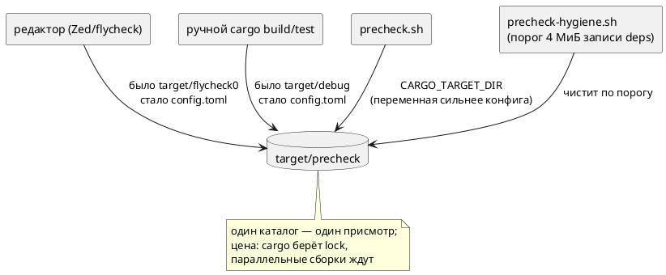

# Фича: Единый каталог сборки для всех потребителей cargo

- **Номер:** 0251
- **Статус:** ГОТОВО
- **Зависит от:** нет
- **Tier:** proc
- **Связанные issue (анализ):** кандидат блока 2 `FEATURES.md` (замер-18, вынесен при работе над [профилирование и ускорение предкоммита](0234-precheck-time-profile.md))

## Стадии жизненного цикла (правило 17)

Все стадии — **разделы этой карточки** (правило 32): «Архитектура (ADR)»,
«Анализ», «Разработка», «Тест-план», «Отчёт о тестировании», «Итог».
Отдельным артефактом остаются только исправления —
[`docs/fixes/`](../fixes/README.md) (при необходимости `0251-YY-*`).

## Краткое описание

Самоочистка каталога сборки ([профилирование и ускорение предкоммита](0234-precheck-time-profile.md)) следит
**только** за каталогом проверки `target/precheck` — и это осознанный инвариант:
рабочий `target` есть чужие данные, удалять их проверка не вправе. Но пишут в
рабочий каталог все остальные — редактор и ручные `cargo build`/`cargo test`, —
и за ними не следит никто. Фича направляет **всех** потребителей cargo в тот же
каталог, за которым уже установлен присмотр.

> Фича зарегистрирована по запросу заказчика (2026-08-18) из кандидата,
> вынесенного при работе над 0234; далее проходит жизненный цикл по правилу 17.

## Что известно на входе

- **Замер-18.** Полный предкоммит шёл заметно дольше норматива;
  `cargo clean` снёс **47.7 ГиБ и 198 621 файл**, после чего тот же предкоммит
  на чистом дереве занял **152 с** при нормативе 233 с и нуле отказов.
- **Гигиена отработала верно:** запись `target/precheck/debug/deps` была
  119 936 байт — **3 %** порога в 4 МиБ. Каталог проверки здоров; раздували
  `debug/`, `release/`, `install/`, `tmp/` и `flycheck0/`.
- **Профиль здорового прогона** (замер тем же днём): `cargo test` 58 с,
  `verilator` 36 с, `clippy` 20 с, сборка бинарников 17 с, прочие проверки ~21 с.
- **Цена решения тоже измерена:** два `cargo` в одном каталоге сборки
  **блокируют друг друга** — второй печатает `Blocking waiting for file lock on
  build directory` и ждёт. Это свойство cargo, а не настройки.

## Направление решения (наметка, не решение)

- `.cargo/config.toml` с `[build] target-dir`; либо переменная окружения в
  профиле разработчика; либо предупреждение проверки без принуждения.
- Критерий выбора — чтобы каталог сборки не мог вырасти незамеченным, а цена
  (блокировка параллельных сборок) была названа, а не обнаружена в работе.

Окончательный выбор — за стадиями **архитектуры** (ADR) и **анализа**.

## Документирование (правило 24)

**Не требуется.** Язык не затрагивается: ни синтаксис, ни семантика, ни
диагностики, ни поведение целей. Затронуты `README.md` (как собирать) и живой
контекст `CLAUDE.md` (правила работы с каталогом сборки).

## Архитектура (ADR)

- **Status:** Accepted
- **Date:** 2026-08-18
- **Authors:** Архитектор + аналитик (решение — заказчик, 2026-08-18)
- **Related issues:** [Фича](0251-cargo-target-dir.md);
  каталог проверки и его самоочистка — [ADR](0234-precheck-time-profile.md#архитектура-adr);
  профиль предкоммита и «замер верен только на устоявшейся ФС» —
  [ADR](0242-grammar-crate-split.md#архитектура-adr);
  пути проверки берутся из каталога проверки — [ADR](0241-precheck-speedup.md#архитектура-adr)

### Context

Фича ввела для предкоммита **свой** каталог сборки `target/precheck` и
самоочистку по порогу: у cargo нет сборки мусора, каталог растёт монотонно, и
однажды его обход становится дороже самой компиляции (замер: 83 ГБ /
599 435 файлов, один листинг `deps` — 66.7 с при здоровых 0.13 с).

Скрипт `precheck-hygiene.sh` чистит **только** каталог проверки: путь обязан
оканчиваться на `/target/precheck`, иначе отказ. Это осознанный инвариант —
рабочий `target` есть чужие данные.

Оборотная сторона обнаружилась 2026-08-18. Пишут в рабочий каталог **все
остальные**: редактор (Zed кладёт свой кэш в `target/flycheck0`) и ручные
`cargo build`/`cargo test` без `CARGO_TARGET_DIR`. За ними не следит никто.

#### Замер-18

| Что | Значение |
|---|---|
| Удалено `cargo clean` | **47.7 ГиБ, 198 621 файл** |
| Запись `target/precheck/debug/deps` в тот же момент | 119 936 байт — **3 %** порога 4 МиБ |
| Полный предкоммит **после** очистки | **152 с** (норматив 0234 — 233 с), отказов 0 |
| Профиль здорового прогона | `cargo test` 58 с · `verilator` 36 с · `clippy` 20 с · сборка бинарников 17 с · прочие ~21 с |

То есть проверка работал верно, порог не превышался, а прогон всё равно был долгим:
метрика смотрела не туда, куда рос каталог. Формально дефекта нет ни в одном
месте — и именно поэтому он мог жить сколько угодно.

#### Цена любого объединения — блокировка (замер там же)

Два `cargo` в одном каталоге сборки не работают параллельно. Проба: `cargo
build` в `target/precheck` и через 3 с `cargo check` туда же —

```text
    Blocking waiting for file lock on build directory
```

Это свойство cargo (`.cargo-lock` на каталог), а не настройки. Значит на время
предкоммита (152 с) диагностика редактора замрёт, а предкоммит подождёт
секунды, если редактор проверяет файл в этот момент.

Целевой поток (правило 18 — схема нужна: меняется адресат записи у трёх
потребителей):



### Decision Drivers

1. **Каталог сборки не должен расти незамеченным.** Замер показал сценарий, при
   котором все проверки зелены, а работа деградирует.
2. **Проверка не удаляет чужое.** Инвариант сохраняется: удаляется только
   каталог, чей путь оканчивается на `/target/precheck`.
3. **Цену называют заранее.** Блокировка параллельных сборок — не сюрприз в
   работе, а строка в документации.
4. **Настройка не должна ломать сторонний сценарий сборки.** Файл в репозитории
   действует на всех, кто его склонирует, включая CI.
5. **Одно знание.** Каталог проверки уже задан в `precheck.sh`; второй источник
   истины о том же пути обязан быть согласован либо отсутствовать.

### Considered Options

#### Option A. Ничего не менять, полагаться на дисциплину

**Pros:**
- Ноль изменений; параллельные сборки не конкурируют.

**Cons:**
- Уже проверено практикой: 47.7 ГиБ накопились именно так.
- Дисциплина не масштабируется на редактор — он собирает сам, без спроса.

#### Option B. Предупреждение проверки о распухшем рабочем каталоге

Мерить `target/debug/deps` той же дешёвой метрикой и печатать совет.

**Pros:**
- Инвариант «не трогать чужое» соблюдён буквально; ничего не ломается.
- Стоимость 0.021 с.

**Cons:**
- Предупреждение приходит **в конце** прогона, который уже был медленным.
- Совет можно игнорировать сколько угодно: механизм не меняет причину.

#### Option C. `.cargo/config.toml` с `[build] target-dir` (принято)

**Pros:**
- Причина устраняется: расти незамеченным каталогу больше негде — всё пишется
  туда, где стоит присмотр.
- Ноль дисциплины: настройка действует на редактор, на скрипты и на человека.
- `precheck.sh` не трогается: он экспортирует `CARGO_TARGET_DIR`, а **переменная
  окружения сильнее конфига** — проверка продолжает управлять каталогом сам.

**Cons:**
- **Блокировка** (замер выше): редактор и предкоммит ждут друг друга.
- Файл действует на всех, кто клонирует репозиторий, — включая CI и сторонние
  сборки; путь относительный, но каталог общий.
- Самоочистка теперь сносит и кэш редактора. Не потеря (пересоберётся), но
  честнее назвать: после чистки первая проверка в редакторе будет долгой.

#### Option D. Общий каталог, но не тот, где работает проверка

Например `target/shared` для редактора и ручных сборок.

**Pros:**
- Блокировок нет: у проверки свой каталог.

**Cons:**
- **Не решает задачу:** за `target/shared` по-прежнему не следит никто, и
  инвариант запрещает проверке его чистить. Мы получили бы ту же проблему под
  новым именем.

### Decision

Принимается **Option C** (решение заказчика 2026-08-18): в репозиторий кладётся

```toml
## .cargo/config.toml
[build]
target-dir = "target/precheck"
```

- **Проверка не меняется.** `precheck.sh` экспортирует `CARGO_TARGET_DIR`, и
  переменная окружения имеет приоритет над `config.toml`. Значение при этом то
  же самое, так что фактический каталог один и тот же.
- **Инвариант сохраняется дословно:** удаляется по-прежнему только путь,
  оканчивающийся на `/target/precheck`. Изменилось не правило, а состав
  пишущих: теперь под присмотром оказываются все.
- **Блокировка принимается как цена** и документируется в `README.md` и живом
  контексте: параллельные `cargo` ждут друг друга; во время предкоммита
  диагностика редактора замирает.
- **Option B не отменяется, а становится ненужной** в своём исходном виде:
  предупреждать не о чем, пока все пишут в наблюдаемый каталог. Если появится
  потребитель, задающий каталог явно (как это делает Zed флагом), кандидат
  вернётся — и уже с известной метрикой.

### Consequences

#### Положительные

- Каталог сборки один, и за ним есть присмотр: сценарий «47.7 ГиБ незаметно»
  больше не воспроизводится.
- Сборки редактора и человека переиспользуют артефакты проверки — первая ручная
  команда после предкоммита не пересобирает всё заново.
- Диск: вместо трёх-четырёх параллельных кэшей (`debug`, `release`,
  `flycheck0`, `precheck`) остаётся один.

#### Отрицательные / Action items

- **Параллельные сборки ждут друг друга** — назвать в `README.md` и `CLAUDE.md`,
  вместе с обходом (`CARGO_TARGET_DIR=target/scratch cargo …` для того, кому
  нужна независимая сборка прямо сейчас).
- Самоочистка сносит и кэш редактора: после срабатывания порога первая
  проверка в редакторе будет долгой.
- Проверить, что настройка не ломает: предкоммит целиком, сборку из чистого
  клона, `cargo` из подкаталога крейта (`takt-lang/`) — относительный
  `target-dir` разрешается от каталога с `config.toml`.
- Потребитель, задающий каталог **явно**, конфигу не подчиняется. В проекте
  такой один и он намеренный: `scripts/install.sh` собирает в `target/install`,
  чтобы установка не конкурировала с проверкой за блокировку (контроль
  `test-install.sh`, проверка A8). Каталог редко создаётся и незаметно не
  растёт. Если же **редактор** окажется таким потребителем (прежде существовал
  `target/flycheck0`), часть кэша снова уйдёт мимо присмотра — проверяется
  наблюдением, а не предположением: см. границу в анализе.

#### Acceptance criteria

1. `.cargo/config.toml` задаёт `target-dir = "target/precheck"`; файл
   отслеживается git.
2. Обычный `cargo build` без переменных окружения кладёт артефакты в
   `target/precheck`, а `target/debug` не появляется.
3. `cargo` из подкаталога крейта пишет туда же (относительный путь разрешается
   от корня репозитория).
4. `precheck.sh` работает как прежде: каталог тот же, проверки зелены, время в
   пределах норматива.
5. Инвариант гигиены не ослаблен: `precheck-hygiene.sh` по-прежнему отказывает
   на пути, не оканчивающемся на `/target/precheck` (контроль
   `test-precheck-hygiene.sh` зелёный).
6. `README.md` и `CLAUDE.md` называют настройку, её цену (блокировка) и обход.

## Анализ

### Цель и контекст

ADR принял **Option C**: `.cargo/config.toml` с `[build] target-dir =
"target/precheck"` направляет всех потребителей cargo в каталог, за которым
уже следит самоочистка (0234). Анализ проверяет обещания ADR замером и
называет границы.

#### Замеры-18 (проведены до и во время разработки)

| Проверка | Результат |
|---|---|
| `cargo build --bin taktc` без переменных окружения | артефакты в `target/precheck`; `target/debug` **не появился** |
| `cargo build` из подкаталога `takt-lang/` | туда же: относительный путь разрешается от каталога с `config.toml`, а не от текущего |
| `CARGO_TARGET_DIR=target/scratch cargo build` | создан `target/scratch` — **переменная сильнее конфига**, обход работает |
| `scripts/test-precheck-hygiene.sh` | зелёный: инвариант «удаляется только `/target/precheck`» не ослаблен |
| Два `cargo` в одном каталоге | `Blocking waiting for file lock on build directory` — ждут друг друга |
| Наблюдение за редактором 90 с после `touch` файла | отдельный `target/flycheck0` **не появился**; см. границу ниже |

### Зависимости фичи (правило 17/19)

- **Зависит от:** нет. Настройка опирается на уже закрытые 0234 (каталог проверки и
  самоочистка) и 0241 (пути проверки берутся из каталога проверки).
- **Влияние на порядок разработки:** ни одну фичу не блокирует и не
  разблокирует. Снимает кандидата «предупреждать о распухшем рабочем `target`»
  в его нынешнем виде: предупреждать не о чем, пока все пишут в наблюдаемый
  каталог.

### Требования и проверяемые условия

- **R1. Каталог один.** Обычный `cargo` — из корня и из подкаталога крейта —
  пишет в `target/precheck`; `target/debug` не создаётся.
- **R2. Проверка не затронут.** `precheck.sh` экспортирует `CARGO_TARGET_DIR`, и
  переменная сильнее конфига; значение совпадает, поэтому фактический каталог
  тот же. Прогон и его время — в пределах норматива.
- **R3. Инвариант не ослаблен.** `precheck-hygiene.sh` по-прежнему
  отказывает на чужом пути. Изменился состав пишущих, а не правило удаления.
- **R4. Цена названа.** Блокировка параллельных сборок и способ её обойти
  (`CARGO_TARGET_DIR=target/scratch`) описаны в `README.md`, в живом контексте
  и в самом `config.toml` — там, где на них наткнётся тот, кто откроет файл.
- **R5. Ничего не сломано у стороннего потребителя.** Файл действует на всех,
  кто клонирует репозиторий; путь относительный, `.gitignore` уже покрывает
  `target/`, отдельной записи не нужно.

### Критерии приёмки и способ проверки

| # | Критерий | Способ проверки | Итог |
|---|---|---|---|
| A1 | `.cargo/config.toml` в репозитории и отслеживается | `git status` | ✅ |
| A2 | `cargo build` без переменных → `target/precheck`, `target/debug` нет | прогон + `ls target` | ✅ |
| A3 | `cargo` из подкаталога крейта пишет туда же | прогон из `takt-lang/` | ✅ |
| A4 | Переменная окружения перекрывает конфиг (обход работает) | `CARGO_TARGET_DIR=target/scratch cargo build` | ✅ |
| A5 | Инвариант гигиены цел | `scripts/test-precheck-hygiene.sh` | ✅ |
| A6 | Предкоммит зелёный и в нормативе | `./scripts/precheck.sh` | см. отчёт |
| A7 | `README.md` и `CLAUDE.md` называют настройку, цену и обход | чтение; проверка | см. отчёт |

### Особенности по обратной функциональности

- **Язык не затронут** (правило 22): версия языка прежняя. Код крейтов не
  меняется — версия крейта тоже прежняя. Это настройка среды сборки.
- **Правило 29 (редакторский слой):** ни LSP, ни плагины не правятся; фича
  касается того, **куда** редактор кладёт артефакты, а не того, что он умеет.
- **CI:** прогоняет тот же `precheck.sh`, который задаёт `CARGO_TARGET_DIR`
  сам, — поведение не меняется.

### Риски и границы

- **Блокировка параллельных сборок** — принятая цена (решение заказчика).
  Смягчение названо: свой каталог через переменную окружения.
- **Самоочистка теперь сносит и кэш редактора.** Не потеря — пересоберётся, но
  первая проверка после срабатывания порога будет долгой.
- **Потребитель, задающий каталог явно, конфигу не подчиняется — и один такой
  есть в самом проекте.** `scripts/install.sh` экспортирует
  `CARGO_TARGET_DIR=$ROOT/target/install`, и это **намеренно**: у установки свой
  каталог, иначе она конкурировала бы с проверкой за блокировку. Поведение
  закреплено контролем `scripts/test-install.sh` (проверка A8), менять его фича
  не вправе. Значит `target/install` остаётся вне присмотра — но создаётся он
  редко и по явной команде, то есть незаметно вырасти не может.

- **Граница наблюдения: тот же вопрос про редактор пока открыт.** Прежде существовал `target/flycheck0` — кэш проверки редактора.
  После настройки наблюдение в течение 90 с (с принудительным `touch` файла) его
  появления не показало, **но это не доказательство**: редактор мог просто не
  перепроверять проект в тот момент. Метод окончательной проверки прост и
  записан здесь: если `target/flycheck0` (или иной каталог рядом с `precheck`)
  появится в ходе обычной работы — значит потребитель задаёт путь явно, конфиг
  его не перенаправляет, и кандидат «предупреждать о каталоге вне присмотра»
  оживает уже с известной метрикой (`stat` записи `deps`, 0.021 с).

## Разработка

### Задача

#### Что было

Каталогов сборки было четыре: `target/debug` и `target/release` (ручные
команды), `target/flycheck0` (редактор), `target/precheck` (проверка) — и
самоочистка 0234 следила только за последним. Остальные росли молча: замер-18 дал **47.7 ГиБ и 198 621 файл**.

#### Что сделано

- **`.cargo/config.toml`** с `[build] target-dir = "target/precheck"`. Шапка
  файла объясняет, зачем он и чем за это платится, — там, где на объяснение
  наткнётся тот, кто откроет файл, а не только читатель `README.md`.
- **`README.md`** (раздел «Сборка из исходников»): общий каталог, замер,
  блокировка и обход `CARGO_TARGET_DIR=target/scratch`.
- **`CLAUDE.md`** (раздел «Документ и процесс»): то же для будущих сессий, плюс
  профиль здорового прогона и оговорка про потребителя с явным каталогом.

Кода это не касается: ни крейты, ни скрипты не правились. `precheck.sh`
продолжает экспортировать `CARGO_TARGET_DIR` — переменная сильнее конфига, а
значение совпадает.

#### Проверки

| Что | Как | Итог |
|---|---|---|
| `cargo build` без переменных | `ls target` после сборки | только `precheck/`, `debug/` не создан |
| `cargo` из подкаталога крейта | сборка из `takt-lang/` | туда же (путь относителен корню репозитория) |
| Обход через переменную | `CARGO_TARGET_DIR=target/scratch cargo build` | создан `target/scratch` |
| Блокировка (цена) | два `cargo` в один каталог | `Blocking waiting for file lock on build directory` |
| Инвариант гигиены | `scripts/test-precheck-hygiene.sh` | зелёный (A1–A4) |
| Полный предкоммит | `./scripts/precheck.sh` | см. отчёт |

## Тест-план

### Область и цель

Фича меняет **среду сборки**, а не код, поэтому проверки — прогоны команд, а не
юнит-тесты. Проверяется, что каталог действительно один, что проверка не задет и
что цена (блокировка) названа. Требования — R1…R5 анализа.

### Проверки (условие → ожидаемый результат)

| # | Проверка | Предусловие | Ожидаемый результат | Ссылка на R/A |
|---|---|---|---|---|
| T1 | Обычная сборка | `cargo build --bin taktc` без переменных | артефакты в `target/precheck`; `target/debug` не создан | R1 / A2 |
| T2 | Сборка из подкаталога крейта | `cd takt-lang && cargo build` | туда же — путь относителен корню репозитория | R1 / A3 |
| T3 | Обход настройки | `CARGO_TARGET_DIR=target/scratch cargo build` | создан `target/scratch`: переменная сильнее конфига | R4 / A4 |
| T4 | Цена названа и воспроизводима | два `cargo` в один каталог | второй печатает `Blocking waiting for file lock on build directory` | R4 |
| T5 | Инвариант гигиены цел | `scripts/test-precheck-hygiene.sh` | зелёный; чужой путь отвергается | R3 / A5 |
| T6 | Установщик не задет | `scripts/test-install.sh` | зелёный, в том числе A8 («каталог сборки — свой») | R5 |
| T7 | Проверка работает и укладывается в норматив | `./scripts/precheck.sh` | код 0, время ≤ 233 с | R2 / A6 |
| T8 | Документация называет настройку, цену и обход | `README.md`, `CLAUDE.md`, шапка `.cargo/config.toml` | все три места | R4 / A7 |
| T9 | Файл в репозитории | `git status` | `.cargo/config.toml` отслеживается | A1 |

### Разбивка проверок по функциональности

| Функциональность | Статус | Примечание |
|---|---|---|
| Среда сборки (`.cargo/config.toml`) | ✅ | предмет фичи |
| Предкоммит и его гигиена | ✅ | не изменялись, проверены прогоном |
| Установщик (`scripts/install.sh`) | ✅ | свой каталог сохранён намеренно |
| Крейты, язык, генераторы, LSP | — | не затронуты |

<!-- Легенда: ✅ пройдено · ❌ провалено · ⬜ не проверялось · — не применимо -->

### Тестовые данные и окружение

Отдельных фикстур нет: проверки идут на самом репозитории. Окружение — пин
толчейна 1.97.1, macOS.

## Отчёт о тестировании

### Резюме

Все проверки пройдены; фича готова к закрытию (`ГОТОВО`). Каталог сборки у всех
потребителей теперь один и находится под самоочисткой 0234; проверка, установщик и
их контроля не задеты.

### Фактические результаты по проверкам

| # | Проверка | Результат | Комментарий |
|---|---|---|---|
| T1 | Обычная сборка | ✅ | `ls target` → только `precheck/`; `debug/` не создан |
| T2 | Сборка из подкаталога крейта | ✅ | из `takt-lang/` артефакты легли в корневой `target/precheck` |
| T3 | Обход настройки | ✅ | `CARGO_TARGET_DIR=target/scratch` создал свой каталог |
| T4 | Цена воспроизводима | ✅ | `Blocking waiting for file lock on build directory` |
| T5 | Инвариант гигиены | ✅ | `test-precheck-hygiene.sh` — A1…A4 |
| T6 | Установщик не задет | ✅ | `test-install.sh` — A1…A8, включая «каталог сборки — свой» |
| T7 | Полный предкоммит | ✅ | код 0, время — ниже |
| T8 | Документация | ✅ | `README.md`, `CLAUDE.md`, шапка `.cargo/config.toml` |
| T9 | Файл в репозитории | ✅ | `.cargo/config.toml` отслеживается |

### Результаты по функциональности

| Функциональность | Статус |
|---|---|
| Среда сборки | ✅ |
| Предкоммит и гигиена | ✅ |
| Установщик | ✅ |
| Крейты, язык, генераторы, LSP | — |

### Выводы и дальнейшие шаги

1. **Дефекта не было ни в одном месте — и в этом суть находки.** Гигиена
   работала верно (запись `deps` каталога проверки — 3 % порога), инвариант «не
   трогать чужое» верен, метрика дешева. Просто наблюдаемым был один каталог, а
   росли другие. Такие расхождения не ловятся проверками: их видно только по
   симптому.
2. **Цена принята сознательно.** Блокировка параллельных сборок — свойство
   cargo; она названа в трёх местах и снабжена обходом.
3. **Исправлений (`docs/fixes/`) не требуется.**
4. **Открытая граница, а не дефект:** потребитель, задающий каталог явно, конфигу
   не подчиняется. Один такой в проекте есть намеренно (`scripts/install.sh` →
   `target/install`, контроль A8). Появится ли второй — покажет работа: если рядом
   с `precheck` возникнет `flycheck0` или подобный, кандидат «предупреждать о
   каталоге вне присмотра» оживает с уже известной метрикой.

## Итог (что сделано)

В репозиторий добавлен `.cargo/config.toml` с `[build] target-dir =
"target/precheck"`: редактор, ручные `cargo build`/`cargo test` и предкоммит
пишут в **один** каталог — тот, за которым уже стоит самоочистка
[профилирование и ускорение предкоммита](0234-precheck-time-profile.md). Кода это не касается; версии языка и
крейтов прежние.

**Почему понадобилось.** Замер-18: рабочий каталог накопил **47.7 ГиБ и
198 621 файл**, из-за чего полный предкоммит деградировал — cargo обходит
каталог перед каждой единицей компиляции. После `cargo clean` тот же прогон
занял **152 с** при нормативе 233 с. При этом **дефекта не было ни в одном
месте**: гигиена следила за каталогом проверки и была права (запись `deps` — 3 %
порога), инвариант «не трогать чужое» верен, метрика дешева. Наблюдаемым был
один каталог, а росли другие — расхождение, которое не ловится проверками и
видно только по симптому.

**Цена названа, а не обнаружена в работе:** cargo держит блокировку на каталог
сборки, поэтому параллельные сборки ждут друг друга (`Blocking waiting for file
lock on build directory` — проверено пробой). Обход — `CARGO_TARGET_DIR=target/scratch`;
переменная окружения сильнее конфига, на этом же стоит и сам `precheck.sh`.

Проверено прогонами: обычная сборка и сборка из подкаталога крейта идут в
`target/precheck` (`target/debug` не создаётся), обход работает, контроля
`test-precheck-hygiene.sh` и `test-install.sh` зелёные, полный предкоммит —
**1 мин 50 с, код 0, отказов 0**.

**Граница, названная намеренно:** потребитель, задающий каталог явно, конфигу
не подчиняется. Один такой в проекте есть по замыслу — `scripts/install.sh`
(`target/install`), чтобы установка не конкурировала с проверкой за блокировку;
поведение закреплено контролем A8.

Артефакты: [ADR](0251-cargo-target-dir.md#архитектура-adr) ·
[анализ](0251-cargo-target-dir.md#анализ) ·
[единый каталог сборки для всех потребителей cargo](0251-cargo-target-dir.md#разработка) ·
[тест-план](0251-cargo-target-dir.md#тест-план) ·
[отчёт](0251-cargo-target-dir.md#отчёт-о-тестировании).
