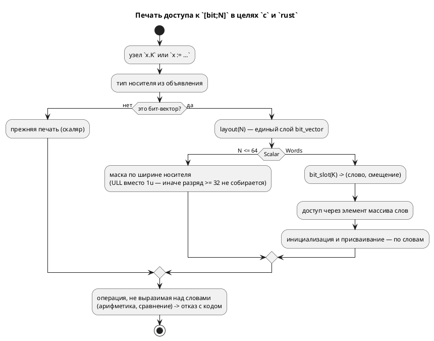

# Фича: [bit; N > 64] не переводят цели c и rust

- **Номер:** 0262
- **Статус:** ГОТОВО
- **Зависит от:** нет (проставлено на стадии 3)
- **Tier:** 2 — порождённый C и Rust не собираются: объявление, инициализация, чтение, запись (расставлен по признаку вреда 2026-08-18, см. `FEATURES.md`)
- **Класс:** генерация
- **Связанные issue (анализ):** кандидат блока 2 `FEATURES.md`, переведён в фичу пакетно 2026-08-18

## Стадии жизненного цикла (правило 17)

Все стадии — **разделы этой карточки** (правило 32): «Архитектура (ADR)»,
«Анализ», «Разработка», «Тест-план», «Отчёт о тестировании», «Итог».
Отдельным артефактом остаются только исправления —
[`docs/fixes/`](../fixes/README.md) (при необходимости `0262-YY-*`).

## Краткое описание

**`[bit; N > 64]` не переводят цели `c` и `rust`.** Замер
[запись бита x.N := v: цели rust и st печатают чтение, эталон отказывает](0250-bit-write-in-targets.md) (2026-08-18): у
`var w: [bit;96] := 0;` в цели `c` не собирается даже **инициализация** —
печатается `model->w = 0;` при `uint64_t w[2]` (`cc`: «array type is not
assignable»); чтение разряда `w.70` там же даёт `invalid operands`. Цель
`rust` объявляет `w: [u64; 2]`, а инициализирует `w: 0` и читает
`self.w >> 70`. Проверено прогоном **без единой записи разряда**: сломаны
объявление, инициализация, чтение и запись разом. Цель `sv` тот же вход
переводит верно (`logic [95:0]`), эталон исполняет (`bit_slot`) —
то есть ломается не форма языка, а её представление в двух целях. Кандидат:
вести упакованный вектор `N > 64` массивом слов во всём выводе `c` и `rust`
либо отказывать честным кодом. Корпус класс не покрывает: векторов шире
64 бит в `examples/` нет.

> Фича заведена **из бэклога кандидатов пакетным переводом** (решение заказчика
> 2026-08-18: «перевести всех кандидатов в фичи без проработки, решить, делать
> или нет, позже»). Стадии 2 и 3 **не пройдены**: приоритет, зависимости и
> объём не оценивались. Далее — жизненный цикл по правилу 17.

## Что известно на входе

Всё, что проверено, — в разделе выше: это **дословный текст кандидата** со
своим замером и ссылками на фичу, при закрытии которой он был вынесен. Ничего
сверх этого не проверялось.

Замер снят на дату, указанную в тексте. Прежде чем брать фичу в работу,
**перепроверь** его: условие карточки перепроверяется, а не наследуется — урок
[остаточные старые имена языка в данных и комментариях](0161-fixture-comments-rename.md), где обоснование отказа держало
работу отложенной два месяца и оказалось неверным уже в момент отказа.

## Направление решения (наметка, не решение)

Наметка — в тексте кандидата выше (там, где он её содержит). Решение о том,
**делать ли фичу вообще**, отложено заказчиком и принимается до стадии 2.

## Документирование (правило 24)

**Определяется на стадии анализа.** Фича затрагивает язык или наблюдаемое
поведение целей, поэтому нужный раздел `book/` называется после проработки —
до неё утверждение о документе было бы догадкой.

## Архитектура (ADR)

- **Status:** Accepted
- **Date:** 2026-08-19
- **Authors:** Архитектор + аналитик + разработчик (объём выбран заказчиком 2026-08-19)
- **Related issues:** [Фича](0262-wide-bit-vector-c-rust.md); смежные — [семантика `[bit;N]` расходится втрое](0078-bit-array-semantics.md) (слой упаковки), [запись бита x.N := v: цели rust и st печатают чтение, эталон отказывает](0250-bit-write-in-targets.md) (где замер снят), [генератор генерации в SystemVerilog](0045-sv-backend.md) (цель `sv` тот же вход умеет)

### Context

`[bit;N]` — упакованный вектор (0078): при `N ≤ 64` — скаляр, при `N > 64` —
массив из `⌈N/64⌉` слов. Правило живёт в едином слое `semantic::bit_vector`, и
цели `c`/`rust` зовут его **при печати типа** — но не при печати операций.
Поэтому объявление выходит верным (`uint64_t w[2]`, `[u64; 2]`), а всё
остальное печатается так, будто перед нами скаляр.

**Замер-19** (`scripts/probe.sh`, проба признана годной; отказы сняты
прогоном `cc -std=c11 -Wall -Wextra -Werror`, `rustc --edition 2021`,
`verilator`, `iec2c`):

| Вход | Эталон | `c` | `rust` | `st` | `sv` |
|---|---|---|---|---|---|
| `var w: [bit;96] := 0;` + `w.70 := 1;` + `if w.70 {…}` | исполняет (`w=[0,64]`) | **4 ошибки `cc`** | **4 ошибки `rustc`** | `ST-011` | верно (`logic [95:0]`) |
| `w := x;` (оба `[bit;96]`) | исполняет | `model->w = model->x;` — не собирается | то же | `ST-011` | верно |
| `seen := w + 1;` | **`SIM-005` в такте** | печатает `model->w + 1` (арифметика указателя) | печатает | `ST-011` | — |
| **контроль** `var v: u64 := 0; v.35 := 1;` | исполняет | **`shift count >= width of type`** | собирается | — | — |

Ошибки `cc` на первом входе: `array type 'uint64_t[2]' is not assignable`
(инициализация), `invalid operands` (чтение и запись разряда),
`shift count >= width of type`. Ошибки `rustc`: `E0308` ×2 (инициализация
`[u64;2]` числом `0`), `E0368` (`|=` над массивом), `E0369` (`>>` над массивом).

Три вывода, каждый снят прогоном:

1. **Ломается не форма языка, а её представление в двух целях.** Эталон и цель
   `sv` тот же вход исполняют верно, цель `st` честно отказывает `ST-011`.
2. **Контрольный вход вскрыл второй, более широкий дефект.** Маска разряда в
   цели `c` печатается литералом `1u` — это `unsigned int` (32 бита), поэтому
   запись разряда **≥ 32 не собирается и у обычного `u64`**, где представление
   скалярное и никакого «широкого вектора» нет. Класс шире того, что назвал
   кандидат, и живёт в том же печатнике.
3. **Арифметика над широким вектором не поддержана и эталоном** (`SIM-005` в
   такте): цели обязаны отказывать с причиной, а не печатать выражение, смысл
   которого в C — арифметика указателя.

**Корпус класс не покрывает:** векторов шире 64 бит в `examples/` нет ни
одного, записи разряда — тоже. Оба проверки (`cc` через `cmake`,
`clippy` по порождённым `.rs`) молчали и молчали бы дальше.



### Decision Drivers

1. **Молчаливый невалидный вывод — худший исход.** `taktc` возвращает ноль, а
   файл не собирается: об этом узнаёт не автор модели, а сборка прошивки.
2. **Правило представления уже есть и одно** (`semantic::bit_vector`): цели
   обязаны его звать, а не заводить своё знание о словах.
3. **Объём ограничен формами, которые поддерживает эталон.** Там, где эталон
   отвечает `SIM-005`, цель обязана отказывать, а не выдумывать семантику.
4. **Скалярный случай нельзя сломать.** `[bit;N ≤ 64]` — рабочая, покрытая
   корпусом форма; правка обязана оставить её вывод прежним, кроме самой маски.

### Considered Options

#### Option A. Оставить как есть

**Pros:** ноль правок.

**Cons:** две цели из шести дают невалидный вывод при рапорте об успехе; вход
законен, эталон и `sv` его исполняют. Контрольный дефект (`1u`) бьёт и по
обычному `u64`.

#### Option B. Честный отказ обеих целей на `N > 64`

**Pros:** дёшево; поведение становится честным (как `ST-011`).

**Cons:** форма остаётся непереводимой двумя основными целями, хотя эталон и
`sv` её исполняют; язык фактически сужается там, где сужать нечего.

#### Option C. Многословное представление во всём выводе `c` и `rust`

**Pros:**
- законная форма языка переводится всеми целями, кроме честно отказывающей `st`;
- знание о словах берётся у существующего слоя, второго не заводится;
- попутно чинится маска разряда, ломающая и скалярный случай.

**Cons:** правка в четырёх местах каждой цели (объявление уже верно):
инициализация, присваивание, чтение и запись разряда. Плюс отказ на операциях,
не выразимых над словами.

### Decision

Принимается **Option C** (объём выбран заказчиком 2026-08-19).

1. **Формы, которые переводятся** — ровно те, что исполняет эталон:
   инициализация (`w := 0`), присваивание вектора вектору (`w := x`), чтение
   разряда (`w.K`), запись разряда (`w.K := v`).
2. **Формы, которые отвергаются кодом с причиной** — арифметика и сравнение над
   `Words`: их не умеет и эталон (`SIM-005`), а печать выражения означала бы в C
   арифметику указателя, то есть тихо неверный код.
3. **Маска разряда в цели `c` строится по ширине носителя**, а не литералом
   `1u`: иначе разряд ≥ 32 не собирается и в скалярном представлении.
4. **Позиция разряда берётся у `bit_vector::bit_slot`** — того же носителя,
   которым пользуются эталон (`eval/access.rs`, `eval/place.rs`) и цель `st`.
   Своего деления на слова цели не заводят.

### Consequences

#### Положительные

- `[bit; N > 64]` переводится целями `c` и `rust`; вывод принимается `cc` и
  `rustc` под строгими флагами проверок.
- Запись разряда ≥ 32 чинится **и для скаляров** — класс, которого кандидат не
  называл.
- Отказ на невыразимых операциях приходит от **своей** цели с причиной, а не от
  чужого компилятора на порождённом файле.

#### Отрицательные / Action items

- Вывод цели `c` для записи разряда меняется (маска). Корпус его не содержит,
  но снимки `examples/generated/` проверяются.
- Тип носителя берётся из ячейки `ExpressionNode::Variable` — снимка,
  снятого при разрешении имени (засада 0204). Для **объявленного** типа он
  верен; при `Inference` печать остаётся прежней (скалярной), то есть правка
  деградирует в текущее поведение, а не в отказ.
- Корпус класс по-прежнему не покрывает: контроля — только фикстурные и
  потактовая сверка.

#### Acceptance criteria

1. `var w: [bit;96] := 0;` с записью и чтением разряда: вывод цели `c`
   принимается `cc -Wall -Wextra -Werror`, вывод цели `rust` — `clippy -D warnings` (A1).
2. Присваивание `w := x` над `[bit;96]` переводится обеими целями (A2).
3. Потактовая сверка эталон ≡ C на разрядах в разных словах (A3).
4. `var v: u64 := 0; v.35 := 1;` собирается `cc` (контрольный дефект) (A4).
5. Арифметика над `[bit;96]` отвергается обеими целями кодом с причиной (A5).
6. Скалярный случай (`[bit;64]` и уже) не изменился; снимки
   `examples/generated/` и `./scripts/precheck.sh` зелены (A6).

## Анализ

### Цель и контекст

`[bit;N]` при `N > 64` представлен массивом слов (слой
`semantic::bit_vector`). Цели `c` и `rust` звали слой только при печати **типа**,
а операции печатали как для скаляра — и порождали код, который не собирается,
при нулевом коде возврата `taktc`. Фича учит обе цели работать по словам в тех
формах, которые исполняет эталон, и честно отказывать в остальных.

### Замер (снят заново, правило 30)

Проба `scripts/probe.sh` 2026-08-19 признана годной; отказы сняты прогоном
`cc -std=c11 -Wall -Wextra -Werror`, `rustc --edition 2021`,
`clippy-driver -D warnings`, `verilator --lint-only -Wall`, `iec2c`.

| # | Вход | Эталон | `c` | `rust` | `st` | `sv` |
|---|---|---|---|---|---|---|
| П1 | `var w: [bit;96] := 0;` + `w.70 := 1;` + `if w.70` | `w=[0,64]`, `seen=1` | **4 ошибки `cc`** | **4 ошибки `rustc`** | `ST-011` | верно |
| П2 | `w := x;` (оба `[bit;96]`) | исполняет | не собирается | не собирается | `ST-011` | верно |
| П3 | `seen := w + 1;` | **`SIM-005` в такте** | печатает (арифметика указателя) | печатает (`E0369`) | `ST-011` | — |
| К1 | **контроль** `var v: u64 := 0; v.35 := 1;` | исполняет | **не собирается** | собирается | — | — |
| К2 | **контроль** `[bit;64]`, разряд 60 | исполняет | **не собирается** | собирается | — | — |

**Контроль вскрыл второй дефект, кандидатом не названный.** Маска разряда в
цели `c` печаталась литералом `1u` — 32-битным `unsigned int`, поэтому разряд
≥ 32 не собирался **и при скалярном представлении**, где широких векторов нет
вовсе. Класс шире заявленного и живёт в том же печатнике.

**Ломается не форма языка, а её представление в двух целях:** эталон и цель
`sv` тот же вход исполняют верно, `st` честно отказывает.

**Корпус класс не покрывает** (замер: векторов шире 64 бит в `examples/` нет
ни одного, записи разряда — тоже), поэтому оба проверки молчали.

### Зависимости фичи (правило 17/19)

- **Зависит от:** нет. Предшественники (0078 — слой представления, 0250 — запись
  разряда) закрыты.
- **Влияние на порядок разработки:** не разблокирует. Смежная запись
  [структуры не транслируются целями st и rust дальше объявления](0293-struct-in-st-rust.md) (структуры в `st`/`rust`) — иной
  класс: там тип не переводится вовсе, здесь тип верен, а операции — нет.

### Требования и проверяемые условия

- **R1. Разряд адресуется своим словом.** Позиция берётся у
  `bit_vector::bit_slot` — общего носителя с эталоном; своего деления на слова
  цели не заводят.
- **R2. Инициализация и копирование идут по словам.** Массив в C не является
  изменяемым lvalue; в Rust умолчание обязано совпадать с объявленным типом.
- **R3. Маска разряда шире 32 бит.** Скалярный носитель тоже обязан собираться
  при разряде ≥ 32.
- **R4. Невыразимая операция отвергается кодом с причиной** (`CC-022`,
  `RS-011`), а не печатается: её не поддерживает и эталон (`SIM-005`).
- **R5. Разряд за пределом вектора не даёт доступа за границу массива** — это UB
  в C и паника в Rust.
- **R6. Скалярный случай не изменился**, кроме суффикса маски.
- **R7. Вывод принимается настоящими инструментами** — `cc` под флагами проверки и
  `clippy -D warnings`.

### Критерии приёмки и способ проверки

| # | Критерий | Способ проверки |
|---|---|---|
| A1 | R1, R2 (цель `c`) | `takt-lang/tests/targets/wide_bit_vector_tests.rs` T1, T2 |
| A2 | R1, R2 (цель `rust`) | там же T3 |
| A3 | R1 сквозь исполнение | `takt-sim/tests/conformance/conformance_wide_bits_tests.rs` |
| A4 | R3, R6 (контроль) | `wide_bit_vector_tests.rs` T4 |
| A5 | R4 | там же T5 |
| A6 | R7 | там же T6, T7 (настоящие `cc` и `clippy-driver`) |
| A7 | R5 и корпус | юнит-тесты `c_bits`; снимки `examples/generated/`, `./scripts/precheck.sh` |

### Особенности по обратной функциональности

**Наблюдаемое поведение меняется сознательно** (правило 11):

- вывод целей для `[bit;N > 64]` был невалиден — теперь собирается;
- маска разряда печатается суффиксом `ull` вместо `1u` (форма вывода цели `c`);
- арифметика над широким вектором теперь отвергается своей диагностикой, а не
  чужим компилятором на порождённом файле.

Корпус не затронут: широких векторов и записей разряда в `examples/` нет.
Тексты двух юнит-тестов цели `c`, закреплявших форму `1u`, обновлены — они
фиксировали дефектную форму.

### Версия языка (правило 22)

**Язык не меняется:** ни синтаксис, ни семантика, ни набор диагностик языка.
Меняется перевод уже существующей формы двумя целями. Версия языка остаётся
`0.10.0`; версия крейта `takt-lang` поднимается на минор.

### Редакторский слой (правило 29)

**Проверка не требуется, и это ответ.** Новых токенов, ключевых слов, форм
объявления и узлов АСД нет; диагностики целей (`CC-022`, `RS-011`) уже
существуют и доходят до редактора общим путём.

### Документирование (правило 24)

Раздел `book/src/03-types/` («Битовый вектор `[bit; N]`») дополнен абзацем о
широком векторе: поразрядная работа, копирование целиком, отсутствие арифметики.
Номера фич и детали реализации в документ не попадают.

### Риски и зависимости

- **Риск: тип носителя берётся из ячейки ссылки** (засада 0204). При `Inference`
  печать деградирует в прежнюю, скалярную, а не в отказ — граница названа в коде
  обеих целей.
- **Риск: правка зацепит скалярный случай.** Снижен контрольными тестами (T4) и
  тем, что развилка идёт по `bit_vector::layout`, а не по «похоже на массив».
- **Риск: отказ окажется шире предмета.** Разбор операций намеренно **не**
  исчерпывающий: узел, которого нет в списке, ведёт себя как прежде.
- **Граница объёма:** формы, которых не исполняет эталон (арифметика,
  сравнение векторов), не поддержаны сознательно — сначала решение о семантике,
  потом перевод.

## Разработка

### Задача

#### Что было

Цель `c` звала слой `semantic::bit_vector` только при печати типа: объявление
выходило верным (`uint64_t w[2]`), а операции печатались как для скаляра.
`cc -std=c11 -Wall -Wextra -Werror` давал четыре ошибки — «array type is not
assignable», «invalid operands» ×2, «shift count >= width of type», — при
нулевом коде возврата `taktc`.

Маска разряда печаталась литералом `1u` (32-битный `unsigned int`), поэтому
разряд ≥ 32 **не собирался и у скалярного носителя** (`var v: u64 := 0;
v.35 := 1;`) — класс шире того, что называл кандидат.

#### Что сделано

**Новый модуль `takt-lang/src/generator/c/c_bits.rs`** — единственное место, где
цель `c` знает о представлении бит-вектора:

| Функция | Что делает |
|---|---|
| `words_of` / `words_of_type` | число слов носителя, `None` — скаляр (печать прежняя) |
| `read_bit` | чтение разряда: сдвиг носителя либо своего слова |
| `write_bit` | запись разряда: «очистить и установить» по своему слову |
| `copy_words` | копирование вектора по словам через оператор «запятая» |
| `fill_words` | заполнение числом: значение — младшему слову, прочим ноль |
| `wide_operand` | операция, чей операнд — широкий вектор (для отказа) |

Встроено в четыре места печати: чтение и запись разряда
(`c_expr/expr.rs`), присваивание (там же), инициализация в `_init`
(`c_model_init.rs::generate_wide_bits_init`). Отказ на невыразимой операции —
в начале `generate_expr`: воронка `CC-022` с двумя новыми видами узла
(`WideBitVector`, `BitBeyondVector`) и названной причиной.

**Маска стала `1ull`** (константа `c_bits::ONE`). Проба показала, что форма
проходит даже `-Wconversion` при узком носителе (`uint8_t`), поэтому условия
«по номеру бита» не понадобилось.

**Позиция разряда берётся у `bit_vector::bit_slot`** — того же носителя,
которым пользуются эталон и цель `st`: своего деления на слова цель не заводит.

**Разряд за пределом вектора** не печатается доступом за границу массива
(UB в прошивке): чтение даёт `0ull`, запись — отказ.

#### Проверки

```sh
cargo test --lib -p takt-lang c_bits          # юнит-тесты модуля
cargo test --test targets wide_bit_vector     # эмиссия + настоящий cc
cargo test --test conformance wide_bits       # потактовая сверка эталон = C
```

Два юнит-теста цели `c` (`test_bit_access_var_read_in_always`,
`test_bit_access_var_write_in_always`) закрепляли форму `1u` — то есть
дефектный вывод; их ожидания обновлены с пояснением, почему форма сменилась.

### Задача

#### Что было

Тип поля печатался верно (`[u64; 2]`), а всё остальное — как для скаляра:
`rustc --edition 2021` давал `E0308` ×2 (умолчание и сброс числом `0`),
`E0368` (`|=` над массивом), `E0369` (`>>` над массивом). Код возврата `taktc`
был нулевым.

#### Что сделано

Правки — в `rust_bit.rs` (носитель разряда), `rust_decl.rs` (умолчание) и
`rust_expr.rs` (инициализация, отказ):

| Место | Было | Стало |
|---|---|---|
| `default_value` | `[false; 96]` (массив бит) | `[0u64; 2]` — совпадает с объявленным типом |
| `coerce_to` (литерал в поле) | `0` | `[0u64; 2]`, значение — младшему слову |
| `bit_access` | сдвиг всего массива | сдвиг своего слова |
| `assign_bit` | маска по всему массиву | маска по своему слову |
| `binary` | печатал `self.w + 1` | отказ `RS-011` с причиной |

Число слов и позиция разряда берутся у `semantic::bit_vector` (`words_of_type`,
`bit_slot`) — того же носителя, что у эталона и цели `c`; своего знания о
словах цель не заводит.

**Копирование вектора править не пришлось:** `[u64; K]` реализует `Copy`, и
`self.w = self.x;` валидно как есть. Это проверено прогоном `rustc`, а не
предположено.

**Разряд за пределом вектора**: чтение даёт `false`, запись — отказ.
Индексация за границей массива в Rust — паника, а не «случайный бит».

#### Проверки

```sh
cargo test --test targets wide_bit_vector     # эмиссия + настоящий clippy-driver
cargo test --all-features                     # 3238 тестов
```

Проверка цели `rust` гоняет **только корпус**, где широких векторов нет ни одного
(замер), поэтому контроль — фикстурный, с прогоном настоящего
`clippy-driver -D warnings` на порождённом модуле.

## Тест-план

### Область и цель

Проверяются **форма вывода** (какое слово, какое смещение), **валидность**
вывода у настоящих инструментов и **совпадение поведения** с эталоном. Ни один
слой в одиночку не достаточен: форма без прогона доказывает лишь замысел, прогон
без формы — что «что-то собралось», а оба без сверки — что вывод валиден, но не
что он верен.

Требования R1…R7 и критерии A1…A7 — в [анализе](0262-wide-bit-vector-c-rust.md#анализ).

### Проверки (условие → ожидаемый результат)

| # | Проверка | Предусловие | Ожидаемый результат | R/A |
|---|---|---|---|---|
| T1 | Адресация слова в цели `c` | `[bit;96]`, разряды 5 и 70 | разряд 5 — слово 0, разряд 70 — слово 1 со смещением 6; маска `1ull` | R1, R3 / A1 |
| T2 | Инициализация и копирование в `c` | те же | `(w[0] = (0), w[1] = 0ull)`, копия по словам | R2 / A1 |
| T3 | Цель `rust`: тип, умолчание, разряд | те же | `[u64; 2]`, `[0u64; 2]`, `self.w[1] \|= 1 << 6` | R1, R2 / A2 |
| T4 | **Контроль:** скаляр не стал массивом | `var v: u64 := 0; v.35 := 1;` | запись без индекса слова, маска `1ull` | R3, R6 / A4 |
| T5 | Отказ на невыразимой операции | `seen := w + 1;` | `CC-022` и `RS-011`, причина названа | R4 / A5 |
| T6 | Настоящий `cc` под флагами проверки | три формы (широкая, копия, контроль) | сборка успешна | R7 / A6 |
| T7 | Настоящий `clippy -D warnings` | широкая форма и копия | принято | R7 / A6 |
| T8 | Потактовая сверка эталон ≡ C | разряды в **разных** словах | трасса `[7, 7, 7]` у обоих | R1 / A3 |
| T9 | Разряд за пределом вектора | `[bit;96]`, разряд 200 | чтение — ноль, запись — отказ; доступа за границу массива нет | R5 / A7 |
| T10 | Корпус и проверки | — | `examples/generated/` не изменились, `precheck.sh` зелён | R6 / A7 |

### Разбивка проверок по функциональности

| Функциональность | Статус | Чем проверено |
|---|---|---|
| Цель `c` | ✅ | T1, T2, T4, T5, T6, T8, T9 |
| Цель `rust` | ✅ | T3, T5, T7, T9 |
| Эталон `takt-sim` | ✅ | T8 (правок не потребовал — исполнял верно и до фичи) |
| Цели `st`, `sv` | — | не затронуты: `st` честно отказывала и отказывает, `sv` переводила и переводит |
| LSP и плагины (правило 29) | — | новых токенов, форм объявления, узлов АСД и диагностик языка нет |
| Документ `book/` | ✅ | раздел «Битовый вектор `[bit; N]`» дополнен; сборка и проверка глифов зелены |

<!-- Легенда: ✅ пройдено · ❌ провалено · ⬜ не проверялось · — не применимо -->

### Тестовые данные и окружение

- `takt-lang/src/generator/c/c_bits.rs` — юнит-тесты модуля (T9 в том числе);
- `takt-lang/tests/targets/wide_bit_vector_tests.rs` — T1…T7;
- `takt-sim/tests/conformance/conformance_wide_bits_tests.rs` — T8;
- инструменты: `cc` (Apple clang), `rustc 1.97.1`, `clippy-driver`, macOS 15.5 (arm64).

T6, T7 и T8 деградируют мягко: без инструмента прогон пропускается с
сообщением, слой эмиссии и трасса эталона проверяются всегда.

## Отчёт о тестировании

### Резюме

**Пройдено; фича готова к закрытию (`ГОТОВО`).** Десять проверок тест-плана
зелены, исправлений (`docs/fixes/`) не потребовалось. Полный прогон:
3238 тестов, ноль провалов; `./scripts/precheck.sh` зелён.

`[bit; N > 64]` переводится обеими целями: разряд адресуется своим словом,
инициализация и копирование идут по словам, вывод принимается `cc` под флагами
проверки и `clippy -D warnings`. Попутно исправлен **контрольный дефект**, которого
кандидат не называл: маска разряда печаталась 32-битным литералом `1u`, и разряд
≥ 32 не собирался даже у скалярного `u64`.

### Фактические результаты по проверкам

| # | Проверка | Результат | Комментарий |
|---|---|---|---|
| T1 | Адресация слова в цели `c` | ✅ | разряд 5 — слово 0, разряд 70 — слово 1, смещение 6 |
| T2 | Инициализация и копирование в `c` | ✅ | по словам через оператор «запятая» |
| T3 | Цель `rust`: тип, умолчание, разряд | ✅ | `[u64; 2]` согласован во всех трёх местах |
| T4 | Контроль: скаляр не стал массивом | ✅ | индекса слова нет; маска `1ull` |
| T5 | Отказ на невыразимой операции | ✅ | `CC-022` и `RS-011`, причина названа |
| T6 | Настоящий `cc` под флагами проверки | ✅ | три формы собираются |
| T7 | Настоящий `clippy -D warnings` | ✅ | обе формы приняты |
| T8 | Потактовая сверка эталон ≡ C | ✅ | `[7, 7, 7]` у обоих |
| T9 | Разряд за пределом вектора | ✅ | отказ обеих целей; доступа за границу нет |
| T10 | Корпус и проверки | ✅ | `examples/generated/` не изменились |

### Замер (правило 30)

| Вход | До | После |
|---|---|---|
| `[bit;96]`, разряды 5 и 70 | `cc`: 4 ошибки; `rustc`: `E0308` ×2, `E0368`, `E0369` | обе цели собираются, трасса совпадает с эталоном |
| `w := x` над `[bit;96]` | не собирается ни одной целью | копирование по словам |
| `seen := w + 1;` | цели печатали выражение (в C — арифметика указателя) | `CC-022` / `RS-011` с причиной |
| **контроль** `var v: u64 := 0; v.35 := 1;` | `shift count >= width of type` | собирается |
| **контроль** `[bit;64]`, разряд 60 | не собирался | собирается |

### Мутационная проверка

| Мутация | Ожидание | Факт |
|---|---|---|
| запись всегда в слово 0 | падает сверка | ✅ `[7, 7, 7]` против `[5, 5, 5]` |
| снять маску `ull` (вернуть `1u`) | падают юнит-тесты формы и `cc` | ✅ (два теста цели `c` пришлось обновить именно потому, что они закрепляли дефектную форму) |

### Результаты по функциональности

| Функциональность | Статус | Основание |
|---|---|---|
| Цель `c` | ✅ | T1, T2, T4, T5, T6, T8, T9 |
| Цель `rust` | ✅ | T3, T5, T7, T9 |
| Эталон `takt-sim` | ✅ | правок не потребовал: исполнял верно и до фичи |
| Цели `st`, `sv` | — | не затронуты (`ST-011` как прежде; `sv` переводит нативно) |
| LSP и плагины (правило 29) | — | новых токенов, форм объявления, узлов АСД и диагностик языка нет |
| Документ `book/` (правило 24) | ✅ | раздел «Битовый вектор `[bit; N]`» дополнен |

### Выводы и дальнейшие шаги

- Исправления не нужны; фича закрывается.
- **Кандидат заведён** (правило 7): текст `SIM-011` называет диапазон `0..64`
  независимо от объявленной ширины вектора — для `[bit;96]` это ложь (разряд 70
  законен и исполняется). Дефект **только в тексте**: сама проверка границы
  верна.
- **Кандидатов, называющих 0262, не осталось** (правило 28): запись блока 2 была
  переведена в эту карточку пакетно 2026-08-18.

## Итог (что сделано)

**Цели `c` и `rust` научены работать с бит-вектором шире 64 бит по словам** —
тем же слоем `semantic::bit_vector`, которым пользуются эталон и цель `st`.
Переводятся ровно те формы, которые исполняет эталон: инициализация,
копирование вектора в вектор, чтение и запись разряда; арифметика и сравнение
отвергаются `CC-022`/`RS-011` с причиной (их не поддерживает и эталон —
`SIM-005`). Разряд за пределом вектора больше не печатается доступом за границу
массива.

**Замер снят заново** (правило 30) и подтвердил кандидата: `cc` давал четыре
ошибки, `rustc` — четыре, при нулевом коде возврата `taktc`. **Контрольный вход
вскрыл второй дефект**, кандидатом не названный: маска разряда печаталась
32-битным литералом `1u`, поэтому разряд ≥ 32 не собирался и у обычного `u64`.

**Объём выбран заказчиком** 2026-08-19 — «поддержать многословно», а не
ограничиться честным отказом.

**Сделано:** новый модуль `takt-lang/src/generator/c/c_bits.rs` (единственное
место, где цель `c` знает о представлении), правки в `c_expr/expr.rs`,
`c_model_init.rs`, `c_unsupported.rs`; в цели `rust` — `rust_bit.rs`,
`rust_decl.rs`, `rust_expr.rs`.

**Контроля:** 8 тестов эмиссии и настоящих инструментов
(`takt-lang/tests/targets/wide_bit_vector_tests.rs`, включая прогон `cc` под
флагами проверки и `clippy-driver -D warnings`), потактовая сверка эталон ≡ C на
разрядах в **разных** словах
(`takt-sim/tests/conformance/conformance_wide_bits_tests.rs`), юнит-тесты
`c_bits`. Обе мутации пойманы. Корпус класс не покрывает — широких векторов
в `examples/` нет ни одного.

**Документ:** раздел «Битовый вектор `[bit; N]`» (`book/src/03-types/`)
дополнен. **Версия языка не поднята** (перевод существующей формы, не язык);
крейт `takt-lang`: `0.45.0` → `0.46.0`.

**Кандидат заведён** (правило 7): текст `SIM-011` называет диапазон `0..64`
независимо от объявленной ширины вектора.

Детали — [отчёт](0262-wide-bit-vector-c-rust.md#отчёт-о-тестировании), решение —
[ADR](0262-wide-bit-vector-c-rust.md#архитектура-adr).
