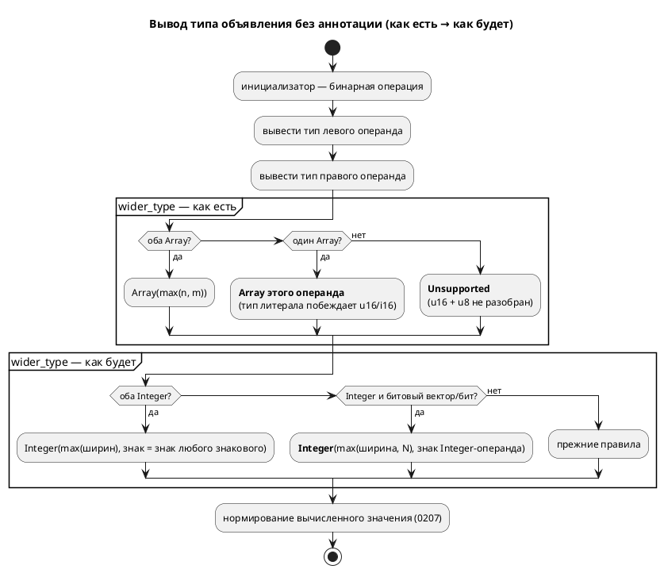

# Фича: wider_type(Integer, Array) берёт тип литерала и даёт ложную SE-089

- **Номер:** 0287
- **Статус:** ГОТОВО
- **Зависит от:** нет (проставлено на стадии 3)
- **Tier:** 2 — **подтверждён замером-19, но по другому основанию**: невалидный вывод целей `rust`/`st`/`sv` при нулевом коде возврата и молча неверное значение при согласии всех девяти потребителей. Ложную `SE-089`, названную в заголовке, к этому моменту уже сняла [ширина выведенного типа берётся у результата](0285-inferred-width-from-result.md) — корень она не устраняла (расстановка по признаку вреда 2026-08-18, см. `FEATURES.md`)
- **Класс:** семантика
- **Связанные issue (анализ):** кандидат блока 2 `FEATURES.md`, переведён в фичу пакетно 2026-08-18

## Стадии жизненного цикла (правило 17)

Все стадии — **разделы этой карточки** (правило 32): «Архитектура (ADR)»,
«Анализ», «Разработка», «Тест-план», «Отчёт о тестировании», «Итог».
Отдельным артефактом остаются только исправления —
[`docs/fixes/`](../fixes/README.md) (при необходимости `0287-YY-*`).

## Краткое описание

**`wider_type(Integer, Array)` берёт тип литерала — и даёт ложную `SE-089`.**
Замер при закрытии [вывод типов не протягивает тип через ссылку константа-константа](0204-const-ref-type-inference.md)
(2026-08-16): `const A: u16 := 300; const B := A + 1;` отвергается сообщением
«литерал 301 не помещается в тип `[bit;8]` переменной `B`». Тип `[bit;8]`
переменная `B` получила от **литерала** — правило расширения
`(_, Array(n, t)) => Array(n, t)` в `semantic/type_inference.rs` побеждает
явно объявленный `u16` источника. Диагностика при этом **о следствии**:
автор ищет ошибку в числе 301, а она в правиле вывода. Механизм иной, чем
у 0204 (там — ссылка, здесь — расширение), и лечение требует решения о
знаковости и ширине результата: `u16 + [bit;8]` должно давать `u16`, но
правило пишется для всех пар сразу.

> Фича заведена **из бэклога кандидатов пакетным переводом** (решение заказчика
> 2026-08-18: «перевести всех кандидатов в фичи без проработки, решить, делать
> или нет, позже»). Стадии 2 и 3 **не пройдены**: приоритет, зависимости и
> объём не оценивались. Далее — жизненный цикл по правилу 17.

## Что известно на входе

Всё, что проверено, — в разделе выше: это **дословный текст кандидата** со
своим замером и ссылками на фичу, при закрытии которой он был вынесен. Ничего
сверх этого не проверялось.

Замер снят на дату, указанную в тексте. Прежде чем брать фичу в работу,
**перепроверь** его: условие карточки перепроверяется, а не наследуется — урок
[остаточные старые имена языка в данных и комментариях](0161-fixture-comments-rename.md), где обоснование отказа держало
работу отложенной два месяца и оказалось неверным уже в момент отказа.

## Направление решения (наметка, не решение)

Наметка — в тексте кандидата выше (там, где он её содержит). Решение о том,
**делать ли фичу вообще**, отложено заказчиком и принимается до стадии 2.

## Документирование (правило 24)

**Определяется на стадии анализа.** Фича затрагивает язык или наблюдаемое
поведение целей, поэтому нужный раздел `book/` называется после проработки —
до неё утверждение о документе было бы догадкой.

## Архитектура (ADR)

- **Status:** Accepted
- **Date:** 2026-08-19
- **Authors:** Архитектор + аналитик + разработчик
- **Related issues:** [Фича](0287-wider-type-array-literal.md); смежные — [вывод типов не протягивает тип через ссылку константа-константа](0204-const-ref-type-inference.md) (вывод через ссылку, там кандидат и вынесен), [ширина выведенного типа берётся у результата](0285-inferred-width-from-result.md) (ширина по результату), [отрицание ~0 для беззнакового типа: два правила языка столкнулись](0207-bitwise-not-unsigned-literal.md) (нормирование вычисленного), [константное выражение в инициализаторе объявления](0192-const-init-fold.md) (свёртка инициализатора)

### Context

Тип объявления без аннотации выводится из инициализатора, и у бинарной операции
он берётся у «более широкого» операнда — функция `wider_type`
(`semantic/type_inference.rs`). Её таблица знает `Bit`, `Bool`, `Rational`,
`Duration`, `Fixed`, `Enum` и `Array(n, T)`, но **не знает `Integer { bits,
signed }`** — представления именованных целых (`u8`…`i64`,
`type_node::builtin_type_by_name`). Целочисленный литерал при этом получает
`Array(n, Bit)` (`infer_int_type`), поэтому пара «именованное целое + литерал»
попадает в ветвь `(_, Array(n, t)) => Array(n, t)`: **тип литерала побеждает
объявленный тип источника**, а пара «именованное целое + именованное целое»
проваливается в `_ => Unsupported`.

**Замер-19** (`scripts/probe.sh`, все пробы признаны годными; рядом с
каждой стоит контрольный вход — та же запись с **явной** аннотацией типа):

| Проба | Эталон | `c` | `rust` | `st` | `sv` | Выведенный тип |
|---|---|---|---|---|---|---|
| `const A: u16 := 300; const B := A - 100;` затем `seen := B + 100;` | 300 | 300 | **E0308** от `rustc` | **отказ `iec2c`** | **отказ `verilator`** | `[bit;8]` вместо `u16` |
| `const A: u16 := 300; const C: u8 := 5; const D := A + C;` | 305 | 305 | **`RS-014`** | **`ST-002`** | **`SV-002`** | `Unsupported` (`?`) |
| `const A: i16 := -300; const D := A + 1;` | **213** | 213 | 213 | 213 | 213 | `[bit;8]` вместо `i16` |
| контроль: те же три записи с `const B: u16 := …` / `const D: i16 := …` | верно | верно | верно | верно | верно | тип автора |

Три разных исхода одной причины:

1. **Невалидный вывод при рапорте об успехе.** `taktc` возвращает ноль, а
   порождённый файл отвергают **чужие** инструменты: `rustc` — `E0308`
   (`u8` в поле `u16`), `iec2c` — «Incompatible data types for `:=`»,
   `verilator` — `WIDTHEXPAND`. Цель `c` при этом права: `#define` не несёт
   типа, и арифметика идёт в `int`.
2. **Честный отказ там, где всё вычислимо.** `u16 + u8` даёт `Unsupported`, и
   четыре цели отвечают «тип не представим» на записи, которую эталон считает
   без затруднений.
3. **Молча неверное значение при согласии всех девяти.** `i16 + 1` теряет
   **знак**: тип берётся у беззнакового литерала, и нормирование (0207)
   заворачивает `−299` в `213 = −299 mod 2⁸`. Ни одна диагностика не выдаётся.

**Формулировка кандидата устарела наполовину.** Он говорил о **ложной
`SE-089`** на `const A: u16 := 300; const B := A + 1;`; этот вход после
[ширина выведенного типа берётся у результата](0285-inferred-width-from-result.md) отвечает верно (`301`,
тип расширен по результату). Но 0285 расширяет тип **только при превышении
верхней границы** — то есть лечит следствие в одной точке, а корень (тип берётся
у литерала) остался и виден на первой и третьей пробах, где результат в восемь
бит **влезает**.

**Замер снят заново, а не унаследован** (правило 30): исходный замер
кандидата датирован 2026-08-16 и к моменту взятия в работу перестал
воспроизводиться.



### Decision Drivers

1. **Тип объявления сильнее типа литерала.** `u16` в источнике написан автором;
   ширина литерала выбрана компилятором. Побеждать обязано написанное.
2. **Молчаливая потеря знака — худший из трёх исходов.** Отказ виден, невалидный
   вывод ловит чужой инструмент, а `−299 → 213` не заметит никто.
3. **Правка обязана быть узкой.** Соседние правила `wider_type` (перечисления,
   `Rational`, `Fixed`, `Duration`) верны и держатся своими контролем
   (`SE-059`, `SE-065`, `SE-103`) — их трогать нельзя.
4. **Представление литерала менять дорого.** `[bit;N]` — упакованный вектор
   (0078) с собственным слоем `semantic::bit_vector` и печатью у пяти целей.

### Considered Options

#### Option A. Оставить как есть

**Pros:** ноль правок.

**Cons:** три исхода выше остаются; один из них — молча неверное значение.
Кандидат при этом закрыть нельзя: 0285 сняла лишь его буквальную формулировку.

#### Option B. Целочисленный литерал получает `Integer`, а не `Array(n, Bit)`

**Pros:** причина исчезает целиком — представление у именованного целого и у
литерала становится одним.

**Cons:** `infer_int_type` — носитель, к которому обращаются вывод типов,
свёртка (0192) и переопределение ширины (0285); смена его результата меняет тип
**каждого** выведенного объявления в корпусе, а с ним печать пяти целей и
снимки `examples/generated/`. Объём несоразмерен и ломает 0078.

#### Option C. `wider_type` учит пары с `Integer`

**Pros:**
- лечит все три исхода одной таблицей;
- ничего не добавляется в язык: меняется выбор типа там, где его никто не
  выбирал явно;
- представление литерала и слой `bit_vector` не затронуты.

**Cons:** требует решения о знаке и ширине результата для смешанных пар, то
есть правило пишется сразу для всех сочетаний.

#### Option D. Диагностика вместо вывода

**Pros:** громко.

**Cons:** отвергает записи с очевидным смыслом (`u16 + u8`), которые эталон уже
считает верно. Отказ на месте вычислимого — шаг назад от 0204 и 0285.

### Decision

Принимается **Option C**. Таблица `wider_type` дополняется тремя правилами:

| Пара | Результат |
|---|---|
| `Integer{ba, sa}` + `Integer{bb, sb}` | `Integer{max(ba, bb), sa ∨ sb}` |
| `Integer{b, s}` + `Array(n, Bit)` (и симметрично) | `Integer{max(b, n), s}` |
| `Integer{b, s}` + `Bit` / `Bool` (и симметрично) | `Integer{b, s}` |

1. **Знак берётся у знакового операнда.** Беззнаковый вектор литерала знака не
   несёт, поэтому `i16 + 1` остаётся `i16`; из двух именованных знаковым
   результат становится, если знаков хотя бы один.
2. **Ширина — наибольшая из двух.** Случай, когда результат в неё не влезает
   (`i8 + u8` со значением 200), лечит **уже существующее** правило:
   превышение верхней границы расширяет тип по результату. Второго знания о
   границах здесь не заводится.
3. **`Array(n, T)` с `T ≠ Bit` не затрагивается**: массив данных с числом
   смешивать нечем, прежняя ветвь остаётся.
4. **Пара `Integer` + `Bit`/`Bool` добавлена по замеру:** `var g := F + flag;`
   (`F: u8`, `flag: bit`) сегодня даёт `SIM-007` у эталона и `RS-014` у цели —
   честный отказ на вычислимом. Правило симметрично уже имеющемуся
   `(Bool, Bit) → Bit`.

### Consequences

#### Положительные

- Объявленный тип источника доезжает до выведенного типа: знак и ширина не
  теряются.
- Четыре цели перестают отказывать на `u16 + u8`; три — порождать невалидный
  вывод.
- Правило симметрично: порядок операндов на результат не влияет.

#### Отрицательные / Action items

- **Наблюдаемое поведение меняется**: `const A: i16 := -300; const D := A + 1;`
  было `213`, стало `−299`. Прежнее значение было дефектом, а не контрактом.
- Тип выведенного объявления в корпусе может смениться с `[bit;N]` на `uN`/`iN`
  — печать целей обязана остаться прежней там, где ширина совпадает; проверяется
  снимками `examples/generated/` и проверками целей.
- Таблица `wider_type` остаётся **данными**, а не исчерпывающим разбором:
  новый вид типа по-прежнему провалится в `_ => Unsupported` молча. Граница
  названа в коде.

#### Acceptance criteria

1. `const A: u16 := 300; const B := A - 100;` даёт `B: u16`; порождённые Rust,
   ST и SV принимаются `rustc`, `iec2c` и `verilator` (A1).
2. `const A: u16 := 300; const C: u8 := 5; const D := A + C;` переводится всеми
   восемью целями, значение `305` (A2).
3. `const A: i16 := -300; const D := A + 1;` даёт `−299` у эталона и у всех
   целей (A3).
4. `var g := F + flag;` (`u8` + `bit`) исполняется эталоном и переводится целью
   `rust` (A4).
5. Контроль: записи с **явной** аннотацией типа не изменились (A5).
6. Снимки `examples/generated/` и `./scripts/precheck.sh` зелены (A6).

## Анализ

### Цель и контекст

Таблица расширения типов `wider_type` (`semantic/type_inference.rs`) не знает
`TypeNode::Integer` — представления именованных целых (`u8`…`i64`). Поэтому
выведенный тип объявления берётся у **литерала**, а не у объявленного типа
источника, а пара из двух именованных целых даёт `Unsupported`. Фича учит
таблицу трём парам с `Integer`, не трогая остальные правила и не меняя
представление литерала.

### Замер (снят заново, правило 30)

Пробы сняты `scripts/probe.sh` **2026-08-19** и признаны годными (объявления
используются, имя файла не сталкивается с именами типов, общих отказов `SE-`/
`SY-`/`LE-` нет). Рядом с каждой пробой стоит **контрольный вход** — та же
запись с явной аннотацией типа. Отказы целевых инструментов проверены прогоном
`rustc --edition 2021`, `iec2c` и `verilator --lint-only -Wall`.

| # | Проба | Эталон | `c` | `rust` | `st` | `sv` | Тип |
|---|---|---|---|---|---|---|---|
| П1 | `const A: u16 := 300; const B := A - 100;` + `seen := B + 100;` | 300 | 300 | **`E0308`** | **отказ `iec2c`** | **`WIDTHEXPAND`** | `[bit;8]` |
| П2 | `const A: u16 := 300; const C: u8 := 5; const D := A + C;` | 305 | 305 | **`RS-014`** | **`ST-002`** | **`SV-002`** | `Unsupported` |
| П3 | `const A: i16 := -300; const D := A + 1;` | **213** | 213 | 213 | 213 | 213 | `[bit;8]` |
| П4 | `var g := F + flag;` (`F: u8`, `flag: bit`) | **`SIM-007`** | — | **`RS-014`** | — | — | `Unsupported` |
| К | те же записи с явным типом (`const B: u16 := …`) | верно | верно | верно | верно | верно | тип автора |

Контроль работает: с явной аннотацией `rustc` и `iec2c` принимают вывод, а П3
даёт `−299`. То есть отвергается не «форма вообще», а именно выведенный тип.

**Формулировка кандидата устарела наполовину.** Заявленный им вход
(`const A: u16 := 300; const B := A + 1;` → ложная `SE-089`) сегодня отвечает
верно: [ширина выведенного типа берётся у результата](0285-inferred-width-from-result.md) расширяет тип по
результату. Но она расширяет **только при превышении верхней границы**, поэтому
корень остался и виден на П1 и П3, где результат в восемь бит влезает. Замер
кандидата (2026-08-16) не воспроизводится и заменён.

**`Tier 2` подтверждён, но по другому основанию, чем заявлено:** не ложная
диагностика, а невалидный вывод трёх целей (П1) и молча неверное значение при
согласии всех девяти (П3, потеря знака `−299 → 213`).

### Зависимости фичи (правило 17/19)

- **Зависит от:** нет. Предшественники (0204, 0207, 0285, 0192) закрыты.
- **Влияние на порядок разработки:** не разблокирует ничего. Соседний класс —
  [[bit; N > 64] не переводят цели c и rust](0262-wide-bit-vector-c-rust.md) (`[bit; N > 64]` у целей
  `c`/`rust`) — не пересекается: там ширина за пределом скаляра, здесь выбор
  типа в пределах 64 бит.

### Требования и проверяемые условия

- **R1. Объявленный тип источника побеждает тип литерала.** `u16 − литерал`
  даёт `u16`, `i16 + литерал` — `i16` (знак не теряется).
- **R2. Два именованных целых дают именованное целое:** ширина — наибольшая,
  знак — знаковый, если знаков хотя бы один.
- **R3. Именованное целое с `bit`/`bool` даёт именованное целое** (симметрично
  имеющемуся `(Bool, Bit) → Bit`).
- **R4. Явный тип объявления не трогается** — правило в силе.
- **R5. Соседние правила таблицы не трогаются:** перечисления, `Rational`,
  `Duration`, `Fixed`, `Array(n, T ≠ Bit)`; их контроля (`SE-059`, `SE-065`,
  `SE-103`) обязаны остаться зелёными без правок.
- **R6. Правило симметрично:** порядок операндов на результат не влияет.
- **R7. Границы ширины не дублируются:** случай «результат не влезает в
  наибольшую из ширин» лечит существующее правило, второго знания о
  границах типа фича не заводит.

### Критерии приёмки и способ проверки

| # | Критерий | Способ проверки |
|---|---|---|
| A1 | R1 (П1) | `takt-lang/tests/semantic/wider_integer_tests.rs` T1, T2 |
| A2 | R2 (П2) | там же T3; прогон восьми целей |
| A3 | R1 (П3, знак) | потактовая сверка `takt-sim/tests/conformance/conformance_wider_integer_tests.rs` |
| A4 | R3 (П4) | `takt-lang/tests/semantic/wider_integer_tests.rs` T4 |
| A5 | R4, R5 (контроль) | там же T5, T6; зелень существующих тестов `type_inference` |
| A6 | R6 | юнит-тесты `wider_type` в `type_inference/tests.rs` |
| A7 | R7 и корпус | снимки `examples/generated/`, `./scripts/precheck.sh` |

### Особенности по обратной функциональности

**Наблюдаемое поведение меняется сознательно** (правило 11):

- `const A: i16 := -300; const D := A + 1;` было `213`, стало `−299`;
- `u16 + u8` было отказом четырёх целей, стало переводом;
- тип выведенного объявления в отдельных местах меняется с `[bit;N]` на
  `uN`/`iN`.

Прежние значения были дефектом, а не контрактом: они следовали из отсутствия
правила, а не из решения о языке. Ширина при совпадении представлений та же,
поэтому печать целей на корпусе меняться не должна — проверяется снимками
`examples/generated/`.

### Версия языка (правило 22)

**Язык меняется** — выведенный тип и, как следствие, наблюдаемое значение.
Версия языка **не поднимается**: цикл `0.10.0` открыт фичей и продолжается
(накопление). Версия крейта `takt-lang` поднимается на минор.

### Редакторский слой (правило 29)

**Проверка не требуется, и это ответ.** Новых токенов, ключевых слов, форм
объявления, узлов АСД и диагностик фича не вводит: меняется таблица выбора типа
внутри уже существующего вывода. Подсветка, автодополнение, структура документа
и переход к объявлению не затрагиваются. Диагностики `RS-014`/`ST-002`/`SV-002`
остаются на месте — фича лишь перестаёт их провоцировать на вычислимых записях.

### Документирование (правило 24)

Затрагивается раздел `book/src/03-types/` («Вывод типов»): добавляется абзац о
том, что тип берётся у **объявления-источника**, а не у литерала — со знаком и
шириной, — с примером и контрпримером. Блок «Частые ошибки» раздела правки не
требует: новых кодов диагностик нет.

### Риски и зависимости

- **Риск: правка шире предмета.** Снижается тем, что новые ветви ставятся
  **после** правил перечислений/`Rational` (их приоритет сохраняется) и **до**
  ветвей `Array`, а `Array(n, T ≠ Bit)` из объёма исключён явно.
- **Риск: смена типа поедет в снимки корпуса.** Проверяется проверкой
  детерминированности и снимками `examples/generated/`; при расхождении смотреть
  не «обновить снимок», а **почему** сменилась ширина.
- **Риск: смешение знаков даёт узкий тип** (`i8 + u8` при значении 200). Принято
  сознательно: случай лечит правило (расширение по результату), и второго
  знания о границах здесь не заводится (R7).
- **Граница:** `wider_type` остаётся **данными**, а не исчерпывающим
  разбором; новый вид типа по-прежнему провалится в `_ => Unsupported` молча.

## Разработка

### Задача

#### Что было

Таблица `wider_type` (`takt-lang/src/semantic/type_inference.rs`) не содержала
ни одной ветви с `TypeNode::Integer` — представлением именованных целых
`u8`…`i64`. Целочисленный литерал получает `Array(n, Bit)` (`infer_int_type`),
поэтому:

- пара «именованное целое + литерал» уходила в ветвь `(_, Array(n, t))`, и **тип
  литерала побеждал объявленный тип источника** — терялись и ширина, и знак;
- пара «именованное целое + именованное целое» проваливалась в
  `_ => TypeNode::Unsupported`;
- пара «именованное целое + `bit`/`bool`» — туда же.

Замер-19 (таблица — в [анализе](0287-wider-type-array-literal.md#анализ)):
`rustc`, `iec2c` и `verilator` отвергали порождённый вывод при нулевом коде
возврата `taktc`; `i16 + 1` давало `213` вместо `−299` **одинаково** у всех
девяти потребителей.

#### Что сделано

**Три ветви в `wider_type`**, поставленные **после** правил перечислений и
`Rational` (их приоритет сохранён) и **до** ветвей `Array` (иначе тип литерала
перехватывает результат):

| Пара | Результат |
|---|---|
| `Integer{ba, sa}` + `Integer{bb, sb}` | `Integer{max(ba, bb), sa ∨ sb}` |
| `Integer{b, s}` + `Array(n, Bit)`, `n ≤ b` (и симметрично) | `Integer{b, s}` |
| `Integer{b, s}` + `Bit` / `Bool` (и симметрично) | `Integer{b, s}` |

Границы, названные в коде комментариями:

- **вектор шире целого** (`n > b`) отдан прежним ветвям `Array`: правило
  **уточняет** тип источника литералом, а не подменяет его. `Integer::bits`
  шире 64 не бывает по построению, поэтому пара всегда разрешима;
- **массив не битов** (`Array(n, T ≠ Bit)`) не затронут — смешивать число с
  массивом данных нечем;
- **случай «результат не влезает в наибольшую ширину»** (`i8 + u8` со значением
  200) лечит существующее правило [ширина выведенного типа берётся у результата](0285-inferred-width-from-result.md)
  — расширение по результату. Второго знания о границах типа не заведено
  (требование R7 анализа).

Обновлены **обе** таблицы в док-комментариях модуля (шапка и заголовок
функции): расхождение таблицы с кодом здесь — обещание, которого нет.

**Функциональность (правило 11):** язык — да (выведенный тип и наблюдаемое
значение, см. анализ); LSP и плагины — н/п (правило 29: новых токенов, форм
объявления, узлов АСД и диагностик нет); документ `book/` — да, раздел
«Вывод типов» (правило 24).

#### Проверки

```sh
cargo test --lib -p takt-lang wider_type       # 7 юнит-тестов таблицы
cargo test --test semantic wider_integer       # 9 тестов вывода и целей
cargo test --test conformance wider_integer    # потактовая сверка эталон ≡ C
cargo test --all-features                      # 3228 тестов, ноль провалов
./scripts/precheck.sh                          # полный гейт
```

**Мутационная проверка** (каждая правка кода — обратно, прогон, возврат):

| Мутация | Кто поймал |
|---|---|
| снять условие `n ≤ b` у пары `Integer` + вектор | `wider_literal_keeps_vector_type` (T7) |
| вернуть паре `Integer` + `Integer` результат `Unsupported` | T3, T8 |
| отключить ветвь `Integer` + вектор целиком | потактовая сверка: `[213, 213, 213]` против `[−299, −299, −299]` |

**Первая редакция T7 мутацию не ловила**: вход `A + 300` (при `A: u8`) даёт
результат, не влезающий в восемь бит, и правило расширяло тип независимо
от границы — обе редакции кода давали `[bit;16]`. Тест переписан на
`400 - 300 + A`, где значение `103` влезает в оба типа и различие наблюдаемо.

## Тест-план

### Область и цель

Проверяется **выведенный тип** объявления и его следствия у потребителей:
значение у эталона, валидность вывода у целей. Факт разбора и факт успешной
генерации свидетелями **не считаются** — прежний, дефектный вывод «удавался»
тоже, а отвергали его чужие инструменты (`rustc`, `iec2c`, `verilator`).

Требования и критерии — R1…R7 и A1…A7 [анализа](0287-wider-type-array-literal.md#анализ).

### Проверки (условие → ожидаемый результат)

| # | Проверка | Предусловие | Ожидаемый результат | Ссылка на R/A |
|---|---|---|---|---|
| T1 | Тип источника побеждает тип литерала | `const A: u16 := 300; const B := A - 100;` | тип `B` — `u16` (было `[bit;8]`) | R1 / A1 |
| T2 | Знак не теряется | `const A: i16 := -300; const D := A + 1;` | тип `D` — `i16` | R1 / A1 |
| T3 | Пара именованных целых | `A: u16`, `C: u8`, `D := A + C` | тип `D` — `u16` (было `Unsupported`) | R2 / A2 |
| T4 | Бит уточняет, но не подменяет | `F: u8`, `flag: bit`, `g := F + flag` | тип `g` — `u8` | R3 / A4 |
| T5 | **Контроль:** явная аннотация | `const B: u16 := A - 100;`; `const K := 5;` | `u16`; литерал остаётся `[bit;8]` | R4 / A5 |
| T6 | **Граница:** соседние правила сильнее | `const R := A + 1.5;` при `A: u8` | тип `R` — `float` | R5 / A5 |
| T7 | **Граница:** вектор шире целого | `const W := 400 - 300 + A;` при `A: u8` | тип `W` — `[bit;16]` | R1 / A1 |
| T8 | Перевод всеми целями | пара именованных целых | ноль отказов у `c`, `rust`, `st`, `sv` | R2 / A2 |
| T9 | Тип доезжает до порождённого Rust | `const B := A - 100;` при `A: u16` | текст `const WIDEN_B: u16 = 200;` | R1 / A1 |
| T10 | **Потактовая сверка знака** | `const A: i16 := -300; const D := A + 1;` | трасса `−299` у эталона **и** у порождённого C (было `213`) | R1 / A3 |
| T11 | Симметрия таблицы и её границы | прямые вызовы `wider_type` | порядок операндов не влияет; `Rational`/`Enum`/массив данных не задеты | R5, R6 / A6 |
| T12 | Корпус и проверки | — | `examples/generated/` не изменились, `precheck.sh` зелён | R7 / A7 |

### Разбивка проверок по функциональности

| Функциональность | Статус | Чем проверено |
|---|---|---|
| Язык (вывод типа, значение) | ✅ | T1–T7, T10 |
| Цели генерации (`c`, `rust`, `st`, `sv`) | ✅ | T8, T9, T10 |
| Эталон (`takt-sim`) | ✅ | T10 |
| LSP и плагины редакторов | — | правило 29: новых токенов, форм объявления, узлов АСД и диагностик нет (обосновано в анализе) |
| Документ `book/` | ✅ | сборка `make -C book build` в составе `precheck.sh` |
| Форматтер | — | узлов АСД не добавлено |

<!-- Легенда: ✅ пройдено · ❌ провалено · ⬜ не проверялось · — не применимо -->

### Тестовые данные и окружение

- `takt-lang/src/semantic/type_inference/tests.rs` — T11 (7 юнит-тестов таблицы);
- `takt-lang/tests/semantic/wider_integer_tests.rs` — T1…T9;
- `takt-sim/tests/conformance/conformance_wider_integer_tests.rs` — T10;
- пробы замера — `scripts/probe.sh`, внешние инструменты `rustc 1.97.1`,
  `iec2c` (MatIEC), `verilator 5.050`, `cc` (Apple clang), macOS 15.5 (arm64).

Сверка T10 деградирует мягко: без `cc` половина с прошивкой пропускается с
сообщением, трасса эталона проверяется всегда.

## Отчёт о тестировании

### Резюме

**Пройдено; фича готова к закрытию (`ГОТОВО`).** Все двенадцать проверок
тест-плана зелены, исправлений (`docs/fixes/`) не потребовалось. Полный прогон:
3229 тестов, ноль провалов; `./scripts/precheck.sh` зелён.

Дефект подтверждён замером и устранён: выведенный тип берёт ширину и знак у
**объявленного** операнда, пара именованных целых больше не даёт `Unsupported`,
знак не теряется. Корпус `examples/generated/` не изменился — то есть правка
задела ровно те записи, где типы прежде расходились.

### Фактические результаты по проверкам

| # | Проверка | Результат | Комментарий |
|---|---|---|---|
| T1 | Тип источника побеждает тип литерала | ✅ | `B` — `u16` (было `[bit;8]`) |
| T2 | Знак не теряется | ✅ | `D` — `i16` |
| T3 | Пара именованных целых | ✅ | `u16` вместо `Unsupported` |
| T4 | Бит уточняет, но не подменяет | ✅ | `g` — `u8` |
| T5 | Контроль: явная аннотация | ✅ | не изменилась; литерал остаётся `[bit;8]` |
| T6 | Граница: соседние правила сильнее | ✅ | `float` побеждает целое |
| T7 | Граница: вектор шире целого | ✅ | `[bit;16]`; **тест переписан**, см. ниже |
| T8 | Перевод всеми целями | ✅ | ноль отказов у `c`, `rust`, `st`, `sv` |
| T9 | Тип доезжает до порождённого Rust | ✅ | `const WIDEN_B: u16 = 200;` |
| T10 | Потактовая сверка знака | ✅ | `[−299, −299, −299]` у эталона и у C |
| T11 | Симметрия и границы таблицы | ✅ | 7 юнит-тестов `wider_type` |
| T12 | Корпус и проверки | ✅ | снимки не изменились, `precheck.sh` зелён |

### Замер (правило 30)

Пробы сняты `scripts/probe.sh` 2026-08-19 и признаны годными; отказы целевых
инструментов проверены их прогоном (`rustc`, `iec2c`, `verilator`, `cc`).

| Проба | До | После |
|---|---|---|
| `A: u16 := 300; B := A - 100;` + `seen := B + 100;` | `rust` — `E0308`, `st` — отказ `iec2c`, `sv` — `WIDTHEXPAND` | все цели принимаются своими инструментами |
| `A: u16 := 300; C: u8 := 5; D := A + C;` | `RS-014`, `ST-002`, `SV-002` | переводится всеми восемью |
| `A: i16 := -300; D := A + 1;` | `213` у всех девяти | `−299` у всех девяти |
| `F: u8; flag: bit; g := F + flag;` (верхний уровень) | `RS-014` (тип `?`) | `g: u8`, переводится |
| Контроль: те же записи с явным типом | верно | **не изменились** |

### Мутационная проверка

| Мутация | Ожидание | Факт |
|---|---|---|
| снять условие `n ≤ b` | падает граница | ✅ T7: `u8` против `[bit;16]` |
| вернуть паре `Integer` результат `Unsupported` | падают T3, T8 | ✅ оба |
| отключить ветвь `Integer` + вектор | падает сверка | ✅ `[213, 213, 213]` против `[−299, …]` |

**Первая редакция T7 мутацию не ловила.** Вход `A + 300` (при `A: u8`) даёт
результат, не влезающий в восемь бит, и правило расширяло тип независимо от
проверяемой границы — обе редакции кода отвечали `[bit;16]`. Тест переписан на
`400 - 300 + A`: значение `103` влезает в оба типа, и различие наблюдаемо. Это
тот же класс, что записан в живом контексте про декоративных контрольных тестов.

### Результаты по функциональности

| Функциональность | Статус | Основание |
|---|---|---|
| Язык (вывод типа, значение) | ✅ | T1–T7, T10 |
| Цели генерации | ✅ | T8, T9, T10 |
| Эталон `takt-sim` | ✅ | T10 |
| LSP и плагины (правило 29) | — | новых токенов, форм объявления, узлов АСД и диагностик нет; проверка не требуется, ответ зафиксирован в анализе |
| Документ `book/` (правило 24) | ✅ | раздел «Вывод типов» дополнен; сборка и проверка глифов зелены |
| Форматтер, `semantic::usages`, стиль | — | узлов АСД не добавлено |

### Выводы и дальнейшие шаги

- Исправления не нужны; фича закрывается.
- **Кандидат заведён** (правило 7): локальное объявление **в теле блока** типа
  не получает вовсе (`SIM-007` у эталона, `RS-014` у цели) — соседний класс с
  иной причиной: вывод типов до объявлений тела не доходит. Контрольный вход
  снят: дефект виден и на чистом литерале.
- **Кандидатов, называющих 0287, не осталось** (правило 28): запись блока 2 была
  переведена в эту карточку пакетно 2026-08-18; смежная запись фичи снята
  вместе с её закрытием.

## Итог (что сделано)

**Таблица расширения типов `wider_type` научена именованным целым** (`u8`…`i64`,
`TypeNode::Integer`), которых не знала ни в одной паре. Три ветви:
`Integer + Integer` → наибольшая ширина и знаковый тип, если знаков хотя бы
один; `Integer + [bit;n]` при `n ≤ ширины` → тип источника; `Integer + bit/bool`
→ тип источника. Правки — в `takt-lang/src/semantic/type_inference.rs`
(с обеими таблицами док-комментариев); прочие правила таблицы не тронуты.

**Замер снят заново** (правило 30) и показал, что формулировка кандидата
устарела наполовину: ложную `SE-089` уже снял
[ширина выведенного типа берётся у результата](0285-inferred-width-from-result.md), но корень остался и давал **три**
исхода — невалидный вывод целей `rust`/`st`/`sv` при нулевом коде возврата
`taktc`, честный отказ четырёх целей на `u16 + u8` и **молча неверное
значение** (`i16 + 1` = `213` вместо `−299`) при согласии всех девяти
потребителей.

**Контроля:** 7 юнит-тестов таблицы (`type_inference/tests.rs`), 9 тестов вывода
и целей (`takt-lang/tests/semantic/wider_integer_tests.rs`), потактовая сверка
эталон ≡ C на знаковом случае
(`takt-sim/tests/conformance/conformance_wider_integer_tests.rs`). Все три
мутации правки пойманы; первая редакция теста границы мутацию **не** ловила
и переписана — разбор в [задаче](0287-wider-type-array-literal.md#разработка).

**Документ:** раздел «Вывод типов» (`book/src/03-types/`) дополнен правилом и
примером. **Версия языка не поднята** (цикл `0.10.0`, накопление по правилу 22);
крейт `takt-lang`: `0.44.0` → `0.45.0`.

**Кандидат заведён** (правило 7): локальное объявление **в теле блока** типа не
получает вовсе — соседний класс, у которого причина иная (вывод типов до тела не
доходит).

Детали — [отчёт о тестировании](0287-wider-type-array-literal.md#отчёт-о-тестировании),
решение — [ADR](0287-wider-type-array-literal.md#архитектура-adr).
