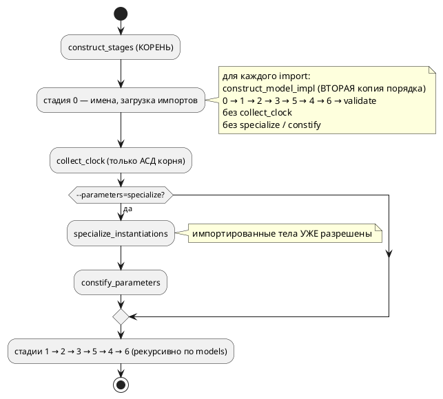
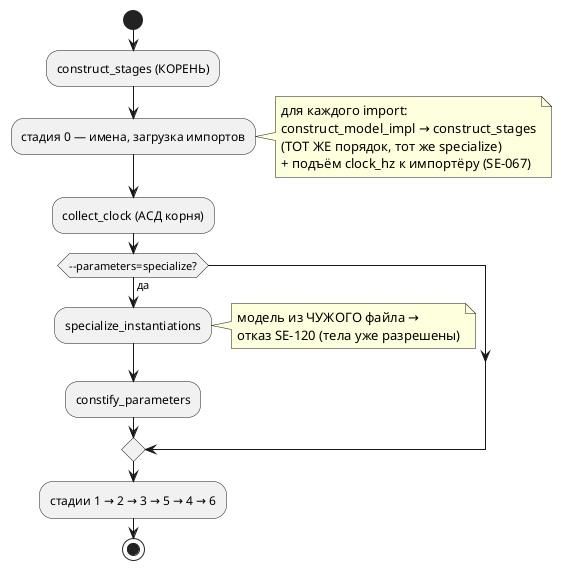

# Фича: Порядок стадий построения описан в двух местах

- **Номер:** 0296
- **Статус:** ГОТОВО
- **Зависит от:** нет (проверено на стадии анализа)
- **Tier:** 2 — копии **уже** разошлись: невалидный C при нулевом коде возврата (замер-19; запись несла `Tier 3`, исправлено при взятии в работу)
- **Класс:** семантика
- **Связанные issue (анализ):** кандидат блока 2 `FEATURES.md`, переведён в фичу пакетно 2026-08-18

## Стадии жизненного цикла

Все стадии — **разделы этой карточки**: «Архитектура (ADR)»,
«Анализ», «Разработка», «Тест-план», «Отчёт о тестировании», «Итог».
Отдельным артефактом остаются только исправления —
[`docs/fixes/`](../fixes/README.md) (при необходимости `0296-YY-*`).

## Краткое описание

**Порядок стадий построения описан в двух местах.** Замер там же:
`semantic/stages.rs` заявляет «порядок стадий описан здесь **один раз**», но
`semantic/tree.rs::construct_model_impl` (путь **импорта**) несёт вторую копию
последовательности `0→1→2→3→5→4→6` вместе со своим `validate_model`. Расхождение
копий даст импортированным файлам иной порядок разбора, чем корневому.

> Фича заведена **из бэклога кандидатов пакетным переводом** (решение заказчика
> 2026-08-18: «перевести всех кандидатов в фичи без проработки, решить, делать
> или нет, позже»). Стадии 2 и 3 **не пройдены**: приоритет, зависимости и
> объём не оценивались. Далее — жизненный цикл по своду.

## Что известно на входе

Всё, что проверено, — в разделе выше: это **дословный текст кандидата** со
своим замером и ссылками на фичу, при закрытии которой он был вынесен. Ничего
сверх этого не проверялось.

Замер снят на дату, указанную в тексте. Прежде чем брать фичу в работу,
**перепроверь** его: условие карточки перепроверяется, а не наследуется — урок
[остаточные старые имена языка в данных и комментариях](0161-fixture-comments-rename.md), где обоснование отказа держало
работу отложенной два месяца и оказалось неверным уже в момент отказа.

## Направление решения

Принято решение ADR: путь импорта выражается через **тот же** носитель порядка
(`construct_stages_within`), частота подключённого файла поднимается к
импортёру, а случай, который порядком проходов не лечится (специализация модели
из другого файла), получает громкий отказ `SE-120`. Перенос поздних стадий к
корню (Option C ADR) в объём не входит и вынесен кандидатом.

## Документирование

Затронуты: раздел «Импорт и композиция» документа (подраздел «Правила языка не
знают границы файлов») и приложение «Ошибки и предупреждения» (`SE-120`).
Версия языка **не** поднимается: текущая `0.10.0` помечена тегом и не выпущена,
изменения вносятся в неё (накопление).

## Архитектура (ADR)

- **Status:** Accepted
- **Date:** 2026-08-19
- **Authors:** Архитектор + аналитик + разработчик
- **Related issues:** [Фича](0296-semantic-stages-single-source.md); порядок стадий и накопление диагностик — [ADR](0130-diagnostics-batch.md#архитектура-adr), [восстановление на границе элемента в стадиях построения](0152-semantic-recovery-element-boundary.md#архитектура-adr); специализация параметров — [ADR](0185-model-parameters.md#архитектура-adr); усыновление импорта — [фича](0184-imported-shared-variables.md); класс «два списка одного набора» — [ключ карты адресов — голое имя порта](0084-address-map-qualified-key.md), [цели `rust` и `sv` — одноимённые константы разных моделей](0193-shared-const-qualified.md), [коллизии имён при отображении в пространство имён цели](0195-target-name-collisions.md)

### Context

Порядок стадий построения семантического дерева объявлен единым знанием:
`semantic/stages/mod.rs::construct_stages` прямо пишет в шапке — «Порядок стадий
описан здесь **один раз**». Это утверждение неверно. Вторую копию
последовательности `0 → 1 → 2 → 3 → 5 → 4 → 6` вместе со своим `validate_model`
несёт `semantic/tree.rs::construct_model_impl` — **путь импорта**, которым
строится каждый подключённый файл (все три формы `import` зовут именно его).

Кандидат называл риск в будущем времени: «расхождение копий даст импортированным
файлам иной порядок разбора». Замер показал, что расхождение **уже
состоялось** — копия не просто дублирует, она отстала на три прохода.

#### Замер-19: чего нет в копии

`construct_stages` делает три вещи, которых нет в `construct_model_impl`:

1. `time_ast::collect_clock` — сбор частоты `clock` и запрет `after` вне ребра;
2. `specialize::specialize_instantiations` — режим `--parameters=specialize`;
3. `parameter_const::constify_parameters` — параметр становится константой копии.

Все три отсутствуют у **подключаемого** файла. Наблюдаемые следствия (проба —
`taktc compile -t c`, контрольные входы приведены рядом; хосты: `taktc` из
рабочего дерева, `cc` Apple clang):

| № | Вход | Одиночный файл (контроль) | Он же через `import` |
|---|---|---|---|
| 1 | `cond Timeout = after 5s;` | `SE-068` — отказ | **молчание**, вывод порождён, код 0 |
| 2 | `clock 1kHz;` + сборка целью `c` | `SE-069` — «передайте `--tick-hz=1000`» | **молчание**, профиль «часы», код 0 |
| 3 | `clock 1kHz` и `clock 8MHz` в разных моделях | `SE-067` — конфликт частот | **молчание**, код 0 |
| 4 | `start Main = Tuner;`, `--parameters=specialize` | валидный C | код 0, но `cc`: `no member named 'limit' in 'struct Uses5Tuner'` |
| 5 | `start Main = Tuner(limit := 30) \| Tuner(limit := 60);`, `--parameters=specialize` | `#define …_P1_LIMIT 30` | код 0, но `cc`: `no member named 'tuner' in 'struct Uses4TunerP1'` |

Записи 1–3 — класс «инструмент недоговаривает»: правило языка объявлено
(`SE-067`…`SE-069` описаны и работают), но через границу импорта **не
действует**, то есть контракт `clock` («сборка целью `c` обязана передать
совпадающую частоту») у библиотеки не контролирует никто. Записи 4 и 5 — класс
дороже: `taktc` возвращает **ноль** и кладёт на диск файл, который отвергает
**чужой** компилятор. По шкале `FEATURES.md` это `Tier 2`, а не проставленный
записи `Tier 3`.

Причина записей 4 и 5 названа самим `specialize.rs`: «копировать модель **после**
разрешения тел нельзя — `clone` разделяет `Rc`, тела копии ссылались бы на
переменные исходной модели». Импортированное дерево к моменту специализации
корня прошло **все** стадии, включая 2–6, — потому что путь импорта доводит его
до конца внутри стадии 0 импортёра.

#### Как есть



Отдельно видно и вторую цену копии: стадии 2–6 рекурсивны по `models`, поэтому
усыновлённое дерево проходит их **дважды** — один раз в пути импорта, второй в
составе корня.

### Decision Drivers

1. **Утверждение «описано один раз» обязано быть истинным.** Пока копий две,
   любой новый проход конвейера заводится в одной из них — как завелись три
   имеющихся, и молча.
2. **Правило языка не должно зависеть от того, чей это файл.** `SE-067`,
   `SE-068`, контракт `clock` объявлены свойствами языка, а не корневого файла.
3. **Молчаливый невалидный вывод дороже отказа.** Записи 4 и 5 дают нулевой код
   возврата при выводе, который не собирается; проект уже платил за этот класс
   (0184, 0210, 0250, 0262).
4. **Риск перестройки соразмеряется с ценой.** Стадия 0 импортёра опирается на
   **построенное** дерево библиотеки: усыновление (0184) переносит её переменные,
   типы и функции, а выборочный импорт выбирает из готовых карт. Перенос поздних
   стадий к корню трогает этот контракт целиком.

### Considered Options

#### Option A. Ничего не делать

**Pros:**
- ноль правок.

**Cons:**
- шапка `construct_stages` продолжает утверждать неправду;
- пять измеренных следствий остаются, два из них — невалидный вывод при коде 0;
- четвёртый проход конвейера заведётся в одной копии так же незаметно.

#### Option B. Одна воронка: путь импорта зовёт `construct_stages`

`construct_model_impl` перестаёт перечислять стадии и становится тонким
адаптером над `construct_stages`: пробрасывает `specialize`, получает
`Vec<Diagnostic>` и берёт первую после `normalize` (контракт стадии 0
импортёра — одна диагностика). Частота, найденная в подключённом
файле, поднимается к импортёру при усыновлении — с проверкой `SE-067` на
конфликт, то есть тем же правилом, что внутри файла.

**Pros:**
- копия исчезает **по построению**: перечисления стадий в проекте остаётся одно;
- записи 1–4 замера чинятся: `collect_clock` работает на АСД библиотеки,
  `constify_parameters` успевает до разрешения её тел;
- `clock` библиотеки становится наблюдаемым — контракт частоты действует через
  границу импорта;
- правка локальна: один вызов и один подъём поля, без смены контрактов стадии 0.

**Cons:**
- запись 5 (корень инстанцирует **импортированную** модель с аргументами) не
  чинится: копия по-прежнему снимается с разрешённых тел. Требует отдельного
  решения — отказа с кодом либо переноса стадий (Option C);
- диагностики, прежде молчавшие, начинают срабатывать: вход, законный вчера,
  сегодня отвергается. Это исполнение объявленного правила, но наблюдаемое
  поведение меняется (версия языка).

#### Option C. Импорт строит только стадии 0–1, поздние стадии делает корень

**Pros:**
- чинит и запись 5: к моменту специализации тела импортированного дерева ещё
  сырые, копия разрешает их на свои переменные;
- снимает двойной проход стадий 2–6 по усыновлённому дереву.

**Cons:**
- ломает контракт стадии 0 импортёра: усыновление (0184) и выборочный импорт
  читают **готовые** карты переменных, типов, функций и условий подключённого
  файла — их наполняют стадии 2 и 5;
- диагностика подключённого файла перестаёт быть «его» диагностикой: сегодня
  ошибка библиотеки приходит из её конвейера и получает сноску «подключено
  здесь» (`note_imported_here`); при переносе она придёт из конвейера корня;
- объём и риск несоразмерны предмету фичи: это перестройка модели импорта, а не
  снятие копии.

### Decision

Принимается **Option B**.

Копия порядка снимается там, где она есть, и **немедленно** — это предмет фичи.
Оставшийся случай (запись 5) отделяется от неё честно: он лечится не порядком
вызова, а **местом снятия копии модели**, то есть решением Option C, у которого
своя цена и свой объём. Пока он не сделан, специализация модели, пришедшей из
другого файла, обязана отвечать **отказом с кодом**, а не нулевым кодом возврата
и невалидным C: у `specialize_one` уже есть образец такого отказа — `SE-087`
(«специализация модели с вложенными моделями не поддерживается»), заведённый по
той же причине (`Rc` разделяется, владелец разъезжается).

#### Целевой поток



### Consequences

#### Положительные

- перечисление стадий в проекте одно; четвёртый проход конвейера попадёт в него
  автоматически для всех файлов;
- `SE-067`, `SE-068` и контракт `clock` действуют одинаково в корневом и
  подключённом файле;
- `--parameters=specialize` перестаёт порождать невалидный C: случай без
  аргументов чинится, случай с аргументами получает громкий отказ.

#### Отрицательные / Action items

- **Меняется наблюдаемое поведение** — версия языка поднимается,
  раздел `book/` об импорте и приложение «Ошибки» дополняются новым кодом;
- **новый код диагностики** `SE-120` заводится в реестре
  (`docs/diagnostics/`), проверка `check-diagnostic-codes.sh` его проверит;
- **запись 5 остаётся неисправленной по существу** — она выносится кандидатом
  «специализация импортированной модели: снимать копию до разрешения тел»
  (свод обязывает закрывающую фичу пройти по кандидатам, поэтому запись
  заводится этой же фичей);
- корпус и фикстуры проверяются на новые отказы: вход с `after` в именованном
  условии подключаемого файла до сих пор принимался.

#### Acceptance criteria

1. В `takt-lang/src` есть **одно** перечисление стадий построения; контроль падает
   списком мест при появлении второго.
2. Записи 1–3 замера: тот же файл, поданный корнем и подключённый через
   `import`, даёт **одинаковый** вердикт (`SE-068`, `SE-069`, `SE-067`).
3. Запись 4: `--parameters=specialize` на импортированной модели без аргументов
   даёт C, который принимает `cc -Wall -Wextra -Werror`.
4. Запись 5: тот же вход с аргументами даёт **ненулевой** код возврата и
   диагностику с кодом и позицией, а не файл на диске.
5. `./scripts/precheck.sh` зелёный.

## Анализ

### Цель и контекст

Снять вторую копию порядка стадий построения семантического дерева: путь
импорта (`semantic/tree.rs::construct_model_impl`) перечисляет стадии сам,
хотя `semantic/stages/mod.rs::construct_stages` объявлен единственным носителем
этого знания.

Кандидат называл риск в будущем времени. **Замер-19 **
показал, что копия уже отстала на три прохода — `collect_clock`,
`specialize_instantiations`, `constify_parameters` — и это дало пять
наблюдаемых следствий: три молчащие диагностики (`SE-067`, `SE-068`, контракт
`clock`/`SE-069`) и два случая невалидного C при **нулевом** коде возврата
`taktc`. Замер снят пробами и контрольными входами, воспроизведение — в тексте
ADR; уровень записи по шкале `FEATURES.md` исправляется с `3` на `2`.

### Зависимости фичи

- **Зависит от:** нет. Правка живёт в `takt-lang/src/semantic/` и не ждёт ни
  одной незакрытой фичи. Проверено по таблице `FEATURES.md`: соседние
  семантические записи (`0278` — мёртвая ветвь `compact_implement`, `0246`,
  `0287`) касаются других мест конвейера и порядок стадий не трогают.
- **Влияние на порядок разработки:** фича никого не разблокирует и никем не
  блокируется. Она **создаёт** новую запись кандидата (снятие копии модели до
  разрешения тел — остаток записи 5 замера), которая после проработки может
  встать в очередь отдельной фичей.

### Требования и проверяемые условия

- **R1. Перечисление стадий одно.** В `takt-lang/src` остаётся единственное
  место, называющее последовательность `0 → 1 → 2 → 3 → 5 → 4 → 6`. Путь
  импорта выражается через него и своей последовательности не содержит.
- **R2. Правило языка не зависит от роли файла.** Один и тот же текст,
  поданный компилятору корнем и подключённый через `import`, судится
  одинаково: `SE-068` (выдержка вне ребра), `SE-067` (конфликт частот).
- **R3. Контракт `clock` действует через границу импорта.** Частота,
  объявленная в подключённом файле, наблюдаема импортёром: цель `c` требует
  совпадающего `--tick-hz` (`SE-069`/`SE-070`), профиль выбирается «такты», а
  не «часы».
- **R4. Режим `--parameters=specialize` не порождает невалидный вывод.**
  Импортированная модель **без** аргументов инстанцирования переводится в C,
  который принимает `cc -Wall -Wextra -Werror`; с аргументами — компилятор
  отвечает **отказом с кодом и позицией**, а не нулём и файлом на диске.
- **R5. Обратная совместимость названа.** Входы, принимавшиеся молча и теперь
  отвергаемые, перечислены; корпус и фикстуры проверены на такие записи.

### Критерии приёмки и способ проверки

| # | Критерий | Способ проверки |
|---|---|---|
| A1 | В `takt-lang/src` одно перечисление стадий | греп-контроль в тестах: падает **списком** мест при появлении второго |
| A2 | `SE-068` одинаково приходит из корневого и подключённого файла | тест на паре файлов (фикстуры), сверка кодов |
| A3 | `SE-067` ловит конфликт частот через границу импорта | тест на паре файлов |
| A4 | `clock` подключённого файла требует `--tick-hz` | тест: `compile -t c` без флага → `SE-069`; с флагом → успех |
| A5 | `specialize` + импорт без аргументов → C собирается | тест с прогоном настоящего `cc -Wall -Wextra -Werror` |
| A6 | `specialize` + импорт с аргументами → отказ с кодом | тест: ненулевой код, `SE-120`, позиция инстанцирования |
| A7 | Прежнее поведение сохранено там, где правило не нарушено | `./scripts/precheck.sh` целиком (корпус, проверки целей, сверки) |

### Решение: границы и устройство

#### Что делает правка

1. `construct_model_impl` перестаёт перечислять стадии: он парсит подключённый
   файл и зовёт `construct_stages` — **ту же** функцию, с тем же значением
   `specialize`. Адаптация только в типе ошибки: список сводится к первой
   диагностике после `normalize` (контракт стадии 0 импортёра).
2. Флаг `specialize` протаскивается в стадию 0 — иначе путь импорта не может
   передать его дальше. Это единственная новая величина в сигнатуре.
3. Частота подключённого файла поднимается к импортёру. `collect_clock`
   перестаёт **затирать** `clock_hz` и начинает сливать значение с уже
   имеющимся, отвечая `SE-067` при расхождении: правило «в единице компиляции
   одна частота» становится свойством всего дерева, а не одного файла.
4. `specialize_one` отвергает модель, объявленную в **другом** файле, кодом
   **`SE-120`**: копия с уже разрешённых тел разделяет `Rc` переменных
   исходной модели (та же причина, по которой заведён `SE-087`).

#### Чего правка не делает

- **не переносит стадии 2–6 подключённого файла к корню** (Option C ADR):
  усыновление 0184 и выборочный импорт читают **готовые** карты переменных,
  типов, функций и условий, а наполняют их стадии 2 и 5. Перенос — отдельная
  работа с собственной ценой; она и есть содержание нового кандидата;
- **не трогает двойной проход стадий 2–6** по усыновлённому дереву (стадии
  рекурсивны по `models`, поэтому подключённый файл проходит их и в своём
  конвейере, и в составе корня). Проход идемпотентен — это следует из того,
  что сегодняшний вывод верен; лишняя работа остаётся, но она невидима
  наблюдаемому поведению и в объём не входит.

### Особенности по обратной функциональности

свод требует назвать несовместимость и обосновать её.

**Совместимость нарушается намеренно и в трёх местах** — там, где инструмент
принимал вход, объявленный языком незаконным:

1. `after` вне условия перехода в **подключённом** файле теперь `SE-068`.
   Обоснование: та же запись в корневом файле отвергается с самого заведения
   правила; молчание через импорт — не свобода языка, а дыра в
   проверке. Оставить её значит держать язык, у которого правило зависит от
   того, кто кого подключил.
2. Конфликт частот через границу импорта теперь `SE-067`. Обоснование то же:
   «какая частота настоящая, знает только автор» — утверждение о единице
   компиляции, а единица включает подключённые файлы.
3. `clock` подключённого файла теперь требует `--tick-hz` при сборке целью `c`
   (`SE-069`). Обоснование: контракт объявлен в документе как свойство
   объявления `clock`, а не корневого файла; молчание давало прошивку с
   частотой, отличной от объявленной, — то есть неверные выдержки.

Четвёртое изменение — **отказ `SE-120`** там, где прежде был нулевой код
возврата, — совместимость не нарушает: прежний вывод не компилировался вовсе.

**Версия языка не поднимается** (накопление): текущая `0.10.0`
поднята фичей и помечена тегом `v0.10.0`, выпуска после неё не было —
изменения вносятся в уже поднятую версию, как это сделали 0273, 0276, 0284.

### редакторский слой

Фича меняет **семантику** (достижимость трёх диагностик), поэтому ответ
фиксируется явно.

- **LSP** — правок **не требует** и получает изменение автоматически:
  `lsp/diagnostics.rs` зовёт `semantic::stages::construct_stages` напрямую
  (проверено грепом), то есть ходит по тому самому носителю, который правится.
  Новых токенов, ключевых слов и форм объявления фича не вводит — списки
  `lsp/keywords.rs::BUT_KEYWORDS` и разбор `lsp/semantic_tokens.rs` не
  затрагиваются.
- **Плагины `extensions/`** — правок **не требуют**: лексика и синтаксис не
  меняются, новых форм импорта и объявлений нет. `TaktSymbolScanner`
  (навигация) работает по формам объявлений, а они прежние.
- **`semantic::usages`, `format/`** — не затрагиваются: узлов АСД фича не
  добавляет.

### Документирование

- **Приложение «Ошибки и предупреждения»** (`book/src/appendix-diagnostics/`) —
  добавляется `SE-120`;
- **раздел документа об импорте** — дополняется утверждением, что правила
  языка (единственная частота, место выдержки) действуют **через границу
  импорта**, а объявление `clock` в подключаемом файле — часть контракта
  тактирования всей сборки;
- **реестр диагностик** `docs/diagnostics/README.md` — строка `SE-120`
  (проверяет проверка `scripts/check-diagnostic-codes.sh`).

### Риски и зависимости

- **Риск: корпус или фикстуры содержат вход, который начнёт отвергаться.**
  Снижение — прогон `precheck.sh` целиком (корпус, примеры документа, проверки
  целей); найденное правится в той же фиче, а не глушится.
- **Риск: `collect_clock` на подключённом файле изменит вывод там, где частота
  прежде игнорировалась.** Это и есть предмет R3; контроль — тест на профиль
  («такты» вместо «часов») и проверка детерминированности вывода корпуса.
- **Риск: `SE-120` окажется шире предмета** и отвергнет специализацию,
  которая работает. Снижение — признак строится по **файлу объявления модели**
  против файла места инстанцирования, и контрольный вход (специализация внутри
  одного файла, в том числе внутри самой библиотеки) стоит в тест-плане.
- **Зависимость от чужих правил:** новый код диагностики обязан попасть в
  реестр и приложение — иначе падает проверка кодов.

## Разработка

### Задача

#### Что было

`semantic/tree.rs::construct_model_impl` — путь, которым строится **каждый**
подключаемый файл (все три формы `import`), — перечислял стадии сам:
`0 → 1 → 2 → 3 → 5 → 4 → 6`, затем `validate_model`. Это вторая копия знания,
объявленного единственным в шапке `semantic/stages/mod.rs::construct_stages`.

Копия отстала на три прохода: `collect_clock`, `specialize_instantiations` и
`constify_parameters` подключаемому файлу не доставались вовсе.

#### Что сделано

- `construct_stages` разделена на публичный вход (создаёт пустой стек импорта)
  и `construct_stages_within` — ту же функцию со **стеком вызывающего**. Стек
  нужен для обнаружения циклов `a → b → a`; отдельная функция, а не параметр
  публичного входа, — чтобы корневой вызов не мог передать чужой стек;
- `construct_model_impl` заменён на `build_imported_file`: перечисления стадий
  он не содержит, зовёт `construct_stages_within` и сводит список диагностик к
  первой после `normalize` (контракт стадии 0 импортёра — одна диагностика);
- флаг `specialize` протащен в `construct_model_stage0` и передаётся
  подключаемым файлам: режим сборки обязан быть у них тот же.

**Функциональность:**

- `takt-lang` — правка целиком здесь (`semantic/{stages/mod,tree}.rs`);
- `takt-sim` — н/п: эталон строит дерево через публичный вход, сигнатура
  которого не изменилась;
- LSP и плагины — н/п: `lsp/diagnostics.rs` зовёт `construct_stages` напрямую,
  то есть правится тот самый носитель (разобрано в анализе).

#### Проверки

```sh
cargo build --bin taktc
cargo test --all-features
```

Проба (ADR, записи 1–3): файл с `cond T = after 5s;`, поданный корнем и
подключённый через `import`, даёт `SE-068` в обоих случаях; прежде подключённый
принимался молча. Автотесты — T1–T3 набора
`takt-lang/tests/semantic/stage_order_single_source_tests.rs`.

### Задача

#### Что было

`collect_clock` кладёт найденную частоту в `ModelNode::clock_hz` **корня своего
файла**, а читают её потребители только у корня сборки. Путь импорта проход
времени не звал вовсе, поэтому `clock` подключённого файла терялся: цель `c`
выбирала профиль «часы» и не требовала `--tick-hz`, то есть контракт частоты
через границу импорта не действовал.

После задачи проход стал выполняться и для подключённого файла — но его
результат оставался в узле библиотеки. Требовался подъём к импортёру.

#### Что сделано

- `time_ast::adopt_clock(importer, imported, loc)` — поднимает частоту
  подключённого файла к импортёру: пусто → взять, совпадает → принять,
  расходится → `SE-067` с позицией директивы `import`;
- `build_imported_file` зовёт её сразу после построения подключённого файла;
- `collect_clock` начинает обход **с уже поднятой** частоты
  (`let mut found = model.borrow().clock_hz;`) вместо присваивания в конце.
  Благодаря этому конфликт «в библиотеке 1 кГц, в корне 8 МГц» судит **та же**
  проверка, что и два объявления в одном файле, и сообщение у него то же.

**Функциональность:** `takt-lang`; для `takt-sim` — н/п (эталон читает
`clock_hz` корня, а он теперь наполнен верно), цели правок не требуют.

#### Проверки

```sh
cargo test --test semantic stage_order
```

- `clock 1kHz` в подключённом файле: без `--tick-hz` цель `c` отвечает
  `SE-069` «передайте --tick-hz=1000», с флагом — переводит (T4);
- `clock 1kHz` в библиотеке и `clock 8MHz` в корне → `SE-067` (T3);
- **мутация** «вернуть присваивание вместо слияния» валит T3, мутация «снять
  вызов `adopt_clock`» валит T3 и T4 — проверено прогоном.

### Задача

#### Что было

Замер ADR, запись 5: `start Main = Tuner(limit := 30) | Tuner(limit := 60);`
над **импортированной** моделью под `--parameters=specialize` давал код возврата
**ноль** и C, который `cc` отвергает:

```
error: no member named 'tuner' in 'struct Uses4TunerP1'
```

Причина названа шапкой `semantic/specialize.rs`: копия, снятая **после**
разрешения тел, разделяет `Rc` переменных с исходной моделью. Подключаемый файл
проходит весь конвейер внутри стадии 0 импортёра, то есть к моменту
специализации корня его тела уже разрешены.

Задача этот случай не закрывает: она выравнивает **порядок** проходов, а
здесь дело в **месте** снятия копии (Option C ADR — отдельная работа, вынесена
кандидатом).

#### Что сделано

`specialize_one` отвергает модель с `ModelOrigin::Imported` кодом **`SE-120`**,
до поиска параметров. Текст называет причину и оба выхода: задать значения в
файле, где модель объявлена, либо собрать в режиме `--parameters=assign`.

Проверка стоит **перед** `SE-087` (специализация модели с вложенными моделями):
происхождение модели — более раннее обстоятельство, чем её устройство.

Признак берётся у `ModelOrigin`, а не у позиции: `mark_imported` ставится во
**всех трёх** формах импорта, в том числе для выборочной (`import { Tuner }`),
где отмечается сама выбранная модель.

Без этой проверки вход отвечал `SE-086` «Параметр 'limit' не найден в
специализируемой модели» — сообщение **о следствии**: параметр к тому времени
уже стал константой в конвейере библиотеки. Отказ обязан называть причину.

**Функциональность:** `takt-lang`; целей и эталона не касается — отказ приходит
до генерации.

#### Проверки

```sh
cargo test --test semantic stage_order
```

- импорт + аргументы + `specialize` → `SE-120`, код возврата ненулевой (T6);
- **контроль**: тот же вход в одном файле специализируется по-прежнему
  (`#define …_P1_LIMIT 30`) — иначе отказ был бы шире предмета;
- **контроль**: режим `assign` с тем же импортом работает как прежде.

## Тест-план

### Область и цель

Проверяется, что порядок стадий построения описан **один раз** (R1) и что
правила языка действуют одинаково в корневом и подключённом файле (R2–R4).
Набор — `takt-lang/tests/semantic/stage_order_single_source_tests.rs`.

Устройство контрольных тестов двухслойное, как требует класс «два списка одного набора»:
поведение проверяется вердиктом на паре «тот же текст корнем / тот же текст
подключённым», устройство — грепом по исходникам, падающим **списком** мест.

### Проверки (условие → ожидаемый результат)

| # | Проверка | Предусловие | Ожидаемый результат | Ссылка на R/A |
|---|---|---|---|---|
| T1 | Перечисление стадий одно | греп `src/**/*.rs`: файлы, зовущие ≥ 2 **чужих** стадии | ровно один файл — `semantic/stages/mod.rs` | R1 / A1 |
| T2 | `after` вне ребра | `cond T = after 5s;` в файле, поданном корнем **и** подключённом | `SE-068` в обоих случаях | R2 / A2 |
| T3 | Конфликт частот через импорт | `clock 1kHz` в библиотеке, `clock 8MHz` в корне | `SE-067` | R2 / A3 |
| T4 | Контракт `clock` библиотеки | `clock 1kHz` в подключённом файле, цель `c` | без `--tick-hz` → `SE-069`; с `--tick-hz=1000` → перевод | R3 / A4 |
| T5 | `specialize` + импорт без аргументов | `import { Tuner }`, `start Main = Tuner;` | `cc -Wall -Wextra -Werror -c` принимает вывод | R4 / A5 |
| T6 | `specialize` + импорт с аргументами | `Tuner(limit := 30) \| Tuner(limit := 60)` | `SE-120`, ненулевой код; **контроль**: тот же вход в одном файле переводится | R4 / A6 |
| T7 | Регресс всего проекта | — | `./scripts/precheck.sh` зелёный | R5 / A7 |

#### Мутации (контроль обязан ловить)

| Мутация | Обязана валить |
|---|---|
| `collect_clock` начинает обход с `None` (прежнее присваивание) | T3 |
| снят вызов `adopt_clock` в `build_imported_file` | T3, T4 |
| в чужом файле появилось перечисление стадий | T1 |
| снята проверка `ModelOrigin::Imported` в `specialize_one` | T6 |

### Разбивка проверок по функциональности

| Функциональность | T1 | T2 | T3 | T4 | T5 | T6 | T7 |
|---|---|---|---|---|---|---|---|
| `takt-lang` (семантика) | ✅ | ✅ | ✅ | ✅ | ✅ | ✅ | ✅ |
| цель `c` | — | ✅ | ✅ | ✅ | ✅ | ✅ | ✅ |
| `takt-sim` (эталон) | — | — | — | — | — | — | ✅ |
| LSP / плагины | — | — | — | — | — | — | ✅ |

<!-- Легенда: ✅ пройдено · ❌ провалено · ⬜ не проверялось · — не применимо -->

### Тестовые данные и окружение

Фикстуры пишутся во временный каталог, уникальный **по имени потока**
(инвариант; двоеточие имени вычищается): пара файлов
«библиотека + импортёр» и одиночный контрольный вход. Постоянных фикстур на
диске набор не заводит — предмет проверки в **паре** файлов, а не в тексте
одного.

Внешние инструменты: `cc` (T5) — при его отсутствии проверка вывода
пропускается с сообщением, остальные проверки от него не зависят.

## Отчёт о тестировании

### Резюме

**Пройдено, фича готова к закрытию.** Вторая копия порядка стадий снята: путь
импорта выражен через `construct_stages_within`, и перечисление стадий в
`takt-lang/src` осталось **одно** (контроль падает списком мест). Четыре из пяти
измеренных следствий исправлены, пятое переведено из молчаливо невалидного
вывода в громкий отказ `SE-120`.

Прогон `./scripts/precheck.sh` — **код 0**. Тесты: 3080+ зелёных, включая новый
набор из шести проверок; каждый контроль проверен мутацией.

### Фактические результаты по проверкам

| # | Проверка | Результат | Комментарий |
|---|---|---|---|
| T1 | Перечисление стадий одно | ✅ | найден ровно один носитель — `src/semantic/stages/mod.rs` (стадии 0–6) |
| T2 | `after` вне ребра через импорт | ✅ | `SE-068` в обоих случаях; у подключённого — со сноской «импортирован в …» |
| T3 | Конфликт частот через импорт | ✅ | `SE-067`, позиция — объявление `clock` в корне |
| T4 | Контракт `clock` библиотеки | ✅ | без флага `SE-069` «передайте --tick-hz=1000»; с флагом перевод успешен |
| T5 | `specialize` + импорт без аргументов | ✅ | `cc -Wall -Wextra -Werror -c` принимает вывод; прежде — «no member named 'limit'» |
| T6 | `specialize` + импорт с аргументами | ✅ | `SE-120`, код возврата 1; контроль в одном файле по-прежнему даёт `#define …_P1_LIMIT 30` |
| T7 | Регресс всего проекта | ✅ | `precheck.sh` код 0: clippy чист, корпус, проверки целей, примеры `book/`, сборка документа |

#### Мутации

| Мутация | Обязана валить | Факт |
|---|---|---|
| `collect_clock` начинает обход с `None` | T3 | ✅ упал T3 |
| снят вызов `adopt_clock` | T3, T4 | ✅ упали оба |
| чужой файл получил перечисление стадий | T1 | ✅ упал T1, назвал файл и стадии |

### Результаты по функциональности

| Функциональность | Статус | Комментарий |
|---|---|---|
| `takt-lang` — семантика | ✅ | правка целиком здесь; `tree.rs` уменьшился (1526 → 1501), запись реестра размеров уменьшена |
| Цель `c` | ✅ | вывод корпуса не изменился (проверка детерминированности), новый вход принимает `cc -Werror` |
| Прочие цели (`st`, `rust`, `sv`, `plantuml`, HAL-цели) | ✅ | правок не требовали; проверки целей зелёные |
| `takt-sim` — эталон | ✅ | сигнатура публичного входа не менялась; сверки и прогон сценариев зелёные |
| LSP | ✅ | правок не требует: `lsp/diagnostics.rs` зовёт `construct_stages` — тот самый носитель |
| Плагины `extensions/` | — | лексика и синтаксис не менялись, новых форм объявления нет |
| Документ `book/` | ✅ | подраздел «Правила языка не знают границы файлов» в разделе об импорте, `SE-120` в приложении «Ошибки», сборка документа зелёная |

### Примеры и контрпримеры

**Пример** — правило действует одинаково по обе стороны импорта:

```takt
// motor.takt
model Motor {
    clock 1kHz;
    var n: u8 := 0;

    start Idle {
        always { n := n + 1; }
        ref Idle: n = 3;
    }
}
```

```takt
// line.takt
import "motor.takt";
```

Сборка целью `c` теперь требует `--tick-hz=1000` — как если бы `clock` стоял в
`line.takt`. Прежде частота терялась молча.

**Контрпример** — вход, который обязан остаться законным:

```takt
import { Tuner } from "tuner_lib.takt";

start Main = Tuner;               // без аргументов: специализация работает
```

и специализация **внутри одного файла** (контроль T6) — она по-прежнему даёт
`#define …_P1_LIMIT 30`, то есть отказ `SE-120` не шире своего предмета.

### Выводы и дальнейшие шаги

Исправлений (`docs/fixes/0296-YY-*`) не потребовалось.

Остаток, вынесенный **кандидатом**: специализация импортированной
модели по существу лечится не порядком проходов, а **местом снятия копии** —
подключаемый файл должен доходить до стадии 1 и отдавать поздние стадии
конвейеру корня (Option C ADR). Пока этого нет, вход отвергается
`SE-120`.

Попутно замечен и вынесен кандидатом дефект вне объёма: `book/scripts/render_verify_graphs.sh`
ищет `taktc` в `target/debug`, тогда как сборка идёт в `target/precheck` — третья
копия знания, которое фича вынесла в `scripts/target-dir.sh`. Диаграммы
верификации не регенерируются, документ собирается по закоммиченным SVG (проверка
при этом зелёный).

## Итог (что сделано)

**Копия порядка стадий снята.** `semantic/tree.rs::construct_model_impl`,
перечислявший `0 → 1 → 2 → 3 → 5 → 4 → 6` для каждого подключаемого файла,
заменён на `semantic/import/build.rs::build_imported_file` — тонкий адаптер над
`stages::construct_stages_within`. Перечисление стадий в `takt-lang/src` теперь
одно, и это проверяет греп-контроль, падающий списком мест.

**Замер показал, что копии уже разошлись** (ADR-19): подключаемому
файлу не доставались `collect_clock`, `specialize_instantiations` и
`constify_parameters`. Пять следствий:

| № | Было | Стало |
|---|---|---|
| 1 | `after` вне ребра в библиотеке — молчание | `SE-068`, как в корневом файле |
| 2 | `clock` библиотеки терялся, профиль «часы» | `SE-069` требует совпадающего `--tick-hz` |
| 3 | конфликт частот через импорт — молчание | `SE-067` |
| 4 | `specialize` + импорт: `cc` отвергал вывод при коде 0 | вывод принимает `cc -Wall -Wextra -Werror` |
| 5 | то же с аргументами — невалидный C при коде 0 | `SE-120` с причиной и позицией |

Работа в `takt-lang`: `semantic/{stages/mod,tree,time_ast,specialize}.rs` и новый
`semantic/import/build.rs`; `takt-sim` правок не потребовал. Детали — в
[отчёте](0296-semantic-stages-single-source.md#отчёт-о-тестировании) и задачах
[порядок стадий построения описан в двух местах](0296-semantic-stages-single-source.md#разработка),
[порядок стадий построения описан в двух местах](0296-semantic-stages-single-source.md#разработка),
[порядок стадий построения описан в двух местах](0296-semantic-stages-single-source.md#разработка).

**Остаток вынесен кандидатом:** специализация импортированной модели лечится
не порядком проходов, а местом снятия копии (Option C ADR) — до тех пор вход
отвергается `SE-120`. Попутно вынесен второй кандидат: третья копия знания о
каталоге бинарников в `book/scripts/render_verify_graphs.sh` (класс фичи).

Живая проверка: `./scripts/precheck.sh` — код 0.
