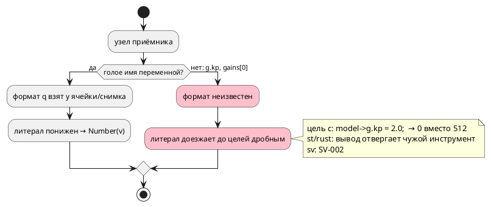
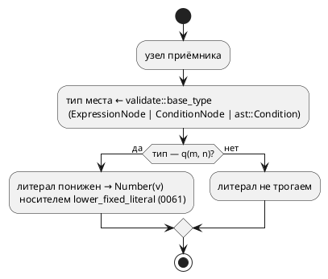

# Фича: Понижение q-литерала в поле структуры и элементе массива

- **Номер:** 0382
- **Статус:** ГОТОВО
- **Зависит от:** нет (0061, 0371, 0381 закрыты)
- **Связанные issue (анализ):** кандидат, заведённый закрытием
  [понижение q-литерала в телах и условиях](0381-fixed-literal-in-body.md)

## Стадии жизненного цикла (правило 17)

Все стадии — **разделы этой карточки** (правило 32): «Архитектура (ADR)»,
«Анализ», «Разработка», «Тест-план», «Отчёт о тестировании», «Итог».
Отдельным артефактом остаются только исправления —
[`docs/fixes/`](../fixes/README.md) (при необходимости `0382-YY-*`).

## Краткое описание

[понижение q-литерала в телах и условиях](0381-fixed-literal-in-body.md) распространила понижение дробного
литерала в представление `q(m, n)` на тела и условия, но приёмником там
считалось **голое имя** переменной: формат q брался у ячейки ссылки. Поле
структуры и элемент массива под правило не подпали, хотя тип объявлен рядом.

Замер-22 (`scripts/probe.sh`, поле `kp: q(8, 8)` со значением 0.5):

| Запись | эталон | `c` | `st`, `st-at` | `rust` | `sv`, `sv-mmio` |
|---|---|---|---|---|---|
| `g.kp := 2.0;` затем `set_v := g.kp as u8;` | `set_v = 2` | `model->g.kp = 2.0;` → **0** | `iec2c` ОТВЕРГ | `rustc` E0308 | `SV-002` |
| `gains[0] := 2.0;` (элемент массива) | верно | то же | `iec2c` ОТВЕРГ | E0308 | `SV-002` |
| `if g.kp > 1.0 { … }` | **`SIM-005` в такте** | принимает и считает | `iec2c` ОТВЕРГ | E0308 | `SV-002` |
| **контроль:** `kp := 2.0;` над переменной | `2` | `2` | принято | принято | принято |

Первая строка — молча неверное **значение** при нулевом коде возврата `taktc`
(прогон харнесса дал `0 0 0` против `2 2 2` у эталона), вторая и третья —
невалидный вывод у трёх целей и отказ эталона там, где цель `c` вход исполняет.
Контрольный вход показывает, что предмет — именно **место записи**: та же
запись над переменной согласована у всех девяти потребителей.

> Фича зарегистрирована из бэклога кандидатов (запись «Поле структуры q-типа в
> теле не понижает литерал», заведённая закрытием 0381); далее проходит
> жизненный цикл по правилу 17.

## Документирование (правило 24)

**Не требуется** — правило языка прежнее (0061: литерал понижается в
представление приёмника; 0381 распространила его на тела и условия). Фича
исполняет это правило в позициях, где приёмник — поле структуры или элемент
массива, то есть снимает пробел реализации, а не меняет язык.

## Архитектура (ADR)

- **Status:** Accepted
- **Date:** 2026-08-22
- **Authors:** Архитектор + Аналитик
- **Related issues:** [Фича](0382-fixed-literal-in-place.md);
  продолжает [ADR](0381-fixed-literal-in-body.md#архитектура-adr), опирается на носитель
  типа базы [ADR](0358-postfix-index-on-expression.md#архитектура-adr) и на вывод типа поля
  [ADR](0371-fixed-cast-from-field.md#архитектура-adr)

### Context

[fixed-point Q(m.n) как тип языка](0061-fixed-point-type.md) задала правило: дробный
литерал, попавший в приёмник типа `q(m, n)`, **понижается** в целочисленное
представление (масштаб 2ⁿ) ещё в семантике — за её границей дробной формы не
существует, и потребителям не по чему расходиться. [понижение q-литерала в телах и условиях](0381-fixed-literal-in-body.md) распространила правило с
объявления на тела и условия.

Приёмником считает **именованное значение**: формат q берётся у ячейки
ссылки (`ExpressionNode::Variable`) либо у имени в снимке переменных модели.
Поле структуры и элемент массива под этот признак не подпадают, хотя их тип
объявлен рядом и выводится существующим носителем
`semantic::validate::base_type` (0358).

Замер-22 (`scripts/probe.sh`; `struct Gains { kp: q(8, 8), … }`,
`var g: Gains := {0.5, 0.25};`):

| Запись | эталон | `c` | `st`, `st-at` | `rust` | `sv`, `sv-mmio` |
|---|---|---|---|---|---|
| `g.kp := 2.0;`, затем `set_v := g.kp as u8;` | `set_v = 2` | `model->g.kp = 2.0;` → **0** | `iec2c` ОТВЕРГ | `rustc` E0308 | `SV-002` |
| `gains[0] := 2.0;` | верно | то же | `iec2c` ОТВЕРГ | E0308 | `SV-002` |
| `if g.kp > 1.0 { … }` | **`SIM-005` в такте** | принимает и считает | `iec2c` ОТВЕРГ | E0308 | `SV-002` |
| `ref Done: g.kp > 0.25;` | **`SIM-005` в такте** | принимает и считает | `iec2c` ОТВЕРГ | E0308 | `SV-002` |
| **контроль:** `kp := 2.0;` над переменной | `2` | `2` | принято | принято | принято |

Прогон харнесса цели `c` дал `0 0 0` там, где эталон даёт `2 2 2`: значение
`2.0` кладётся в поле `int16_t` **как есть** (усечение до 2), а масштаб 2⁸
теряется. Это молчаливое расхождение при нулевом коде возврата `taktc`.

Контрольный вход отделяет предмет: та же запись над **переменной** согласована
у всех девяти потребителей — ломается именно **место записи**.

Поток «как есть» (стадия понижения после стадии 6):



### Decision Drivers

1. **Молчаливое расхождение значений дороже отказа.** Цель `c` печатает
   валидный C, `cc` его принимает, а автомат считает другое — этот класс видит
   только потактовая сверка (правило проекта, ради которого сверки заведены).
2. **Правило языка уже принято** (0061/0381): фича закрывает пробел
   реализации, а не вводит новое поведение — значит и решение обязано быть
   минимальным.
3. **Второе знание о типе места запрещено.** Тип цепочки
   `переменная(.поле | [индекс])*` уже выводит `validate::base_type` (0358);
   своя копия разошлась бы с ним, а сегодня расхождение
   ровно такого рода и наблюдается — кандидат «вывод типа операнда живёт
   четырьмя носителями» о том же.
4. **Представлений приёмника три, и они не сводятся друг к другу**:
   `ExpressionNode` (тело), `ConditionNode` (`cond`, формулы) и сырой
   `ast::Condition` (ребро `ref` — инвариант проекта). Правка одного пути чинит
   треть входов.

### Considered Options

#### Option A. Расширить каждый из трёх предикатов своим разбором

В `fixed_body.rs` живут `fixed_of_expr`, `cond_fixed_of`, `ast_fixed_of`.
Дописать в каждый ветви «поле структуры» и «элемент массива».

**Pros:**
- правка локальна, чужие модули не трогаются;
- заимствования прохода не меняются.

**Cons:**
- **три копии одного знания** о спуске по типу (структура → поле, массив →
  элемент) — ровно тот класс, который в проекте правился уже шесть раз;
- разъедутся молча: компилятор о расхождении копий не скажет;
- четвёртая копия при следующем представлении заведётся по образцу.

#### Option B. Один носитель типа места + три тонких адаптера

Знание о спуске остаётся у `validate::base_type` (0358). Для условий носитель
дополняется двумя входами того же вида — `cond_base_type` (уже существует
приватно в `validate::member_access`, переезжает к соседу) и
`ast_base_type` (сырой АСД ребра). Проход понижения спрашивает **тип места** и
берёт из него формат `q`.

**Pros:**
- знание о структуре и массиве — в одном месте на проект;
- приватный `cond_base_type` перестаёт быть четвёртой копией: он и есть тот же
  носитель, только в другом представлении;
- новое представление приёмника получает адаптер, а не правило.

**Cons:**
- проход обязан **отпустить `borrow_mut`** модели: носитель читает `ModelNode`
  (структуры), а сегодня обход держит модель изменяемо заимствованной;
- носитель растёт третьим входом.

#### Option C. Звать `extract_type` (0371) из прохода понижения

У вывода типов есть полноценный `extract_type`, знающий и поле, и элемент.

**Pros:**
- носитель уже полон и покрывает больше форм (вызов, приведение, арифметика).

**Cons:**
- **работает только для `ExpressionNode`**: для `ConditionNode` и сырого АСД
  входа нет вовсе, то есть два пути из трёх остаются непокрытыми;
- требует `Rc<RefCell<ModelNode>>` и рекурсивно берёт `borrow()`, тогда как
  проход держит `borrow_mut` — заимствования всё равно придётся перестраивать;
- избыточен: понижению нужен тип **места**, а не любого выражения;
  консервативность `base_type` («`None` — тип надёжно не выводится») здесь
  ровно то, что нужно.

### Decision

Принимается **Option B**.

Знание «какой тип у места `переменная(.поле | [индекс])*`» остаётся **одним**
и живёт в `semantic::validate::base_type`. Носитель получает три входа по числу
представлений места:

| Вход | Представление | Кто пользуется |
|---|---|---|
| `base_type` | `ExpressionNode` | `SE-061`, `SE-028`/`SE-030`, срез (0355), понижение q |
| `cond_base_type` | `ConditionNode` | `SE-061` в условии, понижение q |
| `ast_base_type` | `ast::Condition` | понижение q на ребре `ref` |

Проход `type_node::fixed_body` (0381) спрашивает у носителя тип места и берёт
у него формат `q(m, n)`; своего разбора структуры и массива он не заводит.

Обход прохода перестраивается так, чтобы **не держать `borrow_mut`** во время
опроса носителя: тела (функции, именованные блоки, условия, состояния)
изымаются из модели (`std::mem::take`), обрабатываются при разделяемом
заимствовании и возвращаются на место. Тела и структуры — непересекающиеся
части `ModelNode`, поэтому изъятие наблюдаемо только внутри прохода.

Целевой поток:



**Арифметика в объём не входит** — граница унаследована от 0381:
`g.kp + 1.5` отвергает `SE-059` (смешение `q` и `float`), и понижение там лишь
ухудшило бы сообщение, назвав тип, которого автор не писал.

**Разряд (`x.3`, `Member::Number`) не затрагивается**: его тип — вопрос
правила, и `base_type` его намеренно не выводит.

### Consequences

#### Положительные

- Молчаливое расхождение значений у цели `c` снято; `st`, `rust` и `sv`
  получают вход, который переводится, вместо отказа чужого инструмента.
- Знание о типе места сведено к одному носителю: приватный `cond_base_type`
  перестаёт быть отдельной копией, а кандидат «вывод типа операнда живёт
  четырьмя носителями» уменьшается на одну запись.
- Правило языка не меняется: версия языка остаётся прежней.

#### Отрицательные / Action items

- Проход понижения меняет способ заимствования модели — риск паники
  `BorrowMutError` при неаккуратной правке; контролируют тесты (любое двойное
  заимствование падает немедленно на всём корпусе).
- Носитель `base_type` консервативен по контракту: место, чей тип не выводится
  (например, поле структуры, пришедшей из невыводимого выражения), понижения не
  получает — прежнее поведение сохраняется, отказа не добавляется.

#### Acceptance criteria

1. Потактовая сверка эталона с целью `c` на фикстуре, где приёмник — **поле
   структуры** и **элемент массива**, даёт совпадающие трассы; мутация «вернуть
   прежний признак» её роняет.
2. Тот же вход принимают инструменты целей: `iec2c` + сборка порождённого C,
   `rustc` + `clippy -D warnings`, `verilator` + `yosys`.
3. Условие ребра `ref` с полем структуры (`g.kp > 0.25`) исполняется эталоном
   и даёт у цели `c` тот же переход.
4. Контрольный вход (та же запись над переменной) остаётся согласованным —
   правка не читается как «понижать всё подряд».
5. Вывод корпуса `examples/generated/` не изменился.
6. `./scripts/precheck.sh` зелёный.

## Анализ

### Цель и контекст

Правило («литерал понижается в представление приёмника») исполнялось в
объявлении, а с 0381 — в телах и условиях, но **только когда приёмник назван
именем**. Поле структуры и элемент массива остались вне правила: замер-22 дал у цели `c` молча неверное значение, у `st` и `rust` — вывод,
отвергаемый чужим инструментом, у `sv` — отказ `SV-002`, а у эталона на
сравнении — `SIM-005` в такте.

Фича закрывает пробел реализации: язык не меняется, версия языка остаётся
`0.11.0`.

### Замер (правило 30, дата 2026-08-22)

Команда: `scripts/probe.sh -n 3 <проба>.takt`; прогон значений цели `c` —
собственным харнессом на порождённом коде.

| # | Проба | эталон | `c` | `st`/`st-at` | `rust` | `sv`/`sv-mmio` |
|---|---|---|---|---|---|---|
| P1 | `g.kp := 2.0;` + `set_v := g.kp as u8;` | `2 2 2` | **`0 0 0`** (`model->g.kp = 2.0;`) | `iec2c`: Incompatible data types for ':=' | `rustc` E0308 | `SV-002` |
| P2 | `gains[0] := 2.0;` + сравнение | верно | то же | `iec2c`: два отказа (`:=` и `>`) | E0308 | `SV-002` |
| P3 | `if g.kp > 1.0 { … }` | `SIM-005` **в такте** | принимает, считает по представлению | `iec2c`: Data type mismatch for '>' | E0308 | `SV-002` |
| P4 | `ref Done: g.kp > 0.25;` | `SIM-005` **в такте** | принимает, считает | `iec2c`: то же | E0308 | `SV-002` |
| K1 | **контроль:** `kp := 2.0;` над переменной | `2 2 2` | `2 2 2` | принято, `cc` собрал | `clippy` принял | `yosys` синтезировал |

Выводы замера:

- предмет — **место записи**, а не тип `q`: контроль K1 согласован у всех
  девяти потребителей (это работа 0381);
- класс **шире кандидата**: кандидат называл только поле структуры в
  присваивании (P1), а ломаются ещё элемент массива (P2), сравнение в теле (P3)
  и условие ребра (P4);
- у эталона и целей расхождение **разного рода**: P1 — молчаливое значение
  (Tier 1), P3/P4 — отказ эталона против исполнения целью `c` (тоже Tier 1),
  P2 — вдобавок невалидный вывод трёх целей (Tier 2).

### Зависимости фичи (правило 17/19)

- **Зависит от:** нет. Опорные фичи закрыты: [fixed-point Q(m.n) как тип языка](0061-fixed-point-type.md)
  (представление `q`), [индексация применима к выражению, а не только к имени](0358-postfix-index-on-expression.md)
  (носитель типа базы), [приведение q из поля структуры масштабируется](0371-fixed-cast-from-field.md)
  (тип поля в выводе типов), [понижение q-литерала в телах и условиях](0381-fixed-literal-in-body.md)
  (проход понижения в телах и условиях).
- **Влияние на порядок разработки:** фича никого не разблокирует; она снимает
  одного кандидата целиком и **уменьшает** кандидата «вывод типа операнда живёт
  четырьмя носителями» — приватный `cond_base_type` перестаёт быть отдельной
  копией знания.

### Требования и проверяемые условия

- **R1. Приёмник-поле.** `g.kp := 2.0;` при `kp: q(8, 8)` даёт у эталона и
  цели `c` одно значение; вывод принимают `iec2c` (+ сборка C), `rustc`,
  `clippy`, `verilator`, `yosys`.
- **R2. Приёмник-элемент массива.** `gains[0] := 2.0;` при
  `gains: [q(8, 8); 2]` — то же.
- **R3. Сравнение в теле.** `if g.kp > 1.0 { … }` исполняется эталоном и даёт
  у цели `c` тот же ответ (при `g.kp = 0.5` — **ложь**: 128 против 256).
- **R4. Условие ребра.** `ref Done: g.kp > 0.25;` — переход у эталона и цели
  `c` совпадает потактово.
- **R5. Знание одно.** Спуск «структура → поле», «массив → элемент» живёт
  только в `semantic::validate::base_type`; в проходе понижения своего разбора
  этих форм нет (контроль — греп по исходнику).
- **R6. Контроль.** Запись над голой переменной (K1) остаётся согласованной;
  тесты не краснеют.
- **R7. Границы сохранены.** Арифметика с литералом (`g.kp + 1.5`) по-прежнему
  отвергается `SE-059` — сообщение называет `float`, а не `[bit;16]`; доступ к
  разряду (`x.3`) поведения не меняет.
- **R8. Вывод корпуса не изменился** (`examples/generated/`).

### Критерии приёмки и способ проверки

| # | Критерий | Способ проверки |
|---|---|---|
| A1 | R1–R2: значения эталона и цели `c` совпадают | потактовая сверка `takt-sim/tests/conformance/conformance_fixed_place_tests.rs` |
| A2 | R3–R4: сравнение и ребро дают один автомат | та же сверка (наблюдаемые `cmp_v`, состояние) |
| A3 | R1–R4: вывод принимают инструменты целей | `scripts/probe.sh` на фикстуре + проверки предкоммита |
| A4 | R5: второго знания нет | тест-греп по `takt-lang/src/semantic/type_node/fixed_body.rs` |
| A5 | R6: контроль согласован | существующая сверка 0381 (`conformance_fixed_literal_body_tests`) |
| A6 | R7: границы на месте | семантические тесты на `SE-059` и на разряд |
| A7 | R8: корпус не поехал | `git diff --exit-code examples/generated/` после пересборки |
| A8 | Мутация ловится | ручная мутация «вернуть прежний признак приёмника» роняет A1 |

### Редакторский слой (правило 29)

**Правки не требуются, и это проверено составом изменения:** фича не вводит ни
ключевых слов, ни токенов, ни узлов АСД, ни форм объявления — меняется
**значение литерала** внутри уже разобранного дерева. Подсветка
(`lsp/semantic_tokens.rs`), автодополнение (`lsp/keywords.rs`), структура
документа (`lsp/symbols.rs`), слой использований (`semantic/usages`) и оба
плагина оперируют формами записи, а не значениями, и о понижении не знают —
как не знали и после 0061/0381. Новых диагностик фича тоже не заводит:
единственная возможная (`SE-058`, литерал вне точности) уже пробрасывается
носителем `lower_fixed_literal` и доезжает до редактора прежним путём.

### Особенности по обратной функциональности

Обратная совместимость **сохраняется** для всех входов, кроме тех, что сегодня
дают расхождение:

- вход, где приёмник — поле или элемент, **менял значение** молча (цель `c`)
  либо не транслировался вовсе (`st`, `rust`, `sv`); после фичи он означает то
  же, что у эталона. Программ, полагавшихся на прежнее поведение, быть не
  может: оно у потребителей разное;
- вход без `q` не затрагивается: понижение срабатывает только при формате
  `q(m, n)` у типа места;
- версия языка не поднимается (правило 22): синтаксис и семантика прежние,
  правило лишь исполняется там, где раньше молчало.

### Риски и зависимости

- **Паника `BorrowMutError`.** Носитель читает модель, а обход держал её
  изменяемо заимствованной; ошибка проявится немедленно на любом входе
  (тесты и проверка корпуса), молча не уедет.
- **Слишком широкое понижение.** `base_type` консервативен (`None` — «тип
  надёжно не выводится»), поэтому ошибка возможна только в сторону «не
  понизили», то есть в прежнее поведение. Контроль — контрольный вход R6 и
  граница R7.
- **Корпус класс не покрывает:** `q`-полей и `q`-массивов в `examples/` нет,
  поэтому проверки целей его не видят — контроля обязаны быть фикстурными
  (как у 0381).

## Разработка

### Задача

#### Что было

Проход понижения (`semantic/type_node/fixed_body.rs`) спрашивал
формат `q(m, n)` у **имени**: три частных предиката (`fixed_of_expr`,
`cond_fixed_of`, `ast_fixed_of`) разбирали только `Variable` и `Parenthesis`.
Поле структуры и элемент массива приёмником не считались, и литерал доезжал до
целей дробным — с последствиями, измеренными в анализе (у цели `c` — молча
неверное значение, у `st`/`rust` — вывод, отвергаемый их инструментами, у
`sv` — `SV-002`, у эталона на сравнении — `SIM-005` в такте).

#### Что сделано

**1. Носитель типа места получил вход для условий.**
`semantic/validate/base_type.rs` (0358) знал `ExpressionNode`; приватная копия
того же знания для `ConditionNode` жила в `validate/member_access.rs`. Копия
снята, `cond_base_type` переехал к носителю и **дополнен** ветвью
`ArraySubscript` (её у копии не было). Шаги спуска — «структура → поле»
(`field_type`) и «массив → элемент» (`element_type`) — вынесены в общие функции,
которыми пользуются оба входа.

**2. Проход понижения спрашивает носитель.** Три частных предиката сведены к
двум однострочным обёрткам над `base_type`/`cond_base_type`; своего разбора
структур и массивов в проходе не осталось (контроль — греп-тест).

**3. Обход модели перестроен по заимствованию.** Носитель читает `ModelNode`
(структуры, объявления), а прежний обход держал модель **изменяемо**
заимствованной — «в лоб» это паника `BorrowMutError` на первом же поле. Тела
(функции, именованные блоки, `cond`, состояния) изымаются `mem::take`,
обрабатываются при разделяемом заимствовании и возвращаются на место; ошибка
возвращается **после** возврата тел.

**4. Снят мёртвый обход сырого АСД.** Замер-22 (зонд + отключение
целиком) показал: ветвь `lower_ast_condition` не срабатывает **ни разу** ни на
корпусе, ни на ~3600 тестах, а её отключение не роняет ничего. Причина найдена
чтением: стадия 6 (`resolve_state_references`) разрешает условия рёбер, а
`resolve_condition` отдаёт `Unresolved` **ровно в одном месте** — на
неразрешённом **имени** (`ast::Condition::Variable`), то есть на правой части
паттерна `S(Модель) = Состояние`, где ни литерала, ни сравнения не бывает по
построению. Обход (55 строк: `lower_ast_condition`, `ast_fixed_of`,
`lower_ast_literal`) и заведённый было `ast_base_type` удалены; ветвь
`ConditionNode::Unresolved` в проходе несёт доказательство недостижимости и
ссылку на контроль предпосылки.

Заодно исправлено **утверждение о собственном коде**: 0381 объясняла путь
сырого АСД инвариантом «условия рёбер `ref` не разрешаются». Правило верно, но
относится к **одной форме** — паттерну state-of; в редакции 0381 оно читалось
как «все условия рёбер сырые» (класс — проза приписывает коду чужую роль).

Статус по функциональности (правило 11): правка целиком в **семантике**
(`takt-lang`), поэтому цели генерации и эталон не трогались — их поведение
изменилось потому, что до них доезжает уже понижённый литерал. Редакторский
слой — «н/п» (обоснование в анализе, правило 29).

#### Проверки

```sh
cargo test --all-features                                  # 3600 тестов, зелено
cargo test --test conformance conformance_fixed_place_tests::
cargo test --test semantic fixed_place_tests::
scripts/probe.sh -n 3 <проба>.takt                         # девять потребителей + их инструменты
./scripts/precheck.sh                                      # полный предкоммит
```

- **Значения** (T1–T4): трасса эталона и порождённого C совпадает —
  `[2, 3, 0, 0]` на каждом такте; поле получает 512, элемент 768, сравнения
  ложны (64 против 256 и 1024).
- **Мутации** (T12): «спуск по полю → `None`» и «спуск по массиву → `None`»
  роняют обе проверки сверки; мутация пути сырого АСД **не роняет ничего** —
  этим она и показала, что путь мёртв.
- **Инструменты целей** (T6): `cc`, `iec2c` + сборка порождённого C,
  `rustc` + `clippy -D warnings`, `verilator` + `yosys` приняли вывод на всех
  четырёх пробах; до правки три из них отвергали.
- **Контроль** (T8): запись над голой переменной согласована у девяти
  потребителей, сверка 0381 зелена.
- **Граница** (T9): `g.kp + 1.5` по-прежнему `SE-059` с текстом про `float`.
- **Корпус** (T11): вывод `examples/generated/` не изменился.

## Тест-план

### Область и цель

Проверяется, что дробный литерал понижается в представление `q(m, n)` во всех
позициях, где приёмник — **место**, а не только имя: поле структуры, элемент
массива, сравнение с полем в теле и условие ребра. Ключевая проверка —
**значенческая** (потактовая сверка эталона с целью `c`): вывод обеих сторон
компилируется в любом случае, разницу между 2 и 512 видит только трасса.

Отдельно проверяется **предпосылка** правки: условие ребра доезжает до
понижения разрешённым (иначе снятый обход сырого АСД был бы нужен).

### Проверки (условие → ожидаемый результат)

| # | Проверка | Предусловие | Ожидаемый результат | Ссылка на R/A |
|---|---|---|---|---|
| T1 | Приёмник — **поле** структуры | `struct Gains { kp: q(8, 8) }`, `g.kp := 2.0;` | эталон и цель `c` дают `set_v = 2`; в выводе `= 512` | R1 / A1 |
| T2 | Приёмник — **элемент** массива | `gains: [q(8, 8); 2]`, `gains[0] := 3.0;` | эталон и цель `c` дают `arr_v = 3`; в выводе `= 768` | R2 / A1 |
| T3 | **Сравнение** поля с литералом в теле | `ki = 0.25`, `if g.ki > 1.0` | условие **ложно** у обоих (64 против 256); в выводе `> 256` | R3 / A2 |
| T4 | **Условие ребра** с полем | `ref Done: g.ki > 4.0;` | переход **не** происходит; в выводе `> 1024` | R4 / A2 |
| T5 | Сырого литерала в выводе нет | та же фикстура | текст `2.0`/`3.0`/`1.0`/`4.0` в порождённом C отсутствует | R1–R4 / A1 |
| T6 | Инструменты целей принимают вывод | та же запись | `cc`, `iec2c` (+ сборка C), `rustc`+`clippy`, `verilator`+`yosys` — приняли | R1–R4 / A3 |
| T7 | Знание одно | исходник прохода понижения | нет `search_struct`, `TypeNode::Struct`, `TypeNode::Array` | R5 / A4 |
| T8 | **Контроль:** приёмник — переменная | `kp := 2.0;` (без поля) | согласие всех девяти потребителей; тесты зелены | R6 / A5 |
| T9 | Граница: арифметика | `out_v := g.kp + 1.5;` | `SE-059`, текст называет `'q(8, 8)'` и `'float'` | R7 / A6 |
| T10 | Предпосылка: ребро разрешено | модель с `ref Done: g.ki > 4.0;` | условия рёбер после конвейера **не** `Unresolved` | — / A4 |
| T11 | Корпус не изменился | пересборка `examples/generated/` | `git diff --exit-code` пуст | R8 / A7 |
| T12 | Мутация ловится | «спуск по полю → `None`», «спуск по массиву → `None`» | T1–T5 краснеют | — / A8 |

### Разбивка проверок по функциональности

Единые условия и ожидаемые результаты прогоняются против каждой задеваемой
обратной функциональности (правило 11); фиксируется статус.

| Функциональность | T1 | T2 | T3 | T4 | T6 | T8 | Статус |
|---|---|---|---|---|---|---|---|
| эталон (`takt-sim`) | ✅ | ✅ | ✅ | ✅ | — | ✅ | ✅ |
| цель `c` | ✅ | ✅ | ✅ | ✅ | ✅ | ✅ | ✅ |
| цель `c-hal` | — | — | — | — | ✅ | ✅ | ✅ |
| цель `st` / `st-at` | — | — | — | — | ✅ | ✅ | ✅ |
| цель `rust` | — | — | — | — | ✅ | ✅ | ✅ |
| цель `sv` / `sv-mmio` | — | — | — | — | ✅ | ✅ | ✅ |
| цель `plantuml` | — | — | — | — | — | ✅ | ✅ |

<!-- Легенда: ✅ пройдено · ❌ провалено · ⬜ не проверялось · — не применимо -->

### Тестовые данные и окружение

- Фикстура сверки — `takt-sim/tests/data/eval/conformance_fixed_place.takt`
  (четыре позиции разом; значения подобраны так, что понижение **меняет**
  ответ сравнения).
- Сверка — `takt-sim/tests/conformance/conformance_fixed_place_tests.rs`
  (`fixed_literal_in_place_matches_generated_c`, `every_place_lowers_its_literal`).
- Предпосылка и «знание одно» — `takt-lang/tests/semantic/fixed_place_tests.rs`.
- Пробы замера (вне репозитория, чек-лист правила 30): поле, элемент, сравнение,
  ребро и **контроль** над переменной; арбитры — `scripts/probe.sh` со всеми
  инструментами целей.
- Окружение: `rustc` 1.97.1 (пин `rust-toolchain.toml`), `cc` (Apple clang),
  `iec2c` (MatIEC из `~/.local/bin`), `verilator`, `yosys`, macOS 25.5.

## Отчёт о тестировании

### Резюме

**Пройдено, фича готова к закрытию.** Все двенадцать проверок тест-плана
выполнены, обе мутации ловятся, `./scripts/precheck.sh` зелёный (код 0), вывод
корпуса `examples/generated/` не изменился.

Сверх плана прогон дал **находку об устройстве**: путь понижения по сырому
`ast::Condition`, заведённый фичей, оказался **мёртвым** — он снят, а
утверждение о нём исправлено (см. «Выводы»).

### Окружение

- macOS 25.5 (Darwin), `rustc` 1.97.1 (пин `rust-toolchain.toml`).
- Арбитры целей: Apple `cc`, `iec2c` (MatIEC, `~/.local/bin`), `clippy-driver`,
  `verilator`, `yosys` — те же флаги, что у проверок предкоммита.
- Прогоны: `cargo test --all-features` (3600 тестов), `scripts/probe.sh`,
  `./scripts/precheck.sh`.

### Фактические результаты по проверкам

| # | Проверка | Результат | Комментарий |
|---|---|---|---|
| T1 | Приёмник — поле структуры | ✅ | эталон и цель `c` дают `set_v = 2`; в выводе `model->g.kp = 512;` (до правки — `= 2.0`, трасса `0 0 0`) |
| T2 | Приёмник — элемент массива | ✅ | `arr_v = 3`, в выводе `= 768` |
| T3 | Сравнение поля в теле | ✅ | `ki = 0.25` (64) против `1.0` (256) — ложь у обоих; до правки эталон отвечал `SIM-005` в такте |
| T4 | Условие ребра с полем | ✅ | переход не происходит; в выводе `> 1024` |
| T5 | Сырого литерала в выводе нет | ✅ | `2.0`, `3.0`, `1.0`, `4.0` в порождённом C отсутствуют |
| T6 | Инструменты целей принимают вывод | ✅ | на всех четырёх пробах: `cc` принял, `iec2c` принял + `cc` собрал, `rustc` + `clippy` приняли, `verilator` + `yosys` синтезировали (до правки три из них отвергали, `sv` отказывал `SV-002`) |
| T7 | Знание одно | ✅ | `lowering_pass_has_no_own_type_descent`: в проходе нет `search_struct`, `TypeNode::Struct`, `TypeNode::Array` |
| T8 | Контроль: приёмник — переменная | ✅ | девять потребителей согласны; сверка 0381 зелена |
| T9 | Граница: арифметика | ✅ | `g.kp + 1.5` → `SE-059`, текст называет `'q(8, 8)'` и `'float'` |
| T10 | Предпосылка: ребро разрешено | ✅ | `edge_condition_is_resolved_before_lowering` |
| T11 | Корпус не изменился | ✅ | `git diff --stat examples/generated/` пуст |
| T12 | Мутация ловится | ✅ | «спуск по полю → `None`» и «спуск по массиву → `None`» роняют обе проверки сверки |

### Результаты по функциональности

| Функциональность | Итог | Чем подтверждено |
|---|---|---|
| эталон (`takt-sim`) | ✅ | трасса `[2, 3, 0, 0]` × 3 такта; прежде — `SIM-005` в такте на сравнении |
| цель `c` | ✅ | прогон харнесса совпал с эталоном; прежде `0 0 0` |
| цель `c-hal` | ✅ | `cc` принял (T6) |
| цели `st` / `st-at` | ✅ | `iec2c` принял, порождённый C собран; прежде «Incompatible data types» |
| цель `rust` | ✅ | `rustc` + `clippy -D warnings`; прежде `E0308` |
| цели `sv` / `sv-mmio` | ✅ | `verilator` + `yosys`; прежде `SV-002` |
| цель `plantuml` | ✅ | принимала и прежде (диаграмма значений не печатает) |

### Найденные дефекты

Дефектов реализации, потребовавших исправления (`docs/fixes/0382-YY-*`), **нет**.

Зафиксировано **одно наблюдение об устройстве**, устранённое в рамках задачи (см. «Выводы»).

### Выводы и дальнейшие шаги

**1. Класс шире кандидата.** Кандидат называл поле структуры в присваивании;
замер показал ещё три позиции — элемент массива, сравнение в теле и условие
ребра. Взяв запись из бэклога, замер сняли заново (правило 30) — и это оказалось
не формальностью.

**2. Мёртвый путь снят.** Фича обходила ещё и сырой `ast::Condition`,
объясняя это инвариантом «условия рёбер `ref` не разрешаются». Проверка:

- зонд в начале обхода — **ноль** срабатываний на всём тестовом корпусе и всех
  примерах; на форме `S(Модель) = Состояние` он срабатывает, но приходит туда
  `Variable(End)` — имя, а не сравнение;
- отключение обхода целиком — **ни один** из ~3600 тестов не покраснел;
- чтение кода объяснило причину: `resolve_condition` возвращает `Unresolved`
  ровно в одном месте — на неразрешённом **имени**, то есть в этой обёртке ни
  литерала, ни сравнения не бывает по построению, а стадия 6 разрешает все
  прочие условия рёбер.

Обход (55 строк) снят, ветвь `Unresolved` несёт доказательство недостижимости, а
предпосылку контролирует тест `edge_condition_is_resolved_before_lowering` — он
покраснеет, если проход понижения переедет **выше** стадии 6.

Побочно исправлено **утверждение о собственном коде**: правило
«условия рёбер не разрешаются» верно для **одной формы** — паттерна state-of, а
в редакции 0381 читалось как «все условия рёбер сырые».

**3. Кандидаты.** Закрытие снимает кандидата «Поле структуры q-типа в теле не
понижает литерал» целиком и **уменьшает** кандидата «вывод типа операнда живёт
четырьмя носителями»: приватная копия `cond_base_type` перестала быть отдельным
знанием. Оставшиеся носители (`extract_type`, `rust_fixed`, `sv_fixed`,
`st_operand_type`) фича не трогала — запись актуализирована, а не снята.

**Вердикт: ГОТОВО.**

## Итог (что сделано)

- Дробный литерал понижается в представление `q(m, n)` везде, где приёмник —
  **место**: не только имя переменной (0381), но и **поле структуры**,
  **элемент массива**, а также обе стороны сравнения с ними — в теле и в
  условии ребра.
- **Знание о типе места — одно.** Спуск «структура → поле, массив →
  элемент» принадлежит носителю `semantic::validate::base_type` (0358); в
  проходе понижения своего разбора нет (контроль — греп-тест). Приватная копия
  того же знания для условий (`validate::member_access::cond_base_type`)
  переехала к носителю и получила недостававшую ветвь индексации.
- **Обход модели перестроен по заимствованию:** носитель читает `ModelNode`,
  поэтому тела изымаются `mem::take` и возвращаются на место — прежний обход
  держал модель изменяемо заимствованной, и «в лоб» это паника.
- **Снят мёртвый путь 0381.** Обход сырого `ast::Condition` не срабатывал
  ни разу (зонд), а его отключение не роняло ни одного из ~3600 тестов:
  стадия 6 разрешает условия рёбер, и `Unresolved` остаётся ровно на
  неразрешённом **имени** — правой части паттерна `S(Модель) = Состояние`, где
  ни литерала, ни сравнения не бывает. Предпосылку контролирует тест: он
  покраснеет, если проход переедет выше стадии 6.
- **Границы прежние:** арифметика с литералом остаётся `SE-059` (граница
  0381), доступ к разряду не затронут.
- Версия языка не менялась; вывод корпуса не изменился.

Детали — в [отчёте](0382-fixed-literal-in-place.md#отчёт-о-тестировании).
