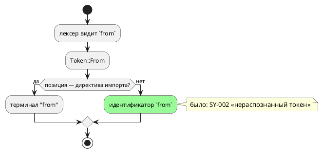

# Фича: Слово `from` — контекстное ключевое

- **Номер:** 0385
- **Статус:** ГОТОВО
- **Зависит от:** нет (0201, 0298 закрыты)
- **Связанные issue (анализ):** кандидат, заведённый закрытием
  [fixed-point в параметре функции](0380-fixed-point-parameter.md)

## Стадии жизненного цикла

Все стадии — **разделы этой карточки**: «Архитектура (ADR)»,
«Анализ», «Разработка», «Тест-план», «Отчёт о тестировании», «Итог».
Отдельным артефактом остаются только исправления —
[`docs/fixes/`](../fixes/README.md) (при необходимости `0385-YY-*`).

## Краткое описание

Слово `from` встречается в языке ровно в одной форме — директиве импорта
(`import { … } from "файл";`), но объявлено **жёстким** ключевым словом, и
поэтому не может быть именем. Замер-22:

| Запись | Ответ |
|---|---|
| `struct Line { from: u8, to: u8 }` | **`SY-002`** «нераспознанный токен 'from'» — на объявлении поля |
| `var from: u8 := 1;` | `SY-002` |
| **контроль:** `struct Line { start_at: u8 }` | принимается |

Класс тот же, что `ln` у IEC (0342) и `small` у SV (`SV-012`), но здесь
ограничение **самого языка**, а не цели: имя `from` естественно для геометрии,
маршрутов, интервалов и переходов.

Замер по **всему** списку лексера (47 слов, `taktc` на `var <слово>: u8 := 1;`)
показал, что контекстными были только семь слов LTL (`X`, `F`, `G`, `U`, `R`,
`LTL`, `Guard`); прочие 39 — жёсткие и остаются такими.

## Документирование

**Требуется.** Затронут раздел [«Лексика»](../../book/src/02-lexical/index.typ):
`from` переезжает из таблицы ключевых слов во врезку о контекстных словах (там
уже перечислены слова LTL), с пояснением, что вне директивы импорта это обычный
идентификатор. Пример — объявление структуры с полем `from`.

## Архитектура (ADR)

- **Status:** Accepted
- **Date:** 2026-08-22
- **Authors:** Архитектор + Аналитик
- **Related issues:** [Фича](0385-contextual-from.md);
  опирается на [ADR](0201-dead-lexemes.md#архитектура-adr) (лексема без правила) и
  [списки лексики документа отстают от языка](0298-book-lexicon-lists-sync.md#архитектура-adr) (сверка раздела «Лексика» с языком)

### Context

`from` объявлено ключевым словом лексера и встречается в грамматике **ровно
один раз** — в директиве импорта:

```
import { Point, twice } from "lib.takt";
import * as Lib        from "lib.takt";
```

Вне этой формы слово не значит ничего, но именем быть не может. Замер-22 (`taktc`): `struct Line { from: u8, to: u8 }` даёт `SY-002`
«нераспознанный токен 'from'» — прямо на объявлении поля; `var from: u8 := 1;`
— то же.

Прогон по **всему** списку лексера (47 слов, вход `var <слово>: u8 := 1;`)
показал: контекстными были только семь слов LTL (`X`, `F`, `G`, `U`, `R`,
`LTL`, `Guard`), прочие 39 — жёсткие. То есть приём «слово ключевое **в
позиции**» в языке уже есть, и `from` под него подходит лучше всех остальных:
его позиция единственна и синтаксически однозначна.



### Decision Drivers

1. **Правило языка не должно быть свойством лексера.** Урок: запрет,
   выраженный квантификатором грамматики, меняется молча. Здесь то же:
   `from` жёсткое не потому, что так решено, а потому, что так завели токен.
2. **Обратная совместимость.** Расширение множества допустимых имён не меняет
   смысла ни одной существующей программы: там, где `from` стоял в директиве
   импорта, он остаётся терминалом.
3. **Приём в языке уже применён** — семь слов LTL живут в правиле `Identifier`
   отдельными продукциями; восьмая продукция стоит ровно столько же.
4. **Опасность конфликта LR(1)** — единственный настоящий риск: грамматика
   строится LALRPOP, и конфликт означал бы, что язык не собирается вовсе.

### Considered Options

#### Option A. Оставить как есть

**Pros:** нулевой риск.
**Cons:** имя, естественное для отрезка, маршрута и перехода, остаётся
запрещённым без причины; ограничение не описано как решение — оно следствие
устройства лексера.

#### Option B. Изъять `from` из лексера, разбирать директиву импорта по тексту

**Pros:** слово перестаёт быть особенным вовсе.
**Cons:** директива импорта потеряла бы терминал, а с ним — диагностику: урок прямо говорит, что изымать надо **терминал**, а не лексему, иначе
сообщения об ошибке вырождаются в каскад.

#### Option C. Сделать `from` контекстным: продукция в правиле `Identifier`

**Pros:**
- ровно тот приём, которым уже живут слова LTL, — одна строка грамматики;
- директива импорта сохраняет терминал и диагностику;
- обратная совместимость полная.

**Cons:**
- требует проверки на конфликт LR(1) (снимается сборкой);
- документ и проверка лексики обязаны узнать о новом контекстном слове, иначе
  раздел «Лексика» станет обещанием, которого язык не исполняет.

### Decision

Принимается **Option C**.

`from` остаётся ключевым словом **лексера** и терминалом директивы импорта, но
получает продукцию в правиле `Identifier` — как `X`, `F`, `G`, `U`, `R`, `LTL`,
`Guard`. Множество контекстных слов проверки `check-book-keywords.py`
переименовывается из `LTL_CONTEXTUAL` в `CONTEXTUAL` и пополняется `from`;
раздел «Лексика» переносит слово из таблицы ключевых во врезку о контекстных.

**Подсветка `from` сохраняется:** проверка исключает контекстные слова из
**обязательных** к выделению, но не запрещает их выделять (`from` остаётся в
`keywords_code`, поэтому класс H2 не срабатывает). В директиве импорта слово
по-прежнему читается как ключевое, и подсвечивать его правильно.

**Прочие 39 слов остаются жёсткими.** Замер их перечисляет; расширение —
отдельное решение по каждому, и у большинства позиция не единственна.

### Consequences

#### Положительные

- `struct Line { from: u8, to: u8 }`, `var from: u8;`, `state from` и
  `fn from(...)` становятся законными.
- Ограничение языка перестаёт быть побочным свойством лексера.

#### Отрицательные / Action items

- **Версия языка поднимается** `0.11.0` → `0.12.0`: множество
  допустимых программ расширено. Коммит подъёма помечается тегом `v0.12.0`.
- Раздел «Лексика» и проверка лексики правятся вместе с грамматикой — иначе
  документ обещает запрет, которого нет.

#### Acceptance criteria

1. `from` принимается как имя поля структуры, переменной, состояния и функции.
2. Директива импорта работает в обеих формах, включая крайний случай
   `import { from } from "lib.takt";`.
3. Грамматика строится без конфликтов; все тесты зелены.
4. Раздел «Лексика» согласован с языком (проверка `check-book-keywords.py`).
5. Версия языка поднята до `0.12.0` в трёх источниках (константа, README,
   живой контекст), коммит помечен тегом.
6. `./scripts/precheck.sh` зелёный.

## Анализ

### Цель и контекст

`from` встречается в языке ровно в одной форме — директиве импорта, но было
жёстким ключевым словом и потому не могло быть именем. Фича переводит его в
разряд **контекстных** — тем же приёмом, которым уже живут семь слов LTL.

### Замер (дата 2026-08-22)

| # | Вход | Ответ до фичи |
|---|---|---|
| P1 | `struct Line { from: u8, to: u8 }` | `SY-002` «нераспознанный токен 'from'» на объявлении поля |
| P2 | `var from: u8 := 1;` | `SY-002` |
| K1 | **контроль:** то же с именем `start_at` | принимается |

Сверх кандидата снят **сплошной** замер по списку лексера: 47 слов, вход
`var <слово>: u8 := 1;`, прогон `taktc`. Контекстными оказались **семь**
слов LTL (`X`, `F`, `G`, `U`, `R`, `LTL`, `Guard`); прочие **39** — жёсткие:

```
_ address after as assembly at break clock cond const continue else enum every
extern false fn for formula if import in inout invariant loop match model next
out parameter ref return start state struct true type var while
```

Вывод: приём «ключевое в позиции» в языке уже есть, и `from` подходит под него
лучше прочих — его позиция единственна и синтаксически однозначна.

### Зависимости фичи

- **Зависит от:** нет (0201 — лексема без правила, 0298 — сверка раздела
  «Лексика» — закрыты).
- **Влияние на порядок разработки:** снимает кандидата, заведённого 0380;
  никого не разблокирует.

### Требования и проверяемые условия

- **R1.** `from` принимается как имя поля структуры, переменной, состояния и
  функции.
- **R2.** Директива импорта разбирается в обеих формах, включая крайний случай
  `import { from } from "lib.takt";` и `import { from as near } …`.
- **R3.** Грамматика строится без конфликтов LR(1) (иначе язык не собрался бы
  вовсе).
- **R4.** Прочие 39 ключевых слов именами **не** становятся.
- **R5.** Раздел «Лексика» и приложение «Грамматика» согласованы с языком
  (проверка `check-book-keywords.py`, классы L1/L2).
- **R6.** Версия языка поднята до `0.12.0` в трёх источниках; коммит помечен
  тегом `v0.12.0`.

### Критерии приёмки и способ проверки

| # | Критерий | Способ проверки |
|---|---|---|
| A1 | R1, R2, R4 | `takt-lang/tests/syntax/contextual_from_tests.rs` |
| A2 | R3 | сборка проекта (LALRPOP валит сборку на конфликте) |
| A3 | R5 | `scripts/check-book-keywords.py` |
| A4 | R6 | `scripts/check-language-version.sh`, `scripts/check-version-tag.sh` |
| A5 | Мутация | снятие продукции из грамматики роняет A1 (кроме контроля) |

### Редакторский слой

- **Лексер и токены** — не менялись: `from` остаётся в `KEYWORDS` и остаётся
  терминалом директивы импорта. Значит подсветка (`lsp/semantic_tokens.rs`),
  автодополнение (`lsp/keywords.rs::TAKT_KEYWORDS`) и списки плагинов правок
  **не требуют** — их контроля (вложение `KEYWORDS ⊆ TAKT_KEYWORDS ∪ …`,
  `TaktKeywordSyncTest`) остаются зелёными.
- **Новых узлов АСД и форм объявления нет** — `format/`, `semantic::usages`,
  `lsp/symbols.rs` не затрагиваются.
- **Названная граница:** в позиции **имени** слово `from` редактор
  по-прежнему подсветит как ключевое (подсветка идёт по токену, а не по
  контексту). То же верно для слов LTL с фичи, поведение единообразно;
  исправление потребовало бы контекстной подсветки, то есть знания грамматики
  на стороне LSP.
- **Списки документа** правились: `from` перенесён из таблицы ключевых слов во
  врезку о контекстных, а множество `CONTEXTUAL` проверки пополнено. Подсветка
  `from` **сохранена** намеренно: в директиве импорта слово читается ключевым,
  и проверка это допускает (исключение действует на обязательность, не на запрет).

### Особенности по обратной функциональности

Обратная совместимость **полная**: множество допустимых программ только
расширяется. Ни одна существующая запись не меняет смысла — там, где `from`
стоит в директиве импорта, он остаётся терминалом (проверено обеими формами,
включая крайний случай, где слово в одной строке и имя, и терминал).

Версия языка поднимается `0.11.0` → `0.12.0`: изменение
синтаксиса, пусть и расширяющее.

### Риски и зависимости

- **Конфликт LR(1)** — единственный настоящий риск; снят сборкой: грамматика
  строится, все 3600 тестов зелены.
- **Документ рассинхронизируется** — снято проверкой `check-book-keywords.py`,
  который и указал на оба места (раздел «Лексика» и приложение «Грамматика»).
- **Прочие 39 слов** остаются жёсткими; расширение по каждому — отдельное
  решение, у большинства позиция не единственна.

## Разработка

### Задача

#### Что было

`from` — жёсткое ключевое слово лексера, встречающееся в грамматике ровно один
раз (директива импорта). Имя `from` было запрещено везде:
`struct Line { from: u8, to: u8 }` давал `SY-002` прямо на объявлении поля.

#### Что сделано

**1. Продукция в правиле `Identifier`** (`grammar.lalrpop`) — одна строка, тот
же приём, которым живут семь слов LTL. `from` остаётся ключевым словом лексера и
терминалом директивы импорта: изымать надо терминал, а не лексему, иначе
диагностика вырождается в каскад.

**2. Проверка лексики знает о новом контекстном слове.** Множество
`LTL_CONTEXTUAL` переименовано в `CONTEXTUAL` и пополнено `from`; текст класса
`L2` обобщён («вне своей позиции», а не «вне аннотации»).

**3. Документ приведён к языку**: в разделе «Лексика» `from`
перенесён из таблицы ключевых слов во врезку о контекстных — с примером
структуры; в приложении «Грамматика» слово изъято из списка ключевых и
объяснено отдельным абзацем. Оба места указал сама проверка.

**4. Версия языка** поднята `0.11.0` → `0.12.0` в трёх источниках (константа,
README, живой контекст); коммит подъёма помечается тегом `v0.12.0`.

**Подсветка `from` сохранена** намеренно: исключение проверки действует на
**обязательность** выделения, а не на запрет, и в директиве импорта слово
читается ключевым.

Статус по функциональности: правка в **грамматике** и документе;
семантика, цели и эталон не трогались. Редакторский слой правок не требует —
токен и `KEYWORDS` не менялись (обоснование в анализе).

#### Проверки

```sh
cargo build --bin taktc          # LALRPOP валит сборку на конфликте LR(1)
cargo test --all-features
cargo test --test syntax contextual_from_tests::
python3 scripts/check-book-keywords.py
./scripts/check-language-version.sh
./scripts/precheck.sh
```

- **Разбор** (T1–T6): поле, переменная, состояние, функция; обе формы импорта,
  включая `import { from } from "…";` — слово в одной строке и именем, и
  терминалом.
- **Контроль** (T7): `state`, `model`, `next`, `at`, `after`, `every`, `in`,
  `out` именами не стали.
- **Мутация** (T11): снятие продукции роняет T1–T6, контроль остаётся зелёным.
- **Сплошной замер**: из 47 слов лексера контекстны восемь (семь LTL + `from`),
  остальные 39 жёсткие — записано в анализе.

## Тест-план

### Область и цель

Проверяется, что `from` принимается как имя, директива импорта продолжает
разбираться (в том числе там, где слово стоит и именем, и терминалом), а прочие
ключевые слова остаются жёсткими. Правка касается **грамматики**, поэтому
контроль формы импорта обязателен: конфликт LR(1) сломал бы разбор молча — вернее,
громко, но в другом месте.

### Проверки (условие → ожидаемый результат)

| # | Проверка | Предусловие | Ожидаемый результат | Ссылка на R/A |
|---|---|---|---|---|
| T1 | Поле структуры | `struct Line { from: u8, to: u8 }` | разбирается | R1 / A1 |
| T2 | Переменная, состояние, функция | `var from`, `start from`, `fn from(...)` | разбираются | R1 / A1 |
| T3 | Импорт, форма списка | `import { Point } from "lib.takt";` | разбирается | R2 / A1 |
| T4 | Импорт, форма `*` | `import * as Lib from "lib.takt";` | разбирается | R2 / A1 |
| T5 | Крайний случай | `import { from } from "lib.takt";` | разбирается | R2 / A1 |
| T6 | Крайний случай с `as` | `import { from as near } from "lib.takt";` | разбирается | R2 / A1 |
| T7 | **Контроль** | `var state`, `var model`, `var next`, `var at`, `var after`, `var every`, `var in`, `var out` | **отвергаются** | R4 / A1 |
| T8 | Грамматика строится | сборка | конфликтов LR(1) нет | R3 / A2 |
| T9 | Документ согласован | `check-book-keywords.py` | расхождений нет | R5 / A3 |
| T10 | Версия языка | три источника + тег | `0.12.0`, тег `v0.12.0` | R6 / A4 |
| T11 | Мутация | снять продукцию из грамматики | T1–T6 краснеют, T7 остаётся зелёным | — / A5 |
| T12 | Компиляция сквозная | проба с полем `from` целью `c` | компилируется, `cc` принял | R1 / A1 |

### Разбивка проверок по функциональности

| Функциональность | T1 | T3–T6 | T7 | T12 | Статус |
|---|---|---|---|---|---|
| лексер и грамматика | ✅ | ✅ | ✅ | — | ✅ |
| семантика | — | ✅ | — | ✅ | ✅ |
| цель `c` (сквозная проба) | — | — | — | ✅ | ✅ |
| документ `book/` | — | — | — | — | ✅ (T9) |
| редакторский слой | — | — | — | — | — (правок не требует) |

<!-- Легенда: ✅ пройдено · ❌ провалено · ⬜ не проверялось · — не применимо -->

### Тестовые данные и окружение

- Контроль — `takt-lang/tests/syntax/contextual_from_tests.rs` (четыре теста:
  поле, объявления, обе формы импорта с крайними случаями, контроль).
- Сплошной замер по списку лексера снимался скриптом-однодневкой (47 слов,
  `taktc` на `var <слово>: u8 := 1;`); результат записан в анализе.
- Окружение: `rustc` 1.97.1, macOS 25.5.

## Отчёт о тестировании

### Резюме

**Пройдено, фича готова к закрытию.** Двенадцать проверок тест-плана выполнены,
мутация ловится, `./scripts/precheck.sh` зелёный, вывод корпуса не изменился.

Сверх плана правка **открыла смежный класс** у цели `st` — он закрыт в рамках
той же фичи (см. «Выводы»).

### Окружение

macOS 25.5, `rustc` 1.97.1; `iec2c` (MatIEC) как арбитр цели `st`; прогоны —
`cargo test --all-features` (3600+ тестов), `scripts/probe.sh`, `precheck.sh`.

### Фактические результаты по проверкам

| # | Проверка | Результат | Комментарий |
|---|---|---|---|
| T1 | Поле структуры | ✅ | `struct Line { from: u8, to: u8 }` разбирается |
| T2 | Переменная, состояние, функция | ✅ | все три формы |
| T3–T4 | Импорт, обе формы | ✅ | конфликта LR(1) нет |
| T5 | `import { from } from "…";` | ✅ | слово именем и терминалом в одной строке |
| T6 | `import { from as near } …` | ✅ | |
| T7 | Контроль | ✅ | `state`, `model`, `next`, `at`, `after`, `every`, `in`, `out` именами не стали |
| T8 | Грамматика строится | ✅ | LALRPOP собрал без конфликтов |
| T9 | Документ согласован | ✅ | проверка указал **два** места: раздел «Лексика» и приложение «Грамматика» |
| T10 | Версия языка | ✅ | `0.12.0` в трёх источниках; тег ставится на коммит подъёма |
| T11 | Мутация | ✅ | снятие продукции роняет T1–T6, контроль остаётся зелёным |
| T12 | Сквозная проба | ✅ | все восемь целей переводят, инструменты приняли (после починки `st`) |

### Результаты по функциональности

| Функциональность | Итог | Чем подтверждено |
|---|---|---|
| лексер и грамматика | ✅ | сборка + четыре теста синтаксиса |
| семантика, эталон | ✅ | не трогались; сквозная проба исполняется |
| цель `st`, `st-at` | ✅ | **потребовалась починка** (см. «Выводы»); `iec2c` принимает |
| прочие цели | ✅ | `cc`, `rustc` + `clippy`, `verilator` + `yosys` |
| документ `book/` | ✅ | проверка лексики зелёный |
| редакторский слой | — | правок не требует (обоснование в анализе) |

### Найденные дефекты

Отдельных исправлений (`docs/fixes/0385-YY-*`) не потребовалось: смежный класс
закрыт в рамках задачи.

### Выводы и дальнейшие шаги

**1. Расширение языка открыло дыру у цели `st`, и это главный результат
прогона.** Как только `from` стал допустимым именем, сквозная проба показала:
`struct Line { from: u8, to: u8 }` даёт **невалидный ST** при нулевом коде
возврата `taktc` (`iec2c`: «invalid structure element declaration») — в IEC
`FROM` и `TO` ключевые слова диапазона `FOR … TO … BY`. Проверка `ST-014` имён
полей структуры не касалась вовсе.

Замер прогоном `iec2c` (79 имён `IEC_RESERVED` в роли поля) дал точную картину:
поле принимает **52** из них (`left`, `min`, `abs`, `sel` — стандартные
**функции**, внутри `STRUCT` ни с чем не сталкивающиеся) и отвергает **27** —
ключевые слова и **имена типов** IEC. Поэтому у полей свой список
(`IEC_RESERVED_FIELD`), а не общий: запретить полю всё подряд значило бы отнять
валидную модель (урок исправления). Обоснованность каждой записи контролирует
прогон `iec2c` с **двумя** контролями — обычное имя принимается, и `ln`
(функция) полем принимается тоже.

**2. Дыра была шире фичи.** `var to: u8;` ломал вывод `st` и **до** неё: `to` в
`IEC_RESERVED` отсутствовало. Оба имени добавлены — с прогоном, как требует
0342.

**3. Сплошной замер лексики.** Из 47 слов лексера контекстными были семь (слова
LTL); теперь восемь. Прочие 39 остаются жёсткими — список записан в анализе,
расширение по каждому требует отдельного решения.

**4. Проверка лексики нашёл оба места документа сам** — раздел «Лексика» и
приложение «Грамматика». Это ровно то, ради чего заведены 0160/0298.

**5. Кандидаты.** Закрытие снимает кандидата «Поле структуры не может
называться `from`». Заводится новый: `st_decl.rs` достиг **1000 строк при
лимите 1000** (запас 0) — следующая правка печати объявлений `st` упрётся в
проверка размера.

**Вердикт: ГОТОВО.**

## Итог (что сделано)

- `from` стало **контекстным** ключевым словом: продукция в правиле
  `Identifier` — тот же приём, которым живут семь слов LTL. Имя `from`
  законно у поля структуры, переменной, состояния и функции; директива импорта
  сохраняет терминал и диагностику (изымать надо терминал, а не лексему).
- **Правка открыла дыру у цели `st`, и она закрыта здесь же:** в IEC `FROM`
  и `TO` — ключевые слова диапазона, и `struct Line { from: u8, to: u8 }` давал
  **невалидный ST** при нулевом коде возврата. Заведён список
  `IEC_RESERVED_FIELD` и проверка имени поля; `from`/`to` добавлены и в
  `IEC_RESERVED` (дыра с `to` существовала и до фичи).
- **Список полей — свой, и это замер:** из 79 имён `IEC_RESERVED` поле
  структуры принимает **52** (стандартные функции внутри `STRUCT` ни с чем не
  сталкиваются). Запретить полю всё подряд значило бы отнять валидную модель; обоснованность каждой записи контролирует прогон `iec2c` с двумя
  контролями.
- **Сплошной замер лексики:** из 47 слов лексера контекстны восемь (семь
  LTL + `from`), прочие 39 жёсткие — список записан в анализе.
- Документ приведён к языку в **двух** местах (раздел «Лексика» и приложение
  «Грамматика») — оба указал проверка `check-book-keywords.py`.
- Версия языка поднята `0.11.0` → `0.12.0`; обратная совместимость полная —
  множество допустимых программ только расширено.

Детали — в [отчёте](0385-contextual-from.md#отчёт-о-тестировании).
