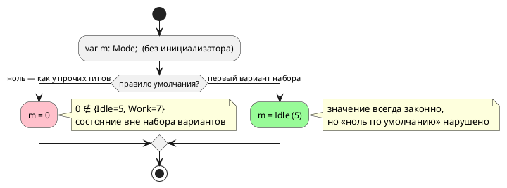

# Фича: Умолчание переменной перечислимого типа: ноль против первого варианта

- **Номер:** 0391
- **Статус:** ГОТОВО
- **Зависит от:** нет (проставлено на стадии анализа 2026-08-22)
- **Tier:** 1 — расставлен по признаку вреда (шкала — в блоке 1 `FEATURES.md`)
- **Класс:** семантика
- **Связанные issue (анализ):** кандидат блока 2 `FEATURES.md`, переведён в фичу пакетно 2026-08-22

## Стадии жизненного цикла

Все стадии — **разделы этой карточки**: «Архитектура (ADR)»,
«Анализ», «Разработка», «Тест-план», «Отчёт о тестировании», «Итог».
Отдельным артефактом остаются только исправления —
[`docs/fixes/`](../fixes/README.md) (при необходимости `0391-YY-*`).

## Краткое описание

- **Умолчание переменной перечислимого типа: ноль против первого варианта.**
  Замер [цель `c` обнуляет переменные без инициализатора](0353-c-default-init.md) (2026-08-21):
  `enum Mode { Idle = 5, Work = 7 } var m: Mode;` — эталон, `st`, `sv` и `c`
  дают **0**, то есть значение, которого в наборе вариантов **нет**; цель
  `rust` даёт **первый вариант** (`Mode::Idle` = 5), и её комментарий это
  прямо объясняет: `0 as Mode` было бы невалидным значением, а не умолчанием.
  Выбор меняет либо эталон и три цели, либо цель `rust` — то есть это
  **решение заказчика** о правиле языка, а не починка одного места.
  Класс невидим `probe.sh`: все потребители возвращают ноль, расхождение —
  в значении.

> Фича зарегистрирована из блока кандидатов `FEATURES.md` **без проработки**
> (решение заказчика 2026-08-22: «завести фичи из кандидатов без проработки»).
> Текст кандидата перенесён **дословно**, вместе с замером и его датой: замер
> есть свидетельство, а пересказ его теряет. Стадии 2 и 3 не пройдены —
> зависимости и объём **не оценивались**; далее фича проходит жизненный цикл по
> своду.

## Документирование

**Требуется при любом принятом варианте.** Умолчание переменной — наблюдаемое
поведение языка, и раздел `book/` о типах сегодня о нём молчит. Затронут раздел
«Типы» (блок про перечисления): назвать правило умолчания и, если принято
исключение из «ноль по умолчанию», записать его словами. Вариант C заводит
диагностику — её описание идёт в приложение «Ошибки и предупреждения».

<!-- При закрытии фичи (стадия 8, статус ГОТОВО) сюда добавляется раздел
     «## Итог (что сделано)» —
     ссылки на отчёт/исправления. Незакрытые фичи «Итога» не имеют. -->

## Архитектура (ADR)

- **Status:** Proposed — **решение о правиле языка принимает заказчик**
- **Date:** 2026-08-22
- **Authors:** Архитектор + Аналитик
- **Related issues:** [Фича](0391-enum-default-value.md);
  замер вырос из [цель `c` обнуляет переменные без инициализатора](0353-c-default-init.md#архитектура-adr) (умолчание у цели `c`),
  соседняя механика — [сброс перечислимого регистра у цели sv](0379-sv-enum-reset.md#архитектура-adr) (сброс перечислимого
  регистра у `sv`)

### Context

`var m: Mode;` без инициализатора при `enum Mode { Idle = 5, Work = 7 }`.
Замер **переснят 2026-08-22** (прежний — 0353, 2026-08-21):

| Потребитель | Умолчание | Наблюдаемое `o := m as u8` |
|---|---|---|
| эталон | `0` | `0` |
| `c`, `c-hal` | `model->m = 0;` | `0` |
| `st`, `st-at` | `m : USINT;` (ноль по IEC) | `0` |
| `sv`, `sv-mmio` | `p0391_m <= mode_e'(0);` (форма 0379) | `0` |
| **`rust`** | **`m: Mode::Idle`** | **`5`** |

Расхождение **молчаливое**: `taktc` возвращает ноль, все восемь целей
переводят, инструменты (`cc`, `iec2c` + `cc`, `rustc` + `clippy`, `verilator` +
`yosys`) вывод принимают. `probe.sh` его не показывает — коды возврата
совпадают, различаются **значения**.

Оба ответа по-своему обоснованы, и это суть вопроса:

- **ноль** — умолчание «как у всех остальных типов» (правило: переменная
  без инициализатора получает ноль), но при `Idle = 5, Work = 7` ноль **не
  принадлежит набору вариантов**: автомат стартует со значения, которого в
  языке нет;
- **первый вариант** — значение, всегда принадлежащее набору; комментарий цели
  `rust` объясняет выбор прямо: `0 as Mode` было бы невалидным значением, а не
  умолчанием (в Rust это UB-подобный трансмут, а `#[derive(Default)]` у enum
  без `#[default]` не выводится вовсе).

### Decision Drivers

1. **Молчаливое расхождение значений — самый дорогой класс** (ради него
   заведены потактовые сверки): один вход даёт `0` у восьми потребителей и `5`
   у девятого.
2. **Умолчание обязано быть законным значением типа.** Ноль вне набора
   вариантов — это состояние, о котором `match` не знает: ветвь `_` (если она
   есть) поймает его молча, а если её нет — поведение целей разъедется снова.
3. **Правило «ноль по умолчанию» уже записано** (0353) и действует для всех
   прочих типов; исключение для перечисления придётся назвать словами.
4. **Цена правки зависит от выбора** и несимметрична (см. Options).

### Considered Options

#### Option A. Ноль — правильный ответ; править цель `rust`

Цель `rust` печатает `m: Mode::Idle` → обязана печатать значение `0`.

**Pros:**
- правило остаётся без исключений: «переменная без инициализатора — ноль»;
- правится **один** потребитель.

**Cons:**
- в Rust нельзя записать `0` в поле типа `Mode`, не введя вариант со значением
  `0`: `Mode::from(0)` не существует, `unsafe { transmute }` в порождаемом коде
  запрещён (решение — вывод без `unsafe`);
- обходной путь — печатать поле не перечислением, а целым (`m: u8`) и
  восстанавливать вариант при каждом сравнении: это откат к представлению,
  которое 0281/0338 разбирали как источник дефектов;
- автомат стартует со значения вне набора вариантов у **всех** потребителей —
  правило сохраняется ценой смысла.

#### Option B. Первый вариант — правильный ответ; править эталон и три цели

`c`, `st`, `sv` и эталон печатают/подставляют вариант с наименьшим значением.

**Pros:**
- умолчание всегда принадлежит набору вариантов; `match` полон по построению;
- цель `rust` уже такова — правка идёт в сторону существующего образца.

**Cons:**
- правятся **четыре** потребителя (эталон + три цели), включая ветвь сброса
  `sv` (0379) и умолчание `c` (0353);
- правило получает исключение, и его надо записать в документ (`book/`,
  раздел «Типы» — блок про перечисления);
- «первый» надо определить: **вариант с наименьшим значением** или **первый по
  тексту**? При `enum E { B = 2, A = 1 }` это разные ответы. Порядок объявления
  в языке значим (0034), поэтому предлагается **первый по тексту** — но это
  тоже решение.

#### Option C. Требовать инициализатор у переменной перечислимого типа

Новая диагностика: `var m: Mode;` без `:=` — ошибка.

**Pros:**
- расхождение исчезает вместе с умолчанием; автор называет значение сам;
- никакого «умного» правила помнить не нужно.

**Cons:**
- **ломающее изменение языка** (подъём минорной версии): существующие модели с
  таким объявлением перестанут компилироваться;
- расходится с правилом для прочих типов, где умолчание законно;
- в корпусе таких объявлений нет, но у пользователей они могут быть.

### Decision

**Решение заказчика 2026-08-23: Option B** — первый по тексту вариант.
Аналитик предлагал его же со следующим доводом: умолчание, не принадлежащее набору вариантов, —
это состояние, которого в языке нет, и любая полнота `match` относительно него
ложна; цена (четыре потребителя) выше, но платится один раз, тогда как Option A
сохраняет ноль ценой либо `unsafe`, либо отката представления перечисления у
цели `rust`.

Выбор **обязан** быть записан в документ (`book/`, раздел «Типы»): умолчание
переменной — наблюдаемое поведение языка, и сегодня документ о нём молчит.

### Consequences

#### Положительные (при любом выборе)

- Молчаливое расхождение снимается; потактовая сверка на перечислении
  становится возможной.

#### Отрицательные / Action items

- **Option B:** правка эталона и трёх целей; исключение из правила в
  документе; определение «первого» (предложено — по тексту).
- **Option A:** правка цели `rust` без `unsafe` требует смены представления
  перечисления в поле — риск возврата дефектов.
- **Option C:** подъём версии языка и ломающее изменение.

#### Acceptance criteria

1. Потактовая сверка эталона со **всеми** целями на модели с `enum`,
   объявленным без инициализатора, даёт одну трассу.
2. Значение умолчания принадлежит набору вариантов (при Option B/C).
3. Раздел `book/` о перечислениях называет правило умолчания.
4. Мутация «вернуть прежнее умолчание у любого потребителя» роняет сверку.
5. `./scripts/precheck.sh` зелёный; вывод корпуса не изменился (в `examples/`
   переменных перечислимого типа без инициализатора нет).

## Анализ

### Цель и контекст

`var m: Mode;` без инициализатора даёт `0` у восьми потребителей и первый
вариант у цели `rust`. Расхождение молчаливое: коды возврата совпадают,
инструменты вывод принимают, различаются **значения**.

### Замер (переснят 2026-08-22)

Вход: `enum Mode { Idle = 5, Work = 7 }`, `var m: Mode;`, `o := m as u8;`.

| Потребитель | Что печатается | `o` |
|---|---|---|
| эталон | — | `0` |
| `c`, `c-hal` | `model->m = 0;` | `0` |
| `st`, `st-at` | `m : USINT;` | `0` |
| `sv`, `sv-mmio` | `p0391_m <= mode_e'(0);` | `0` |
| `rust` | `m: Mode::Idle` | **`5`** |

Прежний замер (0353, 2026-08-21) подтверждён полностью; добавлено
наблюдение о **форме** у цели `sv`: ноль печатается приведением `mode_e'(0)`
(механика 0379), то есть цель уже умеет обходить строгую типизацию
перечислений SV — но обходит её в сторону значения вне набора.

### Зависимости фичи

- **Зависит от:** нет. Опорные фичи закрыты: [цель `c` обнуляет переменные без инициализатора](0353-c-default-init.md)
  (умолчание у `c`), [сброс перечислимого регистра у цели sv](0379-sv-enum-reset.md) (сброс `sv`),
  [перечисление внутри функции у целей `st` и `sv`](0338-enum-in-function.md) (перечисление у `st`).
- **Блокирует:** ничего.
- **Влияние на порядок:** фича ждёт **решения заказчика** о правиле языка и до
  него в разработку не берётся (`ЗАМОРОЖЕНА` ставится решением
  заказчика; здесь состояние иное — фича проработана и ждёт ответа).

### Требования и проверяемые условия

- **R1. Одно значение у всех девяти потребителей** на переменной
  перечислимого типа без инициализатора.
- **R2. Умолчание принадлежит набору вариантов** (при выборе Option B/C).
- **R3. Правило записано в документе** (`book/`, раздел «Типы»): умолчание —
  наблюдаемое поведение языка.
- **R4. Правило остаётся в силе для прочих типов**, а исключение (если
  оно принято) названо словами.
- **R5. Вывод корпуса не изменился** — переменных перечислимого типа без
  инициализатора в `examples/` нет.

### Критерии приёмки и способ проверки

| # | Критерий | Способ проверки |
|---|---|---|
| A1 | R1 | потактовая сверка эталона с целью `c` **и** прогон вывода `rust` (значение наблюдаемо только исполнением) |
| A2 | R2 | чтение вывода: печатаемое значение — мнемоника варианта |
| A3 | R3 | раздел `book/` + проверка примеров документа |
| A4 | R4 | существующие тесты |
| A5 | R5 | `git diff --exit-code examples/generated/` |
| A6 | Мутация | «вернуть прежнее умолчание» у любого потребителя роняет A1 |

### Объём работ (оценка по вариантам ADR)

| Вариант | Что правится | Оценка |
|---|---|---|
| **B** (первый вариант) | эталон `unit/builder.rs::default_field`; `c` — `c_zero_init`; `st` — инициализатор секции `VAR`; `sv` — ветвь сброса (0379); документ | **4 потребителя + документ** |
| **A** (ноль) | `rust` — представление поля перечисления либо печать варианта с нулём | 1 потребитель, но с риском отката представления (0281/0338) |
| **C** (требовать `:=`) | семантика: новая диагностика; документ; подъём версии языка | ломающее изменение |

### Редакторский слой

**Правки не требуются** ни при одном варианте (кроме C): лексика, синтаксис и
формы объявления не меняются. Вариант **C** заводит диагностику — она доедет до
редактора общей точкой `collect_model_warnings`/`collect_compile_diagnostics`,
правок слоя не требуя, но описание кода в приложении `book/` обязано появиться.

### Особенности по обратной функциональности

- **Option B** меняет наблюдаемое поведение восьми потребителей на входе,
  который сегодня даёт ноль. Программ, полагавшихся на ноль, быть не должно:
  ноль не принадлежит набору вариантов, то есть на него нельзя сослаться по
  имени.
- **Option C** ломает существующие модели — подъём минорной версии языка.

### Риски и зависимости

- **Корпус класс не покрывает** (`examples/` таких объявлений не содержит) —
  контроля обязаны быть фикстурными.
- **Наблюдаемость:** различие видно только исполнением; сверка обязана
  сравнивать **значения**, а не факт компиляции — все девять потребителей вход
  принимают.
- **Определение «первого варианта»** (по тексту или по значению) — часть
  решения; порядок объявления в языке значим (0034), поэтому предлагается «по
  тексту».

## Разработка

### Задача: носитель правила

`semantic::enum_default(variants) -> Option<(String, i128)>` — рядом с
`enum_facts` (0060). Правило одно на **четырёх** потребителей; своя копия в
каждом разошлась бы ровно так, как разошлись цели до фичи.

«Первый» — **по тексту**, а не по значению: порядок объявления в языке
значим (0034), и при `enum E { B = 2, A = 1 }` ответы различаются. Автор видит
текст, а не таблицу значений.

### Задача: четыре потребителя

| Потребитель | Правка |
|---|---|
| эталон | `unit/builder.rs::default_field` — ветвь `TypeNode::Enum` |
| `c` | `c_zero_init` — печатает **именованную** константу (0167), а не число |
| `st` | `st_decl::literal_init` — переменная без инициализатора получает значение |
| `sv` | `sv_const` — ветвь сброса (0379) печатает мнемонику первого варианта |

Цель `rust` уже такова: правка шла в сторону существующего образца.

### Задача: контроля и документ

- `takt-sim/tests/conformance/conformance_enum_default_tests.rs` — сверка
  значений эталона с целью `c` на **трёх** перечислениях: с нулём вне набора,
  с первым-по-тексту ≠ наименьшему, и контрольным (первый вариант нулевой).
- Тесты (`conformance_sv_enum_reset_tests`) **переписаны**: они
  закрепляли прежнее правило («значение остаётся нулём»), переставшее быть
  верным.
- `book/src/03-types/` — правило записано словами с примером: умолчание
  наблюдаемо, и документ о нём молчал.

## Тест-план

| № | Условие | Ожидаемый результат |
|---|---|---|
| T1 | `var m: Mode;` при `Idle = 5` | `5` у эталона и всех целей |
| T2 | Первый по тексту ≠ наименьший | берётся первый по тексту |
| T3 | Контроль: первый вариант нулевой | прежнее поведение (`0`) |
| T4 | Инструменты целей | принимают вывод |
| T5 | Вывод корпуса | не изменился |
| T6 | Документ | правило записано |
| T7 | Предкоммит | зелёный |

## Отчёт о тестировании

**Окружение:** macOS (darwin 25.5.0), toolchain `1.97.1`, полный
`./scripts/precheck.sh`.

| № | Результат |
|---|---|
| T1 | `probe.sh`: эталон `m=5`, восемь целей `OK` |
| T2 | `enum_default_is_the_first_variant` (`Order`: 2, не 1) |
| T3 | там же (`Plain`: 0) |
| T4 | `cc`, `iec2c`+`cc`, `rustc`+`clippy`, `verilator`+`yosys` |
| T5 | `git diff --name-only examples/generated/` — пусто |
| T6 | `book/src/03-types/`, сборка документа зелёная |
| T7 | |

### Примеры и контрпримеры

- **Пример:** `enum Mode { Idle = 5, Work = 7 }`, `var m: Mode;` → `Idle`.
- **Контрпример 1:** `enum Order { Second = 2, First = 1 }` → `Second` (первый
  по тексту), а не `First` (наименьший).
- **Контрпример 2:** `enum Plain { Zero = 0, One = 1 }` → `0`; там прежнее
  поведение сохранено, и без этого контроля правка читалась бы как «умолчание
  всегда ненулевое».

### Редакторский слой

**Не требуется:** ни лексика, ни синтаксис, ни формы объявления не менялись —
изменилось значение умолчания.

### Дефекты

Не найдено. Два теста фичи закрепляли прежнее правило и переписаны.

### Вердикт

**Готово.**

## Итог (что сделано)

Умолчание переменной перечислимого типа — **первый по тексту вариант**
(решение заказчика 2026-08-23). Правило живёт одним носителем
`semantic::enum_default`; его зовут эталон и три цели, четвёртая (`rust`) вела
себя так изначально.

Прежде один вход давал `0` у восьми потребителей и `5` у девятого — **молча**:
коды возврата совпадали, все инструменты вывод принимали. Ноль при этом мог не
принадлежать набору вариантов, то есть автомат стартовал со значения, о котором
не знает ни один `match`.

Правило записано в `book/` (раздел «Типы»): умолчание — наблюдаемое
поведение языка, и документ о нём молчал.

Два контроля фичи закрепляли прежний ответ и переписаны.

Детали — в разделах «Архитектура (ADR)», «Разработка» и «Отчёт о
тестировании» этой карточки.

