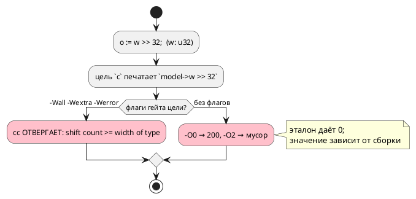

# Фича: Сдвиг на величину, не меньшую ширины типа, в цели c на 32- и 64-битных типах

- **Номер:** 0392
- **Статус:** ГОТОВО
- **Зависит от:** нет (проставлено на стадии анализа 2026-08-22)
- **Tier:** 2 — расставлен по признаку вреда (шкала — в блоке 1 `FEATURES.md`)
- **Класс:** генерация
- **Связанные issue (анализ):** кандидат блока 2 `FEATURES.md`, переведён в фичу пакетно 2026-08-22

## Стадии жизненного цикла (правило 17)

Все стадии — **разделы этой карточки** (правило 32): «Архитектура (ADR)»,
«Анализ», «Разработка», «Тест-план», «Отчёт о тестировании», «Итог».
Отдельным артефактом остаются только исправления —
[`docs/fixes/`](../fixes/README.md) (при необходимости `0392-YY-*`).

## Краткое описание

- **Сдвиг на величину, не меньшую ширины типа, в цели `c` на 32- и 64-битных
  типах.** Замер [сдвиг на величину не меньше ширины типа в цели `rust`](0334-rust-variable-shift-width.md)
  (2026-08-20): цель `c` права по построению на 8- и 16-битных типах (операнды
  продвигаются до `int`), а `u32 >> 32` стандарт объявляет **неопределённым**
  (C11 6.5.7p3). Прогон `clang -O2` дал `0`, то есть совпало с эталоном — но
  это свойство сборки, а не языка. Выражение с ветвлением удорожит **каждый**
  сдвиг ради случая, не наблюдавшегося ни разу; нужно решение заказчика о цене.

> Фича зарегистрирована из блока кандидатов `FEATURES.md` **без проработки**
> (решение заказчика 2026-08-22: «завести фичи из кандидатов без проработки»).
> Текст кандидата перенесён **дословно**, вместе с замером и его датой: замер
> есть свидетельство, а пересказ его теряет. Стадии 2 и 3 не пройдены —
> зависимости и объём **не оценивались**; далее фича проходит жизненный цикл по
> правилу 17.

## Документирование (правило 24)

**Не требуется.** Правило языка прежнее (0127: семантика переполнения и
сдвигов задана эталоном); фича приводит печать одной цели к уже принятому
поведению. Раздел `book/` о выражениях описывает сдвиги без обещаний о ширине —
правки не нужны.

<!-- При закрытии фичи (стадия 8, статус ГОТОВО) сюда добавляется раздел
     «## Итог (что сделано)» —
     ссылки на отчёт/исправления (правило 21). Незакрытые фичи «Итога» не имеют. -->

## Архитектура (ADR)

- **Status:** Accepted — исполнителю (решения заказчика **более не требует**)
- **Date:** 2026-08-22
- **Authors:** Архитектор + Аналитик
- **Related issues:** [Фича](0392-c-shift-width-wide.md);
  соседняя механика — [сдвиг на ширину типа в цели `rust`](0326-rust-shift-width.md#архитектура-adr) и
  [сдвиг на величину не меньше ширины типа в цели `rust`](0334-rust-variable-shift-width.md#архитектура-adr) (та же правка у цели `rust`)

### Context

`var w: u32 := 200;` и `o := w >> 32;`. Замер **переснят 2026-08-22** и
**опроверг запись кандидата**:

| Что | Прежняя запись (0334, 2026-08-20) | Пересъём 2026-08-22 |
|---|---|---|
| эталон | `0` | `0` |
| цель `c`, печать | `model->w >> 32` | то же |
| `cc -Wall -Wextra -Werror` | не проверялось | **Отвергает:** `error: shift count >= width of type [-Wshift-count-overflow]` |
| прогон `-O0` | — | **200** (сдвиг не выполнен) |
| прогон `-O2` | «дал `0`, совпало с эталоном» | **6155562384**, затем **4311320137** — мусор, **разный между тактами** |

То есть вывод цели `c`:

1. **не собирается** под флагами её собственного проверки (`-Werror`);
2. собранный без них — даёт значения, зависящие от уровня оптимизации и не
   совпадающие с эталоном ни в одном режиме.

Запись кандидата («прогон `clang -O2` дал `0` … нужно решение заказчика о
цене») **неверна**: ноль не воспроизводится, а решение о цене излишне — речь не
о цене, а о невалидном выводе. Проверка корпуса класс не видит, потому что сдвигов
в `examples/` нет ни одного (наблюдение 0334).

### Decision Drivers

1. **Вывод не собирается флагами собственного проверки** — это дефект, а не цена.
2. **Правило уже принято для цели `rust`** (0326/0334): сдвиг на величину, не
   меньшую ширины, **насыщается** — `0` для беззнакового и `>> (ширина − 1)`
   для знакового. Цель `c` обязана отвечать так же — иначе два потребителя
   расходятся на одном входе.
3. **Литеральная и переменная величина различаются по цене:** первая считается
   при компиляции, вторая требует ветвления в времени выполнения.
4. **Вывод корпуса не должен поехать** — сдвигов в `examples/` нет, значит
   правка снапшоты не задевает.

### Considered Options

#### Option A. Печатать насыщенное значение при литеральной величине

`w >> 32` при `u32` → `0`; знаковое `s >> 32` при `i32` → `s >> 31`.
Переменная величина остаётся как есть (граница называется).

**Pros:**
- совпадает с правилом цели `rust` (0326) — знание одно, ответы одинаковы;
- нулевая цена в времени выполнения: значение считает компилятор;
- снимает отказ `-Werror` (UB-выражения в выводе больше нет).

**Cons:**
- переменная величина (`w >> k`) остаётся UB у цели `c`, тогда как у `rust`
  она уже насыщается (0334) — расхождение сохраняется на этом входе.

#### Option B. Насыщать и переменную величину (полный аналог 0334)

`w >> k` → выражение с ветвлением (`k >= 32 ? 0 : w >> k`).

**Pros:** цели `c` и `rust` совпадают полностью.
**Cons:** ветвление печатается на **каждый** сдвиг переменной величины — цена в
прошивке; именно её кандидат и называл. Но теперь известно, что без правки код
вообще не собирается только для литерала, а для переменной величины `-Werror`
молчит.

#### Option C. Отвергать вход (`CC-…`)

**Cons:** эталон и `rust` вход исполняют — цель отказывалась бы на записи, у
которой есть определённое поведение у двух потребителей из трёх.

### Decision

Принимается **Option A** для литеральной величины (обязательная часть) и
**Option B как отдельная задача** для переменной — с замером цены на корпусе
перед включением.

Довод: литеральный случай ломает сборку под флагами проверки и даёт мусор — это
дефект, и он чинится бесплатно. Переменный случай сегодня собирается и молчит,
но расходится с целью `rust`; его цена (ветвление на каждый сдвиг) — предмет
отдельного решения, и мерить её надо на реальном выводе, а не рассуждением.

**Правило берётся у существующего носителя.** У цели `rust` оно живёт в
`generator/rust/rust_shift.rs`; цель `c` обязана дать тот же ответ, а не
собственный — иначе класс «две реализации одного правила» (0084/0193/0195).

### Consequences

#### Положительные

- Вывод цели `c` собирается флагами её проверки; значения совпадают с эталоном и
  целью `rust`.

#### Отрицательные / Action items

- Переменная величина остаётся расхождением с `rust` — **названная граница**,
  вынесенная в задачу (с замером цены).
- В корпусе класса нет, поэтому контроля обязаны быть фикстурными, с прогоном
  настоящего `cc` под флагами проверки.

#### Acceptance criteria

1. `o := w >> 32;` при `u32` даёт у эталона и цели `c` одно значение (`0`).
2. Порождённый C собирается под `-Wall -Wextra -Wno-unused-parameter -Werror`.
3. Знаковый случай (`i32`, `>> 32`) даёт `-1` при отрицательном значении — как
   у эталона и цели `rust`.
4. Контроль: сдвиг на законную величину печатается **без** изменений (вывод
   корпуса не меняется).
5. Мутация «вернуть прежнюю печать» роняет сборку контроля.
6. `./scripts/precheck.sh` зелёный.

## Анализ

### Цель и контекст

`w >> 32` при `w: u32` — неопределённое поведение по C11 6.5.7p3. Цель `c`
печатает его буквально; цель `rust` тот же вход насыщает (0326/0334).

### Замер (правило 30, переснят 2026-08-22) — **опроверг запись кандидата**

| Что | Прежняя запись | Пересъём |
|---|---|---|
| эталон | `0` | `0` |
| `cc` с флагами проверки | не проверялось | **Отвергает:** `shift count >= width of type [-Wshift-count-overflow]` |
| прогон `-O0` | — | `200` |
| прогон `-O2` | «`0`, совпало с эталоном» | `6155562384`, затем `4311320137` — **мусор, разный между тактами** |

Выводы:

- **решения заказчика о «цене» не требуется**: речь не о цене ветвления, а о
  выводе, который не собирается флагами собственного проверки;
- значение зависит от уровня оптимизации — то есть «совпало с эталоном» было
  случайностью конкретного прогона;
- проверка корпуса класс не видит: сдвигов в `examples/` нет ни одного.

### Зависимости фичи (правило 17/19)

- **Зависит от:** нет; опорные закрыты — [сдвиг на ширину типа в цели `rust`](0326-rust-shift-width.md),
  [сдвиг на величину не меньше ширины типа в цели `rust`](0334-rust-variable-shift-width.md) (правило у цели `rust`).
- **Влияние на порядок:** решения заказчика **не требует** (в отличие от того,
  что утверждала запись кандидата) — фича готова к разработке.

### Требования и проверяемые условия

- **R1.** Литеральная величина ≥ ширины: беззнаковое → `0`, знаковое →
  `>> (ширина − 1)`; значения совпадают с эталоном и целью `rust`.
- **R2.** Порождённый C собирается под флагами проверки (`-Wall -Wextra
  -Wno-unused-parameter -Werror`).
- **R3.** Правило берётся у существующего носителя цели `rust`, а не пишется
  заново (иначе две реализации одного правила).
- **R4.** Контроль: законная величина сдвига печатается без изменений — вывод
  корпуса не меняется.
- **R5.** Переменная величина — **названная граница**, с
  замером цены перед включением.

### Критерии приёмки и способ проверки

| # | Критерий | Способ проверки |
|---|---|---|
| A1 | R1 | потактовая сверка эталона с целью `c` (беззнаковый и знаковый входы) |
| A2 | R2 | сборка порождённого C флагами проверки прямо в тесте |
| A3 | R3 | чтение: вызов носителя, а не своя формула |
| A4 | R4 | `git diff --exit-code examples/generated/` |
| A5 | R5 | тест-граница: переменная величина печатается по-прежнему |
| A6 | Мутация | «вернуть прежнюю печать» роняет A2 |

### Объём работ

| Задача | Место | Оценка |
|---|---|---|
| 0392-01 (обязательная) | печатник сдвига цели `c` (`c_expr`) + носитель правила | малая |
| 0392-02 (отдельная) | переменная величина: ветвление; замер цены на выводе | средняя, требует замера |

### Редакторский слой (правило 29)

**Правки не требуются:** предмет — печать выражения у одной цели; лексика,
синтаксис, узлы АСД и диагностики не меняются.

### Особенности по обратной функциональности

Вывод цели `c` меняется **только** на входах со сдвигом ≥ ширины типа — то
есть там, где он сегодня не собирается флагами проверки. Прочие сдвиги
печатаются как прежде; вывод корпуса не меняется (сдвигов в `examples/` нет).

### Риски и зависимости

- **Ширина берётся у типа операнда**, а он в C продвигается до `int`: на 8- и
  16-битных типах цель права по построению (0334), и правка не должна их
  трогать — иначе изменится вывод там, где ничего не ломалось.
- **Корпус класс не покрывает** — контроля фикстурные, с прогоном настоящего
  `cc` под флагами проверки (иначе дефект выглядит предупреждением).

## Разработка

### Задача: общий носитель правила

`takt-lang/src/generator/shift_width.rs` — признак и значение насыщения:
`Saturation::{AsIs, Zero, SignOnly(W−1)}` плюс помощники (`width_of`,
`signed_of`, `type_of`, `literal`), вынесенные из `rust_shift`. Цель `rust`
теперь зовёт его же — правило одно на две цели.

**Порог принадлежит целевому языку, а не правилу.** В Rust сдвиг на ширину
типа — ошибка компиляции либо паника, поэтому порог там равен ширине типа
Takt. В C операнды **продвигаются** до `int` (C11 6.5.7p3), поэтому `u8 >> 8`
определено и совпадает с эталоном — UB начинается с ширины продвинутого типа,
и порог у цели `c` равен `max(32, W)`.

### Задача: печать у цели `c`

`c_expr/expr.rs::shift_saturated` — беззнаковый даёт `0`, знаковый
`(v >> (W − 1))` (там остаётся только знак, то есть −1 либо 0). Скобки
обязательны: сдвиг стоит в позиции операнда.

Печатник у цели `c` **один**: сдвига в `ConditionNode` не существует вовсе
(проверено грепом) — в отличие от классов, где правка одного
печатника чинила половину входов.

**Переменная величина остаётся прежней** — названная граница. У цели `rust`
она насыщается (0334), у `c` `cc -Werror` на неё молчит, а цена правки —
ветвление на **каждый** такой сдвиг. Вынесено кандидатом с требованием замера
цены.

### Задача: контроля

- `takt-lang/tests/targets/c_shift_width_tests.rs` — текст вывода плюс прогон
  **настоящего `cc`** флагами проверки цели; контролей три: законная величина,
  величина в пределах продвинутого типа (`u8 >> 8`), переменная величина.
- `takt-sim/tests/conformance/conformance_c_shift_width_tests.rs` — сверка
  **значений** эталона с целью `c` (беззнаковый `0`, знаковый `−1`,
  контрольный `0`), харнесс собирается теми же флагами.

## Тест-план

| № | Условие | Ожидаемый результат |
|---|---|---|
| T1 | `o := w >> 32;` при `u32` | `0` у эталона и цели `c` |
| T2 | Порождённый C под флагами проверки | собирается |
| T3 | Знаковый `s >> 32` при `i32 := -8` | `−1` |
| T4 | Контроль: `w >> 3` | печать не изменилась |
| T5 | Контроль порога: `u8 >> 8` | печать не изменилась (в C определено) |
| T6 | Переменная величина | печать не изменилась — граница названа |
| T7 | Вывод корпуса | не изменился |
| T8 | Правило цели `rust` | не изменилось |
| T9 | Предкоммит | зелёный |

## Отчёт о тестировании

**Окружение:** macOS (darwin 25.5.0), toolchain `1.97.1`, полный
`./scripts/precheck.sh`.

### Сверка с тест-планом

| № | Результат |
|---|---|
| T1 | `probe.sh`: все восемь целей `OK`, `cc` принял |
| T2 | `generated_c_compiles_under_gate_flags` |
| T3 | `(model->s >> 31)`, значение `−1` совпало с эталоном |
| T4 | `ordinary_shift_is_unchanged` |
| T5 | `shift_within_promoted_width_is_left_alone` |
| T6 | `variable_shift_amount_is_left_alone` |
| T7 | `git diff --name-only examples/generated/` — пусто |
| T8 | наборы 0326/0334 зелены после переезда на общий носитель |
| T9 | |

### Примеры и контрпримеры (правило 16)

- **Пример:** `o := w >> 32;` при `u32` — `0` у эталона и всех целей.
- **Контрпример 1:** `w >> 3` — печать прежняя (иначе правка читалась бы как
  «сдвиги переписываются всегда»).
- **Контрпример 2:** `u8 >> 8` — в C определено продвижением до `int`, печать
  прежняя; это отличие цели `c` от `rust`, где та же запись насыщается.
- **Контрпример 3:** `u64 << 64` — эталон отвечает `SIM-002` и останавливает
  прогон; у записи нет верного значения вовсе (разделение обязанностей 0333),
  и в фикстуру сверки она не входит.

### Мутационная проверка контрольных тестов

| Мутация | Результат |
|---|---|
| вернуть прежнюю печать | краснеют оба контроля (сверка и текст) |
| знаковый случай печатать нулём | краснеет сверка значений и один текстовый |

Вторая мутация даёт **валидный** C с неверным значением — её ловит только
сверка значений.

### Редакторский слой (правило 29)

**Не требуется:** меняется печать цели, язык не затронут.

### Дефекты

Не найдено.

### Вердикт

**Готово.** Вывод цели `c` собирается флагами её проверки, значения совпадают с
эталоном и целью `rust`; вывод корпуса не изменился.

## Итог (что сделано)

Цель `c` перестала печатать сдвиг, который её собственный проверка отвергает.
Правило вынесено в общий носитель `generator/shift_width.rs` — тот же, каким
теперь живёт цель `rust`: признак и значение насыщения одни, **порог**
принадлежит целевому языку (у Rust — ширина типа, у C — ширина продвинутого
типа, `max(32, W)`).

Именно из-за порога вывод корпуса не изменился ни на байт: сдвигов такой
величины в `examples/` нет ни одного, а `u8 >> 8` в C определено и считается
верно.

**Переменная величина у цели `c` остаётся прежней** — названная граница:
`cc -Werror` на неё молчит, а цена правки (ветвление на каждый такой сдвиг)
требует замера на реальном выводе. Вынесено кандидатом.

Детали — в разделах «Архитектура (ADR)», «Разработка» и «Отчёт о
тестировании» этой карточки.

