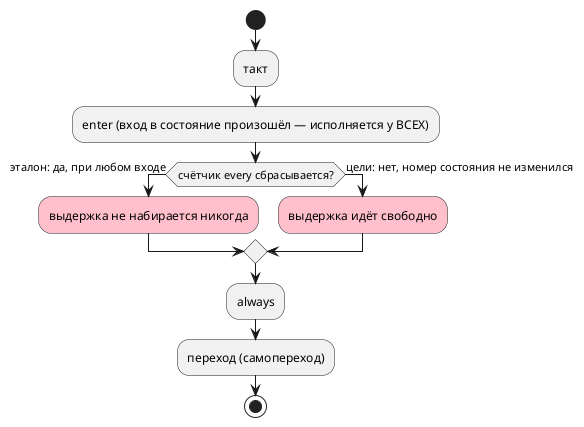

# Фича: every при самопереходе: эталон сбрасывает счётчик, восемь целей — нет

- **Номер:** 0393
- **Статус:** ГОТОВО
- **Зависит от:** нет (проставлено на стадии анализа 2026-08-22)
- **Tier:** 1 — расставлен по признаку вреда (шкала — в блоке 1 `FEATURES.md`)
- **Класс:** генерация
- **Связанные issue (анализ):** кандидат блока 2 `FEATURES.md`, переведён в фичу пакетно 2026-08-22

## Стадии жизненного цикла

Все стадии — **разделы этой карточки**: «Архитектура (ADR)»,
«Анализ», «Разработка», «Тест-план», «Отчёт о тестировании», «Итог».
Отдельным артефактом остаются только исправления —
[`docs/fixes/`](../fixes/README.md) (при необходимости `0393-YY-*`).

## Краткое описание

- **`every` при самопереходе: эталон сбрасывает счётчик, восемь целей — нет.**
  Замер-20 (проба; вход — состояние с `every 3ms` и самопереходом
  `ref Run: i < 100`, который срабатывает каждый такт):

  | Потребитель | `ticks` по тактам 1…8 |
  |---|---|
  | эталон | `0 0 0 0 0 0 0 0` — тело `every` не срабатывает **никогда** |
  | `c` (прогон харнесса) | `0 0 0 1 1 1 2 2` — срабатывает |
  | `rust`, `sv`, `sv-mmio` | то же условие `state != prev_state`, то есть как `c` |
  | `st`, `st-at` | самосбрасывающийся `TON` — идёт свободно, входа не знает |

  **Внутри целей противоречие:** `enter` при самопереходе **исполняется**
  (проверено на цели `c`: `entered` растёт каждый такт, как и у эталона), то
  есть вход в состояние происходит, — а счётчик `every` при этом не
  сбрасывается. Документ (`book/`, раздел «Периодическое действие») обещает
  отсчёт **«с входа»** и **потактовое совпадение** целей с симулятором.
  Выбор не механический: привести цели к эталону (сброс при любом
  сработавшем переходе, включая самопереход) либо признать правыми цели и
  изменить эталон **и** документ — это решение заказчика.
  Цена первой правки: признак «переход сработал» вместо сравнения номеров
  состояний — около шести мест печати в цели `c` и по одному в `rust`, `sv`,
  `st` (там ещё и перевзвод `TON`). В корпусе `every` не встречается ни разу,
  поэтому класс не покрыт ничем.

> Фича зарегистрирована из блока кандидатов `FEATURES.md` **без проработки**
> (решение заказчика 2026-08-22: «завести фичи из кандидатов без проработки»).
> Текст кандидата перенесён **дословно**, вместе с замером и его датой: замер
> есть свидетельство, а пересказ его теряет. Стадии 2 и 3 не пройдены —
> зависимости и объём **не оценивались**; далее фича проходит жизненный цикл по
> своду.

## Документирование

**Требуется при любом выборе.** Раздел `book/` «Периодическое действие»
сегодня обещает отсчёт «с входа» и потактовое совпадение целей с эталоном — ни
то, ни другое не выполняется. Правило сброса счётчика обязано быть названо
словами, а если принято Option A — ещё и разница между «входом» для
`enter`/`exit` (любое срабатывание перехода) и для `every` (смена состояния).

<!-- При закрытии фичи (стадия 8, статус ГОТОВО) сюда добавляется раздел
     «## Итог (что сделано)» —
     ссылки на отчёт/исправления. Незакрытые фичи «Итога» не имеют. -->

## Архитектура (ADR)

- **Status:** Proposed — **решение о правиле языка принимает заказчик**
- **Date:** 2026-08-22
- **Authors:** Архитектор + Аналитик
- **Related issues:** [Фича](0393-every-on-self-transition.md);
  механика времени — [модель времени в языке: литерал длительности и частота такта](0134-language-time-model.md#архитектура-adr), вход в стартовое состояние —
  [согласование тактов симулятора и порождённого C (INIT-такты)](0033-init-tick-alignment.md#архитектура-adr)

### Context

Состояние с `every 3ms` и самопереходом `ref Run: i < 100`, срабатывающим
каждый такт (`clock 1kHz`). Замер **переснят 2026-08-22** прогоном эталона и
харнесса цели `c`:

| Такт | 1 | 2 | 3 | 4 | 5 | 6 | 7 | 8 |
|---|---|---|---|---|---|---|---|---|
| эталон, `ticks` | 0 | 0 | 0 | 0 | 0 | 0 | 0 | 0 |
| цель `c`, `ticks` | 0 | 0 | 0 | 0 | **1** | 1 | 1 | **2** |
| эталон, `entered` (порт) | 1 | 2 | 3 | 4 | 5 | 6 | 7 | 8 |
| цель `c`, `entered` | 1 | 2 | 3 | 4 | 5 | 6 | 7 | 8 |

Прочитанное:

- **тело `every` у эталона не срабатывает никогда** — самопереход сбрасывает
  счётчик каждый такт, и выдержка 3 мс не набирается;
- **у цели `c` оно срабатывает** — признак «вход в состояние» там
  `state != prev_state`, а при самопереходе номер состояния не меняется;
- **`enter` исполняется у обоих одинаково** (`entered` совпадает такт в такт) —
  то есть вход в состояние происходит, и цели это признают.

**Уточнение к записи кандидата.** Там сказано, что `enter` «исполняется … как
и у эталона» — пересъём это подтверждает **по портам**; расхождение видно
только в счётчике `every`. (Значения переменных в трассе эталона снимаются
позже портов, поэтому `vars:entered` там на единицу больше — это свойство
печати, а не поведения.)

**Внутри целей противоречие:** вход в состояние происходит (`enter`
исполняется), а счётчик `every` при этом не сбрасывается.

### Decision Drivers

1. **Документ обещает отсчёт «с входа»** и потактовое совпадение целей с
   эталоном (`book/`, раздел «Периодическое действие») — сегодня не выполняется
   ни то, ни другое.
2. **Ответы обоих сторон внутренне непоследовательны:** эталон признаёт вход
   (исполняет `enter`) и сбрасывает счётчик — значит `every` при самопереходе
   бесполезен всегда; цели признают вход `enter`-ом, но не сбрасывают счётчик.
3. **Класс не покрыт ничем:** `every` в корпусе не встречается ни разу, поэтому
   ни проверка, ни сверки его не видят.
4. **Цена правки несимметрична** (см. Options).

### Considered Options

#### Option A. Правы цели: `every` отсчитывает свободно, самопереход его не сбрасывает

Эталон приводится к целям; документ уточняется («счётчик сбрасывается при
входе в **другое** состояние»).

**Pros:**
- правится **один** потребитель (эталон) плюс документ;
- `every` при самопереходе остаётся полезным: периодическое действие в
  состоянии, которое «крутится» на себе, — типичный сценарий (опрос датчика).

**Cons:**
- `enter` и `every` начинают понимать «вход» **по-разному** у всех
  потребителей: первый исполняется при самопереходе, второй его игнорирует.
  Это надо назвать словами в документе, иначе противоречие остаётся.

#### Option B. Прав эталон: любой сработавший переход сбрасывает счётчик

Цели приводятся к эталону: признак «переход сработал» вместо сравнения номеров
состояний.

**Pros:**
- `enter` и `every` понимают «вход» одинаково — правило одно;
- документ («отсчёт с входа») исполняется буквально.

**Cons:**
- правятся **четыре** цели: около шести мест печати у `c`, по одному у `rust`,
  `sv`, `st` (там ещё и перевзвод `TON`);
- `every` при самопереходе становится **мёртвой конструкцией**: тело не
  срабатывает никогда — то есть язык допускает запись, у которой поведения нет.
  Тогда честнее диагностировать её (предупреждение), а это ещё работа.

#### Option C. Правы цели, а самопереход перестаёт исполнять `enter`/`exit`

Согласовать в другую сторону: самопереход не считается входом вовсе.

**Pros:** одно понятие «вход» — смена состояния.
**Cons:** ломает `enter` при самопереходе у всех потребителей — а это
наблюдаемое поведение, на которое модели опираются (перезапуск действия при
повторном срабатывании условия).

### Decision

**Решение заказчика 2026-08-23: Option A** — правы цели. Аналитик предлагал его же с
обязательным уточнением документа: «вход» для `enter`/`exit` — любое
срабатывание перехода в это состояние, для `every` — смена состояния.

Довод: Option B делает `every` при самопереходе конструкцией без поведения (её
тело не исполнится никогда) и правит четыре цели ради того, чтобы узаконить
бесполезный случай; Option A правит одного потребителя и сохраняет полезный
сценарий, но требует **назвать** разницу в документе — сегодня она не описана и
именно поэтому воспринимается как дефект.

### Consequences

#### Положительные (Option A)

- Один потребитель правится, поведение целей не меняется (значит снапшоты и
  проверки целей не задеты).
- `every` в «крутящемся» состоянии работает — сценарий опроса сохраняется.

#### Отрицательные / Action items

- Документ обязан назвать разницу между «входом» для `enter` и для `every`.
- Нужна потактовая сверка на `every` **с самопереходом** — сегодня класс не
  покрыт ничем (в корпусе `every` нет).
- При Option B — правка четырёх целей и, вероятно, предупреждение о мёртвом
  `every`.

#### Acceptance criteria

1. Потактовая сверка эталона со всеми целями на модели с `every` **и**
   самопереходом даёт одну трассу.
2. Контроль: `every` в состоянии **без** самоперехода работает как прежде
   (проверяется той же сверкой вторым входом).
3. Раздел `book/` «Периодическое действие» называет правило сброса счётчика.
4. Мутация «вернуть прежнее поведение» роняет сверку.
5. `./scripts/precheck.sh` зелёный; вывод корпуса не изменился.

## Анализ

### Цель и контекст

`every` в состоянии с самопереходом: эталон не исполняет тело **никогда**,
восемь целей исполняют. Документ обещает отсчёт «с входа» и потактовое
совпадение — не выполняется ни то, ни другое.

### Замер (переснят 2026-08-22)

Вход: `clock 1kHz`, состояние с `enter`, `every 3ms`, `always` и самопереходом
`ref Run: i < 100`. Прогон эталона и харнесса цели `c` (сборка `cc`):

| Такт | 1 | 2 | 3 | 4 | 5 | 6 | 7 | 8 |
|---|---|---|---|---|---|---|---|---|
| эталон, `ticks` | 0 | 0 | 0 | 0 | 0 | 0 | 0 | 0 |
| `c`, `ticks` | 0 | 0 | 0 | 0 | 1 | 1 | 1 | 2 |
| эталон/`c`, `entered` | 1…8 | | | | | | | одинаково |

Уточнения к записи кандидата:

- **`enter` совпадает такт в такт** — вход в состояние признают все;
- расхождение видно **только** в счётчике `every`;
- значения переменных в трассе эталона снимаются позже портов, поэтому
  `vars:entered` там на единицу больше — свойство печати, а не поведения (при
  сверке наблюдать надо **порты**).

### Зависимости фичи

- **Зависит от:** нет; опорные закрыты — [модель времени в языке: литерал длительности и частота такта](0134-language-time-model.md)
  (механика времени, `every`), [согласование тактов симулятора и порождённого C (INIT-такты)](0033-init-tick-alignment.md)
  (вход в стартовое состояние).
- **Влияние на порядок:** ждёт **решения заказчика**; при Option A работа мала
  (эталон + документ + сверка), при Option B — четыре цели.

### Требования и проверяемые условия

- **R1.** Потактовая сверка эталона со всеми целями на `every` **с
  самопереходом** даёт одну трассу.
- **R2.** Контроль: `every` **без** самоперехода работает как прежде.
- **R3.** Правило сброса счётчика записано в `book/` (раздел «Периодическое
  действие»); разница между «входом» для `enter` и для `every` названа словами.
- **R4 (Option B).** `every`, тело которого не может сработать никогда,
  диагностируется — иначе язык допускает запись без поведения.
- **R5.** Вывод корпуса не изменился (в `examples/` `every` не встречается).

### Критерии приёмки и способ проверки

| # | Критерий | Способ проверки |
|---|---|---|
| A1 | R1 | новая потактовая сверка (эталон ↔ `c`, плюс `rust`/`sv`/`st` через их сверки) |
| A2 | R2 | второй вход той же фикстуры |
| A3 | R3 | раздел `book/` + проверка примеров документа |
| A4 | R4 | семантический тест (только при Option B) |
| A5 | R5 | `git diff --exit-code examples/generated/` |
| A6 | Мутация | «вернуть прежнее поведение» роняет A1 |

### Объём работ

| Вариант | Что правится | Оценка |
|---|---|---|
| **A** (правы цели) | эталон: `unit/` — сброс счётчика только при смене состояния; документ; сверка | **1 потребитель + документ** |
| **B** (прав эталон) | `c` (≈6 мест печати), `rust`, `sv`, `st` (перевзвод `TON`); документ; вероятно предупреждение о мёртвом `every` | **4 цели** |
| **C** (самопереход не вход) | `enter`/`exit` у всех потребителей — ломает наблюдаемое поведение | не предлагается |

### Редакторский слой

**Правки не требуются:** ни лексика, ни синтаксис, ни узлы АСД не меняются —
предмет в семантике времени и печати целей. При Option B появляется
предупреждение; оно доедет до редактора общей точкой `collect_model_warnings`
(0081/0232), правок слоя не требуя, но описание кода в приложении `book/`
обязано появиться.

### Особенности по обратной функциональности

Любой выбор меняет **наблюдаемое поведение** на входе, где `every` соседствует
с самопереходом: у Option A — у эталона (симуляция начнёт срабатывать), у
Option B — у восьми целей (прошивка перестанет). Версия языка не поднимается
(синтаксис прежний), но правило обязано быть записано в документ — сегодня оно
там обещано в третьей форме, не совпадающей ни с одной реализацией.

### Риски и зависимости

- **Класс не покрыт ничем:** `every` в корпусе не встречается — контроля
  обязаны быть фикстурными, и без них любая правка проверяется только глазами.
- **Наблюдать надо порты, а не переменные:** трасса эталона снимает переменные
  позже, и сверка по `vars` дала бы ложное расхождение на единицу.
- **`st` перевзводит `TON`:** там сброс счётчика — не присваивание, а
  перезапуск таймера; при Option B это отдельная проба.

## Уточнение замера (2026-08-23)

**Класс шире, чем описывала карточка: расходился не только `every`, но и
`after`.** Оба завязаны на «время с входа в состояние», и оба сбрасывались
эталоном при самопереходе:

| Запись | эталон (до) | цель `c` |
|---|---|---|
| `every 3ms` при самопереходе | тело не срабатывало **никогда** | `0 0 0 1 1 1 2 2` |
| `ref Done: after 3ms;` при самопереходе | в `Done` **не уходил** | уходил на 4-м такте (прогон харнесса) |

Из этого следует и объём: правка **одна** — признак входа в
`unit/tick.rs` — и она чинит оба следствия.

## Разработка

### Задача: признак входа — смена состояния

`takt-sim/src/unit/tick.rs`, шаг 6: `mark_state_entry` вызывается, только если
имя состояния изменилось. Ровно то же, что `state != prev_state` в порождённом
C.

`enter`/`exit` при самопереходе исполняются **по-прежнему**: это разные
вопросы, и разница названа в документе (`book/src/12-time/`).

### Задача: документ

Раздел «Время»: «вход» для отсчёта — смена состояния; самопереход отсчёт не
сбрасывает; `enter`/`exit` при самопереходе исполняются. Без этих слов
противоречие оставалось бы (довод Cons варианта A).

### Задача: сверка

`takt-sim/tests/conformance/conformance_self_transition_time_tests.rs` —
трасса эталона и цели `c` на фикстуре, наблюдающей **оба** следствия сразу:
счётчик `every` и такт перехода по выдержке.

Время в тесте ведёт **прогон** (`set_time_ns`), как в сверке 0134-09:
объявление `clock` задаёт период, но часы двигает вызывающий.

## Тест-план

| № | Условие | Ожидаемый результат |
|---|---|---|
| T1 | `every 3ms` при самопереходе, 1 кГц | `0 0 0 1 1 1 2 2` у эталона и цели `c` |
| T2 | `after 5ms` при самопереходе | переход на 6-м такте у обоих |
| T3 | Контроль: то же без самоперехода | поведение не изменилось |
| T4 | Сверки `every` (0134-09) | зелены |
| T5 | Вывод корпуса | не изменился |
| T6 | Документ | правило записано |
| T7 | Предкоммит | зелёный |

## Отчёт о тестировании

**Окружение:** macOS (darwin 25.5.0), toolchain `1.97.1`, полный
`./scripts/precheck.sh`.

| № | Результат |
|---|---|
| T1 | `self_transition_keeps_the_dwell`; прогон CLI и харнесса совпали |
| T2 | там же (`done` на 6-м такте) |
| T3 | прогон модели без самоперехода дал прежнюю трассу |
| T4 | `cargo test --test conformance every` — 6 из 6 |
| T5 | снапшоты не изменились |
| T6 | `book/src/12-time/`, сборка зелёная |
| T7 | |

### Примеры и контрпримеры

- **Пример:** состояние с `every 3ms` и самопереходом — тело срабатывает
  периодически, как в прошивке.
- **Контрпример 1:** то же без самоперехода — трасса не изменилась.
- **Контрпример 2:** `enter` при самопереходе по-прежнему исполняется (это
  наблюдалось замером и осталось верным).

### Мутационная проверка

| Мутация | Результат |
|---|---|
| сбрасывать отсчёт при любом переходе (прежнее поведение) | сверка краснеет |

### Редакторский слой

**Не требуется:** ни лексика, ни синтаксис не менялись.

### Дефекты

Не найдено. **Замер уточнён**: класс охватывал и `after` (см. одноимённый
раздел).

### Вердикт

**Готово.**

## Итог (что сделано)

Самопереход больше не сбрасывает отсчёт времени в состоянии: признак «вход» у
эталона стал тем же, что в порождённом C, — **смена состояния**. Решение
заказчика 2026-08-23 (правы цели).

**Замер показал, что класс шире карточки:** расходился не только `every`
(тело у эталона не срабатывало никогда), но и `after` (эталон не уходил в
`Done`, цель `c` уходила на 4-м такте). Правка одна, и она чинит оба.

`enter`/`exit` при самопереходе исполняются по-прежнему — «вход» для них и
для отсчёта времени понимается по-разному, и это **названо словами** в
`book/src/12-time/`: без них противоречие осталось бы.

Детали — в разделах «Уточнение замера», «Разработка» и «Отчёт о тестировании».

