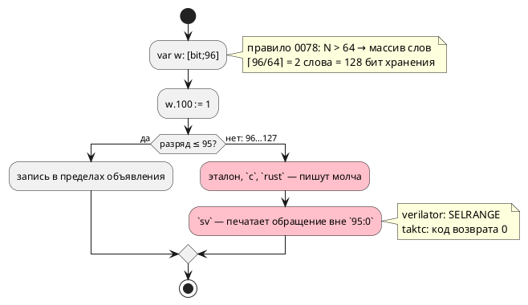

# Фича: Разряд за объявленной шириной бит-вектора принимают молча

- **Номер:** 0394
- **Статус:** ГОТОВО
- **Зависит от:** нет (проставлено на стадии анализа 2026-08-22)
- **Tier:** 2 — расставлен по признаку вреда (шкала — в блоке 1 `FEATURES.md`)
- **Класс:** семантика
- **Связанные issue (анализ):** кандидат блока 2 `FEATURES.md`, переведён в фичу пакетно 2026-08-22

## Стадии жизненного цикла

Все стадии — **разделы этой карточки**: «Архитектура (ADR)»,
«Анализ», «Разработка», «Тест-план», «Отчёт о тестировании», «Итог».
Отдельным артефактом остаются только исправления —
[`docs/fixes/`](../fixes/README.md) (при необходимости `0394-YY-*`).

## Краткое описание

- **Разряд за объявленной шириной бит-вектора принимают молча.** Замер
  [текст `SIM-011` называет ширину значения](0307-sim-bit-range-text.md) (2026-08-20): у
  `var w: [bit;96]` значение занимает **два слова**, и разряд 100 (за
  объявленной шириной, но внутри слова) записывают эталон, `c`, `c-hal`,
  `rust`, `sv` и `sv-mmio`; отказывает только `st` — и то потому, что широких
  векторов не переводит вовсе. Согласие полное, но объявлению оно противоречит:
  автор просил 96 разрядов, а получил 128. Это **поведение**, а не текст:
  правка затрагивает пятерых потребителей и обязана начаться с решения
  заказчика — округлять объявление до слова (как сейчас) или отвергать разряд
  за объявленной шириной.

> Фича зарегистрирована из блока кандидатов `FEATURES.md` **без проработки**
> (решение заказчика 2026-08-22: «завести фичи из кандидатов без проработки»).
> Текст кандидата перенесён **дословно**, вместе с замером и его датой: замер
> есть свидетельство, а пересказ его теряет. Стадии 2 и 3 не пройдены —
> зависимости и объём **не оценивались**; далее фича проходит жизненный цикл по
> своду.

## Документирование

**Требуется при любом принятом варианте.** Затронут раздел `book/` «Типы»
(блок про `[bit;N]`): сегодня документ молчит о том, что значит разряд между
объявленной шириной и границей слова. Вариант A заводит диагностику — её
описание идёт в приложение «Ошибки и предупреждения», а граница
переменного индекса называется в самом разделе.

<!-- При закрытии фичи (стадия 8, статус ГОТОВО) сюда добавляется раздел
     «## Итог (что сделано)» —
     ссылки на отчёт/исправления. Незакрытые фичи «Итога» не имеют. -->

## Архитектура (ADR)

- **Status:** Proposed — **решение о правиле языка принимает заказчик**
- **Date:** 2026-08-22
- **Authors:** Архитектор + Аналитик
- **Related issues:** [Фича](0394-bit-beyond-declared-width.md);
  замер вырос из [текст `SIM-011` называет ширину значения](0307-sim-bit-range-text.md#архитектура-adr), раскладка — [семантика `[bit;N]` расходится втрое](0078-bit-array-semantics.md#архитектура-adr)

### Context

`var w: [bit;96];` — значение по правилу занимает **два слова** (128 бит),
хотя объявлено 96 разрядов. Запись `w.100 := 1;` попадает во второе слово, но
за объявленную ширину.

Замер **переснят 2026-08-22** — и он **не совпал** с записью кандидата:

| Потребитель | Прежняя запись (0307, 2026-08-20) | Пересъём 2026-08-22 |
|---|---|---|
| эталон | пишет | пишет (`w = [0, 68719476736]`) |
| `c`, `c-hal` | пишут | пишут, `cc` принял |
| `rust` | пишет | пишет, `rustc` + `clippy` приняли |
| **`sv`, `sv-mmio`** | «пишут» | **`verilator` ОТВЕРГ:** `SELRANGE: Selection index out of range: 100:100 outside 95:0` |
| `st`, `st-at` | отказ | `ST-011` (широких векторов не переводит) |

**Класс острее, чем считалось.** Цель `sv` печатает регистр шириной по
**объявлению** (`95:0`) и обращается к разряду 100 — вывод невалиден, а
`taktc` возвращает **ноль**. То есть это не только расхождение с объявлением,
но и молчаливо неверный вывод у двух целей.

Прежняя запись утверждала «согласие полное» — пересъём его опроверг. Ровно
поэтому свод требует снимать замер заново, а не наследовать.

### Decision Drivers

1. **Невалидный вывод при нулевом коде возврата** — у целей `sv`/`sv-mmio`
   (найдено пересъёмом).
2. **Объявление обязано что-то значить.** Автор просил 96 разрядов; сегодня
   получает 128 у одних потребителей и отказ инструмента у других.
3. **Раскладка по словам — свойство представления** (0078), а не языка: она
   выбрана ради C и Rust, где нет `uint96_t`. Правило языка о **ширине**
   принадлежит объявлению.
4. **Диагностика уже почти есть:** `SIM-011` называет разрядность **значения**
   (0307), а не объявления — там же названо, что обещание отказа «по
   объявленной ширине» было бы второй ложью.

### Considered Options

#### Option A. Отвергать разряд за объявленной шириной (семантика, `SE-…`)

Новая проверка: индекс разряда сверяется с **объявленной** шириной, а не с
разрядностью представления.

**Pros:**
- объявление начинает значить ровно то, что написано;
- невалидный вывод у `sv` исчезает вместе с входом;
- проверка **одна на всех** — в семантике, то есть потребителям не по чему
  расходиться;
- у литерального индекса проверка статическая и дешёвая.

**Cons:**
- **переменный индекс** статически не проверить: `w.k` при `k: u8` останется
  на совести исполнения (эталон отвечает `SIM-011` в такте, цели — нет);
- ломающее изменение для моделей, полагавшихся на «хвост» слова: подъём
  минорной версии языка (в корпусе таких записей нет).

#### Option B. Округлять объявление до слова (узаконить нынешнее)

`[bit;96]` официально значит 128 разрядов; правило записывается в документ.

**Pros:**
- поведение эталона, `c` и `rust` не меняется;
- правится только документ и цель `sv` (регистр шириной по **раскладке**, а не
  по объявлению).

**Cons:**
- объявление перестаёт быть контрактом: `[bit;96]` и `[bit;128]` — одно и то
  же, а `[bit;65]` тихо становится `[bit;128]`;
- цель `st` останется отказывать (широких векторов не переводит) — согласия
  всё равно не будет;
- «лишние» разряды не существуют ни в одной другой цели генерации: у `sv` они
  синтезируются в реальные триггеры, то есть площадь кристалла растёт молча.

#### Option C. Отвергать только у цели `sv`, прочим оставить как есть

**Cons:** это фиксация расхождения в коде: один и тот же вход законен у одних
целей и незаконен у других — ровно тот класс, ради которого заведены сверки.
Отвергается.

### Decision

**Решение заказчика 2026-08-23: Option A.** Аналитик предлагал его же: объявленная ширина
— контракт, и разряд за ней есть ошибка (диагностика в семантике, литеральный
индекс — статически). Довод: сегодня один вход даёт три разных исхода (молчит,
отвергается чужим инструментом, отвергается целью), а раскладка по словам —
деталь представления, о которой автор не обязан знать.

Переменный индекс остаётся за исполнением — это **названная граница**, а не
пропуск: `SIM-011` эталона её уже покрывает, а цели проверок в времени выполнения не
ставят (правило «не платить за то, чего автор не просил»).

### Consequences

#### Положительные (Option A)

- Объявление значит написанное; невалидный вывод у `sv` исчезает.
- Проверка одна и в семантике — расходиться потребителям не по чему.

#### Отрицательные / Action items

- Подъём минорной версии языка — вход, сегодня принимаемый,
  станет ошибкой.
- Документ (`book/`, раздел «Типы», блок про `[bit;N]`) обязан назвать правило
  и границу переменного индекса.
- Проверить, не опирается ли на «хвост» слова цель `sv-mmio` (регистровый
  файл) — там ширина регистра берётся из типа.

#### Acceptance criteria

1. `w.100 := 1;` при `var w: [bit;96];` отвергается семантикой с названной
   причиной и координатой.
2. Контроль: `w.95 := 1;` принимается всеми девятью потребителями.
3. Вывод целей на контрольном входе принимают их инструменты (включая
   `verilator -Wall`).
4. Документ называет правило; версия языка поднята, коммит помечен тегом.
5. `./scripts/precheck.sh` зелёный; вывод корпуса не изменился.

## Анализ

### Цель и контекст

`[bit;N]` при `N > 64` хранится массивом слов, и разряд между
`N` и `⌈N/64⌉·64` существует в представлении, но не в объявлении. Фича решает,
что означает обращение к нему.

### Замер (переснят 2026-08-22)

Вход: `var w: [bit;96];`, `w.100 := 1;`.

| Потребитель | Ответ | Инструмент цели |
|---|---|---|
| эталон | пишет: `w = [0, 68719476736]` | — |
| `c`, `c-hal` | пишет | `cc -Wall -Wextra -Werror` принял |
| `rust` | пишет | `rustc` + `clippy -D warnings` приняли |
| **`sv`, `sv-mmio`** | печатает `p0394_w_next[100] = 1;` при регистре `95:0` | **`verilator` ОТВЕРГ: `SELRANGE`** |
| `st`, `st-at` | `ST-011` | вывода нет |

**Пересъём опроверг прежнюю запись.** Кандидат (со слов 0307, 2026-08-20)
утверждал: «записывают эталон, `c`, `c-hal`, `rust`, `sv` и `sv-mmio`;
отказывает только `st`… согласие полное». На деле у `sv` вывод **невалиден**
при нулевом коде возврата `taktc` — то есть класс не «молчаливое согласие
вопреки объявлению», а «три разных исхода на одном входе».

Контроль: `w.95 := 1;` (последний законный разряд) принимают все, включая
`verilator`.

### Зависимости фичи

- **Зависит от:** нет. Опорные закрыты: [семантика `[bit;N]` расходится втрое](0078-bit-array-semantics.md)
  (раскладка), [текст `SIM-011` называет ширину значения](0307-sim-bit-range-text.md) (текст `SIM-011`),
  [[bit; N > 64] не переводят цели c и rust](0262-wide-bit-vector-c-rust.md) (широкий вектор у `c`/`rust`).
- **Влияние на порядок:** фича ждёт **решения заказчика** (правило языка);
  Option A поднимает минорную версию языка, то есть её удобно брать в один
  цикл с другими языковыми фичами (версия накапливается).

### Требования и проверяемые условия

- **R1.** Обращение к разряду за объявленной шириной **при литеральном
  индексе** судится одинаково у всех потребителей (Option A — отказ семантики).
- **R2.** Контрольный вход (последний законный разряд) принимается всеми, и
  инструменты целей вывод принимают.
- **R3.** Вывод цели `sv` перестаёт содержать обращение вне диапазона регистра.
- **R4.** Переменный индекс — **названная граница**: остаётся за исполнением
  (`SIM-011` у эталона), цели проверок в времени выполнения не ставят.
- **R5.** Правило записано в документе (`book/`, раздел «Типы», блок `[bit;N]`).
- **R6.** Версия языка поднята (Option A — ломающее изменение).

### Критерии приёмки и способ проверки

| # | Критерий | Способ проверки |
|---|---|---|
| A1 | R1 | семантический тест: отказ с координатой и названной причиной |
| A2 | R2 | `scripts/probe.sh` на контрольном входе (все восемь целей + инструменты) |
| A3 | R3 | греп по порождённому SV: индексов вне `N-1:0` нет |
| A4 | R4 | тест-граница: переменный индекс принимается семантикой |
| A5 | R5 | проверка лексики/примеров документа |
| A6 | R6 | `scripts/check-language-version.sh`, тег |

### Объём работ (Option A)

| Место | Что делается |
|---|---|
| `semantic/validate/` | проверка индекса разряда против **объявленной** ширины (сегодня её нет ни у кого) |
| реестр диагностик | новый код + описание (проверка требует смысла) |
| `book/` | правило и граница переменного индекса |
| фикстуры | вход-нарушитель, контроль (последний законный разряд), переменный индекс |

Правка **не** касается печатников целей: вход отсекается до генерации. Это и
есть довод за Option A — потребителям не по чему расходиться.

### Редакторский слой

**Правки не требуются:** новых токенов, ключевых слов и форм объявления нет.
Новая диагностика доедет до редактора общей точкой
`collect_compile_diagnostics` (0130/0232) — правок слоя это не требует, но
описание кода в приложении `book/` обязано появиться.

### Особенности по обратной функциональности

**Option A ломает** вход, который сегодня принимается тремя потребителями из
девяти, — подъём минорной версии языка. В корпусе таких записей
нет; у пользователей они возможны, но опирались бы на деталь представления
(раскладку по словам), о которой документ не говорит.

**Option B** (узаконить округление) обратно совместим, но делает объявление
необязательным: `[bit;65]` тихо станет `[bit;128]`, а у цели `sv` лишние
разряды синтезируются в реальные триггеры.

### Риски и зависимости

- **Переменный индекс** остаётся непроверяемым статически — граница названа.
- **`sv-mmio`** берёт ширину регистра из типа: при Option A вход отсекается
  раньше, при Option B — ширина обязана считаться по раскладке, иначе
  `SELRANGE` останется.
- **Корпус класс не покрывает** — широких векторов в `examples/` нет ни одного
  (наблюдение 0262), контроля обязаны быть фикстурными.

## Разработка

### Задача: проверка в существующем обходе

`semantic/validate/member_access.rs` — **`SE-125`**. Своего обхода не
заводится: доступ по имени (`SE-061`) и по номеру — один вид узла
(`BitAccess`), и правило «одно правило — один обход»  требует
общего прохода. Ширина берётся у типа базы: у бит-вектора — объявленное число
разрядов (носитель `bit_vector::is_bit_vector`), у целого — его биты.

**Проверка стоит в обоих обходах** — выражений и условий: печатников (и
обходов) у них два, и правка одного чинит половину входов.

### Задача: реестр и документ

Реестр диагностик, сводная таблица приложения «Ошибки», раздел `book/`
«Типы» (правило и граница) плюс строка в блоке «Частые ошибки».

### Задача: контроля

`takt-lang/tests/semantic/bit_width_contract_tests.rs` — нарушитель, последний
законный разряд, целое (`u8`), условие, и контроль границы.

**Два чужих набора пришлось поправить**, и оба — законно: тест
(`wide_bit_vector_tests`) ждал отказа **цели** (`CC-022`/`RS-011`), а вход
теперь отсекает семантика — раньше генерации; фикстуры 0307
(`bit_range_text_tests`) проверяли текст `SIM-011` на литеральном разряде,
который стал недостижим.

## Уточнение границы (замер-23)

**ADR называла границей «переменный индекс» — такой формы в языке НЕТ.**
Прогон показал: `w.idx` разбирается как доступ к **полю** с именем `idx`
(`SIM-012` «доступ к полю возможен только у структуры»), а не как разряд с
переменным номером.

Действительная граница — **выражение, чей тип семантика не выводит**: у
результата вызова (`wide().200`) `base_type` отвечает `None`, проверка
консервативно пропускает, и там `SIM-011` эталона остаётся достижимым. На эту
форму и переведены фикстуры 0307.

## Тест-план

| № | Условие | Ожидаемый результат |
|---|---|---|
| T1 | `w.100` при `[bit;96]` | `SE-125` |
| T2 | `w.95` при `[bit;96]` | принимается |
| T3 | `n.8` при `u8` | `SE-125`; `n.7` — принимается |
| T4 | Разряд за шириной **в условии** | `SE-125` |
| T5 | Разряд у результата вызова | пропускается, отвечает `SIM-011` |
| T6 | Вывод корпуса | не изменился |
| T7 | Предкоммит | зелёный |

## Отчёт о тестировании

**Окружение:** macOS (darwin 25.5.0), toolchain `1.97.1`, полный
`./scripts/precheck.sh`.

| № | Результат |
|---|---|
| T1 | `bit_beyond_declared_width_is_refused` |
| T2 | `last_declared_bit_is_accepted` |
| T3 | `bit_beyond_integer_width_is_refused` |
| T4 | `bit_beyond_width_is_refused_in_conditions` |
| T5 | `unresolvable_base_type_is_left_to_runtime`, фикстуры 0307 |
| T6 | `git diff --name-only examples/generated/` — пусто |
| T7 | |

### Примеры и контрпримеры

- **Пример:** `var w: [bit;96]; w.100 := 1;` → `SE-125`.
- **Контрпример 1:** `w.95` — законен (иначе правка читалась бы как «разряды
  вектора запрещены»).
- **Контрпример 2:** `n.7` при `u8` — законен.
- **Контрпример 3:** `wide().200` — семантика пропускает, отвечает эталон.

### Редакторский слой

**Не требуется:** ни лексика, ни синтаксис не менялись; новая диагностика
доходит до редактора общей точкой (`collect_compile_diagnostics`).

### Дефекты

Не найдено. Найдено **уточнение границы** (см. одноимённый раздел) —
предпосылка ADR о переменном индексе оказалась неверна.

### Вердикт

**Готово.**

## Итог (что сделано)

Объявленная ширина стала контрактом: разряд за ней отвергается **семантикой**
(`SE-125`) — то есть до генерации и одинаково для всех восьми целей. Прежде
эталон, `c` и `rust` писали молча, `verilator` вывод `sv` отвергал (`SELRANGE`)
при нулевом коде возврата `taktc`, а `st` отказывала своей причиной.

Проверка живёт в **существующем** обходе доступа к члену (`member_access.rs`):
доступ по имени и по номеру — один вид узла, и второго обхода для него быть не
должно. Стоит она в обеих ветвях — выражений и условий.

**Замер уточнил границу, названную ADR:** «переменного индекса разряда» в
языке нет вовсе. Пропускается выражение, чей тип не выводится, — там и
остаётся `SIM-011` эталона.

Два чужих набора тестов поправлены: 0262 ждал отказа цели (теперь отвечает
семантика), фикстуры 0307 переведены на достижимую форму.

Детали — в разделах «Архитектура (ADR)», «Уточнение границы» и «Отчёт о
тестировании» этой карточки.

