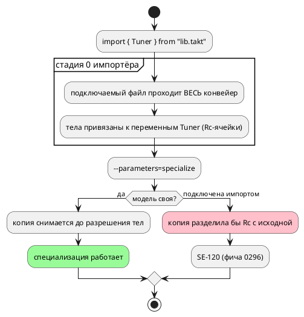

# Фича: Специализация импортированной модели: копия снимается после разрешения тел

- **Номер:** 0395
- **Статус:** ГОТОВО
- **Зависит от:** нет (проставлено на стадии анализа 2026-08-22)
- **Tier:** 3 — расставлен по признаку вреда (шкала — в блоке 1 `FEATURES.md`)
- **Класс:** семантика
- **Связанные issue (анализ):** кандидат блока 2 `FEATURES.md`, переведён в фичу пакетно 2026-08-22

## Стадии жизненного цикла (правило 17)

Все стадии — **разделы этой карточки** (правило 32): «Архитектура (ADR)»,
«Анализ», «Разработка», «Тест-план», «Отчёт о тестировании», «Итог».
Отдельным артефактом остаются только исправления —
[`docs/fixes/`](../fixes/README.md) (при необходимости `0395-YY-*`).

## Краткое описание

- **Специализация импортированной модели: копия снимается после разрешения
  тел.** Замер [порядок стадий построения описан в двух местах](0296-semantic-stages-single-source.md)
  (2026-08-19): подключаемый файл проходит **весь** конвейер внутри стадии 0
  импортёра, поэтому к моменту `--parameters=specialize` его тела уже привязаны
  к переменным, и копия разделила бы с исходной моделью `Rc` — цель `c`
  печатала доступ к чужому полю (`cc`: «no member named 'tuner' in
  'struct …P1'») при **нулевом** коде возврата. Фича выровняла порядок
  проходов и закрыла вход отказом `SE-120`, но причина осталась: лечится она
  **местом** снятия копии — импорт строит стадии 0–1, поздние стадии отдаёт
  конвейеру корня (Option C ADR). Цена перестройки названа там же:
  усыновление (0184) и выборочный импорт читают **готовые** карты переменных,
  типов и функций подключённого файла, а наполняют их стадии 2 и 5.

> Фича зарегистрирована из блока кандидатов `FEATURES.md` **без проработки**
> (решение заказчика 2026-08-22: «завести фичи из кандидатов без проработки»).
> Текст кандидата перенесён **дословно**, вместе с замером и его датой: замер
> есть свидетельство, а пересказ его теряет. Стадии 2 и 3 не пройдены —
> зависимости и объём **не оценивались**; далее фича проходит жизненный цикл по
> правилу 17.

## Документирование (правило 24)

**Не требуется.** Синтаксис и семантика не меняются: снимается ограничение
реализации, из-за которого специализация была недоступна импортированной
модели. Раздел `book/` о параметрах моделей описывает поведение флага, а оно
остаётся прежним; описание `SE-120` в приложении «Ошибки и предупреждения»
удаляется вместе с кодом, если он будет снят.

<!-- При закрытии фичи (стадия 8, статус ГОТОВО) сюда добавляется раздел
     «## Итог (что сделано)» —
     ссылки на отчёт/исправления (правило 21). Незакрытые фичи «Итога» не имеют. -->

## Архитектура (ADR)

- **Status:** Proposed — исполнителю (решения заказчика не требует)
- **Date:** 2026-08-22
- **Authors:** Архитектор + Аналитик
- **Related issues:** [Фича](0395-imported-model-specialization.md);
  причина названа в [порядок стадий построения описан в двух местах](0296-semantic-stages-single-source.md#архитектура-adr), отказ введён там же

### Context

`--parameters=specialize` снимает копию модели на каждый набор аргументов
(0185). Подключаемый файл проходит **весь** конвейер внутри стадии 0 импортёра
(0296), поэтому к моменту специализации его тела уже привязаны к переменным
подключённой модели, и копия разделила бы с исходной `Rc`-ячейки.

Замер **переснят 2026-08-22**:

| Режим | Ответ |
|---|---|
| `--parameters=assign` (умолчание) | компилируется |
| `--parameters=specialize` | **`SE-120`** «Специализация модели 'Tuner', подключённой из другого файла, не поддерживается…» |

Отказ введён фичей **вместо** прежнего поведения: до неё цель `c`
печатала доступ к чужому полю (`cc`: «no member named 'tuner' in
'struct …P1'») при нулевом коде возврата. То есть сегодня класс закрыт
**честным отказом**, а не молчаливой порчей; фича снимает саму границу.

### Decision Drivers

1. **Граница названа, но произвольна:** специализация — свойство модели, а не
   способа её получения; автор не обязан знать, что `import` строит дерево
   иначе.
2. **Причина — место снятия копии**, а не порядок проходов (вывод 0296):
   импорт обязан отдавать поздние стадии конвейеру корня.
3. **Цена перестройки названа там же:** усыновление (0184) и выборочный импорт
   читают **готовые** карты переменных, типов и функций подключённого файла, а
   наполняют их стадии 2 и 5.
4. **Отказ сегодня честный** — то есть работа улучшает возможности, а не чинит
   молчаливую порчу; приоритет соответствующий (Tier 3).

### Considered Options

#### Option A. Оставить отказ (статус-кво)

**Pros:** ноль работы; обход назван в тексте `SE-120` (задать параметры в файле
объявления либо собрать в режиме `assign`).
**Cons:** библиотечная модель с параметрами специализируется только у себя
дома — то есть параметризованная библиотека наполовину бесполезна.

#### Option B. Импорт строит стадии 0–1, поздние отдаёт конвейеру корня

Option C ADR, отложенная там же.

**Pros:**
- копия снимается **до** разрешения тел — `Rc` не разделяются по построению;
- порядок стадий остаётся единым (0296): у подключаемого файла исчезает
  «конвейер внутри конвейера», а с ним и двойной проход стадий 2–6, названный
  ценой устройства;
- `SE-120` становится недостижимым и снимается.

**Cons:**
- усыновление (0184) и выборочный импорт (`import { … }`) читают готовые карты
  подключённого файла — их придётся либо отложить до поздних стадий, либо
  научить работать с неполными картами;
- риск задеть порядок диагностик импорта (0294, 0279) и правило «имя типа
  занимается один раз» (0243), которое проверяется на стыке файлов.

#### Option C. Снимать копию текстом (перекомпилировать файл на каждый набор)

**Pros:** копии заведомо независимы.
**Cons:** повторный разбор и семантика на каждый набор аргументов; путь
импорта перестаёт быть общим с обычным (класс — два носителя одного
знания); детерминированность вывода придётся доказывать заново.

#### Option D. Копия перепривязывает свои тела к себе (принято при разработке)

Найдена **прогоном** при взятии фичи в работу (правило 30): отказ снят
временно, и замер показал, что мешает не порядок стадий, а **владелец ячеек**.
Ячейка в теле — снимок (`Rc::new(RefCell::new(var.clone()))`), и
после копирования её достаточно заменить на такую же с владельцем-копией. Тот
же приём, которым живёт усыновление импорта (0184).

**Pros:**
- конвейер, усыновление и выборочный импорт **не трогаются** — весь риск
  Option B снимается;
- механизм обхода тел уже написан (`import/adopt.rs`) и исчерпывающ по узлам;
- правка локальна: режим обхода + расширение обхода состояния + вторая форма
  объявления параметра.

**Cons:**
- двойной проход стадий 2–6 у подключаемого файла (цена устройства 0296)
  **остаётся** — Option B его убрала бы;
- обход тел получает второй режим (`fresh_cells`), то есть развилку.

### Decision

Принимается **Option D**, а не Option B, как предполагалось при проработке.

**Основание — замер, а не предпочтение.** ADR назвала причиной
«место снятия копии» и отсюда вывела перестройку конвейера. Прогон 2026-08-23
(отказ `SE-120` снят временно) показал, что дело **уже** и лечится точечно:
после копии тела ссылаются на ячейки исходной модели, и достаточно заменить их
своими. Перестройка конвейера решила бы ту же задачу ценой правки усыновления
и выборочного импорта — работы, названной самой ADR «самой рискованной
частью».

**Замер снимался трижды по ходу работы**, и каждый раз открывал следующий
слой: `SE-086` о «ненайденном» параметре (у импортированной модели он уже
константа), затем доступ к чужому полю в **условии ребра** (обход состояния
знал только `named_blocks`), затем порча первой копии второй (ячейка
разделена — править её на месте нельзя). Ни один из трёх слоёв из чтения кода
не следовал.

Option B не отвергнута по существу: она снимает и двойной проход стадий
2–6. Это отдельная работа с собственной пользой, и её предмет — **цена**, а не
дефект; вынесена кандидатом.

### Consequences

#### Положительные

- Параметризованная библиотечная модель специализируется у импортёра.
- Исчезает двойной проход стадий 2–6 у подключаемого файла (цена устройства,
  названная 0296).
- `SE-120` снимается как недостижимый.

#### Отрицательные / Action items

- Усыновление (0184) и выборочный импорт переезжают на поздние стадии — самая
  рискованная часть: они читают карты, наполняемые стадиями 2 и 5.
- Диагностики импорта (`SE-074`, `SE-102` + сноска 0294, `SE-108` через
  границу файлов) обязаны сохранить и коды, и позиции.

#### Acceptance criteria

1. `--parameters=specialize` на импортированной параметризованной модели
   компилируется; цель `c` печатает **разные** структуры на разные наборы
   аргументов, `cc` их принимает.
2. Потактовая сверка эталона с целью `c` в обоих режимах (`assign` и
   `specialize`) — четыре трассы, как в контроле R11 фичи.
3. `SE-120` снят либо помечен защитным с объяснением недостижимости.
4. Диагностики импорта не изменили ни кодов, ни координат (существующие тесты).
5. Вывод корпуса не изменился; `./scripts/precheck.sh` зелёный.

## Анализ

### Цель и контекст

Параметризованная модель, подключённая импортом, не специализируется:
`--parameters=specialize` отвечает `SE-120`. Причина — **место** снятия копии:
подключаемый файл проходит весь конвейер внутри стадии 0 импортёра, и к моменту
специализации его тела уже привязаны к переменным.

### Замер (правило 30, переснят 2026-08-22)

Вход: `model Tuner { parameter GAIN: u8 := 2; … }` в подключаемом файле,
`start Run = Tuner(GAIN := 3);` у импортёра.

| Режим | Ответ |
|---|---|
| `--parameters=assign` | компилируется |
| `--parameters=specialize` | `SE-120` с названным обходом |

Отказ **честный** и введён фичей вместо прежнего поведения: до неё цель
`c` печатала доступ к чужому полю (`cc`: «no member named 'tuner'») при нулевом
коде возврата. Фича снимает границу, а не чинит порчу.

### Зависимости фичи (правило 17/19)

- **Зависит от:** нет — все опорные закрыты:
  [порядок стадий построения описан в двух местах](0296-semantic-stages-single-source.md) (порядок стадий,
  отказ `SE-120`), [параметризация моделей (ключевое слово `parameter`)](0185-model-parameters.md) (параметры и
  режимы), [общие переменные библиотечного файла в импортёре](0184-imported-shared-variables.md) (усыновление).
- **Влияние на порядок:** работа исполнительская, решения заказчика не требует;
  риск сосредоточен в усыновлении и выборочном импорте.

### Требования и проверяемые условия

- **R1.** `--parameters=specialize` на импортированной модели компилируется;
  цель `c` печатает разные структуры на разные наборы аргументов.
- **R2.** Обе трассы (`assign` и `specialize`) совпадают с эталоном — контроль
  R11 фичи расширяется на импортированную модель.
- **R3.** `SE-120` снят либо помечен защитным с объяснением недостижимости
  (мёртвая ветвь — дефект).
- **R4.** Диагностики импорта сохранили коды и координаты: `SE-074`
  (частичный импорт), `SE-102` + сноска 0294, `SE-108`/`SE-107` (занятость
  имени типа через границу файлов), `SE-001` со сноской 0279.
- **R5.** Порядок стадий остаётся описанным **одним** источником: второй копии последовательности не появляется.
- **R6.** Вывод корпуса не изменился.

### Критерии приёмки и способ проверки

| # | Критерий | Способ проверки |
|---|---|---|
| A1 | R1 | прогон `taktc --parameters=specialize` + `cc` на порождённом |
| A2 | R2 | потактовая сверка (расширение `conformance_param_modes_tests`) |
| A3 | R3 | тест достижимости отказа либо его снятие |
| A4 | R4 | существующие тесты |
| A5 | R5 | контроль `stage_order_single_source_tests` (греп, падает списком) |
| A6 | R6 | `git diff --exit-code examples/generated/` |

### Объём работ

| Место | Что делается | Риск |
|---|---|---|
| `semantic/import/build.rs` | строить стадии 0–1, поздние отдать конвейеру корня | средний |
| `semantic/import/adopt.rs` | усыновление переносится на поздние стадии | **высокий**: читает готовые карты |
| выборочный импорт (`import { … }`) | то же — фильтр по именам работает по картам | **высокий** |
| `semantic/stages/mod.rs` | единый порядок сохраняется  | низкий |
| `SE-120` | снятие либо пометка защитным | низкий |

### Редакторский слой (правило 29)

**Правки не требуются:** ни лексика, ни синтаксис, ни формы объявления не
меняются. Но LSP строит дерево тем же конвейером, поэтому перестройка
порядка обязана быть проверена на многофайловом входе: тесты `lsp55`, `ws0153`
и `goto56` — часть приёмки (правило 29: ответ фиксируется, даже если «не
нужно»).

### Особенности по обратной функциональности

- Вход, сегодня отвергаемый `SE-120`, начнёт компилироваться — расширение
  множества принимаемых программ, обратно совместимое.
- Версия языка **не** поднимается: синтаксис и семантика не меняются, снимается
  ограничение реализации.

### Риски и зависимости

- **Усыновление и выборочный импорт** — главный риск: они читают карты
  переменных, типов и функций, наполняемые стадиями 2 и 5.
- **Возврат молчаливой порчи:** до 0296 тот же вход давал доступ к чужому полю
  при нулевом коде возврата; контроль обязан сравнивать **значения**, а не факт
  компиляции.
- **Двойной проход стадий 2–6** у подключаемого файла (цена устройства 0296)
  исчезает — это побочная польза, но и источник расхождений, если какая-то
  стадия окажется неидемпотентной.

## Разработка

### Задача: параметр импортированной модели — константа

`semantic/specialize.rs::set_initializer` разбирает **обе** формы объявления.
Подключаемый файл проходит весь конвейер внутри стадии 0 импортёра (0296), а
он включает `constify_parameters`, — значит к моменту специализации параметр
уже `Const`, и прежняя ветвь отвечала `SE-086` о параметре, объявленном рядом.

### Задача: перепривязка тел копии

`semantic/import/adopt.rs::adopt_specialized_copy` — обход тел копии тем же
слоем, что у импорта: признак «ячейка чужая» это `Rc::ptr_eq` владельца с
исходной моделью, имена тождественны (поэтому `SE-074` недостижим).

Режим `fresh_cells`: ячейка **заменяется** новой, а не правится на месте.
`ModelNode::copy` клонирует узлы тел, но `Rc`-ячейки внутри разделяет с
исходной моделью — правка испортила бы её, и вторая специализация читала бы
поля первой (замер: `model->run.tuner_p10.out_value` внутри `TwoTunerP2`,
`cc`: «no member named 'run'»).

### Задача: обход состояния берёт условия рёбер, `next` и формулы

Прежде `adopt_state` знал только `named_blocks`. У импорта дыра не
проявлялась — там перепривязки требуют лишь ячейки корня библиотеки, а условия
модели ссылаются на её собственные переменные. Специализация меняет владельца
**всех** ячеек, и без этих полей условие `ref Idle: out_value > 0;` копии
читало поле исходной модели.

`next` — отдельное поле, а не элемент `references`.
`Formula::LTL` ячеек не содержит: её атомы — имена состояний и предикаты по
сырому АСД.

### Задача: `SE-120` снят

Код помечен `RETIRED` в реестре диагностик, в сводной таблице приложения — «(снят)»,
разбор из приложения удалён, строка README поправлена. Тест
`stage_order_single_source_tests`, закреплявший отказ, переписан на проверку
работы (класс — дефект, закреплённый тестом).

### Задача: контроль

`takt-sim/tests/conformance/conformance_import_specialize_tests.rs` — четыре
трассы (эталон и цель `c` в режимах `assign` и `specialize`) на **двух**
экземплярах с разными аргументами. Ожидание считается независимо от обоих
исполнителей.

## Тест-план

| № | Условие | Ожидаемый результат |
|---|---|---|
| T1 | `--parameters=specialize` на импортированной модели | компилируется, `cc` принимает |
| T2 | Два набора аргументов | две структуры, каждая со своим значением |
| T3 | Четыре трассы (эталон/`c` × `assign`/`specialize`) | совпадают потактово |
| T4 | Контроль: тот же вход в одном файле | работает, как работал |
| T5 | Диагностики импорта (`SE-074`, `SE-102`, `SE-108`, `SE-001`) | коды и координаты прежние |
| T6 | Порядок стадий — один носитель | греп-контроль зелен |
| T7 | Вывод корпуса | не изменился |
| T8 | Предкоммит | зелёный |

## Отчёт о тестировании

**Окружение:** macOS (darwin 25.5.0), toolchain `1.97.1`, полный
`./scripts/precheck.sh`.

### Сверка с тест-планом

| № | Результат |
|---|---|
| T1 | `cc -Wall -Wextra -Werror` принял вывод |
| T2 | `CONST_TWO_TUNER_P1_GAIN 3` и `CONST_TWO_TUNER_P2_GAIN 7`, доступ у каждой копии свой |
| T3 | `conformance_import_specialize_tests` |
| T4 | контроль в том же тесте `stage_order_single_source_tests` |
| T5 | существующие наборы 0184, 0294, 0279, 0243 зелены |
| T6 | `stage_order_is_written_once` |
| T7 | `git diff --exit-code examples/generated/` |
| T8 | |

### Примеры и контрпримеры (правило 16)

- **Пример:** библиотека с `parameter GAIN`, импортёр с двумя экземплярами
  (`GAIN := 3` и `GAIN := 7`) — каждая копия печатает свою константу.
- **Контрпример 1:** тот же вход **в одном файле** — работал и работает; без
  него правка читалась бы как «специализация вообще починена».
- **Контрпример 2:** режим `assign` — трасса та же, форма вывода другая.

### Мутационная проверка контрольных тестов

| Мутация | Результат |
|---|---|
| не обходить условия рёбер и формулы | потактовая сверка краснеет |
| править ячейку на месте вместо замены | потактовая сверка краснеет; **тест кодов ошибок — нет** |

Вторая мутация — довод в пользу сверки **значений**: вывод компилируется, и
проверка «отказов нет» его принимает.

### Редакторский слой (правило 29)

**Правок не потребовалось.** Лексика, синтаксис и формы объявления не менялись.
Многофайловый вход LSP проверен существующими наборами (`lsp55`, `ws0153`,
`goto56`) — все зелены.

### Дефекты

Не найдено.

### Вердикт

**Готово.** Параметризованная библиотечная модель специализируется у импортёра;
эталон и цель `c` совпадают потактово в обоих режимах.

## Итог (что сделано)

Граница снята: `--parameters=specialize` работает и для модели, подключённой
`import`. Решение — **не** то, что предполагала проработка: вместо перестройки
конвейера (Option B ADR) копия перепривязывает свои тела к себе тем же слоем,
которым живёт усыновление импорта (Option D, принят по замеру).

Правок четыре: вторая форма объявления параметра (у импортированной модели он
уже константа), режим `fresh_cells` обхода (ячейка заменяется, а не правится —
иначе вторая специализация портит первую), расширение обхода состояния на
условия рёбер, `next` и формулы, и снятие `SE-120` как недостижимого.

**Замер снимался трижды**, и каждый раз открывал следующий слой дефекта —
ни один из них не следовал из чтения кода (правило 30).

**Кандидатом вынесено** то, что Option B делала бы сверх этого: снятие
двойного прохода стадий 2–6 у подключаемого файла. Это **цена**, а не дефект.

Детали — в разделах «Архитектура (ADR)», «Разработка» и «Отчёт о
тестировании» этой карточки.

