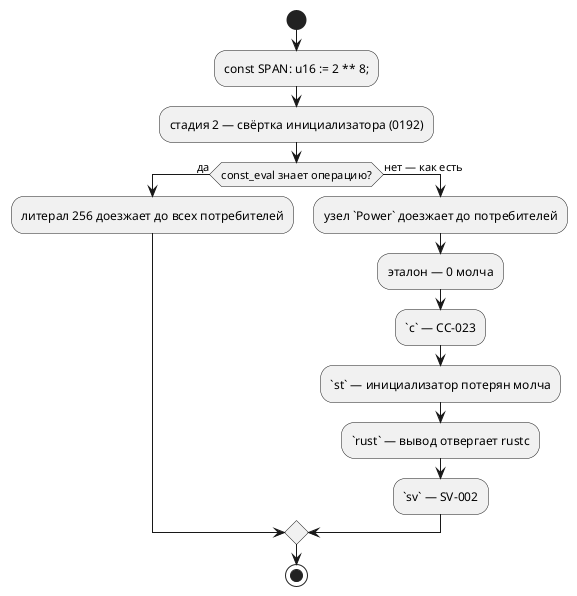

# Фича: Степень в инициализаторе константы не сворачивается

- **Номер:** 0407
- **Статус:** ГОТОВО
- **Зависит от:** нет
- **Tier:** 1
- **Класс:** семантика
- **Связанные issue (анализ):** находка [долг покрытия: довести примеры и документ до 100% конструкций](0404-language-coverage-debt.md)

## Стадии жизненного цикла

Все стадии — **разделы этой карточки**. Отдельным артефактом
остаются только исправления — [`docs/fixes/`](../fixes/README.md).

## Краткое описание

`const SPAN: u16 := 2 ** 8;` — вычислимая при компиляции запись, но
константный вычислитель оператор `**` не знает, и один вход даёт **четыре**
разных ответа.

## Замер (пересъём 2026-08-23, `scripts/probe.sh`)

Проба — `const SPAN: u16 := 2 ** 8;`, значение читается в теле (`v := SPAN;`).

| Потребитель | Ответ | Инструмент цели |
|---|---|---|
| эталон | `v = 0` — значение теряется **молча** | — |
| `c`, `c-hal` | `CC-023`: «узел не прошёл семантическое понижение» | вывода нет |
| `st`, `st-at` | **`SPAN : UINT;` — инициализатор потерян молча** | `iec2c` принял · `cc` собрал |
| `rust` | `const POWFOLD_SPAN: u16 = (2).wrapping_pow((8) as u32);` | **`rustc` ОТВЕРГ** — `E0689` |
| `sv`, `sv-mmio` | `SV-002` | вывода нет |
| `plantuml` | принимает | — |

**Пересъём опроверг запись кандидата дважды.** Она утверждала, что `st` и
`rust` «переводят верно»; на деле **256 не даёт ни один потребитель**: `st`
печатает константу без инициализатора (`iec2c` такой файл принимает, `cc`
собирает — то есть валидный вывод с **неверным значением 0**), а вывод `rust`
отвергает `rustc` при **нулевом** коде возврата `taktc`. Урок свод подтверждён в третий раз подряд.

**Tier 1** остаётся: эталон и цели расходятся **значением**, и у эталона
расхождение молчаливое.

### Контрольный вход: та же степень в теле

`v := 2 ** 8;` (без константы) — эталон даёт `v = 256`, `c`/`c-hal`/`st`/`st-at`
переводят и их инструменты принимают, `plantuml` принимает, `sv`/`sv-mmio`
отвечают `SV-008`, а **`rust` порождает тот же `(2).wrapping_pow((8) as u32)`,
который `rustc` отвергает** (`E0689`: `can't call method wrapping_pow on
ambiguous numeric type {integer}`).

Контроль опроверг и **третье** утверждение записи — «в теле та же запись
работает у всех восьми целей». Класс цели `rust` от места записи **не
зависит**: он про **литеральную базу** степени, у которой типа нет. Свёртка
инициализатора снимает его в объявлении и **не снимает в теле** — это
соседний класс, вынесенный кандидатом (см. «Итог»).

## Заметки к проработке

- Носитель свёртки — `semantic/const_eval/`; таблица целочисленных операций
  живёт в `const_eval/int_ops.rs`. Оператора `**` в ней нет.
- Семантика степени уже задана фичей [целая степень считается целочисленно](0328-integer-power.md): счёт
  **целыми**, с обёрткой по правилу. Второго знания о ней заводить
  нельзя — свёртка обязана звать ту же таблицу.
- Код `CC-023` у цели `c` означает «дефект инструмента», и
  здесь он **уместен**: узел действительно не прошёл понижение. Чинить надо
  свёртку, а не текст отказа.
- Найдено при попытке написать пример для книги: запись, естественная для
  ёмкости окна (`2 ** 8`), не переводится.

## Архитектура (ADR)

### Контекст

Оператор `**` язык принимает (грамматика, правило `Power`), эталон исполняет
(`takt-sim/src/eval/ops.rs::power`), цели переводят. Не знает
о нём **только константный вычислитель**: обход сырого АСД
(`const_eval::eval_in`) ветви `E::Power` не имеет, и запись падает в общую
ветвь «форма выражения при компиляции не вычисляется». Свёртка инициализатора
(0192) эту ошибку **глотает** (`let Ok(…) else` — граница, названная 0306 для
вызовов), поэтому автор не узнаёт ничего, а потребители получают неразвёрнутый
узел и расходятся — каждый по-своему.



### Решение

Степень вычисляется **той же таблицей**, что и остальная арифметика, —
`const_eval::int_ops::int_binary` (носитель 0208). Правки две и обе
однострочные по существу:

1. в таблицу добавляется знак `"**"`: счёт `wrapping_pow` в `i128` — та же
   обёртка, которой живёт вся таблица (норма ADR);
2. в обход сырого АСД добавляется `E::Power(loc, l, r) => binary("**", …)` —
   единственная точка арифметики модуля.

**Второго знания о степени не заводится.** Семантика задана фичей
(счёт целыми), и таблица `int_ops` — то самое место, где правила операций уже
живут: своя ветвь в `eval_in` со своим `pow` разошлась бы с адресом и с
эталоном ровно так, как разошлись две таблицы до 0208.

**Показатель за пределами `u32` — отказ, а не обрезание.** Отрицательная
степень даёт дробное (у цели `rust` она уже отвергается `RS-011`), показатель
шире `u32` не принимает `wrapping_pow`. Оба случая — новый вариант
`IntOpError::ExponentOutOfRange`; вычислитель переводит его в «не константа» с
названной причиной, то есть инициализатор остаётся как был — **прежнее**
поведение, а не новый отказ.

### Отвергнутые варианты

- **Чинить у целей.** `CC-023` и `SV-002` — честные отказы «узел не понижен»;
  текст менять бессмысленно, а научить четыре цели печатать степень
  константы значило бы завести четыре копии правила вместо одной свёртки.
- **Разобрать `Power` в `eval_node`** (вычислитель по понижённому узлу). Там
  нет **ни одной** бинарной операции: узел приходит либо литералом, либо
  ссылкой на константу. Отдельный класс, предмета фичи не касается.
- **Свернуть степень в теле** (общая свёртка выражений). Правило
  сворачивает **инициализаторы**, и расширение его на тела — другая фича с
  другой ценой (проверки идут после понижения).

### Обратная совместимость

Совместимость **полная**: запись, которая прежде молча теряла значение либо
отвергалась, теперь вычисляется. Ни одна работавшая программа поведения не
меняет — степень в инициализаторе не работала ни у одного потребителя.

## Анализ

### Что меняется

| Файл | Правка |
|---|---|
| `takt-lang/src/semantic/const_eval/int_ops.rs` | знак `"**"`, вариант ошибки `ExponentOutOfRange`, тесты |
| `takt-lang/src/semantic/const_eval/mod.rs` | ветвь `E::Power`, перевод новой ошибки в «не константа» |
| `takt-lang/src/address_map/eval.rs` | перевод новой ошибки (матч исчерпывающий) |

**Язык адресов не меняется**: матчер выражения адреса (`address_map/eval.rs`)
форму `Power` не разбирает вовсе, поэтому знак в таблице до него не доходит.
Граница названа, а не забыта.

### Версия языка

Наблюдаемое поведение конструкции меняется — запись начинает давать значение
вместо молчаливого нуля. Версия языка **0.13.0** поднята фичей в текущем
цикле; (накопление) — подъёма не требуется, изменение вносится в
уже поднятую версию.

### Редакторский слой

**Не требуется.** Ни лексика, ни синтаксис не меняются: токен `**` и правило
`Power` существуют с фичи, автодополнение и подсветка их уже знают. Новых
узлов АСД нет, новых диагностик наружу не выходит (новая ошибка таблицы —
внутренняя, переводится в существующую «не константа»). Проверено чтением
`lsp/semantic_tokens.rs` и `lsp/keywords.rs`.

### Зависимости

Нет. Носители (`int_ops` — 0208, свёртка — 0192, семантика степени — 0328)
закрыты.

## Тест-план

| № | Условие | Ожидаемый результат |
|---|---|---|
| T1 | `const SPAN: u16 := 2 ** 8;` — значение константы | `256` у эталона; тот же литерал в выводе целей |
| T2 | Потактовая сверка эталона с целью `c` на пробе фичи | трассы совпадают |
| T3 | Контроль: `const K := 2 ** 3;` в **выведенном** типе | значение `8`, тип по правилу |
| T4 | Обёртка по типу приёмника (0207): `const B: u8 := 2 ** 8;` | `0` — норма 0127, как у `200 + 100` |
| T5 | Отрицательный показатель `const N: i32 := 2 ** -1;` | прежнее поведение: инициализатор не сворачивается |
| T6 | Степень в **выражении адреса** (`at 0x10 + 2 ** 2`) | прежний отказ: матчер формы не разбирает |
| T7 | Таблица `int_ops`: `int_binary("**", 2, 3)` | `Int(8)` вместо `UnsupportedOperator` |
| T8 | Проверки предкоммита (корпус, детерминизм, инструменты целей) | зелены |

## Документирование

**Требуется** — фича меняет наблюдаемое поведение конструкции. Раздел
`book/src/05-expressions/` уже обещал, что арифметика инициализатора
вычисляется при сборке; до фичи это обещание было **неверным для степени**.
В блок про вычисляемый инициализатор добавлен пример, показывающий, что
степень туда входит:

```takt
const SPAN:  u16 := 2 ** 8;     // 256 — ёмкость восьмибитного окна
const LIMIT: u16 := 2 ** 8 - 1; // 255 — наибольшее значение в нём
```

Новых диагностик наружу не выходит, поэтому приложение «Ошибки и
предупреждения» не затронуто; таблица операторов раздела «Выражения» знак
`**` уже несёт.

## Разработка

### Задача: степень в таблице операций

`takt-lang/src/semantic/const_eval/int_ops.rs` — знак `"**"`: показатель
сужается к `u32`, счёт идёт `wrapping_pow` в `i128` (та же обёртка, которой
живёт вся таблица). Показатель отрицательный либо шире `u32` — новый вариант
`IntOpError::ExponentOutOfRange`.

### Задача: ветвь обхода и переводы ошибки

`const_eval/mod.rs` — `E::Power(loc, l, r) => binary("**", …)`, то есть степень
идёт через **единственную** точку арифметики модуля. Перевод новой ошибки в
«не константа» с названной причиной добавлен обоим потребителям таблицы:
общему вычислителю и выражению адреса (`address_map/eval.rs`; матч там
исчерпывающий, компилятор сам потребовал решения).

### Задача: контроля

- `takt-lang/tests/semantic/const_power_fold_tests.rs` — вывод целей `c`, `st`,
  `rust`: значение свёрнуто, степень до вывода не доезжает, `st` не теряет
  инициализатор, `rust` не печатает `wrapping_pow` у литерала, обёртка по типу
  приёмника в силе, отрицательный показатель оставлен как был. Отдельный
  контроль **класса** — тождественность вывода выводу для готового литерала
  (приём: за границей семантики степени не существует).
- `takt-sim/tests/sim/const_power_tests.rs` — сверка **значений** эталона с
  целью `c`: основание, знак, нулевой показатель, сложение со степенью,
  контр-пример обёртки `u8`.

## Отчёт о тестировании

**Окружение:** macOS (darwin 25.5.0), toolchain `1.97.1`, полный
`./scripts/precheck.sh`.

### Сверка с тест-планом

| № | Условие | Результат |
|---|---|---|
| T1 | `const SPAN: u16 := 2 ** 8;` | `256` у эталона и в выводе всех восьми целей |
| T2 | Проба `scripts/probe.sh` после правки | все восемь целей `OK`, все инструменты приняли (`cc`, `iec2c`+`cc`, `rustc`+`clippy`, `verilator`+`yosys`) |
| T3 | `const K := 2 ** 3;` — выведенный тип | `8` |
| T4 | `const B: u8 := 2 ** 8;` | `0` — обёртка 0207/0127 |
| T5 | `const N: i32 := 2 ** -1;` | прежнее поведение (`CC-023`), нового отказа нет |
| T6 | Степень в выражении адреса | прежний `SE-055` — язык адресов не изменился |
| T7 | `int_binary("**", 2, 3)` | `Int(8)`; показатель вне `u32` — `ExponentOutOfRange` |
| T8 | Проверки предкоммита | зелены |

### Примеры и контрпримеры

- **Пример:** `const SPAN: u16 := 2 ** 8;` — ёмкость восьмибитного окна; вошёл
  в раздел `book/src/05-expressions/`.
- **Контрпример 1:** `const B: u8 := 2 ** 8;` — значение нормируется типом
  (`0`), своей нормировки фича не заводит.
- **Контрпример 2:** `const N: i32 := 2 ** -1;` — у целой степени такого
  показателя не бывает; запись остаётся невычисленной, как прежде.
- **Контрпример 3:** `at 0x1000 + 2 ** 2` — выражение адреса форму не
  разбирает, `SE-055` на месте.

### Мутационная проверка контрольных тестов

| Мутация | Результат |
|---|---|
| снять ветвь `E::Power` | 4 из 6 тестов `takt-lang` и **все 5** тестов `takt-sim` краснеют |
| исказить показатель (`exp + 1`) | 4 из 6 и 4 из 5 краснеют |

### Дефекты

Не найдено. Найден **соседний** класс (см. «Итог»).

### Вердикт

**Готово.** Все восемь целей и эталон дают одно значение; расхождение,
ради которого фича заведена, снято в семантике, то есть по построению.

## Итог (что сделано)

Константный вычислитель научился целой степени: знак `**` добавлен в таблицу
операций `const_eval::int_ops` (носитель 0208), а обход сырого АСД получил
ветвь `E::Power`, идущую через единственную точку арифметики модуля. Второго
знания о семантике степени не заведено — она задана фичей и живёт там же,
где правила прочих операций.

Замер **пересняли**, и он опроверг запись кандидата **трижды**:
значения `256` не давал ни один потребитель, цель `st` теряла инициализатор
молча (валидный файл с нулём), а вывод цели `rust` отвергал `rustc`. После
правки проба даёт `OK` у всех восьми целей, и инструменты целей принимают
вывод.

**Соседний класс, вынесенный кандидатом.** Контрольный вход показал, что
степень **в теле** с литеральной базой (`v := 2 ** 8;`) цель `rust` печатает
как `(2).wrapping_pow((8) as u32)` — код, который `rustc` отвергает (`E0689`,
ambiguous numeric type) при **нулевом** коде возврата `taktc`. Свёртка
инициализатора снимает этот класс в объявлении и **не снимает в теле**;
корпус его не покрывает (степени в `examples/` нет), поэтому проверка цели молчит.
Запись заведена в блок «Кандидаты в фичи» `FEATURES.md`.

Детали — в разделах «Замер», «Архитектура (ADR)», «Разработка» и «Отчёт о
тестировании» этой карточки.

