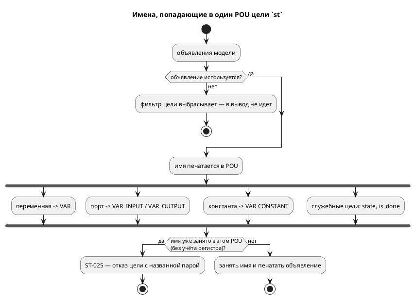

# Фича: Цель st: имена одного POU обязаны различаться без учёта регистра

- **Номер:** 0480
- **Статус:** ГОТОВО
- **Зависит от:** нет
- **Tier:** 2
- **Класс:** генерация
- **Связанные issue (анализ):** кандидат блока 2 `FEATURES.md` (заведён при закрытии [степень в инициализаторе константы не сворачивается](0407-const-power-fold.md), 2026-09-01)

## Стадии жизненного цикла

Все стадии — **разделы этой карточки**: «Архитектура (ADR)»,
«Анализ», «Разработка», «Тест-план», «Отчёт о тестировании», «Итог». Раздел
заводится в момент прохождения стадии, а не заранее. Отдельным артефактом
остаются только исправления — [`docs/fixes/`](../fixes/README.md) (при
необходимости `0480-YY-*`).

## Краткое описание

Пространство имён IEC 61131-3 плоское и **регистронезависимое**, поэтому два
объявления одного POU, имена которых различаются лишь регистром, для MatIEC —
одно имя, объявленное дважды. Цель `st` такие пары не контролирует: `taktc`
возвращает **ноль**, а `iec2c` вывод отвергает — и отвечает обманчиво
(«invalid located variable declaration» с указанием на `AT %…`, которых в файле
нет). Заводится отказ **`ST-025`** по образцу `ST-023`/`ST-024`: правило одно —
имена, которые цель печатает в одном POU, различаются без учёта регистра.

> Фича зарегистрирована из блока кандидатов (запись заведена при закрытии
> 0407); далее проходит жизненный цикл по своду.

## Документирование

Фича меняет **поведение цели** и вводит диагностику, значит документ
затрагивается дважды:

- приложение «Ошибки и предупреждения» — новая запись `ST-025` с разбором и
  примером;
- раздел «Цели генерации», блок «Частые ошибки» — строка про
  целевое ограничение, рядом с `SV-018`/`ST-020`.

**Языковые разделы не трогаются, и это проверено чтением:** ни `ST-014`, ни
`ST-023` в них не упоминаются — ограничения целей живут в приложении и в
разделе о целях.

Язык **не меняется**: имена остаются законными, модель валидна для остальных
семи потребителей — отказ принадлежит цели. Версия языка не поднимается.

## Архитектура (ADR)

- **Status:** Accepted
- **Date:** 2026-09-02
- **Authors:** архитектор, аналитик, разработчик

### Context

Замер снят прогоном: `scripts/probe.sh -n 2` плюс прямые пробы
`taktc -t st` → `iec2c` по парам имён. Полная таблица — в разделе «Анализ».
Коротко: **шесть** видов пар дают невалидный ST при **нулевом** коде возврата
`taktc`, тогда как эталон и остальные потребители вход исполняют.

Причина одна на все шесть: цель печатает объявления автора и свои служебные в
**один** POU (`FUNCTION_BLOCK`), а пространство имён IEC плоское и
регистронезависимое. Диагностика инструмента при этом указывает не туда — тот
самый случай, ради которого заведены `ST-014` (0065), `ST-023` (0378) и
`ST-024` (0455).

### Decision Drivers

- **Отказ цели честнее невалидного вывода** — норма проекта, закреплённая
  тремя прецедентами (`ST-014`, `ST-023`, `ST-024`) и `SV-007` у соседней цели.
- **Признак строится из того, что цель печатает**, а не из того, что объявлено
  (урок исправления: ложный отказ хуже пропуска).
- **Проверка стоит после фильтра использования** — иначе неиспользуемое
  объявление, которого в выводе нет, ломало бы сборку (тот же урок, что у
  `ST-014`).

### Considered Options

1. **Один накопитель занятых имён на POU, проверка в точке эмиссии.** Цикл
   печати объявлений уже един (`st_decl.rs`), туда же приходят все три вида, и
   служебные имена цели известны. Отказ — новый код `ST-025`.
2. **Переименовывать за автора** (суффикс, префикс). Отвергнуто: переименование
   потребовало бы одного носителя имени для объявления и **всех** обращений —
   довод ADR, он в силе.
3. **Сужение языка** (запретить такие пары семантикой). Отвергнуто: имена
   законны, и остальные семь потребителей вход исполняют. Ограничение
   принадлежит целевому языку, а не Takt.
4. **Три частных правила** (переменная ↔ константа, порт ↔ переменная, порт ↔
   порт). Отвергнуто: это одно правило, и три его копии разъехались бы при
   первом же новом виде объявления.

### Decision

Принят вариант 1.

1. Носитель — `st_reserved::check_st_local_clash(name, occupied, loc)`, по
   образцу `check_st_global_clash` (0455): принимает уже занятые имена POU,
   сравнивает без учёта регистра, отвечает **`ST-025`**, называя **обе**
   стороны пары.
2. Набор занятых **начинается со служебных имён цели** (`state`, `is_done`) —
   они печатаются в тот же POU, и замер показал, что столкновение с ними даёт
   ровно тот же невалидный ST.
3. Точка вызова — цикл печати объявлений `st_decl.rs`, **после** фильтра
   использования и рядом с существующим `check_st_declaration`.

### Consequences

- Шесть видов пар вместо невалидного ST получают названный отказ с обеими
  сторонами и позицией объявления.
- Модель остаётся валидной для прочих целей — текст отказа это называет
  (формулировка `ST-023`/`ST-024`).
- Служебные имена цели становятся **занятыми**: `var State` и `var is_done`
  теперь отвергаются целью `st`, тогда как прежде давали невалидный вывод.

#### Acceptance criteria

1. Все шесть видов пар замера дают `ST-025` с названной парой имён.
2. Контроли не затронуты: различные имена, неиспользуемое объявление,
   совпадение с именем функции, состояния и вложенной модели — по-прежнему
   переводятся, `iec2c` вывод принимает.
3. Корпус `examples/` собирается по-прежнему (проверка цели `st` зелен).
4. `./scripts/precheck.sh` зелёный.

## Анализ

### Цель и контекст

Довести контроля имён цели `st` до полноты по **одному POU**: сегодня он знает
столкновение со стандартной библиотекой IEC (`ST-014`), с именем типа
(`ST-023`) и с именами глобального пространства у `st-at` (`ST-024`), но не
знает столкновений объявлений **между собой**.

### Замер

Прямые пробы `taktc -t st` → `iec2c` (и `probe.sh -n 2` там, где нужно
поведение прочих целей). Во всех строках «ломается» код возврата `taktc` —
**ноль**.

| Вход | `iec2c` | Прочие потребители |
|---|---|---|
| `var level` + `const LEVEL` | **ОТВЕРГ** «invalid located variable declaration» | исполняют (`level = 7`) |
| `in LEVEL` + `var level` | **ОТВЕРГ** «invalid variable(s) declaration» | `c`, `rust`, `sv` — их инструменты приняли |
| `in level` + `const LEVEL` | **ОТВЕРГ** | `c`, `rust`, `sv` — приняли |
| `in LEVEL` + `out level` | **ОТВЕРГ** | — |
| `var State` (служебное `state` цели) | **ОТВЕРГ** | `c`, `sv` приняли; **`rust` — `E0124`** «field `state` is already declared» |
| `var is_done` (служебное цели) | **ОТВЕРГ** | `c`, `rust` приняли; **`sv` — честный отказ `SV-007`** |

**Контроли** (обязательны) — всё принято `iec2c`:

| Контрольный вход | Ответ |
|---|---|
| различные имена (`var level` + `const HEIGHT`) | принят, `cc` собрал |
| столкновение при **неиспользуемом** объявлении | принят — цель его не эмитит |
| `var level` + `fn LEVEL(...)` | принят (POU — иное пространство) |
| `var level` + `state LEVEL` | принят (состояния печатаются числами) |
| `var level` + `model Level` | принят |

Первая редакция пробы дала **посторонний** `ST-014`: контрольную константу
звали `LIMIT`, а это имя в списке зарезервированных IEC (0342). Замер
переснят — свод, «одна причина за раз».

### Зависимости фичи

Зависимостей нет. Носитель и место вызова существуют: `ST-014` (0065),
`ST-023` (0378), `ST-024` (0455).

### Требования и проверяемые условия

1. Имена, печатаемые целью в одном POU, различаются **без учёта регистра**;
   нарушение — `ST-025` с обеими сторонами пары и позицией объявления.
2. В набор занятых входят служебные имена цели (`state`, `is_done`) — по
   замеру, а не по догадке.
3. Проверка стоит **после** фильтра использования.
4. Правило одно на все виды объявлений — накопитель один, копий признака нет.
5. Прочие цели не затрагиваются.

### Критерии приёмки и способ проверки

Критерии — «Acceptance criteria» ADR. Способ: набор тестов цели на шесть пар и
пять контролей, прогон `iec2c` на выводе контролей, проверка цели `st` на корпусе,
предкоммит.

### Редакторский слой

**Правок не требуется.** Фича не трогает лексику, синтаксис и семантику: ни
нового ключевого слова, ни узла АСД, ни правила языка. Новая диагностика
принадлежит **цели** и приходит на этапе генерации, а LSP целей не запускает
(он зовёт `collect_compile_diagnostics` — семантику). Прецедент тот же у
`ST-023` и `ST-024`.

### Особенности по обратной функциональности

Изменение **сужает** множество моделей, которые цель `st` переводит: входы,
прежде дававшие невалидный ST, теперь получают отказ. Обратная несовместимость
здесь **мнимая** — рабочей программы не существовало: вывод отвергал `iec2c`,
то есть на ПЛК такая модель не попадала ни разу. Прецедент — `ST-023` (0378) и
`ST-024` (0455), где решение принято тем же доводом.

Риск ложного отказа снимается тем же приёмом, что в исправлении: набор
занятых имён строится из того, что цель **печатает**, и каждая запись проверена
прогоном `iec2c`.

### Риски и зависимости

- **Риск: корпус перестанет собираться.** Снимается прогоном проверки цели `st`
  на `examples/` (шаг предкоммита).
- **Риск: список служебных имён неполон.** Он взят из замера (`state`,
  `is_done`); пропущенное имя оставляет **прежнее** поведение (невалидный ST),
  а не даёт ложный отказ — ошибка в безопасную сторону.
- **Граница:** столкновение `var State` со служебным полем цели `rust`
  (`E0124`) — соседний класс с **другим** механизмом (приведение к snake_case,
  а не регистронезависимость IEC). В объём не входит, выносится кандидатом.

## Разработка

### Задача — носитель отказа `ST-025`

#### Что было

`st_reserved.rs` знал три вида столкновений: со стандартной библиотекой IEC
(`ST-014`), с именем типа (`ST-023`) и с именами глобального пространства
`st-at` (`ST-024`). Столкновений объявлений **между собой** не видел никто.

#### Что сделано

Заведена `check_st_local_clash(name, occupied, loc)` — по образцу
`check_st_global_clash`: сравнение без учёта регистра, отказ **`ST-025`**,
называющий **обе** стороны пары и сообщающий, что модель валидна для прочих
целей.

#### Проверки

`cargo test --test targets st_local_name_clash`.

### Задача — накопитель занятых имён в точке эмиссии

#### Что было

Цикл печати объявлений (`st_decl.rs`) звал `check_st_declaration` для каждого
вида, но имена между собой не сверял. Служебные `state` и `is_done` цель
печатает **до** цикла — и они тоже никем не учитывались.

#### Что сделано

Перед циклом набирается `occupied` из **уже напечатанного**: `state`,
`is_done`, разделяемые переменные, экземпляры под-моделей, поднятые локальные и
константы перечислений. В цикле каждое эмитируемое имя проверяется и
добавляется в набор.

Отдельного списка служебных имён **не заводится**: он разошёлся бы с печатью
при первом же новом служебном объявлении.

Проверка стоит **после** фильтра использования и **после** ветви
разделяемых переменных: разделяемая уже объявлена в `VAR_IN_OUT` тем же именем,
и проверка выше дала бы ложный отказ на ней самой.

#### Проверки

Шесть пар замера дают `ST-025`; пять контролей переводятся, `iec2c` их
принимает. Корпус собирается — проверка цели `st` зелен.

### Задача — документ

Реестр `docs/diagnostics/README.md` и приложение «Ошибки и предупреждения»
(запись + разбор с примером и точным текстом отказа, снятым прогоном). В
разделе «Цели генерации» блок «Частые ошибки» получил строку про целевое
ограничение — рядом с `SV-018`/`ST-020`.

Языковые разделы не трогались: ни `ST-014`, ни `ST-023` в них не
упоминаются — ограничения целей живут в приложении и в разделе о целях.

## Тест-план

### Область и цель

Отказ цели `st` на столкновение имён внутри одного POU; неизменность всего
остального.

### Проверки (условие → ожидаемый результат)

| № | Условие | Ожидаемый результат |
|---|---|---|
| T1 | `var level` + `const LEVEL` | `ST-025` |
| T2 | `in LEVEL` + `var level` | `ST-025` |
| T3 | `in level` + `const LEVEL` | `ST-025` |
| T4 | `in LEVEL` + `out level` | `ST-025` |
| T5 | `var State` (служебное `state`) | `ST-025` |
| T6 | `var is_done` (служебное) | `ST-025` |
| T7 | текст отказа | называет **обе** стороны и валидность для прочих целей |
| K1 | различные имена | переводится, `iec2c` принял |
| K2 | пара, где **оба** имени не используются | переводится, `iec2c` принял |
| K3 | используемая константа + **неиспользуемая** переменная того же имени | переводится, `iec2c` принял |
| K4 | `var level` + `fn LEVEL` | переводится, `iec2c` принял |
| K5 | `var level` + `state LEVEL` | переводится, `iec2c` принял |
| K6 | `var level` + `model Level` | переводится, `iec2c` принял |
| K7 | корпус `examples/` | проверка цели `st` зелен |

### Разбивка проверок по функциональности

- полнота правила по видам объявлений — T1…T6 (тест падает **списком**);
- пригодность отказа автору — T7;
- отсутствие ложных отказов — K1…K7.

### Тестовые данные и окружение

`takt-lang/tests/targets/st_local_name_clash_tests.rs`; арбитр — настоящий
`iec2c` (при отсутствии печатается пропуск и проверяется только перевод);
`probe.sh` для поведения прочих целей.

## Отчёт о тестировании

### Резюме

Прогон 2026-09-02, macOS (darwin 25.6.0), toolchain `1.97.1`.
`./scripts/precheck.sh` — **EXIT=0**, `cargo test: 3924 passed, 6 ignored`.
Все проверки тест-плана выполнены.

### Фактические результаты по проверкам

T1…T6 — зелены: каждая пара отвергается `ST-025`. T7 — зелен. K1…K6 — зелены,
и `iec2c` принял вывод каждого контроля. K7 — зелен (проверка цели `st` на корпусе
в составе предкоммита).

### Мутационная проверка контрольных тестов

| Мутация | Кто упал |
|---|---|
| накопитель начинается пустым (служебные имена не заняты) | `every_kind_of_clash_is_refused` — назвал `state` и `is_done` |
| сравнение с учётом регистра | `every_kind_of_clash_is_refused` (три пары) и `refusal_names_both_sides_and_scope` |
| проверка **до** фильтра использования | `controls_are_still_translated_and_accepted` — **после усиления контроля** |

Третья мутация вначале **не ловилась**, и это дефект тест-плана, а не кода:
контроль K2 держал пару, где не используются **оба** имени, — цель не печатает
ни одного, и столкновению неоткуда взяться. Добавлен K3 (половина пары
используется, половина нет) — только он отличает «после фильтра» от «до
фильтра».

### Найденные дефекты

Исправлений не заведено. Соседний класс вынесен кандидатом: цель `rust` на
`var State` отвечает `E0124` («field `state` is already declared») — механизм
другой (приведение имени к snake_case, а не регистронезависимость IEC), и в
объём фичи он не входил.

### Результаты по функциональности

Полнота правила, пригодность отказа и отсутствие ложных отказов — все три
группы закрыты.

### Выводы и дальнейшие шаги

Вердикт: **готово**.

## Итог (что сделано)

Цель `st` получила отказ **`ST-025`** на столкновение имён внутри одного POU:
шесть видов пар (переменная ↔ константа, порт ↔ переменная, порт ↔ константа,
порт ↔ порт, а также совпадение со служебными `state` и `is_done`) вместо
невалидного ST при нулевом коде возврата дают названный отказ с обеими
сторонами пары.

Правило **одно**, и признак строится из того, что цель **уже напечатала**: отдельного списка служебных имён нет — он разошёлся бы с
печатью. Проверка стоит после фильтра использования, поэтому неиспользуемое
объявление ложного отказа не даёт.

Язык не менялся: имена законны, модель остаётся валидной для остальных семи
потребителей — это говорит и текст отказа. Документ дополнен записью и разбором
`ST-025` в приложении и строкой в блоке «Частые ошибки» раздела о целях.

Контроль — `takt-lang/tests/targets/st_local_name_clash_tests.rs`: шесть пар
падают **списком**, семь контролей прогоняются через настоящий `iec2c`. Три
мутации ловятся; третья потребовала **усилить контроль** — подробности в
отчёте.
